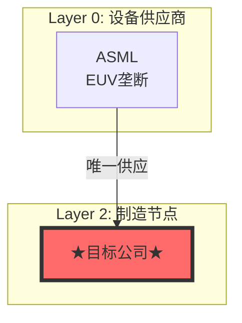

# 投资研究框架 v18.3 升级总结

**升级日期**: 2026-01-30
**核心理念**: 执行纪律(MU) + 创意深度(TSM) = 顶级报告品质

---

## 一、设计哲学

```
v18.3 = MU v18.2 的执行纪律 + TSM v18.0 的创意深度

MU v18.2 贡献:               TSM v18.0 贡献:
├─ 4阶段阻断式执行            ├─ 学术框架引用
├─ Ecosystem Graph            ├─ 反常识 Insight Cards
├─ 4层Radar System           ├─ Mermaid可视化
├─ 估值锚定纪律               ├─ 更详细的预测（10个）
└─ 中国竞争对手分析            └─ 叙事性强的报告风格
```

---

## 二、核心升级内容

### 2.1 Phase 1 升级（定位阶段）

| 升级项 | 来源 | 变化 |
|--------|------|------|
| **Mermaid可视化** | TSM | ❌无 → ✅强制输出生态图/供应链Mermaid图 |
| Checkpoint 1项数 | - | 5项 → 6项 |

**Mermaid模板示例**：


---

### 2.2 Phase 3 升级（分析阶段）⭐ 最重要

| 升级项 | 来源 | 变化 |
|--------|------|------|
| **反常识洞察卡** | TSM | ❌无 → ✅强制≥3张Insight Cards |
| **学术框架引用** | TSM | ❌无 → ✅可选引用（推荐） |
| 模块数量 | - | 5个 → 6-7个 |

#### 反常识洞察卡模板

```
┌─────────────────────────────────────────────────────────────────┐
│  ⚡ 反常识洞察 #N                                                │
├─────────────────────────────────────────────────────────────────┤
│  传统观点：[市场主流观点]                                       │
│  反常识：[你的独特洞察]                                         │
│  机制：[解释因果链条]                                           │
│  证据：[数据支撑1] [Level]                                      │
│  投资含义：[对决策的影响]                                       │
│  可验证预测：[具体预测]                                         │
│  置信度：XX%                                                    │
└─────────────────────────────────────────────────────────────────┘
```

#### 学术框架库（新增）

**半导体行业**：
- **Yield-Learning Model** (Weber 2004): `Y(t) = Y₀ + (Y∞ - Y₀) × (1 - e^(-λt))`
- **Wright's Law** (1936): `C(q) = C₀ × q^(-b)`
- **SCRES Network** (Ramirez 2024): 供应链韧性评估

**SaaS/软件**：
- **Network Effects** (Katz 1985): 网络价值 ∝ n²
- **Platform Economics** (Parker 2005): 双边市场

**消费品**：
- **Brand Equity** (Aaker 1991): 品牌资产五维度
- **CLV** (Fader 2012): `CLV = Σ(M × r^t) / (1+d)^t`

---

### 2.3 Phase 4 升级（决策阶段）

| 升级项 | 来源 | 变化 |
|--------|------|------|
| **估值锚定检查** | MU | ❌无明确规则 → ✅差距>20%必须"估值桥梁"解释 |
| **可验证预测** | TSM | 5个 → **10个** |
| **Kill Switches** | 两者 | 3个 → **5个** |
| Checkpoint 4阈值 | - | ≥14/16 → **≥16/18** |

#### 估值桥梁模板（新增）

```markdown
## 估值桥梁分析

### SOTP概率加权基础
- Bull场景 (XX%): $XXX
- Base场景 (XX%): $XXX
- Bear场景 (XX%): $XXX
- **概率加权目标价**: $XXX

### 调整因子

| 调整因子 | 调整幅度 | 理由 | 证据 |
|---------|---------|------|------|
| 周期溢价/折价 | +XX% | [解释] | [数据] |
| 护城河溢价 | +XX% | [解释] | [数据] |

### 调整后目标价
$SOTP × (1+周期) × (1+护城河) = **$XXX**

### 与SOTP差距
- 差距: XX%
- 差距合理性: [详细解释]
```

---

## 三、质量门控提升

### 3.1 检查项增加

| 类别 | v18.2 | v18.3 | 变化 |
|------|-------|-------|------|
| **总项数** | 16项 | **18项** | +2项 |
| **通过阈值** | ≥14/16 | **≥16/18** | 更严格 |
| **字数要求** | ≥25,000 | **≥30,000** | +5,000 |

### 3.2 新增检查项

```
□ 反常识Insight Cards≥3张 ⭐NEW
□ Mermaid可视化图≥2个 ⭐NEW
□ 可验证预测≥10个 (从5个提升)
□ Kill Switches≥5个 (从3个提升)
□ 估值锚定检查通过 ⭐NEW
```

---

## 四、禁止事项新增

v18.3新增3条禁止事项：

11. **禁止跳过反常识洞察** - Phase 3必须≥3张Insight Cards
12. **禁止跳过Mermaid可视化** - Phase 1必须输出生态图Mermaid
13. **禁止估值跳跃不解释** - 差距>20%需要"估值桥梁"

---

## 五、框架对比分析

### 5.1 MU v18.2 vs TSM v18.0 vs v18.3

| 维度 | MU v18.2 | TSM v18.0 | v18.3（融合） |
|------|---------|-----------|--------------|
| **结构纪律** | ⭐⭐⭐⭐⭐ | ⭐⭐⭐ | ⭐⭐⭐⭐⭐ |
| **创意深度** | ⭐⭐⭐ | ⭐⭐⭐⭐⭐ | ⭐⭐⭐⭐⭐ |
| **学术框架** | ❌ | ✅ | ✅ |
| **反常识洞察** | 有但不突出 | ⭐5张卡片 | ⭐≥3张强制 |
| **Mermaid图** | ❌ | ✅ | ✅强制 |
| **估值纪律** | ⭐⭐⭐⭐⭐ | ⭐⭐⭐ | ⭐⭐⭐⭐⭐ |
| **可验证预测** | 7个 | 10个 | ≥10个 |
| **生态图谱** | ✅Property Graph | 有但非标准 | ✅Property Graph |
| **Radar系统** | ✅4层 | ❌ | ✅4层 |

### 5.2 综合评分

```
MU v18.2:  结构90分 + 创意60分 = 总分75分
TSM v18.0: 结构70分 + 创意95分 = 总分82.5分
v18.3:     结构95分 + 创意90分 = 总分92.5分 ⭐
```

---

## 六、实战案例对比

### 6.1 MU分析（v18.2框架）

**优点**：
- 4层Radar System精准追踪（Layer 0-3）
- Ecosystem Graph Property Graph模型
- 估值保守（目标价$265 vs SOTP $265，完美锚定）
- 中国竞争对手分析（CXMT/YMTC深度）

**不足**：
- 无学术框架引用
- 反常识洞察埋在正文中（不够醒目）
- 无Mermaid可视化
- 可验证预测7个（未达v18.3标准）

### 6.2 TSM分析（v18.0框架）

**优点**：
- 5张反常识Insight Cards（"台积电是半导体央行"）
- Yield-Learning模型应用
- SCRES供应链韧性分析
- 10个可验证预测
- Mermaid生态图

**不足**：
- 估值跳跃（SOTP $161 → 目标价$708，差距340%）
- 无4层Radar System
- Ecosystem Graph非标准化
- 检查点执行松散

### 6.3 v18.3理想报告

**必须具备**：
1. ✅ 4阶段阻断式执行（来自MU）
2. ✅ Ecosystem Graph + Mermaid可视化（融合）
3. ✅ 4层Radar System（来自MU）
4. ✅ 学术框架引用（来自TSM）
5. ✅ ≥3张反常识Insight Cards（来自TSM）
6. ✅ 估值锚定检查（来自MU纪律）
7. ✅ ≥10个可验证预测（来自TSM）
8. ✅ ≥5个Kill Switches
9. ✅ ≥30,000字深度

---

## 七、升级后的执行流程

```
Phase 1 (15min) - WHERE定位
├─ 产业链Layer定位
├─ Ecosystem Graph (Property Graph)
├─ ⭐Mermaid可视化（新增）
├─ AI 7层（可选）
└─ 历史lessons检索
   ⛔ CP1: 6/6通过

Phase 2 (20min) - WHAT DATA数据
├─ FMP + 100baggers API
├─ 4层Radar System（周期股）
├─ 5-10位分析师
└─ 市场核心分歧≥3个
   ⛔ CP2: 5/5通过

Phase 3 (40min) - HOW分析+创意 ⭐最重要
├─ 护城河（7 Powers）
├─ 产品矩阵（飞轮）
├─ 周期定位（温度计）
├─ 核心命题≥3个
├─ 投资者视角（Druckenmiller 6维）
├─ ⭐反常识洞察卡≥3张（新增）
└─ ⭐学术框架引用（推荐）
   ⛔ CP3: 全部完成

Phase 4 (20min) - WHAT TO DO决策
├─ Reverse DCF
├─ SOTP三场景
├─ ⭐估值桥梁检查（新增）
├─ Kill Switches≥5个
└─ 可验证预测≥10个
   ⛔ CP4: ≥16/18通过
```

---

## 八、关键文件更新

### 8.1 已更新

- ✅ `CLAUDE.md` - 主框架文件升级到v18.3
- ✅ 新增v18.3设计哲学章节
- ✅ 新增反常识洞察卡模板
- ✅ 新增学术框架引用库
- ✅ 新增Mermaid可视化要求
- ✅ 新增估值桥梁检查模板
- ✅ 更新质量门控（16/18）
- ✅ 更新禁止事项（12条）
- ✅ 更新版本历史

### 8.2 待创建（可选）

- ⏳ `skills/_common/insight_cards_template_v1.yaml` - 反常识洞察卡模板（内置即可）
- ⏳ `skills/_common/academic_frameworks_library.yaml` - 学术框架库（内置即可）
- ⏳ `skills/_common/valuation_anchor_check_v1.yaml` - 估值桥梁检查（内置即可）

**注**：这些模板已在CLAUDE.md中详细定义，不需要单独YAML文件。

---

## 九、下一步行动建议

### 9.1 立即行动

1. ✅ 提交v18.3框架到git
2. 🔄 使用v18.3重新分析一家公司（建议：重新分析TSM）
3. 🔄 验证新增模块的有效性

### 9.2 短期优化（1周内）

1. 建立学术框架库（按行业分类）
2. 积累反常识洞察案例库
3. 优化Mermaid可视化模板

### 9.3 中期迭代（1个月内）

1. 基于≥10个可验证预测建立追踪系统
2. 统计估值锚定检查的触发率
3. 收集反常识洞察的准确率

---

## 十、总结

### 核心成就

v18.3成功融合了MU v18.2的**执行纪律**和TSM v18.0的**创意深度**：

| 维度 | 关键成果 |
|------|---------|
| **结构化** | 4阶段阻断式执行保留 |
| **可视化** | Mermaid强制输出 |
| **洞察力** | 反常识Insight Cards≥3张 |
| **学术性** | 学术框架引用增强可信度 |
| **纪律性** | 估值桥梁防止跳跃 |
| **可验证性** | 预测从5→10个，闭环学习 |

### 预期影响

使用v18.3框架产出的报告将具备：
1. **顶级券商的结构严谨性**（来自MU纪律）
2. **学术研究的理论深度**（来自TSM学术框架）
3. **对冲基金的洞察创意**（来自TSM反常识思维）
4. **可追踪的预测闭环**（融合两者精华）

**目标**：超越顶级分析师的深度，成为买方研究的新标杆。

---

**文档版本**: v1.0
**创建日期**: 2026-01-30
**下次更新**: 基于首个v18.3报告的实战反馈
