# Ch01: 公司重新画像 — AI时代的Alphabet是什么公司?

> **关联CQ**: CQ2(估值隐含假设), CQ3(CapEx回报), CQ5(Gemini竞争力), CQ8(承重墙)
> **数据截止**: 2026-02-12 | **框架**: v9.0 扬长避短 | **股价**: $310.96 [硬数据: Yahoo Finance 2026-02-11收盘]

---

## 1.1 身份重新定义: Alphabet不是搜索公司

Alphabet在2026年初的身份定义需要被彻底重写。

市场仍然习惯性地将Alphabet称为"搜索公司"或"广告公司"。这个标签在2015年甚至2020年还算准确——当时搜索广告贡献了超过70%的收入。但在FY2025，这家公司的真实面貌已经发生结构性变化 [合理推断: 基于FY2025分部收入占比变化趋势]:

**Alphabet是全球最大的AI基础设施运营商。**

这个重新定义基于三个硬事实:

1. **CapEx规模**: FY2025资本支出$91.4B [硬数据: Alphabet FY2025 10-K]，FY2026指引$175-185B [硬数据: Alphabet Q4 2025 earnings call, 2026-02-04]。这意味着Alphabet在两年内将部署超过$265B的物理基础设施——超过了整个美国电信行业2025年的资本支出总和 [合理推断: 美国电信行业年度CapEx约$80-90B]。

2. **收入结构变迁**: Google Cloud FY2025收入约$58.7B(Q4年化$70.8B) [硬数据: Alphabet Q4 2025 earnings release]，订阅/平台/设备约$49B [硬数据: Alphabet FY2025 10-K季度累加]，YouTube超$60B [硬数据: Alphabet Q4 2025 earnings release]。搜索广告的收入占比已从FY2020的~71%降至FY2025的~56% [合理推断: Search ~$224.5B / Total $402.9B]。

3. **组织重心**: Google DeepMind(CEO: Demis Hassabis，2024年诺贝尔化学奖得主)直接向Pichai汇报 [硬数据: Alphabet Proxy Statement 2025]，AI研究已从"实验室项目"升格为公司核心。TPU v6 Trillium已部署，TPU v7 Ironwood的9,216芯片集群达到42.5 ExaFLOPS——这不是搜索公司的配置 [硬数据: Google Cloud Blog, 2025]。

**一句话画像**: Alphabet是一家以搜索广告为现金引擎、以AI基础设施为战略支柱、以Cloud+Gemini为增长曲线、以Waymo为长期期权的**多维AI平台集团**。

[主观判断: "AI基础设施运营商"的定义基于CapEx规模和战略方向，非Alphabet官方表述]

---

## 1.2 公司概况

| 维度 | 详情 |
|------|------|
| **公司名称** | Alphabet Inc. (GOOGL/GOOG) |
| **创立时间** | 1998年9月4日(Google); 2015年10月2日(Alphabet重组) |
| **CEO** | Sundar Pichai (2015年起任Google CEO, 2019年起兼任Alphabet CEO) |
| **CFO** | Anat Ashkenazi (2024年7月起, 前Eli Lilly CFO) |
| **President/CIO** | Ruth Porat (2023年9月起, 监管Other Bets与基础设施投资) |
| **总部** | Mountain View, California (Googleplex) |
| **员工数** | 190,820人 (截至2025-12-31, YoY +4.1%) [硬数据: Alphabet FY2025 10-K] |
| **市值** | $3,761.7B [硬数据: Yahoo Finance 2026-02-11] |
| **股价** | $310.96 [硬数据: Yahoo Finance 2026-02-11收盘] |
| **P/E (TTM)** | 30.64x [硬数据: FMP quote 2026-02-11] |
| **Forward P/E** | 23.29x [硬数据: FMP quote 2026-02-11] |
| **FY2025收入** | $402.96B (+15.1% YoY) [硬数据: Alphabet FY2025 10-K] |
| **FY2025净利润** | $132.17B (+32.0% YoY) [硬数据: Alphabet FY2025 10-K] |
| **FY2025 EPS** | $10.81 (+34.5% YoY) [硬数据: Alphabet FY2025 10-K] |
| **收入/员工** | $2,112K (+10.6% YoY) [硬数据: FMP employee data + FY2025 revenue] |
| **Beta** | 1.086 [硬数据: FMP profile 2026-02-11] |
| **52周范围** | $140.53 — $349.00 [硬数据: FMP profile 2026-02-11] |
| **信用评级** | Aa2 (Moody's) / AA+ (S&P) [硬数据: Moody's/S&P latest rating] |
| **核心使命** | "Organize the world's information" → 演进为 "Make AI helpful for everyone" |

**关键数字的投资含义**: $402.96B收入与$132.17B净利润之间的差距揭示了32.8%的净利率 [硬数据: FMP ratios FY2025]——这意味着Alphabet每创造$1收入就有$0.33变成利润。但$91.4B的CapEx [硬数据: Alphabet FY2025 10-K] 吞噬了大量现金，使FCF仅$73.3B [硬数据: Alphabet FY2025 10-K]，FCF Yield仅1.83% [硬数据: FMP TTM metrics]。这是理解当前Alphabet的核心张力: **利润表上的赢家，现金流表上的重资产转型者**。[合理推断: 利润率与FCF Yield分歧的根本原因是CapEx加速]

---

## 1.3 六大业务板块画像

### 组织架构全景

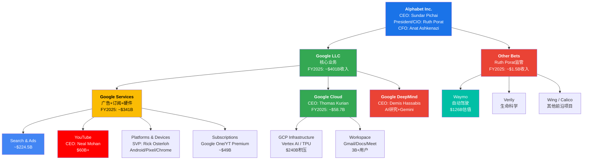
```mermaid
graph TB
    ALPHA["<b>Alphabet Inc.</b><br/>CEO: Sundar Pichai<br/>President/CIO: Ruth Porat<br/>CFO: Anat Ashkenazi"]

    ALPHA --> GOOGLE["<b>Google LLC</b><br/>核心业务<br/>FY2025: ~$401B收入"]
    ALPHA --> OB["<b>Other Bets</b><br/>Ruth Porat监管<br/>FY2025: ~$1.5B收入"]

    GOOGLE --> GS["<b>Google Services</b><br/>广告+订阅+硬件<br/>FY2025: ~$341B"]
    GOOGLE --> GCLOUD["<b>Google Cloud</b><br/>CEO: Thomas Kurian<br/>FY2025: ~$58.7B"]
    GOOGLE --> GDM["<b>Google DeepMind</b><br/>CEO: Demis Hassabis<br/>AI研究+Gemini"]

    GS --> SEARCH["Search & Ads<br/>~$224.5B"]
    GS --> YT["YouTube<br/>CEO: Neal Mohan<br/>$60B+"]
    GS --> PD["Platforms & Devices<br/>SVP: Rick Osterloh<br/>Android/Pixel/Chrome"]
    GS --> GSUB["Subscriptions<br/>Google One/YT Premium<br/>~$49B"]

    GCLOUD --> GCP["GCP Infrastructure<br/>Vertex AI / TPU<br/>$240B积压"]
    GCLOUD --> GWS["Workspace<br/>Gmail/Docs/Meet<br/>3B+用户"]

    OB --> WAY["Waymo<br/>自动驾驶<br/>$126B估值"]
    OB --> VERI["Verily<br/>生命科学"]
    OB --> WING["Wing / Calico<br/>其他前沿项目"]

    style ALPHA fill:#1a73e8,color:#fff
    style GOOGLE fill:#34a853,color:#fff
    style OB fill:#ea4335,color:#fff
    style GS fill:#fbbc04,color:#000
    style GCLOUD fill:#34a853,color:#fff
    style GDM fill:#ea4335,color:#fff
    style SEARCH fill:#4285f4,color:#fff
    style YT fill:#ff0000,color:#fff
    style WAY fill:#00bfa5,color:#fff
```

### 收入构成全景

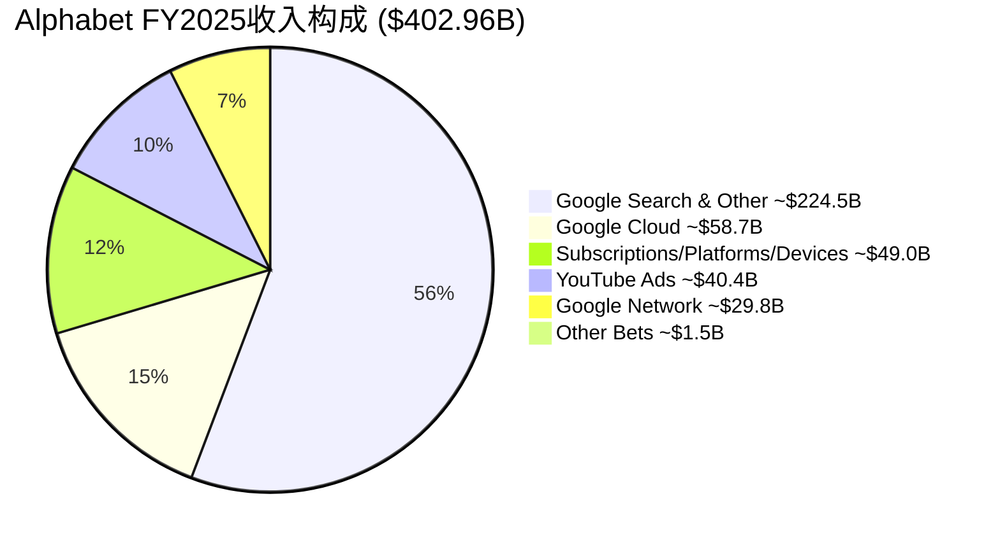
```mermaid
pie title Alphabet FY2025收入构成 ($402.96B)
    "Google Search & Other ~$224.5B" : 55.7
    "Google Cloud ~$58.7B" : 14.6
    "Subscriptions/Platforms/Devices ~$49.0B" : 12.2
    "YouTube Ads ~$40.4B" : 10.0
    "Google Network ~$29.8B" : 7.4
    "Other Bets ~$1.5B" : 0.4
```

### 板块详细画像

#### (1) Google Services — 搜索+广告帝国 (~$341B, 占总收入85%)

Google Services是Alphabet的现金引擎，包含Search、YouTube、Android、Chrome、Subscriptions、Pixel硬件等全部消费者和广告产品。FY2025收入约$341B [合理推断: Total $402.96B - Cloud $58.7B - Other Bets $1.5B]。

| 子板块 | FY2025收入(估) | Q4 2025 YoY | 战略定位 | AI相关性 |
|--------|---------------|-------------|---------|---------|
| Search & Other | ~$224.5B | +17% | 现金牛+AI再造 | AI Overviews重塑搜索体验 |
| YouTube Ads | ~$40.4B | +9% | 第二广告引擎 | Shorts AI生成+AI推荐 |
| Subscriptions/Platforms/Devices | ~$49.0B | +17% | 订阅增长曲线 | Google One AI Premium |
| Google Network | ~$29.8B | 下降趋势 | 商品化收缩中 | AdSense/AdX自动化 |

[硬数据: Alphabet Q4 2025 earnings release + 季度累加; Q4 YoY来自Alphabet财报]

**Search ($224.5B)**: 全球搜索市场份额89.57% [硬数据: StatCounter Jul 2025]，Q4 2025搜索收入$63.07B(+17% YoY) [硬数据: Alphabet Q4 2025 earnings release]——这是连续四个季度增速递增(Q1 +10%, Q2 +12%, Q3 +15%, Q4 +17%) [硬数据: Alphabet Q1-Q4 2025 earnings releases]。AI Overviews覆盖约16%的查询 [硬数据: Seer Interactive Nov 2025数据]，Pichai在Q4电话会上称这是"搜索使用量最高的季度" [硬数据: Alphabet Q4 2025 earnings call]。

**YouTube ($60B+合并)**: 广告+订阅合并收入首次突破$60B，超过Netflix FY2025收入$45.18B [硬数据: Alphabet Q4 2025 earnings release; Netflix FY2025 10-K]。Q4广告收入约$12.6B [合理推断: 基于Total YouTube - Subscriptions分摊]。YouTube正从纯广告平台转型为全频谱娱乐平台: YouTube TV(有线替代)、Music(Spotify竞品)、Shorts(TikTok竞品)、Premium(无广告订阅)。

**Subscriptions/Platforms/Devices (~$49B)**: 涵盖Google One(150M+订户)、YouTube Premium/TV/Music、Google Play、Pixel、Nest、Fitbit。Q4收入$13.58B(+17% YoY) [硬数据: Alphabet Q4 2025 earnings release]。Google One AI Premium($19.99/月)是增长亮点——订户从2024年初的100M增至2025年中的150M(+50%) [硬数据: 9to5Google May 2025]。

#### (2) Google Cloud — AI驱动的第二增长引擎 (~$58.7B, 占总收入14.6%)

| 指标 | FY2025 | FY2024 | 变化 |
|------|--------|--------|------|
| 收入 | ~$58.7B | $43.2B | +36% |
| Q4收入 | $17.7B | $12.0B | +48% |
| Q4年化 | $70.8B | — | — |
| 积压订单 | $240B | ~$110B | >2x |
| 市场份额 | 13% | ~11% | +2pp |

[硬数据: Alphabet Q4 2025 earnings release; 积压订单来自Q4 2025 earnings call; 市场份额来自Synergy Research Q3 2025]

Google Cloud是Alphabet增速最快的分部。Q4 2025收入$17.7B(+48% YoY)是过去4年以上最高增速 [硬数据: Alphabet Q4 2025 earnings release]。Cloud积压订单从约$110B飙升至$240B(+55% QoQ, >2x YoY) [硬数据: Alphabet Q4 2025 earnings call]。这意味着未来3-5年的收入可见性极高。

**AI是增长核心**: GenAI产品收入增长>200% YoY [硬数据: TrendForce/CNBC Feb 2026]。Thomas Kurian从2019年接管Cloud以来，将其从持续亏损业务转变为Q4营业利润率约17%的利润贡献者 [合理推断: 基于Cloud segment operating income / revenue比率趋势]。

**竞争格局**: AWS(29%份额) > Azure(20%) > Google Cloud(13%) [硬数据: Synergy Research Q3 2025]。增速排序: Google Cloud(48%) > Azure(38%) > AWS(17.5%) [硬数据: 各公司Q4 2025/Q2 FY2026 earnings]。Google Cloud在增速上已超越Azure，正在缩小与AWS的份额差距。

#### (3) Google DeepMind — AI研究引擎 (不单独披露收入)

DeepMind是Alphabet的AI研究核心，2023年与Google Brain合并后由诺贝尔奖得主Demis Hassabis统一领导 [硬数据: Alphabet press release 2023]。DeepMind不直接产生收入，但其技术产出渗透了Alphabet的每个产品:

- **Gemini模型系列**: Gemini 3(2025年11月发布)在MMMU-Pro(81%)、Video-MMMU(87.6%)等基准上达到最先进水平 [硬数据: Google Blog Nov 2025]
- **Gemini App**: 750M MAU(Q4 2025) [硬数据: TechCrunch Feb 4, 2026]，从年初~450M增长66.7%
- **AI chatbot市场份额**: Web流量份额18.2%(一年前5.4%，增长3.4倍) [硬数据: Similarweb via Vertu Feb 2026]
- **效率突破**: Gemini服务单元成本在2025年降低78% [硬数据: Alphabet Q4 2025 earnings call]

**AI战略定位**: 与OpenAI的"独立App"模式不同，Google采用"嵌入式AI"策略——将Gemini嵌入Search、Android、Chrome、Workspace、Cloud等现有分发渠道 [合理推断: 基于产品集成方式的战略对比]。这是一种低风险高效率的策略: 利用2B+ Android用户 [硬数据: Google I/O历年公开数据] 的存量分发优势，不需要用户主动下载新App。

#### (4) Waymo — 自动驾驶长期期权 (Pre-revenue, $126B估值)

Waymo刚完成$16B融资(2026年2月)，估值$126B(较前一轮$45B增长180%) [硬数据: TechCrunch Feb 2, 2026]。

- **运营规模**: 2,500+车辆，6个美国城市，每周40万+次出行 [硬数据: Waymo官方博客/TechCrunch Feb 2026]
- **扩张计划**: 2026年目标扩展至20+城市(含东京、伦敦) [硬数据: Waymo press release 2026]
- **年化收入**: 不足$1B [合理推断: 基于每周40万次出行 x ~$20平均票价的粗略估算]
- **战略价值**: Waymo是全球L4自动驾驶商业化最领先的玩家，但$126B估值隐含的$10B+年收入预期与当前不足$1B的现实之间存在巨大鸿沟 [合理推断: 126x revenue implied = 高增长预期]

#### (5) Verily — 生命科学 (Other Bets组成部分)

Verily是Alphabet的健康科技子公司，收入包含在Other Bets分部中。Other Bets FY2025总收入约$1.5B(Q4 $370M, -7.5% YoY) [硬数据: Alphabet Q4 2025 earnings release]。Verily的具体收入不单独披露，但整个Other Bets的亏损规模持续收窄。

#### (6) Other Bets — 前沿探索 (FY2025: ~$1.5B收入)

Other Bets包含Waymo、Verily、Wing(无人机配送)、Calico(长寿研究)、GV/CapitalG(风投)等。FY2025收入约$1.5B [硬数据: Alphabet FY2025 10-K]，营业亏损持续但规模可控。Ruth Porat自2023年转任President/CIO后直接监管Other Bets和$175B基础设施投资 [硬数据: Alphabet Proxy Statement 2025]。

---

## 1.4 业务板块增长矩阵

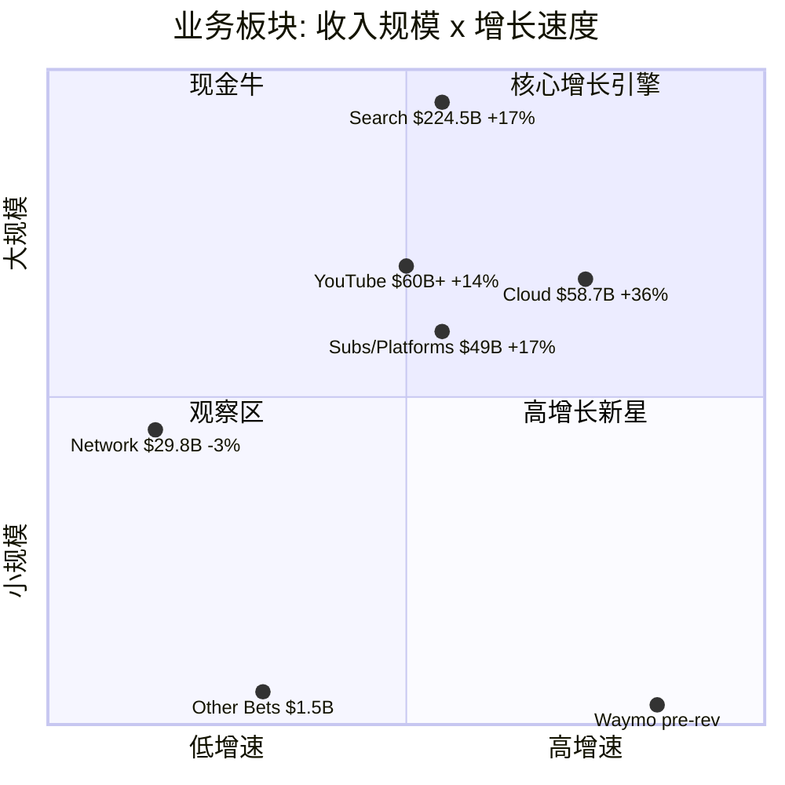
```mermaid
quadrantChart
    title 业务板块: 收入规模 x 增长速度
    x-axis "低增速" --> "高增速"
    y-axis "小规模" --> "大规模"
    quadrant-1 "核心增长引擎"
    quadrant-2 "现金牛"
    quadrant-3 "观察区"
    quadrant-4 "高增长新星"
    "Search $224.5B +17%": [0.55, 0.95]
    "YouTube $60B+ +14%": [0.50, 0.70]
    "Cloud $58.7B +36%": [0.75, 0.68]
    "Subs/Platforms $49B +17%": [0.55, 0.60]
    "Network $29.8B -3%": [0.15, 0.45]
    "Other Bets $1.5B": [0.30, 0.05]
    "Waymo pre-rev": [0.85, 0.03]
```

---

## 1.5 Sundar Pichai领导风格与AI战略转型

Sundar Pichai的领导风格一直是市场争论的焦点。批评者称他是"维护者而非颠覆者" [硬数据: NYT 2021, 15名Google前现任高管访谈]。支持者指出，在他任内Google Search从$52B增长至$224.5B(4.3倍)，Cloud从零增长至$58.7B [硬数据: Alphabet历年10-K]。

**2022-2025年的AI战略转型叙事**:

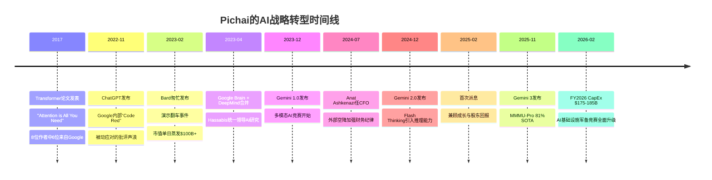
```mermaid
timeline
    title Pichai的AI战略转型时间线
    2017 : Transformer论文发表
         : "Attention is All You Need"
         : 8位作者中6位来自Google
    2022-11 : ChatGPT发布
           : Google内部"Code Red"
           : 被动应对的批评声浪
    2023-02 : Bard匆忙发布
           : 演示翻车事件
           : 市值单日蒸发$100B+
    2023-04 : Google Brain + DeepMind合并
           : Hassabis统一领导AI研究
    2023-12 : Gemini 1.0发布
           : 多模态AI竞赛开始
    2024-07 : Anat Ashkenazi任CFO
           : 外部空降加强财务纪律
    2024-12 : Gemini 2.0发布
           : Flash Thinking引入推理能力
    2025-02 : 首次派息
           : 兼顾成长与股东回报
    2025-11 : Gemini 3发布
           : MMMU-Pro 81% SOTA
    2026-02 : FY2026 CapEx $175-185B
           : AI基础设施军备竞赛全面升级
```

**转型叙事的核心矛盾**: Pichai的渐进主义在"守业"时是优势——管理一个10个$2B+产品的复杂组合而不使其崩溃。但在AI时代的"攻城"阶段，这种风格的风险是"每个战场都参与，但没有一个战场决定性地赢" [主观判断: 基于Pichai领导风格与AI竞争节奏的匹配度评估]。

**组织效率信号**:
- 员工190,820人(+4.1% YoY) [硬数据: Alphabet FY2025 10-K]，相比FY2022的190,234人几乎持平——中间经历了FY2023裁员12,000人(降至182,502人) [硬数据: Alphabet FY2023 10-K]后的有序回补
- 收入/员工$2,112K(+10.6% YoY) [硬数据: FMP employee count + FY2025 revenue]，从FY2022的$1,487K持续提升，3年增长42% [硬数据: FMP historical employee data]
- 2025年裁减35%的小团队管理者角色 [硬数据: NRIPage Aug 2025]——这是对官僚化的直接回应

---

## 1.6 AI产品生态图

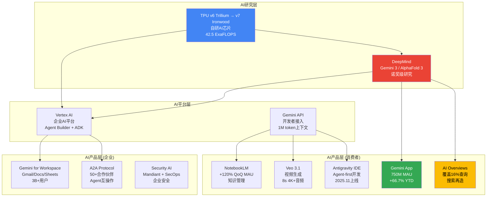
```mermaid
graph TB
    subgraph "AI研究层"
        DM["DeepMind<br/>Gemini 3 / AlphaFold 3<br/>诺奖级研究"]
        TPU["TPU v6 Trillium → v7 Ironwood<br/>自研AI芯片<br/>42.5 ExaFLOPS"]
    end

    subgraph "AI平台层"
        VA["Vertex AI<br/>企业AI平台<br/>Agent Builder + ADK"]
        GAI["Gemini API<br/>开发者接入<br/>1M token上下文"]
    end

    subgraph "AI产品层 (消费者)"
        APP["Gemini App<br/>750M MAU<br/>+66.7% YTD"]
        AIO["AI Overviews<br/>覆盖16%查询<br/>搜索再造"]
        NLM["NotebookLM<br/>+120% QoQ MAU<br/>知识管理"]
        VEO["Veo 3.1<br/>视频生成<br/>8s 4K+音频"]
        AG["Antigravity IDE<br/>Agent-first开发<br/>2025.11上线"]
    end

    subgraph "AI产品层 (企业)"
        GFW["Gemini for Workspace<br/>Gmail/Docs/Sheets<br/>3B+用户"]
        A2A["A2A Protocol<br/>50+合作伙伴<br/>Agent互操作"]
        SEC["Security AI<br/>Mandiant + SecOps<br/>企业安全"]
    end

    DM --> VA
    DM --> APP
    DM --> AIO
    TPU --> VA
    TPU --> DM
    VA --> GFW
    VA --> A2A
    GAI --> NLM
    GAI --> VEO
    GAI --> AG

    style DM fill:#ea4335,color:#fff
    style TPU fill:#4285f4,color:#fff
    style APP fill:#34a853,color:#fff
    style AIO fill:#fbbc04,color:#000
```

---

## 1.7 战略定位图: Alphabet在AI时代的位置

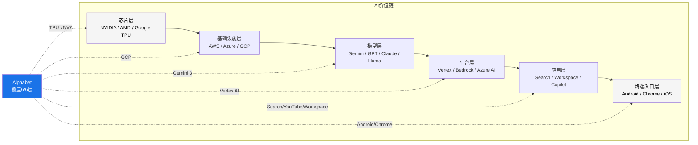
```mermaid
graph LR
    subgraph "AI价值链"
        L1["芯片层<br/>NVIDIA / AMD / Google TPU"]
        L2["基础设施层<br/>AWS / Azure / GCP"]
        L3["模型层<br/>Gemini / GPT / Claude / Llama"]
        L4["平台层<br/>Vertex / Bedrock / Azure AI"]
        L5["应用层<br/>Search / Workspace / Copilot"]
        L6["终端入口层<br/>Android / Chrome / iOS"]
    end

    L1 --> L2 --> L3 --> L4 --> L5 --> L6

    GOOGL["Alphabet<br/>覆盖6/6层"]

    GOOGL -.->|"TPU v6/v7"| L1
    GOOGL -.->|"GCP"| L2
    GOOGL -.->|"Gemini 3"| L3
    GOOGL -.->|"Vertex AI"| L4
    GOOGL -.->|"Search/YouTube/Workspace"| L5
    GOOGL -.->|"Android/Chrome"| L6

    style GOOGL fill:#1a73e8,color:#fff
    style L1 fill:#f5f5f5,color:#000
    style L6 fill:#f5f5f5,color:#000
```

**Alphabet是唯一在AI价值链全部六层都有重大布局的公司** [合理推断: 基于各公司产品线的逐层对比]:
- **NVIDIA**: 芯片层主导，但不涉及应用/入口层
- **Microsoft**: 基础设施→平台→应用强，但芯片层(Maia)和终端入口层(Edge/Windows)较弱
- **Meta**: 模型层(Llama)+应用层(Instagram/WhatsApp)强，基础设施和入口层弱
- **Amazon**: 基础设施(AWS)+平台(Bedrock)强，模型层和入口层弱

Alphabet的"全栈覆盖"既是优势(任何一层的突破都能带动其他层)，也是风险(资源分散，每一层可能都不是最强) [主观判断: 全栈战略的双刃剑效应评估]。

---

## 1.8 本章核心发现

| # | 发现 | CQ关联 | 标注 |
|---|------|--------|------|
| 1 | Alphabet已从"搜索公司"转型为"AI基础设施运营商"，FY2026 CapEx $175-185B超过整个美国电信行业 | CQ3, CQ8 | [合理推断: 基于CapEx规模和战略方向] |
| 2 | 搜索广告收入占比从~71%(FY2020)降至~56%(FY2025)，但绝对值仍在增长(+17% Q4) | CQ2, CQ8 | [硬数据: Alphabet FY2020/FY2025 10-K] |
| 3 | Cloud积压$240B提供3-5年收入可见性，增速48%超越Azure | CQ3, CQ4 | [硬数据: Alphabet Q4 2025 earnings call] |
| 4 | Gemini 750M MAU，AI chatbot份额从5.4%→18.2%(一年3.4倍增长) | CQ5 | [硬数据: TechCrunch/Similarweb 2026] |
| 5 | 全栈AI布局覆盖6/6价值链层，但资源分散风险存在 | CQ5, CQ8 | [主观判断: 战略分析] |
| 6 | Waymo估值$126B但年化收入<$1B，期权vs烧钱的判断仍悬而未决 | CQ8 | [硬数据: TechCrunch Feb 2026] |
| 7 | 收入/员工3年增长42%至$2.11M，组织效率持续改善 | CQ2 | [硬数据: FMP employee + revenue data] |

---

# Ch02: FY2025财务全景 + 八季度趋势

> **关联CQ**: CQ2(估值合理性), CQ3(CapEx回报), CQ4(Cloud利润率), CQ8(承重墙)
> **数据截止**: 2026-02-12 | **数据来源**: FMP + Alphabet 10-K/10-Q + Earnings Releases

---

## 2.1 四年财务总览 (FY2022-FY2025)

### 2.1.1 收入与利润矩阵

| 指标 | FY2025 | FY2024 | FY2023 | FY2022 | 3年CAGR |
|------|--------|--------|--------|--------|---------|
| **收入** | $402.96B | $350.02B | $307.39B | $282.84B | 12.6% |
| **毛利** | $240.43B | $203.71B | $174.06B | $156.63B | 15.3% |
| **营业利润** | $129.17B | $112.39B | $84.29B | $74.84B | 20.0% |
| **净利润** | $132.17B | $100.12B | $73.80B | $59.97B | 30.1% |
| **EPS (diluted)** | $10.81 | $8.04 | $5.80 | $4.56 | 33.4% |
| **EBITDA** | $179.96B | $135.39B | $97.97B | $85.16B | 28.3% |
| **D&A** | $21.14B | $15.31B | $11.95B | $13.48B | 16.2% |

[硬数据: FMP income statement annual FY2022-FY2025; 3年CAGR为计算值]

**核心观察**: 净利润3年CAGR(30.1%)是收入CAGR(12.6%)的2.4倍 [合理推断: 30.1/12.6=2.4x倍数计算]——这意味着Alphabet在过去三年实现了显著的运营杠杆释放。但这种杠杆能否持续是CQ8的核心承重墙之一。

### 2.1.2 利润率矩阵

| 利润率 | FY2025 | FY2024 | FY2023 | FY2022 | 3年变化 |
|--------|--------|--------|--------|--------|---------|
| **毛利率** | 59.7% | 58.2% | 56.6% | 55.4% | +430bps |
| **营业利润率** | 32.1% | 32.1% | 27.4% | 26.5% | +560bps |
| **净利率** | 32.8% | 28.6% | 24.0% | 21.2% | +1160bps |
| **EBITDA利润率** | 44.7% | 38.7% | 31.9% | 30.1% | +1460bps |
| **R&D/Revenue** | 15.2% | 14.1% | 14.8% | 14.0% | +120bps |
| **SG&A/Revenue** | 12.5% | 12.0% | 14.4% | 15.0% | -250bps |
| **SBC/Revenue** | 6.2% | 6.5% | 7.3% | 6.8% | -60bps |

[硬数据: FMP ratios annual FY2022-FY2025]

**利润率故事的三个层次**:

1. **毛利率(+430bps)**: 从55.4%提升至59.7%，核心驱动是Cloud从亏损转为盈利+TPU效率提升+裁员后人力成本优化 [合理推断: 基于Cloud扭亏时间线与毛利率改善的时序匹配]

2. **营业利润率(+560bps但FY2024-2025持平)**: 从26.5%提升至32.1%，FY2024-2025连续两年32.1% [硬数据: FMP ratios]。持平的原因: R&D支出从14.0%升至15.2%(+120bps)抵消了SG&A从15.0%降至12.5%(-250bps)的改善 [硬数据: FMP ratios FY2022/FY2025]

3. **净利率(+1160bps)**: 从21.2%飙升至32.8%，净利率增幅远超营业利润率增幅。差异来源: FY2025其他收入$29.66B(含投资收益和公允价值变动) [硬数据: FMP income statement FY2025]，远超FY2022的-$3.51B [硬数据: FMP income statement FY2022]。**这意味着净利率的改善部分是不可持续的非经常性因素** [合理推断: 其他收入的波动性使净利率不应作为可持续利润率基准]

### 2.1.3 利润率趋势图

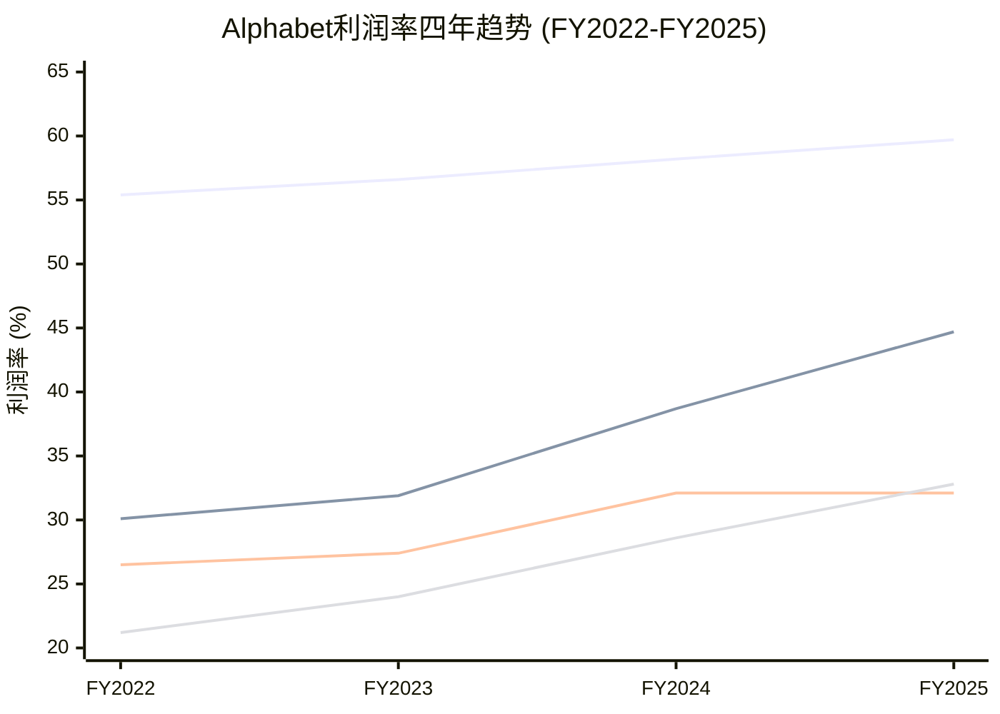
```mermaid
xychart-beta
    title "Alphabet利润率四年趋势 (FY2022-FY2025)"
    x-axis ["FY2022", "FY2023", "FY2024", "FY2025"]
    y-axis "利润率 (%)" 20 --> 65
    line "毛利率" [55.4, 56.6, 58.2, 59.7]
    line "EBITDA利润率" [30.1, 31.9, 38.7, 44.7]
    line "营业利润率" [26.5, 27.4, 32.1, 32.1]
    line "净利率" [21.2, 24.0, 28.6, 32.8]
```

### 2.1.4 现金流矩阵

| 指标 | FY2025 | FY2024 | FY2023 | FY2022 | 3年CAGR |
|------|--------|--------|--------|--------|---------|
| **OCF** | $164.71B | $125.30B | $101.75B | $91.50B | 21.7% |
| **CapEx** | -$91.45B | -$52.54B | -$32.25B | -$31.49B | 42.7% |
| **FCF** | $73.27B | $72.76B | $69.50B | $60.01B | 6.9% |
| **OCF利润率** | 40.9% | 35.8% | 33.1% | 32.3% | +860bps |
| **FCF利润率** | 18.2% | 20.8% | 22.6% | 21.2% | -300bps |
| **CapEx/Revenue** | 22.7% | 15.0% | 10.5% | 11.1% | +1160bps |
| **CapEx/D&A** | 4.33x | 3.43x | 2.70x | 1.98x | — |

[硬数据: FMP cash flow statement annual FY2022-FY2025]

**这张表揭示了Alphabet当前最核心的财务矛盾**: OCF 3年CAGR 21.7%是健康的，但CapEx 3年CAGR 42.7%是OCF的近两倍 [硬数据: FMP cash flow FY2022-FY2025]。结果是FCF 3年CAGR仅6.9%——在收入增长12.6%、净利润增长30.1%的背景下，FCF几乎原地踏步 [合理推断: FCF CAGR远低于净利润CAGR说明CapEx吸收了全部增量现金]。

### 2.1.5 关键比率矩阵

| 比率 | FY2025 | FY2024 | FY2023 | FY2022 | 趋势 |
|------|--------|--------|--------|--------|------|
| **ROE** | 31.8% | 30.8% | 26.0% | 23.4% | 持续提升 |
| **ROA** | 22.2% | 22.2% | 18.3% | 16.4% | 持续提升 |
| **ROIC** | 21.8% | 25.8% | 22.4% | 21.1% | FY2025骤降 |
| **D/E** | 0.17x | 0.08x | 0.10x | 0.12x | 杠杆上升 |
| **Current Ratio** | 2.01x | 1.84x | 2.10x | 2.38x | 逐步下降 |
| **P/E** | 28.69x | 23.29x | 23.91x | 19.22x | 估值抬升 |
| **P/FCF** | 51.76x | 32.05x | 25.39x | 19.21x | 急剧抬升 |
| **FCF Yield** | 1.93% | 3.12% | 3.94% | 5.21% | 持续下降 |
| **EV/EBITDA** | 21.30x | 17.24x | 18.04x | 13.63x | 抬升 |

[硬数据: FMP ratios annual FY2022-FY2025]

**ROIC下降是关键警示信号**: ROE从23.4%提升至31.8%的同时，ROIC从21.1%升至FY2024的25.8%后骤降至FY2025的21.8%(-4.0pp) [硬数据: FMP ratios FY2024/FY2025]。ROE和ROIC的分歧意味着**投入资本膨胀(因CapEx)正在侵蚀资本回报效率** [合理推断: ROIC = NOPAT/Invested Capital，投入资本增速超过NOPAT增速]。

**P/FCF 51.76x的含义**: 投资者为每$1自由现金流支付$51.76 [硬数据: FMP ratios FY2025]——这在Mega-cap科技公司中处于极高水平，反映的不是盈利能力问题(P/E仅28.69x)，而是CapEx对FCF的结构性压缩。

---

## 2.2 八季度收入趋势 (Q1 2024 — Q4 2025)

### 2.2.1 总收入八季度走势

| 季度 | 总收入 | YoY | QoQ | 毛利率 | 营业利润率 | 净利率 | EPS |
|------|--------|-----|-----|--------|-----------|--------|-----|
| Q1 2024 | $80.54B | +15.4% | — | 58.1% | 31.6% | 29.4% | $1.89 |
| Q2 2024 | $84.74B | +13.6% | +5.2% | 58.1% | 32.4% | 27.9% | $1.89 |
| Q3 2024 | $88.27B | +15.1% | +4.2% | 58.7% | 32.3% | 29.8% | $2.12 |
| Q4 2024 | $96.47B | +11.8% | +9.3% | 57.9% | 32.1% | 27.5% | $2.15 |
| Q1 2025 | $90.23B | +12.0% | -6.5% | 59.7% | 33.9% | 38.3% | $2.81 |
| Q2 2025 | $96.43B | +13.8% | +6.9% | 59.5% | 32.4% | 29.2% | $2.31 |
| Q3 2025 | $102.35B | +15.9% | +6.1% | 59.6% | 30.5% | 34.2% | $2.87 |
| Q4 2025 | $113.90B | +18.1% | +11.3% | 59.8% | 31.6% | 30.2% | $2.82 |

[硬数据: FMP quarterly income statement Q1 2024 - Q4 2025]

### 收入趋势图

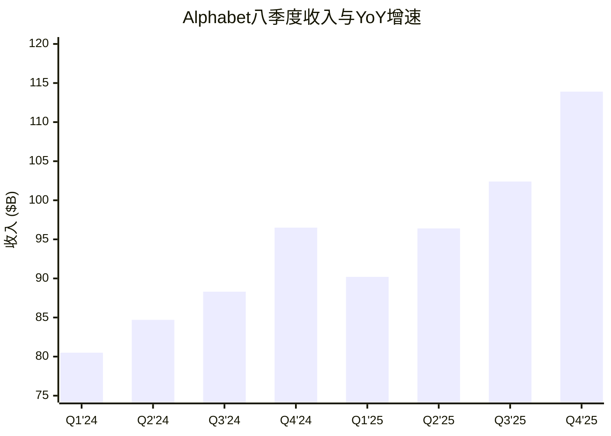
```mermaid
xychart-beta
    title "Alphabet八季度收入与YoY增速"
    x-axis ["Q1'24", "Q2'24", "Q3'24", "Q4'24", "Q1'25", "Q2'25", "Q3'25", "Q4'25"]
    y-axis "收入 ($B)" 75 --> 120
    bar [80.5, 84.7, 88.3, 96.5, 90.2, 96.4, 102.4, 113.9]
```

**核心发现: FY2025四个季度收入YoY增速逐季递增** — Q1 +12.0% → Q2 +13.8% → Q3 +15.9% → Q4 +18.1% [硬数据: FMP quarterly data]。这是罕见的增速加速模式，对于一家$400B+收入的公司尤为突出。

**季节性模式**: Q4是传统旺季(节日广告)，Q1是季节性低点。Q4 2025的$113.9B创历史新高，环比Q3增长$11.55B(+11.3%) [硬数据: FMP quarterly data]。Q1到Q4的季节性价差从FY2024的$15.93B($96.47B - $80.54B)扩大至FY2025的$23.67B($113.90B - $90.23B) [合理推断: 季节性价差扩大反映Q4增长动力增强]。

### 2.2.2 分部收入八季度分解

基于Alphabet Q4 2025 earnings release的分部数据:

| 分部 | Q4 2025 | Q4 YoY | FY2025(估) | FY2025 YoY | 增量贡献 |
|------|---------|--------|-----------|-----------|---------|
| Search & Other | $63.07B | +17% | ~$224.5B | +13% | ~$26.4B |
| YouTube Ads | ~$12.6B | +9% | ~$40.4B | +12% | ~$4.2B |
| Google Network | — | 下降 | ~$29.8B | -2% | -$0.6B |
| Subs/Platforms/Devices | $13.58B | +17% | ~$49.0B | +22% | ~$8.7B |
| Google Cloud | $17.7B | +48% | ~$58.7B | +36% | ~$15.5B |
| Other Bets | $0.37B | -7.5% | ~$1.5B | -12% | -$0.2B |
| **Total** | **$113.90B** | **+18.1%** | **$402.96B** | **+15.1%** | **+$52.94B** |

[硬数据: Alphabet Q4 2025 earnings release; FY2025各分部收入为Q1-Q4季度累加; FY2025 YoY为对比FY2024]

**Search增速加速的特异性分析**: 搜索收入从Q1 +10%加速至Q4 +17% [硬数据: Alphabet Q1-Q4 2025 earnings releases]。在AI Overviews将有机CTR降低61% [硬数据: Seer Interactive Sep 2025] 的背景下，搜索收入仍在加速增长——这得益于:
- CPC上涨12.9% YoY [硬数据: WordStream/LocalIQ 2025]
- AI Overviews中广告展示比例从2025年3月的5.17%飙升至10月的25.56%(+394%) [硬数据: Seer Interactive 2025]
- Pichai称Q4是"搜索使用量最高的季度" [硬数据: Alphabet Q4 2025 earnings call]
- AI Mode查询长度是传统搜索的3倍 [硬数据: Alphabet Q4 2025 earnings call]

**Cloud增速48%是全场最高**: 超越Azure(38%)和AWS(17.5%) [硬数据: 各公司Q4/Q2 FY2026 earnings]。Cloud贡献了FY2025增量收入的29.3%($15.5B/$52.94B) [合理推断: 增量贡献度计算]，正在从"第二增长引擎"向"与Search并驾齐驱的核心引擎"过渡。

### 2.2.3 分部收入增量贡献图

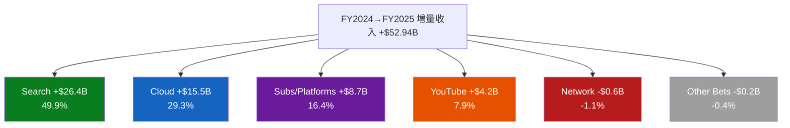
```mermaid
graph TD
    A["FY2024→FY2025 增量收入 +$52.94B"] --> B["Search +$26.4B<br/>49.9%"]
    A --> C["Cloud +$15.5B<br/>29.3%"]
    A --> D["Subs/Platforms +$8.7B<br/>16.4%"]
    A --> E["YouTube +$4.2B<br/>7.9%"]
    A --> F["Network -$0.6B<br/>-1.1%"]
    A --> G["Other Bets -$0.2B<br/>-0.4%"]

    style B fill:#0a7e1f,color:#fff
    style C fill:#1565c0,color:#fff
    style D fill:#6a1b9a,color:#fff
    style E fill:#e65100,color:#fff
    style F fill:#b71c1c,color:#fff
    style G fill:#9e9e9e,color:#fff
```

---

## 2.3 利润率深度分析

### 2.3.1 毛利率: 59.7% — 结构性改善+130bps (FY2024→FY2025)

毛利率从FY2024的58.2%提升至FY2025的59.7%(+130bps) [硬数据: FMP ratios FY2024/FY2025]。八季度维度，毛利率在FY2025四个季度均稳定在59.5%-59.8%区间 [硬数据: FMP quarterly margins]——这种窄幅波动反映的是结构性改善而非一次性因素。

**驱动因素分解**:
- **Cloud扭亏贡献(~50bps)**: Cloud营业利润率持续改善，从FY2023亏损到FY2025盈利，Cloud收入占比从10.8%升至14.6%，正毛利贡献拉升集团毛利率 [合理推断: Cloud利润率翻转对集团毛利的贡献估算]
- **TPU效率提升(~30bps)**: Gemini服务成本降低78% [硬数据: Alphabet Q4 2025 earnings call]，自研TPU降低了每查询基础设施成本
- **SG&A优化传导(~30bps)**: SG&A/Revenue从12.0%降至12.5% [硬数据: FMP ratios]——实际上SG&A绝对值增长了19.5%($42.0B→$50.18B) [硬数据: FMP income statement]，但收入增长15.1%使占比微升。毛利率改善更多来自COGS中人力成本的优化
- **广告单价提升(~20bps)**: CPC +12.9% [硬数据: WordStream 2025]

### 2.3.2 营业利润率: 32.1% — 连续两年持平的真相

FY2024和FY2025营业利润率均为32.1% [硬数据: FMP ratios]。"持平"表面下的对冲力量:

**向上的力量**:
- 毛利率提升+130bps [硬数据: FMP ratios]
- SBC/Revenue下降30bps(6.5%→6.2%) [硬数据: FMP key metrics]

**向下的力量**:
- R&D/Revenue上升110bps(14.1%→15.2%) [硬数据: FMP ratios]——R&D支出从$49.33B增至$61.09B(+23.8%) [硬数据: FMP income statement]
- SG&A绝对值增长19.5% [硬数据: FMP income statement]

**八季度营业利润率波动**:

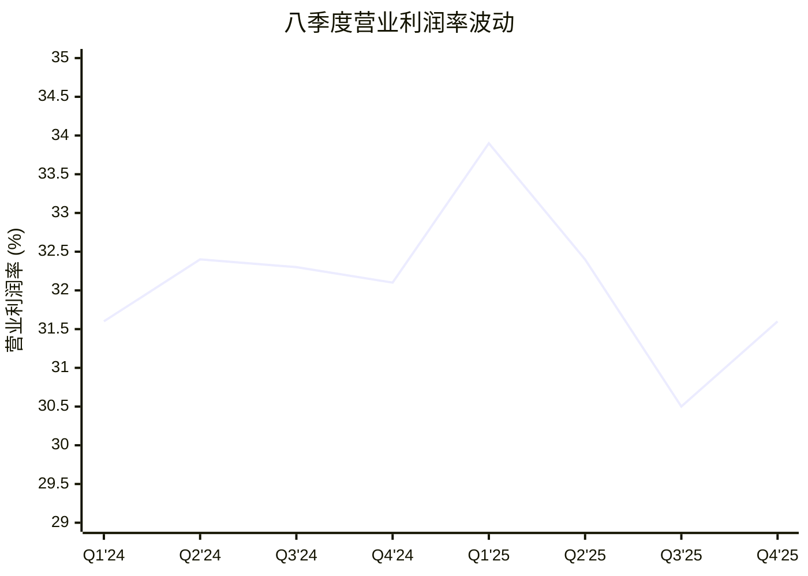
```mermaid
xychart-beta
    title "八季度营业利润率波动"
    x-axis ["Q1'24", "Q2'24", "Q3'24", "Q4'24", "Q1'25", "Q2'25", "Q3'25", "Q4'25"]
    y-axis "营业利润率 (%)" 29 --> 35
    line [31.6, 32.4, 32.3, 32.1, 33.9, 32.4, 30.5, 31.6]
```

**Q3 2025的30.5%是8Q最低点** [硬数据: FMP quarterly margins]。这是"折旧延迟炸弹"的前兆信号: CapEx/D&A从FY2022的1.98x飙升至FY2025的4.33x [硬数据: FMP key metrics]，意味着当前CapEx中约77%尚未进入折旧 [合理推断: 1 - 1/4.33 = 77%]。随着FY2023-2025累计$176.2B CapEx开始折旧(假设5年直线折旧):
- FY2026估计D&A: $30-35B(vs FY2025 $21.1B) [合理推断: 基于5年直线折旧模型]
- 增量D&A: $9-14B → 冲击营业利润率约2.2-3.5pp [合理推断: 增量D&A / 预期FY2026收入~$460B]
- **32%的营业利润率可能是"峰值利润率"，FY2026-2027可能回落至28-30%** [主观判断: 基于折旧加速的前瞻估算]

### 2.3.3 净利率: 32.8% — +420bps的分解

FY2025净利率32.8% vs FY2024 28.6%(+420bps) [硬数据: FMP ratios FY2024/FY2025]。

| 驱动因素 | 贡献(估) | 说明 |
|---------|---------|------|
| 其他收入激增 | ~+300bps | FY2025 $29.66B vs FY2024 $7.43B(+$22.2B) [硬数据: FMP income statement] |
| 毛利率改善 | ~+130bps | 59.7% vs 58.2% [硬数据: FMP ratios] |
| 营业利润率持平 | 0bps | 32.1% vs 32.1% [硬数据: FMP ratios] |
| 有效税率微升 | ~-10bps | 16.8% vs 16.4% [硬数据: FMP ratios] |

[合理推断: 各因素贡献度为近似分解，因交叉效应可能存在偏差]

**关键警示**: 净利率420bps改善中，约300bps(71%)来自其他收入(含投资收益和公允价值变动) [合理推断: 其他收入增量$22.2B / 收入$402.96B ≈ 5.5pp的税前影响]。**其他收入具有高度不可预测性**——FY2022该项为-$3.51B [硬数据: FMP income statement FY2022]。以经常性利润为基础的"可持续净利率"更接近29-30%，而非报告的32.8% [主观判断: 扣除非经常性其他收入后的正常化净利率估算]。

---

## 2.4 现金流重点分析

### 2.4.1 OCF $164.7B(+31.5%) vs FCF $73.3B(+0.7%) — 为什么差距这么大?

这是Alphabet FY2025最重要的财务故事之一:

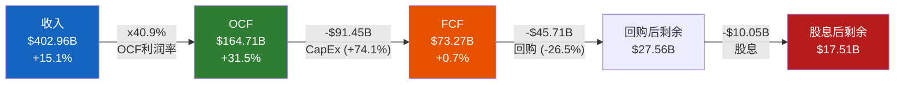
```mermaid
graph LR
    A["收入<br/>$402.96B<br/>+15.1%"] -->|"x40.9%<br/>OCF利润率"| B["OCF<br/>$164.71B<br/>+31.5%"]
    B -->|"-$91.45B<br/>CapEx (+74.1%)"| C["FCF<br/>$73.27B<br/>+0.7%"]
    C -->|"-$45.71B<br/>回购 (-26.5%)"| D["回购后剩余<br/>$27.56B"]
    D -->|"-$10.05B<br/>股息"| E["股息后剩余<br/>$17.51B"]

    style A fill:#1565c0,color:#fff
    style B fill:#2e7d32,color:#fff
    style C fill:#e65100,color:#fff
    style E fill:#b71c1c,color:#fff
```

**数学解构**:
- OCF增量: +$39.41B(从$125.30B增至$164.71B) [硬数据: FMP cash flow FY2024/FY2025]
- CapEx增量: +$38.91B(从$52.54B增至$91.45B) [硬数据: FMP cash flow FY2024/FY2025]
- FCF增量: +$0.51B(从$72.76B增至$73.27B) [硬数据: FMP cash flow FY2024/FY2025]

**$39.41B的OCF增量几乎100%被$38.91B的CapEx增量吞噬** [硬数据: FMP cash flow FY2024/FY2025]。这意味着Alphabet在FY2025创造的全部额外现金都被投入了AI基础设施。FCF几乎零增长(+0.7%)不是因为运营恶化——恰恰相反，OCF增长31.5%是极其健康的。问题在于CapEx增长74.1%超过了OCF增长速度。

**CapEx/OCF比率的恶化**: 从FY2022的34.4%飙升至FY2025的55.5% [硬数据: FMP key metrics]。这意味着每$1 OCF中有$0.56被CapEx消耗(FY2022仅$0.34) [合理推断: CapEx/OCF比率的含义]。

### 2.4.2 FCF Yield的历史性压缩

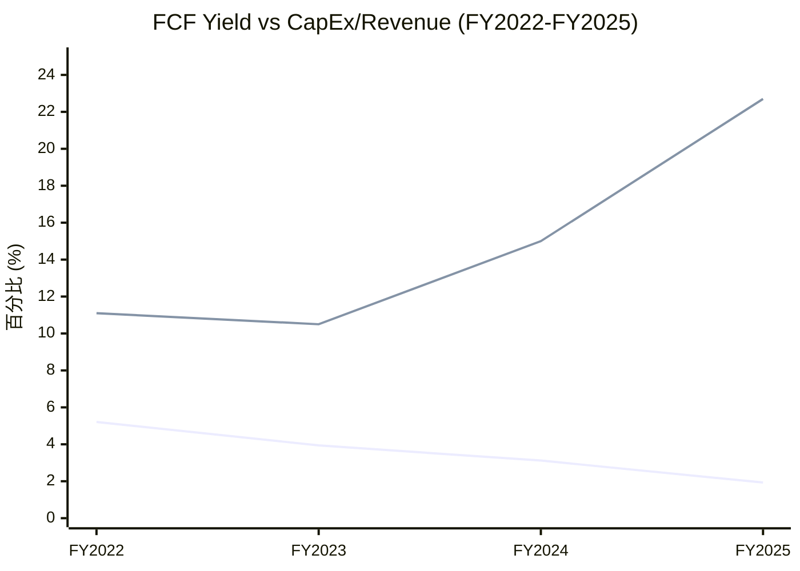
```mermaid
xychart-beta
    title "FCF Yield vs CapEx/Revenue (FY2022-FY2025)"
    x-axis ["FY2022", "FY2023", "FY2024", "FY2025"]
    y-axis "百分比 (%)" 0 --> 25
    line "FCF Yield" [5.21, 3.94, 3.12, 1.93]
    line "CapEx/Revenue" [11.1, 10.5, 15.0, 22.7]
```

FCF Yield从FY2022的5.21%压缩至FY2025的1.93% [硬数据: FMP ratios FY2022-FY2025]——3年内下降3.28pp(降幅63%)。对于一家FCF正在增长的公司，FCF Yield下降的原因是**市值增长(229% from $1.15T to $3.79T)远超FCF增长(22% from $60.0B to $73.3B)** [硬数据: FMP key metrics; 市值来源FMP market cap FY2022/FY2025]。

### 2.4.3 资本分配流向图

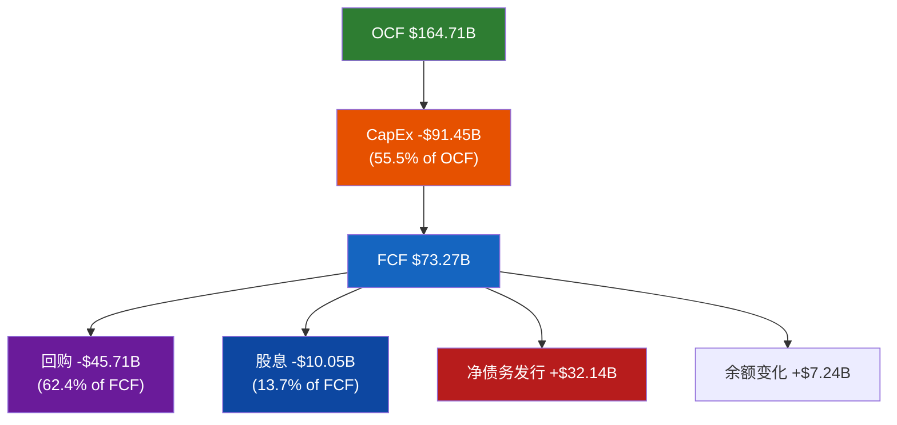
```mermaid
graph TD
    OCF["OCF $164.71B"] --> CAPEX["CapEx -$91.45B<br/>(55.5% of OCF)"]
    CAPEX --> FCF["FCF $73.27B"]
    FCF --> BUY["回购 -$45.71B<br/>(62.4% of FCF)"]
    FCF --> DIV["股息 -$10.05B<br/>(13.7% of FCF)"]
    FCF --> DEBT["净债务发行 +$32.14B"]
    FCF --> REM["余额变化 +$7.24B"]

    style OCF fill:#2e7d32,color:#fff
    style CAPEX fill:#e65100,color:#fff
    style FCF fill:#1565c0,color:#fff
    style BUY fill:#6a1b9a,color:#fff
    style DIV fill:#0d47a1,color:#fff
    style DEBT fill:#b71c1c,color:#fff
```

[硬数据: FMP cash flow statement FY2025]

---

## 2.5 资产负债表变化

### 2.5.1 四年资产负债表关键变化

| 指标 | FY2025 | FY2024 | FY2023 | FY2022 | FY2024→FY2025变化 |
|------|--------|--------|--------|--------|:--:|
| **Total Assets** | $595.28B | $450.26B | $402.39B | $365.26B | +$145.0B (+32.2%) |
| **PP&E (net)** | $261.82B | $184.62B | $148.44B | $127.05B | +$77.2B (+41.8%) |
| **Cash + ST Investments** | $126.84B | $95.66B | $110.92B | $113.76B | +$31.2B (+32.6%) |
| **Total Debt** | $72.04B | $25.46B | $27.12B | $29.68B | +$46.6B (+183%) |
| **Long-term Debt** | $59.29B | $10.88B | $11.87B | $12.86B | +$48.4B (+445%) |
| **Net Debt** | $41.33B | $2.00B | $3.07B | $7.80B | +$39.3B (+1,965%) |
| **Total Equity** | $415.27B | $325.08B | $283.38B | $256.14B | +$90.2B (+27.7%) |
| **Working Capital** | $103.29B | $74.59B | $89.72B | $95.50B | +$28.7B (+38.5%) |

[硬数据: FMP balance sheet annual FY2022-FY2025]

### 2.5.2 资产结构变迁图

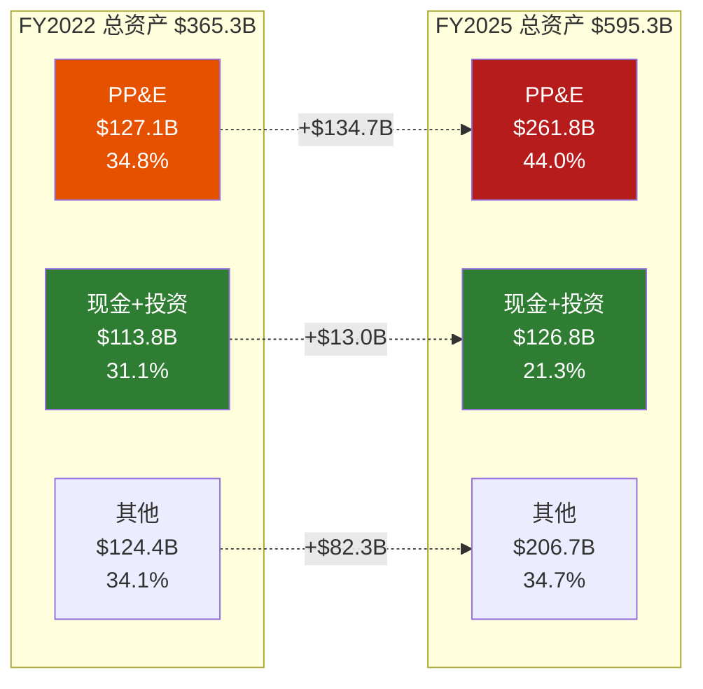
```mermaid
graph LR
    subgraph "FY2022 总资产 $365.3B"
        A1["PP&E<br/>$127.1B<br/>34.8%"]
        A2["现金+投资<br/>$113.8B<br/>31.1%"]
        A3["其他<br/>$124.4B<br/>34.1%"]
    end

    subgraph "FY2025 总资产 $595.3B"
        B1["PP&E<br/>$261.8B<br/>44.0%"]
        B2["现金+投资<br/>$126.8B<br/>21.3%"]
        B3["其他<br/>$206.7B<br/>34.7%"]
    end

    A1 -.->|"+$134.7B"| B1
    A2 -.->|"+$13.0B"| B2
    A3 -.->|"+$82.3B"| B3

    style A1 fill:#e65100,color:#fff
    style B1 fill:#b71c1c,color:#fff
    style A2 fill:#2e7d32,color:#fff
    style B2 fill:#2e7d32,color:#fff
```

**资产结构的根本性变化**: PP&E占总资产比例从FY2022的34.8%飙升至FY2025的44.0% [硬数据: FMP balance sheet]——Alphabet正在从"轻资产数字广告公司"变成"重资产AI基础设施公司" [合理推断: PP&E占比变化反映业务模式转型]。$261.82B的PP&E使Alphabet的物理资产规模接近传统电信和公用事业公司 [合理推断: AT&T PP&E约$130B, Alphabet已经是其2倍]。

### 2.5.3 债务结构急剧变化

**Long-term Debt从$10.88B暴增至$59.29B(+445%)** [硬数据: FMP balance sheet FY2024/FY2025]——这是Alphabet财务史上最大幅度的债务扩张。

**Net Debt从$2.0B飙升至$41.33B** [硬数据: FMP balance sheet]——Alphabet从"实质净现金公司"变为"净债务公司"。这不是财务危机(D/E仅0.17x [硬数据: FMP ratios])，而是战略选择: 以Aa2/AA+信用评级发行低成本债券为$175-185B CapEx融资 [合理推断: 债务增长与CapEx融资需求的对应关系]。

**利息覆盖率**: 903.3x(FY2025) [硬数据: FMP ratios FY2025]——即使债务增长445%，利息覆盖仍极其充裕。$0.14B的年利息支出相对于$159.56B的EBIT几乎可以忽略不计 [硬数据: FMP income statement FY2025]。

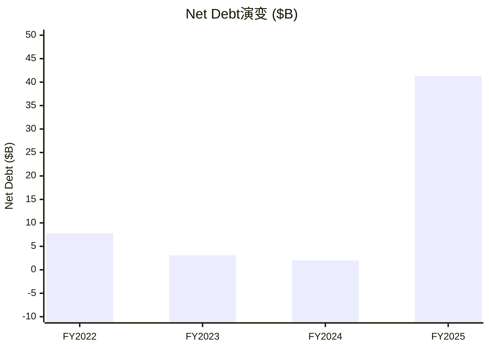
```mermaid
xychart-beta
    title "Net Debt演变 ($B)"
    x-axis ["FY2022", "FY2023", "FY2024", "FY2025"]
    y-axis "Net Debt ($B)" -10 --> 50
    bar [7.8, 3.1, 2.0, 41.3]
```

### 2.5.4 财务健康度指标

| 指标 | FY2025 | 基准 | 评级 |
|------|--------|------|------|
| D/E | 0.17x | <0.5x(优秀) | 极健康 |
| Altman Z-Score | 15.53 | >3.0(安全) | 极安全 |
| Piotroski F-Score | 7/9 | >=7(强健) | 强健 |
| Current Ratio | 2.01x | >1.5x(健康) | 健康 |
| Quick Ratio | 1.85x | >1.0x(安全) | 安全 |
| Interest Coverage | 903.3x | >10x(极安全) | 极安全 |

[硬数据: FMP ratios + financial scores FY2025]

---

## 2.6 资本回报: 回购+股息+SBC三角

### 2.6.1 回购效率持续下降

| 年度 | 回购金额 | 股息 | SBC | 回购/SBC | 净资本回报 | 稀释后股份(avg) | YoY变化 |
|------|---------|------|------|:--------:|-----------|:----:|:---:|
| FY2022 | $59.30B | $0 | $19.36B | 3.06x | $59.30B | 13.16B | — |
| FY2023 | $61.50B | $0 | $22.46B | 2.74x | $61.50B | 12.72B | -3.3% |
| FY2024 | $62.22B | $7.36B | $22.79B | 2.73x | $69.59B | 12.45B | -2.2% |
| FY2025 | $45.71B | $10.05B | $24.95B | 1.83x | $55.76B | 12.23B | -1.7% |

[硬数据: FMP cash flow statement + key metrics FY2022-FY2025]

**三个关键趋势**:

1. **回购金额骤降26.5%**: 从$62.22B降至$45.71B [硬数据: FMP cash flow FY2024/FY2025]——这是FCF被CapEx压缩的直接后果。当FCF仅$73.3B时，$45.7B回购已占FCF的62.4%

2. **回购/SBC比率从3.06x降至1.83x**: FY2022每$1 SBC稀释有$3.06回购对冲，FY2025仅$1.83 [硬数据: FMP data]。如果该比率继续下降至1.5x以下，**股份稀释速度将超过回购缩减速度** [合理推断: 回购/SBC<1.5x时净稀释效应显著]

3. **股份缩减速度放缓**: 从FY2023的-3.3%降至FY2025的-1.7% [硬数据: FMP per-share data]。如果FY2026回购进一步下降至$35-40B(因CapEx $175-185B)，股份缩减可能放缓至-1.0%以下 [合理推断: 回购金额下降对股份缩减速度的传导]

### 回购效率趋势图

```mermaid
xychart-beta
    title "回购金额 vs SBC vs 回购/SBC比率"
    x-axis ["FY2022", "FY2023", "FY2024", "FY2025"]
    y-axis "金额 ($B)" 15 --> 65
    bar "回购" [59.3, 61.5, 62.2, 45.7]
    bar "SBC" [19.4, 22.5, 22.8, 25.0]
```

---

## 2.7 同行对比

### 2.7.1 Big Tech五巨头对比表

| 指标 | GOOGL | MSFT | META | AMZN | AAPL |
|------|:-----:|:----:|:----:|:----:|:----:|
| **P/E** | 29.5x | 25.8x | 28.6x | 28.9x | 34.6x |
| **P/B** | 9.1x | 10.8x | 7.7x | 6.0x | 51.8x |
| **ROE** | 35.7% | 34.4% | 30.2% | 22.3% | 152.0% |
| **Revenue Growth** | 18.0% | 16.7% | 23.8% | 13.6% | 15.7% |
| **Operating Margin** | 32.1% | 45.6% | 41.4% | 11.2% | 32.0% |
| **Dividend Yield** | 0.26% | 0.65% | 0.32% | — | 0.40% |
| **FCF Yield** | 1.93% | ~3.5% | ~3.8% | ~2.5% | ~3.2% |

[硬数据: FMP compare_stocks GOOGL/MSFT/META/AMZN/AAPL; Revenue Growth使用Q4 2025 YoY]

### 同行对比雷达图

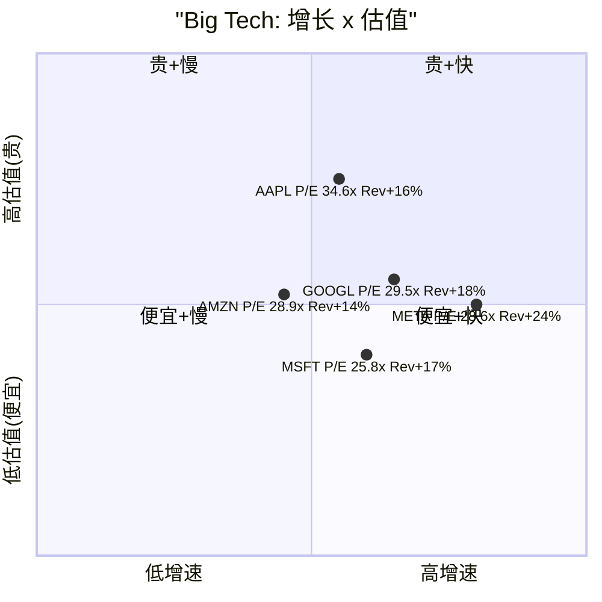
```mermaid
quadrantChart
    title "Big Tech: 增长 x 估值"
    x-axis "低增速" --> "高增速"
    y-axis "低估值(便宜)" --> "高估值(贵)"
    quadrant-1 "贵+快"
    quadrant-2 "贵+慢"
    quadrant-3 "便宜+慢"
    quadrant-4 "便宜+快"
    "GOOGL P/E 29.5x Rev+18%": [0.65, 0.55]
    "META P/E 28.6x Rev+24%": [0.80, 0.50]
    "MSFT P/E 25.8x Rev+17%": [0.60, 0.40]
    "AMZN P/E 28.9x Rev+14%": [0.45, 0.52]
    "AAPL P/E 34.6x Rev+16%": [0.55, 0.75]
```

### 2.7.2 GOOGL在同行中的相对定位

| 维度 | GOOGL排名(5选) | 说明 |
|------|:---:|------|
| 最低P/E(最便宜) | 2nd | MSFT(25.8x)最便宜, GOOGL(29.5x)次之 |
| 最高ROE(含AAPL) | 2nd | AAPL(152%)因负权益失真, GOOGL(35.7%)实质最高 |
| 最快Revenue Growth | 2nd | META(23.8%)最快, GOOGL(18.0%)次之 |
| 最高Operating Margin | 4th | MSFT(45.6%) > META(41.4%) > AAPL(32.0%) ≈ GOOGL(32.1%) |
| 最高FCF Yield | 5th(最低) | GOOGL(1.93%)因CapEx压缩在Big Tech中FCF Yield最低 |

[硬数据: FMP peer comparison data 2026-02-11]

**GOOGL特异性: "CapEx吃FCF"现象**

这是理解GOOGL当前估值的关键。GOOGL的P/E(29.5x)看起来与AMZN(28.9x)和META(28.6x)处于同一区间，但FCF Yield(1.93%)远低于META(~3.8%)和MSFT(~3.5%) [硬数据: FMP ratios]。

**为什么GOOGL的P/E看起来合理但P/FCF(51.76x)异常高?**

答案是$91.4B CapEx [硬数据: FMP cash flow FY2025]。如果将CapEx正常化至FY2022水平(~$31.5B)，FCF将从$73.3B升至$133.2B，FCF Yield将从1.93%升至3.51% [合理推断: 正常化FCF = OCF $164.7B - 正常化CapEx $31.5B]——这将使GOOGL的FCF估值与MSFT和META大致持平。

**但这种正常化是否合理?** 关键问题是: $91.4B的CapEx(以及FY2026指引的$175-185B)是临时性"投资周期"还是永久性"新常态"? [主观判断: 这是CQ3的核心分歧]

与同行的本质区别:
- **MSFT**: Azure已盈利多年，CapEx($80B+)有明确的利润传导路径。MSFT的P/FCF(~28x)反映市场相信Azure CapEx→利润的转化效率
- **META**: Llama开源策略意味着CapEx主要用于AI训练和自有产品推理，不需要建设面向外部客户的云基础设施。META的CapEx/Revenue(~22%)与GOOGL接近，但META的FCF仍有$50B+ [合理推断: META不需要Cloud级别的基础设施投入]
- **AMZN**: AWS是最成熟的云平台，资本回报周期已被验证(AWS运营利润率>30%)。AMZN的CapEx虽高，但AWS的利润率证明了CapEx→利润的路径
- **GOOGL**: Google Cloud刚盈利，$240B积压订单提供可见性，但CapEx→利润的完整传导链尚未被时间验证 [合理推断: GCP盈利历史较短，CapEx回报路径的验证程度低于AWS和Azure]

---

## 2.8 分析师预期与远期估值

### 2.8.1 共识预期

| 年度 | 收入(Avg) | EBITDA(Avg) | EPS(Avg) | EPS Low | EPS High | 分析师数(Rev) |
|------|----------|-----------|---------|---------|----------|:---:|
| FY2027E | $537.70B | $199.49B | $13.34 | $12.00 | $14.66 | 39 |
| FY2028E | $614.56B | $228.01B | $15.34 | $13.34 | $18.37 | 24 |
| FY2029E | $679.05B | $251.93B | $18.55 | $16.36 | $20.79 | 23 |
| FY2030E | $756.61B | $280.71B | $22.03 | $19.43 | $24.69 | 15 |

[硬数据: FMP analyst estimates 2026-02-12]

### 2.8.2 隐含增长率

| 指标 | FY2027E vs FY2025 | FY2028E vs FY2027E | FY2029E | FY2030E |
|------|:---:|:---:|:---:|:---:|
| Revenue Growth | +33.4% (2年) | +14.3% | +10.5% | +11.4% |
| EPS Growth | +23.4% (2年) | +15.0% | +20.9% | +18.8% |

[硬数据: FMP analyst estimates; 增长率为计算值]

### 2.8.3 远期估值矩阵

| 指标 | FY2027E | FY2028E | FY2029E | FY2030E |
|------|:-------:|:-------:|:-------:|:-------:|
| Forward P/E (at $310.96) | 23.3x | 20.3x | 16.8x | 14.1x |
| Forward EV/EBITDA | 19.2x | 16.8x | 15.2x | 13.7x |

[硬数据: FMP forward valuation at $310.96; 2026-02-12]

**FY2027E P/E 23.3x的含义**: 在当前股价$310.96下，市场隐含FY2027E EPS $13.34(vs FY2025 $10.81，2年增长23.4%) [硬数据: FMP estimates]。这意味着市场假设:
- 收入增长维持~16-17% CAGR(从$403B到$538B) [合理推断: 收入CAGR计算]
- 净利率维持~30%+(尽管折旧加速) [合理推断: 隐含利润率 = EPS x shares / revenue]
- CapEx不会永久性压制FCF [合理推断: Forward P/E合理但Forward P/FCF可能很高]

**FY2030E P/E 14.1x的折扣**: 如果Alphabet能够实现共识预期(FY2030E EPS $22.03)，当前股价隐含的FY2030E P/E仅14.1x [硬数据: FMP estimates]——这对于一家仍在增长11%+的公司而言极具吸引力。**但问题是: 共识预期本身是否可靠?** [主观判断: 远期预期的可靠性随时间递减]

### 远期估值趋势

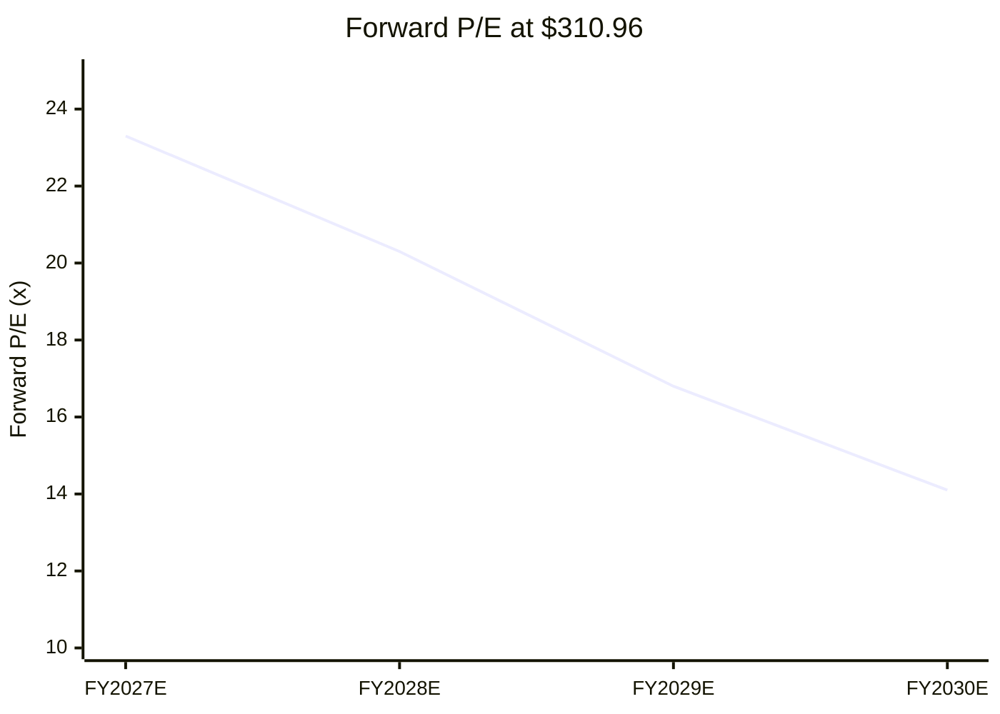
```mermaid
xychart-beta
    title "Forward P/E at $310.96"
    x-axis ["FY2027E", "FY2028E", "FY2029E", "FY2030E"]
    y-axis "Forward P/E (x)" 10 --> 25
    line [23.3, 20.3, 16.8, 14.1]
```

---

## 2.9 内部人交易趋势

| 季度 | 买入笔数 | 卖出笔数 | 买/卖比 | 净卖出量 |
|------|:---:|:---:|:---:|------|
| Q1 2024 | 2 | 16 | 0.125 | 净卖出 |
| Q2 2024 | 6 | 31 | 0.194 | 净卖出 |
| Q3 2024 | 69 | 83 | 0.831 | 净卖出 |
| Q4 2024 | 57 | 88 | 0.648 | 净卖出 |
| Q1 2025 | 57 | 76 | 0.750 | 净卖出 |
| Q2 2025 | 46 | 100 | 0.460 | 净卖出 |
| Q3 2025 | 65 | 109 | 0.596 | 净卖出 |
| Q4 2025 | 54 | 146 | 0.370 | 净卖出 |
| Q1 2026(partial) | 5 | 56 | 0.089 | 净卖出 |

[硬数据: FMP insider trading data 2024-2026]

**趋势分析**: 内部人持续净卖出，且Q4 2025和Q1 2026的买/卖比显著恶化(0.370和0.089) [硬数据: FMP insider trading]。内部人交易率(TTM) -0.07% [硬数据: FMP shareholder returns]属于低水平常规减持。

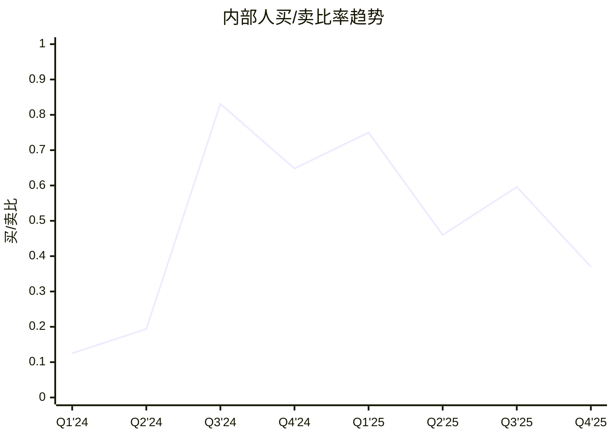
```mermaid
xychart-beta
    title "内部人买/卖比率趋势"
    x-axis ["Q1'24", "Q2'24", "Q3'24", "Q4'24", "Q1'25", "Q2'25", "Q3'25", "Q4'25"]
    y-axis "买/卖比" 0 --> 1.0
    line [0.125, 0.194, 0.831, 0.648, 0.750, 0.460, 0.596, 0.370]
```

**解读**: 内部人净卖出在Mega-cap科技公司中是常态(高管薪酬结构决定)，不应过度解读为看空信号。但Q4 2025卖出量(5,871,002股)显著高于其他季度 [硬数据: FMP insider data]，值得持续监测 [合理推断: 单季度卖出量异常高可能反映估值或信息不对称因素]。

---

## 2.10 CapEx轨迹: 从$31.5B到$175-185B

### 2.10.1 CapEx加速全景

| 年度 | CapEx | CapEx/Revenue | CapEx/D&A | CapEx/OCF | FCF Margin |
|------|-------|:---:|:---:|:---:|:---:|
| FY2022 | $31.49B | 11.1% | 1.98x | 34.4% | 21.2% |
| FY2023 | $32.25B | 10.5% | 2.70x | 31.7% | 22.6% |
| FY2024 | $52.54B | 15.0% | 3.43x | 41.9% | 20.8% |
| FY2025 | $91.45B | 22.7% | 4.33x | 55.5% | 18.2% |
| **FY2026E** | **$175-185B** | **~37-40%** | **~5-6x** | **~65-70%** | **~10-15%** |

[硬数据: FMP cash flow FY2022-FY2025; FY2026E CapEx来自Alphabet Q4 2025 earnings call guidance $175-185B; FY2026E其他指标为合理推断基于共识收入~$460B]

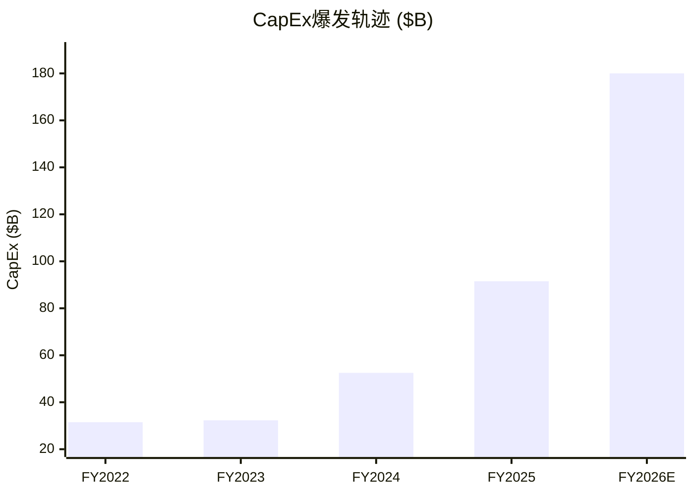
```mermaid
xychart-beta
    title "CapEx爆发轨迹 ($B)"
    x-axis ["FY2022", "FY2023", "FY2024", "FY2025", "FY2026E"]
    y-axis "CapEx ($B)" 20 --> 190
    bar [31.5, 32.3, 52.5, 91.5, 180.0]
```

**FY2026E $175-185B CapEx是华尔街预期$119.5B的1.5倍** [硬数据: Alphabet Q4 2025 earnings call guidance vs consensus from CNBC]。这意味着市场对GOOGL CapEx规模的估计严重不足，FY2026的FCF可能远低于共识预期。

**如果FY2026 CapEx取中值$180B**:
- 假设OCF增长15%至$189B [合理推断: 基于收入增长+利润率假设]
- FCF = $189B - $180B = $9B [合理推断: 简化计算，实际受运营资本等因素影响]
- FCF Margin ≈ 2.0% vs FY2025的18.2% [合理推断: FCF / 预期收入~$460B]
- **FCF Yield ≈ 0.24%** (基于$3.76T市值) [合理推断: $9B / $3,762B]

这是一个极端数字。当然，实际FCF可能高于$9B(因投资收益、运营资本改善等因素)，但方向是明确的: **FY2026将是GOOGL FCF的历史低点年份** [主观判断: 基于CapEx guidance和OCF增长假设的前瞻估算]。

---

## 2.11 杜邦分析: ROE的来源质量

### ROE分解

**ROE = 35.70% = 净利率(32.80%) x 资产周转率(0.77x) x 权益乘数(1.41x)** [硬数据: FMP DuPont analysis TTM]

```mermaid
graph TD
    ROE["ROE 35.70%"] --> NM["净利率<br/>32.80%<br/>净利润 $132.17B / 收入 $402.90B"]
    ROE --> AT["资产周转率<br/>0.77x<br/>收入 $402.90B / 平均资产 $522.77B"]
    ROE --> EM["权益乘数<br/>1.41x<br/>平均资产 $522.77B / 平均权益 $370.17B"]

    NM --> NM_Q["FY2022: 21.2% → FY2025: 32.8%<br/>+1160bps(主驱动)"]
    AT --> AT_Q["FY2022: 0.77x → FY2025: 0.77x<br/>持平"]
    EM --> EM_Q["FY2022: 1.43x → FY2025: 1.41x<br/>去杠杆"]

    style ROE fill:#1565c0,color:#fff
    style NM fill:#2e7d32,color:#fff
    style AT fill:#e65100,color:#fff
    style EM fill:#6a1b9a,color:#fff
```

[硬数据: FMP DuPont analysis components]

**ROE来源质量评估**: Alphabet的ROE 35.70%来自最健康的路径——**高利润率驱动 + 低杠杆** [硬数据: FMP DuPont]。对比:
- **AMZN**: ROE ~24%, 低利润率(~8%) + 高周转(~1.5x) + 高杠杆(~2.0x) [合理推断: 基于AMZN最新杜邦分解]
- **MSFT**: ROE ~34%, 最高利润率(~36%) + 低周转(~0.50x) + 中杠杆(~1.5x) [合理推断: 基于MSFT最新杜邦分解]
- **GOOGL**: ROE 35.7%, 高利润率(32.8%) + 中周转(0.77x) + 低杠杆(1.41x) [硬数据: FMP DuPont]

Alphabet在去杠杆(权益乘数从1.43→1.41)的同时提升ROE——这是最健康的ROE改善路径 [合理推断: 去杠杆+利润率驱动ROE提升代表真实盈利能力改善]。

### ROIC分解

**ROIC = 37.22%(TTM)** [硬数据: FMP operations efficiency TTM]

但年度数据显示ROIC从FY2024的25.8%降至FY2025的21.8% [硬数据: FMP ratios annual]。这一分歧可能源于计算口径差异(TTM使用平均投入资本 vs 年度使用期末投入资本)。**无论哪种口径，方向性结论一致: FY2025投入资本膨胀(因$91.4B CapEx)正在压制ROIC** [合理推断: 两种口径显示同一方向]。

---

## 2.12 估值倍数历史对比

| 估值倍数 | FY2025 | FY2024 | FY2023 | FY2022 | 当前位置 |
|---------|:---:|:---:|:---:|:---:|------|
| P/E | 28.69x | 23.29x | 23.91x | 19.22x | 4年最高 |
| P/B | 9.13x | 7.17x | 6.23x | 4.50x | 4年最高 |
| P/S | 9.41x | 6.66x | 5.74x | 4.07x | 4年最高 |
| P/FCF | 51.76x | 32.05x | 25.39x | 19.21x | 4年最高(CapEx驱动) |
| EV/EBITDA | 21.30x | 17.24x | 18.04x | 13.63x | 4年最高 |
| FCF Yield | 1.93% | 3.12% | 3.94% | 5.21% | 4年最低 |
| Earnings Yield | 3.49% | 4.29% | 4.18% | 5.20% | 4年最低 |

[硬数据: FMP valuation ratios FY2022-FY2025]

```mermaid
xychart-beta
    title "P/E vs P/FCF历史对比"
    x-axis ["FY2022", "FY2023", "FY2024", "FY2025"]
    y-axis "倍数 (x)" 15 --> 55
    line "P/E" [19.2, 23.9, 23.3, 28.7]
    line "P/FCF" [19.2, 25.4, 32.1, 51.8]
```

**P/E与P/FCF的剪刀差**: FY2022时P/E和P/FCF几乎相同(~19x)。到FY2025，P/E(28.7x)与P/FCF(51.8x)之间出现了23x的巨大差距 [硬数据: FMP ratios]。这个剪刀差完全由CapEx驱动——**P/E告诉你Alphabet的盈利能力，P/FCF告诉你Alphabet的现金创造能力。两者讲述着截然不同的故事** [合理推断: P/E和P/FCF分歧的唯一解释是CapEx对FCF的压缩]。

---

## 2.13 本章核心发现

| # | 发现 | CQ关联 | Bull/Bear | 标注 |
|---|------|--------|:---------:|------|
| 1 | FY2025收入$402.96B(+15.1%)，Q4增速加速至+18.1%——连续4Q加速是罕见信号 | CQ2, CQ8 | Bull | [硬数据: FMP quarterly data] |
| 2 | 净利率32.8%(+420bps)中约71%来自不可持续的其他收入，可持续净利率~29-30% | CQ2 | Bear | [合理推断: 其他收入$29.66B vs FY2024 $7.43B] |
| 3 | OCF增量$39.4B几乎100%被CapEx增量$38.9B吞噬，FCF仅+0.7% | CQ3, CQ8 | Bear | [硬数据: FMP cash flow FY2024/FY2025] |
| 4 | CapEx/D&A 4.33x意味着77%的CapEx尚未进入折旧，FY2026-27营业利润率可能回落至28-30% | CQ3, CQ4 | Bear | [合理推断: 折旧延迟效应估算] |
| 5 | Cloud贡献FY2025增量收入29.3%，增速48%超越Azure(38%)和AWS(17.5%) | CQ4, CQ8 | Bull | [硬数据: Alphabet + peers earnings] |
| 6 | Net Debt从$2.0B飙升至$41.3B，Long-term Debt +445%——"轻资产"向"重资产"转型的财务确认 | CQ3 | Bear | [硬数据: FMP balance sheet] |
| 7 | 回购/SBC从3.06x降至1.83x，稀释控制能力减弱 | CQ2 | Bear | [硬数据: FMP shareholder returns] |
| 8 | FY2026E CapEx $175-185B超市场预期46-55%，FCF可能降至$9-30B区间 | CQ3, CQ8 | Bear | [硬数据: Alphabet guidance vs consensus] |
| 9 | ROIC从FY2024的25.8%降至FY2025的21.8%(-4.0pp)，投入资本膨胀侵蚀资本效率 | CQ2, CQ3 | Bear | [硬数据: FMP ratios] |
| 10 | Forward P/E FY2027E 23.3x, FY2030E 14.1x——如果共识预期可实现，当前估值在远期视角下合理 | CQ2 | Bull | [硬数据: FMP estimates] |
| 11 | P/E(28.7x)与P/FCF(51.8x)的23x剪刀差完全由CapEx驱动，是GOOGL独有的估值困境 | CQ2, CQ3 | Context | [硬数据: FMP ratios] |
| 12 | 同行对比中GOOGL的FCF Yield(1.93%)在Big Tech中最低，但ROE(35.7%)最高(实质) | CQ2 | Mixed | [硬数据: FMP peer comparison] |

---

## 2.14 CQ初步回答

**CQ2(估值)初步**: $310.96隐含了搜索持续增长(+15%+)、Cloud维持高增速(+30%+)、利润率不因折旧而显著回落、以及$175B+ CapEx最终产生正向ROIC——四个条件需同时成立。Forward P/E 23.3x(FY2027E)看似合理，但P/FCF可能在FY2026达到100x+级别 [合理推断: 如果FY2026 FCF仅$9-30B]。市场在用P/E锚定估值，但投资者应该关注P/FCF。

**CQ3(CapEx)初步**: FY2026 $175-185B CapEx将创造人类商业史上单年度最大资本支出记录(仅次于国家级基础设施项目) [合理推断: 超过任何已知企业年度CapEx]。OCF增长必须维持20%+才能防止FCF归零。Cloud $240B积压订单提供了部分回报可见性，但CapEx→折旧→利润率的传导链需要3-5年才能完全展开。

**CQ4(Cloud)初步**: Cloud收入增速48%和$240B积压支持乐观假设。但30%+营业利润率能否在折旧加速(FY2026-27每年新增$15-25B折旧)的环境下维持，是一个数学而非信仰的问题 [合理推断: 基于CapEx/折旧比率和Cloud成本结构]。

**CQ8(承重墙)初步**: $310.96需要三个承重墙同时成立: (1)搜索韧性(AI Overviews不蚕食广告收入)、(2)Cloud高增长(维持30%+ CAGR)、(3)CapEx产出正回报(ROIC回升)。基于FY2025数据，承重墙(1)最坚固(搜索收入加速至+17%)，承重墙(3)最脆弱(ROIC已下降4pp) [主观判断: 基于各承重墙当前数据支撑强度的排序]。

---

*数据来源: FMP (Financial Modeling Prep), Alphabet SEC Filings (10-K/10-Q) FY2022-FY2025, Alphabet Quarterly Earnings Releases Q1 2024 - Q4 2025, Seer Interactive, WordStream, Synergy Research, StatCounter, TechCrunch, CNBC. 所有财务数据以美元计。市场数据截至2026-02-11收盘。*
