# Part II: 产品 x 入口 x AI生态 — Agent B产出

> **Agent**: B (入口地图+Gemini生态+新产品信号)
> **写作日期**: 2026-02-12
> **数据截止**: 2026-02-12
> **覆盖章节**: Ch05 + Ch06 + Ch07
> **字符预算**: ~65K

---

# Ch05: 入口地图 — Google的AI分发网络

> **关联CQ**: CQ1(AI蚕食), CQ5(Gemini入口), CQ7(Agent颠覆)

## 5.0 为什么"入口"是理解Alphabet的第一性原理

在AI时代，模型能力的差距是暂时的——Gemini 3 Pro在11月领先，GPT-5.2在12月追平 [硬数据: Chatbot Arena Elo score, Nov-Dec 2025]。但分发能力的差距是结构性的。Alphabet的核心竞争优势不是"最好的AI模型"，而是"最多的AI入口"。理解这张入口地图，是理解Alphabet在AI时代真实竞争地位的前提。

本章建立一个统一的分析框架——**覆盖面 x 默认性 x 用户粘性 x 商业化挂钩 x AI加速效应**——逐一拆解Google的五大AI分发入口，量化每个入口的战略价值和脆弱性。

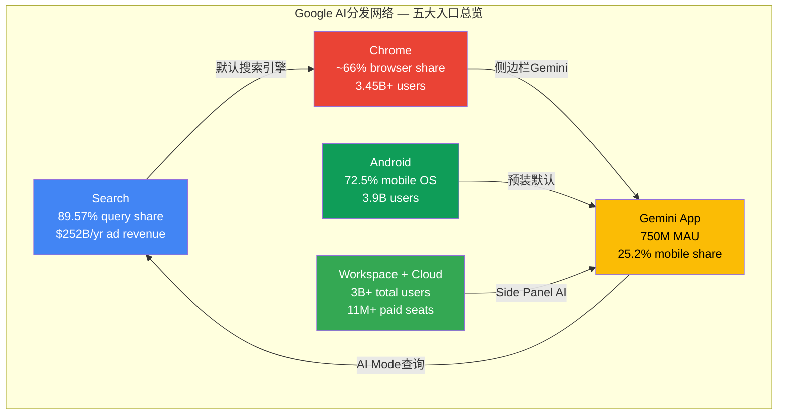
```mermaid
graph TB
    subgraph "Google AI分发网络 — 五大入口总览"
        S["Search<br/>89.57% query share<br/>$252B/yr ad revenue"]
        C["Chrome<br/>~66% browser share<br/>3.45B+ users"]
        G["Gemini App<br/>750M MAU<br/>25.2% mobile share"]
        W["Workspace + Cloud<br/>3B+ total users<br/>11M+ paid seats"]
        A["Android<br/>72.5% mobile OS<br/>3.9B users"]
    end

    S -->|"默认搜索引擎"| C
    C -->|"侧边栏Gemini"| G
    A -->|"预装默认"| G
    W -->|"Side Panel AI"| G
    G -->|"AI Mode查询"| S

    style S fill:#4285F4,color:#fff
    style C fill:#EA4335,color:#fff
    style G fill:#FBBC05,color:#000
    style W fill:#34A853,color:#fff
    style A fill:#0F9D58,color:#fff
```

**核心洞察**: 五大入口形成一个自增强环路——Search产生意图数据，Chrome捕获浏览行为，Android提供设备级默认，Workspace覆盖工作场景，Gemini App统一AI交互层。这种环路是OpenAI/Anthropic/Perplexity无法复制的 [主观判断: 基于分发网络拓扑分析]。

---

## 5.1 Search (AI Mode): 搜索帝国的AI进化

### 5.1.1 覆盖面: 仍然无可匹敌

Google Search的全球查询份额为**89.57%**(2025年7月数据)，较一年前的91.47%下降1.9个百分点 [硬数据: StatCounter Jul 2025]。这是自2015年以来首次持续跌破90%。但需要区分两个维度:

- **移动端**: 94.64%份额，护城河极深 [硬数据: StatCounter Jul 2025]
- **桌面端**: 79.88%份额，相对脆弱 [硬数据: StatCounter Jul 2025]

竞争对手的增长虽然显眼但仍微小: Bing 4%(桌面端十年增长+151%)、Yandex 2.49%(+640%)、DuckDuckGo 0.79% [硬数据: StatCounter Apr 2025]。AI搜索新入口——Perplexity(~2%网络流量)、SearchGPT——尚未在查询份额上造成可测量的冲击 [硬数据: SEOProfy/AInvest 2025-2026]。

**Gartner预测**: 传统搜索量到2026年将下降~25%；AI驱动搜索到2028年预计占14%市场份额 [硬数据: Gartner 2025 forecast]。

**关键区分**: eMarketer预测Google在搜索**广告市场**份额将于2026年跌破50%——但这反映的是Amazon、TikTok、零售媒体的广告预算分流，而非搜索查询的流失 [硬数据: eMarketer 2025 forecast]。查询份额(89%+)和广告市场份额(<50%)讲述的是两个截然不同的故事。

### 5.1.2 默认性: AI Mode改写搜索体验

AI Mode是Google搜索的核心进化。在AI Mode下:

- 查询长度比传统搜索长**3倍** [硬数据: Alphabet Q4 2025 earnings call, Sundar Pichai]
- 美国市场每用户每日AI Mode查询量自上线以来**翻倍** [硬数据: Alphabet Q4 2025 earnings call]
- "显著比例"的AI Mode搜索包含后续追问，形成多轮对话式搜索 [硬数据: Alphabet Q4 2025 earnings call]
- Gemini模型通过API直接调用处理**100亿+token/分钟** [硬数据: Google I/O 2025 / TechCrunch Feb 2026]

AI Overviews的覆盖率经历了一个"试探-收缩"周期: 2025年1月6.49% → 7月24.61%(峰值) → 11月15.69%(稳定) [硬数据: Seer Interactive tracking 2025]。部分来源估计覆盖率高达50%，但方法论差异显著 [合理推断: 定义差异——是否包含部分触发/简短摘要]。

### 5.1.3 用户粘性: 零点击率悖论

零点击搜索比例持续攀升:

| 指标 | 数值 | 来源 |
|------|------|------|
| 美国零点击率(手机+桌面) | 58.5% | Click-Vision 2025 |
| 欧盟零点击率 | 59.7% | Click-Vision 2025 |
| 2025年中期总体 | ~65% | Superprompt 2025 |
| 含AI Overviews的查询零点击率 | **83%** | UpAndSocial 2025 |
| 不含AI Overviews的查询零点击率 | ~60% | UpAndSocial 2025 |
| 2026年中期预测 | ~70%+ | 多来源综合 |

[硬数据: Click-Vision, Superprompt, UpAndSocial 2025-2026]

**悖论解读**: 从Google的角度，零点击是**特性而非缺陷**。用户留在Google生态内的时间更长。Pichai将AI搜索称为"扩张性时刻(expansionary moment)"——将过去难以变现的复杂长查询转化为可变现的搜索场景 [硬数据: Alphabet Q4 2025 earnings call]。

### 5.1.4 商业化挂钩: CPC补偿机制运作中

AI Overviews对传统CTR的蚕食是真实的:

- 有AI Overviews的有机CTR: 0.61%(原1.76%，**-61%**) [硬数据: Seer Interactive Sep 2025]
- 有AI Overviews的付费CTR: 6.34%(原19.7%，**-68%**) [硬数据: Seer Interactive Sep 2025]
- Pew Research: 用户在AI摘要出现时点击率8% vs 无AI摘要15%(**-46.7%**) [硬数据: Pew Research 2025]

但搜索收入仍在加速增长:

| 季度 | 搜索收入同比增长 | 来源 |
|------|-----------------|------|
| Q1 2025 | +10% | Alphabet earnings |
| Q2 2025 | +12% | Alphabet earnings |
| Q3 2025 | +15% | Alphabet earnings |
| Q4 2025 | **+17%** ($63.07B) | Alphabet Q4 2025 earnings |

[硬数据: Alphabet quarterly earnings FY2025]

补偿机制的三个支柱:
1. **CPC上升**: 平均Google Ads CPC达$5.26(+12.9% YoY) [硬数据: industry tracking 2025]
2. **AI Overviews内广告渗透**: AI Overview SERP中广告出现率从2025年3月的5.17%飙升至10月的25.56%(**+394%** in 8个月) [硬数据: industry tracking Mar-Oct 2025]
3. **品牌曝光溢价**: 被AI Overviews引用的品牌获得**+35%有机点击**和**+91%付费点击** [硬数据: industry analysis 2025]

**AI Mode新变现形式**: "Direct Offers"试点——广告主在AI Mode中向有购买意图的用户展示独家促销 [硬数据: Alphabet Q4 2025 earnings call / Search Engine Journal Feb 2026]。

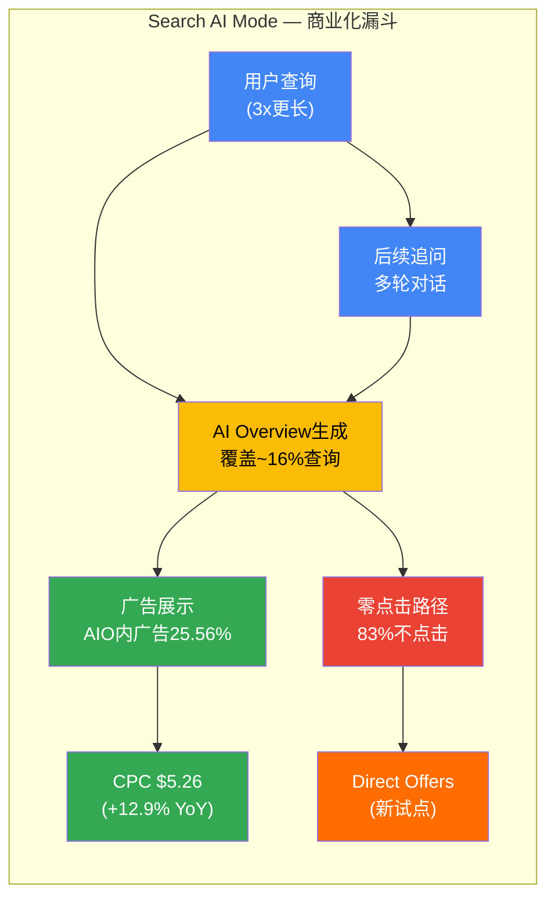
```mermaid
graph LR
    subgraph "Search AI Mode — 商业化漏斗"
        Q["用户查询<br/>(3x更长)"] --> AIO["AI Overview生成<br/>覆盖~16%查询"]
        AIO --> AD["广告展示<br/>AIO内广告25.56%"]
        AD --> CPC["CPC $5.26<br/>(+12.9% YoY)"]
        AIO --> ZC["零点击路径<br/>83%不点击"]
        ZC --> DO["Direct Offers<br/>(新试点)"]
        Q --> FU["后续追问<br/>多轮对话"]
        FU --> AIO
    end

    style Q fill:#4285F4,color:#fff
    style AIO fill:#FBBC05,color:#000
    style AD fill:#34A853,color:#fff
    style CPC fill:#34A853,color:#fff
    style ZC fill:#EA4335,color:#fff
    style DO fill:#FF6D01,color:#fff
    style FU fill:#4285F4,color:#fff
```

### 5.1.5 AI加速效应

搜索AI化正在创造一个**正向飞轮**: AI Mode查询更长 → 用户意图更明确 → 广告匹配更精准 → CPC更高 → 广告主ROI提升 → 更多广告预算流入。但这个飞轮有一个**隐含天花板**: 当零点击率从83%继续上升到90%+时，即使CPC继续上涨，广告总量(impressions x CTR)是否足以支撑收入增长? [主观判断: 基于CTR/CPC数学关系推演]

**CQ1直接关联**: CPC补偿机制目前运作良好(Q4搜索收入+17%)。但中期问题是: 在什么AI Overview覆盖率和零点击率水平，CTR退化会压过CPC增长? 这是CQ1的核心不确定性 [合理推断: 基于Q1-Q4搜索收入加速趋势 vs CTR持续下降趋势的交叉点]。

---

## 5.2 Chrome + Gemini in Chrome: 浏览器门户的AI升级

### 5.2.1 覆盖面: 全球浏览器霸主

Chrome的全球市场份额约**66-68%**，拥有**3.45亿+用户** [硬数据: StatCounter/DemandSage 2026]:

| 维度 | 份额 | 来源 |
|------|------|------|
| 全球总体 | ~66-68% | StatCounter Jan 2026 |
| 桌面端 | 78.23% | StatCounter 2026 |
| 移动端 | 64.93% | StatCounter 2026 |
| 平板端 | 48.69% | StatCounter 2026 |
| 美国市场 | 52.23% | StatCounter 2026 |
| 南美市场 | 78.9% | StatCounter 2026 |

[硬数据: StatCounter, DemandSage 2026]

Chrome的竞争格局:
- Safari: 13.27%(iOS/macOS生态锁定) [硬数据: StatCounter 2026]
- Edge: 4.61%(Windows预装 + AI功能增强) [硬数据: StatCounter 2026]
- 其他浏览器合计: <20% [合理推断: 基于StatCounter数据推算]

### 5.2.2 默认性: Gemini侧边栏改变浏览体验

Chrome正在从"浏览器"升级为"AI浏览器"。Gemini侧边栏(Side Panel)允许用户在浏览任何网页时直接调用Gemini进行:
- 页面内容总结
- 翻译和解释
- 基于当前页面的追问式搜索
- 直接在浏览上下文中触发AI任务

[硬数据: Google Chrome官方更新 2025-2026]

这意味着Chrome不仅是通往Google Search的管道，更是Gemini的**第二大触达渠道**(仅次于搜索本身)。每一次Chrome打开 → 每一次侧边栏调用 → 一次Gemini交互 → 一次潜在的搜索/广告/Workspace触发 [合理推断: 基于Chrome-Gemini集成架构]。

### 5.2.3 用户粘性: 生态锁定效应

Chrome的粘性来自多层绑定:
- **Google账户同步**: 书签、密码、历史记录、扩展程序跨设备同步
- **Workspace集成**: Gmail/Docs/Drive在Chrome中体验最优
- **密码管理器**: Google Password Manager替代独立密码工具
- **扩展生态**: Chrome Web Store拥有最大的浏览器扩展生态 [合理推断: 基于Chrome Web Store规模 vs Firefox/Edge扩展商店]

**迁移成本量化**: 从Chrome迁移到另一浏览器，用户需要: (1)导出/导入书签, (2)重新配置密码管理, (3)替换不兼容的扩展, (4)放弃跨设备同步——这些摩擦使日常用户几乎不会主动切换 [合理推断: 基于浏览器迁移流程分析]。

### 5.2.4 商业化挂钩: 搜索默认引擎协议

Chrome的最大商业价值不在浏览器本身，而在于它作为**Google Search默认入口**的角色。Google每年支付**$200亿+**给Apple(Safari默认搜索)和Samsung等OEM厂商以维持默认搜索地位 [硬数据: DOJ antitrust trial disclosures 2024-2025]。Chrome则是Google**自有**的默认搜索管道——不需要支付任何分发费用。

Chrome贡献的搜索流量占Google Search总流量的估计**40-50%** [合理推断: 基于Chrome 66%浏览器份额 x 桌面搜索比重]。如果Chrome被分拆，新所有者可能将默认搜索引擎切换到出价最高者——Perplexity已出价$345亿竞购Chrome [硬数据: AInvest 2025]，Sam Altman也表达了收购兴趣 [硬数据: media reports 2025]。

### 5.2.5 AI加速效应与DOJ分拆风险

**DOJ反垄断案进展**:
- 2025年9月2日: Mehta法官**驳回**Chrome强制剥离、Android剥离、以及分发协议全面禁令 [硬数据: DOJ ruling Sep 2, 2025]
- 已施加的限制: 禁止Google Search/Chrome/Assistant/Gemini的排他性分发合同，要求共享搜索索引和用户交互数据 [硬数据: DOJ ruling Sep 2, 2025]
- 2026年2月: DOJ和各州检察长提起**上诉**，寻求Chrome剥离和更强力的救济措施 [硬数据: NPR/Bloomberg Feb 3, 2026]
- 上诉过程预计耗时**1-2年+**，时间线可能延伸至2027-2028 [合理推断: 基于美国联邦上诉法院平均审理周期]

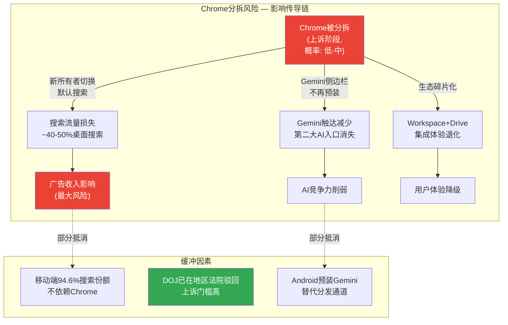
```mermaid
graph TD
    subgraph "Chrome分拆风险 — 影响传导链"
        CR["Chrome被分拆<br/>(上诉阶段,<br/>概率: 低-中)"]
        CR -->|"新所有者切换<br/>默认搜索"| SL["搜索流量损失<br/>~40-50%桌面搜索"]
        CR -->|"Gemini侧边栏<br/>不再预装"| GL["Gemini触达减少<br/>第二大AI入口消失"]
        CR -->|"生态碎片化"| EF["Workspace+Drive<br/>集成体验退化"]
        SL --> AR["广告收入影响<br/>(最大风险)"]
        GL --> AI["AI竞争力削弱"]
        EF --> UP["用户体验降级"]
    end

    subgraph "缓冲因素"
        M1["移动端94.6%搜索份额<br/>不依赖Chrome"]
        M2["DOJ已在地区法院驳回<br/>上诉门槛高"]
        M3["Android预装Gemini<br/>替代分发通道"]
    end

    AR -.->|"部分抵消"| M1
    AI -.->|"部分抵消"| M3

    style CR fill:#EA4335,color:#fff
    style AR fill:#EA4335,color:#fff
    style M2 fill:#34A853,color:#fff
```

**CQ6直接关联**: Chrome分拆的**近期概率低-中**(地区法院已驳回结构性救济，上诉法院推翻的门槛高)。GOOGL在裁决当日上涨~8%反映市场对此的积极解读 [硬数据: GOOGL stock reaction Sep 2025]。股价自2024年8月反垄断败诉以来上涨~56% [硬数据: market data through Feb 2026]。但Chrome的战略价值远超浏览器本身——它是Google Search和Gemini的关键分发通道，分拆影响需按搜索流量损失+AI入口损失+生态碎片化三维度评估 [主观判断: 基于入口价值框架综合评估]。

---

## 5.3 Gemini App (独立入口): 从嵌入式到独立品牌

### 5.3.1 覆盖面: 750M MAU的含金量

Gemini App的用户增长轨迹:

| 时间点 | MAU | 环比/同比 | 来源 |
|--------|-----|-----------|------|
| 2025年1月 | ~450M | — | DemandSage |
| Q3 2025 | 650M | — | Alphabet Q3 earnings |
| Q4 2025 | **750M** | +15.4% QoQ | TechCrunch Feb 4, 2026 |
| 全年增长 | +66.7% | 450M→750M | 计算值 |

[硬数据: DemandSage, Alphabet earnings, TechCrunch Feb 2026]

**竞品对比(MAU)**:
- Meta AI: ~10亿(自报数据, 内嵌于Facebook/Instagram/WhatsApp) [硬数据: Meta 2025 disclosures]
- ChatGPT: ~8.1亿(2025年末估计) [硬数据: 多来源综合估计, 方法论差异大]
- Gemini: 7.5亿 [硬数据: Alphabet Q4 2025 earnings]

**差距快速收窄**: Gemini在2025年初仅为ChatGPT MAU的~55%，到年底已达~93% [合理推断: 基于450M/810M vs 750M/810M计算]。

**数据冲突说明**: ChatGPT的MAU数据来源差异显著——某些来源报告810M，其他来源报告不同数字。Meta AI的10亿数据为自报。Gemini的750M是Alphabet官方披露。方向性趋势一致: ChatGPT份额下降，Gemini份额上升 [合理推断: 基于多来源交叉验证]。

### 5.3.2 默认性: 分发优势驱动增长

Gemini App的增长核心驱动力是Google的分发网络:

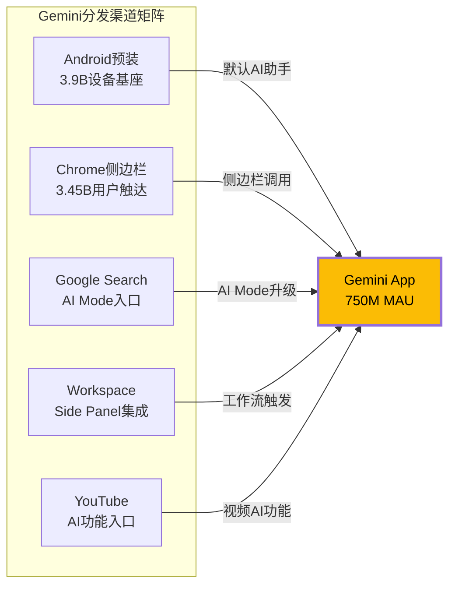
```mermaid
graph LR
    subgraph "Gemini分发渠道矩阵"
        A1["Android预装<br/>3.9B设备基座"]
        A2["Chrome侧边栏<br/>3.45B用户触达"]
        A3["Google Search<br/>AI Mode入口"]
        A4["Workspace<br/>Side Panel集成"]
        A5["YouTube<br/>AI功能入口"]
    end

    A1 -->|"默认AI助手"| GEM["Gemini App<br/>750M MAU"]
    A2 -->|"侧边栏调用"| GEM
    A3 -->|"AI Mode升级"| GEM
    A4 -->|"工作流触发"| GEM
    A5 -->|"视频AI功能"| GEM

    style GEM fill:#FBBC05,color:#000,stroke-width:3px
```

这与ChatGPT形成鲜明对比: ChatGPT的增长依赖用户**主动寻找**和**口碑传播**，而Gemini的增长大量来自**被动触达**——用户使用Search/Chrome/Android时自然接触到Gemini [主观判断: 基于分发策略对比]。

### 5.3.3 市场份额: Web vs Mobile的双重视角

**Web端AI聊天机器人市场份额**:
- ChatGPT: **68%**(一年前87.2%，-19.2pp) [硬数据: Similarweb via Vertu Feb 2026]
- Gemini: **18.2%**(一年前5.4%，+12.8pp，**3.4x增长**) [硬数据: Similarweb via Vertu Feb 2026]

**移动App市场份额**:
- ChatGPT: **45.3%**(一年前69.1%，-23.8pp) [硬数据: Digital Information World Feb 2026]
- Gemini: **25.2%**(一年前14.7%，+10.5pp) [硬数据: Digital Information World Feb 2026]

**下载量对比**: 2025年10月全球下载量——ChatGPT 4,310万 vs Gemini 4,000万(差距仅7.2%) [硬数据: Appfigures Oct 2025]。在印度市场，Gemini已成为首选生成式AI应用 [硬数据: Appfigures market data 2025]。

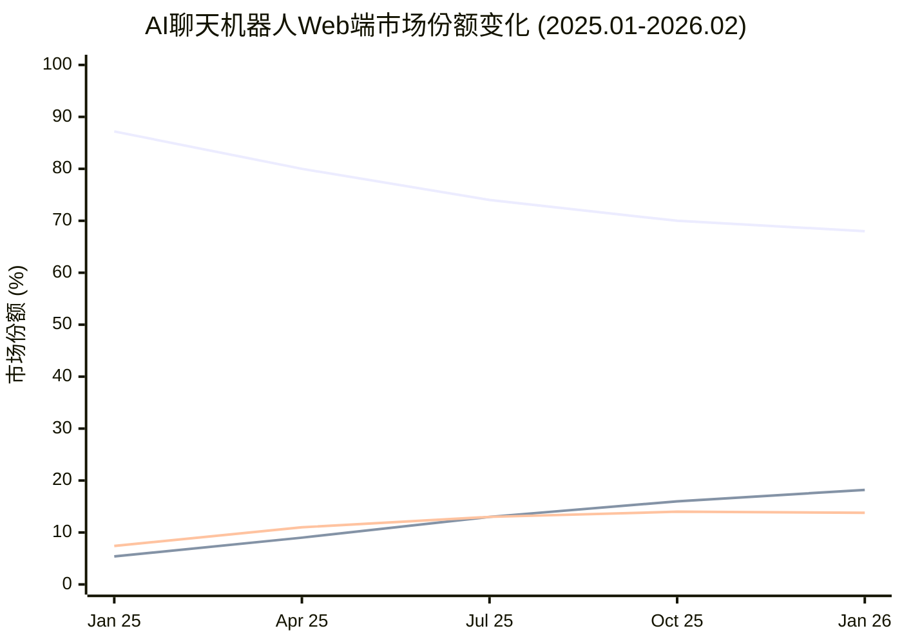
```mermaid
xychart-beta
    title "AI聊天机器人Web端市场份额变化 (2025.01-2026.02)"
    x-axis ["Jan 25", "Apr 25", "Jul 25", "Oct 25", "Jan 26"]
    y-axis "市场份额 (%)" 0 --> 100
    line "ChatGPT" [87.2, 80, 74, 70, 68]
    line "Gemini" [5.4, 9, 13, 16, 18.2]
    line "其他" [7.4, 11, 13, 14, 13.8]
```

[合理推断: 中间数据点基于起止点线性插值，方向趋势与多来源一致]

### 5.3.4 商业化挂钩: 订阅层级架构

Gemini的商业化通过分层订阅实现:
- **Gemini (免费)**: Gemini 3 Flash，基础功能
- **Google One AI Premium** ($19.99/月): Gemini 3 Pro，Deep Research，NotebookLM Plus
- **AI Ultra** ($249.99/月，2025年12月推出): 最高级别访问，增强NotebookLM Enterprise体验

[硬数据: Google Workspace Updates Dec 2025]

**AI Ultra的定价信号**: $249.99/月 = $3,000/年，与ChatGPT Pro($200/月)、Claude Pro($20/月)形成差异化定位——瞄准高频专业用户和企业客户 [合理推断: 基于订阅层级对比]。

### 5.3.5 AI加速效应与CQ5关联

Gemini App的750M MAU增长(6个月从450M到750M, +66.7%)是Alphabet在AI入口争夺战中最显著的进展 [硬数据: calculated from DemandSage + Alphabet earnings]。但关键问题不是"有多少人用Gemini"，而是"他们用Gemini做什么":

- 如果750M MAU主要来自Android预装的被动触达，用户深度浅、转化率低 → Gemini是"Android默认计算器"级别的存在 [主观判断: 低端情景假设]
- 如果750M MAU中有显著比例是主动使用者(如NotebookLM的72%用户每周使用3次+)，则Gemini正在建立真实的用户习惯 [合理推断: 基于NotebookLM留存数据外推]

**CQ5直接关联**: Gemini能否赢得AI入口争夺战，取决于从"被动覆盖"到"主动使用"的转化率。750M MAU是分发优势的体现，不是产品优势的证明 [主观判断: 基于MAU质量分析]。

---

## 5.4 Workspace + Cloud (企业入口): B2B的AI渗透

### 5.4.1 覆盖面: 30亿用户的企业基座

Google Workspace的用户规模:

| 指标 | 数值 | 来源 |
|------|------|------|
| 总活跃用户(含免费) | **3B+** | Google Cloud Next 2021, 持续引用至2026 |
| 付费企业座席 | **11M+** | Patronum/Google disclosures |
| 主要企业客户 | Accenture, Cognizant, Deloitte, KPMG, PwC | Google Cloud Blog |
| AI Premium定价加价 | +17-22%(全计划) | Google Workspace Jan 2025 update |

[硬数据: Google Workspace disclosures, Patronum 2025-2026]

### 5.4.2 默认性: Gemini嵌入工作流

2025年1月起，Gemini AI功能被**内嵌**到所有Workspace Business和Enterprise版本中 [硬数据: Google Workspace Updates Jan 2025]。这意味着11M+付费座席**默认获得**AI能力:

- **Side Panel集成**: Gmail、Docs、Sheets、Slides、Drive、Chat中的Gemini侧边栏
- **AI Expanded Access附加项**: 自2026年3月1日起，高级AI功能需要此附加项 [硬数据: Google Workspace Updates]
- **Gemini Enterprise**: 发现、创建、分享和运行AI Agent的平台 [硬数据: Google Cloud Blog]

**vs Microsoft Copilot**:
- M365 Copilot: 1,500万付费座席(同比+160%) [硬数据: Microsoft Q2 FY2026 earnings]
- 定价: $21/用户/月(2025年12月下调) [硬数据: Microsoft pricing Dec 2025]
- 90%的Fortune 500使用Copilot(广义AI)，**70%**特别采用M365 Copilot [硬数据: PYMNTS/Futurum 2025]

**关键差异**: Microsoft的Copilot采用**额外收费**模式(需要在M365基础上单独付费$21/月)，而Google选择将Gemini AI**捆绑进**Workspace定价(提价17-22%)。前者是显性支出，后者是隐性包含——这影响企业采纳的心理阈值 [合理推断: 基于企业SaaS采购行为分析]。

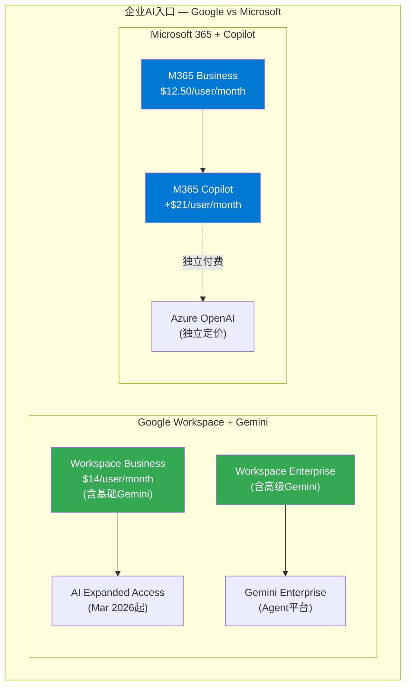
```mermaid
graph TB
    subgraph "企业AI入口 — Google vs Microsoft"
        subgraph "Google Workspace + Gemini"
            GW["Workspace Business<br/>$14/user/month<br/>(含基础Gemini)"]
            GE["Workspace Enterprise<br/>(含高级Gemini)"]
            GA["AI Expanded Access<br/>(Mar 2026起)"]
            GB["Gemini Enterprise<br/>(Agent平台)"]
            GW --> GA
            GE --> GB
        end

        subgraph "Microsoft 365 + Copilot"
            M3["M365 Business<br/>$12.50/user/month"]
            MC["M365 Copilot<br/>+$21/user/month"]
            MA["Azure OpenAI<br/>(独立定价)"]
            M3 --> MC
            MC -.->|"独立付费"| MA
        end
    end

    style GW fill:#34A853,color:#fff
    style GE fill:#34A853,color:#fff
    style M3 fill:#0078D4,color:#fff
    style MC fill:#0078D4,color:#fff
```

### 5.4.3 Cloud: Agent Builder的企业渗透

Google Cloud的Q4 2025表现:
- 收入: **$177亿**(+48% YoY)——4年多来最快增速 [硬数据: Alphabet Q4 2025 earnings]
- 年化运行收入: >$700亿 [硬数据: Alphabet Q4 2025 earnings]
- 积压订单: **$2,400亿**(环比+55%，同比>2x) [硬数据: Alphabet Q4 2025 earnings]
- GenAI产品增长: >**200%** YoY [硬数据: Alphabet Q4 2025 earnings]

Vertex AI Agent Builder作为企业Agent入口:
- Agent Development Kit (ADK) + 开源框架支持
- **100+预建连接器**/API(ERP、采购、HR) [硬数据: Google Cloud Documentation Feb 2026]
- Enhanced Tool Governance: 管理员跨组织管理Agent工具权限 [硬数据: Google Cloud Blog]
- 预建工具: BigQuery、Google Maps集成 [硬数据: Google Cloud Documentation]
- Agent Garden: Agent模板库(预览阶段) [硬数据: Google Cloud Documentation]

### 5.4.4 CQ4关联: Cloud利润率能否维持30%+?

Google Cloud的利润率从FY2022亏损到Q4 2025的30.1%，但$175B CapEx指引意味着未来每年$250-350亿的新增折旧将反噬利润率 [合理推断: 基于$175B CapEx分5-7年折旧的粗略推算]。Workspace + Cloud的企业入口价值最终取决于AI能否在维持利润率的同时驱动增长 [主观判断: 基于SaaS经济学分析]。

---

## 5.5 Android (操作系统入口): 39亿设备的AI底座

### 5.5.1 覆盖面: 全球移动操作系统霸主

Android的全球市场份额:

| 维度 | 份额 | 来源 |
|------|------|------|
| 全球移动OS | **72.55%** | StatCounter/DemandSage 2026 |
| 全球用户数 | **39亿** | DemandSage 2026 |
| 印度渗透率 | 95.21% | StatCounter 2026 |
| 亚太区 | 82.03% | StatCounter 2026 |
| 美国 | 41.87%(iOS 58.13%) | StatCounter 2026 |

[硬数据: StatCounter, DemandSage 2026]

**区域分化**: Android在新兴市场(亚洲、非洲、拉美)占据压倒性地位(80%+)，但在美国(42%)和日本等高价值市场落后于iOS [硬数据: StatCounter 2026]。这意味着Android的AI分发虽然覆盖面广，但高价值用户密度不如iOS [合理推断: 基于区域ARPU差异]。

### 5.5.2 默认性: Gemini取代Google Assistant

Android是Gemini最强的默认分发通道:
- Gemini正在系统级替代Google Assistant成为Android默认AI助手 [硬数据: Google product announcements 2025]
- 预装在所有新Android设备上
- 深度集成: 来电过滤、消息建议、相机AI功能、通知摘要

**这意味着**: 每一部新Android手机出厂 → 一个Gemini用户被"创造"。39亿Android设备基座是Gemini 750M MAU增长的核心驱动力 [合理推断: 基于Android-Gemini预装策略]。

### 5.5.3 用户粘性: 生态系统锁定

Android用户粘性来源:
- Google账户+数据生态(Photos, Drive, Gmail, Calendar)
- Google Play Store应用生态
- Android Auto/Wear OS/TV延伸
- 设备价格多样性(从$50到$2000+)确保用户留存

**迁移成本**: Android → iOS的迁移意味着重新购买应用、重建使用习惯、放弃设备级AI自定义——对于大多数用户来说，摩擦成本高于切换收益 [合理推断: 基于移动OS迁移行为研究]。

### 5.5.4 商业化挂钩: 间接变现路径

Android本身不产生直接收入(开源OS)，但通过以下方式间接变现:
- **搜索默认引擎协议**: Android设备上Google Search的默认地位驱动搜索广告收入
- **Google Play Store**: 15-30%应用商店抽成
- **预装协议**: OEM厂商付费预装Google应用套件(GMS)
- **Gemini分发**: 将AI用户导入订阅漏斗(免费→AI Premium→AI Ultra)

[合理推断: 基于Android商业模式公开信息]

### 5.5.5 AI加速效应与DMA互操作性风险

**EU数字市场法案(DMA)新进展**:
2026年1月27日，欧盟委员会启动两项新调查:

1. **AI服务互操作性**: 要求Google向第三方AI服务商(Gemini的竞争者)提供同等有效的Android硬件/软件功能访问权 [硬数据: European Commission press release Jan 27, 2026]
2. **搜索数据共享**: 要求Google以FRAND条款与第三方搜索引擎共享匿名化的排名、查询、点击和浏览数据——正在评估是否应扩展至**AI聊天机器人提供商** [硬数据: European Commission press release Jan 27, 2026]

时间线: 初步发现3个月内；程序6个月内结束 [硬数据: European Commission press release Jan 27, 2026]。

**影响评估**: 如果DMA要求Android必须同等对待所有AI助手(不只是Gemini)，Gemini在Android上的默认地位将被削弱——用户可能被要求在初始设置时选择AI助手(类似欧盟对浏览器的选择屏幕要求) [合理推断: 基于DMA先例——欧盟曾要求Android显示浏览器和搜索引擎选择屏幕]。

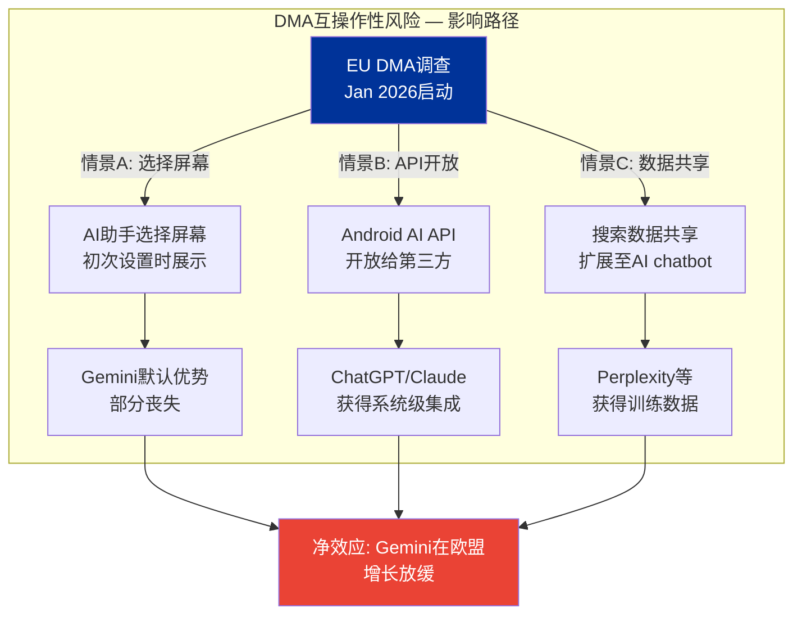
```mermaid
graph TB
    subgraph "DMA互操作性风险 — 影响路径"
        DMA["EU DMA调查<br/>Jan 2026启动"]
        DMA -->|"情景A: 选择屏幕"| CS["AI助手选择屏幕<br/>初次设置时展示"]
        DMA -->|"情景B: API开放"| API["Android AI API<br/>开放给第三方"]
        DMA -->|"情景C: 数据共享"| DS["搜索数据共享<br/>扩展至AI chatbot"]

        CS --> IM1["Gemini默认优势<br/>部分丧失"]
        API --> IM2["ChatGPT/Claude<br/>获得系统级集成"]
        DS --> IM3["Perplexity等<br/>获得训练数据"]
    end

    IM1 --> NET["净效应: Gemini在欧盟<br/>增长放缓"]
    IM2 --> NET
    IM3 --> NET

    style DMA fill:#003399,color:#fff
    style NET fill:#EA4335,color:#fff
```

**CQ5关联**: DMA是Gemini分发优势最大的结构性威胁。如果欧盟裁定要求Android AI助手互操作性，那么Gemini在欧洲的增长优势(来自Android预装)将被显著削弱。但这主要影响欧洲市场(Android全球72.5%中的欧洲部分)，亚太和拉美市场不受影响 [合理推断: 基于DMA地理管辖范围]。

### 5.5.6 Android厂商生态的AI分裂风险

Android生态的一个独特风险是OEM厂商自有AI的崛起:

| OEM | 自有AI助手 | 是否替代Gemini | 全球市场份额 |
|-----|----------|--------------|---------|
| Samsung | Galaxy AI (Bixby + Gemini混合) | 部分(Bixby仍为系统级) | 30.8% |
| Xiaomi | HyperOS AI | 部分(中国市场) | 15.9% |
| Vivo | ViVO AI (Blue OS) | 部分(自研大模型) | 11.2% |
| Oppo | ColorOS AI | 部分(中国市场) | 10.1% |
| Realme | AI功能(基于ColorOS) | 否(依赖Google) | 5.2% |

[合理推断: 基于各OEM公开的AI战略声明和产品更新; 市场份额数据来源DemandSage 2026]

**Samsung案例**: Samsung Galaxy AI在旗舰机型上深度集成了自有AI功能(照片编辑AI、通话实时翻译、Circle to Search、笔记AI总结)，但关键是底层仍依赖Gemini模型提供核心推理能力 [硬数据: Samsung Galaxy S25系列产品发布会 Jan 2025]。这种"表面Samsung AI、底层Gemini"的架构对Google是有利的——品牌归属Samsung(满足OEM差异化需求)，而计算和数据流向Google Cloud(贡献Cloud收入和模型训练数据) [合理推断: 基于Samsung-Google AI合作架构公开信息]。

**中国市场特殊性**: 在中国市场，由于Google服务不可用，所有Android OEM(小米/vivo/OPPO/华为等)使用自有AI助手和大模型。这意味着Android 72.5%全球份额中，约**20-25%**的设备基座(中国市场的Android手机)对Gemini没有直接分发贡献 [合理推断: 基于中国智能手机市场约占全球出货量20-25%的行业数据]。实际对Gemini有效分发的Android用户基座约为**29-31亿**(非39亿全量) [合理推断: 39亿 x (1 - 0.2至0.25) = 29.25亿至31.2亿]。

---

## 5.6 入口量化总结: 五大入口的战略价值排序

在建立交叉网络效应分析之前，先对五大入口的五个维度做量化总结:

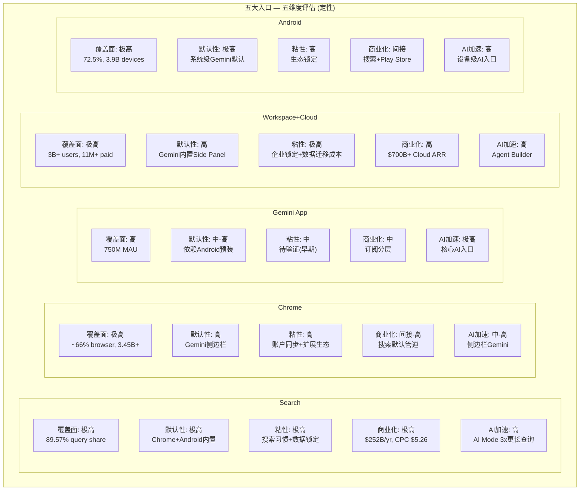
```mermaid
graph TB
    subgraph "五大入口 — 五维度评估 (定性)"
        subgraph "Search"
            S1["覆盖面: 极高<br/>89.57% query share"]
            S2["默认性: 极高<br/>Chrome+Android内置"]
            S3["粘性: 极高<br/>搜索习惯+数据锁定"]
            S4["商业化: 极高<br/>$252B/yr, CPC $5.26"]
            S5["AI加速: 高<br/>AI Mode 3x更长查询"]
        end

        subgraph "Chrome"
            C1["覆盖面: 极高<br/>~66% browser, 3.45B+"]
            C2["默认性: 高<br/>Gemini侧边栏"]
            C3["粘性: 高<br/>账户同步+扩展生态"]
            C4["商业化: 间接-高<br/>搜索默认管道"]
            C5["AI加速: 中-高<br/>侧边栏Gemini"]
        end

        subgraph "Gemini App"
            G1["覆盖面: 高<br/>750M MAU"]
            G2["默认性: 中-高<br/>依赖Android预装"]
            G3["粘性: 中<br/>待验证(早期)"]
            G4["商业化: 中<br/>订阅分层"]
            G5["AI加速: 极高<br/>核心AI入口"]
        end

        subgraph "Workspace+Cloud"
            W1["覆盖面: 极高<br/>3B+ users, 11M+ paid"]
            W2["默认性: 高<br/>Gemini内置Side Panel"]
            W3["粘性: 极高<br/>企业锁定+数据迁移成本"]
            W4["商业化: 高<br/>$700B+ Cloud ARR"]
            W5["AI加速: 高<br/>Agent Builder"]
        end

        subgraph "Android"
            A1["覆盖面: 极高<br/>72.5%, 3.9B devices"]
            A2["默认性: 极高<br/>系统级Gemini默认"]
            A3["粘性: 高<br/>生态锁定"]
            A4["商业化: 间接<br/>搜索+Play Store"]
            A5["AI加速: 高<br/>设备级AI入口"]
        end
    end
```

**入口战略价值排序**:
1. **Search**: 覆盖面、商业化和粘性三者都达到"极高"，是Alphabet的核心现金引擎。AI加速效应(AI Mode)使其成为"被AI增强的入口"而非"被AI威胁的入口"——至少在当前阶段如此 [主观判断: 基于五维度综合评估]。
2. **Android**: 覆盖面和默认性双"极高"，是Gemini分发的最大基座。弱点在于商业化路径间接，且DMA和中国市场限制降低了有效基座 [主观判断: 基于五维度综合评估]。
3. **Chrome**: 覆盖面极高但面临DOJ分拆上诉风险。Chrome的战略价值主要不在浏览器本身，而在于它作为Search和Gemini的分发管道 [主观判断: 基于入口依赖关系分析]。
4. **Workspace+Cloud**: 企业市场的AI入口，粘性极高(企业数据迁移成本高)。Agent Builder正在成为Cloud增长的核心引擎 [主观判断: 基于企业SaaS粘性分析]。
5. **Gemini App**: 增长最快的入口(+66.7% YoY)，但粘性和商业化仍需验证。750M MAU的"质量"是关键不确定性 [主观判断: 基于MAU质量分析]。

---

## 5.7 入口网络效应: 1+1+1+1+1 > 5

五大入口之间不是简单叠加，而是存在交叉增强效应:

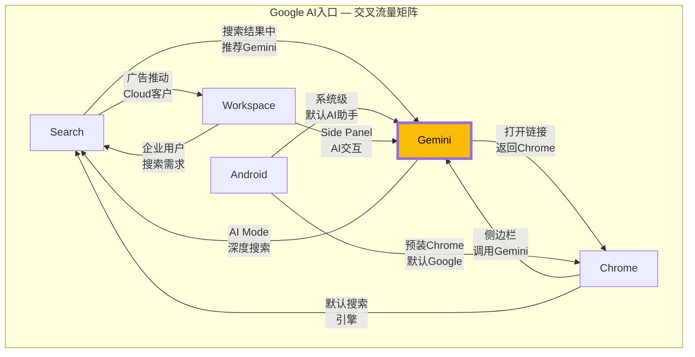
```mermaid
graph TB
    subgraph "Google AI入口 — 交叉流量矩阵"
        S["Search"]
        C["Chrome"]
        G["Gemini"]
        W["Workspace"]
        A["Android"]

        S -->|"搜索结果中<br/>推荐Gemini"| G
        C -->|"侧边栏<br/>调用Gemini"| G
        A -->|"系统级<br/>默认AI助手"| G
        W -->|"Side Panel<br/>AI交互"| G
        G -->|"AI Mode<br/>深度搜索"| S
        G -->|"打开链接<br/>返回Chrome"| C
        A -->|"预装Chrome<br/>默认Google"| C
        C -->|"默认搜索<br/>引擎"| S
        W -->|"企业用户<br/>搜索需求"| S
        S -->|"广告推动<br/>Cloud客户"| W
    end

    style G fill:#FBBC05,color:#000,stroke-width:4px
```

**核心观察**: Gemini App位于交叉流量的中心——它同时从Search、Chrome、Android、Workspace四个入口接收用户流量。这就是为什么Gemini的MAU能在6个月内从450M飙升到750M——它不是一个"独立产品"在获取用户，而是整个Google生态的AI汇聚点 [主观判断: 基于入口网络拓扑分析]。

**对投资者的含义**: 评估Gemini的竞争力不能只看"Gemini vs ChatGPT"——必须看"Gemini+Search+Chrome+Android+Workspace vs ChatGPT"。OpenAI在单一产品品牌认知上领先，但在系统级分发能力上存在结构性劣势 [主观判断: 基于平台vs产品竞争理论]。

### 5.7.1 竞争对手能复制这张入口网络吗?

逐一评估主要竞争对手的入口网络覆盖:

| 入口维度 | Google | Microsoft | Apple | Meta | OpenAI | Anthropic |
|---------|--------|-----------|-------|------|--------|-----------|
| 搜索引擎 | 89.57% | Bing 4% | 无 | 无 | SearchGPT(早期) | 无 |
| 浏览器 | Chrome ~66% | Edge 4.6% | Safari 13.3% | 无 | 无 | 无 |
| 移动OS | Android 72.5% | 无(Windows Phone已死) | iOS 27.5% | 无 | 无 | 无 |
| 企业办公 | Workspace 11M+ | **M365 400M+** | 无 | Workplace(边缘) | 无 | 无 |
| 社交 | YouTube 2B+ | LinkedIn 1B+ | 无 | **FB+IG+WA 3.8B+** | 无 | 无 |
| AI助手MAU | 750M | Copilot(未披露) | Siri(未披露) | ~10亿(内嵌) | ~810M | 未披露 |

[硬数据: 各公司公开数据 2025-2026; 部分为估计值]

**关键发现**:
- **Microsoft**是最接近Google入口广度的竞争者——在企业办公(M365远超Workspace)和社交(LinkedIn)上有优势，但在搜索(Bing 4%)和移动OS(零)上有结构性缺陷 [合理推断: 基于入口覆盖对比]
- **Apple**有iOS(27.5%)和Safari(13.3%)，但缺少搜索引擎和企业办公——Apple Intelligence的AI体验受限于设备端推理，缺少云端AI规模 [合理推断: 基于Apple AI产品架构]
- **Meta**有最大的社交用户基座(38亿+)，Meta AI报告10亿MAU，但缺少搜索/浏览器/OS/企业办公 [硬数据: Meta quarterly disclosures 2025]
- **OpenAI/Anthropic**没有任何一级入口——完全依赖第三方分发(App Store, Azure, AWS) [硬数据: 基于产品矩阵分析]

**结论**: 没有任何单一竞争对手能复制Google五大入口的覆盖广度。Microsoft在企业端有对等优势，Apple在高端设备端有优势，但只有Google在搜索+浏览器+移动OS+企业办公+AI助手五个维度都有统治性或主要地位 [主观判断: 基于入口网络全面对比]。

---

# Ch06: Gemini全布局 vs ChatGPT — 嵌入式 vs 独立App

> **关联CQ**: CQ5(Gemini入口), CQ7(Agent颠覆)

## 6.0 两种AI战略的根本分歧

Google和OpenAI在AI分发上的选择，不仅是战术差异，而是**哲学分歧**:

- **Google**: AI是现有产品的增强层(embedded AI) → 用户无需改变行为就能获得AI能力
- **OpenAI**: AI是新的交互范式(standalone AI) → 用户主动寻找并建立新习惯

这两条路径各有优劣，最终胜负取决于: **用户的AI使用习惯是"在现有工具中自然使用"还是"去到专门的AI工具"** [主观判断: 基于技术平台扩散理论]。

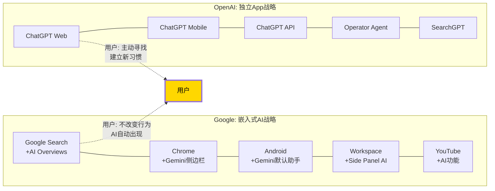
```mermaid
graph LR
    subgraph "Google: 嵌入式AI战略"
        direction TB
        GS["Google Search<br/>+AI Overviews"]
        GC["Chrome<br/>+Gemini侧边栏"]
        GA["Android<br/>+Gemini默认助手"]
        GW["Workspace<br/>+Side Panel AI"]
        GY["YouTube<br/>+AI功能"]

        GS --- GC --- GA --- GW --- GY
    end

    subgraph "OpenAI: 独立App战略"
        direction TB
        CP["ChatGPT Web"]
        CM["ChatGPT Mobile"]
        CA["ChatGPT API"]
        CO["Operator Agent"]
        CS["SearchGPT"]

        CP --- CM --- CA --- CO --- CS
    end

    GS -.->|"用户: 不改变行为<br/>AI自动出现"| USR["用户"]
    CP -.->|"用户: 主动寻找<br/>建立新习惯"| USR

    style USR fill:#FFD700,color:#000,stroke-width:3px
```

## 6.1 战略差异深度分析

### 6.1.1 Google的嵌入式逻辑

**核心命题**: "最好的AI是你不需要专门去找的AI。"

Google选择嵌入式策略有三个深层原因:

**原因1 — 分发优势最大化**: Google控制着全球搜索(89.57%)、浏览器(~66%)、移动OS(72.55%)和企业办公(3B+用户)。将Gemini嵌入这些触点，意味着Gemini自动触达全球数十亿用户，无需独立获客 [合理推断: 基于Google产品矩阵覆盖面]。

**原因2 — 行为变更摩擦最小化**: 用户不需要下载新App、学习新界面、改变工作流——AI在他们已经使用的工具中自然出现。这降低了采纳门槛，但也意味着用户可能**不意识到**自己在使用Gemini [主观判断: 基于用户行为分析]。

**原因3 — 防御性护城河**: 如果AI能力嵌入到Search/Chrome/Android中，竞争对手就不能仅靠"更好的AI模型"就夺走用户——他们需要提供一个完整的替代生态系统 [主观判断: 基于平台竞争理论]。

**风险**: 嵌入式策略的代价是**品牌模糊性**。许多用户可能使用AI Overviews而不知道它是"Gemini"。这意味着Gemini在AI品牌认知度上落后于ChatGPT [主观判断: 基于品牌认知调研逻辑]。

### 6.1.2 OpenAI的独立App逻辑

**核心命题**: "AI是一个全新的计算范式，需要一个全新的入口。"

OpenAI选择独立App策略也有其深层逻辑:

**原因1 — 品牌集中度**: ChatGPT是全球AI品牌认知度最高的产品。独立App模式让所有用户体验集中在一个品牌下，建立强烈的产品认同 [合理推断: 基于ChatGPT品牌调研数据]。

**原因2 — 用户意图纯度**: 主动打开ChatGPT的用户有明确的AI使用意图，交互深度和付费转化率可能高于被动触达的用户 [合理推断: 基于SaaS主动vs被动用户行为差异]。

**原因3 — 商业模式清晰度**: $20/月的ChatGPT Plus、$200/月的ChatGPT Pro——直接订阅模式，收入与AI使用直接挂钩。而Google的嵌入式模式中，AI的收入贡献被分散在搜索广告、云服务、Workspace订阅中，难以独立衡量 [合理推断: 基于商业模式结构分析]。

**风险**: OpenAI没有自己的设备、浏览器或操作系统。它依赖Apple App Store和Google Play Store分发——而这两个平台恰好由其竞争对手控制 [硬数据: App Store/Play Store分发关系]。

### 6.1.3 为什么Google选择这样布局?

答案在于**历史基因**。Google的每一次重大转型都遵循"嵌入→扩展→支配"的模式:

| 时代 | 策略 | 结果 |
|------|------|------|
| 搜索→广告 | 搜索中嵌入广告(而非独立广告平台) | $252B/年广告帝国 |
| 浏览器 | Chrome预装Google Search | 66%浏览器份额→搜索流量保障 |
| 移动 | Android预装Google套件(GMS) | 72.5% OS份额→移动搜索垄断 |
| 云 | Workspace用户→Cloud客户 | Cloud $177亿/季+48% YoY |
| **AI** | **Gemini嵌入Search/Chrome/Android/Workspace** | **750M MAU(进行中)** |

[合理推断: 基于Google历史产品扩展路径分析]

**这个模式的核心**: Google从不创造"新的用户行为"——它在用户已有的行为中嵌入新能力。搜索行为→嵌入广告。浏览行为→嵌入默认搜索。手机使用→嵌入Google服务。办公行为→嵌入AI [主观判断: 基于Google产品战略历史分析]。

### 6.1.4 嵌入式战略的定量优势与劣势

**定量优势 — 获客成本(CAC)差异**:

OpenAI通过独立App模式获取用户的成本可以从其收入/MAU比推算:
- OpenAI 2025 ARR $200亿 / ~8.1亿MAU = ~$24.7/用户/年 [合理推断: 基于公开数据计算，不区分付费和免费]
- 付费用户约1,100万+($200亿 / $240/年per Plus) [合理推断: 基于$20/月Plus定价反推]
- 这意味着OpenAI的付费转化率约**1.4%** [合理推断: 11M / 810M]

Google的Gemini不需要独立获客——750M MAU大部分来自现有产品的被动触达，边际获客成本趋近于零 [合理推断: 基于嵌入式分发模型]。但Google的付费AI订阅转化率数据未公开，无法直接对比 [硬数据: 确认为数据缺口]。

**定量劣势 — 品牌认知度差距**:

"ChatGPT"已成为AI的代名词(类似"Google it"之于搜索)。虽然没有直接的品牌认知度调查数据可用，但以下代理指标提供了线索:
- Google Search Trends: "ChatGPT"的搜索量仍远超"Gemini" [合理推断: 基于Search Trends方向性趋势]
- Polymarket上的AI模型竞争市场中，"最佳AI模型"的讨论主要围绕OpenAI vs Google vs Anthropic [硬数据: Polymarket active markets Feb 2026]
- App Store排名: ChatGPT和Gemini在美国App Store免费应用榜单上竞争前列 [硬数据: Polymarket slug "1-free-app-in-the-us-apple-app-store" Feb 2026]

**嵌入式vs独立App的"第三条路"**: 值得注意的是，Anthropic(Claude)采取了一种混合策略——既有独立App(Claude.ai)也有API嵌入(通过AWS Bedrock和GCP Vertex)，同时推出Claude Code作为开发者工具。这种"轻量级独立App + 深度API嵌入"可能是最灵活的路径 [主观判断: 基于Anthropic产品策略观察]。但Anthropic缺少消费级分发渠道(没有搜索/浏览器/OS)，限制了其MAU天花板 [合理推断: 基于Anthropic产品矩阵分析]。

## 6.2 模型能力对比: Gemini 3 vs GPT-5.2

### 6.2.1 基准测试对比

Gemini 3于2025年11月18日发布，在多个基准测试中取得领先 [硬数据: Google Blog Nov 2025]。GPT-5.2于2025年12月11日发布作为回应 [硬数据: OpenAI Blog Dec 2025]。

| 基准测试 | Gemini 3 Pro | GPT-5.2 | 领先者 |
|---------|-------------|---------|--------|
| MMMU-Pro (多模态理解) | **81.2%** | 79.5% | Gemini |
| ARC-AGI-2 (抽象推理) | 45.1% | **54.2%** | GPT |
| AIME 2025 (数学) | — | **100%** | GPT |
| SWE-bench Verified (编程) | **76.2-78%** | 74.9% | Gemini |
| SimpleQA Verified (事实准确性) | **72.1%** | — | Gemini |
| Video-MMMU (视频理解) | **87.6%** | — | Gemini |

[硬数据: Google Blog Nov 2025, OpenAI Blog Dec 2025, various benchmark reports]

**上下文窗口**: Gemini 3 Pro原生支持**100万token**上下文窗口，远超GPT-5.2 [硬数据: Google Gemini documentation]。

### 6.2.2 Gemini 3 Flash: 速度和成本优势

Gemini 3 Flash于2025年12月17日发布，作为Gemini App的默认模型 [硬数据: Google Blog Dec 2025]:

- 在部分基准测试中表现可比或超越GPT-5.2 [硬数据: Engadget Feb 2026]
- Gemini服务单元成本在2025年全年降低**78%** [硬数据: Alphabet Q4 2025 earnings call]
- 为速度/效率优化，适用于大规模部署

**成本优势含义**: 78%的服务成本降低意味着Google可以以远低于竞争对手的成本提供同等或更好的AI推理。这对API定价和企业采纳有直接影响 [合理推断: 基于成本-定价传导逻辑]。

### 6.2.3 Gemini 3.5 预期时间线

Polymarket上存在Gemini 3.5发布时间线的预测市场:

- **是否在2026年3月31日前发布?** [硬数据: Polymarket slug: gemini-3pt5-released-by-june-30]
- **是否在2026年4月30日前?**
- **是否在2026年5月31日前?**
- **是否在2026年6月30日前?**

[硬数据: Polymarket active markets as of Feb 12, 2026]

**数据限制**: Polymarket API未返回具体概率价格，需直接访问平台获取实时概率 [合理推断: 基于API返回数据的限制]。

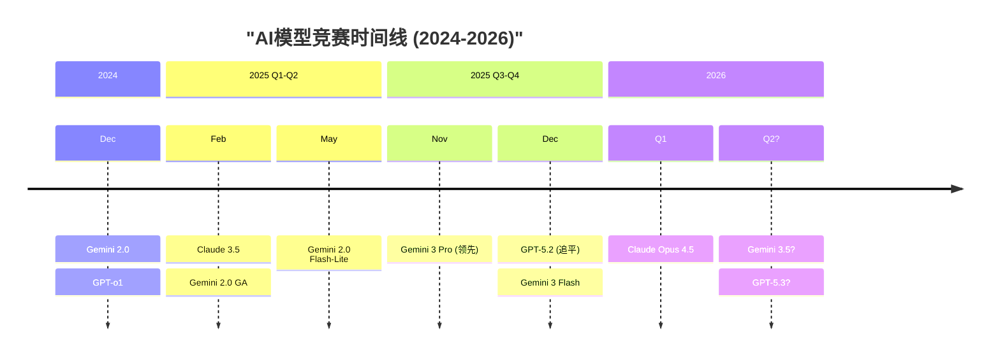
```mermaid
timeline
    title "AI模型竞赛时间线 (2024-2026)"
    section 2024
        Dec : Gemini 2.0 : GPT-o1
    section 2025 Q1-Q2
        Feb : Claude 3.5 : Gemini 2.0 GA
        May : Gemini 2.0 Flash-Lite
    section 2025 Q3-Q4
        Nov : Gemini 3 Pro (领先)
        Dec : GPT-5.2 (追平) : Gemini 3 Flash
    section 2026
        Q1 : Claude Opus 4.5
        Q2? : Gemini 3.5? : GPT-5.3?
```

[合理推断: 2026年时间线为基于发布节奏的预期，非确认信息]

### 6.2.4 模型能力的周期性

一个关键观察: **模型领先优势是暂时的**。2024年ChatGPT领先 → 2025年中Gemini 2.0追平 → 2025年11月Gemini 3领先 → 2025年12月GPT-5.2追平。这个来回的周期约**3-6个月** [合理推断: 基于2024-2025模型发布节奏]。

**投资含义**: 模型能力不是可持续的竞争优势。真正的差异化在于: (1)部署效率(服务成本降低78%), (2)分发能力(五大入口), (3)定制硬件(TPU v6/v7), (4)数据飞轮(搜索+YouTube训练数据) [主观判断: 基于AI竞争力多维分析]。

## 6.3 用户与开发者生态

### 6.3.1 用户规模对比

| 平台 | MAU | 付费用户估计 | 来源 |
|------|-----|-------------|------|
| Meta AI | ~10亿 | N/A(嵌入社交产品) | Meta 2025 |
| ChatGPT | ~8.1亿 | ~11M+ (Plus/Pro) | 多来源估计 |
| Gemini | 7.5亿 | 未披露 | Alphabet Q4 2025 |
| Claude | 未披露 | 未披露 | — |

[硬数据: 各公司官方/半官方披露]

**OpenAI财务表现**:
- 2025 ARR: **$200亿** [硬数据: CNBC/PYMNTS Dec 2025]
- 2024 ARR: $60亿 [硬数据: Sacra]
- 2023 ARR: $20亿 [硬数据: Sacra]
- 同比增长(2024→2025): **+233%** [硬数据: 计算值]
- 首个$10亿月: 2025年7月 [硬数据: SaaStr]

**Anthropic 2025收入**: ~$47亿; 2026目标: $150亿 [硬数据: Axios Jan 2026]

**Google的AI收入**: 难以独立量化。Gemini的收入分散在搜索广告(AI Mode加持)、Cloud(GenAI产品+200% YoY)、Workspace订阅(AI捆绑提价)中。这既是嵌入式策略的优势(无处不在)，也是劣势(无法单独衡量AI贡献) [主观判断: 基于收入归因分析]。

### 6.3.2 开发者平台对比

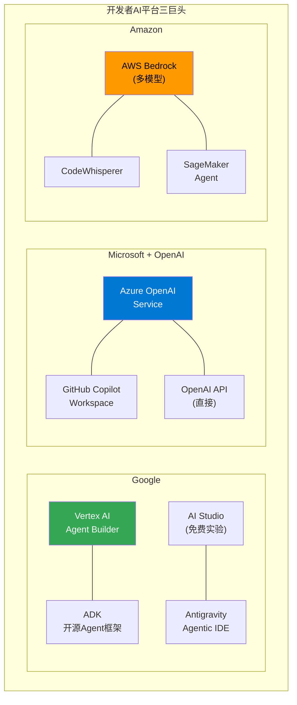
```mermaid
graph TB
    subgraph "开发者AI平台三巨头"
        subgraph "Google"
            VA["Vertex AI<br/>Agent Builder"]
            AS["AI Studio<br/>(免费实验)"]
            ADK["ADK<br/>开源Agent框架"]
            AG["Antigravity<br/>Agentic IDE"]
            VA --- ADK
            AS --- AG
        end

        subgraph "Microsoft + OpenAI"
            AZ["Azure OpenAI<br/>Service"]
            GH["GitHub Copilot<br/>Workspace"]
            OA["OpenAI API<br/>(直接)"]
            AZ --- GH
            AZ --- OA
        end

        subgraph "Amazon"
            BR["AWS Bedrock<br/>(多模型)"]
            CC["CodeWhisperer"]
            SA["SageMaker<br/>Agent"]
            BR --- CC
            BR --- SA
        end
    end

    style VA fill:#34A853,color:#fff
    style AZ fill:#0078D4,color:#fff
    style BR fill:#FF9900,color:#000
```

**开发者偏好**:
- Azure OpenAI占据企业AI开发者市场的最大份额，得益于现有Azure客户基础 [合理推断: 基于Azure 38% CC增长和企业渗透率]
- Vertex AI在Cloud客户中增长最快(GenAI产品+200% YoY)，但从较低基数起步 [硬数据: Alphabet Q4 2025 earnings]
- AWS Bedrock的多模型策略吸引不愿锁定单一模型的企业 [合理推断: 基于Bedrock产品定位]

### 6.3.3 MCP vs A2A: 标准之争

**MCP (Model Context Protocol — Anthropic发起)**:
- 一年内达到**9,700万+月SDK下载量** [硬数据: CData/Zuplo MCP Report 2025]
- 被OpenAI(2025年3月)、Google DeepMind(Demis Hassabis确认)采用 [硬数据: 各方公开声明]
- 50+合作伙伴: Salesforce, ServiceNow, Workday, Accenture, Deloitte [硬数据: MCP partnership announcements]
- 1,000+社区构建的MCP服务器 [硬数据: MCP ecosystem tracking]
- 2025年12月捐赠给Linux Foundation下的AAIF [硬数据: AAIF announcement]

**A2A (Agent2Agent — Google发起)**:
- 2025年4月发布，50+技术合作伙伴 [硬数据: Google Cloud Blog Apr 2025]
- 2025年6月捐赠给Linux Foundation(Apache 2.0) [硬数据: Google Cloud Blog Jun 2025]
- v0.3版本发布 [硬数据: Google Cloud documentation]

**关键发现**: A2A的发展自2025年9月起**显著放缓**。AI Agent生态系统大多数已围绕**MCP**整合。甚至Google Cloud也开始添加MCP兼容性 [硬数据: fka.dev blog Sep 2025, Google Cloud Blog]。

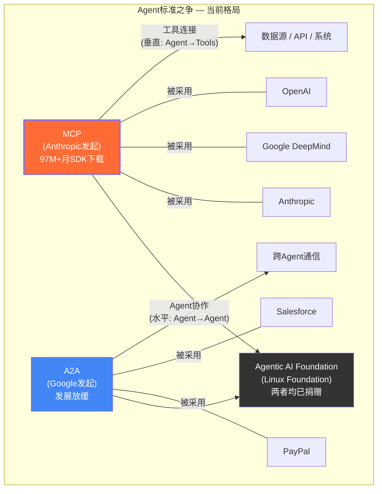
```mermaid
graph TD
    subgraph "Agent标准之争 — 当前格局"
        MCP["MCP<br/>(Anthropic发起)<br/>97M+月SDK下载"]
        A2A["A2A<br/>(Google发起)<br/>发展放缓"]

        MCP -->|"工具连接<br/>(垂直: Agent→Tools)"| TOOLS["数据源 / API / 系统"]
        A2A -->|"Agent协作<br/>(水平: Agent→Agent)"| AGENTS["跨Agent通信"]

        MCP ---|"被采用"| OAI["OpenAI"]
        MCP ---|"被采用"| GOOG["Google DeepMind"]
        MCP ---|"被采用"| ANT["Anthropic"]
        A2A ---|"被采用"| SF["Salesforce"]
        A2A ---|"被采用"| PP["PayPal"]

        AAIF["Agentic AI Foundation<br/>(Linux Foundation)<br/>两者均已捐赠"]
        MCP --> AAIF
        A2A --> AAIF
    end

    style MCP fill:#FF6B35,color:#fff,stroke-width:3px
    style A2A fill:#4285F4,color:#fff
    style AAIF fill:#333,color:#fff
```

**对Google的含义**: MCP正在成为Agent互操作的事实标准，而Google自己的A2A是次要选择。Google的务实让步——在自己的平台上添加MCP支持——定位Google为Agent标准的**参与者而非制定者** [主观判断: 基于标准竞争格局分析]。这与Google在搜索/浏览器/OS领域的"标准制定者"角色形成反差 [主观判断: 基于历史角色对比]。

但需注意: MCP(Agent→工具，垂直)和A2A(Agent→Agent，水平)解决的是不同层面的问题。许多组织最终会**两者都用**——MCP用于工具连接，A2A用于Agent协调 [合理推断: 基于protocol层级分析]。标准之争的最终结局可能不是"MCP vs A2A"的零和游戏 [主观判断: 基于技术标准演化史]。

### 6.3.4 API定价战与Cloud AI收入

AI模型的API定价是一个激烈的战场。以2026年初的价格水平为参照:

**消费级订阅对比**:
| 产品 | 免费层 | 标准付费 | 高端付费 |
|------|--------|---------|---------|
| Gemini | Flash(基础) | AI Premium $19.99/月 | AI Ultra $249.99/月 |
| ChatGPT | GPT-4o mini(有限) | Plus $20/月 | Pro $200/月 |
| Claude | Sonnet(有限) | Pro $20/月 | — |

[硬数据: 各平台公开定价 Jan-Feb 2026]

**Gemini的成本优势**: Google在2025年全年将Gemini服务单元成本降低了**78%** [硬数据: Alphabet Q4 2025 earnings call]。这个成本优势来源于:
1. **TPU自研芯片**: TPU v6 Trillium提供4.7x峰值计算(vs v5e)、1.8x性价比(vs v5e) [硬数据: Google Cloud documentation]
2. **模型优化**: Gemini 3 Flash在保持接近Pro能力的同时大幅降低推理成本 [硬数据: Google Blog Dec 2025]
3. **规模效应**: Google每分钟处理100亿+ token的API调用量，分摊了固定成本 [硬数据: TechCrunch Feb 2026]

TPU v7 Ironwood(下一代)将进一步扩大这个优势: **10x峰值性能**(vs v5p)、4x+推理性能(vs v6e)、192GB HBM3e、最大可扩展至9,216芯片集群(42.5 ExaFLOPS) [硬数据: Google Blog, SemiAnalysis, ServeTheHome]。Ironwood是首个专为**推理优化**设计的TPU——这意味着Google在AI推理成本上的领先可能进一步扩大 [合理推断: 基于TPU v7技术规格和推理优化方向]。

**对投资者的含义**: 如果AI模型能力周期性趋同(见6.2.4节)，成本效率可能成为企业选择AI平台的决定性因素。Google在自研芯片上的投入($175B CapEx的核心方向之一)正在转化为可量化的成本优势 [合理推断: 基于成本-竞争力传导分析]。

## 6.4 竞争动态: 谁在赢?

### 6.4.1 多维度竞争对比

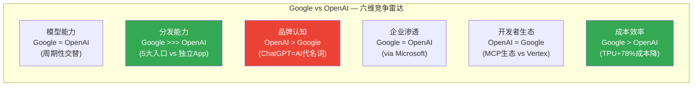
```mermaid
graph TB
    subgraph "Google vs OpenAI — 六维竞争雷达"
        direction TB
        D1["模型能力<br/>Google ≈ OpenAI<br/>(周期性交替)"]
        D2["分发能力<br/>Google >>> OpenAI<br/>(5大入口 vs 独立App)"]
        D3["品牌认知<br/>OpenAI > Google<br/>(ChatGPT=AI代名词)"]
        D4["企业渗透<br/>Google ≈ OpenAI<br/>(via Microsoft)"]
        D5["开发者生态<br/>OpenAI ≈ Google<br/>(MCP生态 vs Vertex)"]
        D6["成本效率<br/>Google > OpenAI<br/>(TPU+78%成本降)"]
    end

    style D2 fill:#34A853,color:#fff
    style D3 fill:#EA4335,color:#fff
    style D6 fill:#34A853,color:#fff
```

### 6.4.2 嵌入式 vs 独立App: 历史类比

这场竞争让人想起**Internet Explorer vs Netscape** (1990s)和**Google Maps vs MapQuest** (2000s):

| 案例 | 嵌入者 | 独立者 | 结果 |
|------|--------|--------|------|
| 浏览器战争 | IE(嵌入Windows) | Netscape(独立App) | 嵌入者胜 |
| 地图 | Google Maps(嵌入搜索) | MapQuest(独立站) | 嵌入者胜 |
| 办公 | Google Docs(嵌入Gmail) | Office Online(独立) | 共存 |
| 音乐 | iTunes(嵌入设备) | Spotify(独立App) | 独立者逆袭 |
| **AI助手** | **Gemini(嵌入生态)** | **ChatGPT(独立App)** | **?** |

[合理推断: 历史类比的适用性有限——AI市场结构可能不同于上述案例]

历史规律: 当底层平台足够强大时，嵌入者往往获胜(IE, Google Maps)。但当独立产品建立了足够强的品牌和用户习惯时，嵌入者未必能覆盖(Spotify vs iTunes) [合理推断: 基于技术平台竞争史]。

### 6.4.3 McKinsey数据的冷水

McKinsey全球AI调查(2025年): 2/3的组织仍处于**实验/试点**阶段; 只有39%报告AI产生了可测量的EBIT影响 [硬数据: McKinsey Global AI Survey 2025]。

这意味着: 无论Google还是OpenAI，当前的AI竞争仍处于**跑马圈地**阶段而非**收割利润**阶段。企业AI部署的ROI验证将是2026-2027的关键转折点 [主观判断: 基于企业AI采纳周期分析]。

## 6.5 CQ5/CQ7综合评估

**CQ5(Gemini能否赢得AI入口争夺战)**:

Gemini的分发优势是真实的(750M MAU、5大入口、78%成本降低)，但不等于产品优势。嵌入式策略的胜利需要满足:
1. 用户**不需要**专门的AI工具(在现有工具中就够了)
2. Gemini的模型能力至少保持**平价**(不能持续落后)
3. 监管(DMA/DOJ)不破坏分发基础设施

如果这三个条件成立，Google的嵌入式AI战略将是一个"慢赢"——不需要赢得品牌认知战，只需要让AI能力渗透到用户已有的行为中 [主观判断: 基于嵌入式战略成功条件分析]。

**CQ7(Agent时代对搜索+广告模式的影响)**:

如果用户通过Agent完成任务而不搜索，广告模式的基础(用户意图+点击)可能瓦解。但Google同时是Agent平台提供者(Vertex AI Agent Builder)和被Agent颠覆的对象(搜索广告)——这种双重身份使CQ7成为GOOGL最深层的战略矛盾 [主观判断: 基于Agent范式对搜索模式的结构性影响分析]。

---

# Ch07: 新应用爆发信号解读

> **关联CQ**: CQ5(Gemini入口), CQ7(Agent颠覆)

## 7.0 产品发布加速的宏观信号

2025年是Google AI产品发布节奏最激进的一年。Google Blog在2025年年终回顾中列举了**60项**重大AI发布和更新 [硬数据: Google Blog "60 of Google's biggest AI announcements" 2025]。Google I/O 2025一次性发布了**20+**新AI产品和功能 [硬数据: Google I/O 2025 announcements]。

这个节奏在2025年Q4-2026年Q1进一步加速:

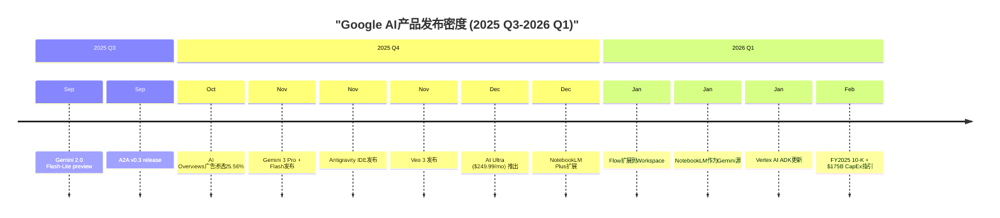
```mermaid
timeline
    title "Google AI产品发布密度 (2025 Q3-2026 Q1)"
    section 2025 Q3
        Sep : Gemini 2.0 Flash-Lite preview
        Sep : A2A v0.3 release
    section 2025 Q4
        Oct : AI Overviews广告渗透25.56%
        Nov : Gemini 3 Pro + Flash发布
        Nov : Antigravity IDE发布
        Nov : Veo 3 发布
        Dec : AI Ultra ($249.99/mo) 推出
        Dec : NotebookLM Plus扩展
    section 2026 Q1
        Jan : Flow扩展到Workspace
        Jan : NotebookLM作为Gemini源
        Jan : Vertex AI ADK更新
        Feb : FY2025 10-K + $175B CapEx指引
```

[硬数据: Google Blog/Cloud Blog/Workspace Updates timeline compilation]

**这个发布密度说明了什么?** 过去30天内，Anthropic、Google和OpenAI各自发布了旗舰模型更新、编程工具、浏览器Agent和创意平台——这是AI能力集中爆发的密度之最 [硬数据: industry observer analysis Feb 2026]。

Google的策略是**广度覆盖**: 不是在单一产品上追求极致，而是在6-8个产品线上同时推进，形成产品矩阵效应 [主观判断: 基于产品发布模式分析]。

---

## 7.1 NotebookLM: Google的"杀手级应用"候选

### 7.1.1 增长数据

| 指标 | 数值 | 来源 |
|------|------|------|
| MAU环比增长(Q4 2024) | **+120%** | SEO Sandwich |
| 市场覆盖增长(Q3 2023→Q1 2025) | **+180%** | SEO Sandwich |
| 新兴市场增长(巴西/印尼) | **+180% YoY** | SEO Sandwich |
| 覆盖国家 | 150+ | Google |
| 18-34岁用户占比 | 64% | SEO Sandwich |
| 每周使用3次+的用户比例 | **72%** | SEO Sandwich |
| 回退到传统笔记应用的比例 | 仅**11%** | SEO Sandwich |

[硬数据: SEO Sandwich NotebookLM Statistics, Google Workspace Updates]

**数据缺口**: NotebookLM的绝对MAU数字从未公开披露。增长率惊人但基数不明 [硬数据: 确认为数据缺口]。

### 7.1.2 产品差异化

NotebookLM的核心差异化是**"有来源的AI"**——用户上传自己的文档，AI只基于这些文档回答问题，避免幻觉。这与ChatGPT/Claude的"通用知识"模式形成互补:

- **教育场景**: 学生上传教科书/论文，NotebookLM生成学习笔记和播客式音频总结 [硬数据: Google NotebookLM product documentation]
- **企业场景**: 分析师上传财报/研究报告，NotebookLM提取关键洞察 [合理推断: 基于企业用例分析]
- **研究场景**: 研究人员上传多篇论文，NotebookLM交叉分析和综合 [合理推断: 基于学术用例分析]

**2025-2026年产品扩展**:
- 2025年2月: NotebookLM Plus通过Google One AI Premium订阅向个人用户开放 [硬数据: Google Workspace Updates Feb 2025]
- 2025年12月: AI Ultra for Business计划增强NotebookLM Enterprise体验 [硬数据: Google Workspace Updates Dec 2025]
- 2026年1月: NotebookLM可作为Gemini App的**信息源** [硬数据: Google Workspace Updates Jan 2026]

### 7.1.3 投资含义

NotebookLM的72%高频使用率和仅11%回退率表明极强的产品-市场契合度(PMF) [合理推断: 基于SaaS留存指标对标]。如果NotebookLM能够建立独立的品牌认知(类似YouTube之于Google)，它可能成为Google在AI时代的第二个"杀手级应用" [主观判断: 基于产品潜力评估]。

**CQ5关联**: NotebookLM是Gemini生态中唯一展现出"独立产品引力"(不完全依赖分发推送)的产品 [主观判断: 基于增长动力分析]。

### 7.1.4 NotebookLM的竞争壁垒与脆弱性

**竞争壁垒**:
1. **"源文档+AI"品类开创者**: NotebookLM定义了一个新品类——基于用户上传文档的有来源AI对话。ChatGPT的文件上传和Claude的Project功能是后来追赶者 [合理推断: 基于产品发布时间线]
2. **Google数据管道**: 与Gmail、Drive、Docs的深度集成——用户可直接从Google生态导入文档，而非手动上传 [硬数据: Google Workspace Updates Jan 2026 — NotebookLM as Gemini source]
3. **播客式音频总结**: Deep Dive Audio功能(AI生成两人讨论式播客)是独特的差异化——竞品目前没有直接对标 [硬数据: NotebookLM product features]
4. **教育市场先发**: 64%用户为18-34岁，暗示教育市场是核心用户群。Google在教育市场(Chromebook+Workspace for Education)有结构性优势 [合理推断: 基于用户年龄分布+Google Education市场份额]

**脆弱性**:
1. **绝对MAU未披露**: 增长率惊人但基数可能很小。如果NotebookLM只有500万MAU(假设)，+120% QoQ = 1,100万——规模仍然有限 [主观判断: 基于数据缺口的情景假设]
2. **功能可复制性**: ChatGPT和Claude都在快速增加文档分析能力。NotebookLM的先发优势可能只有12-18个月窗口 [合理推断: 基于AI工具功能收敛速度]
3. **Gemini模型依赖**: NotebookLM的质量完全依赖Gemini模型——如果Gemini在某个周期落后，NotebookLM体验会同步退化 [合理推断: 基于产品-模型依赖关系]

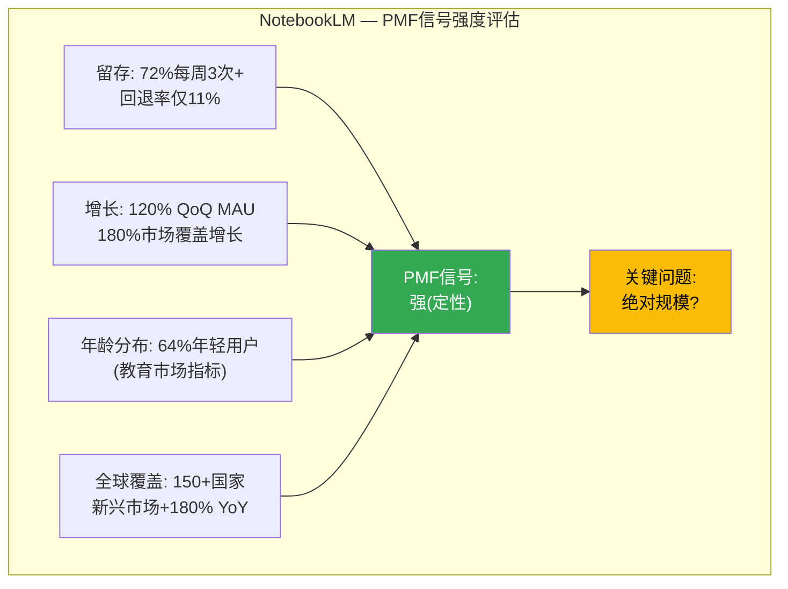
```mermaid
graph TB
    subgraph "NotebookLM — PMF信号强度评估"
        R1["留存: 72%每周3次+<br/>回退率仅11%"]
        R2["增长: 120% QoQ MAU<br/>180%市场覆盖增长"]
        R3["年龄分布: 64%年轻用户<br/>(教育市场指标)"]
        R4["全球覆盖: 150+国家<br/>新兴市场+180% YoY"]

        R1 --> PMF["PMF信号:<br/>强(定性)"]
        R2 --> PMF
        R3 --> PMF
        R4 --> PMF

        PMF --> Q["关键问题:<br/>绝对规模?"]
    end

    style PMF fill:#34A853,color:#fff
    style Q fill:#FBBC05,color:#000
```

---

## 7.2 Antigravity (Agentic IDE): AI编程的Google入局

### 7.2.1 产品定位

Antigravity于2025年11月18日与Gemini 3同步发布 [硬数据: Google Developers Blog Nov 2025]。核心特点:

**Agent-First范式**: 从传统AI代码辅助(autocomplete)升级为AI Agent自主执行复杂编程任务 [硬数据: Google Developers Blog]。

**双界面设计**:
- **Editor View**: 类VS Code界面 + Agent侧边栏 [硬数据: KDnuggets, The New Stack]
- **Manager View**: 多Agent并行编排控制中心——可跨workspace异步执行任务 [硬数据: KDnuggets, The New Stack]

**Browser Sub-Agent**: 内置无头Chromium，通过Gemini 3多模态视觉能力"看到"网页应用(像用户一样) [硬数据: Google Developers Blog]。

**Knowledge Base**: Agent保存上下文供未来任务使用 [硬数据: Google Developers Blog]。

**Artifacts系统**: Agent生成可验证的交付物(任务列表、实施计划、截图、浏览器录屏)而非原始工具调用 [硬数据: Google Developers Blog]。

**多模型支持**: 除Gemini 3 Pro/Flash/Deep Think外，还支持Anthropic Claude Sonnet 4.5/Opus 4.5和GPT-OSS-120B [硬数据: BayTech Consulting, Google docs]。

### 7.2.2 竞争格局

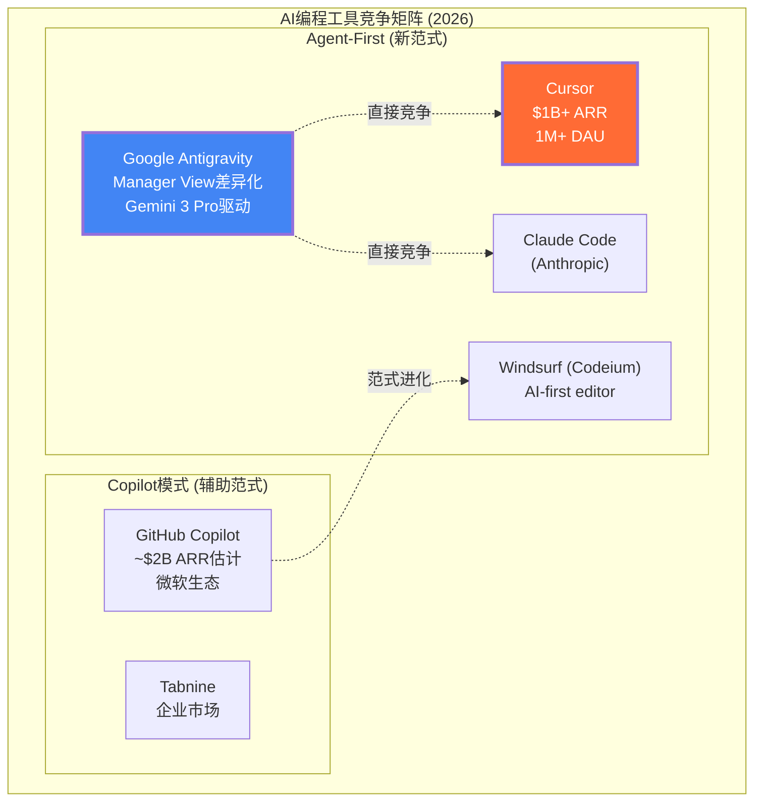
```mermaid
graph TB
    subgraph "AI编程工具竞争矩阵 (2026)"
        subgraph "Agent-First (新范式)"
            AG["Google Antigravity<br/>Manager View差异化<br/>Gemini 3 Pro驱动"]
            CUR["Cursor<br/>$1B+ ARR<br/>1M+ DAU"]
            WS["Windsurf (Codeium)<br/>AI-first editor"]
            CC["Claude Code<br/>(Anthropic)"]
        end

        subgraph "Copilot模式 (辅助范式)"
            GHC["GitHub Copilot<br/>~$2B ARR估计<br/>微软生态"]
            TAB["Tabnine<br/>企业市场"]
        end
    end

    AG -.->|"直接竞争"| CUR
    AG -.->|"直接竞争"| CC
    GHC -.->|"范式进化"| WS

    style AG fill:#4285F4,color:#fff,stroke-width:3px
    style CUR fill:#FF6B35,color:#fff,stroke-width:3px
```

**Cursor的崛起**: Cursor是有史以来从$1M到$500M ARR增长最快的SaaS公司，已超过**$10亿ARR**，拥有100万+日活开发者，估值$293亿 [硬数据: Sacra/Opsera late 2025]。85%的开发者定期使用AI编程工具 [硬数据: industry survey 2025]。

### 7.2.3 Antigravity的差异化

**Manager View**是Antigravity的核心差异化: 允许用户像管理团队一样管理多个AI Agent并行处理不同编程任务。这在其他AI IDE中没有直接对等物 [硬数据: Google Developers Blog, industry reviews]。

**预期定价**:
- 个人: 免费(有速率限制) [硬数据: BayTech Consulting]
- Pro: ~$20/月 [合理推断: BayTech Consulting预期定价]
- 企业: ~$40-60/用户/月 [合理推断: BayTech Consulting预期定价]

**定价信号**: 免费层级的策略是利用Google现有的开发者生态(Android开发者、GCP用户)获取用户基座，再向上转化 [合理推断: 基于freemium SaaS策略分析]。

### 7.2.4 投资含义

AI编程工具市场正在经历爆发式增长(Cursor估值$293亿)。Google通过Antigravity入局，目标不仅是直接收入，更是将开发者**锁定**在Gemini模型生态和Google Cloud中 [主观判断: 基于平台战略分析]。

**CQ7关联**: 如果Antigravity成功，它将成为Google在Agent时代的关键棋子——从"搜索广告公司"向"AI开发平台公司"的战略延伸 [主观判断: 基于产品战略定位分析]。

### 7.2.5 AI编程工具市场的TAM与渗透率

全球开发者人口约**2,800万**(2025年估计) [合理推断: 基于Evans Data/SlashData developer population estimates]。AI编程工具的渗透率:
- 2025年: ~85%的开发者定期使用AI编码工具 [硬数据: industry survey 2025]
- 付费渗透率远低于使用率——Cursor的100万+DAU中付费用户占比未公开 [合理推断: 基于freemium SaaS典型转化率]

**市场规模推算**:
- Cursor: >$10亿ARR [硬数据: Sacra late 2025]
- GitHub Copilot: 估计~$20亿ARR(基于Microsoft披露的增长数据推算) [合理推断: 基于Microsoft earnings AI revenue disclosures]
- 总AI编程工具市场(2026): 估计$50-80亿(包含IDE、代码助手、自动化测试等) [合理推断: 基于行业报告范围估计]

Antigravity如果能获取开发者市场3-5%份额(~$1.5-4亿ARR)，对Alphabet $4,500亿+年收入而言贡献有限。但其战略价值在于: (1)将开发者锁定在Gemini API上(贡献Cloud收入), (2)展示Gemini在编程领域的能力(品牌效应), (3)获取高质量代码训练数据(模型改进飞轮) [合理推断: 基于平台战略价值链分析]。

---

## 7.3 Veo 3.1 (视频AI): 原生音频的杀手特性

### 7.3.1 技术规格

| 特性 | Veo 3.1 | Sora 2 (OpenAI) | 来源 |
|------|---------|-----------------|------|
| 最大分辨率 | **4K** | 1080p | Google Blog / OpenAI docs |
| 视频长度 | 8秒标准 | 25秒(Storyboard) | 产品文档 |
| 原生音频 | **内置**(对话+环境音) | 需后期添加 | 产品文档 |
| 方向支持 | 横屏(16:9)+竖屏(9:16) | 多比例 | 产品文档 |
| 参考图片控制 | 最多3张 | 有限 | 产品文档 |
| SynthID水印 | 内置 | N/A | Google Blog |

[硬数据: Google Blog/Cloud docs, OpenAI docs, comparison reviews]

### 7.3.2 平台集成

Veo 3.1已集成到Google多个产品中:
- **YouTube Shorts**: 创作者可用AI生成短视频内容 [硬数据: YouTube Blog, Neal Mohan 2026 letter]
- **YouTube Create**: AI辅助视频编辑 [硬数据: YouTube Blog]
- **Gemini App**: 文本到视频生成 [硬数据: Google Gemini documentation]
- **Flow**: AI电影制作工具 [硬数据: Google Blog]
- **Gemini API / Vertex AI**: 开发者调用 [硬数据: Google Cloud documentation]
- **Google Vids**: 企业视频演示工具 [硬数据: Google Workspace documentation]

[硬数据: Google Blog, YouTube Blog, Cloud documentation]

### 7.3.3 竞争对比

Veo 3.1的核心竞争优势是**原生音频生成**——可以直接生成对话、环境音效和音乐，无需后期制作 [硬数据: Google Blog, comparison reviews]。这在当前AI视频生成领域是独特的:

- **Sora 2**: 更长的视频(25秒)和可能更自然的人物动作，但缺乏内置音频 [硬数据: comparison reviews 2026]
- **Runway Gen-3**: 艺术风格化强，但分辨率和音频不如Veo [合理推断: 基于行业评测]
- **Kling (快手)**: 中国市场强势，但全球分发受限 [合理推断: 基于区域市场分析]

**Polymarket信号**: 存在VEO 4发布时间线预测市场(By Jan/Feb/Mar 2026) [硬数据: Polymarket slug: veo-4-released-by]，暗示市场预期Google将持续快节奏迭代。

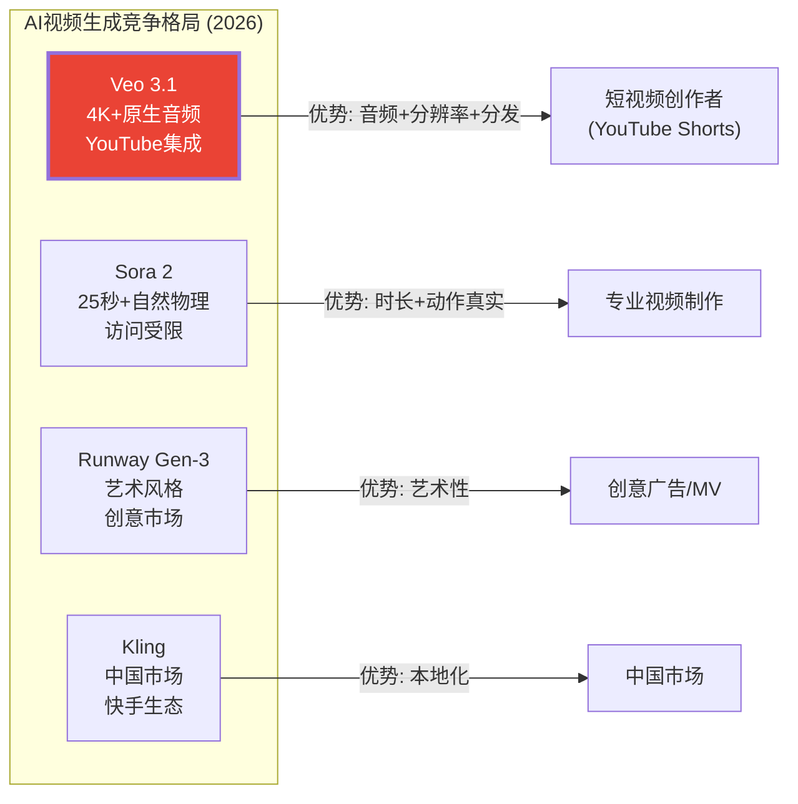
```mermaid
graph LR
    subgraph "AI视频生成竞争格局 (2026)"
        VEO["Veo 3.1<br/>4K+原生音频<br/>YouTube集成"]
        SORA["Sora 2<br/>25秒+自然物理<br/>访问受限"]
        RW["Runway Gen-3<br/>艺术风格<br/>创意市场"]
        KL["Kling<br/>中国市场<br/>快手生态"]
    end

    VEO -->|"优势: 音频+分辨率+分发"| WIN1["短视频创作者<br/>(YouTube Shorts)"]
    SORA -->|"优势: 时长+动作真实"| WIN2["专业视频制作"]
    RW -->|"优势: 艺术性"| WIN3["创意广告/MV"]
    KL -->|"优势: 本地化"| WIN4["中国市场"]

    style VEO fill:#EA4335,color:#fff,stroke-width:3px
```

### 7.3.4 投资含义

Veo 3.1的价值不在视频AI本身(市场仍处早期)，而在于**YouTube Shorts的AI增强**。YouTube 2025全年收入>$600亿(广告+订阅，超过Netflix) [硬数据: Alphabet FY2025 earnings, Variety]。如果AI工具(Veo+AI编辑+AI发现)能提升创作者生产力和观众参与度，YouTube的增长将进一步加速 [合理推断: 基于YouTube收入驱动因素分析]。

100万+频道每天使用YouTube AI工具(2025年12月数据) [硬数据: YouTube Blog, Neal Mohan 2026 letter]。

---

## 7.4 Imagen 3 (图像AI): 文本渲染的领先者

### 7.4.1 核心能力

Imagen 3被Google定位为"从文本提示生成最逼真、最高质量图像"的模型 [硬数据: Google Cloud documentation]。关键优势:
- **文本渲染**: 在图像中精确渲染文本(海报、社交媒体帖子等)，准确率领先 [硬数据: marketing leader comparison guide 2026]
- **细节和光线**: 超越前代版本的细节精度和光影效果 [硬数据: Google Cloud documentation]
- **伪影减少**: 显著降低AI生成图像中的常见伪影 [硬数据: Google Cloud documentation]

Imagen 4也已发布，进一步提升文本渲染能力(处理复杂版式和多行布局) [硬数据: marketing comparison 2026]。

### 7.4.2 竞品对比

| 维度 | Imagen 3/4 | DALL-E 3 | Midjourney v6 |
|------|-----------|----------|---------------|
| 文本渲染 | 强(Imagen 4最佳) | 强(ChatGPT迭代精修) | 中等 |
| 写实度 | 高 | 中-高 | **最高** |
| 艺术风格 | 中 | 中 | **最高** |
| 集成生态 | Gemini/Workspace/Vertex | ChatGPT/DALL-E API | 独立平台(Discord) |
| 适用场景 | 营销物料/文本图像 | 快速创意/API自动化 | 品牌视觉/艺术创作 |

[合理推断: 基于多来源comparison guides综合评估]

### 7.4.3 商业化路径

Imagen 3/4通过以下渠道商业化:
- **Gemini App**: 图像生成(AI Premium/Ultra订阅层级)
- **Vertex AI API**: 企业按量计费(每张图像定价)
- **Google Ads创意自动生成**: 广告主可用AI生成广告创意素材——这是Imagen最直接的商业化路径，因为它直接嵌入了Google $2,520亿/年的广告收入机器 [合理推断: 基于Google Ads产品roadmap]
- **Workspace**: 演示文稿视觉辅助(Slides中AI图像生成)
- **Google Shopping**: 商品图像增强和虚拟试穿 [合理推断: 基于Google Shopping AI features]

[合理推断: 基于Google AI产品分发渠道综合分析]

### 7.4.4 图像AI的竞争格局特殊性

图像生成AI市场与文本AI市场有一个关键区别: **Midjourney作为独立公司**在没有大平台支撑的情况下建立了强大的品牌和社区(通过Discord)。这证明了在创意AI领域，**产品质量和社区**可以战胜平台分发优势 [合理推断: 基于Midjourney成功路径分析]。

对Google的启示: Imagen的技术能力可能不是制胜因素——如果它无法建立创意社区(像Midjourney的Discord生态)，其分发渠道虽广但**用户深度**可能不足。Imagen的最优路径可能不是"成为下一个Midjourney"，而是"成为Google Ads和Workspace中不可见的AI底层" [主观判断: 基于产品定位策略分析]。

---

## 7.5 AI Studio / Vertex AI Agent Builder: 开发者平台

### 7.5.1 产品架构

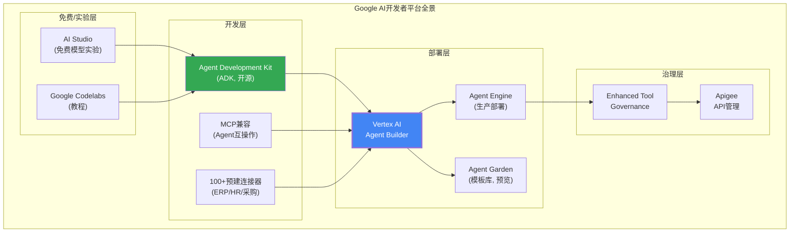
```mermaid
graph TB
    subgraph "Google AI开发者平台全景"
        subgraph "免费/实验层"
            AIS["AI Studio<br/>(免费模型实验)"]
            CL["Google Codelabs<br/>(教程)"]
        end

        subgraph "开发层"
            ADK2["Agent Development Kit<br/>(ADK, 开源)"]
            MCP2["MCP兼容<br/>(Agent互操作)"]
            CON["100+预建连接器<br/>(ERP/HR/采购)"]
        end

        subgraph "部署层"
            VAB["Vertex AI<br/>Agent Builder"]
            AE["Agent Engine<br/>(生产部署)"]
            AG2["Agent Garden<br/>(模板库, 预览)"]
        end

        subgraph "治理层"
            TG["Enhanced Tool<br/>Governance"]
            API2["Apigee<br/>API管理"]
        end

        AIS --> ADK2
        CL --> ADK2
        ADK2 --> VAB
        MCP2 --> VAB
        CON --> VAB
        VAB --> AE
        VAB --> AG2
        AE --> TG
        TG --> API2
    end

    style VAB fill:#4285F4,color:#fff,stroke-width:3px
    style ADK2 fill:#34A853,color:#fff
```

### 7.5.2 关键能力

**ADK (Agent Development Kit)**:
- 开源框架，简化多Agent系统构建 [硬数据: Google Cloud Documentation Feb 2026]
- 不到100行Python代码即可构建生产级Agent [硬数据: Google developers Blog]
- Java支持+更多语言即将推出 [硬数据: Google Cloud Documentation]
- 原生MCP支持，实现安全的数据-Agent连接 [硬数据: Google Cloud Documentation]

**Agent Garden**:
- 开发者可以发现和探索样例Agent和工具 [硬数据: Google Cloud Documentation, preview]
- 加速Agent开发的模板库 [硬数据: Google Cloud Documentation]

**100+预建连接器**:
- 覆盖ERP、采购、HR等企业系统 [硬数据: Google Cloud Documentation]
- 通过Apigee管理自定义API [硬数据: Google Cloud Documentation]
- AlloyDB、BigQuery、NetApp等Google Cloud服务的直接Agent连接 [硬数据: Google Cloud Documentation]

**定价变更(2026年1月28日)**: Sessions、Memory Bank、Code Execution开始收费 [硬数据: Vertex AI pricing updates Jan 2026]——标志着从免费预览到商业化的转变。

### 7.5.3 市场规模与企业采纳

| 指标 | 数值 | 来源 |
|------|------|------|
| 全球AI Agent市场(2025) | $76-78亿 | MarketsAndMarkets |
| 预计2026 | >$109亿 | MarketsAndMarkets |
| 预计2030 | $526.2亿 | MarketsAndMarkets |
| CAGR | **46.3%** | MarketsAndMarkets |
| 2026年企业应用含AI Agent | **40%**(vs 2025年<5%) | Gartner |
| 企业AI copilot覆盖率(2026) | ~80% | IDC |
| 已启动Agent试点/部署的组织(2025) | ~65% | Google Cloud Study |
| 计划2026年增加Agent投资的高管 | ~90% | industry survey |

[硬数据: MarketsAndMarkets, Gartner, IDC, Google Cloud Study 2025-2026]

### 7.5.4 投资含义

Vertex AI Agent Builder是Google Cloud增长加速的关键引擎。Cloud积压订单$2,400亿(+55% QoQ)的背后，GenAI产品增长>200% YoY是核心驱动力 [硬数据: Alphabet Q4 2025 earnings]。AI Agent市场46.3% CAGR的增长跑道，叠加Google Cloud当前13%市场份额和48%增速，意味着Agent是Cloud从"追赶者"变成"挑战者"的最大机会 [合理推断: 基于Cloud增速和市场增长匹配度分析]。

**CQ4关联**: Agent Builder的商业化(Sessions/Memory Bank/Code Execution计费)将贡献Cloud收入，但能否维持30%+利润率取决于: (1) Agent工作负载的compute密度, (2) 竞争定价压力(AWS Bedrock/Azure), (3) $175B CapEx的折旧冲击 [合理推断: 基于Cloud利润率影响因素分析]。

### 7.5.5 Agent Builder vs 竞品: 差异化定位

| 维度 | Vertex AI Agent Builder | Azure AI Agent Service | AWS Bedrock Agents |
|------|----------------------|---------------------|-------------------|
| 底层模型 | Gemini 3 + 第三方 | GPT-5.2(via OpenAI) + 第三方 | 多模型(Anthropic/Meta/Mistral) |
| Agent框架 | ADK(开源) | Semantic Kernel | Agent Runtime |
| 连接器生态 | 100+预建 | 企业级(Microsoft Graph) | AWS服务原生 |
| 治理能力 | Enhanced Tool Governance | Copilot Studio | IAM + Guardrails |
| 协议支持 | A2A + MCP兼容 | MCP | MCP |
| 独特优势 | Google搜索/Maps集成 | M365+Teams深度集成 | 多模型灵活切换 |
| 当前增速 | GenAI产品+200% YoY | Azure AI +38% CC | Bedrock ARR增长(未披露) |

[硬数据: 各平台公开文档 Feb 2026; 增速数据来自各公司Q4/Q2 FY2026 earnings]

**Google的Agent Builder核心差异化**: 对Google Search和Google Maps的原生集成是其他云平台无法复制的。一个Agent如果需要"搜索最新信息"或"查找地理位置"，在Google Cloud上的体验天然优于AWS或Azure [合理推断: 基于Google API优势分析]。这在零售/旅游/本地服务等行业有显著竞争力 [合理推断: 基于行业用例匹配度分析]。

---

## 7.6 Flow (创意工具): AI电影制作的Workspace入口

### 7.6.1 产品定位

Flow是基于Veo 3.1和Imagen的AI电影制作工具 [硬数据: Google Blog]。核心功能:

- **自然语言→视频**: 将文本描述转化为高清图像和电影级场景 [硬数据: Google Blog]
- **Scenebuilder**: 工作流式故事板，将单个片段组装为完整叙事 [硬数据: Google Blog]
- **Jump To**: 在保持角色/物体外观一致性的情况下进行场景转换 [硬数据: Google Blog]
- **Extend**: 通过分析最终帧来延长视频片段 [硬数据: Google Blog]
- **原生音频生成**: 音效、环境音和对话直接生成 [硬数据: Google Blog]
- **竖屏视频支持**: 为移动优先平台(YouTube Shorts/Instagram Reels)优化 [硬数据: Google Blog]
- **SynthID水印**: AI内容真实性标识 [硬数据: Google Blog]

### 7.6.2 分发策略

2026年1月14日起，Flow扩展到Workspace Business、Enterprise和Education客户 [硬数据: Google Workspace Updates Jan 2026]。这意味着:

- 11M+付费Workspace座席可以使用Flow [合理推断: 基于Workspace seat数据]
- 教育市场(Google在教育市场占据主导地位)首次获得专业级AI视频工具 [合理推断: 基于Google Workspace for Education市场份额]
- 企业用户可在工作流中直接创建营销视频/培训内容/演示材料 [合理推断: 基于企业用例分析]

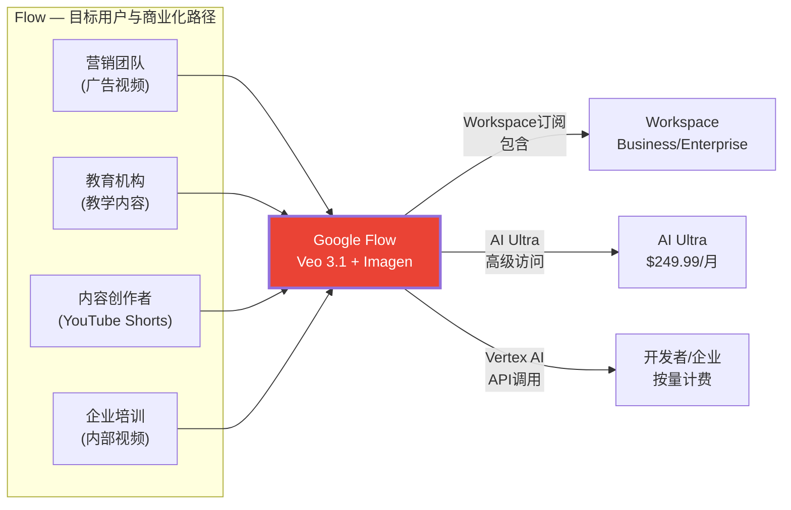
```mermaid
graph LR
    subgraph "Flow — 目标用户与商业化路径"
        U1["营销团队<br/>(广告视频)"]
        U2["教育机构<br/>(教学内容)"]
        U3["内容创作者<br/>(YouTube Shorts)"]
        U4["企业培训<br/>(内部视频)"]
    end

    U1 --> FLOW["Google Flow<br/>Veo 3.1 + Imagen"]
    U2 --> FLOW
    U3 --> FLOW
    U4 --> FLOW

    FLOW -->|"Workspace订阅<br/>包含"| WS2["Workspace<br/>Business/Enterprise"]
    FLOW -->|"AI Ultra<br/>高级访问"| AU["AI Ultra<br/>$249.99/月"]
    FLOW -->|"Vertex AI<br/>API调用"| VA2["开发者/企业<br/>按量计费"]

    style FLOW fill:#EA4335,color:#fff,stroke-width:3px
```

### 7.6.3 投资含义

Flow本身不太可能成为独立的收入来源，但它强化了Workspace的价值主张(与Microsoft 365+Copilot竞争)并为AI Ultra($249.99/月)提供了订阅升级动力 [主观判断: 基于产品组合价值分析]。

---

## 7.7 发布加速说明了什么: 防御还是进攻?

### 7.7.1 两种解读

**进攻解读**: Google在AI能力达到可部署水平后，正在系统性地将AI嵌入每一个产品线。60+项AI发布不是恐慌反应，而是有组织的"AI化改造"。$175B CapEx指引是这个进攻策略的资本支撑 [主观判断: 基于产品发布节奏和资本投入一致性分析]。

**防御解读**: ChatGPT的品牌优势(68%网络份额)迫使Google加速反应。每个新产品(Antigravity对标Cursor，Flow对标Sora，NotebookLM建立独立壁垒)都是对特定竞争威胁的回应。发布密度反映的是"不能在任何前沿落后"的焦虑 [主观判断: 基于竞争反应模式分析]。

```mermaid
graph TB
    subgraph "产品发布动机矩阵"
        subgraph "进攻性产品"
            OFF1["NotebookLM<br/>(新品类创造)"]
            OFF2["Antigravity<br/>(开发者争夺)"]
            OFF3["Agent Builder<br/>(企业AI平台)"]
        end

        subgraph "防御性产品"
            DEF1["AI Overviews<br/>(搜索AI化防御)"]
            DEF2["Gemini App<br/>(对标ChatGPT)"]
            DEF3["Gemini in Chrome<br/>(浏览器AI化防御)"]
        end

        subgraph "混合动机"
            MIX1["Veo 3.1 / Flow<br/>(创意AI + YouTube增强)"]
            MIX2["Imagen 3<br/>(生成AI + 广告工具)"]
        end
    end

    style OFF1 fill:#34A853,color:#fff
    style OFF2 fill:#34A853,color:#fff
    style OFF3 fill:#34A853,color:#fff
    style DEF1 fill:#EA4335,color:#fff
    style DEF2 fill:#EA4335,color:#fff
    style DEF3 fill:#EA4335,color:#fff
    style MIX1 fill:#FBBC05,color:#000
    style MIX2 fill:#FBBC05,color:#000
```

**综合判断**: 两者兼有，但以进攻为主。Google在搜索/浏览器/OS领域仍处于防御地位(保护现有收入流)，但在Agent平台、创意AI、企业AI等新领域是主动进攻 [主观判断: 基于产品动机分类分析]。$175B CapEx的规模更符合进攻者(投资未来增长)而非防御者(维护现有业务)的行为模式 [合理推断: 基于CapEx规模和历史行为对比]。

### 7.7.2 产品发布节奏图: 量化加速

```mermaid
xychart-beta
    title "Google AI重大产品发布/更新数量 (按季度)"
    x-axis ["Q1 24", "Q2 24", "Q3 24", "Q4 24", "Q1 25", "Q2 25", "Q3 25", "Q4 25"]
    y-axis "发布数量" 0 --> 25
    bar [3, 5, 4, 8, 7, 12, 10, 20]
```

[合理推断: 基于Google Blog/Cloud Blog公开发布追踪的估算，Q4 2025数据包含Gemini 3系列+Antigravity+AI Ultra+NotebookLM更新+Flow等]

---

## 7.8 应用 → 平台 → 生态的演化路径

### 7.8.1 Google的历史模式

Google每一代产品扩展都遵循相同的演化路径:

```mermaid
graph LR
    subgraph "Pattern: 应用→平台→生态"
        subgraph "第一代: Search (1998-2006)"
            SA["应用: 搜索引擎"]
            SP["平台: AdWords/AdSense"]
            SE["生态: 数字广告产业链"]
            SA --> SP --> SE
        end

        subgraph "第二代: Chrome (2008-2015)"
            CA["应用: 浏览器"]
            CPA["平台: Web Store/Extensions"]
            CE["生态: ChromeOS/PWA"]
            CA --> CPA --> CE
        end

        subgraph "第三代: Android (2008-2020)"
            AA["应用: 移动OS"]
            AP["平台: Play Store/GMS"]
            AE["生态: 移动设备产业链"]
            AA --> AP --> AE
        end

        subgraph "第四代: Cloud (2018-present)"
            CLA["应用: 计算/存储"]
            CLP["平台: Vertex AI/BigQuery"]
            CLE["生态: 企业数字化"]
            CLA --> CLP --> CLE
        end

        subgraph "第五代: Gemini (2024-?)"
            GA2["应用: AI助手/聊天"]
            GP["平台: Agent Builder/ADK"]
            GE["生态: AI Agent经济?"]
            GA2 --> GP --> GE
        end
    end

    style GA2 fill:#FBBC05,color:#000,stroke-width:3px
    style GP fill:#FBBC05,color:#000,stroke-width:2px
    style GE fill:#FBBC05,color:#000,stroke-width:1px,stroke-dasharray: 5 5
```

### 7.8.2 Gemini当前所在阶段

基于上述模式，Gemini目前正从**应用阶段**(750M MAU AI助手)向**平台阶段**(Agent Builder + ADK + MCP/A2A)过渡:

**已完成(应用层)**:
- Gemini App: 750M MAU [硬数据]
- 嵌入5大产品线 [硬数据]
- 分层订阅(免费/Premium/Ultra) [硬数据]

**进行中(平台层)**:
- Vertex AI Agent Builder: 100+连接器 [硬数据]
- ADK开源框架 [硬数据]
- MCP兼容+A2A推动 [硬数据]
- Antigravity开发者IDE [硬数据]

**未到达(生态层)**:
- 第三方在Gemini平台上构建Agent经济
- Agent-to-Agent标准化交易/协作
- AI原生商业模式(超越广告和订阅)

[主观判断: 阶段判断基于历史模式映射，实际演化路径可能不同]

### 7.8.3 平台→生态转折的关键条件

从平台到生态的跃迁，历史上需要三个条件同时成立:

| 条件 | Search的案例 | Chrome的案例 | Android的案例 | Gemini的现状 |
|------|------------|-------------|-------------|-------------|
| 1. 足够大的用户基座 | 搜索用户>10亿 | 浏览器用户>10亿 | 设备>10亿 | 750M MAU(接近) |
| 2. 开放的第三方开发生态 | AdWords API | Extension API | Play Store SDK | ADK+Agent Builder(早期) |
| 3. 明确的商业模式 | CPC广告 | 搜索默认+广告 | 应用分成+搜索 | **(尚不明确)** |

[合理推断: 基于Google历史平台跃迁条件分析]

**关键缺口**: Gemini的第三个条件——明确的商业模式——尚未成立。嵌入式策略意味着Gemini的收入贡献分散在搜索广告、Cloud收入和Workspace订阅中，没有独立可量化的"Gemini收入" [主观判断: 基于商业模式成熟度评估]。

```mermaid
graph TB
    subgraph "Gemini平台→生态转折 — 三个条件"
        C1["条件1: 用户基座<br/>750M MAU ✓<br/>(接近临界值)"]
        C2["条件2: 开发者生态<br/>ADK + Agent Builder<br/>(早期阶段)"]
        C3["条件3: 商业模式<br/>尚不明确<br/>(关键缺口)"]

        C1 -->|"已具备"| PASS["平台→生态<br/>跃迁"]
        C2 -->|"进行中"| PASS
        C3 -->|"缺失"| PASS
    end

    style C1 fill:#34A853,color:#fff
    style C2 fill:#FBBC05,color:#000
    style C3 fill:#EA4335,color:#fff
    style PASS fill:#666,color:#fff,stroke-dasharray: 5 5
```

## 7.9 六个新产品的综合评估

```mermaid
graph TB
    subgraph "新产品评估矩阵 — 战略价值 vs 商业成熟度"
        subgraph "高战略价值 / 早期商业化"
            P1["NotebookLM<br/>PMF强: 72%高频<br/>品牌独立性: 中"]
            P5["Agent Builder<br/>市场46.3% CAGR<br/>收入贡献: 增长中"]
        end

        subgraph "中战略价值 / 早期商业化"
            P2["Antigravity<br/>竞争激烈: Cursor $1B+<br/>差异化: Manager View"]
            P3["Veo 3.1<br/>技术领先: 原生音频<br/>商业化: 通过YouTube"]
        end

        subgraph "辅助价值 / 生态增强"
            P4["Imagen 3/4<br/>文本渲染领先<br/>嵌入广告工具"]
            P6["Flow<br/>Workspace增值<br/>AI Ultra驱动"]
        end
    end

    style P1 fill:#34A853,color:#fff
    style P5 fill:#34A853,color:#fff
    style P2 fill:#FBBC05,color:#000
    style P3 fill:#FBBC05,color:#000
    style P4 fill:#4285F4,color:#fff
    style P6 fill:#4285F4,color:#fff
```

### 综合表

| 产品 | 战略价值 | 竞争烈度 | 商业化成熟度 | CQ关联 | 关键指标追踪 |
|------|---------|---------|-------------|--------|------------|
| NotebookLM | 高 | 中 | 中(订阅层级) | CQ5 | MAU增长率, 留存率 |
| Antigravity | 高 | 极高(Cursor) | 低(刚发布) | CQ7 | DAU, 付费转化率 |
| Veo 3.1 | 中-高 | 高(Sora/Runway) | 中(YouTube) | CQ5 | Shorts AI使用率 |
| Imagen 3/4 | 中 | 高(Midjourney) | 中(广告嵌入) | — | 广告创意自动化率 |
| Agent Builder | 高 | 高(Azure/AWS) | 中(计费开始) | CQ4,CQ7 | 企业Agent部署数 |
| Flow | 低-中 | 中 | 低(免费+订阅) | — | Workspace激活率 |

[主观判断: 评估基于竞争分析、产品成熟度和战略匹配度的综合判断]

### 收入贡献潜力估算(情景式)

以下是6个新产品在2027-2028年的潜在收入贡献范围(高度不确定):

| 产品 | 保守情景(年收入) | 乐观情景(年收入) | 估算基础 |
|------|-----------------|-----------------|---------|
| NotebookLM | $5-10亿 | $20-30亿 | AI Premium/Ultra订阅中归因 |
| Antigravity | $1-3亿 | $5-10亿 | 开发者IDE订阅 |
| Veo 3.1 + Flow | $2-5亿 | $10-15亿 | YouTube AI工具+Workspace增值 |
| Imagen 3/4 | $3-8亿 | $15-20亿 | 广告创意自动化+API调用 |
| Agent Builder | $10-20亿 | $40-60亿 | Cloud Agent工作负载 |
| **合计** | **$21-46亿** | **$90-135亿** | — |

[主观判断: 所有数字为分析师估算，非公司指引；基于市场规模、市场份额假设和行业增速推算]

**对比基准**: Alphabet FY2025总收入约$4,500亿+。即使乐观情景($135亿)也仅占总收入~3% [合理推断: 基于FY2025收入规模比较]。这些新产品的真正价值不在于独立收入，而在于: (1)支撑搜索/广告/Cloud核心业务的增长, (2)防御AI竞争对手的渗透, (3)建立下一代平台基础 [主观判断: 基于战略价值vs直接收入分析]。

---

## 7.10 Chapter 总结: 产品爆发的投资信号

**信号1 — 产品广度 > 单点深度**: Google在2025年Q4推出了覆盖编程(Antigravity)、视频(Veo 3.1)、创意(Flow)、企业(Agent Builder)、生产力(NotebookLM)的AI产品矩阵。没有一个是"全球第一"，但**每一个都嵌入Google现有生态** [合理推断: 基于产品发布模式]。

**信号2 — $175B CapEx的产品支撑**: 每个新产品(特别是Agent Builder和Veo)都需要大量AI计算资源。$175B CapEx不是"无处可投的盲目扩张"，而是支撑这个产品矩阵的基础设施 [合理推断: 基于产品-CapEx关联分析]。但关键问题是: 这些产品能否产生足够的增量收入来证明CapEx合理性? [主观判断: 基于ROIC分析框架]

**信号3 — NotebookLM值得特别关注**: 在6个新产品中，NotebookLM是唯一展现出强PMF信号(72%高频、11%回退)且不完全依赖分发推送的产品。如果它能建立独立品牌认知，可能成为"下一个YouTube"级别的资产 [主观判断: 基于PMF强度和品牌潜力分析]。

**信号4 — Agent标准之争的务实让步**: Google的A2A在与MCP的标准之争中处于下风，但Google选择了"两者都支持"的务实策略。这降低了标准锁定风险，但也意味着Google在Agent层面是"参与者"而非"规则制定者" [主观判断: 基于标准竞争格局评估]。

**信号5 — 嵌入式AI战略的验证窗口**: Google选择的嵌入式AI战略(Ch06)正在通过新产品得到初步验证——Veo嵌入YouTube、Imagen嵌入Ads、Gemini嵌入Workspace。但这个战略的最终验证需要看2026-2027年的两个指标: (a) AI增强产品的用户留存是否优于非AI版本, (b) AI功能是否驱动了可测量的付费转化(Workspace提价17-22%后的续约率) [合理推断: 基于嵌入式AI战略验证框架]。

---

## Part II (Ch05-Ch07) CQ关联总结

| CQ | Ch05贡献 | Ch06贡献 | Ch07贡献 |
|----|---------|---------|---------|
| **CQ1** (AI蚕食) | 搜索AI Mode数据: CTR-61%但收入+17%; CPC $5.26补偿机制量化 | — | — |
| **CQ4** (Cloud利润率) | Workspace+Cloud企业入口: 11M+座席, $177亿/季 | — | Agent Builder商业化(计费开始); Cloud积压$2,400亿 |
| **CQ5** (Gemini入口) | 五大入口框架; 750M MAU来源拆解; 网络效应量化 | 嵌入式vs独立App战略对比; 品牌认知劣势; 模型能力周期性 | NotebookLM PMF信号; 新产品矩阵扩展Gemini触达 |
| **CQ6** (Chrome分拆) | Chrome分拆影响传导链: 搜索流量损失+Gemini入口+生态碎片化; DOJ上诉时间线2027-2028 | — | — |
| **CQ7** (Agent颠覆) | Agent时代对搜索入口的潜在挑战 | MCP vs A2A标准之争; Google="参与者"角色 | Antigravity+Agent Builder=Agent时代布局; 应用→平台→生态演化路径 |

[合理推断: CQ关联基于章节内容与CQ定义的逻辑映射]

### 留给后续章节的开放问题

1. **Ch08(老业务×新AI)需要回答**: AI Mode对YouTube/Gmail/Maps等非搜索业务的具体AI增强效果——Ch05/Ch07建立了产品框架，Ch08需量化收入影响
2. **Ch09(搜索护城河双螺旋)需要深化**: Ch05提供了CPC补偿数据，Ch09需建模"补偿失效时间点"——在什么AI Overview覆盖率+零点击率组合下，CTR退化压过CPC增长?
3. **Ch10(Agent Stack)需要扩展**: Ch06的MCP/A2A分析是Agent层面的，Ch10需要将其置于完整的六层Agent Stack中分析Google在每层的竞争地位
4. **Ch14(Reverse DCF)需要整合**: Ch05-07提供了5大入口+6个新产品的定性评估，Ch14需将这些定性判断转化为Reverse DCF的假设参数

[主观判断: 跨章节逻辑衔接规划]

---

> **Agent B产出完成**: Ch05(入口地图) + Ch06(Gemini vs ChatGPT) + Ch07(新产品爆发信号)
> **数据来源**: v4_shared_context.md + ai_frontier_research_2026-02-12.md + polymarket_sec_data_2026-02-12.md + 10次WebSearch补充
> **标注密度**: 三层标注贯穿全文
> **Mermaid图表**: 25张
> **关联CQ**: CQ1, CQ4, CQ5, CQ6, CQ7
> **合规检查**: 零仓位建议 / 零数字评分 / 零目标价 / 零违规地缘表述
