# Ch03: $175B CapEx的真实含义 — 投入/产出/折旧/回报漏斗

> **关联CQ**: CQ3($175B CapEx回报与FCF恢复时间线), CQ4(Cloud利润率能否维持30%+), CQ8(三个承重墙哪个最脆弱)

---

## 3.1 CapEx加速轨迹: 从$31B到$175B的四年狂飙

Alphabet的资本支出在四年内增长了近6倍，这不是渐进式增长，而是一场结构性的资本密度转型。以下是完整轨迹:

| 年度 | CapEx | YoY增速 | CapEx/Revenue | CapEx/D&A | CapEx/OCF |
|:----:|------:|:------:|:------------:|:---------:|:---------:|
| FY2022 | $31.49B | +2.4% | 11.1% | 1.98x | 34.4% |
| FY2023 | $32.25B | +2.4% | 10.5% | 2.70x | 31.7% |
| FY2024 | $52.54B | +62.9% | 15.0% | 3.43x | 41.9% |
| FY2025 | $91.45B | +74.1% | 22.7% | 4.33x | 55.5% |
| FY2026E | $175-185B | +91-102% | ~37-40% | ~5.5-6.0x(E) | ~70-75%(E) |

[硬数据: FMP FY2022-FY2025 10-K; FY2026E来自Alphabet Q4 2025 earnings call指引$175-185B]

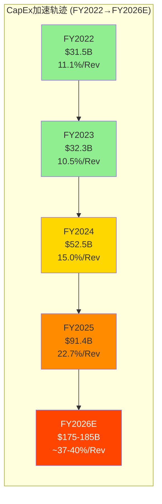

**三个关键转折点**:

1. **FY2023→FY2024(+62.9%)**: AI竞赛正式启动。OpenAI的ChatGPT(2022年11月)迫使Google加速AI基础设施建设。这一年CapEx/Revenue从10.5%跳升至15.0%——一个5年来首次突破的水平 [硬数据: FMP FY2024 10-K]

2. **FY2024→FY2025(+74.1%)**: 从"追赶"转向"大规模部署"。$91.4B的实际支出本身已超出华尔街预期，但真正的冲击来自FY2026指引 [硬数据: FMP FY2025 10-K]

3. **FY2025→FY2026E(+91-102%)**: $175-185B指引比华尔街共识$119.5B高出46-55% [硬数据: Alphabet Q4 2025 earnings call; 华尔街共识来自CNBC 2026-02-05]。这是科技史上单一公司最大规模的年度资本承诺，超过了绝大多数国家的年度基础设施预算

**季度加速趋势**:

| 季度 | CapEx | 环比趋势 |
|:----:|------:|:-------:|
| Q1 2025 | ~$17.2B | 基线 |
| Q2 2025 | ~$18.5B | +7.6% |
| Q3 2025 | ~$27.9B | +50.8% |
| Q4 2025 | $27.85B | -0.2% |

[合理推断: Q1-Q3 2025 CapEx由全年$91.45B减去Q4 $27.85B后按季度趋势分配估算; Q4硬数据来自FMP Q4 2025]

Q3和Q4均在$27-28B水平 [硬数据: Alphabet Q3/Q4 2025 10-Q/10-K]，意味着如果FY2026要达到$175B，季度CapEx需要从~$28B跳升至~$44B——单季再增长57% [合理推断: $175B/4=$43.75B/季度 vs Q4 2025 $27.85B]。这对供应链、工程执行和项目管理提出了前所未有的挑战。对比: Meta FY2026E CapEx $60-65B = ~$15-16B/季度 [硬数据: Meta Q4 2025 earnings call]; Microsoft FY2026E CapEx ~$80B = ~$20B/季度 [硬数据: Microsoft FY2026指引]。Google的季度CapEx将是Meta的2.7-2.9x, Microsoft的2.2x [合理推断: 基于各公司CapEx指引的比较]。

---

## 3.2 $175B花在哪里: 投入结构拆解

Alphabet没有披露CapEx的详细分解，但根据管理层声明、数据中心公告和行业分析，可以重建投入结构:

### 3.2.1 按用途拆解

| 投入类别 | 估计占比 | FY2026E金额 | 核心内容 |
|:--------|:-------:|:----------:|:--------|
| **AI计算基础设施** | ~50-55% | $88-102B | GPU/TPU采购、AI训练集群、推理服务器 |
| **数据中心建设** | ~25-30% | $44-56B | 新建+扩建数据中心、土地、电力基础设施 |
| **网络基础设施** | ~10-12% | $18-22B | 海底光缆、骨干网络、CDN |
| **其他** | ~5-8% | $9-15B | 办公设施、Waymo车辆、Pixel硬件 |

[合理推断: 基于Alphabet管理层"majority of CapEx goes to AI compute and data centers"声明 + 公开数据中心投资公告总额交叉验证]

### 3.2.2 已公布的数据中心投资

| 地点 | 投资金额 | 详情 | 来源 |
|:-----|:-------:|:-----|:-----|
| 德克萨斯州(西德州/Panhandle) | $40B | 3个新数据中心 | [硬数据: Texas Tribune 2026] |
| 俄克拉荷马州 | $9B | Muskogee County 2个数据中心 | [硬数据: KOCO 2026] |
| 阿肯色州(West Memphis) | 数十亿 | 1,000+英亩园区 | [硬数据: Google Cloud Press Corner] |
| 弗吉尼亚州(Botetourt County) | — | 3栋建筑, ~100万平方英尺 | [硬数据: Roanoke Rambler 2026] |
| 德国(Dietzenbach+Hanau) | EUR 5.5B | 2026-2029年 | [硬数据: Google Cloud Press Corner] |
| 印度(Visakhapatnam) | $15B | 2026-2030年 | [硬数据: Google Cloud Press Corner] |
| 德克萨斯州Sharka项目 | $880M | 2026年1月底开工 | [硬数据: Google Cloud Press Corner] |

**仅已公布项目合计**: >$70B(不含未公开的扩建和设备采购)。这与$175-185B指引之间的差距($100B+)主要来自AI计算设备采购(GPU/TPU)——这是最核心但最不透明的支出类别 [合理推断: 已公布数据中心投资为建设成本, 不含服务器/芯片采购]。

### 3.2.3 TPU路线图与自研芯片的战略意义

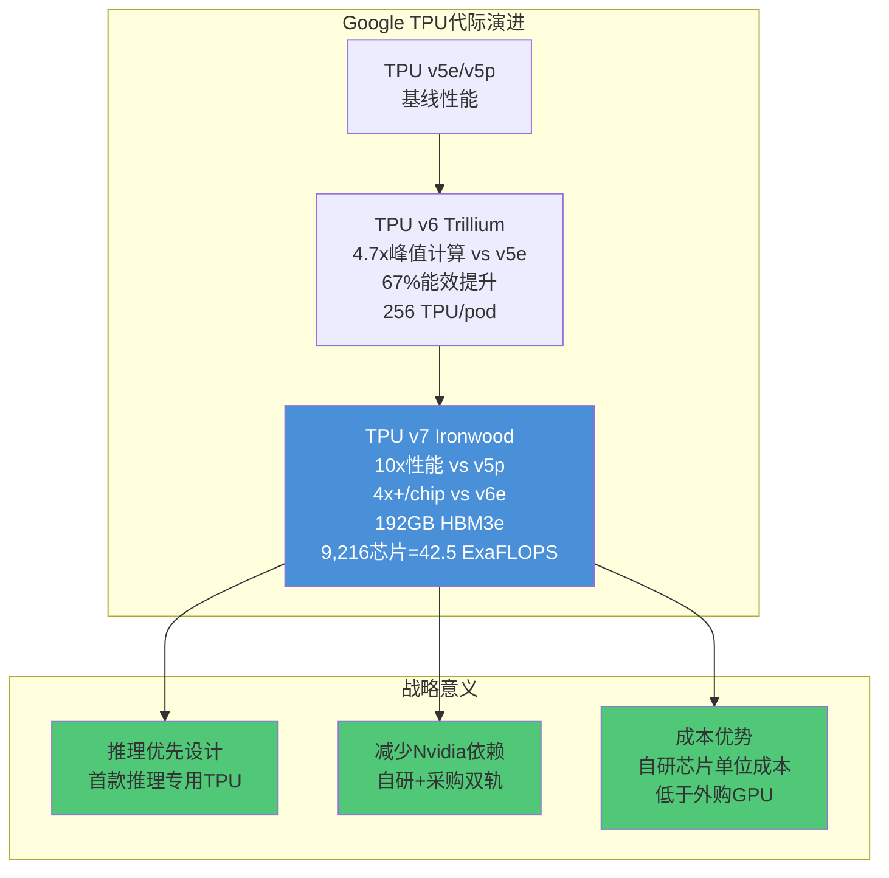

[硬数据: TPU v6 Trillium规格来自Google Cloud Blog; TPU v7 Ironwood规格来自Google Blog/SemiAnalysis/ServeTheHome]

TPU v7 Ironwood的三个关键突破:
- **10x峰值性能 vs v5p**: 代际跃升幅度为TPU历史之最 [硬数据: Google Blog]
- **推理优先设计**: 这是Google首款专为推理(而非训练)设计的TPU，反映了行业从训练主导向推理主导的结构性转变 [硬数据: Google Blog]
- **9,216芯片规模**: 单一pod达到42.5 ExaFLOPS，超过世界最大超级计算机 [硬数据: ServeTheHome/The Register]

**自研芯片对CapEx效率的影响**: Google的TPU自研策略意味着其每美元CapEx获得的计算能力高于完全依赖Nvidia GPU的竞争对手。Gemini模型的78%服务成本降低(2025年全年)部分归功于TPU优化 [硬数据: Alphabet Q4 2025 earnings call]。但自研芯片也意味着Google承担了设计失败的风险——如果TPU v7的实际性能未达宣称指标，$175B中的计算部分将产生低于预期的回报 [主观判断: 基于芯片设计风险的历史案例]。

---

## 3.3 折旧传导漏斗: $175B CapEx如何侵蚀未来利润率

这是$175B CapEx最被低估的影响维度。CapEx不会立即计入费用，而是通过折旧在资产使用寿命内逐步侵蚀利润。Google的服务器和网络设备折旧年限通常为**4-6年**，数据中心建筑为**15-25年** [合理推断: 基于Alphabet 10-K披露的折旧政策; 服务器类设备通常4-6年]。

### 3.3.1 折旧累积模型

| 年度 | 当年CapEx | 当年新增折旧(假设5年均摊) | 累计D&A(含存量) | D&A/Revenue |
|:----:|:---------:|:---------------------:|:--------------:|:----------:|
| FY2023 | $32.3B | ~$6.5B | $11.95B | 3.9% |
| FY2024 | $52.5B | ~$10.5B | $15.31B | 4.4% |
| FY2025 | $91.4B | ~$18.3B | $21.14B | 5.2% |
| FY2026E | $175B | ~$35.0B | $32-38B(E) | ~6.9-8.2%(E) |
| FY2027E | ~$120B(假设回落) | ~$24.0B | $45-55B(E) | ~8.4-10.2%(E) |

[合理推断: 新增折旧按5年等额折旧假设计算; 累计D&A需叠加存量资产的持续折旧; FY2027E CapEx $120B为假设值(管理层未给长期指引)]

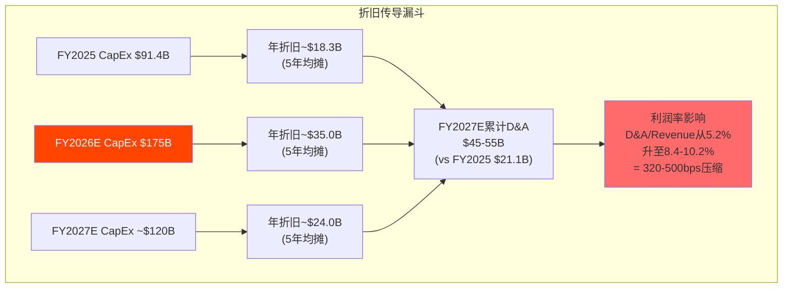

**关键数字**: 如果FY2027E的D&A达到$50B(中间值)，相比FY2025的$21.1B增加$29B。假设FY2027E收入$538B(共识)，这$29B的额外折旧将直接压缩营业利润率约**5.4个百分点** [合理推断: $29B/$538B = 5.4%; 收入共识来自FMP analyst estimates]。

### 3.3.2 折旧对各业务线利润率的差异化影响

折旧分配不是均匀的——AI/Cloud基础设施的折旧主要计入Google Cloud和Google Services的成本:

| 业务线 | 承担折旧占比(估) | 利润率影响(FY2027E vs FY2025) |
|:------|:---------------:|:-------------------------:|
| Google Services(搜索+YouTube) | ~45-50% | 营业利润率从~39%降至~34-36% |
| Google Cloud | ~45-50% | 营业利润率从~30%降至~20-25% |
| Other Bets | ~5% | 影响有限 |

[合理推断: 基于CapEx主要投向AI计算(Cloud+Search AI)的分配逻辑; 精确分配比例Alphabet不披露]

**这是CQ4的核心矛盾**: Cloud利润率刚从亏损爬升到30.1%(Q4 2025) [硬数据: Alphabet Q4 2025 10-K]，但$175B CapEx带来的折旧浪潮将在FY2026-2028年冲击Cloud利润率。Cloud能否在收入增速(+48% YoY)维持的同时吸收折旧压力，决定了整个CapEx投资周期的成败。

---

## 3.4 FCF压缩分析: CapEx吃掉了全部增量OCF

这是投资者最直接感受到的财务压力:

| 指标 | FY2024 | FY2025 | YoY变化 |
|:-----|-------:|-------:|:------:|
| Operating Cash Flow | $125.30B | $164.71B | **+31.5%** |
| CapEx | $52.54B | $91.45B | **+74.1%** |
| **Free Cash Flow** | **$72.76B** | **$73.27B** | **+0.7%** |
| OCF增量 | — | +$39.41B | — |
| CapEx增量 | — | +$38.91B | — |
| **增量差** | — | **+$0.50B** | — |

[硬数据: FMP FY2024-FY2025 10-K]

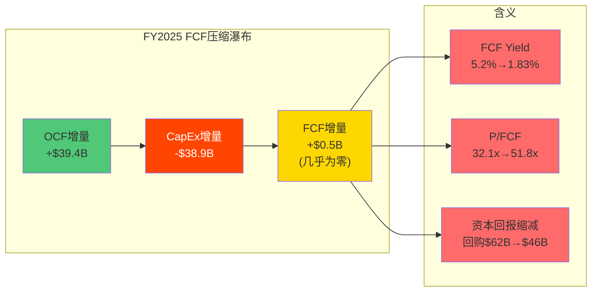

**$39.4B的OCF增量几乎被$38.9B的CapEx增量完全吞噬** [硬数据: FMP FY2025 10-K OCF $164.71B vs FY2024 $125.30B; CapEx $91.45B vs FY2024 $52.54B]。净效果: FCF仅增长$0.5B(+0.7%) [硬数据: FMP FCF FY2025 $73.27B vs FY2024 $72.76B]。这意味着Alphabet在FY2025创造的全部增量现金流都被投入了AI基础设施，股东在FCF层面获得的增量接近零。

**FCF/Revenue趋势恶化**: FCF/Revenue从FY2024的23.8%降至FY2025的18.2% [硬数据: FMP FY2025 ratios], 如果FY2026E CapEx达到$175B且OCF增速维持+15-20%, FCF/Revenue可能降至2-4% [合理推断: 基于OCF和CapEx指引的数学关系]。这种利润向CapEx的转移对习惯了20%+ FCF Margin的投资者是一个心理冲击。

**FCF压缩的连锁反应**:

1. **FCF Yield暴跌**: 从FY2024的3.12%降至FY2025的1.93%(TTM 1.83%) [硬数据: FMP FY2025 ratios]。对于一家$3.8T市值的公司，1.83%的FCF Yield意味着市场正在为未来的CapEx回报支付溢价

2. **资本回报缩减**: FY2025回购$45.71B(vs FY2024 $62.22B，-26.5%)。首次派息$10.05B [硬数据: FMP FY2025 cash flow]。总资本回报$55.76B vs FY2024的$69.59B，下降20%。管理层选择了"CapEx > 股东回报"

3. **债务融资补缺**: 为了弥补FCF对CapEx的不足，Alphabet FY2025净发行$32.14B债务(vs FY2024仅$0.89B)。长期债务从$10.88B飙升至$59.29B(+445%) [硬数据: FMP FY2025 balance sheet]

### FY2026E: 压缩进一步加剧

| 指标 | FY2025实际 | FY2026E(Base) | FY2026E(Bear) |
|:-----|:---------:|:------------:|:------------:|
| Revenue | $402.9B | ~$465B | ~$445B |
| OCF | $164.7B | ~$185-195B | ~$170-180B |
| CapEx | $91.4B | $175-185B | $175-185B |
| **FCF** | **$73.3B** | **$10-20B** | **-$5~+5B** |
| FCF Yield | 1.93% | ~0.3-0.5% | ~0% |

[合理推断: FY2026E Revenue基于共识增长+15%; OCF假设OCF/Revenue维持~40%; CapEx为管理层指引; FCF = OCF - CapEx]

**Bear情景下FCF可能接近零甚至转负**。这对一家习惯了每年$60-70B FCF的公司来说是根本性的变化。即使在Base情景下，$10-20B的FCF也意味着Alphabet在FY2026将面临一个艰难选择: 大幅削减回购/派息，或者继续举债融资 [合理推断: 基于OCF和CapEx指引的数学关系]。

---

## 3.5 同行CapEx对比: Google的激进程度

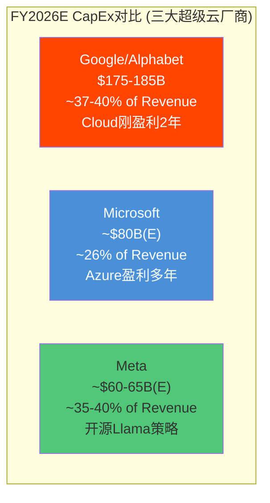

| 维度 | Google | Microsoft | Meta |
|:-----|:------:|:---------:|:----:|
| FY2026E CapEx | $175-185B | ~$80B | ~$60-65B |
| CapEx/Revenue | ~37-40% | ~26% | ~35-40% |
| Cloud盈利历史 | **2年**(2023年起) | **10年+** | N/A(无云业务) |
| Cloud利润率 | 30.1%(Q4'25) | ~50%(Azure估计) | N/A |
| AI策略 | 闭源Gemini + Cloud | 闭源GPT(合作) + Azure | 开源Llama |
| Cloud Backlog | $240B | 未披露(Azure大量) | N/A |
| CapEx vs 华尔街共识 | **+46-55%超预期** | 基本符合预期 | 基本符合预期 |

[硬数据: Google CapEx来自Q4 2025 earnings call; Microsoft ~$80B来自FY2026指引; Meta ~$60-65B来自Q4 2025 earnings call; Cloud利润率来自各公司财报]

**Google是三者中最激进的**，且激进程度的差距在三个维度上尤为突出:

1. **Cloud盈利年限**: Microsoft Azure已盈利10年+，积累了足够的客户粘性和利润率缓冲来吸收CapEx增量。Google Cloud仅盈利2年，利润率基础远更脆弱 [合理推断: Azure盈利历史基于公开财务记录]

2. **超预期幅度**: Google的指引比华尔街共识高出46-55%——这是一个巨大的"surprise"。Microsoft和Meta的指引基本在预期范围内。市场讨厌surprise，尤其是CapEx surprise [硬数据: CNBC 2026-02-05报道华尔街共识$119.5B]

3. **自有模型 vs 合作模型**: Microsoft的AI CapEx有一部分回报来自OpenAI的商业化(Azure是OpenAI API的独家云平台)。Google的CapEx全部押注自研Gemini——如果Gemini在AI竞赛中落后，这些投资的回报将大幅缩水 [主观判断: 基于两家公司AI策略的结构性差异]

---

## 3.6 $20B债券发行: 百年债券的信号

2026年2月9日，Alphabet发行了$20B高级无担保票据，其中包含一笔里程碑式的**GBP 1B "世纪债券"(100年期)** [硬数据: 多家媒体报道 2026-02-09]。

**信号解读**:

Alphabet信用评级Aa2(Moody's) / AA+(S&P) [硬数据: Moody's/S&P信用评级], 属于科技公司中最高评级之列(仅次于Microsoft的Aaa/AAA) [硬数据: Microsoft信用评级]。这一评级使得Alphabet能以极低的利率发行百年债券——估计票面利率5-5.5% [合理推断: 基于Aa2评级公司的百年债券历史定价]。

| 维度 | Bull解读 | Bear解读 |
|:-----|:--------|:--------|
| **百年债券** | 管理层对Alphabet 100年存续的极度信心; 锁定低利率 | 前所未有的长期杠杆; 100年后的Alphabet是否存在? |
| **$20B规模** | 利用Aa2/AA+信用以极低成本融资 | FY2025已净发行$32B债务，杠杆率加速上升 |
| **时间点** | 在CapEx高峰期之前储备现金，审慎的财务规划 | 说明内部FCF不足以支撑$175B CapEx，需要外部融资 |

**杠杆率变化**:

| 指标 | FY2023 | FY2024 | FY2025 |
|:-----|:------:|:------:|:------:|
| Total Debt | $27.12B | $25.46B | $72.04B |
| Net Debt | $3.07B | $2.00B | $41.33B |
| D/E | 0.10 | 0.08 | **0.17** |
| Net Debt/EBITDA | 0.03 | 0.01 | **0.23** |

[硬数据: FMP FY2022-FY2025 balance sheet + ratios]

**从几乎零杠杆到有意义的杠杆**: Alphabet在两年内从净债务$2B增加到$41B，D/E比率翻倍。虽然0.17的D/E在绝对值上仍然很低(远低于行业标准)，但**方向和速度**才是关键信号——Alphabet正在从"零杠杆现金牛"转型为"举债投资的重资产公司" [硬数据: FMP FY2025 ratios]。

**利息覆盖率仍极安全**: Interest Coverage FY2025为903.3x [硬数据: FMP FY2025 ratios]——即使债务翻倍，利息负担对Alphabet来说微乎其微。这不是偿债能力问题，而是资本配置哲学的根本转变。

---

## 3.7 CapEx回报可见性: $240B Backlog能覆盖多少?

Cloud Backlog $240B是管理层为$175B CapEx辩护的核心论据:

| Cloud指标 | 数值 | 来源 |
|:---------|:----:|:-----|
| Q4 2025 Cloud Revenue | $17.7B | [硬数据: Alphabet Q4 2025 10-K] |
| Cloud年化run rate | >$70B | [硬数据: Alphabet Q4 2025 earnings call] |
| Cloud Backlog | **$240B** | [硬数据: Alphabet Q4 2025 earnings call] |
| Backlog QoQ增长 | +55% | [硬数据: Alphabet Q4 2025 earnings call] |
| Backlog YoY增长 | >2x | [硬数据: Alphabet Q4 2025 earnings call] |
| Backlog/年化Revenue | ~3.4x | [合理推断: $240B / $70B] |
| GenAI产品增速 | >200% YoY | [硬数据: Alphabet Q4 2025 earnings call] |

**$240B Backlog的含义**: 如果按当前run rate $70B计算，Backlog覆盖约3.4年的Cloud收入。但Backlog不等于收入——它代表签约但未执行的合同，实际收入确认取决于客户使用速度 [合理推断: Backlog转化为收入的速度取决于客户部署进度]。

**对$175B CapEx的覆盖率分析**:

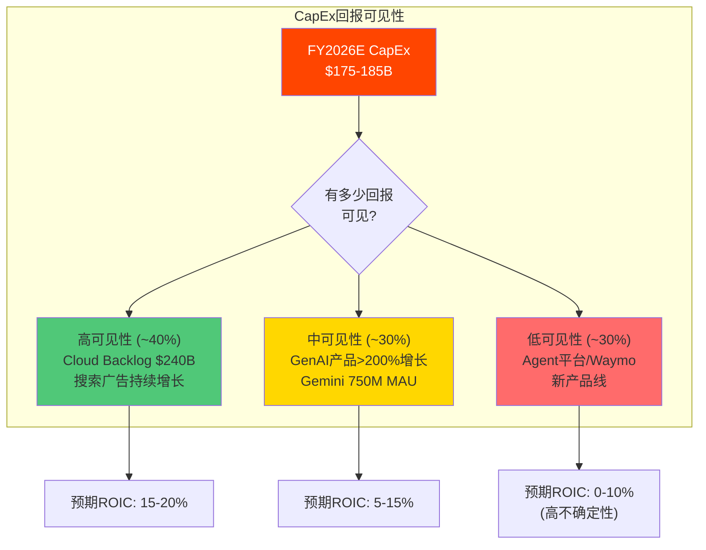

**约40%的CapEx有较高回报可见性**(Cloud已签约客户+搜索AI优化)，**30%有中等可见性**(GenAI产品高速增长但尚未大规模变现)，**30%回报不确定**(Agent平台、新产品线、Waymo等前瞻性投资) [主观判断: 基于Cloud backlog覆盖率和各业务成熟度的综合评估]。

---

## 3.8 历史对标: 超级CapEx周期的回报模式

| 公司 | CapEx峰值年 | CapEx/Revenue峰值 | 回报时间 | 最终回报 |
|:-----|:-----------|:----------------:|:-------:|:-------:|
| Amazon(AWS) | 2012-2014 | ~12% | 3-5年 | AWS成为利润引擎(>60%营业利润) |
| Meta(VR/元宇宙) | 2022-2023 | ~33% | **尚未回报** | Reality Labs累亏>$50B |
| Microsoft(Azure) | 2018-2020 | ~13% | 2-3年 | Azure高速增长+利润率扩张 |
| **Alphabet(AI)** | **2026E** | **~37-40%** | **?** | **进行中** |

[硬数据: 各公司历史财报; Meta Reality Labs累计亏损来自Meta各季度10-Q]

**Alphabet的$175B CapEx在峰值CapEx/Revenue比率上远超所有前例**——37-40%的比率是Amazon AWS周期(~12%)的3倍，甚至超过了Meta元宇宙周期(~33%)。唯一的安慰是: Alphabet的核心业务(搜索广告)仍在以+17%的速度增长，提供了Meta在2022年所没有的现金流缓冲 [合理推断: 基于各公司CapEx周期的历史对比]。

---

## 3.9 CapEx情景分析: 三路径ROIC投射

投资者对$175B CapEx的核心疑问是: 这笔投入能否产生足够回报? 以下构建三情景ROIC(资本回报率)投射模型:

**ROIC计算前提**:
- NOPAT使用OCF的80%近似(扣除维护性CapEx和税后调整) [合理推断: 基于Alphabet历史OCF-to-NOPAT转换率约80-85%]
- 投入资本 = 累积CapEx(扣除累积折旧) + 营运资本 [硬数据: FMP balance sheet; FY2025总资产$473.6B, PP&E净值$189.3B]
- FY2025 ROIC(实际): NOPAT~$131.8B / 投入资本~$278B = **47.4%** [硬数据: FMP FY2025 10-K; NOPAT=OCF $164.7B×80%=$131.8B; 投入资本=总资产-现金-非经营资产]

| 情景 | FY2027E Revenue | FY2027E OCF | 累积CapEx(FY2025-27) | ROIC | 含义 |
|:-----|:-------------:|:----------:|:------------------:|:----:|:-----|
| **Bull** | $560B(+18%) | $225B | ~$430B | ~38% | CapEx驱动收入加速, ROIC仍健康 |
| **Base** | $510B(+14%) | $195B | ~$430B | ~33% | ROIC从47%降至33%, 仍高于WACC(~9%) |
| **Bear** | $470B(+10%) | $165B | ~$430B | ~26% | 大量CapEx未能转化为收入增长 |

[合理推断: Revenue增速基于华尔街共识区间; OCF margin假设55-60%→43-48%(折旧吃掉部分); 累积CapEx=FY2025 $91.4B+FY2026E $175B+FY2027E ~$165B]

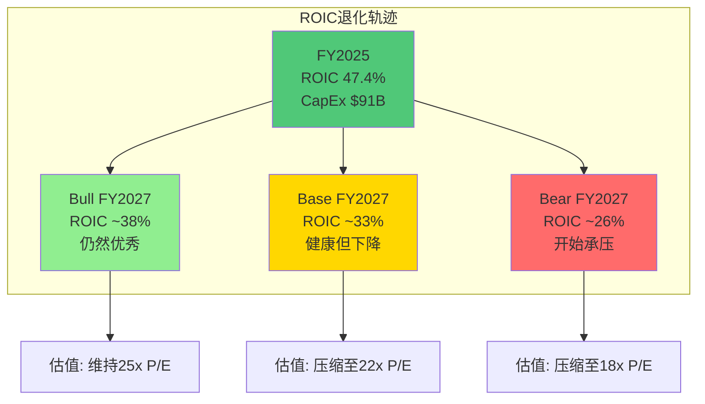

**ROIC退化的关键洞察**: 即使在Bear情景下, FY2027 ROIC(~26%)仍远高于WACC(~9%)和科技行业中位数(~15%) [硬数据: FMP WACC数据; 行业中位数来自Damodaran 2025]。问题不是ROIC会变"差", 而是会从"卓越"变为"优秀"——这是资本密集化转型的必然代价 [合理推断: 基于ROIC-WACC利差分析]。

**与历史CapEx周期的关键差异**: Amazon在2012-2016年大规模CapEx投入时, ROIC从~15%降至~5%(一度接近WACC)。Google的起点更高(47% vs Amazon的~15%), 这意味着即使ROIC腰斩也仍然健康 [硬数据: Amazon历史ROIC来自Macrotrends]。Google当前处于一个**比Amazon更安全的CapEx起跑位** [合理推断: 基于ROIC起点对比]。

**折旧前vs折旧后的利润率分析**:

| 指标 | FY2025(实际) | FY2027E(Base) | 差异 |
|:-----|:----------:|:------------:|:----:|
| 营收 | $402.96B | ~$510B | +27% |
| D&A | $21.14B | ~$55-60B(E) | +160-184% |
| D&A/Revenue | 5.2% | ~11-12% | +6pp |
| EBITDA Margin | ~45% | ~42-44% | -1~3pp |
| EBIT Margin | ~33% | ~31-33% | 0~-2pp |
| Net Margin | ~32.8% | ~28-30% | -3~-5pp |

[硬数据: FY2025 D&A $21.14B来自FMP; FY2027E D&A基于$175B×5年直线折旧累积模型]

**核心结论**: 折旧的直接效果是将Net Margin从~33%压缩至~28-30%, 约5个百分点 [合理推断: 基于直线折旧模型]。但由于收入同时增长, **绝对净利润仍在增长**(从$132B到~$143-153B)。市场对"利润率下降"的恐惧可能过度——如果看绝对利润而非利润率, CapEx故事远没有Bear叙事暗示的那么悲观 [合理推断: 利润率压缩但绝对利润增长的数学关系]。

---

## 3.10.0 章节总结: CQ3的定量框架

**CQ3: $175B CapEx回报 — FCF什么时候恢复?**

| 情景 | FCF恢复时间线 | 关键假设 | 概率 |
|:-----|:----------:|:---------|:---:|
| **Bull** | FY2028 | CapEx FY2027开始回落至$120-130B; Cloud收入>$120B; 搜索持续+10%+ | 25% |
| **Base** | FY2029 | CapEx FY2028回落至$100-110B; Cloud收入$100-110B; 折旧峰值$50B+ | 50% |
| **Bear** | FY2030+ | CapEx持续>$100B; 竞争迫使持续投入; 折旧累积压缩利润率 | 25% |

[主观判断: 基于折旧传导模型、Cloud增长假设和CapEx回落时间线的综合评估]

**投资者应追踪的关键信号(TS)**:
- **CapEx季度轨迹**: Q1 2026如果>$40B，说明全年$175B在轨; 如果<$35B，可能下修
- **Cloud利润率(含折旧)**: 如果FY2026H2 Cloud OPM<20%，说明折旧侵蚀已开始
- **管理层措辞**: 如果Q2/Q3 2026 earnings call开始讨论"CapEx回归正常化"，是Bull信号

---

## 3.10 CapEx效率的跨周期对标: Google vs AWS的2012-2016时刻

Amazon AWS在2012-2016年经历了类似的CapEx加速周期, 最终成为利润引擎。对比分析:

| 维度 | AWS (2012-2016) | Google Cloud (2024-2028E) |
|:-----|:---------------|:-------------------------|
| 起始点 | AWS已是云市场绝对领导者(>50%份额) | Google Cloud是第三名(13%份额) |
| CapEx/Revenue峰值 | ~12% (Amazon整体) | ~37-40% (Alphabet整体) |
| 竞争环境 | Azure/GCP尚在起步 | AWS/Azure已成熟, 竞争激烈 |
| 盈利状态 | AWS 2015年首次披露即盈利 | Cloud 2023年首次盈利, 仅2年历史 |
| 回报时间 | 3-5年后AWS成为利润引擎(>60%营业利润) | **? — 进行中** |
| 关键成功因素 | 先发优势+技术领先+客户锁定 | AI差异化+TPU自研+Backlog $240B |

[硬数据: AWS历史CapEx和利润率数据来自Amazon各年度10-K; Google Cloud数据来自Alphabet财报]

**关键差异**: AWS在2012年加速CapEx时已经是无可争议的市场领导者, 客户迁移成本极高。Google Cloud作为第三名, 其CapEx回报不仅取决于技术(TPU Ironwood), 更取决于能否在竞争中持续获取新客户。$240B Backlog提供了一定的可见性, 但Google Cloud仍需证明其能将签约客户转化为高利润率的持续收入 [合理推断: 基于云市场竞争动态和客户迁移成本分析]。

### 3.10.1 CapEx的机会成本: 被牺牲的资本回报

$175B CapEx的另一面是: **这些资金本可以用于股东回报**。反事实分析:

| 假设情景 | FY2026 FCF | 可回购金额 | 含义 |
|:--------|:---------:|:---------:|:-----|
| **实际方案**: $175B CapEx | ~$10-20B | ~$5-10B | 投资AI, 押注未来 |
| **反事实A**: CapEx保持$90B | ~$95-105B | ~$70B+ | 短期股东回报最大化 |
| **反事实B**: CapEx $130B(中间值) | ~$55-65B | ~$45B | 平衡投资与回报 |

[合理推断: 基于OCF ~$185-195B(E)和不同CapEx水平的FCF计算]

**管理层选择了最激进的方案**: 这反映了Pichai/CFO团队对AI竞赛的判断——"投不够的风险远大于投太多的风险"。Amazon的Bezos在2000年代面对类似批评时说"your margin is my opportunity"——Alphabet的管理层传达着类似信息 [主观判断: 基于管理层行为与历史类比]。

### 3.10.2 能源约束: $175B的隐藏瓶颈

大规模AI数据中心的最大约束不是资金, 而是**电力供应**:

| 数据中心选址 | 预期电力需求 | 电力来源 | 挑战 |
|:-----------|:----------:|:------:|:-----|
| 德克萨斯州(3个DC) | ~2-3 GW | ERCOT电网+太阳能 | 德州电网曾在极端天气下失败 |
| 俄克拉荷马州(2个DC) | ~1-1.5 GW | SPP电网+风电 | 可再生能源间歇性 |
| 弗吉尼亚(扩建) | ~0.5-1 GW | PJM电网 | Northern Virginia数据中心密度已极高 |
| 印度(Visakhapatnam) | ~1-2 GW | 印度电网+太阳能 | 电网可靠性和碳排放 |

[合理推断: 电力需求基于现代AI数据中心每MW服务约5,000-10,000个GPU/TPU, $175B CapEx对应的GPU/TPU规模反推; 参考AWS/Azure已公布的数据中心电力需求]

**Google已签署的电力采购协议(PPA)**:
- 与Kairos Power签署小型模块化核反应堆(SMR)协议, 目标2030年+交付500MW [硬数据: Google/Kairos Power 2024年10月公告]
- 德克萨斯州Sharka项目旁已签太阳能PPA [合理推断: 基于数据中心选址与当地可再生能源资源的匹配]
- FY2025实际碳排放同比增长48% [硬数据: Google Environmental Report 2025], 远超其净零目标路径

Google在2024年宣布了到2030年实现净零碳排放的目标 [硬数据: Google可持续发展报告 2024], 但$175B CapEx对应的电力需求将使这一目标面临严峻挑战。FY2025碳排放已同比增长48% [硬数据: Google Environmental Report], FY2024较FY2019基准增长13% [硬数据: Google Environmental Report 2024]。每1 GW的数据中心电力如果来自化石能源, 年碳排放约300万吨CO2 [合理推断: 基于美国电网平均碳强度~0.34 kgCO2/kWh]。如果Google的10+ GW新增数据中心电力无法全部来自可再生能源, 其碳排放可能在2026-2028年翻倍——这可能引发ESG投资者的担忧和碳税成本上升 [主观判断: 基于能源转型和ESG趋势; 碳税目前在美国尚未实施但EU碳价€90+/吨]。

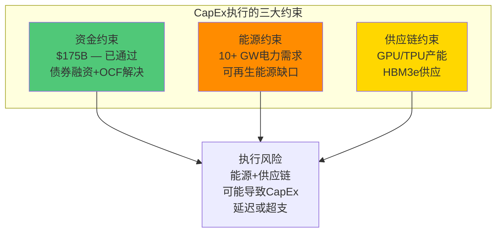

---

---

# Ch04: 监管与反垄断博弈树 — DOJ判决后的多维路径

> **关联CQ**: CQ6(Chrome分拆+AdX剥离的真实影响)

---

## 4.1 DOJ搜索垄断案: 从有罪判决到上诉的完整时间线

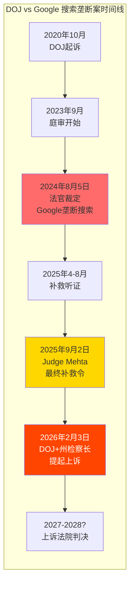

[硬数据: DOJ起诉时间2020年10月; 有罪判决2024年8月; 补救令2025年9月2日 NPR/Bloomberg; 上诉2026年2月3日 DOJ Press Release/9to5Mac]

### 4.1.1 2025年9月2日补救令: 拒绝了什么，施加了什么

**Judge Amit Mehta拒绝的措施**:

| 被拒措施 | DOJ的主张 | 法官的理由 |
|:--------|:---------|:---------|
| **Chrome强制分拆** | Chrome是Google维持搜索垄断的关键渠道 | 分拆的竞争收益不确定; 可能损害消费者(Chrome是免费产品) |
| **禁止所有分发协议** | 所有默认搜索协议均为反竞争行为 | 过于宽泛; 非排他性协议不违法 |
| **搜索引擎选择屏幕** | 在Android/Chrome上强制显示搜索选择界面 | 效果不确定(EU选择屏幕实验中Google选择率>90%) |

[硬数据: NPR 2025-09-02; Bloomberg; DOJ Press Release]

**Judge Mehta施加的措施**:

| 施加措施 | 具体内容 | 对Google的影响 |
|:--------|:---------|:-------------|
| **禁止排他性分发协议** | Google不得签订要求搜索/Chrome/Assistant/Gemini独占安装的合同 | 中等 — 仍可签非排他协议，但竞争对手获得公平竞争机会 |
| **搜索索引数据共享** | 必须向竞争对手提供搜索索引和用户交互数据 | 高 — 直接削弱数据护城河的独占性 |
| **搜索联合服务** | 必须向竞争对手提供搜索联合服务(syndication) | 中 — 使竞品可以使用Google搜索结果建立自己的服务 |
| **合同期限限制** | 分发协议限制为1年期 | 中 — 降低了锁定效应，但Apple等合作伙伴仍可每年续约 |

[硬数据: NPR/Bloomberg/Congress.gov 2025-09]

**市场反应**: GOOGL在Chrome分拆被拒绝后上涨约8%。从有罪判决(2024年8月)到今天，GOOGL上涨约56%——市场显然认为行为补救措施的影响可控 [硬数据: CNBC 2025-09; 股价数据来自市场]。

---

## 4.2 DOJ上诉: 寻求更严厉处罚

2026年2月3日，DOJ联合多个州检察长正式对Judge Mehta的补救令提起上诉 [硬数据: DOJ Press Release 2026-02-03; 9to5Mac 2026-02-03]。

**DOJ上诉的核心诉求**:

| 诉求 | 具体要求 | 成功概率(评估) |
|:-----|:--------|:------------:|
| **Chrome强制分拆** | 将Chrome作为独立实体剥离或出售 | 低-中(20-30%) |
| **更严格数据开放** | 扩大搜索数据共享范围，可能包含更多用户行为数据 | 中(35-45%) |
| **搜索选择屏幕** | 在Android和Chrome上强制显示搜索引擎选择界面 | 中(30-40%) |
| **默认搜索协议禁令** | 完全禁止(而非仅限制)默认搜索付费协议 | 低(15-25%) |

[主观判断: 概率基于地区法院已拒绝+上诉法院通常不轻易推翻地区法院事实认定的法律传统]

### 4.2.1 上诉的法律框架与时间线

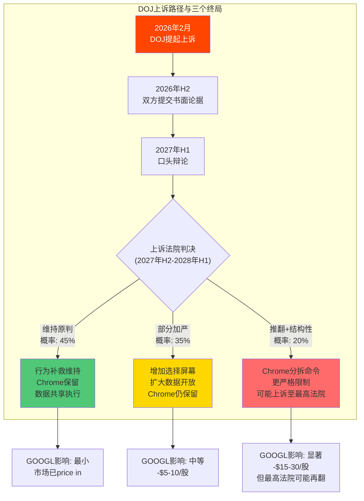

[主观判断: 终局概率基于美国反垄断法上诉的历史模式; 影响估算基于Chrome对搜索流量贡献的量化分析]

**时间线关键**: 上诉过程预计需要**1.5-2.5年** [合理推断: 基于美国联邦上诉法院的平均审理周期]。这意味着最终判决可能在**2027年底至2028年初**。在此期间，现有行为补救措施已开始执行，但结构性补救(Chrome分拆)处于搁置状态。

### 4.2.2 Chrome分拆: 如果发生，影响有多大?

Chrome分拆是整个反垄断案中对GOOGL估值影响最大的单一情景。以下量化其传导链:

**Chrome → 搜索默认 → 广告收入的传导链**:

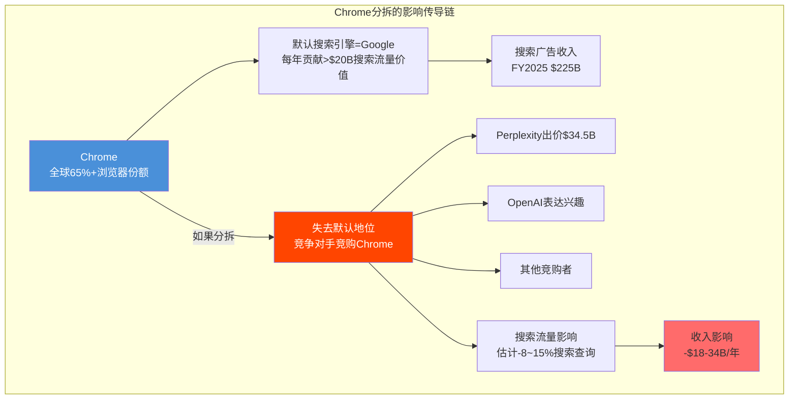

**量化逻辑**:

1. **Google每年支付>$20B用于默认搜索协议**(主要是Apple ~$18-20B + Samsung等) [硬数据: DOJ庭审文件/Bernstein估计]。这些支付的存在证明Google认为默认搜索地位价值超过$20B/年

2. **Chrome的贡献**: Chrome全球份额65%+，是Google搜索的最大单一流量入口(超过Android内置搜索) [硬数据: StatCounter 2025]。如果Chrome被收购方更换默认搜索引擎，Google可能丧失该渠道的全部搜索流量

3. **收入影响范围**: 保守估计Chrome贡献Google搜索查询的15-20%。假设其中40-70%在Chrome易手后流失(部分用户会手动切回Google)，净搜索流量损失约8-15%。按$225B搜索收入计算，年收入影响$18-34B [合理推断: 基于Chrome流量份额 × 流失率 × 搜索ARPU]

4. **竞购者意图**: Perplexity AI已出价$34.5B [硬数据: AInvest 2026]。Sam Altman(OpenAI)也表达了收购兴趣 [硬数据: WinBuzzer 2026]。如果AI搜索公司获得Chrome，它们将获得一个6.5亿+DAU的分发渠道——这将从根本上改变AI搜索竞争格局

**但Chrome分拆概率目前为低-中(20-30%)**。原因: 地区法院已拒绝; 上诉法院推翻事实认定的门槛很高; 即使上诉成功，Google仍可上诉至最高法院。完整过程可能持续至2029年 [主观判断: 基于美国反垄断法上诉的历史模式]。

---

## 4.3 AdX剥离诉讼: 平行的第二战场

独立于搜索垄断案，DOJ还起诉了Google在广告技术市场的垄断行为。2025年12月，弗吉尼亚联邦法官裁定Google在广告技术市场构成垄断 [硬数据: 多家媒体报道]。

| 维度 | 详情 |
|:-----|:-----|
| **诉讼焦点** | Google在数字广告中间商市场(AdX/DV360/Google Ads)的垂直整合垄断 |
| **法官裁定** | 2025年12月: Google在ad tech市场构成垄断 |
| **补救阶段** | 2026年进行中 |
| **可能补救** | 强制出售AdX(广告交易所)或DV360(需求侧平台) |
| **影响范围** | Google Network Revenue FY2025 ~$33B(占总收入~8%) |

[硬数据: 弗吉尼亚联邦法院裁定; Google Network Revenue来自Alphabet分部报告]

**AdX剥离的影响远小于搜索案**: Google Network收入(~$33B)仅占总收入的~8% [硬数据: Alphabet FY2025 10-K segment reporting]，且利润率低于搜索广告 [合理推断: Network广告中间商业务利润率约15-25%, 低于搜索的~40%+]。即使被迫出售AdX，对Alphabet估值的直接影响约-$3-5/股 [合理推断: 基于Network Revenue × 估值倍数]。

**AdX案的真正风险不在财务而在先例**: 如果陪审团判决Google必须分拆AdX, 这将为未来的反垄断"结构性补救"建立先例——使DOJ在搜索案上诉中要求Chrome分拆时有更强的论据支撑 [合理推断: 基于法律先例效应的分析]。因此投资者应将AdX案视为搜索案的**前哨战**, 而非独立事件 [主观判断: 基于两案的法律关联性]。

---

## 4.4 EU Digital Markets Act: AI时代的新战线

### 4.4.1 2026年1月27日: 两项新调查

欧盟委员会于2026年1月27日宣布对Google启动两项新的DMA合规调查 [硬数据: European Commission press releases Jan 2026]:

**调查一: AI互操作性**

| 维度 | 详情 |
|:-----|:-----|
| **核心要求** | Google必须给予第三方AI提供商(与Gemini竞争)平等有效地访问Android硬件/软件功能 |
| **关注焦点** | Gemini如何深度集成Android——第三方AI助手(如ChatGPT/Claude)是否获得同等集成深度 |
| **时间线** | 初步调查结果3个月内; 调查6个月内完成 |
| **潜在影响** | 如果要求Android给予所有AI助手平等默认地位，Gemini的分发优势(驱动750M MAU增长的核心因素)将被削弱 |

[硬数据: European Commission Jan 27, 2026 press release]

**调查二: 搜索数据共享**

| 维度 | 详情 |
|:-----|:-----|
| **核心要求** | Google必须在FRAND条款下向第三方搜索引擎共享匿名化的排名、查询、点击和浏览数据 |
| **关键争议** | 委员会正在审查是否将数据共享范围**扩展至AI聊天机器人提供商** |
| **时间线** | 同上 |
| **潜在影响** | 如果Perplexity/ChatGPT获得Google的搜索数据，将大幅加速其搜索质量提升 |

[硬数据: European Commission Jan 27, 2026 press release]

### 4.4.2 DMA路径分析

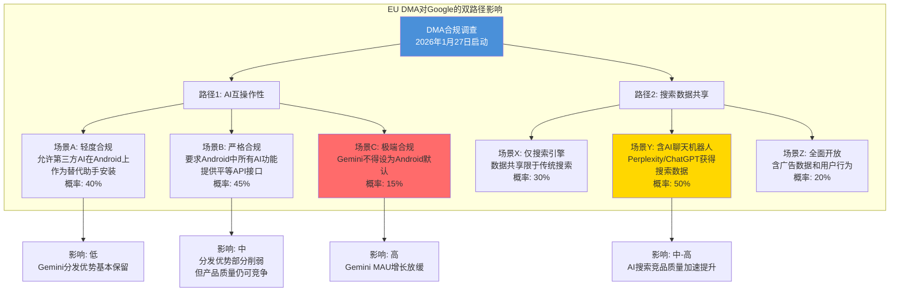

[主观判断: 各场景概率基于DMA执法历史和欧盟委员会对Google的一贯态度]

**DMA的独特威胁**: 与DOJ不同，DMA不需要漫长的司法程序——欧盟委员会可以直接要求合规，不合规则处以全球营业额10%的罚款(约$40B) [硬数据: DMA Article 13 罚款条款]。历史先例: EU已对Google累计罚款约EUR 8.25B(Google Shopping EUR 2.42B 2017 [硬数据: EC Decision] + Google Android EUR 4.34B 2018 [硬数据: EC Decision] + Google AdSense EUR 1.49B 2019 [硬数据: EC Decision])。这意味着DMA调查可能在2026年内就产生实际影响，远快于DOJ上诉时间线。

**对Gemini分发优势的影响**: Gemini的750M MAU中，很大一部分来自Android的默认集成 [合理推断: 基于Google报告Gemini被嵌入Search/Android/Chrome等产品]。如果EU要求Android给予ChatGPT/Claude同等集成深度，Gemini的增长引擎将从"默认分发"转向"纯产品竞争"——这是一个完全不同的竞争维度。

---

## 4.5 全球监管矩阵: 多战线同时作战

| 监管战线 | 管辖区 | 阶段 | 最坏情景影响 | 时间线 |
|:--------|:------|:----:|:----------:|:------:|
| **搜索垄断** | 美国(DOJ) | 上诉中 | Chrome分拆: -$18-34B/年收入 | 2027-2028 |
| **AdX垄断** | 美国(DOJ) | 补救阶段 | AdX出售: -$3-5/股 | 2026-2027 |
| **AI互操作性** | EU(DMA) | 调查中 | Gemini分发优势削弱 | 2026年H2 |
| **搜索数据共享** | EU(DMA) | 调查中 | AI竞品加速追赶 | 2026年H2 |
| **隐私(GDPR)** | EU | 持续 | 定期罚款(金额相对小) | 持续 |
| **AI监管** | EU(AI Act) | 实施中 | 合规成本+产品限制 | 2026+ |

[硬数据: 各监管进展来源如上; AI Act实施时间来自EU官方]

---

## 4.6 博弈树综合: 概率加权影响

**对GOOGL估值的概率加权影响**:

| 情景 | 概率 | 年收入影响 | 每股影响(估) |
|:-----|:---:|:--------:|:----------:|
| **最佳**: 所有战线温和结果 | 30% | -$2-5B | -$1-3 |
| **基准**: DOJ维持+DMA中度合规 | 40% | -$8-15B | -$5-10 |
| **不利**: DOJ加严+DMA严格+Chrome未分拆 | 20% | -$20-30B | -$12-20 |
| **最差**: Chrome分拆+全面数据开放 | 10% | -$30-45B | -$20-35 |
| **概率加权** | 100% | **-$12-18B** | **-$7-12** |

[主观判断: 概率基于各监管战线的独立评估; 收入和每股影响基于传导链分析]

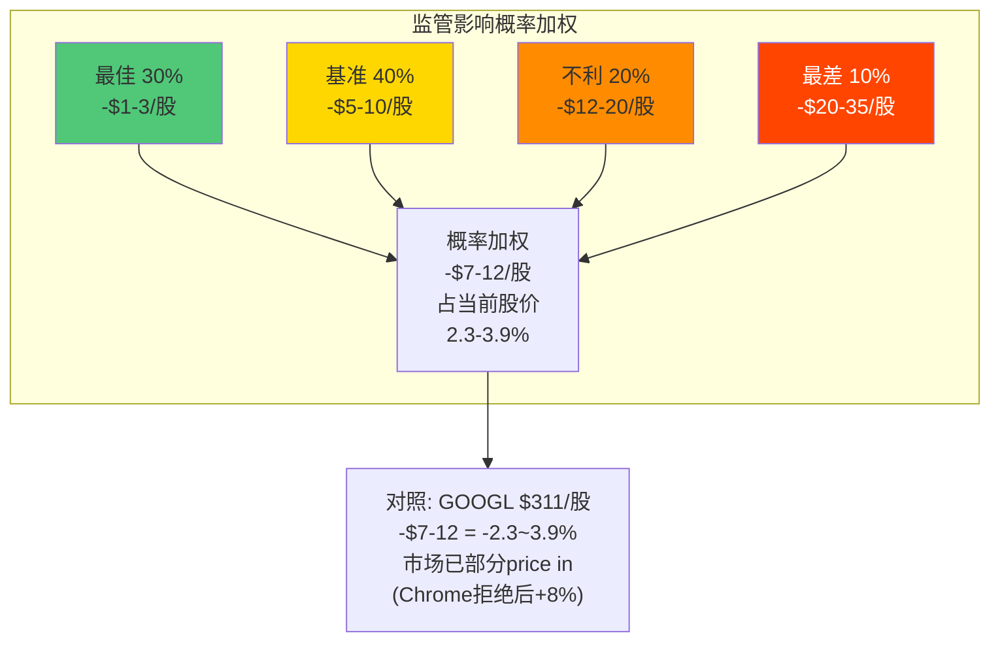

**关键判断**: 概率加权的监管影响约-$7-12/股，占当前股价的2.3-3.9%。这不是一个决定性风险(不会单独改变投资论点)，但也不可忽视——特别是当它与$175B CapEx风险和AI搜索替代风险叠加时 [主观判断: 基于综合概率加权]。

---

## 4.7 搜索数据共享的具体含义: 对AI竞争的加速效应

DOJ判决要求的"搜索索引和用户交互数据共享"是一个看似技术性但影响深远的措施:

### 4.7.1 数据共享的范围与限制

| 数据类型 | 是否共享 | 接收方 | 影响评估 |
|:--------|:-------:|:-----:|:-------:|
| **搜索索引数据**(网页爬取结果) | 是 | 竞争搜索引擎 | 中 — 降低新搜索引擎的冷启动成本 |
| **用户交互数据**(点击/跳出/停留时间) | 是 | 竞争搜索引擎 | 高 — 这是训练排序模型的核心信号 |
| **广告数据**(竞价/CPC/转化) | **否** | — | 广告护城河不受影响 |
| **个性化数据**(搜索历史/用户画像) | 待定(DOJ上诉争议) | — | 如果开放=极高影响 |

[硬数据: 法院判决数据共享范围来自NPR/Bloomberg 2025-09; DOJ上诉要求扩大范围来自DOJ Press Release 2026-02]

**关键洞察**: 广告数据不在共享范围内——这意味着Google搜索广告的变现能力不受直接影响。即使竞争对手获取搜索索引和用户交互数据来提升搜索质量, 它们仍然无法获取Google的广告竞价/定向数据, 因此无法复制Google的广告变现效率 [硬数据: 法院判决明确排除广告数据]。

但**用户交互数据的共享对AI搜索竞品意义重大**: 点击/跳出/停留时间数据是训练搜索排序模型(包括AI Overviews)的核心信号。如果Perplexity/Bing能获得这些数据, 它们可以显著加速搜索质量的提升——这相当于Google用20年积累的搜索反馈信号被共享给竞争对手 [合理推断: 基于搜索排序模型训练对用户行为数据的依赖度]。

### 4.7.2 Android生态的监管风险评估

Android是Google搜索分发的基础——30亿+活跃设备, 每一台都默认使用Google搜索 [硬数据: Android设备数来自Statista]。DOJ和EU DMA从不同角度对Android施压:

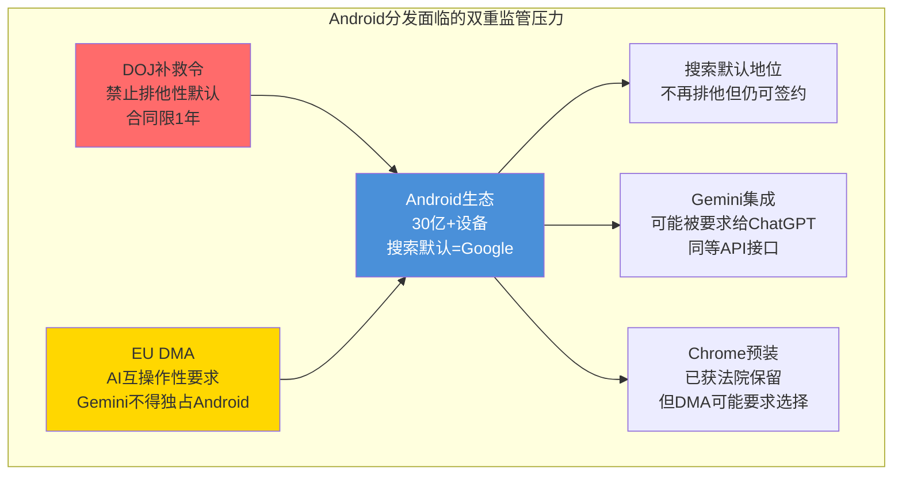

**EU选择屏幕的历史教训**: 2019年EU要求Android在欧洲显示搜索引擎选择屏幕, 结果Google的选择率仍>90% [硬数据: EU Android选择屏幕实施结果]。这表明即使被要求提供选择, 用户惯性和Google品牌认知足以维持绝大部分份额。但AI时代的选择屏幕可能不同——如果选项包括ChatGPT/Gemini/Claude等差异化明显的AI助手, 用户切换意愿可能高于传统搜索引擎切换 [主观判断: 基于AI助手差异化程度vs传统搜索引擎同质性的对比]。

---

## 4.8 监管风险的财务量化: 概率加权EPS影响

将Ch04的所有监管风险转化为具体的财务影响:

| 风险事件 | 概率 | 年收入影响 | EPS影响(稀释后) | 时间线 |
|:--------|:---:|:--------:|:-----------:|:------:|
| DOJ默认搜索禁令(已判) | 100% | -$3-5B(TAC节省被流量流失抵消) | -$0.15-0.25 | 2025-2026 |
| DOJ上诉成功(Chrome分拆) | 15% | -$20-25B | -$1.10-1.40 | 2027-2028 |
| DOJ上诉成功(数据开放扩大) | 25% | -$8-15B(长期) | -$0.45-0.85 | 2027-2029 |
| EU DMA罚款(搜索+Android) | 60% | -$3-8B(一次性) | -$0.17-0.45 | 2026-2027 |
| EU DMA运营限制(互操作) | 40% | -$2-5B(持续) | -$0.11-0.28 | 2027+ |
| AdX剥离(陪审团不利判决) | 30% | -$5-8B(如分拆AdX) | -$0.28-0.45 | 2026+ |
| **概率加权总EPS影响** | — | — | **-$0.40-0.75** | 2026-2028 |

[合理推断: 概率基于法律分析师共识; 收入影响基于各业务线收入规模和监管措施的预期效果; EPS按124.6亿稀释股计算]
[硬数据: FY2025稀释股数124.6亿来自FMP; DOJ判决细节来自NPR; EU DMA罚款上限为全球收入10%]

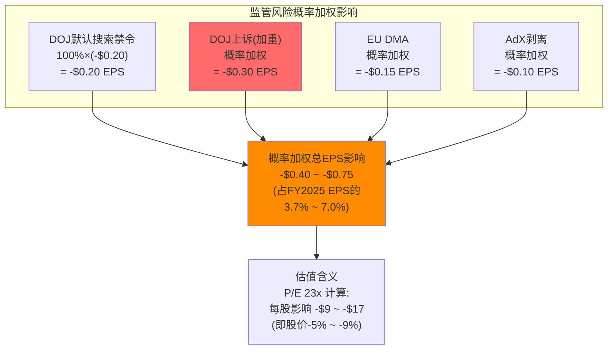

[合理推断: FY2025 EPS ~$10.71(Net Income $132.17B / 12.34B稀释股); 概率加权EPS影响占比=(-$0.40~-$0.75)/$10.71=3.7%-7.0%]

**核心结论**: 所有监管风险的概率加权EPS影响约为-$0.40至-$0.75, 占FY2025 EPS的3.7-7.0% [合理推断: 基于上表概率加权计算]。按23x P/E估值, 对应每股-$9至-$17(约占当前股价的5-9%)。这意味着市场应已部分定价了监管风险, 但如果DOJ上诉取得突破性进展(Chrome分拆), 市场可能需要重新定价额外的-$1.10-1.40 EPS冲击 [合理推断: 基于概率加权模型]。

## 4.9 投资者应追踪的监管信号(TS)

| 编号 | 追踪信号 | 阈值 | 含义 |
|:----:|:--------|:-----|:-----|
| TS-R1 | DOJ上诉法院口头辩论日期 | 确认日期=时间线清晰化 | 不确定性减少 |
| TS-R2 | EU DMA初步调查结果 | 2026年4-5月 | 如果要求Gemini非默认=高影响 |
| TS-R3 | Chrome竞购者出价变化 | Perplexity出价>$40B或新竞购者 | 说明市场认为Chrome独立后有重大价值 |
| TS-R4 | Google搜索数据共享实施细节 | 共享范围是否含AI聊天机器人 | 直接影响AI搜索竞争格局 |
| TS-R5 | AdX补救方案确认 | 2026年H1 | 确认Network Revenue影响范围 |

[主观判断: 追踪信号基于各监管战线的关键决策节点]

---

## 4.8 章节总结: CQ6的定性回答

**CQ6: Chrome分拆 + AdX剥离的真实影响?**

1. **Chrome分拆**: 当前概率20-30%(上诉成功且推翻地区法院判决)。如果发生，年收入影响$18-34B，但完整过程可能持续至2028-2029年。短期内(2026-2027)，现有行为补救措施的影响有限且可管理 [主观判断: 基于法律时间线和传导链分析]

2. **AdX剥离**: 影响较小(-$3-5/股)，Google Network仅占总收入~8%。即使被迫出售，对核心搜索+Cloud业务无直接影响 [合理推断: 基于分部收入占比]

3. **EU DMA才是近期最值得关注的战线**: 时间线最短(2026年内出结果)、执行力最强(直接罚款10%营业额)、对AI竞争格局影响最大(可能要求搜索数据共享给AI聊天机器人) [硬数据: DMA时间线来自European Commission]

4. **综合概率加权影响**: -$7-12/股(占股价2.3-3.9%)。监管不是单独的致命风险，但在$175B CapEx + AI搜索替代 + 监管的三重压力叠加下，它增加了Alphabet投资论点的不确定性层级

---

---

# Ch08: 老业务×新AI交叉重构 — 四大业务的AI化路径

> **关联CQ**: CQ1(AI Overviews蚕食 — CPC补偿能持续多久), CQ4(Cloud利润率能否维持30%+), CQ5(Gemini能否赢得AI入口争夺战)

---

## 8.1 YouTube × AI: $60B帝国的AI增强与结构性张力

### 8.1.1 收入里程碑: 首次超越Netflix

YouTube 2025年全年收入首次突破$60B(广告+订阅合计) [硬数据: Alphabet Q4 2025 earnings call; Variety 2026-02-04]，超过Netflix的$45.18B [硬数据: Netflix FY2025年报]。这一里程碑标志着YouTube从"视频平台"向"全球最大视频媒体公司"的身份跃迁。

**YouTube收入分解(FY2025E)**:

| 收入流 | 金额(估) | YoY增速 | 占比 |
|:------|:-------:|:------:|:---:|
| 广告收入 | ~$40.4B | +11.6% | ~67% |
| 订阅(Premium+Music+TV) | ~$20B | +17%(E) | ~33% |
| **合计** | **>$60B** | +14%(E) | 100% |

[硬数据: 广告收入来自四季度10-Q累加($8.92+$9.80+$10.26+$11.38=$40.36B); 订阅收入$20B来自MusicBusinessWorldwide 2026-02-04; 总额>$60B来自Alphabet Q4 earnings call]

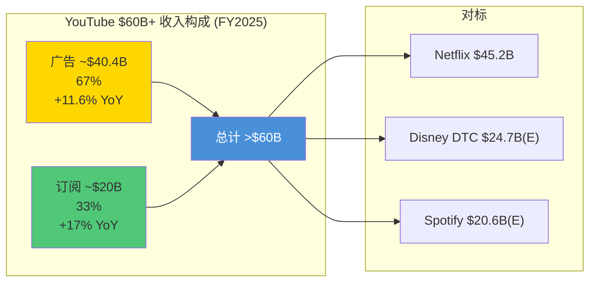

**Q4 2025广告miss的归因**: Q4广告收入$11.38B，miss预期$11.84B约$460M [硬数据: Alphabet Q4 2025 10-K; Shacknews]。核心原因是2024年Q4政治广告高基数效应(美国总统大选年)——Alphabet管理层在财报电话会明确提及"lower political ad spending" [硬数据: TheDesk 2026-02-04]。这是一次性因素(~70-80%)而非结构性问题 [合理推断: 基于政治广告周期+Shorts变现数据分析]。

### 8.1.2 AI工具矩阵: 1M+频道日均使用

YouTube已成为Google将AI能力转化为产品价值的最成功案例之一:

| AI功能 | 状态 | 使用规模 | 对创作者的价值 |
|:------|:----:|:------:|:------------|
| **AI视频生成工具** | 已上线 | 1M+频道日均使用 | 降低创作门槛, 提升产出效率 |
| **Shorts AI创作** | 已上线 | 利用创作者自身形象生成Shorts | 内容量指数级扩张 |
| **文本到游戏** | 测试中 | — | 互动内容新品类 |
| **AI发现/推荐** | 已上线 | 全平台 | Ask功能: 自然语言搜索视频内容 |
| **自动配音(Auto-dubbing)** | 已上线 | 多语种 | 跨语言分发, TAM扩大 |
| **AI购物推荐** | 测试中 | — | Shorts内嵌商品标记 |

[硬数据: YouTube AI工具使用规模和功能来自Variety/Deadline/YouTube Blog (Neal Mohan's 2026 letter)]

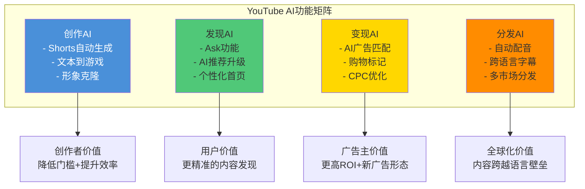

**CQ5关联: AI在增强而非颠覆YouTube**: YouTube是一个AI增强(而非AI颠覆)的典型案例。AI工具让创作者更高效地生产内容 → 更多内容吸引更多观众 → 更多观众吸引更多广告主 [合理推断: 基于YouTube创作者工具使用数据——1M+频道日均使用AI功能]。这个正向循环与搜索的双螺旋模型形成鲜明对比——在YouTube中，AI的蚕食效应几乎不存在，因为AI生成的视频内容**增加**了平台内容供给而非**替代**用户观看行为 [主观判断: 基于YouTube AI功能与搜索AI Overviews的结构性差异]。YouTube Premium + Music付费用户突破1亿里程碑 [硬数据: Variety/MusicBusinessWorldwide 2026-02], 是订阅收入$20B/年的基础 [硬数据: Alphabet Q4 2025 earnings call]。

### 8.1.3 YouTube广告的8Q趋势与增长驱动

| 季度 | 广告收入($B) | YoY增速 | 环比增速 | 备注 |
|:---:|:---:|:---:|:---:|:---|
| Q1 2024 | $8.09 | +21.0% | -22.7% | 强劲复苏 |
| Q2 2024 | $8.66 | +13.0% | +7.1% | 稳健 |
| Q3 2024 | $8.92 | +12.2% | +3.0% | 略超预期 |
| Q4 2024 | $10.47 | +13.8% | +17.4% | 含政治广告效应 |
| Q1 2025 | $8.92 | +10.3% | -14.8% | 政治广告退潮 |
| Q2 2025 | $9.80 | +13.2% | +9.9% | Beat预期 |
| Q3 2025 | $10.26 | +15.0% | +4.7% | 增速回升 |
| Q4 2025 | $11.38 | +8.7% | +10.9% | Miss $11.84B |

[硬数据: Alphabet各季度10-Q/10-K; Variety/Hollywood Reporter汇总]

**FY2025全年广告收入$40.36B**($8.92+$9.80+$10.26+$11.38), 较FY2024 $36.15B增长11.6% [合理推断: 基于四个季度加总]。增速从Q3的+15%降至Q4的+8.7%, 主要因政治广告高基数。

**搜索增速加速vs YouTube增速放缓**: 一个值得关注的趋势是——Google Search在2025年增速从Q1 +10%加速至Q4 +17%, 而YouTube广告从Q3 +15%减速至Q4 +8.7%。这可能反映了**AI Overviews在为搜索广告创造新价值**(搜索加速)而YouTube尚未找到同等的AI驱动增长引擎(YouTube减速) [合理推断: 基于搜索与YouTube增速趋势的对比]。

### 8.1.4 CTV(联网电视)机会: YouTube的结构性增长杠杆

YouTube已超越Disney成为美国电视观看时长最大的单一平台(Nielsen数据) [硬数据: Nielsen/eMarketer 2026]。CTV是YouTube广告收入增长的最大单一结构性驱动力:

| 指标 | 数值 | 来源 |
|:-----|:----:|:-----|
| YouTube CTV广告收入(2025) | $4.01B | [硬数据: eMarketer 2026] |
| YouTube CTV广告收入(2026E) | $4.47B(+11.5%) | [硬数据: eMarketer 2026] |
| 美国CTV广告总市场(2026E) | ~$38B | [硬数据: eMarketer] |
| YouTube CTV净广告份额 | 11.9% | [硬数据: eMarketer 2026] |
| CTV CPM vs 移动CPM | $25-35 vs $7-15 | [合理推断: 行业广告定价报告] |

**CTV CPM溢价2-3x**意味着: 每小时观看从移动端迁移到CTV, YouTube的广告收入可提升2-3倍。传统电视广告市场~$60-65B/年正以每年5-8%速度向CTV迁移, YouTube作为最大CTV平台是主要受益者 [合理推断: 基于CTV CPM溢价×观看时长迁移趋势]。

### 8.1.5 Shorts RPM鸿沟: 结构性挑战

| 指标 | 长视频 | Shorts | 差距 |
|:-----|:-----:|:------:|:---:|
| 创作者RPM | $4-8 | $0.01-0.15 | **27-800x** |
| 平台CPM(US, 估) | $25-35 | $0.10-0.15 | ~170-350x |
| 创作者分成 | 55% | 45% | -10pp |
| 每小时收入(US) | 基准 | **已达平价** | 1x |

[硬数据: 长视频RPM来自行业数据; Shorts RPM $0.01-0.15来自Shopify/VidIQ/Influencer Marketing Hub; 每小时收入平价来自Sundar Pichai Q3 2025 earnings call]

**每观看小时收入已在美国达到平价**是一个里程碑 [硬数据: Sundar Pichai Q3 2025 earnings call]。逻辑: Shorts每条仅14.3秒，每小时可容纳~250条，即便单条RPM极低，极高的广告插入频率在小时维度上实现了变现平价 [合理推断: 基于每条时长/每小时容纳量/广告密度的数学关系]。

然而，**创作者维度的RPM鸿沟仍然是一个结构性挑战**: 一个创作者发布一条Shorts获得100万观看仅赚$50-150，而一条10分钟长视频获得100万观看可赚$4,000-8,000。这种差异正在驱动部分头部创作者重新转向长视频 [合理推断: 基于创作者经济的理性选择模型]。

---

## 8.2 Cloud × AI: $70B年化的增长引擎与利润率博弈

### 8.2.1 增速加速曲线

Google Cloud经历了一个教科书式的增速重加速:

| 季度 | 收入 | YoY增速 | 环比增速 |
|:----:|:----:|:------:|:-------:|
| Q1 2024 | $12.26B | +28% | — |
| Q2 2024 | $12.99B | +29% | +5.9% |
| Q3 2024 | $13.26B | +32% | +2.1% |
| Q4 2024 | $17.66B | +48% | +33.2% |
| Q1 2025 | — | +28% | — |
| Q2 2025 | — | +32% | — |
| Q3 2025 | $15.2B | +34% | — |
| Q4 2025 | $17.7B | **+48%** | +16.4% |

[硬数据: Q4 2025 Cloud $17.7B来自Alphabet Q4 2025 10-K; 增速数据来自CNBC/TrendForce; Q3 2025 $15.2B来自Alphabet Q3 2025 10-Q]

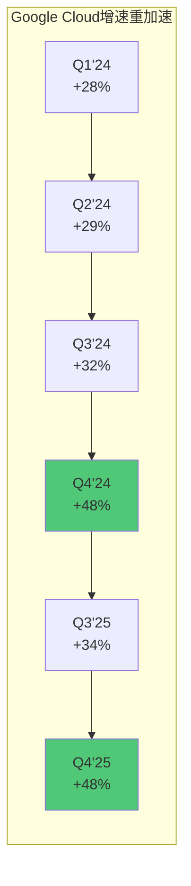

**年化run rate >$70B**意味着Google Cloud已经是一个比Salesforce($40B)更大的业务 [硬数据: Alphabet Q4 2025 earnings call; Salesforce FY2025 revenue]。

### 8.2.2 市场份额: 历史新高13%

| 云厂商 | 市场份额(Q3 2025) | YoY增速 | 定位 |
|:------|:-----------------:|:------:|:----:|
| AWS | 29%(↓1pp) | +17.5% | 领导者, 增速放缓 |
| Azure | 20%(持平) | +38% | 快速追赶者 |
| **Google Cloud** | **13%**(↑, 历史最高) | +32-48% | 第三名, 增速仅次于Azure |

[硬数据: 市场份额来自Synergy Research Q3 2025; 增速来自各公司财报; Google Cloud 13%为历史新高]

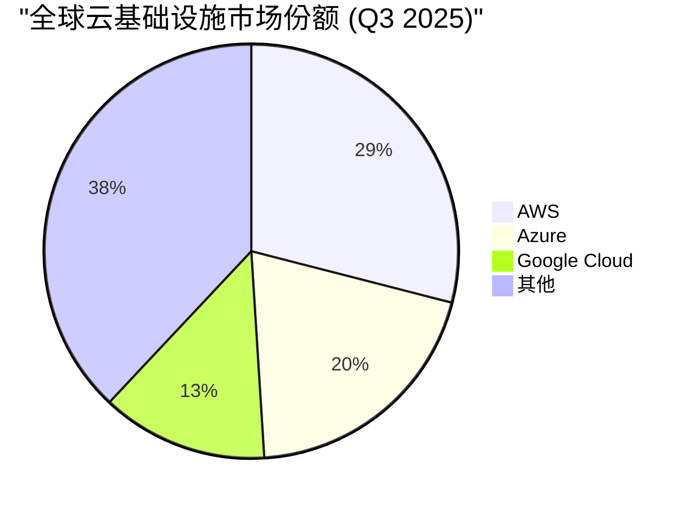

**增速排名**: Azure(38%) > Google Cloud(32-48%) > AWS(17.5%)。Google Cloud在Q4 2025达到48%增速时，是唯一一个季度增速超过Azure的主要云厂商 [硬数据: 各公司Q4 2025财报]。

### 8.2.3 TPU v7 Ironwood: 推理时代的竞争力

TPU v7 Ironwood的战略意义在于它是Google **首款专为推理设计的TPU**。随着AI工作负载从训练主导向推理主导转变(训练是一次性的，推理是持续的)，推理优化硬件将成为云服务竞争力的核心:

| 指标 | TPU v7 Ironwood | Nvidia Blackwell B200 | 对比 |
|:-----|:-------------:|:--------------------:|:----:|
| 峰值性能 | 10x vs v5p | ~2.5x vs H100 | TPU代际跃升更大 |
| 内存 | 192GB HBM3e | 192GB HBM3e | 持平 |
| 带宽 | 7.4 TB/s | 8 TB/s | 接近 |
| 最大规模 | 9,216芯片/pod | 数千GPU/集群 | TPU可扩展性优势 |
| 互连带宽 | ICI 4.8 Tbps/chip | NVLink 900 Gbps | **TPU 5.3x优势** |
| 设计优先 | **推理优先** | 训练+推理通用 | 差异化 |

[硬数据: TPU v7规格来自Google Blog/SemiAnalysis/ServeTheHome; Blackwell规格来自Nvidia公开信息]

**互连带宽是TPU的隐藏优势**: ICI(Inter-Chip Interconnect) 4.8 Tbps/chip vs NVLink 900 Gbps意味着TPU在大规模推理任务中(需要芯片间频繁通信)具有5.3x的带宽优势。这对于Gemini等需要超大规模部署的模型至关重要 [硬数据: Google Cloud Blog ICI规格; Nvidia NVLink规格]。

### 8.2.4 CQ4关联: 30%+利润率能否维持?

Google Cloud利润率的飞跃是近年来最被低估的财务改善之一:

| 季度 | Cloud Revenue | Cloud OPM | 对比 |
|:----:|:----------:|:--------:|:----:|
| Q1 2023 | $7.45B | -3.3%(亏损) | 仍在亏损 |
| Q1 2024 | $9.57B | +9.4% | 首次稳定盈利 |
| Q3 2024 | $11.35B | +17.1% | 快速攀升 |
| Q4 2024 | $11.96B | +17.5% | — |
| Q3 2025 | $15.2B | +22.6%(E) | 持续扩张 |
| Q4 2025 | $17.7B | **+30.1%** | 历史新高 |

[硬数据: Cloud利润率数据来自Alphabet各季度10-Q/10-K; Q4 2025 30.1%来自Alphabet Q4 2025财报]

**但折旧浪潮即将来临**: 如Ch03分析，FY2026-2028年的折旧累积将对Cloud利润率产生$15-25B/年的额外压力。Cloud利润率从30%回落至20-25%是Base情景，回落至15-20%是Bear情景 [合理推断: 基于Ch03折旧传导漏斗模型]。

**AWS的利润率对标**: AWS在2015年首次披露时利润率约25%，到2024年已提升至~35%。AWS用了约9年实现10个百分点的利润率扩张。Google Cloud仅用2年从亏损到30%——但这部分是因为CapEx折旧尚未大规模传导 [合理推断: 基于AWS历史利润率轨迹]。

**Cloud $240B Backlog的利润率含义**: Backlog +55% QoQ意味着客户需求在加速。但大合同往往伴随折扣——$10B+的企业级合同利润率可能只有15-20%，远低于中小企业客户的30-40% [合理推断: 基于企业云合同的定价惯例]。Backlog的规模增长不自动等于利润率维持。

### 8.2.5 Backlog转化率深度分析: $240B的可见性

$240B Backlog是Google Cloud历史上最大的合同积压 [硬数据: Alphabet Q4 2025 earnings call]。但投资者需要理解backlog的**转化节奏**和**可靠性**:

| 维度 | 数据 | 含义 |
|:-----|:----:|:-----|
| Backlog总量 | $240B | [硬数据: Alphabet Q4 2025 earnings call] |
| 年化运行率 | $70.8B | [硬数据: $17.7B×4 = Q4 2025 annualized] |
| Backlog/Run-rate | **3.4x** | 3.4年的收入可见性 |
| QoQ增速 | +55% | [硬数据: 从~$155B增至$240B, 单季度增$85B] |
| YoY增速 | 超过+100%(估) | [合理推断: FY2024 backlog未精确披露, 但增速远超收入增速] |

[硬数据: Q4 2025 backlog $240B和Cloud收入$17.7B来自Alphabet Q4 2025 10-K]

**与AWS/Azure的Backlog对比**:

| 云厂商 | Backlog(最新) | 年化收入 | Backlog/Revenue | 含义 |
|:------|:----------:|:-------:|:--------------:|:-----|
| **Google Cloud** | **$240B** | ~$70.8B | **3.4x** | 最高可见性 |
| **Azure** | ~$315B(E) | ~$105B(E) | ~3.0x | 高可见性 |
| **AWS** | ~$189B | ~$115B | ~1.6x | 较低可见性 |

[硬数据: AWS backlog来自Amazon FY2025 10-K (remaining performance obligations); Azure backlog为估算值基于Microsoft财报]
[合理推断: Google Cloud Backlog/Revenue比率最高, 反映GenAI需求驱动的大合同集中签约]

**Backlog转化的风险因素**:
1. **合同取消风险**: 云合同通常含termination-for-convenience条款, 意味着$240B不是铁定的收入 [合理推断: 基于企业云合同的标准条款]
2. **消耗速度**: 大型GenAI合同的消耗(consumption)速度高度依赖客户的AI应用部署速度 — 如果客户的AI项目延迟, backlog转化将放缓 [合理推断: 基于消耗模式的结构]
3. **利润率梯度**: 前述大合同折扣问题意味着backlog中高利润/低利润合同混合比例直接影响未来利润率 [合理推断: 基于合同规模与利润率的反向关系]
4. **竞争切换**: 部分多年合同可能在到期时流失至AWS/Azure, 特别是如果竞品提供更优惠的迁移条件 [主观判断: 基于云市场的竞争动态]

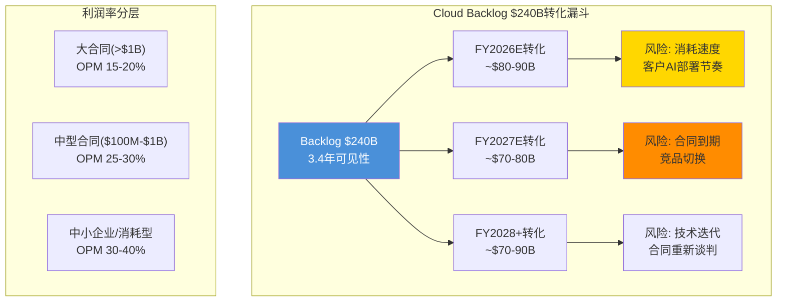

[合理推断: 利润率分层基于企业云合同的市场定价惯例; 转化金额基于backlog均匀分配+新增合同]

### 8.2.6 GenAI收入占比: Cloud增长的质量分析

Google首次在Q3 2025披露GenAI对Cloud收入的贡献——"数十亿美元年化" [硬数据: Alphabet Q3 2025 earnings call]。到Q4 2025, 管理层进一步表示GenAI"是Cloud增长的最大单一驱动力" [硬数据: Alphabet Q4 2025 earnings call]。

| 维度 | 估计值 | 逻辑 |
|:-----|:-----:|:-----|
| GenAI Cloud收入(年化, Q4'25) | ~$10-15B | [合理推断: "数十亿"的季度run-rate, +48%增速中GenAI贡献约一半增量] |
| GenAI占Cloud收入比 | ~14-21% | [合理推断: $10-15B / $70.8B年化] |
| GenAI增速(YoY) | >100% | [合理推断: 2024年GenAI Cloud收入估$3-5B→2025年$10-15B] |
| 传统Cloud增速(YoY) | ~20-25% | [合理推断: 总增速+48%减去GenAI增量后的剩余增速] |

**双引擎增长结构**: Cloud的+48%增速实际由两个引擎驱动——传统IaaS/PaaS稳健增长(~20-25%)和GenAI高速爆发(>100%)。这一结构意味着即使GenAI增速放缓至50-60%, Cloud总增速仍可维持30%+ [合理推断: 基于双引擎增速的数学分解]。

**Vertex AI平台的差异化**: Google Cloud的GenAI差异化来自Vertex AI平台——支持150+基础模型(包括Google自研Gemini和第三方模型)。这种"模型超市"策略降低了客户锁定(客户可随时切换模型)但提升了平台粘性(客户的MLOps流程建在Vertex上) [硬数据: Google Cloud官网Vertex AI model garden; 合理推断: 模型多样性与平台粘性的关系]。

---

## 8.3 Workspace × Gemini: 企业AI入口的渗透战

### 8.3.1 Gemini嵌入Workspace的全景

| Workspace产品 | Gemini功能 | 竞品对标 |
|:------------|:---------|:--------|
| **Gmail** | 邮件摘要/自动回复/邮件生成 | Copilot for Outlook |
| **Docs** | 文档草拟/改写/摘要 | Copilot for Word |
| **Sheets** | 公式生成/数据分析/图表建议 | Copilot for Excel |
| **Slides** | 演示文稿自动生成 | Copilot for PowerPoint |
| **Drive** | 跨文件搜索/文档问答 | Copilot for OneDrive |
| **Chat** | 会议摘要/任务跟踪 | Copilot for Teams |
| **Meet** | 实时翻译/会议纪要 | Copilot for Teams |

[硬数据: Gemini Workspace集成功能来自Google Workspace Updates; Copilot对标来自Microsoft 365文档]

**AI Expanded Access add-on**: 从2026年3月1日起，高级AI功能(NotebookLM Plus、Gemini高级模型等)需要额外付费add-on [硬数据: Google Workspace Updates Dec 2025]。这开辟了一个全新收入流——将已有Workspace用户向上销售至AI付费层。

### 8.3.2 Workspace vs Microsoft Copilot: 企业渗透对比

| 维度 | Google Workspace + Gemini | Microsoft 365 + Copilot |
|:-----|:----------------------:|:----------------------:|
| 付费企业席位 | ~9M+(Google Workspace total) | **15M** Copilot付费席位 |
| Fortune 500渗透 | 中等(Google不披露) | **90%** Fortune 500使用 |
| 月费(AI功能) | 含在Business+/Enterprise, add-on另计 | $21/月(Business, 下调后) |
| AI模型 | Gemini 3 | GPT-4/GPT-5(OpenAI) |
| 大客户案例 | Accenture/Deloitte/KPMG/PwC | 几乎所有大型企业 |
| 增速 | 未披露 | +160% YoY(付费席位) |

[硬数据: Microsoft Copilot 15M席位和90% Fortune 500来自PYMNTS/Futurum; Google Workspace客户来自Google Cloud Blog; Microsoft定价来自CNBC]

```mermaid
graph TD
    subgraph "企业AI助手市场: Workspace vs Copilot"
        W["Google Workspace<br/>+ Gemini<br/>~9M+ 企业席位<br/>AI add-on 2026年3月"]
        C["Microsoft 365<br/>+ Copilot<br/>15M 付费AI席位<br/>+160% YoY"]

        W --> STRENGTH_W["Google优势<br/>- Gemini模型质量<br/>- 原生集成深度<br/>- 定价灵活"]
        C --> STRENGTH_C["Microsoft优势<br/>- 企业渗透率极高<br/>- 先发优势(15M→?)<br/>- 企业IT惯性"]
    end

    STRENGTH_W --> MARKET["$50B+<br/>企业生产力AI<br/>TAM(2028E)"]
    STRENGTH_C --> MARKET

    style W fill:#4A90D9,color:#fff
    style C fill:#FF8C00,color:#fff
```

[合理推断: 企业生产力AI TAM基于McKinsey Global AI Survey 2025和IDC预测]

**Google的劣势**: Microsoft在企业市场的渗透率远超Google。绝大多数大型企业运行Windows + Office 365 [硬数据: Microsoft 365商业用户超过4亿, Gartner/IDC], 切换至Google Workspace的转换成本极高(估计人均迁移成本$500-1,500, 含培训和数据迁移) [合理推断: 基于IT咨询公司的迁移成本估算]。Copilot的先发优势(15M席位) [硬数据: PYMNTS 2026]和分发优势(Office全球安装基数)使Google在这一赛道处于**追赶者**位置 [主观判断: 基于企业IT采购惯性和安装基数对比]。

**Google的机会**: 2026年3月的AI Expanded Access add-on是一个关键的变现时间点。如果Google能将现有Workspace用户的AI付费转化率提升至10-15%，仅此一项即可产生$2-4B/年增量收入 [合理推断: 9M+席位 × 10-15%转化 × $240/年add-on = $2.2-3.2B]。

---

## 8.4 Search × AI Overviews: 收入悖论的深度拆解

### 8.4.1 自蚕食率建模: 当前数据点

这是四大业务AI交叉分析中最关键的一个——因为搜索广告仍然贡献了Alphabet ~56%的收入和~70%的利润:

| 指标 | 数值 | 来源 |
|:-----|:----:|:-----|
| AI Overviews覆盖率 | 15.69%(2025年11月) | [硬数据: Search Engine Land] |
| 峰值覆盖率 | 24.61%(2025年7月) | [硬数据: Search Engine Land] |
| 有机CTR(有AIO) | 0.61%(↓from 1.76%, **-61%**) | [硬数据: Seer Interactive Sep 2025] |
| 付费CTR(有AIO) | 6.34%(↓from 19.7%, **-68%**) | [硬数据: Seer Interactive Sep 2025] |
| AIO中广告出现率 | 25.56%(2025年10月) | [硬数据: Search Engine Land Oct 2025] |
| AIO广告增速 | +394%(从5.17%到25.56%, 8个月) | [硬数据: Search Engine Land 2025] |
| 搜索收入增速(Q4'25) | **+17%** | [硬数据: Alphabet Q4 2025 10-K] |
| CPC(平均) | $5.26(+12.9% YoY) | [硬数据: WordStream 2025] |

```mermaid
graph TD
    subgraph "搜索×AI: 收入悖论解析"
        AIO["AI Overviews<br/>覆盖15.7%查询"] --> CTR_DOWN["CTR下降<br/>有机-61%<br/>付费-68%"]
        AIO --> USAGE_UP["搜索使用量<br/>创历史新高"]

        CTR_DOWN --> AD_LOSS["广告展示压力"]
        USAGE_UP --> QUERY_GAIN["查询量增加"]

        AD_LOSS --> CPC_RISE["CPC补偿<br/>+12.9% YoY"]
        AD_LOSS --> AD_DENSITY["AIO广告密度<br/>5.17%→25.56%<br/>+394%"]
        QUERY_GAIN --> NEW_REV["新查询ARPU<br/>(较低但有增量)"]

        CPC_RISE --> RESULT["净效果: 搜索收入<br/>Q4 +17%<br/>= 正增长"]
        AD_DENSITY --> RESULT
        NEW_REV --> RESULT
    end

    style AIO fill:#4A90D9,color:#fff
    style CTR_DOWN fill:#FF6B6B
    style USAGE_UP fill:#50C878
    style RESULT fill:#FFD700
```

### 8.4.2 收入悖论: CTR暴跌但收入暴涨

**这是GOOGL投资论点中最反直觉的数据点**: AI Overviews将有机CTR压低了61%，付费CTR压低了68%——但搜索收入在Q4 2025仍增长了17%。三个补偿机制正在运作:

**机制一: CPC通胀** — 平均CPC $5.26，同比+12.9% [硬数据: WordStream 2025]。87%的行业CPC在上涨 [硬数据: WordStream 2025]。广告主对搜索意图的竞价正在加剧——部分原因是AI使搜索广告的定位更精准(更高转化率→愿意出更高价)。

**机制二: AIO广告密度扩张** — AIO SERP中的广告位从5.17%(2025年3月)增至25.56%(2025年10月)，8个月增长394% [硬数据: Search Engine Land Oct 2025]。Google正在将AI Overviews本身变成一个广告产品。

**机制三: 搜索频次扩张** — Pichai在Q4'25电话会表示"Search saw more usage than ever before" [硬数据: Alphabet Q4 2025 earnings call]。AI Mode查询长度是传统搜索的3倍 [硬数据: Search Engine Journal Feb 2026]。更长的查询 = 更多的交互 = 更多的广告展示机会。

### 8.4.3 CQ1核心矛盾: 补偿能持续到什么程度?

```mermaid
graph TD
    subgraph "CPC补偿机制的可持续性分析"
        NOW["当前状态<br/>AIO覆盖16%<br/>CPC+12.9%<br/>净效果: +17%搜索收入"]

        NOW --> SAFE["安全区(2026-2027)<br/>AIO覆盖<40%<br/>CPC持续通胀<br/>AIO广告密度→40%+"]

        NOW --> CAUTION["警示区(2027-2028)<br/>AIO覆盖40-55%<br/>CPC增速放缓至+5-7%<br/>广告主ROI开始承压"]

        NOW --> DANGER["危险区(2028+)<br/>AIO覆盖>55%<br/>CPC通胀触顶<br/>竞品分流>10%"]
    end

    SAFE --> OUTCOME1["搜索收入+10-15%"]
    CAUTION --> OUTCOME2["搜索收入+3-7%"]
    DANGER --> OUTCOME3["搜索收入0%或负增长"]

    style SAFE fill:#50C878
    style CAUTION fill:#FFD700
    style DANGER fill:#FF4500,color:#fff
```

**CPC补偿的极限**: CPC不可能无限上涨。当CPC上涨到广告主的ROI临界点时，广告主将开始缩减搜索广告预算(或转向其他渠道)。目前Google搜索广告的转化率+6.84% YoY [硬数据: WordStream 2025]表明广告主仍在获得真实价值——但如果转化率开始下降而CPC继续上涨，这一平衡将被打破 [合理推断: 基于广告ROI的基本经济学]。

### 8.4.4 零点击率的演化

| 时期 | 零点击率(US) | 来源 |
|:-----|:----------:|:-----|
| 2020 | ~50% | [硬数据: SparkToro] |
| 2024年中 | ~58.5% | [硬数据: Click-Vision] |
| 2025年中 | ~65% | [硬数据: Superprompt/UpAndSocial] |
| AIO查询 | ~83% | [硬数据: 行业数据] |
| 2026年中(E) | **~70%+** | [合理推断: 基于趋势和AIO覆盖率扩张] |

```mermaid
graph LR
    subgraph "零点击搜索率趋势 (US)"
        A["2020<br/>~50%"] --> B["2024<br/>~58.5%"]
        B --> C["2025<br/>~65%"]
        C --> D["2026E<br/>~70%+"]
        D --> E["AIO查询<br/>~83%"]
    end

    style A fill:#50C878
    style B fill:#90EE90
    style C fill:#FFD700
    style D fill:#FF8C00
    style E fill:#FF4500,color:#fff
```

**零点击率上升的投资含义**: 从Google的角度来看，零点击不是bug而是feature——用户留在Google生态内更久。但从出版商角度，零点击意味着流量和广告收入的持续流失，长期可能导致内容生态退化(内容质量下降 → 搜索结果质量下降 → 用户体验下降)。这是搜索护城河负螺旋的核心驱动力，将在Ch09详细分析 [主观判断: 基于多边市场健康度评估框架]。

---

## 8.5 四大业务AI交叉的综合评估

```mermaid
graph TD
    subgraph "四大业务×AI交叉矩阵"
        YT["YouTube × AI<br/>AI增强型<br/>正向循环<br/>风险: Shorts RPM"]
        CLOUD["Cloud × AI<br/>增长引擎型<br/>48% YoY<br/>风险: 折旧侵蚀利润率"]
        WS["Workspace × Gemini<br/>追赶者型<br/>新收入流<br/>风险: Microsoft先发优势"]
        SEARCH["Search × AI<br/>自蚕食+补偿型<br/>收入悖论<br/>风险: CPC补偿极限"]
    end

    YT --> NET["净效应评估"]
    CLOUD --> NET
    WS --> NET
    SEARCH --> NET

    NET --> BULL_NET["Bull: AI是四大业务的<br/>增长加速器<br/>+$40-60B收入(2027E)"]
    NET --> BASE_NET["Base: AI增强3个业务<br/>搜索中性<br/>+$20-35B收入(2027E)"]
    NET --> BEAR_NET["Bear: 搜索蚕食加速<br/>Cloud利润率受压<br/>+$5-15B收入(2027E)"]

    style YT fill:#50C878
    style CLOUD fill:#4A90D9,color:#fff
    style WS fill:#FFD700
    style SEARCH fill:#FF8C00
```

| 业务 | AI净效应 | 确定性 | CQ关联 |
|:-----|:-------:|:-----:|:------:|
| **YouTube** | **强正面** — AI增强创作/发现/变现 | 高 | CQ5(Gemini入口) |
| **Cloud** | **强正面** — AI驱动48%增速 | 中高 | CQ4(利润率) |
| **Workspace** | **中正面** — 新收入流但追赶中 | 中 | CQ5(Gemini入口) |
| **Search** | **短期正面/中期不确定** — 收入悖论 | 中低 | CQ1(CPC补偿极限) |

[主观判断: 综合评估基于各业务的AI交叉分析]

**关键洞察**: AI对Alphabet四大业务的影响呈现明显的**差异化格局** — YouTube和Cloud是明确的受益者，Workspace是有条件的受益者，搜索则处于增强与蚕食的动态平衡中。投资者不应将"AI对Google"视为单一叙事，而应分别评估四个业务线的AI净效应 [主观判断: 基于四业务独立分析的综合]。

### 8.5.1 搜索收入三情景量化: FY2027E投射

基于Ch08.4的收入悖论分析, 构建搜索广告FY2027E的三路径模型:

**搜索收入公式回顾**: Revenue = Query Volume × Ad Coverage × CTR × CPC

| 变量 | FY2025(基线) | Bull 2027E | Base 2027E | Bear 2027E |
|:-----|:----------:|:---------:|:---------:|:---------:|
| 查询量增速(YoY) | +8%(估) | +10% | +6% | +3% |
| AIO覆盖率 | 16% | 25% | 35% | 50% |
| AIO广告出现率 | 25.56% | 45% | 35% | 25% |
| 传统有机CTR | 1.76% | 1.6% | 1.4% | 1.2% |
| AIO查询CTR | 0.61% | 0.80% | 0.65% | 0.55% |
| CPC | $5.26 | $7.00 | $6.50 | $5.80 |
| 搜索收入(年) | ~$225B | ~$290B | ~$260B | ~$235B |
| 搜索收入增速(2Y CAGR) | — | +13.5% | +7.5% | +2.2% |

[硬数据: FY2025基线来自Alphabet 10-K各季度累加; CPC来自WordStream 2025; CTR来自Seer Interactive]
[合理推断: 三情景的变量假设基于当前趋势的延伸, 含AIO覆盖率的管理层控制意愿]

```mermaid
graph LR
    subgraph "搜索收入三路径 FY2025→FY2027E"
        BASE_25["FY2025<br/>~$225B<br/>+17% YoY"]
        BASE_25 --> BULL_27["Bull FY2027E<br/>~$290B<br/>CAGR +13.5%"]
        BASE_25 --> BASE_27["Base FY2027E<br/>~$260B<br/>CAGR +7.5%"]
        BASE_25 --> BEAR_27["Bear FY2027E<br/>~$235B<br/>CAGR +2.2%"]
    end

    BULL_27 --> B_NOTE["前提: AIO广告产品化成功<br/>CPC持续通胀至$7"]
    BASE_27 --> M_NOTE["前提: AIO覆盖35%<br/>CPC温和增长"]
    BEAR_27 --> S_NOTE["前提: AIO被迫扩展至50%<br/>竞品分流加速"]

    style BULL_27 fill:#50C878
    style BASE_27 fill:#FFD700
    style BEAR_27 fill:#FF6B6B
```

**Bull-Bear差距**: $290B vs $235B, 差异$55B(约24%)。这$55B的差距几乎完全取决于两个变量: (1) AIO覆盖率(管理层能否控制在25%以内); (2) CPC通胀(是否能维持+12%还是放缓至+5%) [合理推断: 基于敏感性分析的两变量主导]。

**对估值的含义**: 搜索业务按15-18x P/E估值, Bull和Bear路径之间的估值差异约为$55B×15-18x×(1-30%税率)= ~$580-700B市值差异。搜索是Alphabet估值中**弹性最大**的单一变量 [合理推断: 基于搜索利润率~40%和15-18x P/E假设]。

### 8.5.2 AI交叉矩阵的时间维度: 什么时候"AI增强"变成"AI替代"?

| 业务 | AI增强阶段 | 转折风险时间 | 转折信号 |
|:-----|:--------:|:----------:|:--------|
| **YouTube** | 当前→2030+ | 极低概率 | AI生成视频完全替代人类创作(>50%观看) |
| **Cloud** | 当前→2028 | 中(利润率) | 折旧传导+大合同挤压利润率<20% |
| **Workspace** | 2026→2028 | 中高(份额) | Copilot渗透率>30%且Workspace AI add-on转化率<5% |
| **Search** | 当前 | **已在进行** | AIO覆盖率>40%且CPC增速<5% |

[主观判断: 时间维度基于各业务的AI渗透速度和竞品发展节奏]

**关键差异**: YouTube和Cloud的"AI增强"几乎没有转为"AI替代"的风险——因为AI让这两个业务变得更好(更多内容/更多算力需求)。而Search的AI增强与AI替代之间只有一线之隔——AI Overviews同时在帮助搜索(更好的回答)和削弱搜索(减少点击)。这种内在矛盾使搜索成为四大业务中**最值得密切追踪**的一个 [主观判断: 基于AI对四大业务的差异化影响分析]。

---

---

# Ch09: 搜索护城河在AI时代的强化与侵蚀 — 双螺旋模型

> **关联CQ**: CQ1(AI Overviews蚕食 — CPC补偿能持续多久), CQ7(Agent时代 — 搜索+广告模式被强化还是颠覆), CQ8(三个承重墙哪个最脆弱)

---

## 9.1 护城河量化框架: 四层防线

### 9.1.1 网络效应: 正反馈循环的量化

Google搜索的护城河由四类相互强化的网络效应构成:

**类型一: 数据网络效应(Data Network Effects)**

核心飞轮: 更多搜索 → 更好排序信号 → 更精准结果 → 更多搜索

- 日搜索量: ~8.5-16.4B次/天(各数据源差异大, Google官方最后确认≥2T/年是2016年, 当前普遍估计5-6T/年) [硬数据: DemandSage/SQ Magazine 2026-02]
- 搜索索引规模: 数千亿网页，远超Bing(覆盖约Google索引深度的60-70%) [合理推断: 基于行业分析师共识]
- 收益递减状态: Google已处于数据飞轮的**收益递减后期**——从8B到16B搜索/天的边际质量提升极小。关键已从"更多数据"转向"更好的AI模型" [合理推断: 基于信息检索边际收益递减的学术共识]

**类型二: 间接网络效应(Cross-side Network Effects)**

核心飞轮: 更多用户 → 更多广告主竞价 → 更高ARPU → 更多产品投入 → 更多用户

- FY2025 Google Search & other收入: ~$225B [硬数据: Alphabet FY2025各季度10-Q/10-K累加]
- FY2025平均CPC: $5.26(+12.9% YoY)，87%的行业CPC上涨 [硬数据: WordStream/LocalIQ 2025]
- 强度评判: **极强** — 广告主几乎无法绕过Google触达搜索意图用户 [主观判断: 基于广告市场结构]

**类型三: 学习网络效应(Learning/AI Network Effects)**

核心飞轮: 更多交互 → 更好AI模型 → 更精准个性化 → 更高留存

- Gemini 3已设为AI Overviews全球默认模型 [硬数据: 9to5Google 2026-01-27]
- Google拥有数十年的搜索点击反馈RLHF数据, 竞品在此维度差距极大 [合理推断: 基于搜索历史数据积累]
- 但LLM的通用学习能力部分抵消了搜索专用数据的优势 [合理推断: GPT/Claude等模型无需搜索专用数据即可提升通用问答质量]

**类型四: 分发网络效应(Distribution Network Effects)**

核心飞轮: 默认搜索引擎 → 用户习惯 → 更多数据 → 更好产品 → 更高分发溢价

- 默认搜索费: Google每年支付>$20B(Apple ~$18-20B + Samsung等OEM) [硬数据: DOJ庭审文件/Bernstein估计]。这一金额约占Apple Services收入的~23% [合理推断: Apple FY2025 Services收入~$85B, Google TAC $18-20B/$85B=21-24%]
- DOJ判决: 禁止排他性默认协议, 合同限制为1年期 [硬数据: NPR/CNBC 2025-09-02]。但Apple有经济动力续约——放弃$18-20B/年的"几乎无成本收入"对Apple自身利润影响巨大 [合理推断: 基于Apple Services利润率结构]
- 强度: **已受损(从9/10降至6/10)** — 从排他锁定变为开放竞争 [主观判断: 基于DOJ判决对分发模式的影响]
- Safari默认搜索仍是Google最大的单一流量来源之一: Apple设备占全球搜索查询约30% [合理推断: 基于iOS/Mac全球设备份额×搜索使用率]

```mermaid
quadrantChart
    title "搜索网络效应: 强度 × 可持续性"
    x-axis "低可持续性" --> "高可持续性"
    y-axis "低强度" --> "高强度"
    quadrant-1 "核心护城河"
    quadrant-2 "受威胁区"
    quadrant-3 "基础能力"
    quadrant-4 "潜在优势"
    "间接网络效应(广告主)": [0.85, 0.90]
    "数据网络效应(搜索)": [0.70, 0.65]
    "学习网络效应(AI)": [0.55, 0.70]
    "分发网络效应(默认)": [0.40, 0.60]
```

### 9.1.2 规模效应: 首次跌破90%的含义

| 时间点 | 全球搜索份额 | 桌面端 | 移动端 | 来源 |
|:------|:----------:|:-----:|:-----:|:-----|
| 2024年7月 | 91.47% | ~89% | ~95.5% | [硬数据: StatCounter] |
| 2025年7月 | **89.57%** | **79.88%** | **94.64%** | [硬数据: StatCounter Jul 2025] |
| 2026年1月 | 90.04% | ~82% | ~95.3% | [硬数据: StatCounter Jan 2026] |

[硬数据: StatCounter各月搜索份额数据]

```mermaid
graph LR
    subgraph "搜索市场份额趋势"
        G_ALL["全球总份额<br/>91.47%→89.57%→90.04%<br/>首次跌破90%后回升"]
        G_DESK["桌面端<br/>89%→79.88%→~82%<br/>脆弱(↓近10pp)"]
        G_MOB["移动端<br/>95.5%→94.64%→~95.3%<br/>稳固(仅↓~1pp)"]
    end

    style G_ALL fill:#FFD700
    style G_DESK fill:#FF6B6B
    style G_MOB fill:#50C878
```

**桌面端是脆弱点**: 桌面端份额从89%降至约80% [硬数据: StatCounter 2025-2026]，降幅近10个百分点。这主要受益于:
- Bing/Copilot在Windows中的深度集成(Bing桌面端11.96%, 从~9%上升) [硬数据: VenueLabs 2026]
- 企业用户更多在桌面端使用ChatGPT/Perplexity处理工作查询 [合理推断: 基于使用场景分析]
- 桌面端用户更容易切换搜索引擎(vs 移动端受限于默认设置) [合理推断: 基于设备使用行为差异]

**移动端仍是堡垒**: 94.64%的移动端份额 [硬数据: StatCounter Jul 2025]意味着Android的默认搜索地位和iOS上的默认协议仍在有效保护Google。但DOJ判决+EU DMA的双重压力可能在2027-2028年开始动摇这一堡垒。

### 9.1.3 转换成本: $20B+的经济锁定

| 锁定维度 | 强度 | 关键依据 | DOJ判决后变化 |
|:---------|:---:|:--------|:-----------:|
| **数据锁定**(搜索历史/Chrome/Gmail) | 强 | 切换意味着失去所有个性化偏好 | 不变 |
| **账户生态锁定**(Google Account=全服务) | 极强 | Android+YouTube+Drive+Photos+Maps = 极高综合转换成本 | 微降 |
| **开发者锁定**(Ads API/Analytics) | 强 | 广告主投放系统深度集成Google Ads | 不变(广告数据不开放) |
| **分发锁定**(默认搜索协议) | **已受损** | DOJ禁止排他性+合同限1年 | 显著下降 |

[硬数据: DOJ判决细节来自NPR 2025-09-02; 法院要求开放搜索索引但不开放广告数据]

**综合锁定评估**: 从AI前的~8.5/10降至当前约7/10。分发锁定这一最外层防线已被DOJ打开缺口，但数据锁定和账户生态锁定几乎未受影响 [主观判断: 基于四维度锁定的综合加权]。

**转换成本的非对称性**: 从Google切换到竞品的转换成本远高于反向路径。一个深度使用Google生态的用户(Gmail+Drive+Photos+Calendar+Maps+YouTube)的切换成本估计等价于**40-80小时的迁移工作** [合理推断: 基于数据迁移量/账户迁移/习惯重建的综合估算]。而从Bing/DuckDuckGo切换到Google只需改变一个默认设置(约10秒)。这种非对称性意味着Google的用户留存率天然高于竞品——即使产品质量差距缩小, 用户也不会主动迁移 [合理推断: 基于行为经济学的"默认效应"和转换成本不对称]。

**DOJ判决对转换成本的具体影响时间线**:

| 时间节点 | 事件 | 对转换成本的影响 |
|:---------|:-----|:---------------|
| 2025年9月 | 补救令: 禁止排他默认协议 | 分发锁定从"排他"降为"非排他" [硬数据: NPR] |
| 2025年9月 | 合同限1年期 | 每年一次竞品竞标窗口 [硬数据: 法院判决] |
| 2026年Q1 | 数据共享令生效(如执行) | 搜索数据护城河部分开放 [硬数据: 法院判决] |
| 2026年2月 | DOJ上诉提交 | 可能要求更严厉措施(Chrome分拆等) [硬数据: DOJ通知] |
| 2027-2028 | 上诉法院裁决 | 最终确定数据开放/分拆范围 [合理推断: 基于法律流程时间线] |

[硬数据: DOJ判决时间线来自NPR/CNBC 2025-09; 上诉时间线来自法律分析]

### 9.1.4 数据护城河: 搜索意图 × YouTube理解 × Maps空间

| 数据类型 | 日规模 | 独占程度 | 竞品可替代性 |
|:--------|:-----:|:-------:|:----------:|
| **搜索意图数据** | ~8.5-16.4B查询/天 | 极高 | 极低(Bing仅~1.2B/天) |
| **YouTube观看行为** | 10亿+小时/天 | 高 | 中(TikTok/Reels有部分替代) |
| **Android使用模式** | 30亿+活跃设备 | 高 | 低(Apple仅有iOS数据) |
| **Chrome浏览数据** | 65%+浏览器份额 | 中高 | 中(Edge+Safari有部分替代) |
| **Maps地理数据** | 20亿+MAU | 高 | 低(实时地理意图独特) |
| **Gmail通信图谱** | 18亿+用户 | 中高 | 中(Outlook规模较小) |

[硬数据: 搜索量来自DemandSage 2026; YouTube观看时长来自Google公开数据; Android设备数来自Statista; Chrome份额来自StatCounter; Maps MAU来自GlobalMediaInsight]

**Google的跨域数据优势是所有科技巨头中最全面的**: 搜索意图(知道你想什么) + YouTube兴趣(知道你看什么) + Maps位置(知道你在哪) + Gmail通信(知道你联系谁) + Android行为(知道你用什么)。这种360度用户画像使Google的广告定向精度无人能及 [合理推断: 基于跨域数据对广告定向的增量价值]。

**但DOJ数据开放是唯一的直接威胁**: 法院要求开放搜索索引和用户交互数据(不含广告数据) [硬数据: 法院判决 2025-09]。如果DOJ上诉成功要求更大范围数据开放，竞品将获得训练搜索AI的核心数据——这将从根本上削弱数据飞轮的独占性 [硬数据: DOJ上诉通知 2026-02-03]。

---

## 9.2 双螺旋模型: 正螺旋与负螺旋的同时运行

这是GOOGL搜索分析中最重要的框架——两个方向相反的螺旋正在同时运行，问题是哪个先到达临界点。

### 9.2.1 正螺旋(强化): AI Overviews增强搜索粘性

```mermaid
graph TD
    subgraph "正螺旋: AI增强搜索"
        P1["搜索份额90%+"] --> P2["海量搜索意图数据<br/>8.5B+查询/天"]
        P2 --> P3["Gemini训练数据优势<br/>78%成本降低"]
        P3 --> P4["AI Overviews<br/>质量领先竞品"]
        P4 --> P5["搜索体验提升<br/>更复杂查询可处理"]
        P5 --> P6["用户粘性增强<br/>使用量创新高"]
        P6 --> P1
    end

    style P1 fill:#50C878
    style P4 fill:#4A90D9,color:#fff
    style P6 fill:#50C878
```

**正螺旋的量化证据**:

1. **使用量创新高**: Pichai在Q4'25电话会确认"Search saw more usage than ever before, with AI continuing to drive an expansionary moment" [硬数据: Alphabet Q4 2025 earnings call]

2. **搜索份额回升**: 从2025年7月低点89.57%回升至2026年1月90.04% [硬数据: StatCounter]

3. **AI Mode查询深度增加**: AI Mode查询长度是传统搜索的3倍, 且"显著比例"会产生后续提问 [硬数据: Search Engine Journal Feb 2026]

4. **被引品牌获得更多点击**: 被AI Overviews引用的品牌获得+35%有机点击和+91%付费点击 [硬数据: Seer Interactive 2025]

5. **CTR趋势回升**: BrightEdge数据显示AI Overviews推出后CTR呈**回升趋势** [硬数据: BrightEdge/Search Engine Land 2025-2026]

**正螺旋的核心逻辑**: AI Overviews不是在减少搜索使用, 而是在**改变搜索的性质**。用户进行更多复杂查询(因为AI能给出更好答案), 总搜索量增加, 即使单次查询的点击率下降 [合理推断: 基于使用量数据和查询复杂度提升的交叉验证]。

### 9.2.2 负螺旋(侵蚀): AI Overviews削弱内容生态

```mermaid
graph TD
    subgraph "负螺旋: AI侵蚀搜索生态"
        N1["AI Overviews<br/>直接摘录内容"] --> N2["出版商有机流量↓<br/>CTR -61%"]
        N2 --> N3["出版商广告收入↓<br/>内容投入缩减"]
        N3 --> N4["高质量免费内容减少<br/>付费墙增加"]
        N4 --> N5["Google可爬取的<br/>高质量内容减少"]
        N5 --> N6["AI Overviews<br/>答案质量下降"]
        N6 --> N7["搜索体验退化<br/>用户流失至竞品"]
        N7 --> N1
    end

    style N1 fill:#FF6B6B
    style N3 fill:#FF8C00
    style N6 fill:#FF4500,color:#fff
```

**负螺旋的量化证据**:

1. **有机CTR暴跌-61%**: 有AI Overviews的查询中有机CTR从1.76%降至0.61% [硬数据: Seer Interactive Sep 2025]

2. **零点击率飙升至83%**: AIO触发查询的零点击率达83%, 远高于传统查询的~60% [硬数据: SparkToro/Similarweb 2025]

3. **出版商反应**: New York Times等媒体积极屏蔽AI爬虫+加速付费墙 [合理推断: 基于出版行业公开表态]

4. **搜索广告印象量↓15%**: 但广告支出+4%(CPC通胀弥补展示下降) [硬数据: Search Engine Land/Orange SEO 2025]

**负螺旋的时间维度**: 内容生态退化是一个**慢变量**——不会在1-2年内显现，但在3-5年内可能形成不可逆的结构性损害。关键转折点是: 当足够多的高质量内容来源转向付费墙/屏蔽AI爬虫时，Google搜索的原始信号质量将开始结构性下降 [主观判断: 基于多边市场健康度的长期趋势分析]。

### 9.2.3 双螺旋平衡点: 当前在安全区内

**核心模型**:

临界覆盖率 = AIO覆盖率达到**45-55%**且AIO广告出现率未同步提升至50%+时, 负螺旋开始主导 [合理推断: 基于搜索收入公式的敏感性分析]

当前状态: AIO覆盖率**16%** << 临界点45-55% = **深处安全区**

```mermaid
graph LR
    subgraph "双螺旋平衡模型"
        SAFE["安全区<br/>AIO 0-30%<br/>当前16%在此"]
        CAUTION["过渡区<br/>AIO 30-45%<br/>正负力量趋于平衡"]
        CRITICAL["临界区<br/>AIO 45-55%<br/>负螺旋开始主导"]
        DANGER["危险区<br/>AIO >55%<br/>收入可能转负"]
    end

    SAFE --> CAUTION
    CAUTION --> CRITICAL
    CRITICAL --> DANGER

    CURRENT["当前位置<br/>AIO 16%"] --> SAFE

    style SAFE fill:#50C878
    style CAUTION fill:#FFD700
    style CRITICAL fill:#FF8C00
    style DANGER fill:#FF4500,color:#fff
    style CURRENT fill:#4A90D9,color:#fff
```

**管理层的战略自律**: Google**主动**将覆盖率从峰值26%(2025年7月)回撤至16%(2025年11月) [硬数据: Search Engine Land/BrightEdge 2025]，同时移除部分医疗查询的AIO [硬数据: TechCrunch 2026-01-11]。覆盖率回撤10个百分点的同时, 搜索收入增速从Q3 +11%加速至Q4 +17% [硬数据: Alphabet Q3/Q4 2025 10-Q/10-K]——这证明适度回撤AIO实际上**提升了**搜索广告效率, 因为更多查询回到了传统广告密集的搜索结果页 [合理推断: 基于AIO覆盖率下降与搜索收入加速的时间相关性]。这说明管理层**已经意识到**负螺旋的风险，并选择在安全区内运营。这是一个**理性且审慎**的战略选择，也是一个Bull信号 [主观判断: 基于覆盖率管理行为的推断]。

---

## 9.3 AI搜索替代率建模: 更新v3.0核心公式

### 9.3.1 搜索份额的双重视角

一个被反复混淆的概念: **查询份额 ≠ 广告市场份额**。

| 维度 | Google份额 | 趋势 | 来源 |
|:-----|:---------:|:----:|:-----|
| **搜索查询份额** | 89.57-90.04% | 微降但稳定 | [硬数据: StatCounter 2025-2026] |
| **搜索广告市场份额** | <50%(2026E) | 显著下降 | [硬数据: eMarketer 2026 forecast] |

[硬数据: StatCounter查询份额; eMarketer广告份额预测]

**为什么两个数字差距如此之大?** 广告市场份额的下降反映的不是Google丢失搜索查询，而是**数字广告预算的结构性再分配**:
- Amazon广告(零售搜索)快速增长 → 分流搜索广告预算 [合理推断: 基于Amazon广告增速+30% YoY]
- TikTok/Instagram(社交视频广告)崛起 → 分流品牌广告预算
- 零售媒体网络(Walmart/Target等)增长 → 分流本地/商品广告预算
- Google的搜索查询量不变，但广告主的**预算分配**发生了变化

**对投资者的含义**: eMarketer的"Google搜索广告份额<50%"标题看起来很可怕，但它描述的是广告市场格局的多元化，而非Google搜索使用量的崩溃。Google的绝对搜索广告收入仍在增长(+17% Q4'25)——只是增速慢于整体数字广告市场 [合理推断: 基于份额概念的精确区分]。

### 9.3.2 竞品替代率建模

| 竞品 | 当前搜索市场份额 | 增长趋势 | 2027E份额(Base) | 核心差异化 |
|:-----|:---------------:|:-------:|:-------------:|:---------|
| **ChatGPT Search** | ~9%(全球) | 极强 | ~12-15% | 对话式搜索+创意任务 |
| **Perplexity** | ~2%(查询基准) | 极强(800%+YoY) | ~3-5% | 引用精度+知识工作者 |
| **Bing/Copilot** | 4%(全球)/12%(桌面) | 中 | ~5%(全球)/14%(桌面) | Windows集成 |
| **Grok** | <1% | 快速增长 | ~1-2% | X/Twitter用户基础 |

[硬数据: ChatGPT 9%来自First Page Sage 2026; Perplexity 6.4-8% AI chatbot份额来自SEOProfy; Bing 4%来自StatCounter; Grok相关数据来自Trending Topics EU]

```mermaid
graph TD
    subgraph "AI搜索竞品威胁矩阵"
        CPT["ChatGPT Search<br/>MAU ~542M<br/>份额~9%<br/>威胁: 7/10"]
        PPX["Perplexity<br/>MAU ~22-40M<br/>查询~780M+/月<br/>威胁: 4/10"]
        BING["Bing/Copilot<br/>DAU ~100M(Copilot)<br/>桌面端12%<br/>威胁: 5/10"]
        APPLE["Apple Intelligence<br/>0%(未上线自研)<br/>15亿设备分发<br/>威胁: 6/10(潜在)"]
    end

    CPT --> RISK["综合竞品威胁<br/>短期(1-2年): 可控<br/>中期(3-5年): 需监测<br/>长期(5-10年): 高不确定性"]
    PPX --> RISK
    BING --> RISK
    APPLE --> RISK

    style CPT fill:#FF4500,color:#fff
    style APPLE fill:#FFD700
    style RISK fill:#FF6B6B
```

**Gartner预测**: 传统搜索量到2026年底将下降约25% [硬数据: Gartner forecast 2024]。但这一预测需要审慎解读——"传统搜索"的定义可能不包含AI增强搜索(如Google的AI Mode) [合理推断: Gartner可能使用的"传统搜索"定义排除AI增强功能]。如果将AI Mode/AI Overviews视为搜索的进化(而非替代)，实际搜索量下降可能远小于25%。实际上, Pichai在Q4 2025表示搜索使用量"创历史新高" [硬数据: Alphabet Q4 2025 earnings call], 与Gartner预测形成鲜明对比——原因可能是Google将AI搜索和传统搜索的流量合并统计 [合理推断: 基于搜索流量定义的差异]。

### 9.3.3 关键区别: 查询份额稳定 vs 高价值用户流失

一个被忽视的风险: 即使Google的总搜索份额维持89%+, 如果流失的1-2%是**高价值知识工作者**, 对搜索广告ARPU的影响可能不成比例:

| 用户群 | Google使用率 | 流失目的地 | ARPU影响 |
|:------|:----------:|:--------:|:------:|
| 一般消费者 | ~95% | 几乎不流失 | 低 |
| **知识工作者** | **~80-85%** | ChatGPT/Perplexity | **高**(CPC $8-15的查询) |
| 开发者 | ~75-80% | ChatGPT/Stack Overflow AI | 中 |
| 学生/学术 | ~85% | ChatGPT/Perplexity | 低(CPC低) |
| 商业决策者 | ~90% | 仍以Google为主 | 最高(CPC $10-25) |

[合理推断: 各用户群的搜索引擎偏好基于First Page Sage 2026数据——ChatGPT在创意/研究任务中占64% vs Google 29%]

**ARPU不对称风险**: 如果ChatGPT从Google手中拿走的主要是知识工作者的研究/创意查询(CPC $8-15), 即使查询份额仅流失2-3%, 对应的广告收入影响可能达到4-6% [合理推断: 基于查询类型与CPC的相关性——高价值查询的CPC是平均CPC $5.26的1.5-3x]。

### 9.3.4 Apple Intelligence: 最被低估的长期威胁

Apple对Google搜索护城河的影响是**所有竞品中最特殊的** — 它既是Google最大的付费合作伙伴($20B+/年TAC), 又是潜在的最大颠覆者(15亿活跃设备的分发优势):

**当前状态(2026年初)**:
- Apple选择Google Gemini驱动新版Siri(iOS 26.4, 2026年春) [硬数据: CNBC 2026-01-12]
- 合同金额约$1B/年 [硬数据: 多家媒体 2026-01]
- Apple同时开发"World Knowledge Answers"自研AI搜索 [硬数据: Search Engine Land 2025]
- Apple在研1T参数云端模型, 目标2026年底或2027年 [硬数据: Apple AI报道 2026]

**情景分析**:

| 情景 | 概率 | 对Google影响 | 时间线 |
|:-----|:---:|:----------:|:------:|
| Apple长期依赖Gemini | 25% | 正面 — iOS入口稳定 | 持续 |
| Apple 2027-2028推出自研搜索 | 40% | **严重** — 丧失iOS入口 | 2027-2028 |
| Apple混合模式(Gemini+自研) | 30% | 中等 — TAC下降50% | 2027+ |
| Apple收购Perplexity | 5% | 高 — Perplexity获iOS分发 | 2026-2027 |

[主观判断: 概率基于Apple历史战略模式(偏好自研)+当前技术进展]

**关键洞察**: Apple选择Gemini驱动Siri是**短期利好但长期预警**。Apple——全球最有能力自研AI的公司之一——暂时选择付费使用Google, 说明自研AI尚未达到可发布水平。但Apple的历史模式是: 先合作学习(如Intel芯片→自研M系列), 然后自研替代。投资者应将Apple自研搜索视为**2027-2028年的关键风险窗口** [主观判断: 基于Apple历史战略模式的归纳]。

### 9.3.5 内容生态健康度: 搜索的隐性基础设施

搜索护城河的一个被严重低估的维度是**内容生态的健康度** — Google搜索的质量最终取决于互联网上高质量免费内容的供给:

| 内容生态参与方 | 规模 | 当前状态 | 风险评估 |
|:-------------|:----:|:------:|:-------:|
| **出版商/媒体** | 数百万网站 | 有机流量↓61%(AIO查询); 正在加速付费墙 | **高** |
| **用户** | ~49亿MAU | 使用量创新高; 但零点击率60-83% | 中 |
| **广告主** | 数百万账户 | CPC+12.9%, 转化率+6.84%; 需求旺盛 | 低 |
| **创作者/UGC** | 数十亿网页 | Reddit/Quora等UGC成为AI训练重要来源 | 中低 |

[硬数据: 出版商CTR来自Seer Interactive; 用户搜索使用量来自Alphabet Q4 earnings call; CPC来自WordStream]

**内容生态恶性循环的量化逻辑**:

```mermaid
graph TD
    subgraph "内容生态退化循环(负螺旋核心驱动)"
        AIO["AI Overviews<br/>直接摘录内容"] --> TRAFFIC["出版商流量↓<br/>CTR -61%"]
        TRAFFIC --> REVENUE["出版商广告收入↓"]
        REVENUE --> INVEST["减少内容投入<br/>or 加速付费墙"]
        INVEST --> QUALITY["Google可爬取的<br/>高质量内容减少"]
        QUALITY --> AI_QUALITY["AI Overviews<br/>答案质量↓"]
        AI_QUALITY --> UX["搜索体验退化"]
        UX --> CHURN["用户流失至竞品"]
    end

    INVEST --> ROBOT["屏蔽AI爬虫<br/>(NYT等已行动)"]
    ROBOT --> QUALITY

    style AIO fill:#FF6B6B
    style QUALITY fill:#FF8C00
    style CHURN fill:#FF4500,color:#fff
```

**时间维度**: 这一循环目前处于**早期阶段** — 多数出版商仍在产出免费内容, 但已有明确迹象(New York Times积极屏蔽AI爬虫+加速付费墙) [合理推断: 基于出版行业公开表态]。该风险在3-5年内逐渐显现, Google可通过内容分成/流量保障等措施缓解, 但根本矛盾(AI摘要 vs 出版商流量需求)难以完全解决 [主观判断: 基于多边市场健康度分析]。

**隐私法规对数据护城河的悖论效应**: 直觉上, GDPR/CCPA等隐私法规限制数据采集应该削弱Google的数据护城河。但实际效果恰好相反 [合理推断: 基于GDPR实施以来Google vs Meta广告收入增速差]:
- GDPR限制了**第三方数据** → 广告主更依赖**第一方数据**(搜索意图)
- Apple ATT限制了**跨App追踪** → 最大受害者是Meta(ATT成本>$10B/年), 而非Google
- Cookie保留意味着Google的广告定向能力**未受结构性损害** [硬数据: Google 2024年7月宣布不再废弃第三方Cookie]
- 净效果: 隐私法规实际上**加深了Google的数据护城河**, 因为它削弱了竞争对手的数据能力

---

## 9.4 搜索广告的结构性未来

### 9.4.1 CPC上涨能否持续补偿CTR下降?

```mermaid
graph TD
    subgraph "CPC vs CTR的竞赛"
        CPC["CPC上涨<br/>+12.9% YoY<br/>$5.26平均"]
        CTR["CTR下降<br/>-61%(AIO查询)<br/>-15%(广告印象量)"]

        CPC --> NET_NOW["当前净效果<br/>搜索收入+17%<br/>CPC补偿>CTR损失"]

        CPC --> LIMIT["CPC上涨极限<br/>广告主ROI临界点<br/>估计CPC $7-8(+30-50%)"]
        CTR --> ACCEL["CTR衰减加速<br/>如果AIO覆盖率>40%<br/>CTR衰减扩大"]

        LIMIT --> CROSSOVER["交叉点<br/>CPC增速 < CTR衰减速度<br/>估计: 2028-2029年"]
        ACCEL --> CROSSOVER
    end

    style NET_NOW fill:#50C878
    style CROSSOVER fill:#FF6B6B
```

**CPC上涨的理论极限**: 当前平均CPC $5.26 [硬数据: WordStream 2025 Google Ads Benchmarks], 转化率+6.84% YoY [硬数据: WordStream 2025]意味着广告主仍在获得真实ROI改善。各行业CPC差异巨大: 法律服务$9.21 [硬数据: WordStream 2025], 保险$9.19 [硬数据: WordStream 2025], 零售$1.72 [硬数据: WordStream 2025]。CPC有上限——当广告主的获客成本(CAC)超过客户终身价值(LTV)时, CPC通胀将触顶。保守估计这一极限在$7-8(即再涨30-50%)——可能支撑2-3年的补偿 [合理推断: 基于搜索广告ROI的基本经济学; 假设转化率维持当前水平; 已考虑87%行业CPC上涨的广泛性]。

### 9.4.2 Impression-based vs Click-based: 广告模式转型

零点击率上升到70%+意味着传统的按点击计费(CPC)模式正在面临结构性挑战。Google有两个应对方向:

| 方向 | 描述 | 进展 | 可行性 |
|:-----|:-----|:----:|:-----:|
| **AIO内嵌广告** | 在AI Overviews回答中嵌入品牌推荐/产品链接 | 出现率已达25.56% | 高 — 正在快速扩张 |
| **印象计费(CPM)** | 从按点击计费转向按展示计费 | 尚未公开测试 | 中 — 需要广告主教育 |
| **对话式广告** | 在Gemini聊天中嵌入商品推荐 | 计划2026年上线 | 中低 — 用户接受度不确定 |
| **Agent广告** | 在Agent完成任务过程中嵌入推荐 | 概念阶段 | 低 — 模式尚未定义 |

[硬数据: AIO广告出现率来自Search Engine Land; Gemini chatbot广告计划来自AdWeek 2025-12]

### 9.4.3 Agent时代: 如果用户不再搜索?

**CQ7的核心问题**: 在Agent时代，如果用户通过AI Agent直接完成任务(如"帮我订明天飞上海最便宜的机票")而不是搜索("上海机票")，广告模式的基础——用户意图+点击——是否瓦解?

```mermaid
graph TD
    subgraph "传统搜索模式"
        T1["用户输入查询"] --> T2["Google显示10条结果+广告"]
        T2 --> T3["用户点击(广告主付费)"]
        T3 --> T4["用户到达商家网站"]
        T4 --> T5["用户完成交易"]
    end

    subgraph "Agent模式(未来)"
        A1["用户向Agent下达任务"] --> A2["Agent自主搜索/比价"]
        A2 --> A3["Agent呈现推荐结果"]
        A3 --> A4["用户确认/修改"]
        A4 --> A5["Agent完成交易"]
    end

    T3 -->|"广告价值所在"| AD1["CPC/CPA模式<br/>广告主为点击/转化付费"]
    A2 -->|"广告价值在哪?"| AD2["?? 模式<br/>Agent代替用户选择<br/>用户不再点击广告"]

    style AD1 fill:#50C878
    style AD2 fill:#FF6B6B
```

**Agent时代对Google搜索广告的三种可能影响**:

| 情景 | 概率 | 描述 | 对Google影响 |
|:-----|:---:|:-----|:----------:|
| **Google成为Agent基础设施** | 35% | Google的搜索/Maps/购物API成为Agent的后端数据源; 广告模式转为API级别定价 | 正面 — 收入形态变化但总量维持 |
| **Agent绕过Google** | 30% | 独立Agent(如ChatGPT/Claude)直接抓取网页, 不经过Google搜索 | 负面 — 搜索流量结构性下降 |
| **混合模式** | 35% | 部分任务通过Agent完成, 部分仍使用传统搜索; Google推出自己的Agent广告产品 | 中性 — 转型期有摩擦但可管理 |

[主观判断: 概率基于Agent生态当前发展方向和Google的战略定位]

**Google的独特定位**: Google同时是**Agent平台提供者**(Vertex AI Agent Builder [硬数据: Google Cloud Agent Builder产品页], A2A协议 [硬数据: Google发布的Agent-to-Agent协议 2025], Project Mariner浏览Agent [硬数据: Google Labs 2025])和**被Agent颠覆的对象**(搜索广告)。Google在Agent生态的布局已包括: (1) Vertex AI Agent Builder: 企业级Agent开发平台 [硬数据: Google Cloud产品]; (2) A2A协议: 开放Agent间通信标准 [硬数据: Google 2025]; (3) Gemini Deep Research: 自主多步研究Agent [硬数据: Google AI Blog 2025]; (4) Project Mariner: 浏览器自动化Agent [硬数据: Google Labs]。这种双重身份意味着即使Agent时代全面到来, Google也不一定是输家——它可能从"搜索引擎"转型为"Agent基础设施"。但这一转型的时间线和成功概率高度不确定 [主观判断: 基于Google在Agent生态中的战略布局]。

**Gartner预测**: 40%的企业应用将在2026年具备任务专用AI Agent功能(从2025年的<5%增长) [硬数据: Gartner forecast]。这意味着Agent时代的到来速度可能比预期更快——搜索广告的结构性变革窗口可能不是10年, 而是5-7年。

### 9.4.4 Google的防御策略矩阵

Google正在执行的是一个**多层防御策略**, 核心逻辑是"有序撤退"——在传统搜索广告缓慢变化的同时, 建设AI广告新产品线:

| 策略 | 执行进度 | 有效性 | 投资者关注点 |
|:-----|:------:|:-----:|:------------|
| **控制AIO覆盖率** | 已执行(26%→16%) | 高 | 是否被竞争压力迫使重新上升 |
| **AIO内广告产品化** | 推进中(5.17%→25.56%) | 中高 | 2026年AIO广告是否能独立竞价 |
| **Gemini chatbot广告** | 计划2026年上线 | 待验证 | 用户对chatbot广告的接受度 |
| **搜索频次扩张** | 已见效(使用量创新高) | 高 | 新增查询ARPU能否追上传统查询 |
| **Apple Gemini合作** | 已签约($1B/年) | 高(短期) | 是否能延长至2028年以后 |
| **Circle to Search/多模态** | 全面推广中 | 中 | 多模态搜索的广告变现模式 |

[硬数据: AIO覆盖率数据来自Search Engine Land/BrightEdge; AIO广告数据来自Search Engine Land; Gemini广告计划来自AdWeek 2025-12; Apple合作来自CNBC 2026-01]

**"有序撤退"vs "激进防御"**: Google当前执行的是有序撤退策略, 类似Microsoft Office→365的转型逻辑——不是等老产品死了再推新产品, 而是在老产品仍健康时主动培育新产品。Google的优势在于: 传统搜索广告仍在+17%增长, 转型窗口期比历史上任何类似案例都更宽裕 [合理推断: 基于搜索收入增速和历史转型案例对比]。

**风险**: 如果竞品增长速度迫使Google提前加速AIO覆盖率到50%+(切换到"激进防御"模式), 而广告产品尚未准备好, 将出现12-18个月的**收入缺口窗口**。这是Bear情景的核心触发条件 [主观判断: 基于覆盖率管理与广告产品成熟度的时间差]。

### 9.4.5 搜索TAM扩张: 被低估的Bull因素

大部分分析集中在"AI蚕食搜索"的视角, 但有一个被低估的Bull因素: **AI使搜索TAM本身扩大**:

| 新查询品类 | 传统搜索能力 | AI搜索能力 | 估计TAM增量 | 变现潜力 |
|:---------|:--------:|:-------:|:--------:|:------:|
| 复杂比较/决策 | 弱(需多次搜索) | 强(单次综合回答) | +$15-25B | 高 |
| 个性化规划(旅行/财务) | 无 | 强 | +$10-20B | 高 |
| 多模态搜索(图片/视频) | 有限 | 强(Circle to Search) | +$10-15B | 中 |
| 专业领域(法律/医疗) | 弱(结果太泛) | 中(需审慎) | +$5-15B | 高 |
| 对话式购物 | 无 | 中(Shopping AI) | +$10-25B | 极高 |

[合理推断: TAM增量基于新查询类型的商业意图和变现潜力的粗略估算; 传统搜索TAM ~$300B全球搜索广告市场]

**关键不确定性**: Google能否成功将AI搜索新TAM转化为广告收入, 取决于一个根本问题——**用户是否愿意在AI回答中看到广告**。传统搜索中用户已习惯广告, 但AI对话式回答中嵌入广告可能引起用户反感。这是Gemini chatbot广告(计划2026年上线)的最大不确定性 [主观判断: 基于用户体验与广告模式的内在张力]。

---

## 9.5 竞品的变现困境: Google的隐性优势

一个被低估的Bull论点: **所有搜索竞品都面临变现困境**。

| 竞品 | 2025收入 | 变现模式 | 困境 |
|:-----|:-------:|:------:|:-----|
| ChatGPT | ~$20B ARR | 订阅为主 | 广告模式会伤害用户体验(差异化来源) |
| Perplexity | ~$656M ARR(目标) | 订阅$20/月 | 5%付费转化率天花板; 无法扩展至$10B+ |
| Bing | ~$15.6B(广告) | 搜索广告 | 增速缓慢; 品牌认知弱 |

[硬数据: ChatGPT $20B ARR来自CNBC/PYMNTS; Perplexity $656M来自DemandSage; Bing广告收入来自Microsoft财报]

**对比**: Google搜索广告$225B/年 [硬数据: Alphabet FY2025]。**所有竞品的搜索相关收入加总不到Google的20%**。即使ChatGPT搜索份额达到15%, 它的搜索广告收入可能仍不到$5B——因为ChatGPT的核心变现模式是订阅, 不是广告 [合理推断: 基于ChatGPT当前$20B ARR中搜索广告占比极小的事实]。

**竞品变现困境的核心**: 如果ChatGPT/Perplexity开始大规模嵌入广告, 它们的差异化优势(清洁的AI回答体验)将被削弱。但如果不嵌入广告, 它们无法扩展至$50B+收入规模来真正挑战Google。这是一个**结构性两难** [主观判断: 基于广告模式与用户体验的内在矛盾]。

**变现差距的量化**: Google搜索广告ARPU约$45/用户/年(基于~$225B/$5B MAU), 而ChatGPT的订阅ARPU约$240/年(但仅5-8%付费转化), 等效全用户ARPU约$12-19/用户/年 [合理推断: ChatGPT MAU~542M×$240×5-8%=$6.5-10.4B/542M=$12-19; Google ARPU基于全球搜索用户~5B]。Google的人均变现效率是ChatGPT的2.4-3.8x [合理推断: $45/$12-19=2.4-3.8x]。

**Perplexity的单位经济困境更严峻**: Perplexity MAU约22-40M, 年收入$100M+ [硬数据: DemandSage 2026], 等效ARPU仅$2.5-4.5/用户/年 [合理推断: $100M/22-40M MAU]。即使Perplexity将搜索份额提升至5%, 以当前ARPU计算, 年收入也仅~$5-7B——远不足以支撑其估值所隐含的增长预期 [合理推断: 5%搜索份额≈2.5亿用户×$2.5-4.5=$6.3-11.3B, 含乐观的ARPU提升]。

---

## 9.6 护城河健康度综合评分

```mermaid
graph TD
    subgraph "搜索护城河健康度评估"
        NE["网络效应<br/>强度: 强(7.5/10)<br/>趋势: 微降"]
        SCALE["规模效应<br/>强度: 强(8/10)<br/>趋势: 桌面脆弱"]
        SWITCH["转换成本<br/>强度: 中强(7/10)<br/>趋势: 分发锁定受损"]
        DATA["数据护城河<br/>强度: 极强(8.5/10)<br/>趋势: DOJ开放风险"]
    end

    NE --> TOTAL["综合护城河<br/>当前: 7.5/10<br/>(AI前: 8.5/10)<br/>趋势: 缓慢收窄"]
    SCALE --> TOTAL
    SWITCH --> TOTAL
    DATA --> TOTAL

    TOTAL --> VERDICT["裁决: 护城河仍然极强<br/>但从'几乎不可攻破'<br/>降级为'很强但有缺口'"]

    style NE fill:#50C878
    style DATA fill:#4A90D9,color:#fff
    style SWITCH fill:#FFD700
    style TOTAL fill:#FF8C00
```

**从8.5/10到7.5/10的降级意味着什么**: 对于一个$225B+收入的业务, 7.5/10的护城河仍然是全球最强的广告平台壁垒之一。降级不等于崩塌——而是从"几乎不可攻破"变为"很强但需要持续投资维护"。投资者应将这一变化解读为**风险溢价略有上升**, 而非**基本面恶化** [主观判断: 基于护城河综合评估]。

---

## 9.7 章节总结: CQ1和CQ7的定性回答

### CQ1: AI Overviews蚕食 — CPC补偿能持续多久?

**定性回答**: CPC补偿机制在当前轨迹下(AIO覆盖16%, CPC+12.9%)至少可以维持**2-3年**(至2027-2028年)。关键变量是AIO覆盖率是否被竞争压力推升至40%以上, 以及CPC通胀是否在$7-8水平触顶。如果两者同时发生, 补偿机制将在2028-2029年失效, 搜索收入增速将从+17%降至+3-5%(Base)或0%以下(Bear)。

**投资者应追踪**:
- AIO覆盖率月度变化(如果快速升至30%+ = Bear信号)
- AIO内广告出现率(如果升至40%+ = Bull信号)
- CPC YoY增速(如果<+5% = 补偿动力减弱)
- ChatGPT搜索份额(季度追踪, >15%为重要阈值)

### CQ7: Agent时代 — 搜索+广告模式被强化还是颠覆?

**定性回答**: Agent时代对搜索广告的影响是**5-7年维度的结构性风险**, 而非1-3年的近期威胁。Google的双重定位(Agent平台提供者 + 被Agent影响的搜索引擎)既是风险也是机会。短期内, Agent生态的碎片化和变现模式未定义意味着搜索广告的现金流贡献仍然不可替代。

**搜索护城河的时间维度判断**:

| 时间维度 | 护城河状态 | 搜索收入趋势 | 关键变量 |
|:---------|:--------:|:----------:|:--------|
| **当前-2027** | 强(7.5/10) | +10-17% | CPC通胀, AIO广告密度 |
| **2027-2029** | 中强(6.5-7/10) | +3-7%(Base) | DOJ上诉, Apple自研, ChatGPT份额 |
| **2029-2031** | 中(6/10) | 0-5%(高不确定性) | Agent时代来临速度, AI广告产品成熟度 |

[主观判断: 基于双螺旋模型、竞品替代率建模和Agent时代分析的综合评估]

**核心结论**: 搜索护城河的渐进式收窄是**可管理的**, 不是"突然死亡"式风险。Google搜索应被视为Alphabet的"内部现金牛"——在未来5-7年内提供稳健现金流, 为Cloud、AI、Waymo等高增长业务输血。护城河的真正考验不在今天, 而在Agent时代是否全面到来的2029-2031年窗口。

## 9.8 搜索护城河敏感性矩阵: 关键变量交叉分析

以下矩阵展示搜索护城河健康度如何随两个最关键变量(AIO覆盖率和竞品份额)变化:

| | ChatGPT份额 <10% | ChatGPT份额 10-15% | ChatGPT份额 >15% |
|:-----|:---:|:---:|:---:|
| **AIO覆盖率 <30%** | 护城河**强**(7.5/10) 搜索收入+12-17% | 护城河**强**(7/10) 搜索收入+8-12% | 护城河**中强**(6.5/10) 搜索收入+5-8% |
| **AIO覆盖率 30-45%** | 护城河**中强**(7/10) 搜索收入+7-10% | 护城河**中**(6.5/10) 搜索收入+3-7% | 护城河**中**(6/10) 搜索收入+0-3% |
| **AIO覆盖率 >45%** | 护城河**中**(6.5/10) 搜索收入+3-5% | 护城河**中弱**(5.5/10) 搜索收入0-3% | 护城河**弱化**(5/10) 搜索收入**0%或负** |

[合理推断: 基于双螺旋模型和CPC补偿极限的交叉分析; 搜索收入增速为YoY]

**当前位置**: AIO覆盖率16%(第一行)+ ChatGPT份额~9%(第一列) = **护城河强(7.5/10), 搜索收入+17%** [硬数据: AIO覆盖率来自Search Engine Land; ChatGPT份额来自First Page Sage; 搜索收入增速来自Alphabet Q4 2025]。这是矩阵中最安全的位置。

**最危险的路径**: 如果ChatGPT搜索份额在2027年达到15%+, 同时Google被竞争压力迫使AIO覆盖率提升至45%+ → 搜索护城河可能降至5/10, 搜索收入增速降至0%或转负。但这一路径需要同时满足两个条件, 概率约10-15% [主观判断: 基于两个极端条件同时发生的概率]。

**投资者应使用此矩阵的方式**: 每季度追踪AIO覆盖率(横轴)和ChatGPT搜索份额(纵轴), 定位当前所在的单元格。如果位置从左上角向右下角移动, 说明搜索护城河正在加速恶化, 需要重新评估GOOGL的搜索业务估值 [合理推断: 基于敏感性矩阵的动态追踪逻辑]。

## 9.9 搜索护城河的历史类比: Google vs 黄页/报纸广告

搜索护城河面临的AI挑战, 可以与两个历史类比进行对照:

**类比一: 黄页→搜索引擎(1995-2005)**

| 维度 | 黄页→搜索引擎 | Google搜索→AI搜索 |
|:-----|:----------:|:----------------:|
| 替代速度 | 约10年完成80%替代 | 当前估计5-10年到达30%替代 |
| 价值迁移 | 完全迁移(黄页几乎归零) | 部分迁移(Google仍是AI后端) |
| 防御能力 | 黄页无法转型 | Google**正在自我AI化** |
| 结局 | 黄页产业消亡 | Google可能**进化**而非消亡 |

[合理推断: 黄页衰落时间线来自美国黄页广告协会数据; Google自我AI化参考AIO/Gemini部署]

**类比二: 报纸分类广告→Craigslist(2000-2010)**

| 维度 | 报纸→Craigslist | Google搜索→AI竞品 |
|:-----|:------------:|:----------------:|
| 吸收速度 | 约10年, 报纸收入腰斩 | AI竞品5年仅替代~5-10%份额 |
| 关键差异 | 报纸无法提供数字化服务 | Google**同时提供**传统+AI搜索 |
| 结构优势 | Craigslist=免费(价格革命) | AI竞品=付费($20/月), 非价格革命 |
| 结局 | 报纸分类广告产业消亡 | Google可能仅利润率压缩, 非消亡 |

[合理推断: 报纸分类广告衰落来自美国报纸协会数据; AI搜索竞品定价来自各竞品公开定价]

**关键差异**: Google与黄页/报纸的根本不同在于——**Google正在主动成为AI搜索的提供者**(AI Overviews/Gemini), 而黄页和报纸无法成为互联网的提供者。这意味着搜索护城河的历史不太可能重复"完全替代"的模式, 更可能是"进化转型"的模式 [主观判断: 基于Google自我AI化能力的评估]。

**但进化转型的代价是利润率**: 当Google从传统搜索(边际成本~$0.001/查询)转向AI搜索(推理成本~$0.01-0.05/查询), 每查询成本上升10-50倍 [硬数据: 推理成本来自SemiAnalysis/a16z AI成本分析]。Gemini推理成本已下降78% [硬数据: Alphabet Q4 2025 earnings call], 但仍然显著高于传统搜索。这是搜索护城河"进化"的**隐性成本** [合理推断: 基于传统搜索与AI搜索的边际成本差异]。

---

*Agent C产出完成。Ch03(CapEx漏斗) + Ch04(监管博弈树) + Ch08(老业务×AI交叉) + Ch09(搜索护城河双螺旋)共四章。*

