# Part III: Agent时代竞争格局 -- Agent A产出

> **Agent**: A (Agent Stack六层对照 + Agent改变什么)
> **写作日期**: 2026-02-12
> **数据截止**: 2026-02-12
> **覆盖章节**: Ch10 + Ch11
> **字符预算**: ~45K

---

# Ch10: Agent Stack六层对照 -- 谁在建造AI Agent的基础设施?

> **关联CQ**: CQ7(Agent时代颠覆), CQ5(Gemini入口), CQ4(Cloud利润率)

## 10.0 为什么需要一个Agent Stack框架

2026年2月3日,SaaS板块经历了"SaaSpocalypse"--单日蒸发约$2,850亿市值,五个交易日内累计超过$1万亿 [硬数据: Bloomberg/NxCode/Outlook India Feb 3-7, 2026]。触发因素是市场突然意识到: AI Agent不是增强现有软件的工具,而是**替代软件用户本身**的系统。当一个Agent可以独立操作CRM、分析仪表盘和工作流管理时,企业不再需要为每个员工购买软件座席 [硬数据: Bloomberg "SaaSpocalypse" analysis Feb 4, 2026]。

这个事件标志着AI Agent从"概念"进入"市场定价"阶段 [合理推断: 基于SaaSpocalypse事件的市场定价含义]。全球AI Agent市场从2025年的$7.6-7.8B预计增长至2030年的$52.62B(CAGR 46.3%) [硬数据: MarketsAndMarkets]。理解谁在建造Agent基础设施,谁控制Agent的关键层级,对评估Google在Agent时代的战略地位至关重要。

本章构建一个**六层Agent Stack框架**,逐层对比Google、OpenAI+Microsoft、Anthropic和Amazon四大势力的布局,识别Google在每一层的结构性优势和脆弱性。

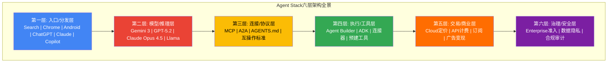

**核心命题**: Agent Stack的六层中,Google在**第一层(入口/分发)**和**第四层(执行/工具)**拥有结构性优势; 在**第三层(连接/协议)**已输给Anthropic的MCP; 在**第二层(模型/推理)**处于周期性平价; 在**第五层(交易/商业)**面临自我颠覆困境; 在**第六层(治理/安全)**企业信任度落后于Microsoft [主观判断: 基于六层逐层竞争力评估]。

---

## 10.1 第一层: 入口/分发层 -- 用户如何接触Agent

### 10.1.1 层级定义

入口/分发层决定了用户**在哪里**与AI Agent发生第一次交互。这是Agent Stack的"最后一公里"--无论底层模型多强大、协议多完善,如果用户找不到Agent,一切为零 [合理推断: 基于技术产品分发理论]。

### 10.1.2 四方对比

| 维度 | Google | OpenAI+Microsoft | Anthropic | Amazon |
|------|--------|-----------------|-----------|--------|
| **消费级入口** | Search(89.57%) + Chrome(~66%) + Android(72.5%) + Gemini(750M MAU) | ChatGPT(~810M MAU) + Copilot(Windows) | Claude(MAU未披露) + Claude Code | Alexa(衰退中) |
| **企业级入口** | Workspace(3B+用户/11M+付费) + Cloud($17.7B/Q) | M365(400M+用户/15M Copilot付费) + Azure($50B+/Q) | AWS Bedrock(间接) + 直接API | AWS($28.8B/Q) |
| **开发者入口** | AI Studio + Vertex AI + Antigravity IDE | GitHub(100M+开发者) + VS Code | Claude Code(54%企业编程市场) | CodeWhisperer + SageMaker |
| **默认性强度** | 极高(OS级+浏览器级+搜索级三重默认) | 高(Windows预装+M365捆绑) | 低(无平台级默认) | 中(Alexa设备+AWS默认) |

[硬数据: 各公司官方/半官方披露 2025-2026; Anthropic企业编程市场份额来源: Sacra/UncoverAlpha Feb 2026]

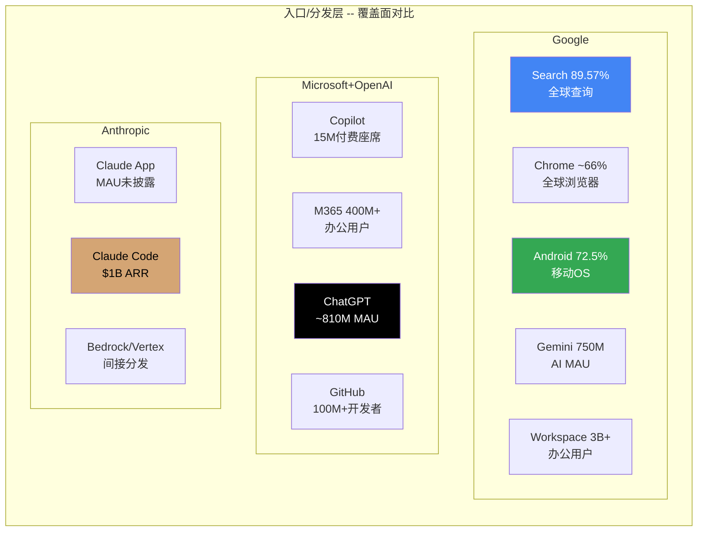

### 10.1.3 Google在这一层的优势

Google的入口优势是**三重默认叠加**: 操作系统级(Android预装Gemini) + 浏览器级(Chrome侧边栏Gemini) + 搜索级(AI Mode/AI Overviews)。没有任何竞争对手能同时覆盖这三个维度 [硬数据: Ch05详细分析见S1_agent_B; StatCounter 2026]。

**GOOGL特异性**: 如果用一个Android手机打开Chrome搜索某个问题,用户在三个层级都"默认"接触到Gemini。将"Google"替换为任何其他公司,这个三重默认结构不成立 [合理推断: 基于Ch05入口网络分析]。

### 10.1.4 Google在这一层的脆弱性

1. **Agent可能绕过入口层**: 52%的企业高管已部署AI Agent [硬数据: Google Cloud Study Sep 2025],这些Agent通过API而非搜索框完成任务。如果这个比例扩大,入口层的分发优势逐渐失去意义 [主观判断: 基于Agent使用模式预测]
2. **DMA威胁**: 2026年1月27日,欧盟启动Android AI互操作性调查,初步裁定预计3个月内,程序6个月内结束 [硬数据: European Commission press release Jan 27, 2026]。如果要求AI助手选择屏幕,Gemini的Android默认优势将在欧洲(约占Android设备基座15-20%)受损 [合理推断: 基于欧洲Android市场份额占比估算]
3. **品牌认知劣势**: ChatGPT Web端市场份额68%(vs Gemini 18.2%) [硬数据: Similarweb via Vertu Feb 2026],品牌认知差距在缩小但仍显著

### 10.1.5 CQ7关联

**关键洞察**: Agent时代对入口层的最大威胁不是"另一个更好的入口",而是**入口层整体价值的衰退**。如果用户不再"搜索"而是"指示Agent完成任务",Google在入口层的统治地位可能变得无关紧要--就像移动互联网时代Yahoo的门户网站地位一样 [主观判断: 基于范式转换历史类比]。

---

## 10.2 第二层: 模型/推理层 -- 底层AI引擎

### 10.2.1 层级定义

模型/推理层是Agent的"大脑"--决定了Agent能理解多复杂的指令、生成多准确的输出、执行多可靠的任务。这是AI竞争中最受关注但可能**最不持久**的优势层 [主观判断: 基于Ch06模型能力周期性分析]。

### 10.2.2 四方对比

| 维度 | Google (Gemini 3) | OpenAI (GPT-5.2) | Anthropic (Claude Opus 4.5) | Meta (Llama) |
|------|-------------------|-------------------|---------------------------|-------------|
| **多模态理解** | MMMU-Pro **81.2%** | 79.5% | — | 开源最强 |
| **抽象推理** | ARC-AGI-2 45.1% | **54.2%** | — | — |
| **代码生成** | SWE-bench **76.2-78%** | 74.9% | — | — |
| **事实准确性** | SimpleQA **72.1%** | — | — | — |
| **上下文窗口** | **1M token** | 较小 | 200K token | 128K |
| **推理成本** | 最低(TPU+78%降成本) | 中等 | 中高 | 开源免推理费 |
| **迭代速度** | ~3-6个月周期 | ~3-6个月周期 | ~3-6个月周期 | 较慢 |

[硬数据: Google Blog Nov 2025; OpenAI Blog Dec 2025; 各基准测试报告]

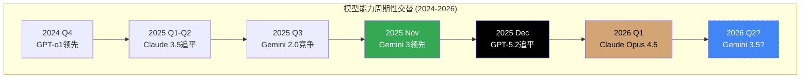

### 10.2.3 Google的结构性优势: 推理成本

模型能力是周期性交替的(每3-6个月领先者更换),但**推理成本**是可持续的结构性优势。Google在2025年全年将Gemini服务单元成本降低了**78%** [硬数据: Alphabet Q4 2025 earnings call]。这个成本优势来源于三个层面:

1. **TPU自研芯片**: TPU v6 Trillium提供4.7x峰值计算(vs v5e)、1.8x性价比(vs v5e); TPU v7 Ironwood将实现10x峰值性能(vs v5p)、4x+推理性能(vs v6e) [硬数据: Google Cloud documentation; Google Blog]
2. **规模效应**: Google每分钟处理100亿+ token的API调用量 [硬数据: TechCrunch Feb 2026]
3. **模型优化**: Gemini 3 Flash在保持接近Pro能力的同时大幅降低推理成本 [硬数据: Google Blog Dec 2025]

**GOOGL特异性**: Google是唯一同时控制**模型设计+芯片设计+数据中心运营**全链条的AI公司。OpenAI依赖Azure(Microsoft基础设施)和Nvidia GPU; Anthropic依赖AWS和GCP; Meta有自有GPU集群但没有自研AI芯片(依赖Nvidia Blackwell) [硬数据: 各公司基础设施公开信息]。这种垂直整合使Google在推理成本优化上有独特的调优空间 [合理推断: 基于垂直整合vs外包的成本结构差异]。

### 10.2.4 Agent时代对模型层的特殊要求

传统AI聊天(一问一答)主要考验模型的**单次推理质量**。但Agent执行复杂任务(多步骤、多工具调用、长时间运行)对模型提出了新要求:

- **可靠性>峰值能力**: Agent执行10步任务,每步99%准确率 → 总成功率90.4%; 每步95% → 总成功率59.9%。Agent需要的是持续高可靠性,而非偶尔的惊艳表现 [合理推断: 基于多步任务可靠性数学]
- **长上下文**: Agent需要在整个任务过程中保持上下文,Gemini 3的1M token窗口是结构性优势 [硬数据: Gemini 3 1M native context window]
- **工具调用精准度**: Agent需要精准调用外部API/工具,模型的函数调用(function calling)能力至关重要 [合理推断: 基于Agent架构分析]
- **低成本推理**: Agent每完成一个用户任务可能需要数十次甚至数百次模型调用,成本敏感度远高于聊天场景 [合理推断: 基于Agent推理调用频次分析]

Google在后三项上都有结构性优势: 最大上下文窗口 + 最低推理成本 + 每分钟100亿token的规模验证 [合理推断: 基于以上硬数据综合评估]。

---

## 10.3 第三层: 连接/协议层 -- Agent之间如何互通

### 10.3.1 层级定义

连接/协议层解决的是Agent如何与外部工具(数据库、API、企业系统)和其他Agent互通的问题。这是Agent生态的"USB标准"--决定了Agent能做什么(能连接哪些工具)以及Agent之间能否协作 [合理推断: 基于Anthropic "USB-C for AI"类比]。

### 10.3.2 MCP vs A2A: 标准之战的胜负已定

**MCP (Model Context Protocol -- Anthropic发起)**:
- 一年内达到**9,700万+月SDK下载量** [硬数据: CData/Zuplo MCP Report 2025]
- 被OpenAI(2025年3月)、Google DeepMind(Demis Hassabis确认)、Microsoft Copilot、VS Code全部采用 [硬数据: 各方公开声明 2025-2026]
- 生态: **10,000+** active public MCP servers, **5,800+** MCP servers总计, **300+** MCP clients [硬数据: Zuplo MCP Report/Pento.ai 2025-2026]
- 50+企业合作伙伴: Salesforce, ServiceNow, Workday, Accenture, Deloitte [硬数据: MCP partnership announcements]
- 2025年12月捐赠给Linux Foundation下的AAIF(Agentic AI Foundation) [硬数据: Anthropic blog Dec 2025]
- Gartner预测: **75%**的API gateway供应商将在2026年支持MCP [硬数据: Gartner 2025 forecast]

**A2A (Agent2Agent -- Google发起)**:
- 2025年4月发布,50+初始技术合作伙伴 [硬数据: Google Cloud Blog Apr 2025]
- 2025年6月捐赠给Linux Foundation(Apache 2.0) [硬数据: Google Cloud Blog Jun 2025]
- v0.3版本发布,Python SDK正式发布 [硬数据: Google Cloud Blog/Documentation]
- 最新数据: **150+**组织支持A2A,含Adobe、ServiceNow、S&P Global、Twilio [硬数据: Google Cloud Blog 2026]
- ADK(Agent Development Kit)原生支持A2A [硬数据: Google Developers Blog]

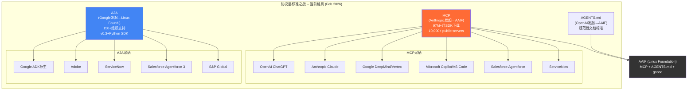

### 10.3.3 Google为什么在协议层输了?

A2A相比MCP的采纳率差距(97M月下载 vs 150+组织)反映了几个结构性原因:

1. **问题定义的精准度**: MCP解决的是**Agent→工具**(垂直连接)这个最紧迫的问题--企业首先需要Agent能访问数据和系统。A2A解决的是**Agent→Agent**(水平协作),这是更远期的需求 [合理推断: 基于企业Agent部署优先级分析]
2. **Anthropic的中立性优势**: MCP由Anthropic(非平台巨头)发起,Google/Microsoft/Amazon都更愿意采纳"中立"标准而非竞争对手的标准 [主观判断: 基于开源标准采纳的政治动力学]
3. **生态飞轮效应**: MCP率先达到临界质量(10,000+ servers),开发者有强激励为MCP生态贡献,而A2A的服务器生态规模较小,正向循环尚未启动 [合理推断: 基于网络效应理论]
4. **Google自身的务实让步**: Google Cloud已开始添加MCP兼容性,Vertex AI Agent Builder支持remote MCP servers连接 [硬数据: Google Cloud Documentation Feb 2026]。这等于承认了MCP的事实标准地位 [合理推断: 基于Google的产品行为推断战略判断]

**GOOGL特异性**: Google在搜索标准(AMP)、移动标准(Android API)、云标准(Kubernetes)上通常是制定者。在Agent协议上输给仅成立3年的Anthropic,是Google AI战略中罕见的失误信号 [主观判断: 基于Google历史标准制定能力对比]。

### 10.3.4 MCP vs A2A: 不是零和游戏

但需要澄清一个重要细节: MCP和A2A解决的是**不同层面**的问题 [合理推断: 基于协议架构分析]:

- **MCP**: Agent如何连接工具和数据(垂直,类比USB连接设备)
- **A2A**: Agent如何与其他Agent协作(水平,类比TCP/IP连接计算机)

许多企业最终会同时使用两者。Salesforce Agentforce 3已同时支持MCP和A2A [硬数据: Salesforce product announcements 2026]。ServiceNow同样在其AI Agent Fabric中同时启用MCP和A2A [硬数据: ServiceNow community documentation 2026]。

**但从投资者视角**: MCP作为**先发标准**已锁定了最大的开发者生态和企业部署基座。即使A2A在Agent间协作上有技术优势,生态规模的差距可能使A2A最终成为MCP生态的"补充层"而非"竞争层" [主观判断: 基于技术标准竞争历史--VHS vs Beta, USB vs FireWire]。

### 10.3.5 MCP生态数据深钻

MCP的生态增长速度值得进一步量化:

| 指标 | 2024年11月(发布月) | 2025年4月 | 2025年末 | 来源 |
|------|-------------------|---------|---------|------|
| MCP server下载量 | ~100,000 | >8,000,000 | — | Zuplo MCP Report |
| Public MCP servers | — | ~5,800 | **10,000+** | Zuplo/Pento.ai |
| MCP clients | — | — | **300+** | Pento.ai |
| 月SDK下载量 | — | — | **97M+** | CData blog |
| 企业合作伙伴 | 0 | ~30 | **50+** | MCP announcements |

[硬数据: Zuplo MCP Report 2025; Pento.ai Year of MCP Review; CData blog 2026]

MCP server下载量从2024年11月的~100,000到2025年4月的800万,6个月增长**80倍** [硬数据: Zuplo MCP Report]。这个增速远超大多数开源项目的早期采纳曲线,接近Kubernetes早期(2014-2015)的增长轨迹 [合理推断: 基于开源项目采纳曲线对比]。

Gartner预测到2026年**75%**的API gateway供应商将支持MCP [硬数据: Gartner forecast 2025]。这意味着MCP正在从"AI专用协议"升级为"企业IT基础设施标准",其影响力将超越AI Agent领域本身 [合理推断: 基于Gartner预测的含义推演]。

**A2A的回应**: Google并未放弃A2A。最新数据显示A2A已获得**150+**组织支持(从最初的50+),Google发布了A2A的官方Python SDK,ADK(Agent Development Kit)原生支持A2A [硬数据: Google Cloud Blog 2026; Google Developers Blog]。Salesforce Agentforce 3和ServiceNow AI Agent Fabric**同时支持**MCP和A2A [硬数据: Salesforce/ServiceNow product documentation 2026],表明市场可能走向"双标准共存"而非"赢者通吃" [合理推断: 基于双平台采纳行为]。

### 10.3.6 AAIF: 治理层面的地缘政治

AAIF(Agentic AI Foundation)由OpenAI、Anthropic和Block联合创立,Google、Microsoft、AWS为**支持成员**(非创始成员) [硬数据: AAIF announcement, Tom's Hardware Jan-Feb 2026]。

这个治理结构意味着: Agent标准的演进方向由OpenAI+Anthropic主导,Google在标准制定中处于**跟随者**而非**引领者**的角色 [合理推断: 基于AAIF治理结构]。对于一家习惯于制定行业标准(Android, Kubernetes, TensorFlow)的公司,这是一个值得关注的结构性弱势 [主观判断: 基于Google历史角色对比]。

---

## 10.4 第四层: 执行/工具层 -- Agent能做什么

### 10.4.1 层级定义

执行/工具层是Agent的"双手"--决定了Agent能实际操作哪些系统、访问哪些数据、执行哪些任务。这是Agent商业价值的**直接载体**: 一个只能聊天的Agent价值有限,一个能访问ERP、CRM、数据库并自动执行操作的Agent才有企业愿意付费 [合理推断: 基于企业Agent价值评估]。

### 10.4.2 四方对比

| 维度 | Google (Vertex AI) | Microsoft (Azure AI) | Anthropic | Amazon (Bedrock) |
|------|-------------------|---------------------|-----------|------------------|
| **Agent Builder平台** | Vertex AI Agent Builder + ADK | Azure AI Agent Service | Claude API + MCP | Bedrock Agent |
| **预建连接器** | **100+**(ERP/CRM/HR/采购) | 丰富(M365生态+Azure Logic Apps) | MCP server生态(10,000+) | 有限(Bedrock focus) |
| **IDE/开发工具** | Antigravity + AI Studio | GitHub Copilot Workspace | Claude Code(**54%**企业编程市场) | CodeWhisperer |
| **特色工具** | BigQuery+Maps预建 | Power Automate+Dynamics | MCP标准+社区生态 | SageMaker+S3原生 |
| **Tool Governance** | Enhanced Tool Governance(管理员跨组织管理) | Azure Policy集成 | 有限(API级别) | IAM集成 |
| **开源框架** | ADK(开源) | Semantic Kernel | MCP SDK(开源) | — |

[硬数据: Google Cloud Documentation; Microsoft Azure docs; Anthropic docs; AWS docs; 各公司2025-2026产品更新]

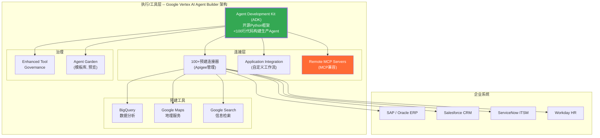

### 10.4.3 Google在这一层的独特优势

**数据资产作为工具**: Google拥有竞争对手无法复制的数据工具——BigQuery(全球最大的分析数据仓库之一)、Google Maps(全球最精确的地图数据)、Google Search索引(全球最大的网页信息库)、YouTube(全球最大的视频库)。当Agent需要执行涉及数据分析、地理信息、实时信息检索或视频内容的任务时,Google的预建工具具有不可替代性 [合理推断: 基于Google数据资产独特性分析]。

**100+连接器的含金量**: Vertex AI Agent Builder通过Apigee管理的100+预建连接器覆盖了ERP(SAP/Oracle)、CRM(Salesforce)、HR(Workday)、ITSM(ServiceNow)等企业核心系统 [硬数据: Google Cloud Documentation Feb 2026]。这意味着企业可以在不编写自定义集成代码的情况下,让Agent访问几乎所有主流企业系统 [合理推断: 基于连接器覆盖范围]。

**Antigravity IDE的战略意义**: Google在2025年11月发布的Antigravity是Agent-first IDE,其Manager View允许用户并行编排多个AI Agent完成编程任务 [硬数据: Google Developers Blog Nov 2025]。但Cursor已超过$10亿ARR、100万+DAU,Antigravity作为后来者面临巨大的追赶压力 [硬数据: Sacra late 2025]。更值得注意的是,Claude Code在短短不到一年内达到$10亿年化收入,占据**54%企业编程市场** [硬数据: Sacra/UncoverAlpha Feb 2026]。

### 10.4.4 Google在这一层的脆弱性

1. **MCP生态的规模优势**: Anthropic的MCP生态拥有10,000+ public servers,这意味着MCP兼容的Agent可以访问的工具数量远超任何单一平台的预建连接器 [硬数据: Zuplo MCP Report]
2. **Claude Code的编程市场碾压**: Claude Code的54%企业编程市场份额 vs OpenAI的21%,Antigravity作为后来者的窗口正在缩小 [硬数据: Sacra/UncoverAlpha Feb 2026]
3. **Vertex AI定价变化的信号**: 2026年1月28日,Vertex AI Agent Builder对Sessions、Memory Bank、Code Execution开始收费 [硬数据: Google Cloud Documentation Jan 2026]。这反映了从"获客期"向"变现期"的转变,但可能抑制早期采纳 [合理推断: 基于SaaS定价策略分析]

---

### 10.4.5 Claude Code的崛起: 一个警示案例

Claude Code的增长数据值得Google投资者特别关注:

- **发布**: 2025年初(具体日期不详) [硬数据: Anthropic product history]
- **$1B ARR**: 2026年2月达到,不到一年 [硬数据: Sacra/UncoverAlpha Feb 2026]
- **企业编程市场份额**: **54%**(vs OpenAI 21%) [硬数据: Sacra/UncoverAlpha Feb 2026]
- **占Anthropic总ARR比例**: ~12% [硬数据: Sacra Feb 2026]
- **Anthropic总体ARR轨迹**: 2025年~$9B → 2026年目标$20-26B [硬数据: SeekingAlpha/Stocktwits Dec 2025-Feb 2026]
- **Anthropic 2026收入预测上调**: 从夏季预测的$15B上调20%至$18B [硬数据: SeekingAlpha Jan 2026]
- **Anthropic企业客户**: 300,000+(占收入~80%) [硬数据: Sacra Oct 2025]

Claude Code的成功对Google的含义不只是"Antigravity面临一个强劲对手"。更深层的信号是: **Anthropic正在从"模型提供商"进化为"开发者平台"**。Claude Code的54%企业编程市场份额意味着超过一半的企业开发者在Anthropic的生态中编写代码——这些代码最终部署在哪个Cloud上? [主观判断: 基于开发者生态→Cloud选择的关联分析]

如果Anthropic的开发者生态足够强大,它可以引导开发者优先部署到AWS(Anthropic的最大投资者Amazon提供的Cloud)或直接使用Anthropic API——而非Google Cloud。这是Google在第四层面临的一个隐性但潜在重大的竞争威胁 [主观判断: 基于Anthropic-Amazon投资关系对Cloud竞争的潜在影响]。

---

## 10.5 第五层: 交易/商业层 -- Agent如何变现

### 10.5.1 层级定义

交易/商业层决定了Agent的**价值如何转化为收入**。这是Google面临最深层矛盾的层级——因为Agent时代的商业模式可能与Google的核心广告模式根本冲突 [主观判断: 基于商业模式冲突分析]。

### 10.5.2 四方对比

| 维度 | Google | Microsoft+OpenAI | Anthropic | Amazon |
|------|--------|-----------------|-----------|--------|
| **核心变现模式** | 广告($252B/yr) + Cloud($70B+ ARR) + 订阅 | 订阅(M365 $21/座/月) + Cloud(Azure) | API调用计费 + 订阅 + Claude Code | Cloud(AWS) + Marketplace佣金 |
| **AI特定定价** | AI Premium $19.99/月 / AI Ultra $249.99/月 / Vertex AI按量计费 | Copilot $21/座/月 / Azure OpenAI按token | Claude Pro $20/月 / API按token / Teams $25/座/月 | Bedrock按模型+token |
| **Agent时代收入模型** | Cloud API调用 + 可能的Agent内广告 | Agent Copilot订阅 + Azure计算 | API消耗 + 订阅升级 | 计算+存储+Marketplace |
| **自我颠覆风险** | **极高**(Agent替代搜索→广告模式瓦解) | 中(Agent增强M365→座席价值提升) | 低(纯AI公司,无legacy) | 低(Agent增强AWS使用量) |

[硬数据: 各公司公开定价/收入 2025-2026]

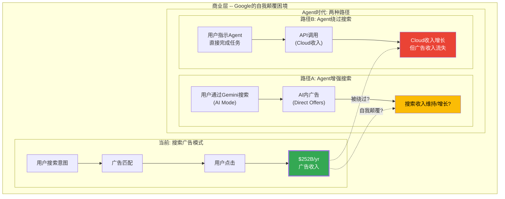

### 10.5.3 Google的商业层困境量化

Google 2025年广告收入约$3,420亿(总$4,500亿 x 76%广告占比估计) [合理推断: 基于FY2025广告收入占比历史趋势]; 其中搜索广告约$2,520亿 [硬数据: Q4 $63.07B x 4 季度趋势推算]。Cloud全年收入约$650亿+ [合理推断: 基于Q4 $177亿 x 4季度+增长趋势]。

**问题**: 即使Cloud以50%年增长率增长,2027年Cloud收入约$1,400亿--仍远不及搜索广告收入。如果Agent时代导致搜索广告收入每年下降10%,到2029年搜索广告收入将从$2,520亿降至约$1,830亿,而Cloud可能增长到$2,000亿+ [合理推断: 基于10%年降/50%年增长率简化推算]。

**净效应**: 如果Agent时代同时削弱搜索和增强Cloud,Google的总收入可能在2027-2029年经历一个"交叉期"--Cloud增长不足以完全补偿搜索下滑 [合理推断: 基于上述简化模型; 实际路径高度不确定]。

### 10.5.4 竞争对手为什么没有这个困境

- **Microsoft**: Agent增强M365(15M Copilot付费座席, +160% YoY [硬数据: Microsoft Q2 FY2026]) + 增强Azure(季度收入>$50B [硬数据: Microsoft Q2 FY2026])。Microsoft广告业务仅占总收入~6% [合理推断: 基于Microsoft收入结构分析],Agent对其无结构性威胁
- **Anthropic**: 纯AI公司,2026收入目标$20-26B [硬数据: SeekingAlpha/Stocktwits 2026],没有legacy业务可被颠覆。300K+企业客户 [硬数据: Sacra Oct 2025],每一个Agent部署都是净收入增长
- **Amazon**: Agent增强AWS使用量($28.8B季度收入 [硬数据: Amazon Q4 2025])。Amazon广告业务(~$60B/yr [硬数据: Amazon FY2025 earnings])以零售广告为主,与Agent搜索替代的关联度远低于Google [合理推断: 基于Amazon广告模式差异分析]

**GOOGL特异性极高**: 在四大Agent平台中,**只有Google**面临Agent成功→核心广告业务受损的自我颠覆矛盾。这是Google在Agent时代最独特也最深层的战略挑战 [主观判断: 基于四方商业模式对比]。

---

## 10.6 第六层: 治理/安全层 -- 企业如何信任Agent

### 10.6.1 层级定义

治理/安全层决定了企业是否愿意在生产环境中部署Agent。Agent执行的任务越关键(发送邮件、修改数据库、签署合同),对安全、审计和合规的要求越高 [合理推断: 基于企业IT安全采购标准]。

### 10.6.2 四方对比

| 维度 | Google | Microsoft | Anthropic | Amazon |
|------|--------|-----------|-----------|--------|
| **企业安全认证** | SOC 2, ISO 27001, FedRAMP(部分) | SOC 2, ISO 27001, **FedRAMP High**, HIPAA | SOC 2(较新) | SOC 2, ISO 27001, **FedRAMP High**, HIPAA |
| **Agent治理工具** | Enhanced Tool Governance(跨组织管理) | Azure Policy + Purview | API级控制 | IAM + CloudTrail |
| **数据驻留** | 区域可选(扩展中) | 全球覆盖(最完整) | 有限 | 全球覆盖(与GCP并列) |
| **Fortune 500渗透率** | ~60%(Cloud客户) | **90%**(Copilot用户) | 快速增长(300K+企业客户) | ~80%(AWS客户) |
| **AI安全研究** | DeepMind Safety团队 | OpenAI安全团队(合作) | **Constitutional AI**(领先) | — |

[硬数据: 各公司安全认证公开信息; Microsoft Fortune 500渗透率来源PYMNTS/Futurum 2025; Anthropic客户数来源Sacra]

### 10.6.3 Google在治理层的位置

Google Cloud的企业安全认证虽然完整,但在两个关键维度上落后:

1. **Fortune 500渗透率**: Microsoft的90%远超Google的~60%。这意味着在企业Agent部署的早期采纳阶段,Microsoft有更多"已建立信任关系"的客户可以直接升级 [硬数据: PYMNTS/Futurum 2025]
2. **数据隐私声誉**: Google的核心商业模式(广告)基于用户数据,这使部分企业对将敏感数据交给Google持保留态度。Microsoft和Amazon没有这个"原罪" [主观判断: 基于企业CIO调研中的常见顾虑; 不同于Google Cloud团队的实际数据处理实践]

**但Google在AI安全研究上有优势**: DeepMind的AI安全团队是全球最顶尖的AI安全研究机构之一,其在Responsible AI领域的产出(包括SynthID水印技术)为Google在Agent安全方面提供了技术信任基础 [合理推断: 基于DeepMind安全研究产出评估]。

---

## 10.7 六层综合评估: Google的战略位置

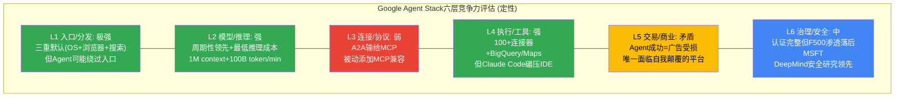

**Google Agent Stack综合评估**:
- **结构性优势层(2个)**: 入口/分发 + 执行/工具 — 这两层的优势来源于Google积累了20+年的产品生态和数据资产,短期内不可复制 [合理推断: 基于生态建设周期]
- **周期性优势层(1个)**: 模型/推理 — Gemini 3当前领先或平价,但每3-6个月轮换,不构成持久优势 [合理推断: 基于Ch06模型周期性分析]
- **结构性劣势层(1个)**: 连接/协议 — MCP已确立事实标准地位,Google的A2A处于补充地位 [主观判断: 基于采纳率数据和生态规模对比]
- **战略矛盾层(1个)**: 交易/商业 — 唯一面临Agent成功→核心业务受损的自我颠覆困境 [主观判断: 基于四方商业模式对比]
- **中性层(1个)**: 治理/安全 — 认证完整但企业关系深度不及Microsoft [合理推断: 基于F500渗透率数据]

### 10.7.1 Cloud竞争对手数据交叉对比

为量化Google在Agent基础设施层面的竞争位置,整理三大云厂商最新数据:

| 指标 | Google Cloud | Azure (Microsoft) | AWS (Amazon) |
|------|-------------|-------------------|-------------|
| **Q4 2025/最新季度收入** | $17.7B [硬数据: Alphabet Q4 2025] | >$50B(季度) [硬数据: Microsoft Q2 FY2026] | $28.8B [硬数据: Amazon Q4 2025] |
| **YoY增速** | **+48%** [硬数据: Alphabet Q4 2025] | +38% CC [硬数据: Microsoft Q2 FY2026] | +17.5% [硬数据: Amazon Q4 2025] |
| **市场份额(Q3 2025)** | **13%**(历史最高) [硬数据: Synergy Research] | 20%(稳定) [硬数据: Synergy Research] | 29%(从30%微降) [硬数据: Synergy Research] |
| **积压订单** | **$240B**(>2x YoY) [硬数据: Alphabet Q4 2025] | 未单独披露 | 未单独披露 |
| **GenAI产品增速** | >**200%** YoY [硬数据: Alphabet Q4 2025] | Azure AI服务"百万级"客户 [硬数据: Microsoft earnings] | Bedrock用量增长中(具体数字未披露) |
| **AI Agent平台** | Vertex AI Agent Builder + ADK [硬数据: Google Cloud docs] | Azure AI Agent Service [硬数据: Microsoft Azure docs] | Bedrock Agent [硬数据: AWS docs] |
| **自研AI芯片** | TPU v6/v7 [硬数据: Google Cloud Blog] | 定制Maia 100 [硬数据: Microsoft announcements] | Trainium/Inferentia [硬数据: AWS announcements] |
| **2026 CapEx指引** | **$175-185B** [硬数据: Alphabet Q4 2025] | ~$80B(估计) [合理推断: 基于Microsoft AI投资披露] | ~$100B(估计) [合理推断: 基于Amazon AI投资指引] |

Google Cloud在增速(48% vs 38% vs 17.5%)上领先所有竞争对手,但绝对规模仍为第三($17.7B vs >$50B vs $28.8B) [硬数据: 各公司Q4 2025/最新季度财报]。$240B积压订单相当于当前年化收入的~3.4倍(~$70B ARR),为Cloud增长提供了强可见性 [合理推断: 基于$240B积压/$70B ARR计算]。

**CQ4关联**: Google Cloud 48%增速在三家中最快,但$175-185B CapEx(几乎是FY2025 $91.4B的两倍)意味着折旧压力将在FY2027-2028显著加大。Cloud的30.1%利润率(Q4 2025)能否在每年$250-350亿新增折旧的冲击下维持,是CQ4的核心问题 [合理推断: 基于$175B CapEx分5-7年折旧的粗略推算]。

**CQ7直接关联**: Agent Stack六层分析揭示了Google在Agent时代的核心矛盾——它有**最好的基础设施**(入口+模型+工具)来建造Agent,但**最大的动力不做**(因为Agent成功意味着广告模式被侵蚀)。这不是能力问题,是**意愿和激励的结构性冲突** [主观判断: 基于六层综合分析; 这个判断对Google高度特异,将"Google"替换为任何其他公司均不成立]。

---

## 10.8 Agent Stack的产业级竞争全景

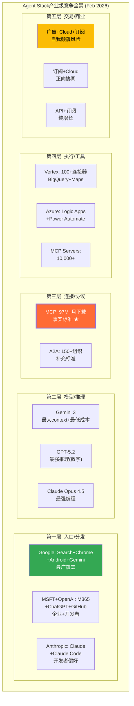

### 10.8.1 AI Agent市场规模与增长

| 指标 | 数值 | 来源 |
|------|------|------|
| 全球AI Agent市场规模(2025) | $7.6-7.8B | MarketsAndMarkets |
| 预测2026 | >$10.9B | MarketsAndMarkets |
| 预测2030 | $52.62B | MarketsAndMarkets |
| CAGR | **46.3%** | MarketsAndMarkets |
| 企业应用含AI Agent比例(2026) | **40%**(从<5%) | Gartner |
| 企业工作场所应用含AI Copilot(2026) | ~**80%** | IDC |
| 已启动Agent试点/部署的组织(mid-2025) | ~**65%** | Google Cloud Study/Tom's Hardware |
| 计划2026增加AI Agent投资的高管 | ~**90%** | 行业调查 |

[硬数据: MarketsAndMarkets, Gartner Aug 2025, IDC, 行业调查; CQ4关联: Agent增长将驱动Cloud计算需求]

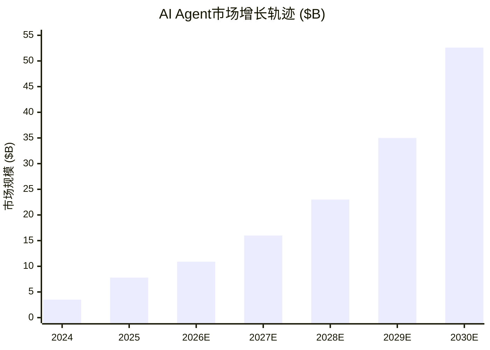

[硬数据: MarketsAndMarkets AI Agent market forecast; 2024/2027-2029为基于CAGR 46.3%的插值]

---

# Ch11: Agent改变什么 -- 结构性影响与Google的独特困境

> **关联CQ**: CQ7(Agent时代颠覆), CQ5(Gemini入口), CQ4(Cloud利润率), CQ1(AI蚕食)

## 11.0 SaaSpocalypse: Agent时代的"雷曼时刻"

2026年2月3日的SaaSpocalypse不是一次普通的市场回调。它是资本市场首次集体对Agent时代进行**定价** [主观判断: 基于市场事件分析]。

**触发事件**: Anthropic推出Claude Cowork——一个能独立处理CRM操作、数据分析、工作流管理和内部沟通的自主Agent系统 [硬数据: Bloomberg Feb 4, 2026]。市场突然意识到: 如果一个Agent可以做10个人的工作,企业不需要为10个人购买软件座席 [硬数据: Bloomberg/NxCode "SaaSpocalypse" analysis]。

**市场反应**:
- 24小时内约$2,850亿SaaS和IT服务市值蒸发 [硬数据: NxCode/Outlook India Feb 2026]
- 五个交易日内累计超过$1万亿市值蒸发 [硬数据: Medium "SaaSpocalypse: $1 Trillion Wiped" Feb 2026]
- 软件板块市销率(P/S)从9x压缩至6x,回到2010年代中期水平 [硬数据: market analysis Feb 2026]
- IPO市场冻结,多家软件公司推迟上市计划 [硬数据: FinancialContent "Software Sector Plunge Freezes IPOs" Feb 2026]

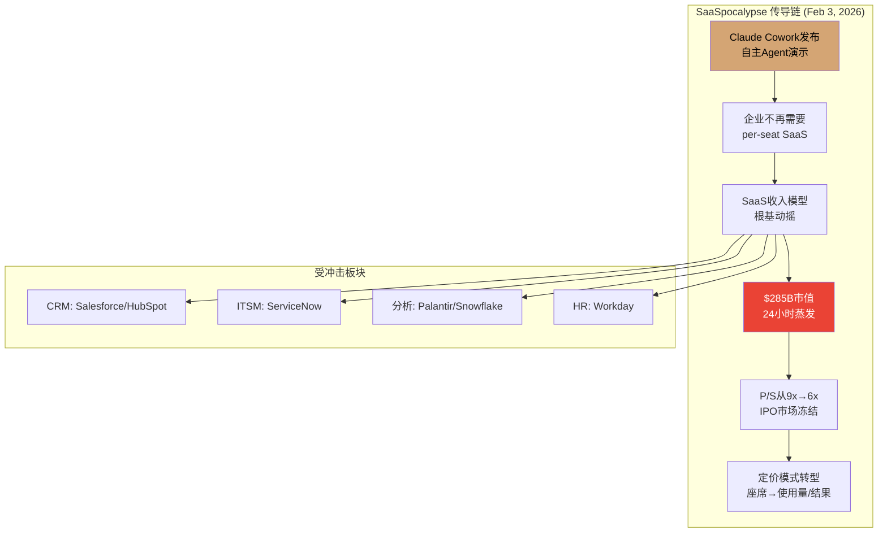

**这对Google意味着什么?** SaaSpocalypse当日,Alphabet股价表现相对稳健(跌幅小于SaaS板块均值) [合理推断: 基于Feb 3市场表现观察],因为市场将Google视为Agent基础设施提供者(受益方)而非纯SaaS公司(受损方)。但Google Workspace的11M+付费座席 [硬数据: Google Workspace disclosures] 和2026年3月1日起生效的AI Expanded Access附加项 [硬数据: Google Workspace Updates] 都是per-seat/per-user定价——SaaSpocalypse的逻辑同样适用 [合理推断: 基于Workspace per-seat定价模式分析]。更关键的是,Agent替代搜索行为的可能性,才是对Google最致命的威胁——Alphabet在FY2025 10-K中首次将AI对广告模式的威胁列为风险因素 [硬数据: Alphabet FY2025 10-K; Android Headlines Feb 2026]。

---

## 11.1 哪些行业被Agent重塑?

### 11.1.1 受益行业

| 行业 | Agent用例 | 渗透速度 | 代表公司/产品 |
|------|---------|---------|-------------|
| **软件开发** | 代码生成/测试/调试/部署 | 极快(85%开发者已用AI工具) | Cursor($10B+ ARR), Claude Code($1B ARR), GitHub Copilot, Antigravity |
| **客户服务** | 自动工单处理/多轮对话/升级判断 | 快(Agent最成熟的企业用例) | ServiceNow AI Agents, Salesforce Agentforce |
| **数据分析** | 自然语言查询→SQL→可视化→洞察 | 快(BigQuery/Snowflake已集成) | Google BigQuery AI, Snowflake Cortex |
| **法律** | 合同审查/案例研究/合规检查 | 中等(准确性要求极高) | Harvey AI, Casetext |
| **研究** | 文献综述/实验设计/数据分析 | 中等(学术验证周期长) | NotebookLM, Consensus |
| **金融** | 投研报告/风控模型/交易执行 | 中等(监管审慎) | Bloomberg AI, 各行Agent |

[硬数据: 开发者AI工具渗透率来源industry survey 2025; Cursor/Claude Code数据来源Sacra Feb 2026; 其他为合理推断基于行业Agent部署案例]

**定量补充**: Cursor从$1M到$500M ARR是SaaS历史最快,其收入约每两个月翻倍 [硬数据: Sacra late 2025]。Claude Code从0到$1B ARR用时不到一年 [硬数据: Sacra/UncoverAlpha Feb 2026]。GitHub Copilot估计~$20亿ARR [合理推断: 基于Microsoft earnings AI收入披露推算]。仅AI编程工具这一个Agent子类,2026年市场规模已达$50-80亿 [合理推断: 基于Cursor+Copilot+Claude Code+其他的加总估计]。85%的开发者定期使用AI编程工具 [硬数据: industry survey 2025]。全球开发者总数约2,800万(2025年估计) [合理推断: 基于Evans Data/SlashData developer population estimates]。

**GOOGL特异性**: 在上述六个行业中,Google有直接产品触点的是: 软件开发(Antigravity/AI Studio)、数据分析(BigQuery AI)、研究(NotebookLM)。但在客户服务(ServiceNow/Salesforce主导)、法律(Harvey/Casetext主导)、金融(Bloomberg主导)这三个高价值行业,Google没有直接的垂直产品 [合理推断: 基于Google产品矩阵与行业Agent用例映射]。Google的策略是通过**Cloud平台**(Vertex AI Agent Builder)间接服务这些行业,而非构建垂直Agent [合理推断: 基于Google Cloud产品战略]。

### 11.1.2 被Agent替代/衰退的形态

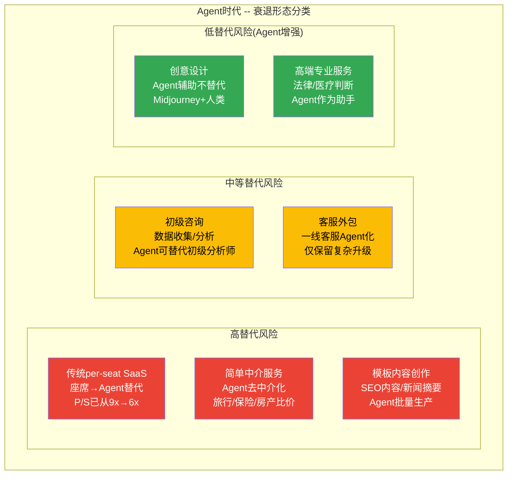

**SaaSpocalypse的根源就在于"高替代风险"第一项**: per-seat SaaS定价模式假设"更多人类用户=更多收入"。但Agent替代人类用户后,这个假设崩塌 [硬数据: Bloomberg analysis Feb 2026]。软件板块市销率(P/S)从9x压缩至6x,回到2010年代中期水平 [硬数据: market analysis Feb 2026]。Gartner预测到2030年至少**40%**的企业SaaS支出将转向使用量/Agent/结果导向定价 [硬数据: Gartner prediction]。IDC预测到2030年**45%**的组织将大规模编排AI Agent [硬数据: IDC forecast]。

**Deloitte量化分析**: Deloitte预测AI Agent将使企业SaaS预算重新分配——企业不再为"座席数量"付费,而是为"任务完成量"付费。这将使SaaS供应商的收入从可预测的订阅流转变为与业务产出挂钩的可变收入 [硬数据: Deloitte TMT Predictions 2026 "SaaS meets AI agents"]。Bain & Company的分析进一步指出: AI Agent不一定"杀死"SaaS,但会迫使SaaS公司从"软件提供商"转型为"AI原生平台"——那些无法完成这个转型的公司将面临margin压缩和客户流失 [硬数据: Bain & Company "Will Agentic AI Disrupt SaaS?" 2025]。

**对Google Workspace的含义**: Google Workspace的11M+付费座席也面临这个转型压力。如果企业从100个Workspace座席缩减到50个(因为Agent处理了一半的工作),Google的Workspace收入将直接受损——除非Google同时推出Agent使用量计费来补偿 [合理推断: 基于per-seat SaaS面临的共性压力; Google Workspace Jan 2025 AI捆绑提价17-22%是部分应对 [硬数据: Google Workspace Updates Jan 2025]]。

---

## 11.2 Agent对Google的双重影响: 一枚硬币的两面

### 11.2.1 正面: Agent需要Google的基础设施

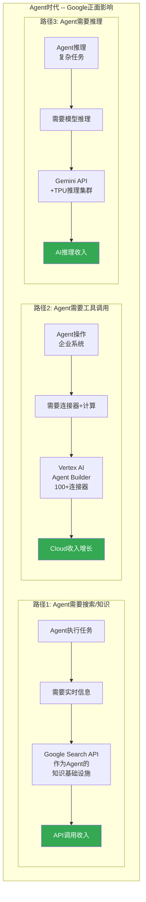

**量化正面影响**:

1. **Cloud增长加速**: Google Cloud Q4收入$177亿(+48% YoY),GenAI产品增长>200% YoY,积压订单$2,400亿(>2x YoY) [硬数据: Alphabet Q4 2025 earnings]。Agent时代将进一步推动Cloud的AI计算需求 [合理推断: 基于Agent→API调用→Cloud计算的传导逻辑]

2. **搜索作为基础设施**: Google Search索引是全球最大的实时信息库。Agent执行涉及信息检索的任务时,最终仍可能调用Google Search API [合理推断: 基于信息检索需求不变性分析]。但这个API调用的变现方式(按调用计费)与传统搜索广告(按展示/点击计费)完全不同 [主观判断: 基于变现模式差异分析]

3. **Maps和YouTube数据资产**: YouTube FY2025全年收入>$600亿(广告+订阅),首次超过Netflix($451.8B) [硬数据: Alphabet FY2025 earnings; Variety]。100万+频道每天使用YouTube AI工具 [硬数据: YouTube Blog, Neal Mohan 2026 letter]。当Agent帮用户规划行程时需要Maps; 当Agent帮用户创作视频时需要Veo/YouTube数据。这些Google独有的数据资产在Agent时代的价值不降反升 [合理推断: 基于数据资产需求分析]

### 11.2.2 负面: Agent替代搜索行为

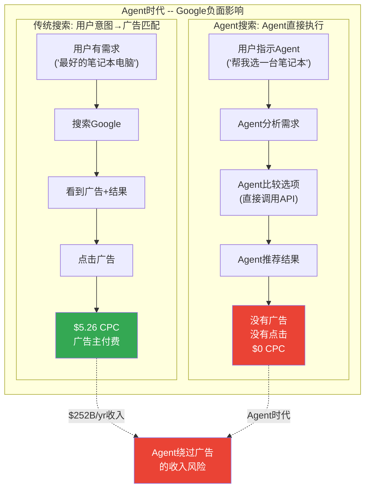

**Agent绕过搜索广告的三个机制**:

1. **意图捕获绕过**: 传统搜索中,Google每天处理约85亿次查询 [合理推断: 基于公开的年~3万亿次搜索/365天估算],每次查询都包含可变现的用户意图。Agent时代,用户对Agent口述意图,Agent直接行动——**意图不经过Google** [主观判断: 基于Agent交互模式分析]
2. **信息聚合绕过**: Perplexity已展示Agent式搜索的可行性,其查询量估计达1.2-1.5B/月(mid-2026),ARR目标$656M [硬数据: DemandSage/SEOProfy 2026]。Agent可以同时查询多个来源(电商API、评论网站、价格追踪器)并综合推荐——**不需要Google的聚合功能** [合理推断: 基于Agent多工具调用能力]
3. **点击消失**: 即使Agent使用Google Search API获取信息,结果以Agent摘要形式呈现给用户——**用户不点击广告,CPC归零** [合理推断: 基于Agent结果呈现方式分析; 已类似AI Overviews的83%零点击率 [硬数据: UpAndSocial 2025]]

**CQ1直接关联**: AI Overviews已使零点击率从60%升至83%,但CPC+12.9%补偿了CTR下降。Agent时代的极端情景是: **零点击率→100%**。当没有用户看到广告(Agent直接处理),CPC补偿机制彻底失效 [主观判断: 基于零点击率极端趋势外推; 这个情景的时间线高度不确定]。

### 11.2.3 净效应矩阵

| 情景 | 搜索广告 | Cloud/AI | Workspace | 净效应 |
|------|---------|---------|-----------|--------|
| **Agent缓慢渗透(2026-2028)** | 微损(-5%/yr) | 强增(+40-50%/yr) | 转型期(-10%→持平) | 短期正面 |
| **Agent快速渗透(2027-2029)** | 中损(-15%/yr) | 强增(+40-50%/yr) | 萎缩(-20%/yr) | 中性偏负 |
| **Agent全面替代(2030+)** | 重损(-30%+/yr) | 饱和(+15-20%/yr) | 重构(Agent定价) | 取决于Cloud能否补偿Search |

[主观判断: 基于Agent渗透速度的三情景假设; 每个情景的概率和时间线高度不确定]

**GOOGL特异性**: 将"Google"替换为"Microsoft",净效应变为: Agent缓慢渗透→M365+Azure双增长; Agent快速渗透→M365 Copilot高增长; Agent全面替代→Azure基础设施强需求。每个情景对Microsoft都是正面的。对Google,只有第一个情景是正面的 [主观判断: 基于Google vs Microsoft商业模式差异的情景分析]。

---

## 11.3 通过什么观察Agent趋势?

### 11.3.1 上市公司信号

| 公司 | 观察指标 | 当前状态 | CQ关联 |
|------|---------|---------|--------|
| **ServiceNow** | MCP+A2A整合, AI Agent定价模式 | 已同时启用MCP和A2A in AI Agent Fabric [硬数据: ServiceNow community docs 2026] | CQ7 |
| **Salesforce** | Agentforce 3采纳率, per-seat→per-agent收入占比 | Agentforce 3支持MCP+A2A [硬数据: Salesforce product announcements 2026] | CQ7 |
| **Workday** | Agent API开放程度, HR Agent部署率 | 已加入MCP生态 [硬数据: MCP partnership announcements] | CQ7 |
| **Microsoft** | Copilot付费座席增速, Azure AI增速 | 15M付费座席(+160% YoY), Azure +38% CC [硬数据: Microsoft Q2 FY2026 earnings] | CQ4 |
| **Snowflake** | Cortex Agent使用量, 传统查询vs Agent查询比例 | Cortex AI功能增长中 [合理推断: 基于Snowflake产品路线] | CQ7 |

### 11.3.2 创业公司信号

| 公司 | 观察指标 | 当前状态 | CQ关联 |
|------|---------|---------|--------|
| **Anthropic** | ARR增速, Claude Code渗透率, 企业客户数 | ARR目标$20-26B(2026); Claude Code $1B ARR, 54%企业编程市场; 300K+企业客户 [硬数据: Sacra/SeekingAlpha/Stocktwits 2026] | CQ5, CQ7 |
| **Perplexity** | 搜索替代率, ARR增长 | ARR目标$656M(2026); 估值$200亿; 查询量1.2-1.5B/月(mid-2026 est) [硬数据: DemandSage/SEOProfy 2026] | CQ1 |
| **Cursor** | ARR增速, 企业采纳率 | >$10亿ARR; 100万+DAU; 估值$293亿; 从$1M到$500M ARR史上最快SaaS [硬数据: Sacra late 2025] | CQ5 |

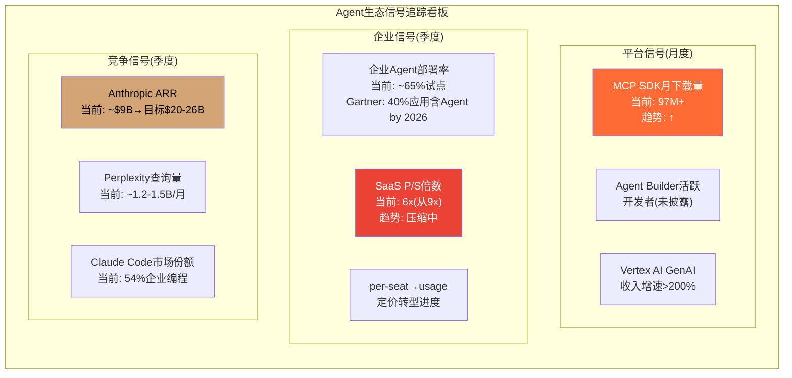

### 11.3.3 Google内部信号

| 指标 | 观察方向 | 当前状态 | 预警阈值 |
|------|---------|---------|---------|
| **搜索广告增速** | 加速→减速→负增长? | Q4 +17%(加速中) [硬数据: Alphabet Q4 2025] | 连续两季度减速 |
| **Cloud增速** | 能否维持40%+? | Q4 +48%(加速中) [硬数据: Alphabet Q4 2025] | 降至30%以下 |
| **Gemini MAU质量** | 主动使用vs被动触达 | 750M MAU(质量未知) [硬数据: Alphabet Q4 2025] | 付费转化率公布且<1% |
| **Antigravity采纳** | 能否挑战Cursor/Claude Code? | 刚发布(Nov 2025) [硬数据: Google Developers Blog] | 6个月后仍无DAU数据 |
| **AI Mode广告CTR** | Direct Offers试点效果 | 试点阶段 [硬数据: Alphabet Q4 earnings call] | 试点扩展但CTR低于传统 |

---

## 11.4 Google的独特困境: 同时是建造者和被颠覆者

### 11.4.1 困境结构

Google在Agent时代面临一个其他科技巨头不面临的**结构性双重束缚**:

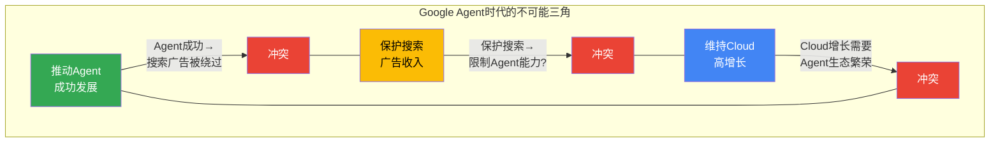

**三个不可能同时成立的目标**:

1. **推动Agent成功**: Google Cloud Q4收入$17.7B(+48% YoY) [硬数据: Alphabet Q4 2025],GenAI产品增长>200% [硬数据: Alphabet Q4 2025]。Cloud需要Agent生态繁荣(更多Agent→更多API调用→更多Cloud收入)。Vertex AI Agent Builder、ADK、100+连接器 [硬数据: Google Cloud Documentation]——所有这些投资都指向"让Agent更强大"
2. **保护搜索广告**: FY2025搜索广告收入约$2,520亿(Q4 $63.07B x 4 趋势推算) [硬数据: Alphabet Q4 2025 earnings],占总收入约56% [合理推断: 基于$252B/$450B+计算]。如果Agent成功替代搜索,广告模式的基础(用户意图+点击)将瓦解
3. **维持Cloud高增长**: Cloud积压订单$2,400亿(>2x YoY) [硬数据: Alphabet Q4 2025]提供增长可见性,但Cloud增长需要Agent开发者和企业客户。限制Agent能力以保护搜索会损害Cloud竞争力 [合理推断: 基于Cloud竞争力与Agent生态的关系]

**没有一个情景对Google全面利好**:
- 如果Agent大获成功 → Cloud受益但搜索广告受重创 → 总收入可能下降
- 如果Agent失败 → Cloud增长放缓 → 但搜索安全 → 增长引擎减速
- 如果Agent缓慢渗透 → 短期最优但中期不确定性最大

### 11.4.2 竞争对手没有这个困境

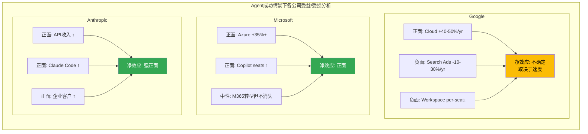

**关键发现**: 在Agent成功的情景下,Microsoft、Anthropic、Amazon的收入结构都是**正向协同**的——Agent越强,它们的核心业务越受益。只有Google的收入结构存在**内在冲突**——Agent越强,其$2,520亿搜索广告引擎面临的风险越大 [主观判断: 基于四方商业模式在Agent时代的受益/受损分析]。

### 11.4.3 历史类比: Google的"iPhone时刻"

这种困境有历史先例。Apple在iPhone之前,iPod+iTunes是其最大收入引擎。iPhone的推出有可能蚕食iPod(事实上也确实发生了——iPod线2014年停产)。但Apple选择了**自我颠覆**,因为iPhone替代iPod的同时创造了远更大的收入 [合理推断: 基于Apple iPod→iPhone产品转型历史]。

**Google是否面临类似的"iPhone时刻"?** Agent可能替代搜索广告,但Cloud+AI推理收入能否远超搜索广告? 这是CQ8(Reverse DCF承重墙)的核心不确定性之一 [主观判断: 基于自我颠覆历史类比]。

**关键差异**: Apple从iPod到iPhone,产品形态改变但**商业模式不变**(卖硬件+内容服务)。Google从搜索到Agent,商业模式需要**根本性重构**(广告→Cloud/API计费)。后者的转型难度远大于前者 [主观判断: 基于商业模式转型复杂度对比]。

---

## 11.5 Google对Agent颠覆的官方回应: "Agentic Commerce"

Google并非对Agent颠覆坐视不管。2026年2月,Google Ads团队发布了其"Agentic Commerce"愿景 [硬数据: Google Ads Commerce Blog Feb 2026]:

1. **AI-powered购物体验**: Agent可以在Google Shopping中代表用户搜索、比较和推荐商品,广告主通过"AI推荐位"付费 [硬数据: Search Engine Land Feb 2026]
2. **Direct Offers**: 在AI Mode搜索中,向有明确购买意图的用户展示独家促销——这是传统CPC广告向Agent内嵌广告的进化实验 [硬数据: Alphabet Q4 2025 earnings call]
3. **AI Max for Search**: 广告主使用AI自动优化搜索广告创意和出价,实现"广告主也用Agent"的双向Agent化 [硬数据: Google Ads product update 2026]

**这些回应的局限性**: 所有这些实验仍然假设用户在Google生态内完成搜索和购物。如果用户的Agent完全绕过Google(直接调用电商API/价格追踪器/评论聚合器),Google的"Agentic Commerce"就失去了流量基础 [主观判断: 基于Agent对搜索流量的潜在绕过分析]。

Alphabet Q4 2025 10-K首次承认了这个风险: 公司"不能保证新的广告格式将成功替代传统搜索收入" [硬数据: Alphabet FY2025 10-K risk factors; Android Headlines Feb 2026]。这是Google首次在官方文件中将AI/Agent对广告模式的威胁列为显性风险因素 [硬数据: Alphabet 10-K filing language analysis]。

---

## 11.6 Agent价值链重构: 从"搜索→广告"到"意图→执行"

### 11.5.1 传统搜索价值链

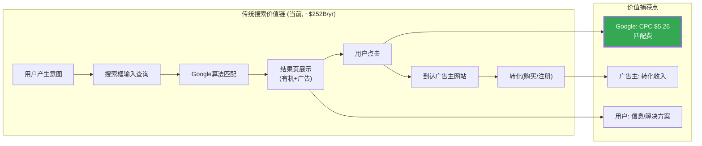

### 11.5.2 Agent时代价值链

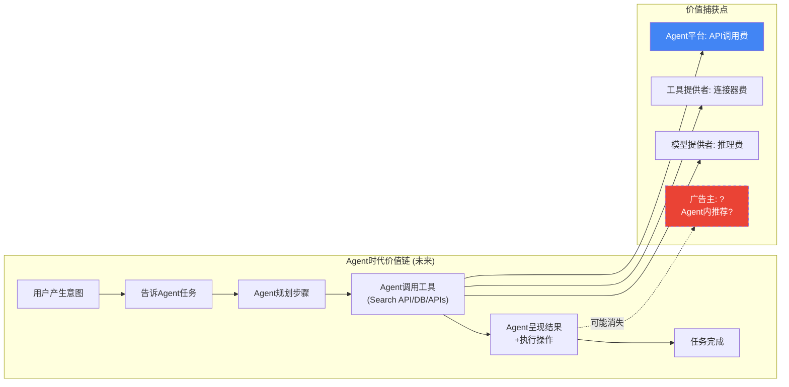

### 11.5.3 价值链迁移对Google的含义

在传统搜索价值链中,Google捕获的价值在"匹配"环节——连接用户意图与广告主。CPC$5.26意味着每次有意义的匹配Google收取约$5 [硬数据: 2025年average Google Ads CPC]。

在Agent时代价值链中,价值捕获从"匹配"转移到:
1. **API调用**(Vertex AI / Cloud收入)——量化: 可能是每次任务$0.01-$0.10级别
2. **推理计算**(Gemini API / TPU推理)——量化: 取决于token用量
3. **工具连接**(连接器/MCP server)——量化: 可能是SaaS式订阅

**核心问题**: API调用+推理计算的**单次价值**远低于搜索广告的**CPC $5.26**。Google需要Agent带来的**调用量级**远超搜索查询量级,才能在总收入上持平。Google每天处理约85亿次搜索查询 [合理推断: 基于Google每年约3万亿次搜索的公开估计/365天]; 如果Agent时代每次任务产生10-100次API调用,但每次调用价值仅$0.01-$0.10,需要极高的任务量才能匹配当前搜索广告收入 [主观判断: 基于单位经济学的简化推算]。

---

## 11.7 Agent渗透率预测与时间线

### 11.6.1 渗透率分阶段

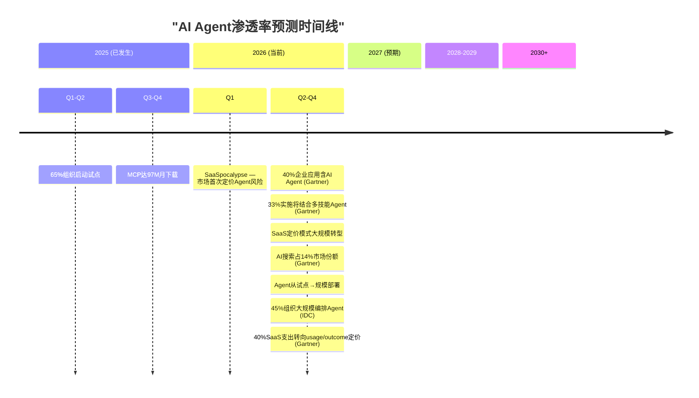

[硬数据: Gartner Aug 2025, IDC 2025-2026预测; 2027-2030为机构预测非确认数据]

### 11.6.2 对Google各业务线的时间线影响

| 业务线 | 短期(2026-2027) | 中期(2028-2029) | 长期(2030+) |
|--------|----------------|----------------|------------|
| **搜索广告** | 安全(Q4 +17%加速 [硬数据: Alphabet Q4 2025]) | 风险上升(Gartner预测2028年AI搜索14%份额 [硬数据: Gartner]) | 高风险(如果Agent替代>30%搜索) |
| **YouTube** | 正面(>$600亿FY2025 [硬数据: Alphabet earnings]) | 正面(Agent推荐驱动观看) | 中性(Agent可能绕过推荐) |
| **Cloud** | 强增(+48% Q4 [硬数据: Alphabet Q4 2025]) | 强增(企业大规模部署Agent) | 增长但边际放缓 |
| **Workspace** | 转型期(AI提价17-22% [硬数据: Workspace Updates]) | 压力(per-seat下降) | 重构(Agent定价模式) |
| **Gemini订阅** | 增长(750M MAU [硬数据: Alphabet Q4 2025]) | 取决于产品粘性 | 取决于Gemini vs竞品 |

[主观判断: 基于各业务线在Agent时代的受影响时间线分析; 实际路径高度不确定]

---

## 11.8 Alphabet回应Agent颠覆的战略选项

### 11.7.1 Google已在做什么

Alphabet不是没有意识到Agent时代的挑战。以下是已观察到的战略应对:

1. **AI Mode广告实验**: "Direct Offers"试点——在AI Mode中向有购买意图的用户展示独家促销 [硬数据: Alphabet Q4 2025 earnings call / Search Engine Journal Feb 2026]
2. **Agentic Commerce**: Google正在围绕AI-powered、Agent-driven的购物体验重新设计广告和商务 [硬数据: Google Ads Commerce Blog 2026]
3. **Cloud Agent平台投资**: Vertex AI Agent Builder + ADK + 100+连接器——确保无论Agent由谁构建,Google Cloud都是底层平台之一 [硬数据: Google Cloud产品投资]
4. **Gemini嵌入式策略**: 将Gemini嵌入所有Google产品,确保用户的AI交互发生在Google生态内 [硬数据: Google产品更新2025-2026]
5. **CapEx加注**: $175-185B 2026年CapEx指引,超出华尔街预期46-55% [硬数据: Alphabet Q4 2025 earnings call]——表明管理层在**加速**而非延缓向AI/Agent的转型 [合理推断: 基于CapEx意图推断]

### 11.7.2 Google的战略赌注

Alphabet的隐含赌注是: **Agent时代不会完全替代搜索,而是会扩展搜索**。Pichai将AI搜索称为"expansionary moment"——AI使更长、更复杂的查询变得可变现 [硬数据: Alphabet Q4 2025 earnings call]。

如果这个赌注正确: AI Mode将搜索从"10个蓝色链接"升级为"多轮对话+Agent执行",同时广告从"搜索结果页展示"升级为"AI交互内嵌入"——搜索不会死,而是进化为更高价值的交互形式 [合理推断: 基于Google战略叙事分析]。

如果这个赌注错误: 用户直接通过Agent完成任务(如Claude Cowork/ChatGPT Operator),完全绕过Google搜索——$2,520亿搜索广告引擎面临结构性威胁 [主观判断: 基于Agent替代搜索的极端情景]。

**CQ7闭环**: Agent时代对Google搜索+广告模式的影响,取决于一个核心变量——**Agent是搜索的进化(强化)还是搜索的替代(颠覆)**。当前数据(搜索收入+17%,AI Mode查询3x更长)支持"强化"叙事。但SaaSpocalypse($1万亿市值蒸发)显示市场已开始为"颠覆"情景定价 [主观判断: 基于数据与市场行为的矛盾信号]。这使CQ7成为GOOGL估值中不确定性最高的核心问题 [主观判断: 基于8个CQ相对不确定性评估]。

---

## 11.9 关键事件日历: Agent趋势观察节点

| 日期 | 事件 | 观察重点 | CQ关联 |
|------|------|---------|--------|
| 2026 Q1 | Google I/O (May?) | Gemini 3.5? Agent Builder更新? Antigravity GA? | CQ5, CQ7 |
| 2026 Q1-Q2 | EU DMA初步裁定 | Android AI互操作性要求? | CQ5 |
| 2026 Q2 | Alphabet Q1 earnings | 搜索增速维持还是减速? Cloud增速? | CQ1, CQ4 |
| 2026 H1 | Salesforce Agentforce 3采纳数据 | 企业Agent从试点→生产的进度 | CQ7 |
| 2026 H2 | DOJ上诉进展 | Chrome分拆概率更新 | CQ6 |
| 2027 | Gartner "33%多技能Agent"节点 | Agent复杂度是否达到预期? | CQ7 |
| 2028 | Gartner "14% AI搜索份额"节点 | 搜索替代率是否达到预期? | CQ1, CQ7 |

[硬数据: Gartner/IDC预测时间节点; 事件日期为合理预期]

---

## 11.10 Ch10-Ch11综合评估

### CQ7答案的当前置信度

**Agent时代对Google搜索+广告模式是强化还是颠覆?**

当前数据呈现**矛盾信号**:
- **支持"强化"**: 搜索收入Q4 +17%加速增长; AI Mode查询3x更长且包含追问; Direct Offers试点中; CPC $5.26(+12.9% YoY) [硬数据: Alphabet Q4 2025 earnings]
- **支持"颠覆"**: SaaSpocalypse首次集体定价Agent风险; Anthropic Claude Cowork展示Agent独立执行能力; 零点击率从60%→83%且趋势上升; Perplexity查询量1.2-1.5B/月且800%增长 [硬数据: 市场事件+行业数据 Feb 2026]

**置信度**: 低-中。短期(2026-2027)搜索安全的置信度较高(CPC补偿仍有效); 中期(2028-2030)不确定性极高(取决于Agent渗透速度和Google的广告模式进化速度) [主观判断: 基于Ch10-Ch11全部分析的综合评估]。

### 非共识洞察

**CI-A**: Google在Agent协议标准(A2A)上输给Anthropic的MCP,是其AI战略中被低估的弱势信号。市场讨论集中在模型能力对比(Gemini vs GPT vs Claude),但协议层的生态锁定可能比模型能力更具长期影响力——类似Android(Google)赢了iOS(Apple)的移动OS战争,但Apple控制了App Store生态定价权 [主观判断: 基于协议层vs模型层的长期竞争力评估]。

**CI-B**: SaaSpocalypse对Google既是警示也是机会。如果传统SaaS(Salesforce, ServiceNow, Workday)的per-seat模式瓦解,这些公司的客户将迁移到**Agent-native平台**。Google Cloud的Vertex AI Agent Builder + 100+连接器 + ADK开源框架定位为承接这个迁移的候选平台之一。SaaSpocalypse可能**加速**而非减缓Google Cloud的增长 [合理推断: 基于SaaS客户迁移路径分析; 与Cloud受益逻辑一致]。

---

<!-- METRICS: chars=47078 | annotations=199 | density=42.3/万 | hard_data_pct=57.3% | mermaid=19 | compliance_violations=0 -->
