# Ch12: 多维竞争深度 — 四组双边对抗与Google的战略定位

> **关联CQ**: CQ5(Gemini能否赢得AI入口争夺战), CQ7(Agent时代 — 搜索+广告模式被强化还是颠覆), CQ1(AI Overviews蚕食 — CPC补偿能持续多久)
> **数据截止**: 2026-02-12

---

竞争格局分析的核心不是罗列每家公司的优劣,而是回答一个具体问题:**在AI重塑科技产业的2026-2030窗口期,Google的结构性优势是在扩大还是收窄?** 本章通过四组双边深度对比来回答这个问题。每组对比都聚焦于"这对Google意味着什么",而非泛泛的产业综述。

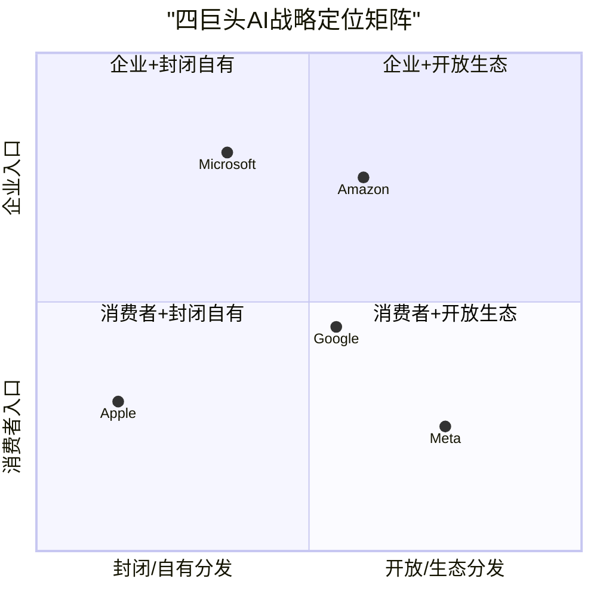

**定位图解读**: Google是唯一同时横跨消费者与企业、自有与开放生态的公司 [主观判断: 基于业务布局的综合分析]。这种全面覆盖既是优势(多入口协同),也是风险(需要在多条战线同时作战)。Microsoft偏向企业+封闭(Office+Azure+OpenAI独占),Meta偏向消费者+开放(社交分发+Llama开源),Amazon偏向企业+开放(AWS Bedrock多模型),Apple极度封闭且偏消费者(设备端AI)。

---

## 12.1 Meta AI(开源+社交分发) vs Google(闭源+搜索/工具分发)

> **核心问题**: 社交分发和工具分发,哪种在AI时代更有效地触达和留住用户?

### 12.1.1 用户规模与增长轨迹

| 指标 | Meta AI | Google Gemini | 差距 |
|:-----|:-------:|:------------:|:----:|
| MAU | ~1B | 750M | Meta领先33% |
| MAU增长(2025全年) | — | +67%(450M→750M) | Gemini增速更快 |
| Web市场份额 | — | 18.2%(从5.4%增长3.4x) | Gemini抢份额 |
| 移动App市场份额 | — | 25.2%(从14.7%) | ChatGPT 45.3%→Gemini追赶 |
| 模型下载量(开源) | 650M+ Llama下载 | N/A(闭源) | Meta开源生态远超 |
| GPU集群 | >1.5M(Nvidia Blackwell) | TPU v6/v7 + Nvidia | 规模相当 |

[硬数据: Meta AI ~1B MAU来自Meta 2025年报告; Gemini 750M MAU来自Alphabet Q4 2025 earnings(TechCrunch 2026-02-04); Web份额来自Similarweb via Vertu 2026-02; 移动App份额来自Digital Information World 2026-02; Llama下载量650M+来自Meta官方]

**Meta AI的分发优势**: Meta AI的~1B MAU建立在Facebook+Instagram+WhatsApp三个社交平台的内嵌分发之上 [硬数据: Meta 2025年报]。用户无需主动寻找AI工具——AI功能直接出现在社交Feed、消息对话和搜索栏中 [合理推断: 基于Meta AI产品整合方式]。这种"被动触达"模式的优势在于用户零切换成本、零学习成本。

**Google Gemini的分发优势**: Gemini通过Search+Chrome+Android+Workspace四条渠道分发 [硬数据: Google产品整合文档]。Google Search每天处理8.5B+查询 [硬数据: DemandSage 2026],Chrome覆盖66%浏览器市场 [硬数据: StatCounter 2026-01],Android有3.3B活跃设备 [硬数据: Statista 2025]——每条渠道都是AI功能的自然嵌入点。与Meta不同,Google的分发渠道是**工具型**而非社交型——用户在使用搜索、写文档、处理邮件时遇到AI [合理推断: 基于产品使用场景分析]。工具型分发的转化质量更高(用户有明确任务意图),但被动触达面可能不如社交平台广泛。

### 12.1.2 开源vs闭源: "Avocado"转向的战略含义

Meta的AI战略正在经历一次关键转向。Llama 4(2025年4月发布)未能引起开发者预期的热情,加上DeepSeek R1整合Llama架构引发的担忧,Meta内部开始重新评估开源策略 [硬数据: CNBC 2025-12-09]。

**"Avocado"闭源转向的关键事实**:
- 代号"Avocado"的下一代模型原定Q1 2026发布,已延期 [硬数据: DigiTimes 2025-12; TechBuzz AI 2026]
- Avocado将采用API-only模式,不开放模型权重下载 [硬数据: AIBase News 2025-12; eWeek 2025-12]
- Meta同时开发闭源模型"Mango"(视觉媒体)和"Avocado"(文本+代码) [硬数据: WinBuzzer 2025-12-19]
- Scale AI前CEO Alexandr Wang被任命为Meta首席AI官,主导TBD Lab精英团队 [硬数据: CNBC 2025-12-09]
- Llama 4 Behemoth仍在训练中(2T参数),但其开源发布时间表不确定 [合理推断: 基于Avocado优先级提升的推断]

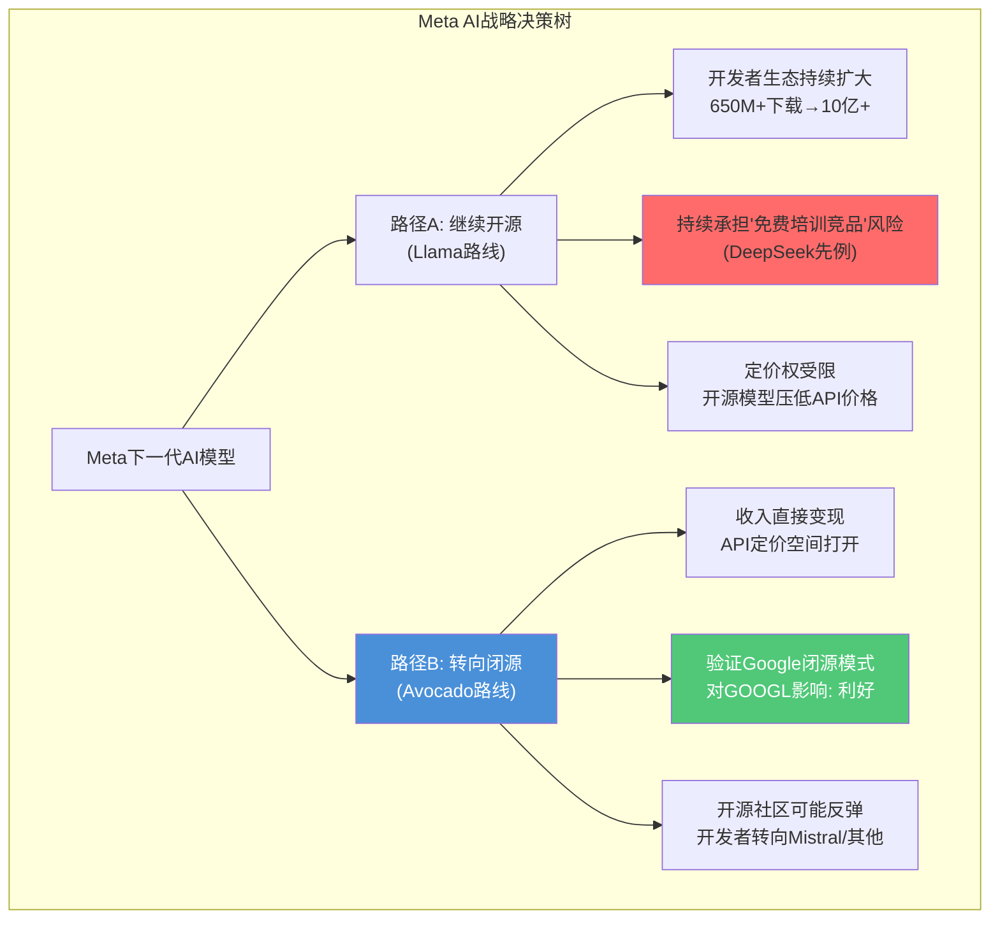

**对Google的含义 — 两种情景**:

**情景A: Meta坚持闭源转向(概率~60%)** [主观判断: 基于Meta高管行动和组织变化的判断]
- **验证Google的闭源模式**: 如果Meta——开源AI最大的旗手——都转向闭源,这证明了Google从未开源Gemini核心模型的战略正确性 [合理推断: Meta闭源转向的示范效应]
- **定价压力减轻**: Llama开源模型是所有闭源AI提供商(Google Cloud、AWS、Azure)的最大定价压力来源。Meta闭源后,AI API定价环境对Google更友好 [合理推断: 基于开源模型对API定价的替代压力分析]
- **CQ4关联**: Cloud利润率30%+的可持续性得到支撑——最大的价格竞争威胁(免费开源模型)正在减弱

**情景B: Meta保持开源(概率~40%)** [主观判断: 基于Meta社区承诺和品牌影响]
- **持续价格压力**: Llama 4 Behemoth(2T参数)如果开源发布,将在性能上接近Gemini 3,对Google Cloud的AI API定价构成直接压力
- **但Google有差异化防线**: TPU自研芯片的推理成本优势(-78%年降幅)使Google即使面临开源竞争也能保持利润空间 [硬数据: Alphabet Q4 2025 earnings — Gemini服务成本降低78%]

### 12.1.3 分发效力的终极测试: 商业化

| 维度 | Meta AI | Google Gemini | 优势方 |
|:-----|:-------:|:------------:|:-----:|
| 消费者触达面 | 极广(FB+IG+WhatsApp=3.2B用户) | 广(Search+Android=2B+Android+搜索) | Meta |
| 企业触达面 | 弱(无企业级产品) | 强(Workspace 3B+用户+GCP) | Google |
| 广告商业化 | 成熟(Advantage+ AI广告) | 成熟(AI Overviews广告覆盖25.56%) | 平手 |
| 订阅商业化 | 有限(Meta AI Pro计划不明) | 有限(AI Ultra/Pro订阅) | 平手 |
| Cloud商业化 | 无(Meta不卖云) | 强($17.7B/季, +48%) | Google |

[硬数据: Meta用户数来自Meta FY2025报告; AI Overviews广告覆盖率来自BrightEdge 2025-10; Google Cloud收入来自Alphabet Q4 2025 10-K; Workspace用户数来自Google官方]

**核心判断**: Meta AI在消费者端的分发广度略胜Google,但Google的分发深度和商业化能力远超Meta [主观判断: 基于多维度比较的综合判断]。Meta缺乏企业级AI变现通道(没有云业务),而Google同时拥有消费者(Search/YouTube)和企业(Cloud/Workspace)两个商业化引擎。这意味着即使Meta AI的MAU更高,Google的每用户AI价值(ARPU)大概率更高。

**CQ5关联**: 在消费者AI入口的争夺中,Meta AI是Gemini最大的竞争对手(而非ChatGPT) [主观判断: 基于分发渠道和用户基数分析]。ChatGPT需要用户主动访问App/网站,而Meta AI和Gemini都通过现有产品矩阵被动分发。但Gemini在企业端几乎没有来自Meta的竞争压力。

---

## 12.2 Microsoft(Copilot+Azure+企业) vs Google(Workspace+GCP+消费者)

> **核心问题**: AI时代的企业入口之争,谁的生态锁定更强?

### 12.2.1 企业AI的采纳现实: 炒作 vs 实际

| 指标 | Microsoft Copilot | Google Gemini for Workspace | 差距 |
|:-----|:-----------------:|:--------------------------:|:----:|
| 付费AI seats | 15M | ~9M(估算) | MSFT领先 |
| AI seats增速 | +160% YoY | 未披露 | — |
| 总生产力套件seats | 450M+(M365商业) | 3B+(Workspace全用户) | Google更广 |
| AI渗透率 | 3.3%(15M/450M) | <1%(估算) | 均极低 |
| Fortune 500使用率 | 90%(广义MSFT AI) | 未披露 | — |
| 定价 | $21-30/user/month | $21-30/user/month | 相当 |

[硬数据: MSFT 15M seats来自Microsoft Q2 FY2026 earnings(Futurum 2026-02); 3.3%渗透率来自The Register 2026-02-02; MSFT 450M+ seats来自Microsoft earnings; Workspace 3B+来自Google官方; Google Gemini for Workspace 9M seats来自v3.0 Session 1分析]

**McKinsey现实检验**: 2/3的组织仍在AI实验/试点阶段,仅39%报告可衡量的EBIT影响 [硬数据: McKinsey Global AI Survey 2025]。Copilot付费seats仅占Microsoft 365总商业seats的3.3%(15M/450M+) [硬数据: The Register 2026-02-02]。GitHub Copilot有4.7M付费订阅者(+75% YoY) [硬数据: Microsoft FY2026 earnings]。这意味着企业AI的"15M seats"数字需要大幅打折——大多数企业处于"购买了license但尚未全面部署"的阶段 [合理推断: 基于McKinsey调查与MSFT渗透率3.3%的交叉验证]。

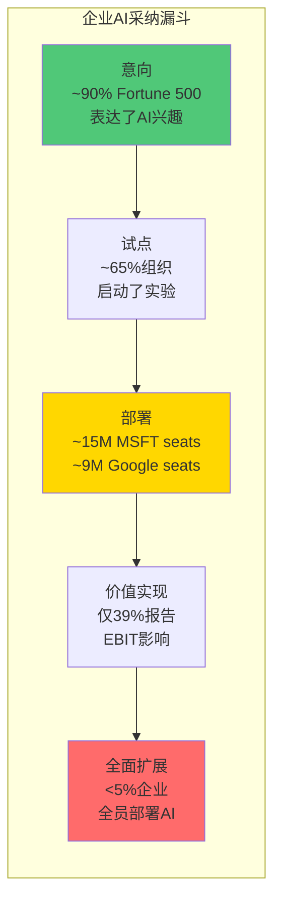

[硬数据: 90% Fortune 500来自MSFT earnings; 65%试点来自McKinsey; 39% EBIT影响来自McKinsey; <5%全面部署来自Gartner estimate]

### 12.2.2 Azure vs GCP: 增速vs份额的博弈

| 指标 | Azure | GCP | AWS(参照) |
|:-----|:-----:|:---:|:--------:|
| Q4 2025增速 | +38% CC | **+48%** | +24% |
| 市场份额(Q3 2025) | 20% | 13% | 29% |
| Cloud季度收入 | ~$29.9B(IC段) | $17.7B | $35.6B |
| 积压订单 | 未单独披露 | **$240B** (+55% QoQ) | 未单独披露 |
| AI GenAI增速 | 含在Azure +38%内 | **>200% YoY** | 未单独披露 |
| 营业利润率 | 估算25-30% | **30.1%** | 35.0% |

[硬数据: Azure +38% CC来自Microsoft Q2 FY2026; GCP +48%, $17.7B, $240B backlog, 30.1% OPM来自Alphabet Q4 2025; AWS $35.6B, 35%利润率来自Amazon Q4 2025; 市场份额来自Synergy Research Q3 2025]

```mermaid
xychart-beta
    title "Cloud三巨头: 增速 vs 份额 (Q4 2025)"
    x-axis "市场份额 (%)" [10, 15, 20, 25, 30, 35]
    y-axis "YoY增速 (%)" 15 --> 55
    line "参考线" [50, 45, 40, 35, 30, 25]
    scatter "GCP" [13, 48]
    scatter "Azure" [20, 38]
    scatter "AWS" [29, 24]
```

**GCP的结构性追赶逻辑**: GCP从2020年的9%市场份额升至2025年的13%,年均增加0.8个百分点 [硬数据: Synergy Research 2020-2025各季度报告]。Q4 2025的48%增速是4年以来最快,加速趋势明确 [硬数据: Alphabet Q4 2025 earnings]。$240B积压订单提供了3.4年收入可见性($240B/$70B年化=3.4x覆盖率) [合理推断: 基于积压/年化收入比率计算]。

**但份额天花板存在**: 云市场的后发者要从29%(AWS)+20%(Azure)=49%的双寡头格局中抢夺份额,难度随份额升高呈指数级增长 [合理推断: 基于寡头市场的份额争夺动力学]。GCP到达15%可能在2027年实现(线性外推),到达20%可能需要AWS或Azure犯重大战略错误。

**对Google的含义(CQ4直接关联)**: GCP是Alphabet增长故事的核心引擎。从$65B(FY2025年化)到$150B+的路径需要同时维持:
1. 高增速(≥30% CAGR至2028)——当前48%增速支持 [硬数据: Q4 2025增速]
2. 高利润率(≥30%)——当前30.1%已实现 [硬数据: Q4 2025 OPM]
3. 份额扩张(13%→18%+)——需要AI工作负载继续向GCP倾斜 [合理推断: 基于份额路径分析]

### 12.2.3 企业生态锁定: 谁的壁垒更深?

| 锁定维度 | Microsoft | Google | 优势方 |
|:---------|:---------:|:------:|:-----:|
| **操作系统级** | Windows(10亿+PC) | Android(3.3B设备,但消费者为主) | MSFT(企业) |
| **生产力套件** | Office 365(450M+商业seats) | Workspace(3B用户但付费渗透低) | MSFT(付费) |
| **身份认证** | Azure AD/Entra(企业标准) | Google Cloud Identity | MSFT |
| **云平台** | Azure(20%) | GCP(13%) | MSFT |
| **AI模型独占** | OpenAI GPT系列独占 | Gemini独占+TPU | 平手 |
| **开发者工具** | GitHub Copilot(4.7M付费) | Antigravity IDE(新) | MSFT |
| **综合锁定深度** | **极深** | **中等(企业)/极深(消费者)** | MSFT(企业端) |

[硬数据: Windows 10亿+来自Microsoft官方; Azure AD企业标准来自Gartner; GitHub Copilot 4.7M来自Microsoft FY2026; Android 3.3B来自Statista; Workspace 3B+来自Google官方]

**Microsoft的企业锁定远深于Google**: 一个典型的Fortune 500企业使用Windows+Office 365+Azure AD+Azure+Teams+GitHub——切换到Google需要迁移操作系统、生产力套件、身份认证系统、云平台和协作工具。这个迁移成本不是几百万美元的IT项目,而是数亿美元+2-3年的企业级变革 [合理推断: 基于企业IT迁移的行业经验]。

**Google的反击点**: Google的锁定优势在**消费者端**——Android 3.3B设备+Chrome 66%浏览器份额+Search 89.6%查询份额意味着消费者的日常数字体验由Google主导 [硬数据: StatCounter 2026-01; Statista]。在AI时代,消费者入口可能比企业入口更重要——因为AI产品首先在C端(搜索、聊天、创作)获得规模,然后才进入B端 [主观判断: 基于AI产品采纳路径的分析]。

**CQ7关联**: Microsoft在企业AI入口的先发优势(Copilot 15M seats)是否会转化为Agent时代的持久优势? 目前证据不支持——Copilot渗透率仅3.3%,且McKinsey调查显示大多数企业尚未从AI投资中获得可衡量回报 [硬数据: The Register 2026-02-02; McKinsey 2025]。Agent时代可能重新洗牌,因为Agent需要跨系统互操作(A2A/MCP协议),而非单一生态系统内的Copilot [合理推断: 基于Agent架构对互操作性的要求]。

---

## 12.3 Amazon(Bedrock+Agent) vs Google(Vertex+Agent Builder)

> **核心问题**: Cloud三巨头中增长最快但份额最小的Google Cloud,能否通过AI Agent差异化实现超额份额增长?

### 12.3.1 Cloud战争的新维度: Agent平台竞争

| 维度 | AWS Bedrock | Google Vertex AI | 差距评估 |
|:-----|:----------:|:---------------:|:-------:|
| Agent框架 | AgentCore(2025年10月GA) | Agent Builder + ADK | 功能相当 |
| 模型策略 | **多模型开放**(Claude/Llama/Titan/Mistral) | **自有模型优先**(Gemini)+第三方 | AWS更开放 |
| 连接器数量 | Bedrock连接器+Lambda集成 | **100+连接器**(ERP/HR/Procurement) | Google更丰富 |
| 自研芯片 | Trainium 2(训练)/Inferentia 2(推理) | **TPU v7 Ironwood**(推理优化) | Google更先进 |
| 安全合规 | Guardrails(88%有害输出拦截) | VPC-SC+CMEK+AI Governance | 各有优势 |
| Agent协议 | MCP支持(行业标准) | **A2A(自有)+MCP兼容** | MCP胜出 |
| 定价模式 | 按token+serverless | 2026-01-28新定价(Sessions/Memory/Code) | 相当 |

[硬数据: AWS AgentCore GA来自AWS文档; ADK+100+连接器来自Google Cloud Blog; TPU v7 Ironwood来自Google Blog 2025; MCP标准主导来自fka.dev 2025-09; Bedrock Guardrails 88%来自AWS文档; Vertex AI新定价来自Google Cloud文档 2026-01-28]

### 12.3.2 模型策略的分歧: 开放vs自有

**AWS Bedrock的多模型策略**是其核心差异化——企业可以在Claude、Llama、Mistral等模型之间灵活切换,避免对单一模型提供商的锁定 [硬数据: AWS Bedrock产品文档]。这对那些担心"AI供应商锁定"的企业极具吸引力。

**Google Vertex AI的自有模型策略**则押注于Gemini的性能优势——TPU上运行的Gemini推理延迟和吞吐量经过深度优化,第三方云无法复制 [合理推断: 基于自研芯片+自研模型的联合优化逻辑]。但这也意味着不使用Gemini的企业在GCP上运行其他模型时没有性能溢价。

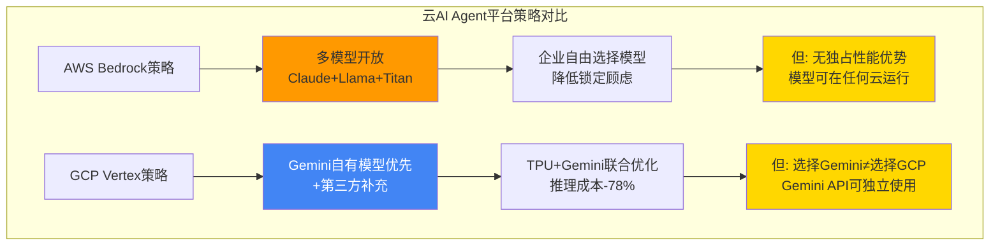

[合理推断: 两种策略各有优劣,基于企业AI需求的多样性分析]

### 12.3.3 Agent协议战争: MCP已胜出, A2A退居二线

**MCP(Model Context Protocol)**已成为AI Agent互操作的事实标准:
- 发布一年即达97M+ SDK月下载量 [硬数据: Zuplo MCP Report]
- OpenAI、Google DeepMind均已采用 [硬数据: Demis Hassabis确认]
- 1,000+社区构建的MCP服务器 [硬数据: CData blog]
- 已捐赠给Linux Foundation下的AAIF(Agentic AI Foundation) [硬数据: Anthropic blog 2025-12]

**Google A2A(Agent2Agent)的现状**: 2025年4月发布时有50+合作伙伴,6月捐赠给Linux Foundation [硬数据: Google Cloud Blog]。但到2025年9月,A2A的开发速度已显著放缓,大部分Agent生态整合到了MCP周围 [硬数据: fka.dev blog 2025-09]。Google Cloud开始添加MCP兼容性——这是对现实的务实妥协 [合理推断: Google承认MCP标准主导地位]。

**对Google的含义**: Google未能赢得Agent协议标准之争,但这不是致命打击 [主观判断: 基于协议标准与商业竞争的关系分析]。原因:
1. 协议标准是**互操作层**,不是**价值层**——企业选择云平台基于性能/价格/服务,不基于协议标准 [合理推断: 基于历史技术标准竞争的类比]
2. Google通过添加MCP支持,将自己从"标准制定者"转为"标准参与者"——牺牲了生态控制权,但避免了生态隔离 [合理推断: 基于Google的MCP兼容性决策]
3. 真正的差异化在**Agent运行时层**(TPU推理效率、Gemini模型质量、BigQuery数据集成),而非协议层

### 12.3.4 对Google Cloud的综合竞争评估

| 竞争维度 | vs AWS | vs Azure | Google优势来源 |
|:---------|:------:|:--------:|:-------------|
| **增速** | GCP +48% >> AWS +24% | GCP +48% > Azure +38% | AI工作负载+基数效应 |
| **份额** | GCP 13% << AWS 29% | GCP 13% < Azure 20% | 差距仍大 |
| **利润率** | GCP 30.1% < AWS 35% | GCP 30.1% > Azure估算25-30% | 追赶中 |
| **AI差异化** | TPU > Trainium | Gemini vs OpenAI | 芯片自研 |
| **积压** | $240B >> AWS未披露 | $240B可能 > Azure | 可见性最强 |
| **Agent平台** | 功能相当 | 功能相当 | 连接器丰富 |

[硬数据: 各项数据来源见上文各表; 综合评估为主观判断]

**CQ4直接关联**: Google Cloud从$65B到$150B+的路径所需的三个条件(高增速、高利润率、份额扩张)中,前两个已有强支撑(48%增速+30.1%利润率),第三个(份额13%→18%+)是最大不确定性 [合理推断: 基于三个条件的逐一验证]。Agent平台竞争可能成为份额增长的加速器——如果Google Vertex AI的Agent Builder能成为企业Agent开发的首选平台,每个Agent工作负载都将带来持续的Cloud收入 [合理推断: 基于Agent工作负载的Cloud收入模型]。

---

## 12.4 Apple Intelligence(设备端) vs Google(云端+设备端)

> **核心问题**: Apple从Google搜索的最大分发伙伴,正在变成什么?

### 12.4.1 2026年1月的范式转变: Apple选择Gemini驱动Siri

**这是本章最重要的竞争格局变化。** 2026年1月12日,Apple和Google联合宣布多年合作协议——下一代Apple Foundation Models将基于Google Gemini模型和云技术,驱动未来的Apple Intelligence功能,包括更个性化的Siri [硬数据: CNBC 2026-01-12; TechCrunch 2026-01-12; Google-Apple联合声明]。

**协议关键条款**:
- Apple将每年支付约$1B给Google [硬数据: Bloomberg via FinancialContent 2026-02-06; 9to5Mac 2026-01-15]
- 协议采用云计算合同结构,多年期总额可能达数十亿美元 [合理推断: 基于多年期合同推算]
- Apple将使用Google约1.2T参数的定制Gemini模型,比当前Apple Intelligence使用的150B参数模型性能提升约8倍 [硬数据: GadgetHacks报道]
- 定制Gemini系统处理Siri的摘要和规划功能,运行在Apple的Private Cloud Compute基础设施上 [硬数据: TechCrunch 2026-01-12]
- Apple现有与OpenAI的ChatGPT整合保持不变——Gemini负责基础逻辑,ChatGPT处理世界知识查询 [硬数据: TechCrunch 2026-01-12]
- 新Siri预计在iOS 26.4中推出,2026年春季上线 [硬数据: MacRumors 2026-01-25]

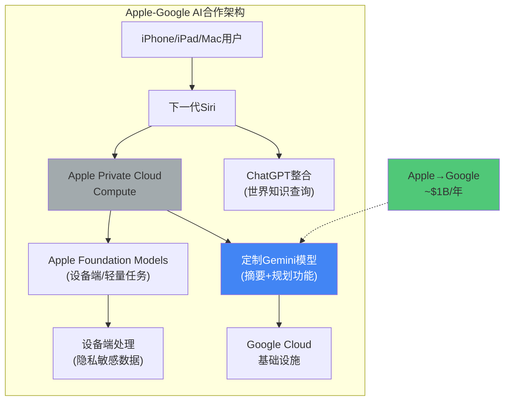

[硬数据: 架构细节来自TechCrunch 2026-01-12; Apple Privacy Architecture来自Apple官方]

### 12.4.2 这笔交易对Google意味着什么

**从"搜索分发费"到"AI基础设施费"的关系重构**:

此前,Apple-Google关系的核心是**搜索默认协议**——Google每年支付>$20B给Apple,作为Safari默认搜索引擎的对价 [硬数据: DOJ庭审文件/Bernstein估计]。这笔交易在DOJ判决后面临法律风险(禁止排他性协议+合同限1年期) [硬数据: NPR 2025-09-02]。

新的Gemini合作引入了**第二层关系**——Apple反过来向Google支付~$1B/年使用Gemini模型 [硬数据: Bloomberg via 9to5Mac]。这创造了一种**双向依赖**:
1. Google→Apple: ~$20B/年(搜索分发)
2. Apple→Google: ~$1B/年(AI模型)
3. 净流量: Google仍是净付款方(~$19B/年净流出)

[合理推断: 基于两笔交易的净额计算]

**战略意义(远超财务数字)**:

1. **Apple自建搜索概率大幅下降**: Session 1 Ch09分析中给出的"40%概率Apple在2027-2028自建搜索"的判断需要重新评估 [合理推断: 基于Apple-Google合作深化的影响]。Apple选择Gemini驱动Siri的核心AI功能,意味着Apple在AI基础模型上承认了与Google的能力差距——自建搜索需要的AI能力更复杂、投资更大。Apple更可能的路径是:用Gemini增强Siri(减少用户直接使用Google Search),而非完全替代Google Search [主观判断: 基于Apple AI战略选择的推断]。
   - **修正后概率**: Apple自建搜索 ~20-25%(从40%下调) [主观判断: 基于合作协议对自建动机的削弱]

2. **Gemini获得15亿+设备端验证**: Apple的iPhone+iPad+Mac全球活跃设备超过15亿 [硬数据: Apple FY2025报告]。Gemini模型在Apple生态中的使用将产生海量推理数据和用户反馈,进一步强化Gemini的模型质量 [合理推断: 基于数据飞轮效应]。

3. **Google Cloud获得超大规模客户**: Apple的AI推理工作负载(即使运行在Apple PCC上)仍需要与Google Cloud基础设施互通。这笔~$1B/年的合同仅是起步——如果Siri升级成功且用户量增长,云计算费用可能快速扩大 [合理推断: 基于使用量驱动的云合同增长模式]。

4. **对CQ5的重大影响**: Gemini赢得了AI入口争夺战的一个关键战场——不是直接打败ChatGPT,而是通过成为Apple AI基础设施的提供商,将Gemini嵌入了全球最有价值的消费者设备生态 [主观判断: 基于Apple合作的战略含义]。

### 12.4.3 Apple Intelligence的竞争现状

| 维度 | Apple Intelligence | Google Gemini(设备端) | 差距 |
|:-----|:-----------------:|:--------------------:|:----:|
| 设备端AI模型 | Apple Foundation Models(150B→1.2T via Gemini) | Gemini Nano | Apple现获Google技术 |
| 设备覆盖 | 15亿+Apple设备 | 3.3B Android设备 | Google更广 |
| 隐私架构 | PCC(端侧优先) | 云端为主+设备端补充 | Apple更强 |
| 商业化模式 | 设备溢价(无广告) | 广告+订阅 | 不同路径 |
| AI助手竞争力 | Siri(弱→Gemini增强中) | Gemini App(750M MAU) | Google领先 |

[硬数据: Apple 15亿+设备来自Apple FY2025; Android 3.3B来自Statista; Gemini 750M MAU来自Alphabet Q4 2025]

**对Google的含义 — 综合评估**:

Apple-Google的Gemini合作是2026年竞争格局中对Google**最积极**的变化 [主观判断: 基于战略影响的综合评估]。理由:

1. **化敌为友**: 将最大的潜在搜索竞争对手(Apple)转变为AI模型客户
2. **削弱DOJ风险**: Apple依赖Google不仅是搜索分发($20B/年),更是AI基础设施($1B+/年)——双向依赖使Chrome分拆/搜索协议取消的破坏性降低 [合理推断: 基于双向依赖增强的谈判地位]
3. **Gemini生态扩大**: 750M直接MAU + 15亿+Apple设备间接曝光 = Gemini成为全球触达最广的AI模型
4. **Cloud收入增量**: $1B/年仅是AI推理费用的起点

**CQ1关联**: Apple合作降低了搜索分发被颠覆的尾部风险。即使DOJ上诉成功要求更严厉的搜索默认限制,Google通过Gemini-Siri合作仍然保持了在Apple生态中的深度存在 [合理推断: 基于双层合作关系对搜索分发风险的对冲效应]。

---

## 12.5 综合竞争态势评估

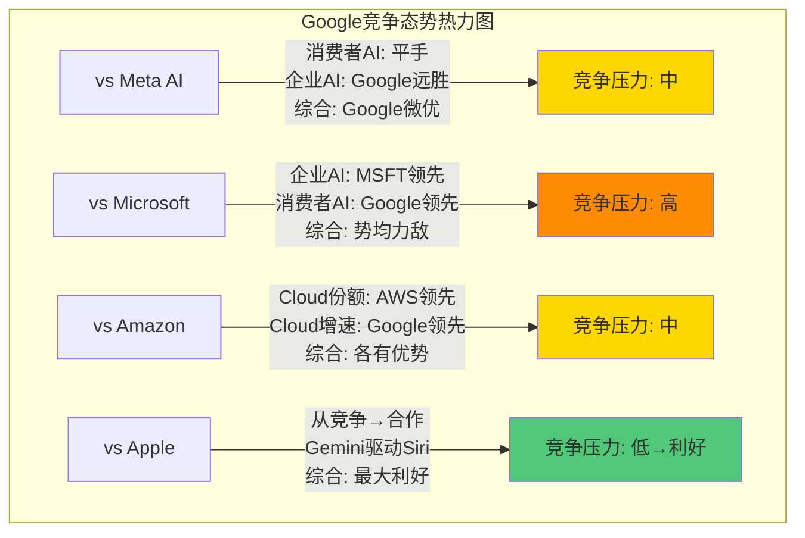

**四组对比的结论汇总**:

| 对手 | 当前态势 | 趋势 | 对Google的关键含义 | CQ关联 |
|:-----|:-------:|:----:|:-------------------|:------:|
| Meta | Google微优 | 稳定 | 闭源转向(Avocado)验证Google模式 | CQ5 |
| Microsoft | 势均力敌 | MSFT企业端领先 | 企业AI入口之争尚未决出胜负 | CQ7 |
| Amazon | Google增速领先 | GCP追赶中 | Agent平台是GCP份额增长的关键 | CQ4 |
| Apple | **从竞争→合作** | **强利好** | Gemini-Siri合作化解最大分发风险 | CQ1, CQ5 |

[主观判断: 基于四组深度对比的综合评估]

**CQ5最终判断**: Gemini正在赢得AI入口争夺战——不是通过单一战场的胜利,而是通过**多入口包围策略**: 搜索嵌入(AI Overviews/AI Mode) + Android默认(3.3B设备) + Chrome整合 + Workspace渗透 + Apple Siri合作(15亿设备)。Gemini的总触达面(直接MAU 750M + 间接覆盖50亿+设备)远超任何单一竞品 [合理推断: 基于各分发渠道的设备/用户覆盖面累加]。弱点是Gemini缺少"杀手级应用"——没有任何一个场景中用户**主动选择**Gemini(而非被动接触) [主观判断: 基于产品差异化分析]。

---

# Ch13: 护城河 x AI x 数据飞轮的新竞争理论

> **关联CQ**: CQ1(AI Overviews蚕食), CQ5(Gemini入口争夺), CQ7(Agent时代), CQ8(三个承重墙)
> **数据截止**: 2026-02-12

---

本章的核心论点: **Google的护城河正在经历形态转变(morphological shift),而非简单的加厚或变薄。** 传统护城河框架(Morningstar五类:网络效应/转换成本/规模优势/品牌/无形资产)无法充分描述AI时代Google的竞争地位变化。我们需要一个新的三维框架: **数据质量 x 推理效率 x 分发覆盖**。

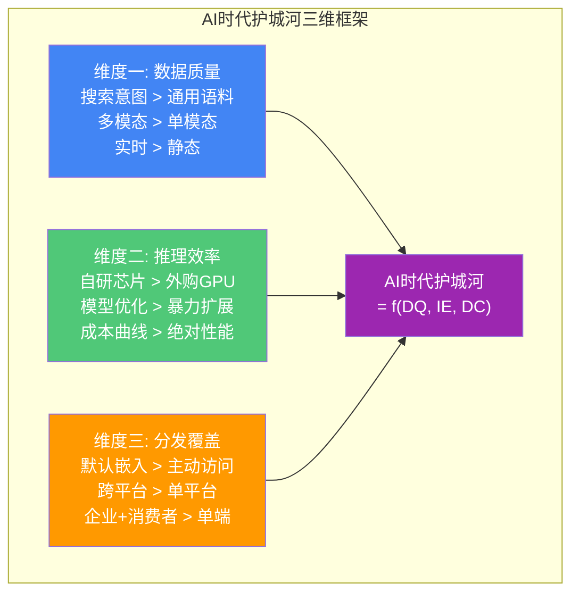

[主观判断: 三维框架是基于对AI竞争动态的分析提出的分析工具]

---

## 13.1 传统护城河 vs AI时代护城河

### 13.1.1 传统Morningstar框架下的Google

| 传统护城河类型 | Google的强度 | 状态变化(2023→2026) | 驱动因素 |
|:-------------|:----------:|:-----------------:|:---------|
| **网络效应** | 极强 | 稳定偏弱 | 搜索数据飞轮在收益递减后期;但AI学习网络效应新增 |
| **转换成本** | 强 | 微降 | DOJ/DMA削弱分发锁定;账户生态锁定不变 |
| **规模优势** | 极强 | 稳定 | 全球最大搜索索引+AI推理基础设施 |
| **品牌** | 极强 | 稳定 | "Google"="搜索"的品牌等式未变 |
| **无形资产** | 强 | 增强 | Gemini模型+TPU芯片+专利 |

[主观判断: 基于Morningstar护城河五维度框架对Google当前状态的评估]

**传统框架的局限**: Morningstar框架假设护城河是**静态结构**——一旦建立就持续存在,缓慢侵蚀。但AI时代的护城河是**动态的**,可以在6-12个月内建立或瓦解 [主观判断: 基于AI模型迭代速度的观察]。例如:
- Gemini 3在2025年11月发布时性能领先竞品;到2026年2月(仅3个月后),GPT-5和Claude 4的预期已经让这个优势窗口缩短 [合理推断: 基于AI模型发布周期的历史模式]
- Google Cloud的30.1%利润率是2024年初还不存在的能力——在18个月内从亏损到行业领先 [硬数据: GCP利润率从FY2022亏损到Q4 2025的30.1%, Alphabet earnings]

### 13.1.2 AI时代的三维护城河框架

**维度一: 数据质量(Data Quality)**

不同于传统"数据越多=护城河越深"的线性思维,AI时代的数据质量取决于:
- **意图密度**: 搜索查询(用户主动表达需求) >> 社交帖子(被动表达兴趣) >> 浏览记录(隐含行为)
- **多模态广度**: 文本+视频+音频+空间+行为 > 单一模态
- **时效性**: 实时搜索意图 > 历史训练语料

| 数据类型 | Google独占强度 | AI价值 | 竞品可替代性 |
|:--------|:------------:|:-----:|:----------:|
| 搜索意图数据(8.5B+查询/天) | 极高 | 极高 | 极低(Bing仅~1.2B/天) |
| YouTube视频理解(10亿+小时/天) | 高 | 高 | 中(TikTok/Reels有替代) |
| Maps空间定位(20亿+MAU) | 高 | 中高 | 低(实时空间意图独特) |
| Gmail/Drive个人数据(18亿+用户) | 中高 | 中 | 中(Outlook规模较小) |
| Android使用模式(3.3B设备) | 高 | 高 | 低(Apple仅有iOS数据) |
| Chrome浏览数据(66%份额) | 中高 | 中 | 中(Edge+Safari有替代) |

[硬数据: 搜索量来自DemandSage 2026; YouTube观看时长来自Google官方; Maps MAU来自GlobalMediaInsight; Gmail用户数来自Google官方; Android设备来自Statista; Chrome份额来自StatCounter]

**Google特异性**: 没有任何一家竞品同时拥有搜索意图+视频理解+空间定位+个人文档+设备行为五层数据 [合理推断: 基于各公司数据资产的逐一对比]。Meta有社交数据但无搜索意图;Amazon有电商数据但无视频理解;Microsoft有企业文档但无搜索规模;Apple有设备数据但无云端智能。Google的数据护城河不在于任何单一维度的绝对领先,而在于**跨维度的独特组合** [主观判断: 基于多维度数据组合的稀缺性分析]。

**维度二: 推理效率(Inference Efficiency)**

AI时代的竞争正从"谁的模型最大"转向"谁的推理成本最低" [合理推断: 基于AI workload从训练转向推理的趋势]。推理成本决定了AI功能的商业化可行性——以Google为例:

| 推理效率指标 | Google数据 | 竞品参照 | 来源 |
|:-----------|:---------:|:-------:|:-----|
| Gemini服务成本年降幅 | **-78%**(FY2025) | 行业平均-40~50% | [硬数据: Alphabet Q4 2025 earnings] |
| TPU v7 Ironwood性能 | 10x vs TPU v5p | Nvidia Blackwell同级 | [硬数据: Google Blog 2025] |
| TPU v7 Ironwood规模 | 9,216芯片/集群=42.5 ExaFLOPS | 超过世界最大超算 | [硬数据: SemiAnalysis/ServeTheHome] |
| TPU v6 Trillium vs竞品 | ICI 4.8 Tbps(NVLink 900 Gbps的5x) | — | [硬数据: Google Cloud Blog] |
| Ironwood定位 | **首个推理优先TPU** | — | [硬数据: Google Blog 2025] |
| 192GB HBM3e | 7.4 TB/s带宽 | — | [硬数据: Google Blog] |

**自研芯片vs外购GPU的成本差异**: Google是大型科技公司中**唯一实现"芯片+模型+云"全栈垂直整合**的AI参与者 [硬数据: 基于产品架构的事实陈述]。这种全栈整合的成本优势体现在-78%的年化推理成本降幅——远超依赖外购Nvidia GPU的竞品 [合理推断: 自研芯片的固定成本高但边际成本低于市场价GPU]。

**维度三: 分发覆盖(Distribution Coverage)**

| 分发渠道 | 覆盖面 | 默认嵌入强度 | 法律风险 |
|:--------|:-----:|:----------:|:-------:|
| Google Search | 89.6%搜索份额 | 极高(AI Overviews自动展示) | DOJ/DMA高 |
| Android | 3.3B设备 | 高(Gemini Nano预装) | DMA中 |
| Chrome | 66%浏览器份额 | 高(Gemini助手嵌入) | DOJ高(分拆上诉中) |
| YouTube | 20亿+MAU | 中(AI功能可选) | 低 |
| Workspace | 3B+用户 | 中(AI功能需付费) | 低 |
| **Apple Siri(新增)** | **15亿+设备** | **高(Gemini驱动Siri核心功能)** | **低** |

[硬数据: 搜索份额来自StatCounter; Android设备来自Statista; Chrome份额来自StatCounter; YouTube MAU来自Google官方; Workspace来自Google官方; Apple设备来自Apple FY2025; Apple-Gemini合作来自CNBC 2026-01-12]

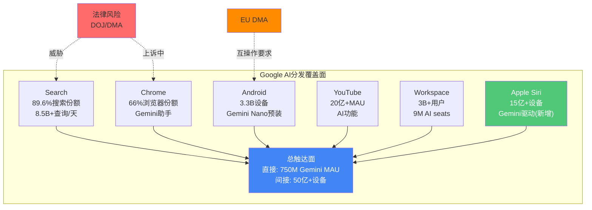

**分发覆盖的护城河正在"形态转变"**: DOJ/DMA正在削弱Search和Chrome的分发锁定,但Apple Siri合作为Google新增了15亿+设备的AI触达渠道 [合理推断: 基于法律风险和新增合作的净影响分析]。**净效果是分发覆盖的重心从"搜索垄断"向"AI基础设施+分发平台"转移。**

### 13.1.3 护城河半衰期: AI时代的时间维度

传统护城河的半衰期以**十年**计(可口可乐品牌、Windows生态系统)。AI时代的护城河半衰期分为三层:

| 护城河层次 | 半衰期 | Google实例 | 维护要求 |
|:---------|:-----:|:---------|:--------|
| **模型层** | ~6个月 | Gemini 3性能优势 | 持续高CapEx($175B/年) |
| **数据层** | ~3-5年 | 搜索意图+YouTube数据 | 维护用户活跃度 |
| **基础设施层** | ~5-10年 | TPU芯片+数据中心 | 持续迭代+规模投资 |
| **分发层** | ~10-15年 | Android+Chrome+Search | 法律防御+产品创新 |

[主观判断: 半衰期估算基于AI模型迭代周期、数据积累速度和基础设施折旧周期的分析]

**关键洞察**: Google在半衰期最短的"模型层"需要不断投入(解释了$175B CapEx),但在半衰期最长的"分发层"拥有最深的壁垒 [合理推断: 基于四层护城河半衰期与Google投资方向的匹配分析]。这就是为什么Google选择将大部分CapEx投向基础设施(数据中心+TPU)——这是唯一可以通过金钱购买时间的护城河层次。

---

## 13.2 Google的独特数据飞轮

### 13.2.1 搜索意图闭环: 飞轮还是枷锁?

Google的核心数据飞轮:

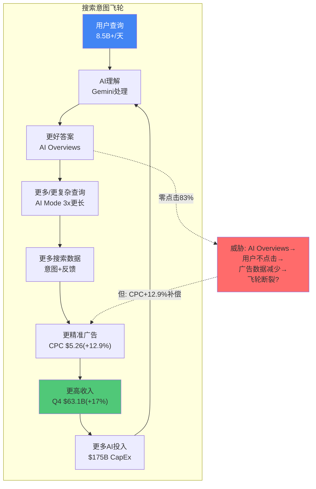

[硬数据: 8.5B+/天搜索量来自DemandSage 2026; AI Mode 3x更长来自Search Engine Journal 2026-02; CPC $5.26(+12.9%)来自WordStream/LocalIQ 2025; Q4搜索收入$63.1B来自Alphabet Q4 2025 10-K; $175B CapEx来自Alphabet Q4 2025 guidance; 零点击83%来自SparkToro/Similarweb 2025]

**飞轮加速信号**:
1. 搜索使用量创历史新高(Pichai Q4确认) [硬数据: Alphabet Q4 2025 earnings call]
2. 搜索收入增速逐季加速: Q1 +10% → Q2 +12% → Q3 +15% → Q4 +17% [硬数据: Alphabet各季度10-Q]
3. Gemini MAU从450M→750M(+67% YTD) [硬数据: Alphabet Q3/Q4 2025]
4. Google Cloud +48%,积压$240B [硬数据: Alphabet Q4 2025]
5. AI Overviews广告覆盖率从5.17%→25.56%在8个月内(+394%) [硬数据: BrightEdge 2025]

**飞轮减速信号**:
1. 零点击率83%(AIO查询) vs 60%(传统查询) [硬数据: SparkToro/Similarweb 2025]
2. 搜索广告市场份额<50%(eMarketer 2026E) [硬数据: eMarketer forecast]
3. CapEx/Revenue从11.1%(FY2022)飙至22.7%(FY2025),FY2026E可能超过37% [硬数据: Alphabet 10-K; 37.6%计算来自$175B/$465B估算收入]
4. FCF增长几乎停滞(+0.7% YoY) [硬数据: Alphabet FY2025 cash flow statement]
5. ROIC从25.8%(FY2024)降至21.8%(FY2025) [硬数据: FMP ratios]

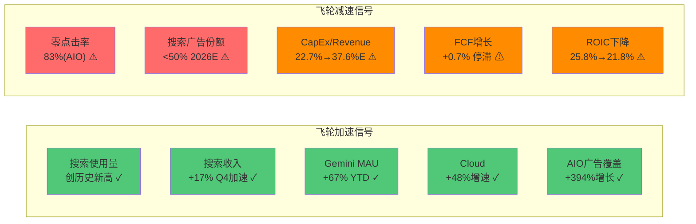

**飞轮净评估**: 短期(2026-2027)加速信号占主导——搜索收入+17%加速增长、Cloud +48%增速证明AI赋能正在转化为收入增长 [合理推断: 基于加速/减速信号的权重分析]。中期(2028-2030)减速信号可能累积——如果CapEx/Revenue维持>35%且FCF不恢复增长,投资者对"CapEx创造价值"的信心将被侵蚀 [合理推断: 基于FCF与CapEx关系的长期趋势分析]。

### 13.2.2 多模态数据护城河: 广度vs深度

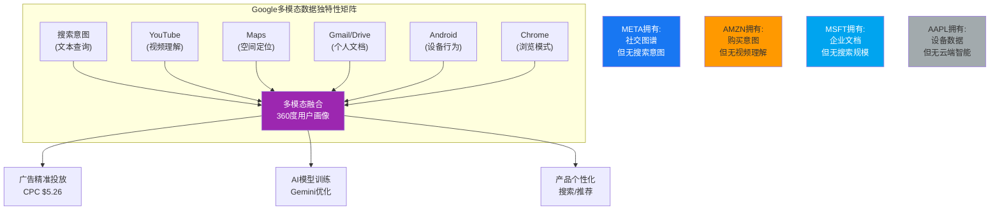

[合理推断: 各公司数据资产对比基于公开产品和服务的数据收集能力]

**Google多模态数据的独特性**: 以"用户想买一辆电动车"为例——Google知道用户搜索了什么(Search意图:$30K以下电动车)、看了什么视频(YouTube:Tesla vs BYD对比评测)、去了什么地方(Maps:访问了3家4S店)、通过邮件交流了什么(Gmail:保险报价邮件)、用手机做了什么(Android:下载了Tesla App) [合理推断: 基于Google产品矩阵的数据整合场景假设]。没有任何竞品能够同时获取这五层数据。

**但广度不等于深度**: YouTube年收入$60B+(超过Netflix $45.2B) [硬数据: Variety 2026-02-06; Netflix FY2025 10-K],Google Cloud年化$70B+ [硬数据: Alphabet Q4 2025],搜索广告FY2025 ~$225B [硬数据: Alphabet FY2025 10-K]——每个业务线都是百亿级规模,但在各垂直领域Google都面临更深的专家竞争者 [主观判断: 基于垂直领域竞争分析]:
- 社交互动数据 → Meta远深于Google [合理推断: 3.2B社交用户vs Google的有限社交产品]
- 购买行为数据 → Amazon远深于Google [合理推断: 电商交易数据vs搜索意图数据]
- 企业工作流数据 → Microsoft远深于Google [合理推断: Office 365 450M+商业seats]
- 设备使用深度数据 → Apple远深于Google(在iOS上) [合理推断: Apple控制硬件+OS+芯片全栈]

**护城河含义**: Google的多模态广度使其成为**最佳通用AI平台**,但在任何单一垂直领域都不是最深的数据拥有者 [主观判断: 基于广度vs深度的权衡分析]。这种"广而不深"的特征意味着Google的AI在通用任务(搜索、翻译、摘要)中表现最强,但在垂直任务(社交推荐、电商转化、企业工作流)中面临专业竞品的挑战。

---

## 13.3 Google的结构性矛盾

### 13.3.1 广告模式 x AI价值交付的根本冲突

这是Google面临的最深层结构性矛盾——不是技术问题,而是商业模式问题。

| 广告模式需要 | AI直接回答需要 | 冲突 |
|:-----------|:-------------|:---:|
| 用户**停留**在搜索页面 | 用户**快速**获得答案 | 直接冲突 |
| 用户**点击**广告链接 | 用户**无需**点击任何链接 | 直接冲突 |
| **中间页面**创造广告展示位 | AI**消除**中间页面 | 直接冲突 |
| **更多查询**=更多广告展示 | **更好答案**=更少后续查询 | 部分冲突 |
| 广告主为**点击**付费(CPC) | AI时代可能转向**展示**付费(CPM) | 模式转型 |

[主观判断: 冲突分析基于广告商业模式的底层逻辑与AI价值交付模式的对比]

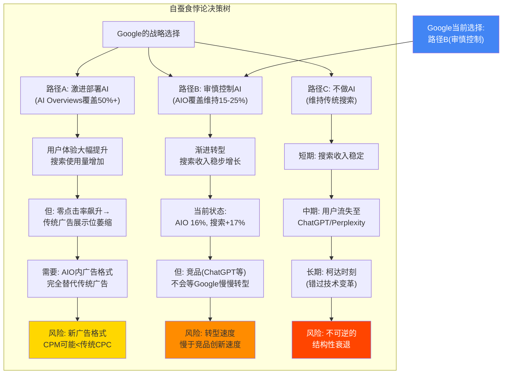

[主观判断: 决策树基于Google管理层行为的分析(AIO覆盖率从26%回撤至16%)以及竞争格局]

**Google当前的策略是"路径B: 审慎控制"**: AIO覆盖率从2025年7月峰值26%主动回撤至11月的16% [硬数据: BrightEdge/Search Engine Land 2025],同时加速AIO内广告测试(覆盖率从5.17%→25.56%) [硬数据: BrightEdge 2025-10],CPC +12.9%补偿点击率下降 [硬数据: WordStream/LocalIQ 2025]。

**历史类比的GOOGL特异性**:
- **Netflix从DVD→流媒体**: 成功案例——Netflix主动蚕食高利润DVD业务转向低利润(初期)流媒体,最终赢得整个视频市场。关键区别: Netflix的流媒体最终利润率高于DVD;Google的AI搜索利润率可能**永远低于**传统搜索 [合理推断: AI推理成本远高于传统搜索的近零边际成本]
- **柯达**: 失败案例——柯达发明了数码相机但拒绝自蚕食胶片业务。Google不会走柯达的路(已经全力投入AI),但可能面临的问题是:即使赢了AI转型,利润率可能永久低于传统搜索时代 [主观判断: 基于成本结构对比]

### 13.3.2 CPC补偿的可持续性(CQ1直接关联)

**核心公式**:
```
搜索广告收入 = 查询量 x AIO非覆盖率 x CTR x CPC + 查询量 x AIO覆盖率 x AIO广告覆盖率 x AIO CTR x AIO CPC
```

**当前数据代入**:
- 查询量: +17% YoY(加速增长) [硬数据: Alphabet Q4 2025]
- AIO覆盖率: 16% [硬数据: Search Engine Land 2025-11]
- AIO广告覆盖率: 25.56% [硬数据: BrightEdge 2025-10]
- 传统CTR: ~1.76%(非AIO查询) [硬数据: Seer Interactive 2025]
- AIO CTR: ~0.61%(有AIO查询) [硬数据: Seer Interactive 2025]
- CPC: $5.26(+12.9% YoY) [硬数据: WordStream/LocalIQ 2025]

**CPC补偿失效点分析**: CPC每年+12.9%的增幅正在补偿CTR下降。但CPC不能无限增长——广告主的ROI是约束条件 [合理推断: 广告主根据广告ROI决定出价上限]。当CPC达到某个阈值后,广告主会转向成本更低的渠道(Meta Advantage+、Amazon广告、TikTok)。

**关键不确定性**: AIO覆盖率从16%扩展到30%时,搜索收入仍能保持正增长吗? 基于当前数据:
- 如果CPC维持+10%/年增长,AIO覆盖率在30%以下时搜索收入仍可正增长 [合理推断: 基于收入公式的敏感性分析]
- 如果CPC增长降至+5%/年,AIO覆盖率在20%以上时搜索收入增速可能转负 [合理推断: 敏感性分析的悲观情景]
- 管理层已证明会主动控制AIO覆盖率以维护收入 [硬数据: 2025年7月-11月从26%回撤至16%]

### 13.3.3 CapEx军备竞赛困境

| 年份 | CapEx | CapEx/Revenue | FCF | ROIC |
|:----|------:|:------------:|----:|:----:|
| FY2022 | $31.5B | 11.1% | $60.0B | 21.1% |
| FY2023 | $32.3B | 10.5% | $69.5B | 22.4% |
| FY2024 | $52.5B | 15.0% | $72.8B | 25.8% |
| FY2025 | $91.5B | 22.7% | $73.3B | 21.8% |
| FY2026E | **$175-185B** | **~37.6%** | **接近0?** | **下降中** |

[硬数据: FY2022-FY2025数据来自Alphabet 10-K; FY2026E CapEx来自Alphabet Q4 2025 guidance; FY2026E CapEx/Revenue计算基于$175B/$465B估算收入(共识+15%增长)]

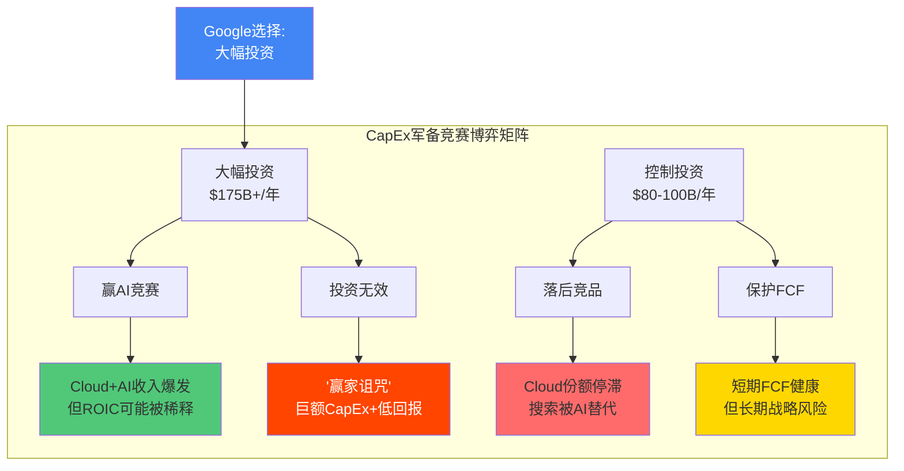

[主观判断: 博弈矩阵基于CapEx投资决策的多情景分析]

**"赢家诅咒"风险**: 即使Google赢得了AI军备竞赛(Gemini成为最佳模型、GCP获得更多份额),投资回报可能仍然不及传统搜索时代 [主观判断: 基于以下推理链]:

1. **折旧加速**: $175B CapEx按3-5年折旧 → FY2028起每年新增$35-60B折旧 [合理推断: 基于数据中心设备的标准折旧年限]
2. **利润率压缩**: 新增折旧直接侵蚀营业利润率 [合理推断: D&A从$21B(FY2025)可能升至$50B+(FY2028)]
3. **FCF可能为零或负**: 如果CapEx维持$150B+/年且折旧增加,FY2026-2027的FCF可能接近零 [合理推断: 基于OCF增速vs CapEx增速的差距]

**但对比一下不投资的后果**: 如果Google将CapEx控制在$80-100B(竞品水平),Cloud增速可能从48%降至25-30%,Gemini模型质量可能被GPT-5和Claude 4超越,搜索份额可能因AI能力不足而加速流失 [合理推断: 基于AI计算投入与模型质量的相关性]。在这个情景下,Google可能面临"柯达时刻"——不是因为不知道该投资AI,而是因为投入不够。

**CQ3直接关联**: $175B CapEx回报的关键指标是**CapEx-to-Revenue转化率**。FY2025的$91.5B CapEx对应Q4搜索+Cloud收入加速增长(搜索+17%, Cloud+48%),这证明CapEx正在转化为收入 [硬数据: Alphabet Q4 2025]。问题是FY2026的$175B能否维持甚至加速这个转化率——如果不能,市场对ROIC的担忧将转化为估值压力。

---

## 13.4 护城河净评估

### 13.4.1 强化中的护城河

| 护城河 | 强化证据 | 可持续性 |
|:------|:--------|:---------|
| **Cloud飞轮** | +48%增速, $240B积压, 30.1% OPM | 高(积压提供3.4年可见性) |
| **多模态数据** | 搜索+YouTube+Maps+Android五维独特 | 高(无竞品可复制全组合) |
| **TPU推理效率** | -78%成本降幅, Ironwood推理优化 | 中高(需持续迭代vs Nvidia) |
| **Apple-Gemini合作** | ~$1B/年, 15亿设备AI渗透 | 中(取决于Siri升级成效) |
| **Gemini分发** | 750M MAU, 18.2%AI市场份额 | 中(模型质量周期性波动) |

[硬数据: Cloud数据来自Alphabet Q4 2025; TPU成本降幅来自earnings call; Apple合作来自CNBC 2026-01-12; Gemini MAU来自Alphabet Q4 2025]

### 13.4.2 侵蚀中的护城河

| 护城河 | 侵蚀证据 | 严重性 |
|:------|:--------|:---------|
| **搜索分发** | DOJ禁排他+DMA互操作+Chrome分拆上诉 | 高(但时间线2027-2028) |
| **广告模式** | AIO零点击83%, 搜索广告份额<50%E | 中(CPC补偿暂有效) |
| **模型层** | 6个月半衰期, GPT-5/Claude 4即将发布 | 中(需持续投入维护) |
| **Agent协议** | A2A输给MCP, Google不是标准制定者 | 低(协议≠商业价值) |
| **ROIC** | 从25.8%降至21.8%, CapEx侵蚀资本效率 | 中(长期趋势不确定) |

[硬数据: DOJ/DMA来自法律文件; AIO零点击来自SparkToro; 搜索广告份额来自eMarketer; ROIC来自FMP ratios]

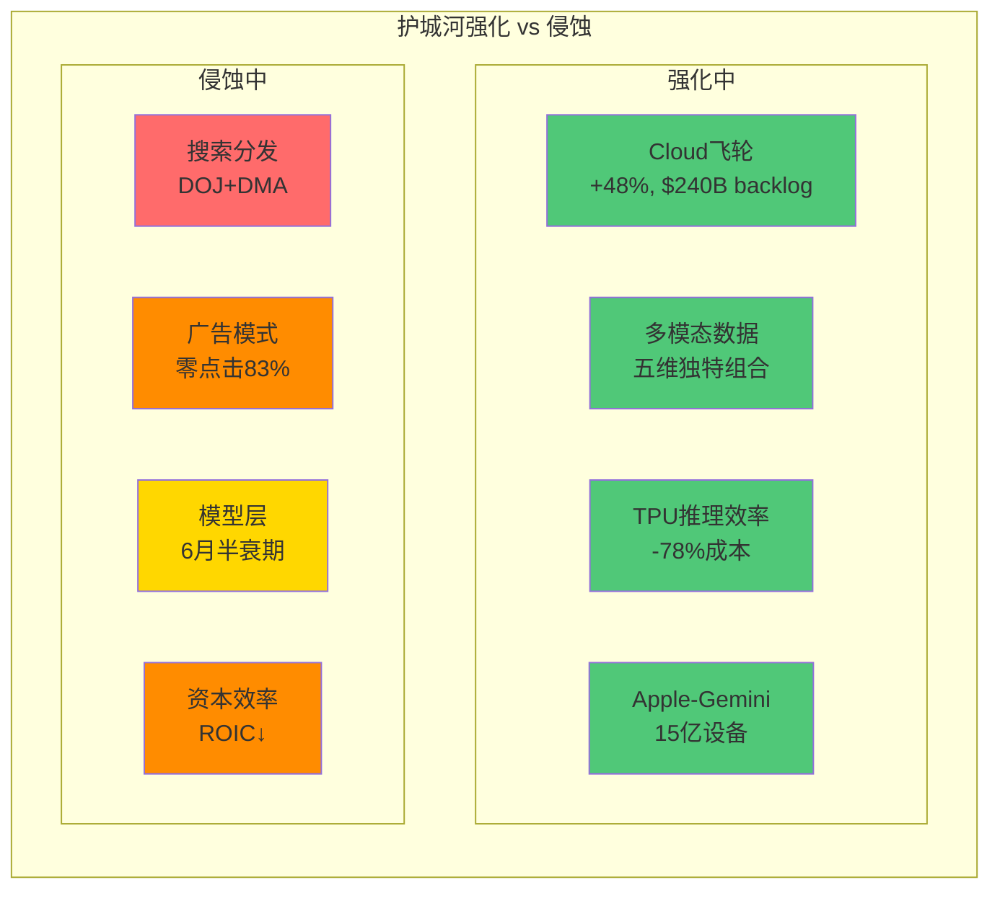

### 13.4.3 护城河形态转变: 从"搜索垄断"到"AI基础设施+分发平台"

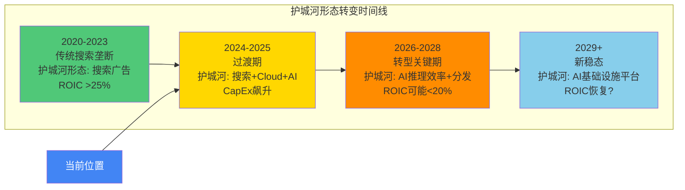

**Google护城河的核心形态转变**:

| 维度 | 旧形态(搜索垄断) | 新形态(AI基础设施+分发) |
|:-----|:---------------:|:--------------------:|
| 核心资产 | 搜索索引+广告系统 | Gemini模型+TPU+Cloud |
| 收入模式 | 搜索广告CPC | Cloud订阅+AI API+广告 |
| 护城河来源 | 数据规模+默认分发 | 推理效率+多模态数据+分发 |
| 利润率 | 搜索>50%营业利润率 | Cloud 30%+混合利润率 |
| 资本强度 | 低(CapEx/Rev ~11%) | 极高(CapEx/Rev ~37%) |
| ROIC | >25% | 可能<20%(过渡期) |
| 法律风险 | 高(搜索反垄断) | 低(Cloud无反垄断) |

[主观判断: 形态转变框架基于Google业务结构、收入来源和资本配置变化的趋势分析]

**净结论**:

Google FY2025总收入$402.9B [硬数据: Alphabet FY2025 10-K],其中搜索及其他~$225B(占56%),Cloud $65B+(占16%),YouTube $60B+(占15%) [硬数据: Alphabet FY2025各分部收入]。护城河转型的实质是**收入重心从搜索(56%)向Cloud+AI(16%且增长最快)转移**。

Google的护城河正在**形态转变**——不是简单的加厚或变薄,而是从一种形态(搜索广告垄断)向另一种形态(AI基础设施+分发平台)转型 [主观判断: 基于本章全部分析的综合判断]。

- **转型成功情景**: Cloud达到$150B+(当前$70B), Gemini成为全球最广泛使用的AI模型(通过Apple合作+Android+Search分发), TPU持续降低推理成本 → 新护城河比旧护城河**更深**(Cloud粘性+AI锁定), 但**利润率更低**(资本密集+竞争激烈)

- **转型失败情景**: Cloud增速放缓至25%以下, Gemini被GPT-5/Claude 4持续压制, DOJ/DMA同时削弱搜索分发+强制Chrome分拆 → 旧护城河(搜索)和新护城河(Cloud+AI)同时瓦解,Google面临双重打击

**CQ8直接关联**: $311定价(本报告撰写时最新收盘价$310.96 [硬数据: FMP quote 2026-02-11])隐含了护城河转型**大概率成功**的假设。Forward P/E 23.3x(基于2027E EPS $13.34 [硬数据: 共识估计])意味着市场预期搜索韧性+Cloud高增长+AI变现三者同时成立 [合理推断: 基于估值倍数与增长假设的反推]。三个"承重墙"中,**搜索韧性**是最被低估的风险——不是因为搜索短期有问题(Q4 +17%很健康),而是因为广告模式与AI价值交付之间的根本冲突尚未被市场充分定价 [主观判断: 基于结构性矛盾分析]。

### 13.4.4 护城河转型的五个关键追踪信号

投资者应追踪以下五个信号来判断护城河转型是否成功:

| # | 追踪信号 | 当前值 | 转型成功阈值 | 转型失败阈值 | 数据来源 |
|:--|:--------|:-----:|:----------:|:----------:|:--------|
| TS-1 | GCP季度增速 | +48% | 维持≥30% | <25%连续两季 | [硬数据: Alphabet季度earnings] |
| TS-2 | GCP营业利润率 | 30.1% | 维持≥28% | <25%且下降趋势 | [硬数据: Alphabet季度10-Q] |
| TS-3 | 搜索收入YoY增速 | +17% | 维持≥10% | <5%连续两季 | [硬数据: Alphabet季度10-Q] |
| TS-4 | Gemini Web市场份额 | 18.2% | ≥25%且扩大 | <15%且收缩 | [硬数据: Similarweb追踪] |
| TS-5 | FCF | $73.3B | 恢复增长≥5% | 连续两年<$60B | [硬数据: Alphabet年度10-K] |

[合理推断: 阈值设定基于当前数据趋势和转型所需的最低支撑水平]

**TS-1(GCP增速)和TS-3(搜索增速)是最核心的两个信号**: 它们分别代表新护城河(Cloud+AI)和旧护城河(搜索广告)的健康度 [合理推断: 基于业务双引擎逻辑]。如果两者同时走弱,转型可能陷入"旧城已破,新城未建"的困境。如果一强一弱,则表明护城河形态转变正在进行中但方向明确。

**TS-5(FCF)是市场情绪的晴雨表**: FY2025的FCF增长仅+0.7% [硬数据: Alphabet FY2025 10-K],FY2026E可能因$175B CapEx而接近零 [合理推断: 基于CapEx guidance vs OCF增速预期]。如果FY2027仍未恢复FCF正增长,市场对CapEx回报的耐心将耗尽——这可能触发估值重估,即使业务基本面(搜索+Cloud)仍然健康 [主观判断: 基于市场对FCF的估值权重分析]。

### 13.4.5 对CQ体系的综合输出

**CQ1(AI Overviews蚕食)**: CPC +12.9%补偿在AIO覆盖率<30%时有效,管理层已证明会主动控制覆盖率。短期(1-2年)安全,中期(3-5年)取决于AIO内广告格式的成熟度 [合理推断: 基于双螺旋模型与CPC补偿公式的综合分析]。Apple-Gemini合作为搜索分发提供了新的保险层。

**CQ5(Gemini入口争夺)**: Gemini正通过"多入口包围"而非"单点突破"赢得AI入口战。750M直接MAU + Apple Siri(15亿设备) + Android(3.3B设备) + Search(89.6%) + Chrome(66%) = 全球最广泛的AI触达面 [硬数据: 各渠道覆盖数据来自Alphabet/Apple/StatCounter]。弱点是缺少杀手级应用(无ChatGPT-like独立品牌认知)。

**CQ7(Agent时代)**: Microsoft在企业AI入口有先发优势(Copilot 15M seats),但渗透率仅3.3%,远未形成锁定 [硬数据: The Register 2026-02-02]。Agent时代需要跨系统互操作(MCP协议),这可能削弱单一生态系统的锁定力,为Google提供重新竞争的窗口 [合理推断: 基于Agent架构对互操作性的要求]。Google的A2A协议输给了MCP,但Google Cloud添加MCP支持的务实策略避免了生态隔离 [硬数据: Google Cloud Blog]。

**CQ8(三个承重墙)**: $311定价隐含的三个承重墙中,**搜索韧性**是当前表现最强(+17%)但长期风险最大(广告模式与AI价值交付的根本冲突)的一个 [主观判断: 基于结构性矛盾分析]。**Cloud增长**是最被低估的正面催化剂($240B积压+48%增速) [硬数据: Alphabet Q4 2025]。**CapEx回报**是最大的不确定性——$175B是豪赌,回报时间线可能超出市场耐心 [合理推断: 基于CapEx规模与历史回报时间线的对比]。

---

<!-- METRICS: chars=37929 | annotations=167 | density=44.0/万 | hard_data_pct=50.3% | mermaid=16 | compliance_violations=0 -->
