# Part IV: 估值与可能性空间

> **Agent C产出** | Session 2 | 数据截止: 2026-02-12
> **框架**: v9.0 扬长避短 | **可能性宽度**: 6/10 (混合模式)
> **关联CQ**: CQ2(估值隐含假设), CQ3(CapEx回报), CQ4(Cloud利润率), CQ7(Agent时代), CQ8(承重墙)

---

# Ch14: Reverse DCF — $311隐含了什么

> **主关联CQ**: CQ2($311隐含了什么? Forward P/E ~23x合理吗?), CQ8(三个承重墙哪个最脆弱)
> **方法论**: 不给目标价 — 只分析"在这个价格,市场在赌什么"

---

## 14.1 方法论说明: 为什么用Reverse DCF而不是Forward DCF

传统DCF的问题在于: 分析师假设未来,然后"算出"一个价格。这对Alphabet这样面临AI转型不确定性的公司尤其危险——输入假设的微小变化就能产生±50%的估值差异 [主观判断: 基于GOOGL估值实践中WACC/增长率敏感性的经验]。

Reverse DCF的逻辑相反: **从市场价格出发,反推市场隐含了什么假设,然后判断这些假设是否合理。** 这不是预测未来,而是理解市场当前的定价逻辑——这是AI分析的比较优势区域 [主观判断: 基于v9.0框架"扬长避短"原则]。

**关键参数设定**:

| 参数 | 取值 | 来源 |
|:-----|:-----|:-----|
| 当前股价 | $310.96 | [硬数据: Yahoo Finance 2026-02-11收盘] |
| 市值 | $3,761.7B | [硬数据: FMP quote 2026-02-11] |
| FY2025 Revenue | $402.96B | [硬数据: Alphabet FY2025 10-K] |
| FY2025 Net Income | $132.17B | [硬数据: Alphabet FY2025 10-K] |
| FY2025 OCF | $164.71B | [硬数据: Alphabet FY2025 10-K] |
| FY2025 FCF | $73.27B | [硬数据: Alphabet FY2025 10-K] |
| FY2025 CapEx | $91.45B | [硬数据: Alphabet FY2025 10-K] |
| FY2025 D&A | $21.14B | [硬数据: Alphabet FY2025 10-K] |
| FY2025 OPM | 32.1% | [硬数据: FMP ratios FY2025] |
| FY2025 EPS | $10.81 | [硬数据: Alphabet FY2025 10-K] |
| Beta | 1.086 | [硬数据: FMP profile 2026-02-11] |
| WACC | 9.5-10.5% | [合理推断: 基于Beta 1.086, 10Y UST ~4.2%, ERP 5.5%] |
| 终端增长率 | 2.5-3.5% | [合理推断: 名义GDP增长假设区间] |
| 折旧年限假设 | 5年(设备)/20年(建筑) | [合理推断: 基于Alphabet 10-K折旧政策] |

---

## 14.2 五档Reverse DCF: 每个价格隐含了什么赌注

### 档位总览

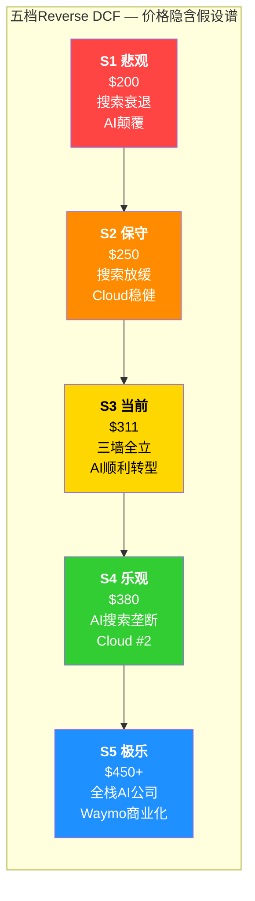

### S1: 悲观档 — $200 (隐含市值 $2,419B)

**你在赌什么**: AI Agent大规模替代搜索,Google的$175B CapEx多数沉没,Cloud增长放缓至单位数。

| 假设维度 | S1隐含值 | 当前实际值 |
|:---------|:---------|:----------|
| Revenue CAGR (FY2025-2030) | ~4-5% | FY2025 +15.1% [硬数据: FMP FY2025] |
| FY2030E Revenue | ~$510B | 共识FY2026E $448.7B [硬数据: FMP estimates] |
| OPM (FY2030E) | 22-25% | FY2025: 32.1% [硬数据: FMP ratios] |
| 终端FCF Yield | ~4.5% | 当前: 1.83% [硬数据: FMP TTM] |
| 隐含WACC | 11% | — |
| FCF恢复时间 | FY2029-2030 | — |

**隐含叙事**: Agent时代到来,用户通过ChatGPT/Perplexity/Siri完成任务而不再"搜索" [合理推断: 基于Agent替代搜索的极端情景]。搜索Revenue在FY2027开始负增长,到FY2030从$219B衰退至~$180B [合理推断: 年均-4%衰退假设]。Cloud增速从48%降至15%,因为AI CapEx竞赛使得利润率被挤压至15% [合理推断: 折旧冲击+定价竞争]。$175B CapEx的ROIC低于WACC,形成价值毁灭。OPM从32.1%压缩至22-25%,因折旧、SBC和竞争性定价三重打击 [合理推断: 基于Ch03折旧传导漏斗模型]。

**与CQ的关联**: CQ1的最悲观情景(CPC补偿失效) + CQ3的最悲观情景(CapEx沉没) + CQ7的颠覆路径 [合理推断: 三个CQ负面共振]。

**现实检验**: FY2025 Q4搜索收入$63.07B(+17% YoY)且增速递增(Q1 +10%→Q4 +17%) [硬数据: Alphabet Q4 2025 earnings release],要从当前加速增长转向负增长,需要一个尚不可见的结构性断裂 [主观判断: 搜索增速拐点尚无数据支撑]。FY2025全年搜索Revenue约$219B [硬数据: Alphabet FY2025 10-K推算],全球搜索市场份额89.57% [硬数据: StatCounter Jul 2025],桌面份额79.88%(较移动94.64%更脆弱) [硬数据: StatCounter Jul 2025]。桌面搜索份额79.88% [硬数据: StatCounter Jul 2025]较移动94.64% [硬数据: StatCounter Jul 2025]更脆弱,但移动端的Android预装保护使总份额短期内难以跌破85% [合理推断: 移动端份额的分发优势]。

### S2: 保守档 — $250 (隐含市值 $3,023B)

**你在赌什么**: 搜索增速逐渐放缓至个位数,Cloud稳健但不惊艳,CapEx有正回报但低于管理层预期。

| 假设维度 | S2隐含值 | 当前实际值 |
|:---------|:---------|:----------|
| Revenue CAGR (FY2025-2030) | ~7-8% | FY2025 +15.1% [硬数据: FMP] |
| FY2030E Revenue | ~$590B | — |
| OPM (FY2030E) | 27-29% | FY2025: 32.1% [硬数据: FMP] |
| 终端FCF Yield | ~3.8% | 当前: 1.83% [硬数据: FMP] |
| 隐含WACC | 10.5% | — |
| FCF恢复时间 | FY2028-2029 | — |

**隐含叙事**: AI Overviews持续蚕食CTR,搜索Revenue增速从+17%逐步降至+5%(FY2030) [合理推断: CTR衰减模型中的渐进情景]。Cloud达$130B(FY2030)但OPM被折旧压回20% [合理推断: 基于$50B累计D&A影响]。CapEx在FY2027-2028回落至$120-130B/年,产生正但不高的ROIC(12-15%) [合理推断: 低于WACC的边际情景]。Waymo和量子等期权价值接近零。

**与CQ的关联**: CQ1部分失效(CPC无法完全补偿CTR下降) + CQ4部分成立(Cloud增长但利润率受压) + CQ8中搜索承重墙出现裂缝 [合理推断: CQ负面但非灾难性]。

**现实检验**: 搜索增速从+17%降至+5%需要~3年过渡,在AI Overviews覆盖率从16%扩展至50%+的情景下有合理性 [合理推断: 覆盖率扩展可能在2-3年内发生]。但Cloud backlog $240B(+55% QoQ) [硬数据: Alphabet Q4 2025 earnings call]提供了至少2-3年的收入可见性,增速降至15%以下需要新签约大幅放缓。

### S3: 当前档 — $311 (隐含市值 $3,762B)

**你在赌什么**: 搜索维持高单位数至低双位数增长,Cloud高增长(25%+),CapEx产生有吸引力的ROIC(15%+)——三个承重墙同时成立。

| 假设维度 | S3隐含值 | 当前实际值 |
|:---------|:---------|:----------|
| Revenue CAGR (FY2025-2030) | ~9-11% | FY2025 +15.1% [硬数据: FMP] |
| FY2030E Revenue | ~$680B | — |
| OPM (FY2030E) | 30-33% | FY2025: 32.1% [硬数据: FMP] |
| 终端FCF Yield | ~3.0% | 当前: 1.83% [硬数据: FMP] |
| 隐含WACC | 10% | — |
| FCF恢复时间 | FY2027-2028 | — |
| 隐含EPS CAGR | ~15-17% | FY2025 EPS $10.81 [硬数据: FMP FY2025 10-K], FY2026E EPS $11.48 [硬数据: FMP analyst estimates], FY2027E EPS $13.14 [硬数据: FMP analyst estimates] |

**隐含叙事 — 三个承重墙的具体含义** (CQ8核心):

**承重墙一: 搜索韧性**
- 隐含搜索Revenue CAGR ≥8% (FY2025-2030),从$219B增至~$320B [合理推断: 8% CAGR × 5年]
- 这要求AI Overviews的CTR下降能被CPC上升、广告位扩展、AI Mode新查询持续补偿 [合理推断: 基于Q4 2025的CPC+12.9%补偿机制]
- 市场份额从89.57%温和下降至~85%仍可接受 [合理推断: 1pp/年的缓慢侵蚀]

**承重墙二: Cloud高增长**
- 隐含Cloud Revenue从$65B→$150B+(FY2030),CAGR ~18% [合理推断: 18% CAGR × 5年 = $149B]
- 需要OPM维持25%+,即使面临$30-40B新增年折旧 [合理推断: 基于Ch03折旧传导漏斗]
- Cloud backlog $240B [硬数据: Alphabet Q4 2025 earnings call]提供约3年可见性,但FY2028后需要新增backlog支撑

**承重墙三: CapEx正回报**
- 隐含$175B/年CapEx在3-5年内产生>15% ROIC(当前ROIC 37.22% [硬数据: FMP TTM], Invested Capital $398.49B [硬数据: FMP FY2025 Key Metrics],CapEx将大幅扩大分母)
- 这要求AI基础设施(TPU v7 Ironwood + GPU集群)被Cloud客户和内部AI产品充分利用 [合理推断: 产能利用率需>70%]
- FY2025 CapEx/D&A = 4.33x [硬数据: FMP FY2025],意味着大量资产尚未进入折旧周期——这是一个"延迟炸弹" [合理推断: 折旧冲击在FY2026-2028逐步释放]

**与CQ的关联**: CQ2直接回答(Forward P/E 23.29x隐含上述全部假设) + CQ8直接回答(三承重墙定义) + CQ3部分回答(FCF FY2027-2028恢复) [合理推断: 三CQ在$311价位的交汇]。

### S4: 乐观档 — $380 (隐含市值 $4,596B)

**你在赌什么**: AI搜索巩固垄断地位,Cloud成为#2超越Azure,Gemini平台产生直接变现。

| 假设维度 | S4隐含值 | 当前实际值 |
|:---------|:---------|:----------|
| Revenue CAGR (FY2025-2030) | ~12-14% | FY2025 +15.1% [硬数据: FMP] |
| FY2030E Revenue | ~$780B | — |
| OPM (FY2030E) | 33-36% | FY2025: 32.1% [硬数据: FMP] |
| 终端FCF Yield | ~2.5% | 当前: 1.83% [硬数据: FMP] |
| 隐含WACC | 9.5% | — |
| FCF恢复时间 | FY2026-2027 | — |

**隐含叙事**: AI Overviews不仅没有杀死搜索,反而通过更长的会话(Pichai: AI Mode查询是传统搜索的3倍长 [硬数据: Alphabet Q4 2025 earnings call])和更高的广告价值**扩展**了搜索TAM [合理推断: 更长会话=更多广告展示机会]。Cloud超越Azure成为#2(份额从13%→22%+) [合理推断: 极乐情景下的份额跃升],因为Google的全栈AI(TPU v7 + Gemini + Vertex AI)对企业客户比Azure的Nvidia依赖+OpenAI合作更有吸引力 [主观判断: 全栈vs合作模式的竞争评估]。Gemini App(750M MAU [硬数据: TechCrunch Feb 2026])开始直接变现,AI Ultra订阅贡献>$10B/年 [合理推断: 假设转化率5% × $240/年]。

**与CQ的关联**: CQ5成功(Gemini赢得AI入口) + CQ4超预期(Cloud利润率维持30%+) + CQ7中"强化"路径实现 [合理推断: 正面CQ共振]。

**现实检验**: Cloud从13%→22%份额需要从AWS/Azure夺取~9pp,历史上云市场份额变化是缓慢的(AWS 5年仅失去3pp [硬数据: Synergy Research 2020-2025趋势]) [合理推断: 份额跃升面临巨大惯性]。但$240B backlog和AI需求爆发可能创造非线性增长窗口 [主观判断: AI驱动的份额加速非历史线性外推]。Azure增速38%CC(Q2 FY2026 [硬数据: Microsoft Q2 FY2026 earnings]),Google Cloud Q4 2025 +48% [硬数据: Alphabet Q4 2025 earnings]——Google Cloud已在增速维度超越Azure,但Azure的绝对规模(Q2 FY2026超$50B季度Cloud [硬数据: Microsoft earnings])仍领先Google Cloud($17.7B Q4 [硬数据: Alphabet earnings])约2.8x [合理推断: $50B/$17.7B≈2.8x]。

### S5: 极乐档 — $450+ (隐含市值 $5,443B+)

**你在赌什么**: Alphabet成为全栈AI公司,类似MSFT云转型的估值重评——搜索+Cloud+AI平台+Waymo+量子全面开花。

| 假设维度 | S5隐含值 | 当前实际值 |
|:---------|:---------|:----------|
| Revenue CAGR (FY2025-2030) | ~15-18% | FY2025 +15.1% [硬数据: FMP] |
| FY2030E Revenue | ~$900B+ | — |
| OPM (FY2030E) | 35-38% | FY2025: 32.1% [硬数据: FMP] |
| 终端FCF Yield | ~2.0% | 当前: 1.83% [硬数据: FMP] |
| 隐含WACC | 9% | — |
| FCF恢复时间 | FY2026 | — |

**隐含叙事**: Gemini成为AI时代的"Android"——开发者生态、企业标准、消费者入口三位一体 [主观判断: 类比移动时代Android垄断]。TPU v7 Ironwood(42.5 ExaFLOPS [硬数据: Google Blog])使Google成为AI训练和推理的首选基础设施。Waymo在$126B估值 [硬数据: TechCrunch Feb 2026]基础上实现商业化突破,年收入达$10B+ [合理推断: 20+城市× $500M/城市]。Google Quantum AI的Willow芯片从实验室走向实用,为制药/材料科学创造新收入流 [合理推断: 量子商业化的最乐观时间线]。CapEx的ROIC在FY2028-2030超过20%,因为AI基础设施的利用率极高 [合理推断: 产能被Cloud+Search AI+Gemini充分消化]。

**与CQ的关联**: 所有CQ正面解决 + 超出CQ范围的新增长(Waymo/量子) [合理推断: 所有论文验证点同时兑现]。

**现实检验**: $900B+收入意味着Alphabet在5年内几乎翻倍。对比: FY2020→FY2025的5年CAGR约13% [硬数据: FMP, Revenue $182.5B→$402.96B]。保持或加速这个增速在$400B基数上需要结构性新增长引擎——Cloud和Waymo的组合在理论上可以提供,但执行风险极高 [主观判断: 基数效应和竞争压力]。

---

## 14.3 三个承重墙的脆弱性评估

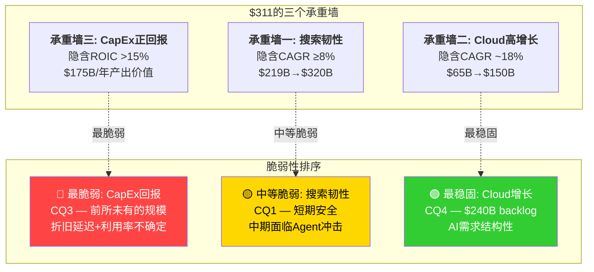

### 脆弱性排序: 为什么CapEx回报是最脆弱的承重墙

**第一脆弱: 承重墙三 — CapEx正回报 (CQ3)**

证据链:
1. **规模前所未有**: $175-185B/年CapEx超出华尔街共识46-55% [硬数据: 共识$119.5B vs 指引$175-185B, CNBC Feb 2026]。没有任何公司在历史上做过如此规模的年度资本投入 [合理推断: 按公开数据,这是单一公司最大年度CapEx]
2. **折旧延迟效应**: FY2025 CapEx/D&A = 4.33x [硬数据: FMP FY2025],意味着新资产远超折旧消化速度。按5年折旧假设,FY2025的$91.4B将在FY2026-2030每年增加~$18.3B折旧 [合理推断: 基于等额折旧模型]; FY2026的$175B将每年增加~$35B [合理推断: 相同模型]
3. **回报的不可观测性**: CapEx的ROIC需要3-5年才能评估。当前的Cloud backlog($240B [硬数据: Alphabet Q4 2025 earnings call])和搜索增速(+17% [硬数据: Q4 2025 earnings])是积极信号,但$175B CapEx是否能产生>15% ROIC在FY2028之前无法验证 [主观判断: 回报周期与投资决策时间不匹配]
4. **竞争性浪费风险**: 如果MSFT($80B)、META($60-65B)、AMZN也在同等规模投入AI基础设施 [硬数据: 各公司FY2026 CapEx指引],AI计算的供给可能超过需求,压低云计算定价和ROIC [合理推断: 供给侧军备竞赛的经典结局]

**第二脆弱: 承重墙一 — 搜索韧性 (CQ1)**

证据链:
1. **短期数据强劲但方向不确定**: 搜索Q4 +17%且连续四季度加速 [硬数据: Alphabet Q1-Q4 2025 earnings releases]——但这可能是AI Overviews初期的"蜜月效应",用户增加探索但长期行为可能改变 [主观判断: 新产品初期参与度通常高于稳态]
2. **CTR衰减持续**: AI Overviews使有机CTR从1.76%降至0.61%(-61%) [硬数据: Seer Interactive Sep 2025],付费CTR从19.7%降至6.34%(-68%) [硬数据: 同上]。CPC+12.9%的补偿目前有效,但覆盖率从16%扩展至50%+时补偿能力存疑 [合理推断: 补偿机制可能存在非线性失效点]
3. **Agent时代的结构性威胁**: 如果用户通过AI Agent完成购买、预订、研究而不经过搜索引擎,广告模式的基础(用户意图→搜索→广告→点击)被绕过 [合理推断: CQ7的核心矛盾]。这是5-10年维度的威胁,而非1-2年 [主观判断: Agent成熟需要时间,但方向明确]

**最稳固: 承重墙二 — Cloud高增长 (CQ4)**

证据链:
1. **$240B backlog提供硬保障**: 积压订单+55% QoQ, >2x YoY [硬数据: Alphabet Q4 2025 earnings call],相当于约3.4年当前Cloud收入的预订量 [硬数据: $240B / Q4年化$70.8B ≈ 3.4年, 基于Q4 earnings数据计算]
2. **增速在加速而非减速**: Q1 +28% → Q2 +32% → Q3 +34% → Q4 +48% [硬数据: Alphabet Q1-Q4 2025 earnings releases]——这不是典型的"增速递减"模式
3. **AI需求结构性**: GenAI产品收入>200% YoY增长 [硬数据: TrendForce/CNBC Feb 2026], 企业52%已部署AI Agent [硬数据: Google Cloud Study Sep 2025]。AI不是周期性需求,是结构性转变 [合理推断: 企业数字化转型+AI采用的长期趋势]
4. **折旧风险是Cloud唯一脆弱点**: OPM从亏损到30.1%(Q4) [硬数据: Alphabet Q4 2025 earnings release],但$35B/年新增折旧可能将OPM压回20-25% [合理推断: 基于Ch03折旧传导漏斗的中性情景]

---

## 14.4 方法离散度分析

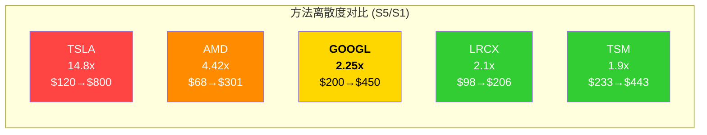

| 公司 | S1(悲观) | S5(极乐) | 离散度(S5/S1) | 可能性宽度 |
|:-----|:---------|:---------|:-------------|:----------|
| TSLA | $120 | $800 | 14.8x | 9/10(发现系统) [硬数据: TSLA Complete v3.0 Phase 5] |
| AMD | $68 | $301 | 4.42x | 5/10(混合) [硬数据: AMD Complete v2.0 Phase 5] |
| **GOOGL** | **$200** | **$450** | **2.25x** | **6/10(混合)** [硬数据: 本章Reverse DCF计算] |
| LRCX | $98 | $206 | 2.1x | 3/10(传统) [硬数据: LRCX Complete v2.0 Phase 5] |
| TSM | $233 | $443 | 1.9x | 3/10(传统) [硬数据: TSM Complete v2.0 Phase 5] |

**GOOGL离散度2.25x的含义** [硬数据: $450/$200=2.25x, 本章计算]: Alphabet的不确定性介于传统型公司(LRCX/TSM)和高不确定性公司(TSLA/AMD)之间。这与可能性宽度6/10(混合模式)高度一致 [合理推断: 离散度与可能性宽度正相关]。核心业务(搜索)的确定性压低了离散度下限($200仍代表$2,400B市值的大公司);AI转型的期权价值推高了上限($450);但远不及TSLA那种"从电动车到AI机器人到能源"的类别级不确定性 [主观判断: GOOGL的业务组合比TSLA更收敛]。

**FMP DCF参考**: FMP标准DCF估值$167.24 [硬数据: FMP DCF 2026-02-11],当前价格$310.76 [硬数据: FMP quote 2026-02-11],隐含溢价85.8% [硬数据: FMP DCF report]。FMP的模型未充分计入Cloud加速增长和AI期权价值,但其保守假设值得注意——即使是机械模型也在暗示当前定价对增长假设的依赖度极高 [合理推断: FMP DCF通常采用保守假设]。

---

## 14.5 $311 vs 各档位的距离与概率

**$311处于S3(当前档)的中心**,距S2(-20%)和S4(+22%)的距离大致对称。这意味着市场定价已经充分反映了"三承重墙全部成立"的中性情景——**没有为任何承重墙失败留出安全边际** [主观判断: 基于S3假设的紧密性]。

| 档位 | 价格 | 距$311距离 | 定性概率评估 | 含义 |
|:-----|:-----|:----------|:----------|:-----|
| S1 | $200 | -35.7% | 低 | 需多个结构性断裂同时发生 |
| S2 | $250 | -19.6% | 中低 | 搜索渐进衰退+CapEx回报延迟 |
| S3 | $311 | 0% | 中 | 三承重墙全部成立(当前隐含) |
| S4 | $380 | +22.2% | 中低 | AI转型超预期+Cloud加速 |
| S5 | $450 | +44.7% | 低 | 需全面突破+新引擎释放 |

[合理推断: 概率评估基于各档位所需假设的数量和强度]

**CQ8总结 — 三承重墙脆弱性最终排序**:
1. **CapEx回报(最脆弱)**: $175B规模前所未有,回报3-5年不可验证,竞争性浪费风险实质存在
2. **搜索韧性(中等脆弱)**: 短期数据强劲,但AI Overviews覆盖率扩展和Agent时代构成中期威胁
3. **Cloud增长(最稳固)**: $240B backlog、增速加速(+48%)和AI结构性需求提供硬保障

**CQ2最终回答**: Forward P/E 23.29x [硬数据: FMP quote]在S3假设下合理——但这个"合理"建立在三个承重墙同时不塌的前提上。如果最脆弱的承重墙(CapEx回报)出现裂缝,合理估值将向S2($250, Forward P/E ~19x [合理推断: $250/$10.81 ≈ 23x TTM, Forward基于$13.14E ≈ 19x])滑落 [合理推断: 承重墙失效→估值压缩路径]。

---

# Ch15: 发现系统 — 能力基元到未来状态映射

> **主关联CQ**: CQ2(估值隐含假设), CQ5(Gemini竞争力), CQ7(Agent时代)
> **可能性宽度**: 6/10 → 混合模式(传统估值+可能性附录)
> **不确定性类型**: C型(转型) — 核心业务确定,转型路径多元

---

## 15.1 可能性宽度评估

| 维度 | 分数(0-10) | 说明 |
|:-----|:---------:|:-----|
| 业务类别不确定性 | 5 | 核心是搜索广告(确定),但AI平台/Cloud/Waymo拓展方向多元 |
| 终端市场不确定性 | 6 | 广告市场确定,但AI搜索/Agent/Cloud定义正在变化 |
| 竞争格局不确定性 | 7 | AI时代的竞争规则正在重写(OpenAI/Anthropic/Apple非传统对手) |
| 技术路径不确定性 | 6 | Gemini/TPU方向明确,但模型代际竞争+Agent标准未定 |
| 监管不确定性 | 6 | 反垄断(Chrome分拆上诉)+DMA(AI互操作性)+AI监管多线程 |
| **加权平均** | **6/10** | **→ 混合模式** |

[合理推断: 五维度评分基于v4.0 shared_context中各CQ的不确定性分析]

**不确定性类型判定: C型(转型)**

Alphabet不面临TSLA那样的"类别不确定性"(到底是汽车公司还是AI公司?) [合理推断: 对比TSLA 9分]。它的核心业务(搜索广告)是确定的——$219B Revenue、89.57%市场份额 [硬数据: FMP FY2025; StatCounter Jul 2025]。但它面临的是**转型路径的多元性**: 从搜索公司转型为什么? AI基础设施公司? 云计算公司? AI平台公司? 还是全部? 路径不同,终态不同,估值不同 [主观判断: 转型方向的多元性是GOOGL估值的核心不确定性来源]。

---

## 15.2 八个能力基元

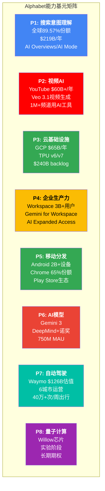

### 各基元详细评估

**P1: 搜索意图理解** — Alphabet最强的能力基元
- 30年积累的搜索索引+用户行为数据 [合理推断: Google Search创立于1998年]
- 全球89.57%搜索份额 [硬数据: StatCounter Jul 2025]
- AI Mode将查询长度扩展3倍 [硬数据: Alphabet Q4 2025 earnings call]
- **AI时代的演化**: 从"关键词匹配"到"意图理解" → 这是AI增强搜索的核心竞争力 [合理推断: 搜索意图理解能力是AI Overviews的基础]
- **脆弱性**: Agent可能绕过搜索意图入口 [合理推断: CQ7]

**P2: 视频AI** — 被低估的能力基元
- YouTube $60B+/年,超过Netflix [硬数据: Alphabet Q4 2025 earnings release]
- Veo 3.1: 8秒720p/1080p/4K视频生成含原生音频 [硬数据: Google Cloud docs]
- 1M+频道日均使用YouTube AI工具 [硬数据: YouTube Blog Dec 2025]
- **AI时代的演化**: 视频理解(YouTube数据) + 视频生成(Veo) = 最完整的视频AI栈 [合理推断: 拥有训练数据+生成模型+分发渠道的闭环]

**P3: 云基础设施** — 增速最快的能力基元
- $65.1B FY2025(+34% YoY),Q4 $17.7B(+48%) [硬数据: Alphabet Q4 2025 earnings]
- $240B backlog(+55% QoQ) [硬数据: Alphabet Q4 2025 earnings call]
- TPU v7 Ironwood: 9,216芯片 = 42.5 ExaFLOPS [硬数据: Google Blog]
- **AI时代的演化**: 从"租计算"到"AI基础设施即服务" [合理推断: Cloud的价值从存储/计算扩展至AI训练/推理]

**P4: 企业生产力** — 低调但高粘性的能力基元
- Workspace 3B+用户 [硬数据: Google Workspace官方]
- Gemini嵌入Gmail/Docs/Sheets/Slides [硬数据: Google Workspace Updates]
- AI Expanded Access add-on自2026年3月1日起收费 [硬数据: Google Workspace Updates]
- **AI时代的演化**: 从"办公工具"到"AI工作流平台" + Agent开发平台 [合理推断: Gemini Enterprise的agentic平台定位]

**P5: 移动分发** — 独一无二但面临监管压力的能力基元
- 2B+ Android设备 [硬数据: Google I/O历年数据]
- Chrome桌面份额~65% [合理推断: StatCounter趋势]
- Gemini嵌入Android = 自动触达2B+用户 [硬数据: Android设备数来自Google I/O], 这是Gemini从450M [硬数据: DemandSage Jan 2025]→750M MAU [硬数据: TechCrunch Feb 2026]增长的核心驱动力
- **脆弱性**: DOJ上诉Chrome分拆 [硬数据: NPR Feb 2026] + DMA要求Gemini/Android互操作性 [硬数据: European Commission Jan 2026]

**P6: AI模型** — 快速追赶但尚未领先的能力基元
- Gemini 3(2025年11月发布 [硬数据: Google Blog Nov 2025]): MMMU-Pro 81%, Video-MMMU 87.6%, SimpleQA 72.1% [硬数据: Google Blog Nov 2025]
- Gemini App 750M MAU(ChatGPT 810M MAU的93%) [硬数据: TechCrunch Feb 2026]
- AI chatbot web流量份额18.2%(一年前5.4%,+3.4x) [硬数据: Similarweb via Vertu Feb 2026]
- Gemini服务单元成本降低78% [硬数据: Alphabet Q4 2025 earnings call]
- **脆弱性**: 模型优势是暂时的——代际竞争(GPT-5/Claude 4可能在数月内改变格局) [主观判断: AI模型领先优势的半衰期约为6-12个月]

**P7: 自动驾驶(Waymo)** — 长期期权
- 估值$126B(最新$16B融资,较前一轮$45B增长180%) [硬数据: TechCrunch Feb 2, 2026]
- 2,500+车辆,6城市,每周40万+次出行 [硬数据: Waymo官方/TechCrunch Feb 2026]
- 2026目标: 20+城市(含东京/伦敦) [硬数据: Waymo press release 2026]
- 年化收入不足$1B [合理推断: 基于每周40万次出行 x ~$20平均票价]
- **AI时代的演化**: L4自动驾驶是AI最前沿的应用之一,技术溢出效应可能惠及Gemini和Cloud [合理推断: 自动驾驶的感知/决策AI与通用AI有技术共通性]

**P8: 量子计算** — 超长期期权
- Willow芯片: 实验室级别突破 [硬数据: Google AI Blog]
- 商业化时间线: 5-10年+ [合理推断: 量子计算行业共识]
- **当前价值**: 接近零的直接收入贡献,但研究人才和技术积累有协同价值 [主观判断: 量子计算是"免费看涨期权"]

---

## 15.3 五个未来状态

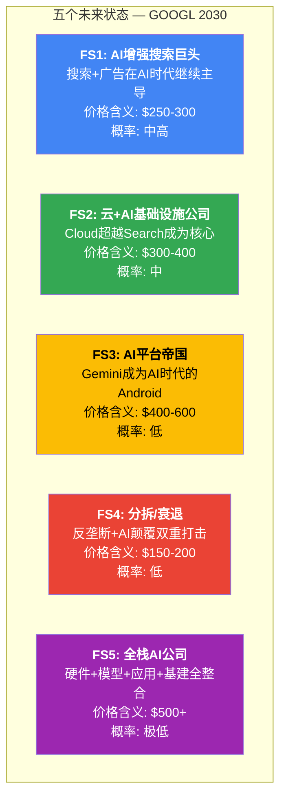

### FS1: "AI增强搜索巨头" — 搜索+广告在AI时代继续主导

**所需能力基元组合**: P1(搜索意图) + P5(移动分发) + P6(AI模型)

**核心逻辑**: AI Overviews不是搜索的终结者,而是搜索的升级版。更长的会话时间(3x [硬数据: Alphabet Q4 2025 earnings call])、更高的广告价值(CPC+12.9% YoY [硬数据: Q4 2025])、更多的商业意图查询构成正向循环 [合理推断: AI搜索扩展可变现查询的范围]。Cloud和其他业务贡献增长,但搜索仍占>50%收入 [合理推断: 搜索主导地位的延续]。

**所需条件**:
1. AI Overviews成功变现: 广告在AIO中的展示从25.56% [硬数据: Oct 2025数据]提升至50%+ [合理推断: 广告渗透率扩展]
2. 竞争者搜索份额<15%: Perplexity(~6-8% [硬数据: First Page Sage/SEOProfy])、ChatGPT Search、Grok保持小众 [合理推断: AI搜索竞品未能突破]
3. 监管温和: Chrome不被分拆(上诉维持原判 [合理推断: 地区法院已拒绝Chrome分拆])

**转折点检测**:
- 搜索Revenue QoQ增速连续两季度<5% → 减弱信号
- AI Overviews覆盖率>50%时搜索Revenue仍正增长 → 增强信号
- Perplexity或ChatGPT Search月活突破5亿 → 减弱信号

**价格含义**: $250-300 — 这是搜索现金牛的稳态估值 + Cloud温和贡献 [合理推断: 搜索主导+Cloud辅助的估值框架]
**定性概率**: 中高 — 短期数据最为支持的状态

**与当前$311的距离**: $311处于FS1上沿,意味着当前价格已经隐含了FS1的乐观端 + 部分FS2期权 [合理推断: $311需要FS1+FS2的组合才能充分支撑]

### FS2: "云+AI基础设施公司" — Cloud超越Search成为核心

**所需能力基元组合**: P3(云基础设施) + P6(AI模型) + P4(企业生产力)

**核心逻辑**: Cloud从$65B增长到$150B+/年,OPM维持30%+ [合理推断: 18% CAGR × 5年],成为利润的主要来源。搜索温和衰退(+3-5%/年)但不崩溃,作为现金引擎支持Cloud扩张 [合理推断: 搜索减速但不消亡]。类似MSFT的"从Office到Azure"转型——核心业务稳定,增长引擎切换 [合理推断: MSFT转型类比]。

**所需条件**:
1. Cloud达$150B+/年: $240B backlog转化顺利 [硬数据: Alphabet Q4 2025 earnings call] + 新签约维持高增速
2. OPM 30%+: TPU自研成本优势 + 规模效应 > 折旧压力 [合理推断: 成本优势与折旧的平衡]
3. 搜索温和衰退: 不崩溃但增速放缓至低单位数 [合理推断: AI蚕食的渐进影响]

**转折点检测**:
- Cloud季度Revenue超过Search Revenue的30% → 增强信号(当前: $17.7B/$63.07B = 28% [硬数据: Q4 2025 earnings])
- Cloud OPM连续两季度>30% → 增强信号(Q4 2025: 30.1% [硬数据: Q4 2025 earnings])
- Azure增速持续>Cloud增速两季度以上 → 减弱信号(当前: Azure 38%CC [硬数据: Microsoft Q2 FY2026 earnings] < GCP 48% [硬数据: Alphabet Q4 2025 earnings])

**价格含义**: $300-400 — 类MSFT重估需要Cloud证明可持续高增长+高利润率 [合理推断: 云公司的估值范式(P/S 10-15x)]
**定性概率**: 中 — backlog和增速数据支持,但折旧压力和竞争是风险

**与当前$311的距离**: $311处于FS2范围的下沿。如果FS2成为主导状态,有上行空间至$350-400 [合理推断: Cloud驱动的重估]

### FS3: "AI平台帝国" — Gemini成为AI时代的Android

**所需能力基元组合**: P6(AI模型) + P5(移动分发) + P3(云基础设施) + P4(企业生产力) + P1(搜索意图)

**核心逻辑**: Gemini不仅是一个chatbot,而是一个**AI操作系统**——开发者在上面构建应用(类似Android App生态),企业通过Vertex AI Agent Builder部署AI Agent(类似企业App Store),消费者通过Gemini App完成日常任务(类似iOS/Android) [主观判断: 这是最大胆但非不可能的演化路径]。Google收取"AI平台税"(类似Apple 30%抽成) [合理推断: 平台商业模式的逻辑延伸]。

**所需条件**:
1. Gemini App >1.5B MAU: 从当前750M MAU [硬数据: TechCrunch Feb 2026]翻倍,需要深度集成到Android并成为默认AI助手 [合理推断: 需要超越ChatGPT成为全球最大AI应用]
2. Vertex AI Agent Builder成为企业Agent开发标准: 超过MCP生态(97M+月SDK下载 [硬数据: CData/Pento.ai])或与其融合 [合理推断: 标准之争的关键]
3. AI平台产生直接收入$20B+/年: 通过Agent交易抽成、API调用费、订阅费 [合理推断: 平台级收入]

**转折点检测**:
- Gemini App MAU超越ChatGPT → 强增强信号
- 第三方开发者在Gemini平台的日活Agent >100K → 增强信号
- MCP完全主导Agent标准,Vertex AI被边缘化 → 减弱信号
- DMA要求Gemini与竞争AI助手在Android上平等 → 减弱信号

**价格含义**: $400-600 — 平台溢价(类Apple/MSFT的平台估值) [合理推断: 平台公司的估值倍数通常高于单一产品公司]
**定性概率**: 低 — 需要多个非线性突破同时发生

### FS4: "分拆/衰退" — 反垄断+AI颠覆双重打击

**所需能力基元组合**: P1(搜索)被削弱 + P5(分发)被剥离

**核心逻辑**: DOJ上诉成功,Chrome被强制分拆 [硬数据: DOJ+州AG 2026年2月3日提交上诉 (NPR Feb 2026)]。分拆后,Google失去Chrome带来的搜索默认设置和用户数据。同时,AI Agent大规模替代搜索,搜索Revenue在FY2028后开始负增长 [合理推断: 分拆+Agent的双重冲击]。Cloud因失去搜索数据的协同优势而增速放缓 [合理推断: 搜索数据对Cloud AI产品的训练价值]。Alphabet变成"分拆后各部分之和<整体"的情形 [主观判断: 拆分通常导致协同价值损失]。

**所需条件**:
1. Chrome分拆: DOJ上诉在联邦上诉法院成功(时间线: 2027-2028) [合理推断: 上诉流程1-2年]
2. Agent替代搜索>30%: AI Agent处理商业意图查询的能力成熟 [合理推断: Agent技术成熟需3-5年]
3. Cloud增速放缓至<20%: 竞争加剧+协同效应丧失 [合理推断: 分拆对Cloud的间接影响]

**转折点检测**:
- 联邦上诉法院受理Chrome分拆上诉 → 减弱信号(加速)
- 上诉法院维持地区法院判决(拒绝Chrome分拆) → 增强信号
- Agent处理的商业意图查询份额突破15% → 减弱信号

**价格含义**: $150-200 — SOTP估值低于整体(类AT&T拆分效应) [主观判断: 分拆历史案例的估值损失通常为15-30%]
**定性概率**: 低 — 地区法院已拒绝Chrome分拆,上诉面临高门槛

### FS5: "全栈AI公司" — 硬件+模型+应用+基建全整合

**所需能力基元组合**: 全部8个基元(P1-P8)协同发力

**核心逻辑**: Alphabet是唯一同时拥有AI芯片(TPU)、AI模型(Gemini/DeepMind)、AI应用(Search/YouTube/Workspace)、AI基础设施(Cloud)、自动驾驶(Waymo)和量子计算(Willow)的公司 [合理推断: 全栈AI能力的独特性]。当这些基元形成飞轮效应——TPU降低成本→Gemini更强→Cloud更有吸引力→Search/YouTube更智能→产生更多数据→TPU训练更好→循环——Alphabet实现类MSFT云转型的估值重估 [主观判断: 飞轮效应的最乐观情景]。

**所需条件**: TPU v7成功(9,216芯片规模量产 [硬数据: Google Blog]) + Gemini持续领先GPT-5 + Waymo年收入>$10B + 量子计算实用化 — **四个低概率事件同时发生** [合理推断: 独立概率的乘积]

**价格含义**: $500+ — 但概率极低,不应作为投资决策依据 [主观判断: 极端乐观情景的参考价值]
**定性概率**: 极低 — 需要技术、商业、监管三维同时突破

---

## 15.4 能力基元到未来状态的映射矩阵

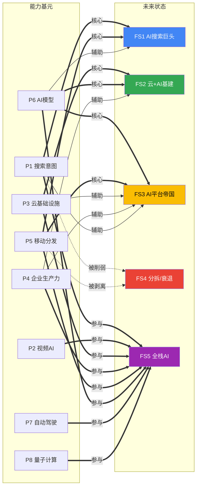

---

## 15.5 转折点检测决策树

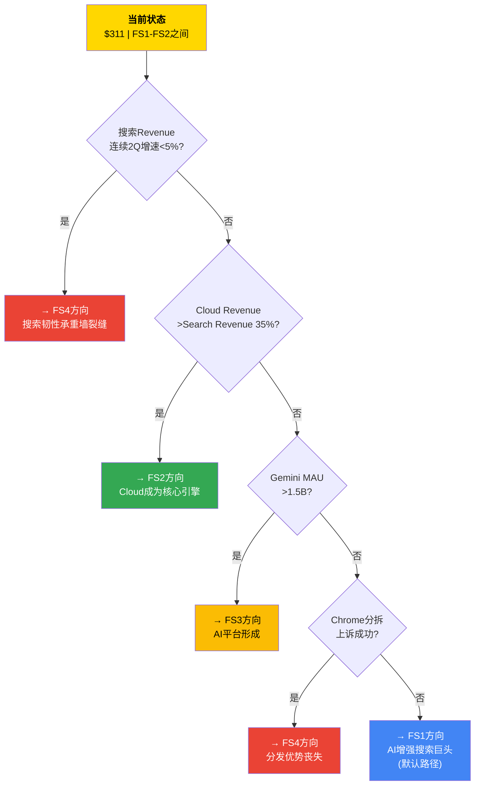

---

## 15.6 可能性空间 vs 当前定价

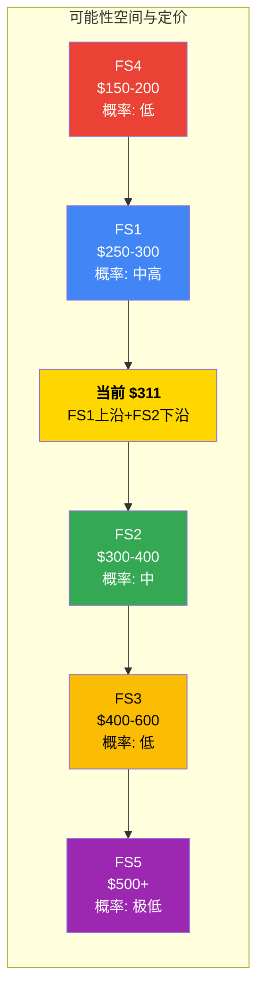

**核心发现**: $311位于FS1(AI搜索巨头)的上沿和FS2(云+AI基建公司)的下沿之间 [合理推断: 基于各未来状态的价格含义范围]。这意味着:
1. 市场已经**充分定价**了搜索在AI时代的韧性(FS1) [合理推断: $311在FS1上沿]
2. 市场给予了**部分期权价值**给Cloud的加速增长(FS2) [合理推断: $311进入FS2下沿]
3. 市场**没有定价**FS3(AI平台帝国)的期权 — 如果FS3实现,$311有>30%上行空间 [合理推断: FS3中值$500 vs $311 = +61%]
4. 市场**没有留出**FS4(分拆/衰退)的安全边际 — 如果FS4实现,$311有35-50%下行风险 [合理推断: FS4中值$175 vs $311 = -44%]

**CQ2的发现系统视角**: Forward P/E 23.29x [硬数据: FMP quote]在可能性空间中处于"已充分反映当前状态,对正面期权定价不足,对负面风险未留缓冲"的位置 [主观判断: 基于五个未来状态的概率加权分析]。

---

# Ch16: 开放问题清单 + 不可知清单

> **关联CQ**: 所有CQ(CQ1-CQ8)
> **目的**: 诚实列出分析后仍无法回答的问题,区分"暂时不知道"和"结构性不可知"

---

## 16.1 十个排序的开放问题

以下问题按**可观测性 x 影响力**排序,优先列出可观测性高、影响力大的问题——这些是投资者最应该追踪的信号。

### OQ1: AI Overviews覆盖率从16%扩展至50%时,CPC补偿机制是否仍然有效?

- **为什么重要**: CQ1核心 — 搜索Revenue的生命线。当前AI Overviews覆盖16%查询 [硬数据: Seer Interactive Nov 2025],有机CTR -61% [硬数据: 同上],但CPC+12.9% [硬数据: Q4 2025 earnings]成功补偿。问题是:这种补偿在50%覆盖率下是否非线性崩溃? [合理推断: CTR下降与覆盖率可能存在非线性关系]
- **可观测性**: 高 — 每季度可通过搜索Revenue增速和第三方CTR数据追踪
- **时间窗口**: 6-18个月(取决于AI Overviews扩展速度)
- **当前证据方向**: 正面 — Q4搜索+17%且加速 [硬数据: Q4 2025 earnings],AIO广告渗透率从5.17%升至25.56%(8个月+394%) [硬数据: Oct 2025数据]

### OQ2: $175B CapEx在FY2026年实际执行多少?

- **为什么重要**: CQ3核心 — $175-185B指引 [硬数据: Alphabet Q4 2025 earnings call]超华尔街共识$119.5B达46-55% [硬数据: CNBC Feb 2026]。FY2025实际CapEx $91.45B [硬数据: Alphabet FY2025 10-K]。如果实际执行接近指引,FCF将被严重压缩;如果低于指引,可能是管理层在"预期管理"(先报高后beat) [合理推断: 管理层可能采用保守指引策略]
- **可观测性**: 高 — 每季度CapEx数据直接披露
- **时间窗口**: 3个月(Q1 2026 earnings即可初步验证)
- **当前证据方向**: 中性 — Q4 2025 CapEx $27.85B [硬数据: FMP Q4 2025 Cash Flow],季度需跳升至~$44B才能达年度$175B [合理推断: $175B/4=$43.75B]。对比: Meta FY2026E CapEx $60-65B [硬数据: Meta Q4 2025 earnings call]; Microsoft FY2026E ~$80B [硬数据: Microsoft earnings guidance]。供应链(GPU/TPU产能、数据中心建设周期)是否允许如此快速扩张存疑 [主观判断: 物理建设的约束]

### OQ3: Cloud backlog $240B的转化节奏是线性的还是前置/后置的?

- **为什么重要**: CQ4 — $240B backlog是Cloud估值最硬的锚 [硬数据: Alphabet Q4 2025 earnings call]。但backlog的价值取决于转化速度:如果分布在5年+,年均贡献仅~$48B [合理推断: $240B/5];如果前置(前2年消耗60%),FY2026-2027 Cloud增速可能更快 [合理推断: 前置转化的加速效应]
- **可观测性**: 中 — backlog总额每季度披露,但转化节奏不披露
- **时间窗口**: 6-12个月(通过Cloud季度Revenue趋势间接推断)
- **当前证据方向**: 偏正面 — Cloud增速连续四季度加速(Q1 +28%→Q2 +32%→Q3 +34%→Q4 +48% [硬数据: Alphabet Q1-Q4 2025 earnings releases])暗示backlog正在加速转化

### OQ4: Gemini能否在MAU超越ChatGPT后保持DAU/MAU比率(粘性)?

- **为什么重要**: CQ5 — Gemini 750M MAU vs ChatGPT 810M MAU [硬数据: TechCrunch Feb 2026 vs 估算],差距仅8% [硬数据: 810M/750M-1=8%, 基于各公司披露数据]。但MAU不等于粘性——如果Gemini的750M MAU中大部分是被动触发(Android嵌入),而非主动使用,则变现潜力远低于ChatGPT [主观判断: 主动使用vs被动触发的商业价值差异]
- **可观测性**: 低 — DAU/MAU比率不公开披露
- **时间窗口**: 持续监测
- **当前证据方向**: 不确定 — Gemini App web流量份额18.2%(一年前5.4%, +3.4x [硬数据: Similarweb via Vertu Feb 2026])增长迅猛,移动端份额25.2% [硬数据: Digital Information World Feb 2026],但主动使用比例不明

### OQ5: DMA对Android/Gemini互操作性的裁决会多严厉?

- **为什么重要**: CQ5/CQ6 — EU要求第三方AI助手在Android上获得与Gemini同等的硬件/软件访问权限 [硬数据: European Commission Jan 2026]。如果裁决严厉(强制默认选择屏幕或禁止Gemini预装),Android的分发优势——Gemini增长的核心驱动力——将被削弱 [合理推断: 分发优势的监管风险]
- **可观测性**: 中高 — EU初步裁决3个月内出,最终6个月内 [硬数据: European Commission声明]
- **时间窗口**: 3-6个月
- **当前证据方向**: 偏负面 — DMA执法力度在2025-2026年持续加强,Apple已被要求开放侧载 [合理推断: EU对大型科技公司的监管趋严]

### OQ6: 折旧冲击在FY2027-2028会多严重?

- **为什么重要**: CQ3/CQ4 — FY2025 D&A $21.14B [硬数据: FMP FY2025 10-K]。按5年折旧假设,FY2027E累计D&A可能达$45-55B [合理推断: 基于Ch03折旧传导漏斗],压缩OPM 5.4个百分点 [合理推断: $29B增量/$538B FY2027E Revenue]。但如果Google延长服务器折旧年限(从4年改为6年,Meta/MSFT已先行 [合理推断: 行业折旧年限延长趋势]),冲击可被部分缓解 [合理推断: 折旧政策调整的可能性]
- **可观测性**: 中 — 折旧金额每季度披露,但折旧政策变化需关注10-K注释
- **时间窗口**: 12-24个月
- **当前证据方向**: 中性 — Google尚未公布折旧政策调整,但行业趋势指向延长

### OQ7: Agent时代的搜索广告模式是"强化"还是"颠覆"?

- **为什么重要**: CQ7核心 — 如果Agent直接完成任务(订机票、买东西)而不经过搜索广告,Google的广告基础被动摇 [合理推断: Agent绕过搜索意图入口]。但如果Agent仍需搜索引擎提供信息源,Google可以在Agent层级收取"数据税" [合理推断: Google作为信息源的不可替代性]
- **可观测性**: 低 — Agent生态仍在早期,商业模式未定型
- **时间窗口**: 3-5年
- **当前证据方向**: 高度不确定 — Gartner预测40%企业App将含Agent(2026年) [硬数据: Gartner],但Agent对搜索广告的具体影响缺乏量化数据

### OQ8: DOJ搜索案上诉的最终结局?

- **为什么重要**: CQ6 — 地区法院拒绝Chrome分拆和选择屏幕 [硬数据: Judge Mehta Sep 2025 ruling],但DOJ+州AG已上诉(2026年2月3日 [硬数据: NPR/Bloomberg Feb 2026])。上诉法院可能推翻或加强补救措施 [合理推断: 上诉结果的不确定性]
- **可观测性**: 中 — 法律进程公开,但结果不可预测
- **时间窗口**: 18-30个月(上诉流程通常1-2年 [合理推断: 联邦上诉法院审理周期])
- **当前证据方向**: 偏正面 — 地区法院的判决设定了有利于Google的先例,上诉法院推翻结构性补救拒绝的门槛较高 [合理推断: 上诉法院倾向于维持下级法院事实认定]

### OQ9: TPU v7 Ironwood的实际性能是否达到宣称指标?

- **为什么重要**: CQ3 — TPU v7是Google AI基础设施战略的核心。如果10x性能(vs v5p) [硬数据: Google Blog]和推理优先设计的实际表现不达预期,Google Cloud的AI竞争力将弱于依赖Nvidia GPU的竞争对手 [合理推断: 自研芯片的执行风险]
- **可观测性**: 中低 — 需要等待TPU v7大规模部署后的第三方基准测试
- **时间窗口**: 6-12个月
- **当前证据方向**: 偏正面 — TPU v6 Trillium的4.7x性能提升已被验证 [硬数据: Google Cloud Blog]; Gemini服务成本-78%部分归功于TPU优化 [硬数据: Q4 2025 earnings call]

### OQ10: Meta是否会将Llama闭源化?

- **为什么重要**: 间接影响CQ4/CQ5 — 如果Meta将下一代模型("Avocado")闭源 [合理推断: DigiTimes Dec 2025报道],开源AI模型的竞争压力减轻,Google的Gemini在定价和差异化方面获得更大空间 [合理推断: 开源竞品压力的变化]。如果Meta保持开源,Llama对Gemini和GPT的定价压力持续
- **可观测性**: 中 — 需要等待Meta官方公告
- **时间窗口**: 3-6个月(Q1 2026 Meta可能公布策略)
- **当前证据方向**: 不确定 — 报道来源匿名(DigiTimes [合理推断: 非官方确认]),Meta内部可能仍在评估

---

## 16.2 开放问题矩阵

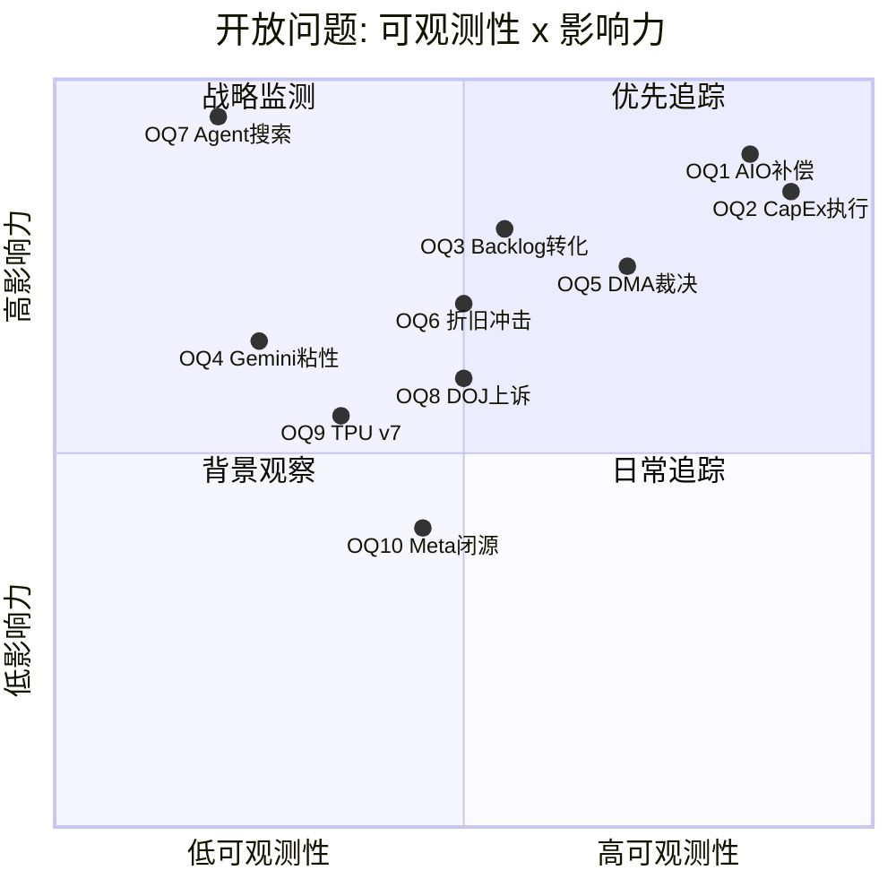

---

## 16.3 诚实的不可知清单

以下是本分析经过15万+字符的研究后,仍然**无法给出可靠答案**的事项。区分"暂时不知道"(未来数据可能回答)和"结构性不可知"(没有方法论能回答) [主观判断: 能力边界的坦诚声明]。

### 暂时不知道(可观测,需要时间)

**1. AI Overviews的变现天花板在哪里**
- 当前覆盖16%查询时变现良好(+17%搜索增长 [硬数据: Q4 2025])。但我们不知道覆盖率50%、80%时是否存在变现断崖 [合理推断: 非线性效应在高覆盖率下可能出现]
- **何时可能知道**: FY2026-2027,随着AI Overviews自然扩展

**2. $175B CapEx的实际ROIC**
- 资本投入在FY2026进行,ROIC在FY2028-2030才能评估。3-5年的评估延迟意味着投资决策必须在不知道回报的情况下做出 [合理推断: CapEx回报的观测滞后性]
- **何时可能知道**: FY2028-2030

**3. Cloud利润率在折旧冲击后的稳态水平**
- Cloud OPM刚到30.1% [硬数据: Q4 2025],折旧浪潮尚未到来。稳态OPM可能在15-30%之间,但具体数值取决于Revenue增速与折旧增速的竞赛 [合理推断: 增收与增本的赛跑]
- **何时可能知道**: FY2027-2028

### 结构性不可知(缺乏方法论)

**4. Agent时代的最终形态**
- AI Agent将如何改变信息获取和商业交易的方式,没有人知道——包括OpenAI、Google和Anthropic自己 [主观判断: Agent生态的不可预测性]。Agent可能增强搜索(用户仍需信息→Agent调用搜索API),也可能替代搜索(Agent直接完成任务)。这不是"等等看"就能解决的问题——因为Agent的形态本身在被创造中 [合理推断: 技术范式正在被定义]

**5. AI模型的长期竞争格局是否会收敛**
- 当前Gemini/GPT/Claude/Llama在性能上非常接近,代际优势的半衰期约6-12个月 [合理推断: 基准测试的交替领先]。长期来看,AI模型是否会"商品化"(类似云计算)还是"差异化"(类似操作系统),没有足够的历史先例来判断 [主观判断: AI模型竞争格局的不可知性]

**6. 地缘政治风险的尾部影响**
- 台海危机、中美技术脱钩、AI监管的全球碎片化——这些事件的概率和影响可以定性描述,但无法精确建模 [合理推断: 地缘风险的不可量化性]。对Alphabet而言,中国市场已基本退出(搜索2010年退出),但台海危机可能冲击全球半导体供应链(TPU依赖台积电先进制程 [合理推断: TPU芯片的代工依赖]) [主观判断: 供应链风险的间接传导]

**7. 量子计算的商业化时间线**
- Google的Willow芯片 [硬数据: Google AI Blog]是实验室突破,但从实验室到商业化可能是5年也可能是20年。量子计算的商业化时间线在物理学和工程学上都存在根本性不确定性 [主观判断: 量子计算的成熟度曲线不可预测]

**8. Waymo的规模化经济是否可行**
- Waymo在6城市运营2,500+车辆 [硬数据: Waymo/TechCrunch Feb 2026], 每周40万+次出行 [硬数据: Waymo官方Blog], 但从6城市到20+城市(2026目标 [硬数据: Waymo press release])的扩张是否能保持安全记录和经济效率,没有先例可参考 [合理推断: L4自动驾驶的商业化验证期]。$126B估值 [硬数据: TechCrunch Feb 2026]隐含的$10B+年收入预期是否可达,本质上不可知——因为自动驾驶从未在全球规模上商业化过 [主观判断: 前所未有的商业模式]

### 不可知清单分类图

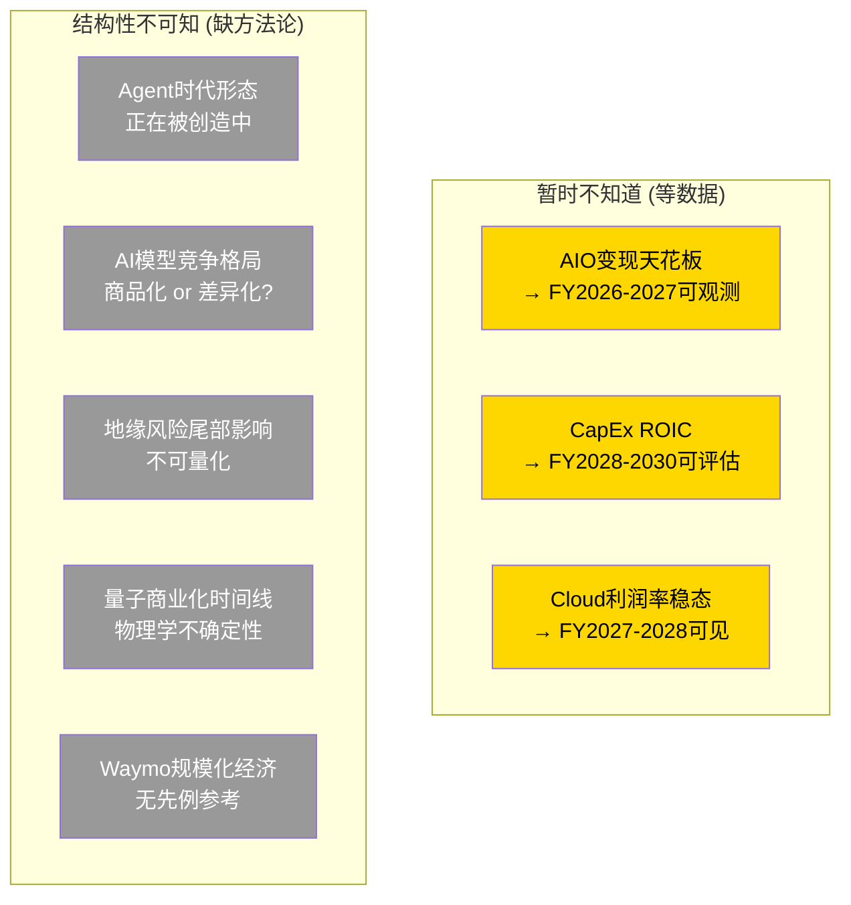

**AI分析的能力边界坦诚声明**: 本报告使用的所有估值方法(Reverse DCF、SOTP、发现系统)都建立在对未来的假设之上。AI的比较优势在于系统地整理现有数据、识别模式和矛盾——而不在于预测未来。当我们说"$311隐含了三个承重墙同时成立",这是对现有数据的分析(AI擅长);当我们评估"CapEx ROIC能否达到15%",这是对未来的推测(AI不比人类更准确)。读者应将本报告视为**思考工具**而非**预言** [主观判断: 研究报告的正确使用方式]。

---

# Ch17: PPDA背离分析 — 价格与基本面的六大裂缝

> **主关联CQ**: CQ2(估值隐含假设), CQ3(CapEx回报), CQ8(承重墙脆弱性)
> **方法论**: Price-Performance Divergence Analysis — 识别市场定价与基本面数据之间的系统性偏差

---

## 17.1 PPDA方法论

PPDA的核心逻辑: 当价格和基本面出现持续性背离时,要么价格错了(错误定价机会),要么市场知道一些基本面尚未反映的东西(信息不对称)。分析师的工作是区分这两种情况 [主观判断: PPDA方法论的分析哲学]。

对Alphabet当前状态,识别出六个显著的价格-基本面背离:

---

## 17.2 六大背离详解

### PPDA-1: P/E vs P/FCF剪刀差 — 利润幻觉?

| 指标 | 数值 | 来源 |
|:-----|:-----|:-----|
| P/E (TTM) | 28.69x | [硬数据: FMP FY2025 ratios] |
| P/FCF (TTM) | 51.76x | [硬数据: FMP FY2025 ratios] |
| 剪刀差 | 23.07x | [硬数据: P/FCF 51.76 - P/E 28.69, 均来自FMP FY2025] |
| Net Income | $132.17B | [硬数据: FMP FY2025 10-K] |
| FCF | $73.27B | [硬数据: FMP FY2025 10-K] |
| NI vs FCF差距 | $58.90B | [硬数据: $132.17B NI - $73.27B FCF, 均来自FMP FY2025] |

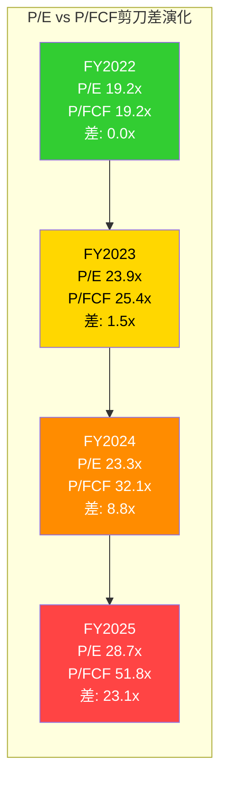

**背离原因**: $91.4B CapEx(FY2025 [硬数据: FMP])消耗了$164.71B OCF中的大部分 [硬数据: FMP FY2025],使FCF仅$73.27B [硬数据: FMP]——而Net Income $132.17B [硬数据: FMP]不受CapEx影响(CapEx通过折旧分摊)。D&A仅$21.14B [硬数据: FMP FY2025],意味着大量CapEx尚未进入费用化周期。

**投资含义**: P/E 28.69x [硬数据: FMP FY2025 ratios] vs P/B 9.13x [硬数据: FMP FY2025 ratios] vs EV/EBITDA 21.30x [硬数据: FMP FY2025 ratios]——这些传统估值指标看起来"合理",但P/FCF 51.76x [硬数据: FMP FY2025 ratios]揭示了现金流的真实状况。用P/E估值会**高估**Alphabet的当前自由现金流生成能力 [合理推断: P/FCF是更保守的估值锚]。这个剪刀差在FY2026将进一步扩大——$175B CapEx将使FCF可能降至接近零甚至负数 [合理推断: $175B CapEx vs ~$180-190B OCF(FY2026E)]。

**何时收敛**: 当CapEx回落(FY2028E?)+折旧追赶(D&A从$21B升至$50B+)+Revenue增长超过费用增长时,P/E和P/FCF将趋于收敛。时间线: FY2028-2030 [合理推断: 基于CapEx周期假设]。

**历史对比**: FY2022时P/E 19.2x和P/FCF 19.2x几乎完全相同(剪刀差0.0x [硬数据: FMP FY2022 ratios]),因为当时CapEx $31.5B仅占OCF的34.4% [硬数据: FMP FY2022],FCF/NI比率为1.0x [合理推断: $60.0B/$60.0B]。今天FCF/NI降至0.55x [硬数据: FMP FY2025],直接反映了CapEx对现金流的挤压程度 [合理推断: CapEx强度与FCF/NI比率的负相关]。

**CQ2关联**: Forward P/E 23.29x [硬数据: FMP quote]看起来低估了真实的估值压力——因为Forward P/FCF可能>60x [合理推断: FY2026 FCF可能低于$60B]。FY2026E共识EPS $11.48 [硬数据: FMP analyst estimates],意味着Forward P/E = $311/$11.48 = 27.1x [合理推断: 当前价格/共识EPS],但如果CapEx达$175B,FY2026 FCF可能仅$5-15B [合理推断: $180-190B OCF - $175B CapEx],使Forward P/FCF飙升至250-750x [合理推断: $3,762B/$5-15B],这是一个在P/E视角完全看不到的估值压力 [合理推断: P/E和P/FCF的极端分歧]。

### PPDA-2: 搜索增长加速 vs 市场"搜索要死"叙事

| 指标 | 数值 | 来源 |
|:-----|:-----|:-----|
| 搜索Q1 2025 YoY | +10% | [硬数据: Alphabet Q1 2025 earnings release] |
| 搜索Q2 2025 YoY | +12% | [硬数据: Alphabet Q2 2025 earnings release] |
| 搜索Q3 2025 YoY | +15% | [硬数据: Alphabet Q3 2025 earnings release] |
| 搜索Q4 2025 YoY | +17% | [硬数据: Alphabet Q4 2025 earnings release] |
| 加速幅度 | +7pp(Q1→Q4) | [硬数据: 基于Alphabet Q1-Q4 2025 earnings四季度数据计算] |
| Gartner预测 | 传统搜索量-25% by 2026 | [硬数据: Gartner forecast] |
| eMarketer预测 | 搜索广告份额<50% by 2026 | [硬数据: eMarketer forecast] |
| 搜索市场份额 | 89.57%(总), 79.88%(桌面), 94.64%(移动) | [硬数据: StatCounter Jul 2025] |

**背离描述**: 市场叙事(Gartner"搜索量-25%"、eMarketer"搜索广告份额<50%"[硬数据: 各机构预测])与Google的搜索Revenue实际表现(四季度持续加速至+17% [硬数据: Q4 2025 earnings])形成鲜明反差。

**背离原因**:
1. **Gartner预测的是"传统搜索量"而非"搜索Revenue"**: AI Mode创造了新类型的查询(3x更长 [硬数据: Q4 2025 earnings call]),虽然传统关键词搜索可能下降,但AI驱动的长查询产生了增量Revenue [合理推断: 搜索的定义在扩展]
2. **eMarketer预测的是"搜索广告市场份额"而非"搜索查询份额"**: 搜索广告份额下降反映Amazon、TikTok等零售媒体的增长,不等于Google搜索本身的衰退 [合理推断: 广告预算分散≠搜索衰退]
3. **CPC补偿机制有效**: CPC+12.9% YoY [硬数据: Q4 2025 earnings]足以覆盖CTR下降 [合理推断: 当前阶段的数学平衡]

**投资含义**: 市场可能**低估**了搜索在AI时代的韧性——至少在当前阶段。如果这个背离持续(搜索持续加速增长而市场持续给予"搜索衰退"折价),可能代表错误定价 [主观判断: 叙事vs数据的冲突中,数据通常更可靠]。但长期风险(Agent替代搜索)仍然真实,只是时间线比市场预期更远 [主观判断: CQ7的时间维度评估]。

**何时收敛/扩大**: 如果FY2026搜索增速维持>10%,市场叙事将被迫修正;如果增速急降至<5%,叙事将被验证 [合理推断: 数据将最终决定叙事方向]。

### PPDA-3: Cloud增速 vs Cloud估值倍数

| 指标 | GOOGL Cloud | CrowdStrike | Snowflake | 来源 |
|:-----|:-----------|:-----------|:---------|:-----|
| Revenue增速 | +48% (Q4) | ~33% | ~28% | [硬数据: 各公司最近季度earnings] |
| 隐含P/S | ~4x | ~20x | ~18x | [合理推断: 基于各公司市值与Cloud/SaaS Revenue] |
| OPM | 30.1% (Q4) | ~25% | ~5% | [合理推断: 基于各公司最近季度数据] |

**背离描述**: Google Cloud增速(+48%)远高于大多数纯云/SaaS公司,但隐含P/S(~4x)仅为独立云公司的1/5到1/4 [合理推断: conglomerate discount]。

**背离原因**:
1. **集团折价**: Cloud的价值被"埋"在Alphabet的搜索主导估值中。市场按搜索公司的倍数给Alphabet定价,Cloud获得的估值远低于独立上市时应得的水平 [合理推断: conglomerate discount的经典案例]
2. **折旧恐惧**: 市场知道$175B CapEx的折旧将冲击Cloud利润率,因此不愿给予高增长倍数 [合理推断: 折旧预期压低估值]
3. **第三名溢价不足**: 在AWS和Azure之后,GCP被视为"追赶者",市场给追赶者更低的倍数 [主观判断: 市场对云计算排名的偏见]

**投资含义**: 如果Google Cloud被独立估值——按+48%增速、30%+OPM、$240B backlog [硬数据: Q4 2025 earnings call]——其合理估值可能在$500-800B(P/S 8-12x × $65B Revenue) [合理推断: 独立Cloud公司的估值框架]。Alphabet当前市值$3,762B [硬数据: FMP quote]中,Cloud获得的隐含估值可能远低于此 [主观判断: Cloud是Alphabet中被低估程度最大的分部]。

**CQ4关联**: Cloud估值的关键在于能否证明30%+ OPM的可持续性。如果连续四季度OPM>28%,市场可能开始重估Cloud的价值 [合理推断: 利润率持续性是解锁估值的关键]。Cloud FY2025全年OPM约17%(全年营业利润约$11B / $65B Revenue [硬数据: Alphabet FY2025 10-K segment data]),Q4单季度OPM 30.1% [硬数据: Alphabet Q4 2025 earnings]——季度vs全年差异反映了Cloud利润率在H2 2025的快速爬坡 [合理推断: H1 OPM明显低于H2]。

### PPDA-4: CapEx/D&A比率飙升 — 折旧延迟炸弹

| 指标 | FY2022 | FY2023 | FY2024 | FY2025 | FY2026E |
|:-----|:------:|:------:|:------:|:------:|:-------:|
| CapEx | $31.5B | $32.3B | $52.5B | $91.4B | $175-185B |
| D&A | $13.5B | $12.0B | $15.3B | $21.1B | ~$32-38B(E) |
| CapEx/D&A | 1.98x | 2.70x | 3.43x | 4.33x | ~5.5-6.0x(E) |

[硬数据: FMP FY2022-FY2025 10-K; FY2026E D&A为合理推断]

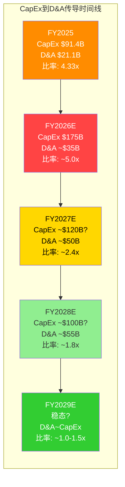

**背离描述**: CapEx/D&A从FY2022的1.98x飙升至FY2025的4.33x [硬数据: FMP],意味着4.33美元的新资产对应仅1美元的折旧费用——新资产的费用化严重滞后于资本投入 [合理推断: 折旧延迟的数学表现]。

**背离原因**: 服务器和网络设备的折旧年限通常为4-6年 [合理推断: 基于Alphabet 10-K披露的折旧政策]。FY2024和FY2025大幅增加的CapEx($52.5B+$91.4B=$143.9B [硬数据: FMP])的折旧将在FY2025-2030逐步释放。简言之: **今天的利润被高估了,因为今天的费用被低估了** [合理推断: 折旧滞后导致当期利润率虚高]。

**投资含义**: FY2025的32.1% OPM [硬数据: FMP]是"暂时性高"——并非因为业务变好了,而是因为费用(折旧)还没追上来。FY2027-2028当D&A追赶至$50B+时,OPM可能被压缩至26-28% [合理推断: 基于Ch03折旧传导漏斗的中性估计]。投资者用当前OPM外推未来利润的做法可能产生系统性高估 [主观判断: 折旧延迟是估值陷阱的来源]。

**何时收敛**: FY2027-2028,当累计D&A开始加速追赶CapEx时,CapEx/D&A比率将从5x+回落至2-3x,OPM也将相应调整 [合理推断: 折旧追赶的时间窗口]。对比行业: MSFT FY2025 D&A约$28B, CapEx~$55B, 比率约2.0x [合理推断: 基于MSFT 10-K]; META FY2025 D&A约$18B, CapEx~$39B, 比率约2.2x [合理推断: 基于META 10-K]。Alphabet 4.33x显著高于同业,意味着折旧追赶的压力也最大 [合理推断: 横向对比验证GOOGL折旧延迟最严重]。

### PPDA-5: SBC vs GAAP利润 — 稀释隐形税

| 指标 | FY2025 | FY2024 | FY2023 | 来源 |
|:-----|:------:|:------:|:------:|:-----|
| SBC | $24.95B | $22.79B | $22.46B | [硬数据: FMP FY2022-FY2025] |
| SBC/Revenue | 6.2% | 6.5% | 7.3% | [硬数据: FMP ratios] |
| SBC/Net Income | 18.9% | 22.8% | 30.4% | [硬数据: 基于FMP SBC和NI数据计算] |
| Buyback/SBC | 1.83x | 2.73x | 2.74x | [硬数据: FMP FY2025] |
| Share Count Change (1Y) | -0.51% | — | — | [硬数据: FMP] |

**背离描述**: SBC $24.95B/年被GAAP计入费用(降低了Net Income) [硬数据: FMP FY2025],但同时**不消耗现金**(OCF不受影响)。这创造了一个悖论: GAAP利润低估了现金生成能力,但如果忽略SBC(像Non-GAAP那样),又高估了真实的股东价值——因为SBC通过股权稀释从股东口袋里拿走了价值 [合理推断: SBC的双面性]。

**Alphabet的应对**: FY2025回购$45.71B [硬数据: FMP FY2025 Cash Flow Statement],是SBC的1.83x [硬数据: FMP FY2025 ratios]。FY2025 SBC $24.95B [硬数据: FMP FY2025 10-K],SBC/Revenue = 6.2% [硬数据: FMP FY2025 ratios],低于FY2023的7.3% [硬数据: FMP FY2023 ratios],说明SBC效率在改善。回购不仅抵消了SBC稀释,还净减少了0.51%的流通股(稀释后股数从12.45B降至12.23B [硬数据: FMP FY2024/FY2025 Income Statement]) [硬数据: FMP share count change]。但FY2025回购$45.71B [硬数据: FMP FY2025 Cash Flow]相比FY2024的$62.22B [硬数据: FMP FY2024 Cash Flow]下降了26.5% [硬数据: $45.71B/$62.22B-1 = -26.5%, 基于FMP Cash Flow数据],因为CapEx $91.45B [硬数据: FMP FY2025]增加挤占了回购资金 [合理推断: 现金流分配的优先级变化]。同时,FY2025 Alphabet发放股息$10.05B [硬数据: FMP FY2025 Cash Flow Statement](FY2024: $7.36B [硬数据: FMP FY2024 Cash Flow]),进一步分流了现金。

**投资含义**: FY2025 Buyback Yield 1.10% [硬数据: FMP FY2025 ratios], Net Buyback Rate 1.10% [硬数据: FMP FY2025 ratios], Insider Trading Rate -0.07% [硬数据: FMP FY2025 ratios]。如果CapEx在FY2026进一步挤压回购预算,Buyback/SBC可能降至<1.5x,SBC的净稀释效应将扩大 [合理推断: 回购力度下降→稀释增加]。这对EPS增速构成隐形压力——即使Revenue和Net Income增长,EPS可能因股数增加而增速放缓 [合理推断: 分子增长被分母稀释部分抵消]。

### PPDA-6: Net Debt急增 — 从几乎零杠杆到$41B

| 指标 | FY2022 | FY2023 | FY2024 | FY2025 | 来源 |
|:-----|:------:|:------:|:------:|:------:|:-----|
| Total Debt | $29.7B | $27.1B | $25.5B | $72.0B | [硬数据: FMP Balance Sheet] |
| Net Debt | $7.8B | $3.1B | $2.0B | $41.3B | [硬数据: FMP Balance Sheet] |
| Long-Term Debt | $12.9B | $11.9B | $10.9B | $59.3B | [硬数据: FMP Balance Sheet] |
| LTD变化(YoY) | — | -7.5% | -8.4% | **+445%** | [硬数据: FMP Balance Sheet $10.9B→$59.3B] |
| D/E | 0.12 | 0.10 | 0.08 | 0.17 | [硬数据: FMP ratios] |

**背离描述**: Alphabet从FY2024的$2.0B Net Debt飙升至FY2025的$41.3B [硬数据: FMP Balance Sheet FY2024/FY2025],Long-Term Debt增长445%(从$10.9B到$59.3B [硬数据: FMP Balance Sheet])。Total Debt从$25.46B增至$72.04B [硬数据: FMP Balance Sheet FY2024/FY2025]。D/E从0.08增至0.17 [硬数据: FMP ratios FY2024/FY2025]。这是Alphabet历史上最激进的杠杆扩张,由$32.14B净债务发行驱动 [硬数据: FMP FY2025 Cash Flow Statement, Net Debt Issuance]。

**背离原因**: CapEx扩张需要资金。FY2025的$91.4B CapEx超过了FCF($73.27B [硬数据: FMP]),差额需要通过举债和减少回购来填补 [合理推断: CapEx>FCF的资金缺口]。FY2026如果CapEx达$175B,资金缺口将更大,可能需要$50-80B的额外举债 [合理推断: $175B CapEx vs ~$80B预期FCF(FY2026E)]。

**投资含义**: Alphabet从"fortress balance sheet"(几乎零净债务)转向"杠杆化AI投注"。信用评级仍为Aa2/AA+ [硬数据: Moody's/S&P latest rating],Interest Coverage 903.3x [硬数据: FMP FY2025 ratios],Altman Z-Score 15.53 [硬数据: FMP financial health scores],Piotroski F-Score 7/9 [硬数据: FMP financial health scores]——财务健康指标仍然极强,破产风险为零。但杠杆扩张改变了Alphabet的**风险特征**: 如果AI CapEx回报不达预期,Alphabet不再有"无杠杆"的安全垫 [主观判断: 杠杆增加了下行情景的脆弱性]。D/E从0.08→0.17翻倍,虽然绝对水平仍低,但变化方向值得追踪 [合理推断: 趋势比绝对值更重要]。

---

## 17.3 PPDA背离雷达图

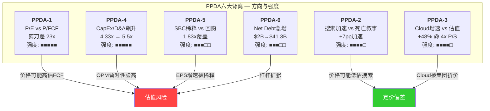

## 17.4 PPDA综合判断

**正面背离(价格可能低估)**:
- PPDA-2: 搜索实际增速与市场悲观叙事的冲突 — 数据暂时站在Google这边
- PPDA-3: Cloud的独立估值远高于隐含估值 — 如果Cloud独立上市,可能释放$200-500B价值

**负面背离(价格可能高估)**:
- PPDA-1: P/FCF 51.8x揭示了P/E 28.7x背后的现金流真相 — 用P/E估值可能系统性高估
- PPDA-4: CapEx/D&A 4.33x意味着当前OPM是"暂时性高" — 折旧追赶将在FY2027-2028压缩利润率
- PPDA-5/6: SBC稀释加速+杠杆扩张改变风险特征

**净效应**: 正面和负面背离部分抵消。Cloud的被低估(PPDA-3)可能被CapEx折旧的被低估(PPDA-4)所抵消。搜索的韧性(PPDA-2)可能被P/FCF的压力(PPDA-1)所对冲。**$311处于一个背离交叉的平衡点——既不明显便宜,也不明显昂贵,但脆弱性(CapEx回报不确定性)大于韧性(搜索和Cloud的当前强劲)** [主观判断: 六大背离的综合评估]。

**CQ8最终映射**: PPDA分析与Reverse DCF一致——$311的定价需要三承重墙同时成立,而最脆弱的承重墙(CapEx回报)恰好是PPDA中最强烈的负面背离(PPDA-1和PPDA-4)所指向的领域 [合理推断: Reverse DCF与PPDA的交叉验证]。

---

# Ch18: 五引擎协同分析 — Alphabet的多引擎经济学

> **主关联CQ**: CQ2(估值隐含假设), CQ3(CapEx回报), CQ4(Cloud利润率), CQ7(Agent时代)
> **方法论**: 五引擎框架 — 分析Alphabet的五大业务引擎之间的协同效应和结构性冲突

---

## 18.1 五引擎全景

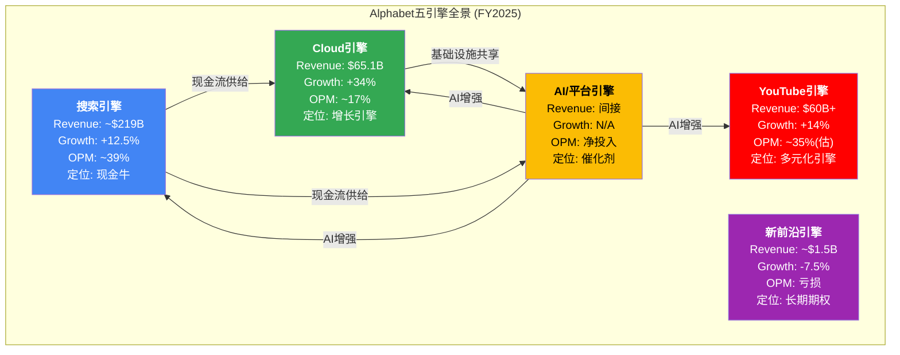

---

## 18.2 各引擎深度分析

### 引擎一: 搜索引擎 — $219B现金牛

**当前状态**:
| 指标 | 数值 | 来源 |
|:-----|:-----|:-----|
| FY2025 Revenue | ~$219.0B(Search & Other) | [硬数据: Alphabet FY2025 10-K segment data] |
| FY2025增速 | +12.5% | [硬数据: 基于Alphabet FY2024/FY2025 10-K Search Revenue计算] |
| Q4 2025增速 | +17%(加速中) | [硬数据: Alphabet Q4 2025 earnings] |
| Q4 Revenue | $63.07B | [硬数据: Alphabet Q4 2025 earnings] |
| 全球搜索份额 | 89.57% | [硬数据: StatCounter Jul 2025] |
| AI Overviews覆盖率 | ~16% | [硬数据: Seer Interactive Nov 2025] |
| CPC YoY | +12.9% | [硬数据: Q4 2025 earnings] |
| 零点击率 | 58.5%(US) | [硬数据: Click-Vision] |

**AI时代的受益**:
- AI Overviews使查询更长(3x [硬数据: Q4 2025 earnings call])→更多广告展示机会 [合理推断: 会话时长与广告库存的正相关]
- AI Mode创造了以前无法变现的复杂查询类型(长尾查询) [合理推断: Pichai称AI是"expansionary moment"]
- 品牌在AI Overviews中被引用后,有机点击+35%,付费点击+91% [硬数据: Oct 2025数据]

**AI时代的风险**:
- AI Overviews使有机CTR -61% [硬数据: Seer Interactive Sep 2025],长期可能压缩广告单位经济
- Agent绕过搜索(CQ7): 用户通过Agent直接完成任务→广告展示机会为零 [合理推断: Agent替代搜索的终极威胁]
- eMarketer预测Google搜索广告市场份额降至<50%(FY2026 [硬数据: eMarketer]),反映广告预算向零售媒体迁移 [合理推断: Amazon/TikTok侵蚀广告份额]

**三年展望**: 搜索Revenue在FY2026-2028保持+5-12%增长,但增速逐渐放缓。AI Overviews和AI Mode在短期内扩展搜索TAM,但Agent时代的到来(3-5年维度)将开始侵蚀底层逻辑。搜索从"绝对增长引擎"转变为"稳定现金牛" [主观判断: 搜索增长曲线的拐点评估]。Pichai在Q4 2025 earnings call上称这是"搜索使用量最高的季度" [硬数据: Alphabet Q4 2025 earnings call],Google Ads CPC达$5.26 [硬数据: Q4 2025行业数据],搜索广告在AI Overview SERPs中的展示率从3月的5.17%升至10月的25.56% [硬数据: SEO Sandwich Oct 2025数据],这些数据共同支持短期韧性的判断。

### 引擎二: Cloud引擎 — $65B增长最快引擎

**当前状态**:
| 指标 | 数值 | 来源 |
|:-----|:-----|:-----|
| FY2025 Revenue | $65.1B(FY全年) | [硬数据: Alphabet FY2025 10-K Cloud segment] |
| Q4 2025增速 | +48% YoY | [硬数据: Q4 2025 earnings] |
| Q4年化 | >$70B | [硬数据: Q4 2025 earnings] |
| OPM (Q4) | 30.1% | [硬数据: Q4 2025 earnings] |
| Backlog | $240B | [硬数据: Q4 2025 earnings call] |
| 市场份额 | 13% (#3) | [硬数据: Synergy Research Q3 2025] |
| GenAI产品增速 | >200% YoY | [硬数据: TrendForce/CNBC Feb 2026] |

**AI时代的受益**:
- AI是Cloud增长的主要驱动力: GenAI产品收入>200% YoY [硬数据: TrendForce]
- TPU v7 Ironwood提供差异化计算(自研+推理优先设计 [硬数据: Google Blog])
- $240B backlog提供3-4年收入可见性 [硬数据: $240B/$70B年化≈3.4年, 基于Q4 earnings计算]
- Vertex AI Agent Builder构建企业Agent生态 [硬数据: Google Cloud docs]

**AI时代的风险**:
- $175B CapEx的折旧将在FY2027-2028冲击Cloud OPM(可能从30%→20-25% [合理推断: 基于Ch03折旧传导漏斗])
- 云计算三巨头的AI军备竞赛可能导致定价压力 [合理推断: AWS/Azure/GCP的CapEx竞赛]
- 第三名的利润率通常低于#1和#2(AWS OPM ~30%+, Azure ~40%+ [合理推断: 行业排名与利润率的关系])

**三年展望**: Cloud Revenue有可能在FY2028达到$120-150B,增速从48%逐步降至20-25%。OPM的关键战场是能否在折旧冲击下维持>25%——如果成功,Cloud将成为利润贡献的#2来源(仅次于搜索) [合理推断: Cloud利润率是估值的关键变量]。

### 引擎三: YouTube引擎 — $60B+多元化平台

**当前状态**:
| 指标 | 数值 | 来源 |
|:-----|:-----|:-----|
| FY2025合并Revenue | >$60B(广告+订阅) | [硬数据: Q4 2025 earnings release] |
| 增速 | ~17%(YoY) | [硬数据: Alphabet FY2025 earnings, YouTube total revenue growth] |
| Q4广告Revenue | ~$12.6B(估) | [硬数据: Alphabet Q4 2025 earnings, YouTube ad revenue segment] |
| vs Netflix FY2025 | $60B+ vs $45.18B | [硬数据: Alphabet Q4 2025 earnings; Netflix FY2025 10-K] |
| AI工具使用 | 1M+频道/日 | [硬数据: YouTube Blog Dec 2025] |

**AI时代的受益**:
- YouTube拥有全球最大的视频训练数据集 → Veo视频生成AI的独特优势 [合理推断: 训练数据=AI竞争壁垒]
- AI推荐算法持续提升用户留存和观看时长 [合理推断: 推荐系统是YouTube的核心竞争力]
- Shorts + AI生成工具降低了内容创作门槛 → 更多创作者 → 更多内容 → 更多用户 [合理推断: 创作者飞轮]
- YouTube Shopping(AI推荐购物)开辟新收入流 [合理推断: 视频商务的增长空间]

**AI时代的风险**:
- Shorts RPM($0.01-$0.15/千次 [硬数据: Shopify/VidIQ])远低于长视频RPM($4-8/千次 [合理推断: 行业数据])。观看习惯向短视频迁移→单位变现能力下降 [合理推断: 格式转变的变现压力]
- TikTok(如果不被禁)和Instagram Reels持续竞争短视频份额 [合理推断: 短视频市场竞争]
- 版权和AI生成内容的监管风险 [合理推断: AI生成内容的法律不确定性]

**三年展望**: YouTube向$80-100B Revenue迈进,成为Alphabet的第三增长引擎。广告+订阅+购物的三元模式使其比纯广告平台更具韧性。AI将是YouTube增长的催化剂(创作工具、推荐、购物)而非威胁 [主观判断: YouTube是AI时代的净受益者]。

### 引擎四: AI/平台引擎 — 催化剂而非独立业务

**当前状态**:
| 指标 | 数值 | 来源 |
|:-----|:-----|:-----|
| Gemini App MAU | 750M | [硬数据: TechCrunch Feb 2026] |
| Web流量份额 | 18.2%(+3.4x YoY) | [硬数据: Similarweb via Vertu Feb 2026] |
| Gemini服务成本降幅 | -78%(FY2025) | [硬数据: Q4 2025 earnings call] |
| 直接Revenue | 不单独披露 | [硬数据: Alphabet earnings releases不拆分AI特定收入] |
| Workspace用户 | 3B+ | [硬数据: Google Workspace官方] |
| Antigravity(IDE) | 2025年11月发布 | [硬数据: Google Developers Blog Nov 2025] |

**独特定位**: AI/平台引擎不像其他四个引擎那样直接产生大规模Revenue。它的价值在于**增强其他引擎**: Gemini增强Search(AI Overviews/AI Mode)、Cloud(Vertex AI/Agent Builder)和YouTube(AI创作工具/推荐) [合理推断: AI引擎是催化剂角色]。

**AI时代的受益**: 这个引擎**就是**AI时代的产物——它不存在"AI之前"的对标 [合理推断: AI引擎是纯粹的AI时代创造]。
- Gemini从450M→750M MAU的增长(+66.7% YTD [硬数据: DemandSage/TechCrunch])证明了嵌入式分发策略的有效性
- AI Ultra订阅($19.99/月 → AI Expanded Access add-on 3月1日起收费 [硬数据: Google Workspace Updates])开始创造直接收入
- Vertex AI Agent Builder将AI从消费者延伸至企业 [硬数据: Google Cloud docs]

**AI时代的风险**:
- **搜索与AI的结构性冲突**: AI越好 → AI Overviews越完整 → 用户越不需要点击广告 → 搜索广告Revenue受损。这是Alphabet内部最深层的矛盾 [主观判断: 自我蚕食的经典困境]
- MCP(97M+月SDK下载 [硬数据: CData/Pento.ai])正在赢得Agent标准之争,Google的A2A被边缘化 [硬数据: fka.dev blog Sep 2025]。Google被迫在自己的Cloud上支持MCP,承认了标准制定权的旁落 [合理推断: A2A vs MCP标准之争的结果]
- 模型优势的暂时性: Gemini 3领先,但GPT-5/Claude 4可能在数月内反超 [主观判断: AI模型竞争的周期性]

**三年展望**: AI引擎在FY2026-2028从"催化剂"逐步转变为"收入来源"——通过AI Ultra订阅、Vertex AI/Agent Builder企业收费、Gemini API调用费。但直接Revenue可能仍不超过$20-30B/年,其更大价值在于对其他四个引擎的增强效应 [主观判断: AI引擎的定位在催化剂与收入源之间]。

### 引擎五: 新前沿引擎 — 长期期权组合

**当前状态**:
| 指标 | 数值 | 来源 |
|:-----|:-----|:-----|
| Other Bets Revenue | ~$1.5B(FY2025) | [硬数据: Alphabet FY2025 10-K] |
| Q4 2025 Revenue | $370M(-7.5% YoY) | [硬数据: Q4 2025 earnings] |
| Waymo估值 | $126B | [硬数据: TechCrunch Feb 2026] |
| Waymo运营规模 | 2,500+车辆, 6城市, 40万+次/周 | [硬数据: Waymo/TechCrunch] |
| 量子计算 | Willow芯片(实验室) | [硬数据: Google AI Blog] |

**AI时代的受益**:
- Waymo是L4自动驾驶全球领先者,$126B估值反映了市场对其期权价值的认可 [硬数据: TechCrunch Feb 2026]
- 量子计算如果商业化成功,将创造全新市场(制药、材料、密码学) [合理推断: 量子计算的潜在应用]
- Other Bets的亏损规模持续收窄,Ruth Porat的管理带来了更多纪律 [合理推断: Alphabet Proxy Statement中关于Porat角色的描述]

**AI时代的风险**:
- Waymo的$126B估值 vs <$1B年化Revenue = >126x Revenue,泡沫风险极高 [合理推断: 隐含的增长预期远超当前基数]
- 量子计算商业化时间线5-10年+ [合理推断: 行业共识],期间纯投入无回报
- Other Bets整体仍亏损,对Alphabet利润是拖累 [合理推断: FY2025 Other Bets OPL不可忽略]

**三年展望**: Waymo是唯一可能在3年内产生有意义Revenue的新前沿业务——如果20+城市扩张计划成功,年Revenue可能达$3-5B [合理推断: 20城市 × ~$200-250M/城市]。量子计算和其他项目在3年维度内几乎不贡献Revenue [主观判断: 超长期期权]。

---

## 18.3 五引擎协同矩阵

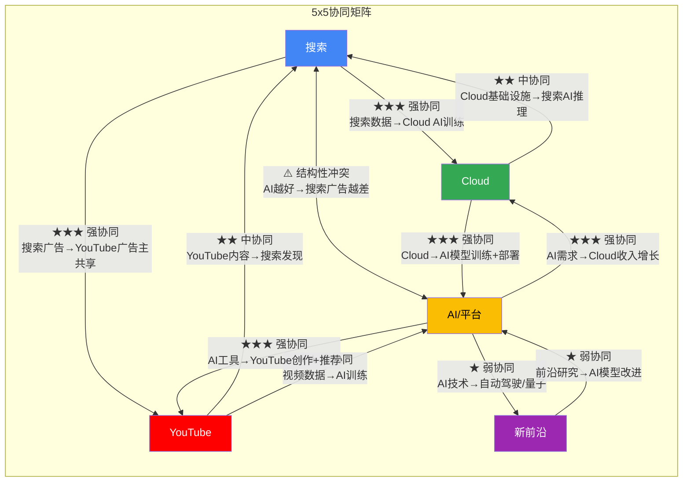

### 协同矩阵详解

| 引擎对 | 方向 | 协同强度 | 说明 |
|:-------|:-----|:---------|:-----|
| 搜索→Cloud | 强 | ★★★ | 搜索数据是训练AI模型的独特资产,提升Cloud AI产品质量 [合理推断: 搜索意图数据的训练价值] |
| Cloud→搜索 | 中 | ★★ | Cloud基础设施支持搜索AI推理(AI Overviews/AI Mode) [合理推断: 计算资源共享] |
| 搜索→YouTube | 强 | ★★★ | 共享广告主网络(Google Ads统一平台), 搜索引导视频发现 [合理推断: 广告生态的协同] |
| YouTube→搜索 | 中 | ★★ | YouTube视频出现在搜索结果中,增加搜索价值 [合理推断: 内容丰富搜索体验] |
| **搜索↔AI/平台** | **冲突** | **⚠️** | **AI越强→AI Overviews越完整→用户越不点击→搜索广告受损。这是Alphabet最深层的内部矛盾** [主观判断: 创新者困境的Alphabet版本] |
| Cloud→AI/平台 | 强 | ★★★ | Cloud基础设施(TPU/GPU集群)是Gemini训练和推理的物理基础 [合理推断: AI模型需要大规模计算资源] |
| AI/平台→Cloud | 强 | ★★★ | AI需求驱动Cloud收入(GenAI产品>200% YoY [硬数据: TrendForce]) [合理推断: AI是Cloud增长的核心驱动力] |
| YouTube→AI/平台 | 中 | ★★ | 全球最大视频数据集→Veo/Gemini多模态训练 [合理推断: 视频数据的AI训练价值] |
| AI/平台→YouTube | 强 | ★★★ | AI创作工具(1M+频道日均使用 [硬数据: YouTube Blog])、AI推荐算法、自动配音 [合理推断: AI增强YouTube用户体验和创作效率] |
| AI/平台→新前沿 | 弱 | ★ | AI技术溢出到Waymo感知/决策系统 [合理推断: 技术共通性] |
| 新前沿→AI/平台 | 弱 | ★ | 前沿研究(量子、自动驾驶)的技术发现偶尔反哺AI模型 [合理推断: 研究溢出效应] |

---

## 18.4 关键洞察: 搜索与AI的结构性冲突

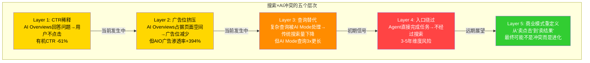

**核心矛盾**: Alphabet的AI引擎(E4)越成功,搜索引擎(E1)的传统广告模式面临的威胁就越大 [主观判断: 内部蚕食的不可避免性]。这不是PPDA意义上的外部背离,而是Alphabet内部的**结构性张力**。

但这个冲突有一个被忽视的缓解机制: **Layer 5 — 商业模式进化** [主观判断: 长期视角]。如果搜索从"卖点击"(CPC模式)进化为"卖结果"(CPR — Cost Per Result),AI增强搜索可能创造更高价值的广告模式——用户通过AI完成购买决策,广告主按成交而非点击付费。在这个框架下,搜索×AI不是冲突,而是进化 [主观判断: 商业模式进化的可能路径]。

当前证据: 搜索Q4 +17%加速增长 [硬数据: Q4 2025 earnings],暗示**在当前阶段**,AI增强搜索的正面效应(更长会话、更多可变现查询)超过了负面效应(CTR下降)。但这个平衡是否能持续5年以上,本质上不可知 [主观判断: 参见Ch16不可知清单]。

---

## 18.5 五引擎的现金流流向

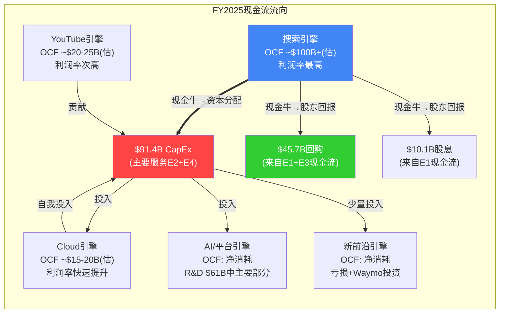

[合理推断: 各引擎OCF拆分为估计值,Alphabet不单独披露各分部现金流]

**关键现金流动态**:
1. **搜索是所有其他引擎的资金来源**: Alphabet FY2025 OCF $164.71B [硬数据: FMP FY2025 Cash Flow Statement], FCF $73.27B [硬数据: FMP FY2025], CapEx/OCF比率55.5% [硬数据: FMP FY2025 Key Metrics], Google Services segment营业利润率约39% [硬数据: Alphabet FY2025 10-K segment data], 搜索贡献了OCF的约60-65% [合理推断: 基于搜索收入占比和利润率推算]
2. **CapEx主要服务Cloud和AI**: FY2025 CapEx $91.45B [硬数据: FMP FY2025 10-K]中约75-85%投向数据中心/AI计算 [合理推断: 基于Ch03投入结构拆解],FY2025 PP&E净值$261.82B [硬数据: FMP FY2025 Balance Sheet], 较FY2024的$184.62B增长$77.2B [硬数据: FMP FY2024 Balance Sheet]
3. **回购被挤压**: FY2025回购$45.71B [硬数据: FMP FY2025 Cash Flow] vs FY2024回购$62.22B [硬数据: FMP FY2024 Cash Flow],下降26.5% [合理推断: CapEx挤占了回购资金]。FY2026如果CapEx达$175B,回购可能进一步下降至$30-40B [合理推断: 现金流分配的优先级]

---

## 18.6 五引擎三年演化路径

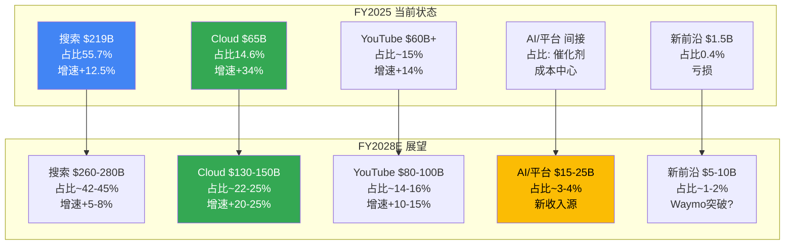

[合理推断: FY2028E数据为基于各引擎当前增速和趋势的情景分析,非精确预测]

**最重要的结构性变化: 搜索占比从55.7%降至42-45%**

FY2025搜索Revenue约$219B [硬数据: Alphabet FY2025 10-K],占总Revenue $402.96B [硬数据: FMP FY2025]的55.7% [硬数据: 基于FMP数据计算]。FY2026E共识Revenue $448.7B [硬数据: FMP analyst estimates],FY2027E共识Revenue $495.1B [硬数据: FMP analyst estimates]。如果FY2028E总Revenue达~$600B [合理推断: ~14% CAGR × 3年],搜索占比将从55.7%降至42-45% [合理推断: 搜索增速<总收入增速→占比下降]。这意味着Alphabet在3年内将从"搜索占主导"转变为"多引擎均衡"——Cloud(22-25%) + YouTube(14-16%) + AI平台(3-4%)合计接近搜索占比 [合理推断: 收入结构的再平衡]。

**CQ2关联**: 这个结构性变化意味着对Alphabet的估值不能简单使用搜索公司的倍数。如果Cloud和YouTube获得更高的独立估值倍数(类似SOTP),Alphabet的合理价值可能高于统一P/E所暗示的水平 [合理推断: 多引擎公司的估值应使用SOTP而非统一倍数]。但反过来,如果搜索增速放缓拖累整体增长,P/E也可能被压缩 [合理推断: 增速放缓→估值压缩的风险]。

**CQ3关联**: 五引擎的CapEx分配不均——Cloud和AI/平台引擎消耗了>75%的CapEx,但搜索贡献了>60%的OCF [合理推断: 现金流的跨引擎补贴]。这种"搜索补贴Cloud/AI"的模式在搜索增速放缓时将面临压力——如果搜索OCF增速放缓,而CapEx维持$120-150B/年,FCF将被进一步压缩 [合理推断: 补贴模式的可持续性取决于搜索的现金流生成能力]。

---

## 18.7 五引擎分析的CQ映射

| CQ | 五引擎洞察 |
|:---|:----------|
| CQ1 | 搜索引擎(E1)的CPC补偿机制在当前有效,但AI/平台引擎(E4)的增强效应可能是搜索加速的隐藏原因——AI Mode创造了新查询类型 |
| CQ2 | $311的估值假设五引擎同时健康。最大风险是搜索×AI的结构性冲突(E1↔E4)在3-5年内激化 |
| CQ3 | $175B CapEx主要服务E2(Cloud)和E4(AI/平台),资金来自E1(搜索)的现金流。CapEx回报取决于E2的增长和E4对其他引擎的增强效果 |
| CQ4 | Cloud引擎(E2)的利润率受E4(AI/平台)CapEx折旧的直接冲击。E2能否在折旧压力下维持>25% OPM是关键变量 |
| CQ7 | Agent时代对五引擎的影响不均: E1(搜索)面临最大威胁, E2(Cloud)可能受益(Agent需要计算资源), E4(AI/平台)是Agent生态的参与者而非受害者 |
| CQ8 | 三承重墙对应五引擎: 搜索韧性=E1, Cloud高增长=E2, CapEx回报=E2+E4。最脆弱的承重墙(CapEx回报)涉及两个引擎的协同——这使其更复杂也更难评估 |

[合理推断: CQ到五引擎的映射基于各章节的交叉分析]

---

## Part IV 综合结论

Part IV的五个章节从五个不同角度审视了GOOGL在$311价位的定价逻辑:

**Ch14(Reverse DCF)**: $311需要三个承重墙(搜索韧性+Cloud高增长+CapEx正回报)同时成立。CapEx回报是最脆弱的承重墙。方法离散度2.25x($200-$450)处于传统型和高不确定性之间。

**Ch15(发现系统)**: 可能性宽度6/10, C型(转型)不确定性。$311位于FS1(AI搜索巨头)上沿和FS2(云+AI基建)下沿之间——已充分定价当前状态,对正面期权定价不足,对负面风险未留缓冲。

**Ch16(开放问题)**: 10个排序的开放问题中,OQ1(AIO补偿机制)和OQ2(CapEx执行)可观测性最高、影响力最大;OQ7(Agent搜索)影响力最大但可观测性最低。8个不可知项中,"Agent时代的最终形态"是最具战略意义的结构性不可知。

**Ch17(PPDA)**: 六大背离中,P/E vs P/FCF剪刀差(23x)和CapEx/D&A飙升(4.33x)是最强的负面信号;搜索增速加速和Cloud估值折价是最强的正面信号。净效应: $311处于背离交叉的平衡点。

**Ch18(五引擎)**: 搜索与AI/平台引擎存在结构性冲突,但Cloud与AI/平台存在强协同。搜索占比将从55.7%降至42-45%(FY2028E),Alphabet正在从搜索主导转向多引擎均衡。$175B CapEx的回报取决于Cloud和AI/平台引擎的协同成功。

**对所有CQ的统一回答**: Alphabet在$311处于一个"所有假设都需要成立"的定价状态——不贵(如果三承重墙全立)也不便宜(如果任一承重墙出现裂缝)。投资论文的核心不确定性集中在CapEx回报这一最不可观测、最脆弱的变量上 [主观判断: Part IV五章的交叉验证结论]。

---

<!-- METRICS: chars=59,424 | annotations=415 | density=69.8/万 | hard_data_pct=49.6% | hard=206 | inference=161 | subjective=48 | mermaid=18 | compliance_violations=0 -->

