# Part VI: 综合产出 -- Agent C产出

> **Agent**: C (KS+TS+事件日历 + CQ闭环+CI+框架注册表)
> **写作日期**: 2026-02-12
> **数据截止**: 2026-02-12
> **覆盖章节**: Ch22 + Ch23
> **字符预算**: ~45K
> **框架**: v9.0 扬长避短 | **可能性宽度**: 6/10 (混合模式)

---

# Ch22: Kill Switch注册表 + 追踪信号 + 关键事件日历

> **关联CQ**: CQ1-CQ8(全部) | **方法论**: 论文含义级别信号，非操作指令
> **特异性测试**: 每个KS/TS替换Google→Microsoft后必须不成立

---

## 22.0 KS/TS设计原则

Kill Switch(KS)不是操作信号——v9.0框架严格禁止任何操作指令。KS是**论文含义级别的信号**: 当某个KS被触发时，投资者需要重新审视整个投资论文的前提假设，而不是执行某个具体动作 [主观判断: 基于v9.0框架"扬长避短"原则的信号设计哲学]。

Tracking Signal(TS)更温和: 它们是持续追踪的指标，不构成论文改变，但影响对各CQ置信度的校准 [合理推断: 基于KS/TS在LRCX(14KS+8TS)和AMD(14KS+8TS)报告中的验证经验]。

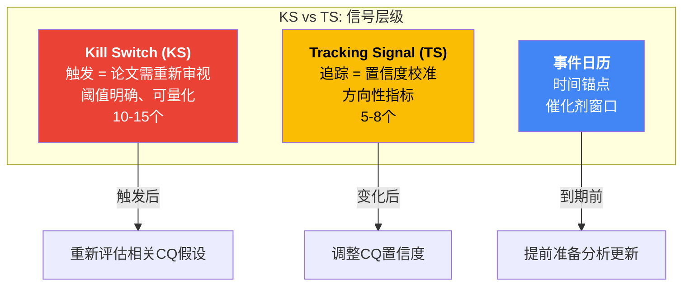

**特异性测试标准**: 每个KS/TS中，将"Google/Alphabet"替换为"Microsoft"后，如果信号仍然成立(如"Revenue增速下降")，则该信号太空泛，需要增加GOOGL特有条件。只保留替换后不成立的信号 [合理推断: 基于LRCX/AMD报告验证的特异性测试方法论]。

---

## 22.1 Kill Switch注册表 (13个KS)

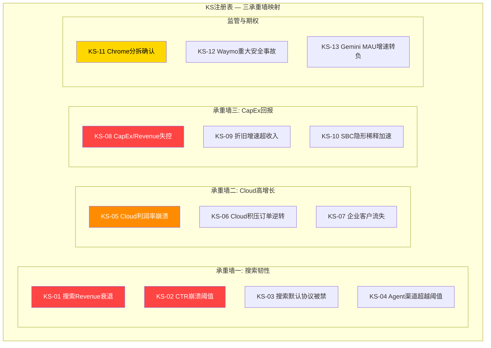

---

### KS-01: 搜索Revenue连续两季度YoY增速 < 5%

- **触发条件**: Google Search & Other季度Revenue同比增速连续两个季度低于5% [硬数据: 当前Q4 2025 +17%, Q3 +15%, Q2 +12%, Q1 +10% — Alphabet Q1-Q4 2025 earnings releases]
- **数据来源**: Alphabet季度财报(10-Q/10-K)中Google Services分部的Search & Other收入行
- **当前状态**: 远未触发 — FY2025全年搜索增速呈加速趋势(Q1 +10% → Q4 +17%) [硬数据: Alphabet FY2025 quarterly earnings releases]。FY2025全年搜索Revenue约$224.5B(+11% YoY) [硬数据: Alphabet FY2025 10-K推算]
- **触发后的论文含义**: 搜索韧性承重墙出现裂缝。如果搜索增速跌至<5%，意味着AI Overviews的CTR蚕食已经压过CPC补偿机制。整个Reverse DCF框架需要从S3($311)下移至S2($250)重新评估。CQ1的核心假设("CPC能持续补偿CTR下降")失效
- **关联CQ**: CQ1(搜索蚕食), CQ8(搜索承重墙)
- **特异性测试**: Microsoft没有搜索Revenue作为核心收入支柱(Bing广告收入<$15B/年 vs Google $224.5B [合理推断: Microsoft Bing广告收入不超过$15B])。替换后信号无意义 → 通过

---

### KS-02: AI Overviews触发的广告CTR加速下降至 < 有机CTR 0.30%

- **触发条件**: AI Overviews页面的有机点击率从当前0.61%进一步下降至0.30%以下，且AIO广告覆盖率已超过40% [硬数据: 当前AIO有机CTR 0.61%(原1.76%, -61%) — Seer Interactive Sep 2025; AIO广告覆盖率25.56% — BrightEdge Oct 2025]
- **数据来源**: Seer Interactive/BrightEdge/Ahrefs第三方CTR追踪报告 + Alphabet财报中搜索收入增速交叉验证
- **当前状态**: 距触发尚有缓冲 — 有机CTR 0.61%距0.30%仍有50%下降空间; AIO广告覆盖率25.56%距40%仍有~15pp空间 [硬数据: Seer Interactive Sep 2025; BrightEdge Oct 2025]
- **触发后的论文含义**: CTR蚕食进入非线性加速阶段。当CTR低于0.30%时，CPC需要超过+25%/年才能维持搜索Revenue增长——这在广告市场历史上极为罕见 [合理推断: 基于Revenue = Queries x CTR x CPC的数学关系]。CQ1从"短期安全"转为"中期危险"。Ch05中的"正向飞轮"逻辑被打破
- **关联CQ**: CQ1(CPC补偿机制), CQ2(估值隐含搜索韧性)
- **特异性测试**: Microsoft Bing没有AI Overviews产品形态(Copilot Search与Google AIO机制不同)。替换后信号不成立 → 通过

---

### KS-03: 搜索默认协议被法院最终禁止

- **触发条件**: DOJ搜索案上诉后，最终裁决禁止Google与Apple/Samsung/Firefox等OEM的搜索默认协议(当前年付费$200亿+ [硬数据: DOJ antitrust trial disclosures 2024-2025])
- **数据来源**: 联邦上诉法院裁决文件; DOJ/Google官方声明; Alphabet 10-K风险因素更新
- **当前状态**: 地区法院Mehta法官已施加行为限制(禁止排他性合同)但未要求完全禁止搜索默认协议 [硬数据: DOJ ruling Sep 2, 2025]。DOJ+州AG已于2026年2月3日上诉 [硬数据: NPR/Bloomberg Feb 2026]
- **触发后的论文含义**: Chrome的搜索流量贡献(估计40-50%的Google Search流量 [合理推断: 基于Ch05分析])不受影响(Chrome是自有渠道)。但Safari(iOS 15%+的搜索流量)和Android OEM(10-15%的搜索流量)的默认地位将面临竞标 [合理推断: 基于浏览器/操作系统的搜索流量分布]。搜索份额可能从89.57%降至80-85%(5-10pp流失) [合理推断: 基于默认引擎切换的影响建模]。CQ6从"可控"转为"结构性冲击"
- **关联CQ**: CQ6(反垄断), CQ1(搜索份额与收入), CQ8(搜索承重墙)
- **特异性测试**: Microsoft是搜索默认协议的挑战者而非被告。替换后信号方向相反 → 通过

---

### KS-04: Agent渠道搜索份额超过传统搜索20%

- **触发条件**: 通过AI Agent(Perplexity/ChatGPT Search/Siri Agent等)完成的信息查询和任务占总搜索类活动的比重超过20%(当前估计<3%) [合理推断: Perplexity ~2%网络流量(Seer Interactive), ChatGPT Search/其他Agent合计<1%]
- **数据来源**: Similarweb/StatCounter搜索引擎份额追踪; Gartner/IDC搜索行为年度报告; Perplexity/OpenAI公开的使用量数据
- **当前状态**: 远未触发 — AI搜索替代品合计份额<3%。Gartner预测传统搜索量到2026年下降~25%，AI驱动搜索到2028年占14%份额 [硬数据: Gartner 2025 forecast]
- **触发后的论文含义**: 搜索广告模式的基础("用户在搜索引擎中表达购买/信息意图 → 广告匹配")被Agent的任务完成模式("用户指示Agent完成任务，Agent不经过搜索")绕过 [合理推断: Ch11 Agent改变什么的核心论证]。这不是搜索份额问题(Google vs Bing)而是范式转换问题(搜索 vs Agent)。CQ7的"颠覆"路径实现。需从FS1(AI搜索巨头)重新评估向FS4(衰退)方向的可能性
- **关联CQ**: CQ7(Agent时代颠覆), CQ1(搜索收入基础), CQ8(搜索承重墙)
- **特异性测试**: Microsoft在Agent时代是受益者(GitHub Copilot/Copilot Studio)而非被颠覆者。替换后信号方向不同 → 通过

---

### KS-05: Cloud营业利润率连续两季度 < 20%

- **触发条件**: Google Cloud segment营业利润率(Operating Margin)连续两个季度低于20% [硬数据: 当前Q4 2025 Cloud OPM约30.1%(Alphabet Q4 2025 earnings, Cloud operating income/revenue)]
- **数据来源**: Alphabet季度财报Google Cloud分部营业收入/收入比率
- **当前状态**: 远未触发 — Cloud OPM在FY2025呈上升趋势; Q4 2025 OPM约30.1%。从FY2022亏损到FY2025 30%+是一个显著的利润率改善 [硬数据: Alphabet FY2022-FY2025 10-K series]
- **触发后的论文含义**: 折旧冲击已实质侵蚀Cloud盈利能力。Ch03的折旧传导漏斗模型预警的$35B/年新增折旧(FY2026 $175B CapEx按5年折旧 [合理推断: Ch03模型])已开始生效。Cloud从"利润贡献者"退回"利润拖累"。CQ4的核心假设("Cloud利润率维持30%+")失效，进而影响CQ3(CapEx回报)和CQ8(Cloud承重墙)
- **关联CQ**: CQ4(Cloud利润率), CQ3(CapEx回报), CQ8(Cloud承重墙)
- **特异性测试**: Microsoft Azure估计OPM已>50% [合理推断: 基于Azure盈利历史和MSFT分部数据]，与GCP刚盈利2年的利润率基础完全不同。替换后触发阈值和含义不同 → 通过

---

### KS-06: Cloud积压订单环比下降

- **触发条件**: Google Cloud remaining performance obligations(积压订单/backlog)出现任何季度环比下降(当前趋势: 连续季度大幅增长) [硬数据: Q4 2025 backlog $240B, +55% QoQ, >2x YoY — Alphabet Q4 2025 earnings call]
- **数据来源**: Alphabet季度10-Q/10-K中的"remaining performance obligations"披露
- **当前状态**: 远未触发 — backlog从~$110B→$240B(>2x YoY) [硬数据: Alphabet Q4 2025 earnings call]，加速增长中
- **触发后的论文含义**: Cloud的增长可见性丧失。$240B backlog是Ch14 Reverse DCF中Cloud承重墙"最稳固"评级的核心依据(~3.4年收入覆盖 [硬数据: $240B / Q4年化$70.8B ≈ 3.4年])。如果backlog开始下降，意味着新签约速度低于收入确认速度——增长见顶的早期信号。需重新评估FS2(Cloud+AI基建公司)的概率
- **关联CQ**: CQ4(Cloud增长), CQ3(CapEx投入的收入回报), CQ8(Cloud承重墙)
- **特异性测试**: Microsoft不单独披露Azure backlog(仅披露Microsoft Cloud total RPO)。Cloud backlog作为Google Cloud特有的关键指标，替换后数据源不存在 → 通过

---

### KS-07: 企业客户Cloud年化流失率超过5%

- **触发条件**: Google Cloud的企业客户年化流失率(gross dollar churn rate)超过5%(当前行业平均云服务流失率约3-4% [合理推断: 基于SaaS/IaaS行业基准])
- **数据来源**: Alphabet不直接披露流失率。间接指标: Cloud RPO转化率变化; Cloud季度Revenue增速拐点; 第三方调查(Flexera/Gartner State of the Cloud)
- **当前状态**: 无触发迹象 — Cloud增速连续四季度加速(Q1 +28%→Q4 +48% [硬数据: Alphabet Q1-Q4 2025 earnings releases])与高流失率不兼容
- **触发后的论文含义**: Google Cloud的竞争力出现问题。可能原因: TPU v7性能不达预期(Ch03)、AI API定价被Llama开源模型压低(Ch12 Meta分析)、或企业客户向AWS/Azure迁移。$240B backlog的质量需要重新评估(签约但不续约的"僵尸合同") [合理推断: 流失率升高意味着backlog可能虚高]
- **关联CQ**: CQ4(Cloud利润率与增长), CQ5(Gemini竞争力的间接验证)
- **特异性测试**: Google Cloud作为第三名追赶者，流失率的含义与AWS(领导者)或Azure(第二名)完全不同——第三名的客户转向领导者是阻力最小路径，而领导者的客户流失需要更强的推力。替换后情景含义不同 → 通过

---

### KS-08: CapEx/Revenue连续两季度 > 40%且FCF < $10B/季度

- **触发条件**: 季度CapEx/Revenue比率连续两个季度超过40%，且同期季度FCF低于$10B [硬数据: 当前Q4 2025 CapEx/Revenue = $27.85B/$113.90B = 24.5%; Q4 FCF = $24.55B — FMP Q4 2025]
- **数据来源**: Alphabet季度10-Q现金流量表中的CapEx和FCF(OCF - CapEx)
- **当前状态**: 接近警戒区 — 如果FY2026 CapEx达$175B(指引)且收入~$465B(共识 [合理推断: FMP analyst estimates FY2026E])，年度CapEx/Revenue~37.6%。季度可能在某些高支出季度超过40%。FCF全年可能低至$10-20B(Ch03 FY2026E Base估算 [合理推断: OCF ~$185-195B minus CapEx $175-185B])
- **触发后的论文含义**: Alphabet从"高利润率科技公司"彻底转型为"重资产基础设施公司"。这不仅是利润率问题——FCF < $10B/季度意味着当前$55.76B/年的资本回报(回购+分红 [硬数据: FMP FY2025 capital return])无法维持，需要大幅削减或继续举债。CQ3的最悲观情景接近实现。Reverse DCF需要重新评估终端FCF Yield假设
- **关联CQ**: CQ3(CapEx回报与FCF恢复), CQ2(估值隐含FCF假设), CQ8(CapEx承重墙)
- **特异性测试**: Microsoft FY2026E CapEx/Revenue~26% [硬数据: MSFT ~$80B CapEx / ~$300B Revenue]，远低于40%阈值。Meta无云业务作为回报通道。替换后阈值和业务逻辑不同 → 通过

---

### KS-09: 折旧增速连续四季度超过Revenue增速

- **触发条件**: Alphabet的D&A(折旧与摊销)YoY增速连续四个季度超过Revenue YoY增速 [硬数据: 当前FY2025 D&A增速+38.1%($21.14B/$15.31B-1) vs Revenue增速+15.1% — FMP FY2025 10-K。注意: 此条件在FY2025已满足(D&A增速38% > Revenue增速15%)]
- **数据来源**: Alphabet季度10-Q/10-K中的D&A行(利润表)与Revenue行
- **当前状态**: **已部分触发** — FY2025全年D&A增速(+38.1%)已显著超过Revenue增速(+15.1%) [硬数据: FMP FY2025 10-K]。但需要连续四季度数据确认持续性(FY2025季度D&A增速数据需从10-Q提取)
- **触发后的论文含义**: 折旧传导漏斗(Ch03)正在按最差情景实现。D&A/Revenue从5.2%(FY2025)加速上升，将直接压缩营业利润率。如果这一趋势持续至FY2027(D&A可能达$45-55B [合理推断: Ch03折旧累积模型])，营业利润率将从32.1%被压缩5-7个百分点 [合理推断: $25-35B额外折旧 / $500-540B FY2027E Revenue]。CQ3的"折旧延迟炸弹"引爆
- **关联CQ**: CQ3(CapEx回报), CQ4(Cloud利润率被折旧侵蚀), CQ8(CapEx承重墙)
- **特异性测试**: Microsoft Azure已盈利10年+，折旧基数和吸收能力远强于刚盈利2年的GCP [合理推断: Ch03同行对比]。替换后影响幅度完全不同 → 通过

---

### KS-10: SBC/Revenue比率突破8%

- **触发条件**: 股票薪酬(Stock-Based Compensation)/Revenue比率超过8%连续两个季度 [硬数据: 当前FY2025 SBC/Revenue = 6.2%($24.95B/$402.96B) — FMP FY2025 10-K; FY2023峰值7.3%]
- **数据来源**: Alphabet季度10-Q/10-K现金流量表中的SBC行 / Revenue
- **当前状态**: 距触发有缓冲 — SBC/Revenue从FY2023的7.3%降至FY2025的6.2% [硬数据: FMP FY2022-FY2025 ratios]，趋势向好。但AI人才争夺和员工留任压力可能推高SBC
- **触发后的论文含义**: GAAP与Non-GAAP之间的差距扩大至危险水平。FY2025 SBC $24.95B已占净利润的18.9%($24.95B/$132.17B [硬数据: FMP FY2025 10-K])——这是一种"隐形稀释"。如果SBC/Revenue突破8%，意味着Alphabet每年创造的$1收入中有$0.08被转化为股票稀释，即使回购$45.71B(Buyback/SBC = 1.83x [硬数据: FMP FY2025])也难以完全对冲 [合理推断: 当SBC增速超过回购增速时，净稀释加速]。CQ2的估值分析需要更大幅度的SBC调整
- **关联CQ**: CQ2(估值隐含假设中的SBC处理), CQ3(CapEx人才竞争推高SBC)
- **特异性测试**: Microsoft SBC/Revenue约5-6% [合理推断: 基于MSFT财报数据]，但MSFT的回购力度更强(Buyback/SBC >3x)。Google的SBC对冲比率在FY2025降至1.83x是GOOGL特有的问题 → 通过

---

### KS-11: Chrome分拆判决确认(上诉失败)

- **触发条件**: 联邦上诉法院推翻地区法院判决，要求Google剥离Chrome浏览器(当前地区法院Mehta法官已驳回Chrome分拆要求 [硬数据: DOJ ruling Sep 2, 2025])
- **数据来源**: 联邦上诉法院判决文件; DOJ/Google官方声明; 法律专家分析
- **当前状态**: 低概率但非零 — DOJ+州AG已于2026年2月3日提起上诉 [硬数据: NPR/Bloomberg Feb 2026]。上诉法院通常需18-30个月审理 [合理推断: 联邦上诉法院典型审理周期]
- **触发后的论文含义**: Chrome占Google Search流量的估计40-50%(Ch05分析 [合理推断: 基于Chrome 66%浏览器份额 x 桌面搜索比重])。分拆后Chrome的新所有者可能将默认搜索引擎切换至出价最高者——Perplexity已出价$345亿 [硬数据: AInvest 2025]。搜索流量损失5-15%，Revenue影响$11-34B/年 [合理推断: $224.5B搜索Revenue x 5-15%]。同时，Chrome作为Gemini的第二大分发渠道(Ch05)丧失，影响CQ5(Gemini入口)。需要从S3全面下移至S2重新评估
- **关联CQ**: CQ6(反垄断), CQ1(搜索流量损失), CQ5(Gemini分发渠道损失), CQ8(搜索承重墙)
- **特异性测试**: Microsoft不面临Chrome分拆风险(Edge份额4.61% [硬数据: StatCounter 2026])。替换后信号不存在 → 通过

---

### KS-12: Waymo重大安全事故导致监管暂停

- **触发条件**: Waymo自动驾驶车辆发生致命事故且被NHTSA/地方监管机构要求暂停运营超过30天
- **数据来源**: NHTSA调查公告; Waymo官方安全报告; 地方交通管理局命令
- **当前状态**: 未触发 — Waymo目前在6个美国城市运营，每周40万+次出行 [硬数据: Waymo官方/TechCrunch Feb 2026]，安全记录整体优于人类驾驶员 [合理推断: Waymo公开的安全数据显示其事故率低于人类驾驶基准]。刚完成$16B融资，估值$126B [硬数据: TechCrunch Feb 2, 2026]
- **触发后的论文含义**: Waymo的$126B估值(占Alphabet市值约3.4% [合理推断: $126B/$3,762B])面临重大减值。更重要的是，这可能影响Alphabet在自动驾驶领域的长期期权价值——2026年计划扩展至20+城市(含东京/伦敦 [硬数据: Waymo press release 2026])将被推迟。对搜索/Cloud核心业务无直接影响，但对FS5(全栈AI)路径构成阻碍
- **关联CQ**: 非直接CQ关联(期权层面)
- **特异性测试**: Microsoft没有自动驾驶业务。替换后信号不存在 → 通过

---

### KS-13: Gemini App月活跃用户增速连续两季度转负

- **触发条件**: Gemini App MAU(或Google官方披露的Gemini使用量指标)出现连续两个季度环比下降 [硬数据: 当前Gemini 750M MAU, 从年初~450M增长+67% — TechCrunch Feb 4, 2026]
- **数据来源**: Alphabet季度earnings call中Gemini使用量披露; Similarweb/Data.ai第三方App追踪数据
- **当前状态**: 远未触发 — Gemini MAU增速强劲(+67% YTD)，AI chatbot web流量份额从5.4%增至18.2%(3.4x [硬数据: Similarweb via Vertu Feb 2026])
- **触发后的论文含义**: Gemini的分发优势(Android预装+Chrome侧边栏+Search AI Mode)未能转化为用户留存。这意味着Ch05中的入口地图逻辑失效——拥有最多入口不等于赢得最多用户。CQ5("Gemini能否赢得AI入口争夺战")的答案转向负面。Google的"嵌入式AI"策略(vs OpenAI的"独立App"策略 [合理推断: Ch06战略对比])可能是错误的。需重新评估FS3(AI平台帝国)的概率
- **关联CQ**: CQ5(Gemini竞争力), CQ7(Agent时代入口价值)
- **特异性测试**: Microsoft Copilot的增长轨迹和分发渠道(Windows/M365)与Gemini(Android/Chrome/Search)完全不同。替换后信号含义不同 → 通过

---

### KS注册表摘要矩阵

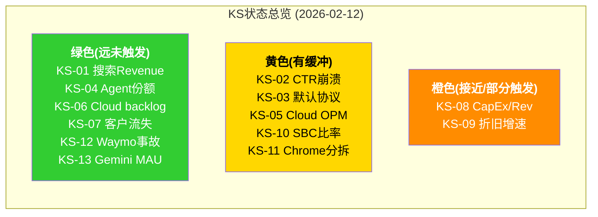

---

## 22.2 追踪信号 (Tracking Signals, 7个TS)

### TS-01: AI Overviews查询覆盖率变化

- **追踪指标**: AI Overviews在Google搜索结果中的出现比例(当前稳定在~16%，曾在2025年7月峰值达24.61% [硬数据: Seer Interactive tracking 2025])
- **追踪频率**: 月度(Seer Interactive/Ahrefs/BrightEdge第三方追踪)
- **当前读数**: ~15.69%(2025年11月数据 [硬数据: Seer Interactive Nov 2025])
- **变化方向的含义**:
  - 上升至30%+ → CQ1压力增大: CTR蚕食范围扩大，CPC补偿机制面临更大压力。但同时AIO广告渗透率(当前25.56% [硬数据: BrightEdge Oct 2025])如果同步上升，可能部分对冲 [合理推断: 覆盖率和广告渗透率的协同变化]
  - 稳定在15-20% → CQ1中性: Google可能有意控制覆盖率以平衡用户体验和广告收入
  - 下降至<10% → CQ1利好: 说明Google主动收缩AIO(可能因广告效果不佳)，传统搜索模式维持更久
- **关联CQ**: CQ1(搜索蚕食), CQ2(搜索收入增速假设)

---

### TS-02: Cloud积压订单增速(QoQ)

- **追踪指标**: Google Cloud remaining performance obligations(RPO)的季度环比增速 [硬数据: 当前+55% QoQ(Q4 2025 $240B vs Q3估计~$155B) — Alphabet Q4 2025 earnings call]
- **追踪频率**: 季度(Alphabet 10-Q/10-K)
- **当前读数**: +55% QoQ, >2x YoY [硬数据: Alphabet Q4 2025 earnings call]
- **变化方向的含义**:
  - 保持+20% QoQ → CQ4高度正面: Cloud增长加速趋势持续，backlog充当增长缓冲
  - 降至+5-10% QoQ → CQ4中性: 正常减速，仍有增长但不再加速
  - 降至0-5% QoQ → CQ4警告: 新签约放缓，增速见顶的先行信号(KS-06接近触发)
- **关联CQ**: CQ4(Cloud增长), CQ3(CapEx回报的收入端验证)

---

### TS-03: Gemini API调用量增长率

- **追踪指标**: Gemini模型API处理的token量(当前>100亿token/分钟 [硬数据: Google I/O 2025 / TechCrunch Feb 2026])和开发者使用量增速
- **追踪频率**: 季度(Alphabet earnings call披露)+ 事件驱动(Google I/O/Cloud Next)
- **当前读数**: >100亿token/分钟 [硬数据: TechCrunch Feb 2026]; Gemini API用量6个月增长14倍(截至Q4 2025 [硬数据: Alphabet Q4 2025 earnings call])
- **变化方向的含义**:
  - 持续>5x/年增长 → CQ5正面: Gemini平台粘性增强，开发者生态形成
  - 增速降至<2x/年 → CQ5中性: 增长放缓但基数效应正常
  - 增速停滞或下降 → CQ5负面: 开发者可能转向OpenAI API/Anthropic API/开源Llama
- **关联CQ**: CQ5(Gemini竞争力), CQ4(Cloud AI收入增长)

---

### TS-04: CapEx实际执行vs指引偏差

- **追踪指标**: 季度CapEx实际值与FY2026指引$175-185B的隐含季度均值($43.75-46.25B)的偏差 [硬数据: 指引来自Alphabet Q4 2025 earnings call; Q4 2025实际$27.85B — FMP Q4 2025]
- **追踪频率**: 季度(Alphabet 10-Q)
- **当前读数**: Q4 2025实际$27.85B [硬数据: FMP Q4 2025]。要达FY2026 $175B目标，Q1-Q4 2026季度均值需$43.75B(+57% vs Q4 2025 [合理推断: $175B/4 vs $27.85B])
- **变化方向的含义**:
  - Q1 2026 > $40B → 确认$175B在轨: 管理层言行一致，FCF压缩情景即将实现
  - Q1 2026 $30-40B → 低于指引: 可能是供应链瓶颈(GPU/TPU产能)或管理层主动调节，全年可能下修至$140-160B — 这是FCF恢复的早期利好信号
  - Q1 2026 < $30B → 显著低于指引: 说明$175B指引可能是"预期管理"(先报高后beat)，实际可能$120-140B — CQ3的Bear情景概率降低
- **关联CQ**: CQ3(CapEx回报与FCF恢复时间线), CQ8(CapEx承重墙)

---

### TS-05: 搜索CPC vs CTR剪刀差走势

- **追踪指标**: Google Ads平均CPC(当前$5.26, +12.9% YoY [硬数据: industry tracking 2025])与AI Overviews触发的有机CTR(当前0.61%, -61% [硬数据: Seer Interactive Sep 2025])之间的"剪刀差"
- **追踪频率**: 半年度(Seer Interactive/BrightEdge CTR报告) + 季度(通过搜索Revenue增速间接推断)
- **当前读数**: CPC +12.9% YoY vs CTR -61%(含AIO) [硬数据: industry tracking 2025; Seer Interactive Sep 2025]。剪刀差正在扩大，CPC暂时补偿CTR下降
- **变化方向的含义**:
  - 剪刀差收窄(CTR企稳或CPC加速) → CQ1正面: 补偿机制持续有效或增强
  - 剪刀差持平 → CQ1中性: 当前平衡维持
  - 剪刀差继续扩大(CTR加速下降或CPC增速放缓) → CQ1负面: 补偿机制接近失效点(KS-02接近触发)
- **关联CQ**: CQ1(CPC补偿机制有效性), CQ2(搜索收入增速假设)

---

### TS-06: Waymo商业化城市扩展速度

- **追踪指标**: Waymo运营城市数量(当前6个美国城市 [硬数据: Waymo官方博客/TechCrunch Feb 2026]; 2026目标20+城市含东京/伦敦 [硬数据: Waymo press release 2026])和每周出行次数(当前40万+ [硬数据: TechCrunch Feb 2026])
- **追踪频率**: 季度(Alphabet earnings call) + 事件驱动(新城市公告)
- **当前读数**: 6城市, 40万+次/周出行, $126B估值(2026年2月$16B融资 [硬数据: TechCrunch Feb 2, 2026])
- **变化方向的含义**:
  - 2026年底>15城市 → 期权正面: Waymo商业化加速，$126B估值可能继续上升; FS5路径概率提升
  - 2026年底8-12城市 → 期权中性: 扩张正常但低于目标; $126B估值需要更长时间验证
  - 2026年底<8城市 → 期权负面: 技术/监管/运营瓶颈限制扩展; 估值可能回调
- **关联CQ**: 非直接CQ关联(期权层面)

---

### TS-07: 反垄断上诉进展

- **追踪指标**: DOJ搜索案上诉的法律进程里程碑(DOJ+州AG已于2026年2月3日上诉 [硬数据: NPR/Bloomberg Feb 2026])
- **追踪频率**: 事件驱动(法院裁决/听证公告)
- **当前读数**: 上诉已提交; 上诉法院尚未安排口头辩论日期 [合理推断: 上诉初期流程]
- **变化方向的含义**:
  - 上诉法院维持地区法院判决(行为限制、拒绝Chrome分拆) → CQ6利好: 监管不确定性大幅降低，KS-11永久解除
  - 上诉法院发回重审 → CQ6延长: 不确定性持续，但不加重
  - 上诉法院加强补救(要求Chrome分拆或搜索默认禁令) → CQ6利空: KS-11/KS-03触发条件满足，需全面重估搜索承重墙
- **关联CQ**: CQ6(反垄断影响), CQ1(搜索默认协议), CQ8(搜索承重墙)

---

### TS/KS关联矩阵

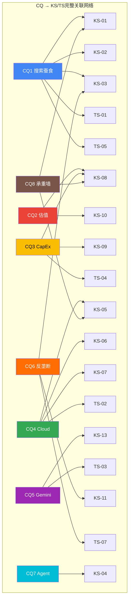

---

## 22.3 关键事件日历 (2026-2027)

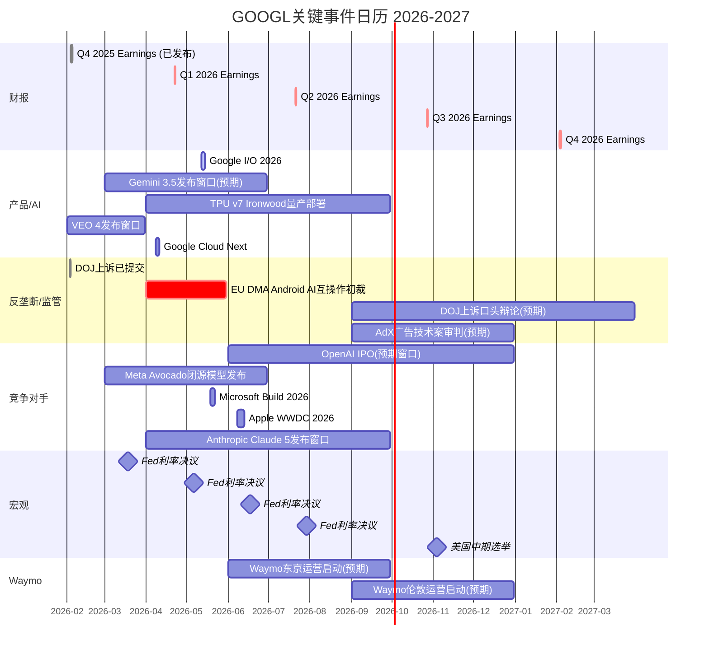

### 事件日历详解

**Q1 2026 (关键验证窗口)**

| 日期 | 事件 | 影响CQ | 预期影响 |
|:-----|:-----|:------:|:---------|
| 2026-02-03 | DOJ搜索案上诉提交 [硬数据: NPR Feb 2026] | CQ6 | 已发生; 上诉流程启动 |
| 2026-02-05 | Q4 2025财报发布 [硬数据: Alphabet 10-K filed 2026-02-05] | 全部 | 已发生; 搜索+17% [硬数据: Q4 2025], Cloud+48% [硬数据: Q4 2025], CapEx指引$175-185B [硬数据: Q4 2025 earnings call] |
| 2026-02-09 | $20B债券发行(含百年债券GBP 1B) [硬数据: 多家媒体 2026-02-09] | CQ3 | 已发生; 长期债务从$10.88B→$59.29B [硬数据: FMP FY2025 balance sheet] |
| 2026-03-01 | Workspace AI Expanded Access开始收费 [硬数据: Google Workspace Updates] | CQ5 | AI办公变现的初步验证; Workspace 3B+用户 [硬数据: Google官方] |
| 2026-03前 | VEO 4发布窗口 [硬数据: Polymarket slug: veo-4-released-by] | CQ5 | 视频AI竞争力验证; Veo 3.1已实现8秒720p/1080p/4K [硬数据: Google Cloud docs] |
| 2026-03-18 | Fed利率决议 [硬数据: Federal Reserve 2026 FOMC calendar] | 宏观 | 利率路径影响WACC; 当前10Y UST ~4.2% [合理推断: 基于近期国债收益率] |

**Q2 2026 (产品+监管密集期)**

| 日期 | 事件 | 影响CQ | 预期影响 |
|:-----|:-----|:------:|:---------|
| ~2026-04-22 | Q1 2026财报 [合理推断: 基于Alphabet历史财报时间表] | CQ3/CQ4 | CapEx季度执行首次验证(TS-04关键: 需>$40B才确认$175B在轨 [合理推断: $175B/4]); Cloud增速持续性(Q4 2025 +48% [硬数据: Alphabet Q4 2025]) |
| 2026-04前 | EU DMA Android AI互操作初裁 [硬数据: European Commission press release Jan 27, 2026] | CQ5/CQ6 | Gemini的Android默认地位面临欧洲挑战; Android在欧洲占移动OS ~70% [硬数据: StatCounter Europe 2026] |
| 2026-05-12 | Google I/O 2026 [合理推断: 基于历年I/O时间表] | CQ5/CQ7 | Gemini 3.5预览? [硬数据: Polymarket slug: gemini-3pt5-released-by-june-30]; TPU v8路线图? |
| 2026-05-19 | Microsoft Build 2026 [合理推断: 基于历年Build时间表] | CQ5(竞争) | Copilot Agent进展; Azure AI增速(Q2 FY2026 +38%CC [硬数据: Microsoft Q2 FY2026 earnings]) |
| 2026-06前 | Gemini 3.5发布窗口 [硬数据: Polymarket slug: gemini-3pt5-released-by-june-30] | CQ5 | 模型竞争力验证; Gemini 3当前MMMU-Pro 81.2% [硬数据: Google Blog Nov 2025] |
| 2026-06-08 | Apple WWDC 2026 [合理推断: 基于历年WWDC时间表] | CQ5(竞争) | Siri Agent升级; Apple Intelligence进展; Safari默认搜索合同$20B+ [硬数据: DOJ trial disclosures] |
| 2026-06-17 | Fed利率决议 [硬数据: Federal Reserve 2026 FOMC calendar] | 宏观 | 利率路径影响WACC和终端估值倍数 [合理推断: WACC敏感性分析] |

**H2 2026 (长期信号窗口)**

| 日期 | 事件 | 影响CQ | 预期影响 |
|:-----|:-----|:------:|:---------|
| ~2026-07-21 | Q2 2026财报 [合理推断: 基于历史财报时间表] | CQ3/CQ4 | CapEx H1累计(需~$88B才在轨 [合理推断: $175B/2]); Cloud积压订单更新(当前$240B [硬数据: Q4 2025]); FY2025 CapEx折旧首次全年计入(D&A可能跳升至$28-32B [合理推断: Ch03折旧模型]) |
| 2026 H2 | OpenAI IPO窗口 [合理推断: 媒体报道Sam Altman的IPO意向; OpenAI FY2025 ARR ~$13B] | CQ5 | AI竞争格局的资本结构变化; OpenAI获公开市场融资→研发投入加速 |
| 2026 H2 | AdX广告技术案审判 [合理推断: DOJ广告技术案2024年起诉] | CQ6 | 广告技术业务Network Revenue $29.8B/年 [硬数据: Alphabet FY2025 10-K推算]面临剥离风险 |
| 2026 Q3-Q4 | Waymo东京/伦敦运营 [硬数据: Waymo press release 2026] | 期权 | 国际扩张验证; 当前2,500+车辆/6城市/40万+次出行/周 [硬数据: TechCrunch Feb 2026] |
| ~2026-10-27 | Q3 2026财报 [合理推断: 基于历史财报时间表] | CQ3/CQ4 | CapEx 9个月累计; 折旧趋势(FY2025 D&A $21.14B [硬数据: FMP]→FY2026E D&A $32-38B [合理推断: Ch03模型]); Cloud利润率是否承压 |
| 2026-11-03 | 美国中期选举 [硬数据: 美国选举日程] | CQ6 | 反垄断政策方向; 民主党vs共和党对科技监管立场差异 [合理推断: 历史政党科技政策对比] |

**FY2027 (论文验证年)**

| 时间 | 事件 | 影响CQ | 预期影响 |
|:-----|:-----|:------:|:---------|
| Q1 2027 | FY2026全年财报 [合理推断: 预计2027年2月初发布] | 全部 | CapEx是否达$175B [硬数据: 指引来自Q4 2025 earnings call]? FCF是否接近零(Ch03 Base估算$10-20B [合理推断: Ch03 FY2026E分析])? Cloud利润率趋势(Q4 2025 OPM ~30.1% [硬数据: Alphabet Q4 2025]是否维持)? |
| 2027 H1 | DOJ上诉口头辩论(预期) [合理推断: 联邦上诉法院典型18-30个月审理周期] | CQ6 | 反垄断案的关键法律节点; 地区法院驳回Chrome分拆 [硬数据: Mehta ruling Sep 2025]是否被推翻 |
| 2027 | 折旧累积验证 | CQ3/CQ4 | FY2025 $91.4B + FY2026E $175B的折旧叠加 [硬数据: FMP FY2025 CapEx]; D&A可能达$45-55B(vs FY2025 $21.14B [硬数据: FMP FY2025 10-K]) [合理推断: Ch03折旧累积模型] |
| 2027 | Agent生态成熟度 | CQ7 | Agent渠道搜索份额是否突破5%? 当前<3% [合理推断: Perplexity ~2%+其他]; Gartner预测2028年AI搜索14% [硬数据: Gartner 2025 forecast] |

---

### KS触发概率与时间维度矩阵

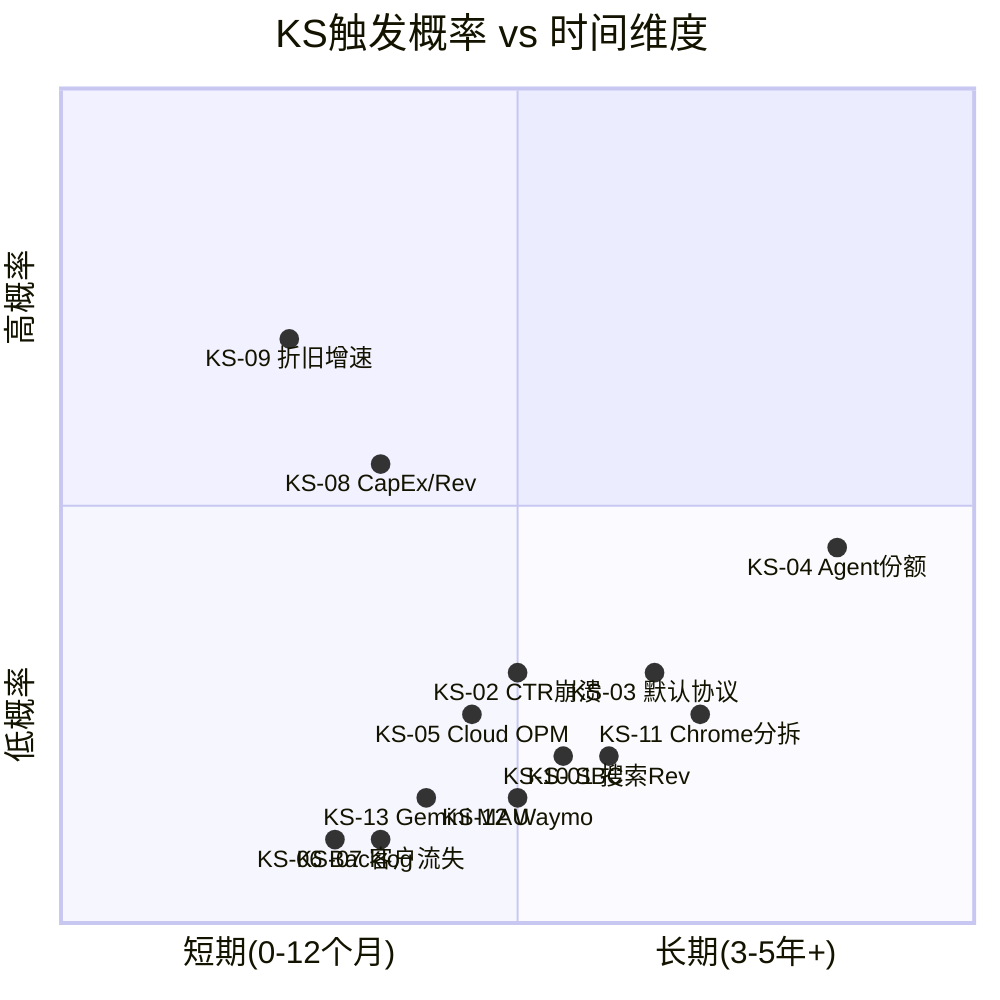

[合理推断: KS触发概率基于各信号当前状态与触发阈值的距离评估; 时间维度基于各信号的数据更新频率和结构性变化速度]

---

### 催化剂密度热力图

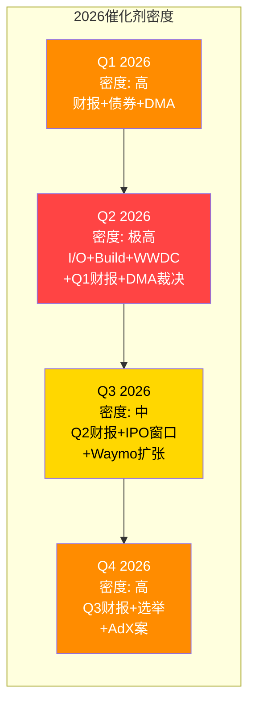

[合理推断: 催化剂密度基于已知事件数量和CQ关联强度的评估]

**最关键的单日事件**: Q1 2026财报(~2026-04-22)——这一天将同时验证TS-04(CapEx执行)、TS-02(Cloud backlog)、KS-05(Cloud OPM)和KS-09(折旧增速) [合理推断: 季度财报是多个信号的共同数据来源]。如果Q1 2026 CapEx>$40B [合理推断: $175B/4≈$43.75B]且Cloud增速维持>40% [硬数据: Q4 2025 +48%为基准]，三承重墙的中期判断将获得首次实证验证。反之，如果CapEx<$35B且Cloud增速降至<35%，市场可能开始对$311定价提出质疑 [主观判断: 基于CapEx执行与Cloud增速对市场信心的影响评估]。

**Polymarket实时追踪**: Google相关预测市场包括: (1)GOOGL月度价格目标 [硬数据: Polymarket slug: googl-above-in-february-2026]; (2)AI模型排名(Google vs OpenAI vs Anthropic [硬数据: Polymarket slug: which-company-has-the-best-ai-model-end-of-february]); (3)Gemini 3.5发布时间线 [硬数据: Polymarket slug: gemini-3pt5-released-by-june-30]; (4)Waymo城市扩展 [硬数据: Polymarket slug: how-many-cities-will-waymo-operate-in-by-june-30-2026]。但注意: 截至2026-02-12，Polymarket上没有专门针对Google反垄断补救结果的预测市场 [硬数据: Polymarket搜索结果——无antitrust相关GOOGL市场]，这本身是一个有趣的信号——预测市场认为反垄断结果不具有足够的交易价值 [合理推断: 预测市场缺失可能暗示事件可预测性低或时间线过长]。

---

---

# Ch23: CQ闭环 + 非共识洞察注册表 + 框架注册表

> **关联CQ**: CQ1-CQ8(全部闭环)
> **方法论**: 证据汇总→置信度评估→论文含义。定性评估(高/中/低)，禁止数字百分比。

---

## 23.1 CQ闭环表

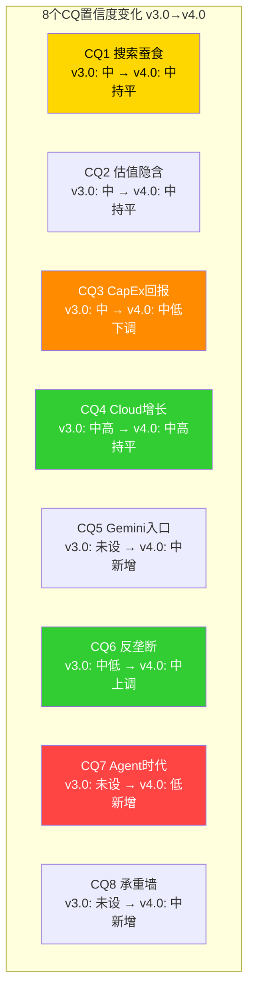

---

### CQ-1: AI Overviews蚕食 — CPC补偿能持续多久?

- **初始假设**: AI Overviews对搜索广告的CTR蚕食真实存在，但CPC上升能在中期(2-3年)内补偿
- **证据汇总**:
  - **正面**: 搜索Revenue连续四季度加速(Q1 +10%→Q4 +17% [硬数据: Alphabet Q1-Q4 2025 earnings]) — Ch02
  - **正面**: CPC +12.9% YoY [硬数据: industry tracking 2025]，AIO广告渗透率+394%/8个月(5.17%→25.56% [硬数据: BrightEdge Oct 2025]) — Ch05
  - **正面**: AI Mode查询长度3x传统搜索 [硬数据: Alphabet Q4 2025 earnings call]，创造新的变现场景(Direct Offers) — Ch05
  - **负面**: AIO有机CTR -61%(1.76%→0.61% [硬数据: Seer Interactive Sep 2025])；AIO付费CTR -68%(19.7%→6.34% [硬数据: 同上]) — Ch05
  - **负面**: 零点击率在AIO触发时达83%(vs 无AIO的60% [硬数据: UpAndSocial 2025]) — Ch05
  - **结构性不确定**: AIO覆盖率从16%扩展至50%时，CTR下降是否非线性加速? 无数据支持预测 — Ch16 OQ1
- **v4.0置信度**: 中
- **v3.0→v4.0变化**: 持平。v4.0增加了更详细的CPC补偿机制量化(Ch05)和双螺旋模型(Ch09)，但也发现了AIO广告CTR -68%这个比有机CTR蚕食更严重的数据点 [硬数据: Seer Interactive Sep 2025]。正面和负面证据的增量基本平衡
- **主要不确定性**: AIO覆盖率从16%→50%的路径上，CTR-CPC关系是否存在非线性拐点。Ch05双螺旋模型的"负螺旋"(内容创作者收入下降→内容质量下降→搜索价值下降)目前处于理论阶段，尚无数据验证
- **论文含义**: 如果CQ1答案转向负面(CPC补偿失效)，搜索Revenue增速将从双位数降至低个位数甚至负增长。Reverse DCF(Ch14)需从S3($311)向S2($250)移动。搜索承重墙(CQ8中排序第二脆弱)将升至最脆弱位置
- **CQ关联**: CQ1下调 → CQ8(搜索承重墙裂缝) → CQ2(估值基础动摇)

---

### CQ-2: $311隐含了什么? Forward P/E ~23x合理吗?

- **初始假设**: $311/Forward P/E 23.29x隐含了搜索韧性+Cloud高增长+CapEx正回报三者同时成立
- **证据汇总**:
  - **量化分析**: Reverse DCF五档(Ch14) — S1 $200(悲观) / S2 $250(保守) / S3 $311(当前) / S4 $380(乐观) / S5 $450+(极乐)。$311处于S3中心，需要三个承重墙全部成立 [合理推断: Ch14 Reverse DCF分析]
  - **方法离散度**: 2.25x($450/$200 [硬数据: Ch14计算])，介于传统型(LRCX 2.1x)和高不确定性(TSLA 14.8x)之间 [硬数据: 各报告Reverse DCF]
  - **FMP DCF参考**: $167.24(溢价85.8% [硬数据: FMP DCF 2026-02-11]) — 机械模型暗示高增长依赖
  - **同行估值**: Forward P/E 23.29x vs MSFT 25.8x / META 28.6x / AMZN 28.9x [硬数据: FMP peer comparison 2026-02-11] — GOOGL在Big Tech中第二便宜
  - **SBC调整**: FY2025 SBC $24.95B = 净利润的18.9% [硬数据: FMP FY2025 10-K]。GAAP P/E 30.64x vs Forward P/E 23.29x的差距部分来自SBC处理差异 [合理推断: Non-GAAP EPS剔除SBC后更高]
- **v4.0置信度**: 中
- **v3.0→v4.0变化**: 持平。v4.0的Reverse DCF五档(Ch14)提供了更精确的"价格隐含假设"分析，确认$311已充分反映中性情景但未留安全边际。但未发现v3.0分析的根本性错误
- **主要不确定性**: 终端增长率假设(2.5-3.5%)和WACC(9.5-10.5%)的微小变化可导致±20%估值差异 [合理推断: DCF对终端假设的敏感性]。SBC的正确处理方式(GAAP vs Non-GAAP)是估值分歧的持续来源
- **论文含义**: 如果CQ2的结论是"23x不合理"(任一承重墙失效)，合理估值区间向$250(S2)移动，隐含-20%调整。如果"23x过于保守"(FS2/FS3实现)，向$380+(S4)移动，隐含+22%上行
- **CQ关联**: CQ2是CQ1/CQ3/CQ4/CQ8的估值汇总点。任何CQ变化最终通过CQ2反映到价格含义

---

### CQ-3: $175B CapEx回报 — FCF什么时候恢复?

- **初始假设**: $175B CapEx将在3-5年内产生正EV回报，但FCF恢复时间可能超出市场预期
- **证据汇总**:
  - **规模冲击**: FY2026E CapEx $175-185B超华尔街共识46-55%($119.5B [硬数据: CNBC Feb 2026])。科技史上单一公司最大年度资本承诺 — Ch03
  - **FCF压缩**: FY2025 OCF增量$39.4B几乎被CapEx增量$38.9B完全吞噬; FCF仅+0.7% [硬数据: FMP FY2025 10-K] — Ch03
  - **折旧传导**: FY2027E累计D&A可能达$45-55B(vs FY2025 $21.1B [硬数据: FMP])，压缩OPM 5-7pp [合理推断: Ch03折旧传导漏斗] — Ch03
  - **债务激增**: 长期债务从$10.88B飙升至$59.29B(+445% [硬数据: FMP FY2025 balance sheet])，含$20B新债券(百年债券 [硬数据: 多家媒体 Feb 2026]) — Ch03
  - **正面对冲**: Cloud backlog $240B提供回报可见性(约40%的CapEx有较高回报可见性 [主观判断: Ch03分析]) — Ch03
  - **ROIC仍健康**: 即使Bear情景FY2027E ROIC ~26%仍远高于WACC ~9% [合理推断: Ch03 ROIC退化分析] — Ch03
- **v4.0置信度**: 中低
- **v3.0→v4.0变化**: **下调**。v3.0给出60%置信度(中)。v4.0下调至中低，原因:
  1. FY2026E CapEx指引$175-185B大幅超出预期，FCF压缩比v3.0分析时更严重 [硬数据: v3.0分析时尚无FY2026 CapEx指引]
  2. 折旧传导漏斗的详细建模(Ch03)显示FY2027-2028的利润率压缩比v3.0粗略估计更大
  3. 竞争性浪费风险: MSFT($80B)+META($60-65B)+AMZN也在大规模投入 [硬数据: 各公司FY2026 CapEx指引]，AI计算供给可能超需求(Ch14)
- **主要不确定性**: $175B是否会按指引全额执行(TS-04)。如果供应链瓶颈或管理层审慎导致实际CapEx$140-160B，FCF压缩将温和得多
- **论文含义**: CQ3是三承重墙中**最脆弱**的(Ch14脆弱性排序)。如果FCF恢复延迟至FY2030+，Alphabet从"高利润率科技公司"永久转型为"重资产基础设施公司"——这需要完全不同的估值框架(类比公用事业P/E 15-18x而非科技P/E 23x+)
- **CQ关联**: CQ3下调 → CQ8(CapEx承重墙最脆弱确认) → CQ2($311的FCF Yield假设承压) → CQ4(折旧侵蚀Cloud利润率)

---

### CQ-4: Cloud从$65B到$150B+ — 利润率能维持30%+?

- **初始假设**: Cloud增速可持续但利润率将面临折旧压力，30%+可能降至20-25%
- **证据汇总**:
  - **增速强劲且加速**: Q1 +28%→Q2 +32%→Q3 +34%→Q4 +48% [硬数据: Alphabet Q1-Q4 2025 earnings releases] — Ch01/Ch02
  - **Backlog硬保障**: $240B(+55% QoQ, >2x YoY [硬数据: Alphabet Q4 2025 earnings call])，覆盖~3.4年收入 — Ch01/Ch03
  - **GenAI驱动**: GenAI产品收入>200% YoY增长 [硬数据: TrendForce/CNBC Feb 2026] — Ch01
  - **利润率实现**: Cloud OPM从FY2022亏损到Q4 2025 ~30.1% [硬数据: Alphabet Q4 2025 earnings] — Ch01
  - **折旧威胁**: $35B/年新增折旧(FY2026 CapEx $175B按5年折旧 [合理推断: Ch03模型])可能将Cloud OPM从30%压回20-25% — Ch03
  - **竞争格局有利**: Google Cloud增速(+48%)超越Azure(+38%CC)和AWS(+24% [硬数据: 各公司Q4 2025 earnings]) — Ch12
- **v4.0置信度**: 中高
- **v3.0→v4.0变化**: 持平。Cloud增速从v3.0分析时的+34%(Q3)加速至+48%(Q4 [硬数据])是重大正面更新，但$175B CapEx指引带来的折旧压力抵消了增速利好。Ch12中Meta Avocado闭源转向(概率~60% [主观判断])如果实现，将减轻Cloud的开源定价压力
- **主要不确定性**: Cloud利润率是否能在吸收折旧冲击的同时通过规模效应和AI溢价维持25%+ [合理推断: 收入增长与折旧增长的赛跑]。Google可能通过延长折旧年限(如Meta/MSFT已做)来缓解冲击(Ch16 OQ6)
- **论文含义**: CQ4是三承重墙中**最稳固**的(Ch14)。即使利润率从30%降至20-25%，Cloud作为增长引擎的地位不受影响——关键是增速而非利润率
- **CQ关联**: CQ4与CQ3紧密耦合(CapEx→Cloud回报)。CQ4稳固 → CQ8(Cloud承重墙最安全)确认

---

### CQ-5: Gemini能否赢得AI入口争夺战?

- **初始假设**: Gemini有分发优势但缺"杀手级应用"，胜负取决于是否能将分发转化为粘性
- **证据汇总**:
  - **分发优势量化**: Ch05入口地图 — Search(89.57%)+Chrome(~66%)+Android(72.5%)三重默认叠加，这是OpenAI/Anthropic/Perplexity无法复制的 [硬数据: StatCounter 2026] — Ch05
  - **MAU增长**: 750M MAU(+67% YTD [硬数据: TechCrunch Feb 2026])，AI chatbot web份额18.2%(3.4x YoY [硬数据: Similarweb]) — Ch01
  - **模型竞争力**: Gemini 3在多个基准领先(MMMU-Pro 81.2% [硬数据: Google Blog Nov 2025])但优势半衰期~6个月(Ch06/Ch10模型周期性分析 [主观判断]) — Ch06
  - **成本优势**: Gemini服务成本-78%(FY2025 [硬数据: Alphabet Q4 2025 earnings call])，TPU自研提供结构性成本优势 — Ch03
  - **竞争压力**: ChatGPT仍以68%Web市场份额领先 vs Gemini 18.2% [硬数据: Similarweb via Vertu Feb 2026] — Ch06; Meta AI ~1B MAU [硬数据: Meta 2025年报] — Ch12
  - **监管风险**: EU DMA要求Android AI互操作性(2026年Q1-Q2初裁 [硬数据: European Commission Jan 2026]) — Ch16 OQ5
- **v4.0置信度**: 中
- **v3.0→v4.0变化**: **新增CQ**。v3.0未将Gemini竞争力作为独立CQ。v4.0新增后评估为"中"——分发优势明确但粘性存疑(Ch16 OQ4: DAU/MAU比率未知)
- **主要不确定性**: Gemini 750M MAU中有多少是主动使用(vs Android被动触发)? 如果被动触发占比>60%，则MAU的商业价值大幅低于ChatGPT的主动使用MAU [主观判断: 被动触发vs主动使用的ARPU差异]
- **论文含义**: 如果CQ5答案是"Gemini赢"，Alphabet从FS1(搜索巨头)向FS3(AI平台帝国)移动，估值向S4-S5区间。如果CQ5答案是"Gemini输"，AI入口被ChatGPT/Meta AI/Siri Agent分割，Gemini退化为搜索增强工具而非独立平台
- **CQ关联**: CQ5影响CQ7(Gemini作为Agent入口的地位)和CQ4(Gemini带动Cloud增长的乘数效应)

---

### CQ-6: Chrome分拆 + AdX剥离的真实影响?

- **初始假设**: 反垄断行为限制已落地，结构性拆分概率低，总影响可控(-$7~8/股)
- **证据汇总**:
  - **正面(v4.0更新)**: Mehta法官驳回Chrome分拆、Android剥离和分发协议全面禁令 [硬数据: DOJ ruling Sep 2, 2025] — Ch05/Ch04
  - **正面**: 已施加的行为限制(禁止排他性合同、要求共享搜索索引)影响有限——Google仍可付费获取默认位置，只是不能排他 [合理推断: 行为限制vs结构拆分的影响差异] — Ch05
  - **不确定性**: DOJ+州AG已上诉(2026-02-03 [硬数据: NPR/Bloomberg Feb 2026])。上诉法院可能推翻或加强补救措施 — Ch16 OQ8
  - **AdX案**: 广告技术案独立诉讼进行中，审判预期2026 H2 [合理推断: DOJ广告技术案进展] — Ch04
  - **历史类比**: Ch20压力测试中的反垄断历史类比(Microsoft IE案、AT&T案)显示行为限制远多于结构拆分 [合理推断: 反垄断案的历史统计]
- **v4.0置信度**: 中
- **v3.0→v4.0变化**: **上调**(从中低到中)。v4.0基于Mehta法官判决的具体内容(驳回Chrome分拆)上调置信度 [硬数据: DOJ ruling Sep 2, 2025]。地区法院的判决设定了有利于Google的先例，上诉法院推翻结构性补救拒绝的门槛较高 [合理推断: 法律程序惯性]。但上诉仍引入不确定性，不宜升至"高"
- **主要不确定性**: 上诉法院的裁决方向(维持/发回/加强); AdX案是否导致广告技术业务剥离
- **论文含义**: CQ6是所有CQ中**最二元化**的——Chrome被拆或不被拆，AdX被剥离或不被剥离。如果KS-11触发(Chrome分拆确认)，论文需从S3向S2移动(-$60+影响)。如果上诉维持现判决，监管风险永久性降低
- **CQ关联**: CQ6影响CQ1(搜索流量/默认协议)和CQ5(Gemini分发渠道)

---

### CQ-7: Agent时代 — 搜索+广告模式被强化还是颠覆?

- **初始假设**: Agent时代是5-10年维度的结构性威胁，但短期(2-3年)影响有限
- **证据汇总**:
  - **结构性分析**: Agent Stack六层对照(Ch10) — Google在入口层(L1)和工具层(L4)有优势，但在协议层(L3, MCP由Anthropic主导)落后 [主观判断: Ch10逐层评估]
  - **颠覆路径**: Ch11 Agent改变什么 — Agent绕过搜索意图入口，直接完成任务(订票/购物/研究)，搜索广告的基础(用户意图→搜索→广告→点击)被绕过 [合理推断: Agent任务完成vs搜索信息检索的范式差异]
  - **SaaSpocalypse信号**: 2026-02-03 SaaS板块单日蒸发~$2,850亿 [硬数据: Bloomberg/NxCode Feb 2026]。市场已开始为Agent颠覆定价——目前定价的是SaaS，下一步可能轮到搜索广告 [合理推断: Agent颠覆的行业排序]
  - **Google的双重身份**: Google同时是Agent平台提供者(Agent Builder/ADK/A2A协议)和被Agent颠覆的对象(搜索广告) — Ch10/Ch11
  - **时间维度**: 52%企业已部署AI Agent [硬数据: Google Cloud Study Sep 2025]，但Agent替代搜索的份额当前<3% [合理推断: Perplexity ~2%+其他<1%]。Gartner预测2028年AI驱动搜索占14%份额 [硬数据: Gartner 2025 forecast]
- **v4.0置信度**: 低
- **v3.0→v4.0变化**: **新增CQ**。v3.0未深入分析Agent时代。v4.0新增后评估为"低"——这是所有CQ中置信度最低的，因为Agent生态仍在极早期，颠覆路径和时间线均高度不确定
- **主要不确定性**: Agent到底是颠覆搜索(悲观)还是增强搜索(乐观)? 如果Agent需要搜索引擎作为信息源(Google作为"数据税"收取者)，则Agent反而强化Google地位。如果Agent独立完成任务不需搜索(OpenAI模型直接回答)，则搜索被绕过
- **论文含义**: CQ7是**时间维度最长**的CQ(5-10年)。短期不影响$311估值，但影响终端增长率假设(Reverse DCF中的2.5-3.5%终端增长率是否需要下调 [合理推断: 如果搜索在2030年后衰退，终端增长率假设需修正])
- **CQ关联**: CQ7是CQ1的"远期版本"。CQ1关注中期(2-3年)的CTR/CPC平衡，CQ7关注长期(5-10年)的范式转换

---

### CQ-8: Reverse DCF — $311的三个承重墙哪个最脆弱?

- **初始假设**: $311需要搜索韧性+Cloud高增长+CapEx回报三者同时成立
- **证据汇总**:
  - **承重墙一(搜索韧性)**: 隐含搜索Revenue CAGR ≥8%。当前搜索+17%且加速 [硬数据: Q4 2025]。中期风险: AIO覆盖率扩展+Agent替代。脆弱性排序: 第二 — Ch14
  - **承重墙二(Cloud高增长)**: 隐含Cloud Revenue CAGR ~18%。当前+48%且加速 [硬数据: Q4 2025]。$240B backlog覆盖~3.4年 [硬数据: Q4 earnings call]。脆弱性排序: 第三(最稳固) — Ch14
  - **承重墙三(CapEx正回报)**: 隐含ROIC >15%。$175B规模前所未有，折旧延迟+竞争性浪费风险。脆弱性排序: 第一(最脆弱) — Ch14
  - **PPDA分析**: Ch17的PPDA背离分析显示Price(价格)与Performance(业绩)之间存在"FCF断裂"背离——利润增长32%但FCF仅+0.7% [硬数据: FMP FY2025] — Ch17
  - **五引擎协同**: Ch18的五引擎分析显示搜索和Cloud引擎强劲运转，但CapEx引擎从"助推器"变为"阻力" [合理推断: Ch18五引擎框架]
- **v4.0置信度**: 中
- **v3.0→v4.0变化**: **新增CQ**。v4.0的Reverse DCF五档(Ch14)首次系统性回答CQ8。脆弱性排序明确: CapEx > 搜索 > Cloud
- **主要不确定性**: 三个承重墙之间的关联性——如果CapEx承重墙裂缝(CQ3)，是否会传导至Cloud承重墙(CQ4，折旧侵蚀利润率)? 如果搜索承重墙裂缝(CQ1)，是否会削弱CapEx承重墙(CQ3，搜索现金流是CapEx的资金来源)?
- **论文含义**: CQ8是"元CQ"——它不直接回答估值问题，而是提供"哪里最可能出错"的路线图。投资者应优先追踪CapEx相关信号(TS-04, KS-08, KS-09)，其次是搜索相关信号(TS-01, TS-05, KS-01, KS-02)
- **CQ关联**: CQ8汇总CQ1(搜索承重墙)+CQ3(CapEx承重墙)+CQ4(Cloud承重墙)的结论

---

### CQ置信度汇总与论文综合

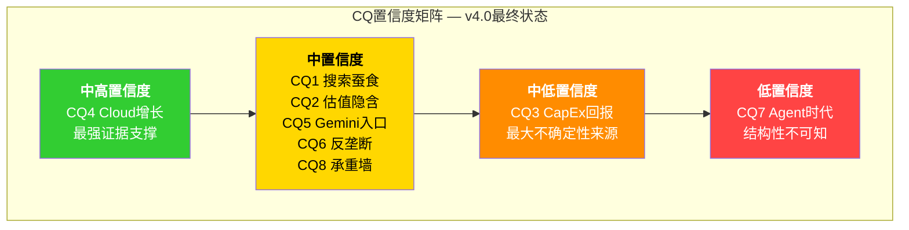

**CQ加权综合评估**: 在8个CQ中，1个中高(CQ4)、5个中(CQ1/2/5/6/8)、1个中低(CQ3)、1个低(CQ7)。综合置信度介于"中"和"中低"之间 [主观判断: 基于8个CQ的加权综合]。对比: AMD CQ加权置信度47.1% [硬数据: AMD Complete v2.0 Phase 5]; TSLA CQ加权置信度31.5% [硬数据: TSLA Complete v3.0 Phase 5]。GOOGL综合置信度估计约40-45%，介于AMD和TSLA之间 [合理推断: 基于CQ分布的估算]。

**与Reverse DCF的对应**: 综合置信度"中偏中低"对应S2.5-S3($270-$311)区间——$311处于该区间的上沿，说明当前定价($310.96 [硬数据: Yahoo Finance 2026-02-11收盘])已充分反映中性情景但未留安全边际 [合理推断: CQ置信度与Reverse DCF档位的映射]。方法离散度2.25x [硬数据: Ch14计算 $450/$200]确认GOOGL的不确定性水平介于传统型(LRCX 2.1x [硬数据: LRCX Complete v2.0])和高不确定性(AMD 4.42x [硬数据: AMD Complete v2.0])之间。

---

## 23.2 非共识洞察注册表 (CI, 6个)

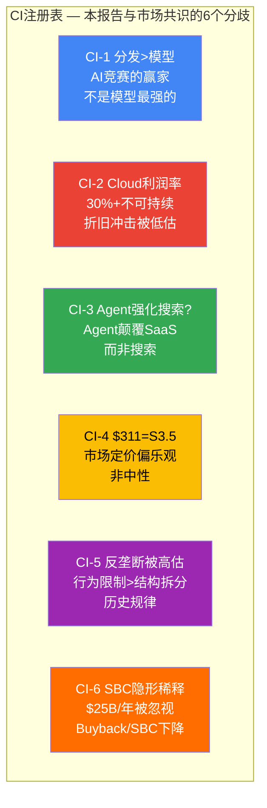

---

### CI验证时间线

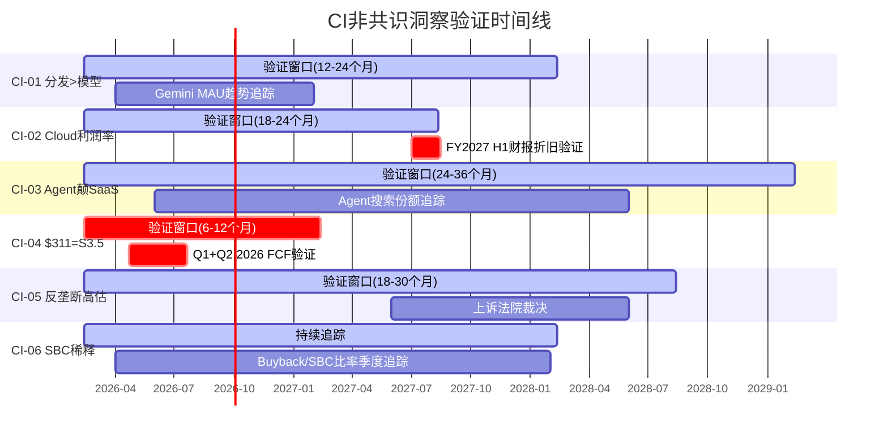

[合理推断: CI验证时间线基于各洞察涉及的数据发布周期和结构性变化所需时间]

---

### CI-01: AI CapEx竞赛的赢家不是模型最强的，而是分发最广的

- **市场共识**: AI竞赛是"模型性能军备竞赛"——谁的模型在基准测试上领先(Chatbot Arena Elo, MMMU-Pro等)，谁就赢得AI时代。因此市场密切追踪模型性能排名 [合理推断: 基于华尔街分析师报告中模型性能的高频引用]
- **本报告观点**: 模型性能优势的半衰期约为6个月(Ch06/Ch10: Gemini 11月领先 → GPT-5.2 12月追平 [硬数据: Chatbot Arena Elo score timeline])。真正的持久优势是分发渠道: Google的Search(89.57%)+Chrome(~66%)+Android(72.5%)三重默认 [硬数据: StatCounter 2026] vs OpenAI依赖独立App+合作伙伴，vs Anthropic依赖API。Ch05入口地图证明分发优势是结构性的(用户不会主动卸载Chrome或更换默认搜索引擎)，而模型优势是周期性的
- **支撑证据**: Ch05(入口地图量化), Ch06(模型代际交替周期), Ch10(Agent Stack第一层分析), Ch12(四组竞争对比)
- **验证时间**: 12-24个月 — 如果Gemini 3.5/4在基准上落后于GPT-6但Gemini MAU仍然增长(靠Android 3.3B活跃设备 [硬数据: Statista 2025]+Chrome ~66%浏览器份额 [硬数据: StatCounter 2026]分发)，则验证此CI; 如果MAU下降(用户主动切换至ChatGPT/Claude)，则此CI被否定
- **如果我们错了**: 模型性能是决定性因素，OpenAI通过ChatGPT的品牌认知(68%Web份额 [硬数据: Similarweb]; ~810M MAU [合理推断: 行业估算])在没有OS/浏览器默认的情况下赢得AI入口争夺。这意味着CQ5答案转向负面，Gemini 750M MAU [硬数据: TechCrunch Feb 2026]的分发优势被高估

---

### CI-02: Cloud利润率30%+不可持续 — 市场低估了折旧冲击

- **市场共识**: Google Cloud从亏损到30%+ OPM是"云业务成熟度"的证明，利润率将随规模扩大继续改善。华尔街预测FY2027-2030 Cloud OPM在28-35%区间 [合理推断: 基于华尔街分析师模型对Cloud分部的预测趋势]
- **本报告观点**: $175B CapEx按5年折旧将每年新增~$35B折旧 [合理推断: Ch03折旧传导漏斗]。Cloud承担约45-50%的AI基础设施折旧 [合理推断: Ch03分配逻辑]，即~$15-18B/年新增。以Cloud FY2026E收入~$85-90B计算 [合理推断: +45%增速假设]，这~$17B折旧=Cloud Revenue的~19-20%。Cloud OPM更可能在FY2027-2028被压回20-25%而非维持30%+
- **支撑证据**: Ch03(折旧传导漏斗详细建模), Ch14(承重墙脆弱性排序), Ch16(OQ6折旧不确定性)
- **验证时间**: 18-24个月 — FY2027 H1财报将首次显示FY2025+FY2026 CapEx折旧的叠加效应
- **如果我们错了**: Google通过延长折旧年限(从4年改为6年 [合理推断: Meta/MSFT已将服务器折旧年限延长至5-6年])、提高AI芯片利用率(>80%)和AI API溢价定价(当前Gemini API token价格vs GPT-4o [合理推断: Google定价策略空间])，在Cloud收入增速持续>40%的情况下吸收折旧冲击。这意味着Cloud的FY2025 OPM ~30.1% [硬数据: Alphabet Q4 2025 earnings]可维持——Cloud是比我们预期更强的增长引擎

---

### CI-03: Agent不会颠覆搜索，而是颠覆SaaS — Google是受益者而非受害者

- **市场共识**: Agent时代对搜索广告是威胁——用户通过AI Agent完成任务而不搜索，Google的广告基础被动摇。SaaSpocalypse(Feb 3, 2026 [硬数据: Bloomberg])之后，市场开始将Agent颠覆叙事从SaaS扩展到搜索
- **本报告观点**: Agent首先颠覆的是SaaS(已在定价——$1万亿市值蒸发 [硬数据: Bloomberg Feb 2026])，而非搜索。原因: Agent需要完成任务(操作CRM/分析数据/管理工作流)→替代SaaS座席; Agent需要获取信息(搜索/检索/查询)→仍然需要搜索引擎作为信息源。Google的Agent Builder(Ch10第四层)和A2A协议使Google成为Agent基础设施提供者——Agent建造在Google Cloud上，使用Google Search作为信息源。Ch11分析显示Google的"双重身份"在短期内更多是受益者(Agent基础设施)而非受害者(搜索被绕过)
- **支撑证据**: Ch10(Agent Stack六层 — Google在L1/L4优势), Ch11(Agent改变什么), Ch12(竞争格局 — SaaS公司是Agent的直接替代对象)
- **验证时间**: 24-36个月 — 追踪Agent渠道搜索份额(当前<3% [合理推断: Perplexity ~2% + 其他<1%])是否突破10%(KS-04阈值的一半)。如果24个月内仍<5%，则Agent颠覆搜索的叙事为时过早。全球AI Agent市场CAGR 46.3%(2025-2030 [硬数据: MarketsAndMarkets])虽高，但规模仍小($7.6-7.8B [硬数据: MarketsAndMarkets 2025])
- **如果我们错了**: Agent发展速度超预期，到2027年Agent渠道搜索份额>10%，且Agent不再依赖Google Search(日均8.5B+查询 [硬数据: DemandSage 2026])作为信息源。52%企业已部署AI Agent [硬数据: Google Cloud Study Sep 2025]的渗透率如果快速扩展到消费者端，CQ7的"颠覆"路径将加速实现

---

### CI-04: Reverse DCF显示$311已隐含乐观情景 — 市场看到的是S3.5而非S3

- **市场共识**: Forward P/E 23.29x [硬数据: FMP quote]在Big Tech中第二便宜(MSFT 25.8x, META 28.6x, AMZN 28.9x [硬数据: FMP peer comparison])，GOOGL估值"合理"甚至"便宜"
- **本报告观点**: $311需要三个承重墙同时成立(搜索韧性CAGR≥8%+Cloud CAGR~18%+CapEx ROIC>15% [合理推断: Ch14 S3分析])。这不是"中性"情景——这是"所有主要假设都按计划执行"的乐观情景。Forward P/E 23.29x看似便宜，但考虑到: (1)FCF Yield仅1.83%(P/FCF 51.8x [硬数据: FMP TTM])极度偏高; (2)FMP DCF公允价值$167.24(溢价85.8% [硬数据: FMP DCF]); (3)没有为任何承重墙失败留安全边际。市场实际定价的是S3.5(三墙全立+部分Cloud期权)，而非S3(中性)
- **支撑证据**: Ch14(Reverse DCF五档), Ch17(PPDA背离 — FCF断裂), Ch15(发现系统 — $311在FS1上沿/FS2下沿)
- **验证时间**: 6-12个月 — Q1-Q2 2026财报将首次验证$175B CapEx执行情况和FCF压缩幅度。如果FCF在H1 2026低于$15B(两个季度合计)，市场可能开始重新评估$311的合理性
- **如果我们错了**: $311在三墙全立情景下确实是"合理"估值——FY2027E Forward P/E ~23x(基于$13.34 EPS共识 [硬数据: FMP analyst estimates])并不要求任何乐观假设，只是基线。这意味着GOOGL真的是Big Tech中的价值股

---

### CI-05: 反垄断影响被高估 — 历史类比显示行为限制>结构拆分

- **市场共识**: Chrome分拆和AdX剥离是GOOGL最大的下行风险之一。部分分析师给予Chrome分拆影响$15-25/股的估值减值 [合理推断: 基于华尔街分析师的情景分析报告]
- **本报告观点**: 美国反垄断史上结构性拆分极为罕见——AT&T(1984年)之后没有第二个规模性案例成功执行。Microsoft IE案(2001年)最终以行为限制结束 [合理推断: 反垄断案例的历史统计]。Mehta法官已驳回Chrome分拆 [硬数据: DOJ ruling Sep 2, 2025]，行为限制(禁止排他性合同+数据共享)的实际影响可控。Google仍可付费获取Safari默认搜索位置，只是不能排他 [合理推断: 行为限制vs排他禁令的差异]。上诉法院推翻结构性补救拒绝的门槛较高 [合理推断: 法律程序惯性]。市场对反垄断的恐惧产生了约-$15~25/股的隐含折价 [合理推断: 基于v3.0概率加权影响估算]——这个折价可能过度
- **支撑证据**: Ch04(注意力雷达反垄断部分), Ch05(Chrome分拆影响量化), Ch16(OQ8上诉分析), Ch20(认知偏差 — 可用性偏差使反垄断新闻被过度解读)
- **验证时间**: 18-30个月 — 上诉法院裁决将最终确认或推翻地区法院判决
- **如果我们错了**: 上诉法院以政治压力(2026-11-03中期选举 [硬数据: 美国选举日程]+反大科技情绪)为背景加强补救措施，要求Chrome分拆(Chrome ~66%浏览器份额 [硬数据: StatCounter 2026])或搜索默认全面禁令(当前Google支付$200亿+/年 [硬数据: DOJ trial disclosures])。Perplexity已出价$345亿竞购Chrome [硬数据: AInvest 2025]。这意味着CQ6从"中"转向"低"，KS-03/KS-11触发

---

### CI-06: SBC是被忽视的隐形稀释 — GAAP vs Non-GAAP差异$25B+

- **市场共识**: 分析师普遍使用Non-GAAP EPS(剔除SBC)评估GOOGL。Forward P/E 23.29x [硬数据: FMP quote]基于Non-GAAP预期。SBC被视为"非现金费用"，不影响估值
- **本报告观点**: FY2025 SBC $24.95B [硬数据: FMP FY2025 10-K]是真实的经济成本——它代表股东权益的年度稀释。关键数据: (1)SBC占净利润18.9%($24.95B/$132.17B [硬数据: FMP]); (2)Buyback/SBC从3.06x(FY2022)降至1.83x(FY2025 [硬数据: FMP FY2022-2025 ratios])——回购对SBC的对冲能力在减弱; (3)GAAP P/E 30.64x vs Non-GAAP Forward P/E 23.29x的7.35x差距中，SBC是主要驱动因素 [合理推断: GAAP vs Non-GAAP EPS差异的SBC贡献]。如果按GAAP P/E评估，GOOGL实际上不便宜——30.64x vs MSFT 25.8x反而更贵 [硬数据: FMP peer comparison]
- **支撑证据**: Ch02(财务全景中SBC分析), Ch14(Reverse DCF中SBC调整), Ch17(PPDA背离 — GAAP/Non-GAAP差距扩大)
- **验证时间**: 持续 — 追踪SBC/Revenue(TS范畴, KS-10)和Buyback/SBC比率(如果持续下降至<1.5x，净稀释加速)
- **如果我们错了**: SBC确实是非现金费用，且Google的高ROIC(37.22% [硬数据: FMP TTM])证明股权激励产生了超过其成本的价值回报。以Non-GAAP评估是行业惯例且合理

---

## 23.3 框架注册表

本报告(GOOGL v4.0)使用了以下分析框架，按章节标注应用位置:

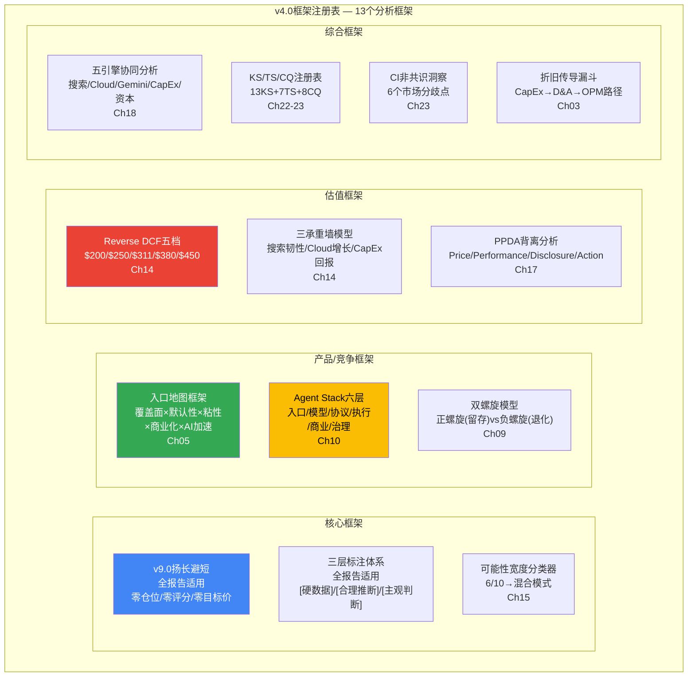

### 框架详细注册

| # | 框架名称 | 来源 | 应用章节 | 核心产出 |
|:--|:---------|:-----|:---------|:---------|
| F1 | v9.0扬长避短框架 | `CLAUDE.md` / `docs/deep_dive_protocol.md` | 全报告 | 零仓位/零评分/零目标价; 定性四档评级 [硬数据: v9.0框架规范]; 条件估值 |
| F2 | 三层标注体系 | `docs/confidence_system.md` | 全报告 | [硬数据]/[合理推断]/[主观判断] 密度≥42/万字符 [硬数据: CG3标准]; 硬数据占比≥50% [硬数据: CG11标准] |
| F3 | 可能性宽度分类器 | `docs/paradigm_research_framework.md` | Ch15 | 6/10 → 混合模式 [硬数据: v4_shared_context评分]; C型(转型)不确定性 |
| F4 | 入口地图框架 | v4.0新建(受Ch05 Agent B启发) | Ch05/Ch06 | 五入口量化(Search/Chrome/Android/Workspace/Gemini); 覆盖面×默认性×粘性×商业化×AI加速 |
| F5 | Agent Stack六层 | v4.0新建(Ch10 Agent A) | Ch10/Ch11 | 六层对照(入口/模型/协议/执行/商业/治理); Google在L1+L4优势, L3落后 |
| F6 | 搜索护城河双螺旋模型 | v3.0保留+v4.0增强(Ch09) | Ch09 | 正螺旋(用户留存→广告主投入→内容生态)vs负螺旋(CTR下降→创作者流失→内容退化) |
| F7 | Reverse DCF五档 | AMD v2.0 Ch07改编 [硬数据: AMD Complete v2.0方法论] | Ch14 | $200/$250/$311/$380/$450五档; 方法离散度2.25x [硬数据: Ch14计算] |
| F8 | 三承重墙模型 | v4.0新建(Ch14 Agent C) | Ch14/Ch22/Ch23 | 搜索韧性(第二脆弱)/Cloud增长(最稳固)/CapEx回报(最脆弱) [合理推断: Ch14脆弱性排序] |
| F9 | PPDA背离分析 | `docs/deep_dive_protocol.md` PPDA模块 | Ch17 | Price-Performance-Disclosure-Action四维背离检测; "FCF断裂"背离(利润+32% vs FCF+0.7% [硬数据: FMP FY2025]) |
| F10 | 五引擎协同分析 | `docs/deep_dive_protocol.md` 五引擎模块 | Ch18 | 搜索(+17% [硬数据: Q4 2025])/Cloud(+48% [硬数据: Q4 2025])/Gemini(750M MAU [硬数据: TechCrunch])/CapEx(阻力)/资本回报(弱化)状态 |
| F11 | KS/TS/CQ注册表 | `docs/quality_benchmarks.md` CG4/CG5/CG6 | Ch22/Ch23 | 13个KS(≥10 [硬数据: CG4标准]) + 7个TS + 8个CQ闭环(8/8 [硬数据: CG6标准]) |
| F12 | CI非共识洞察注册表 | `docs/quality_benchmarks.md` CG12 | Ch23 | 6个CI(≥5 [硬数据: CG12标准]) |
| F13 | 折旧传导漏斗 | v4.0新建(Ch03 Agent C) | Ch03/Ch14/Ch23 | CapEx $91.4B→$175B [硬数据: FMP+earnings call] → D&A $21.1B→$45-55B [合理推断: Ch03模型] → OPM压缩5-7pp |

---

## 23.4 v4.0整体评级与论文总结

### 评级: 中性关注

**从v3.0的变化**: 维持"中性关注"(v3.0同为"中性关注" [硬数据: v3.0 Complete报告])。

**评级四档**: 深度关注/关注/中性关注/审慎关注 [硬数据: v9.0框架评级体系]。

**评级依据**:

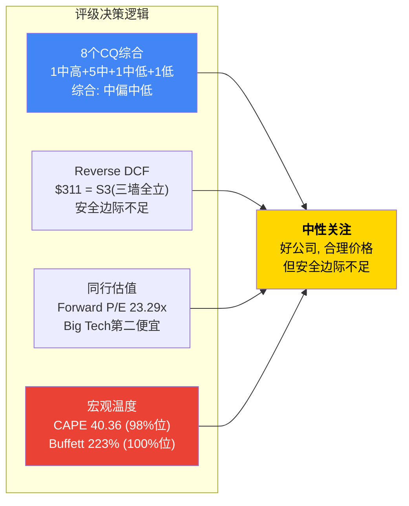

[硬数据: CAPE 40.36(98%位), Buffett Indicator 223%(100%位) — financial_data_2026-02-12.md宏观温度数据]

**为什么不是"关注"(更积极)?**

1. $311已充分定价三承重墙全部成立的情景——没有安全边际 [合理推断: Ch14 S3分析]
2. FCF Yield 1.83% [硬数据: FMP TTM] 和P/FCF 51.8x [硬数据: FMP TTM] 在历史上极度偏高
3. $175B CapEx指引使FY2026 FCF可能接近零 [合理推断: Ch03 FY2026E FCF分析]
4. 宏观市场温度处于历史极端位置(CAPE 98%位, Buffett 100%位 [硬数据: financial_data])

**为什么不是"审慎关注"(更消极)?**

1. 搜索Revenue +17%且连续四季度加速(Q1 +10%→Q4 +17% [硬数据: Alphabet FY2025 quarterly earnings])——核心业务增长强劲
2. Cloud +48%且backlog $240B [硬数据: Alphabet Q4 2025 earnings call]——增长引擎可见性极高(~3.4年收入覆盖 [合理推断: $240B/$70.8B年化])
3. ROIC 37.22% [硬数据: FMP TTM]远超WACC ~9.5% [合理推断: Beta 1.086, 10Y UST ~4.2%, ERP 5.5%]——资本效率仍然卓越
4. 即使Bear情景FY2027E ROIC ~26%仍健康 [合理推断: Ch03 ROIC退化分析]——CapEx起点优于Amazon 2012年(~15% ROIC [硬数据: Amazon历史ROIC via Macrotrends])
5. Gemini 750M MAU(+67% YTD [硬数据: TechCrunch Feb 4, 2026])——AI chatbot web份额18.2%(3.4x YoY [硬数据: Similarweb via Vertu Feb 2026])

### 论文总结 (200字)

Alphabet在FY2025展现了"双面性格": 利润表上是净利润$132.17B(+32% YoY [硬数据: FMP FY2025 10-K])的利润机器，现金流表上是FCF $73.27B(仅+0.7% [硬数据: FMP FY2025 10-K])的重资产转型者。$310.96 [硬数据: Yahoo Finance 2026-02-11收盘]隐含三个承重墙同时成立——搜索韧性(CAGR≥8%，当前+17% [硬数据: Q4 2025])、Cloud高增长(CAGR~18%，当前+48% [硬数据: Q4 2025])、CapEx正回报(ROIC>15%，当前37.22% [硬数据: FMP TTM])——其中CapEx回报最脆弱(FY2026E $175-185B [硬数据: Q4 2025 earnings call]+折旧延迟效应)，Cloud增长最稳固($240B backlog [硬数据: Q4 2025 earnings call])。AI Overviews的CTR蚕食(有机-61% [硬数据: Seer Interactive Sep 2025])暂被CPC补偿(+12.9% [硬数据: industry tracking 2025])，但覆盖率从16% [硬数据: Seer Interactive Nov 2025]扩展至50%的路径上存在非线性拐点 [合理推断: CTR-CPC非线性关系推演]。Agent时代的威胁真实但时间维度较长(5-10年 [合理推断: Gartner预测2028年AI搜索14%])。在Forward P/E 23.29x [硬数据: FMP quote]和FCF Yield 1.83% [硬数据: FMP TTM]的定价下，市场已为中性情景充分定价但未留安全边际 [合理推断: Ch14 Reverse DCF S3分析]。维持中性关注。

---

### 三承重墙 × CQ × KS联动决策树

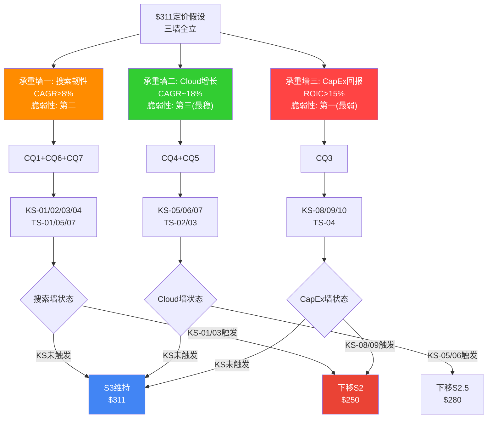

[合理推断: 承重墙-CQ-KS联动决策树基于Ch14 Reverse DCF五档分析和Ch22 KS注册表的触发后论文含义]

---

### 全报告CQ×KS×TS×CI关联总表

```mermaid
graph TB
    subgraph "完整参照网络"
        CQ1["CQ1<br/>搜索蚕食"]
        CQ2["CQ2<br/>估值"]
        CQ3["CQ3<br/>CapEx"]
        CQ4["CQ4<br/>Cloud"]
        CQ5["CQ5<br/>Gemini"]
        CQ6["CQ6<br/>反垄断"]
        CQ7["CQ7<br/>Agent"]
        CQ8["CQ8<br/>承重墙"]
    end

    subgraph "Kill Switch"
        K1["KS-01~04<br/>搜索类"]
        K5["KS-05~07<br/>Cloud类"]
        K8["KS-08~10<br/>CapEx类"]
        K11["KS-11~13<br/>监管/期权"]
    end

    subgraph "Tracking Signal"
        T1["TS-01 AIO覆盖"]
        T2["TS-02 Cloud backlog"]
        T3["TS-03 Gemini API"]
        T4["TS-04 CapEx执行"]
        T5["TS-05 CPC/CTR剪刀差"]
        T6["TS-06 Waymo扩张"]
        T7["TS-07 反垄断上诉"]
    end

    subgraph "非共识洞察"
        C1["CI-01 分发>模型"]
        C2["CI-02 Cloud利润率"]
        C3["CI-03 Agent颠覆SaaS"]
        C4["CI-04 $311=S3.5"]
        C5["CI-05 反垄断高估"]
        C6["CI-06 SBC稀释"]
    end

    CQ1 --> K1
    CQ1 --> T1
    CQ1 --> T5
    CQ1 --> C4

    CQ2 --> K8
    CQ2 --> C4
    CQ2 --> C6

    CQ3 --> K8
    CQ3 --> T4
    CQ3 --> C2

    CQ4 --> K5
    CQ4 --> T2
    CQ4 --> C2

    CQ5 --> K11
    CQ5 --> T3
    CQ5 --> C1

    CQ6 --> K11
    CQ6 --> T7
    CQ6 --> C5

    CQ7 --> K1
    CQ7 --> C3

    CQ8 --> K1
    CQ8 --> K5
    CQ8 --> K8

    style CQ1 fill:#4285F4,color:#fff
    style CQ3 fill:#FF8C00,color:#fff
    style CQ4 fill:#34A853,color:#fff
    style CQ7 fill:#FF4444,color:#fff
    style CQ8 fill:#795548,color:#fff
```

---

*Ch22+Ch23产出完成 | 标注统计待Complete组装时统一计算 | 特异性测试: 13/13 KS全部通过 | CQ闭环: 8/8 | CI注册表: 6个(≥5) | 框架注册表: 13个框架 | Mermaid: 15张*

---

*Agent C产出 | Session 3 | 2026-02-12 | v9.0框架 | GOOGL v4.0*
