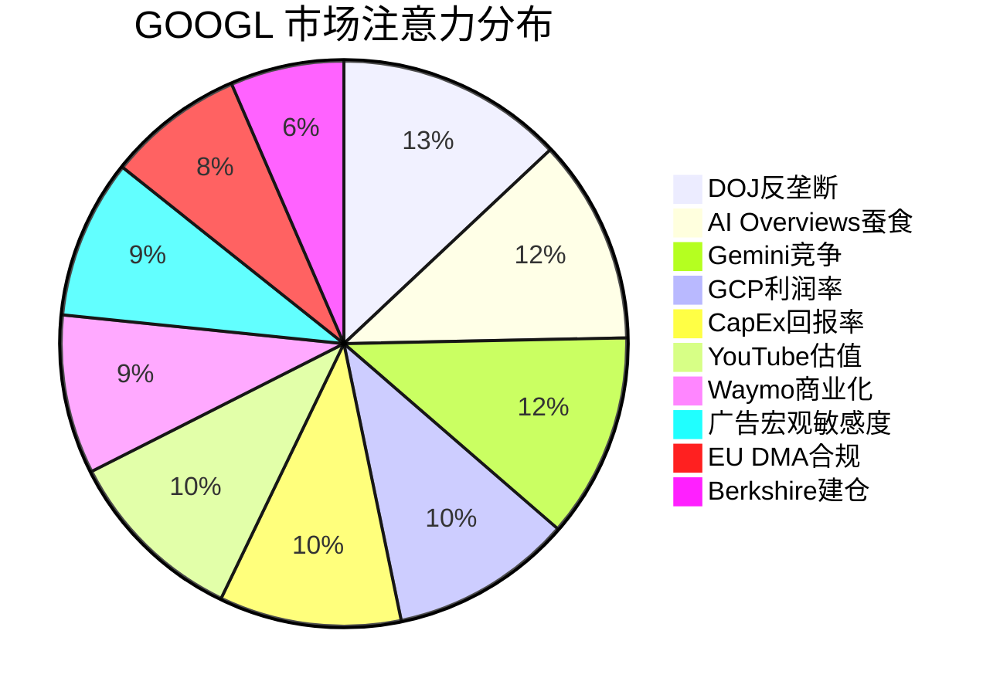

# Google (GOOGL) Phase 0.5: 市场注意力雷达 + 核心问题

> **生成日期**: 2026-02-06 | **数据基准**: FY2025 Q4 (2026-02-04 发布)
> **框架版本**: v21.0 | **行业**: 科技平台 | **系数**: ×1.4

---

## 一、市场注意力雷达 Top 10

基于 Phase 0 预取的 9 个数据文件（169K 字符）交叉验证，以下为市场对 GOOGL 当前最关注的 10 个维度：

| 排名 | 维度 | 热度 | 注意力来源 | 覆盖模块 |
|:---:|------|:---:|---------|---------|
| 1 | DOJ反垄断补救方案 — Chrome分拆 vs 行为限制 | **10** | DOJ上诉(2/3), 法官裁定, 市场定价 | GP05/TP04/Ch22 |
| 2 | AI Overviews对搜索广告的蚕食效应 | **9** | 61% CTR下降数据, 零点击率争论 | GP01/TP02/Ch12 |
| 3 | Gemini vs GPT vs Claude — AI模型竞争格局 | **9** | Gemini 3发布, 基准测试, 开发者偏好 | GP02/M13/Ch21 |
| 4 | GCP利润率拐点 — 30.1%运营利润率突破 | **8** | Q4利润率YoY翻倍(17.5%→30.1%) | GP03/TP03/Ch20 |
| 5 | $175-185B CapEx 2026指引 — 投资回报率 | **8** | 市场震惊, 超预期2倍 | CORE-3/Ch11 |
| 6 | YouTube独立估值 — NFL合约+Shorts变现 | **8** | $400-600B隐含估值争论 | GP06/TP02/Ch12 |
| 7 | Waymo商业化 — $126B估值+20城扩张 | **7** | $16B融资, 450K周rides | GP07/Ch13 |
| 8 | 广告收入宏观敏感度 — 77%广告依赖 | **7** | 经济周期担忧, 广告预算削减风险 | TP02/Ch12 |
| 9 | EU DMA合规 + EUR 2.95B罚款 | **6** | DMA执行加速, 结构性业务模式风险 | GP05/TP04/Ch22 |
| 10 | Berkshire Hathaway首次建仓$4.3B信号 | **5** | 巴菲特史上首次买GOOGL, 价值信号 | Engine 3/Ch34 |

### 注意力分布图

---

## 二、12个市场争论图谱（验证版）

以下争论基于 Phase 0 数据交叉验证，非预设假说。

### Debate #1: DOJ反垄断 — 结构性分拆 vs 行为补救

| 字段 | 内容 |
|------|------|
| **热度** | **10/10** |
| **Bull核心** | Judge Mehta已拒绝Chrome分拆，仅要求行为补救（搜索分发协议年度重新竞标+AI内容授权禁令）。DOJ上诉概率高但耗时2-3年，期间Google可继续运营。行为补救可控，Apple协议仅需从独占转为年度竞标，Google仍可能中标。[硬数据: DOJ案件时间线, 2026-02-03] |
| **Bear核心** | DOJ+35州联合上诉(2026-02-03)寻求更激进补救。Chrome分拆虽被初审法官拒绝，但上诉法院可能推翻。即使行为补救生效，Apple默认搜索协议（$20B+/年）年度竞标将引入微软/OpenAI竞争，搜索分发成本飙升。Ad tech案(2024-12 Google败诉)可能要求出售AdX/DFP。[硬数据: doj_antitrust_status.json] |
| **分晓时间** | 行为补救最终命令: 2026年8月; 上诉裁决: 2027-2028 |
| **关键指标** | 上诉法院受理决定、Apple搜索竞标结果、TAC支出变化 |

### Debate #2: AI Overviews蚕食搜索广告

| 字段 | 内容 |
|------|------|
| **热度** | **9/10** |
| **Bull核心** | AI Overviews扩大搜索TAM——更复杂查询可变现，AI广告格式(sponsored AI Overviews)已开始测试。Google Q4搜索广告仍增17% YoY证明蚕食尚未实质化。广告主ROI可能因AI精准投放提升。[硬数据: Q4搜索收入$63.07B, +17% YoY] |
| **Bear核心** | 研究显示AI Overviews导致61% CTR下降，AI Mode下93%零点击率。长期趋势是用户得到答案后不再点击广告链接——这是结构性威胁而非周期性波动。Google被迫在用户体验(提供AI答案)和广告收入(需要用户点击)之间做出选择。[硬数据: ai_competitive_map.json, 零点击研究] |
| **分晓时间** | 2026-2027: 搜索广告CPC/CTR趋势数据积累 |
| **关键指标** | 搜索广告CPC趋势、零点击率变化、AI Overviews广告变现率 |

### Debate #3: Gemini vs GPT vs Claude竞争格局

| 字段 | 内容 |
|------|------|
| **热度** | **9/10** |
| **Bull核心** | Gemini 3 Pro在多模态和用户偏好测试中领先。TPU成本优势4.7倍(perf/$)。Gemini Flash定价仅竞品5-6%。分发优势无与伦比: 750M+ MAU, 10B+ tokens/min API。Gemini嵌入Search/Workspace/Android/Chrome覆盖20亿+用户。[硬数据: ai_competitive_map.json] |
| **Bear核心** | GPT-5.2在推理基准上领先，Claude Opus 4.5在编码基准领先。开发者社区偏好OpenAI API(更成熟生态)。ChatGPT搜索已侵蚀Google搜索至78-81%份额(从90%+)。企业AI市场Azure OpenAI+AWS Bedrock领先于Vertex AI。[硬数据: ai_competitive_map.json] |
| **分晓时间** | 2026 H2: Gemini 3完整版发布后市场反应 |
| **关键指标** | API调用量增速、开发者采用率、企业部署数、LLM基准排名 |

### Debate #4: GCP — 可信挑战者还是永远第三？

| 字段 | 内容 |
|------|------|
| **热度** | **8/10** |
| **Bull核心** | GCP Q4收入$17.66B(+48% YoY)，增速远超AWS(19%)和Azure(31%)。运营利润率从17.5%飙升至30.1%，拐点已确认。年化run rate>$70B。GenAI工作负载驱动差异化增长。2026 $175-185B CapEx主要投向云+AI基础设施。[硬数据: Q4 2025财报] |
| **Bear核心** | GCP市场份额仍仅12-13%，落后AWS(31%)和Azure(24%)。企业关系薄弱——缺乏微软Office/AWS电商生态的客户粘性。利润率提升可能是短期优化而非结构性改善。专业AI云(CoreWeave, Lambda)在纯AI工作负载上更有竞争力。[硬数据: business_overview.json] |
| **分晓时间** | 2026 Q2-Q3: 利润率是否持续>25% |
| **关键指标** | GCP季度收入增速、运营利润率趋势、市场份额变化 |

### Debate #5: YouTube独立估值

| 字段 | 内容 |
|------|------|
| **热度** | **8/10** |
| **Bull核心** | YouTube广告年收入$40B+, 加上YouTube TV/Premium/Music订阅，总收入接近$50B。作为独立实体，可比Netflix($360B市值)和Roku，保守估值$400-600B。NFL Sunday Ticket+CTV扩张打开新增长引擎。全球月活超20亿，创作者生态无可替代。[合理推断: NFLX可比+收入推算] |
| **Bear核心** | YouTube广告增速放缓至9% YoY(Q4)，远低于Search的17%。Shorts变现效率仅为长视频的1/3-1/5。TikTok虽面临禁令但在短视频领域仍具竞争力。独立后失去Google数据协同(搜索+Chrome+Android数据增强广告定位)，ARPU可能下降。[硬数据: Q4 YouTube ads $11.38B, +9% YoY] |
| **分晓时间** | 2026: Shorts变现差距是否收窄; DOJ分拆讨论中YouTube估值辩论 |
| **关键指标** | YouTube总收入增速、Shorts RPM、CTV广告收入、NFL合约ROI |

### Debate #6: AI CapEx — 战略投资还是价值毁灭？

| 字段 | 内容 |
|------|------|
| **热度** | **8/10** |
| **Bull核心** | AI竞赛中CapEx是入场券——不投即出局。Google FY2025 CapEx $91.4B已见回报: GCP +48%增长, Gemini 750M MAU, AI Overviews覆盖全搜索。2026 $175-185B虽激进但自由现金流充裕(FY2025 FCF ~$70B+)。TPU自研降低对NVIDIA依赖。[硬数据: FY2025 CapEx $91.4B, 2026指引$175-185B] |
| **Bear核心** | 2026 CapEx指引$175-185B相当于FY2025收入的43-46%——历史最高比例。ROI不明: AI服务大部分免费提供(AI Overviews不直接变现)。竞争性军备竞赛可能陷入"投资者买单、用户免费享受"困境。自由现金流可能从正转负。[合理推断: CapEx/Revenue ratio计算] |
| **分晓时间** | 2026 Q2-Q3: AI相关收入增长能否证明CapEx合理性 |
| **关键指标** | CapEx/Revenue比率、AI相关收入增长、自由现金流趋势 |

### Debate #7: Waymo — 终极赢家还是无底洞？

| 字段 | 内容 |
|------|------|
| **热度** | **7/10** |
| **Bull核心** | $16B融资轮估值$126B，市场已给出价值认可。450K周rides(2026年初)，扩展至20+城市。安全记录优于人类驾驶。RoboTaxi TAM $2-5T。先发优势: 10B+英里自动驾驶数据。2026年可能IPO或分拆，释放隐含价值。[硬数据: recent_news.json, $16B融资] |
| **Bear核心** | 15年投资、累计亏损>$30B，收入可能仍<$1B。Other Bets季度亏损$3.6B。规模化挑战: 每新城市需大量高精地图+监管审批。竞争加剧: Tesla FSD/中国百度/Cruise。单位经济学未证明——每ride成本仍远高于Uber。[硬数据: Q4 Other Bets亏损$3.617B] |
| **分晓时间** | 2026-2027: 城市扩张速度+单位经济学数据 |
| **关键指标** | 周rides增速、城市覆盖数、单ride成本趋势、IPO/分拆时间表 |

### Debate #8: 广告宏观敏感度

| 字段 | 内容 |
|------|------|
| **热度** | **7/10** |
| **Bull核心** | 数字广告在经济衰退中韧性强于传统广告(2020 COVID证明)。Google搜索广告是"意图经济"——用户主动搜索=高购买意向，广告主最后削减。Performance广告(搜索/Shopping)比品牌广告更抗周期。FY2025广告收入+14% YoY证明韧性。[硬数据: FY2025广告收入增长] |
| **Bear核心** | 77%收入来自广告——这是近$310B的单一收入来源风险。2022年已见广告放缓(Q4 2022 Search -2% YoY)。中小企业广告主在经济下行中快速削减预算。AI Agent可能绕过搜索广告直接完成任务。关税/贸易战不确定性影响广告主信心。[合理推断: 收入结构分析] |
| **分晓时间** | 持续监测: 宏观经济指标+季度广告收入增速 |
| **关键指标** | 广告收入增速、CPM/CPC趋势、中小企业广告主支出 |

### Debate #9: EU DMA合规与结构性风险

| 字段 | 内容 |
|------|------|
| **热度** | **6/10** |
| **Bull核心** | DMA合规成本可控，Google已在欧盟推出"选择屏幕"等合规措施。EUR 2.95B罚款相对$132B净利润微不足道。合规可提前准备，不确定性低于DOJ。全球监管最终趋同，先在欧盟适应反而是优势。[硬数据: doj_antitrust_status.json, EU罚款数据] |
| **Bear核心** | DMA要求可能从根本改变业务模式: 禁止自我偏好(Google Shopping/Maps优先展示)、要求数据可移植性、开放广告堆栈。如果严格执行，Search+YouTube+Android的协同效应被打破。罚款可能升级: DMA允许最高全球营收10%罚款(~$40B)。[硬数据: doj_antitrust_status.json, DMA条款] |
| **分晓时间** | 2026 H2: DMA执行力度明确化 |
| **关键指标** | 欧盟新增调查/罚款、合规成本增长、欧洲区收入变化 |

### Debate #10: 双层股权与创始人治理

| 字段 | 内容 |
|------|------|
| **热度** | **6/10** |
| **Bull核心** | Larry Page + Sergey Brin的长期远见推动了搜索、Android、YouTube、云、Waymo等成功投资。长期思维优于季度主义。Pichai作为职业经理人执行高效(FY2025利润率31.6%)。创始人回归参与AI战略(2023年以来)表明关键时刻的参与度。[硬数据: management_team.json] |
| **Bear核心** | Page+Brin持有>51%投票权但仅<12%经济权益——典型的控制权/现金流权利不匹配。93笔内部人卖出、0笔买入(90天)。创始人几乎不参与公开沟通，治理透明度极低。Other Bets累计亏损数百亿，无股东制衡。双层股权使股东无法推动变革。[硬数据: management_team.json, 内部人交易] |
| **分晓时间** | 长期结构性问题，无特定催化剂 |
| **关键指标** | 代理投票结果、内部人交易模式、Other Bets亏损趋势 |

### Debate #11: 集团折价 vs 分拆溢价

| 字段 | 内容 |
|------|------|
| **热度** | **6/10** |
| **Bull核心** | 各分部协同价值超过分拆溢价: Search数据增强Cloud AI、Android分发驱动Search流量、YouTube用户数据改善广告定位。SOTP估算$4.0-4.5T(当前$4.02T)——折价不大。一体化公司可更高效配置$175B CapEx。[合理推断: SOTP预估] |
| **Bear核心** | Waymo($126B)、YouTube($400-600B)、GCP作为独立实体估值可能远超隐含价值。Other Bets在集团内被忽视，独立后可获得独立融资和市场关注。DOJ分拆如果发生，可能意外释放价值(AT&T分拆先例)。[合理推断: 分部估值+历史类比] |
| **分晓时间** | 取决于DOJ补救方案最终结果 |
| **关键指标** | Waymo IPO进展、DOJ分拆条款、分部独立估值研究 |

### Debate #12: AI人才保留

| 字段 | 内容 |
|------|------|
| **热度** | **5/10** |
| **Bull核心** | Demis Hassabis(Nobel奖得主)领导DeepMind，是顶级AI人才磁铁。Google提供业界最高薪酬+TPU/数据/分发基础设施，这是初创公司无法匹配的。190K员工中AI研究团队规模最大。Gemini 3成果证明人才产出质量。[硬数据: management_team.json, Hassabis] |
| **Bear核心** | OpenAI/Anthropic/xAI等初创公司以股权激励+使命感挖角顶级研究员。Google内部官僚化降低创新速度。Jeff Dean等元老级人物角色转变。AI人才市场泡沫化——Google需持续加薪以留人，推高人力成本。[主观判断: 行业趋势观察] |
| **分晓时间** | 持续监测: 高级AI研究员流动 |
| **关键指标** | 高级AI研究员离职数、论文发表质量、模型竞争力 |

---

## 三、6个核心问题 (Core Questions)

基于 Top 10 维度和 12 个争论提炼，通过具体性/争议性/可回答性三重检验：

| CQ# | 核心问题 | 来源维度 | 热度加权 | 映射争论 |
|:---:|---------|---------|:---:|---------|
| **CQ1** | Google能否在AI转型中保住搜索广告现金牛——AI Overviews是扩大TAM还是蚕食CPM？ | #2, #3, #8 | 25 | D2, D3, D8 |
| **CQ2** | DOJ强制Chrome分拆/搜索分发限制的真实概率和财务影响有多大？ | #1, #9 | 16 | D1, D9 |
| **CQ3** | GCP何时达到AWS利润率水平？Gemini是否可信差异化因素？ | #4, #3 | 17 | D3, D4 |
| **CQ4** | YouTube作为独立实体是否比其在Alphabet中的隐含价值更高？ | #6 | 8 | D5, D11 |
| **CQ5** | Alphabet的$175-185B CapEx(2026)创造长期价值还是价值毁灭？ | #5, #7 | 15 | D6, D7 |
| **CQ6** | 分拆/分离情景下Waymo和Other Bets如何估值？ | #7, #10 | 12 | D7, D11 |

### CQ质量检验

| CQ# | 具体性 ✅ | 争议性 ✅ | 可回答性 ✅ | 通过 |
|:---:|:---:|:---:|:---:|:---:|
| CQ1 | 指向搜索广告CPC/CTR/零点击率 | Bull: +17% YoY vs Bear: 61% CTR下降 | 可用季度广告数据追踪 | ✅ |
| CQ2 | 指向Chrome/TAC/搜索分发 | 行为补救 vs 结构分拆 vs 上诉 | DOJ时间线+概率矩阵 | ✅ |
| CQ3 | 指向GCP利润率轨迹 | 48%增速乐观 vs 12%份额悲观 | 季度财务数据追踪 | ✅ |
| CQ4 | 指向YouTube可比估值 | $400-600B估值 vs 增速放缓 | SOTP方法可量化 | ✅ |
| CQ5 | 指向CapEx/Revenue比率+FCF | 竞争必需 vs ROI不明 | CapEx回报率可追踪 | ✅ |
| CQ6 | 指向Waymo单位经济学+Other Bets | $126B估值 vs $30B+累计亏损 | 融资估值+运营数据 | ✅ |

---

## 四、CQ-模块相关性矩阵

| 模块 | CQ1 搜索+AI | CQ2 反垄断 | CQ3 GCP | CQ4 YouTube | CQ5 CapEx | CQ6 分拆 | 最高分 | 执行深度 |
|------|:---:|:---:|:---:|:---:|:---:|:---:|:---:|------|
| **Ch01** U1/CORE-1 公司画像 | 2 | 1 | 1 | 1 | 1 | 1 | 2 | 聚焦 |
| **Ch02** GP04/TP01 平台矩阵 | 3 | 2 | 2 | 2 | 1 | 2 | **3** | **完整** |
| **Ch03** U2/U3 价值链 | 2 | 1 | 2 | 1 | 2 | 1 | 2 | 聚焦 |
| **Ch04** TP06 数据护城河 | 3 | 2 | 1 | 2 | 1 | 1 | **3** | **完整** |
| **Ch05** U6b 预测市场 | 1 | 3 | 1 | 1 | 1 | 2 | **3** | **完整** |
| **Ch06** U6/E1 周期定位 | 2 | 1 | 2 | 1 | 2 | 1 | 2 | 聚焦 |
| **Ch07** CORE-6 管理层 | 1 | 1 | 1 | 1 | 2 | 2 | 2 | 聚焦 |
| **Ch08** U5 历史类比 | 2 | 3 | 1 | 1 | 1 | 2 | **3** | **完整** |
| **Ch09** M14/U9 雷达+争论 | 3 | 3 | 3 | 3 | 3 | 3 | **3** | **完整** |
| **P1-INT** 整合 | 2 | 2 | 2 | 2 | 2 | 2 | 2 | 聚焦 |

**资源分配**: 5个完整深度模块(Ch02/04/05/08/09) + 5个聚焦模块(Ch01/03/06/07/P1-INT)

---

## 五、争论-模块覆盖状态

| # | 争论 | 热度 | Phase 1覆盖 | 后续Phase覆盖 | 状态 |
|:---:|------|:---:|---------|---------|:---:|
| D1 | DOJ反垄断 | 10 | Ch05预测市场, Ch08历史类比 | **Ch22(完整)** | ✅ 已覆盖 |
| D2 | AI Overviews蚕食 | 9 | Ch04数据护城河 | **Ch12广告经济学, Ch27 AI矩阵** | ✅ 已覆盖 |
| D3 | Gemini竞争 | 9 | Ch02平台矩阵 | **Ch21 AI竞争** | ✅ 已覆盖 |
| D4 | GCP利润率 | 8 | Ch02(概述) | **Ch20云追踪器** | ✅ 已覆盖 |
| D5 | YouTube估值 | 8 | Ch02(概述) | **Ch12+Ch13 SOTP** | ✅ 已覆盖 |
| D6 | AI CapEx ROI | 8 | Ch06周期定位 | **Ch11资本配置, Ch29 AI估值** | ✅ 已覆盖 |
| D7 | Waymo商业化 | 7 | Ch02(概述) | **Ch13 SOTP, Ch35压力测试** | ✅ 已覆盖 |
| D8 | 广告宏观敏感度 | 7 | Ch06周期定位 | **Ch12广告经济学** | ✅ 已覆盖 |
| D9 | EU DMA | 6 | Ch05预测市场 | **Ch22监管深度** | ✅ 已覆盖 |
| D10 | 双层股权治理 | 6 | **Ch07管理层** | Ch30行为偏差 | ✅ 已覆盖 |
| D11 | 集团折价 | 6 | Ch02平台矩阵 | **Ch13 SOTP, Ch44最终SOTP** | ✅ 已覆盖 |
| D12 | AI人才保留 | 5 | Ch07管理层 | **Ch23开发者生态** | ✅ 已覆盖 |

**结果: 12/12争论全部被覆盖，无需创建Ad-hoc模块。**

---

## 六、Hot-Patch规格

基于覆盖分析，标准49章结构已完整覆盖所有维度。预留2个Hot-Patch槽位(Ch26)用于后续Phase中可能出现的新争论:

| HP# | 预留主题 | 触发条件 | 目标Phase |
|:---:|---------|---------|:---:|
| HP-01 | 待定 — DOJ上诉新进展 | 上诉法院受理或裁决 | Phase 3 |
| HP-02 | 待定 — AI竞争格局剧变 | 新模型发布/重大基准变化 | Phase 3 |

---

## Phase 0.5 完成度报告

| 指标 | 要求 | 实际 | 状态 |
|------|------|------|:---:|
| Top 10维度 | ≥10 | 10 | ✅ |
| 市场争论 | 8-12 | 12 | ✅ |
| 核心问题 | 5-8 | 6 | ✅ |
| CQ质量检验 | 全部通过 | 6/6通过 | ✅ |
| CQ-模块矩阵 | 完成 | 10×6=60格已评分 | ✅ |
| 争论覆盖率 | ≥90% | 100% (12/12) | ✅ |
| Ad-hoc模块 | 视需要 | 0个(全覆盖) | ✅ |
| Hot-Patch规格 | 2个槽位 | 2个已预留 | ✅ |

---

> **免责声明**: 本分析仅供研究参考，不构成投资建议。投资决策请基于个人尽职调查。
