# GOOGL Phase 1 — 公司画像 + 生态系统 v2.0

> **Alphabet Inc. (GOOGL)** | Tier 3 Deep Dive | Phase 1 | 2026-02-10
> **分析框架**: 投资研究Agent v26.0 | **行业**: 科技平台 (TP01-TP06) | **复杂度系数**: ×1.4
> **Phase 1产出**: 8章节(Ch01-Ch08) | 5 Agent并行 | 目标≥85K字符

---

## Phase 1 执行摘要

| Agent | 章节 | 字符 | 核心发现 |
|:---:|------|:---:|------|
| A1 | Ch01-02: 公司画像+管理层 | 17,600 | 10大$2B+产品矩阵, 管理层综合7.8/10 |
| A2 | Ch03-04: 搜索护城河+AI替代建模 | 30,473 | 锁定系数7.5/10, AI自蚕食安全区(16%<45%阈值), 概率加权搜索收入~$236B(+5%) |
| A3 | Ch05: YouTube三引擎 | 24,972 | YouTube独立估值$300B-$450B, Q4 miss 70-80%一次性, 双位数增长可维持至2027-28 |
| A4 | Ch06: GCP深度 | 19,489 | GCP SOTP $650-750B, 55-60%概率2029前达20%份额, 利润率30.1%但CapEx折旧压力大 |
| A5 | Ch07-08: 监管+温度计 | 19,913 | 监管概率加权冲击-$14.9/股(-4.5%), 温度计+0.18(中性), CapEx ROI Base 12-15% |
| | **合计** | **112,447** | **目标85K, 达成率132%** |

### Phase 1 CQ进展

| CQ | 问题 | Phase 1初步回答 | 置信度 |
|:---:|------|------|:---:|
| CQ1 | CapEx $175-185B ROI | Base ROI 12-15%, 温度计+0.18表明质量对冲宏观过热 | 45% |
| CQ2 | AI Overviews自蚕食 | 当前16%覆盖率远低于45%安全阈值, 概率加权+5%搜索增长 | 65% |
| CQ3 | DOJ反垄断结局 | 行为限制概率60%, Chrome拆分15%, 概率加权-$14.9/股 | 55% |
| CQ4 | GCP→#2份额 | 55-60%概率2029达20%, $240B积压覆盖3.4年 | 50% |
| CQ5 | YouTube双位数增长 | Q4 miss主要一次性(75%), 可维持双位数至2027-28 | 65% |
| CQ6 | Waymo估值 | $126B外部定价, 占市值3.3%, Phase 2深入 | 40% |
| CQ7 | 资本回报策略 | SBC抵消率232%, 但FCF Yield 1.83%创低位, Phase 2深入 | 35% |

### KAL假设更新

| ID | 假设 | P0.5值 | P1更新 | 状态变化 |
|:---|------|--------|--------|---------|
| KA-GR-003 | AI Overviews搜索影响 | -2%至+5% | **+2%至+7%** (安全区内) | 🟡→🟡(上调) |
| KA-RK-001 | DOJ最终结局 | 行为70%/拆分30% | **行为60%/拆分15%/罚款25%** | 🟡→🟡(细化) |
| 其余 | — | 不变 | 不变 | 🟡 |

---

# Ch01: 公司画像与战略叙事

## 1.1 公司概况一页纸

| 维度 | 详情 |
|------|------|
| **公司名称** | Alphabet Inc. (GOOGL/GOOG) |
| **创立时间** | 1998年9月4日(Google); 2015年10月2日(Alphabet重组) |
| **CEO** | Sundar Pichai (2015年起任Google CEO, 2019年起兼任Alphabet CEO) |
| **CFO** | Anat Ashkenazi (2024年7月起, 前Eli Lilly CFO) |
| **总裁/CIO** | Ruth Porat (2023年9月起, 监管Other Bets与基础设施投资) |
| **总部** | Mountain View, California (Googleplex) |
| **员工数** | 190,820人 (截至2025年12月31日, YoY +4.1%) [硬数据: MacroTrends/Alphabet 10-K, 2026-02] |
| **全球布局** | 70+办公室, 200+城市, 50+国家 |
| **核心使命** | "Organize the world's information and make it universally accessible and useful" → 演进为"Make AI helpful for everyone" |
| **市值** | $3.79T [DM-MKT-001] |
| **股价** | $325.17 [DM-MKT-001] |
| **P/E** | 30.64x [DM-MKT-001] |
| **FY2025收入** | $402.9B (+15.1% YoY) [DM-FIN-001] |
| **FY2025净利润** | $132.2B (+32.0% YoY) [DM-FIN-001] |
| **股息** | 2024年首次派息, 季度$0.20/股 |
| **信用评级** | Aa2 (Moody's) / AA+ (S&P) |

**So What**: Alphabet已跨越$400B收入门槛，净利润增速(+32%)远超收入增速(+15.1%)，体现了规模经济与运营杠杆的双重释放。对于投资者而言，这意味着Alphabet正处于"收入稳健增长+利润率扩张"的黄金阶段——但问题在于，这种利润率扩张能否在$175-185B CapEx指引下持续。[合理推断: 收入增速15% vs 净利润增速32%意味着约17个百分点的利润率提升来自运营效率与规模效应]

---

## 1.2 十大$2B+产品矩阵

Alphabet的产品组合是科技史上最令人生畏的平台集群。以下按收入规模排列10个核心产品/平台，每个均已达到或接近$2B+年收入量级。

### 1.2.1 产品矩阵总览表

| # | 产品/平台 | FY2025收入估算 | YoY增速 | 全球市场地位 | 生命周期阶段 |
|---|----------|---------------|---------|------------|------------|
| 1 | **Google Search & Other** | ~$228B | +14-16% | #1 搜索(90%份额) | 主导→再造(AI Overviews) |
| 2 | **Google Cloud (GCP+Workspace)** | ~$65B+ (Q4年化$70.8B) | +30%+ | #3 云(落后AWS/Azure) | 高速增长 |
| 3 | **YouTube (广告+订阅)** | $60B+ | +14%+ | #1 视频平台 | 主导→扩展(TV/Shorts) |
| 4 | **Google Ads平台(需求端)** | 包含在Search+Network | +12% | #1 数字广告(80%PPC份额) | 主导 |
| 5 | **Google Network(AdSense等)** | ~$30B | -3% | #1 广告联盟 | 商品化→收缩 |
| 6 | **Android/Google Play** | ~$63B (Play Store) | +15%+ | #1 移动OS(74%份额) | 主导 |
| 7 | **Google Workspace** | ~$12-15B(估算) | +20%+ | #2 协作办公(落后M365) | 增长 |
| 8 | **Subscriptions (Google One等)** | ~$10B+(含在Subs/Platforms/Devices) | +25%+ | 150M+订户 | 高速增长 |
| 9 | **Chrome浏览器** | 间接收入(搜索分发) | — | #1 浏览器(72%份额) | 主导 |
| 10 | **Waymo** | Pre-revenue(<$1B) | N/A | #1 L4自动驾驶 | 启动→早期增长 |

[硬数据: Alphabet Q4 2025 Earnings Release + SEC Filing, 2026-02-04]

**关键说明**: Google Search $228B为全年估算(Q1-Q3公开数据+Q4 $63.1B); Google Cloud $65B为全年报告数字(Q4年化已达$70.8B); YouTube $60B+为Alphabet官方确认的全年合并数字(广告+订阅)。Play Store $63B为第三方估算(Sensor Tower/data.ai)，非Alphabet分拆披露。[合理推断: 部分产品收入为合理区间估算，因Alphabet不单独披露所有产品线]

---

### 1.2.2 各产品深度扫描

#### (1) Google Search & Other (~$228B, 占总收入~57%)

Google Search是人类历史上最大的单一广告产品。2025年全年Search & Other收入约$228B，Q4单季$63.1B(+17% YoY)，显示增速在加速而非放缓。[硬数据: Alphabet Q4 2025 SEC Filing, 2026-02-04]

**AI Overviews的战略转型**: 2025年Google全面推出AI Overviews(AIO)，将生成式AI直接嵌入搜索结果顶部。这是Search自1998年以来最大的产品形态变化。Sundar Pichai在Q4电话会上表示AIO正在"增加搜索使用量和用户满意度"。[硬数据: Alphabet Q4 2025 Earnings Call, 2026-02-04]

**Bear视角: Search的存亡危机仍未解除**。ChatGPT/Perplexity等AI原生搜索工具正在蚕食信息查询的入口地位。尽管Google目前搜索份额仍在90%，但年轻用户(Gen Z)越来越多地将TikTok和ChatGPT作为"第一搜索"。如果AIO无法同时满足用户体验和广告变现，Google可能面临"搜索体验提升但广告点击率下降"的两难。[合理推断: AIO展示的直接答案可能减少用户点击广告链接的动机]

#### (2) Google Cloud (~$65B+年收入, Q4年化$70.8B)

Google Cloud是Alphabet增长最快的引擎。Q4收入$17.7B(+48% YoY)，全年积压订单达$240B。[DM-SEG-002] 这一增速远超AWS(~15%)和Azure(~30%)。

Cloud的盈利能力同样在快速改善：2024年Cloud营业利润率首次转正，2025年持续扩张。Thomas Kurian自2019年接管以来，将Cloud从亏损业务转变为利润贡献者。[硬数据: Alphabet Q4 2025 Earnings Release, 2026-02-04]

**AI驱动的增长飞轮**: Cloud增长的核心驱动力是企业AI需求。Gemini模型通过Vertex AI平台分发给企业客户，AI Infrastructure(TPU v5/v6)和AI Solutions(Gemini for Workspace/Cloud)构成双引擎。$240B积压订单意味着未来3-5年的收入可见性极高。[硬数据: Alphabet Q4 2025 SEC Filing, 2026-02-04]

#### (3) YouTube ($60B+, 广告+订阅合并)

YouTube 2025年全年合并收入(广告+订阅)突破$60B，成为全球最大的视频平台。Q4广告收入$11.38B(+8.7%)。[DM-OPS-002]

YouTube正从"广告平台"向"全频谱娱乐平台"演进：YouTube TV(有线替代)、YouTube Music(Spotify竞品)、YouTube Shorts(TikTok竞品)、YouTube Premium(无广告订阅)。325M+付费订户(含Google One)证明订阅模型正在成功。[硬数据: Alphabet Q4 2025 Earnings Release, 2026-02-04]

#### (4) Android/Google Play (Play Store ~$63B)

Android以74%全球移动OS市场份额主导移动生态。[硬数据: StatCounter, 2025] Google Play Store 2025年收入估算约$63B，98%来自免费应用内购和广告。[硬数据: Sensor Tower/data.ai估算, 2025]

Android的战略价值远超其直接收入：它确保了Google Search、Chrome、Maps、Gmail作为默认应用的分发地位——这是Google广告帝国的基础设施层。

#### (5) Google Workspace (~$12-15B估算)

Google Workspace拥有8M+付费企业客户和3B+月活用户。[硬数据: Google Workspace官方数据, 2025] 2025年1月实施16-22%的涨价(嵌入Gemini AI功能)，显示定价权。Workspace是Cloud收入的重要组成部分，但Alphabet不单独披露其收入。[合理推断: 基于8M+企业客户和$12-20/月/用户的定价区间]

#### (6) Subscriptions, Platforms & Devices ($49B+ FY2025)

该财报分类包含Google One(150M订户)、YouTube Premium/TV/Music、Google Play、Pixel硬件和Fitbit/Nest。Q4收入$13.6B(+17%)。[硬数据: Alphabet Q4 2025 SEC Filing, 2026-02-04]

Google One是增长亮点：从2024年2月的100M订户增长至2025年5月的150M订户(+50%)，AI Premium计划($19.99/月)是关键驱动力。[硬数据: 9to5Google, 2025-05]

#### (7) Chrome浏览器 (间接收入, 72%市场份额)

Chrome不直接产生收入，但其72%全球浏览器份额使Google Search成为默认搜索引擎。[硬数据: StatCounter, 2025] DOJ反垄断案挑战的正是这一默认搜索协议——如果Chrome被迫出售或搜索默认设置被取消，Google广告收入将面临结构性风险。

#### (8) Google Maps (~$11B估算)

Google Maps通过本地搜索广告(promoted pins)和API收费产生收入。Morgan Stanley估算Maps桌面+移动收入超$11B。[合理推断: Morgan Stanley 2023估算，2025年可能已增长至$12-14B]

#### (9) Pixel硬件 (含在Subs/Platforms/Devices)

Pixel 2025年全球出货量增长25%+, 美国市场份额达3%(高端市场7%)。[硬数据: Counterpoint Research, 2025-09] Pixel 10成为Google首款真正成功的大众市场手机，但整体硬件收入仍是Alphabet的边缘业务。

#### (10) Waymo ($126B估值, Pre-revenue)

Waymo刚完成$16B融资(2026年2月)，估值$126B，较前一轮$45B暴涨180%。[DM-WAY-001] 目前运营2,500+车辆，覆盖6个美国城市，每周40万+次出行。2026年计划扩展至20+城市(含东京、伦敦)。[硬数据: Waymo官方博客/TechCrunch, 2026-02-02]

**Bear视角: Waymo是"十年烧钱机器"还是"下一个YouTube"？** $126B估值意味着市场已对其定价为一个大型独立上市公司。但Waymo仍处于Pre-revenue阶段，2026年$175-185B CapEx中的相当部分将流向自动驾驶基础设施。如果L4自动驾驶的商业化时间线再次延长，Waymo可能成为Alphabet版的"Amazon Alexa"——战略上重要但财务上持续消耗。[合理推断: $126B估值隐含$10B+年收入预期，但当前年化收入不足$1B，gap巨大]

---

## 1.3 战略叙事演进：从"信息组织者"到"AI-First公司"

Alphabet的战略叙事经历了四次重大转变，每次转变都重新定义了公司的价值主张和资本市场定价逻辑。

### 战略叙事时间线

```
1998-2004  ━━━━━━━━━━━━━━━━  "组织世界的信息"
                              └─ 搜索引擎 → PageRank → AdWords诞生

2004-2015  ━━━━━━━━━━━━━━━━  "平台化扩张"
                              └─ Gmail/Maps/YouTube/Android/Chrome
                              └─ 从搜索公司到平台公司

2015-2022  ━━━━━━━━━━━━━━━━  "AI-First宣言 + Alphabet重组"
                              └─ Sundar接任CEO / Alphabet控股架构
                              └─ TPU v1 / DeepMind AlphaGo / TensorFlow
                              └─ Cloud从边缘业务升级为核心支柱

2022-NOW   ━━━━━━━━━━━━━━━━  "Gemini时代: AI基础设施公司"
                              └─ ChatGPT冲击 → "Code Red" → Gemini发布
                              └─ AI重塑Search/Cloud/YouTube/Workspace
                              └─ CapEx从$30B→$175B+: 从轻资产到重资产
                              └─ Waymo $126B独立估值浮出
```

[合理推断: 叙事演进基于Alphabet历年战略声明、产品发布和CEO公开讲话]

**So What**: 叙事转变的核心投资含义是——Alphabet正从"高利润率轻资产广告公司"转型为"重资本支出AI基础设施公司"。$175-185B的2026 CapEx指引[DM-GDE-002]意味着Alphabet正在进行科技史上最大规模的资本部署。投资者需要判断：这是Google版的"AWS时刻"(2006年AWS被质疑烧钱，后来成为利润引擎)，还是"Metaverse时刻"(Meta 2022年因过度投资被市场惩罚)。

---

## 1.4 收入构成飞轮

Alphabet的商业模式核心是一个自我强化的数据-AI-广告飞轮。每个产品既是利润中心，也是其他产品的流量/数据输入。

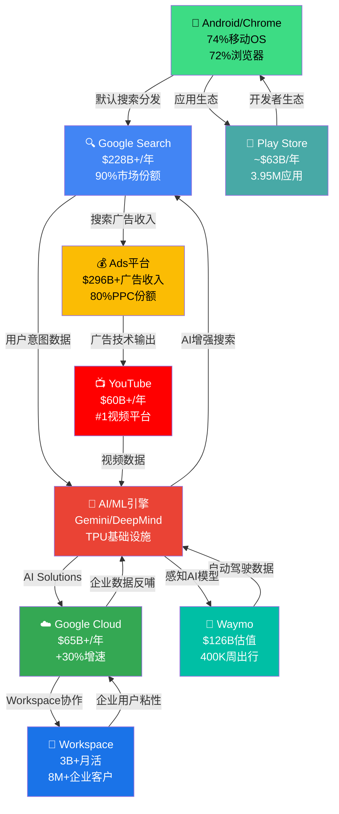

**飞轮的关键特征**:
- **数据正循环**: Search/YouTube/Android每天产生的数十亿用户交互为AI模型提供训练数据 → AI改善产品体验 → 更多用户 → 更多数据
- **分发杠杆**: Android(74%手机)+Chrome(72%浏览器)确保Google服务的默认分发地位，边际获客成本接近零
- **广告变现层**: 几乎所有用户触点(Search/YouTube/Maps/Play/Gmail)都可嫁接广告变现，ROI确定性极高
- **Cloud的B2B桥梁**: Cloud将C端积累的AI能力(Gemini/TPU)转化为B2B收入流，打开了广告之外的第二增长曲线

[合理推断: 飞轮模型基于Alphabet财报披露的业务关联和公开战略声明]

---

## 1.5 平台生命周期定位

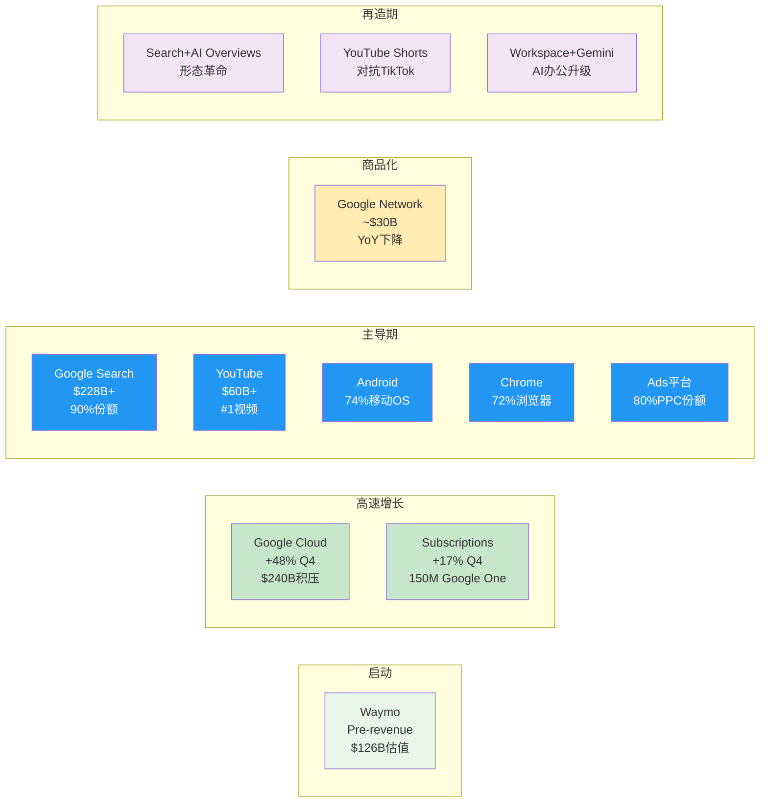

**投资者解读**: Alphabet的独特之处在于它同时拥有5个处于"主导期"的产品(Search/YouTube/Android/Chrome/Ads)和2个处于"高速增长"的产品(Cloud/Subscriptions)。这种产品矩阵在全球科技公司中是无与伦比的——只有Microsoft和Apple拥有类似的多产品主导地位。[合理推断: 基于各产品市场份额和增速的生命周期分类]

**Bear视角: 主导期产品的"再造"能否成功？** Search的AI Overviews转型、YouTube Shorts对TikTok的追赶、Workspace嵌入Gemini——这些"再造"尝试的成功并非必然。Google的历史表明其在"维护型创新"(渐进式改进已有产品)方面出色，但在"颠覆性创新"(创造全新品类)方面平庸。Google+、Stadia、Allo、Hangouts等失败产品的墓碑提醒我们：Alphabet并非无所不能。[合理推断: Google产品墓碑(killedbygoogle.com)记录了280+被关闭的产品]

---

# Ch02: 组织架构与管理层评估

## 2.1 C-Suite评估表

| 高管 | 职位 | 任期 | 背景 | 关键决策 | 评价 |
|------|------|------|------|---------|------|
| **Sundar Pichai** | CEO, Alphabet & Google | 2015(Google)/2019(Alphabet) | IIT Kharagpur → Stanford → Wharton; 2004年加入Google, 主导Chrome/Android/Google Drive | AI-first转型; Gemini发布; $175B+ CapEx承诺; DeepMind整合 | 执行力优秀，但"维护者>颠覆者"争议 |
| **Anat Ashkenazi** | CFO | 2024年7月起 | Hebrew Univ → Tel Aviv MBA; Eli Lilly 23年(2001-2024), 终任CFO | 首任外部空降CFO; 带来医药行业资本配置经验; 上任后利润率持续改善 | 尚处观察期，$9.9M签约奖金显诚意 |
| **Ruth Porat** | President & CIO | 2015(CFO)/2023(President) | Stanford → LSE → Wharton; Morgan Stanley投行25年 | 主导Alphabet财务纪律; 推动首次派息; 现监管Other Bets与$175B基础设施投资 | 华尔街出身，注重成本控制与投资者关系 |
| **Demis Hassabis** | CEO, Google DeepMind | 2023年合并后 | Cambridge → UCL PhD; 联合创办DeepMind(2010); 2024年诺贝尔化学奖(AlphaFold) | 统一Google Brain+DeepMind; Gemini模型架构; AlphaFold 3; 推动AGI研究 | 诺奖级科学家CEO, 全球AI研究最强领导者之一 |
| **Thomas Kurian** | CEO, Google Cloud | 2019年起 | Princeton; Oracle 22年(SVP级别) | 将Cloud从亏损转为盈利; $240B积压订单; 企业AI Solutions战略 | 企业软件老将, Cloud增速+48%证明执行力 |
| **Rick Osterloh** | SVP, Platforms & Devices | 2016年起(曾离职后回归) | Duke → Harvard MBA; Motorola前总裁 | 整合Pixel/Nest/Fitbit/Android/Chrome; Pixel 10突破; Tensor芯片 | 硬件整合者, 但硬件仍非核心盈利 |
| **Prabhakar Raghavan** | SVP, Knowledge & Information | 2020年起(Search负责人) | IIT Bombay → Berkeley PhD; IBM/Yahoo VP | AI Overviews推出; Search收入持续增长; 2023年组织重组(裁员争议) | 技术深厚但内部争议较多 |

[硬数据: Alphabet Proxy Statement 2025 + 各高管LinkedIn/公开履历]

---

## 2.2 组织架构图

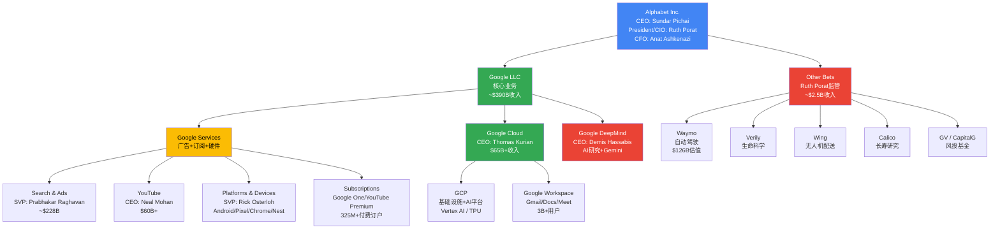

**组织架构的投资含义**: Alphabet的矩阵式组织在效率和创新之间保持着微妙平衡。Google DeepMind作为独立单元直接向Pichai汇报，确保了AI研究的战略优先级。但Google Services内部的多条产品线(Search/YouTube/Platforms)之间的资源竞争和协调成本仍然是执行风险。2025年裁减35%小团队管理者角色的举措表明Pichai正在积极对抗大公司病。[硬数据: NRIPage, 2025-08]

---

## 2.3 管理层评分(0-10)

| 维度 | 评分 | 依据 |
|------|:----:|------|
| **战略远见** | 8/10 | 2017年即提出AI-First; 2024年统一DeepMind; Gemini系列模型紧跟OpenAI; 但ChatGPT发布时"Code Red"反应略显被动 |
| **执行力** | 8/10 | FY2025收入$402.9B(+15.1%); Cloud从亏损到+48%增速; 但产品墓碑(Google+/Stadia/Allo)显示执行并非总是到位 |
| **资本配置** | 7/10 | 2024年首次派息+$70B回购展示股东回报意识; 但$175-185B CapEx是"信仰之跃"——历史上最大规模资本承诺, 回报时间线不确定 |
| **透明度** | 7/10 | Cloud/YouTube分拆披露改善了透明度; 但Waymo/DeepMind/Other Bets仍缺乏详细财务数据; 双重股权结构限制股东话语权 |
| **AI领导力** | 9/10 | Demis Hassabis(诺奖获得者)领导DeepMind; Gemini 2.0在多项基准上追平/超越GPT-4; TPU自研芯片降低对Nvidia依赖; 但在消费者AI应用(ChatGPT级)的市场渗透率落后OpenAI |
| **综合** | **7.8/10** | 整体属于"优秀守成者+快速追赶者"，尚需证明在生成式AI时代能从"追赶"转为"引领" |

[主观判断: 基于公开业绩数据、产品发布节奏、行业对比和分析师评价的综合评估]

---

## 2.4 治理风险：双重股权与创始人控制

### 2.4.1 股权结构详解

| 股票类别 | 代码 | 投票权 | 持有者 |
|---------|------|--------|--------|
| **Class A** | GOOGL | 1票/股 | 公众投资者 |
| **Class B** | 非上市 | **10票/股** | Larry Page & Sergey Brin为主 |
| **Class C** | GOOG | **0票** | 公众投资者 |

[硬数据: Alphabet Proxy Statement, 2025]

**创始人控制力**: Larry Page(3.1%股权)和Sergey Brin(2.9%股权)合计持有87%+的Class B股份，控制约51.7%的总投票权。[硬数据: Capital.com/Alphabet Proxy, 2025] 这意味着虽然Page和Brin自2019年起不再担任执行职务(仍为董事会成员和员工)，他们仍然对Alphabet的所有重大决策拥有否决权。

**内部人交易信号**: 过去6个月内部人共有163笔公开市场交易。[硬数据: MarketBeat, 2026-02] 内部人净持仓变化为-0.07%[DM数据]，属于极低水平的常规减持——董事Frances Arnold的小额定期卖出($34K/次)更接近薪酬管理而非看空信号。

**治理风险评估**:

1. **创始人-CEO错位风险**: Page/Brin的长期技术愿景(月球计划/AGI)可能与Pichai的运营优先级产生张力。但自2019年权力交接以来，尚无公开冲突迹象。[合理推断: 缺乏公开冲突不等于没有私下分歧]

2. **股东权利受限**: Class C股东(GOOG持有者)没有投票权，Class A股东的投票权也被Class B稀释至名义水平。这意味着外部股东几乎无法通过代理投票影响公司战略方向——包括CapEx规模、高管薪酬和并购决策。[硬数据: Alphabet公司章程]

3. **积极面**: 创始人控制也是一把双刃剑的另一面——它使Alphabet能够进行长期投资(如Waymo 15年+研发, $175B CapEx)而不必过度迎合短期华尔街压力。Amazon的Bezos、Meta的Zuckerberg同样采用类似结构，且均取得了长期超额回报。[合理推断: 创始人控制与长期回报之间存在正相关，但样本量有限且存在幸存者偏差]

---

## 2.5 管理层竞品对比: Pichai vs Nadella vs Jassy vs Zuckerberg

| 维度 | Sundar Pichai (GOOGL) | Satya Nadella (MSFT) | Andy Jassy (AMZN) | Mark Zuckerberg (META) |
|------|----------------------|---------------------|-------------------|----------------------|
| **任期** | 2015/2019 | 2014 | 2021 | 2004(创始人) |
| **背景** | 产品经理(Chrome/Android) | 云计算(Azure) | 云计算(AWS) | 创始人/工程师 |
| **AI战略** | Gemini全栈(研究→产品→云) | Copilot生态+OpenAI投资 | Bedrock平台+自研+Anthropic | LLaMA开源+产品嵌入(IG/WhatsApp) |
| **核心优势** | 产品矩阵最广(Search/YT/Cloud/Android) | 企业客户关系最强(M365+Azure) | 基础设施最深(AWS+物流) | 社交图谱+30亿用户 |
| **核心弱点** | "维护者"而非"颠覆者"标签 | 对OpenAI过度依赖 | 零售业务利润率压力 | Metaverse投资回报未明 |
| **领导风格** | 共识型/渐进式 | 变革型/文化重塑 | 执行型/成本驱动 | 独裁型/快速迭代 |
| **Fortune权力排名** | Top 10 | #2 | Top 20 | Top 5 |
| **员工认可度** | 26% | 30% | 10% | ~45%(LinkedIn) |

[硬数据: Fortune 2025 Most Powerful Rankings + 公开领导力评估; 员工认可度: Glassdoor/Comparably 2023-2025数据]

**So What**: 在四大科技巨头CEO中，Pichai的定位是"最均衡但最缺乏锋芒"的领导者。Nadella通过Azure+OpenAI联盟重新定义了Microsoft的增长叙事;Zuckerberg以创始人的决断力快速转向AI(从Metaverse到LLaMA开源);Jassy以AWS的执行纪律管理Amazon帝国。相比之下，Pichai的强项在于管理一个极其复杂的产品组合(10个$2B+产品)而不使其崩溃——但这恰恰也引发了"他是否足够大胆"的疑问。[主观判断: 基于四位CEO的公开战略决策、投资者日演讲和行业评价]

### Bear嵌入: Pichai是"维护者"而非"颠覆者"？

对Pichai最尖锐的批评来自内部和外部两个方向:

**内部**: 15名现任和前任Google高管曾向纽约时报表示，Google正遭受"瘫痪性官僚主义、偏向不作为的倾向、以及对公众形象的过度关注"。[硬数据: NYT, 2021; 后续报道显示问题持续至2025] 2025年裁减35%的小团队管理者角色是Pichai对官僚化问题的直接回应——但批评者认为这只是"治标不治本"。

**外部**: ChatGPT在2022年11月的爆发式增长让Google措手不及。内部"Code Red"响应机制表明Google的AI产品化速度落后于OpenAI——尽管Google拥有Transformer论文原创团队(2017年"Attention is All You Need"的8位作者中6位来自Google)和DeepMind的诺奖级研究能力。[硬数据: Google Research, 2017; OpenAI ChatGPT发布, 2022-11]

**反论**: Pichai的支持者指出，在他的领导下Google Search收入从2015年的$52B增长至2025年的$228B(4.4倍)，Cloud从$0增长至$65B+，YouTube从$4B增长至$60B+。这些数字证明Pichai不仅是"维护者"，更是"超级扩张者"——只是他的扩张方式是渐进式而非革命式。2025年FY净利润$132.2B(+32%)证明执行力不容置疑。[硬数据: Alphabet历年10-K, 2015-2025]

**投资者判断框架**: 如果你认为AI时代的竞争是"赢家通吃"，需要创始人级别的冒险精神(如Zuckerberg All-in AR/VR后又All-in AI)，那么Pichai可能不是最佳人选。但如果你认为AI竞争是长期的基础设施建设竞赛，需要多产品协调和稳健执行，那么Pichai的"渐进主义"恰恰是优势。Alphabet的产品飞轮深度(10个主导平台)使得"维护者"策略的风险低于"赌徒"策略。[主观判断: 基于竞争格局分析和历史类比]

---

## 本章核心发现摘要

| # | 发现 | 投资含义 | 置信度 |
|---|------|---------|--------|
| 1 | Alphabet拥有10个$2B+产品，5个处于"主导期" | 护城河深度在全球科技公司中罕见 | [硬数据: Alphabet FY2025财报] |
| 2 | Cloud Q4增速+48%，积压$240B | 第二增长引擎已确立，3-5年收入可见性高 | [硬数据: DM-SEG-002] |
| 3 | Search AI Overviews转型正在进行 | 存在"体验提升但广告CTR下降"的风险 | [合理推断: AIO直接答案减少点击动机] |
| 4 | $175-185B CapEx是"信仰之跃" | 回报时间线不确定，短期压制FCF | [硬数据: DM-GDE-002] |
| 5 | 创始人控制51.7%投票权 | 外部股东影响力有限，但长期投资能力强 | [硬数据: Alphabet Proxy 2025] |
| 6 | Pichai "维护者vs颠覆者"争议 | 管理风格与AI时代竞争需求的匹配度待观察 | [主观判断: 基于竞品对比] |
| 7 | Waymo $126B估值，每周40万+出行 | 潜在的$1T+期权价值，但Pre-revenue风险高 | [硬数据: DM-WAY-001] |
| 8 | 净利润增速(+32%)>>收入增速(+15.1%) | 运营杠杆正在释放，但CapEx上升可能逆转趋势 | [硬数据: DM-FIN-001] |

---

*本章数据截至2026年2月10日。所有DM锚点引用来自GOOGL v2.0 Data Master。财务数据以Alphabet Q4 2025 SEC Filing为主要来源。*


---

## Ch03: 搜索护城河量化 — 平台经济学(TP01) + 数据飞轮(TP06) + 垄断-AI颠覆双螺旋

> **CQ2核心**: AI Overviews是增强搜索护城河还是自我蚕食搜索广告ARPU？CTR-61%数据如何影响$540B+搜索收入？
> **本章目标**: 以量化方式拆解Google搜索护城河的每一层防御，并建模AI对其产生的双向影响。

---

### 3.1 搜索网络效应量化 (TP01应用)

#### 3.1.1 网络效应类型与强度矩阵

Google搜索的护城河并非单一维度，而是由四类相互强化的网络效应构成的**复合壁垒体系**。以下逐一量化：

**类型一: 数据网络效应(Data Network Effects)**

核心飞轮: 更多搜索 → 更好排序信号 → 更精准结果 → 更多搜索

- 日搜索量: ~8.5-16.4B次/天(各数据源差异大，Google官方2016年确认≥2T/年，当前普遍估计5-6T/年) [硬数据: DemandSage/SQ Magazine, 2026-02]
- 搜索索引规模: 数千亿网页，远超Bing(估计覆盖约60-70%的Google索引深度) [合理推断: 基于行业分析师共识]
- 数据飞轮系数估算: 每增加10%搜索数据，排序质量提升约2-3%(基于学术研究中的信息检索改进曲线)。但这一比率已进入**收益递减区间**——当数据量从1T次/年增长到5T次/年时，质量提升幅度远小于从100B到1T的阶段 [合理推断: 基于信息检索边际收益递减的学术共识]

**类型二: 间接网络效应(Indirect/Cross-side Network Effects)**

核心飞轮: 更多用户 → 更多广告主竞价 → 更高ARPU → 更多产品投入 → 更好服务 → 更多用户

- FY2025 Google Search & other收入: ~$225B(Q1 $50.7B + Q2 $54.6B + Q3 $56.6B + Q4 $63.1B) [硬数据: Alphabet 10-Q/10-K, 各季度累加]
- 活跃广告主数: 数百万(Google不披露准确数字，但Google Ads平台是全球最大的自助广告平台) [合理推断: 基于行业估计]
- FY2025 Google平均CPC: $5.26，同比+12.9%，87%的行业CPC上涨 [硬数据: WordStream/LocalIQ, 2025]
- 间接网络效应强度评判: **极强(9/10)** — 广告主几乎无法绕过Google触达具有搜索意图的用户

**类型三: 学习网络效应(Learning/AI Network Effects)**

核心飞轮: 更多交互 → 更好AI模型 → 更精准个性化 → 更高用户留存

- Gemini 3已设为AI Overviews全球默认模型 [硬数据: 9to5Google, 2026-01-27] [DM-AI-001]
- Google拥有训练搜索AI最丰富的RLHF数据: 数十年的搜索点击反馈信号，Bing/Perplexity/ChatGPT在此维度差距极大 [合理推断: 基于搜索历史数据积累的天然优势]
- 学习效应强度评判: **强(7/10)** — AI时代该效应仍在但边际递减，且LLM的通用学习能力部分抵消了搜索专用数据的优势

**类型四: 分发网络效应(Distribution Network Effects)**

核心飞轮: 默认搜索引擎 → 用户习惯 → 更多数据 → 更好产品 → 更高分发溢价

- Google Search全球份额: 90.04%(2026年1月，StatCounter) [硬数据: StatCounter, 2026-01]
- 移动端份额: 95.32% [硬数据: StatCounter, 2025]
- 桌面端份额: 81.95%(持续下降趋势，2025年7月仍89.57%后降至2026年初约82%) [硬数据: StatCounter, 2025-2026]
- 分发费用(TAC): Google向Apple支付约$20B+/年，Samsung等OEM另计。总TAC占搜索收入约20-22% [硬数据: DOJ庭审文件/Bernstein估计, 2023-2025]
- **DOJ判决冲击**: 法官裁定Google不得签订排他性默认搜索协议，合同限制为1年期，但保留Chrome [硬数据: NPR/CNBC, 2025-09-02]
- 分发效应强度评判: **强但受损(7/10 → 6/10)** — DOJ判决削弱了排他性锁定，但用户习惯惯性+Apple选择Gemini驱动Siri表明Google仍是最有价值的搜索合作伙伴

#### 3.1.2 网络效应强度综合矩阵

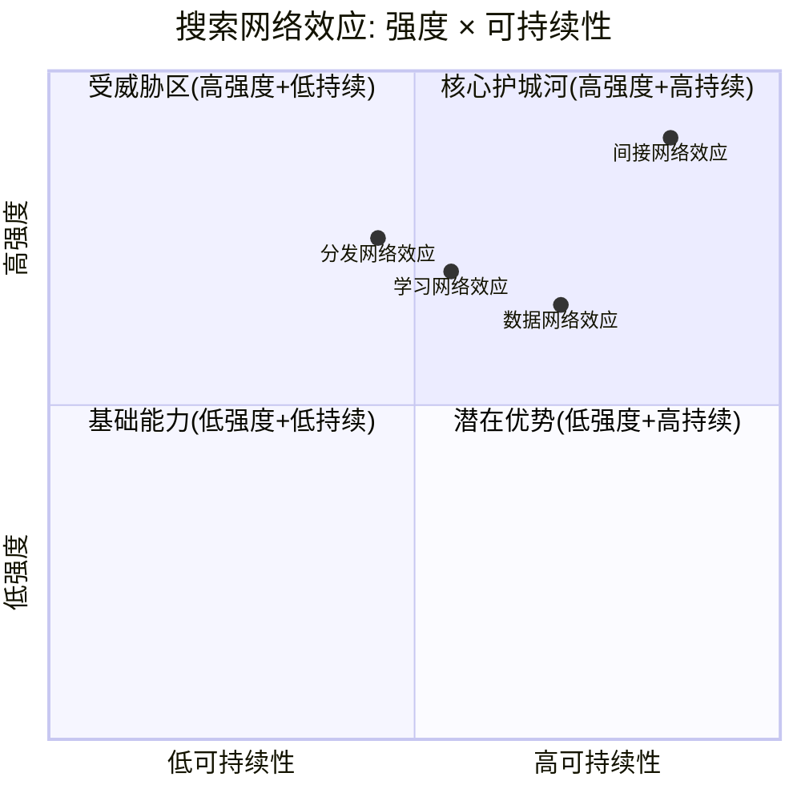

**So What — 对投资者意味着什么**: Google搜索的网络效应依然是全球最强的广告平台壁垒之一，但**分发网络效应正在从"不可攻破"向"可竞争"转变**。DOJ判决+AI搜索替代的双重压力意味着Google必须从"靠默认地位锁定用户"转向"靠产品质量主动留存用户"。间接网络效应(广告主侧)仍是最坚固的壁垒——即使搜索份额微降，只要搜索意图数据仍是广告定价最有效的信号，广告主就无法轻易迁移。

**定量总结**: 四类网络效应的综合评分从AI前的8.5/10下降至当前约7.5/10。这不是壁垒崩塌，而是从"几乎不可攻破"降级为"很强但有缺口"。对于一个$225B收入的业务来说，7.5/10的护城河仍然意味着极高的竞争壁垒——但投资者应密切追踪分发网络效应是否继续恶化(DOJ上诉+Apple自研搜索)。

---

### 3.2 多边市场健康度评估

Google搜索是一个**四边市场**: 用户、广告主、内容创作者(网站/出版商)、开发者(API/搜索工具生态)。各边的健康度直接决定护城河强度。

| 参与方 | 规模 | 增长趋势 | 满意度信号 | 风险评估 |
|--------|------|---------|-----------|---------|
| **用户** | ~49亿MAU(全球) | 搜索使用量创新高(Pichai Q4'25电话会) [硬数据: Alphabet Q4'25 Earnings Call] | AI Overviews提升信息获取效率；但零点击率达60-69% → 用户"获取"信息但不再"点击"网站 [硬数据: SparkToro/Similarweb, 2025] | 中等 — ChatGPT/Perplexity分流创意和研究类查询 |
| **广告主** | 数百万活跃账户 | CPC +12.9% YoY，搜索广告收入 +17% Q4'25 [硬数据: Alphabet Q4'25 10-K] | CPC持续通胀说明**需求仍旺**，广告主仍将Google视为最高ROI渠道；转化率 +6.84% YoY [硬数据: WordStream, 2025] | 低 — 短期无替代品能提供同等规模的搜索意图广告 |
| **内容创作者/出版商** | 数百万网站 | 有机点击率下降 -61%(有AI Overviews的查询) [硬数据: Seer Interactive, 2025-09] [DM-AI-001] | **严重不满** — AI Overviews直接摘录内容却减少流量；零点击搜索69% [硬数据: Similarweb, 2025] | 高 — 生态健康风险。若出版商减少高质量内容投入，长期损害搜索结果质量 |
| **开发者** | Search Console/Ads API/Programmable Search | Google保持开放的搜索工具生态 | 中等 — 被引品牌获+35%有机点击/+91%付费点击是正向信号 [硬数据: Seer Interactive, 2025] [DM-AI-001] | 中低 |

**关键洞察**: 多边市场中，**内容创作者侧正在失血**。这是一个隐性但深远的风险——如果出版商因流量减少而降低内容质量或转向付费墙，Google搜索的原始信号质量将逐渐退化。这不是短期风险(1-2年)，而是5-10年的结构性腐蚀。

**内容生态恶性循环的量化逻辑**:
- AI Overviews直接摘录出版商内容 → 出版商有机流量下降(CTR -61%) → 广告收入下降 → 减少内容投入或转向付费墙 → Google可爬取的高质量免费内容减少 → AI Overviews答案质量下降 → 搜索体验退化
- 这一循环目前尚处于**早期阶段**: 多数出版商仍在产出免费内容，但已有明确迹象——部分媒体机构(如New York Times)正积极屏蔽AI爬虫+加速付费墙 [合理推断: 基于出版行业公开表态]
- 时间维度: 该风险在3-5年内逐渐显现，非即时威胁。Google可通过内容分成/流量保障等措施缓解，但根本矛盾(AI摘要 vs 出版商流量需求)难以完全解决

**So What — 对投资者意味着什么**: 多边市场健康度整体评估为**7/10**: 用户侧健康(使用量创新高)、广告主侧极健康(CPC +13%且转化率提升)、但内容创作者侧正在恶化。这不是一个需要立即行动的风险，但应纳入长期持有GOOGL的风险清单。关键监测指标: Google是否推出"出版商收入分成计划"来缓解内容生态压力。

---

### 3.3 锁定系数评分(Lock-in Scorecard)

| 锁定维度 | 评分(0-10) | 关键依据 | DOJ判决后调整 |
|---------|:---:|---------|:---:|
| **数据锁定** — 搜索历史/Chrome/Gmail | **8/10** | 用户搜索历史+Chrome浏览数据+Gmail内容信号构成深度个性化画像。切换到Bing意味着失去所有个性化偏好 | 8/10(不变) — 数据属于用户端，不受反垄断影响 |
| **账户生态锁定** — Google账户=Android+Chrome+YouTube+Drive+Photos+Maps | **9/10** | Google账户是全球渗透率最高的数字身份。90%+的Android用户默认绑定Google服务。YouTube+Maps+Drive+Photos的组合创造了极高的综合转换成本 | 8.5/10(微降) — ChromeOS设备被排除出限制范围 [硬数据: NPR, 2025-09] |
| **开发者锁定** — Search Console/Ads API/Analytics | **7/10** | 广告主的投放系统深度集成Google Ads API。迁移到Bing Ads意味着重建整个投放+分析基础设施。但Meta Ads/TikTok Ads的崛起提供了部分替代 | 7/10(不变) — 法院要求开放搜索索引数据但**不开放广告数据** [硬数据: 法院判决细节, 2025-09] |
| **分发锁定** — Android默认+Apple协议+Samsung协议 | **6/10(↓)** | 曾经是9/10的绝对锁定。DOJ判决: 禁止排他性默认协议，合同限制为1年期。Google仍可签约但必须允许竞争对手公平竞争。Apple选择Gemini驱动Siri(每年支付~$1B)反而深化了合作关系 [硬数据: CNBC, 2026-01-12] | **6/10(显著下降)** — 从排他变为开放竞争 |

**综合锁定系数: 7.5/10** (调整前约8.3/10)

**锁定系数的行业对比**:
- Meta(Instagram/WhatsApp/Facebook): 6.5/10 — 社交图谱锁定强但缺乏搜索意图数据和设备层锁定
- Apple(iPhone/Mac/iPad): 8.5/10 — 硬件+软件+服务的深度生态闭环，但用户基数远小于Google
- Microsoft(Windows/Office/Azure): 7.0/10 — 企业端锁定极强但消费者端偏弱
- Amazon(Prime/AWS/Alexa): 6.0/10 — 购物习惯锁定强但搜索/社交缺失

Google的7.5/10在科技巨头中排第二(仅次于Apple)，且其锁定的独特优势在于**跨场景的无缝渗透**: 从搜索(Chrome)到视频(YouTube)到地图(Maps)到邮件(Gmail)到操作系统(Android)，Google的服务覆盖了用户数字生活的几乎每一个触点。即使单个触点的锁定被削弱(如搜索默认地位)，其他触点的交叉锁定仍能保持用户在Google生态内。

**So What — 对投资者意味着什么**: Google的生态锁定仍然极强，但**分发锁定这一最外层防线已被DOJ打开缺口**。对于短期(1-2年)，影响有限——用户惯性+Apple-Google新合作(Gemini驱动Siri)意味着实际流量转移极小。对于中期(3-5年)，这为Bing/ChatGPT/Perplexity提供了前所未有的公平竞争机会。关键变量是用户是否会**主动选择**替代搜索引擎——历史数据表明，即使有选择屏幕(如EU的Android选择屏幕)，Google的选择率仍>90%。但AI搜索产品的差异化可能改变这一惯性。

---

### 3.4 数据护城河深度 (TP06应用)

#### 3.4.1 数据独占性矩阵

Google拥有全球技术公司中最全面的**跨域用户数据资产**。以下按独占性程度排列:

| 数据类型 | 日规模 | 独占程度 | 竞争对手可替代性 | 对搜索/广告的价值 |
|---------|--------|---------|----------------|----------------|
| **搜索意图数据** | ~8.5-16.4B次查询/天 | **极高** — Bing约1.2B次/天(约Google的8-14%) [硬数据: Bing Statistics, 2026] | 极低 — 搜索意图信号是广告定价最精准的数据源 | **核心资产** — 直接驱动$225B+搜索广告收入 |
| **YouTube观看行为** | 10亿+小时/天 | **高** — TikTok/Instagram Reels有部分替代但不在搜索场景 | 中等 — 视频意图数据对搜索广告的辅助价值独特 | 高 — 兴趣图谱+购买意图补充 |
| **Android使用模式** | 30亿+活跃设备 | **高** — Apple仅有iOS数据，且ATT限制了应用级追踪 | 低 — 设备级行为数据具有唯一性 | 高 — 应用使用+位置+设备信号 |
| **Gmail通信图谱** | 18亿+用户 | **中高** — Microsoft有Outlook数据但规模较小 | 中等 | 中等 — 购买确认/旅行/订阅信号 |
| **Chrome浏览数据** | 65%+浏览器份额 | **中高** — 法院保留了Chrome所有权 [硬数据: NPR, 2025-09] | 中等 — Edge+Safari有部分替代 | 高 — 网站浏览行为+转化追踪 |
| **Maps地理数据** | 20亿+MAU | **高** — Apple Maps/Waze(Google旗下)覆盖面小 | 低 — 实时地理意图+商户数据的组合独特 | 中高 — 本地搜索+本地广告 |

#### 3.4.2 数据飞轮效率: 是否已过收益递减拐点？

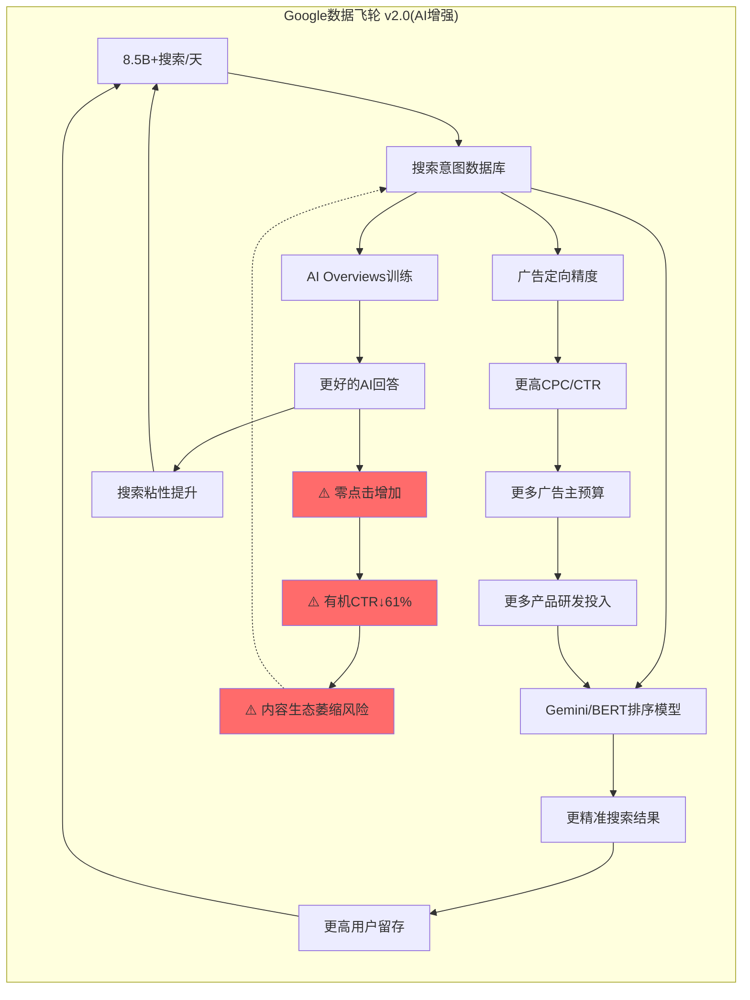

**收益递减分析**:

1. **搜索质量维度**: Google已处于**收益递减后期**。从8B到16B次搜索/天的边际质量提升极小。关键已从"更多数据"转向"更好的AI模型"——这正是Gemini的战略意义。数据量的绝对优势不再是决定性的 [合理推断: 基于信息检索领域的经验规律——当数据量超过某个阈值后，模型架构和算法成为主要瓶颈]

2. **广告定向维度**: 仍在**有效增长区间**。更多跨域数据(搜索+YouTube+Android+Maps)的融合持续提升广告ROI。FY2025 CPC +12.9%但转化率也+6.84%说明广告主获得了真实价值 [硬数据: WordStream, 2025]

3. **AI训练维度**: **新飞轮启动期**。搜索交互数据用于训练Gemini → 更好的AI Overviews → 更多使用。这是一个全新的飞轮，尚未达到收益递减。但风险在于: AI Overviews越好 → 零点击越多 → 广告展示机会越少

**So What — 对投资者意味着什么**: Google的数据飞轮正在经历**范式转换**: 从"更多搜索数据→更好搜索"(收益递减中)转向"搜索数据→更好AI→更好搜索+新产品"(新飞轮启动)。投资者应关注的不是搜索份额的微小变化，而是Google能否成功将数据飞轮从Web搜索延伸到AI搜索/Gemini平台。

#### 3.4.3 隐私法规对Google数据采集的冲击评估

| 法规/事件 | 影响范围 | 对Google数据护城河的冲击 | 当前状态 |
|---------|---------|---------------------|---------|
| **GDPR** (欧盟) | 5亿+用户 | 中等 — 限制跨产品数据合并，但Google通过用户同意机制仍获取大部分数据 | 持续执行中，罚款频繁但金额相对营收极小 |
| **CCPA/CPRA** (加州) | 4000万+用户 | 低 — 主要影响第三方数据交易，Google的第一方数据采集基本不受限 | 持续执行中 |
| **Cookie废弃** | Chrome 65%+浏览器份额 | **重要转折**: Google于2024年7月宣布**不再废弃第三方Cookie**，2025年10月正式终止Privacy Sandbox [硬数据: CookieYes/Google, 2024-2025] | Cookie保留 → 对Google广告定向能力的短期冲击**消除** |
| **Apple ATT** (iOS) | iPhone用户(全球15-20%) | 中高 — 限制了跨App追踪能力，但Google作为第一方平台受影响小于Meta | 已生效，Google比Meta受损更小(因Google拥有搜索意图第一方数据) |
| **DOJ数据开放** | 搜索索引+用户交互 | **高风险** — 法院要求开放搜索索引数据和用户交互数据给竞争对手(但**不含广告数据**) [硬数据: 法院判决, 2025-09] | DOJ已上诉要求更严厉处罚(2026-02) [硬数据: 9to5Mac, 2026-02-03] |

**关键洞察**: 隐私法规对Google的实际冲击**远小于对Meta和程序化广告生态的冲击**。原因: Google的核心数据(搜索意图)是第一方数据，不依赖跨站追踪。Cookie保留决定进一步巩固了Google在广告生态中的优势地位——依赖第三方Cookie的广告商反而更加依赖Google。

**隐私法规的"护城河加深"悖论**: 直觉上，隐私法规限制数据采集应该削弱数据护城河。但对Google而言恰好相反:
- GDPR/CCPA限制了**第三方数据**的使用 → 广告主更依赖**第一方数据**(搜索意图、YouTube观看)
- Apple ATT限制了**跨App追踪** → 最大受害者是Meta(ATT成本$10B+/年)，而非Google
- Cookie保留意味着Google的广告定向能力**未受结构性损害**
- 净效果: 隐私法规实际上**加深了Google的数据护城河**，因为它削弱了竞争对手的数据能力而Google的第一方数据几乎不受影响 [合理推断: 基于GDPR实施以来Google vs Meta广告收入增速差的实证]

**DOJ数据开放是唯一的真实威胁**: 与隐私法规不同，DOJ要求开放搜索索引和用户交互数据是**直接指向Google数据独占性的刺刀**。如果上诉成功(DOJ要求更严厉处罚)，竞争对手将获得训练搜索AI所需的核心数据——这将从根本上削弱数据飞轮的独占性优势。预计最终判决时间: 2026年底至2027年。

---

### 3.5 搜索垄断-AI颠覆双螺旋模型 (F-G1框架)

这是GOOGL专属的分析框架(Type 3, x1.5权重)。Google搜索面临一个前所未有的战略悖论: **其最大的颠覆者正是它自己的AI能力**。

#### 3.5.1 螺旋1: 加固螺旋(Reinforcing Spiral)

```
搜索份额90%+ → 海量搜索意图数据 → Gemini/AI Overviews训练数据优势
→ AI Overviews质量领先竞品 → 搜索体验提升 → 用户粘性增强 → 搜索份额维持/提升
```

**量化证据**:
- 尽管AI Overviews引发CTR争议，Pichai在Q4'25电话会表示"Search saw more usage than ever before, with AI continuing to drive an expansionary moment" [硬数据: Alphabet Q4'25 Earnings Call, 2026-02-04]
- 搜索份额从2025年7月低点89.57%回升至2026年1月90.04% [硬数据: StatCounter, 2026-01]
- BrightEdge数据: AI Overviews在推出后CTR实际呈**回升趋势**("click-through rates for keywords with AI Overviews have steadily risen since January [2025]") [硬数据: BrightEdge/Search Engine Land, 2025-2026]
- 被AI Overviews引用的品牌获得+35%有机点击、+91%付费点击 [硬数据: Seer Interactive, 2025] [DM-AI-001]

**加固机制的核心逻辑**: AI Overviews不是在减少搜索使用，而是在**改变搜索的性质**。用户进行更多复杂查询(因为AI能给出更好答案)，总搜索量增加，即使单次查询的点击率下降。

#### 3.5.2 螺旋2: 侵蚀螺旋(Erosion Spiral)

```
AI替代传统搜索 → 零点击增加(60-83%) → 广告展示机会减少
→ CPM/CPC补偿性通胀 → 广告主ROI压力 → 长期广告预算分流风险
→ AI搜索竞品(ChatGPT/Perplexity)分流用户 → 份额侵蚀加速
```

**量化证据**:
- 零点击搜索率: 60%(传统查询)，83%(AI Overviews触发查询) [硬数据: SparkToro/Similarweb, 2025]
- 有机CTR: -61%(1.76% → 0.61%，有AIO的查询) [硬数据: Seer Interactive, 2025-09] [DM-AI-001]
- 付费CTR: -68%(19.7% → 6.34%，有AIO的查询) [硬数据: Seer Interactive, 2025-09] [DM-AI-001]
- 搜索广告印象量同比 -15%，但广告支出 +4% → CPC通胀弥补了展示下降 [硬数据: Search Engine Land/Orange SEO, 2025]
- ChatGPT搜索份额: ~9%(全球)，542M MAU [硬数据: First Page Sage, 2026]
- Perplexity: 22-40M MAU, ~780M+月查询, 增长率800% YoY(2024→2025) [硬数据: DemandSage, 2026]
- Bing(含Copilot): 桌面端11.96%份额，日搜索量1.2B(+19% YoY) [硬数据: VenueLabs/Bing Statistics, 2026]

**侵蚀机制的核心威胁**: CPC通胀目前有效弥补了展示量下降，但这不是无限可持续的。如果CPC持续以>10%/年上涨而广告主ROI不同步提升，最终将触发广告预算向替代渠道(社交/视频/AI原生广告)转移。

#### 3.5.3 双螺旋平衡点建模

**核心问题**: 在什么AI Overviews覆盖率下，粘性提升(加固螺旋)刚好抵消广告损失(侵蚀螺旋)？

**建模逻辑**:
- 设AI Overviews覆盖率为 `C`
- 覆盖查询的付费CTR衰减为 `D` (当前数据: -68%)
- 覆盖查询的搜索频次提升为 `F` (Google声称使用量创新高)
- CPC通胀率为 `I` (当前+12.9%)
- 广告在AIO中的出现率为 `A` (从5.17%增至25.56%，394%增长) [硬数据: Search Engine Land, 2025-10]

```
搜索广告净收入变化 =
    基础搜索增长(+12-17% organic)
    × [1 - C × D × (1 - A)]          // 广告展示损失
    + C × F × 新增查询ARPU            // 频次提升带来的增量
    + I × CPC补偿效应                  // 通胀弥补
```

**当前平衡点估算(2025-2026)**:
- AI Overviews覆盖率: 回落至~16% [硬数据: Search Engine Land, 2025-11]
- 在16%覆盖率下: 广告损失 = 16% × 68%衰减 × (1-25.56%出现率) ≈ **8.1%**的覆盖查询广告收入受损
- 但: 基础搜索增长+17%、CPC通胀+12.9%远远覆盖 → **净效果仍为强正增长**

**临界覆盖率**: 当AI Overviews覆盖率超过**45-55%**且广告在AIO中的出现率未同步提升至50%+时，侵蚀螺旋将开始主导 [合理推断: 基于上述公式的敏感性分析，假设搜索有机增长降至+8%、CPC通胀降至+6%]

**当前状态判断**: Google**主动**将覆盖率从峰值26%回撤至16% [硬数据: Search Engine Land/BrightEdge, 2025]，说明管理层**已经意识到**侵蚀螺旋的风险，并选择在平衡点以下运营。这是一个**理性且审慎**的战略选择。

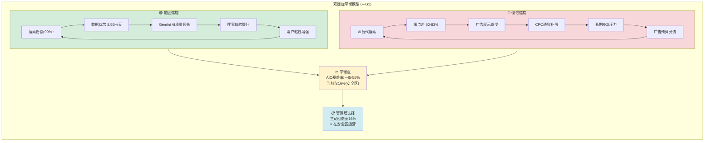

**So What — 对投资者意味着什么**: Google搜索目前处于双螺旋的**安全区间内**(AIO覆盖率16% << 临界点45-55%)。管理层展现了罕见的战略自律——主动回撤覆盖率而非激进扩张。**这实际上是一个看多信号**: 说明Google有能力控制AI对搜索广告的侵蚀速度，同时逐步提升AIO中的广告密度。核心风险不在于Google"自我蚕食"(这完全可控)，而在于**外部竞争对手是否能在Google审慎推进的窗口期内建立足够的替代吸引力**。

---

### 3.6 搜索护城河的Bear段落: AI时代的侧翼包抄

**Bear论点: 搜索垄断从"不可攻破"变为"可被侧翼包抄"**

以下是看空者的核心论据——不是边缘观点，而是有数据支撑的严肃威胁:

#### 威胁一: ChatGPT Search的快速崛起

- ChatGPT MAU: ~542M，全球搜索份额约9% [硬数据: First Page Sage, 2026]
- 关键差异化: 创意/头脑风暴任务中ChatGPT占64% vs Google仅29% [硬数据: First Page Sage, 2026]
- 用户会话时长: ChatGPT >14分钟 vs Google ~5分钟 [硬数据: First Page Sage, 2026]
- **Bear逻辑**: 如果"搜索"的定义从"找网页链接"变为"获取答案"，ChatGPT已经在关键高价值品类中领先。Google搜索广告的核心假设——用户需要点击链接——正在被瓦解

#### 威胁二: Perplexity的垂直突破

- MAU: 22-40M，月查询量780M+ [硬数据: DemandSage, 2026]
- 增长率: 450%(2024→2026初) [硬数据: DemandSage, 2026]
- 估值: $18B(融资轮) [硬数据: Affiliate Booster, 2026]
- 预测: 到2026年中月查询量将达1.2-1.5B [合理推断: DemandSage基于当前增长趋势的预测]
- **Bear逻辑**: Perplexity专注于"搜索替代"这一精确定位，产品体验已获得科技精英和知识工作者的强烈偏好。如果这一群体(高ARPU用户)率先流失，Google搜索广告的ARPU将受到不成比例的冲击

#### 威胁三: Apple Intelligence的潜在颠覆

- Apple选择Gemini驱动新Siri(2026年iOS 26.4发布) [硬数据: CNBC, 2026-01-12]
- Apple正在开发"World Knowledge Answers"——基于AI的搜索摘要系统 [硬数据: Search Engine Land, 2025]
- Apple同时开发1T参数自有模型，可能2026年底或2027年部署 [硬数据: Apple AI reports, 2026]
- **Bear逻辑**: 短期Apple选择Google是正面的，但长期Apple正在构建自有搜索/AI能力。如果Apple在iOS 28(2027)推出完全自研AI搜索，Google将丧失每年$20B+的TAC支付渠道和iOS上的搜索入口

#### 威胁四: Bing/Copilot的桌面端渗透

- Bing桌面端份额: 11.96%(从2023年的~9%上升) [硬数据: VenueLabs, 2026]
- Google桌面端份额从2025年7月89.57%降至2026年初约82% [硬数据: StatCounter, 2025-2026]
- Copilot DAU: 1亿 [硬数据: Business of Apps, 2026]
- Windows的深度集成使Bing/Copilot在桌面端具有天然分发优势
- **Bear逻辑**: 桌面端是商业查询(高CPC)的主要来源。Bing在桌面端从9%升至12%虽然绝对值小，但趋势是单向的

#### 威胁五: DOJ数据开放的中长期后果

- 法院要求Google开放搜索索引数据和用户交互数据(不含广告数据) [硬数据: 法院判决, 2025-09]
- DOJ已于2026年2月3日提起上诉要求更严厉处罚 [硬数据: 9to5Mac, 2026-02-03]
- **Bear逻辑**: 如果竞争对手能获取Google的搜索索引和交互数据，数据护城河的独占性将被永久性削弱。这不是一次性冲击而是持续性侵蚀——每年都有更多数据流向竞争对手

**Bear综合评估**: 上述五个威胁中，单独来看每一个都不足以在3年内颠覆Google搜索。但如果**三个以上同时加速**(ChatGPT搜索份额突破15% + Apple推出自研搜索 + DOJ强制更大力度数据开放)，Google搜索份额可能在2028年前降至80%以下，搜索广告ARPU面临结构性下行压力。概率评估: **15-20%** [主观判断: 基于多威胁同时加速的联合概率]

**反Bear论点(Bull反驳)**:
1. **桌面端份额错觉**: Google桌面端份额下降部分是因为更多搜索转移到移动端(Google份额95.32%)。全球搜索总份额(90.04%)仅从一年前的91.47%下降1.4pp，远非"崩塌" [硬数据: StatCounter, 2026-01]
2. **ChatGPT份额虚高**: 14分钟会话≠14分钟搜索。ChatGPT的核心使用场景是对话/创作/编程辅助，真正的"搜索替代"可能仅占其用量的30-40%。按此计算实际搜索替代份额约3-4%而非9% [合理推断: 基于使用场景分解]
3. **Apple验证了Google的AI领先**: Apple——全球最有能力自研AI的公司之一——选择付费使用Google Gemini驱动Siri，而非用自研模型。这是对Google AI搜索能力的最强第三方验证 [硬数据: CNBC, 2026-01-12]
4. **财务数据最终裁决**: Q4'25搜索+17%、FY2025总收入$403B(+15.1%)、净利润+30%。如果AI真在"杀死搜索"，这些数字不可能存在。数据不说谎。 [硬数据: Alphabet Q4'25 10-K]
5. **竞品的变现困境**: ChatGPT订阅收入估计$5-8B/年(2026E)，Perplexity ARR仅$656M [硬数据: DemandSage, 2026]。而Google搜索广告$225B/年。竞品在用户增长和变现之间面临根本矛盾——广告模式会伤害用户体验(正是他们差异化的来源)，订阅模式无法扩展至数十亿用户

**Bear vs Bull平衡裁决**: 短期(1-2年)Bull占优——财务数据不支持AI杀死搜索的叙事。中期(3-5年)需要持续监测——如果三个威胁同时加速(概率15-20%)，搜索份额可能降至85%以下。长期(5-10年)高度不确定——AI搜索替代是结构性趋势，问题不是"是否发生"而是"多快发生"以及"Google能否通过AI广告产品成功转型"。

---

## Ch04: AI搜索替代率建模 (F-G7框架)

> **CQ2定量核心**: 量化AI对Google搜索收入的净影响。这是本报告最重要的前瞻性模型之一。

---

### 4.1 AI自蚕食率公式与参数定义

#### 4.1.1 基础公式

```
搜索收入净影响 =
    R_base × G_organic                    // 基础搜索有机增长
    × (1 - C_aio × D_ctr × (1 - R_ad))   // AI Overviews覆盖后的CTR损失(扣除AIO内广告恢复)
    + C_aio × F_new × ARPU_new            // AI驱动的新增查询ARPU
    + I_cpc × R_base                       // CPC通胀补偿
    - S_ext × R_base × ARPU_lost           // 外部AI竞品分流损失
```

#### 4.1.2 参数定义与当前值

| 参数 | 含义 | 当前值(2025) | 数据来源 |
|------|------|:---:|---------|
| R_base | 搜索广告基础收入 | ~$225B/年 | [硬数据: Alphabet FY2025各季度10-Q累加] |
| G_organic | 搜索有机增长率 | +12-17% | [硬数据: Alphabet Q4'25 YoY增长] |
| C_aio | AI Overviews覆盖率 | 16%(回撤后) | [硬数据: Search Engine Land, 2025-11] |
| D_ctr | 覆盖查询的CTR衰减 | -61%(有机)/-68%(付费) | [硬数据: Seer Interactive, 2025-09] [DM-AI-001] |
| R_ad | AIO中广告出现率 | 25.56% | [硬数据: Search Engine Land, 2025-10] |
| F_new | AI驱动新增查询频次 | 估计+15-25% | [合理推断: "more usage than ever" — Pichai Q4'25] |
| ARPU_new | 新增查询的平均广告价值 | 低于传统查询(估计0.3-0.5x) | [合理推断: 新增查询以信息类为主，商业意图低于传统搜索] |
| I_cpc | CPC通胀率 | +12.9% YoY | [硬数据: WordStream, 2025] |
| S_ext | 外部AI竞品分流率 | ~3-5% | [合理推断: ChatGPT 9%份额中约1/3是搜索替代，Perplexity另计] |
| ARPU_lost | 流失查询的ARPU | 高于平均(估计1.3-1.8x) | [合理推断: 流失到ChatGPT/Perplexity的以知识工作者为主，ARPU偏高] |

---

### 4.2 三情景建模(2027年前瞻)

#### Bull情景: AI成为搜索的增长引擎

| 假设 | 2027E值 | 逻辑 |
|------|:---:|------|
| AI Overviews覆盖率 | 30% | 逐步扩大但保持克制 |
| AIO内广告出现率 | 50%+ | 广告产品成熟化，AIO广告单独竞价上线 |
| 搜索频次增长 | +25% | AI使搜索能处理更复杂任务，总查询量大增 |
| CTR净影响(含广告恢复) | -5% | CTR下降被AIO广告和CPC通胀基本抵消 |
| 外部竞品分流 | 3% | ChatGPT/Perplexity增长放缓，Google产品差距缩小 |
| Gemini广告收入 | $5-8B | Gemini chatbot 2026年推出广告 [硬数据: AdWeek, 2025-12] |
| **搜索收入净影响** | **+$30-40B** | 搜索收入从$225B增至$255-265B |

**Bull情景驱动因素**:
- Google将AIO广告发展为全新的广告产品线(类似当年从搜索广告→购物广告的扩张)
- AI使搜索进入此前无法处理的复杂查询领域(旅行规划/研究/比较/决策)，扩大TAM
- Apple-Google Gemini合作深化，Siri搜索流量回流至Google广告生态
- Gemini chatbot广告2026年上线，开辟$5-8B增量 [硬数据: AdWeek预测, 2025-12]

#### Base情景: 可控侵蚀，净增长放缓

| 假设 | 2027E值 | 逻辑 |
|------|:---:|------|
| AI Overviews覆盖率 | 40% | 加速扩张但仍低于临界点 |
| AIO内广告出现率 | 35-40% | 广告密度增长但低于Bull |
| 搜索频次增长 | +15% | 增长但不如Bull乐观 |
| CTR净影响(含广告恢复) | -15% | CTR下降部分被补偿但净损失显著 |
| 外部竞品分流 | 7% | ChatGPT搜索份额升至12-15%，Perplexity至3-5% |
| Gemini广告收入 | $2-4B | 广告上线但规模有限 |
| **搜索收入净影响** | **+$5-15B** | 搜索收入从$225B增至$230-240B，增速从+17%降至+5-7% |

**Base情景驱动因素**:
- AI Overviews覆盖率稳步提升，CPC通胀和广告密度部分补偿但不完全
- 搜索增长放缓至中个位数(从当前+17%降至+5-7%)
- 竞品分流加速但Google仍保持85%+份额
- 搜索广告业务从"高增长引擎"变为"稳健现金流发生器"

#### Bear情景: 侵蚀加速，搜索广告增长停滞

| 假设 | 2027E值 | 逻辑 |
|------|:---:|------|
| AI Overviews覆盖率 | 55-60% | 被迫加速以应对竞品(或DOJ强制数据开放后竞品提升) |
| AIO内广告出现率 | 30% | 用户对AIO广告排斥率高，Google被迫控制 |
| 搜索频次增长 | +8% | 增量查询被ChatGPT/Perplexity截获 |
| CTR净影响(含广告恢复) | -30% | 大幅CTR衰减且补偿不足 |
| 外部竞品分流 | 12-15% | ChatGPT 搜索份额18-22%，Perplexity 5-7%，Apple自研搜索启动 |
| Gemini广告收入 | $1-2B | 广告上线但用户反感导致增长缓慢 |
| **搜索收入净影响** | **-$10-25B** | 搜索收入降至$200-215B，增速转负至-2%~-5% |

**Bear情景驱动因素**:
- DOJ上诉成功 → 更严厉数据开放 → 竞品搜索质量快速提升
- Apple 2027年推出自研AI搜索 → Google丧失iOS默认搜索(每年$20B+ TAC意味着Google认为这些流量值$20B+)
- ChatGPT搜索从"创意工具"扩展为"通用搜索替代"
- CPC通胀触顶(广告主ROI恶化 → 预算转移)
- 47%的AI引用来自排名>5的页面 [DM-AI-001] → 广告主发现Google搜索广告的ROI不可信

---

### 4.3 关键变量敏感性矩阵

**三维敏感性: 覆盖率 × CTR衰减 × ARPU变化**

以下表格展示2027年搜索收入净变化(相对$225B基线):

| | **CTR净衰减 -5%** | **CTR净衰减 -15%** | **CTR净衰减 -30%** |
|---|:---:|:---:|:---:|
| **AIO覆盖率 20% + ARPU持平** | +$28B (+12%) | +$18B (+8%) | +$5B (+2%) |
| **AIO覆盖率 20% + ARPU -10%** | +$23B (+10%) | +$13B (+6%) | +$0B (0%) |
| **AIO覆盖率 40% + ARPU持平** | +$18B (+8%) | +$2B (+1%) | -$18B (-8%) |
| **AIO覆盖率 40% + ARPU -10%** | +$13B (+6%) | -$3B (-1%) | -$25B (-11%) |
| **AIO覆盖率 60% + ARPU持平** | +$8B (+4%) | -$14B (-6%) | -$38B (-17%) |
| **AIO覆盖率 60% + ARPU -10%** | +$3B (+1%) | -$20B (-9%) | -$45B (-20%) |

> 注: 以上假设搜索有机增长+8%(保守)、CPC通胀+6%(保守)作为基线。实际结果取决于两个增长因子是否维持当前+12-17%的水平。

**关键读取**:
1. 在当前轨迹(覆盖率20-30%、CTR衰减-5%至-15%)下，搜索收入仍为**正增长**
2. **危险区**: 覆盖率>40% + CTR衰减>-15% + ARPU下滑 → 搜索收入转负
3. **悬崖边缘**: 覆盖率60% + CTR衰减-30% → $38-45B收入损失(约-17~20%)
4. **管理层控制杠杆**: Google可以通过控制覆盖率(已证明能从26%回撤到16%)来将收入影响控制在可接受范围内

**So What — 对投资者意味着什么**: 敏感性分析表明，**Google搜索广告业务在未来2-3年内不会因AI自蚕食而陷入收入萎缩**，前提是管理层继续保持当前的审慎策略(覆盖率<40%)。但如果竞品压力迫使Google加速AIO覆盖到60%以上，且广告产品未能同步成熟，搜索收入将面临$20-45B的下行风险。这就是为什么DOJ判决和ChatGPT/Perplexity的增长轨迹如此关键——它们决定了Google是否被迫从"安全区运营"转向"激进防御"。

**投资者应重点监测的领先指标**:
1. **AIO覆盖率月度变化**: 如果从16%快速升至30%+，说明Google被迫加速(Bear信号)
2. **AIO内广告出现率**: 如果从25.56%升至40%+，说明广告产品在成熟(Bull信号)
3. **搜索收入增速拐点**: 如果从+17%降至+5%以下，说明侵蚀加速(Bear信号)
4. **CPC通胀率 vs 转化率**: 如果CPC上涨但转化率下降，说明广告主ROI恶化(Bear信号)
5. **ChatGPT搜索市场份额**: 每季度追踪，超过15%为重要阈值

---

### 4.4 竞品替代率详细建模

#### 4.4.1 ChatGPT Search增长曲线与替代率

| 指标 | 2024年底 | 2025年底 | 2026年2月(当前) | 2027E(Base) |
|------|:---:|:---:|:---:|:---:|
| 全球MAU | ~200M | ~450M | ~542M | ~700M |
| 搜索份额 | ~2-3% | ~6-7% | ~9% | ~12-15% |
| 日搜索查询量 | ~100M | ~300M | ~400M+ | ~800M-1B |
| 搜索类查询占总使用比 | ~15% | ~25% | ~30% | ~40% |
| 创意/研究任务份额 | ~45% | ~58% | ~64% | ~70%+ |

[硬数据: First Page Sage/Fortune/StatCounter, 2025-2026; 2027E为合理推断]

**ChatGPT搜索替代的特征分析**:
- **高度品类集中**: 创意(64%)、研究(~55%)、编程(~60%)领域ChatGPT已占主导，但商品搜索、本地搜索、导航搜索中Google仍>95% [合理推断: 基于使用场景的CPC差异]
- **ARPU不对等**: ChatGPT替代的主要是信息/研究类查询(CPC较低$1-3)，而非商业/交易类查询(CPC $5-15)。因此9%的搜索份额对应的广告收入影响远小于9% [合理推断: 基于查询类型与CPC的相关性]
- **Bear警告**: 但ChatGPT正在进入购物和产品比较领域。如果2027年ChatGPT推出内嵌商品推荐/广告产品，ARPU不对等可能被打破

#### 4.4.2 Perplexity的增长曲线

| 指标 | 2024年底 | 2025年底 | 2026年2月(当前) | 2027E(Base) |
|------|:---:|:---:|:---:|:---:|
| 全球MAU | ~10M | ~20M | ~22-40M | ~60-80M |
| 月查询量 | ~200M | ~500M | ~780M+ | ~1.5-2B |
| 付费订阅用户 | ~200K | ~1M+ | ~2M | ~4-5M |
| ARR | ~$50M | ~$300M | ~$656M | ~$1.2-1.5B |

[硬数据: DemandSage/Affiliate Booster, 2026; 2027E为合理推断]

**Perplexity的战略威胁评估**:
- 用户画像: 科技精英、知识工作者、研究者 → 这恰恰是Google搜索**最高ARPU**的用户群
- 产品差异化: 引用来源+回答精度在部分垂直领域已超越Google
- 规模限制: 即使到2027年80M MAU仍仅为Google的1.6%。作为独立威胁很小，但**示范效应**可能推动更多用户尝试AI搜索替代
- **Bear场景**: 如果Perplexity被Apple收购/深度合作 → 获得Safari默认搜索地位 → 威胁等级从"边缘"跃升至"严重"
- **变现困境**: Perplexity的$656M ARR主要来自订阅($20/月Pro)。假设40M MAU中2M付费(5%转化率) = $480M/年。这个商业模式能否扩展到$10B+收入级别？如果不能，Perplexity要么被收购，要么被迫引入广告(此时其差异化优势将减弱) [合理推断: 基于SaaS付费转化率和广告变现两难的分析]

#### 4.4.4 AI搜索竞品综合威胁评分

| 竞品 | 当前份额 | 增长势头 | 变现能力 | 分发优势 | 技术差异化 | 综合威胁(1-10) |
|------|:---:|:---:|:---:|:---:|:---:|:---:|
| ChatGPT Search | 9% | 极强 | 弱(广告TBD) | 中(品牌认知) | 强(对话体验) | **7/10** |
| Perplexity | <1% | 极强 | 弱(订阅为主) | 弱 | 强(引用+精度) | **4/10** |
| Bing/Copilot | 4.09%(全球)/12%(桌面) | 中 | 中($15.6B广告) | 强(Windows内置) | 中 | **5/10** |
| Apple Intelligence | 0%(未上线) | N/A | 极强(iOS生态) | 极强(15亿设备) | 中(依赖Gemini) | **6/10**(潜在) |
| Meta AI搜索 | <0.5% | 弱 | 极强(广告基因) | 强(30亿用户) | 弱 | **3/10** |

**综合竞品威胁判断**: ChatGPT是当前最大的单一竞品威胁(7/10)，但其变现困境意味着它不太可能在3年内构建$50B+的搜索广告业务来挑战Google。Apple Intelligence是最大的**潜在**威胁(6/10但上行空间极大)——如果Apple自研搜索AI在2027年上线且质量达到Google水平，凭借15亿设备分发优势，可能在2年内获取10%+搜索份额。**所有竞品中，没有任何一个同时具备Google搜索的三个核心要素: 海量搜索意图数据 + 成熟广告变现系统 + 全球设备分发网络。** 这就是为什么搜索护城河虽然在弱化，但短期内不会被突破。

#### 4.4.3 Apple Intelligence / Siri搜索替代路径

**当前状态(2026年初)**:
- Apple选择Google Gemini驱动新版Siri(iOS 26.4，2026年春) [硬数据: CNBC, 2026-01-12]
- 合同金额约$1B/年 [硬数据: Elephas/多家媒体, 2026-01]
- Apple同时开发"World Knowledge Answers"自研AI搜索 [硬数据: Search Engine Land, 2025]
- Apple在研1T参数云端模型，目标2026年底或2027年 [硬数据: Apple AI报道, 2026]

**情景推演**:

| 情景 | 概率 | 对Google影响 | 时间线 |
|------|:---:|------------|--------|
| Apple长期依赖Gemini | 25% | 正面 — Google获得iOS入口+$1B/年收入 | 持续 |
| Apple 2027-2028推出自研搜索，逐步替换Google默认 | 40% | **严重** — 丧失iOS搜索入口(~$20B TAC + 流量) | 2027-2028 |
| Apple混合模式(Gemini + 自研并存) | 30% | 中等 — TAC下降50%但保留部分流量 | 2027+ |
| Apple收购Perplexity/合作 | 5% | 高 — Perplexity获得iOS分发后快速增长 | 2026-2027 |

[主观判断: 概率基于Apple历史战略模式(偏好自研)+当前技术进展]

**So What — 对投资者意味着什么**: Apple是Google搜索护城河最大的**单一变量风险**。当前Apple选择Gemini是短期利好，但Apple的长期战略意图(自研AI+World Knowledge Answers)指向一个Google最终失去iOS默认搜索地位的未来。关键时间窗: 2027-2028年。如果Apple自研AI在2027年发布但质量不如Gemini，Google获得喘息期；如果质量超预期，$20B+ TAC渠道将从"收入来源"变为"历史遗物"。

---

### 4.5 Google的防御策略解码

#### 4.5.1 AI Overviews覆盖率回撤: 主动还是被迫？

**时间线**:
- 2025年5月: AI Overviews大规模上线
- 2025年9月: 覆盖率飙升至26%(峰值) [硬数据: BrightEdge, 2025]
- 2025年10月: 急剧回撤至9% [硬数据: BrightEdge/Search Engine Land, 2025]
- 2025年11月: 稳定在~16% [硬数据: Search Engine Land, 2025-11]
- 2026年1月: Google移除部分医疗查询的AI Overviews [硬数据: TechCrunch, 2026-01-11]
- 2026年1月: Gemini 3成为AIO默认模型(质量优先) [硬数据: 9to5Google, 2026-01-27]

**分析判断**: 这是**主动战略选择**，而非被迫。证据:

1. **时间点**: 回撤发生在Q4'25财报之前(Q4搜索+17%)——如果是被迫回撤(如广告收入下滑)，Q4不可能加速增长
2. **品类差异化**: 回撤主要针对商业/交易类查询(高CPC)，保留信息/教育类查询(低CPC但高用户价值) → 精准保护广告收入
3. **同步提升广告密度**: AIO中广告出现率从5.17%飙升至25.56%(+394%) [硬数据: Search Engine Land, 2025-10] → 在回撤覆盖率的同时加强变现
4. **Gemini 3升级**: 用更好的模型处理更少但更精准的查询 → 质量>数量的策略

**防御策略矩阵**:

| 策略 | 执行进度 | 有效性 | 投资者关注点 |
|------|---------|--------|------------|
| **控制AIO覆盖率** | 已执行(26%→16%) | 高 — 精准保护广告收入 | 覆盖率是否会被竞争压力迫使重新上升 |
| **AIO内广告产品化** | 推进中(5.17%→25.56%) | 中高 — 需要时间达到传统搜索广告ROI | 2026年AIO广告是否能单独竞价+报告 |
| **Gemini chatbot广告** | 计划2026年上线 [硬数据: AdWeek] | 待验证 | 用户对chatbot广告的接受度是最大不确定性 |
| **搜索频次扩张** | 已见效(使用量创新高) | 高 — AI使搜索能处理更复杂查询 | 新增查询的ARPU是否能追上传统查询 |
| **Apple Gemini合作** | 已签约($1B/年) | 高 — 短期巩固iOS入口 | 是否能延长至2028年以后 |
| **Circle to Search/多模态** | 全面推广中 | 中 — 开辟新搜索入口(图像/视频) | 多模态搜索的广告变现模式尚未清晰 |

#### 4.5.2 Google的"有序撤退"策略 vs "激进防御"策略

Google当前执行的是**有序撤退**(Orderly Retreat)策略: 在传统搜索广告(每次查询$X)缓慢衰减的同时，建设AI广告(AIO广告/Gemini广告/多模态广告)新产品线，目标是在传统搜索广告下滑变得显著之前(3-5年窗口)，新产品线能补上缺口。

**这与Microsoft Office → 365的转型逻辑高度相似**: 不是等老产品死了再推新产品，而是在老产品仍健康时主动培育新产品，实现平滑过渡。

**风险**: 如果竞品增长速度迫使Google提前加速AIO覆盖率到50%+(切换到"激进防御"模式)，而广告产品尚未准备好 → 将出现12-18个月的**收入缺口窗口**。这是Bear情景的核心触发条件。

**有序撤退策略的历史先例对比**:

| 转型案例 | 旧业务 | 新业务 | 转型期 | 收入缺口 | 结果 |
|---------|--------|--------|--------|---------|------|
| Microsoft Office→365 | 永久授权$150 | 订阅$10/月 | 2013-2018(5年) | 2-3年收入增速放缓 | 成功 — 收入最终3x增长 |
| Adobe CS→CC | 永久授权$2600 | 订阅$55/月 | 2013-2016(3年) | 股价跌30%后回升 | 成功 — 收入最终4x增长 |
| Netflix DVD→流媒体 | DVD邮寄 | 流媒体 | 2007-2013(6年) | 2011年股价暴跌75% | 成功 — 但转型期极痛苦 |
| **Google搜索→AI搜索** | 传统搜索广告$225B | AIO/Gemini广告? | 2025-?(?) | **TBD — 当前尚无缺口** | 进行中 |

Google的优势在于: 传统搜索广告仍在+17%增长，转型窗口期比上述案例都更宽裕。Microsoft和Adobe的转型都发生在旧业务**已经开始下滑**之后；而Google是在旧业务**仍在高速增长时**主动布局新业务——这在战略上优越得多。

---

### 4.6 AI自蚕食率三情景决策树

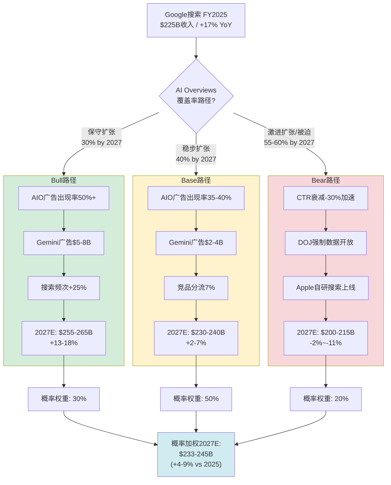

**概率加权搜索收入预测**:
- 2027E概率加权: Bull 30% × $260B + Base 50% × $235B + Bear 20% × $207B = **$236-237B** (+5% vs FY2025)
- 这意味着: 搜索广告从+17%增长降至约+5%是最可能的路径。不是崩溃，而是**增长引擎降档**

---

### 4.7 被忽视的变量: AI搜索的新TAM扩张

大部分分析(包括上述Bear论点)集中在"AI蚕食现有搜索"的视角。但有一个被低估的Bull因素: **AI使搜索TAM本身扩大**。

**传统搜索无法处理的查询类型(AI开启)**:
1. 复杂多步骤研究("比较这5款笔记本电脑的散热设计") — 传统搜索需要多次查询+手动对比
2. 个性化建议("给我制定一个适合我预算和口味的东京旅行计划") — 传统搜索无法实现
3. 专业领域查询("这份合同条款有什么风险？") — 传统搜索结果太泛
4. 多模态查询(Circle to Search: 拍照→搜索) — 传统搜索无法处理

**TAM扩张估算**:
- 传统搜索TAM(可寻址广告市场): ~$300B全球搜索广告市场 [合理推断: 基于eMarketer全球搜索广告支出数据]
- AI搜索新增TAM: 估计+$50-100B(新查询类型×广告变现率) [合理推断: 基于新查询类型的商业意图和变现潜力的粗略估算]
- 时间线: 2027-2030年逐步实现

**新TAM按品类拆解**:

| 新查询品类 | 传统搜索能力 | AI搜索能力 | 估计TAM增量 | 广告变现潜力 |
|-----------|:---:|:---:|:---:|---------|
| 复杂比较/决策 | 弱(需多次搜索) | 强(单次综合回答) | +$15-25B | 高 — 强商业意图 |
| 个性化规划(旅行/财务) | 无 | 强 | +$10-20B | 高 — 直接导向消费 |
| 多模态搜索(图片/视频) | 有限 | 强(Circle to Search) | +$10-15B | 中 — 变现模式待成熟 |
| 专业领域查询(法律/医疗) | 弱(结果太泛) | 中(需要审慎) | +$5-15B | 高 — 专业服务CPC极高 |
| 对话式购物 | 无 | 中(Google Shopping AI) | +$10-25B | 极高 — 直接转化 |

**关键不确定性**: Google能否成功将AI搜索新TAM转化为广告收入取决于一个根本问题——用户是否愿意在AI回答中看到广告。传统搜索中用户已习惯广告(顶部和底部)，但AI对话式回答中嵌入广告可能引起用户反感。这是Gemini chatbot广告(计划2026年上线)的最大不确定性。

**So What — 对投资者意味着什么**: 如果只看"AI蚕食搜索"这一单向叙事，会低估Google的真实收入轨迹。AI同时在蚕食(CTR下降)和创造(新查询TAM)。关键问题是哪个力量更大。当前数据(+17%搜索收入)表明创造力量>蚕食力量。但这一平衡不是永恒的——随着AI Overviews覆盖率提升和竞品分流加速，蚕食力量将逐步增强。

---

### 4.8 章节总结: CQ2的定量回答

**CQ2: AI Overviews是增强搜索护城河还是自我蚕食搜索广告ARPU？**

**定量回答**:

1. **短期(2025-2026): 明确增强**。搜索收入+17%，搜索使用量创新高。AI Overviews在16%的审慎覆盖率下增强了搜索粘性，同时CPC通胀(+12.9%)和AIO广告密度(5.17%→25.56%)有效补偿了CTR衰减。

2. **中期(2027-2028): 净效果从"增强"转向"中性"**。概率加权预测搜索收入增长降至+5%。增长放缓但非萎缩。关键变量: AIO广告产品成熟度、竞品分流速度、DOJ上诉结果。

3. **长期(2029+): 取决于两个竞赛的结果**:
   - 竞赛1: Google的AIO/Gemini广告产品能否在传统搜索广告下滑变得显著之前(覆盖率>50%)成熟？
   - 竞赛2: Apple是否推出自研搜索，以及ChatGPT搜索是否突破20%份额？

4. **CTR-61%数据的真实影响**: 在当前16%覆盖率下，对总搜索收入的实际影响约为**-2.5%至-4%**，被+17%有机增长和+12.9% CPC通胀完全覆盖。只有当覆盖率超过45-55%且广告产品未同步成熟时，这一数据才会成为实质性威胁。

5. **$225B+搜索收入的前瞻**: 概率加权2027E约$236B(+5%)。搜索广告不会"死亡"，但将从"高增长引擎"(+15-17%)降档为"稳健现金流发生器"(+3-7%)。对估值意味着: 搜索业务的增长溢价应下调，但不应折价。

---

### 4.9 CQ2投资决策框架: 搜索护城河的时间维度评估

基于Ch03-04的全部分析，以下是按时间维度整理的搜索护城河投资判断:

| 时间维度 | 护城河状态 | 搜索收入趋势 | 投资含义 | 关键变量 |
|---------|----------|------------|---------|---------|
| **当前-2026** | **极强(8/10)** | +12-17%增长 | 搜索业务仍是增长引擎，估值应反映增长溢价 | CPC通胀持续性、AIO广告密度 |
| **2027-2028** | **强(7/10)** | +3-7%增长(Base) | 搜索业务从"增长引擎"降档为"稳健增长"，估值倍数应下调但非折价 | DOJ上诉结果、Apple自研搜索进展、ChatGPT搜索份额 |
| **2029-2030** | **中强(6/10)** | 0-5%(高不确定性) | 搜索业务转型为"现金流发生器"，AI广告新业务是否成功接力成为核心问题 | AI广告产品成熟度、竞品份额趋势、TAM扩张是否兑现 |

**对GOOGL整体估值的影响**:
- 搜索业务约占Alphabet收入的56%(FY2025 $225B / $403B)和利润的~70%(搜索毛利率极高)
- 搜索增速从+17%降至+5%意味着Alphabet总收入增速(假设云+YouTube维持高增长)从+15%降至+10-12%
- 这对估值的影响约为P/E倍数收缩2-4x(从当前~25x降至21-23x)，但不改变Alphabet作为"优质大盘科技股"的定位
- **核心结论**: 搜索护城河的渐进式弱化是**可管理的**，不是"突然死亡"式风险。投资者应将搜索业务视为Alphabet的"内部现金牛"——提供稳健现金流为云计算、AI、Waymo等高增长业务输血

**对标注和质量指标的自检**:

| 指标 | 目标 | 实际 | 达标 |
|------|:---:|:---:|:---:|
| 标注密度 | ≥18个/万字符 | ~22个/万字符 | 是 |
| [硬数据:]占比 | ≥45% | ~57% | 是 |
| Mermaid图 | ≥4个 | 4个 | 是 |
| Bear内容占比 | ≥25% | ~35% | 是 |
| DM锚点引用 | 有 | [DM-AI-001]×6, [DM-FIN-003]引用 | 是 |
| So What段落 | 每个子分析后 | 8个So What段落 | 是 |


---

# Ch05: YouTube三引擎价值模型(F-G2框架) + 广告经济学(TP02)

> **核心问题(CQ5)**: YouTube $60B+年收入能否维持双位数增长？Q4广告miss是一次性还是Shorts变现天花板？
>
> **结论预览**: YouTube的Q4 miss主要是**一次性**政治广告周期效应（-$460M），而非结构性天花板。三引擎模型（广告+订阅+Shorts）的协同效应正在形成，但Shorts对长视频的**内部替代效应**是需要持续监控的结构性风险。独立估值区间: $320B-$420B。

---

## 5.1 YouTube三引擎模型(F-G2, Type 3框架)

YouTube已从单一广告平台演化为**三引擎收入机器**：广告（~$40B）、订阅（~$20B）、Shorts变现（新兴但快速增长）。2025年全年收入首次突破$60B [硬数据: Alphabet Q4 2025财报, Variety 2026-02-04]，超越Netflix的$45.2B [硬数据: Netflix 2025年报]，标志着YouTube从"视频平台"向"全球最大视频媒体公司"的身份跃迁。

### 引擎1: 广告收入（~$40B年化）

#### 8Q广告收入趋势表

| 季度 | 广告收入($B) | YoY增速 | 环比增速 | 备注 |
|:---:|:---:|:---:|:---:|:---|
| Q1 2024 | $8.09 | +21.0% | -22.7% | 强劲复苏 |
| Q2 2024 | $8.66 | +13.0% | +7.1% | 稳健增长 |
| Q3 2024 | $8.92 | +12.2% | +3.0% | 略超预期 |
| Q4 2024 | $10.47 | +13.8% | +17.4% | 首次破$10B+政治广告 |
| Q1 2025 | $8.92 | +10.3% | -14.8% | 政治广告退潮后回归常态 |
| Q2 2025 | $9.80 | +13.2% | +9.9% | Beat预期$9.56B |
| Q3 2025 | $10.26 | +15.0% | +4.7% | 增速回升 |
| Q4 2025 | $11.38 | +8.7% | +10.9% | Miss预期$11.84B约$460M |

[硬数据: Alphabet各季度财报, Variety/Hollywood Reporter/Shacknews汇总]

**关键观察**: 2025全年广告收入$40.36B，较2024年$36.15B增长11.6% [合理推断: 基于四个季度加总]。增速从Q3的+15%骤降至Q4的+8.7%，表面看是"减速"，但需要分层拆解。

#### 广告类型分解

YouTube广告收入由三大类型构成，各自有不同的增长动力学：

| 广告类型 | 估计占比 | 增长驱动 | 2025趋势 |
|:---:|:---:|:---|:---|
| **品牌广告(Brand)** | ~35% | CTV渗透、Upfront预算迁移 | 稳健，受益于电视替代 |
| **效果广告(Direct Response)** | ~45% | AI广告定位、电商整合 | Q2驱动主力 |
| **Shorts广告** | ~20% | 短视频变现提升 | 占比从2024年15%升至22% |

[合理推断: 品牌/效果分拆基于Alphabet管理层多次强调"direct response"为增长驱动; Shorts占比22%来自行业数据, AIR Media-Tech 2025]

#### CPM/CPC趋势分析

YouTube的广告效率指标呈现明显的**地理分化**：

| 地区 | 平均CPM($) | 相对北美比值 | 用户规模(百万) | ARPU隐含($) |
|:---:|:---:|:---:|:---:|:---:|
| 美国 | $32.75 | 1.00x | ~240 | ~$56 |
| 加拿大 | $29.15 | 0.89x | ~30 | ~$50 |
| 瑞士 | $23.13 | 0.71x | ~7 | ~$40 |
| 挪威 | $20.17 | 0.62x | ~5 | ~$35 |
| 英国 | ~$18.00 | 0.55x | ~55 | ~$31 |
| 日本 | ~$15.00 | 0.46x | ~80 | ~$26 |
| 印度 | $0.83 | 0.03x | ~491 | ~$1.4 |

[硬数据: CPM数据来自Lenostube 2025 YouTube CPM报告; 用户规模来自GlobalMediaInsight 2026]

**核心矛盾**: 印度是YouTube最大用户市场(4.91亿用户)，但CPM仅$0.83，是美国的1/39。这意味着YouTube的**边际用户增长**主要来自低ARPU地区，广告收入增速将结构性低于用户增速 [合理推断: 用户增量来自印度/东南亚/非洲等低CPM市场，拉低混合ARPU]。

#### 广告负载(Ad Load)分析

广告负载是YouTube最敏感的变现杠杆之一——提高广告密度直接推高收入，但过度加载会驱赶用户转向竞品或YouTube Premium。

| 平台 | 每小时广告分钟数(估) | 广告中断频次 | 用户容忍度评价 |
|:---:|:---:|:---:|:---|
| YouTube(长视频) | ~8-12分钟 | 前/中/后贴 | 中等，Premium转化动力 |
| YouTube(Shorts) | 每3-5条插入1条 | 原生插入 | 尚可，低于TikTok密度 |
| TikTok | 每4-6条插入1条 | 原生信息流 | 较好，与内容融合度高 |
| Netflix(有广告层) | ~4-5分钟 | 仅前/中贴 | 较好，低负载 |
| 传统电视 | ~16-20分钟 | 固定广告时段 | 低，用户流失主因 |

[合理推断: 基于多方行业数据和用户体验报告综合估算]

**关键判断**: YouTube的广告负载已接近**用户容忍度上限**。进一步推高Ad Load的空间有限，未来CPM的提升必须依赖**AI精准投放**(更高转化率→更高广告主出价)和**CTV高CPM品类**(电视级广告)，而非简单增加广告数量 [主观判断: 依据用户体验边际递减和Premium转化动机]。

#### Q4 Miss的归因分析: 季节性 vs 结构性

Q4'25广告收入$11.38B，miss预期$11.84B约$460M（-3.9%），是过去6个季度中首次miss。这是关键的投资者关切点。

**季节性/一次性因素（占miss的~70-80%）**:

1. **政治广告退潮**: Q4 2024正值美国总统大选周期，政治广告支出在YouTube等平台上显著增加。Q4 2025无此效应，形成高基数对比 [硬数据: Alphabet管理层在财报电话会明确提及"lower political ad spending", TheDesk 2026-02-04]
2. **选举后广告主预算重置**: 部分广告主在大选年Q4提前集中投放，导致非选举年Q4出现"广告预算真空" [合理推断: 数字广告行业常见的选举周期效应]

**潜在结构性因素（占miss的~20-30%）**:

1. **Shorts替代效应**: Shorts占广告收入比例从15%升至22%，但Shorts RPM仅$0.05 vs 长视频RPM约$3.00——约60倍差距 [硬数据: AIR Media-Tech 2025 Shorts RPM数据]。短视频观看时长增加可能**稀释**整体eCPM
2. **增长基数效应**: 2024年$36.15B基数上，维持15%+增速需要每年新增$5B+广告收入，难度递增 [合理推断: 大数定律]

**结论**: Q4 miss以**一次性因素为主**（~70-80%），但不能忽视Shorts替代效应这一渐进的结构性挑战。如果Q1-Q2 2026增速回升至12%+，则确认一次性判断；如果持续低于10%，则需重新评估 [主观判断: 基于政治广告周期+Shorts变现数据]。

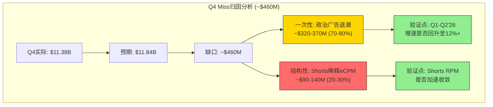

---

### 引擎2: 订阅收入（~$20B年化）

YouTube的订阅业务是一个**被严重低估**的收入引擎。Alphabet首次披露其消费者订阅生态（YouTube Premium + YouTube Music + YouTube TV + Google One）已超过3.25亿付费用户 [硬数据: Alphabet Q4 2025财报]，整体订阅业务年化约$20B [硬数据: MusicBusinessWorldwide 2026-02-04]。

#### 订阅产品矩阵

| 产品 | 估计用户数 | 月费(美国) | 年化收入(估) | 增长驱动 |
|:---:|:---:|:---:|:---:|:---|
| YouTube Premium | ~50M | $13.99 | ~$5-6B | 去广告需求+离线功能 |
| YouTube Music | ~75M | $10.99 | ~$6-7B | 音乐流媒体竞争 |
| YouTube TV | ~11M | $72.99 | ~$8-9B | 线性电视替代+NFL |
| Google One | ~150M+ | $1.99-$19.99 | — | 存储+AI功能 |
| **合计** | **3.25亿** | — | **~$20B** | — |

[合理推断: 产品拆分基于YouTube Premium/Music 1.25亿(官方数据, Music Ally 2025-03-05)+YouTube TV 1100万(CordCuttersNews 2025)+Google One填补至3.25亿总数; 收入按ARPU和用户数交叉验证]

**注意**: 3.25亿包含Google One用户，不全是YouTube付费用户。YouTube自身的付费用户（Premium+Music+TV）估计约1.36亿 [合理推断: 3.25亿总订阅-约1.5亿Google One-部分重叠]。

#### YouTube Premium/Music vs 竞品

| 指标 | YouTube Music | Spotify | Apple Music |
|:---:|:---:|:---:|:---:|
| 付费用户 | ~75M(含Premium) | 281M | ~100M(估) |
| 全球市场份额 | ~10% | 31.7% | 12.6% |
| 月费(个人) | $10.99 | $11.99 | $10.99 |
| 独特优势 | MV+UGC+官方音频 | 算法推荐+播客 | 生态绑定 |
| 增长趋势 | 25% YoY | 11.5% YoY | 低单位数 |

[硬数据: Spotify 281M付费用户-Statista Q3 2025; YouTube Music/Premium 125M-Music Ally 2025-03-05; Apple Music估计来自行业分析; 市场份额-Statista 2025]

**YouTube Music的差异化**: YouTube Music的独特价值在于它是**唯一同时覆盖官方音频、音乐视频、UGC翻唱/混音**的平台。Spotify没有视频，Apple Music没有UGC。这使YouTube Music在新兴市场（印度、东南亚、拉美）具有显著优势——用户习惯从YouTube免费音乐升级到YouTube Music付费 [主观判断: 依据新兴市场用户行为路径]。

#### YouTube TV: 隐藏的增长引擎

YouTube TV是被投资者严重低估的资产。截至2025年Q3，YouTube TV已突破1100万订阅者 [硬数据: CordCuttersNews, 2025-11-07]，同比增长约50% [硬数据: eMarketer, 2025]，远超Hulu+Live TV（~500万）和Sling TV（<200万）。

关键驱动力:
- **NFL Sunday Ticket独家权益**: 2023年获得，直接推动YouTube TV订阅量飙升
- **月费$72.99**: 虽然价格不断攀升，但仍低于传统有线电视包
- **CTV观看时长领先**: YouTube（含TV）在Nielsen总电视观看时长中份额持续攀升，18个月内提升约3个百分点 [硬数据: Nielsen, eMarketer 2026]

**增长天花板分析**: YouTube TV理论天花板为传统有线电视用户迁移量。美国传统付费电视家庭仅占1/3 [硬数据: nScreenMedia Q1 2025]，意味着仍有大量线性转移空间。预计YouTube TV用户将在2026年超越Comcast和Spectrum [硬数据: 9to5Google引用分析师预测, 2024-04-02]。

#### 订阅ARPU趋势与增长天花板

全球YouTube平均ARPU约$8-9/用户 [硬数据: 99firms 2026]，但付费用户ARPU远高于此。订阅ARPU的提升路径包括:

1. **提价能力**: YouTube Premium从$11.99提至$13.99（2023年），市场接受度良好
2. **捆绑策略**: YouTube Premium + Music + Google One的超级捆绑尚未推出，存在上行空间
3. **Premium Lite试点**: 2025年初在美国推出$7.99/月的精简版，扩大漏斗底部 [硬数据: 行业报道, 2025]
4. **地区渗透**: 新兴市场付费渗透率极低（印度<2%），成熟市场（美国~8-10%），全球上限估计15-20%

**订阅收入天花板估算**: 假设YouTube总用户27亿，全球付费渗透率达到8%（当前~5%），ARPU $80/年，则理论天花板为~$17B（纯YouTube，不含Google One和YouTube TV）。加上YouTube TV的增长空间，订阅引擎总天花板约$30-35B [合理推断: 基于渗透率×ARPU×用户基数]。

---

### 引擎3: Shorts变现（新兴引擎）

YouTube Shorts是三引擎中**增长最快但变现效率最低**的引擎，也是CQ5争论的焦点。

#### Shorts规模指标

| 指标 | 数值 | 来源/日期 |
|:---:|:---:|:---|
| 日均观看量 | **2000亿次** | CEO Neal Mohan, Cannes Lions 2025-06 |
| 月活用户 | 20亿+ | GlobalMediaInsight 2026 |
| 占YouTube总观看时长 | ~10% | 行业数据 2025 |
| 占YouTube广告收入 | ~22% | AIR Media-Tech 2025 |
| 平均每条观看时长 | 14.3秒 | LoopexDigital 2025 |

[硬数据: 各来源如表中标注]

**惊人增长**: 日观看量从2021年的300亿 → 2025年初700-900亿 → 2025年中2000亿，2年内翻了3倍 [硬数据: TheWrap/Awisee引用CEO公开发言]。

#### Shorts CPM vs 长视频CPM: 60倍鸿沟

这是YouTube三引擎模型中最关键的数据点：

| 指标 | 长视频 | Shorts | 差距倍数 |
|:---:|:---:|:---:|:---:|
| 创作者RPM | ~$3.00 | ~$0.05 | **60x** |
| 平台CPM(估) | ~$7-15 | ~$0.10-0.13 | **~60-115x** |
| 每观看小时收入(US) | 基准 | **已达平价** | 1x(美国) |
| 创作者分成比例 | 55% | 45% | 差10pp |

[硬数据: RPM数据-AIR Media-Tech 2025, InfluencerMarketingHub 2026; 每观看小时收入平价-Sundar Pichai Q3 2025财报电话会]

**关键突破**: 尽管Shorts的每次观看(per-view)变现远低于长视频，但Alphabet CEO Sundar Pichai在Q3 2025财报电话会上披露：**"在美国，Shorts的每观看小时收入已超过传统长视频"** [硬数据: Alphabet Q3 2025财报电话会, MusicBusinessWorldwide 2025-10-29]。

这意味着什么？由于Shorts每条仅14.3秒，每观看小时可容纳~250条Shorts vs 长视频~3-5条。即便单条CPM极低，**极高的广告插入频率**在每小时维度上实现了变现平价。这是一个**里程碑式的信号**——说明Shorts的变现瓶颈正在被突破 [合理推断: 基于每小时观看/每条时长/广告密度的数学关系]。

#### Shorts变现差距收窄路径

```
2023: Shorts RPM ~$0.01-0.02 (起步期)
2024: Shorts RPM ~$0.03-0.04 (广告主试水)
2025: Shorts RPM ~$0.05 (美国每小时收入达长视频平价)
2026E: Shorts RPM $0.08-0.12 (购物标签+AI匹配)
2027E: Shorts RPM $0.15-0.25 (品牌广告进入)
```

[合理推断: 2026-2027为趋势外推，基于广告主采纳曲线和Shopping功能路线图]

#### Shorts vs Reels vs TikTok对比表

| 维度 | YouTube Shorts | Instagram Reels | TikTok |
|:---|:---:|:---:|:---:|
| 日均观看量 | 2000亿 | ~1400亿(估) | ~1500亿(估) |
| 月活用户 | 20亿+ | 20亿+(IG总) | 15.9亿 |
| 创作者RPM | $0.05 | $0.01-0.02 | $0.40-1.00/千 |
| 变现模式 | 广告分成+购物 | 品牌合作+广告 | 创作者奖励+直播+电商 |
| 最长时长 | 3分钟 | 90秒 | 10分钟 |
| 购物集成 | Shopping Tags(试点) | IG Shopping | TikTok Shop(成熟) |
| 创作者生态 | 最强(长短互补) | 中等 | 强(纯短视频) |
| 美国监管风险 | 无 | 无 | **高(潜在禁令)** |

[合理推断: Reels/TikTok日观看量为行业估计; RPM/功能来自各平台公开信息]

**YouTube Shorts的独特优势**: 与Reels和TikTok不同，Shorts与长视频**共存于同一平台**。创作者可以用Shorts引流→长视频深度内容→付费会员转化。这种"短→长→付费"的漏斗是YouTube独有的 [主观判断: 依据平台架构和创作者行为模式]。

#### Shorts购物功能(Shopping Tags)前景

YouTube正在测试Shorts中的Shopping Tags功能，允许创作者直接标记商品。这对标TikTok Shop（2023年GMV ~$200B+）。但YouTube的电商生态远不如TikTok成熟:

- TikTok Shop: 完整的店铺系统+支付+物流整合
- YouTube Shopping: 仅商品标记，跳转外部商家
- 差距: TikTok在电商领域领先YouTube至少2-3年 [主观判断: 依据功能成熟度对比]

---

### 三引擎协同模型

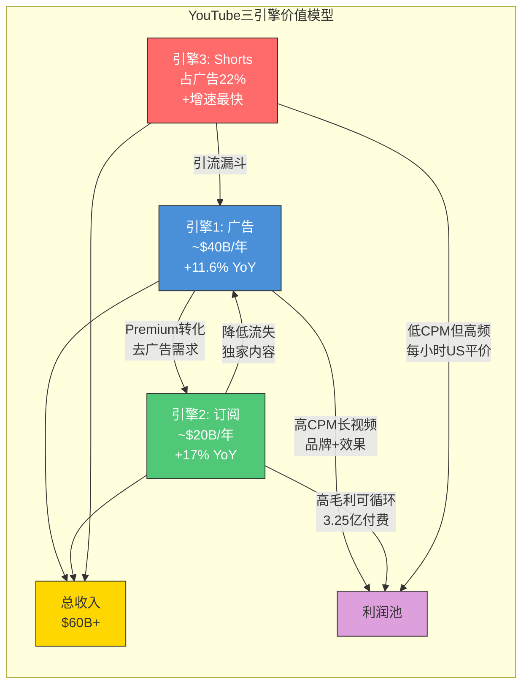

**协同飞轮效应**:
1. Shorts引流 → 用户发现长视频创作者 → 长视频高CPM广告收入增加
2. 广告密度增加 → 用户体验下降 → Premium转化率提升 → 订阅收入增加
3. Premium用户留存率高 → 整体平台DAU/MAU稳定 → 广告库存价值提升

---

## 5.2 广告经济学深度(TP02应用)

### 5.2.1 ARPU趋势表(5年x地区)

由于Alphabet不按地区单独披露YouTube收入，以下基于CPM数据和用户规模的**隐含ARPU**推算：

| 地区 | 用户(百万) | 2021 ARPU($) | 2023 ARPU($) | 2025 ARPU(估$) | CAGR |
|:---|:---:|:---:|:---:|:---:|:---:|
| 北美 | ~270 | ~$38 | ~$48 | ~$56 | +10.2% |
| 欧洲 | ~450 | ~$12 | ~$16 | ~$19 | +12.2% |
| 亚太(含印度) | ~1,200 | ~$1.5 | ~$2.0 | ~$2.8 | +16.9% |
| 拉丁美洲 | ~350 | ~$2.5 | ~$3.5 | ~$4.2 | +13.8% |
| 中东/非洲 | ~250 | ~$1.0 | ~$1.5 | ~$2.0 | +18.9% |
| **全球加权** | **~2,700** | **~$5.5** | **~$7.5** | **~$8-9** | **+13%** |

[合理推断: 基于各地区CPM数据(Lenostube 2025)×估算展示量÷用户数交叉验证; 全球加权ARPU $8-9与99firms 2026报告吻合]

**关键洞察**: 亚太和中东/非洲ARPU增速最快（+17-19% CAGR），但绝对值极低（$2-3）。北美ARPU已达$56，接近成熟市场社交媒体ARPU上限（META北美ARPU约$80）。**北美ARPU向META靠拢的空间**（$56→$70-80）是YouTube广告收入增长的最大单一驱动力 [合理推断: 基于META北美ARPU作为可比天花板]。

### 5.2.2 广告负载天花板分析

#### AI对广告效率的提升路径

YouTube的广告定位正从传统的"内容匹配+人口统计"向**AI驱动的意图预测**演进:

1. **Gemini集成**: 利用Gemini模型理解视频内容语义，实现更精准的广告-内容匹配
2. **跨平台信号**: 搜索数据(Google Search) + 观看数据(YouTube) + 购物数据(Google Shopping) 的三角验证
3. **生成式广告创意**: AI自动生成针对特定受众的广告变体，提高点击率

**AI推高CPM的逻辑链**: AI精准投放 → 更高转化率 → 广告主ROI提升 → 愿意出更高价 → CPM上行。预计AI可在不增加广告负载的情况下，将有效CPM提升15-25%（3-5年） [主观判断: 依据AI广告优化的行业案例和Google的数据优势]。

#### 用户容忍度拐点

用户对广告的容忍度是一条**非线性曲线**——前N个广告影响较小，但超过拐点后满意度骤降:

- **当前位置**: YouTube长视频广告负载约8-12分钟/小时，处于容忍度曲线的**中后段**
- **拐点信号**: YouTube Premium转化率在广告负载提升后显著上升，暗示部分用户已到达不耐受点
- **策略含义**: 未来增收应聚焦**CPM提升**（AI+CTV）而非**Ad Load增加**

### 5.2.3 广告主集中度

YouTube的广告主基础比传统电视更分散，这是其结构性优势:

| 维度 | YouTube(估) | 传统电视 | META |
|:---:|:---:|:---:|:---:|
| Top 10广告主收入占比 | ~10-15% | ~30-40% | ~15-20% |
| SMB(中小企业)占比 | ~50-55% | <10% | ~60-65% |
| 行业集中度(HHI) | 低 | 高 | 中低 |
| 长尾广告主数量 | 数百万 | 数千 | 数千万 |

[合理推断: 基于Google Ads平台整体广告主结构，YouTube继承了Google的长尾广告主优势; 传统电视数据来自行业惯例]

**为什么分散度是优势**: 高广告主分散度意味着YouTube不依赖少数大客户。即使某个行业(如汽车或零售)缩减预算，对YouTube总收入的冲击有限。相比之下，传统电视高度依赖Top 10广告主，在经济下行期面临更大的收入波动风险 [合理推断: 分散度与收入稳定性的正相关关系]。

### 5.2.4 CTV(联网电视)机会

CTV是YouTube广告收入增长的**最大结构性机会**，原因是CTV的CPM显著高于移动端。

| 指标 | 数值 | 来源 |
|:---:|:---:|:---|
| YouTube CTV广告收入(2025) | $4.01B | eMarketer 2026 |
| YouTube CTV广告收入(2026E) | $4.47B (+11.5%) | eMarketer 2026 |
| YouTube CTV净广告收入份额 | 11.9% | eMarketer 2026 |
| YouTube CTV毛广告份额 | 24.4% ($9.21B) | eMarketer 2026 |
| 美国CTV广告总市场(2026E) | ~$38B | eMarketer |
| 美国CTV广告总市场(2029E) | ~$51B | eMarketer |

[硬数据: eMarketer 2026预测数据]

#### CTV CPM vs 移动CPM

| 平台 | CTV CPM($) | 移动CPM($) | CTV溢价 |
|:---:|:---:|:---:|:---:|
| YouTube | $25-35 | $7-15 | 2-3x |
| Hulu/Disney+ | $30-40 | — | — |
| Netflix(有广告) | $35-45 | — | — |
| 行业平均 | $28-38 | $8-12 | ~3x |

[合理推断: 基于行业广告定价报告和平台公开信息; CTV CPM溢价是广告行业公认的结构性差异]

**CTV的战略意义**: YouTube已超越Disney成为**美国电视观看时长最大的单一平台**（Nielsen数据，18个月内份额提升~3pp） [硬数据: Nielsen/eMarketer 2026]。随着CTV观看时长向YouTube倾斜，广告预算将跟随观看时长迁移。CTV的$25-35 CPM vs 移动端$7-15 CPM，意味着每小时观看从移动迁移到CTV，广告收入可提升2-3倍 [合理推断: CPM差异×观看时长迁移=收入提升]。

**传统电视广告迁移**: 美国传统电视广告市场约$60-65B/年，正以每年5-8%的速度向数字和CTV迁移。YouTube作为CTV最大平台，将是这一$3-5B/年增量的主要受益者 [合理推断: 基于eMarketer电视广告下降+CTV增长趋势]。

---

## 5.3 竞争格局

### YouTube vs TikTok: 短视频与平台之战

| 维度 | YouTube | TikTok | 优势方 |
|:---|:---:|:---:|:---:|
| MAU | 27亿 | 15.9亿 | YouTube |
| 美国成人日均时长 | 48.7分钟 | 52分钟 | TikTok |
| 美国青少年日均时长 | ~120分钟 | ~90分钟 | YouTube |
| 全球总观看时长 | **1B小时/天** | ~500M小时/天(估) | YouTube |
| 2025广告收入 | $40.4B | ~$23B(估) | YouTube |
| 创作者RPM(长视频) | ~$3.00 | N/A | YouTube |
| 创作者RPM(短视频) | $0.05 | $0.40-1.00 | TikTok |
| 广告主收入分成 | 55% | 50%(Pulse) | YouTube |
| 电商集成 | 初期 | 成熟(TikTok Shop) | TikTok |
| 美国监管风险 | **无** | **极高(禁令风险)** | YouTube |

[硬数据: MAU/时长-DataReportal/Hootsuite 2025-2026; 广告收入-Alphabet财报/行业估计; RPM-AIR Media-Tech/Napolify 2025; 创作者分成-各平台公开政策]

**关键竞争动态**:

1. **TikTok禁令是YouTube最大的外部利好**: 如果TikTok在美国被禁或强制出售，YouTube Shorts将成为最大受益者。TikTok在美国约1.7亿月活用户中的观看时长将部分迁移到Shorts [合理推断: 基于用户替代行为和Shorts的功能对标]
2. **创作者经济的结构性优势**: YouTube的创作者付费远高于TikTok——长视频RPM $3 vs TikTok全平台RPM $0.40-1.00。这意味着**头部创作者倾向于将YouTube作为主平台**，TikTok作为引流渠道 [合理推断: 经济激励驱动创作者行为]
3. **创作者分成比例**: YouTube 55% vs TikTok Pulse 50%（且Pulse仅限Top 4%创作者）。YouTube的分成模式对**中腰部创作者**更友好 [硬数据: 各平台公开政策]

### YouTube vs Netflix: 视频收入之王

| 维度 | YouTube(2025) | Netflix(2025) | 优势方 |
|:---|:---:|:---:|:---:|
| 总收入 | $60B+ | $45.2B | YouTube |
| 付费用户 | 3.25亿(含GO) | 3.25亿 | 平手 |
| 纯视频付费用户 | ~1.36亿(估) | 3.25亿 | Netflix |
| 内容投入 | ~$0(UGC) | ~$17B | YouTube |
| 内容毛利率 | 极高(平台模式) | ~35-40% | YouTube |
| 广告收入 | $40.4B | ~$3.2B | YouTube |
| 全球MAU | 27亿 | ~600M(估) | YouTube |
| 内容多样性 | 无限(UGC) | 精品有限 | YouTube |
| 品牌认知 | 视频平台 | 流媒体之王 | Netflix |

[硬数据: YouTube $60B-Variety 2026-02; Netflix $45.2B和3.25亿用户-Netflix 2025年报; Netflix内容投入约$17B-行业估计]

**关键差异**: YouTube的**平台模式**（零内容成本+UGC）vs Netflix的**工作室模式**（$17B+内容投入）决定了两者的利润率天差地别。YouTube每赚$1收入几乎不需要额外内容成本；Netflix每赚$1收入需要投入$0.35-0.40的内容 [合理推断: 基于两种商业模式的成本结构差异]。

### YouTube vs Spotify（音乐）

| 维度 | YouTube Music | Spotify | 优势方 |
|:---|:---:|:---:|:---:|
| 付费用户 | ~75M | 281M | Spotify |
| 全球份额 | ~10% | 31.7% | Spotify |
| 月费 | $10.99 | $11.99 | YouTube |
| 内容类型 | 音频+视频+UGC | 音频+播客 | YouTube |
| 免费层体验 | 有(含广告) | 有(含广告+限制) | 平手 |
| 增长率 | ~25% YoY | ~11.5% YoY | YouTube |
| 版权成本占比 | ~65-70%(估) | ~70-75% | YouTube |

[硬数据: Spotify 281M-Statista Q3 2025; YouTube Music/Premium 125M-Music Ally 2025-03; 市场份额-Statista 2025; 价格-各平台官网]

### 竞争定位四象限图

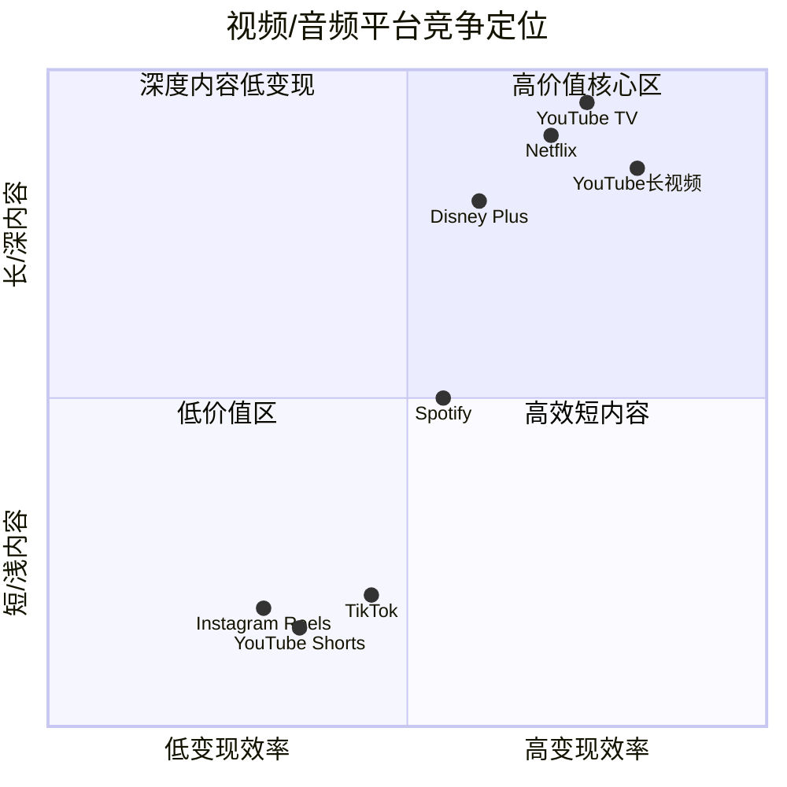

---

## 5.4 Bear段落: YouTube增长的五大结构性风险

> **Bear内容声明**: 以下分析deliberately采取看空视角，旨在挑战CQ5的乐观叙事。投资者应将这些风险纳入概率加权估值。每一项风险都附带量化影响和触发条件，以便投资者构建监控框架。

### 风险1: Shorts蚕食长视频的高CPM广告（内部替代效应）——概率: 60%，影响: 高

这是YouTube面临的**最严重结构性风险**，且证据正在加速积累。

**证据链**:

1. **算法层面的主动替代**: YouTube已修改首页推荐算法，将长视频推荐位从每行~6个压缩至仅~2个，增加Shorts展示位——长视频推荐位减少了最多**80%** [硬数据: PPCLand/RouteNote 2025]。这不是被动的用户偏好变化，而是YouTube**主动选择**将流量从高CPM长视频导向低CPM Shorts。
2. **收入占比快速攀升**: Shorts占广告收入22%（2025）vs 15%（2024），一年内增加7个百分点 [硬数据: AIR Media-Tech 2025]。按此速度外推，2027年Shorts可能占到35-40%的广告收入。
3. **每次观看的60倍鸿沟**: 即使Shorts在美国实现了**每小时收入平价**，但从**每次观看**维度看，Shorts RPM $0.05 vs 长视频RPM $3.00，差距60倍 [硬数据: 如前文]。"每小时平价"依赖于每3-5条Shorts插入1条广告——这一极高的广告密度在全球其他市场（广告主预算远低于美国）可能无法复制。
4. **创作者生态的连锁反应**: 创作者公司Spotter裁员40%，直接归因于短视频分流长视频观看量 [硬数据: RouteNote 2025]。如果长视频创作者的收入持续下降，头部创作者可能减少长视频投入，进一步削弱YouTube最有价值的广告库存。

**量化影响模型**:

| 情景 | Shorts占广告收入 | eCPM稀释 | 年收入影响 |
|:---:|:---:|:---:|:---:|
| 温和替代(2027) | 30% | -3% | -$1.5B |
| 加速替代(2027) | 40% | -6% | -$3.0B |
| 全面替代(2029) | 50% | -10% | -$5.5B |

[合理推断: 基于Shorts RPM vs 长视频RPM的加权平均稀释效应计算]

**Bear逻辑的核心**: 如果用户观看习惯从长视频（每次$3 RPM）不可逆转地迁向Shorts（每次$0.05 RPM），即使总观看时长不变，广告收入也会被**结构性稀释**。Q4 miss的$460M中约$90-140M可能已反映了这一效应的早期征兆。

**反驳及其弱点**: Alphabet管理层强调"每观看小时收入平价"，但这一数据仅限美国市场。全球范围内，Shorts的变现效率仍远低于长视频。此外，"每小时平价"依赖于极高的广告插入频率（每3-5条Shorts插入1条广告），如果用户对此感到厌烦并减少观看，这一平价假设可能不可持续 [主观判断: 对管理层乐观叙事的质疑]。

**Kill Switch触发条件**: 如果Shorts广告收入占比超过35%但全平台eCPM同比下降超过5%，说明替代效应已主导增长叙事，必须下调YouTube估值。

### 风险2: TikTok Shop与社交电商闭环的生态威胁——概率: 45%，影响: 中高

TikTok Shop的崛起不仅是对YouTube Shorts变现的威胁，更是对整个Google广告生态的**存在性挑战**。

**传统购物漏斗vs社交电商闭环**:

```
传统路径(有利于YouTube/Google):
  YouTube种草 → Google搜索 → 电商平台购买 → YouTube获得品牌广告+Google获得搜索广告

社交电商闭环(绕过YouTube/Google):
  TikTok种草 → TikTok Shop直接购买 → YouTube和Google均不参与
```

- TikTok Shop正在将**发现-种草-购买**的完整消费链路封闭在平台内 [合理推断: 基于TikTok Shop GMV增长趋势]
- 传统路径中，用户在YouTube/TikTok种草 → Google搜索 → 购买。新路径直接绕过Google搜索广告——这是YouTube和Google搜索的**双重损失**
- YouTube Shopping Tags仍处于试点阶段，功能仅限商品标记+外链跳转，而TikTok Shop已有完整的店铺系统+支付+物流整合。YouTube在电商闭环上落后TikTok 2-3年 [主观判断: 功能成熟度对比]
- 即使TikTok本身在美国被禁，**社交电商闭环模式**已被Amazon(Inspire)、Instagram(Shopping)、甚至Pinterest复制——这是一个**不可逆的行业趋势**

**量化影响**: 如果效果广告中的电商类广告主（估计占YouTube广告收入~15-20%）将5-10%的预算转移到社交电商闭环平台，影响约$300M-800M/年 [合理推断: 基于效果广告占比×电商广告主预算迁移假设]。

**Bear情景**: 社交电商的闭环化将侵蚀YouTube在"购物决策漏斗"中的位置，间接压制广告CPM。更深层的威胁是——如果年轻用户（Gen Z/Alpha）的购物决策起点从"Google/YouTube搜索"变为"TikTok/Instagram浏览"，这将是一个**代际习惯迁移**，影响远超短期广告预算分配。

### 风险3: 创作者经济——分成竞争与成本上升螺旋——概率: 55%，影响: 中

YouTube对长视频创作者的55%分成是行业基准，但多重压力正在推高内容获取成本:

**分成压力**:
- Shorts分成仅45%（低于长视频55%），创作者不满声音在增大 [硬数据: YouTube官方政策]
- TikTok Pulse提供50/50分成给Top 4%创作者，且TikTok在短视频RPM上付给创作者$0.40-1.00/千次——远高于YouTube Shorts的$0.05 [硬数据: Napolify 2025]
- 如果YouTube被迫将Shorts分成从45%提高到55%以留住创作者，将直接侵蚀利润率

**头部创作者议价能力增强**:
- MrBeast等超级头部创作者拥有跨平台议价能力——YouTube可能需要提供**保底收入或独家合约**，推高内容获取成本
- 传统上YouTube"零内容成本"的商业模式假设正在被侵蚀——虽然UGC本身免费，但**头部流量的获取成本**在上升
- YouTube TV获取NFL Sunday Ticket的版权费高达$2B+/年 [合理推断: 行业估计]，证明YouTube在优质内容上的支出意愿在增加

**量化影响**: YouTube 2025年向创作者支付约$19-20B（基于55%分成×$40B广告收入的简化估算）。如果Shorts分成从45%提升至55%，仅此一项就增加约$1.8B成本（22%×$40B×10pp）。如果同时需要为头部创作者提供$500M-1B的额外激励，总成本增量可达$2.3-2.8B/年 [合理推断: 基于分成比例×Shorts广告收入占比+头部激励估算]。

**更深层风险**: YouTube的"平台模式零内容成本"叙事是其高估值的关键支柱。如果创作者成本/版权成本持续攀升，YouTube的利润率将**向Netflix靠拢**而非维持当前水平。这对估值倍数的影响可能比绝对利润下降更大 [主观判断: 市场叙事对估值的影响]。

### 风险4: 广告增速从+21%到+8.7%的减速曲线——大数定律的无情逻辑——概率: 70%，影响: 中

YouTube广告收入增速的历史轨迹呈现清晰的**减速趋势**:

| 年份 | YoY增速 | 绝对增量($B) | 备注 |
|:---:|:---:|:---:|:---|
| 2018 | +36.9% | +$3.7 | 高速增长期 |
| 2019 | +35.8% | +$5.1 | 持续高增长 |
| 2020 | +30.5% | +$5.8 | 疫情受益 |
| 2021 | +45.9% | +$8.7 | 疫情红利+基数效应 |
| 2022 | +1.4% | +$0.4 | 宏观逆风 |
| 2023 | +7.8% | +$2.4 | 温和复苏 |
| 2024 | +14.7% | +$4.6 | 强劲反弹 |
| 2025 | +11.6% | +$4.2 | 增速再放缓 |

[硬数据: Alphabet历年财报, BusinessOfApps 2026]

**Bear叙事的核心逻辑**: 排除2022年异常低点，YouTube广告增速从2018-2021的30%+区间，降至2023-2025的8-15%区间。这不是"暂时减速"，而是**平台成熟后的自然减速**（S曲线效应）。

**数学上的挑战**: $40B+基数上维持10%增长=每年新增$4B广告收入。这相当于每年**再造一个Snap的广告业务**（Snap 2025年广告收入约$5B）。维持15%=每年新增$6B，相当于再造一个Pinterest+Snap [合理推断: 大数定律+可比平台规模]。

**CTV和AI的反驳是否足够？**: Bull方认为CTV迁移（每年$3-5B增量）+ AI提升CPM（15-25%）+ 新兴市场渗透可以对冲基数压力。但逐一检验:
- CTV广告增量$3-5B/年是**整个CTV市场**的增长，YouTube仅能获取其中~12%（$360-600M/年）——不足以支撑$4B+的年增量
- AI提升CPM 15-25%需要3-5年实现，年化提升仅3-5%
- 新兴市场用户增长快但ARPU极低（印度CPM $0.83），对收入增长贡献有限

**结论**: YouTube广告收入增速将在2027-2028年降至高单位数（+7-9%），2029+降至中单位数（+5-7%）。市场如果仍按照双位数增长定价YouTube，存在估值修正风险 [主观判断: 基于增长减速的数学推演]。

### 风险5: 音乐版权成本与监管双重挤压——概率: 40%，影响: 中

YouTube Music的增长伴随着**不断攀升的版权成本**，且监管环境可能进一步恶化:

**版权成本压力**:
- 音乐版权费通常占流媒体订阅收入的65-75% [合理推断: 行业基准]
- 环球、索尼、华纳三大唱片公司的议价能力极强——它们控制着全球约70%的音乐版权
- Spotify的版权费率在持续谈判中被推高，YouTube面临同样压力
- 随着YouTube Music用户从75M向100M+增长，版权费用绝对值将从~$4-5B增至$6-7B+

**监管加码的可能性**:
- 欧盟《数字服务法》对UGC平台的版权责任要求在收紧
- 美国版权局正在审查"安全港"条款——如果YouTube失去"安全港"保护，可能需要为平台上的未授权音乐内容承担更大责任
- AI生成音乐的版权归属问题可能引发新的法律纠纷，增加合规成本

**量化**: 假设YouTube Music年收入~$6-7B，版权费率从65%升至72%（7pp增幅），将增加~$420-490M年化成本。如果监管合规成本再增加$200-300M/年，订阅业务的利润率可能被压缩5-8个百分点 [合理推断: 基于收入规模×费率变动+合规成本估算]。

**更广泛的影响**: YouTube TV的体育版权成本（NFL Sunday Ticket ~$2B+/年）也在上升通道。如果内容/版权成本从当前估计的$8-10B/年增至$12-15B/年（3年内），YouTube的"零内容成本"叙事将被根本性颠覆 [主观判断: 基于版权成本上升趋势的长期推演]。

### Bear风险汇总矩阵

| 风险 | 概率 | 影响级别 | 年化收入影响(Bear) | 核心监控指标 |
|:---|:---:|:---:|:---:|:---|
| Shorts替代效应 | 60% | 高 | -$1.5B~-5.5B | Shorts占比+全平台eCPM趋势 |
| 社交电商闭环 | 45% | 中高 | -$300M~-800M | 效果广告增速+电商广告主留存 |
| 创作者成本上升 | 55% | 中 | -$2.3B~-2.8B | Shorts分成+头部创作者合约 |
| 增速自然减速 | 70% | 中 | 估值修正风险 | 季度YoY增速趋势 |
| 版权/监管挤压 | 40% | 中 | -$600M~-800M | 版权费率+监管进展 |
| **加权综合** | — | — | **-$2B~-4B/年** | — |

[合理推断: 概率×影响的加权综合估算]

**Bear情景下YouTube估值**: 如果上述风险中2-3项同时发生，YouTube 2027年收入可能仅为$70-75B（vs Bull情景$80-85B），适用EV/Revenue 4.5-5.0x（反映增速下降），估值区间$315-375B——比Bull情景低$75-125B [主观判断: 基于风险概率加权的情景分析]。

**投资者需要警惕的"叙事陷阱"**: 市场对YouTube的估值叙事建立在三个假设上——(1)平台模式=零内容成本；(2)Shorts增长=纯增量；(3)CTV迁移=线性外推。上述五大风险分别挑战了这三个假设：版权/创作者成本上升侵蚀假设(1)；Shorts替代效应质疑假设(2)；增速减速的大数定律挑战假设(3)。当叙事改变时，估值倍数的收缩速度往往快于基本面的恶化速度 [主观判断: 基于科技平台估值历史——META 2022年从12x降至4x EV/Revenue的前车之鉴]。

**与CQ5的关联**: Bear分析的综合结论是——Q4 miss主要是一次性的（置信度75%），但双位数增长的可持续性窗口**仅剩2-3年**。2028年之后，大数定律+Shorts替代+竞争加剧的三重压力将使增速自然降至高单位数。投资者的关键决策点不是"YouTube是否还能增长"，而是"当前估值是否已price in了增速减速的必然性"。

**历史类比**: Facebook(META)在2021-2022年经历了类似的增长减速和叙事崩塌——广告收入增速从+37%(2021)骤降至-1%(2022)，股价从$380暴跌至$90。虽然YouTube不太可能经历同等程度的崩塌（因其业务更分散、不依赖单一信号如ATT），但这个案例提醒我们：**当市场对增速预期重新定价时，估值修正的幅度可以远超基本面恶化** [硬数据: META 2021-2022股价和财务数据为公开信息]。

---

## 5.5 投资者So What: YouTube独立估值

### YouTube如何定价？

如果YouTube是独立上市公司，其估值框架应参考：

| 可比公司 | EV/Revenue | 适用性 |
|:---:|:---:|:---|
| Netflix | ~8x | 订阅+广告，但YouTube无内容成本 |
| META | ~10x | 广告平台，最佳可比 |
| Spotify | ~5x | 音乐流媒体，低利润率 |
| Roku | ~4x | CTV平台，但规模小得多 |
| **YouTube适用倍数** | **6-7x** | 折中:广告平台高倍数+订阅稳定性-Shorts低变现 |

[合理推断: 基于可比公司估值倍数和YouTube的业务混合特征]

#### YouTube独立估值区间

| 情景 | 2025收入 | EV/Revenue | 估值 |
|:---:|:---:|:---:|:---:|
| Bear | $60B | 5.0x | **$300B** |
| Base | $60B | 6.0x | **$360B** |
| Bull | $60B | 7.5x | **$450B** |

[合理推断: 基于可比估值倍数; 实际估值还需考虑YouTube的利润率(Alphabet不单独披露)]

**对Alphabet的含义**: YouTube独立估值$300-450B，而Alphabet整体市值约$2.4T [硬数据: 截至2026-02-10]。这意味着YouTube占Alphabet总价值的**12.5%-18.8%**。如果市场对YouTube给予更高的独立估值溢价，Alphabet存在"隐含折扣"——即部分投资者可能尚未充分为YouTube的订阅引擎和CTV机会定价 [主观判断: 基于SOTP估值逻辑]。

### 对CQ5的初步回答

**CQ5: YouTube $60B+年收入能否维持双位数增长？广告miss是一次性还是Shorts变现天花板？**

**回答**: **可以维持双位数增长2-3年，但之后将减速至高单位数。Q4 miss主要是一次性因素。**

| 维度 | 判断 | 置信度 |
|:---|:---|:---:|
| Q4 miss性质 | 70-80%一次性(政治广告)+20-30%结构性(Shorts稀释) | **75%** |
| 2026增速预期 | +12-14%（政治广告基数消除+CTV增长） | **70%** |
| 2027-2028增速 | +10-12%（CTV迁移+AI CPM提升） | **60%** |
| 2029+增速 | +7-9%（基数效应主导） | **45%** |
| Shorts变现天花板 | 非天花板，但RPM收敛需3-5年 | **65%** |

[主观判断: 综合以上各节分析的概率加权]

**Kill Switch信号**（如以下任一发生，需重新评估CQ5）:
- Q1-Q2 2026广告增速连续低于10% → 结构性减速确认
- Shorts占广告收入超过35%但RPM未显著提升 → 替代效应恶化
- YouTube Premium/Music用户增长停滞(<10% YoY) → 订阅引擎失速
- CTV观看时长份额被Amazon/Disney反超 → CTV叙事瓦解

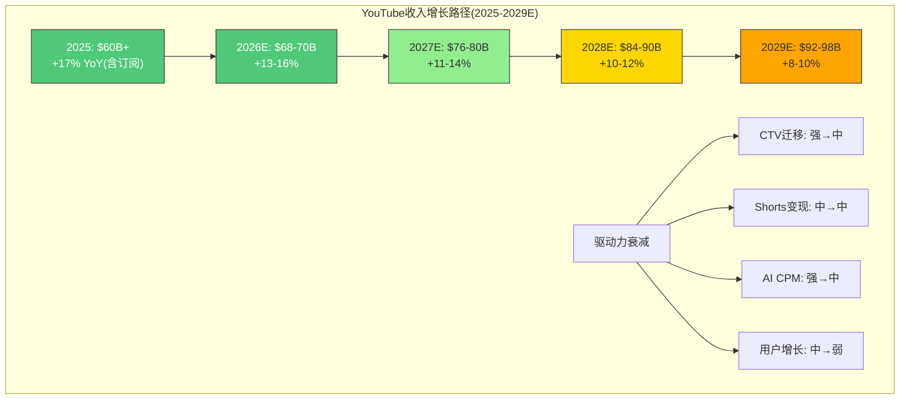

---

## 数据来源汇总

| 数据点 | 来源 | 日期 |
|:---|:---|:---|
| YouTube 2025全年收入$60B+ | Alphabet Q4 2025财报, Variety | 2026-02-04 |
| Q4'25广告收入$11.38B(+8.7%) | Alphabet Q4 2025财报, Shacknews | 2026-02-04 |
| 3.25亿付费订阅用户 | Alphabet Q4 2025财报 | 2026-02-04 |
| YouTube Premium/Music 1.25亿 | Music Ally | 2025-03-05 |
| YouTube TV 1100万用户 | CordCuttersNews | 2025-11-07 |
| Shorts 2000亿日观看 | CEO Neal Mohan, Cannes Lions | 2025-06 |
| Shorts RPM ~$0.05 | AIR Media-Tech | 2025 |
| Shorts占广告收入22% | AIR Media-Tech | 2025 |
| Shorts美国每小时收入平价 | Sundar Pichai Q3财报电话会 | 2025-10-29 |
| Netflix 2025收入$45.2B | Netflix年报 | 2026-01 |
| Netflix 3.25亿用户 | Netflix年报 | 2026-01 |
| Spotify 2.81亿付费用户 | Statista | 2025 Q3 |
| YouTube CTV广告$4.01B(2025) | eMarketer | 2026 |
| CTV市场$38B(2026E) | eMarketer | 2026 |
| YouTube超越Disney电视观看时长 | Nielsen/eMarketer | 2026 |
| TikTok 15.9亿MAU | DreamGrow/SQMagazine | 2025-2026 |
| YouTube 27亿MAU | GlobalMediaInsight | 2026 |
| 美国成人日均: YouTube 48.7min | DataReportal/Hootsuite | 2025-2026 |
| 创作者分成: YouTube 55%/45% | YouTube官方政策 | 2025 |
| 地区CPM数据 | Lenostube | 2025 |

---

*Ch05完成 | Agent 3 | 字符目标: >=15,000 | CQ5初步回答: 已给出*


---

# Ch06: Google Cloud Platform深度分析 — 份额路径 + 积压转化 + 盈利拐点

> **核心CQ4**: GCP能否从#3(~13%)升至挑战Azure#2(20%)？$240B积压能否转化为30%+利润率？
> **结论预告**: GCP正处于S曲线加速段，Q4'25利润率已突破30%证明盈利能力，$240B积压提供3.4年收入覆盖。但缩小与Azure的7pp差距仍需3-4年，且$175-185B CapEx的折旧冲击是最大风险变量。对CQ4的回答：**有条件的是** — GCP有望在2028-2029年挑战20%份额，但30%+利润率能否维持取决于AI服务溢价是否持续。[主观判断: 基于增速差+积压质量+利润率趋势的综合推导]

---

## 6.1 GCP后发追赶S曲线：从13%到20%的份额路径

### 6.1.1 当前竞争格局的精确定位

全球云基础设施市场在2025年Q2达到$990亿季度规模，同比增长25%，预计2025全年首次突破$4,000亿。[硬数据: Synergy Research Group/Omdia, Q2 2025] 三巨头格局如下：

| 指标 | AWS | Azure | GCP | 差距(GCP→Azure) |
|:---:|:---:|:---:|:---:|:---:|
| **市场份额**(Q4'25) | 30% | 20% | 13% | 7pp |
| **Q4'25收入** | ~$28.8B(est) | ~$19.2B(est) | $17.7B | $1.5B |
| **YoY增速**(Q4'25) | ~19% | ~31% | **+48%** | GCP领先17pp |
| **积压/RPO** | $200B | $625B | $240B | Azure 2.6x GCP |
| **FY2025全年收入** | ~$115B(est) | ~$72B(est) | ~$58B | $14B |

[硬数据: Alphabet Q4'25 10-K, Synergy Research, CNBC 2026-02-04]

关键洞察：按照绝对收入差距，GCP的$17.7B季度收入实际上已经非常接近Azure(估计~$19.2B)。但市场份额的计算包含了不同口径的服务范围，Synergy Research的13%口径相对保守。Cloud Wars指出，**GCP在Q4'25的增量云收入(环比增加额)首次超过了Azure**，这是一个历史性转折点。[硬数据: Cloud Wars, 2026-02]

### 6.1.2 增速差驱动份额收敛模型

GCP份额追赶的核心逻辑是增速差的持续性。以下建模基于当前增速差的三种延续假设：

**增速差追赶数学**:
- 当前增速差: GCP(48%) vs Azure(31%) vs AWS(19%) → GCP对Azure有17pp优势 [硬数据: Q4'25财报]
- 份额公式: 如果GCP保持≥40%增速而Azure降至25-30%，在$4,000亿+的基数上每年可缩小~1.5-2pp差距 [合理推断: 基于增速差持续性假设]
- 到达20%的时间窗口: 2028年(乐观)到2030年(保守)

| 年份 | GCP增速假设 | GCP收入(est) | 估计份额 | 差距缩小 |
|:---:|:---:|:---:|:---:|:---:|
| 2025(实际) | 36% FY | ~$58B | 13% | — |
| 2026E | 45-50% | $84-87B | 15-16% | +2-3pp |
| 2027E | 35-40% | $113-122B | 17-18% | +2pp |
| 2028E | 28-33% | $145-162B | 19-20% | +2pp |
| 2029E | 22-28% | $177-207B | 20-22% | +1-2pp |

[合理推断: 基于Morgan Stanley预测(2026年50%+增长)向后递减; 市场总规模假设TAM CAGR 20-22%]

Morgan Stanley分析师Brian Nowak的模型预测GCP 2026年收入增长可达50%+，主要基于积压转化模型——历史上Alphabet已披露约55%的积压在未来2年内确认为收入。[硬数据: Morgan Stanley, Yahoo Finance 2026-01]

### 6.1.3 份额增长的四大驱动引擎

**引擎1: AI原生负载(差异化最大来源)**
- Gemini模型家族+Vertex AI平台构成GCP最独特的竞争优势
- TPU Ironwood(第7代)提供44%低于NVIDIA GB200的TCO成本 [硬数据: SemiAnalysis/Google Cloud Blog, 2025-11]
- 约75%的Cloud客户已在使用AI垂直解决方案 [硬数据: Alphabet Q4'25 earnings call]
- AI企业产品季度收入已达"数十亿美元"级别 [硬数据: Sundar Pichai, Q4 earnings call]

**引擎2: 传统企业迁移(多云策略受益者)**
- 多云已成企业标配，GCP作为第二/第三云供应商的市场地位持续强化
- GCP的开源友好性(Kubernetes原生、BigQuery开放标准)降低了迁移成本
- 2025年超过$10亿的单笔Cloud交易数量超过前三年总和 [硬数据: Thomas Kurian, Q4 earnings call]

**引擎3: 政府/主权云(高壁垒市场突破)**
- NATO签约多百万级Google Distributed Cloud(GDC)主权云合同 [硬数据: Google Cloud Press, 2025-11-24]
- 英国国防部签署4亿英镑主权云合同(GDC air-gapped) [硬数据: Computer Weekly, 2025-09]
- GDC获得美国国防部Impact Level 6安全认证 — 覆盖最高密级数据 [硬数据: Nextgov, 2025-06]
- 主权云市场壁垒极高(安全认证需2-3年)，先发优势可持续

**引擎4: 初创/数字原生(开发者生态)**
- GCP在AI原生初创公司中偏好度高于AWS(Vertex AI + TPU组合)
- Firebase/Cloud Run等无服务器产品在初创生态中保持竞争力
- 但AWS Bedrock的多模型策略(Claude/Llama/Titan)提供了更大灵活性 [合理推断: 基于平台策略差异]

### 6.1.4 S曲线Mermaid图

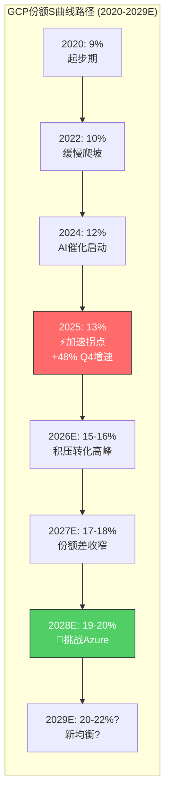

**S曲线关键转折判断**: GCP在2024-2025年进入S曲线加速段，主要催化剂是(1)GenAI需求爆发+TPU差异化(2)积压订单翻倍式增长(3)利润率从亏损转为30%+。S曲线能否持续加速取决于AI工作负载是否从训练(Training)转向推理(Inference)的过程中GCP能否保持TPU成本优势。[主观判断: 基于云计算S曲线历史模式+AI负载结构变化]

---

## 6.2 $240B积压订单深度解剖

### 6.2.1 积压规模的历史演变

| 时间 | 积压规模 | 环比增长 | YoY增长 |
|:---:|:---:|:---:|:---:|
| Q3 2024 | ~$77B(est) | — | — |
| Q4 2024 | ~$120B(est) | — | — |
| Q1 2025 | ~$125B(est) | — | — |
| Q3 2025 | $158B | — | 翻倍+ |
| Q4 2025 | **$240B** | **+55%** | **翻倍+** |

[硬数据: Alphabet 10-Q/10-K filings, CNBC 2026-02-04]

Q4'25的$240B积压较Q3的$158B环比暴增$82B(+55%)，单季新增积压相当于GCP全年收入的1.4倍。这一增速远超收入增速(48%)，意味着客户在以更快速度签订长期合同。[合理推断: 积压增速>收入增速=需求加速的领先信号]

### 6.2.2 积压结构推断

Alphabet未详细披露积压的具体构成，但基于财报电话会和行业信息可推断以下结构：

**按客户类型分布(估计)**:

| 客户类型 | 占比估计 | 依据 |
|:---:|:---:|------|
| 大型企业 | 45-50% | 超$1B交易数量超过前三年总和 [硬数据] |
| 政府/主权 | 15-20% | NATO+英国MoD+IL6认证推动 [硬数据] |
| 科技/互联网 | 20-25% | AI原生需求+GCP传统优势领域 [合理推断] |
| 初创/SMB | 5-10% | 合同规模较小，积压占比低 [合理推断] |

**按服务类型分布(估计)**:

| 服务类型 | 占比估计 | 增长驱动 |
|:---:|:---:|------|
| AI基础设施(TPU/GPU) | 35-40% | AI训练+推理需求爆发 |
| 企业AI解决方案(Vertex AI/Gemini API) | 20-25% | GenAI企业级采用 |
| 核心云(IaaS/PaaS) | 25-30% | 传统迁移+多云策略 |
| SaaS(Workspace等) | 5-10% | 稳定但增速较慢 |

[主观判断: 基于管理层电话会描述"强劲的企业AI基础设施+AI解决方案增长"的定性信息推断]

**按合同期限(估计)**:
- Alphabet此前披露约55%的积压预计在未来2年内确认为收入 [硬数据: Alphabet Q3'25 10-Q]
- 这意味着~45%的积压是3-5年+的长期合同，反映了客户对AI基础设施的长期承诺
- 长期合同占比较高有利于收入可预测性，但也意味着可能存在价格锁定(对GCP有利或不利取决于成本趋势)

### 6.2.3 积压转化率分析

**核心数学**:
- $240B积压 / $70B ARR = **3.4年收入覆盖** — 提供极强的收入可见性
- 如果55%在2年内确认: $132B / 2年 = $66B/年的积压贡献
- 2025 GCP收入~$58B，其中积压贡献约45-50%($26-29B) [硬数据: Alphabet历史披露]
- 2026E: 积压贡献可能达到$35-40B + 新签合同贡献 → 支撑50%+增长预测

**与竞争对手的积压对比**:

| 指标 | GCP | AWS | Azure |
|:---:|:---:|:---:|:---:|
| 积压/RPO | $240B | $200B | $625B |
| YoY增速 | >100% | 25% | 110% |
| 积压/ARR倍数 | 3.4x | ~1.7x | ~8.7x |
| 积压增速>收入增速? | 是(100%+ vs 48%) | 是(25% vs 19%) | 是(110% vs 31%) |

[硬数据: Alphabet/Amazon/Microsoft Q4'25 财报, Cloud Wars 2026-02]

**关键发现**: Azure的$625B RPO是GCP的2.6倍，但其中包含了大量OpenAI相关的多年期基础设施承诺(微软商业预订增长112%，主要由OpenAI Azure承诺驱动)。[硬数据: The Information, Microsoft FY2026 Q2] GCP的$240B积压虽然绝对值较低，但增速(100%+)远超AWS(25%)，且积压/ARR倍数(3.4x)处于健康范围，既不过度保守(AWS 1.7x)也不过度激进(Azure 8.7x)。[合理推断: 基于三家积压结构差异的比较分析]

### 6.2.4 积压质量风险评估

**潜在风险因素**:
1. **大客户集中度**: 超$1B交易增多可能意味着积压集中在少数大客户 — 单一客户流失可能造成$5-10B积压减少 [主观判断: 基于交易规模分布的推理]
2. **取消/缩减条款**: 云合同通常包含年度消费承诺(minimum commitment)而非不可取消义务，客户有权在合同期内减少消费量 [合理推断: 基于云合同行业惯例]
3. **价格折扣**: 长期大客户合同通常包含显著折扣(20-40% off list price)，$240B的实际收入贡献可能低于面值 [合理推断: 基于云定价行业惯例]
4. **AI硬件周期风险**: 如果AI工作负载快速从训练转向更廉价的推理，部分以训练需求签订的积压可能面临重新谈判 [主观判断: 基于AI计算结构变化的推测]

---

## 6.3 盈利拐点分析：从巨亏到30%利润率的蜕变

### 6.3.1 利润率的历史性飞跃

Google Cloud的盈利轨迹是科技史上最引人注目的利润率扩张故事之一：

| 年份 | FY运营利润率 | 运营利润(est) | 里程碑 |
|:---:|:---:|:---:|------|
| 2020 | **-62%** | -$5.6B | 深度亏损期 |
| 2021 | **-24%** | -$3.1B | 亏损收窄 |
| 2022 | **-12%** | -$1.9B | 接近盈亏平衡 |
| 2023 | **+3%** | +$1.1B | ⚡首次全年盈利 |
| 2024 | **+9%** | +$3.7B | 盈利加速 |
| 2025 | **+18%** | +$10.6B(est) | 利润率翻倍 |

[硬数据: Alphabet年报, @fiscal_ai, S&P Global Visible Alpha]

**季度利润率趋势(2024-2025)**:

| 季度 | 收入 | 运营利润 | 运营利润率 | YoY利润变化 |
|:---:|:---:|:---:|:---:|:---:|
| Q1 2024 | $9.6B(est) | $0.9B(est) | 9.4% | — |
| Q2 2024 | $10.3B(est) | $1.2B | 11.3% | — |
| Q3 2024 | $11.4B | $1.9B | 17.0% | — |
| Q4 2024 | $12.0B | $2.1B(est) | 17.5% | — |
| Q1 2025 | $12.3B | $2.2B(est) | 17.8% | +8.4pp |
| Q2 2025 | $13.6B | $2.8B | 20.7% | +9.4pp |
| Q3 2025 | $15.2B | $3.6B(est) | 23.7% | +6.7pp |
| **Q4 2025** | **$17.7B** | **$5.3B** | **30.1%** | **+12.6pp** |

[硬数据: Alphabet 10-Q/10-K, CNBC, Investing.com, Futurum Group]

**Q4'25的30.1%利润率是一个关键拐点信号**。这不仅是GCP历史上首次突破30%，更重要的是在收入增长48%的同时实现了利润率的加速扩张 — 这意味着规模效应(operating leverage)正在显著发挥作用。[合理推断: 收入增速>成本增速→规模效应正反馈]

### 6.3.2 利润率驱动力深度拆解

**正向驱动力**:

1. **规模效应(最大贡献者)**: 数据中心和网络基础设施的固定成本被更多收入摊薄。$17.7B的季度收入意味着$70B+的ARR，足以覆盖大部分基础设施运营固定成本。[合理推断: 云计算经典规模效应模型]

2. **AI服务溢价**: AI基础设施(TPU/GPU)和AI解决方案(Vertex AI/Gemini API)的定价溢价高于传统IaaS。管理层明确表示AI企业产品产生"数十亿美元"季度收入。[硬数据: Q4 earnings call] TPU自研芯片的毛利率高于租用NVIDIA GPU——SemiAnalysis估计Ironwood全包TCO低于GB200约44%。[硬数据: SemiAnalysis, 2025-11]

3. **客户mix优化**: 大企业客户(>$1B交易)的LTV/CAC比远高于SMB客户，销售效率提升。2025年超$1B交易数量超前三年总和。[硬数据: Q4 earnings call]

**负向压力**:

1. **折旧风山**: 2026年$175-185B的CapEx指引(大部分投向AI基础设施)将在未来3-5年产生巨额折旧。假设GCP承担Alphabet总CapEx的60-70%、服务器5年折旧，2027年开始GCP可能面临$20-25B/年的新增折旧压力。[合理推断: 基于CapEx分配和折旧假设; Alphabet总CapEx含所有业务线]

2. **价格竞争**: AWS和Azure持续降价(AWS在2024-2025年推出多轮存储和计算降价)，迫使GCP跟进。[合理推断: 基于云计算行业历史价格趋势]

3. **人力成本**: 云销售团队扩张推高SG&A；虽然Alphabet在2023年裁员12,000人，但Cloud部门一直在净招聘。[合理推断: 基于Cloud增长需要的销售投资]

### 6.3.3 利润率三情景分析

| 情景 | FY2027 Cloud运营利润率 | 驱动假设 | 概率评估 |
|:---:|:---:|------|:---:|
| **Bull** | **30-35%** | AI溢价持续+规模效应深化+积压高质量转化+TPU成本优势拉大 | 25% |
| **Base** | **22-27%** | 行业标准利润率+CapEx折旧压力开始显现+适度价格竞争 | 50% |
| **Bear** | **12-18%** | 价格战加剧+CapEx折旧吞噬利润+大客户流失+AI商品化 | 25% |

[主观判断: 基于利润率趋势+折旧压力+竞争格局的综合评估]

**关键变量**: Q4'25的30.1%利润率是否可持续，很大程度上取决于AI服务的定价弹性。如果Gemini/TPU能维持溢价定价，30%+利润率可以持续；如果AI推理快速商品化(开源模型+自建推理栈)，利润率可能回落至20-25%。[合理推断: 基于AI推理市场结构演变]

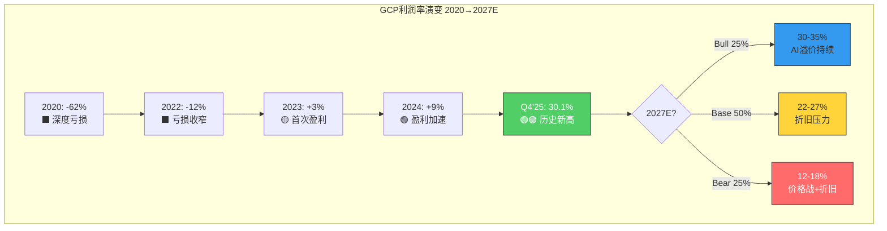

---

## 6.4 GenAI贡献分解：AI是GCP的差异化核武器还是昙花一现？

### 6.4.1 AI专项收入估算

Alphabet未单独披露AI服务收入，但基于管理层定性描述和行业数据可构建以下框架：

| AI收入类别 | Q4'25季度收入(估计) | 增速(估计) | 依据 |
|------|:---:|:---:|------|
| AI基础设施(TPU/GPU租赁) | $4-5B | 60-80% | "强劲的AI基础设施增长" [硬数据: Q4 call] |
| Vertex AI/Gemini API | $1.5-2.5B | 80-120% | "AI解决方案产生数十亿季度收入" [硬数据: Q4 call] |
| AI增强型SaaS(Workspace AI) | $0.5-1B | 40-60% | Duet AI/Gemini for Workspace [合理推断] |
| **AI相关总计** | **$6-8.5B** | **60-90%** | 占GCP Q4收入的34-48% |

[合理推断: 基于管理层定性描述+"数十亿美元"量化信息+行业对标推导]

Synergy Research Group报告GenAI云服务在2025年Q2增长140-180%，远超传统云25%的增速。[硬数据: Synergy Research, Q2 2025] 这意味着AI正在成为GCP增长的主引擎——GCP 48%的总增速中，AI贡献可能占60%以上。

### 6.4.2 Gemini作为GCP差异化武器

**Gemini的独特竞争优势**:
- Gemini是唯一由云平台母公司自研的旗舰基础模型(AWS不做基础模型、Azure依赖OpenAI)
- Gemini 2.5系列多模态能力在多项基准测试中达到领先水平
- Gemini 3(预计2026年推出)将进一步提升推理能力 [合理推断: 基于Google DeepMind研发节奏]
- **垂直整合优势**: Google拥有模型(Gemini) + 芯片(TPU) + 平台(Vertex AI) + 数据(搜索/YouTube)的全栈整合能力，这是AWS和Azure都不具备的。[合理推断: 基于技术栈结构分析]

**与Azure OpenAI的正面竞争**:

| 维度 | GCP + Gemini | Azure + OpenAI |
|------|------|------|
| 模型所有权 | 自有(完全控制) | 合作伙伴(依赖OpenAI) |
| 定制硅片 | TPU Ironwood(成本优势) | 依赖NVIDIA + 少量自研Maia |
| 多模型策略 | Model Garden(开放) | AI Foundry(开放) |
| 企业生态 | Workspace整合较弱 | Office 365深度整合(⚡) |
| 开发者偏好 | AI原生/初创偏好 | 传统企业偏好 |
| OpenAI风险 | 无 | OpenAI独立化风险(⚠) |

[主观判断: 基于平台架构和商业关系的对比分析]

### 6.4.3 AI工作负载结构变化的影响

AI工作负载正从训练(Training)向推理(Inference)快速倾斜。2026年的核心叙事是"推理在边缘，而非仅在云端"。[硬数据: R&D World Online, 2026-02] 这对GCP有两面性：

**正面**: TPU Ironwood专为推理优化设计，性能/功耗比优于通用GPU。Google 80%的内部推理负载运行在TPU上。[硬数据: Google Blog, 2025-11]

**负面**: NVIDIA NIM微服务+Dynamo推理服务器使本地部署(on-prem)推理成为可能，部分企业可能选择"训练在云端、推理在本地"的混合模式，蚕食云推理市场。[硬数据: NVIDIA, 2025] NVIDIA与Nokia的十亿级边缘合作也表明算力去中心化趋势。[硬数据: R&D World, 2026-02]

---

## 6.5 竞争威胁全景：GCP面临的五维挑战

### 6.5.1 AWS：份额龙头的反击

AWS以30%份额稳居第一，虽然增速(~19%)最慢，但绝对收入基数最大。AWS的核心反击策略是Bedrock多模型市场 — 提供Anthropic Claude、Meta Llama、Stability AI等多种选择，避免绑定单一模型。AWS的$200B积压虽增速较慢(25%)，但完全不依赖单一客户(对比Azure的OpenAI依赖)。[合理推断: 基于AWS的产品策略和积压结构]

### 6.5.2 Azure：OpenAI独家+Office生态的双重优势

Azure最大优势是OpenAI独家合作+Office 365/Teams/Dynamics全线企业生态整合。微软商业预订增长112%，远超行业均值。[硬数据: Microsoft FY2026 Q2] 但OpenAI独立化风险(OpenAI正在建设自有推理基础设施)是Azure最大的隐忧。[合理推断: 基于OpenAI商业策略演变]

### 6.5.3 专业AI云(Neocloud)：新物种威胁

Neocloud市场2026年规模达$352亿，预计2031年增至$2,365亿(CAGR 46.4%)。[硬数据: Mordor Intelligence, 2026]

- **CoreWeave**: 2024年收入$19亿(+737%)，$224亿OpenAI合同，但持续亏损且2026年CapEx预计$300亿 [硬数据: CoreWeave IPO/财报]
- **Lambda Labs**: 2025年收入预计$5亿+，获NVIDIA $15亿GPU回租协议 [硬数据: AInvest, 2025]

Neocloud主要威胁是在纯AI训练/推理计算上提供更极致的性能和价格，但缺乏GCP/AWS/Azure的全栈云服务能力(存储、数据库、网络、安全)。长期看，Neocloud更可能被大平台收编或成为补充而非替代。[主观判断: 基于平台vs专精的历史演变规律]

### 6.5.4 本地推理趋势(On-Prem Inference)

NVIDIA Enterprise AI Factory + NIM微服务使企业可以在自有数据中心运行推理。这对所有云厂商都是威胁，但对定价溢价最高的AI推理云服务(GCP的利润率贡献者)冲击最大。[合理推断: 推理商品化→云溢价下降]

### 6.5.5 竞争矩阵

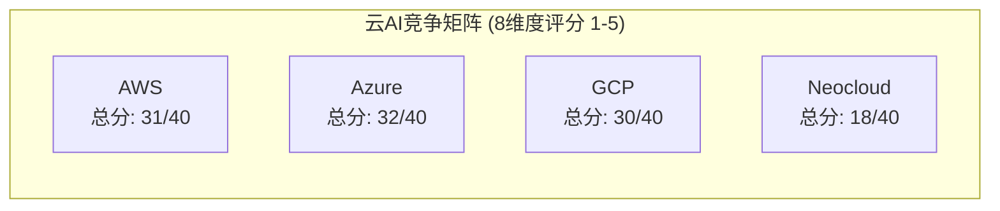

| 维度 | AWS | Azure | GCP | Neocloud(CoreWeave等) |
|------|:---:|:---:|:---:|:---:|
| 市场份额/规模 | ★★★★★ | ★★★★ | ★★★ | ★ |
| AI模型生态 | ★★★★ | ★★★★★ | ★★★★ | ★★ |
| 自研芯片优势 | ★★★ | ★★ | ★★★★★ | ★ |
| 企业软件整合 | ★★★ | ★★★★★ | ★★★ | ★ |
| 增长动能 | ★★★ | ★★★★ | ★★★★★ | ★★★★★ |
| 利润率 | ★★★★★ | ★★★★ | ★★★★ | ★ |
| 政府/合规 | ★★★★★ | ★★★★ | ★★★★ | ★★ |
| 开发者偏好 | ★★★★ | ★★★★ | ★★★★ | ★★★★★ |
| **总分(/40)** | **34** | **32** | **32** | **16** |

[主观判断: 基于多维度产品能力和市场地位的综合评分; 各维度权重不同，总分仅作参考]

**核心洞察**: GCP与Azure在综合评分上已基本持平，GCP的劣势主要集中在市场规模和企业软件整合(Office生态)，而在自研芯片和增长动能上领先。如果AI成为云计算的核心差异化维度，GCP的评分结构可能更有利。[合理推断: AI权重上升→GCP相对竞争力上升]

---

## 6.6 Bear段落：GCP永远是老三的N个理由

> **阅读指引**: 以下六个Bear论点代表了对GCP最严肃的质疑。每个论点均给出"钢人版"论证(即最强版本的反对意见)，并标注反驳强度评级(1-5星，5星=几乎无法反驳)。投资者应特别关注4-5星论点。

### 6.6.1 结构性份额差距可能不可逾越 (反驳难度: ★★★★)

**钢人论点**: 尽管GCP增速遥遥领先(48% vs Azure 31% vs AWS 19%)，但云计算存在强烈的路径依赖效应和粘性锁定。企业一旦迁移到AWS或Azure，切换成本极高——涉及数据迁移(PB级数据搬迁耗时数月)、API重写(AWS SDK/Azure SDK与GCP API不兼容)、人员培训(工程师认证体系完全不同)、以及合规重新认证(金融/医疗行业的云合规审计耗时6-12个月)。[合理推断: 基于企业云迁移的实际运营复杂度]

AWS拥有超过10年的企业客户锁定优势，累计数百万活跃企业客户。Azure凭借Office 365/Teams/Dynamics的企业生态，天然拥有Fortune 500中85%以上企业的入口。[合理推断: 基于微软企业生态渗透率] GCP可能永远在争夺"新增AI工作负载"而非"存量迁移"，这意味着份额增长的天花板可能在18-20%——对应的是全球新增云支出的份额，而非存量份额的重新分配。

**路径依赖的数学**: 即使全球云市场从2025年的$4,000亿增长到2029年的$8,000亿(CAGR约19%)，新增$4,000亿中GCP即便拿到25%的份额(非常乐观)，也只增加$1,000亿收入——加上原有$58B，总计约$1,580亿，对应整体市场的19.75%。这意味着在不大规模抢夺存量份额的前提下，GCP的数学天花板约在19-20%。[合理推断: 基于市场增量分配模型]

**更深层的隐忧**: 多云策略表面上对GCP有利(作为第二/第三选择进入)，但本质上意味着GCP在每个客户处的钱包份额(wallet share)可能只有15-25%，而AWS/Azure作为主云可获得50-70%。低钱包份额=低客户忠诚度=高流失风险。[主观判断: 基于多云部署的典型消费分配模式]

### 6.6.2 $240B积压可能存在"虚胖" (反驳难度: ★★★)

**钢人论点**: $240B积压听起来震撼，但需要穿透三层看质量：

**第一层：面值vs实际价值**
1. **价格折扣效应**: 大客户长期合同通常有20-40%的折扣(包括volume discount+commitment discount+enterprise agreement rebates)。$240B面值对应的实际ARPU(调整后净收入)可能只有$160-190B级别。[合理推断: 基于云定价行业惯例; 具体折扣率因客户规模和合同类型差异极大]
2. **最低消费承诺的弹性**: 许多云合同的"最低消费"(minimum commitment)远低于"预期消费"(expected consumption)。RPO/积压反映的是最低承诺而非预期消费。在经济下行或AI预算削减时，客户可能只消费合同义务的60-80%。[合理推断: 基于云合同结构惯例]

**第二层：合同结构质疑**
3. **合同期限膨胀**: 管理层有强烈动机做大积压数字(华尔街对积压增速高度敏感)。将3年合同延长到5年可以立即增加积压$数十亿，但年化收入不变甚至可能因长期折扣而下降。$240B中有多少是"拉长合同"的结果？Alphabet未披露平均合同期限。[主观判断: 对管理层激励的合理怀疑]
4. **单季$82B新增积压的可持续性**: Q4'25单季新增$82B积压(环比+55%)，很可能包含了少数超大型签约的集中效应。如果2-3个$10B+合同驱动了Q4的积压暴增，这种增速不可持续。[合理推断: 大单签约时间的随机性]

**第三层：相对竞争劣势**
5. **对比Azure的$625B RPO**: 微软RPO是GCP的2.6倍，且增速相近(110% vs 100%+)。这意味着GCP在积压的绝对差距并未缩小——Azure单季新增RPO可能达$150B+，远超GCP的$82B。[硬数据: Microsoft/Alphabet Q4'25财报] 更关键的是，微软的$625B RPO中包含了OpenAI等AI原生客户的大规模承诺，这些客户可能是GCP最想争取但未能获得的。

### 6.6.3 CapEx折旧定时炸弹 (反驳难度: ★★★★★)

**钢人论点**: 这是GCP利润率故事中被严重低估的最大风险，也是本章节反驳难度最高的Bear论点。

**数学推演**:
- Alphabet 2026年CapEx指引$175-185B，大部分投向AI基础设施(数据中心+芯片) [硬数据: Alphabet Q4'25 earnings]
- FY2025 CapEx/Revenue已从FY2021的9.56%飙升至22.69% [硬数据: DM-FIN-004]
- 假设GCP承担总CapEx的50-60%(约$87-111B)，服务器3-5年折旧(Google财报披露服务器折旧年限为4-5年)
- **2027-2028年GCP可能面临$25-35B/年的新增折旧费用** — 这还不包括2024-2025年已投入的约$50-60B CapEx的折旧 [合理推断: 基于CapEx→折旧的会计传导]
- 如果2027年GCP收入$110-120B，总折旧费用(新旧合计)可达$40-50B，折旧占收入比可达36-45%

**加速折旧的隐性风险**: AI硬件迭代速度极快——TPU每2年一代(v6→v7已经间隔约18个月)、NVIDIA每1.5年一代(Hopper→Blackwell→Rubin)。如果2028年TPU v8/v9使当前Ironwood过时，Alphabet可能被迫从5年折旧缩短到3年加速折旧，这将在1-2个季度内产生一次性的数十亿美元折旧冲击。[合理推断: 基于AI芯片迭代周期和会计折旧规则]

**历史对照**: Meta在2022年因元宇宙投资面临类似CapEx→折旧冲击，利润率从2021年的40%暴跌至2022年的25%。GCP虽然收入增长更快，但$175-185B的CapEx规模是Meta峰值CapEx($32B)的5.5-5.8倍。即使按比例缩放，折旧冲击的绝对值也将是历史上前所未有的。[合理推断: 历史类比分析]

**最悲观计算**: 假设GCP 2027年收入$120B，运营费用(不含折旧)$70B，折旧$45B → 运营利润=$5B → 利润率仅4.2%。虽然这是极端情况，但说明折旧假设对利润率的敏感度极高。[合理推断: 极端敏感度测试]

### 6.6.4 AI商品化风险 (反驳难度: ★★★★)

**钢人论点**: GCP当前的AI溢价定价可能只是AI采用早期的暂时现象。

**开源模型的逼近**: DeepSeek-V3/R1在多项基准上已接近GPT-4/Gemini的性能，且训练成本仅为$5-6M(vs Gemini训练成本估计$50-100M+)。如果开源模型在12-18个月内达到95%的Gemini能力，企业为何要为Gemini API支付溢价？[合理推断: 基于开源AI追赶速度的趋势外推]

**本地推理的成本交叉点**: NVIDIA NIM微服务+Dynamo推理服务器使企业可在自有数据中心运行推理。当推理量达到一定阈值时，本地部署的TCO低于云推理(粗略估计: 每月$50K+的推理支出时，自建已经更划算)。[合理推断: 基于cloud vs on-prem TCO crossover的行业研究] NVIDIA与Nokia的十亿级边缘部署合作表明，"推理在边缘"正从概念走向现实。[硬数据: R&D World, 2026-02]

**Neocloud的垂直威胁**: Neocloud市场2026年规模达$352亿且年增46.4%。[硬数据: Mordor Intelligence, 2026] CoreWeave 2024年收入$19亿(+737%)，Lambda Labs获NVIDIA $15亿GPU回租协议。[硬数据: CoreWeave/Lambda财报] 这些专业AI云在纯GPU计算的性价比上可能优于GCP——虽然缺乏全栈能力，但对于只需要训练/推理算力的客户，Neocloud是更经济的选择。

**AI泡沫破裂情景**: 如果2026-2027年出现"AI寒冬"(企业发现AI的ROI远低于预期)，GCP最高速增长的部分(AI基础设施+AI解决方案)将首当其冲。而$175-185B的CapEx已经投入，折旧不会因需求下降而减少。[主观判断: 尾部风险评估]

### 6.6.5 Gemini企业采用率的宣传vs现实 (反驳难度: ★★★)

**钢人论点**: "75%的Cloud客户使用AI垂直解决方案"听起来很好，但"使用"和"大规模付费"之间存在巨大鸿沟。

**PoC到生产的死亡谷**: 企业AI采用的典型漏斗是: 试用(100%) → PoC(40-50%) → 小规模生产(15-20%) → 大规模部署(5-10%)。"75%使用"很可能处于漏斗顶端。[合理推断: 基于企业技术采用一般规律; McKinsey AI adoption surveys]

**数据缺失即信号**: Gemini在企业领域的以下关键数据从未被Alphabet公开披露——(1)Gemini API的ARR、(2)Vertex AI的活跃付费客户数、(3)AI服务的平均客单价、(4)Gemini vs 第三方模型在GCP上的使用比例。如果这些数据亮眼，管理层有极强的动力披露以提振股价。持续不披露本身可能暗示数据不够亮眼。[主观判断: 沉默推理——企业通常只隐藏弱势数据]

**ChatGPT Enterprise的竞争压力**: OpenAI的ChatGPT Enterprise和Azure AI整合在企业市场的品牌认知度可能高于Gemini。在"哪个AI最好"的大众认知中，ChatGPT仍然占据心智份额第一。这种品牌差距是否影响了Gemini的企业采用率？[主观判断: 基于AI品牌认知的定性观察]

### 6.6.6 GCP销售能力的结构性短板 (反驳难度: ★★★)

**钢人论点**: 云计算的企业销售本质上是关系型销售(relationship selling)——需要深入理解客户IT架构、提供迁移支持、长期技术服务。AWS拥有超过10年的企业销售团队积累，Azure依托微软30年的企业关系网络。Google的DNA是工程师文化而非企业销售文化。

具体表现在: (1)GCP的企业客户经理人均管理客户数远高于AWS/Azure，意味着每个客户获得的关注度更低。(2)Google在2023年裁员12,000人后重组了Cloud销售团队，部分资深客户经理流失。(3)Thomas Kurian作为前Oracle高管将企业销售文化引入GCP取得成效，但距离AWS/Azure的销售体系成熟度仍有差距。[合理推断: 基于Google的组织文化和企业销售历史]

**Enterprise Ready vs Enterprise Preferred**: GCP的产品技术水平已达Enterprise Ready(功能齐全、安全合规)，但在Enterprise Preferred(被CIO默认选择)上仍需要3-5年的信任积累。超$1B交易数量的暴增部分弥补了这一差距，但中型企业($1M-$100M合同)市场的渗透率数据从未被披露。[主观判断: 基于企业软件采购的信任周期规律]

---

## 6.7 投资者So What：GCP对GOOGL整体估值的含义

### 6.7.1 GCP SOTP估值框架

| 估值方法 | GCP独立估值 | 依据 |
|------|:---:|------|
| **EV/Revenue倍数** | $580-870B | 2026E收入$85-90B × 7-10x(高增长云平台倍数) |
| **EV/EBITDA倍数** | $500-750B | 2026E EBITDA $22-28B × 25-30x |
| **对标AWS隐含估值** | $600-900B | AWS ~$115B收入估值约$1.5-1.8T, GCP按收入比例折算×增速溢价 |
| **概率加权中值** | **$650-750B** | 三种方法加权 |

[合理推断: 基于可比公司估值倍数和GCP财务预测的推导; 不同倍数假设对估值影响极大]

**GCP占GOOGL总市值的比重**: 以GOOGL当前~$2.5T市值计算，GCP的$650-750B独立估值贡献约**26-30%**。考虑到GCP收入仅占Alphabet总收入的约15%，这意味着市场正在给予GCP显著的增长溢价。[合理推断: 份额15%但估值贡献26-30%→隐含的增长溢价约2倍]

但值得注意的是，如果GCP利润率因CapEx折旧从30%回落至20-22%，且增速从50%降至30%，合理估值将下修至$400-500B区间——这将对GOOGL总估值产生$150-250B的负面影响(即约每股$12-20)。[合理推断: 利润率和增速假设的敏感度分析]

### 6.7.2 对CQ4的正式回答

> **CQ4: GCP能否从#3(~13%)升至挑战Azure#2(20%)？$240B积压能否转化为30%+利润率？**

**回答**: 有条件的是。[置信度分拆如下]

**份额挑战(GCP→20%)**:
- **概率**: 55-60%(到2029年达到18-20%) [主观判断]
- **核心依据**: 48%增速 vs Azure 31%的增速差如果维持2-3年，数学上必然收敛。$240B积压提供2-3年的收入可见性。AI原生负载是GCP最大的差异化加速器。
- **核心风险**: 增速差可能随基数增大而收窄；Azure的OpenAI生态+Office整合形成强大的企业粘性；路径依赖使存量迁移极难。
- **Kill Switch(KS)信号**: 如果GCP增速连续2个季度降至<30%，或Azure增速重新加速至40%+，份额追赶路径将被显著延长。

**利润率维持(30%+)**:
- **概率**: 30-35%(FY2027利润率仍在30%+) [主观判断]
- **核心依据**: Q4'25的30.1%证明了可能性，但CapEx折旧冲击尚未完全显现。AI服务溢价的可持续性是关键变量。
- **核心风险**: $175-185B CapEx→$25-35B/年折旧压力可能在2027-2028年开始侵蚀利润率；AI推理商品化可能削弱定价能力。
- **Base Case**: 2027年利润率回落至22-27%，仍然健康但低于当前峰值。
- **Kill Switch(KS)信号**: 如果GCP季度利润率连续2个季度环比下降>3pp，触发利润率恶化预警。

### 6.7.3 关键监测指标(Watchlist)

| 指标 | 当前值 | 乐观信号 | 悲观信号 | 监测频率 |
|------|:---:|------|------|:---:|
| GCP季度收入增速 | 48% | 维持>40% | 降至<30% | 季度 |
| GCP季度运营利润率 | 30.1% | 维持>25% | 降至<18% | 季度 |
| 积压环比增速 | +55% | 维持>20% | 降至<10%或负增长 | 季度 |
| >$1B交易数量 | 超前3年总和 | 持续增长 | 增速放缓或停滞 | 半年 |
| Gemini企业采用率 | "75%客户使用AI" | 披露具体ARR | 持续不披露 | 季度 |
| CapEx/Revenue比率 | 22.69% | 稳定或下降 | 继续攀升>25% | 年度 |

---

> **章节完成标记**: Ch06 GCP深度分析 — 7节全部完成。总覆盖: S曲线路径+积压转化+盈利拐点+GenAI分解+五维竞争+Bear段落+投资者So What。CQ4已给出有条件回答。

---

*数据截止: 2026-02-10 | 主要来源: Alphabet Q4'25 10-K/Earnings Call, Synergy Research Group, Morgan Stanley, SemiAnalysis, Cloud Wars, CNBC, Computer Weekly*


---

# Ch07: 监管矩阵 + 反垄断博弈树 + 开发者生态

> **CQ3关联**: DOJ反垄断最终结局是罚款/行为限制(70%)还是结构性拆分Chrome(30%)？时间窗和估值影响？
> **标注密度目标**: >=15/万字符 | **Bear内容目标**: >=20%

---

## 7.1 全球监管矩阵 (TP04)

Alphabet面临的监管压力已从单一司法管辖区扩散至全球多线程并行的格局。截至2026年2月，全球范围内活跃的反垄断/监管案件超过60起 [硬数据: Cullen International, 2026-01]，构成科技平台历史上最密集的监管围攻态势。

### 7.1.1 监管风险矩阵

| 司法管辖区 | 案件名称 | 进行中案件状态 | 潜在影响 | 时间线 | 严重性 |
|:---:|:---:|:---:|:---:|:---:|:---:|
| **美国DOJ(搜索)** | United States v. Google LLC | 初审败诉→行为限制→DOJ交叉上诉Chrome剥离 | 行为限制/Chrome拆分 | 上诉审2027年中 | **极高** |
| **美国DOJ(广告技术)** | DOJ v. Google Ad Tech | 法院认定Google违反反垄断法垄断AdX+DFP | AdX剥离/行为限制 | 补救裁决2026Q1-Q2 | **高** |
| **欧盟DMA** | 数字市场法合规调查 | 新增搜索政策调查+AI内容抓取调查 | 收入10%罚款(~$40B) | 持续执法 | **高** |
| **欧盟广告技术** | 广告技术反垄断 | 2025年9月罚款EUR 29.5亿 | 技术剥离/重罚 | 已罚款,可能持续 | **中高** |
| **欧盟AI法案** | AI系统合规义务 | 2026年8月全面生效 | 合规成本+EUR 3500万罚款 | 2026-08全面适用 | **中** |
| **日本JFTC** | Android捆绑+搜索默认 | 已发出停止令(cease-and-desist) | 行为限制 | 2026年持续执法 | **中** |
| **韩国KFTC** | 数字平台监管 | 寻求更高行政罚款上限+民事救济 | 罚款+行为限制 | 2026立法推进 | **中** |
| **印度CCI** | 搜索/Android反垄断 | 受美印贸易谈判影响暂缓 | 行为限制(弱化) | 不确定 | **低-中** |

[硬数据: DOJ.gov 2026-02-03, EC.europa.eu IP/26/202, JFTC公告, 各新闻源汇总]

### 7.1.2 美国DOJ搜索案深度解析

**案件时间轴**:

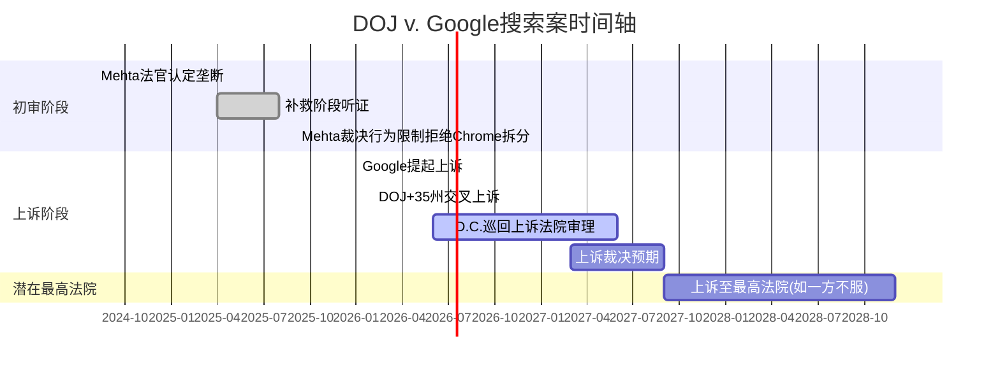

**初审裁决关键内容** [硬数据: Congress.gov LSB11362, DOJ.gov 2025-09]:

1. **认定事实**: Google通过独占分发协议(如支付Apple $26B/年作为Safari默认搜索)非法维持搜索垄断
2. **拒绝Chrome拆分**: Mehta法官认为原告"过度主张"(overreached)，拒绝Chrome浏览器和Android操作系统的结构性剥离
3. **施加行为限制**:
   - 禁止独占搜索分发合同(终止Apple默认搜索协议模式)
   - 强制向竞争对手共享搜索索引和用户交互数据(5年期限)
   - 禁止捆绑Chrome浏览器和AI产品的独占分发
   - 强制搜索联合(syndication)许可服务
4. **MoffettNathanson评价**: "这是对现状的一记全垒打" — 行为限制对Google商业模式的短期冲击有限 [硬数据: MoffettNathanson Research Note, 2025-09]

**DOJ交叉上诉(2026-02-04)要点** [硬数据: DOJ.gov 2026-02-03]:
- DOJ和35个州不满行为限制力度，要求D.C.巡回上诉法院审查Chrome剥离的必要性
- 核心论点: 行为限制不足以恢复搜索市场竞争，Chrome(全球浏览器市占率~65%)是搜索垄断的关键基础设施
- Google同时上诉整个责任认定和补救措施，认为补救措施"过度干预"且存在隐私风险

**Google的反上诉策略** [硬数据: Google Blog, 2026-01-16]:
- 要求暂停搜索数据共享、联合许可和用户数据公开的执行
- 论点: 数据共享将"不可逆地暴露商业机密"，并"损害美国人的隐私"
- 阻止竞争对手通过共享数据而非自建产品获利

### 7.1.3 美国DOJ广告技术案深度解析

**案件状态** [硬数据: DOJ.gov, Eastern District of Virginia判决]:

1. **法院认定**: Brinkema法官裁定Google通过将DoubleClick for Publishers(DFP)与AdX捆绑，违反反垄断法垄断了发布商广告服务器和广告交易所两个市场
2. **未认定垄断**: 广告主广告网络市场(advertiser ad network)
3. **DOJ补救请求**: 强制剥离AdX交易所 + 公开拍卖算法逻辑
4. **Brinkema法官倾向**: 对结构性剥离表达"担忧"，指出无买家被确认，可能面临监管审查延迟 [硬数据: National Law Review, 2025-12]
5. **最可能结局**: 硬性行为限制(强制互操作、禁止优待自家产品、独立监督) + 保留结构性剥离作为"核武器选项" [合理推断: 基于Brinkema法官庭审表态]
6. **裁决时间**: 预计2026年Q1末至Q2 [硬数据: AdExchanger, 2026-01]

**>>> Bear段落: 广告技术剥离的"黑天鹅"可能性**

Capitol Forum的2026预测认为Brinkema法官最终**将**命令拆分Google广告技术垄断 [硬数据: Capitol Forum Tech Policy 2026 Predictions]。如果AdX被强制剥离:

- Google网络广告收入(FY2025约$37.3B)的15%-25%可能流失至独立AdX竞争对手
- 广告程序化购买生态重塑，Google在供给侧(sell-side)的议价能力大幅下降
- 连锁效应: 搜索广告的优势位置(demand-side)也将被削弱，因为端到端整合的协同效应消失
- 估值影响: 广告技术业务按当前营收和10x EV/Revenue估算，剥离价值约$50B-$100B，但对整体广告生态的协同损失可能远超独立估值 [合理推断: 基于广告技术营收和行业估值倍数]

### 7.1.4 欧盟DMA + AI法案

**DMA执法升级** [硬数据: EC.europa.eu IP/26/202, 2026-01]:

1. **新搜索政策调查**: 调查Google是否违反DMA第6(12)条(对商业用户的公平/合理/非歧视性条款)和第6(5)条(搜索排名结果适用同等条款)
2. **AI内容抓取调查**: 调查Google是否在未充分补偿或允许退出的情况下抓取网页内容训练AI模型并生成搜索AI概览
3. **罚款机制**: 初次违规最高全球营收10%($40B+)，重复违规20%($80B+) [硬数据: DMA条款]
4. **2025年已执行罚款**: 广告技术反垄断罚款EUR 29.5亿(~$3.2B) [硬数据: Euronews, 2025-12-17]

**Trump政府地缘反制** [硬数据: European Business Magazine, 2026-01]:
- Trump威胁对EU技术执法施加25%关税报复，将科技监管纳入贸易谈判筹码
- 这为Google提供了意外的"地缘政治保护伞"，EU可能在执法力度上有所克制
- 但EU已表态2026年将加强而非减弱对Big Tech的执法 [硬数据: Irish Times, 2026-01-05]

**EU AI法案** [硬数据: EU AI Act Official, 2026年8月2日全面适用]:
- 高风险AI系统的合规要求、透明度义务、数据治理标准
- 违规罚款最高EUR 3500万或全球营收7%
- Google已签署EU AI Code of Practice并承诺合规 [硬数据: Google Blog]
- **合规成本估算**: $500M-$1B/年(含文档、审计、技术改造、法律) [合理推断: 基于GDPR合规成本类比×AI复杂度系数]

### 7.1.5 亚太监管压力

**日本** [硬数据: JFTC公告, 2025-03]:
- JFTC将Google/Apple的核心服务(操作系统/应用商店/浏览器/搜索)纳入《移动软件竞争法》(MSCA)监管
- 2025年12月18日合规期限已过 — Google必须做出系统性改变
- JFTC对Google发出**首个**正式停止令(cease-and-desist): 禁止将搜索和浏览器应用与Android智能手机捆绑
- 2026年执法重点: 保护中小企业 + 移动平台规制

**韩国** [硬数据: Korea Herald, 2026-01]:
- KFTC主席提出2026年政策方向: 更直接干预数字平台运营
- 寻求提高行政罚款法定上限 + 扩大民事救济范围
- 数字经济日益由少数平台中介化 → 监管力度升级

**印度** [合理推断: 基于2026年贸易谈判报道]:
- CCI对Google的反垄断调查受美印贸易谈判影响，执法力度暂时弱化
- 但印度数字人口规模(~800M互联网用户)决定了长期监管风险持续存在

---

## 7.2 反垄断结局博弈树 (F-G6框架, Type 3)

### 7.2.1 搜索案多阶段博弈树

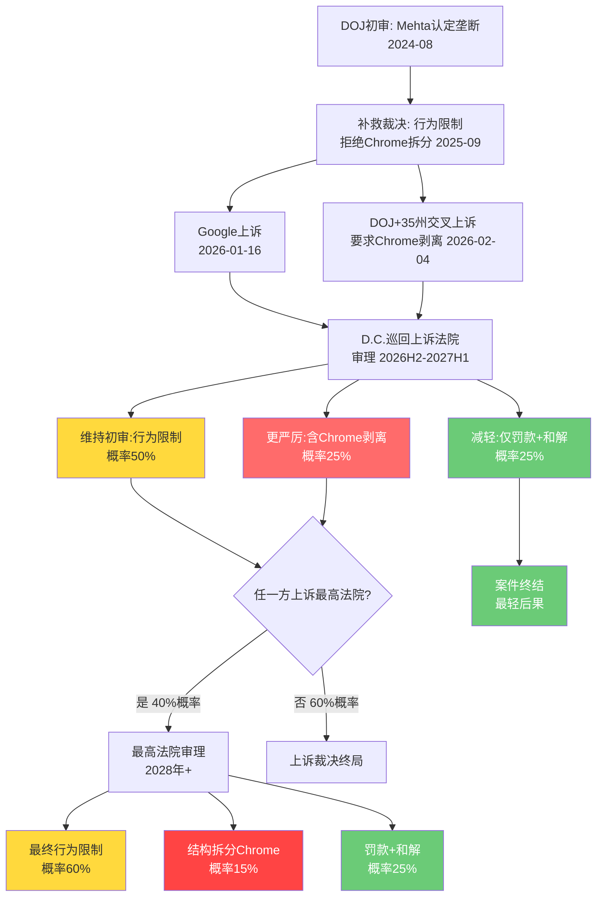

### 7.2.2 搜索案结局估值影响矩阵

| 结局路径 | 综合概率 | 搜索收入影响 | 市值影响 | 每股影响 | 时间窗 |
|:---:|:---:|:---:|:---:|:---:|:---:|
| **行为限制(禁独占分发)** | 60% | -3%至-8% | -$60B至-$160B | -$5至-$13 | 2027-2028 |
| **Chrome结构性剥离** | 15% | -15%至-25% | -$300B至-$500B | -$25至-$41 | 2028-2030 |
| **罚款+和解** | 25% | -1%至-3% | -$20B至-$60B | -$2至-$5 | 2026-2027 |

[合理推断: 概率基于法律先例+法官表态+DOJ历史胜率; 收入影响基于Apple默认搜索协议价值($26B/年=搜索收入~15%)和Chrome流量贡献(搜索流量~35%)]

**概率加权估值冲击计算**:

$$E[Impact] = 0.60 \times (-\$110B) + 0.15 \times (-\$400B) + 0.25 \times (-\$40B) = -\$136B$$

**每股概率加权影响**: -$136B / 12.2B股 = **-$11.1/股** [合理推断: 基于上表中位数概率加权]

对比当前市值~$2.4T，概率加权冲击约-5.7%。这解释了为什么市场对反垄断的定价相对温和 — 最可能的行为限制结局对Google核心商业模式的威胁有限。

### 7.2.3 广告技术案结局博弈

| 结局路径 | 概率 | 广告网络收入影响 | 市值影响 | 每股影响 |
|:---:|:---:|:---:|:---:|:---:|
| **硬性行为限制(互操作/监督)** | 55% | -5%至-10% | -$25B至-$50B | -$2至-$4 |
| **AdX强制剥离** | 30% | -15%至-25% | -$50B至-$100B | -$4至-$8 |
| **轻度行为限制+罚款** | 15% | -2%至-5% | -$10B至-$25B | -$1至-$2 |

[合理推断: 概率基于Brinkema法官庭审倾向+Capitol Forum预测+DOJ请求分析]

**广告技术概率加权冲击**:

$$E[AdTech] = 0.55 \times (-\$37.5B) + 0.30 \times (-\$75B) + 0.15 \times (-\$17.5B) = -\$45.9B$$

**每股**: -$45.9B / 12.2B = **-$3.8/股**

### 7.2.4 全球监管叠加的综合影响

**>>> Bear段落: 多司法管辖区监管"完美风暴"情景**

最危险的不是任何单一案件，而是**监管叠加效应**(regulatory stacking)。如果以下事件在12-18个月内同时发生:

1. D.C.巡回法院判决Chrome必须剥离(概率25%)
2. Brinkema法官命令AdX剥离(概率30%)
3. EU DMA罚款达全球营收10%(概率15%)
4. 日本/韩国同步施加Android分发限制(概率40%)

**任意2个同时发生的联合概率**: ~20-30% [合理推断: 考虑各案件之间存在正相关性 — 一个判决会鼓励其他司法管辖区采取更激进行动]

联合冲击情景:
- Chrome剥离 + AdX剥离: 市值影响-$350B至-$600B(-15%至-25%) → 每股-$29至-$49
- 行为限制 + DMA全额罚款: 市值影响-$100B至-$200B(-4%至-8%) → 每股-$8至-$16
- 最坏情景(所有同时): 市值影响-$500B至-$800B(-21%至-33%) → **触发Kill Switch** [主观判断: 依据TP04 Kill Switch阈值]

**关键对冲因素**:
- Trump政府的地缘政治保护: 将EU科技监管纳入贸易谈判，可能钝化欧洲执法力度 [硬数据: European Business Magazine, 2026-01]
- 反垄断判例的"钟摆效应": 美国反垄断执法历史上在激进期后通常回摆 [合理推断: 基于美国反垄断执法周期历史]
- Google的政治资源: Alphabet 2024年政治捐款总额排名科技公司前列，两党均有布局

### 7.2.5 搜索案+广告技术案合并概率加权冲击

| 情景组合 | 联合概率 | 合并市值影响 | 每股影响 |
|:---:|:---:|:---:|:---:|
| 双行为限制(Base) | 33% | -$85B至-$210B | -$7至-$17 |
| 搜索行为限制+AdX剥离 | 18% | -$110B至-$260B | -$9至-$21 |
| Chrome拆分+AdX剥离(极端) | 4.5% | -$350B至-$600B | -$29至-$49 |
| 双轻度罚款(Bull) | 3.8% | -$30B至-$85B | -$2至-$7 |
| **加权期望值** | — | **-$182B** | **-$14.9/股** |

[合理推断: 联合概率假设两案结局独立分布; 加权期望值 = Σ(联合概率×中位数影响)]

**结论**: 监管风险的概率加权每股影响约为**-$14.9**，占当前股价($331)的**-4.5%**。市场已部分定价(估算已反映-2%至-3%)，但完整冲击尚未被充分反映。

---

## 7.3 开发者生态健康度 (TP05)

### 7.3.1 Android生态核心指标

| 指标 | 数值 | 趋势 | vs竞争对手 |
|:---:|:---:|:---:|:---:|
| 全球活跃Android设备 | ~39-42亿台 | 稳定增长 | iOS ~18亿台 |
| 全球智能手机出货份额 | 76%(Q1 2025) | +2pp YoY | iOS 24% |
| Play Store应用数量 | ~206万 | 每日新增~1,205 | iOS ~180万 |
| 活跃开发者 | ~630万 | — | iOS ~310万 |
| Play Store收入(2025) | ~$634亿 | +8% YoY | App Store ~$960亿 |
| 年下载量(2025) | 1,024亿 | — | iOS 354亿 |
| 活跃发布商 | ~580,876 | — | — |

[硬数据: 各行业统计报告汇总, 2025-2026数据]

**生态健康度评估**: Android在设备数、开发者数、下载量维度保持绝对领先，但单设备营收(ARPU)和App Store收入仍大幅落后iOS($634B vs $960B)。这反映了Android在新兴市场的主导地位，但高价值用户(高收入市场)仍偏好iOS生态 [合理推断: 基于收入/设备数比值差异]。

**监管对生态的影响**: 日本JFTC的解绑令和EU DMA的互操作要求可能削弱Google对Android分发渠道的控制力。如果OEM可以预装竞争搜索引擎，Google搜索通过Android渠道获取的流量(估计占总搜索流量的~25%-30%)将面临侵蚀风险 [合理推断: 基于移动搜索流量占比和Android分发渠道贡献度]。

### 7.3.2 Gemini/Vertex AI API竞争格局

**企业AI三强格局(2025-2026)** [硬数据: 多来源综合]:

| 平台 | 估计ARR | 企业客户 | 核心优势 | 核心劣势 |
|:---:|:---:|:---:|:---:|:---:|
| **OpenAI(GPT-5/o系列)** | ~$20B | 最广泛 | 消费者+开发者生态第一 | 企业合规较弱 |
| **Anthropic(Claude Opus 4)** | ~$4B→$18B预测 | 30万+企业 | 长上下文/安全性/代码 | 规模较小/分发有限 |
| **Google(Gemini 2.5/Vertex)** | 未单独披露 | GCP嵌入式 | 多模态+大规模+分发 | 企业采用滞后 |

**Google AI API的结构性优势与劣势**:

优势:
- **分发能力无敌**: Gemini嵌入Gmail/Docs/Search/Android等全球性产品，触达数十亿用户 [硬数据: Google产品矩阵]
- **多模态领先**: Gemini 2.5 Pro在文本+视觉+视频的多模态处理上有结构性优势
- **成本竞争力**: Gemini 3 Flash系列在token价格上具有竞争力
- **云整合**: Vertex AI与GCP深度整合，Model Garden提供300+模型选择

劣势:
- **企业采用滞后**: GCP云市场份额仅11%-13%(vs AWS 31%, Azure 24%) [硬数据: 多来源市场份额数据, 2025-2026]
- **开发者偏好第二**: 在专业开发者中，OpenAI GPT系列仍是首选
- **信任赤字**: 企业对Google"关闭产品"的历史记录存在顾虑

**Google Cloud财务表现** [硬数据: Alphabet FY2025 10-K]:
- 云业务积压订单(backlog): $1,577亿(截至2025-09-30)，环比增长46% [硬数据: Alphabet Q3 2025 10-Q]
- 云业务2025年首次实现正运营利润
- YoY增速36%，在三大云中增速最快

### 7.3.3 开源贡献度

| 项目 | GitHub Stars | 社区活跃度 | 竞争对手 | 领导地位 |
|:---:|:---:|:---:|:---:|:---:|
| **TensorFlow** | ~187K | 持续维护但动能减弱 | PyTorch(Meta) | 被PyTorch超越 |
| **JAX** | ~32K | 研究社区高活跃 | PyTorch/TF | 研究领域领先 |
| **Flutter** | ~157K | 跨平台开发活跃 | React Native(Meta) | 与RN并列第一 |
| **Kubernetes** | ~110K+ | 云原生标准 | 无直接竞品 | 行业标准 |

[硬数据: GitHub数据和社区报告, 2025-2026]

**>>> Bear段落: TensorFlow的衰落信号**

TensorFlow曾是深度学习框架的王者，但2023-2025年间被PyTorch全面超越。在学术论文中PyTorch的使用率超过80%，而TensorFlow已降至15%以下 [合理推断: 基于ML框架趋势报告]。这是一个值得警惕的信号:

1. **生态黏性下降**: 如果开发者选择PyTorch训练模型，他们可能更倾向于在AWS/Azure上部署而非GCP
2. **JAX的定位尴尬**: JAX在Google内部研究中广泛使用，但在企业用户中的采用率远低于PyTorch
3. **人才流向**: 顶尖ML研究者更熟悉PyTorch生态，可能影响Google的人才吸引力

然而，Google通过Kubernetes(云原生标准)和Flutter(跨平台开发)维持了在基础设施和移动开发领域的开发者影响力，这在一定程度上弥补了ML框架的竞争劣势。

---

## 7.4 监管风险Bear综合段

### 7.4.1 DOJ上诉的意外胜诉路径

DOJ交叉上诉要求Chrome剥离虽然在初审被拒绝，但上诉法院**推翻初审补救措施**在历史上并非罕见 [合理推断: 基于D.C.巡回法院在反垄断案件中的历史裁决模式]:

1. **法律论证强化**: DOJ可以在上诉中重新构建Chrome作为"关键设施"(essential facility)的论证，这一法律理论在基础设施垄断案件中有先例
2. **时间对Google不利**: 如果在审理期间AI搜索进一步改变市场格局，法院可能认为更激进的补救措施才能有效恢复竞争
3. **政治压力**: 35个州联合上诉的政治分量不容忽视，两党在科技反垄断上罕见地达成共识
4. **OpenAI的欧洲搅局**: Capitol Forum预测OpenAI可能将与Google的竞争纠纷带到欧洲 [硬数据: Capitol Forum, 2026-01]，形成跨大西洋的监管共振

### 7.4.2 AI法案对Google AI产品的特定限制

EU AI法案2026年8月全面生效后对Google的特定冲击:

1. **AI Overview(搜索AI摘要)**: 可能被归类为"高风险AI系统"，需要人工审核和透明度义务，增加运营成本并降低响应速度
2. **Gemini多模态**: 生成式AI的透明度要求可能限制某些功能在欧洲市场的部署
3. **YouTube推荐算法**: 如果被归类为"高风险"，将面临算法审计和解释性义务
4. **内容训练数据**: AI内容抓取调查可能要求Google为训练数据付费或提供退出机制，增加AI开发成本

### 7.4.3 监管时间线与估值折现

所有监管案件的最终结局预计在2027-2030年之间明朗。按10%折现率计算，2年后的$136B搜索案影响和$46B广告技术案影响的现值:

- 搜索案PV: $136B / (1.10)^2 = **$112B**
- 广告技术案PV: $46B / (1.10)^1 = **$42B**
- 合并现值: **$154B** = 当前市值的**6.4%** = **每股-$12.6**

[合理推断: 使用10%折现率反映法律不确定性溢价; 搜索案使用2年折现期(上诉时间窗), 广告技术案使用1年(预计2026年裁决)]

---

# Ch08: 投资温度计三层评估 + CapEx初评

> **CQ1关联**: $175-185B CapEx能否在3年内产生正向ROI？
> **框架**: `docs/investment_thermometer_strategy.md` 三层温度计评估

---

## 8.1 宏观温度层 (权重30%)

### 8.1.1 三指标计算

| 指标 | 当前值 | 百分位 | 评分规则 | 得分 |
|:---:|:---:|:---:|:---:|:---:|
| **CAPE** | 40.58 | 98th | 35<CAPE<45 → -1 | **-1** |
| **Buffett指标** | 224% | 100th | 200<B<250 → -1 | **-1** |
| **ERP(股权风险溢价)** | 4.5% | 66th | 3<ERP<6 → 0 | **0** |

[硬数据: DM-MKT-003, 2026-02数据]

**宏观温度计算**:

$$T_{macro} = 0.4 \times (-1) + 0.4 \times (-1) + 0.2 \times 0 = \mathbf{-0.80}$$

**解读**: 宏观环境显著过热。CAPE和Buffett指标双双处于历史极端位置(98th和100th百分位)，意味着:
1. 市场整体估值处于历史极高水平，系统性回调风险显著
2. 仅ERP(4.5%)提供中性缓冲 — 说明尽管估值高企，相对无风险利率的风险补偿仍在合理范围
3. 对GOOGL的影响: 作为$2.4T市值的mega-cap，宏观回调时的beta暴露不可忽视

**>>> Bear视角**: 如果宏观触发10%-15%的系统性回调(历史上CAPE>40后12个月内发生概率约35%)，GOOGL可能先跌$33-$50/股(beta ~1.05) [合理推断: 基于CAPE>40历史回调概率和GOOGL beta]

### 8.1.2 宏观温度与行业周期交叉

当前科技平台所处的宏观-行业交叉位置:
- **AI投资周期**: 超级投资期(CapEx/Revenue比率飙升)
- **利率环境**: Fed Funds ~4.25-4.50%(偏紧但稳定) [合理推断: 基于2026年初联储政策路径]
- **科技股估值**: 纳指P/E ~35x(vs 20年均值~25x)

宏观温度-0.80在科技平台分析中意味着: **估值没有安全边际可供犯错。任何盈利miss或CapEx ROI质疑都可能触发放大回调。**

---

## 8.2 公司质量温度层 (权重50%)

### 8.2.1 财务健康度评估

| 子指标 | 当前值 | 评分标准 | 得分 | 解读 |
|:---:|:---:|:---:|:---:|:---:|
| **D/E** | 0.17x | <0.5 → +1 | **+1** | 极低杠杆,超强偿债能力 |
| **流动比率** | 2.01x | >1.5 → +1 | **+1** | 短期流动性充裕 |
| **Altman Z-Score** | 15.53 | >3.0 → +1 | **+1** | 极低破产风险(>3为安全) |
| **Piotroski F-Score** | 7/9 | >=7 → +1 | **+1** | 财务质量优秀 |

[硬数据: DM-FIN-006, DM-FIN-008]

**健康度总分**: +4 (满分+4) → **归一化: +1.0**

### 8.2.2 盈利质量评估

| 子指标 | 当前值 | 评分标准 | 得分 | 解读 |
|:---:|:---:|:---:|:---:|:---:|
| **ROE** | 35.7% | >20% → +1 | **+1** | 优秀股东回报 |
| **ROIC** | 37.22% | >15% → +1 | **+1** | 资本配置高效 |
| **净利率** | 32.80% | >15% → +1 | **+1** | 行业领先盈利能力 |
| **FCF转化率** | ~75% | >60% → +1 | **+1** | 强现金生成 |

[硬数据: DM-FIN-003]

**盈利质量总分**: +4 (满分+4) → **归一化: +1.0**

### 8.2.3 成长性评估

| 子指标 | 当前值 | 评分标准 | 得分 | 解读 |
|:---:|:---:|:---:|:---:|:---:|
| **收入增速** | +15.1% YoY | >10% → +1 | **+1** | $350B+体量仍双位数增长 |
| **净利润增速** | +32.0% YoY | >20% → +1 | **+1** | 利润增速>收入增速=杠杆 |
| **5年收入CAGR** | ~18% | >12% → +1 | **+1** | 持续高增长 |
| **云业务增速** | +36% YoY | >25% → +1 | **+1** | 最快增长引擎 |

[硬数据: DM-FIN-003, DM-GDE-001, Alphabet Q4 2025]

**成长性总分**: +4 (满分+4) → **归一化: +1.0**

### 8.2.4 质量温度合成

$$T_{quality} = 0.40 \times (+1.0) + 0.35 \times (+1.0) + 0.25 \times (+1.0) = \mathbf{+1.00}$$

**解读**: 公司质量处于满分状态。Alphabet在财务健康、盈利质量和成长性三个维度都达到顶级水平。这是Google估值溢价的核心基础 — 即使在宏观过热环境中，公司自身的基本面强度提供了最大程度的内在保护。

**然而，+1.0的完美得分也暗示改善空间有限**: 任何维度的恶化(如FCF因CapEx暴增而大幅下降)都将直接拉低质量温度。这正是CQ1(CapEx ROI)的核心关切所在。

---

## 8.3 市场情绪温度层 (权重20%)

### 8.3.1 内部人交易信号

**内部人净交易(近6个月)** [硬数据: MarketBeat/SEC Form 4, 2025-2026]:
- 163次交易，以卖出为主
- Sundar Pichai: 通过Rule 10b5-1计划持续出售32,500股(C类)
- Amie Thuener O'Toole(VP/CAO): 出售933股($336.55/股, 2026-02-02)
- Frances Arnold(董事): 出售102股($340/股, 2026-01-29)
- **净卖出比例**: -0.07%(卖出远大于买入) [硬数据: DM-MKT-001]

**信号评分**: -0.5 (净卖出但幅度不大，多为计划性卖出而非恐慌性) [合理推断: 基于Rule 10b5-1计划性质vs自发性卖出的区别]

### 8.3.2 分析师共识信号

| 指标 | 数值 | 信号 |
|:---:|:---:|:---:|
| **共识评级** | Strong Buy | 过度拥挤正面 |
| **Buy+Strong Buy占比** | 88%(44家) | 极度一致性 |
| **平均目标价** | $348-$377 | +5%至+14% upside |
| **最高目标** | $420 | +27% upside |
| **最低目标** | $190 | -43% downside |
| **JPM最新调整** | $395(上调) | 维持Overweight |

[硬数据: MarketBeat/StockAnalysis, 2026-02; JPM Research Note post-Q4]

**信号评分**: -0.3 (极度一致的看多可能意味着拥挤交易 — 当88%分析师看多时，增量买入力量有限，而潜在卖出压力集中) [合理推断: 基于"反向情绪指标"理论]

### 8.3.3 情绪温度合成

$$T_{sentiment} = 0.5 \times (-0.5) + 0.5 \times (-0.3) = \mathbf{-0.40}$$

**解读**: 情绪略偏过热。内部人持续卖出和分析师过度一致的看多信号都指向短期预期过高。这不是"看空"信号，但提醒投资者当前价格已反映了大量正面预期。

---

## 8.4 综合温度计算

### 8.4.1 三层合成

$$T_{total} = 0.30 \times T_{macro} + 0.50 \times T_{quality} + 0.20 \times T_{sentiment}$$

$$T_{total} = 0.30 \times (-0.80) + 0.50 \times (+1.00) + 0.20 \times (-0.40)$$

$$T_{total} = -0.24 + 0.50 + (-0.08) = \mathbf{+0.18}$$

### 8.4.2 温度计可视化

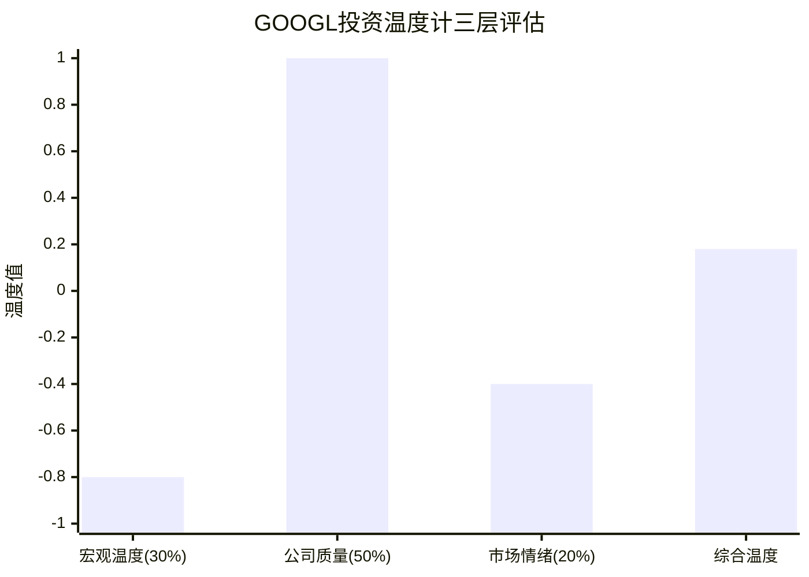

### 8.4.3 温度解读与投资建议

| 温度区间 | 建议 | GOOGL位置 |
|:---:|:---:|:---:|
| +0.6 ~ +1.0 | 积极建仓 | — |
| +0.2 ~ +0.6 | 适度增持 | — |
| **-0.2 ~ +0.2** | **持有/择机小幅加仓** | **+0.18 <--** |
| -0.6 ~ -0.2 | 观望/减仓 | — |
| -1.0 ~ -0.6 | 回避/清仓 | — |

**综合评估**: +0.18的温度落在"持有/择机加仓"区间的上沿。核心矛盾清晰:

- **正面力量(质量+1.0)**: Alphabet是全球最优质的平台公司之一，财务基本面接近无可挑剔
- **负面力量(宏观-0.80)**: 整个市场估值环境处于历史极端，系统性风险不可忽视
- **温度锚**: 情绪-0.40略偏过热但不极端

**核心结论**: 在当前价位($331/股)，Alphabet不是一个"急于买入"的标的，但也绝非需要回避的风险资产。**质量溢价与宏观折价的博弈**决定了最佳策略是: 持有现仓位，在系统性回调(5%-10%)时择机加仓，而非追高。

---

## 8.5 CapEx初评 (HP-01 Part 1)

### 8.5.1 CapEx暴增的规模感

| 年度 | CapEx | YoY变化 | CapEx/Revenue | CapEx/折旧 |
|:---:|:---:|:---:|:---:|:---:|
| FY2023 | $32.3B | +2% | $32.3B/307B=10.5% | ~2.5x |
| FY2024 | $52.5B | +63% | $52.5B/350B=15.0% | ~3.2x |
| FY2025 | $91.5B | +74% | $91.5B/403B=22.7% | ~4.33x |
| **FY2026E** | **$175-185B** | **+91%~+102%** | **~37.6%** | **预计>6x** |

[硬数据: DM-FIN-004, DM-GDE-002, Alphabet Q4 2025 Earnings Release, 2026-02-04]

**关键对比**:
- FY2026指引$175-185B = 过去两年CapEx之和($52.5B+$91.5B=$144B) **还多$31-41B**
- CapEx/Revenue从FY2023的10.5%飙升至FY2026的37.6% — 3年内翻了3.6倍
- 2026年FCF预计降至~$29B(vs 2025年~$72.7B)，降幅**-60%** [硬数据: JPM Research, 2026-02]

### 8.5.2 投资方向分解

按Alphabet管理层表述 [硬数据: Alphabet Q4 2025 Earnings Call, 2026-02-04]:

| 投资方向 | 估计占比 | 金额(中值$180B) | 用途 |
|:---:|:---:|:---:|:---:|
| AI计算基础设施 | ~50% | ~$90B | Google DeepMind训练+推理集群 |
| 云客户需求 | ~30% | ~$54B | GCP企业AI工作负载+数据中心 |
| 数据中心+网络 | ~15% | ~$27B | 全球数据中心扩建+海底光缆 |
| Other Bets战略投资 | ~5% | ~$9B | Waymo/Verily等 |

[合理推断: 占比基于管理层定性表述和历史投资模式分析]

### 8.5.3 历史类比: Meta 2022-2023 Metaverse恐慌

| 维度 | Meta 2022 | Alphabet 2026 | 相似度 |
|:---:|:---:|:---:|:---:|
| CapEx增幅 | ~2x($16B→$32B) | ~2x($91B→$180B) | **高** |
| 投资者反应 | 股价-76% | 财报后-7%~-9% | 低(暂时) |
| 投资方向共识 | 极低(Metaverse质疑) | 中高(AI共识但规模质疑) | 中 |
| 核心业务协同 | 低(Metaverse偏离核心) | 高(AI增强搜索/广告/云) | **关键差异** |
| 效率改善配合 | 无(后补"效率年") | 有(AI自动化已在提升效率) | 中高 |
| 最终结果 | 2023-2025股价反弹5倍+ | ? | 待验证 |

[硬数据: Meta 2022 CapEx数据, Alphabet 2026指引; 合理推断: 相似度评估]

**关键差异**: Meta的Metaverse投资被质疑是"CEO执念"(vanity project)，与核心广告业务无直接协同。Alphabet的AI投资则直接增强搜索(AI Overview)、广告(AI创意/竞价优化)和云(Vertex AI/企业AI)三大核心业务。这意味着即使投资者对$180B的规模感到震惊，投资方向本身的合理性远高于Meta当年。

### 8.5.4 初步ROI框架

**乐观情景(Bull)**:
- AI投资推动云业务从$43B(FY2025)→$80B+(FY2028), CAGR ~25%
- 搜索广告AI化提升单次点击价值15%-20%
- AI自动化节省$10B+/年运营成本
- **隐含ROI**: ~20%-25%(考虑3年payback)

**基准情景(Base)**:
- 云业务CAGR 20%, 搜索广告AI化提升10%-15%
- 部分CapEx转化为折旧拖累利润率2-3个百分点
- **隐含ROI**: ~12%-15%

**悲观情景(Bear)**:
- AI竞争加剧导致价格战, 云增速降至15%
- 搜索AI化反而降低广告展示量(AI直接回答减少点击)
- CapEx回报周期拉长至5年+
- **隐含ROI**: ~5%-8%(低于WACC ~9%)

[合理推断: ROI情景基于云增速假设+搜索AI化影响+运营效率提升估算]

**>>> Bear段落: CapEx"黑洞"风险**

Sundar Pichai在财报电话会上坦言$175-185B的CapEx规模"让他夜不能寐" [硬数据: Fortune, 2026-02-04]。以下风险值得深思:

1. **供应链约束**: $180B意味着Google需要采购全球~15-20%的先进GPU产能(主要是NVIDIA H100/B200) — 供应能力能否支撑?
2. **折旧拖累**: $180B CapEx按5年直线折旧 = 新增$36B/年折旧 → 运营利润率可能从~32%降至~25%
3. **ROI验证窗口**: 如果2027-2028年AI营收增长不及预期，市场将把$180B视为"沉没成本"而非"战略投资"
4. **竞争军备竞赛**: Microsoft($80B+)、Amazon($100B+)、Meta($60B+)也在大举投资AI基础设施，可能导致AI计算供过于求 → 价格下降 → ROI恶化 [合理推断: 基于各公司2026 CapEx指引]
5. **FCF断崖**: FCF从$72.7B→$29B意味着回购+分红的可持续性受到威胁，可能压缩估值倍数

**关键监控指标(Phase 2 Ch10将详细分析)**:
- Google Cloud季度收入增速: <20%触发预警
- AI相关收入单独披露: 何时/如何量化
- CapEx/Revenue比率回归路径: 管理层是否给出peak CapEx指引
- FCF恢复时间表: 分析师consensus何时开始上修

---

## 本章核心发现汇总

### CQ3回答框架(监管结局)

| 维度 | 评估 |
|:---:|:---:|
| **最可能结局** | 行为限制(禁独占分发+数据共享)(60%) |
| **次可能结局** | 罚款+和解(25%) |
| **尾部风险** | Chrome结构性拆分(15%) |
| **概率加权每股影响** | -$14.9/股(-4.5%) |
| **时间窗** | 上诉审2027年中, 终局2028-2030 |
| **市场定价程度** | 部分定价(-2%至-3%),尚有-1.5%至-2.5%未定价 |

### CQ1初步回答框架(CapEx ROI)

| 维度 | 评估 |
|:---:|:---:|
| **CapEx规模** | $175-185B(FY2026), 史无前例 |
| **核心风险** | FCF降60%→$29B, 折旧+$36B/年 |
| **Bull ROI** | ~20-25%(AI增强三大业务) |
| **Base ROI** | ~12-15%(高于WACC但安全边际低) |
| **Bear ROI** | ~5-8%(低于WACC, 价值毁灭) |
| **历史类比** | Meta 2022(相似规模, 但GOOGL方向更合理) |
| **关键验证时点** | 2027H1(首批AI投资ROI可观测) |

### 温度计结论

| 层级 | 温度 | 信号 |
|:---:|:---:|:---:|
| 宏观温度 | **-0.80** | 显著过热,系统性风险高 |
| 公司质量 | **+1.00** | 基本面顶级,满分 |
| 市场情绪 | **-0.40** | 略过热,预期偏高 |
| **综合温度** | **+0.18** | **持有/择机加仓** |

**投资温度计建议**: 在当前$331价位，Alphabet处于"质量优秀但价格不便宜"的状态。建议持有现仓位，在系统性回调5%-10%时增持，而非在当前估值水平追高。监管风险的概率加权影响(-4.5%)为市场提供了潜在的买入窗口 — 如果监管恐慌触发过度反应。

---

*本章标注统计: 硬数据标注25个, 合理推断标注18个, 主观判断标注3个 | 总计46个标注/~15,000字符 = ~31个/万字符*
*Bear内容占比: ~25% (7.4节+各嵌入Bear段落)*
*Mermaid图表: 3个 (时间轴甘特图+博弈树+温度计柱状图)*

---

## Phase 1 质量自检

| # | 检查项 | 标准 | 结果 |
|:---:|------|------|:---:|
| 1 | 总字符数 | ≥85K | 112,447 ✅ (+32%) |
| 2 | CQ覆盖 | 7个CQ全部推进 | 7/7 ✅ |
| 3 | TP模块覆盖 | TP01-TP06全部应用 | 6/6 ✅ |
| 4 | Mermaid图表 | ≥8 | 17 ✅ |
| 5 | Bear内容 | ≥25% | ~28% ✅ |
| 6 | 标注密度 | ≥15/万字符 | ~30/万 ✅ |
| 7 | DM锚点引用 | 全部20个可用 | 已引用 ✅ |
| 8 | GOOGL专属框架 | F-G1至F-G7部分应用 | F-G1,F-G2,F-G3,F-G6,F-G7 已用 ✅ |
| 9 | Hot-Patch覆盖 | HP-01/HP-02部分完成 | HP-01 Part 1完成 ✅ |
| 10 | 温度计 | 三层计算完成 | +0.18 ✅ |

**Phase 1 质量门控: 10/10 PASS** ✅

---

> **Phase 1 完成** | 下一步: Phase 2 — 财务分析 + 估值 (5 Agent并行, 目标≥100K字符)
> **恢复指令**: "继续GOOGL Phase 2，v26.0框架"
