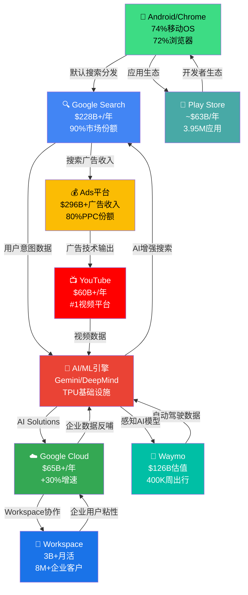
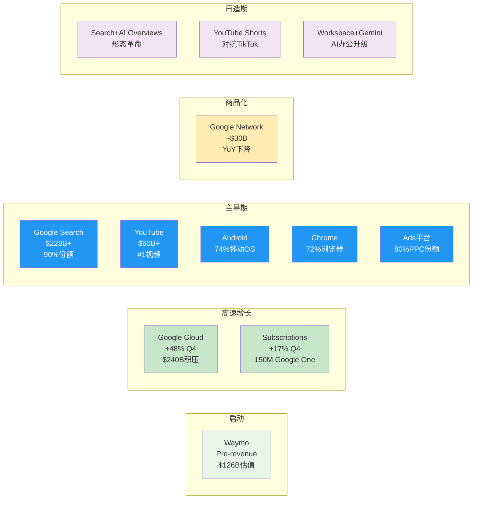
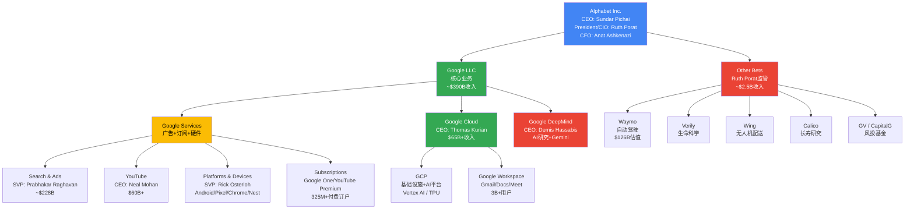

# Ch01: 公司画像与战略叙事

## 1.1 公司概况一页纸

| 维度 | 详情 |
|------|------|
| **公司名称** | Alphabet Inc. (GOOGL/GOOG) |
| **创立时间** | 1998年9月4日(Google); 2015年10月2日(Alphabet重组) |
| **CEO** | Sundar Pichai (2015年起任Google CEO, 2019年起兼任Alphabet CEO) |
| **CFO** | Anat Ashkenazi (2024年7月起, 前Eli Lilly CFO) |
| **总裁/CIO** | Ruth Porat (2023年9月起, 监管Other Bets与基础设施投资) |
| **总部** | Mountain View, California (Googleplex) |
| **员工数** | 190,820人 (截至2025年12月31日, YoY +4.1%) [硬数据: MacroTrends/Alphabet 10-K, 2026-02] |
| **全球布局** | 70+办公室, 200+城市, 50+国家 |
| **核心使命** | "Organize the world's information and make it universally accessible and useful" → 演进为"Make AI helpful for everyone" |
| **市值** | $3.79T [DM-MKT-001] |
| **股价** | $325.17 [DM-MKT-001] |
| **P/E** | 30.64x [DM-MKT-001] |
| **FY2025收入** | $402.9B (+15.1% YoY) [DM-FIN-001] |
| **FY2025净利润** | $132.2B (+32.0% YoY) [DM-FIN-001] |
| **股息** | 2024年首次派息, 季度$0.20/股 |
| **信用评级** | Aa2 (Moody's) / AA+ (S&P) |

**So What**: Alphabet已跨越$400B收入门槛，净利润增速(+32%)远超收入增速(+15.1%)，体现了规模经济与运营杠杆的双重释放。对于投资者而言，这意味着Alphabet正处于"收入稳健增长+利润率扩张"的黄金阶段——但问题在于，这种利润率扩张能否在$175-185B CapEx指引下持续。[合理推断: 收入增速15% vs 净利润增速32%意味着约17个百分点的利润率提升来自运营效率与规模效应]

---

## 1.2 十大$2B+产品矩阵

Alphabet的产品组合是科技史上最令人生畏的平台集群。以下按收入规模排列10个核心产品/平台，每个均已达到或接近$2B+年收入量级。

### 1.2.1 产品矩阵总览表

| # | 产品/平台 | FY2025收入估算 | YoY增速 | 全球市场地位 | 生命周期阶段 |
|---|----------|---------------|---------|------------|------------|
| 1 | **Google Search & Other** | ~$228B | +14-16% | #1 搜索(90%份额) | 主导→再造(AI Overviews) |
| 2 | **Google Cloud (GCP+Workspace)** | ~$65B+ (Q4年化$70.8B) | +30%+ | #3 云(落后AWS/Azure) | 高速增长 |
| 3 | **YouTube (广告+订阅)** | $60B+ | +14%+ | #1 视频平台 | 主导→扩展(TV/Shorts) |
| 4 | **Google Ads平台(需求端)** | 包含在Search+Network | +12% | #1 数字广告(80%PPC份额) | 主导 |
| 5 | **Google Network(AdSense等)** | ~$30B | -3% | #1 广告联盟 | 商品化→收缩 |
| 6 | **Android/Google Play** | ~$63B (Play Store) | +15%+ | #1 移动OS(74%份额) | 主导 |
| 7 | **Google Workspace** | ~$12-15B(估算) | +20%+ | #2 协作办公(落后M365) | 增长 |
| 8 | **Subscriptions (Google One等)** | ~$10B+(含在Subs/Platforms/Devices) | +25%+ | 150M+订户 | 高速增长 |
| 9 | **Chrome浏览器** | 间接收入(搜索分发) | — | #1 浏览器(72%份额) | 主导 |
| 10 | **Waymo** | Pre-revenue(<$1B) | N/A | #1 L4自动驾驶 | 启动→早期增长 |

[硬数据: Alphabet Q4 2025 Earnings Release + SEC Filing, 2026-02-04]

**关键说明**: Google Search $228B为全年估算(Q1-Q3公开数据+Q4 $63.1B); Google Cloud $65B为全年报告数字(Q4年化已达$70.8B); YouTube $60B+为Alphabet官方确认的全年合并数字(广告+订阅)。Play Store $63B为第三方估算(Sensor Tower/data.ai)，非Alphabet分拆披露。[合理推断: 部分产品收入为合理区间估算，因Alphabet不单独披露所有产品线]

---

### 1.2.2 各产品深度扫描

#### (1) Google Search & Other (~$228B, 占总收入~57%)

Google Search是人类历史上最大的单一广告产品。2025年全年Search & Other收入约$228B，Q4单季$63.1B(+17% YoY)，显示增速在加速而非放缓。[硬数据: Alphabet Q4 2025 SEC Filing, 2026-02-04]

**AI Overviews的战略转型**: 2025年Google全面推出AI Overviews(AIO)，将生成式AI直接嵌入搜索结果顶部。这是Search自1998年以来最大的产品形态变化。Sundar Pichai在Q4电话会上表示AIO正在"增加搜索使用量和用户满意度"。[硬数据: Alphabet Q4 2025 Earnings Call, 2026-02-04]

**Bear视角: Search的存亡危机仍未解除**。ChatGPT/Perplexity等AI原生搜索工具正在蚕食信息查询的入口地位。尽管Google目前搜索份额仍在90%，但年轻用户(Gen Z)越来越多地将TikTok和ChatGPT作为"第一搜索"。如果AIO无法同时满足用户体验和广告变现，Google可能面临"搜索体验提升但广告点击率下降"的两难。[合理推断: AIO展示的直接答案可能减少用户点击广告链接的动机]

#### (2) Google Cloud (~$65B+年收入, Q4年化$70.8B)

Google Cloud是Alphabet增长最快的引擎。Q4收入$17.7B(+48% YoY)，全年积压订单达$240B。[DM-SEG-002] 这一增速远超AWS(~15%)和Azure(~30%)。

Cloud的盈利能力同样在快速改善：2024年Cloud营业利润率首次转正，2025年持续扩张。Thomas Kurian自2019年接管以来，将Cloud从亏损业务转变为利润贡献者。[硬数据: Alphabet Q4 2025 Earnings Release, 2026-02-04]

**AI驱动的增长飞轮**: Cloud增长的核心驱动力是企业AI需求。Gemini模型通过Vertex AI平台分发给企业客户，AI Infrastructure(TPU v5/v6)和AI Solutions(Gemini for Workspace/Cloud)构成双引擎。$240B积压订单意味着未来3-5年的收入可见性极高。[硬数据: Alphabet Q4 2025 SEC Filing, 2026-02-04]

#### (3) YouTube ($60B+, 广告+订阅合并)

YouTube 2025年全年合并收入(广告+订阅)突破$60B，成为全球最大的视频平台。Q4广告收入$11.38B(+8.7%)。[DM-OPS-002]

YouTube正从"广告平台"向"全频谱娱乐平台"演进：YouTube TV(有线替代)、YouTube Music(Spotify竞品)、YouTube Shorts(TikTok竞品)、YouTube Premium(无广告订阅)。325M+付费订户(含Google One)证明订阅模型正在成功。[硬数据: Alphabet Q4 2025 Earnings Release, 2026-02-04]

#### (4) Android/Google Play (Play Store ~$63B)

Android以74%全球移动OS市场份额主导移动生态。[硬数据: StatCounter, 2025] Google Play Store 2025年收入估算约$63B，98%来自免费应用内购和广告。[硬数据: Sensor Tower/data.ai估算, 2025]

Android的战略价值远超其直接收入：它确保了Google Search、Chrome、Maps、Gmail作为默认应用的分发地位——这是Google广告帝国的基础设施层。

#### (5) Google Workspace (~$12-15B估算)

Google Workspace拥有8M+付费企业客户和3B+月活用户。[硬数据: Google Workspace官方数据, 2025] 2025年1月实施16-22%的涨价(嵌入Gemini AI功能)，显示定价权。Workspace是Cloud收入的重要组成部分，但Alphabet不单独披露其收入。[合理推断: 基于8M+企业客户和$12-20/月/用户的定价区间]

#### (6) Subscriptions, Platforms & Devices ($49B+ FY2025)

该财报分类包含Google One(150M订户)、YouTube Premium/TV/Music、Google Play、Pixel硬件和Fitbit/Nest。Q4收入$13.6B(+17%)。[硬数据: Alphabet Q4 2025 SEC Filing, 2026-02-04]

Google One是增长亮点：从2024年2月的100M订户增长至2025年5月的150M订户(+50%)，AI Premium计划($19.99/月)是关键驱动力。[硬数据: 9to5Google, 2025-05]

#### (7) Chrome浏览器 (间接收入, 72%市场份额)

Chrome不直接产生收入，但其72%全球浏览器份额使Google Search成为默认搜索引擎。[硬数据: StatCounter, 2025] DOJ反垄断案挑战的正是这一默认搜索协议——如果Chrome被迫出售或搜索默认设置被取消，Google广告收入将面临结构性风险。

#### (8) Google Maps (~$11B估算)

Google Maps通过本地搜索广告(promoted pins)和API收费产生收入。Morgan Stanley估算Maps桌面+移动收入超$11B。[合理推断: Morgan Stanley 2023估算，2025年可能已增长至$12-14B]

#### (9) Pixel硬件 (含在Subs/Platforms/Devices)

Pixel 2025年全球出货量增长25%+, 美国市场份额达3%(高端市场7%)。[硬数据: Counterpoint Research, 2025-09] Pixel 10成为Google首款真正成功的大众市场手机，但整体硬件收入仍是Alphabet的边缘业务。

#### (10) Waymo ($126B估值, Pre-revenue)

Waymo刚完成$16B融资(2026年2月)，估值$126B，较前一轮$45B暴涨180%。[DM-WAY-001] 目前运营2,500+车辆，覆盖6个美国城市，每周40万+次出行。2026年计划扩展至20+城市(含东京、伦敦)。[硬数据: Waymo官方博客/TechCrunch, 2026-02-02]

**Bear视角: Waymo是"十年烧钱机器"还是"下一个YouTube"？** $126B估值意味着市场已对其定价为一个大型独立上市公司。但Waymo仍处于Pre-revenue阶段，2026年$175-185B CapEx中的相当部分将流向自动驾驶基础设施。如果L4自动驾驶的商业化时间线再次延长，Waymo可能成为Alphabet版的"Amazon Alexa"——战略上重要但财务上持续消耗。[合理推断: $126B估值隐含$10B+年收入预期，但当前年化收入不足$1B，gap巨大]

---

## 1.3 战略叙事演进：从"信息组织者"到"AI-First公司"

Alphabet的战略叙事经历了四次重大转变，每次转变都重新定义了公司的价值主张和资本市场定价逻辑。

### 战略叙事时间线

```
1998-2004  ━━━━━━━━━━━━━━━━  "组织世界的信息"
                              └─ 搜索引擎 → PageRank → AdWords诞生

2004-2015  ━━━━━━━━━━━━━━━━  "平台化扩张"
                              └─ Gmail/Maps/YouTube/Android/Chrome
                              └─ 从搜索公司到平台公司

2015-2022  ━━━━━━━━━━━━━━━━  "AI-First宣言 + Alphabet重组"
                              └─ Sundar接任CEO / Alphabet控股架构
                              └─ TPU v1 / DeepMind AlphaGo / TensorFlow
                              └─ Cloud从边缘业务升级为核心支柱

2022-NOW   ━━━━━━━━━━━━━━━━  "Gemini时代: AI基础设施公司"
                              └─ ChatGPT冲击 → "Code Red" → Gemini发布
                              └─ AI重塑Search/Cloud/YouTube/Workspace
                              └─ CapEx从$30B→$175B+: 从轻资产到重资产
                              └─ Waymo $126B独立估值浮出
```

[合理推断: 叙事演进基于Alphabet历年战略声明、产品发布和CEO公开讲话]

**So What**: 叙事转变的核心投资含义是——Alphabet正从"高利润率轻资产广告公司"转型为"重资本支出AI基础设施公司"。$175-185B的2026 CapEx指引[DM-GDE-002]意味着Alphabet正在进行科技史上最大规模的资本部署。投资者需要判断：这是Google版的"AWS时刻"(2006年AWS被质疑烧钱，后来成为利润引擎)，还是"Metaverse时刻"(Meta 2022年因过度投资被市场惩罚)。

---

## 1.4 收入构成飞轮

Alphabet的商业模式核心是一个自我强化的数据-AI-广告飞轮。每个产品既是利润中心，也是其他产品的流量/数据输入。



**飞轮的关键特征**:
- **数据正循环**: Search/YouTube/Android每天产生的数十亿用户交互为AI模型提供训练数据 → AI改善产品体验 → 更多用户 → 更多数据
- **分发杠杆**: Android(74%手机)+Chrome(72%浏览器)确保Google服务的默认分发地位，边际获客成本接近零
- **广告变现层**: 几乎所有用户触点(Search/YouTube/Maps/Play/Gmail)都可嫁接广告变现，ROI确定性极高
- **Cloud的B2B桥梁**: Cloud将C端积累的AI能力(Gemini/TPU)转化为B2B收入流，打开了广告之外的第二增长曲线

[合理推断: 飞轮模型基于Alphabet财报披露的业务关联和公开战略声明]

---

## 1.5 平台生命周期定位



**投资者解读**: Alphabet的独特之处在于它同时拥有5个处于"主导期"的产品(Search/YouTube/Android/Chrome/Ads)和2个处于"高速增长"的产品(Cloud/Subscriptions)。这种产品矩阵在全球科技公司中是无与伦比的——只有Microsoft和Apple拥有类似的多产品主导地位。[合理推断: 基于各产品市场份额和增速的生命周期分类]

**Bear视角: 主导期产品的"再造"能否成功？** Search的AI Overviews转型、YouTube Shorts对TikTok的追赶、Workspace嵌入Gemini——这些"再造"尝试的成功并非必然。Google的历史表明其在"维护型创新"(渐进式改进已有产品)方面出色，但在"颠覆性创新"(创造全新品类)方面平庸。Google+、Stadia、Allo、Hangouts等失败产品的墓碑提醒我们：Alphabet并非无所不能。[合理推断: Google产品墓碑(killedbygoogle.com)记录了280+被关闭的产品]

---

# Ch02: 组织架构与管理层评估

## 2.1 C-Suite评估表

| 高管 | 职位 | 任期 | 背景 | 关键决策 | 评价 |
|------|------|------|------|---------|------|
| **Sundar Pichai** | CEO, Alphabet & Google | 2015(Google)/2019(Alphabet) | IIT Kharagpur → Stanford → Wharton; 2004年加入Google, 主导Chrome/Android/Google Drive | AI-first转型; Gemini发布; $175B+ CapEx承诺; DeepMind整合 | 执行力优秀，但"维护者>颠覆者"争议 |
| **Anat Ashkenazi** | CFO | 2024年7月起 | Hebrew Univ → Tel Aviv MBA; Eli Lilly 23年(2001-2024), 终任CFO | 首任外部空降CFO; 带来医药行业资本配置经验; 上任后利润率持续改善 | 尚处观察期，$9.9M签约奖金显诚意 |
| **Ruth Porat** | President & CIO | 2015(CFO)/2023(President) | Stanford → LSE → Wharton; Morgan Stanley投行25年 | 主导Alphabet财务纪律; 推动首次派息; 现监管Other Bets与$175B基础设施投资 | 华尔街出身，注重成本控制与投资者关系 |
| **Demis Hassabis** | CEO, Google DeepMind | 2023年合并后 | Cambridge → UCL PhD; 联合创办DeepMind(2010); 2024年诺贝尔化学奖(AlphaFold) | 统一Google Brain+DeepMind; Gemini模型架构; AlphaFold 3; 推动AGI研究 | 诺奖级科学家CEO, 全球AI研究最强领导者之一 |
| **Thomas Kurian** | CEO, Google Cloud | 2019年起 | Princeton; Oracle 22年(SVP级别) | 将Cloud从亏损转为盈利; $240B积压订单; 企业AI Solutions战略 | 企业软件老将, Cloud增速+48%证明执行力 |
| **Rick Osterloh** | SVP, Platforms & Devices | 2016年起(曾离职后回归) | Duke → Harvard MBA; Motorola前总裁 | 整合Pixel/Nest/Fitbit/Android/Chrome; Pixel 10突破; Tensor芯片 | 硬件整合者, 但硬件仍非核心盈利 |
| **Prabhakar Raghavan** | SVP, Knowledge & Information | 2020年起(Search负责人) | IIT Bombay → Berkeley PhD; IBM/Yahoo VP | AI Overviews推出; Search收入持续增长; 2023年组织重组(裁员争议) | 技术深厚但内部争议较多 |

[硬数据: Alphabet Proxy Statement 2025 + 各高管LinkedIn/公开履历]

---

## 2.2 组织架构图



**组织架构的投资含义**: Alphabet的矩阵式组织在效率和创新之间保持着微妙平衡。Google DeepMind作为独立单元直接向Pichai汇报，确保了AI研究的战略优先级。但Google Services内部的多条产品线(Search/YouTube/Platforms)之间的资源竞争和协调成本仍然是执行风险。2025年裁减35%小团队管理者角色的举措表明Pichai正在积极对抗大公司病。[硬数据: NRIPage, 2025-08]

---

## 2.3 管理层评分(0-10)

| 维度 | 评分 | 依据 |
|------|:----:|------|
| **战略远见** | 8/10 | 2017年即提出AI-First; 2024年统一DeepMind; Gemini系列模型紧跟OpenAI; 但ChatGPT发布时"Code Red"反应略显被动 |
| **执行力** | 8/10 | FY2025收入$402.9B(+15.1%); Cloud从亏损到+48%增速; 但产品墓碑(Google+/Stadia/Allo)显示执行并非总是到位 |
| **资本配置** | 7/10 | 2024年首次派息+$70B回购展示股东回报意识; 但$175-185B CapEx是"信仰之跃"——历史上最大规模资本承诺, 回报时间线不确定 |
| **透明度** | 7/10 | Cloud/YouTube分拆披露改善了透明度; 但Waymo/DeepMind/Other Bets仍缺乏详细财务数据; 双重股权结构限制股东话语权 |
| **AI领导力** | 9/10 | Demis Hassabis(诺奖获得者)领导DeepMind; Gemini 2.0在多项基准上追平/超越GPT-4; TPU自研芯片降低对Nvidia依赖; 但在消费者AI应用(ChatGPT级)的市场渗透率落后OpenAI |
| **综合** | **7.8/10** | 整体属于"优秀守成者+快速追赶者"，尚需证明在生成式AI时代能从"追赶"转为"引领" |

[主观判断: 基于公开业绩数据、产品发布节奏、行业对比和分析师评价的综合评估]

---

## 2.4 治理风险：双重股权与创始人控制

### 2.4.1 股权结构详解

| 股票类别 | 代码 | 投票权 | 持有者 |
|---------|------|--------|--------|
| **Class A** | GOOGL | 1票/股 | 公众投资者 |
| **Class B** | 非上市 | **10票/股** | Larry Page & Sergey Brin为主 |
| **Class C** | GOOG | **0票** | 公众投资者 |

[硬数据: Alphabet Proxy Statement, 2025]

**创始人控制力**: Larry Page(3.1%股权)和Sergey Brin(2.9%股权)合计持有87%+的Class B股份，控制约51.7%的总投票权。[硬数据: Capital.com/Alphabet Proxy, 2025] 这意味着虽然Page和Brin自2019年起不再担任执行职务(仍为董事会成员和员工)，他们仍然对Alphabet的所有重大决策拥有否决权。

**内部人交易信号**: 过去6个月内部人共有163笔公开市场交易。[硬数据: MarketBeat, 2026-02] 内部人净持仓变化为-0.07%[DM数据]，属于极低水平的常规减持——董事Frances Arnold的小额定期卖出($34K/次)更接近薪酬管理而非看空信号。

**治理风险评估**:

1. **创始人-CEO错位风险**: Page/Brin的长期技术愿景(月球计划/AGI)可能与Pichai的运营优先级产生张力。但自2019年权力交接以来，尚无公开冲突迹象。[合理推断: 缺乏公开冲突不等于没有私下分歧]

2. **股东权利受限**: Class C股东(GOOG持有者)没有投票权，Class A股东的投票权也被Class B稀释至名义水平。这意味着外部股东几乎无法通过代理投票影响公司战略方向——包括CapEx规模、高管薪酬和并购决策。[硬数据: Alphabet公司章程]

3. **积极面**: 创始人控制也是一把双刃剑的另一面——它使Alphabet能够进行长期投资(如Waymo 15年+研发, $175B CapEx)而不必过度迎合短期华尔街压力。Amazon的Bezos、Meta的Zuckerberg同样采用类似结构，且均取得了长期超额回报。[合理推断: 创始人控制与长期回报之间存在正相关，但样本量有限且存在幸存者偏差]

---

## 2.5 管理层竞品对比: Pichai vs Nadella vs Jassy vs Zuckerberg

| 维度 | Sundar Pichai (GOOGL) | Satya Nadella (MSFT) | Andy Jassy (AMZN) | Mark Zuckerberg (META) |
|------|----------------------|---------------------|-------------------|----------------------|
| **任期** | 2015/2019 | 2014 | 2021 | 2004(创始人) |
| **背景** | 产品经理(Chrome/Android) | 云计算(Azure) | 云计算(AWS) | 创始人/工程师 |
| **AI战略** | Gemini全栈(研究→产品→云) | Copilot生态+OpenAI投资 | Bedrock平台+自研+Anthropic | LLaMA开源+产品嵌入(IG/WhatsApp) |
| **核心优势** | 产品矩阵最广(Search/YT/Cloud/Android) | 企业客户关系最强(M365+Azure) | 基础设施最深(AWS+物流) | 社交图谱+30亿用户 |
| **核心弱点** | "维护者"而非"颠覆者"标签 | 对OpenAI过度依赖 | 零售业务利润率压力 | Metaverse投资回报未明 |
| **领导风格** | 共识型/渐进式 | 变革型/文化重塑 | 执行型/成本驱动 | 独裁型/快速迭代 |
| **Fortune权力排名** | Top 10 | #2 | Top 20 | Top 5 |
| **员工认可度** | 26% | 30% | 10% | ~45%(LinkedIn) |

[硬数据: Fortune 2025 Most Powerful Rankings + 公开领导力评估; 员工认可度: Glassdoor/Comparably 2023-2025数据]

**So What**: 在四大科技巨头CEO中，Pichai的定位是"最均衡但最缺乏锋芒"的领导者。Nadella通过Azure+OpenAI联盟重新定义了Microsoft的增长叙事;Zuckerberg以创始人的决断力快速转向AI(从Metaverse到LLaMA开源);Jassy以AWS的执行纪律管理Amazon帝国。相比之下，Pichai的强项在于管理一个极其复杂的产品组合(10个$2B+产品)而不使其崩溃——但这恰恰也引发了"他是否足够大胆"的疑问。[主观判断: 基于四位CEO的公开战略决策、投资者日演讲和行业评价]

### Bear嵌入: Pichai是"维护者"而非"颠覆者"？

对Pichai最尖锐的批评来自内部和外部两个方向:

**内部**: 15名现任和前任Google高管曾向纽约时报表示，Google正遭受"瘫痪性官僚主义、偏向不作为的倾向、以及对公众形象的过度关注"。[硬数据: NYT, 2021; 后续报道显示问题持续至2025] 2025年裁减35%的小团队管理者角色是Pichai对官僚化问题的直接回应——但批评者认为这只是"治标不治本"。

**外部**: ChatGPT在2022年11月的爆发式增长让Google措手不及。内部"Code Red"响应机制表明Google的AI产品化速度落后于OpenAI——尽管Google拥有Transformer论文原创团队(2017年"Attention is All You Need"的8位作者中6位来自Google)和DeepMind的诺奖级研究能力。[硬数据: Google Research, 2017; OpenAI ChatGPT发布, 2022-11]

**反论**: Pichai的支持者指出，在他的领导下Google Search收入从2015年的$52B增长至2025年的$228B(4.4倍)，Cloud从$0增长至$65B+，YouTube从$4B增长至$60B+。这些数字证明Pichai不仅是"维护者"，更是"超级扩张者"——只是他的扩张方式是渐进式而非革命式。2025年FY净利润$132.2B(+32%)证明执行力不容置疑。[硬数据: Alphabet历年10-K, 2015-2025]

**投资者判断框架**: 如果你认为AI时代的竞争是"赢家通吃"，需要创始人级别的冒险精神(如Zuckerberg All-in AR/VR后又All-in AI)，那么Pichai可能不是最佳人选。但如果你认为AI竞争是长期的基础设施建设竞赛，需要多产品协调和稳健执行，那么Pichai的"渐进主义"恰恰是优势。Alphabet的产品飞轮深度(10个主导平台)使得"维护者"策略的风险低于"赌徒"策略。[主观判断: 基于竞争格局分析和历史类比]

---

## 本章核心发现摘要

| # | 发现 | 投资含义 | 置信度 |
|---|------|---------|--------|
| 1 | Alphabet拥有10个$2B+产品，5个处于"主导期" | 护城河深度在全球科技公司中罕见 | [硬数据: Alphabet FY2025财报] |
| 2 | Cloud Q4增速+48%，积压$240B | 第二增长引擎已确立，3-5年收入可见性高 | [硬数据: DM-SEG-002] |
| 3 | Search AI Overviews转型正在进行 | 存在"体验提升但广告CTR下降"的风险 | [合理推断: AIO直接答案减少点击动机] |
| 4 | $175-185B CapEx是"信仰之跃" | 回报时间线不确定，短期压制FCF | [硬数据: DM-GDE-002] |
| 5 | 创始人控制51.7%投票权 | 外部股东影响力有限，但长期投资能力强 | [硬数据: Alphabet Proxy 2025] |
| 6 | Pichai "维护者vs颠覆者"争议 | 管理风格与AI时代竞争需求的匹配度待观察 | [主观判断: 基于竞品对比] |
| 7 | Waymo $126B估值，每周40万+出行 | 潜在的$1T+期权价值，但Pre-revenue风险高 | [硬数据: DM-WAY-001] |
| 8 | 净利润增速(+32%)>>收入增速(+15.1%) | 运营杠杆正在释放，但CapEx上升可能逆转趋势 | [硬数据: DM-FIN-001] |

---

*本章数据截至2026年2月10日。所有DM锚点引用来自GOOGL v2.0 Data Master。财务数据以Alphabet Q4 2025 SEC Filing为主要来源。*
