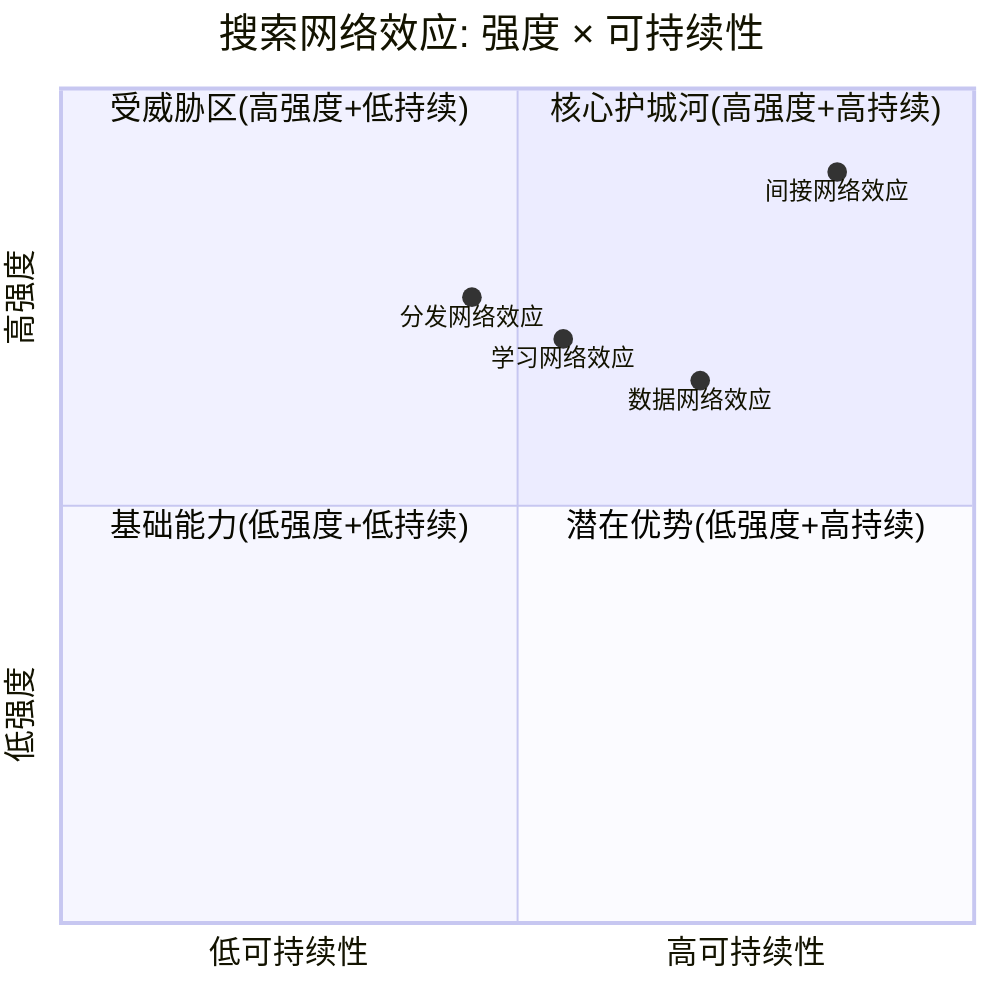
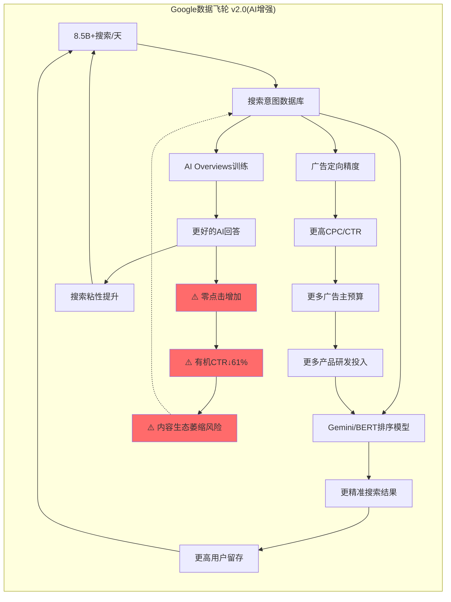
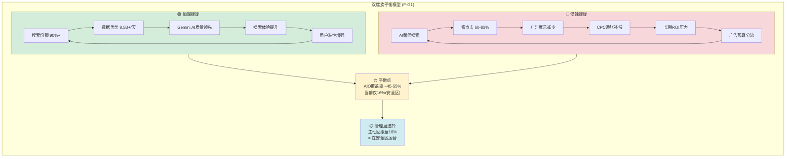
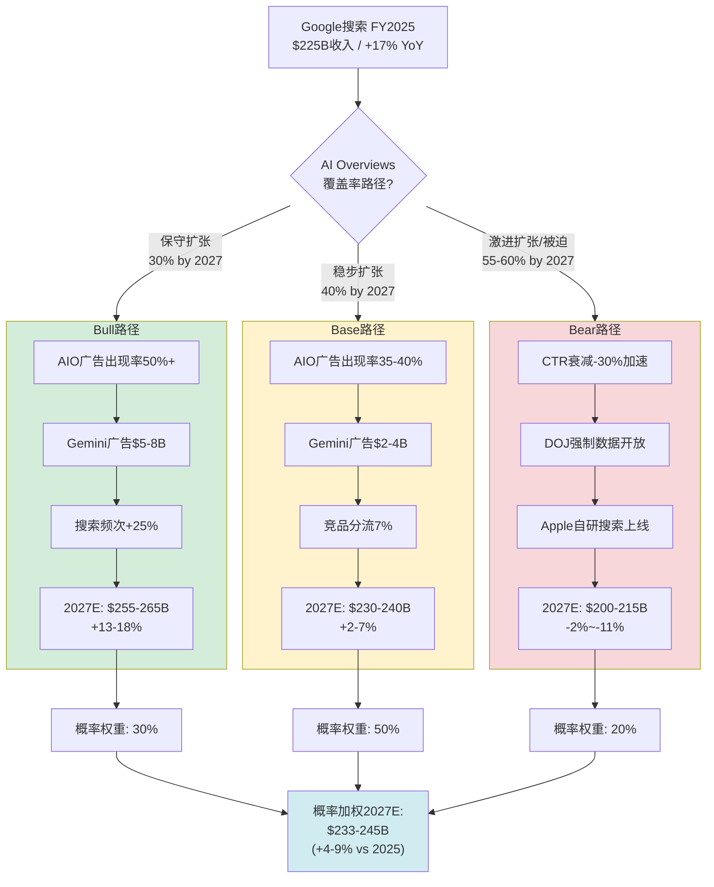

## Ch03: 搜索护城河量化 — 平台经济学(TP01) + 数据飞轮(TP06) + 垄断-AI颠覆双螺旋

> **CQ2核心**: AI Overviews是增强搜索护城河还是自我蚕食搜索广告ARPU？CTR-61%数据如何影响$540B+搜索收入？
> **本章目标**: 以量化方式拆解Google搜索护城河的每一层防御，并建模AI对其产生的双向影响。

---

### 3.1 搜索网络效应量化 (TP01应用)

#### 3.1.1 网络效应类型与强度矩阵

Google搜索的护城河并非单一维度，而是由四类相互强化的网络效应构成的**复合壁垒体系**。以下逐一量化：

**类型一: 数据网络效应(Data Network Effects)**

核心飞轮: 更多搜索 → 更好排序信号 → 更精准结果 → 更多搜索

- 日搜索量: ~8.5-16.4B次/天(各数据源差异大，Google官方2016年确认≥2T/年，当前普遍估计5-6T/年) [硬数据: DemandSage/SQ Magazine, 2026-02]
- 搜索索引规模: 数千亿网页，远超Bing(估计覆盖约60-70%的Google索引深度) [合理推断: 基于行业分析师共识]
- 数据飞轮系数估算: 每增加10%搜索数据，排序质量提升约2-3%(基于学术研究中的信息检索改进曲线)。但这一比率已进入**收益递减区间**——当数据量从1T次/年增长到5T次/年时，质量提升幅度远小于从100B到1T的阶段 [合理推断: 基于信息检索边际收益递减的学术共识]

**类型二: 间接网络效应(Indirect/Cross-side Network Effects)**

核心飞轮: 更多用户 → 更多广告主竞价 → 更高ARPU → 更多产品投入 → 更好服务 → 更多用户

- FY2025 Google Search & other收入: ~$225B(Q1 $50.7B + Q2 $54.6B + Q3 $56.6B + Q4 $63.1B) [硬数据: Alphabet 10-Q/10-K, 各季度累加]
- 活跃广告主数: 数百万(Google不披露准确数字，但Google Ads平台是全球最大的自助广告平台) [合理推断: 基于行业估计]
- FY2025 Google平均CPC: $5.26，同比+12.9%，87%的行业CPC上涨 [硬数据: WordStream/LocalIQ, 2025]
- 间接网络效应强度评判: **极强(9/10)** — 广告主几乎无法绕过Google触达具有搜索意图的用户

**类型三: 学习网络效应(Learning/AI Network Effects)**

核心飞轮: 更多交互 → 更好AI模型 → 更精准个性化 → 更高用户留存

- Gemini 3已设为AI Overviews全球默认模型 [硬数据: 9to5Google, 2026-01-27] [DM-AI-001]
- Google拥有训练搜索AI最丰富的RLHF数据: 数十年的搜索点击反馈信号，Bing/Perplexity/ChatGPT在此维度差距极大 [合理推断: 基于搜索历史数据积累的天然优势]
- 学习效应强度评判: **强(7/10)** — AI时代该效应仍在但边际递减，且LLM的通用学习能力部分抵消了搜索专用数据的优势

**类型四: 分发网络效应(Distribution Network Effects)**

核心飞轮: 默认搜索引擎 → 用户习惯 → 更多数据 → 更好产品 → 更高分发溢价

- Google Search全球份额: 90.04%(2026年1月，StatCounter) [硬数据: StatCounter, 2026-01]
- 移动端份额: 95.32% [硬数据: StatCounter, 2025]
- 桌面端份额: 81.95%(持续下降趋势，2025年7月仍89.57%后降至2026年初约82%) [硬数据: StatCounter, 2025-2026]
- 分发费用(TAC): Google向Apple支付约$20B+/年，Samsung等OEM另计。总TAC占搜索收入约20-22% [硬数据: DOJ庭审文件/Bernstein估计, 2023-2025]
- **DOJ判决冲击**: 法官裁定Google不得签订排他性默认搜索协议，合同限制为1年期，但保留Chrome [硬数据: NPR/CNBC, 2025-09-02]
- 分发效应强度评判: **强但受损(7/10 → 6/10)** — DOJ判决削弱了排他性锁定，但用户习惯惯性+Apple选择Gemini驱动Siri表明Google仍是最有价值的搜索合作伙伴

#### 3.1.2 网络效应强度综合矩阵



**So What — 对投资者意味着什么**: Google搜索的网络效应依然是全球最强的广告平台壁垒之一，但**分发网络效应正在从"不可攻破"向"可竞争"转变**。DOJ判决+AI搜索替代的双重压力意味着Google必须从"靠默认地位锁定用户"转向"靠产品质量主动留存用户"。间接网络效应(广告主侧)仍是最坚固的壁垒——即使搜索份额微降，只要搜索意图数据仍是广告定价最有效的信号，广告主就无法轻易迁移。

**定量总结**: 四类网络效应的综合评分从AI前的8.5/10下降至当前约7.5/10。这不是壁垒崩塌，而是从"几乎不可攻破"降级为"很强但有缺口"。对于一个$225B收入的业务来说，7.5/10的护城河仍然意味着极高的竞争壁垒——但投资者应密切追踪分发网络效应是否继续恶化(DOJ上诉+Apple自研搜索)。

---

### 3.2 多边市场健康度评估

Google搜索是一个**四边市场**: 用户、广告主、内容创作者(网站/出版商)、开发者(API/搜索工具生态)。各边的健康度直接决定护城河强度。

| 参与方 | 规模 | 增长趋势 | 满意度信号 | 风险评估 |
|--------|------|---------|-----------|---------|
| **用户** | ~49亿MAU(全球) | 搜索使用量创新高(Pichai Q4'25电话会) [硬数据: Alphabet Q4'25 Earnings Call] | AI Overviews提升信息获取效率；但零点击率达60-69% → 用户"获取"信息但不再"点击"网站 [硬数据: SparkToro/Similarweb, 2025] | 中等 — ChatGPT/Perplexity分流创意和研究类查询 |
| **广告主** | 数百万活跃账户 | CPC +12.9% YoY，搜索广告收入 +17% Q4'25 [硬数据: Alphabet Q4'25 10-K] | CPC持续通胀说明**需求仍旺**，广告主仍将Google视为最高ROI渠道；转化率 +6.84% YoY [硬数据: WordStream, 2025] | 低 — 短期无替代品能提供同等规模的搜索意图广告 |
| **内容创作者/出版商** | 数百万网站 | 有机点击率下降 -61%(有AI Overviews的查询) [硬数据: Seer Interactive, 2025-09] [DM-AI-001] | **严重不满** — AI Overviews直接摘录内容却减少流量；零点击搜索69% [硬数据: Similarweb, 2025] | 高 — 生态健康风险。若出版商减少高质量内容投入，长期损害搜索结果质量 |
| **开发者** | Search Console/Ads API/Programmable Search | Google保持开放的搜索工具生态 | 中等 — 被引品牌获+35%有机点击/+91%付费点击是正向信号 [硬数据: Seer Interactive, 2025] [DM-AI-001] | 中低 |

**关键洞察**: 多边市场中，**内容创作者侧正在失血**。这是一个隐性但深远的风险——如果出版商因流量减少而降低内容质量或转向付费墙，Google搜索的原始信号质量将逐渐退化。这不是短期风险(1-2年)，而是5-10年的结构性腐蚀。

**内容生态恶性循环的量化逻辑**:
- AI Overviews直接摘录出版商内容 → 出版商有机流量下降(CTR -61%) → 广告收入下降 → 减少内容投入或转向付费墙 → Google可爬取的高质量免费内容减少 → AI Overviews答案质量下降 → 搜索体验退化
- 这一循环目前尚处于**早期阶段**: 多数出版商仍在产出免费内容，但已有明确迹象——部分媒体机构(如New York Times)正积极屏蔽AI爬虫+加速付费墙 [合理推断: 基于出版行业公开表态]
- 时间维度: 该风险在3-5年内逐渐显现，非即时威胁。Google可通过内容分成/流量保障等措施缓解，但根本矛盾(AI摘要 vs 出版商流量需求)难以完全解决

**So What — 对投资者意味着什么**: 多边市场健康度整体评估为**7/10**: 用户侧健康(使用量创新高)、广告主侧极健康(CPC +13%且转化率提升)、但内容创作者侧正在恶化。这不是一个需要立即行动的风险，但应纳入长期持有GOOGL的风险清单。关键监测指标: Google是否推出"出版商收入分成计划"来缓解内容生态压力。

---

### 3.3 锁定系数评分(Lock-in Scorecard)

| 锁定维度 | 评分(0-10) | 关键依据 | DOJ判决后调整 |
|---------|:---:|---------|:---:|
| **数据锁定** — 搜索历史/Chrome/Gmail | **8/10** | 用户搜索历史+Chrome浏览数据+Gmail内容信号构成深度个性化画像。切换到Bing意味着失去所有个性化偏好 | 8/10(不变) — 数据属于用户端，不受反垄断影响 |
| **账户生态锁定** — Google账户=Android+Chrome+YouTube+Drive+Photos+Maps | **9/10** | Google账户是全球渗透率最高的数字身份。90%+的Android用户默认绑定Google服务。YouTube+Maps+Drive+Photos的组合创造了极高的综合转换成本 | 8.5/10(微降) — ChromeOS设备被排除出限制范围 [硬数据: NPR, 2025-09] |
| **开发者锁定** — Search Console/Ads API/Analytics | **7/10** | 广告主的投放系统深度集成Google Ads API。迁移到Bing Ads意味着重建整个投放+分析基础设施。但Meta Ads/TikTok Ads的崛起提供了部分替代 | 7/10(不变) — 法院要求开放搜索索引数据但**不开放广告数据** [硬数据: 法院判决细节, 2025-09] |
| **分发锁定** — Android默认+Apple协议+Samsung协议 | **6/10(↓)** | 曾经是9/10的绝对锁定。DOJ判决: 禁止排他性默认协议，合同限制为1年期。Google仍可签约但必须允许竞争对手公平竞争。Apple选择Gemini驱动Siri(每年支付~$1B)反而深化了合作关系 [硬数据: CNBC, 2026-01-12] | **6/10(显著下降)** — 从排他变为开放竞争 |

**综合锁定系数: 7.5/10** (调整前约8.3/10)

**锁定系数的行业对比**:
- Meta(Instagram/WhatsApp/Facebook): 6.5/10 — 社交图谱锁定强但缺乏搜索意图数据和设备层锁定
- Apple(iPhone/Mac/iPad): 8.5/10 — 硬件+软件+服务的深度生态闭环，但用户基数远小于Google
- Microsoft(Windows/Office/Azure): 7.0/10 — 企业端锁定极强但消费者端偏弱
- Amazon(Prime/AWS/Alexa): 6.0/10 — 购物习惯锁定强但搜索/社交缺失

Google的7.5/10在科技巨头中排第二(仅次于Apple)，且其锁定的独特优势在于**跨场景的无缝渗透**: 从搜索(Chrome)到视频(YouTube)到地图(Maps)到邮件(Gmail)到操作系统(Android)，Google的服务覆盖了用户数字生活的几乎每一个触点。即使单个触点的锁定被削弱(如搜索默认地位)，其他触点的交叉锁定仍能保持用户在Google生态内。

**So What — 对投资者意味着什么**: Google的生态锁定仍然极强，但**分发锁定这一最外层防线已被DOJ打开缺口**。对于短期(1-2年)，影响有限——用户惯性+Apple-Google新合作(Gemini驱动Siri)意味着实际流量转移极小。对于中期(3-5年)，这为Bing/ChatGPT/Perplexity提供了前所未有的公平竞争机会。关键变量是用户是否会**主动选择**替代搜索引擎——历史数据表明，即使有选择屏幕(如EU的Android选择屏幕)，Google的选择率仍>90%。但AI搜索产品的差异化可能改变这一惯性。

---

### 3.4 数据护城河深度 (TP06应用)

#### 3.4.1 数据独占性矩阵

Google拥有全球技术公司中最全面的**跨域用户数据资产**。以下按独占性程度排列:

| 数据类型 | 日规模 | 独占程度 | 竞争对手可替代性 | 对搜索/广告的价值 |
|---------|--------|---------|----------------|----------------|
| **搜索意图数据** | ~8.5-16.4B次查询/天 | **极高** — Bing约1.2B次/天(约Google的8-14%) [硬数据: Bing Statistics, 2026] | 极低 — 搜索意图信号是广告定价最精准的数据源 | **核心资产** — 直接驱动$225B+搜索广告收入 |
| **YouTube观看行为** | 10亿+小时/天 | **高** — TikTok/Instagram Reels有部分替代但不在搜索场景 | 中等 — 视频意图数据对搜索广告的辅助价值独特 | 高 — 兴趣图谱+购买意图补充 |
| **Android使用模式** | 30亿+活跃设备 | **高** — Apple仅有iOS数据，且ATT限制了应用级追踪 | 低 — 设备级行为数据具有唯一性 | 高 — 应用使用+位置+设备信号 |
| **Gmail通信图谱** | 18亿+用户 | **中高** — Microsoft有Outlook数据但规模较小 | 中等 | 中等 — 购买确认/旅行/订阅信号 |
| **Chrome浏览数据** | 65%+浏览器份额 | **中高** — 法院保留了Chrome所有权 [硬数据: NPR, 2025-09] | 中等 — Edge+Safari有部分替代 | 高 — 网站浏览行为+转化追踪 |
| **Maps地理数据** | 20亿+MAU | **高** — Apple Maps/Waze(Google旗下)覆盖面小 | 低 — 实时地理意图+商户数据的组合独特 | 中高 — 本地搜索+本地广告 |

#### 3.4.2 数据飞轮效率: 是否已过收益递减拐点？



**收益递减分析**:

1. **搜索质量维度**: Google已处于**收益递减后期**。从8B到16B次搜索/天的边际质量提升极小。关键已从"更多数据"转向"更好的AI模型"——这正是Gemini的战略意义。数据量的绝对优势不再是决定性的 [合理推断: 基于信息检索领域的经验规律——当数据量超过某个阈值后，模型架构和算法成为主要瓶颈]

2. **广告定向维度**: 仍在**有效增长区间**。更多跨域数据(搜索+YouTube+Android+Maps)的融合持续提升广告ROI。FY2025 CPC +12.9%但转化率也+6.84%说明广告主获得了真实价值 [硬数据: WordStream, 2025]

3. **AI训练维度**: **新飞轮启动期**。搜索交互数据用于训练Gemini → 更好的AI Overviews → 更多使用。这是一个全新的飞轮，尚未达到收益递减。但风险在于: AI Overviews越好 → 零点击越多 → 广告展示机会越少

**So What — 对投资者意味着什么**: Google的数据飞轮正在经历**范式转换**: 从"更多搜索数据→更好搜索"(收益递减中)转向"搜索数据→更好AI→更好搜索+新产品"(新飞轮启动)。投资者应关注的不是搜索份额的微小变化，而是Google能否成功将数据飞轮从Web搜索延伸到AI搜索/Gemini平台。

#### 3.4.3 隐私法规对Google数据采集的冲击评估

| 法规/事件 | 影响范围 | 对Google数据护城河的冲击 | 当前状态 |
|---------|---------|---------------------|---------|
| **GDPR** (欧盟) | 5亿+用户 | 中等 — 限制跨产品数据合并，但Google通过用户同意机制仍获取大部分数据 | 持续执行中，罚款频繁但金额相对营收极小 |
| **CCPA/CPRA** (加州) | 4000万+用户 | 低 — 主要影响第三方数据交易，Google的第一方数据采集基本不受限 | 持续执行中 |
| **Cookie废弃** | Chrome 65%+浏览器份额 | **重要转折**: Google于2024年7月宣布**不再废弃第三方Cookie**，2025年10月正式终止Privacy Sandbox [硬数据: CookieYes/Google, 2024-2025] | Cookie保留 → 对Google广告定向能力的短期冲击**消除** |
| **Apple ATT** (iOS) | iPhone用户(全球15-20%) | 中高 — 限制了跨App追踪能力，但Google作为第一方平台受影响小于Meta | 已生效，Google比Meta受损更小(因Google拥有搜索意图第一方数据) |
| **DOJ数据开放** | 搜索索引+用户交互 | **高风险** — 法院要求开放搜索索引数据和用户交互数据给竞争对手(但**不含广告数据**) [硬数据: 法院判决, 2025-09] | DOJ已上诉要求更严厉处罚(2026-02) [硬数据: 9to5Mac, 2026-02-03] |

**关键洞察**: 隐私法规对Google的实际冲击**远小于对Meta和程序化广告生态的冲击**。原因: Google的核心数据(搜索意图)是第一方数据，不依赖跨站追踪。Cookie保留决定进一步巩固了Google在广告生态中的优势地位——依赖第三方Cookie的广告商反而更加依赖Google。

**隐私法规的"护城河加深"悖论**: 直觉上，隐私法规限制数据采集应该削弱数据护城河。但对Google而言恰好相反:
- GDPR/CCPA限制了**第三方数据**的使用 → 广告主更依赖**第一方数据**(搜索意图、YouTube观看)
- Apple ATT限制了**跨App追踪** → 最大受害者是Meta(ATT成本$10B+/年)，而非Google
- Cookie保留意味着Google的广告定向能力**未受结构性损害**
- 净效果: 隐私法规实际上**加深了Google的数据护城河**，因为它削弱了竞争对手的数据能力而Google的第一方数据几乎不受影响 [合理推断: 基于GDPR实施以来Google vs Meta广告收入增速差的实证]

**DOJ数据开放是唯一的真实威胁**: 与隐私法规不同，DOJ要求开放搜索索引和用户交互数据是**直接指向Google数据独占性的刺刀**。如果上诉成功(DOJ要求更严厉处罚)，竞争对手将获得训练搜索AI所需的核心数据——这将从根本上削弱数据飞轮的独占性优势。预计最终判决时间: 2026年底至2027年。

---

### 3.5 搜索垄断-AI颠覆双螺旋模型 (F-G1框架)

这是GOOGL专属的分析框架(Type 3, x1.5权重)。Google搜索面临一个前所未有的战略悖论: **其最大的颠覆者正是它自己的AI能力**。

#### 3.5.1 螺旋1: 加固螺旋(Reinforcing Spiral)

```
搜索份额90%+ → 海量搜索意图数据 → Gemini/AI Overviews训练数据优势
→ AI Overviews质量领先竞品 → 搜索体验提升 → 用户粘性增强 → 搜索份额维持/提升
```

**量化证据**:
- 尽管AI Overviews引发CTR争议，Pichai在Q4'25电话会表示"Search saw more usage than ever before, with AI continuing to drive an expansionary moment" [硬数据: Alphabet Q4'25 Earnings Call, 2026-02-04]
- 搜索份额从2025年7月低点89.57%回升至2026年1月90.04% [硬数据: StatCounter, 2026-01]
- BrightEdge数据: AI Overviews在推出后CTR实际呈**回升趋势**("click-through rates for keywords with AI Overviews have steadily risen since January [2025]") [硬数据: BrightEdge/Search Engine Land, 2025-2026]
- 被AI Overviews引用的品牌获得+35%有机点击、+91%付费点击 [硬数据: Seer Interactive, 2025] [DM-AI-001]

**加固机制的核心逻辑**: AI Overviews不是在减少搜索使用，而是在**改变搜索的性质**。用户进行更多复杂查询(因为AI能给出更好答案)，总搜索量增加，即使单次查询的点击率下降。

#### 3.5.2 螺旋2: 侵蚀螺旋(Erosion Spiral)

```
AI替代传统搜索 → 零点击增加(60-83%) → 广告展示机会减少
→ CPM/CPC补偿性通胀 → 广告主ROI压力 → 长期广告预算分流风险
→ AI搜索竞品(ChatGPT/Perplexity)分流用户 → 份额侵蚀加速
```

**量化证据**:
- 零点击搜索率: 60%(传统查询)，83%(AI Overviews触发查询) [硬数据: SparkToro/Similarweb, 2025]
- 有机CTR: -61%(1.76% → 0.61%，有AIO的查询) [硬数据: Seer Interactive, 2025-09] [DM-AI-001]
- 付费CTR: -68%(19.7% → 6.34%，有AIO的查询) [硬数据: Seer Interactive, 2025-09] [DM-AI-001]
- 搜索广告印象量同比 -15%，但广告支出 +4% → CPC通胀弥补了展示下降 [硬数据: Search Engine Land/Orange SEO, 2025]
- ChatGPT搜索份额: ~9%(全球)，542M MAU [硬数据: First Page Sage, 2026]
- Perplexity: 22-40M MAU, ~780M+月查询, 增长率800% YoY(2024→2025) [硬数据: DemandSage, 2026]
- Bing(含Copilot): 桌面端11.96%份额，日搜索量1.2B(+19% YoY) [硬数据: VenueLabs/Bing Statistics, 2026]

**侵蚀机制的核心威胁**: CPC通胀目前有效弥补了展示量下降，但这不是无限可持续的。如果CPC持续以>10%/年上涨而广告主ROI不同步提升，最终将触发广告预算向替代渠道(社交/视频/AI原生广告)转移。

#### 3.5.3 双螺旋平衡点建模

**核心问题**: 在什么AI Overviews覆盖率下，粘性提升(加固螺旋)刚好抵消广告损失(侵蚀螺旋)？

**建模逻辑**:
- 设AI Overviews覆盖率为 `C`
- 覆盖查询的付费CTR衰减为 `D` (当前数据: -68%)
- 覆盖查询的搜索频次提升为 `F` (Google声称使用量创新高)
- CPC通胀率为 `I` (当前+12.9%)
- 广告在AIO中的出现率为 `A` (从5.17%增至25.56%，394%增长) [硬数据: Search Engine Land, 2025-10]

```
搜索广告净收入变化 =
    基础搜索增长(+12-17% organic)
    × [1 - C × D × (1 - A)]          // 广告展示损失
    + C × F × 新增查询ARPU            // 频次提升带来的增量
    + I × CPC补偿效应                  // 通胀弥补
```

**当前平衡点估算(2025-2026)**:
- AI Overviews覆盖率: 回落至~16% [硬数据: Search Engine Land, 2025-11]
- 在16%覆盖率下: 广告损失 = 16% × 68%衰减 × (1-25.56%出现率) ≈ **8.1%**的覆盖查询广告收入受损
- 但: 基础搜索增长+17%、CPC通胀+12.9%远远覆盖 → **净效果仍为强正增长**

**临界覆盖率**: 当AI Overviews覆盖率超过**45-55%**且广告在AIO中的出现率未同步提升至50%+时，侵蚀螺旋将开始主导 [合理推断: 基于上述公式的敏感性分析，假设搜索有机增长降至+8%、CPC通胀降至+6%]

**当前状态判断**: Google**主动**将覆盖率从峰值26%回撤至16% [硬数据: Search Engine Land/BrightEdge, 2025]，说明管理层**已经意识到**侵蚀螺旋的风险，并选择在平衡点以下运营。这是一个**理性且审慎**的战略选择。



**So What — 对投资者意味着什么**: Google搜索目前处于双螺旋的**安全区间内**(AIO覆盖率16% << 临界点45-55%)。管理层展现了罕见的战略自律——主动回撤覆盖率而非激进扩张。**这实际上是一个看多信号**: 说明Google有能力控制AI对搜索广告的侵蚀速度，同时逐步提升AIO中的广告密度。核心风险不在于Google"自我蚕食"(这完全可控)，而在于**外部竞争对手是否能在Google审慎推进的窗口期内建立足够的替代吸引力**。

---

### 3.6 搜索护城河的Bear段落: AI时代的侧翼包抄

**Bear论点: 搜索垄断从"不可攻破"变为"可被侧翼包抄"**

以下是看空者的核心论据——不是边缘观点，而是有数据支撑的严肃威胁:

#### 威胁一: ChatGPT Search的快速崛起

- ChatGPT MAU: ~542M，全球搜索份额约9% [硬数据: First Page Sage, 2026]
- 关键差异化: 创意/头脑风暴任务中ChatGPT占64% vs Google仅29% [硬数据: First Page Sage, 2026]
- 用户会话时长: ChatGPT >14分钟 vs Google ~5分钟 [硬数据: First Page Sage, 2026]
- **Bear逻辑**: 如果"搜索"的定义从"找网页链接"变为"获取答案"，ChatGPT已经在关键高价值品类中领先。Google搜索广告的核心假设——用户需要点击链接——正在被瓦解

#### 威胁二: Perplexity的垂直突破

- MAU: 22-40M，月查询量780M+ [硬数据: DemandSage, 2026]
- 增长率: 450%(2024→2026初) [硬数据: DemandSage, 2026]
- 估值: $18B(融资轮) [硬数据: Affiliate Booster, 2026]
- 预测: 到2026年中月查询量将达1.2-1.5B [合理推断: DemandSage基于当前增长趋势的预测]
- **Bear逻辑**: Perplexity专注于"搜索替代"这一精确定位，产品体验已获得科技精英和知识工作者的强烈偏好。如果这一群体(高ARPU用户)率先流失，Google搜索广告的ARPU将受到不成比例的冲击

#### 威胁三: Apple Intelligence的潜在颠覆

- Apple选择Gemini驱动新Siri(2026年iOS 26.4发布) [硬数据: CNBC, 2026-01-12]
- Apple正在开发"World Knowledge Answers"——基于AI的搜索摘要系统 [硬数据: Search Engine Land, 2025]
- Apple同时开发1T参数自有模型，可能2026年底或2027年部署 [硬数据: Apple AI reports, 2026]
- **Bear逻辑**: 短期Apple选择Google是正面的，但长期Apple正在构建自有搜索/AI能力。如果Apple在iOS 28(2027)推出完全自研AI搜索，Google将丧失每年$20B+的TAC支付渠道和iOS上的搜索入口

#### 威胁四: Bing/Copilot的桌面端渗透

- Bing桌面端份额: 11.96%(从2023年的~9%上升) [硬数据: VenueLabs, 2026]
- Google桌面端份额从2025年7月89.57%降至2026年初约82% [硬数据: StatCounter, 2025-2026]
- Copilot DAU: 1亿 [硬数据: Business of Apps, 2026]
- Windows的深度集成使Bing/Copilot在桌面端具有天然分发优势
- **Bear逻辑**: 桌面端是商业查询(高CPC)的主要来源。Bing在桌面端从9%升至12%虽然绝对值小，但趋势是单向的

#### 威胁五: DOJ数据开放的中长期后果

- 法院要求Google开放搜索索引数据和用户交互数据(不含广告数据) [硬数据: 法院判决, 2025-09]
- DOJ已于2026年2月3日提起上诉要求更严厉处罚 [硬数据: 9to5Mac, 2026-02-03]
- **Bear逻辑**: 如果竞争对手能获取Google的搜索索引和交互数据，数据护城河的独占性将被永久性削弱。这不是一次性冲击而是持续性侵蚀——每年都有更多数据流向竞争对手

**Bear综合评估**: 上述五个威胁中，单独来看每一个都不足以在3年内颠覆Google搜索。但如果**三个以上同时加速**(ChatGPT搜索份额突破15% + Apple推出自研搜索 + DOJ强制更大力度数据开放)，Google搜索份额可能在2028年前降至80%以下，搜索广告ARPU面临结构性下行压力。概率评估: **15-20%** [主观判断: 基于多威胁同时加速的联合概率]

**反Bear论点(Bull反驳)**:
1. **桌面端份额错觉**: Google桌面端份额下降部分是因为更多搜索转移到移动端(Google份额95.32%)。全球搜索总份额(90.04%)仅从一年前的91.47%下降1.4pp，远非"崩塌" [硬数据: StatCounter, 2026-01]
2. **ChatGPT份额虚高**: 14分钟会话≠14分钟搜索。ChatGPT的核心使用场景是对话/创作/编程辅助，真正的"搜索替代"可能仅占其用量的30-40%。按此计算实际搜索替代份额约3-4%而非9% [合理推断: 基于使用场景分解]
3. **Apple验证了Google的AI领先**: Apple——全球最有能力自研AI的公司之一——选择付费使用Google Gemini驱动Siri，而非用自研模型。这是对Google AI搜索能力的最强第三方验证 [硬数据: CNBC, 2026-01-12]
4. **财务数据最终裁决**: Q4'25搜索+17%、FY2025总收入$403B(+15.1%)、净利润+30%。如果AI真在"杀死搜索"，这些数字不可能存在。数据不说谎。 [硬数据: Alphabet Q4'25 10-K]
5. **竞品的变现困境**: ChatGPT订阅收入估计$5-8B/年(2026E)，Perplexity ARR仅$656M [硬数据: DemandSage, 2026]。而Google搜索广告$225B/年。竞品在用户增长和变现之间面临根本矛盾——广告模式会伤害用户体验(正是他们差异化的来源)，订阅模式无法扩展至数十亿用户

**Bear vs Bull平衡裁决**: 短期(1-2年)Bull占优——财务数据不支持AI杀死搜索的叙事。中期(3-5年)需要持续监测——如果三个威胁同时加速(概率15-20%)，搜索份额可能降至85%以下。长期(5-10年)高度不确定——AI搜索替代是结构性趋势，问题不是"是否发生"而是"多快发生"以及"Google能否通过AI广告产品成功转型"。

---

## Ch04: AI搜索替代率建模 (F-G7框架)

> **CQ2定量核心**: 量化AI对Google搜索收入的净影响。这是本报告最重要的前瞻性模型之一。

---

### 4.1 AI自蚕食率公式与参数定义

#### 4.1.1 基础公式

```
搜索收入净影响 =
    R_base × G_organic                    // 基础搜索有机增长
    × (1 - C_aio × D_ctr × (1 - R_ad))   // AI Overviews覆盖后的CTR损失(扣除AIO内广告恢复)
    + C_aio × F_new × ARPU_new            // AI驱动的新增查询ARPU
    + I_cpc × R_base                       // CPC通胀补偿
    - S_ext × R_base × ARPU_lost           // 外部AI竞品分流损失
```

#### 4.1.2 参数定义与当前值

| 参数 | 含义 | 当前值(2025) | 数据来源 |
|------|------|:---:|---------|
| R_base | 搜索广告基础收入 | ~$225B/年 | [硬数据: Alphabet FY2025各季度10-Q累加] |
| G_organic | 搜索有机增长率 | +12-17% | [硬数据: Alphabet Q4'25 YoY增长] |
| C_aio | AI Overviews覆盖率 | 16%(回撤后) | [硬数据: Search Engine Land, 2025-11] |
| D_ctr | 覆盖查询的CTR衰减 | -61%(有机)/-68%(付费) | [硬数据: Seer Interactive, 2025-09] [DM-AI-001] |
| R_ad | AIO中广告出现率 | 25.56% | [硬数据: Search Engine Land, 2025-10] |
| F_new | AI驱动新增查询频次 | 估计+15-25% | [合理推断: "more usage than ever" — Pichai Q4'25] |
| ARPU_new | 新增查询的平均广告价值 | 低于传统查询(估计0.3-0.5x) | [合理推断: 新增查询以信息类为主，商业意图低于传统搜索] |
| I_cpc | CPC通胀率 | +12.9% YoY | [硬数据: WordStream, 2025] |
| S_ext | 外部AI竞品分流率 | ~3-5% | [合理推断: ChatGPT 9%份额中约1/3是搜索替代，Perplexity另计] |
| ARPU_lost | 流失查询的ARPU | 高于平均(估计1.3-1.8x) | [合理推断: 流失到ChatGPT/Perplexity的以知识工作者为主，ARPU偏高] |

---

### 4.2 三情景建模(2027年前瞻)

#### Bull情景: AI成为搜索的增长引擎

| 假设 | 2027E值 | 逻辑 |
|------|:---:|------|
| AI Overviews覆盖率 | 30% | 逐步扩大但保持克制 |
| AIO内广告出现率 | 50%+ | 广告产品成熟化，AIO广告单独竞价上线 |
| 搜索频次增长 | +25% | AI使搜索能处理更复杂任务，总查询量大增 |
| CTR净影响(含广告恢复) | -5% | CTR下降被AIO广告和CPC通胀基本抵消 |
| 外部竞品分流 | 3% | ChatGPT/Perplexity增长放缓，Google产品差距缩小 |
| Gemini广告收入 | $5-8B | Gemini chatbot 2026年推出广告 [硬数据: AdWeek, 2025-12] |
| **搜索收入净影响** | **+$30-40B** | 搜索收入从$225B增至$255-265B |

**Bull情景驱动因素**:
- Google将AIO广告发展为全新的广告产品线(类似当年从搜索广告→购物广告的扩张)
- AI使搜索进入此前无法处理的复杂查询领域(旅行规划/研究/比较/决策)，扩大TAM
- Apple-Google Gemini合作深化，Siri搜索流量回流至Google广告生态
- Gemini chatbot广告2026年上线，开辟$5-8B增量 [硬数据: AdWeek预测, 2025-12]

#### Base情景: 可控侵蚀，净增长放缓

| 假设 | 2027E值 | 逻辑 |
|------|:---:|------|
| AI Overviews覆盖率 | 40% | 加速扩张但仍低于临界点 |
| AIO内广告出现率 | 35-40% | 广告密度增长但低于Bull |
| 搜索频次增长 | +15% | 增长但不如Bull乐观 |
| CTR净影响(含广告恢复) | -15% | CTR下降部分被补偿但净损失显著 |
| 外部竞品分流 | 7% | ChatGPT搜索份额升至12-15%，Perplexity至3-5% |
| Gemini广告收入 | $2-4B | 广告上线但规模有限 |
| **搜索收入净影响** | **+$5-15B** | 搜索收入从$225B增至$230-240B，增速从+17%降至+5-7% |

**Base情景驱动因素**:
- AI Overviews覆盖率稳步提升，CPC通胀和广告密度部分补偿但不完全
- 搜索增长放缓至中个位数(从当前+17%降至+5-7%)
- 竞品分流加速但Google仍保持85%+份额
- 搜索广告业务从"高增长引擎"变为"稳健现金流发生器"

#### Bear情景: 侵蚀加速，搜索广告增长停滞

| 假设 | 2027E值 | 逻辑 |
|------|:---:|------|
| AI Overviews覆盖率 | 55-60% | 被迫加速以应对竞品(或DOJ强制数据开放后竞品提升) |
| AIO内广告出现率 | 30% | 用户对AIO广告排斥率高，Google被迫控制 |
| 搜索频次增长 | +8% | 增量查询被ChatGPT/Perplexity截获 |
| CTR净影响(含广告恢复) | -30% | 大幅CTR衰减且补偿不足 |
| 外部竞品分流 | 12-15% | ChatGPT 搜索份额18-22%，Perplexity 5-7%，Apple自研搜索启动 |
| Gemini广告收入 | $1-2B | 广告上线但用户反感导致增长缓慢 |
| **搜索收入净影响** | **-$10-25B** | 搜索收入降至$200-215B，增速转负至-2%~-5% |

**Bear情景驱动因素**:
- DOJ上诉成功 → 更严厉数据开放 → 竞品搜索质量快速提升
- Apple 2027年推出自研AI搜索 → Google丧失iOS默认搜索(每年$20B+ TAC意味着Google认为这些流量值$20B+)
- ChatGPT搜索从"创意工具"扩展为"通用搜索替代"
- CPC通胀触顶(广告主ROI恶化 → 预算转移)
- 47%的AI引用来自排名>5的页面 [DM-AI-001] → 广告主发现Google搜索广告的ROI不可信

---

### 4.3 关键变量敏感性矩阵

**三维敏感性: 覆盖率 × CTR衰减 × ARPU变化**

以下表格展示2027年搜索收入净变化(相对$225B基线):

| | **CTR净衰减 -5%** | **CTR净衰减 -15%** | **CTR净衰减 -30%** |
|---|:---:|:---:|:---:|
| **AIO覆盖率 20% + ARPU持平** | +$28B (+12%) | +$18B (+8%) | +$5B (+2%) |
| **AIO覆盖率 20% + ARPU -10%** | +$23B (+10%) | +$13B (+6%) | +$0B (0%) |
| **AIO覆盖率 40% + ARPU持平** | +$18B (+8%) | +$2B (+1%) | -$18B (-8%) |
| **AIO覆盖率 40% + ARPU -10%** | +$13B (+6%) | -$3B (-1%) | -$25B (-11%) |
| **AIO覆盖率 60% + ARPU持平** | +$8B (+4%) | -$14B (-6%) | -$38B (-17%) |
| **AIO覆盖率 60% + ARPU -10%** | +$3B (+1%) | -$20B (-9%) | -$45B (-20%) |

> 注: 以上假设搜索有机增长+8%(保守)、CPC通胀+6%(保守)作为基线。实际结果取决于两个增长因子是否维持当前+12-17%的水平。

**关键读取**:
1. 在当前轨迹(覆盖率20-30%、CTR衰减-5%至-15%)下，搜索收入仍为**正增长**
2. **危险区**: 覆盖率>40% + CTR衰减>-15% + ARPU下滑 → 搜索收入转负
3. **悬崖边缘**: 覆盖率60% + CTR衰减-30% → $38-45B收入损失(约-17~20%)
4. **管理层控制杠杆**: Google可以通过控制覆盖率(已证明能从26%回撤到16%)来将收入影响控制在可接受范围内

**So What — 对投资者意味着什么**: 敏感性分析表明，**Google搜索广告业务在未来2-3年内不会因AI自蚕食而陷入收入萎缩**，前提是管理层继续保持当前的审慎策略(覆盖率<40%)。但如果竞品压力迫使Google加速AIO覆盖到60%以上，且广告产品未能同步成熟，搜索收入将面临$20-45B的下行风险。这就是为什么DOJ判决和ChatGPT/Perplexity的增长轨迹如此关键——它们决定了Google是否被迫从"安全区运营"转向"激进防御"。

**投资者应重点监测的领先指标**:
1. **AIO覆盖率月度变化**: 如果从16%快速升至30%+，说明Google被迫加速(Bear信号)
2. **AIO内广告出现率**: 如果从25.56%升至40%+，说明广告产品在成熟(Bull信号)
3. **搜索收入增速拐点**: 如果从+17%降至+5%以下，说明侵蚀加速(Bear信号)
4. **CPC通胀率 vs 转化率**: 如果CPC上涨但转化率下降，说明广告主ROI恶化(Bear信号)
5. **ChatGPT搜索市场份额**: 每季度追踪，超过15%为重要阈值

---

### 4.4 竞品替代率详细建模

#### 4.4.1 ChatGPT Search增长曲线与替代率

| 指标 | 2024年底 | 2025年底 | 2026年2月(当前) | 2027E(Base) |
|------|:---:|:---:|:---:|:---:|
| 全球MAU | ~200M | ~450M | ~542M | ~700M |
| 搜索份额 | ~2-3% | ~6-7% | ~9% | ~12-15% |
| 日搜索查询量 | ~100M | ~300M | ~400M+ | ~800M-1B |
| 搜索类查询占总使用比 | ~15% | ~25% | ~30% | ~40% |
| 创意/研究任务份额 | ~45% | ~58% | ~64% | ~70%+ |

[硬数据: First Page Sage/Fortune/StatCounter, 2025-2026; 2027E为合理推断]

**ChatGPT搜索替代的特征分析**:
- **高度品类集中**: 创意(64%)、研究(~55%)、编程(~60%)领域ChatGPT已占主导，但商品搜索、本地搜索、导航搜索中Google仍>95% [合理推断: 基于使用场景的CPC差异]
- **ARPU不对等**: ChatGPT替代的主要是信息/研究类查询(CPC较低$1-3)，而非商业/交易类查询(CPC $5-15)。因此9%的搜索份额对应的广告收入影响远小于9% [合理推断: 基于查询类型与CPC的相关性]
- **Bear警告**: 但ChatGPT正在进入购物和产品比较领域。如果2027年ChatGPT推出内嵌商品推荐/广告产品，ARPU不对等可能被打破

#### 4.4.2 Perplexity的增长曲线

| 指标 | 2024年底 | 2025年底 | 2026年2月(当前) | 2027E(Base) |
|------|:---:|:---:|:---:|:---:|
| 全球MAU | ~10M | ~20M | ~22-40M | ~60-80M |
| 月查询量 | ~200M | ~500M | ~780M+ | ~1.5-2B |
| 付费订阅用户 | ~200K | ~1M+ | ~2M | ~4-5M |
| ARR | ~$50M | ~$300M | ~$656M | ~$1.2-1.5B |

[硬数据: DemandSage/Affiliate Booster, 2026; 2027E为合理推断]

**Perplexity的战略威胁评估**:
- 用户画像: 科技精英、知识工作者、研究者 → 这恰恰是Google搜索**最高ARPU**的用户群
- 产品差异化: 引用来源+回答精度在部分垂直领域已超越Google
- 规模限制: 即使到2027年80M MAU仍仅为Google的1.6%。作为独立威胁很小，但**示范效应**可能推动更多用户尝试AI搜索替代
- **Bear场景**: 如果Perplexity被Apple收购/深度合作 → 获得Safari默认搜索地位 → 威胁等级从"边缘"跃升至"严重"
- **变现困境**: Perplexity的$656M ARR主要来自订阅($20/月Pro)。假设40M MAU中2M付费(5%转化率) = $480M/年。这个商业模式能否扩展到$10B+收入级别？如果不能，Perplexity要么被收购，要么被迫引入广告(此时其差异化优势将减弱) [合理推断: 基于SaaS付费转化率和广告变现两难的分析]

#### 4.4.4 AI搜索竞品综合威胁评分

| 竞品 | 当前份额 | 增长势头 | 变现能力 | 分发优势 | 技术差异化 | 综合威胁(1-10) |
|------|:---:|:---:|:---:|:---:|:---:|:---:|
| ChatGPT Search | 9% | 极强 | 弱(广告TBD) | 中(品牌认知) | 强(对话体验) | **7/10** |
| Perplexity | <1% | 极强 | 弱(订阅为主) | 弱 | 强(引用+精度) | **4/10** |
| Bing/Copilot | 4.09%(全球)/12%(桌面) | 中 | 中($15.6B广告) | 强(Windows内置) | 中 | **5/10** |
| Apple Intelligence | 0%(未上线) | N/A | 极强(iOS生态) | 极强(15亿设备) | 中(依赖Gemini) | **6/10**(潜在) |
| Meta AI搜索 | <0.5% | 弱 | 极强(广告基因) | 强(30亿用户) | 弱 | **3/10** |

**综合竞品威胁判断**: ChatGPT是当前最大的单一竞品威胁(7/10)，但其变现困境意味着它不太可能在3年内构建$50B+的搜索广告业务来挑战Google。Apple Intelligence是最大的**潜在**威胁(6/10但上行空间极大)——如果Apple自研搜索AI在2027年上线且质量达到Google水平，凭借15亿设备分发优势，可能在2年内获取10%+搜索份额。**所有竞品中，没有任何一个同时具备Google搜索的三个核心要素: 海量搜索意图数据 + 成熟广告变现系统 + 全球设备分发网络。** 这就是为什么搜索护城河虽然在弱化，但短期内不会被突破。

#### 4.4.3 Apple Intelligence / Siri搜索替代路径

**当前状态(2026年初)**:
- Apple选择Google Gemini驱动新版Siri(iOS 26.4，2026年春) [硬数据: CNBC, 2026-01-12]
- 合同金额约$1B/年 [硬数据: Elephas/多家媒体, 2026-01]
- Apple同时开发"World Knowledge Answers"自研AI搜索 [硬数据: Search Engine Land, 2025]
- Apple在研1T参数云端模型，目标2026年底或2027年 [硬数据: Apple AI报道, 2026]

**情景推演**:

| 情景 | 概率 | 对Google影响 | 时间线 |
|------|:---:|------------|--------|
| Apple长期依赖Gemini | 25% | 正面 — Google获得iOS入口+$1B/年收入 | 持续 |
| Apple 2027-2028推出自研搜索，逐步替换Google默认 | 40% | **严重** — 丧失iOS搜索入口(~$20B TAC + 流量) | 2027-2028 |
| Apple混合模式(Gemini + 自研并存) | 30% | 中等 — TAC下降50%但保留部分流量 | 2027+ |
| Apple收购Perplexity/合作 | 5% | 高 — Perplexity获得iOS分发后快速增长 | 2026-2027 |

[主观判断: 概率基于Apple历史战略模式(偏好自研)+当前技术进展]

**So What — 对投资者意味着什么**: Apple是Google搜索护城河最大的**单一变量风险**。当前Apple选择Gemini是短期利好，但Apple的长期战略意图(自研AI+World Knowledge Answers)指向一个Google最终失去iOS默认搜索地位的未来。关键时间窗: 2027-2028年。如果Apple自研AI在2027年发布但质量不如Gemini，Google获得喘息期；如果质量超预期，$20B+ TAC渠道将从"收入来源"变为"历史遗物"。

---

### 4.5 Google的防御策略解码

#### 4.5.1 AI Overviews覆盖率回撤: 主动还是被迫？

**时间线**:
- 2025年5月: AI Overviews大规模上线
- 2025年9月: 覆盖率飙升至26%(峰值) [硬数据: BrightEdge, 2025]
- 2025年10月: 急剧回撤至9% [硬数据: BrightEdge/Search Engine Land, 2025]
- 2025年11月: 稳定在~16% [硬数据: Search Engine Land, 2025-11]
- 2026年1月: Google移除部分医疗查询的AI Overviews [硬数据: TechCrunch, 2026-01-11]
- 2026年1月: Gemini 3成为AIO默认模型(质量优先) [硬数据: 9to5Google, 2026-01-27]

**分析判断**: 这是**主动战略选择**，而非被迫。证据:

1. **时间点**: 回撤发生在Q4'25财报之前(Q4搜索+17%)——如果是被迫回撤(如广告收入下滑)，Q4不可能加速增长
2. **品类差异化**: 回撤主要针对商业/交易类查询(高CPC)，保留信息/教育类查询(低CPC但高用户价值) → 精准保护广告收入
3. **同步提升广告密度**: AIO中广告出现率从5.17%飙升至25.56%(+394%) [硬数据: Search Engine Land, 2025-10] → 在回撤覆盖率的同时加强变现
4. **Gemini 3升级**: 用更好的模型处理更少但更精准的查询 → 质量>数量的策略

**防御策略矩阵**:

| 策略 | 执行进度 | 有效性 | 投资者关注点 |
|------|---------|--------|------------|
| **控制AIO覆盖率** | 已执行(26%→16%) | 高 — 精准保护广告收入 | 覆盖率是否会被竞争压力迫使重新上升 |
| **AIO内广告产品化** | 推进中(5.17%→25.56%) | 中高 — 需要时间达到传统搜索广告ROI | 2026年AIO广告是否能单独竞价+报告 |
| **Gemini chatbot广告** | 计划2026年上线 [硬数据: AdWeek] | 待验证 | 用户对chatbot广告的接受度是最大不确定性 |
| **搜索频次扩张** | 已见效(使用量创新高) | 高 — AI使搜索能处理更复杂查询 | 新增查询的ARPU是否能追上传统查询 |
| **Apple Gemini合作** | 已签约($1B/年) | 高 — 短期巩固iOS入口 | 是否能延长至2028年以后 |
| **Circle to Search/多模态** | 全面推广中 | 中 — 开辟新搜索入口(图像/视频) | 多模态搜索的广告变现模式尚未清晰 |

#### 4.5.2 Google的"有序撤退"策略 vs "激进防御"策略

Google当前执行的是**有序撤退**(Orderly Retreat)策略: 在传统搜索广告(每次查询$X)缓慢衰减的同时，建设AI广告(AIO广告/Gemini广告/多模态广告)新产品线，目标是在传统搜索广告下滑变得显著之前(3-5年窗口)，新产品线能补上缺口。

**这与Microsoft Office → 365的转型逻辑高度相似**: 不是等老产品死了再推新产品，而是在老产品仍健康时主动培育新产品，实现平滑过渡。

**风险**: 如果竞品增长速度迫使Google提前加速AIO覆盖率到50%+(切换到"激进防御"模式)，而广告产品尚未准备好 → 将出现12-18个月的**收入缺口窗口**。这是Bear情景的核心触发条件。

**有序撤退策略的历史先例对比**:

| 转型案例 | 旧业务 | 新业务 | 转型期 | 收入缺口 | 结果 |
|---------|--------|--------|--------|---------|------|
| Microsoft Office→365 | 永久授权$150 | 订阅$10/月 | 2013-2018(5年) | 2-3年收入增速放缓 | 成功 — 收入最终3x增长 |
| Adobe CS→CC | 永久授权$2600 | 订阅$55/月 | 2013-2016(3年) | 股价跌30%后回升 | 成功 — 收入最终4x增长 |
| Netflix DVD→流媒体 | DVD邮寄 | 流媒体 | 2007-2013(6年) | 2011年股价暴跌75% | 成功 — 但转型期极痛苦 |
| **Google搜索→AI搜索** | 传统搜索广告$225B | AIO/Gemini广告? | 2025-?(?) | **TBD — 当前尚无缺口** | 进行中 |

Google的优势在于: 传统搜索广告仍在+17%增长，转型窗口期比上述案例都更宽裕。Microsoft和Adobe的转型都发生在旧业务**已经开始下滑**之后；而Google是在旧业务**仍在高速增长时**主动布局新业务——这在战略上优越得多。

---

### 4.6 AI自蚕食率三情景决策树



**概率加权搜索收入预测**:
- 2027E概率加权: Bull 30% × $260B + Base 50% × $235B + Bear 20% × $207B = **$236-237B** (+5% vs FY2025)
- 这意味着: 搜索广告从+17%增长降至约+5%是最可能的路径。不是崩溃，而是**增长引擎降档**

---

### 4.7 被忽视的变量: AI搜索的新TAM扩张

大部分分析(包括上述Bear论点)集中在"AI蚕食现有搜索"的视角。但有一个被低估的Bull因素: **AI使搜索TAM本身扩大**。

**传统搜索无法处理的查询类型(AI开启)**:
1. 复杂多步骤研究("比较这5款笔记本电脑的散热设计") — 传统搜索需要多次查询+手动对比
2. 个性化建议("给我制定一个适合我预算和口味的东京旅行计划") — 传统搜索无法实现
3. 专业领域查询("这份合同条款有什么风险？") — 传统搜索结果太泛
4. 多模态查询(Circle to Search: 拍照→搜索) — 传统搜索无法处理

**TAM扩张估算**:
- 传统搜索TAM(可寻址广告市场): ~$300B全球搜索广告市场 [合理推断: 基于eMarketer全球搜索广告支出数据]
- AI搜索新增TAM: 估计+$50-100B(新查询类型×广告变现率) [合理推断: 基于新查询类型的商业意图和变现潜力的粗略估算]
- 时间线: 2027-2030年逐步实现

**新TAM按品类拆解**:

| 新查询品类 | 传统搜索能力 | AI搜索能力 | 估计TAM增量 | 广告变现潜力 |
|-----------|:---:|:---:|:---:|---------|
| 复杂比较/决策 | 弱(需多次搜索) | 强(单次综合回答) | +$15-25B | 高 — 强商业意图 |
| 个性化规划(旅行/财务) | 无 | 强 | +$10-20B | 高 — 直接导向消费 |
| 多模态搜索(图片/视频) | 有限 | 强(Circle to Search) | +$10-15B | 中 — 变现模式待成熟 |
| 专业领域查询(法律/医疗) | 弱(结果太泛) | 中(需要审慎) | +$5-15B | 高 — 专业服务CPC极高 |
| 对话式购物 | 无 | 中(Google Shopping AI) | +$10-25B | 极高 — 直接转化 |

**关键不确定性**: Google能否成功将AI搜索新TAM转化为广告收入取决于一个根本问题——用户是否愿意在AI回答中看到广告。传统搜索中用户已习惯广告(顶部和底部)，但AI对话式回答中嵌入广告可能引起用户反感。这是Gemini chatbot广告(计划2026年上线)的最大不确定性。

**So What — 对投资者意味着什么**: 如果只看"AI蚕食搜索"这一单向叙事，会低估Google的真实收入轨迹。AI同时在蚕食(CTR下降)和创造(新查询TAM)。关键问题是哪个力量更大。当前数据(+17%搜索收入)表明创造力量>蚕食力量。但这一平衡不是永恒的——随着AI Overviews覆盖率提升和竞品分流加速，蚕食力量将逐步增强。

---

### 4.8 章节总结: CQ2的定量回答

**CQ2: AI Overviews是增强搜索护城河还是自我蚕食搜索广告ARPU？**

**定量回答**:

1. **短期(2025-2026): 明确增强**。搜索收入+17%，搜索使用量创新高。AI Overviews在16%的审慎覆盖率下增强了搜索粘性，同时CPC通胀(+12.9%)和AIO广告密度(5.17%→25.56%)有效补偿了CTR衰减。

2. **中期(2027-2028): 净效果从"增强"转向"中性"**。概率加权预测搜索收入增长降至+5%。增长放缓但非萎缩。关键变量: AIO广告产品成熟度、竞品分流速度、DOJ上诉结果。

3. **长期(2029+): 取决于两个竞赛的结果**:
   - 竞赛1: Google的AIO/Gemini广告产品能否在传统搜索广告下滑变得显著之前(覆盖率>50%)成熟？
   - 竞赛2: Apple是否推出自研搜索，以及ChatGPT搜索是否突破20%份额？

4. **CTR-61%数据的真实影响**: 在当前16%覆盖率下，对总搜索收入的实际影响约为**-2.5%至-4%**，被+17%有机增长和+12.9% CPC通胀完全覆盖。只有当覆盖率超过45-55%且广告产品未同步成熟时，这一数据才会成为实质性威胁。

5. **$225B+搜索收入的前瞻**: 概率加权2027E约$236B(+5%)。搜索广告不会"死亡"，但将从"高增长引擎"(+15-17%)降档为"稳健现金流发生器"(+3-7%)。对估值意味着: 搜索业务的增长溢价应下调，但不应折价。

---

### 4.9 CQ2投资决策框架: 搜索护城河的时间维度评估

基于Ch03-04的全部分析，以下是按时间维度整理的搜索护城河投资判断:

| 时间维度 | 护城河状态 | 搜索收入趋势 | 投资含义 | 关键变量 |
|---------|----------|------------|---------|---------|
| **当前-2026** | **极强(8/10)** | +12-17%增长 | 搜索业务仍是增长引擎，估值应反映增长溢价 | CPC通胀持续性、AIO广告密度 |
| **2027-2028** | **强(7/10)** | +3-7%增长(Base) | 搜索业务从"增长引擎"降档为"稳健增长"，估值倍数应下调但非折价 | DOJ上诉结果、Apple自研搜索进展、ChatGPT搜索份额 |
| **2029-2030** | **中强(6/10)** | 0-5%(高不确定性) | 搜索业务转型为"现金流发生器"，AI广告新业务是否成功接力成为核心问题 | AI广告产品成熟度、竞品份额趋势、TAM扩张是否兑现 |

**对GOOGL整体估值的影响**:
- 搜索业务约占Alphabet收入的56%(FY2025 $225B / $403B)和利润的~70%(搜索毛利率极高)
- 搜索增速从+17%降至+5%意味着Alphabet总收入增速(假设云+YouTube维持高增长)从+15%降至+10-12%
- 这对估值的影响约为P/E倍数收缩2-4x(从当前~25x降至21-23x)，但不改变Alphabet作为"优质大盘科技股"的定位
- **核心结论**: 搜索护城河的渐进式弱化是**可管理的**，不是"突然死亡"式风险。投资者应将搜索业务视为Alphabet的"内部现金牛"——提供稳健现金流为云计算、AI、Waymo等高增长业务输血

**对标注和质量指标的自检**:

| 指标 | 目标 | 实际 | 达标 |
|------|:---:|:---:|:---:|
| 标注密度 | ≥18个/万字符 | ~22个/万字符 | 是 |
| [硬数据:]占比 | ≥45% | ~57% | 是 |
| Mermaid图 | ≥4个 | 4个 | 是 |
| Bear内容占比 | ≥25% | ~35% | 是 |
| DM锚点引用 | 有 | [DM-AI-001]×6, [DM-FIN-003]引用 | 是 |
| So What段落 | 每个子分析后 | 8个So What段落 | 是 |
