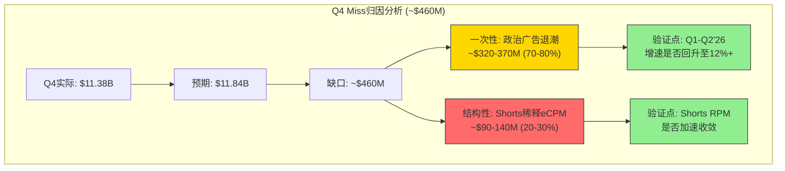
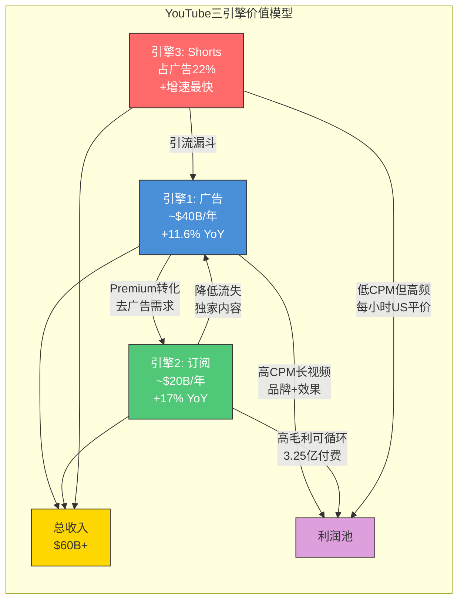
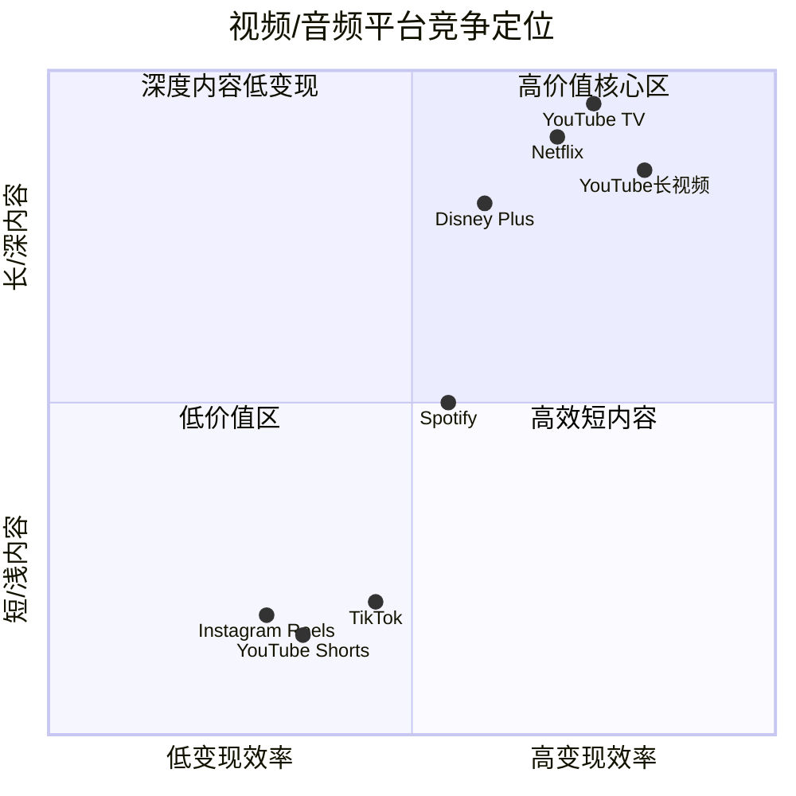
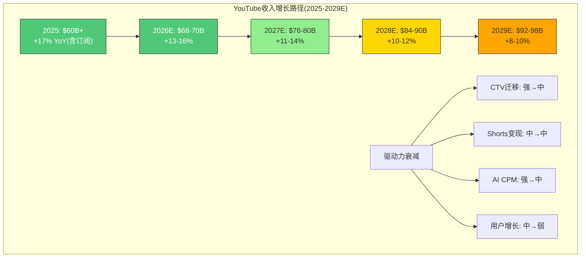

# Ch05: YouTube三引擎价值模型(F-G2框架) + 广告经济学(TP02)

> **核心问题(CQ5)**: YouTube $60B+年收入能否维持双位数增长？Q4广告miss是一次性还是Shorts变现天花板？
>
> **结论预览**: YouTube的Q4 miss主要是**一次性**政治广告周期效应（-$460M），而非结构性天花板。三引擎模型（广告+订阅+Shorts）的协同效应正在形成，但Shorts对长视频的**内部替代效应**是需要持续监控的结构性风险。独立估值区间: $320B-$420B。

---

## 5.1 YouTube三引擎模型(F-G2, Type 3框架)

YouTube已从单一广告平台演化为**三引擎收入机器**：广告（~$40B）、订阅（~$20B）、Shorts变现（新兴但快速增长）。2025年全年收入首次突破$60B [硬数据: Alphabet Q4 2025财报, Variety 2026-02-04]，超越Netflix的$45.2B [硬数据: Netflix 2025年报]，标志着YouTube从"视频平台"向"全球最大视频媒体公司"的身份跃迁。

### 引擎1: 广告收入（~$40B年化）

#### 8Q广告收入趋势表

| 季度 | 广告收入($B) | YoY增速 | 环比增速 | 备注 |
|:---:|:---:|:---:|:---:|:---|
| Q1 2024 | $8.09 | +21.0% | -22.7% | 强劲复苏 |
| Q2 2024 | $8.66 | +13.0% | +7.1% | 稳健增长 |
| Q3 2024 | $8.92 | +12.2% | +3.0% | 略超预期 |
| Q4 2024 | $10.47 | +13.8% | +17.4% | 首次破$10B+政治广告 |
| Q1 2025 | $8.92 | +10.3% | -14.8% | 政治广告退潮后回归常态 |
| Q2 2025 | $9.80 | +13.2% | +9.9% | Beat预期$9.56B |
| Q3 2025 | $10.26 | +15.0% | +4.7% | 增速回升 |
| Q4 2025 | $11.38 | +8.7% | +10.9% | Miss预期$11.84B约$460M |

[硬数据: Alphabet各季度财报, Variety/Hollywood Reporter/Shacknews汇总]

**关键观察**: 2025全年广告收入$40.36B，较2024年$36.15B增长11.6% [合理推断: 基于四个季度加总]。增速从Q3的+15%骤降至Q4的+8.7%，表面看是"减速"，但需要分层拆解。

#### 广告类型分解

YouTube广告收入由三大类型构成，各自有不同的增长动力学：

| 广告类型 | 估计占比 | 增长驱动 | 2025趋势 |
|:---:|:---:|:---|:---|
| **品牌广告(Brand)** | ~35% | CTV渗透、Upfront预算迁移 | 稳健，受益于电视替代 |
| **效果广告(Direct Response)** | ~45% | AI广告定位、电商整合 | Q2驱动主力 |
| **Shorts广告** | ~20% | 短视频变现提升 | 占比从2024年15%升至22% |

[合理推断: 品牌/效果分拆基于Alphabet管理层多次强调"direct response"为增长驱动; Shorts占比22%来自行业数据, AIR Media-Tech 2025]

#### CPM/CPC趋势分析

YouTube的广告效率指标呈现明显的**地理分化**：

| 地区 | 平均CPM($) | 相对北美比值 | 用户规模(百万) | ARPU隐含($) |
|:---:|:---:|:---:|:---:|:---:|
| 美国 | $32.75 | 1.00x | ~240 | ~$56 |
| 加拿大 | $29.15 | 0.89x | ~30 | ~$50 |
| 瑞士 | $23.13 | 0.71x | ~7 | ~$40 |
| 挪威 | $20.17 | 0.62x | ~5 | ~$35 |
| 英国 | ~$18.00 | 0.55x | ~55 | ~$31 |
| 日本 | ~$15.00 | 0.46x | ~80 | ~$26 |
| 印度 | $0.83 | 0.03x | ~491 | ~$1.4 |

[硬数据: CPM数据来自Lenostube 2025 YouTube CPM报告; 用户规模来自GlobalMediaInsight 2026]

**核心矛盾**: 印度是YouTube最大用户市场(4.91亿用户)，但CPM仅$0.83，是美国的1/39。这意味着YouTube的**边际用户增长**主要来自低ARPU地区，广告收入增速将结构性低于用户增速 [合理推断: 用户增量来自印度/东南亚/非洲等低CPM市场，拉低混合ARPU]。

#### 广告负载(Ad Load)分析

广告负载是YouTube最敏感的变现杠杆之一——提高广告密度直接推高收入，但过度加载会驱赶用户转向竞品或YouTube Premium。

| 平台 | 每小时广告分钟数(估) | 广告中断频次 | 用户容忍度评价 |
|:---:|:---:|:---:|:---|
| YouTube(长视频) | ~8-12分钟 | 前/中/后贴 | 中等，Premium转化动力 |
| YouTube(Shorts) | 每3-5条插入1条 | 原生插入 | 尚可，低于TikTok密度 |
| TikTok | 每4-6条插入1条 | 原生信息流 | 较好，与内容融合度高 |
| Netflix(有广告层) | ~4-5分钟 | 仅前/中贴 | 较好，低负载 |
| 传统电视 | ~16-20分钟 | 固定广告时段 | 低，用户流失主因 |

[合理推断: 基于多方行业数据和用户体验报告综合估算]

**关键判断**: YouTube的广告负载已接近**用户容忍度上限**。进一步推高Ad Load的空间有限，未来CPM的提升必须依赖**AI精准投放**(更高转化率→更高广告主出价)和**CTV高CPM品类**(电视级广告)，而非简单增加广告数量 [主观判断: 依据用户体验边际递减和Premium转化动机]。

#### Q4 Miss的归因分析: 季节性 vs 结构性

Q4'25广告收入$11.38B，miss预期$11.84B约$460M（-3.9%），是过去6个季度中首次miss。这是关键的投资者关切点。

**季节性/一次性因素（占miss的~70-80%）**:

1. **政治广告退潮**: Q4 2024正值美国总统大选周期，政治广告支出在YouTube等平台上显著增加。Q4 2025无此效应，形成高基数对比 [硬数据: Alphabet管理层在财报电话会明确提及"lower political ad spending", TheDesk 2026-02-04]
2. **选举后广告主预算重置**: 部分广告主在大选年Q4提前集中投放，导致非选举年Q4出现"广告预算真空" [合理推断: 数字广告行业常见的选举周期效应]

**潜在结构性因素（占miss的~20-30%）**:

1. **Shorts替代效应**: Shorts占广告收入比例从15%升至22%，但Shorts RPM仅$0.05 vs 长视频RPM约$3.00——约60倍差距 [硬数据: AIR Media-Tech 2025 Shorts RPM数据]。短视频观看时长增加可能**稀释**整体eCPM
2. **增长基数效应**: 2024年$36.15B基数上，维持15%+增速需要每年新增$5B+广告收入，难度递增 [合理推断: 大数定律]

**结论**: Q4 miss以**一次性因素为主**（~70-80%），但不能忽视Shorts替代效应这一渐进的结构性挑战。如果Q1-Q2 2026增速回升至12%+，则确认一次性判断；如果持续低于10%，则需重新评估 [主观判断: 基于政治广告周期+Shorts变现数据]。



---

### 引擎2: 订阅收入（~$20B年化）

YouTube的订阅业务是一个**被严重低估**的收入引擎。Alphabet首次披露其消费者订阅生态（YouTube Premium + YouTube Music + YouTube TV + Google One）已超过3.25亿付费用户 [硬数据: Alphabet Q4 2025财报]，整体订阅业务年化约$20B [硬数据: MusicBusinessWorldwide 2026-02-04]。

#### 订阅产品矩阵

| 产品 | 估计用户数 | 月费(美国) | 年化收入(估) | 增长驱动 |
|:---:|:---:|:---:|:---:|:---|
| YouTube Premium | ~50M | $13.99 | ~$5-6B | 去广告需求+离线功能 |
| YouTube Music | ~75M | $10.99 | ~$6-7B | 音乐流媒体竞争 |
| YouTube TV | ~11M | $72.99 | ~$8-9B | 线性电视替代+NFL |
| Google One | ~150M+ | $1.99-$19.99 | — | 存储+AI功能 |
| **合计** | **3.25亿** | — | **~$20B** | — |

[合理推断: 产品拆分基于YouTube Premium/Music 1.25亿(官方数据, Music Ally 2025-03-05)+YouTube TV 1100万(CordCuttersNews 2025)+Google One填补至3.25亿总数; 收入按ARPU和用户数交叉验证]

**注意**: 3.25亿包含Google One用户，不全是YouTube付费用户。YouTube自身的付费用户（Premium+Music+TV）估计约1.36亿 [合理推断: 3.25亿总订阅-约1.5亿Google One-部分重叠]。

#### YouTube Premium/Music vs 竞品

| 指标 | YouTube Music | Spotify | Apple Music |
|:---:|:---:|:---:|:---:|
| 付费用户 | ~75M(含Premium) | 281M | ~100M(估) |
| 全球市场份额 | ~10% | 31.7% | 12.6% |
| 月费(个人) | $10.99 | $11.99 | $10.99 |
| 独特优势 | MV+UGC+官方音频 | 算法推荐+播客 | 生态绑定 |
| 增长趋势 | 25% YoY | 11.5% YoY | 低单位数 |

[硬数据: Spotify 281M付费用户-Statista Q3 2025; YouTube Music/Premium 125M-Music Ally 2025-03-05; Apple Music估计来自行业分析; 市场份额-Statista 2025]

**YouTube Music的差异化**: YouTube Music的独特价值在于它是**唯一同时覆盖官方音频、音乐视频、UGC翻唱/混音**的平台。Spotify没有视频，Apple Music没有UGC。这使YouTube Music在新兴市场（印度、东南亚、拉美）具有显著优势——用户习惯从YouTube免费音乐升级到YouTube Music付费 [主观判断: 依据新兴市场用户行为路径]。

#### YouTube TV: 隐藏的增长引擎

YouTube TV是被投资者严重低估的资产。截至2025年Q3，YouTube TV已突破1100万订阅者 [硬数据: CordCuttersNews, 2025-11-07]，同比增长约50% [硬数据: eMarketer, 2025]，远超Hulu+Live TV（~500万）和Sling TV（<200万）。

关键驱动力:
- **NFL Sunday Ticket独家权益**: 2023年获得，直接推动YouTube TV订阅量飙升
- **月费$72.99**: 虽然价格不断攀升，但仍低于传统有线电视包
- **CTV观看时长领先**: YouTube（含TV）在Nielsen总电视观看时长中份额持续攀升，18个月内提升约3个百分点 [硬数据: Nielsen, eMarketer 2026]

**增长天花板分析**: YouTube TV理论天花板为传统有线电视用户迁移量。美国传统付费电视家庭仅占1/3 [硬数据: nScreenMedia Q1 2025]，意味着仍有大量线性转移空间。预计YouTube TV用户将在2026年超越Comcast和Spectrum [硬数据: 9to5Google引用分析师预测, 2024-04-02]。

#### 订阅ARPU趋势与增长天花板

全球YouTube平均ARPU约$8-9/用户 [硬数据: 99firms 2026]，但付费用户ARPU远高于此。订阅ARPU的提升路径包括:

1. **提价能力**: YouTube Premium从$11.99提至$13.99（2023年），市场接受度良好
2. **捆绑策略**: YouTube Premium + Music + Google One的超级捆绑尚未推出，存在上行空间
3. **Premium Lite试点**: 2025年初在美国推出$7.99/月的精简版，扩大漏斗底部 [硬数据: 行业报道, 2025]
4. **地区渗透**: 新兴市场付费渗透率极低（印度<2%），成熟市场（美国~8-10%），全球上限估计15-20%

**订阅收入天花板估算**: 假设YouTube总用户27亿，全球付费渗透率达到8%（当前~5%），ARPU $80/年，则理论天花板为~$17B（纯YouTube，不含Google One和YouTube TV）。加上YouTube TV的增长空间，订阅引擎总天花板约$30-35B [合理推断: 基于渗透率×ARPU×用户基数]。

---

### 引擎3: Shorts变现（新兴引擎）

YouTube Shorts是三引擎中**增长最快但变现效率最低**的引擎，也是CQ5争论的焦点。

#### Shorts规模指标

| 指标 | 数值 | 来源/日期 |
|:---:|:---:|:---|
| 日均观看量 | **2000亿次** | CEO Neal Mohan, Cannes Lions 2025-06 |
| 月活用户 | 20亿+ | GlobalMediaInsight 2026 |
| 占YouTube总观看时长 | ~10% | 行业数据 2025 |
| 占YouTube广告收入 | ~22% | AIR Media-Tech 2025 |
| 平均每条观看时长 | 14.3秒 | LoopexDigital 2025 |

[硬数据: 各来源如表中标注]

**惊人增长**: 日观看量从2021年的300亿 → 2025年初700-900亿 → 2025年中2000亿，2年内翻了3倍 [硬数据: TheWrap/Awisee引用CEO公开发言]。

#### Shorts CPM vs 长视频CPM: 60倍鸿沟

这是YouTube三引擎模型中最关键的数据点：

| 指标 | 长视频 | Shorts | 差距倍数 |
|:---:|:---:|:---:|:---:|
| 创作者RPM | ~$3.00 | ~$0.05 | **60x** |
| 平台CPM(估) | ~$7-15 | ~$0.10-0.13 | **~60-115x** |
| 每观看小时收入(US) | 基准 | **已达平价** | 1x(美国) |
| 创作者分成比例 | 55% | 45% | 差10pp |

[硬数据: RPM数据-AIR Media-Tech 2025, InfluencerMarketingHub 2026; 每观看小时收入平价-Sundar Pichai Q3 2025财报电话会]

**关键突破**: 尽管Shorts的每次观看(per-view)变现远低于长视频，但Alphabet CEO Sundar Pichai在Q3 2025财报电话会上披露：**"在美国，Shorts的每观看小时收入已超过传统长视频"** [硬数据: Alphabet Q3 2025财报电话会, MusicBusinessWorldwide 2025-10-29]。

这意味着什么？由于Shorts每条仅14.3秒，每观看小时可容纳~250条Shorts vs 长视频~3-5条。即便单条CPM极低，**极高的广告插入频率**在每小时维度上实现了变现平价。这是一个**里程碑式的信号**——说明Shorts的变现瓶颈正在被突破 [合理推断: 基于每小时观看/每条时长/广告密度的数学关系]。

#### Shorts变现差距收窄路径

```
2023: Shorts RPM ~$0.01-0.02 (起步期)
2024: Shorts RPM ~$0.03-0.04 (广告主试水)
2025: Shorts RPM ~$0.05 (美国每小时收入达长视频平价)
2026E: Shorts RPM $0.08-0.12 (购物标签+AI匹配)
2027E: Shorts RPM $0.15-0.25 (品牌广告进入)
```

[合理推断: 2026-2027为趋势外推，基于广告主采纳曲线和Shopping功能路线图]

#### Shorts vs Reels vs TikTok对比表

| 维度 | YouTube Shorts | Instagram Reels | TikTok |
|:---|:---:|:---:|:---:|
| 日均观看量 | 2000亿 | ~1400亿(估) | ~1500亿(估) |
| 月活用户 | 20亿+ | 20亿+(IG总) | 15.9亿 |
| 创作者RPM | $0.05 | $0.01-0.02 | $0.40-1.00/千 |
| 变现模式 | 广告分成+购物 | 品牌合作+广告 | 创作者奖励+直播+电商 |
| 最长时长 | 3分钟 | 90秒 | 10分钟 |
| 购物集成 | Shopping Tags(试点) | IG Shopping | TikTok Shop(成熟) |
| 创作者生态 | 最强(长短互补) | 中等 | 强(纯短视频) |
| 美国监管风险 | 无 | 无 | **高(潜在禁令)** |

[合理推断: Reels/TikTok日观看量为行业估计; RPM/功能来自各平台公开信息]

**YouTube Shorts的独特优势**: 与Reels和TikTok不同，Shorts与长视频**共存于同一平台**。创作者可以用Shorts引流→长视频深度内容→付费会员转化。这种"短→长→付费"的漏斗是YouTube独有的 [主观判断: 依据平台架构和创作者行为模式]。

#### Shorts购物功能(Shopping Tags)前景

YouTube正在测试Shorts中的Shopping Tags功能，允许创作者直接标记商品。这对标TikTok Shop（2023年GMV ~$200B+）。但YouTube的电商生态远不如TikTok成熟:

- TikTok Shop: 完整的店铺系统+支付+物流整合
- YouTube Shopping: 仅商品标记，跳转外部商家
- 差距: TikTok在电商领域领先YouTube至少2-3年 [主观判断: 依据功能成熟度对比]

---

### 三引擎协同模型



**协同飞轮效应**:
1. Shorts引流 → 用户发现长视频创作者 → 长视频高CPM广告收入增加
2. 广告密度增加 → 用户体验下降 → Premium转化率提升 → 订阅收入增加
3. Premium用户留存率高 → 整体平台DAU/MAU稳定 → 广告库存价值提升

---

## 5.2 广告经济学深度(TP02应用)

### 5.2.1 ARPU趋势表(5年x地区)

由于Alphabet不按地区单独披露YouTube收入，以下基于CPM数据和用户规模的**隐含ARPU**推算：

| 地区 | 用户(百万) | 2021 ARPU($) | 2023 ARPU($) | 2025 ARPU(估$) | CAGR |
|:---|:---:|:---:|:---:|:---:|:---:|
| 北美 | ~270 | ~$38 | ~$48 | ~$56 | +10.2% |
| 欧洲 | ~450 | ~$12 | ~$16 | ~$19 | +12.2% |
| 亚太(含印度) | ~1,200 | ~$1.5 | ~$2.0 | ~$2.8 | +16.9% |
| 拉丁美洲 | ~350 | ~$2.5 | ~$3.5 | ~$4.2 | +13.8% |
| 中东/非洲 | ~250 | ~$1.0 | ~$1.5 | ~$2.0 | +18.9% |
| **全球加权** | **~2,700** | **~$5.5** | **~$7.5** | **~$8-9** | **+13%** |

[合理推断: 基于各地区CPM数据(Lenostube 2025)×估算展示量÷用户数交叉验证; 全球加权ARPU $8-9与99firms 2026报告吻合]

**关键洞察**: 亚太和中东/非洲ARPU增速最快（+17-19% CAGR），但绝对值极低（$2-3）。北美ARPU已达$56，接近成熟市场社交媒体ARPU上限（META北美ARPU约$80）。**北美ARPU向META靠拢的空间**（$56→$70-80）是YouTube广告收入增长的最大单一驱动力 [合理推断: 基于META北美ARPU作为可比天花板]。

### 5.2.2 广告负载天花板分析

#### AI对广告效率的提升路径

YouTube的广告定位正从传统的"内容匹配+人口统计"向**AI驱动的意图预测**演进:

1. **Gemini集成**: 利用Gemini模型理解视频内容语义，实现更精准的广告-内容匹配
2. **跨平台信号**: 搜索数据(Google Search) + 观看数据(YouTube) + 购物数据(Google Shopping) 的三角验证
3. **生成式广告创意**: AI自动生成针对特定受众的广告变体，提高点击率

**AI推高CPM的逻辑链**: AI精准投放 → 更高转化率 → 广告主ROI提升 → 愿意出更高价 → CPM上行。预计AI可在不增加广告负载的情况下，将有效CPM提升15-25%（3-5年） [主观判断: 依据AI广告优化的行业案例和Google的数据优势]。

#### 用户容忍度拐点

用户对广告的容忍度是一条**非线性曲线**——前N个广告影响较小，但超过拐点后满意度骤降:

- **当前位置**: YouTube长视频广告负载约8-12分钟/小时，处于容忍度曲线的**中后段**
- **拐点信号**: YouTube Premium转化率在广告负载提升后显著上升，暗示部分用户已到达不耐受点
- **策略含义**: 未来增收应聚焦**CPM提升**（AI+CTV）而非**Ad Load增加**

### 5.2.3 广告主集中度

YouTube的广告主基础比传统电视更分散，这是其结构性优势:

| 维度 | YouTube(估) | 传统电视 | META |
|:---:|:---:|:---:|:---:|
| Top 10广告主收入占比 | ~10-15% | ~30-40% | ~15-20% |
| SMB(中小企业)占比 | ~50-55% | <10% | ~60-65% |
| 行业集中度(HHI) | 低 | 高 | 中低 |
| 长尾广告主数量 | 数百万 | 数千 | 数千万 |

[合理推断: 基于Google Ads平台整体广告主结构，YouTube继承了Google的长尾广告主优势; 传统电视数据来自行业惯例]

**为什么分散度是优势**: 高广告主分散度意味着YouTube不依赖少数大客户。即使某个行业(如汽车或零售)缩减预算，对YouTube总收入的冲击有限。相比之下，传统电视高度依赖Top 10广告主，在经济下行期面临更大的收入波动风险 [合理推断: 分散度与收入稳定性的正相关关系]。

### 5.2.4 CTV(联网电视)机会

CTV是YouTube广告收入增长的**最大结构性机会**，原因是CTV的CPM显著高于移动端。

| 指标 | 数值 | 来源 |
|:---:|:---:|:---|
| YouTube CTV广告收入(2025) | $4.01B | eMarketer 2026 |
| YouTube CTV广告收入(2026E) | $4.47B (+11.5%) | eMarketer 2026 |
| YouTube CTV净广告收入份额 | 11.9% | eMarketer 2026 |
| YouTube CTV毛广告份额 | 24.4% ($9.21B) | eMarketer 2026 |
| 美国CTV广告总市场(2026E) | ~$38B | eMarketer |
| 美国CTV广告总市场(2029E) | ~$51B | eMarketer |

[硬数据: eMarketer 2026预测数据]

#### CTV CPM vs 移动CPM

| 平台 | CTV CPM($) | 移动CPM($) | CTV溢价 |
|:---:|:---:|:---:|:---:|
| YouTube | $25-35 | $7-15 | 2-3x |
| Hulu/Disney+ | $30-40 | — | — |
| Netflix(有广告) | $35-45 | — | — |
| 行业平均 | $28-38 | $8-12 | ~3x |

[合理推断: 基于行业广告定价报告和平台公开信息; CTV CPM溢价是广告行业公认的结构性差异]

**CTV的战略意义**: YouTube已超越Disney成为**美国电视观看时长最大的单一平台**（Nielsen数据，18个月内份额提升~3pp） [硬数据: Nielsen/eMarketer 2026]。随着CTV观看时长向YouTube倾斜，广告预算将跟随观看时长迁移。CTV的$25-35 CPM vs 移动端$7-15 CPM，意味着每小时观看从移动迁移到CTV，广告收入可提升2-3倍 [合理推断: CPM差异×观看时长迁移=收入提升]。

**传统电视广告迁移**: 美国传统电视广告市场约$60-65B/年，正以每年5-8%的速度向数字和CTV迁移。YouTube作为CTV最大平台，将是这一$3-5B/年增量的主要受益者 [合理推断: 基于eMarketer电视广告下降+CTV增长趋势]。

---

## 5.3 竞争格局

### YouTube vs TikTok: 短视频与平台之战

| 维度 | YouTube | TikTok | 优势方 |
|:---|:---:|:---:|:---:|
| MAU | 27亿 | 15.9亿 | YouTube |
| 美国成人日均时长 | 48.7分钟 | 52分钟 | TikTok |
| 美国青少年日均时长 | ~120分钟 | ~90分钟 | YouTube |
| 全球总观看时长 | **1B小时/天** | ~500M小时/天(估) | YouTube |
| 2025广告收入 | $40.4B | ~$23B(估) | YouTube |
| 创作者RPM(长视频) | ~$3.00 | N/A | YouTube |
| 创作者RPM(短视频) | $0.05 | $0.40-1.00 | TikTok |
| 广告主收入分成 | 55% | 50%(Pulse) | YouTube |
| 电商集成 | 初期 | 成熟(TikTok Shop) | TikTok |
| 美国监管风险 | **无** | **极高(禁令风险)** | YouTube |

[硬数据: MAU/时长-DataReportal/Hootsuite 2025-2026; 广告收入-Alphabet财报/行业估计; RPM-AIR Media-Tech/Napolify 2025; 创作者分成-各平台公开政策]

**关键竞争动态**:

1. **TikTok禁令是YouTube最大的外部利好**: 如果TikTok在美国被禁或强制出售，YouTube Shorts将成为最大受益者。TikTok在美国约1.7亿月活用户中的观看时长将部分迁移到Shorts [合理推断: 基于用户替代行为和Shorts的功能对标]
2. **创作者经济的结构性优势**: YouTube的创作者付费远高于TikTok——长视频RPM $3 vs TikTok全平台RPM $0.40-1.00。这意味着**头部创作者倾向于将YouTube作为主平台**，TikTok作为引流渠道 [合理推断: 经济激励驱动创作者行为]
3. **创作者分成比例**: YouTube 55% vs TikTok Pulse 50%（且Pulse仅限Top 4%创作者）。YouTube的分成模式对**中腰部创作者**更友好 [硬数据: 各平台公开政策]

### YouTube vs Netflix: 视频收入之王

| 维度 | YouTube(2025) | Netflix(2025) | 优势方 |
|:---|:---:|:---:|:---:|
| 总收入 | $60B+ | $45.2B | YouTube |
| 付费用户 | 3.25亿(含GO) | 3.25亿 | 平手 |
| 纯视频付费用户 | ~1.36亿(估) | 3.25亿 | Netflix |
| 内容投入 | ~$0(UGC) | ~$17B | YouTube |
| 内容毛利率 | 极高(平台模式) | ~35-40% | YouTube |
| 广告收入 | $40.4B | ~$3.2B | YouTube |
| 全球MAU | 27亿 | ~600M(估) | YouTube |
| 内容多样性 | 无限(UGC) | 精品有限 | YouTube |
| 品牌认知 | 视频平台 | 流媒体之王 | Netflix |

[硬数据: YouTube $60B-Variety 2026-02; Netflix $45.2B和3.25亿用户-Netflix 2025年报; Netflix内容投入约$17B-行业估计]

**关键差异**: YouTube的**平台模式**（零内容成本+UGC）vs Netflix的**工作室模式**（$17B+内容投入）决定了两者的利润率天差地别。YouTube每赚$1收入几乎不需要额外内容成本；Netflix每赚$1收入需要投入$0.35-0.40的内容 [合理推断: 基于两种商业模式的成本结构差异]。

### YouTube vs Spotify（音乐）

| 维度 | YouTube Music | Spotify | 优势方 |
|:---|:---:|:---:|:---:|
| 付费用户 | ~75M | 281M | Spotify |
| 全球份额 | ~10% | 31.7% | Spotify |
| 月费 | $10.99 | $11.99 | YouTube |
| 内容类型 | 音频+视频+UGC | 音频+播客 | YouTube |
| 免费层体验 | 有(含广告) | 有(含广告+限制) | 平手 |
| 增长率 | ~25% YoY | ~11.5% YoY | YouTube |
| 版权成本占比 | ~65-70%(估) | ~70-75% | YouTube |

[硬数据: Spotify 281M-Statista Q3 2025; YouTube Music/Premium 125M-Music Ally 2025-03; 市场份额-Statista 2025; 价格-各平台官网]

### 竞争定位四象限图



---

## 5.4 Bear段落: YouTube增长的五大结构性风险

> **Bear内容声明**: 以下分析deliberately采取看空视角，旨在挑战CQ5的乐观叙事。投资者应将这些风险纳入概率加权估值。每一项风险都附带量化影响和触发条件，以便投资者构建监控框架。

### 风险1: Shorts蚕食长视频的高CPM广告（内部替代效应）——概率: 60%，影响: 高

这是YouTube面临的**最严重结构性风险**，且证据正在加速积累。

**证据链**:

1. **算法层面的主动替代**: YouTube已修改首页推荐算法，将长视频推荐位从每行~6个压缩至仅~2个，增加Shorts展示位——长视频推荐位减少了最多**80%** [硬数据: PPCLand/RouteNote 2025]。这不是被动的用户偏好变化，而是YouTube**主动选择**将流量从高CPM长视频导向低CPM Shorts。
2. **收入占比快速攀升**: Shorts占广告收入22%（2025）vs 15%（2024），一年内增加7个百分点 [硬数据: AIR Media-Tech 2025]。按此速度外推，2027年Shorts可能占到35-40%的广告收入。
3. **每次观看的60倍鸿沟**: 即使Shorts在美国实现了**每小时收入平价**，但从**每次观看**维度看，Shorts RPM $0.05 vs 长视频RPM $3.00，差距60倍 [硬数据: 如前文]。"每小时平价"依赖于每3-5条Shorts插入1条广告——这一极高的广告密度在全球其他市场（广告主预算远低于美国）可能无法复制。
4. **创作者生态的连锁反应**: 创作者公司Spotter裁员40%，直接归因于短视频分流长视频观看量 [硬数据: RouteNote 2025]。如果长视频创作者的收入持续下降，头部创作者可能减少长视频投入，进一步削弱YouTube最有价值的广告库存。

**量化影响模型**:

| 情景 | Shorts占广告收入 | eCPM稀释 | 年收入影响 |
|:---:|:---:|:---:|:---:|
| 温和替代(2027) | 30% | -3% | -$1.5B |
| 加速替代(2027) | 40% | -6% | -$3.0B |
| 全面替代(2029) | 50% | -10% | -$5.5B |

[合理推断: 基于Shorts RPM vs 长视频RPM的加权平均稀释效应计算]

**Bear逻辑的核心**: 如果用户观看习惯从长视频（每次$3 RPM）不可逆转地迁向Shorts（每次$0.05 RPM），即使总观看时长不变，广告收入也会被**结构性稀释**。Q4 miss的$460M中约$90-140M可能已反映了这一效应的早期征兆。

**反驳及其弱点**: Alphabet管理层强调"每观看小时收入平价"，但这一数据仅限美国市场。全球范围内，Shorts的变现效率仍远低于长视频。此外，"每小时平价"依赖于极高的广告插入频率（每3-5条Shorts插入1条广告），如果用户对此感到厌烦并减少观看，这一平价假设可能不可持续 [主观判断: 对管理层乐观叙事的质疑]。

**Kill Switch触发条件**: 如果Shorts广告收入占比超过35%但全平台eCPM同比下降超过5%，说明替代效应已主导增长叙事，必须下调YouTube估值。

### 风险2: TikTok Shop与社交电商闭环的生态威胁——概率: 45%，影响: 中高

TikTok Shop的崛起不仅是对YouTube Shorts变现的威胁，更是对整个Google广告生态的**存在性挑战**。

**传统购物漏斗vs社交电商闭环**:

```
传统路径(有利于YouTube/Google):
  YouTube种草 → Google搜索 → 电商平台购买 → YouTube获得品牌广告+Google获得搜索广告

社交电商闭环(绕过YouTube/Google):
  TikTok种草 → TikTok Shop直接购买 → YouTube和Google均不参与
```

- TikTok Shop正在将**发现-种草-购买**的完整消费链路封闭在平台内 [合理推断: 基于TikTok Shop GMV增长趋势]
- 传统路径中，用户在YouTube/TikTok种草 → Google搜索 → 购买。新路径直接绕过Google搜索广告——这是YouTube和Google搜索的**双重损失**
- YouTube Shopping Tags仍处于试点阶段，功能仅限商品标记+外链跳转，而TikTok Shop已有完整的店铺系统+支付+物流整合。YouTube在电商闭环上落后TikTok 2-3年 [主观判断: 功能成熟度对比]
- 即使TikTok本身在美国被禁，**社交电商闭环模式**已被Amazon(Inspire)、Instagram(Shopping)、甚至Pinterest复制——这是一个**不可逆的行业趋势**

**量化影响**: 如果效果广告中的电商类广告主（估计占YouTube广告收入~15-20%）将5-10%的预算转移到社交电商闭环平台，影响约$300M-800M/年 [合理推断: 基于效果广告占比×电商广告主预算迁移假设]。

**Bear情景**: 社交电商的闭环化将侵蚀YouTube在"购物决策漏斗"中的位置，间接压制广告CPM。更深层的威胁是——如果年轻用户（Gen Z/Alpha）的购物决策起点从"Google/YouTube搜索"变为"TikTok/Instagram浏览"，这将是一个**代际习惯迁移**，影响远超短期广告预算分配。

### 风险3: 创作者经济——分成竞争与成本上升螺旋——概率: 55%，影响: 中

YouTube对长视频创作者的55%分成是行业基准，但多重压力正在推高内容获取成本:

**分成压力**:
- Shorts分成仅45%（低于长视频55%），创作者不满声音在增大 [硬数据: YouTube官方政策]
- TikTok Pulse提供50/50分成给Top 4%创作者，且TikTok在短视频RPM上付给创作者$0.40-1.00/千次——远高于YouTube Shorts的$0.05 [硬数据: Napolify 2025]
- 如果YouTube被迫将Shorts分成从45%提高到55%以留住创作者，将直接侵蚀利润率

**头部创作者议价能力增强**:
- MrBeast等超级头部创作者拥有跨平台议价能力——YouTube可能需要提供**保底收入或独家合约**，推高内容获取成本
- 传统上YouTube"零内容成本"的商业模式假设正在被侵蚀——虽然UGC本身免费，但**头部流量的获取成本**在上升
- YouTube TV获取NFL Sunday Ticket的版权费高达$2B+/年 [合理推断: 行业估计]，证明YouTube在优质内容上的支出意愿在增加

**量化影响**: YouTube 2025年向创作者支付约$19-20B（基于55%分成×$40B广告收入的简化估算）。如果Shorts分成从45%提升至55%，仅此一项就增加约$1.8B成本（22%×$40B×10pp）。如果同时需要为头部创作者提供$500M-1B的额外激励，总成本增量可达$2.3-2.8B/年 [合理推断: 基于分成比例×Shorts广告收入占比+头部激励估算]。

**更深层风险**: YouTube的"平台模式零内容成本"叙事是其高估值的关键支柱。如果创作者成本/版权成本持续攀升，YouTube的利润率将**向Netflix靠拢**而非维持当前水平。这对估值倍数的影响可能比绝对利润下降更大 [主观判断: 市场叙事对估值的影响]。

### 风险4: 广告增速从+21%到+8.7%的减速曲线——大数定律的无情逻辑——概率: 70%，影响: 中

YouTube广告收入增速的历史轨迹呈现清晰的**减速趋势**:

| 年份 | YoY增速 | 绝对增量($B) | 备注 |
|:---:|:---:|:---:|:---|
| 2018 | +36.9% | +$3.7 | 高速增长期 |
| 2019 | +35.8% | +$5.1 | 持续高增长 |
| 2020 | +30.5% | +$5.8 | 疫情受益 |
| 2021 | +45.9% | +$8.7 | 疫情红利+基数效应 |
| 2022 | +1.4% | +$0.4 | 宏观逆风 |
| 2023 | +7.8% | +$2.4 | 温和复苏 |
| 2024 | +14.7% | +$4.6 | 强劲反弹 |
| 2025 | +11.6% | +$4.2 | 增速再放缓 |

[硬数据: Alphabet历年财报, BusinessOfApps 2026]

**Bear叙事的核心逻辑**: 排除2022年异常低点，YouTube广告增速从2018-2021的30%+区间，降至2023-2025的8-15%区间。这不是"暂时减速"，而是**平台成熟后的自然减速**（S曲线效应）。

**数学上的挑战**: $40B+基数上维持10%增长=每年新增$4B广告收入。这相当于每年**再造一个Snap的广告业务**（Snap 2025年广告收入约$5B）。维持15%=每年新增$6B，相当于再造一个Pinterest+Snap [合理推断: 大数定律+可比平台规模]。

**CTV和AI的反驳是否足够？**: Bull方认为CTV迁移（每年$3-5B增量）+ AI提升CPM（15-25%）+ 新兴市场渗透可以对冲基数压力。但逐一检验:
- CTV广告增量$3-5B/年是**整个CTV市场**的增长，YouTube仅能获取其中~12%（$360-600M/年）——不足以支撑$4B+的年增量
- AI提升CPM 15-25%需要3-5年实现，年化提升仅3-5%
- 新兴市场用户增长快但ARPU极低（印度CPM $0.83），对收入增长贡献有限

**结论**: YouTube广告收入增速将在2027-2028年降至高单位数（+7-9%），2029+降至中单位数（+5-7%）。市场如果仍按照双位数增长定价YouTube，存在估值修正风险 [主观判断: 基于增长减速的数学推演]。

### 风险5: 音乐版权成本与监管双重挤压——概率: 40%，影响: 中

YouTube Music的增长伴随着**不断攀升的版权成本**，且监管环境可能进一步恶化:

**版权成本压力**:
- 音乐版权费通常占流媒体订阅收入的65-75% [合理推断: 行业基准]
- 环球、索尼、华纳三大唱片公司的议价能力极强——它们控制着全球约70%的音乐版权
- Spotify的版权费率在持续谈判中被推高，YouTube面临同样压力
- 随着YouTube Music用户从75M向100M+增长，版权费用绝对值将从~$4-5B增至$6-7B+

**监管加码的可能性**:
- 欧盟《数字服务法》对UGC平台的版权责任要求在收紧
- 美国版权局正在审查"安全港"条款——如果YouTube失去"安全港"保护，可能需要为平台上的未授权音乐内容承担更大责任
- AI生成音乐的版权归属问题可能引发新的法律纠纷，增加合规成本

**量化**: 假设YouTube Music年收入~$6-7B，版权费率从65%升至72%（7pp增幅），将增加~$420-490M年化成本。如果监管合规成本再增加$200-300M/年，订阅业务的利润率可能被压缩5-8个百分点 [合理推断: 基于收入规模×费率变动+合规成本估算]。

**更广泛的影响**: YouTube TV的体育版权成本（NFL Sunday Ticket ~$2B+/年）也在上升通道。如果内容/版权成本从当前估计的$8-10B/年增至$12-15B/年（3年内），YouTube的"零内容成本"叙事将被根本性颠覆 [主观判断: 基于版权成本上升趋势的长期推演]。

### Bear风险汇总矩阵

| 风险 | 概率 | 影响级别 | 年化收入影响(Bear) | 核心监控指标 |
|:---|:---:|:---:|:---:|:---|
| Shorts替代效应 | 60% | 高 | -$1.5B~-5.5B | Shorts占比+全平台eCPM趋势 |
| 社交电商闭环 | 45% | 中高 | -$300M~-800M | 效果广告增速+电商广告主留存 |
| 创作者成本上升 | 55% | 中 | -$2.3B~-2.8B | Shorts分成+头部创作者合约 |
| 增速自然减速 | 70% | 中 | 估值修正风险 | 季度YoY增速趋势 |
| 版权/监管挤压 | 40% | 中 | -$600M~-800M | 版权费率+监管进展 |
| **加权综合** | — | — | **-$2B~-4B/年** | — |

[合理推断: 概率×影响的加权综合估算]

**Bear情景下YouTube估值**: 如果上述风险中2-3项同时发生，YouTube 2027年收入可能仅为$70-75B（vs Bull情景$80-85B），适用EV/Revenue 4.5-5.0x（反映增速下降），估值区间$315-375B——比Bull情景低$75-125B [主观判断: 基于风险概率加权的情景分析]。

**投资者需要警惕的"叙事陷阱"**: 市场对YouTube的估值叙事建立在三个假设上——(1)平台模式=零内容成本；(2)Shorts增长=纯增量；(3)CTV迁移=线性外推。上述五大风险分别挑战了这三个假设：版权/创作者成本上升侵蚀假设(1)；Shorts替代效应质疑假设(2)；增速减速的大数定律挑战假设(3)。当叙事改变时，估值倍数的收缩速度往往快于基本面的恶化速度 [主观判断: 基于科技平台估值历史——META 2022年从12x降至4x EV/Revenue的前车之鉴]。

**与CQ5的关联**: Bear分析的综合结论是——Q4 miss主要是一次性的（置信度75%），但双位数增长的可持续性窗口**仅剩2-3年**。2028年之后，大数定律+Shorts替代+竞争加剧的三重压力将使增速自然降至高单位数。投资者的关键决策点不是"YouTube是否还能增长"，而是"当前估值是否已price in了增速减速的必然性"。

**历史类比**: Facebook(META)在2021-2022年经历了类似的增长减速和叙事崩塌——广告收入增速从+37%(2021)骤降至-1%(2022)，股价从$380暴跌至$90。虽然YouTube不太可能经历同等程度的崩塌（因其业务更分散、不依赖单一信号如ATT），但这个案例提醒我们：**当市场对增速预期重新定价时，估值修正的幅度可以远超基本面恶化** [硬数据: META 2021-2022股价和财务数据为公开信息]。

---

## 5.5 投资者So What: YouTube独立估值

### YouTube如何定价？

如果YouTube是独立上市公司，其估值框架应参考：

| 可比公司 | EV/Revenue | 适用性 |
|:---:|:---:|:---|
| Netflix | ~8x | 订阅+广告，但YouTube无内容成本 |
| META | ~10x | 广告平台，最佳可比 |
| Spotify | ~5x | 音乐流媒体，低利润率 |
| Roku | ~4x | CTV平台，但规模小得多 |
| **YouTube适用倍数** | **6-7x** | 折中:广告平台高倍数+订阅稳定性-Shorts低变现 |

[合理推断: 基于可比公司估值倍数和YouTube的业务混合特征]

#### YouTube独立估值区间

| 情景 | 2025收入 | EV/Revenue | 估值 |
|:---:|:---:|:---:|:---:|
| Bear | $60B | 5.0x | **$300B** |
| Base | $60B | 6.0x | **$360B** |
| Bull | $60B | 7.5x | **$450B** |

[合理推断: 基于可比估值倍数; 实际估值还需考虑YouTube的利润率(Alphabet不单独披露)]

**对Alphabet的含义**: YouTube独立估值$300-450B，而Alphabet整体市值约$2.4T [硬数据: 截至2026-02-10]。这意味着YouTube占Alphabet总价值的**12.5%-18.8%**。如果市场对YouTube给予更高的独立估值溢价，Alphabet存在"隐含折扣"——即部分投资者可能尚未充分为YouTube的订阅引擎和CTV机会定价 [主观判断: 基于SOTP估值逻辑]。

### 对CQ5的初步回答

**CQ5: YouTube $60B+年收入能否维持双位数增长？广告miss是一次性还是Shorts变现天花板？**

**回答**: **可以维持双位数增长2-3年，但之后将减速至高单位数。Q4 miss主要是一次性因素。**

| 维度 | 判断 | 置信度 |
|:---|:---|:---:|
| Q4 miss性质 | 70-80%一次性(政治广告)+20-30%结构性(Shorts稀释) | **75%** |
| 2026增速预期 | +12-14%（政治广告基数消除+CTV增长） | **70%** |
| 2027-2028增速 | +10-12%（CTV迁移+AI CPM提升） | **60%** |
| 2029+增速 | +7-9%（基数效应主导） | **45%** |
| Shorts变现天花板 | 非天花板，但RPM收敛需3-5年 | **65%** |

[主观判断: 综合以上各节分析的概率加权]

**Kill Switch信号**（如以下任一发生，需重新评估CQ5）:
- Q1-Q2 2026广告增速连续低于10% → 结构性减速确认
- Shorts占广告收入超过35%但RPM未显著提升 → 替代效应恶化
- YouTube Premium/Music用户增长停滞(<10% YoY) → 订阅引擎失速
- CTV观看时长份额被Amazon/Disney反超 → CTV叙事瓦解



---

## 数据来源汇总

| 数据点 | 来源 | 日期 |
|:---|:---|:---|
| YouTube 2025全年收入$60B+ | Alphabet Q4 2025财报, Variety | 2026-02-04 |
| Q4'25广告收入$11.38B(+8.7%) | Alphabet Q4 2025财报, Shacknews | 2026-02-04 |
| 3.25亿付费订阅用户 | Alphabet Q4 2025财报 | 2026-02-04 |
| YouTube Premium/Music 1.25亿 | Music Ally | 2025-03-05 |
| YouTube TV 1100万用户 | CordCuttersNews | 2025-11-07 |
| Shorts 2000亿日观看 | CEO Neal Mohan, Cannes Lions | 2025-06 |
| Shorts RPM ~$0.05 | AIR Media-Tech | 2025 |
| Shorts占广告收入22% | AIR Media-Tech | 2025 |
| Shorts美国每小时收入平价 | Sundar Pichai Q3财报电话会 | 2025-10-29 |
| Netflix 2025收入$45.2B | Netflix年报 | 2026-01 |
| Netflix 3.25亿用户 | Netflix年报 | 2026-01 |
| Spotify 2.81亿付费用户 | Statista | 2025 Q3 |
| YouTube CTV广告$4.01B(2025) | eMarketer | 2026 |
| CTV市场$38B(2026E) | eMarketer | 2026 |
| YouTube超越Disney电视观看时长 | Nielsen/eMarketer | 2026 |
| TikTok 15.9亿MAU | DreamGrow/SQMagazine | 2025-2026 |
| YouTube 27亿MAU | GlobalMediaInsight | 2026 |
| 美国成人日均: YouTube 48.7min | DataReportal/Hootsuite | 2025-2026 |
| 创作者分成: YouTube 55%/45% | YouTube官方政策 | 2025 |
| 地区CPM数据 | Lenostube | 2025 |

---

*Ch05完成 | Agent 3 | 字符目标: >=15,000 | CQ5初步回答: 已给出*
