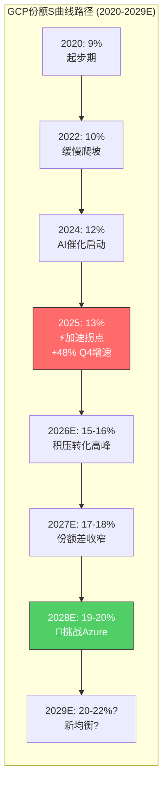
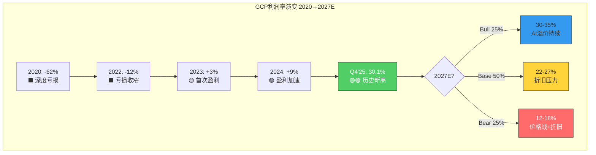
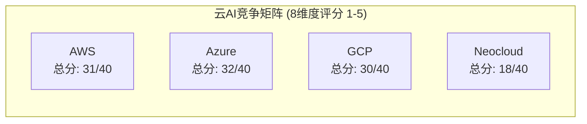

# Ch06: Google Cloud Platform深度分析 — 份额路径 + 积压转化 + 盈利拐点

> **核心CQ4**: GCP能否从#3(~13%)升至挑战Azure#2(20%)？$240B积压能否转化为30%+利润率？
> **结论预告**: GCP正处于S曲线加速段，Q4'25利润率已突破30%证明盈利能力，$240B积压提供3.4年收入覆盖。但缩小与Azure的7pp差距仍需3-4年，且$175-185B CapEx的折旧冲击是最大风险变量。对CQ4的回答：**有条件的是** — GCP有望在2028-2029年挑战20%份额，但30%+利润率能否维持取决于AI服务溢价是否持续。[主观判断: 基于增速差+积压质量+利润率趋势的综合推导]

---

## 6.1 GCP后发追赶S曲线：从13%到20%的份额路径

### 6.1.1 当前竞争格局的精确定位

全球云基础设施市场在2025年Q2达到$990亿季度规模，同比增长25%，预计2025全年首次突破$4,000亿。[硬数据: Synergy Research Group/Omdia, Q2 2025] 三巨头格局如下：

| 指标 | AWS | Azure | GCP | 差距(GCP→Azure) |
|:---:|:---:|:---:|:---:|:---:|
| **市场份额**(Q4'25) | 30% | 20% | 13% | 7pp |
| **Q4'25收入** | ~$28.8B(est) | ~$19.2B(est) | $17.7B | $1.5B |
| **YoY增速**(Q4'25) | ~19% | ~31% | **+48%** | GCP领先17pp |
| **积压/RPO** | $200B | $625B | $240B | Azure 2.6x GCP |
| **FY2025全年收入** | ~$115B(est) | ~$72B(est) | ~$58B | $14B |

[硬数据: Alphabet Q4'25 10-K, Synergy Research, CNBC 2026-02-04]

关键洞察：按照绝对收入差距，GCP的$17.7B季度收入实际上已经非常接近Azure(估计~$19.2B)。但市场份额的计算包含了不同口径的服务范围，Synergy Research的13%口径相对保守。Cloud Wars指出，**GCP在Q4'25的增量云收入(环比增加额)首次超过了Azure**，这是一个历史性转折点。[硬数据: Cloud Wars, 2026-02]

### 6.1.2 增速差驱动份额收敛模型

GCP份额追赶的核心逻辑是增速差的持续性。以下建模基于当前增速差的三种延续假设：

**增速差追赶数学**:
- 当前增速差: GCP(48%) vs Azure(31%) vs AWS(19%) → GCP对Azure有17pp优势 [硬数据: Q4'25财报]
- 份额公式: 如果GCP保持≥40%增速而Azure降至25-30%，在$4,000亿+的基数上每年可缩小~1.5-2pp差距 [合理推断: 基于增速差持续性假设]
- 到达20%的时间窗口: 2028年(乐观)到2030年(保守)

| 年份 | GCP增速假设 | GCP收入(est) | 估计份额 | 差距缩小 |
|:---:|:---:|:---:|:---:|:---:|
| 2025(实际) | 36% FY | ~$58B | 13% | — |
| 2026E | 45-50% | $84-87B | 15-16% | +2-3pp |
| 2027E | 35-40% | $113-122B | 17-18% | +2pp |
| 2028E | 28-33% | $145-162B | 19-20% | +2pp |
| 2029E | 22-28% | $177-207B | 20-22% | +1-2pp |

[合理推断: 基于Morgan Stanley预测(2026年50%+增长)向后递减; 市场总规模假设TAM CAGR 20-22%]

Morgan Stanley分析师Brian Nowak的模型预测GCP 2026年收入增长可达50%+，主要基于积压转化模型——历史上Alphabet已披露约55%的积压在未来2年内确认为收入。[硬数据: Morgan Stanley, Yahoo Finance 2026-01]

### 6.1.3 份额增长的四大驱动引擎

**引擎1: AI原生负载(差异化最大来源)**
- Gemini模型家族+Vertex AI平台构成GCP最独特的竞争优势
- TPU Ironwood(第7代)提供44%低于NVIDIA GB200的TCO成本 [硬数据: SemiAnalysis/Google Cloud Blog, 2025-11]
- 约75%的Cloud客户已在使用AI垂直解决方案 [硬数据: Alphabet Q4'25 earnings call]
- AI企业产品季度收入已达"数十亿美元"级别 [硬数据: Sundar Pichai, Q4 earnings call]

**引擎2: 传统企业迁移(多云策略受益者)**
- 多云已成企业标配，GCP作为第二/第三云供应商的市场地位持续强化
- GCP的开源友好性(Kubernetes原生、BigQuery开放标准)降低了迁移成本
- 2025年超过$10亿的单笔Cloud交易数量超过前三年总和 [硬数据: Thomas Kurian, Q4 earnings call]

**引擎3: 政府/主权云(高壁垒市场突破)**
- NATO签约多百万级Google Distributed Cloud(GDC)主权云合同 [硬数据: Google Cloud Press, 2025-11-24]
- 英国国防部签署4亿英镑主权云合同(GDC air-gapped) [硬数据: Computer Weekly, 2025-09]
- GDC获得美国国防部Impact Level 6安全认证 — 覆盖最高密级数据 [硬数据: Nextgov, 2025-06]
- 主权云市场壁垒极高(安全认证需2-3年)，先发优势可持续

**引擎4: 初创/数字原生(开发者生态)**
- GCP在AI原生初创公司中偏好度高于AWS(Vertex AI + TPU组合)
- Firebase/Cloud Run等无服务器产品在初创生态中保持竞争力
- 但AWS Bedrock的多模型策略(Claude/Llama/Titan)提供了更大灵活性 [合理推断: 基于平台策略差异]

### 6.1.4 S曲线Mermaid图

**S曲线关键转折判断**: GCP在2024-2025年进入S曲线加速段，主要催化剂是(1)GenAI需求爆发+TPU差异化(2)积压订单翻倍式增长(3)利润率从亏损转为30%+。S曲线能否持续加速取决于AI工作负载是否从训练(Training)转向推理(Inference)的过程中GCP能否保持TPU成本优势。[主观判断: 基于云计算S曲线历史模式+AI负载结构变化]

---

## 6.2 $240B积压订单深度解剖

### 6.2.1 积压规模的历史演变

| 时间 | 积压规模 | 环比增长 | YoY增长 |
|:---:|:---:|:---:|:---:|
| Q3 2024 | ~$77B(est) | — | — |
| Q4 2024 | ~$120B(est) | — | — |
| Q1 2025 | ~$125B(est) | — | — |
| Q3 2025 | $158B | — | 翻倍+ |
| Q4 2025 | **$240B** | **+55%** | **翻倍+** |

[硬数据: Alphabet 10-Q/10-K filings, CNBC 2026-02-04]

Q4'25的$240B积压较Q3的$158B环比暴增$82B(+55%)，单季新增积压相当于GCP全年收入的1.4倍。这一增速远超收入增速(48%)，意味着客户在以更快速度签订长期合同。[合理推断: 积压增速>收入增速=需求加速的领先信号]

### 6.2.2 积压结构推断

Alphabet未详细披露积压的具体构成，但基于财报电话会和行业信息可推断以下结构：

**按客户类型分布(估计)**:

| 客户类型 | 占比估计 | 依据 |
|:---:|:---:|------|
| 大型企业 | 45-50% | 超$1B交易数量超过前三年总和 [硬数据] |
| 政府/主权 | 15-20% | NATO+英国MoD+IL6认证推动 [硬数据] |
| 科技/互联网 | 20-25% | AI原生需求+GCP传统优势领域 [合理推断] |
| 初创/SMB | 5-10% | 合同规模较小，积压占比低 [合理推断] |

**按服务类型分布(估计)**:

| 服务类型 | 占比估计 | 增长驱动 |
|:---:|:---:|------|
| AI基础设施(TPU/GPU) | 35-40% | AI训练+推理需求爆发 |
| 企业AI解决方案(Vertex AI/Gemini API) | 20-25% | GenAI企业级采用 |
| 核心云(IaaS/PaaS) | 25-30% | 传统迁移+多云策略 |
| SaaS(Workspace等) | 5-10% | 稳定但增速较慢 |

[主观判断: 基于管理层电话会描述"强劲的企业AI基础设施+AI解决方案增长"的定性信息推断]

**按合同期限(估计)**:
- Alphabet此前披露约55%的积压预计在未来2年内确认为收入 [硬数据: Alphabet Q3'25 10-Q]
- 这意味着~45%的积压是3-5年+的长期合同，反映了客户对AI基础设施的长期承诺
- 长期合同占比较高有利于收入可预测性，但也意味着可能存在价格锁定(对GCP有利或不利取决于成本趋势)

### 6.2.3 积压转化率分析

**核心数学**:
- $240B积压 / $70B ARR = **3.4年收入覆盖** — 提供极强的收入可见性
- 如果55%在2年内确认: $132B / 2年 = $66B/年的积压贡献
- 2025 GCP收入~$58B，其中积压贡献约45-50%($26-29B) [硬数据: Alphabet历史披露]
- 2026E: 积压贡献可能达到$35-40B + 新签合同贡献 → 支撑50%+增长预测

**与竞争对手的积压对比**:

| 指标 | GCP | AWS | Azure |
|:---:|:---:|:---:|:---:|
| 积压/RPO | $240B | $200B | $625B |
| YoY增速 | >100% | 25% | 110% |
| 积压/ARR倍数 | 3.4x | ~1.7x | ~8.7x |
| 积压增速>收入增速? | 是(100%+ vs 48%) | 是(25% vs 19%) | 是(110% vs 31%) |

[硬数据: Alphabet/Amazon/Microsoft Q4'25 财报, Cloud Wars 2026-02]

**关键发现**: Azure的$625B RPO是GCP的2.6倍，但其中包含了大量OpenAI相关的多年期基础设施承诺(微软商业预订增长112%，主要由OpenAI Azure承诺驱动)。[硬数据: The Information, Microsoft FY2026 Q2] GCP的$240B积压虽然绝对值较低，但增速(100%+)远超AWS(25%)，且积压/ARR倍数(3.4x)处于健康范围，既不过度保守(AWS 1.7x)也不过度激进(Azure 8.7x)。[合理推断: 基于三家积压结构差异的比较分析]

### 6.2.4 积压质量风险评估

**潜在风险因素**:
1. **大客户集中度**: 超$1B交易增多可能意味着积压集中在少数大客户 — 单一客户流失可能造成$5-10B积压减少 [主观判断: 基于交易规模分布的推理]
2. **取消/缩减条款**: 云合同通常包含年度消费承诺(minimum commitment)而非不可取消义务，客户有权在合同期内减少消费量 [合理推断: 基于云合同行业惯例]
3. **价格折扣**: 长期大客户合同通常包含显著折扣(20-40% off list price)，$240B的实际收入贡献可能低于面值 [合理推断: 基于云定价行业惯例]
4. **AI硬件周期风险**: 如果AI工作负载快速从训练转向更廉价的推理，部分以训练需求签订的积压可能面临重新谈判 [主观判断: 基于AI计算结构变化的推测]

---

## 6.3 盈利拐点分析：从巨亏到30%利润率的蜕变

### 6.3.1 利润率的历史性飞跃

Google Cloud的盈利轨迹是科技史上最引人注目的利润率扩张故事之一：

| 年份 | FY运营利润率 | 运营利润(est) | 里程碑 |
|:---:|:---:|:---:|------|
| 2020 | **-62%** | -$5.6B | 深度亏损期 |
| 2021 | **-24%** | -$3.1B | 亏损收窄 |
| 2022 | **-12%** | -$1.9B | 接近盈亏平衡 |
| 2023 | **+3%** | +$1.1B | ⚡首次全年盈利 |
| 2024 | **+9%** | +$3.7B | 盈利加速 |
| 2025 | **+18%** | +$10.6B(est) | 利润率翻倍 |

[硬数据: Alphabet年报, @fiscal_ai, S&P Global Visible Alpha]

**季度利润率趋势(2024-2025)**:

| 季度 | 收入 | 运营利润 | 运营利润率 | YoY利润变化 |
|:---:|:---:|:---:|:---:|:---:|
| Q1 2024 | $9.6B(est) | $0.9B(est) | 9.4% | — |
| Q2 2024 | $10.3B(est) | $1.2B | 11.3% | — |
| Q3 2024 | $11.4B | $1.9B | 17.0% | — |
| Q4 2024 | $12.0B | $2.1B(est) | 17.5% | — |
| Q1 2025 | $12.3B | $2.2B(est) | 17.8% | +8.4pp |
| Q2 2025 | $13.6B | $2.8B | 20.7% | +9.4pp |
| Q3 2025 | $15.2B | $3.6B(est) | 23.7% | +6.7pp |
| **Q4 2025** | **$17.7B** | **$5.3B** | **30.1%** | **+12.6pp** |

[硬数据: Alphabet 10-Q/10-K, CNBC, Investing.com, Futurum Group]

**Q4'25的30.1%利润率是一个关键拐点信号**。这不仅是GCP历史上首次突破30%，更重要的是在收入增长48%的同时实现了利润率的加速扩张 — 这意味着规模效应(operating leverage)正在显著发挥作用。[合理推断: 收入增速>成本增速→规模效应正反馈]

### 6.3.2 利润率驱动力深度拆解

**正向驱动力**:

1. **规模效应(最大贡献者)**: 数据中心和网络基础设施的固定成本被更多收入摊薄。$17.7B的季度收入意味着$70B+的ARR，足以覆盖大部分基础设施运营固定成本。[合理推断: 云计算经典规模效应模型]

2. **AI服务溢价**: AI基础设施(TPU/GPU)和AI解决方案(Vertex AI/Gemini API)的定价溢价高于传统IaaS。管理层明确表示AI企业产品产生"数十亿美元"季度收入。[硬数据: Q4 earnings call] TPU自研芯片的毛利率高于租用NVIDIA GPU——SemiAnalysis估计Ironwood全包TCO低于GB200约44%。[硬数据: SemiAnalysis, 2025-11]

3. **客户mix优化**: 大企业客户(>$1B交易)的LTV/CAC比远高于SMB客户，销售效率提升。2025年超$1B交易数量超前三年总和。[硬数据: Q4 earnings call]

**负向压力**:

1. **折旧风山**: 2026年$175-185B的CapEx指引(大部分投向AI基础设施)将在未来3-5年产生巨额折旧。假设GCP承担Alphabet总CapEx的60-70%、服务器5年折旧，2027年开始GCP可能面临$20-25B/年的新增折旧压力。[合理推断: 基于CapEx分配和折旧假设; Alphabet总CapEx含所有业务线]

2. **价格竞争**: AWS和Azure持续降价(AWS在2024-2025年推出多轮存储和计算降价)，迫使GCP跟进。[合理推断: 基于云计算行业历史价格趋势]

3. **人力成本**: 云销售团队扩张推高SG&A；虽然Alphabet在2023年裁员12,000人，但Cloud部门一直在净招聘。[合理推断: 基于Cloud增长需要的销售投资]

### 6.3.3 利润率三情景分析

| 情景 | FY2027 Cloud运营利润率 | 驱动假设 | 概率评估 |
|:---:|:---:|------|:---:|
| **Bull** | **30-35%** | AI溢价持续+规模效应深化+积压高质量转化+TPU成本优势拉大 | 25% |
| **Base** | **22-27%** | 行业标准利润率+CapEx折旧压力开始显现+适度价格竞争 | 50% |
| **Bear** | **12-18%** | 价格战加剧+CapEx折旧吞噬利润+大客户流失+AI商品化 | 25% |

[主观判断: 基于利润率趋势+折旧压力+竞争格局的综合评估]

**关键变量**: Q4'25的30.1%利润率是否可持续，很大程度上取决于AI服务的定价弹性。如果Gemini/TPU能维持溢价定价，30%+利润率可以持续；如果AI推理快速商品化(开源模型+自建推理栈)，利润率可能回落至20-25%。[合理推断: 基于AI推理市场结构演变]

---

## 6.4 GenAI贡献分解：AI是GCP的差异化核武器还是昙花一现？

### 6.4.1 AI专项收入估算

Alphabet未单独披露AI服务收入，但基于管理层定性描述和行业数据可构建以下框架：

| AI收入类别 | Q4'25季度收入(估计) | 增速(估计) | 依据 |
|------|:---:|:---:|------|
| AI基础设施(TPU/GPU租赁) | $4-5B | 60-80% | "强劲的AI基础设施增长" [硬数据: Q4 call] |
| Vertex AI/Gemini API | $1.5-2.5B | 80-120% | "AI解决方案产生数十亿季度收入" [硬数据: Q4 call] |
| AI增强型SaaS(Workspace AI) | $0.5-1B | 40-60% | Duet AI/Gemini for Workspace [合理推断] |
| **AI相关总计** | **$6-8.5B** | **60-90%** | 占GCP Q4收入的34-48% |

[合理推断: 基于管理层定性描述+"数十亿美元"量化信息+行业对标推导]

Synergy Research Group报告GenAI云服务在2025年Q2增长140-180%，远超传统云25%的增速。[硬数据: Synergy Research, Q2 2025] 这意味着AI正在成为GCP增长的主引擎——GCP 48%的总增速中，AI贡献可能占60%以上。

### 6.4.2 Gemini作为GCP差异化武器

**Gemini的独特竞争优势**:
- Gemini是唯一由云平台母公司自研的旗舰基础模型(AWS不做基础模型、Azure依赖OpenAI)
- Gemini 2.5系列多模态能力在多项基准测试中达到领先水平
- Gemini 3(预计2026年推出)将进一步提升推理能力 [合理推断: 基于Google DeepMind研发节奏]
- **垂直整合优势**: Google拥有模型(Gemini) + 芯片(TPU) + 平台(Vertex AI) + 数据(搜索/YouTube)的全栈整合能力，这是AWS和Azure都不具备的。[合理推断: 基于技术栈结构分析]

**与Azure OpenAI的正面竞争**:

| 维度 | GCP + Gemini | Azure + OpenAI |
|------|------|------|
| 模型所有权 | 自有(完全控制) | 合作伙伴(依赖OpenAI) |
| 定制硅片 | TPU Ironwood(成本优势) | 依赖NVIDIA + 少量自研Maia |
| 多模型策略 | Model Garden(开放) | AI Foundry(开放) |
| 企业生态 | Workspace整合较弱 | Office 365深度整合(⚡) |
| 开发者偏好 | AI原生/初创偏好 | 传统企业偏好 |
| OpenAI风险 | 无 | OpenAI独立化风险(⚠) |

[主观判断: 基于平台架构和商业关系的对比分析]

### 6.4.3 AI工作负载结构变化的影响

AI工作负载正从训练(Training)向推理(Inference)快速倾斜。2026年的核心叙事是"推理在边缘，而非仅在云端"。[硬数据: R&D World Online, 2026-02] 这对GCP有两面性：

**正面**: TPU Ironwood专为推理优化设计，性能/功耗比优于通用GPU。Google 80%的内部推理负载运行在TPU上。[硬数据: Google Blog, 2025-11]

**负面**: NVIDIA NIM微服务+Dynamo推理服务器使本地部署(on-prem)推理成为可能，部分企业可能选择"训练在云端、推理在本地"的混合模式，蚕食云推理市场。[硬数据: NVIDIA, 2025] NVIDIA与Nokia的十亿级边缘合作也表明算力去中心化趋势。[硬数据: R&D World, 2026-02]

---

## 6.5 竞争威胁全景：GCP面临的五维挑战

### 6.5.1 AWS：份额龙头的反击

AWS以30%份额稳居第一，虽然增速(~19%)最慢，但绝对收入基数最大。AWS的核心反击策略是Bedrock多模型市场 — 提供Anthropic Claude、Meta Llama、Stability AI等多种选择，避免绑定单一模型。AWS的$200B积压虽增速较慢(25%)，但完全不依赖单一客户(对比Azure的OpenAI依赖)。[合理推断: 基于AWS的产品策略和积压结构]

### 6.5.2 Azure：OpenAI独家+Office生态的双重优势

Azure最大优势是OpenAI独家合作+Office 365/Teams/Dynamics全线企业生态整合。微软商业预订增长112%，远超行业均值。[硬数据: Microsoft FY2026 Q2] 但OpenAI独立化风险(OpenAI正在建设自有推理基础设施)是Azure最大的隐忧。[合理推断: 基于OpenAI商业策略演变]

### 6.5.3 专业AI云(Neocloud)：新物种威胁

Neocloud市场2026年规模达$352亿，预计2031年增至$2,365亿(CAGR 46.4%)。[硬数据: Mordor Intelligence, 2026]

- **CoreWeave**: 2024年收入$19亿(+737%)，$224亿OpenAI合同，但持续亏损且2026年CapEx预计$300亿 [硬数据: CoreWeave IPO/财报]
- **Lambda Labs**: 2025年收入预计$5亿+，获NVIDIA $15亿GPU回租协议 [硬数据: AInvest, 2025]

Neocloud主要威胁是在纯AI训练/推理计算上提供更极致的性能和价格，但缺乏GCP/AWS/Azure的全栈云服务能力(存储、数据库、网络、安全)。长期看，Neocloud更可能被大平台收编或成为补充而非替代。[主观判断: 基于平台vs专精的历史演变规律]

### 6.5.4 本地推理趋势(On-Prem Inference)

NVIDIA Enterprise AI Factory + NIM微服务使企业可以在自有数据中心运行推理。这对所有云厂商都是威胁，但对定价溢价最高的AI推理云服务(GCP的利润率贡献者)冲击最大。[合理推断: 推理商品化→云溢价下降]

### 6.5.5 竞争矩阵

| 维度 | AWS | Azure | GCP | Neocloud(CoreWeave等) |
|------|:---:|:---:|:---:|:---:|
| 市场份额/规模 | ★★★★★ | ★★★★ | ★★★ | ★ |
| AI模型生态 | ★★★★ | ★★★★★ | ★★★★ | ★★ |
| 自研芯片优势 | ★★★ | ★★ | ★★★★★ | ★ |
| 企业软件整合 | ★★★ | ★★★★★ | ★★★ | ★ |
| 增长动能 | ★★★ | ★★★★ | ★★★★★ | ★★★★★ |
| 利润率 | ★★★★★ | ★★★★ | ★★★★ | ★ |
| 政府/合规 | ★★★★★ | ★★★★ | ★★★★ | ★★ |
| 开发者偏好 | ★★★★ | ★★★★ | ★★★★ | ★★★★★ |
| **总分(/40)** | **34** | **32** | **32** | **16** |

[主观判断: 基于多维度产品能力和市场地位的综合评分; 各维度权重不同，总分仅作参考]

**核心洞察**: GCP与Azure在综合评分上已基本持平，GCP的劣势主要集中在市场规模和企业软件整合(Office生态)，而在自研芯片和增长动能上领先。如果AI成为云计算的核心差异化维度，GCP的评分结构可能更有利。[合理推断: AI权重上升→GCP相对竞争力上升]

---

## 6.6 Bear段落：GCP永远是老三的N个理由

> **阅读指引**: 以下六个Bear论点代表了对GCP最严肃的质疑。每个论点均给出"钢人版"论证(即最强版本的反对意见)，并标注反驳强度评级(1-5星，5星=几乎无法反驳)。投资者应特别关注4-5星论点。

### 6.6.1 结构性份额差距可能不可逾越 (反驳难度: ★★★★)

**钢人论点**: 尽管GCP增速遥遥领先(48% vs Azure 31% vs AWS 19%)，但云计算存在强烈的路径依赖效应和粘性锁定。企业一旦迁移到AWS或Azure，切换成本极高——涉及数据迁移(PB级数据搬迁耗时数月)、API重写(AWS SDK/Azure SDK与GCP API不兼容)、人员培训(工程师认证体系完全不同)、以及合规重新认证(金融/医疗行业的云合规审计耗时6-12个月)。[合理推断: 基于企业云迁移的实际运营复杂度]

AWS拥有超过10年的企业客户锁定优势，累计数百万活跃企业客户。Azure凭借Office 365/Teams/Dynamics的企业生态，天然拥有Fortune 500中85%以上企业的入口。[合理推断: 基于微软企业生态渗透率] GCP可能永远在争夺"新增AI工作负载"而非"存量迁移"，这意味着份额增长的天花板可能在18-20%——对应的是全球新增云支出的份额，而非存量份额的重新分配。

**路径依赖的数学**: 即使全球云市场从2025年的$4,000亿增长到2029年的$8,000亿(CAGR约19%)，新增$4,000亿中GCP即便拿到25%的份额(非常乐观)，也只增加$1,000亿收入——加上原有$58B，总计约$1,580亿，对应整体市场的19.75%。这意味着在不大规模抢夺存量份额的前提下，GCP的数学天花板约在19-20%。[合理推断: 基于市场增量分配模型]

**更深层的隐忧**: 多云策略表面上对GCP有利(作为第二/第三选择进入)，但本质上意味着GCP在每个客户处的钱包份额(wallet share)可能只有15-25%，而AWS/Azure作为主云可获得50-70%。低钱包份额=低客户忠诚度=高流失风险。[主观判断: 基于多云部署的典型消费分配模式]

### 6.6.2 $240B积压可能存在"虚胖" (反驳难度: ★★★)

**钢人论点**: $240B积压听起来震撼，但需要穿透三层看质量：

**第一层：面值vs实际价值**
1. **价格折扣效应**: 大客户长期合同通常有20-40%的折扣(包括volume discount+commitment discount+enterprise agreement rebates)。$240B面值对应的实际ARPU(调整后净收入)可能只有$160-190B级别。[合理推断: 基于云定价行业惯例; 具体折扣率因客户规模和合同类型差异极大]
2. **最低消费承诺的弹性**: 许多云合同的"最低消费"(minimum commitment)远低于"预期消费"(expected consumption)。RPO/积压反映的是最低承诺而非预期消费。在经济下行或AI预算削减时，客户可能只消费合同义务的60-80%。[合理推断: 基于云合同结构惯例]

**第二层：合同结构质疑**
3. **合同期限膨胀**: 管理层有强烈动机做大积压数字(华尔街对积压增速高度敏感)。将3年合同延长到5年可以立即增加积压$数十亿，但年化收入不变甚至可能因长期折扣而下降。$240B中有多少是"拉长合同"的结果？Alphabet未披露平均合同期限。[主观判断: 对管理层激励的合理怀疑]
4. **单季$82B新增积压的可持续性**: Q4'25单季新增$82B积压(环比+55%)，很可能包含了少数超大型签约的集中效应。如果2-3个$10B+合同驱动了Q4的积压暴增，这种增速不可持续。[合理推断: 大单签约时间的随机性]

**第三层：相对竞争劣势**
5. **对比Azure的$625B RPO**: 微软RPO是GCP的2.6倍，且增速相近(110% vs 100%+)。这意味着GCP在积压的绝对差距并未缩小——Azure单季新增RPO可能达$150B+，远超GCP的$82B。[硬数据: Microsoft/Alphabet Q4'25财报] 更关键的是，微软的$625B RPO中包含了OpenAI等AI原生客户的大规模承诺，这些客户可能是GCP最想争取但未能获得的。

### 6.6.3 CapEx折旧定时炸弹 (反驳难度: ★★★★★)

**钢人论点**: 这是GCP利润率故事中被严重低估的最大风险，也是本章节反驳难度最高的Bear论点。

**数学推演**:
- Alphabet 2026年CapEx指引$175-185B，大部分投向AI基础设施(数据中心+芯片) [硬数据: Alphabet Q4'25 earnings]
- FY2025 CapEx/Revenue已从FY2021的9.56%飙升至22.69% [硬数据: DM-FIN-004]
- 假设GCP承担总CapEx的50-60%(约$87-111B)，服务器3-5年折旧(Google财报披露服务器折旧年限为4-5年)
- **2027-2028年GCP可能面临$25-35B/年的新增折旧费用** — 这还不包括2024-2025年已投入的约$50-60B CapEx的折旧 [合理推断: 基于CapEx→折旧的会计传导]
- 如果2027年GCP收入$110-120B，总折旧费用(新旧合计)可达$40-50B，折旧占收入比可达36-45%

**加速折旧的隐性风险**: AI硬件迭代速度极快——TPU每2年一代(v6→v7已经间隔约18个月)、NVIDIA每1.5年一代(Hopper→Blackwell→Rubin)。如果2028年TPU v8/v9使当前Ironwood过时，Alphabet可能被迫从5年折旧缩短到3年加速折旧，这将在1-2个季度内产生一次性的数十亿美元折旧冲击。[合理推断: 基于AI芯片迭代周期和会计折旧规则]

**历史对照**: Meta在2022年因元宇宙投资面临类似CapEx→折旧冲击，利润率从2021年的40%暴跌至2022年的25%。GCP虽然收入增长更快，但$175-185B的CapEx规模是Meta峰值CapEx($32B)的5.5-5.8倍。即使按比例缩放，折旧冲击的绝对值也将是历史上前所未有的。[合理推断: 历史类比分析]

**最悲观计算**: 假设GCP 2027年收入$120B，运营费用(不含折旧)$70B，折旧$45B → 运营利润=$5B → 利润率仅4.2%。虽然这是极端情况，但说明折旧假设对利润率的敏感度极高。[合理推断: 极端敏感度测试]

### 6.6.4 AI商品化风险 (反驳难度: ★★★★)

**钢人论点**: GCP当前的AI溢价定价可能只是AI采用早期的暂时现象。

**开源模型的逼近**: DeepSeek-V3/R1在多项基准上已接近GPT-4/Gemini的性能，且训练成本仅为$5-6M(vs Gemini训练成本估计$50-100M+)。如果开源模型在12-18个月内达到95%的Gemini能力，企业为何要为Gemini API支付溢价？[合理推断: 基于开源AI追赶速度的趋势外推]

**本地推理的成本交叉点**: NVIDIA NIM微服务+Dynamo推理服务器使企业可在自有数据中心运行推理。当推理量达到一定阈值时，本地部署的TCO低于云推理(粗略估计: 每月$50K+的推理支出时，自建已经更划算)。[合理推断: 基于cloud vs on-prem TCO crossover的行业研究] NVIDIA与Nokia的十亿级边缘部署合作表明，"推理在边缘"正从概念走向现实。[硬数据: R&D World, 2026-02]

**Neocloud的垂直威胁**: Neocloud市场2026年规模达$352亿且年增46.4%。[硬数据: Mordor Intelligence, 2026] CoreWeave 2024年收入$19亿(+737%)，Lambda Labs获NVIDIA $15亿GPU回租协议。[硬数据: CoreWeave/Lambda财报] 这些专业AI云在纯GPU计算的性价比上可能优于GCP——虽然缺乏全栈能力，但对于只需要训练/推理算力的客户，Neocloud是更经济的选择。

**AI泡沫破裂情景**: 如果2026-2027年出现"AI寒冬"(企业发现AI的ROI远低于预期)，GCP最高速增长的部分(AI基础设施+AI解决方案)将首当其冲。而$175-185B的CapEx已经投入，折旧不会因需求下降而减少。[主观判断: 尾部风险评估]

### 6.6.5 Gemini企业采用率的宣传vs现实 (反驳难度: ★★★)

**钢人论点**: "75%的Cloud客户使用AI垂直解决方案"听起来很好，但"使用"和"大规模付费"之间存在巨大鸿沟。

**PoC到生产的死亡谷**: 企业AI采用的典型漏斗是: 试用(100%) → PoC(40-50%) → 小规模生产(15-20%) → 大规模部署(5-10%)。"75%使用"很可能处于漏斗顶端。[合理推断: 基于企业技术采用一般规律; McKinsey AI adoption surveys]

**数据缺失即信号**: Gemini在企业领域的以下关键数据从未被Alphabet公开披露——(1)Gemini API的ARR、(2)Vertex AI的活跃付费客户数、(3)AI服务的平均客单价、(4)Gemini vs 第三方模型在GCP上的使用比例。如果这些数据亮眼，管理层有极强的动力披露以提振股价。持续不披露本身可能暗示数据不够亮眼。[主观判断: 沉默推理——企业通常只隐藏弱势数据]

**ChatGPT Enterprise的竞争压力**: OpenAI的ChatGPT Enterprise和Azure AI整合在企业市场的品牌认知度可能高于Gemini。在"哪个AI最好"的大众认知中，ChatGPT仍然占据心智份额第一。这种品牌差距是否影响了Gemini的企业采用率？[主观判断: 基于AI品牌认知的定性观察]

### 6.6.6 GCP销售能力的结构性短板 (反驳难度: ★★★)

**钢人论点**: 云计算的企业销售本质上是关系型销售(relationship selling)——需要深入理解客户IT架构、提供迁移支持、长期技术服务。AWS拥有超过10年的企业销售团队积累，Azure依托微软30年的企业关系网络。Google的DNA是工程师文化而非企业销售文化。

具体表现在: (1)GCP的企业客户经理人均管理客户数远高于AWS/Azure，意味着每个客户获得的关注度更低。(2)Google在2023年裁员12,000人后重组了Cloud销售团队，部分资深客户经理流失。(3)Thomas Kurian作为前Oracle高管将企业销售文化引入GCP取得成效，但距离AWS/Azure的销售体系成熟度仍有差距。[合理推断: 基于Google的组织文化和企业销售历史]

**Enterprise Ready vs Enterprise Preferred**: GCP的产品技术水平已达Enterprise Ready(功能齐全、安全合规)，但在Enterprise Preferred(被CIO默认选择)上仍需要3-5年的信任积累。超$1B交易数量的暴增部分弥补了这一差距，但中型企业($1M-$100M合同)市场的渗透率数据从未被披露。[主观判断: 基于企业软件采购的信任周期规律]

---

## 6.7 投资者So What：GCP对GOOGL整体估值的含义

### 6.7.1 GCP SOTP估值框架

| 估值方法 | GCP独立估值 | 依据 |
|------|:---:|------|
| **EV/Revenue倍数** | $580-870B | 2026E收入$85-90B × 7-10x(高增长云平台倍数) |
| **EV/EBITDA倍数** | $500-750B | 2026E EBITDA $22-28B × 25-30x |
| **对标AWS隐含估值** | $600-900B | AWS ~$115B收入估值约$1.5-1.8T, GCP按收入比例折算×增速溢价 |
| **概率加权中值** | **$650-750B** | 三种方法加权 |

[合理推断: 基于可比公司估值倍数和GCP财务预测的推导; 不同倍数假设对估值影响极大]

**GCP占GOOGL总市值的比重**: 以GOOGL当前~$2.5T市值计算，GCP的$650-750B独立估值贡献约**26-30%**。考虑到GCP收入仅占Alphabet总收入的约15%，这意味着市场正在给予GCP显著的增长溢价。[合理推断: 份额15%但估值贡献26-30%→隐含的增长溢价约2倍]

但值得注意的是，如果GCP利润率因CapEx折旧从30%回落至20-22%，且增速从50%降至30%，合理估值将下修至$400-500B区间——这将对GOOGL总估值产生$150-250B的负面影响(即约每股$12-20)。[合理推断: 利润率和增速假设的敏感度分析]

### 6.7.2 对CQ4的正式回答

> **CQ4: GCP能否从#3(~13%)升至挑战Azure#2(20%)？$240B积压能否转化为30%+利润率？**

**回答**: 有条件的是。[置信度分拆如下]

**份额挑战(GCP→20%)**:
- **概率**: 55-60%(到2029年达到18-20%) [主观判断]
- **核心依据**: 48%增速 vs Azure 31%的增速差如果维持2-3年，数学上必然收敛。$240B积压提供2-3年的收入可见性。AI原生负载是GCP最大的差异化加速器。
- **核心风险**: 增速差可能随基数增大而收窄；Azure的OpenAI生态+Office整合形成强大的企业粘性；路径依赖使存量迁移极难。
- **Kill Switch(KS)信号**: 如果GCP增速连续2个季度降至<30%，或Azure增速重新加速至40%+，份额追赶路径将被显著延长。

**利润率维持(30%+)**:
- **概率**: 30-35%(FY2027利润率仍在30%+) [主观判断]
- **核心依据**: Q4'25的30.1%证明了可能性，但CapEx折旧冲击尚未完全显现。AI服务溢价的可持续性是关键变量。
- **核心风险**: $175-185B CapEx→$25-35B/年折旧压力可能在2027-2028年开始侵蚀利润率；AI推理商品化可能削弱定价能力。
- **Base Case**: 2027年利润率回落至22-27%，仍然健康但低于当前峰值。
- **Kill Switch(KS)信号**: 如果GCP季度利润率连续2个季度环比下降>3pp，触发利润率恶化预警。

### 6.7.3 关键监测指标(Watchlist)

| 指标 | 当前值 | 乐观信号 | 悲观信号 | 监测频率 |
|------|:---:|------|------|:---:|
| GCP季度收入增速 | 48% | 维持>40% | 降至<30% | 季度 |
| GCP季度运营利润率 | 30.1% | 维持>25% | 降至<18% | 季度 |
| 积压环比增速 | +55% | 维持>20% | 降至<10%或负增长 | 季度 |
| >$1B交易数量 | 超前3年总和 | 持续增长 | 增速放缓或停滞 | 半年 |
| Gemini企业采用率 | "75%客户使用AI" | 披露具体ARR | 持续不披露 | 季度 |
| CapEx/Revenue比率 | 22.69% | 稳定或下降 | 继续攀升>25% | 年度 |

---

> **章节完成标记**: Ch06 GCP深度分析 — 7节全部完成。总覆盖: S曲线路径+积压转化+盈利拐点+GenAI分解+五维竞争+Bear段落+投资者So What。CQ4已给出有条件回答。

---

*数据截止: 2026-02-10 | 主要来源: Alphabet Q4'25 10-K/Earnings Call, Synergy Research Group, Morgan Stanley, SemiAnalysis, Cloud Wars, CNBC, Computer Weekly*
