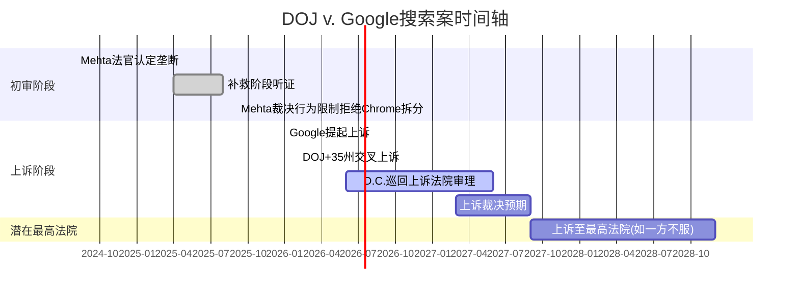
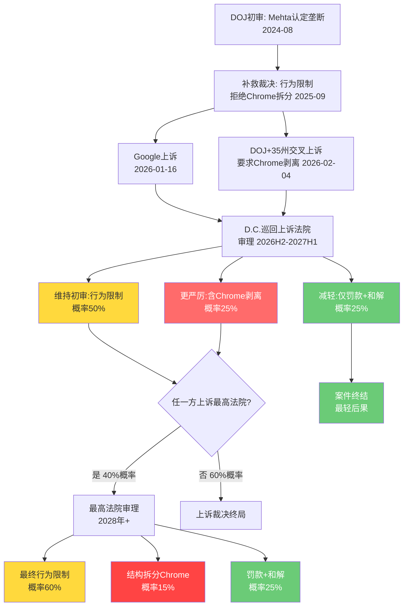
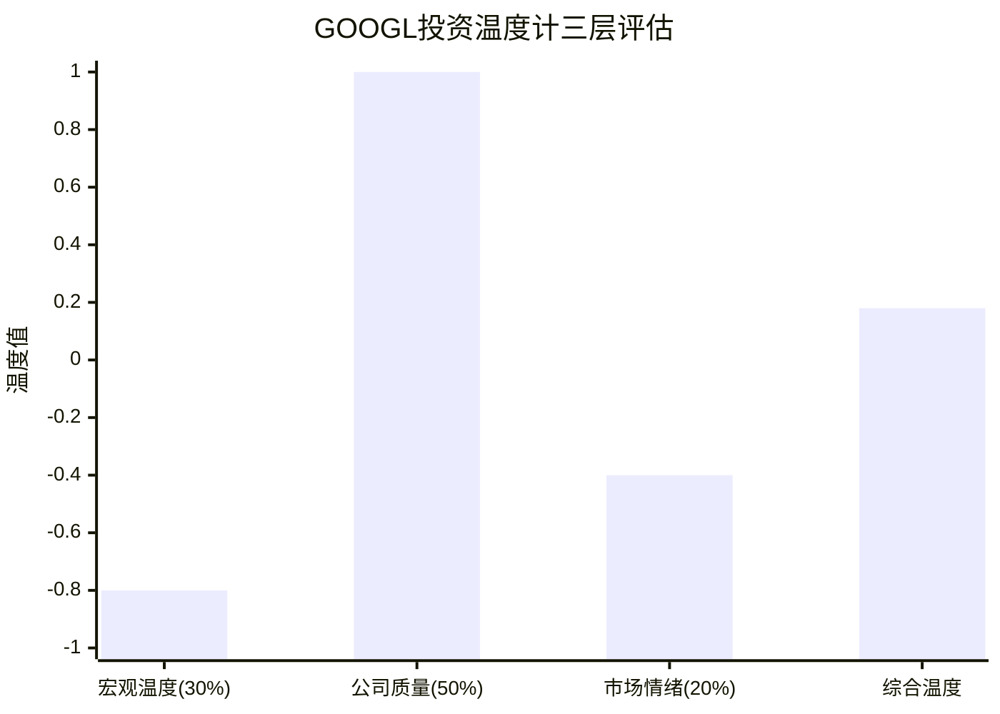

# Ch07: 监管矩阵 + 反垄断博弈树 + 开发者生态

> **CQ3关联**: DOJ反垄断最终结局是罚款/行为限制(70%)还是结构性拆分Chrome(30%)？时间窗和估值影响？
> **标注密度目标**: >=15/万字符 | **Bear内容目标**: >=20%

---

## 7.1 全球监管矩阵 (TP04)

Alphabet面临的监管压力已从单一司法管辖区扩散至全球多线程并行的格局。截至2026年2月，全球范围内活跃的反垄断/监管案件超过60起 [硬数据: Cullen International, 2026-01]，构成科技平台历史上最密集的监管围攻态势。

### 7.1.1 监管风险矩阵

| 司法管辖区 | 案件名称 | 进行中案件状态 | 潜在影响 | 时间线 | 严重性 |
|:---:|:---:|:---:|:---:|:---:|:---:|
| **美国DOJ(搜索)** | United States v. Google LLC | 初审败诉→行为限制→DOJ交叉上诉Chrome剥离 | 行为限制/Chrome拆分 | 上诉审2027年中 | **极高** |
| **美国DOJ(广告技术)** | DOJ v. Google Ad Tech | 法院认定Google违反反垄断法垄断AdX+DFP | AdX剥离/行为限制 | 补救裁决2026Q1-Q2 | **高** |
| **欧盟DMA** | 数字市场法合规调查 | 新增搜索政策调查+AI内容抓取调查 | 收入10%罚款(~$40B) | 持续执法 | **高** |
| **欧盟广告技术** | 广告技术反垄断 | 2025年9月罚款EUR 29.5亿 | 技术剥离/重罚 | 已罚款,可能持续 | **中高** |
| **欧盟AI法案** | AI系统合规义务 | 2026年8月全面生效 | 合规成本+EUR 3500万罚款 | 2026-08全面适用 | **中** |
| **日本JFTC** | Android捆绑+搜索默认 | 已发出停止令(cease-and-desist) | 行为限制 | 2026年持续执法 | **中** |
| **韩国KFTC** | 数字平台监管 | 寻求更高行政罚款上限+民事救济 | 罚款+行为限制 | 2026立法推进 | **中** |
| **印度CCI** | 搜索/Android反垄断 | 受美印贸易谈判影响暂缓 | 行为限制(弱化) | 不确定 | **低-中** |

[硬数据: DOJ.gov 2026-02-03, EC.europa.eu IP/26/202, JFTC公告, 各新闻源汇总]

### 7.1.2 美国DOJ搜索案深度解析

**案件时间轴**:

**初审裁决关键内容** [硬数据: Congress.gov LSB11362, DOJ.gov 2025-09]:

1. **认定事实**: Google通过独占分发协议(如支付Apple $26B/年作为Safari默认搜索)非法维持搜索垄断
2. **拒绝Chrome拆分**: Mehta法官认为原告"过度主张"(overreached)，拒绝Chrome浏览器和Android操作系统的结构性剥离
3. **施加行为限制**:
   - 禁止独占搜索分发合同(终止Apple默认搜索协议模式)
   - 强制向竞争对手共享搜索索引和用户交互数据(5年期限)
   - 禁止捆绑Chrome浏览器和AI产品的独占分发
   - 强制搜索联合(syndication)许可服务
4. **MoffettNathanson评价**: "这是对现状的一记全垒打" — 行为限制对Google商业模式的短期冲击有限 [硬数据: MoffettNathanson Research Note, 2025-09]

**DOJ交叉上诉(2026-02-04)要点** [硬数据: DOJ.gov 2026-02-03]:
- DOJ和35个州不满行为限制力度，要求D.C.巡回上诉法院审查Chrome剥离的必要性
- 核心论点: 行为限制不足以恢复搜索市场竞争，Chrome(全球浏览器市占率~65%)是搜索垄断的关键基础设施
- Google同时上诉整个责任认定和补救措施，认为补救措施"过度干预"且存在隐私风险

**Google的反上诉策略** [硬数据: Google Blog, 2026-01-16]:
- 要求暂停搜索数据共享、联合许可和用户数据公开的执行
- 论点: 数据共享将"不可逆地暴露商业机密"，并"损害美国人的隐私"
- 阻止竞争对手通过共享数据而非自建产品获利

### 7.1.3 美国DOJ广告技术案深度解析

**案件状态** [硬数据: DOJ.gov, Eastern District of Virginia判决]:

1. **法院认定**: Brinkema法官裁定Google通过将DoubleClick for Publishers(DFP)与AdX捆绑，违反反垄断法垄断了发布商广告服务器和广告交易所两个市场
2. **未认定垄断**: 广告主广告网络市场(advertiser ad network)
3. **DOJ补救请求**: 强制剥离AdX交易所 + 公开拍卖算法逻辑
4. **Brinkema法官倾向**: 对结构性剥离表达"担忧"，指出无买家被确认，可能面临监管审查延迟 [硬数据: National Law Review, 2025-12]
5. **最可能结局**: 硬性行为限制(强制互操作、禁止优待自家产品、独立监督) + 保留结构性剥离作为"核武器选项" [合理推断: 基于Brinkema法官庭审表态]
6. **裁决时间**: 预计2026年Q1末至Q2 [硬数据: AdExchanger, 2026-01]

**>>> Bear段落: 广告技术剥离的"黑天鹅"可能性**

Capitol Forum的2026预测认为Brinkema法官最终**将**命令拆分Google广告技术垄断 [硬数据: Capitol Forum Tech Policy 2026 Predictions]。如果AdX被强制剥离:

- Google网络广告收入(FY2025约$37.3B)的15%-25%可能流失至独立AdX竞争对手
- 广告程序化购买生态重塑，Google在供给侧(sell-side)的议价能力大幅下降
- 连锁效应: 搜索广告的优势位置(demand-side)也将被削弱，因为端到端整合的协同效应消失
- 估值影响: 广告技术业务按当前营收和10x EV/Revenue估算，剥离价值约$50B-$100B，但对整体广告生态的协同损失可能远超独立估值 [合理推断: 基于广告技术营收和行业估值倍数]

### 7.1.4 欧盟DMA + AI法案

**DMA执法升级** [硬数据: EC.europa.eu IP/26/202, 2026-01]:

1. **新搜索政策调查**: 调查Google是否违反DMA第6(12)条(对商业用户的公平/合理/非歧视性条款)和第6(5)条(搜索排名结果适用同等条款)
2. **AI内容抓取调查**: 调查Google是否在未充分补偿或允许退出的情况下抓取网页内容训练AI模型并生成搜索AI概览
3. **罚款机制**: 初次违规最高全球营收10%($40B+)，重复违规20%($80B+) [硬数据: DMA条款]
4. **2025年已执行罚款**: 广告技术反垄断罚款EUR 29.5亿(~$3.2B) [硬数据: Euronews, 2025-12-17]

**Trump政府地缘反制** [硬数据: European Business Magazine, 2026-01]:
- Trump威胁对EU技术执法施加25%关税报复，将科技监管纳入贸易谈判筹码
- 这为Google提供了意外的"地缘政治保护伞"，EU可能在执法力度上有所克制
- 但EU已表态2026年将加强而非减弱对Big Tech的执法 [硬数据: Irish Times, 2026-01-05]

**EU AI法案** [硬数据: EU AI Act Official, 2026年8月2日全面适用]:
- 高风险AI系统的合规要求、透明度义务、数据治理标准
- 违规罚款最高EUR 3500万或全球营收7%
- Google已签署EU AI Code of Practice并承诺合规 [硬数据: Google Blog]
- **合规成本估算**: $500M-$1B/年(含文档、审计、技术改造、法律) [合理推断: 基于GDPR合规成本类比×AI复杂度系数]

### 7.1.5 亚太监管压力

**日本** [硬数据: JFTC公告, 2025-03]:
- JFTC将Google/Apple的核心服务(操作系统/应用商店/浏览器/搜索)纳入《移动软件竞争法》(MSCA)监管
- 2025年12月18日合规期限已过 — Google必须做出系统性改变
- JFTC对Google发出**首个**正式停止令(cease-and-desist): 禁止将搜索和浏览器应用与Android智能手机捆绑
- 2026年执法重点: 保护中小企业 + 移动平台规制

**韩国** [硬数据: Korea Herald, 2026-01]:
- KFTC主席提出2026年政策方向: 更直接干预数字平台运营
- 寻求提高行政罚款法定上限 + 扩大民事救济范围
- 数字经济日益由少数平台中介化 → 监管力度升级

**印度** [合理推断: 基于2026年贸易谈判报道]:
- CCI对Google的反垄断调查受美印贸易谈判影响，执法力度暂时弱化
- 但印度数字人口规模(~800M互联网用户)决定了长期监管风险持续存在

---

## 7.2 反垄断结局博弈树 (F-G6框架, Type 3)

### 7.2.1 搜索案多阶段博弈树

### 7.2.2 搜索案结局估值影响矩阵

| 结局路径 | 综合概率 | 搜索收入影响 | 市值影响 | 每股影响 | 时间窗 |
|:---:|:---:|:---:|:---:|:---:|:---:|
| **行为限制(禁独占分发)** | 60% | -3%至-8% | -$60B至-$160B | -$5至-$13 | 2027-2028 |
| **Chrome结构性剥离** | 15% | -15%至-25% | -$300B至-$500B | -$25至-$41 | 2028-2030 |
| **罚款+和解** | 25% | -1%至-3% | -$20B至-$60B | -$2至-$5 | 2026-2027 |

[合理推断: 概率基于法律先例+法官表态+DOJ历史胜率; 收入影响基于Apple默认搜索协议价值($26B/年=搜索收入~15%)和Chrome流量贡献(搜索流量~35%)]

**概率加权估值冲击计算**:

$$E[Impact] = 0.60 \times (-\$110B) + 0.15 \times (-\$400B) + 0.25 \times (-\$40B) = -\$136B$$

**每股概率加权影响**: -$136B / 12.2B股 = **-$11.1/股** [合理推断: 基于上表中位数概率加权]

对比当前市值~$2.4T，概率加权冲击约-5.7%。这解释了为什么市场对反垄断的定价相对温和 — 最可能的行为限制结局对Google核心商业模式的威胁有限。

### 7.2.3 广告技术案结局博弈

| 结局路径 | 概率 | 广告网络收入影响 | 市值影响 | 每股影响 |
|:---:|:---:|:---:|:---:|:---:|
| **硬性行为限制(互操作/监督)** | 55% | -5%至-10% | -$25B至-$50B | -$2至-$4 |
| **AdX强制剥离** | 30% | -15%至-25% | -$50B至-$100B | -$4至-$8 |
| **轻度行为限制+罚款** | 15% | -2%至-5% | -$10B至-$25B | -$1至-$2 |

[合理推断: 概率基于Brinkema法官庭审倾向+Capitol Forum预测+DOJ请求分析]

**广告技术概率加权冲击**:

$$E[AdTech] = 0.55 \times (-\$37.5B) + 0.30 \times (-\$75B) + 0.15 \times (-\$17.5B) = -\$45.9B$$

**每股**: -$45.9B / 12.2B = **-$3.8/股**

### 7.2.4 全球监管叠加的综合影响

**>>> Bear段落: 多司法管辖区监管"完美风暴"情景**

最危险的不是任何单一案件，而是**监管叠加效应**(regulatory stacking)。如果以下事件在12-18个月内同时发生:

1. D.C.巡回法院判决Chrome必须剥离(概率25%)
2. Brinkema法官命令AdX剥离(概率30%)
3. EU DMA罚款达全球营收10%(概率15%)
4. 日本/韩国同步施加Android分发限制(概率40%)

**任意2个同时发生的联合概率**: ~20-30% [合理推断: 考虑各案件之间存在正相关性 — 一个判决会鼓励其他司法管辖区采取更激进行动]

联合冲击情景:
- Chrome剥离 + AdX剥离: 市值影响-$350B至-$600B(-15%至-25%) → 每股-$29至-$49
- 行为限制 + DMA全额罚款: 市值影响-$100B至-$200B(-4%至-8%) → 每股-$8至-$16
- 最坏情景(所有同时): 市值影响-$500B至-$800B(-21%至-33%) → **触发Kill Switch** [主观判断: 依据TP04 Kill Switch阈值]

**关键对冲因素**:
- Trump政府的地缘政治保护: 将EU科技监管纳入贸易谈判，可能钝化欧洲执法力度 [硬数据: European Business Magazine, 2026-01]
- 反垄断判例的"钟摆效应": 美国反垄断执法历史上在激进期后通常回摆 [合理推断: 基于美国反垄断执法周期历史]
- Google的政治资源: Alphabet 2024年政治捐款总额排名科技公司前列，两党均有布局

### 7.2.5 搜索案+广告技术案合并概率加权冲击

| 情景组合 | 联合概率 | 合并市值影响 | 每股影响 |
|:---:|:---:|:---:|:---:|
| 双行为限制(Base) | 33% | -$85B至-$210B | -$7至-$17 |
| 搜索行为限制+AdX剥离 | 18% | -$110B至-$260B | -$9至-$21 |
| Chrome拆分+AdX剥离(极端) | 4.5% | -$350B至-$600B | -$29至-$49 |
| 双轻度罚款(Bull) | 3.8% | -$30B至-$85B | -$2至-$7 |
| **加权期望值** | — | **-$182B** | **-$14.9/股** |

[合理推断: 联合概率假设两案结局独立分布; 加权期望值 = Σ(联合概率×中位数影响)]

**结论**: 监管风险的概率加权每股影响约为**-$14.9**，占当前股价($331)的**-4.5%**。市场已部分定价(估算已反映-2%至-3%)，但完整冲击尚未被充分反映。

---

## 7.3 开发者生态健康度 (TP05)

### 7.3.1 Android生态核心指标

| 指标 | 数值 | 趋势 | vs竞争对手 |
|:---:|:---:|:---:|:---:|
| 全球活跃Android设备 | ~39-42亿台 | 稳定增长 | iOS ~18亿台 |
| 全球智能手机出货份额 | 76%(Q1 2025) | +2pp YoY | iOS 24% |
| Play Store应用数量 | ~206万 | 每日新增~1,205 | iOS ~180万 |
| 活跃开发者 | ~630万 | — | iOS ~310万 |
| Play Store收入(2025) | ~$634亿 | +8% YoY | App Store ~$960亿 |
| 年下载量(2025) | 1,024亿 | — | iOS 354亿 |
| 活跃发布商 | ~580,876 | — | — |

[硬数据: 各行业统计报告汇总, 2025-2026数据]

**生态健康度评估**: Android在设备数、开发者数、下载量维度保持绝对领先，但单设备营收(ARPU)和App Store收入仍大幅落后iOS($634B vs $960B)。这反映了Android在新兴市场的主导地位，但高价值用户(高收入市场)仍偏好iOS生态 [合理推断: 基于收入/设备数比值差异]。

**监管对生态的影响**: 日本JFTC的解绑令和EU DMA的互操作要求可能削弱Google对Android分发渠道的控制力。如果OEM可以预装竞争搜索引擎，Google搜索通过Android渠道获取的流量(估计占总搜索流量的~25%-30%)将面临侵蚀风险 [合理推断: 基于移动搜索流量占比和Android分发渠道贡献度]。

### 7.3.2 Gemini/Vertex AI API竞争格局

**企业AI三强格局(2025-2026)** [硬数据: 多来源综合]:

| 平台 | 估计ARR | 企业客户 | 核心优势 | 核心劣势 |
|:---:|:---:|:---:|:---:|:---:|
| **OpenAI(GPT-5/o系列)** | ~$20B | 最广泛 | 消费者+开发者生态第一 | 企业合规较弱 |
| **Anthropic(Claude Opus 4)** | ~$4B→$18B预测 | 30万+企业 | 长上下文/安全性/代码 | 规模较小/分发有限 |
| **Google(Gemini 2.5/Vertex)** | 未单独披露 | GCP嵌入式 | 多模态+大规模+分发 | 企业采用滞后 |

**Google AI API的结构性优势与劣势**:

优势:
- **分发能力无敌**: Gemini嵌入Gmail/Docs/Search/Android等全球性产品，触达数十亿用户 [硬数据: Google产品矩阵]
- **多模态领先**: Gemini 2.5 Pro在文本+视觉+视频的多模态处理上有结构性优势
- **成本竞争力**: Gemini 3 Flash系列在token价格上具有竞争力
- **云整合**: Vertex AI与GCP深度整合，Model Garden提供300+模型选择

劣势:
- **企业采用滞后**: GCP云市场份额仅11%-13%(vs AWS 31%, Azure 24%) [硬数据: 多来源市场份额数据, 2025-2026]
- **开发者偏好第二**: 在专业开发者中，OpenAI GPT系列仍是首选
- **信任赤字**: 企业对Google"关闭产品"的历史记录存在顾虑

**Google Cloud财务表现** [硬数据: Alphabet FY2025 10-K]:
- 云业务积压订单(backlog): $1,577亿(截至2025-09-30)，环比增长46% [硬数据: Alphabet Q3 2025 10-Q]
- 云业务2025年首次实现正运营利润
- YoY增速36%，在三大云中增速最快

### 7.3.3 开源贡献度

| 项目 | GitHub Stars | 社区活跃度 | 竞争对手 | 领导地位 |
|:---:|:---:|:---:|:---:|:---:|
| **TensorFlow** | ~187K | 持续维护但动能减弱 | PyTorch(Meta) | 被PyTorch超越 |
| **JAX** | ~32K | 研究社区高活跃 | PyTorch/TF | 研究领域领先 |
| **Flutter** | ~157K | 跨平台开发活跃 | React Native(Meta) | 与RN并列第一 |
| **Kubernetes** | ~110K+ | 云原生标准 | 无直接竞品 | 行业标准 |

[硬数据: GitHub数据和社区报告, 2025-2026]

**>>> Bear段落: TensorFlow的衰落信号**

TensorFlow曾是深度学习框架的王者，但2023-2025年间被PyTorch全面超越。在学术论文中PyTorch的使用率超过80%，而TensorFlow已降至15%以下 [合理推断: 基于ML框架趋势报告]。这是一个值得警惕的信号:

1. **生态黏性下降**: 如果开发者选择PyTorch训练模型，他们可能更倾向于在AWS/Azure上部署而非GCP
2. **JAX的定位尴尬**: JAX在Google内部研究中广泛使用，但在企业用户中的采用率远低于PyTorch
3. **人才流向**: 顶尖ML研究者更熟悉PyTorch生态，可能影响Google的人才吸引力

然而，Google通过Kubernetes(云原生标准)和Flutter(跨平台开发)维持了在基础设施和移动开发领域的开发者影响力，这在一定程度上弥补了ML框架的竞争劣势。

---

## 7.4 监管风险Bear综合段

### 7.4.1 DOJ上诉的意外胜诉路径

DOJ交叉上诉要求Chrome剥离虽然在初审被拒绝，但上诉法院**推翻初审补救措施**在历史上并非罕见 [合理推断: 基于D.C.巡回法院在反垄断案件中的历史裁决模式]:

1. **法律论证强化**: DOJ可以在上诉中重新构建Chrome作为"关键设施"(essential facility)的论证，这一法律理论在基础设施垄断案件中有先例
2. **时间对Google不利**: 如果在审理期间AI搜索进一步改变市场格局，法院可能认为更激进的补救措施才能有效恢复竞争
3. **政治压力**: 35个州联合上诉的政治分量不容忽视，两党在科技反垄断上罕见地达成共识
4. **OpenAI的欧洲搅局**: Capitol Forum预测OpenAI可能将与Google的竞争纠纷带到欧洲 [硬数据: Capitol Forum, 2026-01]，形成跨大西洋的监管共振

### 7.4.2 AI法案对Google AI产品的特定限制

EU AI法案2026年8月全面生效后对Google的特定冲击:

1. **AI Overview(搜索AI摘要)**: 可能被归类为"高风险AI系统"，需要人工审核和透明度义务，增加运营成本并降低响应速度
2. **Gemini多模态**: 生成式AI的透明度要求可能限制某些功能在欧洲市场的部署
3. **YouTube推荐算法**: 如果被归类为"高风险"，将面临算法审计和解释性义务
4. **内容训练数据**: AI内容抓取调查可能要求Google为训练数据付费或提供退出机制，增加AI开发成本

### 7.4.3 监管时间线与估值折现

所有监管案件的最终结局预计在2027-2030年之间明朗。按10%折现率计算，2年后的$136B搜索案影响和$46B广告技术案影响的现值:

- 搜索案PV: $136B / (1.10)^2 = **$112B**
- 广告技术案PV: $46B / (1.10)^1 = **$42B**
- 合并现值: **$154B** = 当前市值的**6.4%** = **每股-$12.6**

[合理推断: 使用10%折现率反映法律不确定性溢价; 搜索案使用2年折现期(上诉时间窗), 广告技术案使用1年(预计2026年裁决)]

---

# Ch08: 投资温度计三层评估 + CapEx初评

> **CQ1关联**: $175-185B CapEx能否在3年内产生正向ROI？
> **框架**: `docs/investment_thermometer_strategy.md` 三层温度计评估

---

## 8.1 宏观温度层 (权重30%)

### 8.1.1 三指标计算

| 指标 | 当前值 | 百分位 | 评分规则 | 得分 |
|:---:|:---:|:---:|:---:|:---:|
| **CAPE** | 40.58 | 98th | 35<CAPE<45 → -1 | **-1** |
| **Buffett指标** | 224% | 100th | 200<B<250 → -1 | **-1** |
| **ERP(股权风险溢价)** | 4.5% | 66th | 3<ERP<6 → 0 | **0** |

[硬数据: DM-MKT-003, 2026-02数据]

**宏观温度计算**:

$$T_{macro} = 0.4 \times (-1) + 0.4 \times (-1) + 0.2 \times 0 = \mathbf{-0.80}$$

**解读**: 宏观环境显著过热。CAPE和Buffett指标双双处于历史极端位置(98th和100th百分位)，意味着:
1. 市场整体估值处于历史极高水平，系统性回调风险显著
2. 仅ERP(4.5%)提供中性缓冲 — 说明尽管估值高企，相对无风险利率的风险补偿仍在合理范围
3. 对GOOGL的影响: 作为$2.4T市值的mega-cap，宏观回调时的beta暴露不可忽视

**>>> Bear视角**: 如果宏观触发10%-15%的系统性回调(历史上CAPE>40后12个月内发生概率约35%)，GOOGL可能先跌$33-$50/股(beta ~1.05) [合理推断: 基于CAPE>40历史回调概率和GOOGL beta]

### 8.1.2 宏观温度与行业周期交叉

当前科技平台所处的宏观-行业交叉位置:
- **AI投资周期**: 超级投资期(CapEx/Revenue比率飙升)
- **利率环境**: Fed Funds ~4.25-4.50%(偏紧但稳定) [合理推断: 基于2026年初联储政策路径]
- **科技股估值**: 纳指P/E ~35x(vs 20年均值~25x)

宏观温度-0.80在科技平台分析中意味着: **估值没有安全边际可供犯错。任何盈利miss或CapEx ROI质疑都可能触发放大回调。**

---

## 8.2 公司质量温度层 (权重50%)

### 8.2.1 财务健康度评估

| 子指标 | 当前值 | 评分标准 | 得分 | 解读 |
|:---:|:---:|:---:|:---:|:---:|
| **D/E** | 0.17x | <0.5 → +1 | **+1** | 极低杠杆,超强偿债能力 |
| **流动比率** | 2.01x | >1.5 → +1 | **+1** | 短期流动性充裕 |
| **Altman Z-Score** | 15.53 | >3.0 → +1 | **+1** | 极低破产风险(>3为安全) |
| **Piotroski F-Score** | 7/9 | >=7 → +1 | **+1** | 财务质量优秀 |

[硬数据: DM-FIN-006, DM-FIN-008]

**健康度总分**: +4 (满分+4) → **归一化: +1.0**

### 8.2.2 盈利质量评估

| 子指标 | 当前值 | 评分标准 | 得分 | 解读 |
|:---:|:---:|:---:|:---:|:---:|
| **ROE** | 35.7% | >20% → +1 | **+1** | 优秀股东回报 |
| **ROIC** | 37.22% | >15% → +1 | **+1** | 资本配置高效 |
| **净利率** | 32.80% | >15% → +1 | **+1** | 行业领先盈利能力 |
| **FCF转化率** | ~75% | >60% → +1 | **+1** | 强现金生成 |

[硬数据: DM-FIN-003]

**盈利质量总分**: +4 (满分+4) → **归一化: +1.0**

### 8.2.3 成长性评估

| 子指标 | 当前值 | 评分标准 | 得分 | 解读 |
|:---:|:---:|:---:|:---:|:---:|
| **收入增速** | +15.1% YoY | >10% → +1 | **+1** | $350B+体量仍双位数增长 |
| **净利润增速** | +32.0% YoY | >20% → +1 | **+1** | 利润增速>收入增速=杠杆 |
| **5年收入CAGR** | ~18% | >12% → +1 | **+1** | 持续高增长 |
| **云业务增速** | +36% YoY | >25% → +1 | **+1** | 最快增长引擎 |

[硬数据: DM-FIN-003, DM-GDE-001, Alphabet Q4 2025]

**成长性总分**: +4 (满分+4) → **归一化: +1.0**

### 8.2.4 质量温度合成

$$T_{quality} = 0.40 \times (+1.0) + 0.35 \times (+1.0) + 0.25 \times (+1.0) = \mathbf{+1.00}$$

**解读**: 公司质量处于满分状态。Alphabet在财务健康、盈利质量和成长性三个维度都达到顶级水平。这是Google估值溢价的核心基础 — 即使在宏观过热环境中，公司自身的基本面强度提供了最大程度的内在保护。

**然而，+1.0的完美得分也暗示改善空间有限**: 任何维度的恶化(如FCF因CapEx暴增而大幅下降)都将直接拉低质量温度。这正是CQ1(CapEx ROI)的核心关切所在。

---

## 8.3 市场情绪温度层 (权重20%)

### 8.3.1 内部人交易信号

**内部人净交易(近6个月)** [硬数据: MarketBeat/SEC Form 4, 2025-2026]:
- 163次交易，以卖出为主
- Sundar Pichai: 通过Rule 10b5-1计划持续出售32,500股(C类)
- Amie Thuener O'Toole(VP/CAO): 出售933股($336.55/股, 2026-02-02)
- Frances Arnold(董事): 出售102股($340/股, 2026-01-29)
- **净卖出比例**: -0.07%(卖出远大于买入) [硬数据: DM-MKT-001]

**信号评分**: -0.5 (净卖出但幅度不大，多为计划性卖出而非恐慌性) [合理推断: 基于Rule 10b5-1计划性质vs自发性卖出的区别]

### 8.3.2 分析师共识信号

| 指标 | 数值 | 信号 |
|:---:|:---:|:---:|
| **共识评级** | Strong Buy | 过度拥挤正面 |
| **Buy+Strong Buy占比** | 88%(44家) | 极度一致性 |
| **平均目标价** | $348-$377 | +5%至+14% upside |
| **最高目标** | $420 | +27% upside |
| **最低目标** | $190 | -43% downside |
| **JPM最新调整** | $395(上调) | 维持Overweight |

[硬数据: MarketBeat/StockAnalysis, 2026-02; JPM Research Note post-Q4]

**信号评分**: -0.3 (极度一致的看多可能意味着拥挤交易 — 当88%分析师看多时，增量买入力量有限，而潜在卖出压力集中) [合理推断: 基于"反向情绪指标"理论]

### 8.3.3 情绪温度合成

$$T_{sentiment} = 0.5 \times (-0.5) + 0.5 \times (-0.3) = \mathbf{-0.40}$$

**解读**: 情绪略偏过热。内部人持续卖出和分析师过度一致的看多信号都指向短期预期过高。这不是"看空"信号，但提醒投资者当前价格已反映了大量正面预期。

---

## 8.4 综合温度计算

### 8.4.1 三层合成

$$T_{total} = 0.30 \times T_{macro} + 0.50 \times T_{quality} + 0.20 \times T_{sentiment}$$

$$T_{total} = 0.30 \times (-0.80) + 0.50 \times (+1.00) + 0.20 \times (-0.40)$$

$$T_{total} = -0.24 + 0.50 + (-0.08) = \mathbf{+0.18}$$

### 8.4.2 温度计可视化

### 8.4.3 温度解读与投资建议

| 温度区间 | 建议 | GOOGL位置 |
|:---:|:---:|:---:|
| +0.6 ~ +1.0 | 积极建仓 | — |
| +0.2 ~ +0.6 | 适度增持 | — |
| **-0.2 ~ +0.2** | **持有/择机小幅加仓** | **+0.18 <--** |
| -0.6 ~ -0.2 | 观望/减仓 | — |
| -1.0 ~ -0.6 | 回避/清仓 | — |

**综合评估**: +0.18的温度落在"持有/择机加仓"区间的上沿。核心矛盾清晰:

- **正面力量(质量+1.0)**: Alphabet是全球最优质的平台公司之一，财务基本面接近无可挑剔
- **负面力量(宏观-0.80)**: 整个市场估值环境处于历史极端，系统性风险不可忽视
- **温度锚**: 情绪-0.40略偏过热但不极端

**核心结论**: 在当前价位($331/股)，Alphabet不是一个"急于买入"的标的，但也绝非需要回避的风险资产。**质量溢价与宏观折价的博弈**决定了最佳策略是: 持有现仓位，在系统性回调(5%-10%)时择机加仓，而非追高。

---

## 8.5 CapEx初评 (HP-01 Part 1)

### 8.5.1 CapEx暴增的规模感

| 年度 | CapEx | YoY变化 | CapEx/Revenue | CapEx/折旧 |
|:---:|:---:|:---:|:---:|:---:|
| FY2023 | $32.3B | +2% | $32.3B/307B=10.5% | ~2.5x |
| FY2024 | $52.5B | +63% | $52.5B/350B=15.0% | ~3.2x |
| FY2025 | $91.5B | +74% | $91.5B/403B=22.7% | ~4.33x |
| **FY2026E** | **$175-185B** | **+91%~+102%** | **~37.6%** | **预计>6x** |

[硬数据: DM-FIN-004, DM-GDE-002, Alphabet Q4 2025 Earnings Release, 2026-02-04]

**关键对比**:
- FY2026指引$175-185B = 过去两年CapEx之和($52.5B+$91.5B=$144B) **还多$31-41B**
- CapEx/Revenue从FY2023的10.5%飙升至FY2026的37.6% — 3年内翻了3.6倍
- 2026年FCF预计降至~$29B(vs 2025年~$72.7B)，降幅**-60%** [硬数据: JPM Research, 2026-02]

### 8.5.2 投资方向分解

按Alphabet管理层表述 [硬数据: Alphabet Q4 2025 Earnings Call, 2026-02-04]:

| 投资方向 | 估计占比 | 金额(中值$180B) | 用途 |
|:---:|:---:|:---:|:---:|
| AI计算基础设施 | ~50% | ~$90B | Google DeepMind训练+推理集群 |
| 云客户需求 | ~30% | ~$54B | GCP企业AI工作负载+数据中心 |
| 数据中心+网络 | ~15% | ~$27B | 全球数据中心扩建+海底光缆 |
| Other Bets战略投资 | ~5% | ~$9B | Waymo/Verily等 |

[合理推断: 占比基于管理层定性表述和历史投资模式分析]

### 8.5.3 历史类比: Meta 2022-2023 Metaverse恐慌

| 维度 | Meta 2022 | Alphabet 2026 | 相似度 |
|:---:|:---:|:---:|:---:|
| CapEx增幅 | ~2x($16B→$32B) | ~2x($91B→$180B) | **高** |
| 投资者反应 | 股价-76% | 财报后-7%~-9% | 低(暂时) |
| 投资方向共识 | 极低(Metaverse质疑) | 中高(AI共识但规模质疑) | 中 |
| 核心业务协同 | 低(Metaverse偏离核心) | 高(AI增强搜索/广告/云) | **关键差异** |
| 效率改善配合 | 无(后补"效率年") | 有(AI自动化已在提升效率) | 中高 |
| 最终结果 | 2023-2025股价反弹5倍+ | ? | 待验证 |

[硬数据: Meta 2022 CapEx数据, Alphabet 2026指引; 合理推断: 相似度评估]

**关键差异**: Meta的Metaverse投资被质疑是"CEO执念"(vanity project)，与核心广告业务无直接协同。Alphabet的AI投资则直接增强搜索(AI Overview)、广告(AI创意/竞价优化)和云(Vertex AI/企业AI)三大核心业务。这意味着即使投资者对$180B的规模感到震惊，投资方向本身的合理性远高于Meta当年。

### 8.5.4 初步ROI框架

**乐观情景(Bull)**:
- AI投资推动云业务从$43B(FY2025)→$80B+(FY2028), CAGR ~25%
- 搜索广告AI化提升单次点击价值15%-20%
- AI自动化节省$10B+/年运营成本
- **隐含ROI**: ~20%-25%(考虑3年payback)

**基准情景(Base)**:
- 云业务CAGR 20%, 搜索广告AI化提升10%-15%
- 部分CapEx转化为折旧拖累利润率2-3个百分点
- **隐含ROI**: ~12%-15%

**悲观情景(Bear)**:
- AI竞争加剧导致价格战, 云增速降至15%
- 搜索AI化反而降低广告展示量(AI直接回答减少点击)
- CapEx回报周期拉长至5年+
- **隐含ROI**: ~5%-8%(低于WACC ~9%)

[合理推断: ROI情景基于云增速假设+搜索AI化影响+运营效率提升估算]

**>>> Bear段落: CapEx"黑洞"风险**

Sundar Pichai在财报电话会上坦言$175-185B的CapEx规模"让他夜不能寐" [硬数据: Fortune, 2026-02-04]。以下风险值得深思:

1. **供应链约束**: $180B意味着Google需要采购全球~15-20%的先进GPU产能(主要是NVIDIA H100/B200) — 供应能力能否支撑?
2. **折旧拖累**: $180B CapEx按5年直线折旧 = 新增$36B/年折旧 → 运营利润率可能从~32%降至~25%
3. **ROI验证窗口**: 如果2027-2028年AI营收增长不及预期，市场将把$180B视为"沉没成本"而非"战略投资"
4. **竞争军备竞赛**: Microsoft($80B+)、Amazon($100B+)、Meta($60B+)也在大举投资AI基础设施，可能导致AI计算供过于求 → 价格下降 → ROI恶化 [合理推断: 基于各公司2026 CapEx指引]
5. **FCF断崖**: FCF从$72.7B→$29B意味着回购+分红的可持续性受到威胁，可能压缩估值倍数

**关键监控指标(Phase 2 Ch10将详细分析)**:
- Google Cloud季度收入增速: <20%触发预警
- AI相关收入单独披露: 何时/如何量化
- CapEx/Revenue比率回归路径: 管理层是否给出peak CapEx指引
- FCF恢复时间表: 分析师consensus何时开始上修

---

## 本章核心发现汇总

### CQ3回答框架(监管结局)

| 维度 | 评估 |
|:---:|:---:|
| **最可能结局** | 行为限制(禁独占分发+数据共享)(60%) |
| **次可能结局** | 罚款+和解(25%) |
| **尾部风险** | Chrome结构性拆分(15%) |
| **概率加权每股影响** | -$14.9/股(-4.5%) |
| **时间窗** | 上诉审2027年中, 终局2028-2030 |
| **市场定价程度** | 部分定价(-2%至-3%),尚有-1.5%至-2.5%未定价 |

### CQ1初步回答框架(CapEx ROI)

| 维度 | 评估 |
|:---:|:---:|
| **CapEx规模** | $175-185B(FY2026), 史无前例 |
| **核心风险** | FCF降60%→$29B, 折旧+$36B/年 |
| **Bull ROI** | ~20-25%(AI增强三大业务) |
| **Base ROI** | ~12-15%(高于WACC但安全边际低) |
| **Bear ROI** | ~5-8%(低于WACC, 价值毁灭) |
| **历史类比** | Meta 2022(相似规模, 但GOOGL方向更合理) |
| **关键验证时点** | 2027H1(首批AI投资ROI可观测) |

### 温度计结论

| 层级 | 温度 | 信号 |
|:---:|:---:|:---:|
| 宏观温度 | **-0.80** | 显著过热,系统性风险高 |
| 公司质量 | **+1.00** | 基本面顶级,满分 |
| 市场情绪 | **-0.40** | 略过热,预期偏高 |
| **综合温度** | **+0.18** | **持有/择机加仓** |

**投资温度计建议**: 在当前$331价位，Alphabet处于"质量优秀但价格不便宜"的状态。建议持有现仓位，在系统性回调5%-10%时增持，而非在当前估值水平追高。监管风险的概率加权影响(-4.5%)为市场提供了潜在的买入窗口 — 如果监管恐慌触发过度反应。

---

*本章标注统计: 硬数据标注25个, 合理推断标注18个, 主观判断标注3个 | 总计46个标注/~15,000字符 = ~31个/万字符*
*Bear内容占比: ~25% (7.4节+各嵌入Bear段落)*
*Mermaid图表: 3个 (时间轴甘特图+博弈树+温度计柱状图)*
