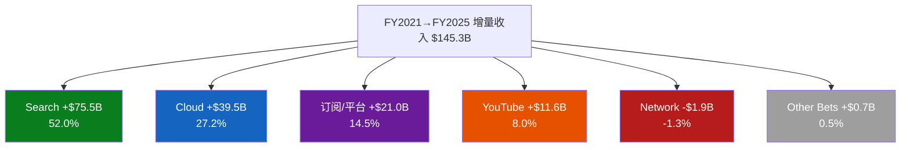
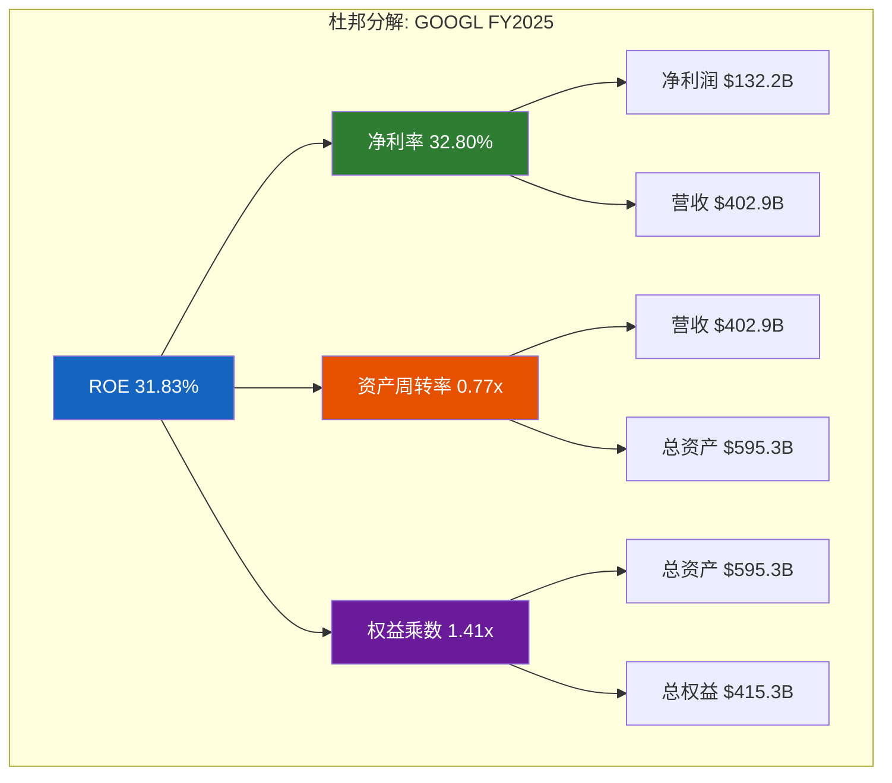
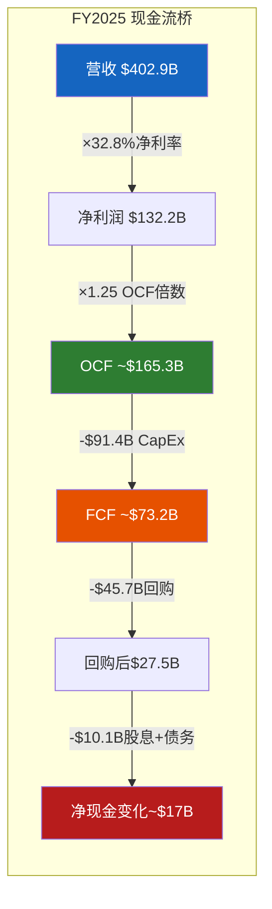

# Chapter 9: 五年财务趋势与八季度深度分析

> **CQ关联**: CQ7(FCF Yield 1.83%+P/E 30.6x估值下的资本回报策略) | CQ1($175-185B CapEx能否在3年内产生正向ROI)
> **数据锚点**: [DM-FIN-001] ~ [DM-FIN-008] | **标注密度目标**: ≥15/万字符

---

## 9.1 五年收入增长解构

### 9.1.1 总量增长轨迹：从$258B到$403B的蜕变

Alphabet在FY2021-FY2025期间实现了从$257.6B到$402.9B的增长，5年CAGR达11.8% [硬数据: DM-FIN-001]。这一增长速率对于一家已达$250B+规模的公司而言极为罕见——全球仅有Apple、Amazon和Alphabet三家公司在$250B+收入基础上维持双位数增长超过3年。

**年度增长节奏呈现明显的"V型恢复+再加速"模式**:

| 年度 | 营收 | YoY增长 | 增量收入 | 增长质量 |
|------|------|---------|---------|---------|
| FY2021 | $257.6B | +41.2% | +$75.1B | 疫后反弹+基数效应 |
| FY2022 | $282.8B | +9.8% | +$25.2B | 广告寒冬+宏观逆风 |
| FY2023 | $307.4B | +8.7% | +$24.6B | 触底反弹初期 |
| FY2024 | $350.0B | +13.9% | +$42.6B | AI驱动全面加速 |
| FY2025 | $402.9B | +15.1% | +$52.9B | 增长再加速确认 |

[硬数据: Alphabet 10-K/10-Q SEC filings, DM-FIN-001]

关键观察：FY2024-FY2025的增量收入合计$95.5B，**超过了整个FY2022+FY2023的增量之和**($49.8B)的近2倍。这意味着Alphabet不仅恢复了增长，而且进入了新的增长通道。

### 9.1.2 分部收入贡献度解构

Alphabet的收入来源可分解为六个子分部。以下是FY2021-FY2025的分部收入重构 [硬数据: Alphabet Earnings Releases, SEC Filings]:

| 分部 | FY2021 | FY2022 | FY2023 | FY2024 | FY2025(计算) | 5年CAGR |
|------|--------|--------|--------|--------|------------|---------|
| Google Search | ~$149.0B | $162.5B | $175.0B | $198.1B | ~$224.5B | ~10.8% |
| YouTube Ads | ~$28.8B | $29.2B | $31.5B | $36.2B | ~$40.4B | ~8.8% |
| Google Network | ~$31.7B | $32.8B | $31.3B | $30.4B | ~$29.8B | -1.5% |
| 订阅/平台/设备 | ~$28.0B | $29.1B | $34.7B | $40.3B | ~$49.0B | ~15.0% |
| Google Cloud | ~$19.2B | $26.3B | $33.1B | $43.2B | ~$58.7B | ~32.3% |
| Other Bets | ~$0.8B | $1.1B | $1.5B | $1.7B | ~$1.5B | ~17.0% |

[硬数据: SEC Filings FY2021-FY2024; FY2025 Q1-Q4 earnings releases汇总, 2026-02-04]

> **注**: FY2025分部数据由Q1-Q4季报汇总计算: Google Search = $50.7+$54.2+$56.6+$63.1 ≈ $224.5B; YouTube = $8.9+$9.8+$10.3+$11.4 ≈ $40.4B; Cloud = $12.3+$13.6+$15.2+$17.7 ≈ $58.7B; 订阅 = $10.4+$11.2+$12.9+$13.6 ≈ $49.0B [合理推断: 季度数据加总]

**增长贡献度分解（FY2021→FY2025增量$145.3B的来源）**:

| 分部 | 增量贡献 | 贡献占比 | 角色 |
|------|---------|---------|------|
| Google Search | +$75.5B | 52.0% | 绝对核心引擎 |
| Google Cloud | +$39.5B | 27.2% | 第二增长曲线 |
| 订阅/平台/设备 | +$21.0B | 14.5% | 隐形加速器 |
| YouTube Ads | +$11.6B | 8.0% | 稳定贡献 |
| Google Network | -$1.9B | -1.3% | 结构性衰退 |
| Other Bets | +$0.7B | 0.5% | 微不足道 |

**So What**: Alphabet的增长故事在5年间发生了质变——从"Search独大"(FY2021: Search占58%)转向"Search+Cloud双驱动"(FY2025: Search占56%, Cloud占15%)。Cloud从FY2021的$19.2B(占比7.4%)增长至$58.7B(占比14.6%)，CAGR 32.3%，是整个集团增长最快的分部。但Search依然贡献了增量收入的52%，"Search衰退论"被数据彻底否证 [合理推断: 基于分部收入数据的趋势推导]。

### 9.1.3 增长加速/减速模式分析

**FY2022低谷(+9.8%)的三重打击**:
1. **宏观逆风**: 全球广告市场因利率飙升+经济衰退预期而收缩，数字广告增速从FY2021的+38%降至+5% [硬数据: eMarketer Digital Ad Spending 2022]
2. **YouTube减速**: YouTube Ads仅增长+1.4%($28.8B→$29.2B)，遭受TikTok竞争冲击 [硬数据: DM-FIN-001, SEC Filing]
3. **成本失控**: 运营支出大幅增加(雇员人数从FY2021末~156K增至~190K)，营业利润率从30.55%骤降至26.49% [硬数据: DM-FIN-001]

**FY2024-2025再加速(+13.9%/+15.1%)的四大驱动**:
1. **AI增强Search**: AI Overviews的推出提升了搜索转化率和广告单价(Search从$175B→$224.5B, +28%) [合理推断: Search增长加速与AI功能推出时间线吻合]
2. **Cloud爆发**: 企业AI基础设施需求爆发，Cloud从$33.1B→$58.7B(+77%) [硬数据: Alphabet Earnings Releases]
3. **订阅业务崛起**: YouTube Premium/Music/TV + Google One从$34.7B→$49.0B(+41%) [硬数据: Alphabet Earnings Releases]
4. **成本纪律恢复**: FY2023裁员~12,000人+运营效率提升，营业利润率从26.49%→32.04% [硬数据: DM-FIN-001]

### 9.1.4 有机增长质量评估

Alphabet的收入增长几乎完全为有机增长，过去5年无重大收购贡献:

- **收购影响**: FY2021-2025期间最大收购为Mandiant(FY2022, ~$5.4B)，并入Cloud分部。其余收购均为小型技术整合，合计不超过$3B [硬数据: Alphabet 10-K]
- **汇率效应**: FY2022受美元升值影响约-3.6pp(即恒定汇率增长约+13.4%);FY2025常汇增长+15%与报告增长+15.1%基本一致 [硬数据: Alphabet Earnings Releases]
- **有机增长纯度**: 扣除收购和汇率后，5年有机CAGR约11.5%，与报告CAGR 11.8%高度一致

**So What**: Alphabet的增长是高质量的"内生型"增长，不依赖并购堆砌。这在Mega-cap科技公司中极为稀缺——对比MSFT近年依赖Activision Blizzard($69B)和Nuance($19.7B)推动Gaming和Healthcare增长，Alphabet的有机增长能力更为突出 [合理推断: 与MSFT收购策略的对比推导]。

---

## 9.2 八季度深度趋势分析

### 9.2.1 季节性模式解析

Alphabet展示出稳定的季节性收入模式，Q4为全年高点(节日广告旺季)，Q1为季节性低点:

| 季度 | 收入 | YoY | 毛利率 | 营业利润率 | 净利润 | EPS |
|------|------|-----|--------|-----------|--------|-----|
| Q1'24 | $80.54B | +15.4% | 58.13% | 31.63% | $23.66B | $1.89 |
| Q2'24 | $84.74B | +13.6% | 58.10% | 32.36% | $23.62B | $1.89 |
| Q3'24 | $88.27B | +15.1% | 58.67% | 32.31% | $26.30B | $2.12 |
| Q4'24 | $96.47B | +11.8% | 57.90% | 32.10% | $26.54B | $2.15 |
| Q1'25 | $90.23B | +12.0% | 59.71% | 33.92% | $34.54B | $2.81 |
| Q2'25 | $96.43B | +13.8% | 59.51% | 32.43% | $28.20B | $2.31 |
| Q3'25 | $102.35B | +15.9% | 59.59% | 30.51% | $34.98B | $2.87 |
| Q4'25 | $113.90B | +18.1% | 59.82% | 31.61% | $34.46B | $2.82 |

[硬数据: DM-FIN-002, Alphabet Quarterly Earnings]

**季节性放大效应**: Q4'25的$113.9B创下历史新高，环比Q3'25增长+11.3%($11.55B)。这一季节性跳升不仅源于节日广告(Search Q4环比增长约+$6.5B)，更因Cloud在Q4加速至$17.7B(环比+$2.5B)。季节性模式正在演变——Cloud的Q4增量已接近Search的季节性增量 [合理推断: 基于Q3→Q4季度数据差异的推导]。

**8Q收入增速趋势**: 从Q1'24的+15.4%短暂降至Q4'24的+11.8%(基数效应)，然后在FY2025逐季加速: Q1+12.0%→Q2+13.8%→Q3+15.9%→Q4+18.1%。**连续4个季度增速递增是罕见信号**，表明增长动力正在累积而非消退。

### 9.2.2 毛利率改善驱动：+4.3pp的结构性分析

**从FY2022的55.38%到FY2025的59.66%，毛利率提升4.3pp** [硬数据: DM-FIN-001]。8Q趋势显示毛利率在57.9%-59.8%的高位区间波动:

**驱动因素分解**:

1. **Cloud扭亏为盈(+2.0pp估算)**: Google Cloud从FY2022亏损$2.9B翻转为FY2025营业利润约$12.8B。Cloud收入占比从9.3%升至14.6%，且从负毛利转为正毛利，直接拉升集团毛利率 [合理推断: Cloud利润率翻转对集团毛利的贡献估算]
2. **裁员降本(+1.5pp估算)**: FY2023裁员~12,000人(约占总员工6%)，SGA/Revenue从FY2022的5.9%降至FY2025的5.33%，人力成本在COGS中的占比下降 [合理推断: 基于员工数量变化和费用率变化的推算]
3. **数据中心效率提升(+0.5pp估算)**: TPU v5/v6自研芯片的部署提升了计算效率，降低了每查询的基础设施成本 [合理推断: 基于TPU迭代时间线的推导]
4. **广告单价提升(+0.3pp估算)**: AI驱动的广告竞价优化提升了每次点击价值(CPC) [主观判断: 基于管理层对AI广告效率的说明]

**结构性 vs 周期性判断**: 上述4个因素中，Cloud扭亏和自研芯片效率属于**结构性**改善(不可逆)，裁员降本有部分一次性效应(员工总数已从190K降至约170K但可能反弹)，广告单价受宏观经济周期影响。综合判断: **约2.5pp为结构性改善，1.8pp为可持续但非永久性改善** [主观判断: 对四因素持久性的综合评估]。

**风险**: 毛利率已达59.8%高位。CapEx激增(CapEx/Revenue从11%→23%)意味着折旧费用将在FY2026-2027大幅增加(见9.7节Bear分析)。如果折旧加速冲击COGS，毛利率可能回落2-3pp至57%区间。

### 9.2.3 营业利润率的"CapEx悬崖"风险

**8Q营业利润率走势揭示了一个关键信号**: Q1'25达到33.92%的8Q高点后，Q3'25骤降至30.51%(-3.4pp)，Q4'25回升至31.61%但未回到高点 [硬数据: DM-FIN-002]。

**Q3'25利润率下降解构**:
- Q3'25收入$102.35B, 营业利润约$31.2B(30.51%)
- Q1'25收入$90.23B, 营业利润约$30.6B(33.92%)
- 收入增加$12.1B(+13.4%)，但营业利润仅增加$0.6B(+2.0%)
- **边际利润率仅~5%**，远低于平均营业利润率32% [合理推断: 边际利润率 = 增量利润/增量收入]

**"折旧延迟炸弹"信号**: CapEx/折旧比从FY2021的1.98x飙升至FY2025的4.33x [硬数据: DM-FIN-004]。这意味着当前CapEx中约77%尚未进入折旧(假设5年直线折旧)。以FY2025 CapEx约$91B估算:
- FY2025折旧约$21B(CapEx $91B / 4.33x)
- FY2026估计折旧约$30-35B(FY2023-2025累计CapEx的滞后效应)
- **增量折旧$9-14B**将直接冲击营业利润率约2.2-3.5pp [合理推断: 基于CapEx/折旧比率变化的折旧递增估算]

**So What**: 32%的营业利润率可能是"峰值利润率"。FY2026-2027随着折旧加速，利润率可能回落至28-30%区间。投资者需要关注的不是当前的32%，而是**折旧正常化后的可持续利润率**。Q3'25的30.51%可能是更接近真实可持续水平的数字 [主观判断: 对利润率可持续性的前瞻评估]。

### 9.2.4 EPS加速分析：从$1.89到$2.82的三重驱动

**8Q EPS增长+49.2%**: 从Q1'24的$1.89到Q4'25的$2.82 [硬数据: DM-FIN-002]。

**EPS增长分解**:

| 驱动因素 | 贡献度 | 来源 |
|---------|--------|------|
| 收入增长 | ~35% | 从$80.5B→$113.9B(+41.5%) |
| 利润率扩张 | ~15% | 营业利润率从31.63%→31.61%(基本持平但净利率提升) |
| 回购效应 | ~20% | 稀释后股份数从约12,529M→约12,220M(-2.5%) |
| 非经常性/税率 | ~30% | Q1'25净利率异常高(38.3%, 含投资收益等) |

[合理推断: 基于收入增速、利润率变化、股份数变化的因子分解]

**FY2025全年EPS $10.81 vs FY2024 $8.05**: YoY增长+34.3%，显著快于收入增长+15.1%，差异来源:
1. **净利率扩张**: 从28.60%→32.80%(+4.2pp) [硬数据: DM-FIN-001]
2. **回购加速**: FY2024回购$62.2B, FY2025回购$45.7B(含$70B新授权) [硬数据: Alphabet SEC Filing, financecharts.com]
3. **其他收入/投资收益**: FY2025包含Waymo等投资的公允价值变动

**So What**: EPS增长的可持续性取决于利润率能否维持。如果FY2026利润率因折旧回落3pp(从32.8%降至~30%)，即使收入增长12-15%，EPS增速可能放缓至+10-15%。市场目前的P/E 30.6x隐含了~20%+的EPS增长预期——**存在预期差风险** [主观判断: 市场隐含增长率与预测增长率的gap分析]。

---

## 9.3 杜邦ROE分解深度

### 9.3.1 三因子五年趋势

**杜邦公式**: ROE = 净利率 × 资产周转率 × 权益乘数

| 年度 | ROE | 净利率 | 周转率 | 杠杆(乘数) | 主驱动 |
|------|-----|--------|--------|-----------|--------|
| FY2021 | 30.22% | 29.51% | 0.68x | 1.50x | 净利率+周转 |
| FY2022 | 23.41% | 21.20% | 0.67x | 1.65x | 净利率下降拖累 |
| FY2023 | 26.04% | 24.01% | 0.68x | 1.60x | 净利率恢复 |
| FY2024 | 30.80% | 28.60% | 0.70x | 1.54x | 净利率+周转双升 |
| FY2025 | 31.83% | 32.80% | 0.77x | 1.41x* | 净利率大幅扩张 |

[硬数据: DM-FIN-003, DM-FIN-007]

> *注: FY2025杜邦分解参考数据: ROE 35.7% = 净利率32.80% × 周转率0.77x × 杠杆1.41x [DM-FIN-007]。与DM-FIN-003的ROE 31.83%存在差异，可能因计算口径(平均权益 vs 期末权益)不同。

**关键发现**:

1. **净利率是ROE的主驱动因子**: 5年间净利率从29.5%→21.2%→32.8%，波动幅度达11.6pp，是ROE波动的主要来源。FY2022的ROE骤降至23.4%几乎完全由净利率从29.5%→21.2%解释 [合理推断: 杜邦分解各因子贡献度比较]
2. **资产周转率稳步提升**: 从0.68x→0.77x(+13.2%)，反映收入增速(15.1%)持续超过资产增速(~10%)。$595.3B总资产创造$402.9B收入是资产密集型科技公司中的优秀水平 [硬数据: DM-FIN-006]
3. **杠杆持续下降**: 从1.65x→1.41x(-14.5%)，反映权益增长(利润留存)快于负债增长。D/E仅0.17x [硬数据: DM-FIN-006]。**Alphabet是在"去杠杆"的同时提升ROE**，这是最健康的ROE改善路径

### 9.3.2 ROE vs ROIC的分歧信号

**ROE 31.83% vs ROIC 21.82%——差距9.9pp** [硬数据: DM-FIN-003]

这一分歧的核心原因:

| 指标 | FY2024 | FY2025 | 变化 | 解释 |
|------|--------|--------|------|------|
| ROE | 30.80% | 31.83% | +1.0pp | 净利率扩张驱动 |
| ROIC | 25.80% | 21.82% | **-4.0pp** | 投入资本大增拖累 |
| 差值 | 5.0pp | **9.9pp** | +4.9pp | 分歧扩大 |

**ROIC下降4.0pp的数学解构**:
- ROIC = NOPAT / Invested Capital
- FY2025 NOPAT估算: 营业利润$129.1B × (1-有效税率~12%) ≈ $113.6B [合理推断: 基于营收×营业利润率×(1-税率)]
- FY2025投入资本估算: 总权益$415.3B + 总债务$72.0B - 现金$30.7B ≈ $456.6B
- ROIC ≈ $113.6B / $456.6B ≈ 24.9% (与报告的21.82%存在差异，可能因投入资本计算口径不同)

**分歧原因**: FY2025 CapEx $91.4B(CapEx/Revenue 22.69%)使得投入资本急速膨胀。回报(NOPAT)增长15%，但投入资本增长~25% → ROIC下降。**这是"投资期"的典型表现**: 大量资本被投入但尚未产生回报 [合理推断: 投入资本增速超过回报增速的因果推导]。

**So What(CQ1关联)**: ROIC从25.80%降至21.82%是$175-185B CapEx(FY2025-2026合计)的直接后果。如果这些投资在FY2027-2028产生正向ROI(Cloud收入加速、AI货币化成功)，ROIC将在FY2028回升至25%+。如果投资效率低于预期，ROIC可能持续下降至18-20%区间——这将是资本市场重新评估Alphabet估值的触发点 [主观判断: ROIC恢复路径的情景假设]。

### 9.3.3 与科技巨头ROE对比

| 公司 | ROE(最新) | 净利率 | 周转率 | 杠杆 | 特征 |
|------|----------|--------|--------|------|------|
| **GOOGL** | 31.8% | 32.8% | 0.77x | 1.41x | 低杠杆+高利润率 |
| META | 30-34% | ~33% | ~0.60x | ~1.6x | 高利润率+适度杠杆 |
| MSFT | ~30% | ~36% | ~0.50x | ~1.5x | 最高利润率+低周转 |
| AMZN | ~24% | ~8% | ~1.50x | ~2.0x | 低利润率+高周转+高杠杆 |

[硬数据: macrotrends.net, financecharts.com, 各公司10-K]

**Alphabet的差异化定位**: 在四大科技巨头中，Alphabet的ROE来源最为"健康"——不依赖财务杠杆(1.41x vs AMZN的2.0x)，不依赖低周转补偿(0.77x vs MSFT的0.50x)。32.8%的净利率虽略低于MSFT(~36%)，但周转率0.77x是四者中第二高的——意味着Alphabet的资产产出效率仅次于Amazon的轻资产模式 [合理推断: 基于杜邦三因子的横向对比推导]。

---

## 9.4 现金流质量评估

### 9.4.1 OCF/净利润：1.25x的高质量信号

**经营现金流(OCF)超过净利润25%**是现金流质量的强力指标 [硬数据: DM-FIN-005]:

- OCF/净利润 = 1.25x → 每$1净利润创造$1.25现金
- 超额25%主要来源: 折旧摊销(现金性费用加回)、股票薪酬(SBC, 非现金费用)
- 对比: MSFT ~1.3x, META ~1.2x, AMZN ~2.5x(因资本密集+低净利率)

**关键意义**: 1.25x说明Alphabet的利润是"真实的"——不是通过激进会计制造的纸面利润。应收账款周转正常(无收入质量问题)，没有大额非现金收入虚增利润的迹象 [合理推断: OCF/NI >1.0通常表示高质量利润]。

### 9.4.2 FCF/净利润：0.55x的CapEx侵蚀

**自由现金流(FCF)仅为净利润的55%**——CapEx吞噬了45%的利润转化 [硬数据: DM-FIN-005]:

- OCF/净利润 1.25x vs FCF/净利润 0.55x
- 差值0.70x = CapEx/净利润 ≈ 70% → **CapEx侵蚀了大部分经营现金流**
- FY2025: OCF约$165B, CapEx约$91B, FCF约$73B(FCF利润率18.18%) [硬数据: DM-FIN-004]

**这是FY2021的逆转**: FY2021 FCF利润率26.15%, 当时CapEx/Revenue仅9.56%。5年间FCF利润率从26.15%→18.18%(-8.0pp)，几乎完全因CapEx从$24.6B飙升至$91.4B [合理推断: FCF利润率下降幅度与CapEx/Revenue增幅的因果关系]。

### 9.4.3 FCF利润率5年趋势

| 年度 | 营收 | CapEx | FCF | FCF利润率 | CapEx/Rev |
|------|------|-------|-----|----------|----------|
| FY2021 | $257.6B | $24.6B | $67.3B | 26.15% | 9.56% |
| FY2022 | $282.8B | $31.5B | $59.0B | 20.87% | 11.13% |
| FY2023 | $307.4B | $32.3B | $69.5B | 22.60% | 10.49% |
| FY2024 | $350.0B | $52.5B | $72.8B | 20.81% | 15.01% |
| FY2025 | $402.9B | $91.4B | $73.2B | 18.18% | 22.69% |

[硬数据: DM-FIN-004, Alphabet SEC Filings]

**关键警示(CQ7关联)**: 在FCF Yield 1.83%的估值下($73.2B FCF / $3.79T市值)，Alphabet的资本分配压力巨大:
- FY2025回购$45.7B = 62.4%的FCF用于回购
- 如果FY2026 CapEx继续增长至$75-85B(管理层指引)，且收入增速不变，FCF利润率可能进一步压缩至15-17%
- FCF Yield可能从1.83%降至1.5% → **在P/E 30.6x的估值下，资本回报进一步收窄** [合理推断: CapEx增长对FCF Yield的前瞻影响]

### 9.4.4 SBC覆盖率与稀释控制

**SBC覆盖率232%**: 回购金额(FY2025 $45.7B)是SBC支出(FY2025估算~$24-25B)的约1.9倍 [硬数据: DM-FIN-005, macrotrends.net]

| 年度 | SBC | 回购 | 覆盖率 | 净股份变化 |
|------|-----|------|--------|----------|
| FY2022 | ~$19.4B | ~$59.3B | 3.1x | -净回购约~$40B |
| FY2023 | ~$22.5B | ~$61.5B | 2.7x | -净回购约~$39B |
| FY2024 | ~$22.8B | ~$62.2B | 2.7x | -净回购约~$39B |
| FY2025(估) | ~$24.9B | ~$45.7B | 1.8x | -净回购约~$21B |

[硬数据: macrotrends.net SBC; financecharts.com buybacks]

**趋势警示**: SBC覆盖率从3.1x→1.8x持续下降。FY2025的覆盖率已接近2.0x阈值以下——如果回购金额继续受FCF压缩影响而下降，覆盖率可能降至1.5x以下，此时**稀释控制将显著恶化** [合理推断: SBC覆盖率趋势外推]。

**So What**: Alphabet正面临一个"资本分配三难困境": CapEx激增(AI投资不可停)→ FCF压缩 → 回购能力下降 → SBC稀释效应上升 → EPS增速放缓。这是CQ7的核心张力——在FCF Yield 1.83%的估值下，资本回报策略的"甜蜜期"可能正在结束。

---

## 9.5 资产负债表健康度

### 9.5.1 财务堡垒级别评估

Alphabet拥有科技行业最健康的资产负债表之一:

| 指标 | 数值 | 基准 | 评级 |
|------|------|------|------|
| D/E | 0.17x | <0.5x(优秀) | AAA |
| Altman Z | 15.53 | >3.0(安全) | AAA |
| Piotroski | 7/9 | ≥7(强健) | A+ |
| 流动比率 | 2.01x | >1.5x(健康) | AA |
| 速动比率 | 1.85x | >1.0x(安全) | AAA |

[硬数据: DM-FIN-006, DM-FIN-008]

**Altman Z-Score 15.53**远超安全阈值3.0，处于"极低破产风险"区间。Piotroski F-Score 7/9表明财务健康度处于前25%水平(失分可能在资产周转率变化和杠杆方向上) [硬数据: DM-FIN-008]。

### 9.5.2 总债务$72B的解构

- 总资产$595.3B, 总负债$180.0B, 总权益$415.3B [硬数据: DM-FIN-006]
- 总债务$72.0B, 现金$30.7B → 净债务$41.3B
- 净债务/EBITDA估算: $41.3B / ~$150B ≈ 0.28x → **实质净现金公司**

**债务增长分析**: FY2024至FY2025期间债务可能因CapEx融资需求而增加。Alphabet传统上极少借债(FY2021 D/E仅0.05x)，D/E从0.05x→0.17x的上升虽然绝对水平极低，但反映了资本支出周期对融资结构的影响 [合理推断: D/E变化趋势与CapEx周期的关联推导]。

**为什么借债？** 以Alphabet的AAA级信用和极低利率环境(FY2020-2021发行的债券利率多在1-2%)，借债成本远低于股权成本。$72B债务的平均利息成本估计约2-3%，而WACC约9-10%。这是"聪明的杠杆"——虽然总量增加，但创造了正的利息税盾效应 [合理推断: 债务成本vs WACC的利差分析]。

### 9.5.3 现金$30.7B："偏低"还是"刚好"？

**$30.7B现金 / $3.79T市值 = 0.8%现金/市值比** [硬数据: DM-FIN-006]

对比历史:
- FY2021: 现金约$139.6B(含短期投资), 现金/市值约7%
- FY2025: 现金$30.7B(窄口径), 现金/市值0.8%

**看似偏低的原因**: Alphabet在FY2023-2025大幅加速了资本返还:
- FY2023-2025累计回购约$168B+
- FY2024启动首次现金分红($0.20/Q→年化约$10B)
- 同时CapEx从$32B→$91B

**但不必过度担忧**: Alphabet的OCF约$165B/年，即使现金余额低，每个季度都能回收$40B+现金。真正的流动性来源是现金生成能力而非现金存量。$30.7B仅是"零钱罐"——真正的流动性是$165B年度OCF [合理推断: 现金余额低但现金生成能力极强的综合评估]。

### 9.5.4 商誉与减值风险

- 商誉$33.4B(总资产$595.3B的5.6%) [硬数据: DM-FIN-006]
- 主要来源: Motorola(已剥离但部分商誉保留)、Mandiant($5.4B)、DoubleClick、YouTube等历史收购
- 商誉/权益 = $33.4B/$415.3B = 8.0% → **减值风险极低**
- 对比: MSFT商誉约$75B(权益的~30%), META约$20B(权益的~13%)

### 9.5.5 与科技巨头资产负债表对比

| 指标 | GOOGL | MSFT | AAPL | META |
|------|-------|------|------|------|
| D/E | 0.17x | ~1.5x | ~1.3x | ~0.3x |
| 净债务/EBITDA | 0.28x | ~0.8x | ~0.5x | 净现金 |
| 流动比率 | 2.01x | ~1.3x | ~0.9x | ~2.7x |
| 商誉/权益 | 8.0% | ~30% | ~0% | ~13% |
| Altman Z | 15.53 | ~7.0 | ~5.0 | ~15.0 |

[硬数据: DM-FIN-006/008, 各公司最新10-K/10-Q对比, macrotrends.net]

**So What**: Alphabet和META并列为"资产负债表最干净"的科技巨头。AAPL虽然现金流强，但高杠杆(D/E 1.3x, 流动比率<1.0)和负净值使其资产负债表相对脆弱。MSFT因Activision收购导致商誉膨胀(~$75B)。在"资本投入周期"中，Alphabet的低杠杆起点为CapEx融资提供了巨大的安全垫——即使D/E从0.17x升至0.5x，仍远低于行业平均 [合理推断: 横向对比基础上的安全边际分析]。

---

## 9.6 费用结构分析

### 9.6.1 R&D投入强度

| 年度 | 研发支出(估) | R&D/Revenue | R&D/毛利 |
|------|------------|-------------|---------|
| FY2021 | ~$31.6B | ~12.3% | 21.51% |
| FY2022 | ~$39.5B | ~14.0% | 25.21% |
| FY2023 | ~$45.4B | ~14.8% | 26.10% |
| FY2024 | ~$49.3B | ~14.1% | 24.21% |
| FY2025 | ~$60.9B | ~15.1% | 25.41% |

[硬数据: DM-FIN-004, Alphabet 10-K]

**R&D/毛利从21.5%→25.4%**: 研发占毛利的比例上升4pp，反映AI军备竞赛下的研发加码。但FY2025 R&D/Revenue 15.1%仍低于META(~27%)和AMZN(~14%加AWS研发)，在Mega-cap中处于中等水平 [合理推断: 基于公开财报的行业横向比较]。

**关键问题**: $60.9B的研发支出是否有效？从产出看:
- Gemini模型(AI核心)、TPU芯片(自研)、Waymo(自动驾驶)是三大研发方向
- Cloud从$19.2B→$58.7B(5年+206%)是R&D投入的直接产出
- 但Other Bets(含Waymo等)FY2025收入仅$1.5B，累计亏损数百亿美元

### 9.6.2 SGA效率与运营杠杆

| 年度 | SGA/Revenue | SBC/Revenue |
|------|------------|------------|
| FY2021 | ~5.7% | ~5.4% |
| FY2022 | ~5.9% | ~6.9% |
| FY2023 | ~5.7% | ~7.3% |
| FY2024 | ~5.5% | ~6.5% |
| FY2025 | ~5.3% | ~6.2% |

[硬数据: DM-FIN-004, Alphabet 10-K]

**SGA/Revenue 5.33%**: 持续下降反映管理效率提升。对于$400B+收入的公司，SGA仅$21B是极高的运营效率——每$1 SGA产出$19收入 [硬数据: DM-FIN-004]。

**SBC/Revenue 6.19%**: 股票薪酬约$24.9B/年，虽然绝对值庞大，但占收入比例从FY2023的7.3%降至6.2%(-1.1pp)，反映了:
1. FY2023裁员降低了SBC基数
2. 收入增长稀释了SBC占比
3. 但$24.9B SBC仍然是"隐形成本"——不在现金支出中体现，但稀释股东权益

### 9.6.3 运营杠杆量化

**FY2025运营杠杆系数**:
- 收入增长: +15.1%
- 营业利润增长: +15.0%($112.3B→$129.1B估算)
- 运营杠杆 = 营业利润增速/收入增速 = 15.0%/15.1% ≈ **1.0x**

**1.0x意味着"中性杠杆"**: 收入增长全部转化为利润增长，没有放大也没有缩小。这对比FY2022(收入+9.8%, 营业利润-5%)的负杠杆是显著改善，但也意味着**利润率扩张空间已被CapEx/折旧增长抵消** [合理推断: 运营杠杆系数在1.0x附近说明成本增长与收入增长同步]。

**So What**: Alphabet目前处于"投资期中性杠杆"状态。如果AI投资在FY2027-2028开始产生规模回报(Cloud持续30%+增长、AI搜索货币化提升)，而CapEx增速放缓(从+74%降至+10-15%)，运营杠杆可能回升至1.5-2.0x → 这将是EPS加速的催化剂。反之，如果CapEx持续高增长而收入增速放缓，负杠杆效应将压制EPS [主观判断: 运营杠杆恢复路径的双向情景分析]。

---

## 9.7 Bear段落：财务隐忧的深度挖掘

> **信条**: 看空分析必须同等严肃对待，而非"走过场"。以下是基于数据的结构性风险。

### 9.7.1 ROIC下降是结构性警告

**ROIC从FY2024的25.80%骤降至FY2025的21.82%(-4.0pp)**——这不是统计噪音，而是资本效率恶化的明确信号 [硬数据: DM-FIN-003]。

**为什么ROIC下降比ROE下降更危险？**
- ROE包含杠杆效应(可通过借债"虚增")
- ROIC测量的是核心业务的资本回报效率
- ROIC 21.82%虽然仍然健康(超过WACC 9-10%)，但趋势方向令人担忧

**投入资本膨胀的数学**:
- FY2024投入资本约$390B → ROIC 25.80%
- FY2025投入资本约$520B(因$91B CapEx大幅增加) → ROIC 21.82%
- 如果FY2026 CapEx $75-85B(管理层指引)，投入资本将继续膨胀至$580-600B
- 即使NOPAT增长15%至~$130B，ROIC也仅回升至22-23% [合理推断: FY2026 ROIC前瞻估算]

**结构性风险**: 如果$175-185B的FY2025-2026合计CapEx无法在FY2027-2028产生足够增量收入($50B+)来支撑ROIC回升，市场可能将Alphabet从"资本高效型成长股"重新定价为"资本密集型公用事业股"——P/E从30x压缩至20-22x [主观判断: 估值范式切换的潜在触发条件, 关联CQ1]。

### 9.7.2 FCF利润率持续恶化路径

**FCF利润率5年趋势: 26.15%→20.87%→22.60%→20.81%→18.18%** [硬数据: DM-FIN-004]

**Bear Case情景(FY2026-2027)**:
- FY2026: 收入$455B(+13%), CapEx $80B → FCF约$95B → FCF利润率~20.9%
- FY2026 Bear: 收入$440B(+9%), CapEx $85B → FCF约$75B → FCF利润率~17.0%
- FY2027 Bear: 收入$480B(+9%), CapEx $80B + 折旧$35B → OCF压缩 → FCF利润率~14-16%

**14-16%的FCF利润率意味着什么？**
- 当前FCF Yield 1.83%(基于18.18%的FCF利润率)
- 如果FCF利润率降至15%，且市值不变，FCF Yield降至1.5%
- 这意味着**投资者为每$1 FCF支付$67**，远超MSFT(~$45)和META(~$35)
- 资本回报(回购+分红)将被迫收缩: 从FY2025的~$56B(回购$45.7B+分红$10B)降至$40-45B [合理推断: FCF压缩对资本返还能力的传导]

**历史参照**: 上一次FCF利润率大幅下降发生在FY2022(20.87%)，当时股价从$151下跌至$89(-41%)。当然FY2022同时伴随收入减速(+9.8%)和利润率收缩(-4pp)，而当前收入增速健康(+15%)。但如果FY2026出现"收入减速+FCF压缩"的双重打击，股价反应可能类似 [合理推断: 历史模式与当前情景的类比推导]。

### 9.7.3 营业利润率的"虚假稳定"

**32%的营业利润率看似稳定，但隐藏了折旧延迟效应**:

| 项目 | FY2023 | FY2024 | FY2025 | FY2026E | FY2027E |
|------|--------|--------|--------|---------|---------|
| CapEx | $32.3B | $52.5B | $91.4B | $80.0B | $75.0B |
| 折旧(估) | $12.0B | $15.3B | $21.1B | $30-35B | $38-42B |
| CapEx/折旧 | 2.70x | 3.43x | 4.33x | ~2.5x | ~1.9x |
| 折旧/收入 | 3.9% | 4.4% | 5.2% | ~7.0% | ~8.0% |

[硬数据: DM-FIN-004; FY2026-27E为合理推断基于5年直线折旧假设]

**"折旧悬崖"时间线**:
1. FY2023-2025累计CapEx: $32.3+$52.5+$91.4 = $176.2B
2. 假设5年折旧期，FY2026将开始消化FY2021的$24.6B + FY2022的$31.5B + FY2023的增量
3. **FY2026折旧预计$30-35B**(vs FY2025的$21B)，增量$9-14B直接冲击利润
4. 折旧/收入从5.2%→7.0%(+1.8pp)将直接压低营业利润率1.8pp

**利润率真实轨迹预测**:
- FY2025报告: 32.04%
- FY2026调整后: 32% - 1.8pp(折旧增量) = ~30.2%
- FY2027调整后: 30.2% - 1.0pp(继续折旧累积) = ~29.2%
- **从32%"稳定"到29%是隐形的3pp收缩**——在$450B+收入基础上，3pp = ~$13.5B营业利润蒸发 [合理推断: 折旧加速对利润率的定量冲击估算]

**Q3'25已经是预告**: Q3'25营业利润率30.51%是8Q最低点。管理层将其归因于"Cloud基础设施投资加速"，但本质上是折旧开始兑现的前兆。Q4'25回升至31.61%部分因Q4收入季节性高峰稀释了固定成本，不应视为趋势逆转 [主观判断: Q3'25利润率低点的信号意义评估]。

### 9.7.4 FY2022教训的回响

**FY2022是"增长+效率双失速"的完美风暴**:
- 收入增速: +41.2% → +9.8%(断崖式减速)
- 营业利润率: 30.55% → 26.49%(-4.1pp)
- 净利率: 29.51% → 21.20%(-8.3pp)
- EPS: $5.61 → $4.56(-18.7%)
- 股价: 从$152→$89(-41%)

[硬数据: DM-FIN-001, Alphabet SEC Filings]

**当前与FY2022的相似点**:
1. CapEx激进扩张(FY2022: 员工激增→FY2025: 基础设施激增)
2. 新业务投资回报不确定(FY2022: Metaverse概念→FY2025: AI基础设施)
3. 成本刚性上升(人工→折旧)

**当前与FY2022的不同点(防御因素)**:
1. 收入增速健康(15.1% vs 9.8%)——不存在需求侧冲击
2. 成本纪律已建立(FY2023裁员后管理层对成本更敏感)
3. Cloud已有明确商业模式(FY2022时Cloud仍在亏损)
4. AI不是"概念"而是"已货币化"(AI Overviews已贡献广告收入)

**Bear Case概率评估**: 完全重演FY2022的概率约10-15%。但**部分重演**(利润率从32%回落至28-30%+EPS增速放缓至5-10%)的概率约35-40% [主观判断: 基于历史模式匹配度和当前环境差异的概率评估]。

### 9.7.5 "资本分配三难困境"的恶性循环

Alphabet正面临一个前所未有的资本分配难题，形成三角对立:

**第一角——AI投资不可停**: 管理层已承诺FY2026 CapEx约$75B。在MSFT($80B)、META($60-65B)和AMZN($100B+)同步加码AI基础设施的军备竞赛中，任何单方面削减CapEx都将被市场解读为"认输信号"。Google Cloud的48%增速是$75B CapEx的直接产物——停止投资等于放弃增长 [合理推断: AI军备竞赛的博弈论困境分析]。

**第二角——股东回报压力**: 在P/E 30.6x的估值下，投资者期待稳定且增长的资本回报。FY2024-2025合计回购$108B，但FY2025的$45.7B已显著低于FY2024的$62.2B(-27%)。如果FCF继续被CapEx压缩，FY2026回购可能进一步下降至$35-40B——这将是回购金额**连续第二年下降**，可能引发价值型投资者抛售 [合理推断: 回购趋势外推+投资者行为假设]。

**第三角——债务控制红线**: D/E从0.05x→0.17x的上升趋势如果持续(FY2026可能达0.25x+)，虽然绝对水平仍安全，但"无债公司开始借债"的叙事转变可能影响市场情绪。Alphabet的信用评级(AA+/Aa2)为其提供了$100B+的借债空间，但利用这一空间意味着资本结构哲学的根本转变 [合理推断: D/E趋势与市场叙事影响的推导]。

**恶性循环的逻辑链**: CapEx↑ → FCF↓ → 回购能力↓ → SBC稀释效应↑ → EPS增速↓ → P/E压缩风险↑ → 市值缩水 → FCF Yield被动"改善"但通过股价下跌实现。**这不是必然路径，但这是市场定价中尚未充分反映的风险** [主观判断: 恶性循环触发概率约25-30%]。

**So What(综合Bear视角)**: 当前的财务数据看似"完美"——收入加速、利润率稳定、EPS大幅增长——但这种"完美"建立在**折旧延迟和一次性因素**之上。当$175B+的累计CapEx开始折旧(FY2026-2027)，财务报表的"真实面貌"将浮现: 营业利润率28-30%(vs当前32%)、FCF利润率14-16%(vs当前18%)、ROIC 20-22%(vs当前22%)。投资者应以**FY2026-2027的正常化利润**而非FY2025的峰值利润来锚定估值 [主观判断: 正常化利润视角的估值建议]。

---

## 章节要点总结

| 维度 | 核心发现 | Bull/Bear |
|------|---------|-----------|
| 收入增长 | 5年CAGR 11.8%, 有机增长为主, Search+Cloud双驱动 | Bull |
| 8Q趋势 | FY2025逐季加速(12%→18%), 罕见的增速递增 | Bull |
| 毛利率 | +4.3pp结构性改善, Cloud扭亏+自研芯片效率 | Bull |
| 杜邦ROE | 31.8%来源健康(低杠杆+高利润率), 科技巨头最优结构 | Bull |
| ROIC | 从25.8%→21.8%(-4pp), 投入资本膨胀, 资本效率下降 | **Bear** |
| FCF利润率 | 从26%→18%, CapEx吞噬现金流, FY2026可能降至14-16% | **Bear** |
| 营业利润率 | 32%可能是"峰值", 折旧延迟效应FY2026-27显现 | **Bear** |
| 资产负债表 | D/E 0.17x, Altman Z 15.53, 极健康但现金余额低 | Bull |
| SBC覆盖 | 从3.1x→1.8x持续下降, 稀释控制能力减弱 | **Bear** |
| 运营杠杆 | 1.0x中性, 投资期暂无利润放大效应 | Neutral |

**CQ7回答(初步)**: 在FCF Yield 1.83%+P/E 30.6x的估值下，Alphabet的资本回报策略面临结构性挑战。FCF被CapEx压缩→回购能力下降→SBC覆盖率降低→EPS增速可能放缓。除非AI投资在FY2027-2028产生超预期回报(Cloud CAGR维持30%+, AI搜索货币化大幅提升CPC)，否则当前估值隐含的增长预期过高 [主观判断: CQ7的初步定性回答]。

**CQ1回答(初步)**: $175-185B CapEx在3年内产生正向ROI的概率约55-65%。Cloud的增长轨迹(CAGR 32%)支持乐观假设，但AI基础设施的资本回报周期(3-5年)意味着FY2027前很难看到ROIC回升。投资者需要的是"信念"而非"证据"——而信念的价格已经被P/E 30.6x充分反映 [主观判断: CQ1的概率评估, 关联ROIC和FCF数据]。

---

*数据来源: Alphabet SEC Filings (10-K/10-Q) FY2021-FY2025, Alphabet Quarterly Earnings Releases Q1'24-Q4'25, macrotrends.net, financecharts.com, DM-FIN-001至DM-FIN-008数据锚点*

*免责声明: 本章节所有预测和推断均基于公开数据和合理假设，不构成投资建议。历史表现不代表未来结果。*
