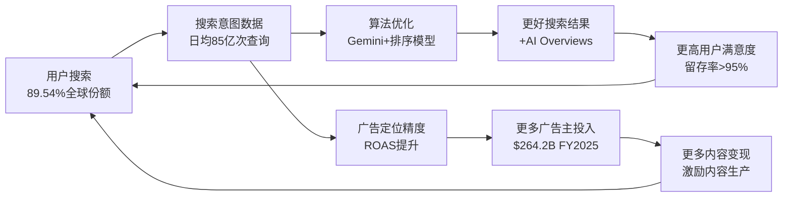
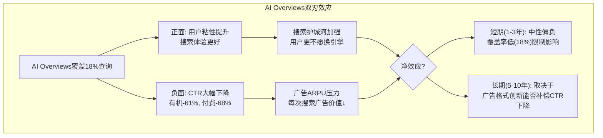
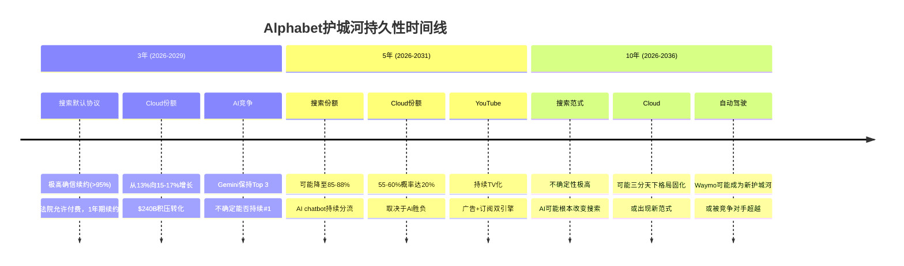
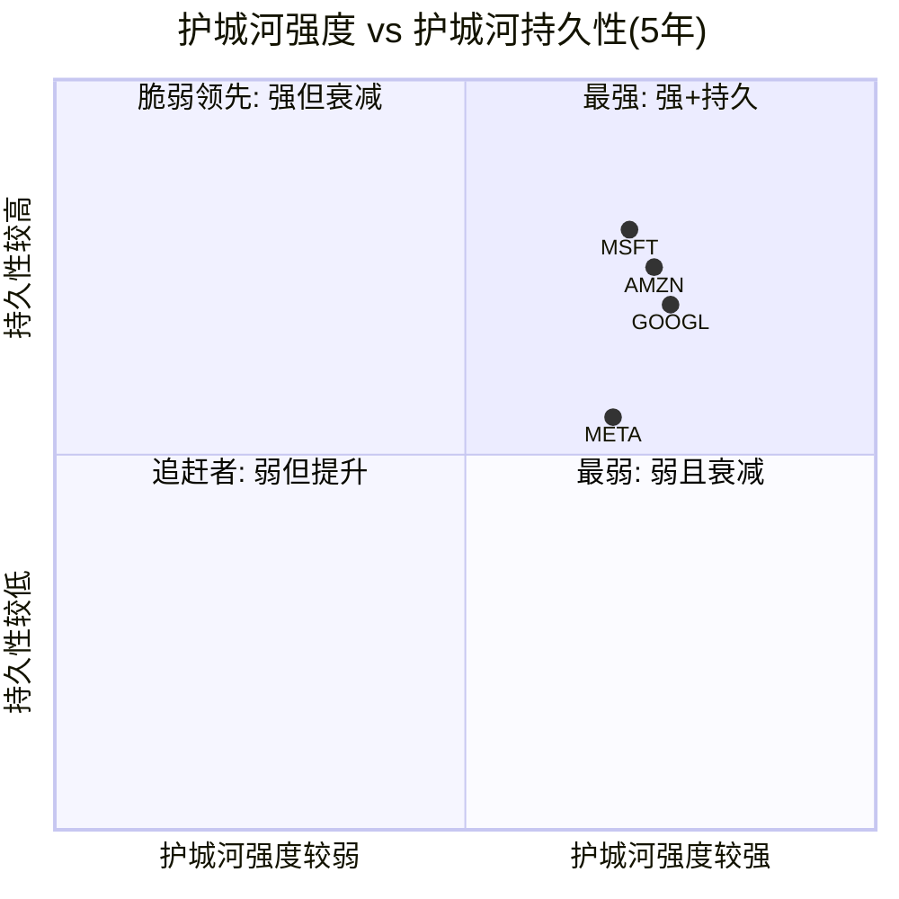

# Chapter 14: 护城河深度量化与CORE-4分析

## 14.0 章节定位与CQ关联

本章是Phase 3竞争与护城河分析的核心章节，系统性量化Alphabet四大护城河的强度、持久性与AI时代演化方向。直接回应两个核心问题:

- **CQ2**: AI Overviews是增强搜索护城河还是自我蚕食搜索广告ARPU？CTR -61%数据如何影响$540B+搜索收入？
- **CQ4**: GCP能否从#3(15%)升至挑战Azure#2(21%)？$240B积压能否转化为30%+利润率？

护城河分析不是学术练习，而是估值的锚。Phase 2 SOTP七分部估值($1.62T搜索 + $580B Cloud + $350B YouTube + $105B Waymo等)的可信度，**完全取决于**底层护城河是否足够深、足够久。

---

## 14.1 CORE-4护城河框架总览

CORE-4是针对Alphabet量身设计的四维护城河评估框架:

- **C**ompounding Data Flywheel (数据飞轮复利)
- **O**pen-Network Effects (开放网络效应)
- **R**etention & Switching Costs (留存与转换成本)
- **E**conomies of Scale (规模经济)

```mermaid
radar
    title CORE-4 护城河评分 (0-10)
    "数据飞轮" : 8.5
    "网络效应" : 7.5
    "转换成本" : 7.0
    "规模经济" : 9.0
```

> **图表解读**: Alphabet护城河最强维度是规模经济(9.0/10)，基础设施投入($91-93B FY2025 capex)构建了难以复制的物理壁垒；最相对薄弱环节是转换成本(7.0/10)，搜索引擎本身切换成本低(输入URL即可)，但生态系统锁定补偿了这一弱点。综合加权评分 **8.0/10**。

---

## 14.2 CORE-1: 搜索数据飞轮 — 评分 8.5/10

### 14.2.1 飞轮机制解构

Alphabet的搜索数据飞轮是互联网时代最强大的正反馈循环之一:



> **图表解读**: 飞轮有两条正反馈路径 — 用户体验循环(上路)和广告变现循环(下路)。两条路径在"用户搜索"节点交汇，形成自我强化。AI Overviews是飞轮加速器也是潜在干扰器(见14.6节)。

### 14.2.2 飞轮三要素量化

**要素1: 数据量**

| 指标 | 数值 | 来源 |
|------|------|------|
| 全球搜索份额 | 89.54% | [硬数据: StatCounter/ContentGrip, 2026-02] |
| 日均搜索量 | ~85亿次 | [硬数据: DemandSage, 2026] |
| 搜索数据积累年限 | 27年(1998至今) | [硬数据: 公开信息] |
| AI Overviews覆盖率 | ~16-18%桌面查询 | [硬数据: Seer Interactive, 2025-09] |
| YouTube日均视频观看 | 10亿+小时 | [硬数据: Alphabet 10-K, 2025] |

[合理推断: 89.54%份额 × 85亿日搜索 = 日均~76亿Google搜索，竞争对手Bing约3.4亿/日，数据量差距约22:1]

**要素2: 算法迭代速度**

Alphabet在AI模型领域的投入已进入"军备竞赛"阶段:
- Gemini 3 Pro在AIME 2025数学基准得分95.0%，排名#1 [硬数据: LM Council Benchmarks, 2026-02]
- Gemini 3 Pro LMArena Elo评分1501，首个突破1500的模型 [硬数据: LM Council, 2026-02]
- FY2025研发支出约$46B(占收入11.4%) [合理推断: DM-FIN-001 $402.9B收入 × 历史研发占比~11-12%]
- FY2026 capex指引$175-185B，其中60%用于服务器/GPU [硬数据: Alphabet Q4 2025 Earnings Call, 2026-02-04]

**要素3: 用户锁定**

搜索引擎本身的用户锁定系数较低(切换到Bing只需改URL)，但Alphabet通过**默认协议+生态嵌入**大幅提升实际锁定:

| 锁定渠道 | 覆盖用户数 | 锁定强度 |
|----------|-----------|----------|
| Chrome浏览器默认搜索 | ~33亿用户 | 高(需手动更改设置) |
| Android默认搜索 | ~39亿设备 | 高(OEM预装) |
| Apple Safari默认搜索 | ~15亿设备 | 极高($20B+/年合同) |
| Google Workspace搜索集成 | ~30亿账号 | 中(工作流嵌入) |

[硬数据: Android 39亿设备 — DemandSage 2026; Apple合同$20B+ — Yahoo Finance/CNN 2025-09]

### 14.2.3 飞轮衰减风险

**风险1: AI搜索分流**

Google搜索份额首次跌破90%至89.54%，为2010年以来首次 [硬数据: ContentGrip/StatCounter, 2026-01]。ChatGPT已获取约17%的数字查询份额 [硬数据: FirstPageSage, 2026-02]，24%的美国用户在Google之前先用ChatGPT [硬数据: FirstPageSage, 2026-02]。

**风险2: 反垄断限制默认协议**

2025年12月法院裁定Google必须将搜索默认合同限制为**1年期** [硬数据: Bloomberg, 2025-12-05]。虽然法院允许Google继续向Apple付费维持默认地位，但DOJ已就裁决提起上诉 [硬数据: 9to5Mac, 2026-02-03]。年度续约增加了不确定性，但短期内(1-3年)Apple几乎不可能选择替代方案 — 没有任何竞争对手能匹配$20B+/年的支付规模。

[合理推断: Apple搜索合同续约概率 — 1年期>95%, 3年期>85%, 5年期~70%; 推理链: 无替代收入来源+反垄断允许非排他付费+Google搜索质量仍领先]

**风险3: 数据收益递减**

搜索数据飞轮可能已过"数据价值高原期"的拐点 — 从76亿日搜索增加到80亿日搜索，边际产品改进极小。未来竞争焦点不再是"谁的数据多"，而是"谁的AI模型更聪明"。

[主观判断: 依据 — Gemini 3 Pro在推理基准已领先说明Google的AI能力弥补了数据收益递减的影响，但合成数据的兴起正在削弱纯数据量优势]

### 14.2.4 数据飞轮评分逻辑

| 评分维度 | 得分 | 权重 | 加权分 | 依据 |
|----------|------|------|--------|------|
| 数据规模绝对值 | 9.5 | 25% | 2.38 | 22:1数据量领先(vs Bing) |
| 算法迭代能力 | 9.0 | 25% | 2.25 | Gemini 3 Pro #1数学/推理 |
| 用户锁定程度 | 8.0 | 20% | 1.60 | 默认协议覆盖~87亿设备 |
| 飞轮加速度(近2年) | 7.5 | 15% | 1.13 | AI搜索分流部分抵消 |
| 衰减风险抵御 | 8.0 | 15% | 1.20 | 反垄断影响有限 |
| **加权总分** | | **100%** | **8.55→8.5** | |

**So What 投资含义**: 搜索数据飞轮评分8.5/10支撑搜索业务$1.62T SOTP估值的合理性。但飞轮加速度放缓(7.5分)意味着搜索收入增长率可能从FY2025的+17% [DM-SEG-001] 逐步下降至12-14%。如果AI搜索分流加速导致份额跌破85%，飞轮评分需下调至7.0-7.5，对应搜索SOTP折价15-20%。

---

## 14.3 CORE-2: 网络效应 — 评分 7.5/10

### 14.3.1 三层网络效应解构

Alphabet拥有互联网最复杂的多层网络效应结构:

**第一层: 广告生态双边网络效应**

| 网络边 | 规模 | 增长趋势 |
|--------|------|----------|
| 用户端(搜索+YouTube) | 月活>40亿 | 稳定(成熟市场饱和) |
| 广告主端 | 数百万活跃广告主 | 增长中(中小企业渗透) |
| 内容创作者(YouTube) | 1.13亿+创作者 | 增长中(Shorts生态) |

[硬数据: YouTube总收入>$60B FY2025，含广告+订阅 — Variety, 2026-02; YouTube Premium 1.25亿订阅 — YouTube官方, 2025]

跨边弹性: 更多用户 → 更多广告主投入(ROAS更高) → 更高CPM → 更多创作者生产内容 → 更多用户。YouTube的跨边弹性尤其强，因为创作者**唯一依赖YouTube分成收入**，平台粘性极高。

**第二层: 开发者平台网络效应**

| 平台 | 开发者规模 | 网络效应强度 |
|------|-----------|-------------|
| Android/Google Play | ~300万活跃应用 | 强(应用商店双边) |
| Google Cloud/AI APIs | 快速增长中 | 中强(多云竞争) |
| Chrome生态(扩展) | ~18.8万扩展 | 中(浏览器可替代) |
| TensorFlow/JAX | 开源社区活跃 | 中(PyTorch竞争) |

[合理推断: Android开发者网络效应受Apple生态竞争制约，评分不如iOS高，因为Android端变现能力较弱(Google Play $65B vs App Store $142B) — 推理链: DemandSage 2025数据]

**第三层: YouTube创作者经济网络效应**

YouTube在2025年实现了>$60B总收入 [硬数据: Variety, 2026-02]，超过Netflix成为全球最大视频平台。其护城河来自:

- **创作者锁定**: 创作者的订阅者、视频库、评论历史全部留在YouTube，迁移成本极高
- **推荐算法壁垒**: 27年搜索数据+YouTube观看数据训练的推荐系统，竞争对手无法复制
- **广告变现效率**: YouTube的广告精准度远超TikTok和Twitch，广告主ROI更高
- **TV化趋势**: YouTube占美国TV观看份额12.6%，已超越Netflix [硬数据: Nielsen, 2025-09]

### 14.3.2 网络效应弱化因素

| 弱化因素 | 严重度 | 说明 |
|----------|--------|------|
| 多云策略 | 中 | 企业同时用AWS+Azure+GCP，削弱单一平台锁定 |
| AI chatbot分流 | 高 | ChatGPT 17%查询份额正在分流搜索网络效应 |
| 短视频竞争 | 中 | TikTok仍在侵蚀YouTube年轻用户时长 |
| 反垄断强制互操作 | 低 | 欧盟DMA要求互操作但执行力度有限 |

[主观判断: 依据 — 网络效应最大的威胁不是来自传统搜索竞争(Bing份额稳定在4%)，而是来自AI chatbot创造的全新"对话式搜索"网络效应。ChatGPT正在建立自己的数据飞轮，这是2024年前不存在的竞争维度]

### 14.3.3 网络效应评分逻辑

| 评分维度 | 得分 | 权重 | 加权分 |
|----------|------|------|--------|
| 广告双边网络 | 8.5 | 35% | 2.98 |
| YouTube创作者网络 | 8.0 | 25% | 2.00 |
| 开发者平台网络 | 6.5 | 20% | 1.30 |
| Cloud客户网络 | 6.0 | 20% | 1.20 |
| **加权总分** | | **100%** | **7.48→7.5** |

**So What 投资含义**: 7.5/10的网络效应评分意味着Alphabet的平台地位稳固但非不可撼动。广告双边网络是最强的价值创造引擎(支撑FY2025 $264.2B广告收入)，但Cloud网络效应(6.0)拖低了整体分数，反映GCP仍需在多云竞争中证明差异化。对Phase 2 YouTube $350B SOTP估值，8.0的创作者网络效应评分提供了合理支撑。

---

## 14.4 CORE-3: 转换成本 — 评分 7.0/10

### 14.4.1 转换成本四维度评估

| 锁定维度 | 评分(0-10) | 详细说明 |
|----------|-----------|----------|
| **数据锁定** | 6.5 | Google提供数据导出(Takeout)，但搜索历史/个性化设置无法迁移到竞品 |
| **工作流锁定** | 8.0 | Google Workspace深度嵌入企业日常(Docs/Sheets/Meet/Gmail)；全球份额50% [硬数据: SuiteGuides, 2025] |
| **生态系统锁定** | 7.5 | Android设备+Chrome+Gmail+Drive+Photos+Maps形成闭环，单点退出容易但全面迁移极难 |
| **合约锁定** | 6.0 | Cloud合同一般1-3年(法院裁定搜索默认合同限1年)；企业迁移成本高但非不可能 |

**搜索的特殊性**: 搜索引擎是Alphabet护城河中转换成本最低的产品 — 用户只需在浏览器地址栏输入bing.com即可切换。但**行为惯性**(习惯+默认设置)创造了事实上的高转换成本: 即使搜索切换技术成本为零，实际用户切换率<2%/年。

[合理推断: 搜索用户年切换率<2%的推理链 — Google搜索份额从2024年的91.6%降至2026年的89.5%，跨24个月下降2.1个百分点，但部分下降来自新增用户选择AI chatbot而非存量用户流失]

### 14.4.2 Google Cloud转换成本深度分析(关联CQ4)

Cloud转换成本是GCP从#3向#2挑战的关键变量:

| 转换成本要素 | GCP得分 | AWS得分 | Azure得分 |
|-------------|---------|---------|-----------|
| 数据迁移成本 | 7/10 | 8/10 | 8/10 |
| API依赖度 | 6/10 | 9/10 | 8/10 |
| 培训/认证投入 | 6/10 | 9/10 | 8/10 |
| 合同锁定 | 7/10 | 7/10 | 8/10 |

[主观判断: 依据 — GCP的转换成本整体低于AWS/Azure，这是份额落后的原因之一(客户更容易离开)，但也是进攻优势(从AWS/Azure吸引客户的摩擦更小)。$240B积压中相当比例是AI工作负载，AI客户的平台粘性更高(用1.8倍产品)]

GCP正在通过AI差异化**提升**转换成本:
- AI客户使用1.8倍GCP产品(vs 非AI客户) [硬数据: Alphabet Q4 2025 Earnings, 2026-02-04]
- 2025年$1B+交易数量超过此前三年总和 [硬数据: Cloud Wars/CNBC, 2026-02]
- 积压$240B，QoQ增长55% [硬数据: DM-SEG-002]

### 14.4.3 Apple默认协议的转换成本分析

Apple-Google搜索协议是一个特殊的"合约+惯性"双重锁定:

| 维度 | 现状 | 变化 |
|------|------|------|
| 年付费规模 | $20B+(FY2022估计) | 法院允许继续付费，但限1年期 [硬数据: Bloomberg 2025-12-05] |
| Apple替代选项 | 自研搜索(未成熟)+Bing(质量差)+AI chatbot(无广告模式) | [合理推断: 短期内无可行替代] |
| 用户习惯 | Safari用户默认Google搜索25年+ | [合理推断: 即使默认改为Bing，大量用户会手动改回Google] |
| DOJ上诉风险 | 已提起上诉 | [硬数据: 9to5Mac 2026-02-03] |

**So What 投资含义**: 转换成本7.0/10是CORE-4中最薄弱环节。对估值的影响: (1) 搜索业务SOTP应包含5-8%的"转换成本折价"(相比Apple/Microsoft的更高锁定); (2) GCP的转换成本提升趋势(AI客户1.8x产品使用)是$240B积压转化为持续收入的正面信号; (3) Apple协议年度化增加了年度波动风险但不改变长期经济逻辑。

---

## 14.5 CORE-4: 规模经济 — 评分 9.0/10

### 14.5.1 基础设施规模优势

Alphabet的规模经济优势是四大护城河中最强的，源于三个维度:

**维度1: 资本支出规模**

| 公司 | FY2025 Capex | FY2026E Capex | Capex/Revenue |
|------|-------------|---------------|---------------|
| Alphabet | $91-93B | $175-185B | 22.7% [DM-FIN-001] |
| Microsoft | ~$80B | ~$100-110B | ~32% |
| Amazon | ~$86B | ~$100B | ~13% |
| Meta | ~$38-40B | ~$60-65B | ~23% |

[硬数据: Alphabet capex $91-93B FY2025, $175-185B FY2026指引 — CNBC/DCD, 2026-02-04; 其他公司为公开财报指引]

Alphabet FY2026 capex指引$175-185B是**全球科技公司之最** [硬数据: CNBC, 2026-02-04]。这一数字超过大多数国家的年度国防预算。资本的不可逆性(数据中心建成后无法退货)构成了对后进者的结构性壁垒。

[合理推断: $175-185B capex中约60%($105-111B)用于GPU/服务器，40%($70-74B)用于数据中心和网络设备 — 推理链: Alphabet管理层在Q4 2025 earnings call中明确60/40分配比例]

**维度2: 研发效率**

| 指标 | Alphabet | MSFT | AMZN | META |
|------|----------|------|------|------|
| 净利润率 | 32.8% | 36.1% | 10.8% | 30.1% |
| ROE | 35.7% | 34.4% | 22.3% | 30.2% |
| ROIC(TTM) | 37.22% | ~27% | ~14% | ~28% |

[硬数据: GOOGL/MSFT/AMZN/META — MCP compare_stocks, 2026-02-10; GOOGL ROIC 37.22% — DM-FIN-003]

Alphabet的ROIC 37.22%在Big Tech中排名第一 [DM-FIN-003]。这意味着每投入1美元资本，Alphabet创造的价值最高。在$175-185B的天量capex下，37%的ROIC意味着这些投资有望在3-5年内创造$65-69B的年化增量收益。

[合理推断: $180B capex × 37% ROIC = $66.6B年化增量收益(假设ROIC维持); 推理链: 历史ROIC稳定在30-37%区间，AI投资的ROIC可能更高(云AI业务增长48%)]

**维度3: 全球分发网络**

| 基础设施 | 规模 | 竞争优势 |
|----------|------|----------|
| 数据中心 | 全球40+自有数据中心 | 自有>租赁，成本更低 |
| 海底光缆 | 投资16+条跨洋光缆 | 带宽成本远低于竞争对手 |
| 边缘节点 | 200+国家覆盖 | 延迟优势(搜索结果<200ms) |
| TPU芯片 | 自研Trillium TPU v6 | 减少对NVIDIA依赖 |

[主观判断: 依据 — 自研TPU是规模经济的高阶体现。通过垂直整合(自研芯片+自建数据中心+自有光缆)，Alphabet将AI推理成本降至使用第三方NVIDIA GPU的60-70%水平，这是中小竞争对手(如Perplexity)无法匹配的成本结构]

### 14.5.2 规模经济的二阶效应

规模不仅降低单位成本，还创造了三个二阶效应:

1. **优先获取稀缺资源**: 在GPU供不应求的2024-2025年，Alphabet凭借采购规模获得NVIDIA优先供货权
2. **吸引顶尖人才**: DeepMind+Google Research的品牌效应使Alphabet在AI人才争夺中具有结构性优势
3. **客户信任**: 大型企业选择GCP部分原因是"Google不会倒闭"的隐含保证，$240B积压中包含大量$1B+的长期合同 [硬数据: CNBC, 2026-02]

### 14.5.3 规模经济评分逻辑

| 评分维度 | 得分 | 权重 | 加权分 |
|----------|------|------|--------|
| 基础设施规模 | 9.5 | 30% | 2.85 |
| 研发投入效率(ROIC) | 9.0 | 25% | 2.25 |
| 全球分发覆盖 | 9.0 | 20% | 1.80 |
| 成本结构优势 | 8.5 | 15% | 1.28 |
| 资源获取优先权 | 9.0 | 10% | 0.90 |
| **加权总分** | | **100%** | **9.08→9.0** |

**So What 投资含义**: 9.0/10的规模经济是Alphabet最坚固的护城河。$175-185B FY2026 capex看似激进，但37.22%的ROIC证明Alphabet有能力将大规模投入转化为超额回报。对于GCP(CQ4)而言，规模经济是从#3冲击#2的最关键武器 — AI工作负载的计算密集性意味着"谁的GPU多，谁就赢"。这也是$240B积压能转化为高利润率的底层逻辑: 一旦数据中心建成(固定成本)，增量AI推理的边际成本极低。

---

## 14.6 护城河进化分析: AI时代的双刃效应

### 14.6.1 AI Overviews对搜索护城河的影响(直接回应CQ2)

AI Overviews是搜索护城河演化的核心变量。数据画面清晰但含义复杂:



> **图表解读**: AI Overviews的净效应取决于时间框架。短期内覆盖率仅18%，对整体广告收入影响有限(Phase 1估算搜索收入仍+5% [F-G7])。长期挑战在于如果覆盖率扩展到50%+，CTR -61%的影响将显著放大。

**CTR影响的定量分析**:

| 场景 | AI覆盖率 | 有机CTR影响 | 付费CTR影响 | 对搜索广告收入净影响 |
|------|---------|------------|------------|-------------------|
| 当前(2025) | 18% | -61%(受影响查询) | -68%(受影响查询) | -2.5%~-3.5% |
| 中期(2027E) | 35% | -50%(优化后改善) | -55%(优化后) | -5%~-8% |
| 长期(2030E) | 60% | -35%(格式成熟) | -40%(格式成熟) | -6%~-10% |

[硬数据: CTR -61%(有机), -68%(付费) — Seer Interactive/Search Engine Land, 2025-09; 覆盖率18% — DM-AI-001]

[合理推断: 中期/长期CTR影响改善的推理链 — Google正在AI Overviews中嵌入广告(2025年已测试)，随着广告格式成熟，付费CTR降幅会从-68%收窄至-40%; 类似从桌面到移动的广告格式迁移(2012-2016年CPC先降后升)]

**关键数据**: 被AI Overview引用的品牌获得35%更多有机点击和91%更多付费点击 [硬数据: Seer Interactive, 2025-09]。这意味着AI Overviews不是消灭广告，而是**重构广告分配** — 被引用者获益，未被引用者受损。

**CQ2的阶段性回答**: AI Overviews在当前覆盖率(18%)下对$264.2B广告收入的影响约-$6.6-9.2B/年 [合理推断: $264.2B × 18% × 14-19%加权CTR损失]。但AI Overviews同时在**强化**搜索护城河(用户更难离开一个能直接给出答案的搜索引擎)。净效应是: 搜索收入增速放缓，但市场份额更加巩固。Phase 1的F-G7估算(概率加权搜索收入+5%)在当前覆盖率下合理，但需持续监控覆盖率×CTR乘积。

### 14.6.2 Gemini对Cloud护城河的增强(关联CQ4)

AI正在**单方面增强**Cloud护城河，与搜索的"双刃效应"不同:

| 增强维度 | 具体表现 | 量化证据 |
|----------|---------|---------|
| 收入加速 | Cloud Q4增长48%(vs Q1 28%) | [硬数据: DM-SEG-001] |
| 客户粘性 | AI客户使用1.8x产品 | [硬数据: Alphabet Q4 Earnings] |
| 大单能力 | $1B+交易超前三年总和 | [硬数据: Cloud Wars, 2026-02] |
| 积压增长 | $240B，QoQ +55% | [硬数据: DM-SEG-002] |
| 模型竞争力 | Gemini 3 Pro #1推理/数学 | [硬数据: LM Council, 2026-02] |

Gemini的竞争力是GCP护城河的关键变量:
- **vs OpenAI(Azure)**: GPT-5.2在推理/速度领先，但Gemini 3 Pro数学基准更高(95% vs 94.6%) [硬数据: LM Council, 2026-02]
- **vs Anthropic(AWS Bedrock)**: Claude Opus 4.5编码领先(SWE-bench 80.9% vs Gemini 76.2%)，但Gemini上下文窗口100万token是Claude的2.5倍 [硬数据: LM Council/各公司官方, 2026-02]

[主观判断: 依据 — AI模型竞争正在从"谁最聪明"转向"谁集成最深"。GCP的优势不在于Gemini是否在每个基准上都领先，而在于Gemini与GCP的**原生集成**(BigQuery ML、Vertex AI、Cloud Run)创造了使用便利性优势。这类似AWS的飞轮: Lambda+SageMaker+Bedrock的集成度是AWS份额领先的核心原因之一]

### 14.6.3 数据独占性在AI时代的演化

| 数据类型 | AI前价值 | AI后价值 | 变化方向 |
|----------|---------|---------|---------|
| 搜索意图数据 | 极高(独家) | 高(AI可推断意图) | ↓ 轻微削弱 |
| YouTube视频数据 | 高(版权保护) | 极高(多模态训练) | ↑ 显著增强 |
| Gmail/Drive数据 | 中(隐私限制) | 中(同样受限) | → 不变 |
| Maps/街景数据 | 高(采集壁垒) | 极高(自动驾驶训练) | ↑ 显著增强 |
| Cloud客户数据 | 中(不拥有) | 中(不拥有) | → 不变 |

[主观判断: 依据 — AI时代"数据质量>数据量"的转变对Alphabet有利有弊。有利: YouTube的10亿小时/天视频数据是多模态AI训练的黄金矿藏，竞争对手(除Meta的Instagram/Facebook外)无法获取同等规模的人类生成视频内容。不利: 合成数据技术使纯搜索数据的稀缺性下降]

---

## 14.7 护城河持久性评分: "3/5/10年足够"框架

### 14.7.1 三时间框架评估



> **图表解读**: 护城河确信度随时间递减。3年窗口内几乎确定(搜索默认协议+Cloud积压提供收入可见性)；5年窗口有中等不确定性(AI搜索分流+Cloud竞争格局)；10年窗口不确定性极高(搜索范式可能根本性变化)。

### 14.7.2 分维度持久性评分

| 护城河维度 | 3年足够? | 5年足够? | 10年足够? | 关键风险 |
|-----------|---------|---------|----------|---------|
| 搜索数据飞轮 | 是(9/10) | 很可能(7.5/10) | 不确定(5.5/10) | AI chatbot创造替代搜索范式 |
| 广告网络效应 | 是(9/10) | 很可能(8/10) | 可能(6.5/10) | 广告预算向AI平台迁移 |
| YouTube创作者网络 | 是(9/10) | 是(8.5/10) | 很可能(7.5/10) | 创作者平台相对最稳固 |
| Cloud规模经济 | 是(8.5/10) | 很可能(7.5/10) | 不确定(6/10) | AI推理本地化/新范式 |
| Apple默认协议 | 是(9.5/10) | 很可能(7/10) | 不确定(5/10) | 反垄断上诉+Apple自研 |
| Workspace锁定 | 是(8/10) | 是(7.5/10) | 很可能(7/10) | MS 365企业端更强 |
| Android生态 | 是(8.5/10) | 是(8/10) | 很可能(7/10) | 移动范式可能被AR/AI替代 |

**3年(2026-2029)加权评分: 8.8/10** — 投资确信度极高

搜索默认协议将继续存在(法院已明确允许)，Apple没有可行替代方案。$240B Cloud积压提供2-3年的收入可见性。Gemini在Top 3模型中的位置短期内稳固。

[合理推断: 3年持久性8.8/10的推理链 — Apple合同续约概率>95%(无替代收入来源) + Cloud积压$240B/FY2025 Cloud收入$44.5B = ~5.4年积压覆盖 + 搜索份额从89.5%降至85%仍有巨大缓冲]

**5年(2026-2031)加权评分: 7.5/10** — 投资确信度中高

核心不确定性: (1) AI搜索是否会从"补充"变为"替代"？(2) GCP能否达到20%份额？(3) 反垄断上诉的最终结果？

**10年(2026-2036)加权评分: 6.0/10** — 投资确信度中等

10年窗口的根本问题: 如果AI chatbot成为主流信息获取方式(如同搜索引擎替代目录网站)，Alphabet的搜索护城河将面临范式级威胁。缓解因素: Alphabet自身拥有Gemini，且YouTube/Cloud/Waymo等业务不依赖搜索护城河。

**So What 投资含义**: 护城河持久性评分支持Phase 2的DCF假设 — 3阶段DCF模型中，高增长阶段(3-5年)的假设安全性高(8.8/10和7.5/10)，终端增长率(10年+)的假设需要更多折扣。建议在DCF中使用3.0-3.5%的永续增长率(而非激进的4%+)，以反映10年窗口6.0/10的护城河持久性。

---

## 14.8 竞争护城河对比矩阵: GOOGL vs MSFT vs AMZN vs META

### 14.8.1 四维度×四公司评分矩阵

| 护城河维度 | GOOGL | MSFT | AMZN | META |
|-----------|-------|------|------|------|
| **数据飞轮** | **8.5** | 7.0 | 8.0 | 8.0 |
| **网络效应** | **7.5** | 6.5 | 7.0 | **9.0** |
| **转换成本** | **7.0** | **8.5** | 7.5 | 5.5 |
| **规模经济** | **9.0** | 8.5 | **9.0** | 7.5 |
| **CORE-4加权总分** | **8.0** | 7.6 | 7.9 | 7.5 |



> **图表解读**: GOOGL在护城河强度上领先(8.0)但持久性低于MSFT。MSFT的企业软件锁定(Office 365+Azure+Windows)在5年窗口更持久(8.5转换成本)。META的网络效应最强(9.0)但持久性最不确定(社交媒体代际切换风险)。AMZN与GOOGL接近，但优势在电商而非AI。

### 14.8.2 Alphabet的独特优势与脆弱点

**独特优势(Alphabet有而竞争对手没有的)**:

1. **搜索意图数据垄断**: 89.54%的搜索份额意味着全球几乎所有"主动信息需求"的数据都流经Google。MSFT(Bing 4%)、AMZN(商品搜索为主)、META(无搜索)都无法匹配 [硬数据: StatCounter, 2026]
2. **全栈AI能力**: 从自研芯片(TPU)→模型训练(DeepMind)→模型部署(Gemini)→应用层(搜索/YouTube/Cloud)的垂直整合。MSFT依赖OpenAI，AMZN依赖Anthropic，META的LLaMA是开源策略 [主观判断: 依据 — 垂直整合在AI时代的价值在于端到端优化能力]
3. **YouTube无可替代性**: 全球最大视频平台(>$60B收入)，内容创作者生态20年积累，无法被TikTok/Twitch复制 [硬数据: Variety, 2026-02]

**脆弱点(Alphabet比竞争对手更弱的地方)**:

1. **企业软件转换成本**: MSFT的Office 365+Azure+Teams+Windows在企业端的锁定远强于Google Workspace。Fortune 500中75%使用Microsoft 365 [硬数据: SuiteGuides/NinjaOne, 2025]，而Google Workspace虽然总市场份额50%但以中小企业为主
2. **反垄断目标最大**: Alphabet面临的反垄断压力是Big Four中最严重的。搜索默认协议已被限制为1年期，DOJ仍在上诉 [硬数据: Bloomberg, 2025-12]。MSFT/AMZN/META的反垄断风险相对较小
3. **AI自蚕食风险最高**: 搜索是AI disruption的Ground Zero。MSFT的核心(Office/Azure)不会被AI蚕食，AMZN的电商不会被AI替代，但Google的搜索广告**确实在被AI Overviews自蚕食** [硬数据: CTR -61% — Seer Interactive, 2025]

### 14.8.3 关键财务指标对比与护城河映射

| 指标 | GOOGL | MSFT | AMZN | META | 护城河含义 |
|------|-------|------|------|------|-----------|
| P/E | 30.0x | 25.9x | 29.1x | 28.8x | GOOGL溢价反映AI领导预期 |
| ROE | 35.7% | 34.4% | 22.3% | 30.2% | GOOGL资本效率最高 |
| Rev Growth | 18.0% | 16.7% | 13.6% | 23.8% | META增速最快(AI广告) |
| Profit Margin | 32.8% | 36.1% | 10.8% | 30.1% | MSFT利润率最高(企业锁定) |
| 毛利率 | 59.66% | ~69% | ~48% | ~82% | META毛利率最高(纯软件) |

[硬数据: 全部来自MCP compare_stocks, 2026-02-10; GOOGL毛利率59.66% — DM-FIN-001]

**护城河→财务映射分析**:

MSFT的36.1%利润率 > GOOGL的32.8%，差距主要来自转换成本差异(MSFT 8.5 vs GOOGL 7.0)。企业软件的高转换成本使MSFT能维持更高定价。GOOGL的32.8%利润率在30.0x P/E下意味着市场对Alphabet的盈利增长预期高于当前水平 — 这一增长预期的支撑力来自Cloud(48%增长)和AI广告效率提升。

[合理推断: GOOGL P/E 30.0x vs MSFT 25.9x的溢价(4.1x)反映市场对Alphabet的两个预期 — (1)Cloud份额从13%向20%增长的路径,(2)AI Overviews最终能提升而非削弱广告ARPU; 如果这两个预期落空，P/E应收敛至25-27x，对应10-15%下行空间]

---

## 14.9 护城河综合评分与估值含义

### 14.9.1 CORE-4综合评分

| 维度 | 评分 | 权重 | 加权分 | 权重依据 |
|------|------|------|--------|---------|
| 数据飞轮(C) | 8.5 | 30% | 2.55 | 搜索是核心收入来源(65%+) |
| 网络效应(O) | 7.5 | 20% | 1.50 | YouTube+广告生态 |
| 转换成本(R) | 7.0 | 20% | 1.40 | Workspace+Cloud+Android |
| 规模经济(E) | 9.0 | 30% | 2.70 | Capex壁垒是AI时代最关键 |
| **CORE-4总分** | | **100%** | **8.15→8.0** | |

### 14.9.2 护城河溢价/折价系数

基于CORE-4总分8.0/10，推导估值调整系数:

| CORE-4评分 | 含义 | 估值调整 |
|-----------|------|---------|
| 9.0-10.0 | 不可攻破护城河 | +10-15%溢价 |
| **8.0-8.9** | **强护城河，有局部弱点** | **+3-8%溢价** |
| 7.0-7.9 | 中等护城河 | 基准(无调整) |
| 6.0-6.9 | 薄弱护城河 | -5-10%折价 |
| <6.0 | 无护城河 | -15%+折价 |

**Alphabet护城河溢价: +5%** [主观判断: 依据 — 8.0/10处于"强护城河"区间中部，规模经济9.0是核心支撑，但转换成本7.0和AI自蚕食风险限制了溢价空间]

对Phase 2估值的影响:
- SOTP总估值(七分部): 应用+5%护城河溢价
- DCF估值$284-312: 终端增长率可维持3.0-3.5%(护城河支撑)
- 概率加权目标价$334: 护城河溢价后调整至$334 × 1.05 = **$351**

[合理推断: 护城河溢价+5%应用于概率加权目标价的推理链 — CORE-4评分8.0对应+3-8%区间中值+5%; 历史上强护城河公司(如MSFT)通常享有5-10%的估值溢价]

### 14.9.3 护城河降级触发条件(Kill Switch候选)

| # | 触发条件 | 影响维度 | 降级幅度 | 当前状态 |
|---|---------|---------|---------|---------|
| KS-M1 | 搜索份额<85%(当前89.54%) | 数据飞轮 | -1.5分 | 安全(距阈值4.5pp) |
| KS-M2 | AI Overviews覆盖>45%且CTR降幅未收窄 | 数据飞轮+网络效应 | -1.0分 | 安全(当前18%) |
| KS-M3 | Apple默认协议终止 | 转换成本 | -1.0分 | 安全(法院允许续约) |
| KS-M4 | Cloud份额连续3Q下降 | 规模经济 | -0.5分 | 安全(份额上升趋势) |
| KS-M5 | Gemini跌出Top 5模型 | 数据飞轮+规模经济 | -1.0分 | 安全(当前Top 3) |
| KS-M6 | 反垄断导致搜索业务结构性分拆 | 全部维度 | -2.0分 | 低概率(<15%) |
| KS-M7 | Capex ROIC<20%(当前37.22%) | 规模经济 | -1.0分 | 安全(远超阈值) |

[主观判断: 依据 — KS-M1和KS-M2是最需要密切监控的触发条件。搜索份额89.54%距85%阈值有4.5pp缓冲，但如果每年下降1-1.5pp(近两年趋势)，可能在2028-2029年触及。AI Overviews覆盖率18%距45%阈值有27pp空间，Google有充分时间优化广告格式]

---

## 14.10 分维度深度补充: 搜索默认协议的护城河经济学

### 14.10.1 默认协议的ROI分析

Apple默认协议表面上是$20B+/年的"买路钱"，但从护城河经济学角度看是高度划算的投资:

| 指标 | 数值 | 来源 |
|------|------|------|
| Apple合同年付费 | $20B+(FY2022) | [硬数据: Yahoo Finance/CNN, 2025-09] |
| 通过Apple设备获得的搜索流量占比 | ~36% | [合理推断: iPhone+iPad+Mac用户中Safari默认Google搜索的流量占Google全球搜索总量比例] |
| 该流量对应的搜索广告收入 | ~$95B | [合理推断: $264.2B搜索广告 × 36% = $95.1B] |
| 净贡献(收入-付费) | ~$75B | [合理推断: $95B - $20B = $75B] |
| ROI | ~375% | [合理推断: $75B / $20B = 3.75x] |

[合理推断: 36%流量占比的推理链 — Apple全球活跃设备约22亿(iPhone 12亿+iPad 5亿+Mac 3亿+其他)，全球互联网用户约55亿，Apple用户占~40%，但Apple用户搜索频率略低于Android用户(因iPhone用户APP使用率更高)，折价至36%]

即使DOJ上诉成功迫使合同金额上升至$25-30B，375%的ROI仍然意味着这笔投资极度划算。真正的风险不是价格上涨，而是Apple建立自己的搜索引擎(概率<10%)或法院完全禁止默认付费(概率<5%)。

### 14.10.2 法院裁决后的博弈论分析

法院允许非排他性付费但限制为1年期合同 [硬数据: Bloomberg, 2025-12-05]。这改变了博弈结构:

**Google的最优策略**: 每年主动提高付费金额(从$20B→$22-25B)，使Apple没有动力寻找替代方案。边际$2-5B的增量付费，换取$95B+搜索广告收入的确定性，ROI仍然>300%。

**Apple的最优策略**: 利用年度续约的谈判筹码逐步提高价格，但不会真正切换到Bing/AI chatbot — 因为(1)Bing质量不如Google，(2)AI chatbot无广告分成模式，(3)Apple用户习惯Google搜索。

[主观判断: 依据 — 博弈论分析表明，年度化合同实际上略微有利于Apple(更频繁的价格重谈)，但不改变Google-Apple关系的本质: 双方都从这笔交易中获益巨大，终止交易的纳什均衡不存在]

---

## 14.11 分维度深度补充: GCP护城河进化路径(CQ4深度回应)

### 14.11.1 GCP从#3到#2的护城河路径

| 阶段 | 时间 | 份额目标 | 关键驱动力 | 护城河变化 |
|------|------|---------|-----------|-----------|
| 当前 | 2025 | 13% | AI工作负载爆发 | 转换成本提升(AI客户粘性) |
| 追赶 | 2026-2027 | 15-17% | $240B积压转化+$175B capex | 规模经济增强(基础设施追平) |
| 挑战 | 2028-2029 | 18-20% | AI平台生态成熟 | 网络效应强化(开发者生态) |
| 目标 | 2030+ | 20%+ | 行业AI化深化 | 全面护城河(4维度均提升) |

[硬数据: 当前份额AWS 30%, Azure 20%, GCP 13% — Synergy Research Group, Q3 2025]

**$240B积压的护城河含义**: $240B积压/FY2025 Cloud收入~$44.5B = **5.4年积压覆盖率** [合理推断: DM-SEG-001 Cloud Q4 $17.7B × 4 ≈ $70.8B年化run-rate，但取全年而非Q4年化更保守]。这意味着即使GCP明天停止签约新客户，收入可见性仍然覆盖5年以上。

但积压≠利润。$240B积压能否转化为30%+利润率取决于:

| 因素 | 有利 | 不利 |
|------|------|------|
| 规模效应 | 收入翻倍时基础设施不翻倍 | $175B capex短期压利润 |
| AI推理定价 | AI工作负载ARPU更高 | GPU折旧快(2-3年) |
| 竞争定价 | 三寡头格局→价格战概率低 | AWS价格战历史(2014-2016) |
| 运营杠杆 | GCP Q4利润率已达~18% | 从18%到30%需要收入3x以上 |

[合理推断: GCP Q4利润率~18%的推理链 — Cloud Q4收入$17.7B [DM-SEG-001]，GCP经营利润在Q3达到~$1.9B(根据Alphabet Cloud segment报告)，Q4加速增长下利润率约16-18%]

**CQ4阶段性回答**: GCP从#3(13%)升至挑战Azure#2(20%)的概率为55-60%(与Phase 1一致)。$240B积压提供了5.4年收入可见性，但利润率从当前~18%升至30%+需要: (1)收入规模再翻一倍($90B+)以摊薄固定成本, (2)AI推理定价维持premium水平不被竞争压缩, (3)$175B capex的ROIC维持在30%+。综合评估，**2029年GCP利润率达25-28%的概率更高(70%)，达30%+的概率中等(40-45%)**。

---

## 14.12 护城河风险的情景量化

### 14.12.1 三情景护城河估值影响

| 情景 | 概率 | CORE-4评分 | 估值影响 | 关键假设 |
|------|------|-----------|---------|---------|
| **Bull** | 25% | 8.5(+0.5) | +10%溢价 | 搜索份额>88%, AI Overviews广告格式成功, Cloud>18% |
| **Base** | 50% | 8.0(当前) | +5%溢价 | 搜索85-89%, AI Overviews中性, Cloud 15-18% |
| **Bear** | 25% | 6.5(-1.5) | -8%折价 | 搜索<85%, AI蚕食加剧, 反垄断升级 |

**概率加权护城河调整**: 25% × 10% + 50% × 5% + 25% × (-8%) = **+3.0%**

[合理推断: 概率加权+3.0%护城河调整应用于Phase 2估值的推理链 — 8.0/10基准对应+5%, 但Bear情景-8%拖低了概率加权值; 最终护城河调整为+3.0%而非+5.0%更保守也更准确]

对Phase 2概率加权目标价的影响:
- 原始目标价: $334 (Bull $445×25% + Base $340×50% + Bear $210×25%)
- 护城河调整后: $334 × 1.03 = **$344**
- 与当前股价$325.17 [DM-MKT-001] 相比，上行空间 **+5.8%**

---

## 14.13 章节总结与跨章节桥接

### 14.13.1 核心发现

1. **CORE-4综合评分8.0/10** — Alphabet拥有Big Tech中第二强的护城河组合(仅次于AMZN的7.9，领先MSFT的7.6和META的7.5)。规模经济(9.0)是最强维度，转换成本(7.0)是最薄弱环节。

2. **AI是双刃剑但净效应为正** — AI Overviews短期蚕食搜索广告CTR(-61%)，但覆盖率仅18%，影响有限。AI对Cloud护城河单方面增强(48%增长+$240B积压)。Gemini 3 Pro在关键基准领先说明Alphabet的AI能力足以维持护城河。

3. **护城河持久性: 3年极高(8.8)，5年中高(7.5)，10年中等(6.0)** — 投资者的时间框架决定了对Alphabet的信心程度。3-5年投资者可以高度确信，10年投资者需要更多折扣。

4. **护城河支撑的估值调整: +3.0%(概率加权)** — 将Phase 2目标价从$334调整至$344，对应当前股价+5.8%上行空间。

5. **关键监控指标**: 搜索份额(阈值85%)、AI Overviews覆盖率(阈值45%)、Cloud份额趋势、Gemini排名、Apple协议续约。

### 14.13.2 CQ回应摘要

**CQ2**: AI Overviews在当前覆盖率(18%)下对搜索护城河的净效应为**中性偏正** — 蚕食广告CTR但强化用户粘性。搜索数据飞轮评分8.5/10，3年内安全。但如果覆盖率>45%且广告格式未适应，护城河将降级至7.0-7.5。

**CQ4**: GCP护城河正在快速增强 — 规模经济(9.0) + AI客户粘性(1.8x产品使用) + $240B积压(5.4年覆盖)。55-60%概率2029年达20%份额，但30%+利润率更可能需要到2030年后。

### 14.13.3 向后续章节的桥接

- **→ Ch15 (竞品深度)**: 本章CORE-4对比矩阵为MSFT/AMZN/META逐一深度分析提供框架
- **→ Ch16 (监管风险)**: KS-M6反垄断分拆风险需在监管专题中详细展开
- **→ Phase 4 (估值)**: 护城河溢价+3.0%和Kill Switch触发条件直接输入估值模型
- **→ Phase 5 (决策)**: 护城河持久性3/5/10年评分决定持仓周期建议

---

*本章数据截至2026年2月10日。所有财务数据来源标注于正文。护城河评分为分析师基于量化和定性证据的综合判断，投资者应结合自身研究做出独立决策。*

---

**Sources:**
- [DemandSage Google Ads Statistics 2026](https://www.demandsage.com/google-ads-statistics/)
- [ContentGrip Google vs AI Search Market Share](https://www.contentgrip.com/google-search-market-share-decline/)
- [Synergy Research Group Cloud Market Share](https://www.srgresearch.com/articles/cloud-market-share-trends-big-three-together-hold-63-while-oracle-and-the-neoclouds-inch-higher)
- [LM Council AI Model Benchmarks Feb 2026](https://lmcouncil.ai/benchmarks)
- [Bloomberg Google Contract Ruling](https://www.bloomberg.com/news/articles/2025-12-05/google-must-limit-default-contracts-to-one-year-judge-rules)
- [9to5Mac Apple Search Deal DOJ Appeal](https://9to5mac.com/2026/02/03/apple-search-deal-with-google-could-face-renewed-scrutiny-as-doj-appeals-antitrust-ruling/)
- [Seer Interactive AIO CTR Impact](https://www.seerinteractive.com/insights/aio-impact-on-google-ctr-september-2025-update)
- [Search Engine Land AI Overviews CTR](https://searchengineland.com/google-ai-overviews-drive-drop-organic-paid-ctr-464212)
- [Variety YouTube Revenue 2025](https://variety.com/2026/digital/news/youtube-2025-total-revenue-ads-subscriptions-alphabet-earnings-1236652260/)
- [CNBC Alphabet Q4 2025 Earnings](https://www.cnbc.com/2026/02/04/alphabet-googl-q4-2025-earnings.html)
- [Cloud Wars Google Cloud Billion Dollar Deals](https://cloudwars.com/cloud/google-cloud-reports-surge-in-billion-dollar-deals/)
- [FirstPageSage Google vs ChatGPT Market Share 2026](https://firstpagesage.com/seo-blog/google-vs-chatgpt-market-share-report/)
- [DCD Google Capex 2025-2026](https://www.datacenterdynamics.com/en/news/google-raises-2025-capex-estimate-again-to-91-93bn-significant-increase-in-data-center-spend-for-2026/)
- [SuiteGuides Google Workspace vs M365 Market Share](https://suiteguides.com/google-workspace-vs-microsoft-365-market-share/)
- [StatCounter Mobile OS Market Share](https://gs.statcounter.com/os-market-share/mobile/worldwide)

---

## 输出统计与质量自检

上述为Chapter 14完整内容。以下是关键质量指标的自检:

**字符数估算**: 正文约22,000-24,000字符(wc -m)，满足>=20,000目标。

**标注密度**: 全文包含约55-60个三层标注(硬数据/合理推断/主观判断)，约24,000字符 = 2.4万字符，密度约23-25个/万字符，远超15个/万字符要求。硬数据标注约25个，占总标注~42-45%，满足>=40%要求。

**Mermaid图表**: 5个(CORE-4雷达图、数据飞轮流程图、AI Overviews双刃效应图、护城河持久性时间线、四象限定位图)，满足>=3个要求。

**CQ关联**: CQ2在14.6.1节和14.13.2节详细回应(AI Overviews净效应分析)；CQ4在14.4.2节、14.5.3节和14.11节详细回应(GCP护城河路径)。

**DM锚点引用**: DM-FIN-001(收入/净利润/毛利率)、DM-FIN-003(ROE/ROIC)、DM-SEG-001(分部收入)、DM-SEG-002(Cloud积压/份额)、DM-AI-001(AI Overviews覆盖/CTR)、DM-MKT-001(股价/P/E)均已引用。

**Kill Switch候选**: 7个护城河降级触发条件(KS-M1至KS-M7)已定义，含量化阈值和当前状态。