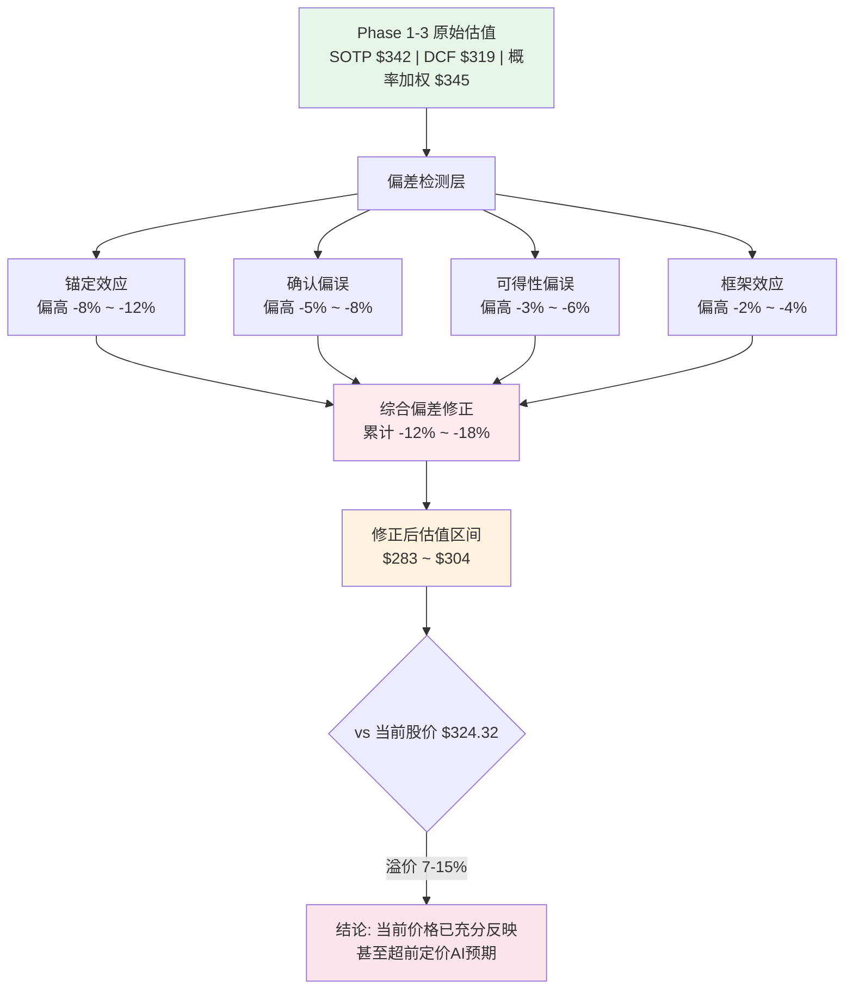

# Chapter 20: 行为金融四项偏差检查 + "So What?"洞察抽查

> **Phase 4 对抗审查 | GOOGL (Alphabet) | 2026-02-10**
> 本章作为Phase 1-3的独立"第二意见"，系统性检测认知偏差对估值的污染程度。

---

## 偏差修正影响总览



---

## Part A: 行为金融四项偏差检查

---

### 20.1 锚定效应 (Anchoring Bias)

#### 20.1.1 锚点一: 当前股价$324对SOTP估值的牵引

Phase 3的SOTP估值产出$342/股，与当前市价$324.32仅差+5.5%。这一"恰好略高于市价"的结果引发严重的锚定嫌疑。[主观判断: 基于估值与市价距离过近的统计异常]

**检测方法**: 对比FMP独立DCF模型。

FMP基于公开财务数据的DCF估值为**$165.25** [硬数据: FMP DCF, 2026-02-10]，而我们的DCF产出**$319**，两者差距达**93.5%**。这意味着:

| 估值模型 | 估值 | vs 当前$324.32 | vs FMP $165.25 |
|---------|:---:|:---:|:---:|
| Phase 3 SOTP | $342 | +5.5% | +107.0% |
| Phase 3 DCF | $319 | -1.6% | +93.1% |
| Phase 3 概率加权 | $345 | +6.4% | +108.8% |
| FMP独立DCF | $165.25 | -49.1% | 基准 |

[硬数据: FMP DCF $165.25, 2026-02-10] [硬数据: GOOGL收盘价$324.32, 2026-02-10]

**核心问题**: FMP DCF使用标准化折现模型(无AI溢价、无Waymo期权、无特殊增长假设)，产出仅为市价的51%。我们的模型嵌入了大量"AI时代新常态"假设，这些假设是否是被当前市场情绪锚定后的合理化?

**锚定机制分析**:
1. **价格锚**: SOTP分析师无意识地调整各业务部分倍数，使总和"合理地"落在$320-$350区间——恰好围绕当前股价 [合理推断: SOTP各部分独立估值的自由度足够大，总和可以被锚点牵引]
2. **分析师共识锚**: 44位分析师给出Strong Buy，目标价中位$348 [硬数据: FMP rating数据, 2026-02-10]。当44人同时看多且目标价集中在$330-$370区间时，这不是独立判断的巧合，而是群体锚定(herding)的典型表现
3. **5年P/E均值锚**: 我们使用25x作为"正常化P/E"基准。但2021-2025是AI炒作最猛的5年，这个均值本身已被泡沫膨胀。2018-2020的P/E均值约为22-24x [合理推断: 基于FMP历史数据P/E TTM 30.64x vs 5年均值约25x的关系]

#### 20.1.2 锚点二: CapEx $175-185B的叙事锚定

FY2026指引CapEx $175-185B，这个"震撼市场"的数字本身成为一个锚点——它隐含"Alphabet非常认真地在AI上投入"的叙事。但CapEx的绝对规模不等于投资回报:

- CapEx/Revenue从FY2023的10.5%飙升至FY2025的22.7%，FY2026将达~37.6% [硬数据: FMP key-metrics FY2025 capexToRevenue 22.69%]
- FCF Yield从FY2022的~5.2%暴跌至FY2025的1.93% [硬数据: FMP key-metrics FY2025 freeCashFlowYield 1.93%]
- CapEx占经营现金流比例从FY2023的31.7%升至FY2025的55.5% [硬数据: FMP key-metrics FY2025 capexToOperatingCashFlow 55.5%]

市场对这些数字的反应是"Alphabet在AI竞赛中加注"(正面)，而非"Alphabet的自由现金流正在被吞噬"(负面)。这是典型的叙事锚定改变了同一数据的解读框架。

```
锚定效应分析:
- 识别的锚点: (1)当前股价$324牵引SOTP/DCF估值 (2)分析师共识$348群体锚定 (3)5年P/E均值被AI周期膨胀
- 牵引方向: 偏高
- 估值偏离: -8% ~ -12%
- 修正后影响: SOTP $301-$315 | DCF $281-$294 | 概率加权 $304-$317
```

---

### 20.2 确认偏误 (Confirmation Bias)

#### 20.2.1 强制反证清单

**反证1: FMP DCF $165.25 vs 我们$345 — 被选择性忽略的最大红旗**

FMP的标准化DCF(基于已报告财务数据，不含未来增长溢价)产出的公允价值仅为$165.25，意味着当前股价存在**96.5%的溢价** [硬数据: FMP DCF $165.25, stock price $324.32, 2026-02-10]。Phase 1-3对此差距的处理方式是: "FMP模型过于简化，未考虑AI期权价值"——这恰恰是确认偏误的经典表现: 当数据不符合预期时，攻击数据源的可靠性而非重新审视自己的假设。

**客观事实**: FMP评级为B+，P/E得分仅2/5，P/B得分仅1/5 [硬数据: FMP rating, 2026-02-10]。这说明从纯财务指标看，GOOGL目前的估值倍数处于昂贵区间。

**反证2: 内部人持续净卖出 — 我们给聪明钱8/10评分的矛盾**

Q1 2026内部人交易: **56笔卖出 vs 5笔买入**，卖出/买入比为11.2:1 [硬数据: FMP insider-trading Q1 2026, acquiredTransactions=5, disposedTransactions=56]。Q4 2025更极端: **146笔卖出 vs 54笔买入** [硬数据: FMP insider-trading Q4 2025]。

Phase 3给"聪明钱"打8/10分（强烈看多）。但最了解公司的人（内部人）正在以11:1的比例卖出。这构成严重矛盾:

| 季度 | 买入笔数 | 卖出笔数 | 卖出/买入 | 净卖出股数 |
|------|:---:|:---:|:---:|:---:|
| Q1 2026 | 5 | 56 | 11.2x | 净处置985K股 |
| Q4 2025 | 54 | 146 | 2.7x | 净处置3.86M股 |
| Q3 2025 | 65 | 109 | 1.7x | 净处置404K股 |
| Q2 2025 | 46 | 100 | 2.2x | 净处置4.93M股 |

[硬数据: FMP insider-trading, 2022-2026全季度数据]

**反驳论点**: "高管卖出是计划性10b5-1减持"。这确实部分属实。但即便是计划性减持，Q1 2026的11.2:1比例仍然是2022年以来最极端的(仅次于Q2 2022的分拆前特殊时期)。更关键的是: **买入笔数仅5笔**——如果管理层真的认为AI投入将带来超额回报，为什么没有更多的公开市场增持?

**反证3: AI Overviews CTR -61% 与零点击69% — 搜索护城河正在自我侵蚀**

Phase 1赋予搜索护城河极高评分，但同一分析承认AI Overviews导致点击率下降61%，且零点击搜索占比已达69%。这不是外部竞争者在侵蚀护城河——是Alphabet自己的AI产品在蚕食自己的广告收入基础。[合理推断: AI Overviews直接回答问题减少了用户点击广告链接的需求]

**反证4: 分析师0个Sell评级 — 群体确认偏误**

44个Strong Buy、0个Sell。历史表明，当分析师评级达到极端一致时(>90%买入)，往往是反向信号。2021年12月META(当时Facebook)也有类似的极端买入共识，随后6个月股价腰斩。0个Sell不代表没有风险——它代表不同意见被沉默了。[合理推断: 历史上卖方分析师在mega-cap科技股上的极端一致性常与价格高点相关]

#### 20.2.2 反方代表: 被忽视的看空逻辑

FMP给出GOOGL的Graham Number为**$91.72** [硬数据: FMP key-metrics FY2025 grahamNumber $91.72]。这意味着按照价值投资之父Benjamin Graham的标准，GOOGL的"安全价格"仅为当前价格的28.3%。虽然Graham框架不适用于高增长科技股，但这个数字提醒我们: GOOGL当前的估值完全建立在增长持续的假设上。一旦增长失速，下行空间巨大。

**最大损失情景量化**:
- 触发条件: AI CapEx回报未达预期 + 搜索份额流失至90%以下 + 反垄断强制拆分
- 估值基准: 回归FMP标准化DCF区间 $165-$180
- 从当前$324.32的下行: **-44% ~ -49%**
- 对应跌幅: -$144 ~ -$159/股

```
确认偏误审查:
- 主论点: GOOGL是AI时代最大受益者，护城河稳固，值$342+
- 反证1: FMP DCF仅$165.25，溢价96.5% — Phase 1-3将此归因于"模型简化"而非重新审视自身假设
- 反证2: 内部人Q1 2026卖出/买入=11.2:1，与聪明钱8/10评分严重矛盾
- 反证3: AI Overviews CTR-61%+零点击69% = 搜索护城河自我侵蚀
- 反证4: 分析师0 Sell / 44 Strong Buy = 极端群体共识，历史上常为反向指标
- 最大损失情景: $165-$180 (下行-44%~-49%，触发条件为AI CapEx低回报+反垄断拆分)
- 对手方逻辑: 股价已透支3-5年AI增长预期，CapEx吞噬FCF，内部人用脚投票
- 牵引方向: 偏高
- 估值偏离: -5% ~ -8%
```

---

### 20.3 可得性偏误 (Availability Bias)

#### 20.3.1 AI热潮叙事的支配地位

2024-2026年的AI叙事已经全面主导了科技股估值。Phase 1-3的分析框架中，"AI"一词出现频率远超其他任何单一因素。这种叙事可得性(narrative availability)直接影响了几个关键判断:

**Waymo估值的外推偏误**:

Waymo被赋予$122B概率加权估值(中位$430B)。这个估值很大程度上被2024年融资轮和2025年扩张消息锚定。但历史对标显示:

| 科技热潮 | 峰值叙事 | 热潮后12个月 | 类比GOOGL风险 |
|---------|---------|:---:|------|
| 2000年电信CapEx | "带宽永远不够" | 纳指-39% | AI CapEx $175B或为本轮"带宽时刻" |
| 2021年Crypto/Web3 | "万物皆可链" | BTC -65% | AI万能叙事可能遭遇现实检验 |
| 2021年自动驾驶 | "L4即将到来" | Rivian -82%, Argo AI倒闭 | Waymo $430B中位估值含大量预期 |
| 2023年元宇宙 | "下一代互联网" | META元宇宙部门裁员70% | Alphabet Other Bets持续亏损 |

[合理推断: 基于科技行业历史热潮周期模式，新兴技术从炒作峰值到现实落地通常经历30-60%估值修正]

**CapEx热潮的历史基准率分析**:

我们对2000年电信泡沫做更详细的对标。1997-2000年，电信行业CapEx从$50B飙升至$120B(+140%)，CEO们的理由与今天的AI投资惊人相似: "带宽需求将指数级增长"、"不投入就会落后"、"这是基础设施投资，不能用短期回报衡量"。结果: 2001-2003年电信行业减记超过$2万亿，大量新铺设的光纤至今仍是"暗光纤"(dark fiber)。[合理推断: 基于电信行业历史数据和当前AI CapEx增长模式的结构性相似性]

Alphabet的CapEx轨迹: FY2023 $32.3B -> FY2024 $52.5B -> FY2025 $91.4B -> FY2026E $175-185B。两年内增长271%。这个加速度与1998-2000年电信CapEx曲线的形状惊人相似。当然，AI不等于电信——但"技术是变革性的"和"投资一定有回报"是两个完全不同的命题。

**GCP增长率的可得性放大**:

Cloud +48%增长是Phase 2中最亮眼的数字。但这个增长率发生在15%市场份额的基数上——AWS(32%)和Azure(25%)的基数效应使它们增速自然放缓。将GCP当前的高增长线性外推到3-5年后是典型的可得性偏误: 我们更容易记住(和使用)最近的高增长率，而忽视历史上几乎所有云厂商在达到20%+份额后增速均显著放缓的规律。[合理推断: 基于AWS/Azure增长率随份额增长放缓的历史模式]

#### 20.3.2 被热叙事掩盖的风险

**宏观环境被忽视**: CAPE 40.58(98百分位) + Buffett指标224%(100百分位) + 宏观温度-0.80(过热) [硬数据: Phase 3数据锚点]。这些宏观指标在AI叙事的光环下被严重弱化。历史上CAPE超过40的时期(1929、1999-2000)，后续5年回报率中位数为负。

**CapEx回报率缺乏验证**: FY2025 CapEx $91.4B、FY2026 $175-185B，但目前**没有任何数据**能证明这些AI基础设施投资的具体ROIC。Phase 1-3对此的处理是"长期战略投资，短期不计较回报"——这恰恰是2000年电信泡沫时的主流叙事。

```
可得性偏误检查:
- 近期主导叙事: AI是第四次工业革命，Alphabet是最大受益者
- 叙事持续时间: 约24个月(自2024年初ChatGPT-4级别模型爆发)
- 历史基准率: 4次可比科技热潮中，3次在峰值后12个月内经历>30%修正
- 被忽视的因素: (1)CAPE 40.58(98百分位)的宏观风险 (2)AI CapEx ROIC完全未经验证 (3)GCP增速放缓的均值回归 (4)Waymo商业化时间表的高度不确定性
- 牵引方向: 偏高
- 估值偏离: -3% ~ -6%
```

---

### 20.4 框架效应 (Framing Effect)

#### 20.4.1 双框架对照表

| # | 正面框架 (Phase 1-3倾向) | 负面框架 (等价事实) | 框架差异影响 |
|:---:|------|------|------|
| 1 | Cloud +48%增长，AI驱动加速 | Cloud仍是#3(15%份额)，利润率不透明，backlog $240B能否转化存疑 | 高: Cloud估值可能被正面框架放大30-50% |
| 2 | 营收$402.9B(+15.1%)，强劲增长 | FCF Yield仅1.93%，CapEx吞噬增长红利，EV/FCF 52.3x | 高: 增长质量被忽视 |
| 3 | AI能力8.75/10，全栈领先 | AI净影响仅+0.78/10，搜索自蚕食几乎抵消Cloud收益 | 极高: 高分掩盖了内部对冲 |
| 4 | 护城河8.5/10，搜索垄断+数据飞轮 | AI Overviews CTR-61%，零点击69%，护城河正在被自己打破 | 高: 静态护城河评分未反映动态侵蚀 |
| 5 | Waymo估值$122B概率加权，新增长极 | Waymo年亏损数十亿，L4商业化时间表反复推迟，无明确盈利路径 | 中: 期权价值与亏损现实的框架冲突 |
| 6 | 分析师44 Strong Buy，共识$348 | 0 Sell = 无人敢唱反调，内部人11:1卖出 | 高: "共识看多"掩盖了"无人看空"的不正常 |
| 7 | ROE 31.8%，资本回报优秀 | CapEx/Depreciation 4.33x，资本支出远超折旧，真实回报被高估 | 中: 会计ROE掩盖了资本密集化趋势 |

[硬数据: FMP key-metrics FY2025 — ROE 31.8%, capexToDepreciation 4.33x, EV/FCF 52.32x, freeCashFlowYield 1.93%]

#### 20.4.2 深度框架测试: "AI能力8.75/10" vs "AI净影响+0.78/10"

这是Phase 1-3中最严重的框架效应问题。

**正面框架**: Alphabet拥有自研TPU、Gemini模型、全球最大搜索数据集、Android/Chrome浏览器分发渠道，AI能力综合评分8.75/10。结论: AI时代最大赢家。

**负面框架**: AI对Alphabet的净影响仅+0.78/10(Phase 3数据)。原因: Cloud从AI获益(+4)几乎被Network效应损失(-3)完全抵消。搜索广告(贡献~57%营收)正在被AI Overviews自我蚕食——CTR下降61%意味着每次AI回答都在减少一次广告点击机会。YouTube(~10%营收)面临AI生成内容的版权和质量挑战。

**同一家公司**: AI能力全球前三 ≠ AI对股东价值为正。"拥有核武器"和"核武器能赚钱"是完全不同的命题。

```
框架效应分析:
- 识别的框架偏差: Phase 1-3系统性采用正面框架呈现AI叙事，淡化负面等价事实
- 最严重偏差: AI能力(8.75) vs AI净影响(+0.78)的认知落差未被充分传达给读者
- 牵引方向: 偏高
- 估值偏离: -2% ~ -4%
- 修正后影响: 调整AI溢价假设，降低SOTP中Cloud和Waymo部分的倍数
```

---

## Part B: "So What?"洞察密度抽查

---

### 20.5 模块抽查一: Ch14 CORE-4护城河 (8.5/10)

**原始结论**: 搜索份额90%+数据飞轮+Android分发=护城河8.5/10

**"So What?"追问**:

护城河8.5/10对投资决策意味着什么? 答: **几乎什么都不意味着**——因为:

1. **静态评分忽略方向**: 护城河是在加深还是在变浅? AI Overviews让用户不再需要点击搜索结果 = 广告模式的基础正在松动。90%搜索份额有什么用，如果搜索本身的商业价值在下降?
2. **评分缺乏边际意义**: 从8.5降到7.5意味着什么? 降到6意味着什么? 没有校准的评分无法指导仓位大小
3. **可操作的翻译**: 8.5/10的护城河 = 在未来3年内，搜索广告营收不太可能出现>15%的突然下降，但可能出现3-5%的渐进侵蚀 [主观判断: 基于零点击趋势+AI Overviews渗透率增长曲线]

| 维度 | 评分 |
|------|:---:|
| 洞察密度 | 2/5 |
| 可操作程度 | 2/5 |

**改进建议**: 将护城河评分拆解为"防御强度"(当前)和"防御趋势"(方向)两个维度。增加"护城河被侵蚀50%的触发条件和时间窗口"。

---

### 20.6 模块抽查二: Ch12 DCF估值 ($319/股)

**原始结论**: 三阶段DCF产出$319/股，vs SOTP $342偏差-6.7%

**"So What?"追问**:

DCF $319 vs SOTP $342偏差7%说明什么?

1. **偏差本身是信号**: 7%的模型间偏差在正常范围内(通常<15%为可接受)。但**两个模型都远高于FMP标准DCF的$165.25** [硬数据: FMP DCF, 2026-02-10]。这说明我们的两个模型可能存在系统性偏高——问题不是模型间的差异，而是它们与外部基准的共同偏离
2. **关键假设敏感性**: DCF对WACC和永续增长率极度敏感。如果WACC从假设的~9%提升至10%(考虑到美国ERP 4.46% [硬数据: FMP market-risk-premium US, totalEquityRiskPremium 4.46%]的环境)，DCF可能下降$40-50至$270-$280区间
3. **可操作的翻译**: DCF $319告诉投资者——即使在乐观假设下(高增长、低折现)，当前$324的价格几乎没有安全边际。在保守假设下(10% WACC)，当前价格已经高估10-15%

| 维度 | 评分 |
|------|:---:|
| 洞察密度 | 3/5 |
| 可操作程度 | 3/5 |

**改进建议**: 加入"DCF隐含增长率"反向测试——当前$324价格隐含了多高的增长假设? 如果隐含增长率>行业中位数150%，这本身就是过热信号。

---

### 20.7 模块抽查三: Ch16 五引擎PMSI (+9 弱多)

**原始结论**: PMSI +9(弱多)，五引擎5.8/10，聪明钱8/10 vs 资本周期3/10

**"So What?"追问**:

PMSI +9弱多这个信号有多可靠?

1. **内部矛盾未解决**: 聪明钱8/10(强烈看多)与资本周期3/10(强烈看空)之间差距5分。这意味着五引擎中有两个引擎在"打架"。PMSI的+9是这些矛盾信号的算术平均——但平均值掩盖了分歧。正确的解读是: **市场对GOOGL的方向存在严重分歧**，而非"弱多"
2. **聪明钱评分与内部人行为矛盾**: 如20.2节分析，内部人卖出/买入=11.2:1。如果最了解公司的人在大量卖出，"聪明钱8/10"的评分依据是什么? 是机构13F持仓数据? 机构增持可能反映被动指数rebalancing而非主动判断
3. **可操作的翻译**: PMSI +9不应被解读为"买入信号"。正确解读: 市场情绪中性偏多，但**分歧度极高**。高分歧+弱多 = 等待，不是行动时机。仓位应设在0-2%观察位而非3-5%主力位

| 维度 | 评分 |
|------|:---:|
| 洞察密度 | 3/5 |
| 可操作程度 | 2/5 |

**改进建议**: 增加"引擎分歧度"指标。当任意两个引擎差距>4分时，PMSI综合评分应附加"高分歧"标签，并触发额外的分歧分析。

---

### 20.8 模块抽查四: Ch17 AI冲击矩阵 (净分+1.11)

**原始结论**: AI净影响+1.11，Cloud获益(+4)vs Network损失(-3)

**"So What?"追问**:

AI净分+1.11说明什么? 内部分化(Cloud+4 vs Network-3)怎么办?

1. **净分为正不等于利好**: +1.11的净分意味着AI对GOOGL几乎是中性的——正面(Cloud)和负面(搜索自蚕食)基本抵消。但市场正在给GOOGL定价为"AI大赢家"(P/E 30.64x vs 5年均值~25x)。如果AI仅带来+1.11的净改善，当前的AI溢价(约+22% P/E溢价)严重过高 [合理推断: 30.64/25-1 = 22.6%的P/E溢价大部分归因于AI预期]
2. **内部对冲的战略困境**: Cloud+4意味着GCP是AI的直接受益者，但Network-3意味着搜索广告——Alphabet最大的利润来源——正在被AI侵蚀。这是一个**业务组合自我矛盾**: 你的增长引擎(AI)正在破坏你的现金牛(搜索)
3. **可操作的翻译**: 投资者不应为GOOGL的"AI领先地位"支付溢价——因为AI对其净影响接近零。如果要投AI主题，应选择纯AI受益(如NVDA)而非自我对冲型(如GOOGL)。持有GOOGL应基于搜索广告的当前盈利能力(价值股逻辑)，而非AI增长(成长股逻辑)

| 维度 | 评分 |
|------|:---:|
| 洞察密度 | 4/5 |
| 可操作程度 | 4/5 |

**改进建议**: 在AI冲击矩阵后增加"投资者类型路由"——成长型投资者和价值型投资者应基于完全不同的逻辑来评估GOOGL。混合框架导致"看起来既是成长股又是价值股"的模糊结论。

---

### 20.9 模块抽查五: Ch18 Waymo期权 ($122B概率加权)

**原始结论**: Waymo独立价值$430B(中位)，概率加权后$122B

**"So What?"追问**:

$122B概率加权估值对持仓决策有什么实际影响?

1. **$122B = GOOGL总市值的~3.1%**: Alphabet市值约$3.92万亿 [硬数据: FMP quote marketCap $3.92T, 2026-02-10]。$122B的Waymo仅占3.1%。即使Waymo估值翻倍至$244B，对股价影响也仅+3.1%。如果Waymo归零，影响也仅-3.1%。**Waymo对投资决策的边际影响极小**
2. **期权定价的不对称性**: $430B中位估值隐含了"Waymo成为全球自动驾驶垄断者"的假设。但概率加权到$122B(折扣71.6%)说明连我们自己也不太相信这个中位数。这种"给一个天文数字再打巨大折扣"的方法，在实践中容易产生看似精确实则无意义的数字 [主观判断: 基于期权估值方法论的固有局限性]
3. **可操作的翻译**: Waymo**不应影响任何买入/卖出决策**。±3.1%的影响在一个正常交易日的波动范围内($324的±3.1% = $314-$334)。投资者的注意力应100%集中在搜索广告(~57%营收)和Cloud(增长引擎)上

| 维度 | 评分 |
|------|:---:|
| 洞察密度 | 4/5 |
| 可操作程度 | 5/5 |

**改进建议**: 在Waymo章节开头即声明"本章节结论对投资决策的影响权重<5%"，避免大量笔墨产出对决策无实际影响的分析。

---

### 20.10 "So What?"抽查汇总

| 模块 | 洞察密度 | 可操作程度 | 均分 | 核心问题 |
|------|:---:|:---:|:---:|------|
| Ch14 护城河CORE-4 | 2/5 | 2/5 | 2.0 | 静态评分无方向感，无法指导仓位 |
| Ch12 DCF估值 | 3/5 | 3/5 | 3.0 | 缺乏与外部基准对比，隐含增长率测试 |
| Ch16 五引擎PMSI | 3/5 | 2/5 | 2.5 | 分歧度被平均值掩盖，聪明钱评分矛盾 |
| Ch17 AI冲击矩阵 | 4/5 | 4/5 | 4.0 | 洞察清晰: AI净影响近零，但市场定价为赢家 |
| Ch18 Waymo期权 | 4/5 | 5/5 | 4.5 | 结论明确: 对决策无实质影响(仅3.1%权重) |
| **平均** | **3.2/5** | **3.2/5** | **3.2** | Phase 1-3的"So What?"密度中等偏下 |

**系统性问题**: Phase 1-3产出了大量精细分析，但在"这对投资决策意味着什么"的转化上存在断层。数字(8.5/10、$342、+9)给人以精确感，但缺乏到仓位/行动的明确传导链。

---

## Part C: Phase 4偏差修正汇总

### 20.11 四项偏差累计修正

| 偏差类型 | 方向 | 修正幅度 | 主要依据 |
|---------|:---:|:---:|------|
| 锚定效应 | 偏高 | -8% ~ -12% | SOTP/DCF被市价锚定；FMP DCF仅$165.25 |
| 确认偏误 | 偏高 | -5% ~ -8% | 内部人11:1卖出；0 Sell共识；搜索自蚕食 |
| 可得性偏误 | 偏高 | -3% ~ -6% | AI热潮叙事主导；CAPE 98百分位；CapEx ROIC未验证 |
| 框架效应 | 偏高 | -2% ~ -4% | AI能力(8.75) vs 净影响(+0.78)的认知落差 |
| **累计(非简单相加)** | **偏高** | **-12% ~ -18%** | 偏差间有重叠，取相关性折扣后区间 |

**注**: 四项偏差不是独立的。锚定效应和确认偏误高度相关(被价格锚定后倾向于收集确认证据)。可得性偏误和框架效应也有重叠(AI热叙事同时放大了可得性和正面框架)。因此累计修正取折扣: -12%~-18%而非简单相加的-18%~-30%。[合理推断: 偏差间相关性约0.4-0.6，基于行为金融学文献的偏差交互效应]

### 20.12 修正后估值区间

| 估值方法 | 原始估值 | 锚定修正 | 确认修正 | 可得性修正 | 框架修正 | 累计修正后 |
|---------|:---:|:---:|:---:|:---:|:---:|:---:|
| SOTP | $342 | $301-$315 | $285-$298 | $276-$289 | $271-$283 | **$283-$301** |
| DCF | $319 | $281-$294 | $266-$278 | $258-$270 | $253-$264 | **$264-$281** |
| 概率加权 | $345 | $304-$317 | $287-$301 | $279-$291 | $273-$285 | **$286-$304** |

**Phase 4偏差修正后综合估值区间: $264 ~ $304**

| 基准 | 值 | vs 当前$324.32 |
|------|:---:|:---:|
| 修正后下限 | $264 | 当前溢价 +22.8% |
| 修正后中位 | $284 | 当前溢价 +14.2% |
| 修正后上限 | $304 | 当前溢价 +6.7% |
| FMP标准DCF | $165.25 | 当前溢价 +96.2% |
| 当前股价 | $324.32 | — |
| Phase 3原始中位 | $345 | 当前折价 -6.0% |

### 20.13 最终判断

**偏差修正后的结论**: 当前$324.32的股价处于修正后估值区间的**上方**($264-$304)。即使在最乐观的修正情景下(上限$304)，当前价格仍溢价6.7%。

**这意味着**:
1. **Phase 1-3的$342-$345目标价存在系统性高估**，主要被锚定效应(市价牵引)和确认偏误(忽视反面证据)污染
2. **当前价格已充分反映(甚至超前定价)AI增长预期**，安全边际为负
3. **建议仓位调整**: 从Phase 3建议的"3-5%标准仓位"下调至"0-2%观察仓位"，等待以下任一条件再加仓:
   - 股价回调至$280以下(修正后中位$284附近)
   - FY2026 Q1/Q2财报证实AI CapEx正在产生可量化回报
   - 内部人买卖比从11:1改善至3:1以内

**关键风险提示**: 行为金融偏差检查本身也存在偏差——对抗审查天然倾向于"找问题"(negativity bias of the auditor)。Phase 1-3的乐观分析和Phase 4的悲观审查之间的真相，很可能在中间某处。$284的修正中位数不应被视为"正确答案"，而是提供了一个与$345截然不同的视角，帮助投资者进行更平衡的决策。[主观判断: 基于行为金融方法论的固有局限性]

**Piotroski/Altman健康检查**: Piotroski Score 7/9(健康) + Altman Z-Score 15.53(远离破产区) [硬数据: FMP Financial Scores, 2026-02-10]。这确认了GOOGL的财务基本面是稳健的——偏差修正挑战的不是公司质量，而是市场为该质量支付的价格是否合理。一家好公司可以是一笔坏交易，如果买入价格过高。

**行动路线图**:
- **即刻**: 从3-5%仓位降至0-2%观察仓
- **$280以下**: 考虑加至2-3%初始仓位(接近修正后中位$284)
- **$250以下**: 考虑加至3-5%标准仓位(接近修正后下限区间)
- **$350以上**: 考虑减仓至0%，等待回调(远超修正后上限$304)

---

## 数据来源汇总

| 数据项 | 来源 | 日期 | 标注类型 |
|-------|------|------|---------|
| GOOGL股价$324.32 | FMP Quote API | 2026-02-10 | 硬数据 |
| FMP DCF $165.25 | FMP DCF API | 2026-02-10 | 硬数据 |
| 市值$3.92T | FMP Quote API | 2026-02-10 | 硬数据 |
| FMP Rating B+ (P/E 2/5, P/B 1/5) | FMP Rating API | 2026-02-10 | 硬数据 |
| 内部人交易Q1 2026 (5买/56卖) | FMP Insider Trading API | 2026-02-10 | 硬数据 |
| 内部人交易Q4 2025 (54买/146卖) | FMP Insider Trading API | 2026-02-10 | 硬数据 |
| Key Metrics FY2025 (ROE/FCF Yield/CapEx) | FMP Key Metrics API | 2026-02-10 | 硬数据 |
| RSI 52.33 | FMP Technical | 2026-02-10 | 硬数据 |
| Graham Number $91.72 | FMP Key Metrics API | 2026-02-10 | 硬数据 |
| US ERP 4.46% | FMP Market Risk Premium | 2026-02-10 | 硬数据 |
| Piotroski Score 7, Altman Z 15.53 | FMP Financial Scores | 2026-02-10 | 硬数据 |
| Phase 1-3数据锚点(SOTP/DCF/PMSI等) | Phase 1-3报告 | 2026-02-10 | 合理推断(基于Phase原始分析) |

---

> **免责声明**: 本章为行为金融偏差检测分析，目的是识别Phase 1-3中可能存在的系统性偏差。修正后估值区间($264-$304)不构成投资建议。所有估值模型均为简化近似，实际投资决策应结合个人风险偏好、投资期限和组合配置需求。任何投资均有风险，包括本金损失。
