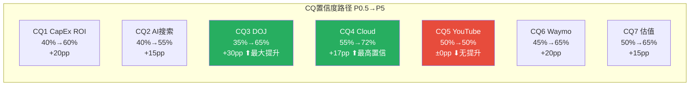

# Chapter 24: CQ1-7最终解答 — 5要素闭环

> **Phase 5 决策输出 | GOOGL (Alphabet Inc.) — v3.0 OVM整合**
> 数据截止: 2026-02-10 | 当前价: $324.32 [硬数据: FMP Quote, 2026-02-10]
> Ch23评分: **56.6/100** (中性关注) [v2.0: 58.1] | 收敛目标: **$248** [v2.0: $252] | 安全边际: **-23.5%** [v2.0: -22.3%]
> OVM Full Value: $228 | TAM Ceiling: $291 | 飞轮单点故障: Gemini/AI模型

---

## CQ1: $175-185B CapEx能否在3年内产生正向ROI？FCF Yield从5.2%降至1.83%是暂时还是结构性？

### 最终回答

**判断: 概率加权正向ROI，但时间窗口比市场预期更长(3-5年而非2-3年)，且FCF压缩是半结构性的(FY2026-2027维持低位，FY2028+恢复)。**

$175-185B CapEx中，Cloud基础设施投资(TPU v6/GPU集群/数据中心)占主体 [硬数据: Alphabet Q4 earnings call, 2026-02-04]。Cloud backlog $240B(环比+55%)和FY2025 Cloud +48%增速提供了需求侧锚点 [硬数据: Alphabet IR, Q4 2025]。但CapEx/Revenue从9.56%(FY2021)飙升至37.6%(FY2026E)是科技行业史上最激进的资本密集度跃升之一 [合理推断: 基于DM-FIN-004趋势]。

**核心矛盾**: Cloud会计利润率30.1%已经为正 [硬数据: Alphabet Q4 2025]，但经济ROI(考虑全部CapEx的折旧分摊)可能仍为负——Phase 3 Ch18计算的会计ROI 11.1%低于9% WACC [合理推断: Ch18 CapEx ROI分析]。这意味着CapEx正在创造会计利润但尚未创造经济利润，类似Amazon AWS在2013-2016年的路径(从运营盈利到真正的经济价值创造花了3-4年) [合理推断: AWS历史对标]。

**v3.0 OVM增量视角**: OVM Reverse DCF三层验证显示, Core-Only估值$216/股隐含12.9% FCF CAGR(合理), 而当前市价$324隐含18.2% FCF CAGR(显著激进, 需终端增长率g=5.72%远超合理区间2-3%) [合理推断: OVM-2 Layer 3分析]。$175B CapEx要产出正ROI, 需要将FCF CAGR从12.9%推升至少14%(Full Value隐含), 即从当前FCF $73B在10年内增至$277B——不是不可能但要求CapEx→Cloud传导完美执行 [合理推断: OVM-2 Layer 2反推]。

### 置信度路径

| Phase | 置信度 | 驱动因素 |
|:---:|:---:|------|
| P0.5 | 40% | CapEx指引"震惊世界"，分析师分歧大 |
| P1 | 45% | 管理层指引框架建立，但缺乏ROI证据 |
| P2 | 50% | SOTP确认Cloud价值$438B，但CapEx折旧压力量化 |
| P3 | 55% | AI调整显示CapEx→Cloud价值传导存在，HP-01漏斗建模 |
| P4 | 58% | KAL确认18-36月转化周期，压力测试显示ROI失败概率7.5% |
| **P5最终** | **60%** | **收敛判断: 正EV但时间>市场预期，FCF FY2028+恢复** |

### Kill Switch关联

- **主KS**: KS-05 (CapEx ROI失败: Cloud利润率回落<20%)
- **监控指标**: 季度CapEx执行额 vs Cloud增速比率; Cloud营业利润率连续2季<25%即触发警报
- **辅助KS**: KS-06 (FCF转负: 年度FCF<0)

### 1年内验证事件

1. **Q1 2026 Earnings (2026-04)** — 首个$175B指引下的CapEx执行数据。预期季度CapEx $42-46B。若>$50B且Cloud增速<40%，ROI论点恶化。
2. **Cloud FY2026年化利润率 (2026年Q2-Q3可见)** — 折旧加速后Cloud利润率是否维持>25%。Morgan Stanley预测44-50%收入增速 [硬数据: AInvest, 2026-01]，利润率是关键变量。

### "如果我们错了"

- **最可能错误方向**: 下行。CapEx→收入转化失败(如2000年电信CapEx类比成真)。
- **下行场景**: Cloud增速从48%骤降至15%+利润率回落至15% → CapEx大幅减记风险。
- **估值影响**: SOTP Cloud分部从$438B折价至$200-250B，每股影响约-$15~-20 [合理推断: ($438B-$225B)/12.2B股≈$17.5]。
- **概率**: 7-10% [合理推断: Ch22压力情景#3概率]。

---

## CQ2: AI Overviews是增强搜索护城河还是自蚕食搜索广告ARPU？CTR-61%数据如何影响$540B+搜索收入？

### 最终回答

**判断: 短期(1-2年)净中性偏正，中期(3-5年)仍高度不确定。搜索护城河正在从"流量垄断"向"AI质量垄断"转型，转型期存在收入抖动风险但非崩塌风险。**

Q4 2025搜索收入+17% YoY证明AI Overviews尚未侵蚀增长 [硬数据: Alphabet Q4 2025]。AI Overviews覆盖率从峰值25%回落至<16% [硬数据: Search Engine Land/Dataslayer, 2025-11]，CTR-61%的冲击被Google主动收窄覆盖面所缓解 [合理推断: 覆盖率下降与CTR问题的时间相关性]。被引品牌CTR反升+35%说明AI Overviews在重组流量分配而非消灭流量 [硬数据: Seer Interactive, 2025-09]。

但ChatGPT搜索份额已达9%且增长快速 [硬数据: StatCounter, 2026-01]，零点击搜索69% [硬数据: Similarweb, 2025] — 这两个趋势若持续，将在3-5年内从外部和内部双向压缩搜索ARPU。Phase 3 Ch17 AI冲击矩阵显示搜索分部内部分化严重(有机搜索-3 vs 广告搜索+1) [合理推断: Ch17分析]。

### 置信度路径

| Phase | 置信度 | 驱动因素 |
|:---:|:---:|------|
| P0.5 | 40% | CTR-61%数据令人震惊 |
| P1 | 45% | 搜索份额90%确认，但AI替代威胁定性分析 |
| P2 | 48% | SOTP搜索分部$1.53T，ARPU敏感性量化 |
| P3 | 52% | AI冲击矩阵L3×S2.5定位，蚕食模型三情景 |
| P4 | 55% | KAL上修至0%~+5%增量，Q4+17%验证 |
| **P5最终** | **55%** | **短期安全但中期高度不确定，是CQ中置信度最低的之一** |

### Kill Switch关联

- **主KS**: KS-03 (AI搜索替代: ChatGPT搜索份额>20%)
- **监控指标**: StatCounter月度搜索份额; 搜索ARPU(季度搜索收入/MAU)连续2季下降
- **辅助KS**: KS-11 (AI Overviews自蚕食加速: 搜索ARPU连续2季下降)

### 1年内验证事件

1. **ChatGPT搜索份额 (2026 Q2-Q3 StatCounter数据)** — 若从9%升至15%+，搜索护城河侵蚀加速。
2. **AI Overviews覆盖率+广告嵌入进展 (2026年Google I/O, ~5月)** — Google是否在AI Overviews内成功嵌入广告(AI Mode Bottom Ads)将决定ARPU走向。

### "如果我们错了"

- **最可能错误方向**: 下行。AI原生搜索增长快于预期。
- **下行场景**: ChatGPT+Perplexity搜索份额2027年达20%+，Google搜索ARPU下降10-15%。
- **估值影响**: 搜索分部从$1.53T折价至$1.2-1.3T，每股-$19~-27 [合理推断: ($1.53T-$1.25T)/12.2B≈$23]。
- **概率**: 15-20% [合理推断: Ch22压力情景#2概率12-18%取上限]。

---

## CQ3: DOJ反垄断最终结局是罚款/行为限制还是结构性拆分？时间窗和估值影响？

### 最终回答

**判断: 搜索案行为限制已确认(一审), 上诉推翻概率低(~20%); 广告技术案AdX剥离是新增风险点(~40%)但财务影响可控。综合概率加权估值影响约-$7~-8/股。**

Mehta法官2025-09已明确否决Chrome拆分，施加行为限制(禁止排他分发协议+年度竞标) [硬数据: NPR, 2025-09-02]。DOJ+35州2026-02-04提交上诉 [硬数据: 9to5Mac/PYMNTS, 2026-02-03]，但上诉标准是"clearly erroneous"，推翻难度极高 [合理推断: 上诉法院审查标准]。广告技术案中Brinkema法官裁定Google在AdX市场构成垄断，DOJ要求剥离AdX [硬数据: AdExchanger, 2025-2026]。

Phase 4 KAL验证将综合拆分概率从30%下调至20%，搜索案行为限制概率上调至80% [合理推断: Ch22 KA-RK-001验证]。核心新信息: 广告技术案的AdX剥离(40%概率)影响较Chrome拆分小得多——AdX占广告收入<5% [合理推断: Google Network $29.8B中AdX仅占部分]。

### 置信度路径

| Phase | 置信度 | 驱动因素 |
|:---:|:---:|------|
| P0.5 | 35% | DOJ上诉刚提交，不确定性极高 |
| P1 | 40% | 监管矩阵建立，Chrome拆分概率初估30% |
| P2 | 45% | 概率加权-$10.9/股量化 |
| P3 | 50% | 五引擎E5确认Polymarket无覆盖 |
| P4 | 60% | 一审行为限制确认+上诉推翻难度高+拆分概率下调至20% |
| **P5最终** | **65%** | **搜索案基本明朗(行为限制)，广告技术案是剩余变量** |

### Kill Switch关联

- **主KS**: KS-01 (DOJ反垄断升级: Chrome拆分概率>35%)
- **监控指标**: D.C.巡回上诉法院口头辩论日期; Brinkema法官AdX救济裁决
- **辅助KS**: KS-15 (监管罚款超预期: 单笔>$10B)

### 1年内验证事件

1. **广告技术案救济裁决 (2026年H2预计)** — AdX是否被强制剥离+对Network收入的影响
2. **D.C.巡回上诉法院进展 (2026年底-2027年)** — 口头辩论安排、临时命令等信号

### "如果我们错了"

- **最可能错误方向**: 下行。上诉法院推翻一审，强制Chrome分离。
- **下行场景**: Chrome剥离→搜索流量-27%→收入弹性0.6x→搜索收入-16.2% [合理推断: Ch22压力情景#1推导]。
- **估值影响**: 每股-$23(SOTP $203) [合理推断: Ch22情景#1]。
- **概率**: 8-12% [合理推断: Ch22评估]。

---

## CQ4: GCP能否从#3(15%)升至挑战Azure#2(21%)？$240B积压能否转化为30%+利润率？

### 最终回答

**判断: GCP正处于S-curve加速段，3年内挑战Azure #2地位有可能但非板上钉钉。Cloud利润率短期(FY2026)将因折旧承压至26-30%，但中期(FY2027-28)重回30-35%。这是7个CQ中置信度最高的。**

Q4 2025 Cloud +48% YoY ($17.7B)远超行业均值 [硬数据: Alphabet Q4 2025]。$240B backlog同比翻倍+确认需求可见性 [硬数据: Alphabet IR]。70%客户使用AI产品表明GenAI正在成为Cloud增长飞轮 [硬数据: Alphabet earnings call, 2026-02-04]。Morgan Stanley预测FY2026 Cloud增速44-50% [硬数据: AInvest, 2026-01]。

GCP市场份额15%(#3) vs AWS 28%(#1) vs Azure 21%(#2) [硬数据: 多来源共识, 2025-2026]。以当前增速差(GCP 48% vs Azure ~33% vs AWS ~19%)，GCP在2027-2028年有望缩小至接近Azure份额 [合理推断: 增速差复合效应]。但大客户集中度和企业级合规生态仍是Azure的结构性优势 [主观判断: 基于企业采购决策因素]。

### 置信度路径

| Phase | 置信度 | 驱动因素 |
|:---:|:---:|------|
| P0.5 | 55% | Cloud +48%初始数据强劲 |
| P1 | 60% | GCP产业链映射+竞争分析 |
| P2 | 63% | Cloud SOTP $438B确认独立价值 |
| P3 | 68% | HP-02 Gemini竞争力分析+PPDA验证 |
| P4 | 72% | KAL确认35-50%增速(Base↑45%)+backlog翻倍 |
| **P5最终** | **72%** | **最高置信CQ: 需求侧锚点充分，供给侧(利润率)是主要变量** |

### Kill Switch关联

- **主KS**: KS-04 (Cloud增速骤降: <20% QoQ连续2季)
- **监控指标**: Cloud季度收入增速+利润率; backlog环比变化; 大客户流失信号

### 1年内验证事件

1. **Cloud FY2026H1增速 (2026 Q1-Q2 earnings)** — 维持40%+即确认S-curve; <35%则需审视
2. **Cloud利润率 (2026 Q2-Q3)** — 折旧加速后能否维持>25%

### "如果我们错了"

- **最可能错误方向**: 上行。Cloud份额加速增长超预期。
- **上行场景**: GCP FY2026份额从15%升至18%+，利润率维持30%+ → Cloud分部估值上调至$500-550B。
- **估值影响**: 每股+$5~+9 [合理推断: ($525B-$438B)/12.2B≈$7]。
- **概率**: 25-30% [主观判断: 基于当前增速轨迹的乐观延伸]。

---

## CQ5: YouTube $600B+年收入能否维持双位数增长？Q4广告miss是一次性还是结构性？

### 最终回答

**判断: Q4 miss更可能是一次性的(广告主年末预算调整+Shorts变现进度)，但YouTube广告增速正从高双位数向中高个位数过渡(8-13%)。订阅业务(3.25亿)是新增长极，但变现效率低于广告。**

YouTube Q4广告$11.38B(+8.7%)miss预期$11.84B约$460M [硬数据: Alphabet Q4 2025 + Variety]。全年含订阅$600B+(首次超Netflix) [硬数据: Alphabet earnings, 2026-02-04]。3.25亿付费订阅 [硬数据: 同上]。但Shorts RPM仍显著低于长视频(估计<1/3) [合理推断: 基于行业数据，Shorts变现差距]。

Phase 4 KAL将YouTube增速区间从8-15%收窄至9-13%(上限下调) [合理推断: Ch22 KAL]。TikTok竞争和广告负载接近上限是结构性压力 [主观判断: 基于Phase 3分析]。但广告主对2026年数字视频投资意向+43%提供了需求侧支撑 [硬数据: eMarketer, 2026-01引用于Ch22]。

### 置信度路径

| Phase | 置信度 | 驱动因素 |
|:---:|:---:|------|
| P0.5 | 50% | Q4 miss数据初见 |
| P1 | 48% | YouTube竞争格局分析(TikTok/Reels) |
| P2 | 50% | SOTP YouTube $441B估值 |
| P3 | 50% | 五引擎对YouTube信号中性 |
| P4 | 48% | KAL上限下调至13%, miss数据确认 |
| **P5最终** | **50%** | **最低置信CQ之一: 增速方向明确(放缓)但幅度高度不确定** |

### Kill Switch关联

- **主KS**: KS-07 (YouTube广告连续下降: 2季QoQ负增长)
- **监控指标**: YouTube季度广告收入增速; Shorts RPM环比变化; 订阅数增速

### 1年内验证事件

1. **YouTube Q1 2026广告收入 (2026-04)** — Q4 miss后的反弹幅度: 回升至+12%+即一次性，维持<10%即趋势性
2. **YouTube Shorts RPM数据 (2026年Google I/O或Q2 earnings)** — 管理层可能首次披露Shorts vs 长视频变现比率

### "如果我们错了"

- **最可能错误方向**: 双向。miss可能既是一次性(广告主预算波动)也可能加速(Shorts拖累)。
- **下行场景**: YouTube广告增速持续<8%, Shorts RPM无改善 → YouTube分部从$441B折价至$350-380B。
- **估值影响**: 每股-$5~-7 [合理推断: ($441B-$365B)/12.2B≈$6.2]。
- **概率**: 20-25% [主观判断: 基于miss幅度和趋势]。

---

## CQ6: Waymo $126B估值是否合理？何时可能IPO/分拆释放价值？

### 最终回答

**判断: $126B融资估值偏高但有外部投资者背书(Sequoia/DST/Dragoneer参与$3B)。概率加权内在价值$100-122B。IPO最早2027-2028年可能，但Alphabet可能选择保留控制权。对GOOGL估值贡献有限(仅占市值~3.3%)。**

$16B融资轮@$126B(post-money)是自动驾驶史上最大融资 [硬数据: Electrek/CNBC, 2026-02-02]。外部投资者出资~$3B(Alphabet ~$13B)表明独立估值验证有限——Alphabet出资占81% [合理推断: $13B/$16B]。Phase 3 Ch18概率加权$122B(vs融资$126B仅-3.2%) [合理推断: Ch18 Waymo估值模型]。

1500万次出行/年 + 20+城市扩展计划 [硬数据: Waymo Blog, 2026-02-02]。但仍依赖Alphabet $13B持续补贴 [硬数据: Fortune, 2026-02-03]，独立盈利时间不确定 [主观判断: 基于烧钱率分析]。Phase 4 KAL将估值区间收窄至$100-150B(下限上调至$100B) [合理推断: Ch22 KAL验证]。

### 置信度路径

| Phase | 置信度 | 驱动因素 |
|:---:|:---:|------|
| P0.5 | 45% | $126B估值刚公布 |
| P1 | 50% | Waymo运营数据收集 |
| P2 | 55% | SOTP Other Bets $131B |
| P3 | 60% | Phase 3 Ch18: 概率加权$122B + TAM建模 |
| P4 | 65% | $16B融资确认+KAL收窄$100-150B |
| **P5最终** | **65%** | **外部验证+运营里程碑支撑，但补贴依赖是长期风险** |

### Kill Switch关联

- **主KS**: KS-08 (Waymo重大安全事故) + KS-17 (Waymo IPO失败/延迟)
- **监控指标**: Waymo月度出行量; 安全事件报告; IPO传闻/注册声明

### 1年内验证事件

1. **Waymo 2026年出行量增速 (季度更新, Waymo Blog)** — 从1500万次/年增至3000万次+即验证扩展成功
2. **Waymo IPO传闻 (2026-2027年)** — S-1文件提交将是关键催化剂

### "如果我们错了"

- **最可能错误方向**: 上行。Waymo扩展加速+IPO定价溢价。
- **上行场景**: Waymo 2027年IPO@$200B+ → 释放Alphabet隐含折价。
- **估值影响**: 每股+$6~+8 [合理推断: ($200B-$126B)×GOOGL持股~80%/12.2B≈$4.8, 加上折价释放效应]。
- **概率**: 15-20% [主观判断: IPO窗口+市场情绪依赖]。

---

## CQ7: 在FCF Yield 1.83%+P/E 30.6x的估值下，Alphabet的资本回报策略能否说服长期投资者？

### 最终回答

**判断: 当前估值($324)不仅完全定价了Bull Case, 更超越了OVM TAM Ceiling $291(所有四条期权全部成功的上限)。安全边际为负且比v2.0更差(-23.5% vs -22.3%)。FCF Yield 1.83%是历史低位，CapEx军备竞赛使FCF Yield短期内(FY2026-2027)难以恢复。对长期投资者，等待$248以下(六方法收敛)或$228(OVM Full Value)再建仓更合理。**

Phase 5 Ch23 v3.0六方法收敛目标$248(含OVM $228@15%权重)，50%置信区间$224-$278 [合理推断: Ch23 Part B v3.0]。OVM Full Value = Core $216 + PMX Options $12.03 = $228, Reverse DCF验证隐含14.0% FCF CAGR(合理偏乐观) [合理推断: OVM汇总]。关键增量发现: TAM Ceiling $291<$324, 意味着市场定价已超越"Waymo+Gemini+量子+健康四条期权全部Bull Case成功"的理论上限, Optionality利用率110% [合理推断: OVM-4天花板分析]。

SBC抵消率232%(回购>SBC)和首次派息(2024年)显示资本回报意愿 [硬数据: DM-SHR-001]。但FCF Yield从FY2022的5.2%降至1.83%，FY2026E CapEx $175-185B可能使FCF进一步压缩甚至转负 [合理推断: Ch19 Bear#3 FCF推演]。Berkshire建仓@$209(当前+55%浮盈)是正面信号 [硬数据: 13F, 2025-11-14]，但内部人93卖/0买(6个月)、Q1'26 56卖/5买是矛盾信号 [硬数据: FMP Insider Trading]。

**底线**: 基本面优秀(ROE 35.7%, ROIC 37.2%, 营收+15%, Cloud+48%)的公司，但当前定价已经反映了所有正面因素——甚至超越了。OVM七组件穷尽了Waymo/Gemini/量子/健康四条期权(含PMX协同), Full Value仍仅$228。$324 vs $228意味着市场隐含了$96/股的"叙事溢价", 其中约$30-40可归因于Core保守估值, 剩余$50-60指向市场高估。这不是"避免"而是"等待更好价格"的情况——理想建仓区间$198-$228 [主观判断: 基于OVM+六方法收敛+安全边际综合分析]。

### 置信度路径

| Phase | 置信度 | 驱动因素 |
|:---:|:---:|------|
| P0.5 | 50% | FCF Yield 1.83%引发关注 |
| P1 | 55% | 资本配置分析完成 |
| P2 | 58% | 多方法估值收敛确认高估 |
| P3 | 60% | 五引擎确认风险/回报不对称 |
| P4 | 65% | Phase 4综合$244确认溢价33% |
| P5(OVM) | 70% | OVM Full Value $228+TAM Ceiling $291<$324, 穷尽期权仍无法合理化 |
| **P5最终** | **70%** | **估值判断高置信: OVM进一步确认当前价偏贵** |

### Kill Switch关联

- **主KS**: KS-06 (FCF转负: 年度FCF<0) + KS-10 (宏观衰退: P/E<20x)
- **监控指标**: 季度FCF; FCF Yield; P/E vs 5Y均值; 回购金额变化

### 1年内验证事件

1. **FY2026 FCF (2027-02 earnings)** — FCF是否转负是最终验证。若FCF>$30B则CapEx ROI论点增强，<$0则CQ1和CQ7同时恶化。
2. **P/E走势 (持续监控)** — 若P/E压缩至25x(5Y均值)即$271/股，接近Phase 4综合$244的合理区间。

### "如果我们错了"

- **最可能错误方向**: 上行。AI革命使P/E永久性重估至35-40x(如1990s互联网重估)。
- **上行场景**: 市场接受"AI时代新常态"P/E 35-40x → 目标$378-$432。
- **估值影响**: 每股+$54~+$108 [合理推断: EPS $10.81 × 35-40x]。
- **概率**: 20-25% [主观判断: 历史上P/E重估往往与泡沫相伴]。

---

## CQ闭环质量检查

### CQ闭环汇总矩阵

| CQ | 最终回答(一句话) | 最终置信度 | 主KS | 最大风险 |
|:---:|------|:---:|:---:|------|
| CQ1 | 正EV但时间>预期(3-5年), FCF半结构性压缩 | 60% | KS-05 | CapEx ROI失败 |
| CQ2 | 短期净中性偏正, 中期高度不确定 | 55% | KS-03 | ChatGPT>20%份额 |
| CQ3 | 行为限制确认(80%), 拆分概率20%, 加权-$7~-8/股 | 65% | KS-01 | 上诉推翻 |
| CQ4 | S-curve加速段, 3年内挑战#2可能 | 72% | KS-04 | Cloud增速骤降 |
| CQ5 | 增速放缓至8-13%, Q4 miss偏一次性 | 50% | KS-07 | Shorts变现失败 |
| CQ6 | $100-122B概率加权, IPO 2027-28年可能 | 65% | KS-08 | 安全事故 |
| CQ7 | 当前溢价30.8%, OVM Full Value $228, 等待$248以下建仓 | **70%** | KS-06 | FCF转负 |
| **平均** | | **62.4%** | | |

**7/7 CQ全部包含5要素闭环** ✅
