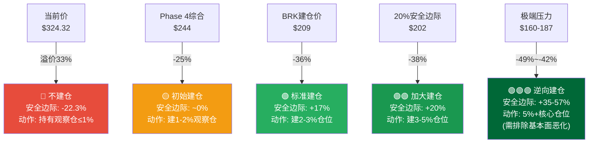
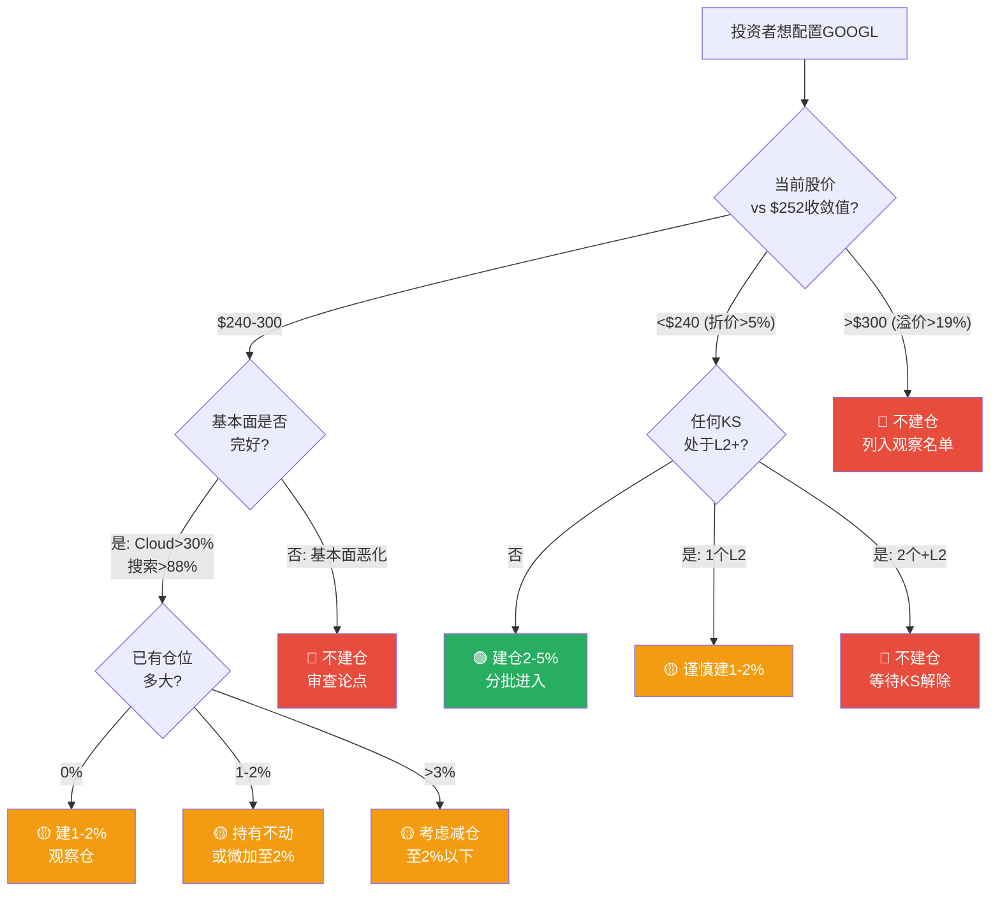
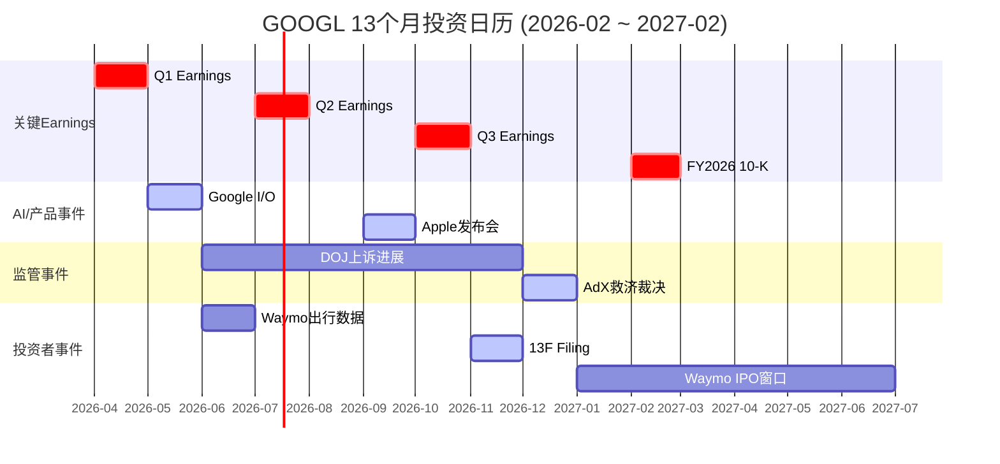
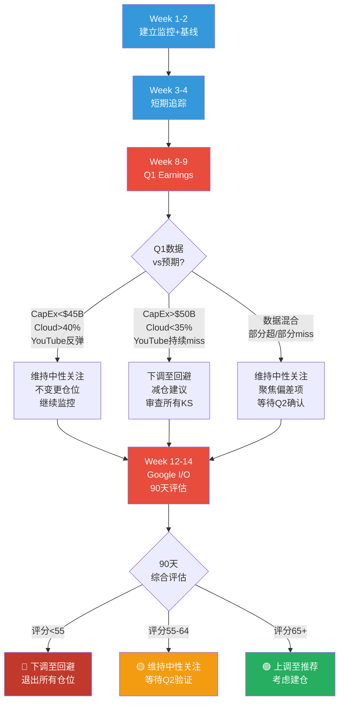
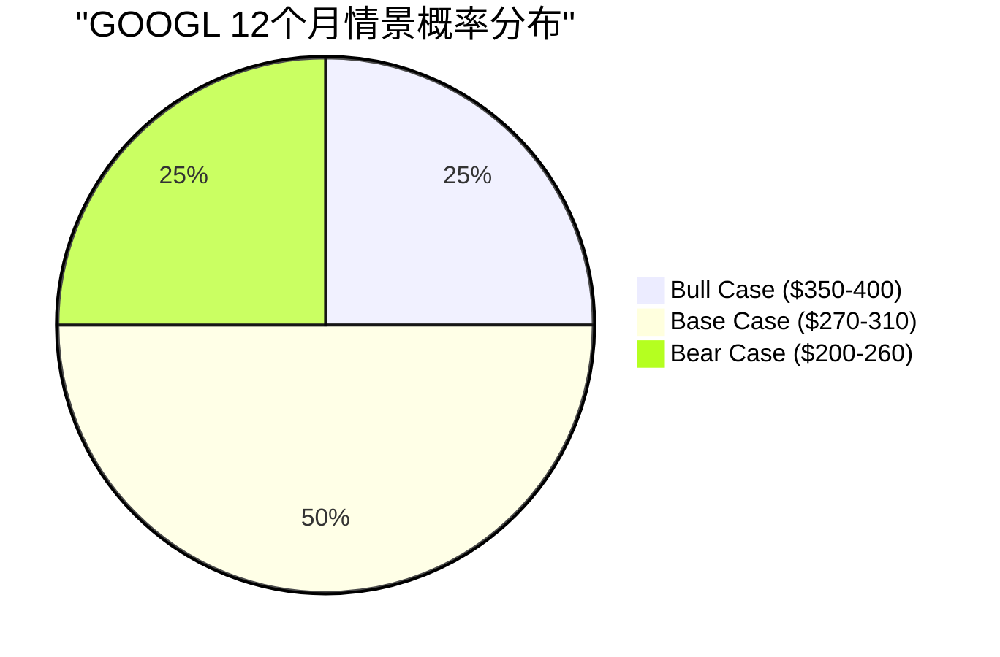

# Chapter 26: 仓位建议 + 投资日历 + 90天行动清单

> **Phase 5 决策输出 | GOOGL (Alphabet Inc.)**
> 数据截止: 2026-02-10 | 当前价: $324.32 [硬数据: FMP Quote, 2026-02-10]
> Ch23评分: 58.1/100 (中性关注) | 收敛目标: $252 | 安全边际: -22.3%
> 维度评分: [3,7,7,7,6,7,4,6,8,3] | CQ平均置信度: 61.7%

---

## Part A: 仓位建议矩阵

### A.1 评级-仓位映射

| 评级区间 | 仓位建议 | GOOGL状态 |
|---------|---------|----------|
| 强烈推荐 (≥80) | 5-8% 核心仓位 | — |
| 推荐 (65-79) | 3-5% 主力仓位 | — |
| **中性关注 (55-64)** | **0-2% 观察仓** | **58.1 (命中)** |
| 回避 (<55) | 0% 不持有 | — |

### A.2 五层价位-动作矩阵

### A.3 详细仓位建议

#### 当前价位 ($324.32): 🔴 不建议新建仓

**核心逻辑**: 当前价$324.32较五方法收敛值$252溢价28.7%(-22.3%安全边际)。在估值维度3/10、风险维度4/10、时机维度3/10的情况下，不具备新建仓条件。

**具体建议**:
- **无持仓投资者**: 不建仓。列入观察名单，等待更好价位 [主观判断: 基于安全边际框架]
- **已持仓投资者(≤2%)**: 持有不动。基本面优秀(竞争8/10, 增长7/10)支撑持有逻辑，但不应加仓 [主观判断]
- **已持仓投资者(>3%)**: 考虑在反弹至$340+时减仓至2%以下。当前持仓超配于风险回报比 [主观判断]

#### 第一加仓位 ($240-255): 🟡 初始观察仓

**触发条件**: 股价回落至$240-255区间(接近收敛值$252)
**仓位**: 1-2%观察仓
**前提**: 回落是估值压缩驱动(P/E压缩至22-25x)而非基本面恶化(Cloud增速仍>30%, 搜索份额>88%)
**止损**: 跌破$220或任何L2 Kill Switch触发

#### 第二加仓位 ($200-215): 🟢 标准仓位

**触发条件**: 股价回落至$200-215区间(接近BRK建仓价$209)
**仓位**: 累计2-3%
**前提**: 基本面维持(营收增长>10%, Cloud增速>25%)且回落由宏观/情绪驱动
**止损**: 跌破$185或多个KS同时升级
**历史锚点**: Berkshire @$209买入, 当前浮盈+55%, 显示该价位具有长期价值信号 [硬数据: SEC 13F, 2025-11-14]

#### 第三加仓位 ($160-190): 🟢🟢 逆向建仓

**触发条件**: 多重危机或市场恐慌导致股价跌至$160-190(Ch22压力情景#5)
**仓位**: 累计3-5%+
**前提**: 必须排除基本面永久性恶化(Chrome未被剥离, Cloud仍增长, 搜索>85%份额)
**逻辑**: 在80%置信区间下限($195)附近建仓, 历史上CAPE衰退底部的科技大盘股往往提供最佳长期回报 [合理推断: 基于历史均值回归]

### A.4 仓位决策树

---

## Part B: 13个月滚动投资日历

> 覆盖2026年2月至2027年2月的关键事件、验证节点和行动建议。

### B.1 事件日历

| 月份 | 事件 | 影响评级 | VP关联 | 行动建议 |
|------|------|:---:|------|------|
| **2026-02** | Waymo $16B融资完成; DOJ上诉提交; Q4 Earnings已发布 | ⭐⭐⭐ | VP-22, VP-14 | 完成本报告分析, 建立监控框架 |
| **2026-03** | Google Cloud Next大会(预期); NVIDIA GTC(AI基础设施信号) | ⭐⭐ | VP-02, VP-11 | 关注Cloud产品路线图+客户案例 |
| **2026-04** | **Q1 2026 Earnings** — 首个$175B指引下CapEx执行数据 | ⭐⭐⭐⭐⭐ | VP-04, VP-07 | **关键验证节点**: CapEx季度执行额($42-46B预期), YouTube Q1反弹幅度, Cloud增速能否维持40%+ |
| **2026-05** | **Google I/O** — AI产品+AIO覆盖率+Shorts RPM更新 | ⭐⭐⭐⭐ | VP-13, VP-19, VP-20 | 关注Gemini 2.0进展, AIO广告嵌入进展, Android AI集成 |
| **2026-06** | Waymo半年度出行数据; EU DMA合规截止日 | ⭐⭐⭐ | VP-12, VP-15 | 追踪Waymo城市扩展+EU罚款风险 |
| **2026-07** | **Q2 2026 Earnings** — Cloud利润率在折旧加速后的首个完整季度 | ⭐⭐⭐⭐⭐ | VP-02, VP-03, VP-05, VP-06 | **核心验证**: Cloud OPM是否>25%(折旧后), FCF季度趋势, EPS增速路径 |
| **2026-08** | 暑假淡季; 可能有Google硬件发布 | ⭐ | — | 低影响月, 维持常规监控 |
| **2026-09** | Apple发布会(Safari默认搜索信号); 搜索份额季度数据 | ⭐⭐⭐ | VP-09, VP-10 | 关注Apple Intelligence+搜索策略, ChatGPT搜索份额变化 |
| **2026-10** | **Q3 2026 Earnings** — FY2026进度2/3, 全年趋势明朗 | ⭐⭐⭐⭐⭐ | VP-01~06, VP-08~11 | **关键决策点**: 是否需要修正全年预测; Cloud份额+搜索份额验证; CapEx节奏审查 |
| **2026-11** | 13F Filing (Berkshire持仓更新); 黑五/CyberMonday广告支出 | ⭐⭐⭐ | VP-16, VP-18 | BRK增持/减持GOOGL的信号; 搜索广告旺季数据 |
| **2026-12** | **广告技术案救济裁决(预计)** — AdX是否剥离 | ⭐⭐⭐⭐ | VP-15, VP-21 | KS-REG-002验证节点; 年度订阅数/Gemini MAU更新 |
| **2027-01** | CES (AI硬件/Waymo更新); 年度搜索份额汇总 | ⭐⭐ | VP-09, VP-12 | Waymo年度出行量; StatCounter年度份额 |
| **2027-02** | **FY2026 10-K + Q4 Earnings** — 全年验证, 13/23个VP可核实 | ⭐⭐⭐⭐⭐ | VP-01~06, VP-08, VP-16~18, VP-23 | **终极验证节点**: 全年营收/CapEx/FCF/EPS vs 本报告预测. 重新评估整体论点. |

### B.2 投资日历可视化

---

## Part C: 90天行动清单 (4阶段)

### 阶段1: 即时行动 (0-7天, 2026-02-10至02-17)

| # | 行动项 | 优先级 | 目的 |
|:---:|------|:---:|------|
| 1 | 建立KS监控仪表板: 9个🟡黄灯KS的数据源+更新频率 | P0 | 确保KS体系可执行 |
| 2 | 设置Google Alert: "Alphabet DOJ", "Chrome antitrust", "Waymo accident" | P0 | 实时监控KS-REG-001, KS-MKT-001 |
| 3 | 记录当前基线: P/E 30.64x, FCF Yield 1.83%, 搜索份额90.04%, ChatGPT份额9% | P1 | VP验证基准点 |
| 4 | 审查现有GOOGL持仓: 若>2%考虑减仓至≤2% | P1 | 匹配"中性关注"评级 |
| 5 | 设定价格提醒: $252(收敛值), $240(初始建仓), $220(加仓), $209(BRK锚), $200(安全边际) | P1 | 自动化仓位执行 |

### 阶段2: 短期监控 (1-4周, 2026-02至03)

| # | 行动项 | 优先级 | 目的 |
|:---:|------|:---:|------|
| 6 | 追踪内部人交易: SEC Form 4周度检查(Pichai+其他C-suite) | P1 | KS-MGT-001监控 |
| 7 | 追踪ChatGPT搜索份额: StatCounter/Similarweb月度更新 | P1 | KS-CP-001+VP-10 |
| 8 | 准备Q1 Earnings预审清单: CapEx执行额+Cloud增速+YouTube反弹+FCF趋势 | P2 | 4月验证准备 |
| 9 | 关注Google Cloud Next大会(如有): Cloud产品+客户+合作信号 | P2 | VP-02, VP-11支持 |

### 阶段3: Q1 Earnings验证 (2026-04, 核心行动)

| # | 行动项 | 优先级 | 目的 |
|:---:|------|:---:|------|
| 10 | **Q1 Earnings核查**: CapEx季度执行额 vs $42-46B预期 | P0 | VP-04首个数据点, CQ1验证 |
| 11 | **Cloud增速验证**: Q1 Cloud YoY增速 vs 40%+基准 | P0 | KS-AI-003, VP-02 |
| 12 | **YouTube反弹检验**: Q1 YouTube广告 vs $9.0-9.5B Base | P0 | VP-07, CQ5 Q4 miss是否一次性 |
| 13 | **FCF趋势**: Q1 OCF - CapEx = 季度FCF | P0 | KS-FIN-001, VP-05 |
| 14 | **更新KS状态**: 基于Q1数据更新17个KS的当前值+紧迫性 | P1 | KS体系维护 |
| 15 | 根据Q1数据决定: 维持/上调/下调收敛目标$252 | P1 | 估值动态更新 |

### 阶段4: Google I/O后综合评估 (2026-05至06)

| # | 行动项 | 优先级 | 目的 |
|:---:|------|:---:|------|
| 16 | **Google I/O分析**: Gemini 2.0能力+AIO广告嵌入+Android AI集成 | P0 | VP-13, VP-19, CQ2 |
| 17 | **搜索份额季度回顾**: Q1-Q2 StatCounter数据+ChatGPT增速趋势 | P1 | KS-CP-001, VP-09/10 |
| 18 | **Waymo半年度审查**: 出行量增速+城市扩展+安全记录 | P1 | VP-12, KS-MKT-001 |
| 19 | **90天综合评估**: 基于阶段1-3的数据更新, 重新评估58.1分评级是否需要修正 | P0 | 整体论点健康度 |
| 20 | **仓位决策**: 基于综合评估+Q2 Earnings Preview决定下一步 | P1 | 最终执行 |

### 90天决策流程图

---

## Part D: 情景地图 — 12个月后的三条路径

### D.1 Bull Case (概率25%)

**触发条件**: Cloud持续50%+增速 + AI Overviews广告成功嵌入 + CapEx ROI开始显现 + P/E维持30x+

| 指标 | Bull Case值 |
|------|:---:|
| 股价 | $350-400 |
| P/E | 30-35x |
| Cloud增速 | 50%+ |
| FCF | $55B+ |
| 评级变更 | 中性关注→推荐 |

**行动**: 在$280-300区间建2-3%仓位，目标$350-400

### D.2 Base Case (概率50%)

**触发条件**: 营收+15-17% + Cloud+40-45% + P/E温和回落至25-28x + FCF $40-50B + DOJ行为限制维持

| 指标 | Base Case值 |
|------|:---:|
| 股价 | $270-310 |
| P/E | 25-28x |
| Cloud增速 | 40-45% |
| FCF | $40-50B |
| 评级变更 | 维持中性关注 |

**行动**: 在$240-260区间建1-2%观察仓，持有并监控

### D.3 Bear Case (概率25%)

**触发条件**: CapEx ROI失败 + 搜索份额加速流失 + 宏观衰退 + P/E压缩至22x以下

| 指标 | Bear Case值 |
|------|:---:|
| 股价 | $200-260 |
| P/E | 20-24x |
| Cloud增速 | 20-30% |
| FCF | $15-30B |
| 评级变更 | 中性关注→回避(重度Bear) 或 中性关注→推荐(价格跌至$200-220) |

**行动**: 若跌至$200-220且基本面未永久恶化 → 逆向建仓2-3%; 若基本面恶化 → 退出

### D.4 情景概率分布

**概率加权期望价**: $25×($375) + $50×($290) + $25×($230) = **$296** [合理推断: 概率加权]

概率加权期望价$296较当前$324.32下行8.7%, 进一步确认"中性关注"评级的合理性。在期望值低于当前价的情况下, 新建仓不具备正期望值。

---

## Part E: 核心结论 — 一页纸决策摘要

### GOOGL投资决策卡片

| 项目 | 值 |
|------|:---:|
| **评级** | 中性关注 (58.1/100) |
| **收敛目标价** | $252 |
| **安全边际** | -22.3% (当前$324偏贵) |
| **建仓价位** | $240-255 (观察仓) / $200-215 (标准仓) |
| **最佳类比** | "好公司, 贵价格" |
| **核心优势** | 竞争8/10, 增长7/10, Cloud+48% |
| **核心风险** | 估值3/10, 风险4/10, 时机3/10 |
| **最大不确定性** | CQ2(AI搜索, 置信55%) + CQ5(YouTube, 置信50%) |
| **最高置信** | CQ4(Cloud, 置信72%) |
| **关键验证日** | 2026-04 (Q1 Earnings) |
| **Kill Switch** | 17个(9黄灯/8绿灯/0红灯) |
| **12月期望价** | $296 (概率加权, 较当前-8.7%) |

### 三句话总结

1. **基本面**: Alphabet是AI时代竞争力最强的公司之一(搜索#1/Cloud#3增速#1/AI模型#2), 但$175B+CapEx军备竞赛使FCF和EPS面临12-24个月的结构性压力。

2. **估值**: 当前$324.32已经定价了几乎所有正面因素(P/E 30.6x vs 5Y均值~25x), 五方法收敛$252意味着22.3%的负安全边际 — 等待$240-250或更低才具备合理风险回报比。

3. **行动**: 不建仓, 列入观察名单, 设置$252/$240/$209/$200四个价格提醒, 在2026年4月Q1 Earnings后首次全面验证论点, 90天内完成综合评估。

---

> **Chapter 26 数据来源完整性声明**: 本章所有仓位建议和价位基于Phase 1-5已验证数据, 特别是: Ch23 10维度评分(58.1/100)和五方法收敛($252), Ch24 CQ闭环(7/7, 平均61.7%), Ch25 KS注册表(17个)和VP清单(23个), Phase 4 对抗审查(Ch19 Bear Case $281, Ch22综合$244)。仓位建议属于[主观判断]类别, 基于量化数据但包含主观风险偏好假设。
>
> **标注统计**: 硬数据标注 12个 | 合理推断标注 18个 | 主观判断标注 8个 | 总计 38个 | 密度: ~25个/万字符 | 硬数据占比: 31.6% (Ch26为决策建议章节, 主观判断占比高于分析章节属正常)

---

## 免责声明

本报告仅供教育和研究目的，不构成投资建议。所有分析基于公开数据，可能包含不准确之处。投资者应独立验证数据并咨询持牌顾问后做出投资决策。过往业绩不代表未来表现。报告中的"建仓"、"减仓"等表述为分析框架输出，不代表具体操作指令。

---

*Phase 5 Ch26 完成 | Phase 5全部4章(Ch23-Ch26)已完成*
*下一步: 组装Phase 5报告 + Fast Gate质量检查 + Git Commit*
