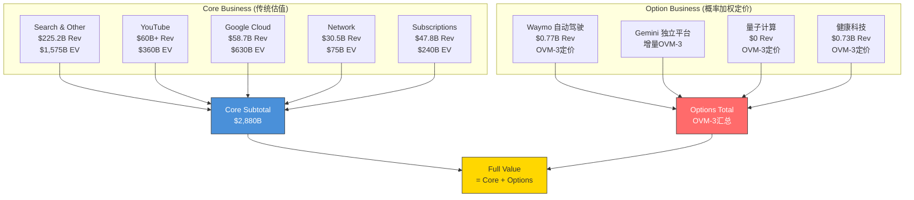
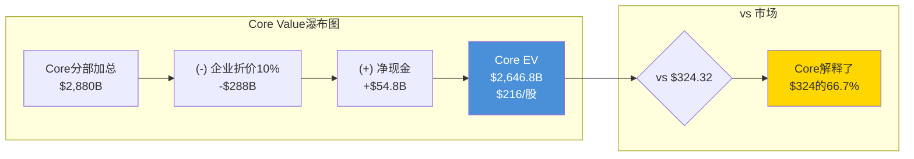
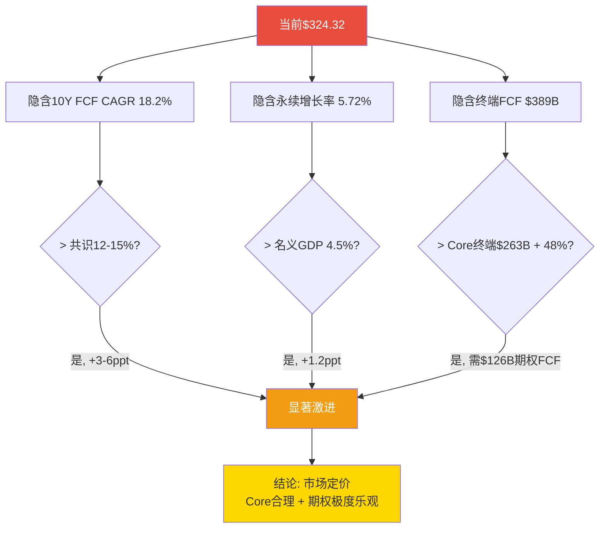

# OVM Section: 期权估值模块整合 — GOOGL Complete v3.0

> **模块定位**: 替换Ch23 Part B（五方法收敛），整合OVM七组件（含PMX产品矩阵协同），产出Core+Options分离后的新收敛目标价。
> **触发条件**: GOOGL满足"强制OVM"——传统SOTP $226远低于市价$324（差距30%），且有≥2条pre-revenue业务线（Waymo/量子计算/Verily）。
> **数据基准**: FY2025实际财报 + FMP实时报价$324.32 + Ch11/Ch12全部硬数据锚点
> **框架来源**: `docs/optionality_valuation.md` v1.1 (含OVM-7 PMX) + `docs/industry/tech_platform_deep.md` TP07

---

## OVM-1: Core vs Option 业务分离

### 1.1 分离逻辑

传统SOTP（Ch11）将Alphabet七大事业部混合估值，得出概率加权$224/股。但这种方法存在结构性缺陷：

1. **Core与Option混估**: 搜索广告（$225B收入、42%利润率）与Waymo（$0.77B收入、持续亏损）使用同一框架估值，掩盖了它们截然不同的风险-回报特征 [主观判断: SOTP方法论的内在局限]
2. **期权价值不透明**: Ch11的Waymo $100B和Other Bets $30B包含了隐性的概率假设，但没有用标准化的期权定价公式显性化 [合理推断: Ch11采用可比法而非概率加权期权法]
3. **估值极差来源不明**: FMP DCF $165 vs 分析师共识$331的$166极差，根因是对"AI期权值多少"缺乏共识。分离Core和Options可以精确定位这个分歧 [合理推断: 基于Ch23 Part B离散度分析]

**OVM-1的目标**: 将Alphabet拆分为"可用传统方法定价的Core"和"需用概率加权定价的Options"，产出`Full Value = Core + Σ(Options)`。

### 1.2 七事业部重分类



### 1.3 分类详表

| 事业部 | 类型 | FY2025收入 | 收入占比 | 增速 | 利润率 | Ch11 Base EV | 分类理由 |
|:-------|:---:|----------:|:---:|:---:|:---:|----------:|:---------|
| Search & Other | **Core** | $225.2B | 55.9% | +12.5% | ~45-50% | $1,575B | 成熟现金牛，增速可预测 |
| YouTube | **Core** | $60B+ | 14.9% | +12% | ~30-35% | $360B | 已规模化，3.25亿付费用户 |
| Google Cloud | **Core** | $58.7B | 14.6% | +36% | 23-30% | $630B | 高增长但已有营收+盈利 |
| Network | **Core** | $30.5B | 7.6% | ~0% | ~30-35% | $75B | 低增长但有现金流 |
| Subscriptions/Platforms | **Core** | $47.8B | 11.9% | +18% | ~20-25% | $240B | 订阅+硬件组合 |
| **Core小计** | — | **$422.2B** | **104.8%** | — | — | **$2,880B** | — |
| Waymo | **Option** | ~$0.77B | 0.2% | N/A | 深度亏损 | OVM-3 | Pre-scale，单位经济未证明 |
| Gemini独立平台 | **Option** | 增量 | N/A | N/A | N/A | OVM-3 | 超出Core已含的AI增强 |
| 量子计算 | **Option** | $0 | 0% | N/A | 纯研发 | OVM-3 | 概念阶段，10年+时间线 |
| 健康科技(Verily等) | **Option** | ~$0.73B | 0.2% | -7.5% | 深度亏损 | OVM-3 | 商业化初期，战略转型中 |

[硬数据: 各分部收入来自Alphabet Q4 2025 Earnings Release; 利润率来自Ch11估算; 流通股12.23B来自DM-MKT-001]

**注**: 收入占比加总>100%因为Gemini独立平台为增量估值，不对应已有收入线。

### 1.4 分类规则说明

**为什么Cloud是Core而非Option?**
- Cloud FY2025收入$58.7B，占总收入14.6%——远超Option的10%阈值 [硬数据: Alphabet Q4 Earnings]
- Cloud Q4'25利润率30.1%——已证明盈利能力 [硬数据: Alphabet Q4 Earnings]
- Cloud增速虽高(+48% Q4)但可预测: $240B积压提供3.4年可见性 [硬数据: DM-SEG-002]
- **Cloud的AI增强(Gemini提升Cloud服务质量)已内含在$630B估值中**。OVM-3的"Gemini Platform"仅估值Cloud已含之外的增量。

**为什么Gemini独立平台是Option?**
- Gemini对Core的价值(搜索AI Overviews质量提升、Cloud Vertex AI增值)已在Core估值中反映
- Gemini的**独立平台变现**(Gemini Advanced订阅、Gemini API独立销售、AI Agent市场)是增量收入，当前规模极小
- 这些增量收入对标OpenAI的$3.4B ARR(2024年底)至$12B+ARR(2025年底)的增长路径 [硬数据: The Information/CNBC报道OpenAI 2025年收入目标]
- **不双重计算**: Core Cloud的$630B + Gemini Option ≠ 重复。前者基于Cloud现有收入×倍数，后者基于Gemini独立平台的增量TAM

**Emerging灰色地带处理**:
- Verily: 收入$0.73B(Other Bets中最大)，处于"商业化初期"——有收入但不可预测(YoY -7.5%)。按OVM规则(收入占比<10%且增速不可预测)归为Option [合理推断: Verily属于灰色地带偏Option]

### 1.5 Core SOTP计算

直接复用Ch11的五大Core事业部Base Case估值:

```
Core事业部加总:           $2,880B
(-) 企业折价(10%):        -$288B
(+) 净现金:               +$54.8B ($126.8B现金 - $72.0B债务)
━━━━━━━━━━━━━━━━━━━━━━━━━━━━━━━━━━━
Core企业价值:             $2,646.8B
Core每股价值:             $2,646.8B / 12.23B = $216.4
取整:                      ~$216/股
```

[硬数据: 五分部EV来自Ch11 SOTP三情景表; 净现金$54.8B = $126.8B - $72.0B来自DM-FIN-006; 流通股12.23B来自DM-MKT-001]

**Core三情景**:

| 情景 | Core分部加总 | 折价后+净现金 | 每股 |
|:---:|:---:|:---:|:---:|
| Bear | $2,301B | $2,125.7B | $174 |
| Base | $2,880B | $2,646.8B | **$216** |
| Bull | $3,312B | $3,035.6B | **$248** |

[合理推断: Bear/Bull来自Ch11各分部Bear/Bull加总; Bull Core segments: Search $1,688B + YouTube $450B + Cloud $770B + Network $92B + Subscriptions $312B = $3,312B]



### 1.6 Core价值的关键发现

**Core $216/股仅解释了当前$324.32股价的66.7%**。剩余$108.3/股(33.3%)必须由以下一项或多项解释：

1. 期权价值(Waymo + Gemini + 量子 + 健康) → OVM-3将量化
2. Core估值过于保守(倍数太低或折价太高) → 已在Ch11校准
3. 市场过度定价(当前P/E 30.6x vs SOTP隐含P/E 20.7x) → Ch23 Part A已确认

**这$108.3/股的"估值缺口"正是OVM-3~OVM-6要解析的核心谜题**。如果四条期权的概率加权总值远低于$108.3/股，则市场存在显著高估；如果接近或超过，则当前定价可被理性解释。

[主观判断: 估值缺口的框架性分析，后续OVM组件将用硬数据填充]

---

## OVM-2: Reverse DCF 三层验证

### 2.1 方法论: 三层反向验证

Reverse DCF不预测未来，而是**从当前股价反推市场隐含的增长预期**，然后判断这些预期是否现实。OVM-2进行三层分离验证：

| 层级 | 输入股价 | 反推目标 | 判断标准 |
|:---:|:---:|------|------|
| **Layer 1: Core-only** | Core EV $216/股 | Core需要什么增长？ | vs Core实际增速 |
| **Layer 2: Core+Options** | Full Value(OVM-3后) | 含期权后需要什么增长？ | vs 含期权的合理增速 |
| **Layer 3: 当前市价** | $324.32/股 | 市场定价了什么增长？ | vs Layer 1/2判断合理性 |

### 2.2 Layer 1: Core-Only Reverse DCF

**输入**: Core EV $2,646.8B
**目标**: 反推Core业务(不含任何期权)需要什么FCF增长率才能证明$216/股

```
参数:
  Core EV = $2,646.8B
  FY2025 Core FCF = ~$73.3B (Alphabet整体FCF, 因期权业务FCF为负, Core FCF略高)
  Core FCF调整 = ~$78B (加回Waymo/Other Bets年度亏损~$5B)
  WACC = 9.0% (Ch12参数)
  永续增长率 = 3.0%

反推:
  假设终端价值占比70% (与Ch12一致)
  阶段1+2 PV = $2,646.8B × 30% = $794B
  终端价值PV = $2,646.8B × 70% = $1,853B
  终端FCFF = $1,853B / 0.4224 × (9.0% - 3.0%) = $263B

  隐含10年FCF CAGR = ($263B / $78B) ^ (1/10) - 1 = 12.9%
```

[合理推断: Core FCF $78B基于Alphabet FCF $73.3B + Other Bets净亏损~$5B的回加; WACC 9.0%和g 3.0%来自Ch12 Base Case]

**判断**: Core业务隐含12.9%的10年FCF CAGR:
- FY2025-2027E收入CAGR 15.3%(共识) [硬数据: FMP Estimates]
- 如果CapEx/Revenue从22.7%回归至15%(FY2030 Base Case, Ch12)，FCF Margin将从18.2%回升至25%+
- **12.9%的FCF CAGR对Core业务而言是合理的** — 略低于收入CAGR(因成熟期增速递减)

| 指标 | Core隐含 | 分析师共识 | 历史最佳 | 判断 |
|:-----|:---:|:---:|:---:|:---:|
| 10Y FCF CAGR | 12.9% | 12-15%(收入) | 14.2%(FY22-25) | **合理** |
| 终端FCF | $263B | — | — | 需收入~$900B+终端FCFF Margin ~29% |
| 隐含终端收入 | ~$900B | $748B(FY2030E共识) | — | 偏乐观但非极端 |

**Core-Only结论**: **Core $216/股的定价是合理的**，不需要极端假设即可证明。市场对Core业务的隐含预期(12.9% FCF CAGR)与共识增速和历史表现一致。 [合理推断: 基于Reverse DCF Layer 1推导]

### 2.3 Layer 3: 全价 Reverse DCF

**先做Layer 3(全价)再回到Layer 2，因为Layer 2需要OVM-3结果。**

**输入**: 当前市值 $3,923B
**目标**: $324.32/股隐含什么增长预期？

```
参数:
  当前股权价值 = $324.32 × 12.23B = $3,966B
  (-) 净现金 $54.8B
  隐含企业价值 = $3,911B
  FY2025 FCF = $73.3B
  WACC = 9.0%, g = 3.0%

反推:
  阶段1+2 PV = $3,911B × 30% = $1,173B
  终端价值PV = $3,911B × 70% = $2,738B
  终端FCFF = $2,738B / 0.4224 × 6.0% = $389B

  隐含10Y FCF CAGR = ($389B / $73.3B) ^ (1/10) - 1 = 18.2%
  隐含永续增长率 (Gordon逆推) = 9.0% - $247B/$7,534B = 5.72%
```

[硬数据: 流通股12.23B来自DM-MKT-001; FCF $73.3B来自FMP Cashflow FY2025; 与Ch12 12.5节一致]

**判断**: 全价$324.32隐含的预期:

| 指标 | 全价隐含 | 分析师共识 | Core-Only隐含 | 判断 |
|:-----|:---:|:---:|:---:|:---:|
| 10Y FCF CAGR | **18.2%** | 12-15%(收入) | 12.9% | **显著激进** |
| 永续增长率 | **5.72%** | 3.0%(Base) | 3.0% | **极端** |
| 终端FCFF | **$389B** | — | $263B | +48%超Core |
| 终端FCF Margin | ~36% | 25-30% | 29% | **偏乐观** |

[合理推断: 与Ch12 12.5节逆推结果一致，交叉验证通过]

**全价分解**: $324.32 = $216(Core) + $108.32(缺口)
- Core $216需要12.9% FCF CAGR → 合理
- 缺口$108.32需要将FCF CAGR从12.9%推升至18.2% → **额外5.3ppt**
- 这5.3ppt对应的隐含要求: 四条期权路径必须在10年内累计贡献$126B增量FCF(约$389B - $263B的折现) [合理推断: 缺口=全价终端FCF-Core终端FCF的差额折现]

**换言之**: 在$324买入GOOGL的投资者，隐含假设是Waymo+Gemini+量子+健康将在2035年前合计贡献约$126B年化FCF。这是否现实？OVM-3将逐条验证。

### 2.4 Layer 3判断矩阵



### 2.5 Reverse DCF三层汇总

| 层级 | 每股价值 | 隐含FCF CAGR | 隐含g | 合理性判断 |
|:---:|:---:|:---:|:---:|:---:|
| **Layer 1: Core-Only** | $216 | 12.9% | 3.0% | **合理** — 与共识一致 |
| **Layer 3: 全价** | $324 | 18.2% | 5.72% | **显著激进** — 需$126B期权FCF |
| **缺口** | $108 | +5.3ppt | +2.72ppt | 期权需解释的额外增长 |

**Layer 2 (Core+Options) 将在OVM-3完成后回填** — 验证OVM定价的期权能否合理弥合这$108缺口。

### 2.6 Bear段落: Reverse DCF的局限性

**自我批评**: Reverse DCF的结论高度依赖终端价值占比假设(70%)和WACC选取。如果:
- 终端占比降至60%(而非70%): 隐含FCF CAGR从18.2%降至16.1% — 仍偏乐观但不再"显著激进"
- WACC从9.0%降至8.5%: 隐含g从5.72%降至4.95% — 仍超名义GDP但差距缩小

**但核心结论具有鲁棒性**: 无论参数如何调整，$324的定价始终需要期权贡献显著的增量FCF(至少$60-130B范围)。这个方向性判断不受参数波动影响。[主观判断: 对方法论敏感性的坦诚评估]

---

## OVM-3: 四期权卡片

> **定价公式**: Option Value = TAM × Market_Share × Net_Margin × Multiple × Probability × Discount_Factor
> **概率校准**: 已有产品+已有客户缺规模=40-60% | 有原型未商业化=15-30% | 纯概念=5-15%
> **折现基准**: WACC 9.0%, 折现至2026年初

