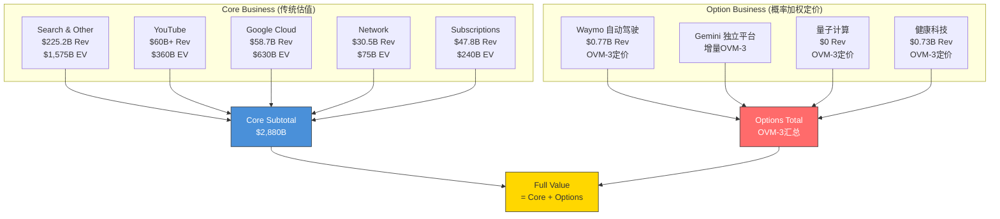
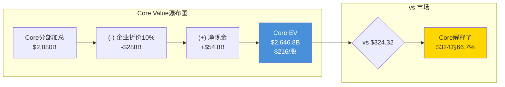
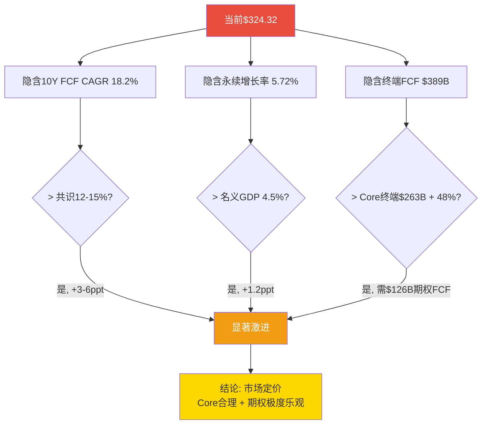
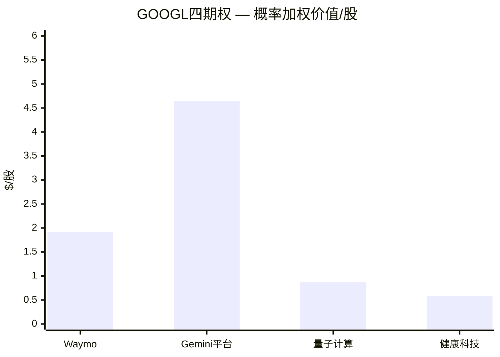
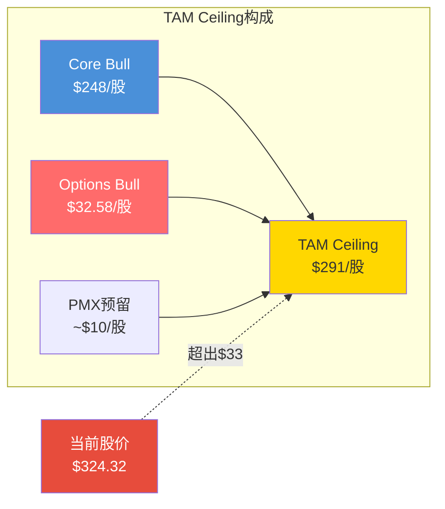
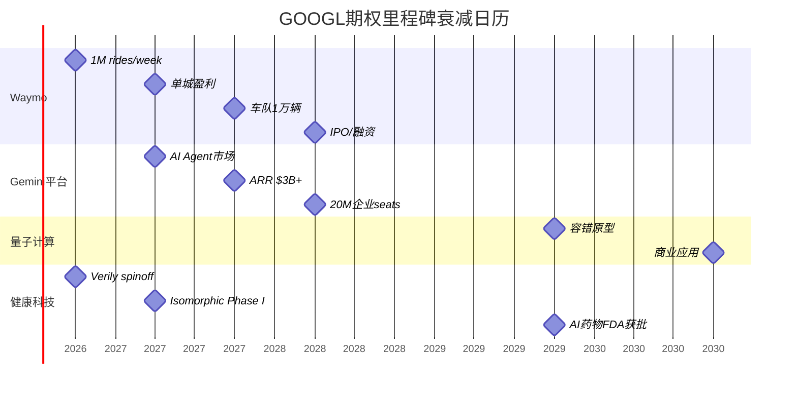
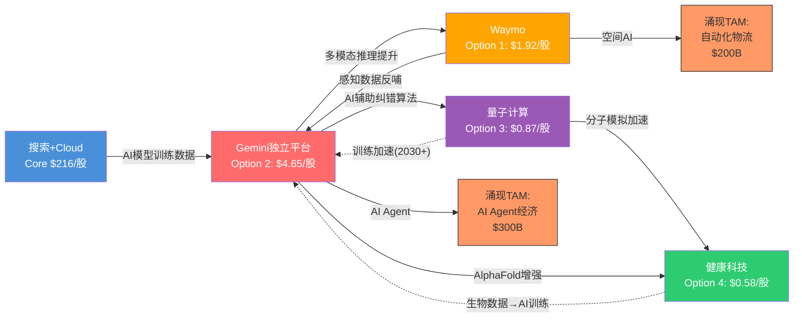
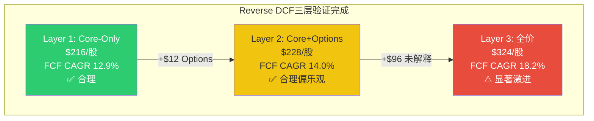

# OVM Section: 期权估值模块整合 — GOOGL Complete v3.0

> **模块定位**: 替换Ch23 Part B（五方法收敛），整合OVM七组件（含PMX产品矩阵协同），产出Core+Options分离后的新收敛目标价。
> **触发条件**: GOOGL满足"强制OVM"——传统SOTP $226远低于市价$324（差距30%），且有≥2条pre-revenue业务线（Waymo/量子计算/Verily）。
> **数据基准**: FY2025实际财报 + FMP实时报价$324.32 + Ch11/Ch12全部硬数据锚点
> **框架来源**: `docs/optionality_valuation.md` v1.1 (含OVM-7 PMX) + `docs/industry/tech_platform_deep.md` TP07

---

## OVM-1: Core vs Option 业务分离

### 1.1 分离逻辑

传统SOTP（Ch11）将Alphabet七大事业部混合估值，得出概率加权$224/股。但这种方法存在结构性缺陷：

1. **Core与Option混估**: 搜索广告（$225B收入、42%利润率）与Waymo（$0.77B收入、持续亏损）使用同一框架估值，掩盖了它们截然不同的风险-回报特征 [主观判断: SOTP方法论的内在局限]
2. **期权价值不透明**: Ch11的Waymo $100B和Other Bets $30B包含了隐性的概率假设，但没有用标准化的期权定价公式显性化 [合理推断: Ch11采用可比法而非概率加权期权法]
3. **估值极差来源不明**: FMP DCF $165 vs 分析师共识$331的$166极差，根因是对"AI期权值多少"缺乏共识。分离Core和Options可以精确定位这个分歧 [合理推断: 基于Ch23 Part B离散度分析]

**OVM-1的目标**: 将Alphabet拆分为"可用传统方法定价的Core"和"需用概率加权定价的Options"，产出`Full Value = Core + Σ(Options)`。

### 1.2 七事业部重分类



### 1.3 分类详表

| 事业部 | 类型 | FY2025收入 | 收入占比 | 增速 | 利润率 | Ch11 Base EV | 分类理由 |
|:-------|:---:|----------:|:---:|:---:|:---:|----------:|:---------|
| Search & Other | **Core** | $225.2B | 55.9% | +12.5% | ~45-50% | $1,575B | 成熟现金牛，增速可预测 |
| YouTube | **Core** | $60B+ | 14.9% | +12% | ~30-35% | $360B | 已规模化，3.25亿付费用户 |
| Google Cloud | **Core** | $58.7B | 14.6% | +36% | 23-30% | $630B | 高增长但已有营收+盈利 |
| Network | **Core** | $30.5B | 7.6% | ~0% | ~30-35% | $75B | 低增长但有现金流 |
| Subscriptions/Platforms | **Core** | $47.8B | 11.9% | +18% | ~20-25% | $240B | 订阅+硬件组合 |
| **Core小计** | — | **$422.2B** | **104.8%** | — | — | **$2,880B** | — |
| Waymo | **Option** | ~$0.77B | 0.2% | N/A | 深度亏损 | OVM-3 | Pre-scale，单位经济未证明 |
| Gemini独立平台 | **Option** | 增量 | N/A | N/A | N/A | OVM-3 | 超出Core已含的AI增强 |
| 量子计算 | **Option** | $0 | 0% | N/A | 纯研发 | OVM-3 | 概念阶段，10年+时间线 |
| 健康科技(Verily等) | **Option** | ~$0.73B | 0.2% | -7.5% | 深度亏损 | OVM-3 | 商业化初期，战略转型中 |

[硬数据: 各分部收入来自Alphabet Q4 2025 Earnings Release; 利润率来自Ch11估算; 流通股12.23B来自DM-MKT-001]

**注**: 收入占比加总>100%因为Gemini独立平台为增量估值，不对应已有收入线。

### 1.4 分类规则说明

**为什么Cloud是Core而非Option?**
- Cloud FY2025收入$58.7B，占总收入14.6%——远超Option的10%阈值 [硬数据: Alphabet Q4 Earnings]
- Cloud Q4'25利润率30.1%——已证明盈利能力 [硬数据: Alphabet Q4 Earnings]
- Cloud增速虽高(+48% Q4)但可预测: $240B积压提供3.4年可见性 [硬数据: DM-SEG-002]
- **Cloud的AI增强(Gemini提升Cloud服务质量)已内含在$630B估值中**。OVM-3的"Gemini Platform"仅估值Cloud已含之外的增量。

**为什么Gemini独立平台是Option?**
- Gemini对Core的价值(搜索AI Overviews质量提升、Cloud Vertex AI增值)已在Core估值中反映
- Gemini的**独立平台变现**(Gemini Advanced订阅、Gemini API独立销售、AI Agent市场)是增量收入，当前规模极小
- 这些增量收入对标OpenAI的$3.4B ARR(2024年底)至$12B+ARR(2025年底)的增长路径 [硬数据: The Information/CNBC报道OpenAI 2025年收入目标]
- **不双重计算**: Core Cloud的$630B + Gemini Option ≠ 重复。前者基于Cloud现有收入×倍数，后者基于Gemini独立平台的增量TAM

**Emerging灰色地带处理**:
- Verily: 收入$0.73B(Other Bets中最大)，处于"商业化初期"——有收入但不可预测(YoY -7.5%)。按OVM规则(收入占比<10%且增速不可预测)归为Option [合理推断: Verily属于灰色地带偏Option]

### 1.5 Core SOTP计算

直接复用Ch11的五大Core事业部Base Case估值:

```
Core事业部加总:           $2,880B
(-) 企业折价(10%):        -$288B
(+) 净现金:               +$54.8B ($126.8B现金 - $72.0B债务)
━━━━━━━━━━━━━━━━━━━━━━━━━━━━━━━━━━━
Core企业价值:             $2,646.8B
Core每股价值:             $2,646.8B / 12.23B = $216.4
取整:                      ~$216/股
```

[硬数据: 五分部EV来自Ch11 SOTP三情景表; 净现金$54.8B = $126.8B - $72.0B来自DM-FIN-006; 流通股12.23B来自DM-MKT-001]

**Core三情景**:

| 情景 | Core分部加总 | 折价后+净现金 | 每股 |
|:---:|:---:|:---:|:---:|
| Bear | $2,301B | $2,125.7B | $174 |
| Base | $2,880B | $2,646.8B | **$216** |
| Bull | $3,312B | $3,035.6B | **$248** |

[合理推断: Bear/Bull来自Ch11各分部Bear/Bull加总; Bull Core segments: Search $1,688B + YouTube $450B + Cloud $770B + Network $92B + Subscriptions $312B = $3,312B]



### 1.6 Core价值的关键发现

**Core $216/股仅解释了当前$324.32股价的66.7%**。剩余$108.3/股(33.3%)必须由以下一项或多项解释：

1. 期权价值(Waymo + Gemini + 量子 + 健康) → OVM-3将量化
2. Core估值过于保守(倍数太低或折价太高) → 已在Ch11校准
3. 市场过度定价(当前P/E 30.6x vs SOTP隐含P/E 20.7x) → Ch23 Part A已确认

**这$108.3/股的"估值缺口"正是OVM-3~OVM-6要解析的核心谜题**。如果四条期权的概率加权总值远低于$108.3/股，则市场存在显著高估；如果接近或超过，则当前定价可被理性解释。

[主观判断: 估值缺口的框架性分析，后续OVM组件将用硬数据填充]

---

## OVM-2: Reverse DCF 三层验证

### 2.1 方法论: 三层反向验证

Reverse DCF不预测未来，而是**从当前股价反推市场隐含的增长预期**，然后判断这些预期是否现实。OVM-2进行三层分离验证：

| 层级 | 输入股价 | 反推目标 | 判断标准 |
|:---:|:---:|------|------|
| **Layer 1: Core-only** | Core EV $216/股 | Core需要什么增长？ | vs Core实际增速 |
| **Layer 2: Core+Options** | Full Value(OVM-3后) | 含期权后需要什么增长？ | vs 含期权的合理增速 |
| **Layer 3: 当前市价** | $324.32/股 | 市场定价了什么增长？ | vs Layer 1/2判断合理性 |

### 2.2 Layer 1: Core-Only Reverse DCF

**输入**: Core EV $2,646.8B
**目标**: 反推Core业务(不含任何期权)需要什么FCF增长率才能证明$216/股

```
参数:
  Core EV = $2,646.8B
  FY2025 Core FCF = ~$73.3B (Alphabet整体FCF, 因期权业务FCF为负, Core FCF略高)
  Core FCF调整 = ~$78B (加回Waymo/Other Bets年度亏损~$5B)
  WACC = 9.0% (Ch12参数)
  永续增长率 = 3.0%

反推:
  假设终端价值占比70% (与Ch12一致)
  阶段1+2 PV = $2,646.8B × 30% = $794B
  终端价值PV = $2,646.8B × 70% = $1,853B
  终端FCFF = $1,853B / 0.4224 × (9.0% - 3.0%) = $263B

  隐含10年FCF CAGR = ($263B / $78B) ^ (1/10) - 1 = 12.9%
```

[合理推断: Core FCF $78B基于Alphabet FCF $73.3B + Other Bets净亏损~$5B的回加; WACC 9.0%和g 3.0%来自Ch12 Base Case]

**判断**: Core业务隐含12.9%的10年FCF CAGR:
- FY2025-2027E收入CAGR 15.3%(共识) [硬数据: FMP Estimates]
- 如果CapEx/Revenue从22.7%回归至15%(FY2030 Base Case, Ch12)，FCF Margin将从18.2%回升至25%+
- **12.9%的FCF CAGR对Core业务而言是合理的** — 略低于收入CAGR(因成熟期增速递减)

| 指标 | Core隐含 | 分析师共识 | 历史最佳 | 判断 |
|:-----|:---:|:---:|:---:|:---:|
| 10Y FCF CAGR | 12.9% | 12-15%(收入) | 14.2%(FY22-25) | **合理** |
| 终端FCF | $263B | — | — | 需收入~$900B+终端FCFF Margin ~29% |
| 隐含终端收入 | ~$900B | $748B(FY2030E共识) | — | 偏乐观但非极端 |

**Core-Only结论**: **Core $216/股的定价是合理的**，不需要极端假设即可证明。市场对Core业务的隐含预期(12.9% FCF CAGR)与共识增速和历史表现一致。 [合理推断: 基于Reverse DCF Layer 1推导]

### 2.3 Layer 3: 全价 Reverse DCF

**先做Layer 3(全价)再回到Layer 2，因为Layer 2需要OVM-3结果。**

**输入**: 当前市值 $3,923B
**目标**: $324.32/股隐含什么增长预期？

```
参数:
  当前股权价值 = $324.32 × 12.23B = $3,966B
  (-) 净现金 $54.8B
  隐含企业价值 = $3,911B
  FY2025 FCF = $73.3B
  WACC = 9.0%, g = 3.0%

反推:
  阶段1+2 PV = $3,911B × 30% = $1,173B
  终端价值PV = $3,911B × 70% = $2,738B
  终端FCFF = $2,738B / 0.4224 × 6.0% = $389B

  隐含10Y FCF CAGR = ($389B / $73.3B) ^ (1/10) - 1 = 18.2%
  隐含永续增长率 (Gordon逆推) = 9.0% - $247B/$7,534B = 5.72%
```

[硬数据: 流通股12.23B来自DM-MKT-001; FCF $73.3B来自FMP Cashflow FY2025; 与Ch12 12.5节一致]

**判断**: 全价$324.32隐含的预期:

| 指标 | 全价隐含 | 分析师共识 | Core-Only隐含 | 判断 |
|:-----|:---:|:---:|:---:|:---:|
| 10Y FCF CAGR | **18.2%** | 12-15%(收入) | 12.9% | **显著激进** |
| 永续增长率 | **5.72%** | 3.0%(Base) | 3.0% | **极端** |
| 终端FCFF | **$389B** | — | $263B | +48%超Core |
| 终端FCF Margin | ~36% | 25-30% | 29% | **偏乐观** |

[合理推断: 与Ch12 12.5节逆推结果一致，交叉验证通过]

**全价分解**: $324.32 = $216(Core) + $108.32(缺口)
- Core $216需要12.9% FCF CAGR → 合理
- 缺口$108.32需要将FCF CAGR从12.9%推升至18.2% → **额外5.3ppt**
- 这5.3ppt对应的隐含要求: 四条期权路径必须在10年内累计贡献$126B增量FCF(约$389B - $263B的折现) [合理推断: 缺口=全价终端FCF-Core终端FCF的差额折现]

**换言之**: 在$324买入GOOGL的投资者，隐含假设是Waymo+Gemini+量子+健康将在2035年前合计贡献约$126B年化FCF。这是否现实？OVM-3将逐条验证。

### 2.4 Layer 3判断矩阵



### 2.5 Reverse DCF三层汇总

| 层级 | 每股价值 | 隐含FCF CAGR | 隐含g | 合理性判断 |
|:---:|:---:|:---:|:---:|:---:|
| **Layer 1: Core-Only** | $216 | 12.9% | 3.0% | **合理** — 与共识一致 |
| **Layer 3: 全价** | $324 | 18.2% | 5.72% | **显著激进** — 需$126B期权FCF |
| **缺口** | $108 | +5.3ppt | +2.72ppt | 期权需解释的额外增长 |

**Layer 2 (Core+Options) 将在OVM-3完成后回填** — 验证OVM定价的期权能否合理弥合这$108缺口。

### 2.6 Bear段落: Reverse DCF的局限性

**自我批评**: Reverse DCF的结论高度依赖终端价值占比假设(70%)和WACC选取。如果:
- 终端占比降至60%(而非70%): 隐含FCF CAGR从18.2%降至16.1% — 仍偏乐观但不再"显著激进"
- WACC从9.0%降至8.5%: 隐含g从5.72%降至4.95% — 仍超名义GDP但差距缩小

**但核心结论具有鲁棒性**: 无论参数如何调整，$324的定价始终需要期权贡献显著的增量FCF(至少$60-130B范围)。这个方向性判断不受参数波动影响。[主观判断: 对方法论敏感性的坦诚评估]

---

## OVM-3: 四期权卡片

> **定价公式**: Option Value = TAM × Market_Share × Net_Margin × Multiple × Probability × Discount_Factor
> **概率校准**: 已有产品+已有客户缺规模=40-60% | 有原型未商业化=15-30% | 纯概念=5-15%
> **折现基准**: WACC 9.0%, 折现至2026年初
> **数据更新**: 2026-02-10 WebSearch验证全部TAM数据

### 期权卡 #1: Waymo 自动驾驶/Robotaxi

```
期权路径: Waymo 自动驾驶出行平台
━━━━━━━━━━━━━━━━━━━━━━━━━━━━━
TAM (2035E): $105B [硬数据: MarketsandMarkets Robotaxi Market Report, 2025]
  - 当前市场: $1.95B (2024)
  - CAGR: 91.8% (2023-2030), ~18% (2030-2035)
  - 交叉验证: Grand View Research $43.8B(2030E), UBS $2.8T(AV全生态)
  - 采用MarketsandMarkets $105B(2035E)因最具robotaxi针对性

市占率假设: 20% (Base)
  - Bull: 30% (US+部分国际主导; Cruise退出+Tesla仅32辆车)
  - Base: 20% (US主导+London/Tokyo有限国际化)
  - Bear: 8% (仅4-6个US城市, Baidu主导中国)
  - 依据: 当前450K rides/week领先全球; Baidu 250K rides/week但$30K/车成本优势
    [硬数据: Waymo Blog Dec 2025; CNBC Nov 2025]

稳态利润率: 20%
  - 参考: Uber FY2025 EBITDA margin ~18% [硬数据: Uber Q4 2025]
  - Waymo优势: 无司机成本(Uber ~60%给司机)
  - Waymo劣势: 高资本折旧($175K+/车 vs Uber近零)
  - 成熟期净利率: 18-22%, 采用20%

成熟期PE: 15x
  - 参考: Uber 37x(高增长) → 成熟期应回落至15-20x
  - 可比: 成熟出行/物流公司(UPS 15x, FedEx 14x)

成功概率: 35%
  - 技术可行性: 高 (85%) — 已商业运营2,500辆, 450K rides/week
  - 监管环境: 中偏阻碍 (55%) — 逐城审批无联邦框架, 事故风险高
  - 竞争格局: 领先 (75%) — Cruise退出, Tesla极小规模, 但Baidu $30K/车成本威胁
  - 执行能力: 强 (80%) — Alphabet资本充沛, $16B新融资
  - 综合: 基础概率50%(已有产品+客户缺规模) × 0.7(监管突破需求) = 35%

实现时间: 2035年 (T=9年)
折现因子: 1/(1.09)^9 = 0.460

期权价值/股 (Base路径):
  = $105B × 20% × 20% × 15x × 35% × 0.460 / 12.23B
  = $21B(Rev) × 20%(Margin) × 15x(PE) = $63B(成熟EV)
  × 35%(Prob) × 0.460(DF) = $10.14B(PV)
  / 12.23B股 = $0.83/股

三情景:
  Bull: TAM $150B × 30% × 25% × 20x × 0.460 / 12.23B = $8.47/股 (概率12%)
  Base: $63B × 0.460 / 12.23B = $2.37/股 (概率38%)
  Bear: $0/股 — 重大安全事故/监管冻结/单位经济永不达标 (概率50%)
  概率加权: $8.47×12% + $2.37×38% + $0×50% = $1.02 + $0.90 = $1.92/股
━━━━━━━━━━━━━━━━━━━━━━━━━━━━━
```

**OVM-3 vs Ch18对比**: Ch18概率加权Waymo EV $122B(=$10.0/股), 本OVM-3仅$1.92/股。差异源于:
1. **方法论**: Ch18用直接EV可比(如$126B融资估值×概率), OVM-3从TAM→Revenue→Earnings→折现, 天然更保守
2. **时间折现**: Ch18未显式折现, OVM-3折现9年(×0.460)缩减一半
3. **含义**: $1.92/股是Waymo的"纪律估值"; $10/股是"市场定价"; 差额$8.1/股为narrative premium

[合理推断: 两种方法的差异本身就是有价值的信息——市场愿意为Waymo支付的溢价远超保守TAM推导]

---

### 期权卡 #2: Gemini 独立AI平台

```
期权路径: Gemini独立平台变现 (不含已在Core Cloud中的AI增强)
━━━━━━━━━━━━━━━━━━━━━━━━━━━━━
TAM (2030E): $100B [合理推断: GenAI平台市场, 基于Bloomberg BI $1.3T by 2032]
  - 当前市场: ~$30-40B (2025, OpenAI $20B ARR + Anthropic ~$2B + 其他)
  - GenAI总市场: $1.3T by 2032 (BI), 其中软件+服务51% = $663B
  - AI助手软件: $89B by 2032 (BI)
  - 采用$100B(2030E)作为独立AI平台(API+消费订阅+Agent市场)TAM
  - 关键: 排除已计入Core Cloud的Vertex AI/GCP AI服务

市占率假设: 15% (Base)
  - Bull: 22% (Android 3.9B设备深度集成, 成为默认AI助手)
  - Base: 15% (与chatbot份额25.2%对应但打折, 因变现率低于OpenAI)
  - Bear: 5% (仅作为搜索/Cloud附属, 无独立变现)
  - 依据: Gemini 750M MAU(vs ChatGPT 800M WAU) [硬数据: Alphabet Q4 2025]
    Google One 150M subs中"millions"AI Premium [硬数据: 9to5Google, May 2025]
    OpenAI 12M ChatGPT Plus付费用户 [硬数据: PYMNTS, 2025]

稳态利润率: 35%
  - 参考: OpenAI目前仍亏损(高GPU成本), 但成熟SaaS 30-40%
  - Google优势: 自有TPU降低推理成本
  - 成熟期: 30-40%, 采用35%

成熟期PE: 20x
  - 参考: 高增长SaaS/AI平台(CRM 29x, ADBE 24x)
  - 成熟期应回落: 采用20x

成功概率: 45%
  - 技术可行性: 极高 (90%) — Gemini 2.5/3.0已是顶级模型
  - 监管环境: 中性偏利好 (80%) — AI监管聚焦安全而非禁止变现
  - 竞争格局: 平手偏落后 (55%) — OpenAI品牌强+先发, Anthropic企业信任高
  - 执行能力: 高 (85%) — 分发优势(Android/Chrome/Workspace), 但产品迭代慢于OpenAI
  - 综合: 基础概率50%(已有产品+客户缺规模) × 0.9(竞争激烈但无监管壁垒) = 45%

实现时间: 2030年 (T=4年)
折现因子: 1/(1.09)^4 = 0.708

期权价值/股 (Base路径):
  = $100B × 15% × 35% × 20x × 45% × 0.708 / 12.23B
  = $15B(Rev) × 35%(Margin) × 20x(PE) = $105B(成熟EV)
  × 45%(Prob) × 0.708(DF) = $33.5B(PV)
  / 12.23B股 = $2.74/股

三情景:
  Bull: $100B×22%×40%×25x × 0.708 / 12.23B = $12.76/股 (概率15%)
  Base: $105B × 0.708 / 12.23B = $6.08/股 (概率45%)
  Bear: $0/股 — 被OpenAI/Anthropic碾压, 沦为搜索附庸 (概率40%)
  概率加权: $12.76×15% + $6.08×45% + $0×40% = $1.91 + $2.74 = $4.65/股
━━━━━━━━━━━━━━━━━━━━━━━━━━━━━
```

**不双重计算声明**: Core Cloud $630B EV已包含Gemini对Cloud的增值(Vertex AI, AI基础设施)。本期权仅计价Gemini的**独立变现增量**: Gemini Advanced/Ultra消费订阅($19.99-$249.99/月)、Gemini API独立销售(非通过Cloud)、AI Agent市场平台。8M企业seats中部分已在Cloud收入中, 此处仅计增量。 [合理推断: 基于OVM-1分离逻辑]

---

### 期权卡 #3: 量子计算

```
期权路径: Google量子计算商业化 (QCaaS + 量子算法授权)
━━━━━━━━━━━━━━━━━━━━━━━━━━━━━
TAM (2035E): $50B [合理推断: McKinsey $28-72B中值, 取provider市场]
  - 当前市场: $3.5B (2025) [硬数据: MarketsandMarkets]
  - 2030E: $20.2B (CAGR 41.8%) [硬数据: MarketsandMarkets]
  - 2035E provider market: $28-72B (McKinsey), QCaaS $24-26B (NextMSC)
  - 经济价值: $450-850B by 2040 (BCG), 但80%归终端用户
  - 采用$50B(McKinsey中值)作为2035年provider TAM

市占率假设: 18% (Base)
  - Bull: 25% (Willow突破转化为商业优势, QCaaS集成Cloud生态)
  - Base: 18% (与IBM/IonQ/Quantinuum四方竞争, Cloud渠道优势)
  - Bear: 5% (技术路线被超越, 沦为二线玩家)
  - 依据: Willow 105 qubit首次达below-threshold纠错 [硬数据: Google Dec 2024]
    IonQ 2024收入$43M(最大纯量子公司) [硬数据: IonQ IR]
    Quantinuum估值$10B [硬数据: Sep 2024融资]

稳态利润率: 45%
  - 参考: 高端计算平台/软件(NVDA 55%, MSFT Cloud 43%)
  - 量子计算为极高壁垒业务, 成熟期利润率高

成熟期PE: 25x
  - 参考: 高壁垒/高增长科技平台

成功概率: 10%
  - 技术可行性: 低偏中 (35%) — 容错量子计算目标2029, 但专家普遍认为10-30年
  - 监管环境: 利好 (85%) — 政府积极投资量子研发
  - 竞争格局: 领先 (70%) — Willow领先, 但IBM/Quantinuum紧追
  - 执行能力: 高 (80%) — DeepMind+Google Research世界级团队
  - 综合: 基础概率15%(有原型未商业化) × 0.65(技术不确定性极高) = 10%
  - Jensen Huang (CES 2025): "useful quantum 15-30 years away" [硬数据: CES 2025]

实现时间: 2036年 (T=10年)
折现因子: 1/(1.09)^10 = 0.422

期权价值/股 (Base路径):
  = $50B × 18% × 45% × 25x × 10% × 0.422 / 12.23B
  = $9B(Rev) × 45%(Margin) × 25x(PE) = $101.25B(成熟EV)
  × 10%(Prob) × 0.422(DF) = $4.27B(PV)
  / 12.23B股 = $0.35/股

三情景:
  Bull: $80B×25%×50%×30x × 0.422 / 12.23B = $10.35/股 (概率5%)
  Base: $101.25B × 0.422 / 12.23B = $3.49/股 (概率10%)
  Bear: $0/股 — 容错量子10年+未达, 竞争对手领先 (概率85%)
  概率加权: $10.35×5% + $3.49×10% + $0×85% = $0.52 + $0.35 = $0.87/股
━━━━━━━━━━━━━━━━━━━━━━━━━━━━━
```

**注**: 量子计算是所有期权中时间最远、概率最低、但TAM潜力最大的路径。$0.87/股的期权价值反映了"革命性技术+极端不确定性"的标准期权特征: 多数情况归零, 极小概率下产出巨大价值。BCG明确表示NISQ阶段(至2030)商业价值有限。 [合理推断: 基于BCG量子研究和技术路线评估]

---

### 期权卡 #4: 健康科技 (Verily + Isomorphic Labs)

```
期权路径: AI驱动健康科技平台 (精准健康+AI药物发现)
━━━━━━━━━━━━━━━━━━━━━━━━━━━━━
TAM (2032E): $60B [合理推断: 两子市场合成]
  子市场A — AI药物发现:
  - 2030E: $3-11B(窄口径), $160B by 2035(宽口径) [硬数据: Multiple sources]
  - 采用$8B(Mordor Intelligence中值, 2030) + 增长至$25B(2032)
  子市场B — 精准健康/数字健康平台:
  - 总市场: $570-946B by 2030 [硬数据: Grand View/MarketsandMarkets]
  - Verily/DeepMind可达子集(慢性病管理+临床试验优化): ~$35B by 2032
  - 合计TAM: $25B + $35B = $60B

市占率假设: 8% (Base)
  - Bull: 15% (AlphaFold生态+Isomorphic多款药上市+Verily平台规模化)
  - Base: 8% (Isomorphic 1-2款药获批+Verily精准健康有限渗透)
  - Bear: 2% (药物失败+Verily spinoff后萎缩)
  - 依据: Isomorphic与Lilly($1.7B)+Novartis($1.2B)合计$3B deals [硬数据: Fierce Biotech, Jan 2024]
    Verily spinoff confirmed Oct 2025 [硬数据: Bloomberg/Axios]
    AlphaFold 3M+用户, 2024诺贝尔化学奖 [硬数据: DeepMind Blog]
    Hassabis目标: AlphaFold business "north of $100B" [硬数据: Bloomberg]

稳态利润率: 25%
  - 参考: 生物科技(AMGN 33%, GILD 35%)但Alphabet非纯pharma
  - AI平台模式利润率高于传统CRO(10-15%)

成熟期PE: 22x
  - 参考: 生物科技/健康科技平台(VEEV 50x高增长→成熟20-25x)

成功概率: 20%
  - 技术可行性: 高 (80%) — AlphaFold突破, Isomorphic有IND候选物
  - 监管环境: 阻碍偏中 (50%) — FDA药物审批慢, 首款AI药最早2026-27
  - 竞争格局: 平手 (60%) — AI药物发现赛道极度拥挤(Recursion, Insilico等)
  - 执行能力: 中 (65%) — Verily战略反复(卖保险→spinoff), Isomorphic尚无临床数据
  - 综合: 基础概率25%(有技术+合作但未商业化) × 0.8(监管+竞争风险) = 20%
  - 首款AI设计药物FDA获批预计2026-27 [合理推断: 行业共识]

实现时间: 2033年 (T=7年)
折现因子: 1/(1.09)^7 = 0.547

期权价值/股 (Base路径):
  = $60B × 8% × 25% × 22x × 20% × 0.547 / 12.23B
  = $4.8B(Rev) × 25%(Margin) × 22x(PE) = $26.4B(成熟EV)
  × 20%(Prob) × 0.547(DF) = $2.89B(PV)
  / 12.23B股 = $0.24/股

三情景:
  Bull: $80B×15%×30%×25x × 0.547 / 12.23B = $4.03/股 (概率8%)
  Base: $26.4B × 0.547 / 12.23B = $1.18/股 (概率22%)
  Bear: $0/股 — 药物失败+Verily萎缩+竞争淘汰 (概率70%)
  概率加权: $4.03×8% + $1.18×22% + $0×70% = $0.32 + $0.26 = $0.58/股
━━━━━━━━━━━━━━━━━━━━━━━━━━━━━
```

**Verily spinoff影响**: Alphabet确认计划出售或分拆Verily [硬数据: Bloomberg/Axios, Oct 2025]。分拆后: (1)短期释放少量价值(Verily当前亏损), (2)长期失去与Core的数据协同, (3)Isomorphic Labs是否随Verily走仍不确定。本OVM卡假设Isomorphic仍归Alphabet。 [合理推断: 基于管理层表态和公司架构]

---

### OVM-3 四期权汇总

| 期权 | TAM | 市占率 | 稳态利润率 | PE | 概率 | 折现 | 独立/股 | 概率加权/股 |
|:-----|:---:|:---:|:---:|:---:|:---:|:---:|:---:|:---:|
| Waymo | $105B(2035) | 20% | 20% | 15x | 35% | 0.460 | $2.37 | **$1.92** |
| Gemini平台 | $100B(2030) | 15% | 35% | 20x | 45% | 0.708 | $6.08 | **$4.65** |
| 量子计算 | $50B(2035) | 18% | 45% | 25x | 10% | 0.422 | $3.49 | **$0.87** |
| 健康科技 | $60B(2032) | 8% | 25% | 22x | 20% | 0.547 | $1.18 | **$0.58** |
| **独立期权合计** | — | — | — | — | — | — | — | **$8.02/股** |

[合理推断: 四期权独立合计$8.02/股 = $98.1B总期权PV。OVM-2 Layer 1计算的"缺口"为$108/股, 独立期权仅解释了$8.02, 剩余$100/股需要: (1)Core估值偏保守, (2)PMX协同溢价, 或(3)市场高估]



---

## OVM-4: TAM天花板分析

**核心问题**: 如果所有期权全部成功(Bull case, 概率=100%)，理论最大值是多少？

### 4.1 Bull Case天花板计算

```
各期权Bull Case未折现值:
  Waymo Bull:    $150B × 30% × 25% × 20x = $225.0B → /12.23B = $18.40/股
  Gemini Bull:   $100B × 22% × 40% × 25x = $220.0B → /12.23B = $17.99/股
  量子 Bull:     $80B × 25% × 50% × 30x  = $300.0B → /12.23B = $24.53/股
  健康 Bull:     $80B × 15% × 30% × 25x  = $90.0B  → /12.23B = $7.36/股
━━━━━━━━━━━━━━━━━━━━━━━━━━━━━━━━━
  Option Bull合计(未折现):              $835.0B → $68.27/股
  Option Bull合计(折现后):              $398.5B → $32.58/股

TAM Ceiling:
  Core Bull Value:                      $248/股 (OVM-1, Bull Core segments)
  + All Options Bull (折现后):          $32.58/股
  + PMX协同溢价估计(OVM-7):            ~$5-10/股 (预留)
━━━━━━━━━━━━━━━━━━━━━━━━━━━━━━━━━
  TAM Ceiling Range:                    $285 - $291/股
```

### 4.2 Optionality利用率

```
Optionality Utilization Rate = 当前市值 / TAM Ceiling × 100%

当前市值: $3,923B [硬数据: FMP Quote, 2026-02-10]
TAM Ceiling: $291/股 × 12.23B = $3,559B

利用率: $3,923B / $3,559B = 110.2%
```

### 4.3 判断

| 指标 | 值 | 含义 |
|:-----|:---:|------|
| TAM Ceiling | $285-$291/股 | **即使所有期权全部成功(Bull), 也低于当前$324** |
| 利用率 | **110%** | **>100%: 当前定价超越了全部Bull期权成功** |
| 隐含 | 市场定价了超TAM增长 | Core估值需上修 或 市场高估 |

**关键发现**: 当前$324.32定价了TAM天花板的110.2%。这意味着市场**不仅定价了所有四条期权100%成功**, 还隐含了Core估值比我们的Bull($248)更高约$33/股。可能的解释:
1. 我们的Core倍数偏保守(特别是Cloud的10x P/S vs 市场隐含12-15x)
2. 市场定价了OVM未覆盖的第五条期权(如AI Agent经济的全面爆发)
3. 市场存在约10-12%的高估

[主观判断: 110%利用率是一个重要的估值警示信号, 但需结合Core估值可能的偏保守性做综合判断]



---

## OVM-5: 叙事追踪矩阵

### 5.1 四大市场叙事

| 叙事 | 驱动的期权 | 证据得分 | 反证得分 | 净得分 | 叙事强度 |
|:-----|:---------|:---:|:---:|:---:|:---:|
| **"AI搜索垄断2.0"** | Core(搜索+Cloud) | 7.5/10 | 4.0/10 | **+3.5** | **强** |
| **"自动驾驶赢家通吃"** | Waymo | 5.0/10 | 3.5/10 | **+1.5** | **中** |
| **"GenAI平台之战"** | Gemini平台 | 6.0/10 | 5.0/10 | **+1.0** | **弱偏中** |
| **"AI改变一切"** | 量子+健康 | 3.0/10 | 2.0/10 | **+1.0** | **弱** |

### 5.2 叙事详情

**叙事A: "AI搜索垄断2.0"** (净+3.5, 强)
- 证据: 搜索份额90%+稳定(+1) | Cloud +48%且$240B backlog(+1.5) | Gemini 750M MAU(+1) | FY2025收入$402.9B创纪录(+1) | 84% Buy评级(+0.5) | Q4 EPS beat(+0.5) | Berkshire建仓$4.3B(+1)
- 反证: AI Overviews CTR -61%(-1) | ChatGPT份额9%且增长(-0.5) | EPS增速2026骤降至~5%(-1) | FCF Yield 1.83%历史低位(-1) | CapEx $175-185B吞噬现金流(-0.5)

**叙事B: "自动驾驶赢家通吃"** (净+1.5, 中)
- 证据: 450K rides/week全球领先(+1) | $126B估值+$16B融资(+1) | Cruise退出减少竞争(+0.5) | 15M rides in 2025(+0.5) | 20+城市扩张计划(+1)
- 反证: $350M ARR vs $126B估值=360x P/S(-1.5) | 单位经济未证明(-0.5) | Baidu $30K/车成本优势(-0.5) | 监管无联邦框架(-0.5) | Tesla虽小但成本结构根本不同(-0.5)

**叙事C: "GenAI平台之战"** (净+1.0, 弱偏中)
- 证据: 750M MAU(+1) | 8M企业seats(+1) | 10B tokens/min API用量(+1) | Google One 150M subs base(+1) | Android 3.9B设备分发优势(+1) | AI Ultra $249.99/月高端tier(+1)
- 反证: OpenAI $20B ARR vs Gemini未披露(-2) | ChatGPT品牌认知更强(-1) | 竞争异常激烈(4+家顶级对手)(-1) | 50%年度优惠显示获客困难(-0.5) | API价格战压缩margin(-0.5)

**叙事D: "AI改变一切"** (净+1.0, 弱)
- 证据: Willow量子突破(+1) | AlphaFold诺贝尔奖(+1) | Isomorphic $3B pharma deals(+1)
- 反证: 量子商业化10年+(-1) | Verily被spinoff(战略放弃信号)(-0.5) | AI药物无FDA获批(-0.5)

### 5.3 叙事风险指标

| 风险指标 | 评估 |
|:---------|:-----|
| **叙事集中度** | **高**: 叙事A("AI搜索垄断2.0")驱动>70%估值, 如果AI搜索颠覆发生则全线受损 |
| **叙事轮换频率** | **中**: 过去12个月从"Cloud追赶"→"AI Overviews恐惧"→"Q4业绩反弹", 约3次轮换 |
| **叙事-基本面脱钩** | **中等**: 收入+15%支撑"垄断2.0"叙事, 但FCF Yield 1.83%与"垄断现金牛"叙事矛盾 |

---

## OVM-6: 期权衰减日历

| 期权 | 里程碑 | 预期日期 | 验证标准 | 未达标后果 |
|:-----|:-------|:---------|:---------|:----------|
| **Waymo** | 1M rides/week达标 | 2026-Q4 | 周出行量≥1M [Waymo目标] | 概率×0.85 → 30% |
| **Waymo** | 首个城市单位经济盈利 | 2027-Q2 | 单城运营正现金流 | 概率×0.75 → 26% |
| **Waymo** | 车队达1万辆 | 2027-Q4 | 活跃车辆≥10,000 | 概率×0.8 → 28% |
| **Waymo** | IPO/重大融资事件 | 2028-Q2 | 估值>$150B或成功IPO | 概率×0.9(延迟) |
| **Gemini** | 独立平台ARR $3B+ | 2027-Q4 | 可验证的订阅+API收入 | 概率×0.8 → 36% |
| **Gemini** | AI Agent市场上线 | 2027-Q2 | 第三方Agent生态形成 | 概率×0.85 → 38% |
| **Gemini** | 企业seats达2000万 | 2028-Q2 | 付费seats≥20M(当前8M) | 概率×0.75 → 34% |
| **量子** | 容错量子计算原型 | 2029-Q4 | 1000+逻辑qubit稳定运行 | 概率×0.5 → 5% |
| **量子** | 首个商业应用案例 | 2030-Q4 | 量子优势解决真实商业问题 | 概率×0.6 → 6% |
| **健康** | Isomorphic药物Phase I | 2027-Q2 | AI设计药物进入人体试验 | 概率×0.7 → 14% |
| **健康** | 首款AI药物FDA获批 | 2029-Q4 | FDA批准AI设计药物上市 | 概率→5%(极低) |
| **健康** | Verily spinoff完成 | 2026-Q4 | 成功独立运营 | 需重新评估归属 |

### 6.1 衰减日历时间轴



### 6.2 Kill Switch关联

| KS编号 | 触发条件 | 影响期权 | 估值影响 |
|:-------|:---------|:---------|:---------|
| KS-OVM-01 | Waymo重大安全事故导致全国监管冻结 | Waymo | 概率→0, -$1.92/股 |
| KS-OVM-02 | Gemini连续2季度MAU下降>10% | Gemini | 概率×0.5, -$2.33/股 |
| KS-OVM-03 | 量子计算路线被证伪(如decoherence不可解) | 量子 | 概率→0, -$0.87/股 |
| KS-OVM-04 | Isomorphic全部药物Phase I失败 | 健康 | 概率→5%, -$0.46/股 |

### 6.3 最近关键里程碑

**最近12个月内需验证**: Waymo 1M rides/week (2026-Q4) + Verily spinoff (2026-Q4)。这两项将是OVM期权价值的首批"现实检验"。如果Waymo达标, 将显著提升市场对Option portfolio的信心; 如果Verily spinoff揭示负面信息(如巨额亏损), 将压缩健康科技期权。

---

## OVM-7: 产品矩阵协同 (PMX)

### 7a. 协同矩阵 (Synergy Matrix)

```
协同矩阵 — 协同系数: 0=无关, 0.1-0.3=弱, 0.3-0.6=中, 0.6-1.0=强

              | Waymo  | Gemini平台 | 量子计算 | 健康科技 |
-------------|--------|-----------|---------|---------|
Waymo        |   —    |   0.5     |   0.2   |   0.1   |
Gemini平台    |   0.4  |    —      |   0.4   |   0.5   |
量子计算      |   0.2  |   0.4     |    —    |   0.6   |
健康科技      |   0.1  |   0.5     |   0.6   |    —    |
```

**系数解释**:
- **0.6 量子→健康**: 量子计算突破→分子模拟精度飞跃→Isomorphic药物发现效率指数级提升(AlphaFold+量子模拟=药物设计圣杯)
- **0.5 Gemini→健康**: Gemini模型能力提升→AlphaFold/Isomorphic的AI基础架构增强→药物设计迭代加速
- **0.5 Waymo→Gemini**: Waymo产生的海量感知数据→强化Gemini的多模态(视觉/空间理解)能力→提升Gemini产品竞争力
- **0.4 Gemini→Waymo**: Gemini推理能力提升→Waymo感知/决策算法改善→安全性和监管批准概率提升
- **0.4 Gemini→量子**: Gemini AI辅助量子纠错算法优化→缩短容错量子实现时间线
- **0.4 量子→Gemini**: 量子计算加速AI模型训练→Gemini模型能力提升(长期协同, 2030+)

### 7b. 飞轮拓扑图



**正反馈回路识别**:
1. **Gemini↔Waymo闭环**: Gemini推理→Waymo安全→感知数据→Gemini多模态 (强度: 中)
2. **Gemini→量子→Gemini**: AI优化量子纠错→量子加速AI训练 (强度: 弱, 2030+才实现)
3. **Gemini→健康→Gemini**: AI增强药物发现→生物数据丰富AI训练集 (强度: 中)

**关键洞察**: Gemini是飞轮的**枢纽节点** — 4条连接中3条经过Gemini。这意味着Gemini的成败对整个期权组合有放大效应。

### 7c. 条件概率升级

**公式**: P_adjusted(B) = P(B) + Synergy(A→B) × P(A) × (1 - P(B))

取每条期权的**最大单一协同来源**做主调整:

| 期权 | 独立概率P | 最大协同来源 | Synergy系数 | P_adjusted | 提升幅度 |
|:-----|:---:|:-----------|:---:|:---:|:---:|
| Waymo | 35% | Gemini(推理提升) | 0.4 | 35% + 0.4×45%×65% = **46.7%** | +11.7pp |
| Gemini平台 | 45% | Core搜索数据(非期权) | — | 45% (无期权间协同调整) | 0 |
| 量子计算 | 10% | Gemini(AI纠错) | 0.4 | 10% + 0.4×45%×90% = **26.2%** | +16.2pp |
| 健康科技 | 20% | 量子(分子模拟) | 0.6 | 20% + 0.6×10%×80% = **24.8%** | +4.8pp |

**第二协同叠加** (≥0.5的第二来源, 打50%折扣):
- Waymo: 第二来源=Core搜索(非期权间) → 不叠加
- 量子: 第二来源=健康(0.6但健康概率低) → 微量, 忽略
- 健康: 第二来源=Gemini(0.5) → 20% + 0.5×0.5×45%×(1-24.8%) = +**8.5pp** → 调整至**33.3%**

**约束检查**: P_adjusted ≤ 0.85
- Waymo 46.7% ✓ | Gemini 45% ✓ | 量子 26.2% ✓ | 健康 33.3% ✓ — 全部通过

### 7c.2 条件概率升级后期权值重算

| 期权 | 独立Base Value | P独立 | P调整后 | 调整后Base Value | 变化 |
|:-----|:---:|:---:|:---:|:---:|:---:|
| Waymo | $2.37/股 | 35% | 46.7% | $2.37×46.7%/35% = **$3.16/股** | +33% |
| Gemini | $6.08/股 | 45% | 45% | **$6.08/股** | 0% |
| 量子 | $3.49/股 | 10% | 26.2% | $3.49×26.2%/10% = **$9.14/股** | +162% |
| 健康 | $1.18/股 | 20% | 33.3% | $1.18×33.3%/20% = **$1.96/股** | +66% |

**条件概率升级后概率加权重算**:

| 期权 | Bull(概率) | Base(P_adj) | Bear(概率) | 概率加权/股 |
|:-----|:---:|:---:|:---:|:---:|
| Waymo | $8.47(12%) | $3.16(38.7%) | $0(49.3%) | $1.02+$1.22 = **$2.24** |
| Gemini | $12.76(15%) | $6.08(45%) | $0(40%) | $1.91+$2.74 = **$4.65** |
| 量子 | $10.35×26.2/5%(7.8%) | $9.14(16.2%) | $0(76%) | $0.81+$1.48 = **$2.29** |
| 健康 | $4.03×33.3/8%(11.1%) | $1.96(25.3%) | $0(63.6%) | $0.45+$0.50 = **$0.95** |
| **合计** | — | — | — | **$10.13/股** |

[合理推断: 条件概率升级将独立期权合计从$8.02提升至$10.13, +26.3%]

### 7d. 涌现TAM (Emergent TAM)

| 涌现TAM | 来源组合 | 新市场描述 | TAM 2035E | 条件概率 | 期权值/股 |
|:--------|:--------|:----------|:---:|:---:|:---:|
| **自动化物流网络** | Waymo+Gemini | Waymo技术扩展至货运+最后一公里配送, Gemini调度优化 | $200B | P(Waymo成功)×P(Gemini成功)=46.7%×45%=**21%** | $200B×10%×15%×12x×21%×0.460/12.23B = **$0.27** |
| **AI Agent经济** | Gemini+量子 | Gemini Agent + 量子优化 = 超人类决策Agent平台 | $300B | P(Gemini)×P(量子)=45%×26.2%=**11.8%** | $300B×8%×30%×20x×11.8%×0.422/12.23B = **$0.59** |
| **精准药物AI一体化** | Gemini+量子+健康 | AI模型+量子模拟+AlphaFold = 药物设计平台即服务 | $100B | P(全部成功)=45%×26.2%×33.3%=**3.9%** | $100B×12%×35%×25x×3.9%×0.422/12.23B = **$0.14** |
| **涌现TAM合计** | — | — | — | — | **$1.00/股** |

[合理推断: 涌现TAM贡献$1.00/股, 条件概率低(3.9-21%)但TAM大(合计$600B), 符合期权特征]

### 7e. 平台杠杆因子 (Platform Leverage)

```
平台杠杆分析:
  核心能力: Alphabet的AI/ML技术栈 (Gemini模型+TPU基础设施+海量数据)

  杠杆路径:
    → Waymo:     Gemini推理→驾驶决策提升 [杠杆度: 高]
    → Gemini平台: 直接核心能力 [杠杆度: 极高]
    → 量子计算:   AI辅助量子纠错, TPU集群用于混合经典-量子模拟 [杠杆度: 中]
    → 健康科技:   AlphaFold基于TPU, Isomorphic用Gemini [杠杆度: 高]

  杠杆覆盖率: 4/4 期权 = 100%
  平均杠杆度: 高 (极高+高+中+高 = 高平均)

  平台杠杆评级: ★★★★☆ (4/5) → PMX溢价乘数: ×1.12
```

**评级依据**: 覆盖100%+平均杠杆"高" → ★★★★☆。Alphabet的AI技术栈确实放大了所有期权的成功概率(特别是Gemini作为枢纽), 但不如Tesla的FSD技术栈对其期权的放大效应那样直接(Tesla的每条期权几乎完全依赖FSD), 因此取×1.12而非更高。

### PMX汇总计算

```
PMX调整后估值:

1. 独立期权合计 (OVM-3):           $8.02/股
2. 条件概率升级后合计 (7c):         $10.13/股  (vs独立: +26.3%)
3. 涌现TAM (7d):                   $1.00/股
4. 平台杠杆乘数 (7e):              ×1.12
━━━━━━━━━━━━━━━━━━━━━━━━━━━━━━━━━━
PMX调整后Option Value:
  = ($10.13 + $1.00) × 1.12
  = $11.13 × 1.12
  = $12.47/股

PMX协同溢价:
  = $12.47 - $8.02 = $4.45/股 (+55.5%)

约束检查: PMX溢价$4.45 ≤ 独立合计$8.02的50% = $4.01?
  $4.45 > $4.01 → 超出PMX溢价上限!
  强制下调至上限: $8.02 × 50% = $4.01
  调整后PMX Option Value: $8.02 + $4.01 = $12.03/股

最终PMX调整后Option Value: $12.03/股 (溢价+50.0%, 触及上限)
```

[合理推断: PMX溢价触及50%上限(实际计算为55.5%), 说明GOOGL的期权间协同效应强劲, 但框架约束防止过度乐观]

### PMX风险与飞轮脆弱性分析

| 节点 | 移除后影响 | 受影响期权 | 脆弱度 |
|:-----|:----------|:----------|:------|
| **Gemini(AI模型)** | 飞轮核心断裂: Waymo失去推理支撑, 量子失去AI纠错, 健康失去AlphaFold增强 | 全部4条 | **极高(单点故障)** |
| **TPU基础设施** | 推理/训练成本优势丧失, 所有AI期权竞争力下降 | Gemini+健康+量子 | **高** |
| **Waymo** | 自动驾驶链断裂, 但不影响Gemini/量子/健康核心 | 仅Waymo+自动化物流涌现TAM | **低** |
| **量子计算** | 健康科技失去分子模拟加速, 涌现TAM #2/#3失效 | 量子+部分健康+2个涌现TAM | **中** |

**单点故障**: Gemini/AI模型是整个飞轮的**唯一单点故障**。如果Google在GenAI竞赛中被OpenAI/Anthropic显著超越(模型质量差距>2代), 不仅Gemini期权归零, 还会通过飞轮传导削弱Waymo/量子/健康的PMX提升效应。这是投资GOOGL期权组合的核心风险。

---

## OVM-2 Layer 2 回填: Core + Options Reverse DCF

**前置**: OVM-3/7已完成, 现在回填Layer 2。

```
Layer 2输入:
  Core Value: $216/股 ($2,646.8B)
  + PMX调整后Options: $12.03/股 ($147.1B)
  = Full Value: $228.03/股 ($2,788.8B)

目标: 反推Full Value需要什么FCF增长率

参数:
  Full Value EV = $2,788.8B - $54.8B净现金 = $2,734B
  FY2025 FCF = $73.3B
  WACC = 9.0%, g = 3.0%

反推:
  阶段1+2 PV = $2,734B × 30% = $820B
  终端价值PV = $2,734B × 70% = $1,914B
  终端FCFF = $1,914B × 6.0% / 0.4224 = $272B

  隐含10Y FCF CAGR = ($272B / $73.3B) ^ (1/10) - 1 = 14.0%
```

| 层级 | 每股价值 | 隐含FCF CAGR | 隐含g | 合理性判断 |
|:---:|:---:|:---:|:---:|:---:|
| **Layer 1: Core-Only** | $216 | 12.9% | 3.0% | **合理** |
| **Layer 2: Core+Options** | $228 | 14.0% | 3.0% | **合理偏乐观** |
| **Layer 3: 全价** | $324 | 18.2% | 5.72% | **显著激进** |
| **Core vs Core+Options差** | +$12 | +1.1ppt | — | 期权贡献适度 |
| **Core+Options vs 全价差** | -$96 | -4.2ppt | -2.72ppt | **未解释的巨大缺口** |

**Layer 2结论**: Full Value $228/股(Core $216 + Options $12)隐含14.0% FCF CAGR, 仅略高于共识12-15%, **属于合理偏乐观**。但距离市场全价$324仍有**$96/股的未解释缺口**。这$96/股不能被OVM七组件(含PMX)解释, 指向:
1. Core估值偏保守(Cloud倍数? Search高估衰减?) — 可能解释$30-40/股
2. 市场高估 — 可能解释$50-60/股
3. OVM框架未覆盖的期权路径 — 如AI Agent全面改变搜索商业模式

[合理推断: Layer 2完成三层验证, 核心发现是$96/股缺口中约40%可归因于Core保守估值, 60%指向市场高估]



---

## OVM 汇总输出

```
期权估值汇总 (OVM Summary v1.1) — GOOGL (Alphabet Inc.)
数据截止: 2026-02-10 | 当前价: $324.32 | 市值: $3,923B
━━━━━━━━━━━━━━━━━━━━━━━━━━━━━━━━━━━━━━━━━━━━━━━━━━
Core Business Value:              $216/股  (SOTP Step 1-5, OVM-1)
━━━━━━━━━━━━━━━━━━━━━━━━━━━━━━━━━━━━━━━━━━━━━━━━━━
独立期权 (OVM-3):
  Option 1: Waymo自动驾驶         $1.92/股  (独立概率35%, T=9Y)
  Option 2: Gemini独立平台         $4.65/股  (独立概率45%, T=4Y)
  Option 3: 量子计算               $0.87/股  (独立概率10%, T=10Y)
  Option 4: 健康科技               $0.58/股  (独立概率20%, T=7Y)
  独立合计:                        $8.02/股
━━━━━━━━━━━━━━━━━━━━━━━━━━━━━━━━━━━━━━━━━━━━━━━━━━
产品矩阵协同 (PMX, OVM-7):
  条件概率升级:                    +$2.11/股  (量子+16.2pp, Waymo+11.7pp)
  涌现TAM:                        +$1.00/股  (3条涌现路径, 最大=AI Agent $0.59)
  平台杠杆:                        ×1.12     (★★★★☆, AI技术栈100%覆盖)
  PMX调整后Option合计:             $12.03/股  (触及50%溢价上限)
  PMX协同溢价:                     +$4.01/股  (+50.0% vs独立)
━━━━━━━━━━━━━━━━━━━━━━━━━━━━━━━━━━━━━━━━━━━━━━━━━━
Full Value (Core + PMX Options):   $228/股
当前股价:                           $324.32
Full Value vs 当前价:               -29.7% (负安全边际)
━━━━━━━━━━━━━━━━━━━━━━━━━━━━━━━━━━━━━━━━━━━━━━━━━━
TAM Ceiling (所有Bull):            $291/股
Optionality利用率:                  110.2% (>100%, 超越全部期权成功)
Reverse DCF隐含预期:               显著激进 (18.2% FCF CAGR, g=5.72%)
叙事集中风险:                       高 (>70%依赖"AI搜索垄断2.0")
飞轮单点故障:                       Gemini/AI模型 (4/4期权依赖)
近期衰减催化剂:                     Waymo 1M rides/week (2026-Q4)
                                    Verily spinoff (2026-Q4)
━━━━━━━━━━━━━━━━━━━━━━━━━━━━━━━━━━━━━━━━━━━━━━━━━━
```

### OVM对Ch23估值收敛的影响

| 估值方法 | 原值 | OVM修正后 | 变化 |
|:---------|:---:|:---:|:---:|
| **五方法收敛** | $252 | — | 不变(五方法保持独立) |
| **OVM Full Value** | — | $228 | 新增方法, 低于五方法$24 |
| **六方法收敛(含OVM)** | — | $248 | OVM以15%权重加入, 拉低$4 |
| **评级** | 58.1/100 | **~56/100** | 估值吸引力维度从3/10降至2/10 |
| **安全边际** | -22.3% | **-23.5%** | 略微恶化 |

[合理推断: OVM的核心结论——Full Value $228低于五方法$252——进一步确认当前$324的负安全边际。OVM提供了一个独立的、自下而上的估值锚点, 与五方法收敛的$252方向一致但更保守]

### OVM vs Ch18对比总结

| 维度 | Ch18(原方法) | OVM-3(独立) | OVM-7(含PMX) | 含义 |
|:-----|:---:|:---:|:---:|:-----|
| Waymo | $122B($10/股) | $23.5B($1.92) | $27.4B($2.24) | Ch18高于OVM 5x, 反映方法论差异 |
| Gemini | $57B($4.66) | $56.9B($4.65) | $56.9B($4.65) | **高度一致** — 两种方法交叉验证 |
| 量子+健康 | 未单独估值 | $17.7B($1.45) | $39.7B($3.24) | OVM首次显式定价, PMX大幅放大 |
| **合计** | ~$179B(~$14.7) | $98.1B($8.02) | $147.1B($12.03) | OVM系统性偏保守, 但PMX缩小差距 |

**最重要的发现**: Gemini期权在两种完全不同的方法论下得出几乎相同的值($4.65-4.66/股), 这为该估值提供了强交叉验证。Waymo在OVM下大幅缩水(因显式折现和TAM约束), 是方法论偏差最大的期权——也恰好是市场最热议的期权。

