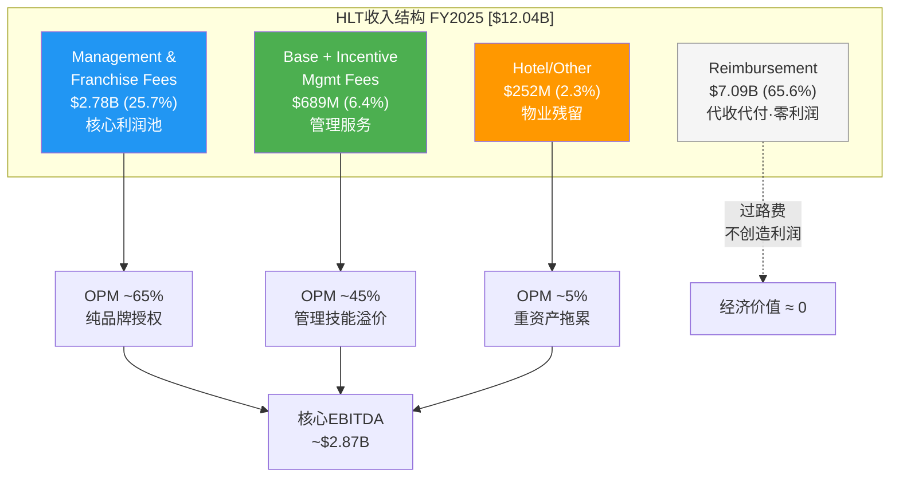

# 第二章 身份诊断 — 品牌授权商还是增长平台?

> **核心问题**: HLT到底是什么? 50x P/E定价的是"酒店品牌授权商"还是"NUG驱动的增长平台"?
> **框架映射**: SGI评分 + VRT双重身份迁移 + 身份溢价量化
> **CQ关联**: CQ-1(溢价脆弱性), CQ-2(回购悖论)

---

## 2.1 收入结构真相: $12B的幻觉与$3.5B的本质

理解HLT的第一步，是看穿其收入表的"膨胀效应"。

FY2025总收入$12.04B [DM-FIN-001]，但这个数字具有严重的误导性。拆开来看:

| 收入层 | 金额 | 占比 | 利润贡献 | 本质 |
|--------|------|------|----------|------|
| **Reimbursement Revenue** | $7.09B | 65.6% | ~0% | 代收代付过路费 |
| **Management & Franchise Fees** | $2.78B | 25.7% | ~90%利润 | 品牌授权版税 |
| **Base Management Fees** | $376M | 3.5% | 高利润率 | 管理服务费 |
| **Incentive Management Fees** | $313M | 2.9% | 浮动高利润 | 超额利润分成 |
| **Hotel/Other** | $252M | 2.3% | 低/负利润 | 自有物业残留 |
| **合计** | **~$10.81B** | **100%** | — | — |

*数据来源: [DM-BIZ-001]。注: 分部合计$10.81B vs MCP报告总收入$12.04B [DM-FIN-001]的差额来自口径差异(分部elimination等)。*

**关键洞察**: Reimbursement Revenue本质上是HLT替酒店业主代收代付的运营费用——工资、IT系统、保险等。这笔$7.09B在收入表上"过账"但不产生利润，就像银行替客户转账不计入自身收入一样。剥离后，HLT的**核心经济收入仅$3.47B**(Fee收入$2.78B + 管理费$689M + 其他$252M)。

这意味着市场用$73.1B市值(238M股 × $307.32 [DM-MKT-001])定价一个**核心收入$3.47B**的业务，隐含**核心收入倍数21.1x**——不是表面P/S看到的6.1x。



### 为什么Reimbursement不能简单剥离?

尽管Reimbursement不贡献利润，但它有两个战略功能:

1. **规模信号**: $12B的收入规模让HLT在Fortune 500和机构投资者筛选中排名更高(vs 如果只报$3.5B会从S&P 500权重池中滑落)
2. **采购谈判权**: HSM(Hilton Supply Management)管理3,500+供应商、17,000+客户 [DM-BIZ-005]，这个采购平台的议价力来自Reimbursement流过的$7B+采购规模——HLT从中获取的不是利润率，而是加盟商价值主张("挂我的牌子，你的采购成本更低")

因此，Reimbursement收入是HLT加盟商飞轮的**润滑剂**，虽然它本身不赚钱，但它让赚钱的Fee收入更有竞争力。

### Gross Margin突变的会计信号

FY2025 Gross Margin从FY2024的27.4%跃升至41.1%(+13.7pp) [DM-FIN-001]。这种非有机跳变几乎可以确定来自Reimbursement Revenue/Expense的会计分类调整。酒店行业在ASC 606框架下，代收代付的分类口径变化会直接影响Gross Margin和OPM的表观数字，但不改变底层经济实质。

**操作含义**: 本报告的利润率分析(Ch11)将剥离Reimbursement后重算"核心OPM"，避免被会计重分类误导。FY2025的核心Fee Margin(Fee EBITDA/Fee Revenue)才是真实的盈利能力指标。

---

## 2.2 三种身份假说: HLT到底是谁?

市场对HLT的身份认知存在三种竞争性假说，每种对应不同的估值逻辑:

### 假说一: 品牌授权商 (ARM模式)

**核心逻辑**: HLT像ARM一样，不拥有终端产品(酒店)，只授权品牌IP(Hilton, Hampton, Waldorf Astoria等)给加盟商使用，收取版税(Franchise Fee)。24个品牌覆盖从经济型(Spark, $60/晚)到超奢华(Waldorf Astoria, $1,000+/晚)的全光谱 [DM-BIZ-003]。

**估值锚**: ARM P/E ~80x, QualComm ~18x → 品牌授权商P/E取决于IP壁垒深度。酒店品牌IP壁垒弱于芯片架构IP(品牌可创建，架构需发明)→合理P/E 25-35x。

**支持证据**:
- 88%特许经营占比 → 几乎不拥有物业 [DM-BIZ-001]
- Fee收入利润率~65% → 接近纯IP授权公司
- CapEx/Revenue极低 → 与ARM类似的轻资产特征

**反对证据**:
- ARM IP有专利保护期和法律排他性(Arm Architecture License全球仅~15家公司获得)，品牌IP无到期日但也无法律壁垒——任何有足够资本的开发商可以创建新酒店品牌(如IHG的avid, Hilton的Spark都是近年新创)
- 酒店品牌切换成本远低于芯片架构切换成本: 翻牌(deflagging)成本$1-5M、耗时6-12个月 vs 从ARM迁移至RISC-V需重写生态、耗时数年、投入数亿美元
- HLT必须持续提供管理服务+分销系统+质量标准监控来维持品牌价值，ARM授权后几乎不需要持续服务——这意味着HLT的"版税"需要持续运营投入来维持，不是纯被动收入

### 假说二: 全服务酒店管理集团 (传统酒旅)

**核心逻辑**: HLT本质上是一家管理公司，为酒店业主提供品牌+系统+运营支持。与IHG和MAR的差异仅在规模和执行质量，而非商业模式本身。三家公司的收入结构、Fee Margin、加盟商关系管理几乎可以互换——如果把logo遮住，投资者很难从财务报表上区分三者。

**估值锚**: 传统酒店管理 P/E 20-30x。IHG 27.6x, MAR 35.0x [DM-VAL-001]。

**支持证据**:
- 三巨头商业模式几乎相同: 特许经营+管理合同+忠诚度计划，差异仅在品牌组合和地理侧重
- 行业内竞争的是执行质量和规模效率而非模式创新——没有任何一家三巨头拥有另外两家无法复制的商业模式创新
- ROIC 11.3%在三巨头中最低 [DM-VAL-007] → 如果HLT是"传统酒店管理公司"，11.3%的ROIC意味着它是三家中效率最差的
- CEO Nassetta薪酬$27.96M(2024年)远超同行 → 管理成本抬高拖累ROIC

**反对证据**:
- NUG 6.7%显著高于MAR(~5%)和IHG(~4.7%) → 即使模式相同，增长执行有实质差异
- Pipeline 520,000间(历史新高) → 增长可见度显著高于同行
- 品牌创新速度最快: 2023 Spark(经济型)、2025 Outset(转换型)、2026 Apartment Collection(公寓型) → 持续拓宽TAM边界

### 假说三: NUG驱动的增长平台 (AMZN类叙事)

**核心逻辑**: HLT不是传统酒店公司——它是一个以NUG(净单位增长)为核心KPI的**增长平台**。24个品牌不是"品牌组合"而是"增长通道"，每个品牌是一个可独立扩张的增长矢量。520K间Pipeline是"已签约但未交付的增长"，类似SaaS的Remaining Performance Obligations(RPO)。

**估值锚**: 增长平台P/E 40-60x。市场正在以此逻辑定价HLT的50.2x [DM-VAL-001]。

**支持证据**:
- NUG 6.7%是三巨头最快，2025年净增~100K间(近800家酒店) [DM-BIZ-003]
- Pipeline 3,700+酒店/520K+间 → 3-5年增长可见度(行业最高)，类似SaaS公司的RPO(Remaining Performance Obligations)
- 品牌扩张仍在加速: Spark(经济型, 2023)、Outset Collection(转换型, 2025)、Apartment Collection(公寓型, 2026，与Placemakr合作首批~3,000单元) → 持续打开新增长赛道，TAM从传统酒店向公寓和长住扩展
- 亚太在建份额25%，Pipeline 915家 → 区域增长引擎，全球酒店市场渗透率仅~6.35% [DM-BIZ-007]意味着理论增长空间巨大
- Honors 243M会员(+15% YoY) → 分销飞轮加速，75%直接渠道预订率 [DM-BIZ-006] → 降低OTA依赖→加盟商价值主张增强→NUG飞轮加速
- 1,000+奢华和生活方式酒店(2025年新增200+) → 品牌组合向高端上移→Fee per room提升

**反对证据**:
- NUG增长依赖外部资本(酒店业主投资建设)，HLT自身不投入建设CapEx → 增长可控性不如真正的平台
- RevPAR +0.4% [DM-BIZ-004] → 同店增长几乎停滞 → 增长质量存疑
- 酒店开发有3-5年建设周期 → 不如SaaS/互联网平台的即时可扩展性

---

## 2.3 SGI评分: 5.0/10 — 通才外壳下的轻资产专才

**SGI(Specialist-Generalist Index) = 5.0/10**

| 维度 | 评分 | 评估理由 |
|------|:----:|----------|
| **品类集中度** | 4/10 | 24品牌覆盖经济→超奢华全光谱，品类极度分散 [DM-BIZ-003] |
| **模式独特性** | 7/10 | 88%特许经营模式在酒店业高度专业化，但与MAR/IHG趋同 |
| **核心能力聚焦** | 6/10 | 品牌管理+分销+加盟商服务三核心，不如ARM的单一IP聚焦 |
| **竞争差异化** | 4/10 | 商业模式与MAR/IHG几乎相同，差异仅在执行速度(NUG) |
| **知识产权壁垒** | 4/10 | 品牌认知有价值但无专利保护，Honors会员可双持(同时加入Bonvoy) |

**SGI对标(消费品/酒旅行业)**:

| 公司 | SGI | 核心定位 | 与HLT的差异 |
|------|:---:|----------|-------------|
| COST | 8.5 | 纯会员飞轮 | 单一模式极致专注 |
| ARM | 8.0 | 芯片IP授权 | IP有法律排他性 |
| **HLT** | **5.0** | **酒店品牌特许** | **通才品牌组合+专才轻资产模式** |
| IHG | 5.5 | 酒店品牌特许 | 更聚焦中端(Holiday Inn) |
| MAR | 4.0 | 酒店品牌特许(最大) | 30+品牌，最通才 |
| MCD | 6.5 | 餐饮品牌特许 | 单品牌更专才，但地产模式不同 |

HLT的SGI 5.0反映了一个核心矛盾: **模式专才但品牌通才**。88%特许经营是高度专业化的商业模式(不碰重资产、不雇佣前台员工、不承担物业风险)，但24个品牌从$60/晚到$1,000+/晚的全覆盖又是典型的通才策略。

**对标IHG报告结论**: IHG在相同商业模式下SGI获得5.5(高于HLT 0.5分)，主要因为IHG品牌更少(21个 vs 24个)且Holiday Inn品类集中度更高。但这0.5分的差距并非HLT的劣势——恰恰相反，HLT的品牌宽度是其NUG优势的结构性来源(更多品牌 = 更多加盟商入口 = 更高NUG)。

**SGI与估值的悖论关系**: 通常SGI越高(越专才)→护城河越深→估值越高。但HLT的SGI 5.0低于IHG的5.5，P/E却高出82% [DM-VAL-001]。这再次指向NH-1: 酒店行业的估值因子不是护城河深度(SGI代理)，而是增长速度(NUG代理)。SGI在酒店行业可能不是有效的估值预测因子——这与半导体行业(ARM SGI 8.0 → P/E ~80x)形成鲜明对比。

---

## 2.4 身份溢价分解: 50x P/E中藏着什么?

这是本章的核心分析。我们用VRT双重身份框架的迁移方法，将HLT的P/E 50.2x分解为三个组成部分:

### 方法论: 身份溢价分层分解

```
P/E(实际) = P/E(行业基础) + 身份溢价₁(轻资产) + 身份溢价₂(增长平台)

50.2x = 基础酒店P/E + 轻资产溢价 + 增长平台溢价
```

**Step 1: 确定基础酒店P/E**

传统全服务酒店集团(拥有物业)的P/E区间约为12-18x。以Hyatt Hotels(H)为锚——H是大型酒店品牌中自有物业比例最高的公司，其商业模式介于纯特许经营(HLT/MAR/IHG)和纯物业运营之间。H的P/E约18-22x，其中包含了一部分品牌溢价。我们取保守值**18x**作为"拥有物业的酒店公司"基础估值——这代表市场对"酒店行业盈利"本身(不含轻资产溢价和增长溢价)的定价。

**Step 2: 量化轻资产溢价**

IHG是三巨头中特许经营占比最高(99%)、P/E最低(27.6x)的公司。IHG的P/E可视为"轻资产酒店品牌公司"的基准。

轻资产溢价 = IHG P/E - 基础酒店P/E = 27.6x - 18x = **~10x (约36%的IHG P/E)**

这10x溢价来自: 无物业风险 + 高Fee Margin + 可预测现金流 + 低CapEx = 更高质量的盈利。

**Step 3: 量化增长平台溢价**

HLT相对IHG的额外溢价 = HLT P/E - IHG P/E = 50.2x - 27.6x = **22.6x**

但这22.6x不全是"增长平台"溢价，其中一部分属于合理的NUG增速差异定价:

| 因素 | 估计贡献(P/E倍数) | 逻辑 |
|------|:-----------------:|------|
| NUG增速差: HLT 6.7% vs IHG 4.7% (+2pp) | ~5-7x | 2pp额外NUG × ~3x/pp倍数弹性 |
| Pipeline深度: HLT 520K vs IHG 320K(相对规模) | ~3-4x | 更高的增长可见度溢价 |
| Honors规模: 243M vs IHG 160M (+52%) | ~2-3x | 分销飞轮+联名卡金融化潜力 |
| **合理增长溢价小计** | **~10-14x** | — |
| **不可解释的"身份溢价"** | **~8.6-12.6x** | 市场将HLT视为"增长平台"的额外标签溢价 |

### 身份溢价汇总

| 分层 | P/E贡献 | 占比 | 驱动因素 |
|------|:-------:|:----:|----------|
| 基础酒店(物业型) | 18.0x | 35.9% | 酒店行业基本面 |
| 轻资产溢价 | 10.0x | 19.9% | 无物业+高利润率+可预测性 |
| 合理增长溢价 | 12.0x | 23.9% | NUG差异+Pipeline+Honors |
| **身份溢价(不可解释)** | **10.2x** | **20.3%** | **市场叙事: "HLT是增长平台"** |
| **总计** | **50.2x** | **100%** | — |

**关键发现**: HLT P/E中约**20%**(10.2x)属于纯粹的"身份溢价"——这不是基本面能解释的，而是市场对HLT "增长平台"叙事的信仰价值。换算成市值，这10.2x × EPS $6.12 × 238M股 = **约$14.9B**的"叙事溢价"。

**方法论说明**: 上述分解是一种启发式框架(heuristic)而非精确计量。"合理增长溢价"和"身份溢价"的边界不可能精确切割——NUG弹性每pp对应多少P/E取决于时间窗口和市场情绪。但这个框架的价值在于建立一个思考锚点: 至少$10-15B市值建立在"HLT是增长平台"的信念之上，而非可验证的财务数据之上。这个锚点将成为Ch16逆向DCF和Ch17 NUG弹性函数的输入假设。

**这$14.9B的脆弱性**: 身份溢价不像轻资产溢价(有结构性基础)或增长溢价(有数据支撑)，它完全依赖市场对HLT "不只是酒店公司"的信念。一旦NUG减速(CQ-1触发)或回购被迫收缩(CQ-2触发)，身份溢价是第一个蒸发的部分——因为它没有基本面锚点。

---

## 2.5 增长叙事纯度: HLT vs MAR vs IHG的真正差异

三巨头的商业模式差异极小——都是轻资产特许经营+管理合同+忠诚度计划。真正的差异不在业务结构，而在**增长叙事的纯度**:

| 维度 | HLT | MAR | IHG |
|------|-----|-----|-----|
| **NUG** | 6.7% (最快) | ~5.0% | ~4.7% |
| **Pipeline/现有规模** | 41% (520K/1,268K) | ~30% | ~31% |
| **RevPAR增长** | +0.4% | ~+1% | ~+1.5% |
| **P/E** | 50.2x | 35.0x | 27.6x |
| **市场标签** | "增长平台" | "品类之王" | "酒店公司" |
| **叙事纯度** | 高(单一增长故事) | 中(规模+增长) | 低(价值+分红) |

*P/E数据: [DM-VAL-001]*

HLT的估值领先不是因为它更赚钱(ROIC 11.3%是三巨头最低 [DM-VAL-007])，也不是因为它更大(MAR拥有1.6M间 vs HLT 1.27M间)，而是因为它拥有最纯净的增长叙事:

1. **NUG最快** → 投资者可以用一个简单公式: "6-7% NUG + 3% 回购缩股 + 2% RevPAR ≈ 11-12% EPS增长" → 简洁可预测的增长算术
2. **Pipeline最深** → 3-5年增长"已签约" → 降低预测风险
3. **Honors最大** → 243M会员是"飞轮在加速"的直觉信号(尽管活跃率数据不透明)

MAR拥有更大规模但NUG更慢——市场给了它"品类之王"但不给"增长平台"的标签(P/E仅35x)。IHG的NUG更慢且缺乏增长叙事——市场直接将其定价为"酒店公司"(P/E 27.6x)。

**这揭示了一个非共识假说(NH-1的初步验证)**: 酒店行业的P/E定价因子不是ROIC，而是NUG。HLT的ROIC最低但P/E最高，恰恰说明市场根本不在意资本效率——它在意的是**房间数增长速度**。

将三巨头的NUG vs P/E做简单线性映射:
- IHG: NUG 4.7% → P/E 27.6x
- MAR: NUG 5.0% → P/E 35.0x
- HLT: NUG 6.7% → P/E 50.2x

从IHG到MAR，NUG +0.3pp → P/E +7.4x(每pp约+25x)。从MAR到HLT，NUG +1.7pp → P/E +15.2x(每pp约+8.9x)。斜率递减可能意味着: HLT的P/E正在NUG弹性函数的**凸性区间**运行——进一步加速NUG的边际P/E贡献递减，而减速NUG的边际P/E惩罚递增。这一假说将在Ch17通过完整回归检验。

---

## 2.6 VRT双重身份框架迁移: HLT的身份张力

VRT报告中提出"双重身份估值张力模型"——一家公司85%收入来自传统工业品但被市场定价为AI基础设施公司。HLT的身份张力与此高度相似:

### HLT的双重身份

| 维度 | 身份A: 酒店品牌管理公司 | 身份B: NUG增长平台 |
|------|----------------------|-------------------|
| **收入占比** | ~100%(Fee收入全部来自酒店) | 0%(NUG本身不是收入) |
| **利润驱动** | RevPAR × 房间数 × Fee Rate | NUG → 未来房间数 → 未来Fee |
| **增长属性** | RevPAR +0.4%(接近停滞) | NUG 6.7%(加速中) |
| **合理P/E** | 25-30x | 40-55x |
| **市场选择** | — | **50.2x → 选择了身份B** |

**核心张力**: HLT的利润100%来自酒店品牌管理(身份A)，但估值100%由NUG增长(身份B)驱动。这意味着:

1. **RevPAR减速不影响叙事**: FY2025美国RevPAR -0.3%(非衰退期首次下滑)，但股价未因此大幅调整——因为市场不关注身份A的增速
2. **NUG减速摧毁叙事**: 如果NUG从6.7%降至4%(接近MAR水平)，HLT的P/E将向MAR的35x收敛——这意味着**30%的市值蒸发**(从50.2x到35x)，即约$22B市值消失。更极端地，如果NUG降至IHG水平(~4.7%)，P/E可能压缩至30-35x区间
3. **身份A的衰退只是噪音，身份B的衰退是致命的**: 这是投资HLT必须理解的第一性原理。FY2025美国RevPAR已经-0.3%(非衰退期首次为负)，但市场反应温和——因为同期NUG加速至6.7%。市场用NUG覆盖了RevPAR的疲软。但这种"身份B覆盖身份A"的模式有极限: 如果RevPAR转负的同时NUG也开始减速(例如经济衰退导致酒店业主推迟开工)，两个身份同时恶化将触发非线性估值压缩

### 身份张力的操作化含义

这种双重身份对后续章节的分析有四个直接操作指引:

1. **Ch12(回购效率)**: 回购缩股是在维护"身份B"的EPS增长叙事。FY2025回购$3.25B vs FCF $2.03B，Buyback/FCF=160% [DM-INF-002]。管理层通过举债$1.2B/年来维持"增长平台"的EPS增速假象——这是用身份A的资产负债表信用为身份B的叙事买单
2. **Ch13(RevPAR纯度分解)**: RevPAR是身份A的核心KPI。+0.4%的RevPAR增长中，多少是结构性(ADR定价权)vs周期性(通胀传导)?身份A的"真实增速"决定了当身份B叙事破裂时的"估值底部"
3. **Ch16(逆向DCF)**: 必须分别估算身份A和身份B对隐含假设的贡献——50.2x P/E中的18x(身份A基础)几乎确定可持续，但另外32x的增长+身份溢价需要什么条件才能维持?
4. **Ch17(NUG弹性函数)**: 本报告的核心原创方法论——精确量化"NUG每减速1pp, 身份溢价蒸发多少"，从而将定性的"身份脆弱性"转化为定量的"估值风险敞口"

---

## 2.7 章节结论与CQ锚定

### 身份诊断裁决

HLT的真实身份是**"品牌授权商(身份A) + 增长平台(身份B)的双重结构"**——但市场只为身份B付费。

这不是好事也不是坏事，而是一个**脆弱性特征**:
- 身份A(品牌授权)是稳定的、可持续的、有护城河的——即使增长归零，Fee收入不会消失
- 身份B(增长平台)是当前估值的全部驱动力——但增长依赖外部资本(酒店业主意愿)、宏观环境(利率/旅游需求)和地理扩张(亚太Pipeline 35%+)

这种双重结构与VRT高度类似: VRT的利润85%来自传统工业品但被定价为AI基础设施公司，HLT的利润100%来自酒店品牌管理但被定价为增长平台。两者的共同特征是: **利润来源和估值来源的完全脱钩**。

**$14.9B身份溢价的脆弱性评估**:

| 风险触发 | 概率 | 身份溢价蒸发 |
|----------|:----:|:-----------:|
| NUG降至4-5%(MAR水平) | 30% | 60-80% (~$9-12B) |
| 亚太Pipeline转化率<60% [CQ-5] | 25% | 30-50% (~$4.5-7.5B) |
| 利率上升→回购被迫缩减→EPS增速下台阶 [CQ-2] | 20% | 40-60% (~$6-9B) |
| Honors增长放缓至<5%/年 | 20% | 20-30% (~$3-4.5B) |
| 多因素叠加(衰退+利率+NUG减速) | 10% | 80-100% (~$12-15B) |

### CQ置信度更新

| CQ | Phase 0置信度 | Ch2后更新 | 变化原因 |
|----|:------------:|:---------:|----------|
| CQ-1 (溢价脆弱性) | 45% | **42%** (↓3pp) | 身份溢价分解显示20%的P/E(~$15B)无基本面支撑 |
| CQ-2 (回购悖论) | 40% | 40% (不变) | 待Ch12定量分析后更新 |
| CQ-4 (RevPAR vs NUG) | 55% | **52%** (↓3pp) | 身份张力分析确认市场完全不定价RevPAR |

> **悲观偏差自检**: Ch2分析整体偏空(身份溢价=脆弱性叙事)。提醒: RCL报告教训显示Phase 1可能存在+8-16pp系统性悲观偏差。身份溢价的存在不等于"一定会蒸发"——需要同等重视身份溢价的**自我强化机制**:
>
> **多头反论**: 如果NUG持续超预期(Pipeline 520K间转化率>85%)，Honors会员突破3亿带来更强的联名卡收入，同时品牌创新(Spark/Outset/Apartment Collection)打开经济型和公寓型新赛道，那么$14.9B的身份溢价不仅不蒸发，反而会扩大——因为市场会进一步确认"HLT确实是增长平台"。高P/E→低融资成本→更多回购→更高EPS→更高P/E的正反馈飞轮可以自我维持，直到外部冲击打破循环。这个多头视角将在Phase 2-3中定量检验。
