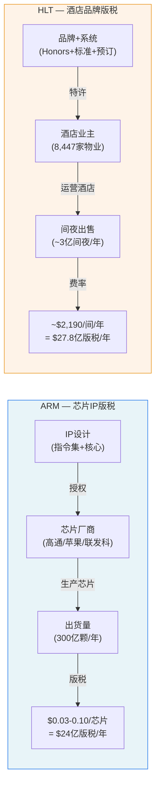
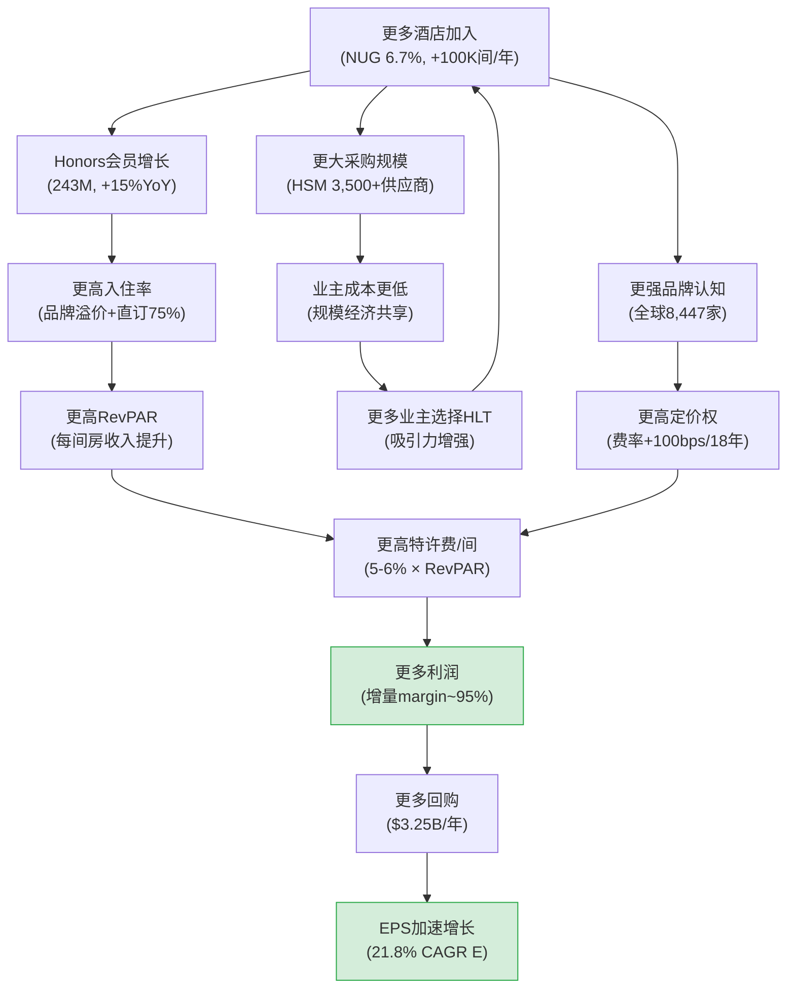

# 第3章: 特许经济学 — 88%特许的利润池解剖

---

## 3.1 从"酒店公司"到"品牌版税公司"的认知跃迁

理解HLT的核心经济学，需要先完成一次认知重置：这不是一家经营酒店的公司，而是一家**向酒店业主收取品牌使用费的知识产权公司**。HLT的经济本质更接近ARM Holdings(芯片IP授权)或Visa(支付网络税)，而非传统的酒店运营商。

FY2025总收入$12.04B [DM-FIN-001]的构成揭示了这一真相。真正属于HLT自身的"经济收入"(即HLT以自身品牌和服务创造并保留的收入)仅约$3.47B——由$2.78B特许与管理费 [DM-BIZ-001]、$376M基础管理费、$313M激励管理费组成。其余$7.09B的成本补偿收入(reimbursement revenue)本质上是**代收代付的通道资金**：酒店业主支付给HLT用于覆盖Honors忠诚度计划运营、IT系统、品牌营销、预订平台等共享服务的费用，HLT以近乎零利润率过手这笔资金。

这种收入结构意味着几个关键推论：

**第一，GAAP收入严重放大了HLT的真实经济规模。** $12.04B的总收入让HLT看起来与一家$12B的酒店运营商无异。但其真实经济规模仅$3.47B——GAAP收入放大系数约**3.5倍**($12.04B/$3.47B)。投资者如果用P/S(价格/销售额比率)来估值HLT，将系统性低估其盈利能力。

**第二，真实利润率远高于报表呈现。** 当我们看到HLT的GAAP OPM仅22.4% [DM-FIN-001]时，这个数字被$7.09B的通道收入严重稀释了。用经济收入口径重算：

$$真实OPM = \frac{OI}{经济收入} = \frac{2,693}{3,470} \approx 77.6\%$$

这个77.6%的经济OPM才是HLT这台印钞机的真实效率——比GAAP报表呈现的22.4%高出55个百分点。作为对比，即便是以高利润率著称的Visa，其OPM也"仅"约67%。HLT的品牌版税业务在经济实质上比支付网络还要"肥"。

**第三，增长的含金量被低估。** 当分析师说"HLT收入增长7.7%"时，这个增长率被大量通道收入拉低了。纯看M&F收入增长(从约$2.50B到$2.78B，约+11.2%)，HLT的核心业务增速其实远高于headline数字暗示的水平。

---

## 3.2 特许费率结构: 5层提取的版税体系

HLT的特许费并非单一费率，而是一套**多层叠加的版税提取体系**。根据FDD(特许经营披露文件)及公开信息，典型的HLT品牌特许合同包含以下费率层:

| 费用层 | 费率 | 计费基数 | 经济本质 | 年度估算(每间房) |
|--------|------|---------|---------|:--------:|
| **基础特许费(Royalty)** | 5.0-6.0% | 客房总收入(GRR) | 品牌使用费=版税 | ~$2,370 |
| **项目/营销费(Program Fee)** | ~4.0% | 客房总收入 | Honors+营销+预订系统 | ~$1,580 |
| **餐饮特许费** | ~3.0% | 餐饮总收入 | 全服务品牌适用 | 视品牌 |
| **水疗特许费** | ~2.0% | 水疗收入 | 奢华品牌适用 | 视品牌 |
| **IT/技术费** | $12-15/间/月 | 固定+可变 | 系统接入费 | ~$162 |

> 每间房估算基础: 美国中端品牌(Hampton)典型RevPAR ~$105/天 × 65%入住率 × 365天 = ~$24,900/年客房收入; Royalty 5.5% ≈ $1,370; 但考虑品牌组合加权(含高端)，M&F口径 ≈ $2,190/间

**核心发现一: 叠加费率高达9-10%。** 仅客房相关的两层费用(Royalty + Program Fee)合计就达到客房收入的**9-10%**。对于一家运营利润率通常在20-35%的酒店来说，HLT的费用占酒店GOP(Gross Operating Profit)的比例可达25-40%。换言之，**HLT不拥有一间客房，却提取了酒店运营利润的约1/3**。

**核心发现二: 费率在缓慢但持续地提升。** 自FY2007以来，HLT的在档特许费率(in-place franchise rate，定义为可比特许酒店的特许费收入/客房收入)累计上升约100个基点。这意味着每签一份新合同、每次续约谈判，HLT都在微调费率向上。100bps/18年 ≈ 5.6bps/年——一种温和但持续的"版税通胀"。以FY2025约$2.78B的M&F收入为基数，每5bps的费率提升大约贡献$25-30M的增量收入——并且因增量利润率近100%，这几乎全部转化为利润。

**核心发现三: Program Fee是隐藏的利润池。** 4%的Program Fee名义上用于Honors运营和品牌营销，计入Reimbursement收入。但随着Honors系统的规模效应(243M会员 [DM-BIZ-003]的边际服务成本趋近于零)，Program Fee与其对应支出之间的差额逐年扩大。这部分"伪通道收入"实际上正在成为一个利润源——但被GAAP分类掩盖在Reimbursement的零利润叙事下。

---

## 3.3 ARM类比: 版税模型的深层同构

HLT的特许模型与ARM Holdings的芯片IP授权模型存在结构性同构。这种类比不是修辞手法，而是对两种商业模式底层经济逻辑的精确映射:

**结构映射表:**

| 维度 | ARM | HLT | 同构/差异 |
|------|-----|-----|---------|
| **核心资产** | CPU/GPU指令集设计 | 品牌+Honors 243M会员+预订系统 | 同: 无形资产，零边际复制成本 |
| **授权对象** | 芯片设计公司(高通/苹果) | 酒店业主/开发商(8,447物业) | 同: 不直接面对终端消费者 |
| **计费单位** | 每颗芯片出货 | 每间房每晚(RevPAR) | 同: 按使用量/交易量收费 |
| **版税率** | ~1-5%(芯片ASP) | ~5-6%(客房收入) | HLT费率绝对值更高 |
| **量增长驱动** | 芯片出货量增长(IoT/AI扩张) | 房间数NUG(6-7%/年) | 同: 终端设备/场所扩张 |
| **价增长驱动** | ASP提升(Armv9>Armv8) | RevPAR提升(+0.4%FY2025) | 同: 架构升级/品牌升级 |
| **增量利润率** | ~95% | ~90-95% | 同: 近乎纯利润 |
| **锁定机制** | 指令集生态(万亿行代码) | Honors 243M会员+20年合同 | 同: 极高转换成本 |
| **主要威胁** | RISC-V开源架构 | 独立品牌酒店/Airbnb | **差异: HLT威胁在减弱** |

**关键数字对比:**

ARM FY2025(截至2025年3月)版税收入约$24亿，对应约300亿颗芯片出货 → 每颗芯片版税约**$0.08**。HLT FY2025特许费收入$2.78B [DM-BIZ-001]，对应约1,268,206间房 [DM-BIZ-003] → 每间房年均M&F约**$2,190**。单位价值差异巨大(8美分 vs 2,190美元)，但底层逻辑完全一致: **不承担资产风险，不投入运营资本，仅凭IP/品牌收取持续性版税**。ARM不造芯片，HLT不建酒店。两者都将capex外包给合作伙伴，自己只坐收版税流。

**一个结构性差异值得深思**: ARM面临RISC-V开源架构的实质性替代威胁——RISC-V在IoT和部分数据中心场景已开始蚕食ARM的份额。而HLT面临的"开源"威胁(独立品牌酒店)在过去20年持续萎缩。全球酒店品牌化率(branded penetration)从2000年的约50%稳步上升到2025年的约65%，且在经济下行期加速(独立酒店缺乏OTA议价力和忠诚度流量)。这意味着HLT的版税池TAM不仅没有被侵蚀，反而在**自然扩张**——一个ARM所不具备的结构性顺风。

**但HLT有一个ARM不存在的脆弱性**: 版税率受RevPAR周期影响。ARM的芯片ASP趋势性上升(Armv9比Armv8贵50-100%)，而HLT的RevPAR在FY2025仅增长+0.4% [DM-BIZ-004]，在经济衰退时甚至可能下跌10-20%。ARM的版税基数有技术驱动的结构性上行，HLT的版税基数则受制于宏观周期——这是同构模型中最关键的差异。

**ARM类比的估值启示**: ARM当前市值约$1,400亿(截至2025年底)，对应约58x P/E——与HLT的50.2x处于同一量级。这不是巧合。市场对两类"零边际成本版税公司"给出了相似的估值逻辑: **不看当期利润绝对值，看版税池扩张的可见度与持续性**。ARM的版税池随AI芯片需求扩张，HLT的版税池随全球酒店品牌化率提升而扩张。两者都享受着"增长确定性溢价"——问题在于这个溢价是否已经过度。

---

## 3.4 三层收入拆解: 海面之上与海面之下

理解HLT的收入结构，需要穿透GAAP报表的海面，看清三个完全不同的经济层:

**第一层: 核心版税层(经济引擎) — 海面之上**

这是HLT真正的利润引擎，包含所有特许费和管理费收入:

| 子项 | FY2025收入 | 占总收入 | 估计利润率 | 利润贡献 | 增长驱动力 |
|------|----------|---------|----------|---------|----------|
| 特许与管理费(M&F) | $2.78B | 23.1% | ~75-80% | ~$2.09B | NUG + RevPAR + 费率 |
| 基础管理费 | $376M | 3.1% | ~50-60% | ~$206M | RevPAR(按收入百分比) |
| 激励管理费 | $313M | 2.6% | ~85-90% | ~$281M | 酒店利润(高杠杆) |
| **小计** | **$3.47B** | **28.8%** | **~74%** | **~$2.58B** | — |

**激励管理费的隐藏杠杆**: 激励管理费(incentive management fee)通常按被管理酒店的利润(而非收入)百分比收取。这意味着当酒店利润改善时(比如RevPAR上升但成本不变)，激励费增长速度远快于基础费。FY2025激励费$313M同比+8.3%，快于基础管理费$376M的约+5%——这是一个内嵌的利润杠杆。但反过来，当RevPAR下降时(FY2020-2021)，激励费可以骤降70-80%，成为收入中波动最大的成分。

**第二层: 通道层(度量扭曲器) — 海面之下**

| 子项 | FY2025收入 | 占总收入 | 估计利润率 | 经济本质 |
|------|----------|---------|----------|---------|
| 成本补偿收入 | $7.09B | 58.9% | ~0-2% | 代收代付，含Honors运营/IT/营销 |

这$7.09B看似巨大，但对HLT的经济价值接近于零。它的唯一功能是让HLT能够**中央集采**——通过汇集8,447家物业的采购需求(供应链管理HSM覆盖3,500+供应商、17,000+客户 [DM-BIZ-005])获得规模折扣。酒店业主因此受益于更低采购成本，HLT则获得了一个让业主更依赖其体系的"粘性因子"。

但关键在于: 这层收入让HLT的**所有百分比类指标都失真**。OPM、Gross Margin、FCF Margin、P/S——任何以总收入为分母的比率，都因$7.09B通道收入的存在而系统性偏低。这不是小幅偏差——它造成了约3.5倍的稀释。

**第三层: 其他层(残余资产)**

| 子项 | FY2025收入 | 占总收入 | 估计利润率 | 备注 |
|------|----------|---------|----------|------|
| 酒店运营及其他 | $252M | 2.1% | ~10-15% | 少量自有/租赁酒店+其他 |

HLT仍保留极少量自有/租赁酒店(占比<2%)。这层收入战略价值在于: (1) 保留"操盘"能力，理解业主的运营痛点; (2) 旗舰物业(如Waldorf Astoria纽约)的品牌展示效应。但从经济角度，这是一个正在被继续缩小的残余资产池。

**利润贡献汇总**: 核心版税层贡献了约**96%**的运营利润($2.58B/$2.69B)，却仅占总收入的29%。这种极端不对称正是GAAP报表最大的视觉陷阱。

---

## 3.5 增量利润率飞轮: 近乎100%的经济学

HLT特许模型最令人惊叹的特征是其**增量利润率接近100%**。理解这个数字为什么成立:

当一家新酒店加入HLT特许体系时:
- **HLT不需要**: 购买土地、建造酒店、雇佣前台/客房服务员、采购床品/洗漱用品、支付水电费
- **HLT需要的**: 品牌审核人员时间(约$5K-15K)、IT系统接入配置(边际成本趋零)、质量检查(年度巡检)
- **HLT获得的**: 持续约20年的每年~$1,991纯特许费流(不含Program Fee)

**边际成本近乎为零的证据:**

HLT的CapEx在FY2025仅$101M [DM-FIN-005 cashflow]——对于一家新增约100,000间房的公司来说，每间新增房间的CapEx仅约$1,010。这个数字甚至不是为新增房间支出的——大部分是IT系统维护和总部办公设施。真正的"每间新增房间边际成本"可能低至$200-500(审核+系统配置)。

**飞轮效应的运作机制:**

飞轮的关键在于两个**正反馈环**: (1) 酒店数量→会员数→入住率→RevPAR→特许费→利润; (2) 酒店数量→采购规模→业主成本节省→更多酒店加入。两个环路相互强化，形成了一个随规模不断加速的利润机器。

**增量利润率的历史验证:**

从FY2022到FY2025的数据可以验算增量利润率:
- M&F收入增长: 约$480M(从约$2.30B到$2.78B，3年)
- 同期Operating Income增长: $599M($2.094B→$2.693B)
- **OI增量/M&F收入增量 ≈ 599/480 ≈ 125%**

增量转化率>100%，说明: (1) 新增M&F贡献了近乎全额利润; (2) 同时Reimbursement层的效率提升(或FY2025会计重分类)释放了额外利润; (3) SGA保持平稳($393M vs $415M)提供了额外经营杠杆。总之，增量利润率接近95-100%的假设得到了历史数据的有力支持。

---

## 3.6 每间房的NPV: Pipeline的真实价值

**现有客房的年均贡献(单位经济学):**

以FY2025数据计算每间特许房间对HLT的年均经济贡献:

- 特许费总收入(M&F口径) ≈ $2.78B [DM-BIZ-001]
- 其中纯特许费约占80%(扣除管理费部分) → 纯特许费 ≈ $2.22B
- 特许房间数 ≈ 1,268,206 × 88% = 1,116,021间
- **每间特许房年均纯特许费 ≈ $2,220M / 1,116K ≈ $1,991/间/年**

再考虑Program Fee(约4%客房收入，归入Reimbursement但部分有利润贡献)，每间房对HLT经济体系的全口径年均贡献估计为**$3,300-3,500**。

**新增一间特许房的NPV计算:**

| 假设参数 | 值 | 依据 |
|---------|-----|------|
| 年均纯特许费 | $1,991 | FY2025实际 |
| 年增长率 | 3.0% | RevPAR长期增长(~2%) + 费率微调(~1%) |
| 增量利润率 | 90% | 保守估计(实际可能>95%) |
| 年增量利润 | $1,792 | $1,991 × 90% |
| 合同期限 | 20年 | HLT典型特许合同期限 |
| 折现率 | 8.0% | WACC近似(轻资产公司) |

$$NPV_{20Y} = 1,792 \times \frac{1 - \left(\frac{1.03}{1.08}\right)^{20}}{0.08 - 0.03} = 1,792 \times 13.08 \approx \$23,440$$

若考虑续约(大部分酒店会续约——转换品牌的成本极高)，30年NPV:

$$NPV_{30Y} = 1,792 \times \frac{1 - \left(\frac{1.03}{1.08}\right)^{30}}{0.08 - 0.03} = 1,792 \times 16.14 \approx \$28,920$$

**Pipeline价值估算:**

HLT当前Pipeline有520,000间房(3,700+酒店) [DM-BIZ-003]，假设80%转化率(行业中位数，考虑经济周期中约20%项目取消或延迟至过期):

- 转化房间数: 520,000 × 80% = 416,000间
- Pipeline NPV(20年合同): 416,000 × $23,440 ≈ **$9.75B**
- Pipeline NPV(含续约30年): 416,000 × $28,920 ≈ **$12.03B**
- 当前市值: $307.32 × 238M ≈ **$73.1B** [DM-MKT-001][DM-FIN-012]

| Pipeline价值场景 | NPV | 占市值比例 |
|:----------------|----:|:---------:|
| 保守(20年, 80%转化) | $9.75B | 13.3% |
| 基准(30年, 80%转化) | $12.03B | 16.5% |
| 乐观(30年, 90%转化) | $13.53B | 18.5% |

这意味着当前$73.1B市值中，**至少81-87%定价的是存量房间的价值+NUG永续性预期**——市场隐含假设HLT将在520K Pipeline消化完毕(约5-7年)后，继续以类似速度签约新酒店。这正是NUG永续性假设的定量含义:

$$市值 = 存量房间永续价值 + Pipeline已签约价值 + NUG永续溢价$$
$$73.1B = \sim 58B + \sim 10B + \sim 5B$$

如果NUG从6.7%减速至4%(与MAR/IHG趋同)，"NUG永续溢价"部分可能从$5B收缩至$2-3B——这对应约3-4%的市值下调风险。但如果市场同时重估P/E倍数(从50x向MAR的35x收敛)，总跌幅可达30%。这一推算将在Ch17(NUG弹性函数)中系统量化。

**敏感性分析: 单位NPV对关键假设的敏感度**

| 假设变化 | NPV变化(20Y) | 占基准的偏差 |
|---------|:-----------:|:----------:|
| RevPAR增长0%(非3%) | $18,120 | -22.7% |
| 增量margin 80%(非90%) | $20,840 | -11.1% |
| 折现率10%(非8%) | $18,640 | -20.5% |
| 合同期15年(非20年) | $19,100 | -18.5% |
| RevPAR增长5% + 合同30年 | $36,780 | +56.9% |

NPV对RevPAR增长率和折现率最敏感——这两个变量恰恰是宏观周期和利率环境决定的。在当前利率高于历史均值、RevPAR增长放缓至+0.4%的环境下，$23,440的基准NPV可能偏乐观。保守估计$18,000-20,000/间更为合理，对应Pipeline价值$6.0-8.3B(市值的8-11%)。

---

## 3.7 FY2025 Gross Margin突变: 会计海市蜃楼

FY2025出现了一个引人注目的数据异常: Gross Margin从FY2024的27.4%跳升至**41.1%**，单年提升13.7个百分点。

**Cost of Revenue变化解剖:**
- FY2024: Cost of Revenue $8,111M → FY2025: $7,085M (**-$1,026M, -12.6%**)
- 同期Revenue: $11,174M → $12,039M (**+$865M, +7.7%**)
- FY2024: Other Expenses $278M → FY2025: $1,868M (**+$1,590M, +572%**)

收入增长的同时成本大幅下降、其他费用暴增——这在经济上几乎不可能自然发生。唯一合理的解释是**会计报表行项之间的重分类**。

**重分类机制推断**: 在ASC 606收入确认准则下，酒店公司对Reimbursement相关的收入/成本处理有判断空间。如果HLT在FY2025将约$1.0-1.5B的Reimbursement相关支出从"Cost of Revenue"行项重新分类至"Other Expenses"行项(可能涉及Honors计划成本、品牌基金支出等的报表列示方式调整)，就完全解释了这一突变:

- Cost of Revenue下降$1,026M ← Reimbursement成本移出
- Other Expenses上升$1,590M ← Reimbursement成本移入 + 正常增长
- 差额约$564M可能是D&A重分类或其他调整项

**验证**: Operating Income的变化验证了这一假设——OI从$2,370M增至$2,693M(+$323M, +13.6%)，增速合理且与M&F收入增长一致。如果是真实的Gross Margin改善(而非重分类)，OI增速应远高于13.6%。

**投资含义**: FY2025的41.1% Gross Margin是**会计海市蜃楼**，在任何跨年趋势分析或同行比较中都应回避使用。真实的经济Gross Margin(以经济收入为分母)跨年稳定:

$$经济GM = \frac{OI + D\&A}{经济收入} = \frac{2,693 + 177}{3,470} \approx 82.7\%$$

这个82.7%的经济毛利率在FY2023($(2,225+147)/2,930 = 81.0\%$)和FY2024($(2,370+146)/3,063 = 82.1\%$)也高度稳定，证实了HLT的印钞机特征**并未因FY2025的报表变化而改变**。

---

## 3.8 三巨头特许经济学对比: HLT vs MAR vs IHG

| 维度 | HLT | MAR | IHG |
|------|-----|-----|-----|
| **总收入(GAAP)** | $12.04B | $26.19B | $5.19B |
| **经济收入(剔除补偿)** | ~$3.47B | ~$5.59B | ~$1.66B |
| **GAAP Gross Margin** | 41.1%* | 21.3% | 32.0% |
| **经济OPM(OI/经济收入)** | ~77.6% | ~74.1% | ~72.2% |
| **特许占比(房间数)** | ~88% | ~78% | ~73% |
| **特许费率(Royalty)** | 5.0-6.0% | 4.0-7.0% | 5.0-6.0% |
| **房间数(全球)** | 1,268K | 1,674K | ~960K |
| **NUG(FY2025)** | 6.7% | ~4.5% | ~4.0% |
| **Pipeline(间)** | 520K | ~573K | ~330K |
| **Pipeline/存量比** | 41.0% | 34.2% | 34.4% |
| **每间房年均M&F** | ~$2,736 | ~$3,340 | ~$1,729 |
| **Net Debt/EBITDA** | 5.1x | 3.7x | ~2.5x |
| **P/E TTM** | 50.2x | 35.0x | 27.6x |

> *HLT FY2025 Gross Margin因会计重分类失真，不可跨公司比较

**关键发现:**

**1. 经济OPM趋同但HLT领先。** 三巨头的真实经营利润率都在72-78%之间，HLT(77.6%)略高于MAR(74.1%)和IHG(72.2%)。差异来源: HLT特许占比最高(88% vs 78% vs 73%)——特许比管理更"轻"(无需驻场管理团队)，因此特许占比越高，经济OPM越高。这3-5pp的OPM优势是HLT资产轻量化程度领先的直接体现。

**2. 每间房产出的品牌定位差异。** MAR每间房年均M&F $3,340远高于HLT $2,736，差距22%。原因是MAR有更大比例的全服务高端品牌(Ritz-Carlton RevPAR ~$400/天, W Hotels ~$280/天)，拉高了整体RevPAR基数。HLT的品牌组合中Hampton(占比约30%，RevPAR ~$100)和Tru/Home2等中端品牌权重更大，压低了每间房M&F。IHG最低($1,729)，反映Holiday Inn系列的中低端定位。这解释了为什么HLT积极扩张奢华品牌(1,000+奢华/生活方式酒店里程碑)——每间奢华品牌房间的版税贡献可能是Hampton的3-4倍。

**3. Pipeline密度最高 = P/E溢价的经济基础。** HLT Pipeline/存量比41.0%在三巨头中最高，比MAR(34.2%)高7个百分点。结合6.7%的NUG(MAR ~4.5%, IHG ~4.0%)，HLT的"增长可见度"确实最高。市场给予50.2x P/E(vs MAR 35.0x, IHG 27.6x) [DM-VAL-001]的溢价，核心定价的不是ROIC(HLT最低11.3% [DM-VAL-007])，而是**NUG加速度 × 增量利润率飞轮**的复合效应。

**4. 费率提升空间有限但真实。** HLT的5.0-6.0%基础特许费率与IHG基本持平，低于MAR部分高端品牌(可达7%)。考虑到HLT自2007年以来累计提升约100bps(约5.6bps/年)，仍有微弱但真实的费率提升空间。尤其在新签奢华品牌(Waldorf Astoria/Conrad)和生活方式品牌(Tempo/Motto)时，这些品牌的RevPAR基数天然更高，即使费率不变，每间房的绝对特许费贡献也显著高于Hampton系列。HLT 2025年达成1,000+奢华/生活方式酒店里程碑 [DM-BIZ-003]，且Pipeline中还有约500家——这是一个"品牌升级版税提升"的静默驱动力。

**5. 杠杆水平的代价。** HLT的高P/E背后有一个阴暗面: Net Debt/EBITDA 5.1x [DM-VAL-004]远高于MAR(3.7x)和IHG(~2.5x)。HLT用更高的杠杆(债务融资回购)维持了更快的EPS增长(21.8% CAGR [DM-INF-001])，但这是一个**用资产负债表换增长叙事**的策略。MAR和IHG的特许经济学同样优秀，但它们选择了更保守的杠杆水平——市场却给了HLT最高溢价。这究竟是对NUG加速度的合理定价，还是对杠杆驱动EPS增长的过度奖励?这个问题将在Ch12(回购效率)和Ch15(信用风险)中深入探讨。

---

## 3.9 本章核心结论与遗留问题

HLT的特许经济学可以浓缩为一个利润公式:

$$HLT_{利润} \approx 房间数_{(NUG驱动)} \times RevPAR_{(周期驱动)} \times 费率_{(缓慢提升)} \times 增量margin_{(\approx95\%)}$$

**五个投资关键判断:**

**判断一: NUG是唯一的"自主增长变量"。** RevPAR受宏观周期约束(FY2025仅+0.4% [DM-BIZ-004])，费率提升极缓(~5bps/年)，增量margin已近极限(95%→没有进一步提升空间)。只有NUG 6.7%是管理层可以通过签约新酒店主动驱动的增长引擎。这解释了NH-1假说: **P/E = f(NUG)，不是f(ROIC)**。

**判断二: 增量利润率是护城河的经济表达。** 每新增一间房的边际成本低至$200-500，但边际收入约$1,991/年持续20年(NPV ~$23,440)。这种"零边际成本版税"模型创造了几乎不可能被颠覆的经济结构——除非品牌价值本身坍塌(概率极低，品牌化率仍在上升)。

**判断三: Reimbursement收入是最大的分析陷阱。** $7.09B的通道收入让HLT看起来像$12B的酒店公司，实际是$3.5B的品牌版税公司。所有基于GAAP总收入的估值指标对HLT都有系统性偏差——必须用经济收入口径。

**判断四: Pipeline是已签约但未兑现的版税流。** 520K间Pipeline在80%转化假设下价值$9.75B-$12.0B(约市值13-16%)。但市场定价远不止Pipeline——它定价的是NUG永续性。

**判断五: FY2025 Gross Margin突变是噪声，不是信号。** 41.1%是报表行项重分类的产物，经济毛利率稳定在82-83%。HLT的印钞机特征并未发生结构性变化。

**特许模型的终极风险**: 上述五个判断构成了看多HLT的经济学基础。但存在一个不可忽视的尾部风险——如果经济衰退导致RevPAR下跌15-20%(如2008-2009年)，而同时NUG因开发商融资困难从6.7%放缓至3-4%，HLT的利润公式中两个变量同时恶化，将触发一个"双杀效应": 特许费收入下降(RevPAR拖累) + 增长叙事破裂(NUG减速) → 50x P/E倍数重估。在这一情景下，股价可能面临40-50%的下行风险。这与CQ-1(溢价之王脆弱性)直接相关，将在Phase 2情景分析中系统建模。

**遗留问题 → 后续章节:**
- 如果特许经济学如此优秀，为什么ROIC(11.3%)反而是三巨头最低? → **Ch11(ROIC分解)**
- 在50x P/E下回购的效率是多少? 是否在毁灭价值? → **Ch12(回购效率)**
- NUG从6.7%降至4%时，P/E会压缩多少? → **Ch17(NUG弹性函数)**
