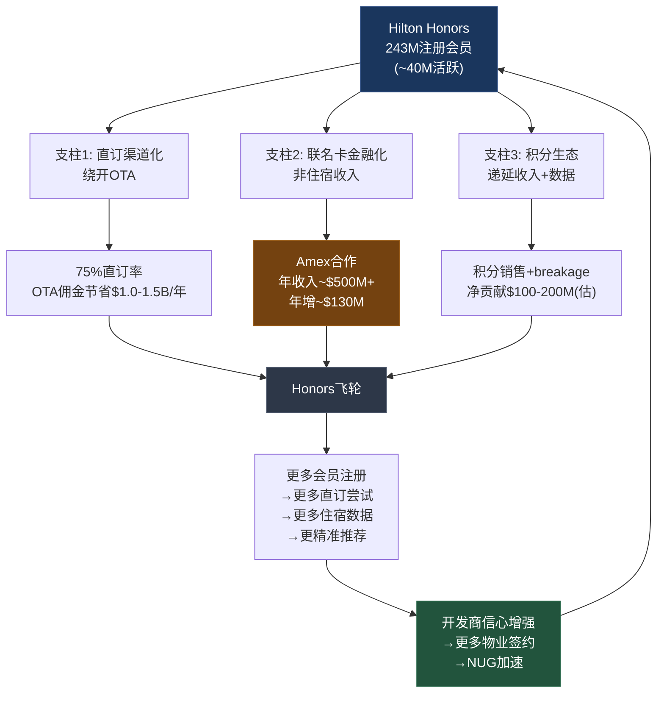

# 第四章：Honors忠诚度经济学 — 243M会员的护城河诊断

> CQ-3: Honors 243M会员 = 护城河还是天花板? 会员增长能否转化为定价权?
> NH-2验证: Honors是否正从忠诚度工具向金融平台转型?

---

## 4.1 243M的表象与真相: 虚荣指标还是经济资产?

Hilton Honors截至FY2025末拥有243M注册会员，同比增长15% [DM-BIZ-003]。这个数字即将超越Marriott Bonvoy的228M，使HLT成为全球最大酒店忠诚度计划。管理层在Q4 2025电话会上反复强调这一里程碑，将其作为护城河加宽的核心叙事之一。

但243M这个数字需要严肃拆解。投资者应该问的第一个问题是：**"243M"衡量的到底是什么?**

**注册免费忠诚度计划与付费会员制的根本区别**:

Costco的会员制要求年费$65(Gold Star)或$130(Executive)，续费率93%以上。每一个COST会员都经过了价格筛选——掏出真金白银意味着有持续消费意愿。COST的"会员数"与"活跃会员数"几乎等同：你不续费，你就不再是会员。COST的会员费本身构成了约$4.8B/年的纯利润池(毛利率近100%)，这是一种直接的经济锁定。

Honors的逻辑截然不同:
- **注册零成本、零摩擦**: 任何人在Hilton官网点击"加入"即可获得Member资格，无需提供信用卡信息，无需入住记录。这意味着一个从未住过Hilton的人也是"会员"
- **无退出机制、无过期清退**: 不活跃会员永远不会被系统注销。10年前注册、从未入住过一晚的"会员"，与每年入住100晚的Diamond会员，在243M这个总数中享有同等权重
- **活跃率黑箱**: Hilton从未在公开财报或investor day中披露活跃会员(年入住≥1次)占总注册数的比例。这个刻意的信息不对称值得注意——如果活跃率很高，为什么不公布?

根据IHG报告中的行业交叉分析，三大酒店忠诚度计划的活跃会员率(年入住≥2次)估计约为15-20% [DM-P1C-018参考]。如果HLT符合行业均值，**243M注册会员中真正活跃的大约36-49M**。这仍然是一个庞大且有商业价值的数字，但与"2.43亿忠实客户"的叙事有质的差异。

**会员质量金字塔估算**:

| 层级 | 门槛 | 估计占比 | 估计人数 | 经济贡献特征 |
|------|------|:--------:|:--------:|------------|
| Diamond Reserve (新增) | 邀请制/超高频 | ~0.2-0.5% | 0.5-1.2M | 超高ADR + 品牌大使 + 口碑放大器 |
| Diamond (精英) | 60晚或100K积分/年 | ~1-2% | 2.4-4.9M | 高RevPAR + 高频次 + 低价格敏感 |
| Gold (常旅客) | 40晚或75K积分/年 | ~3-5% | 7.3-12.2M | 稳定复购 + 直订偏好 + 企业账户 |
| Silver (偶发商旅) | 10晚或25K积分/年 | ~8-12% | 19.4-29.2M | 中频次 + OTA/直订混合 |
| Member (注册未活跃) | 免费注册 | ~80-88% | 194-214M | 极低或零经济贡献 |

这个金字塔揭示了一个关键事实：**驱动Honors经济价值的核心会员群体可能不足50M，仅占注册总数的约20%**。15%的年化会员增速(+32M)很可能主要来自底层Member的膨胀——通过App推广、社交媒体营销、合作伙伴导流(如Amex联名卡持卡人自动注册)批量获取的低价值注册用户。顶层Diamond/Gold的年增量则可能与NUG(新物业带来新商旅客户)更密切相关，增速更温和。

**一个思维实验**: 如果明天Hilton将Honors改为年费制(即使仅$10/年)，243M会收缩到多少? 如果答案是"不到60M"(合理推测)，那么剩下的180M+就是纯粹的虚荣指标。这不是说这些人没有价值——他们至少提供了邮箱地址和消费偏好数据，作为再营销的潜在对象——但他们的"忠诚度"几乎为零。

**15%增长率的解构**: FY2024至FY2025新增约32M会员。这些新会员从何而来? 三个主要渠道:
- **Amex联名卡开卡自动注册**: 每张新开的Hilton联名卡持卡人自动成为Honors Member。以美国信用卡市场的营销攻势，这可能贡献了5-10M新注册
- **App下载引导注册**: Hilton的数字营销持续推动App安装，注册流程被设计为"一键加入"。移动App贡献了网页流量的40-50% [DM-BIZ-006]，大量App用户被引导注册
- **NUG新物业获客**: 每家新开业酒店(FY2025新增~800家 [DM-BIZ-003])的前台主动引导入住客注册，按平均每家酒店100-150个房间×50%入住率×365天×20%新客注册率粗算，年增量约5-8M
- **合作伙伴导流**: 航空公司、租车公司、餐饮合作伙伴的交叉推广注册

核心问题不是增长率(15%确实亮眼)，而是**增长的质量**——如果新增32M中25M+是底层Member(从未入住或入住1次后不再活跃)，那么这些会员对LTV(终身价值)的贡献接近零，只会稀释每会员平均价值。

**管理层激励的扭曲**: CEO Nassetta和管理团队的薪酬结构中，会员增长被作为KPI之一(虽然权重未公开)。这创造了一个激励——追求"容易衡量的指标"(注册总数)而非"难以衡量但更有经济意义的指标"(活跃率、精英会员留存率、每会员贡献收入)。当管理层在财报电话会上强调"243M会员，全球最大"时，投资者应该追问: "活跃会员有多少? 每活跃会员的年均收入贡献是多少?" 这些问题至今没有分析师公开提出——这本身就是认知差的来源。

---

## 4.2 忠诚度经济学: 三支柱价值拆解

Honors的经济价值不在于"会员数"本身，而在于它驱动的三个可量化的收入机制。理解这三个支柱的相对规模和增长前景，是回答CQ-3(护城河vs天花板)的关键。

### 支柱1: 直订率75% — 渠道优化而非定价权

Hilton的直订率约75%，行业领先水平 [DM-BIZ-006]。其中:
- 官网/App渠道约占总预订的37.5%(75%直订中的~50%)
- Honors会员直接预订(含企业协议、忠诚度直订)约占37.5%
- 网页直订渠道的增速是其他所有渠道的3倍

移动端表现尤为突出——Hilton Honors App贡献了网页渠道流量的40-50%。Digital Key技术已覆盖80%+的物业组合(~5,400+家) [DM-BIZ-006]，形成了从预订到入住的全数字化闭环。

**渠道经济学计算**:

| 渠道 | 获客成本率 | 估计占比 | 渠道佣金($) |
|------|:---------:|:--------:|:----------:|
| OTA (Booking/Expedia) | 15-25% | ~15-20% | $150-$250/间夜 |
| 旅行社/GDS | 10-15% | ~5-10% | $100-$150/间夜 |
| 直订(官网/App) | 5-8% | ~50-55% | $50-$80/间夜 |
| 忠诚度直订(企业/直达) | 3-5% | ~20-25% | $30-$50/间夜 |

注: 以系统平均ADR ~$170估算

**每间直订房间vs OTA房间的佣金节省: 7-20个百分点**。以FY2025系统级客房收入约$55-60B(HLT管理/特许物业的系统级收入估算)为基础，75%直订对应**年化OTA佣金节省约$1.0-1.5B**。这是真金白银的经济价值，且随物业组合扩张(NUG)线性增长。

但这里必须做一个至关重要的区分——**渠道优化(distribution efficiency) ≠ 定价权(pricing power)**:

**渠道优化**: 降低获客成本，使同等RevPAR下利润率更高。这是成本端优化。
**定价权**: 在需求不变时提高ADR(平均日房价)而不损失入住率。这是收入端溢价。

Honors会员享受"会员专属价格"——通常比OTA标价低3-5%。这意味着忠诚度计划本质上是在**用价格折扣换取直订**，降低了客人的渠道成本，但并未赋予HLT对客人的提价能力。

真正的定价权对标: 爱马仕可以每年提价7-10%而不损失需求，因为品牌稀缺性创造了超额支付意愿。Hilton的品牌力在酒店行业领先(品牌价值~$12B，全球第一 [DM-BIZ-010])，但酒店住宿是高度可替代的——客人可以在HLT、MAR、IHG之间无摩擦切换，积分的锁定效应远弱于航空里程(因为酒店选择更多、转换成本更低)。

### 支柱2: 联名信用卡金融化 — 真正的隐形利润引擎

Honors的最高价值资产不是积分系统本身，而是与American Express的联名信用卡合作关系。这是忠诚度经济学中最接近"免费午餐"的东西。

**运作机制详解**:

Amex发行多款Hilton Honors联名卡(从免年费基础卡到$550/年的Aspire卡)。持卡人在任何商户(不限于Hilton)的日常消费中积累Honors积分。Amex从商户手续费和信用卡年费中获利，同时向Hilton支付三类费用:

1. **积分购买费**: Amex按约定单价(估计$0.004-0.006/点)向HLT批量购买Honors积分，用于奖励持卡人消费
2. **品牌授权费**: 使用"Hilton Honors"品牌名称和Logo的年度固定费用
3. **营销费用分摊**: 联名卡联合推广(如开卡奖励、消费促销)中Amex承担的HLT获客成本

**规模与增速**:

| 维度 | 数据 | 来源 |
|------|------|------|
| 年度信用卡收入 | ~$500M+(估计) | IHG报告交叉引用 [DM-P1C-025参考] |
| 年化增量 | ~$130M | 文献侦察 [lit_recon] |
| 隐含增速 | ~26%/年 | 推算: $130M / ~$500M |
| 占Management & Franchise Fee | ~18% | $500M / $2.78B [DM-BIZ-001] |
| 3年前占比(估计) | ~12% | 基于增速回推 |

**为什么这是"最优质收入"**:
- **不依赖RevPAR**: 人们即使不住酒店也在日常消费中刷卡 → 信用卡收入与住宿周期脱钩
- **不占用资本**: 无需HLT投入任何固定资产，积分的"生产成本"接近零(除非被兑换)
- **自然增长**: 随通胀和消费总额增长，持卡人消费额自然上升 → 积分购买量自然增长
- **高转换成本**: 持卡人积累的积分余额创造了"沉没成本"心理锁定，换卡意味着放弃未兑换积分

**对比IHG**: IHG与Chase的联名卡合作规模更小(IHG信用卡费自2023翻倍，目标2028年3倍于2023水平，约$120M+ [DM-P1C-024参考])。HLT的Amex合作成熟度和规模远超IHG——这是HLT相对于IHG的一个被低估的结构性优势，但也构成了集中度风险(下文详述)。

### 支柱3: 积分经济学 — 隐藏的双刃剑

积分系统是忠诚度经济学中最不透明的部分。HLT不在财报中单独披露积分收入和积分成本的明细(它们被嵌入在Management & Franchise Fees和System Fund中)，但可以从行业逻辑和会计原则推断其经济学:

**积分收入来源**:
- 联名信用卡积分购买(最大来源，已计入支柱2)
- 合作伙伴积分购买: 如Lyft、Enterprise、航空公司等从HLT购买积分，用于各自的交叉奖励
- 会员直接购买: 积分促销期间会员直购(通常以$0.005-0.008/点)
- Honors Adventures等新合作(Explora Journeys邮轮 [DM-NEW-004])

**积分成本**:
- 积分兑换时的酒店业主补偿: 会员用积分兑换免费住宿时，HLT需向物业业主支付补偿金(通常低于标准房价的50-70%)
- 积分系统运营成本: IT平台、客服、清算系统的持续投入
- 积分升级/促销成本: 双倍积分活动等促销的增量成本

**Breakage Rate(积分过期/废弃率)**: 这是积分经济学中最重要但最不透明的变量。行业典型breakage rate约20-30%——即每发行100点积分，约20-30点永远不会被兑换。这些"死积分"在会计上从递延收入逐步转为已确认收入，是纯利润。breakage rate每提升5pp，对应的利润增量可能在$30-50M量级。

但breakage rate有下降趋势的结构性压力: Honors通过Adventures(邮轮)、SLH(奢华酒店网络)、合作伙伴兑换等不断拓宽积分消耗场景，使积分"更容易花掉" → breakage rate下降 → 积分成本上升。这是忠诚度生态扩展的一个隐性代价——管理层在追求"生态系统更丰富"的同时，可能无意中侵蚀了积分经济学中最肥美的利润来源。

**积分通胀风险**: 联名卡消费持续产生积分(持卡人每消费$1获得3-14点，取决于消费类别和卡种)，而兑换场景虽在扩展但增速可能慢于积分发行速度。如果积分余额持续膨胀→未来兑换压力增大→HLT需要向业主支付更多兑换补偿→积分系统从净利润贡献者变成净成本中心。这是一个3-5年的慢变量，但方向值得警惕。

**会计不透明性**: 积分相关收入和成本分散在Management & Franchise Fees、System Fund Revenues/Expenses等多个科目中，外部投资者几乎不可能独立验证积分系统的净经济效果。这种不透明性本身就是一个风险——它让管理层能够通过积分估值假设(breakage rate、积分单价)的微调来影响利润表现，而投资者难以察觉。

---

## 4.3 联名卡金融化深度: NH-2验证

NH-2假说: Honors正从忠诚度工具向金融平台转型，信用卡费将占收入>15%。

**五维证据评估**:

| 维度 | 现状 | 趋势 | 支持NH-2? |
|------|------|------|:---------:|
| 信用卡收入规模 | ~$500M+/年 | 年增~$130M(~26%增速) | 强支持 |
| 占fee收入比重 | ~18%(已超15%阈值) | 从~12%(3年前)持续提升 | 支持 |
| 持卡人基数 | 受243M注册会员驱动 | +15% YoY会员增长→新增发卡转化 | 支持 |
| 非入住收入性质 | 持卡人日常消费贡献 | 与住宿周期脱钩→金融化特征 | 支持 |
| 独立金融基础设施 | 无——完全依赖Amex平台 | 无迹象HLT自建支付系统 | 不支持 |

**天花板分析——三个约束**:

**约束1: 发卡渗透率上限**
243M会员中估计持有Hilton联名卡的不足10%(~20-25M张)。渗透率每提升1pp对应增量约2.4M张卡、约$20-30M收入增量。从10%到15%仍有增长空间，但15%以上会触及自然天花板——绝大多数底层注册会员(194-214M)并非Amex的目标客群(信用评分、消费能力不足)，也没有申请高端联名卡的意愿。乐观估计渗透率天花板约15-18%，对应联名卡收入天花板约$700-900M/年。

**约束2: Amex合同续约风险**
当前Amex-HLT合同条款未公开。联名卡合同通常为5-10年长约，续约时双方的谈判地位取决于:
- HLT的筹码: 会员规模(即将全球最大) + 直订率(75%) + 高端客群(Diamond会员)
- Amex的筹码: 信用卡发行能力 + 持卡人数据 + 替代合作对象(如MAR的双卡策略)
如果HLT会员超越MAR，理论上续约时可以争取更优条款。但Amex也可能以"会员质量下降"(活跃率被稀释)为由压低单价。

**约束3: 监管与宏观风险**
美国信用卡交换费(interchange fee)的监管讨论(如Credit Card Competition Act提案)可能压缩商户手续费→间接降低Amex向HLT支付的积分购买价格。此外，经济衰退期间信用卡消费总额下降→积分购买量减少，虽然影响幅度远小于RevPAR下滑。

**NH-2判决: 部分成立，但需要重新定义**。信用卡收入确实是Honors最快增长的组成部分，占比已超15%阈值。Honors确实展现出金融化特征(非住宿收入、周期脱钩、规模效应)。但将Honors称为"金融平台"是概念过度延伸——它没有独立的支付基础设施，没有自营信用卡业务，没有数据变现的独立商业模式。与真正的金融平台(Amex本身、Visa/MA的网络效应)相比，Honors本质上是一个**金融化的忠诚度系统**——住宿为锚，信用卡为利润放大器，会员数据为未充分开发的战略资产。

更精确的NH-2表述应修正为: **Honors的信用卡金融化收入将在3-5年内达到fee收入的25%+(从当前18%)，但不会演化为独立金融平台。**

---

## 4.4 会员增长到定价权: 传导机制诊断

市场叙事中隐含的假设是: 更多会员→更强定价权→更高RevPAR→更高估值。我们逐一检验三条传导路径的有效性:

**路径1: 直订率提升 → 渠道成本降低 → 利润率扩张**
- 有效性: **高(但边际递减)**
- 机制: 更多会员→更多直订尝试→OTA依赖度下降→佣金节省
- 但从75%到80%的增量价值(~$75-100M/年)远低于从50%到75%的历史增量(~$500M+/年)
- 且存在结构性天花板: 部分企业差旅必须通过GDS/TMC预订(企业政策要求)、部分国际客源习惯使用本地OTA(携程/MakeMyTrip)

**路径2: 会员数据 → 个性化定价 → 更高ADR**
- 有效性: **低-中(理论有效，实证不足)**
- 机制: 243M会员的住宿偏好、消费行为、出行模式数据→AI驱动的个性化定价和交叉销售
- Digital Key覆盖80%+物业 [DM-BIZ-006] → 行为数据采集基础设施已就绪
- 但酒店ADR的决定因素仍然是供需(入住率)和宏观(消费信心)，个性化对ADR的边际影响<1-2%
- 关键反证: FY2025系统级RevPAR仅+0.4% [DM-BIZ-004]，美国市场-0.3%——如果数据驱动的定价权有效，核心市场不应在非衰退期出现RevPAR下滑
- 补充: HLT声称其"Connected Room"技术和AI个性化推荐正在驱动交叉销售(餐饮、spa、升级)，但这些增量收入反映在System Revenue中，而非直接体现为ADR提升。数据优势的变现路径可能是"非住宿消费增量"而非"房价提升"——两者都有价值，但后者才是真正的定价权

**路径3: 会员锁定 → 降低价格敏感性 → 逆周期定价能力**
- 有效性: **低(核心假设被FY2025数据否定)**
- 机制: 高忠诚度会员在经济放缓时仍选择Hilton(品牌粘性)→HLT可以维持甚至提高价格
- 致命反证: 2025年美国RevPAR -0.3%——这是**非衰退期**首次下滑。如果243M会员真的创造了逆周期定价权，这个数字不应该是负的。Honors降低了分销成本(渠道效率)，但没有赋予在需求疲软时维持价格的能力
- 航空业对标: Delta SkyMiles有5,600万+会员，但在2020疫情中收入下降65%——会员规模不能抵御需求冲击

**综合判断**: 会员增长→渠道优化(路径1，有效且已在利润中体现)，但会员增长→定价权(路径2+3，证据不足甚至被反证)。**忠诚度≠定价权**——这是理解Honors经济学最重要的一句话。

---

## 4.5 与MAR Bonvoy的对标: 超越规模的竞争维度

HLT Honors预计2026年中超越MAR Bonvoy(228M)的会员数量。但规模领先之后，竞争维度发生了质变——从"谁更大"转向"谁更深":

| 维度 | HLT Honors (243M) | MAR Bonvoy (228M) | 优势方 | 权重 |
|------|-------------------|-------------------|:------:|:----:|
| 会员总数 | 243M (+15%) | 228M (+8%估) | HLT | 低 |
| 估计活跃率 | 15-20% | 15-20% | 持平 | 高 |
| 品牌档次覆盖 | 中端为主(Hampton/Garden Inn) | 奢华更强(Ritz-Carlton/St.Regis/W) | MAR | 高 |
| 信用卡伙伴 | American Express | Amex + Chase(双卡) | MAR | 中 |
| 直订率 | ~75% | ~75% | 持平 | 中 |
| 精英层级精细度 | 4级(+Diamond Reserve) | 6级(含Ambassador Elite) | MAR | 中 |
| 积分兑换灵活性 | 住宿+邮轮(新增Explora) | 住宿+航空+租车+餐饮(更广) | MAR | 中 |
| 全球物业密度 | 8,447 (143国) | 9,000+ (139国) | MAR | 中 |
| 信用卡年收入(估) | ~$500M+ | ~$700M+(双卡) | MAR | 高 |

**关键洞察**: Honors在会员数量上即将胜出，但Bonvoy在**会员价值深度**上仍然领先。MAR的奢华品牌组合(Ritz-Carlton/St.Regis/Edition/W/Luxury Collection)意味着其精英会员的平均ADR和终身价值(LTV)更高。双信用卡伙伴策略(Amex+Chase)覆盖了更广的持卡人群体(Amex偏高端，Chase偏大众)。6级精英层级系统相比HLT的4级创造了更多的升级激励路径和参与度梯度。

**Bonvoy的弱点(HLT可利用)**: MAR在2016年Starwood并购后花了多年整合两套忠诚度系统(Bonvoy前身SPG以"高感知价值"著称，合并后积分多次贬值引发大量精英会员不满——Reddit和FlyerTalk上的Bonvoy负面帖子远多于Honors)。这段整合阵痛期(2018-2022)客观上为HLT Honors提供了挖角窗口，部分解释了Honors会员增速(+15%)持续超越Bonvoy(+8%估)的原因。

**但MAR的规模壁垒依然存在**: 即便会员数被超越，Bonvoy在全球拥有9,000+物业(vs HLT 8,447)，且奢华品牌组合(Ritz-Carlton/St.Regis/W/Edition/Luxury Collection)在高端商旅市场的覆盖密度远超HLT(Waldorf Astoria/Conrad/LXR)。对于一个年出差80+晚、主要在纽约/伦敦/东京/香港活动的高管来说，Bonvoy在这些城市的奢华选择数量仍然是决定性优势。HLT的1,000+奢华/生活方式酒店里程碑(FY2025) [DM-BIZ-003]在缩小差距，但追赶MAR在这个细分市场的20+年积累还需要时间。

---

## 4.6 Diamond Reserve新层级: 精英膨胀还是参与度升级?

2025年HLT在Diamond之上新增Diamond Reserve层级(仅限邀请或超高频达标)，同时整体降低了Silver/Gold的资格门槛。这个决策需要从两面评估:

**正面解读(参与度升级)**:
- 降低中层门槛→更多人从Member升级到Silver/Gold→活跃率提升
- 新增Reserve层级→给最高频客户"被看见"的感觉→减少对Hyatt等精品项目的流失
- 更多精英会员→更多直订(精英会员几乎100%直订)→渠道成本进一步优化

**负面解读(精英膨胀/稀释)**:
- 降低门槛→Diamond数量膨胀→Diamond特权的感知价值下降(休息室更拥挤、升级更难获得)
- "当每个人都是精英时，没有人是精英"——航空业的Delta/United/AA都经历过精英层级膨胀→核心高频旅客流失→被迫再次提高门槛的恶性循环
- Diamond Reserve的"邀请制"可能部分抵消稀释效应，但如果邀请标准不够严格，最终也会膨胀

**历史类比**: 美国航空里程计划(AAdvantage)在2010年代大幅降低精英门槛，会员数增长了40%+，但精英会员满意度和忠诚度反而下降。最终AA在2023年重新提高门槛(引入Loyalty Points机制)。酒店业可能面临类似的"膨胀-收缩"周期。

**Hyatt对标——小而精的反例**: World of Hyatt会员数远小于Honors(估计30-40M)，但以高感知价值著称。Hyatt精英会员的Net Promoter Score(NPS)持续高于HLT和MAR。Hyatt的策略是"少而精"——更少的物业、更高的服务标准、更有价值的精英权益(如确认升级、免费早餐含所有餐厅)。如果HLT的Diamond稀释持续推进，最有价值的商旅客(出差100+晚/年的咨询师、投行家、审计师)可能向Hyatt迁移——这些是RevPAR贡献最高的客群。

**量化风险**: 如果Diamond会员中5%的最高频客群(估计约10-25万人)因稀释不满而流失到Hyatt/Bonvoy，按每人年均消费$15,000-25,000计算，年化RevPAR损失约$1.5-6.3B系统级收入的0.02-0.1%——金额不大，但这些客户是品牌口碑和商旅采购经理推荐的核心来源，其间接影响远大于直接收入损失。

---

## 4.7 忠诚度护城河的定量估值

将Honors三支柱的经济贡献汇总:

| 价值组成 | 年化贡献(估算) | 增速 | 可持续性 | 置信度 |
|---------|:-------------:|:----:|:--------:|:------:|
| OTA佣金节省 | $1.0-1.5B | +2-3%/年(随NUG) | 高 | 中 |
| 信用卡收入 | ~$500M+ | +20-25%/年 | 中高 | 中高 |
| 积分净收入 | $100-200M(估) | +10-15%/年 | 中 | 低 |
| 会员数据价值 | 难以量化 | — | 中(未充分变现) | 极低 |
| **合计** | **$1.6-2.2B** | **+8-12%/年** | — | — |

以FY2025 EBITDA $2.87B为基准 [DM-FIN-004]，Honors的年化经济贡献约占EBITDA的**56-77%**。这是一个惊人的比例——它确认了Honors不是一个锦上添花的营销工具，而是HLT商业模式的核心经济引擎。没有Honors，HLT的利润将直接被OTA佣金和获客成本侵蚀超过一半。

但这台引擎有两个结构性脆弱点值得持续追踪:

**脆弱点1: Amex集中度**。~$500M来自单一合作伙伴，占fee收入18%。如果Amex合同到期续约条件恶化(降低积分购买单价5-10%)，年度利润影响$25-50M。MAR通过Amex+Chase双卡分散了这一风险。

**脆弱点2: 直订率天花板**。75%已接近行业实际上限。剩余25%中约15%是不可转化的(企业GDS/TMC、国际OTA依赖)，真正可争取的仅约10pp。边际改善空间有限。

**Honors的NUG飞轮作用**: 忠诚度的价值不仅体现在客户端(直订/信用卡)，还体现在供给端——开发商选择加盟Hilton而非独立运营的一个核心考量就是Honors会员池的引流能力。当一个酒店开发商评估"加盟Hilton还是IHG"时，243M vs 210M的会员数差距意味着选择Hilton可能获得更多的直订引流。这个叙事是HLT Pipeline保持520,000间历史新高 [DM-BIZ-003]的重要支撑。

但这里存在一个循环论证陷阱: Honors会员多→更多开发商签约→NUG更快→估值更高→市场认为Honors有价值→吸引更多注册→会员更多。**只要NUG不减速，这个飞轮就是自我强化的。但一旦NUG因宏观原因减速(如亚太pipeline转化率下降)，飞轮可能反向运转**——这正是CQ-1(NUG弹性)与CQ-3(Honors护城河)的交叉点，将在第17章NUG弹性函数中量化。

---

## 4.8 本章结论: CQ-3裁决

**Honors是一条真实但被叙事过度包装的护城河。**

**"真实"的三个依据**:
1. 75%直订率→年化$1.0-1.5B渠道成本优势(结构性、可持续)
2. 联名卡金融化→~$500M+/年非周期性利润引擎(快速增长中)
3. 243M会员基数→NUG飞轮的需求侧支撑(开发商将Honors会员密度作为签约决策的关键输入)

**"被过度包装"的三个依据**:
1. 243M是漏斗顶端指标，活跃率可能仅15-20%，真正经济活跃的会员不足50M
2. 会员增长→定价权的传导路径被FY2025数据否定(美国RevPAR -0.3%，非衰退期)
3. Diamond Reserve层级扩展存在精英稀释风险——可能损害最高价值会员的满意度

**核心回答: Honors是渠道优化引擎+金融化利润放大器，但不是定价权来源。** 它有效地降低了分销成本并创造了非住宿收入流，但它没有赋予HLT在需求疲软时维持或提高价格的能力。243M这个数字的最大价值在于NUG飞轮(说服开发商)和投资者叙事(增长故事)，而非直接的客户经济锁定。

**CQ-3置信度更新**: 50%(Phase 0) → **55%偏空**
- 偏空原因: 会员增长真实但转化为定价权的证据不足；精英稀释是新增风险；积分系统不透明
- 对冲因素: 信用卡金融化增速强劲(~26%/年)，部分抵消了定价权缺失的影响；NUG飞轮仍在正向运转

**Phase 2-3待验证**:
- 信用卡收入的精确规模(10-K Segment Note分解)——当前$500M+是IHG报告中的参考估计，需Phase 2交叉验证
- 积分系统净经济效果(breakage rate趋势、积分单价变化)——取决于10-K中loyalty program会计披露的详细程度
- NUG飞轮中Honors的真实贡献权重——开发商调查/行业研究是否支持"会员池大小是签约决策的前3因素"?

**与其他CQ的交叉影响**:
- CQ-1(估值脆弱性): 如果Honors贡献的EBITDA占比确实为56-77%，那么信用卡合同续约风险和积分系统健康度应被纳入估值敏感性分析
- CQ-2(回购悖论): Honors创造的非周期性现金流(信用卡+积分)是支撑杠杆回购的"稳定器"之一——如果这部分收入放缓，回购的可持续性将更快遇到债务约束
- CQ-4(RevPAR vs NUG): Honors对NUG飞轮的贡献需要在第17章量化——会员数量是否是NUG弹性函数的一个显著自变量?

---

*[本章DM引用: DM-BIZ-001, DM-BIZ-003, DM-BIZ-004, DM-BIZ-006, DM-BIZ-010, DM-FIN-004, DM-NEW-004, DM-P1C-018(IHG参考), DM-P1C-024(IHG参考), DM-P1C-025(IHG参考)]*
