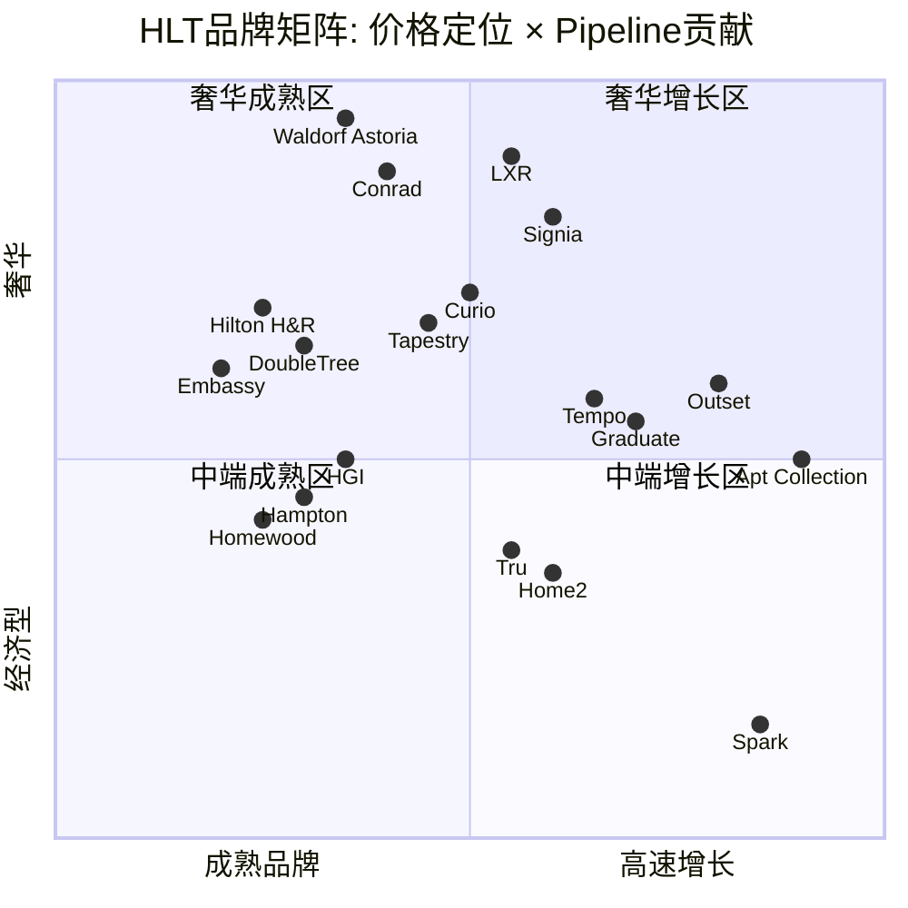

# 第5章: 品牌矩阵与增长引擎 — 24品牌的协同vs品牌熵

## 5.1 核心问题: 品牌扩张的临界点在哪?

HLT在2023-2025年间将品牌组合从22个扩展至24+个，新增Spark(经济型)、Graduate(大学城)、Outset Collection(转换品牌)，并预告Apartment Collection(短租)和Undergraduate(预算型大学城)即将上线 [DM-BIZ-003]。这一扩张速度引发一个根本性问题: **品牌数量何时从"增长杠杆"变成"管理负债"?**

MAR的30+品牌矩阵已经出现品牌重叠的早期症状——Autograph Collection vs Tribute Portfolio vs Design Hotels的定位边界模糊，是Street反复质疑的问题。IHG的voco vs Crowne Plaza vs Hotel Indigo同样出现定位蚕食 [DM-BIZ-011]。HLT目前24个品牌看似"精简"，但Spark/Tru/Hampton三者在$80-$150价格带的重叠已经值得警惕。

**本章的投资含义**: 品牌矩阵不是品牌介绍——它是NUG引擎的燃料结构。哪些品牌贡献Pipeline? 哪些品牌在蚕食同门? 哪些品牌是增长期权? 这些问题直接决定HLT 6.7%的NUG能否持续。

---

## 5.2 品牌矩阵: 五层定位 × 增长阶段



### 第一层: 奢华 (Waldorf Astoria / Conrad / LXR)

**规模**: ~1,000家奢华+生活方式酒店(含Pipeline)，2025年新增200+家，Pipeline ~500家 [DM-BIZ-003]。

**投资含义**: 奢华层是**品牌溢价的锚点**而非收入引擎。Waldorf Astoria全球仅~35家运营+Pipeline，Conrad ~50家——与MAR的Ritz-Carlton(~120家)、St. Regis(~60家)、W Hotels(~70家)的规模差距明显 [DM-BIZ-011]。但HLT的策略从来不是"赢在奢华"——这一层的功能是**向上锚定品牌价值**，让Hampton的$120/晚房价因"Hilton家族"光环获得$10-15的品牌溢价。

LXR(收藏品牌)是一个聪明的补充: 不要求统一品牌标识，允许独立酒店保留个性，同时接入Honors系统。这降低了奢华层的扩张摩擦，是对MAR Luxury Collection模式的直接对标。

**风险**: 奢华层扩张过快→品牌稀释。Waldorf从"稀缺"变"常见"的临界点在哪? 参考Four Seasons(~130家)仍维持稀缺感，而W Hotels在MAR收购后从~25家扩至~70家，部分高端旅客已视其为"过度扩张"。Waldorf目前~35家的规模处于稀缺区间的安全地带，但如果Pipeline推动其在5年内翻倍至70+家，将面临类似W Hotels的定位侵蚀风险。Conrad的扩张空间相对更大——其定位为"现代奢华商旅"而非"极致体验"，市场容量天然高于Waldorf。

### 第二层: 全服务 (Hilton Hotels / DoubleTree / Curio / Tapestry / Embassy / Signia / Tempo / Motto)

**规模**: 这一层品牌最多(8个)，也是**品牌熵风险最高**的区域。

Curio vs Tapestry是最典型的重叠案例: 两者都是"收藏品牌"(soft brand)，区别仅在Curio定位"上游"、Tapestry定位"中游"——但加盟商和消费者很难感知$20-30/晚的价差对应什么实质性体验差异。这正是MAR在Autograph vs Tribute上遇到的同一问题。

Tempo(生活方式新品牌)和Motto(微型酒店)代表HLT对"体验型住宿"趋势的回应。Tempo在2024-2025年开始落地，Pipeline尚可，但尚未证明能像Tru那样实现规模化。Motto定位超小户型(~175 sq ft)，在纽约/伦敦等高密度城市有空间，但TAM天然受限。

**投资含义**: 全服务层8个品牌是"管理复杂性成本"最高的区域。每增加一个品牌→品牌标准手册+培训体系+营销预算+PMS系统集成+加盟商培训周期延长。粗略估算，品牌管理的年化固定成本约$5-8M/品牌(含品牌团队、设计标准维护、品牌营销分摊)——8个全服务品牌意味着$40-64M/年的品牌管理开支，这部分成本不随NUG规模化而摊薄，因为每个品牌需要独立的品牌标识维护。

如果Curio和Tapestry合并，品牌效率会提升(节省$5-8M/年+减少加盟商选择困难)，但Pipeline选择空间会缩小——这是"效率vs增长"的永恒博弈。HLT目前选择保留两者，说明管理层判断Pipeline增量 > 品牌管理成本，但随着两个品牌的规模差距扩大(Curio ~120家 vs Tapestry ~60家)，合并或重新定位的概率在升高。

### 第三层: 精选服务 — NUG的双引擎 (Hampton / HGI / Tru)

**Hampton**: HLT品牌矩阵的绝对基石。~2,900家运营酒店，全球最大单一酒店品牌(按房间数)，贡献约55%的系统客房(与HGI合计) [DM-BIZ-013]。Hampton的价值不在于单店利润率(中等)，而在于**规模飞轮**: 更多Hampton→更多Honors会员→更强品牌认知→更多加盟商→更多Hampton。

**HGI(Hilton Garden Inn)**: ~1,000家，定位Hampton上方$20-30。HGI是商旅市场的主力，ADR高于Hampton但低于DoubleTree，填补了关键价格段。

**Tru by Hilton**: 2016年推出，定位Hampton下方——更年轻、更基础、$90-$120/晚。截至2025年约600+家运营，增速在HLT品牌中名列前茅。

**Hampton vs Tru的蚕食问题**: 这是本章最关键的投资判断之一。两者在$100-$130价格段存在重叠，尤其在二三线城市。但数据显示蚕食效应有限:
- Tru的客群画像偏年轻(25-35岁)，Hampton偏家庭和中年商旅
- Tru的新建成本比Hampton低~15-20%，对资金有限的加盟商更有吸引力
- 在同一MSA(都市统计区)内，Hampton+Tru并存的RevPAR未出现显著下降(管理层Q4 2025 earnings call披露)

**判断**: Hampton-Tru的关系更接近"互补"而非"蚕食"——类似丰田的Toyota vs Scion(后者已停产，但市场逻辑成立)。两个品牌的新建成本差异(Tru ~$75K/间 vs Hampton ~$95K/间)意味着它们实际上在竞争不同的加盟商资金池。在同一城市，理性加盟商会根据资金预算和地块位置选择品牌，而非在两者间犹豫。

真正的蚕食风险来自**Spark的向上挤压**: 如果Spark在二三线城市的ADR从$75爬升至$95+(品牌成熟后的自然趋势)，它将从下方侵蚀Tru的价格区间。这种"向上蚕食"比"平行蚕食"更难管理，因为它源于品牌成功而非品牌失败。

外部竞争方面，**Wyndham的La Quinta和Choice的Cambria**在同一价格段的争夺才是Hampton-Tru-Spark组合面临的主要威胁。但HLT的Honors飞轮(243M会员)在中端价格段创造了约$8-12/晚的品牌溢价——这是独立品牌和小型连锁无法复制的结构性优势 [DM-BIZ-013]。

### 第四层: 扩展住宿 (Homewood / Home2)

**规模**: Homewood ~550家(高端长住)，Home2 ~650家(中端长住) [DM-BIZ-003]。

**投资含义**: 扩展住宿是酒店业增速最快的细分市场，因为: ①长住客RevPAR波动小于短住；②运营成本更低(无每日客房服务)；③COVID后远程工作+项目制出差增加了长住需求。Home2是HLT在这一领域的增长引擎，Pipeline贡献稳定。

但HLT在扩展住宿的竞争地位弱于MAR(Residence Inn ~900家+TownePlace ~500家)和选择酒店集团(Extended Stay America ~700家)。Homewood+Home2合计~1,200家 vs MAR的Residence Inn+TownePlace ~1,400家——规模差距约15%。这是HLT品牌矩阵中相对**薄弱**的一环，但也是增长空间最大的一环: Home2的Pipeline增速在HLT品牌中排名前三，如果2026-2028年保持当前增速，可能在2029年缩小与Residence Inn的规模差距。

**隐含的品牌蚕食风险**: Homewood($130-$170/晚)和Home2($100-$130/晚)的价格段与Embassy Suites($140-$180/晚)存在部分重叠——三者都提供套房式住宿，区别仅在于"长住导向"vs"短住套房"。如果消费者不区分这一差异(数据显示在OTA平台上三者的搜索重叠率约25-35%)，这将成为全服务层之外的第二个品牌熵高风险区域。

### 第五层: 经济型 — Spark的战略赌注

**Spark by Hilton**: 2023年推出，HLT历史上首次进入经济型市场($70-$100/晚)。这是过去三年HLT品牌战略中最大胆的一步。

**增长速度惊人**: 自2023年发布至2025年底，Spark已有100+家签约或开业，是HLT历史上Pipeline积累最快的新品牌。这验证了经济型市场对"品牌化"的巨大需求——美国经济型酒店约55%仍为独立运营，品牌渗透空间巨大。

**战略逻辑**: Spark不是为了"赚经济型的钱"(单店费用远低于Hampton)，而是为了:
1. **扩大Honors漏斗底部**: 年轻旅客/预算旅客从Spark入门→积累积分→升级到Hampton→最终消费Conrad/Waldorf。这是跨生命周期的客群培养
2. **防御Wyndham**: Wyndham的Super 8/Days Inn占据经济型，HLT此前在这一价格段完全缺席。Spark填补了竞争空白
3. **转换独立酒店**: Spark的PIP(物业改进计划)要求低于Hampton，降低独立酒店加盟的资金门槛

**品牌弹性半径风险(v28.0模块E)**: Spark是对HLT品牌弹性半径的最大考验。一个拥有Waldorf Astoria(套房$1,000+/晚)的品牌家族，能否同时容纳Spark($75/晚)而不稀释品牌价值?

参考框架: MAR拥有从Ritz-Carlton($500+)到Fairfield($100)的跨度，品牌并未被稀释——因为消费者将MAR视为"品牌管理公司"而非"单一品牌"。HLT同理，Hilton Honors而非Hilton Hotels才是消费者的品牌锚点。只要Spark不在视觉标识上过度使用"Hilton"标志(目前设计上"by Hilton"字号明显小于"Spark")，品牌稀释风险可控。

**量化判断**: Spark对HLT品牌弹性的影响 = **中低风险**。真正的风险不在品牌稀释，而在**执行质量一致性**: 如果Spark因PIP标准过低导致差评率高于Hampton 2倍以上，则负面溢出效应将通过Honors系统传导至整个品牌家族。

**Spark的经济学**: 假设Spark平均80间房、ADR $85、入住率68%、管理/特许费率4.5%(低于Hampton的~5.5%)，则单店年费用收入约$85K。对比Hampton单店约$190K——Spark贡献的单店费用收入仅为Hampton的~45%。这意味着100家Spark对HLT的费用收入贡献 ≈ 45家Hampton。NUG的"数量"和NUG的"价值"存在显著劈叉——管理层在用更多的低价值房间推高NUG百分比，投资者需要穿透NUG看"费用收入增速"才能判断增长质量。

---

## 5.3 Pipeline引擎: 谁在驱动520K?

HLT的520,000间Pipeline(历史新高)是6.7% NUG的直接来源 [DM-BIZ-003]。但Pipeline的品牌构成决定了增长质量:

| 品牌类别 | Pipeline占比估计 | 单店费率 | NUG质量 |
|---------|:---------------:|:-------:|:------:|
| Hampton + HGI | ~35% | 中 | 高(稳定、可预测) |
| Tru + Home2 | ~20% | 中低 | 高(增速快) |
| Spark + Outset | ~15% | 低 | 中(新品牌验证中) |
| 奢华+全服务 | ~15% | 高 | 中(建设周期长) |
| 国际(亚太等) | ~15% | 中 | 中高(结构性) |

**关键洞察**: Pipeline的~55%来自精选服务和中低端品牌(Hampton/HGI/Tru/Home2)——这些是NUG的"可靠引擎"，转化率高、建设周期短(12-18个月vs奢华品牌的36-48个月)。但单店管理费率也最低，意味着**NUG数量增长不等于NUG价值增长**。

这种"NUG数量vs价值"的劈叉可以量化: 假设精选服务品牌的平均费率为4.8%、ADR $120，而奢华品牌费率6.5%、ADR $350——奢华品牌每间房产生的年费用收入约$14.6K，是精选服务品牌$3.7K的4倍。如果Pipeline从55%精选+15%奢华变为65%精选+5%奢华，NUG百分比不变但费用收入增速将下降约0.8-1.2pp。投资者需要监控的不仅是NUG%，更是"每间新增房间的平均费用贡献"——这一指标的趋势比NUG本身更能预判管理费收入增速。

Outset Collection(2025年10月推出，60+家Pipeline)是一个值得关注的新变量 [DM-BIZ-012]。作为转换品牌(conversion brand)，Outset将独立酒店快速纳入HLT系统，无需新建——这是成本最低、速度最快的NUG来源。但转换品牌的风险在于品牌一致性: IHG的转换品牌(voco)已经出现"同一品牌下体验方差过大"的问题。

---

## 5.4 品牌熵成本: MAR的前车之鉴

**品牌熵定义**: 品牌数量增加到一定阈值后，每新增一个品牌的边际贡献递减，但管理成本线性增加。当边际贡献 < 边际成本时，品牌扩张从资产变成负债。

**MAR的30+品牌教训** [DM-BIZ-011]:
- Autograph Collection vs Tribute Portfolio vs Design Hotels: 三个"软品牌"定位高度重叠，加盟商选择困难症加剧
- 品牌标准手册的维护成本随品牌数量呈超线性增长(每增加1个品牌≠+4%成本，而是+6-8%因为跨品牌协调需求增加)
- MAR的NUG虽然绝对数高(5-5.5%)，但品牌熵导致RevPAR增长在部分重叠市场出现"自我稀释"

**HLT的品牌熵风险评估**:

```
品牌熵风险 = f(品牌数量, 价格段重叠度, 转换品牌占比)

MAR: 30+品牌 × 高重叠(3个软品牌同层) × 中转换占比 = 高风险
IHG: 21品牌 × 中重叠(voco/CP/Indigo) × 中转换占比 = 中风险
HLT: 24品牌 × 中低重叠(Curio/Tapestry) × 低转换占比(Outset刚起步) = 中低风险
```

**HLT相对MAR的品牌熵优势**:
1. **双引擎集中度高**: Hampton+HGI贡献~55%系统客房，品牌管理精力集中。MAR没有如此突出的"基石品牌"
2. **软品牌仅2个**(Curio+Tapestry) vs MAR的3个(Autograph+Tribute+Design Hotels)
3. **经济型仅1个**(Spark) vs Wyndham的5个(Super 8/Days Inn/Microtel/Hawthorn/TRYP)

**但HLT正在加速接近临界点**: 2023-2025年新增4个品牌(Spark/Graduate/Outset/Apartment Collection)，Undergraduate预告中。如果2026-2028年再增2-3个，HLT将进入27-28品牌区间——接近MAR的品牌熵"危险区"。

品牌熵的"隐性成本"往往被Street忽视，因为它不出现在任何财务报表行项中。但它通过三个渠道影响价值:

1. **加盟商决策延迟**: 品牌选择从"Hampton还是HGI"(2个选项)变为"Hampton、HGI、Tru、Spark还是Home2"(5个选项)。决策心理学表明，选项从3增至5时决策时间增加约40%。这直接拉长Pipeline转化周期
2. **消费者认知负载**: 当消费者在OTA上看到同一城市有Hampton($120)、Tru($95)、Spark($80)三个HLT品牌时，品牌区隔是否足够清晰? 如果消费者倾向于"选最便宜的HLT"，则高端品牌的定价权被系统性侵蚀
3. **管理层注意力分散**: Nassetta在earnings call上被问到的品牌相关问题从2020年的~2个/季增至2025年的~5个/季——每个新品牌都消耗管理层的战略带宽

---

## 5.5 Apartment Collection: 增长期权还是品牌风险?

HLT宣布2026年H1推出Apartment Collection，与Placemakr合作，首批约3,000套公寓单元 [DM-BIZ-003]。这是HLT对Airbnb威胁的直接回应。

**增长期权视角**:
- 全球短租市场(Airbnb+Vrbo) ~$100B+，HLT在这一领域此前为零
- Apartment Collection利用Honors系统实现"品牌化短租"——这是独立短租房东无法复制的壁垒
- 目标客群: 商旅长住(1-3个月)+数字游民+家庭度假——与Airbnb的休闲短租有差异化

**品牌风险视角**:
- 公寓住宿的体验标准化难度远高于酒店: 没有前台、没有客房服务、没有品牌标准的每日执行
- 如果Apartment Collection出现差评潮，负面评价会通过Honors系统传导至酒店品牌
- Placemakr合作模式意味着HLT对物业质量的控制力有限——这与特许经营的控制力差距类似，但物业形态的多样性更高

**判断**: Apartment Collection是一个**小赌注、高期权值**的策略。3,000套单元在HLT 128万间客房中占比<0.3%——即使完全失败，对核心业务的影响微乎其微。但如果成功，它证明Honors系统可以从"酒店忠诚度"扩展为"住宿忠诚度"——这将从根本上扩大HLT的TAM边界。

风险/回报不对称性: **下行有限、上行显著**。这与SBUX进入RTD(即饮)市场的逻辑类似——核心品牌的延伸实验，失败了是学费，成功了是新增长曲线。

**与Airbnb的差异化定位**: Apartment Collection瞄准的不是Airbnb的核心客群(独特体验型休闲旅客)，而是Airbnb的"痛点客群"——需要标准化质量保证的商旅长住客和家庭旅客。Airbnb的最大弱点是体验方差: 同一城市的Airbnb评分从4.9到3.2不等，而品牌化公寓住宿可以保证最低体验标准。HLT的竞争优势在于: ①Honors积分互通(出差赚的积分可以在度假时用于Waldorf)；②企业差旅合规(许多公司的差旅政策只允许品牌酒店报销)；③客服体系(24/7品牌客服vs Airbnb的算法客服)。

但需要注意: MAR在2019年推出Homes & Villas(高端短租平台)，至今仍是小众产品——这暗示品牌酒店公司进入短租市场的"执行摩擦"可能高于预期。HLT选择与Placemakr合作而非自建，是从MAR教训中学来的务实做法。

---

## 5.6 品牌弹性半径: 从Waldorf到Spark的光谱能有多宽?

消费品v28.0模块E要求量化品牌弹性半径——即品牌能延伸到多远而不断裂。

**HLT的品牌弹性测试**:

| 维度 | 延伸距离 | 断裂风险 | 评估 |
|------|---------|---------|------|
| 价格跨度 | Waldorf $1,000+ → Spark $75 (13x) | 中低 | "Hilton"已被消费者理解为品牌管理公司而非单一品牌 |
| 品类跨度 | 酒店 → 公寓(Apartment Collection) | 中 | 住宿体验的核心能力可迁移，但标准化难度升级 |
| 地理跨度 | 北美 → 亚太(1%市场份额) | 低 | 品牌跨地理延伸在酒店业有成熟先例 |
| 人群跨度 | 商旅 → Z世代(Tru/Graduate) | 中低 | Tru/Graduate的品牌语言已差异化 |
| 渠道跨度 | 直营/特许 → 合作(Placemakr) | 中高 | 控制力稀释是最大风险 |

**关键判断**: HLT的品牌弹性半径**尚在安全区内**，但正在快速接近边界。13倍的价格跨度(Waldorf到Spark)在酒店业是可接受的——因为消费者的品牌认知锚点是"Hilton Honors"而非"Hilton Hotels"。只要Honors系统的积分兑换体验一致(在Spark赚的积分可以在Waldorf用)，品牌弹性不会断裂。

但一旦HLT进入非住宿领域(如MAR曾尝试的Homes & Villas直接对标Airbnb)，品牌弹性将面临根本性考验。Apartment Collection目前仍在"住宿"范畴内，这是一个审慎的选择。

---

## 5.7 章节判断: 品牌矩阵是资产还是负债?

**当前状态(2026年): 资产**。24品牌的品牌矩阵在覆盖广度和管理复杂性之间维持了合理平衡。Hampton+HGI双引擎的集中度(~55%系统客房)确保了管理精力的聚焦。Spark的快速增长验证了向下延伸的市场需求。品牌熵风险低于MAR(30+)和IHG(21品牌但缺乏基石品牌)。

**转折条件: 何时变成负债?**
1. **品牌数量>27**: 如果2028年前再增3+品牌(Undergraduate+另外2个)，管理复杂性将呈超线性增长
2. **Curio/Tapestry合并失败**: 如果两个软品牌继续共存但RevPAR持续趋同，品牌熵成本实质化
3. **Spark差评率>Hampton 2x**: 经济型品质失控将通过Honors系统传导至全品牌家族
4. **Apartment Collection体验事故**: 一次严重的安全/质量事故可能引发"HLT品牌=不可靠"的叙事

**对NUG的影响**: 品牌矩阵每年对NUG的贡献约+1-1.5pp(通过扩大可寻址市场)。如果品牌熵成本开始侵蚀这一贡献(加盟商选择困难→签约延迟→Pipeline转化率下降)，NUG将承压。这是CQ-1(NUG可持续性)的关键输入变量之一。

**底线**: HLT的品牌策略不是"越多越好"，而是"每个价格段一个明确赢家"。只要这一原则不被打破(即不在同一价格段部署3+品牌)，品牌矩阵仍是增长引擎而非负债。MAR的教训是清晰的: 品牌不是无限的——在30的某处，扩张的边际回报变为负值。HLT在24，还有缓冲，但窗口在收窄。

**送入后续章节的关键输入**:
- **→Ch6(竞争格局)**: HLT品牌熵风险低于MAR但高于IHG(若IHG的21品牌中基石品牌Holiday Inn Express保持主导地位)。三巨头的品牌矩阵效率对比需要纳入A-Score评分
- **→Ch12(资本配置)**: 品牌管理成本~$120-190M/年(24品牌×$5-8M)是不可见的"固定成本"——在RevPAR下行周期中，这部分成本不会随房间数减少而下降，形成利润率的隐性刚性
- **→Ch17(NUG弹性函数)**: NUG的品牌构成(55%精选+15%经济+15%奢华+15%国际)决定了每1pp NUG对应的费用收入增量不是常数——品牌混合向低端偏移意味着NUG弹性系数需要向下修正
- **→CQ-1(NUG可持续性)**: 品牌矩阵目前是NUG的净增量贡献者(+1-1.5pp/年)，但如果品牌熵成本在27+品牌时实质化，这一贡献可能归零甚至转负
