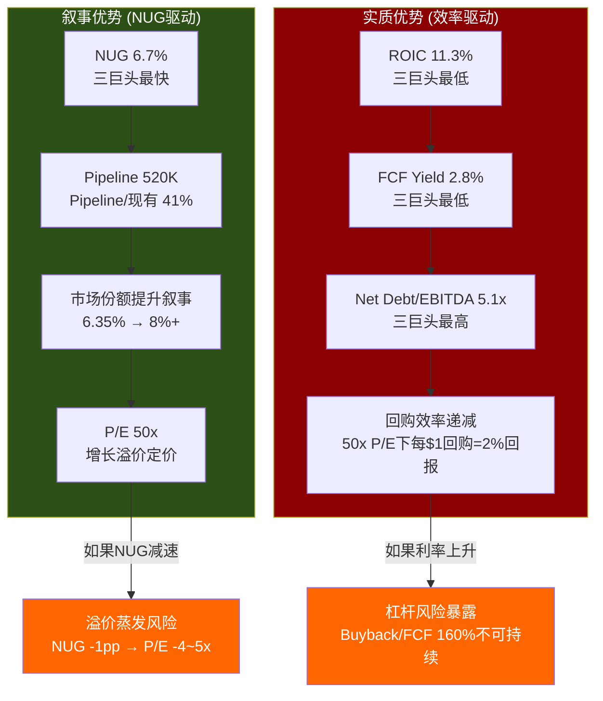

# 第6章: 竞争格局 — 三巨头+Airbnb的定量解构

> **核心问题**: HLT vs MAR vs IHG — 三巨头中谁最值得投资?
> **关键发现**: HLT的50x估值溢价本质上是**NUG叙事溢价**而非效率溢价——ROIC三巨头最低、杠杆最高、但增长叙事最强。这是一把双刃剑: 叙事兑现则溢价自证，叙事动摇则溢价蒸发。

---

## 6.1 三巨头全景定量对比

酒店行业的"三巨头"——MAR、HLT、IHG——占据全球品牌酒店市场约25%的客房份额。三者均采用轻资产模型，但在规模、增速、资本配置和估值上呈现系统性分化。

### 6.1.1 规模与增长矩阵

| 指标 | HLT | MAR | IHG | 投资含义 |
|------|----:|----:|----:|---------|
| **客房数** | 1,268K | 1,600K+ | 950K+ | MAR规模第一，HLT第二但增速最快 |
| **物业数** | 8,447 | 9,000+ | 6,400+ | MAR物业密度最高 |
| **Pipeline (间)** | 520K | ~560K | ~310K | HLT Pipeline/现有比41%，三巨头最高 |
| **NUG (2025)** | 6.7% | ~5.0% | ~4.5% | **HLT领先1.7-2.2pp——估值溢价的核心叙事** |
| **RevPAR增速 (2025)** | +0.4% | +3-4% | +2-3% | HLT RevPAR三巨头最弱(美国-0.3%) |
| **品牌数** | 24+ | 30+ | 19 | MAR品牌最多(含Starwood遗产) |
| **会员数** | 243M | 200M+ | ~130M | **HLT会员三巨头最多**(含Honors非活跃) |
| **直订率** | ~75% | ~50% | ~55% | **HLT直订率断层领先——渠道成本优势** |
| **覆盖国家** | 143 | 139 | 100+ | 地理覆盖接近 |

**关键读数**: HLT的竞争优势集中在两个维度——NUG增速(6.7% vs 同行5%以下)和直订率(75% vs 同行50-55%)。前者驱动估值叙事，后者降低获客成本。但RevPAR增速三巨头最弱(+0.4% vs MAR +3-4%)，暴露同店增长乏力的事实。[DM-BIZ-003][DM-BIZ-010][DM-BIZ-012]

**会员数的质量问题**: HLT宣称Honors会员243M(三巨头最多)，但这个数字需要审慎对待。酒店忠诚度计划的"会员数"通常含大量非活跃账户(注册后从未消费或年消费<1次)。MAR的Bonvoy虽报告200M+，但其联名信用卡持有量和积分兑换活跃度可能高于HLT。**真正的护城河指标是直订率而非会员数**: HLT 75%直订率意味着每4个订单中有3个不经过OTA，节省15-25%佣金——这才是可量化的竞争优势。

**品牌层级对比**: 三巨头的品牌策略呈现不同路径。MAR通过2016年Starwood收购获得了最强的奢华品牌矩阵(Ritz-Carlton、St. Regis、W Hotels、Edition)，在超高端市场占据主导。HLT近年通过Waldorf Astoria、Conrad、LXR和Signia加速向上延伸，2025年达到1,000+奢华/生活方式酒店的里程碑。IHG的奢华布局最弱(InterContinental、Regent、Six Senses规模较小)，但其Holiday Inn家族在中端市场拥有无可匹敌的品牌认知度。HLT的差异化在于**全覆盖战略**——从Spark(经济型)到Waldorf Astoria(超奢华)的24+品牌形成完整光谱，而竞争对手或偏上(MAR)或偏下(Wyndham)。

### 6.1.2 财务效率与估值对比

| 指标 | HLT | MAR | IHG | HLT排名 |
|------|----:|----:|----:|:-------:|
| **P/E (TTM)** | 50.2x | 35.0x | 27.6x | #1 (最贵) |
| **EV/EBITDA** | 28.7x | ~23x | ~18x | #1 (最贵) |
| **ROIC** | 11.3% | 15.6% | 22.6% | **#3 (最低)** |
| **FCF Yield** | 2.8% | ~3.5% | ~4.5% | **#3 (最低)** |
| **Net Debt/EBITDA** | 5.12x | ~3.5x | ~2.5x | **#3 (杠杆最高)** |
| **Buyback/FCF** | 160% | ~100% | ~90% | **#1 (回购最激进)** |
| **特许占比** | ~88% | ~85% | ~90% | #2 (IHG最轻) |
| **OPM** | 22.4% | ~26% | ~30% | #3 (IHG利润率最高) |

**核心矛盾一目了然**: HLT在效率指标(ROIC、FCF Yield、OPM)上三巨头垫底，但在估值倍数上三巨头封顶。这意味着市场为HLT支付的每一美元盈利所承载的期望，远高于MAR和IHG。[DM-VAL-001][DM-VAL-003][DM-VAL-004][DM-VAL-006][DM-VAL-007]

**ROIC失真的技术说明**: HLT的ROIC 11.3%可能因负权益(-$5.39B)而失真。传统ROIC = NOPAT / (Equity + Net Debt)，当Equity为大额负数时，分母被压缩，ROIC反而可能被"人为抬高"而非压低。如果用调整后投入资本(加回Treasury Stock $14.4B)计算，HLT的"真实ROIC"可能更低。这使得三巨头ROIC对比的表面数字(11.3% vs 15.6% vs 22.6%)可能**低估**了HLT与IHG的效率差距。这一技术细节将在Ch11 DuPont分解中深入展开。[DM-FIN-008]

**杠杆差异的结构性原因**: HLT的Net Debt/EBITDA 5.12x vs MAR 3.5x vs IHG 2.5x不是偶然差异，而是三种不同资本配置哲学的必然结果。HLT选择了"最大化回购→最大化EPS增速→最大化P/E"的飞轮策略，这要求持续举债(FY2025回购$3.25B vs FCF $2.03B → 缺口$1.22B靠新债填补)。MAR采取更保守的"FCF范围内回购"策略。IHG则是三巨头中最审慎的——保持低杠杆为并购保留火力。三种策略在不同市场环境下优劣互换: 低利率+高估值环境利好HLT(便宜杠杆放大EPS); 高利率+低估值环境利好IHG(低杠杆抗压+低估值回购效率高)。[DM-INF-002][DM-VAL-004]

---

## 6.2 估值差异归因: 为什么HLT 50x > MAR 35x > IHG 28x?

三巨头的P/E梯度不是随机定价，而是市场对三种不同"故事"的定价结果。我们可以将HLT vs IHG的22.6x P/E差距(50.2x - 27.6x)分解为以下驱动因素:

### 6.2.1 溢价分解框架

| 驱动因素 | 贡献(估计) | 解释 |
|----------|:---------:|------|
| **NUG增速差** | ~8-10x | HLT 6.7% vs IHG 4.5%，2.2pp差距被市场放大定价 |
| **管理层叙事** | ~3-4x | Nassetta 18年任期+一致的"持续加速"叙事 |
| **品牌组合扩展** | ~2-3x | 24+品牌(Spark→Apartment Collection)的期权价值 |
| **Honors飞轮** | ~1-2x | 243M会员+75%直订率的网络效应溢价 |
| **杠杆回购缩股** | ~2-3x | EPS CAGR 21.8%(含回购) vs Revenue CAGR 8.3%的"增速幻觉" |
| **合计** | ~16-22x | 解释HLT vs IHG的P/E差距 |

**关键洞见**: 如果NUG是最大的单一溢价驱动因素(~8-10x P/E)，那么**NUG每减速1pp，HLT P/E理论上应压缩4-5x**。这正是CQ-1(溢价之王脆弱性)的量化基础。

### 6.2.2 MAR的"夹心"困境

MAR位于HLT和IHG之间，面临两面挤压:
- **vs HLT**: NUG增速落后1.7pp(5.0% vs 6.7%)，市场不愿给予同等增长溢价
- **vs IHG**: ROIC低于IHG(15.6% vs 22.6%)，效率叙事也不占优
- **自身问题**: Starwood整合已7年，品牌协同边际递减; Bonvoy庞大但活跃度存疑

MAR的35x P/E反映的是"规模最大但增速不最快、效率不最高"的中间定位——既不能享受HLT的增长溢价，也不能获得IHG的效率折扣。

有趣的是，MAR作为"行业老大"却没有拿到"老大溢价"——这在消费品行业中较为罕见(通常龙头享有最高估值)。原因在于酒店行业的估值锚点不是存量规模而是增量速度: 投资者为"未来将成为最大"(HLT的NUG叙事)支付的溢价，高于"现在已经最大"(MAR的规模优势)。这一估值逻辑是否合理，取决于NUG能否持续转化为FCF增长——而非仅仅转化为房间数增长。

---

## 6.3 A-Score竞争力雷达: 五维度量化评分

为系统化比较三巨头的竞争力，我们构建五维度A-Score雷达图。每个维度0-10分，基于可量化指标:

| 维度 | HLT | MAR | IHG | 评分依据 |
|------|:---:|:---:|:---:|---------|
| **品牌力** | 9.0 | 8.5 | 7.0 | 品牌价值($12B #1)、品牌数、高端覆盖 |
| **规模** | 8.0 | 9.5 | 6.5 | 客房数、物业数、地理覆盖 |
| **增长** | 9.5 | 7.5 | 6.5 | NUG增速、Pipeline/现有比、新品牌扩展 |
| **效率** | 6.5 | 7.5 | 9.0 | ROIC、OPM、FCF Yield、杠杆水平 |
| **估值** | 4.0 | 6.0 | 8.0 | P/E合理性(越低越好)、FCF Yield |
| **总分** | **37.0** | **39.0** | **37.0** | — |

**雷达图解读**:
- **HLT**: "增长之王"但"估值之殇"——品牌力+增长突出，但效率和估值严重拖累。总分37.0。
- **MAR**: 最均衡的选手——各维度都在7-9.5之间，但没有突出领先项。总分39.0。
- **IHG**: "效率冠军"+"估值洼地"——效率9.0+估值8.0是三巨头最佳组合，但品牌和规模偏弱。总分37.0。

**投资含义**: HLT和IHG总分相同(37.0)，但A-Score结构截然相反——HLT高增长/低效率/高估值，IHG低增长/高效率/低估值。**这不是"谁更好"的问题，而是"你在押注什么"的问题**: 押NUG加速→选HLT; 押效率变现→选IHG; 要均衡→选MAR。

---

## 6.4 竞争壁垒源泉: 护城河解构

三巨头的护城河来自四个可叠加的来源，但各自的护城河组合存在结构性差异:

### 6.4.1 四重护城河评估

| 护城河类型 | HLT | MAR | IHG | 关键证据 |
|-----------|:---:|:---:|:---:|---------|
| **品牌壁垒** | ★★★★★ | ★★★★☆ | ★★★☆☆ | HLT品牌价值$12B全球#1; Hampton全球最大单一品牌 |
| **网络效应** | ★★★★☆ | ★★★★★ | ★★★☆☆ | MAR会员最活跃(Bonvoy生态最广); HLT直订率最高 |
| **转换成本** | ★★★★☆ | ★★★★☆ | ★★★★☆ | 三者相似: 业主换牌成本$5K-15K/间(PIP+系统切换) |
| **规模经济** | ★★★★☆ | ★★★★★ | ★★★☆☆ | MAR 1,600K间采购最强; HSM 3,500+供应商有规模 |

**护城河总评**:
- 三巨头均享有**宽护城河**(Wide Moat)，但护城河的组成不同
- HLT的护城河宽度正在**扩展中**: Pipeline 520K间(现有比41%)意味着未来3-5年规模经济和网络效应还将增强
- **护城河不防周期**: 重要的是，宽护城河不能防止收入和盈利的周期性波动。三巨头在2020年均经历了50-70%的RevPAR暴跌。护城河防的是市场份额流失，不防经济衰退。[DM-BIZ-013]

### 6.4.2 护城河宽度与估值脱节

一个值得注意的悖论: **IHG护城河相对较窄(三巨头最弱)，但估值也最低(27.6x P/E)——市场已经充分定价了这个差距。HLT护城河最宽，但50x P/E是否过度透支了护城河的变现能力?**

护城河保证的是"不被替代"，不保证"高速增长"。HLT的50x P/E隐含的不是"护城河很宽"的定价，而是"护城河越来越宽(NUG加速)"的定价。一旦NUG减速，护城河宽度不变，但定价基础消失。

---

## 6.5 Airbnb分化分析: 结构性竞争还是分工共存?

### 6.5.1 短租vs酒店: 不同市场还是同一战场?

| 维度 | 品牌酒店(HLT等) | Airbnb/短租 |
|------|:--------------:|:----------:|
| **核心客群** | 商务出行(60%+)、标准化需求 | 休闲旅行、长住、家庭/团体 |
| **标准化** | 高(Hampton体验全球一致) | 低(每个房源独特) |
| **定价模式** | ADR+RevPAR(日均$130-180) | 每晚价格弹性更大 |
| **企业账户** | 是(差旅管理对接) | 极弱 |
| **忠诚度粘性** | 强(Honors 243M会员) | 弱(平台忠诚度低) |
| **运营风险** | 低(专业管理) | 高(房东质量参差) |

**核心判断**: Airbnb与品牌酒店的竞争是**品类分化**而非**零和替代**。Airbnb主要蚕食的是独立酒店和经济型住宿的份额，而非品牌连锁。数据支持这一判断: 2016-2025年Airbnb高速增长期间，三巨头的NUG均保持5-7%的正增长，品牌渗透率从全球35%提升至40%+。

然而，分化并非绝对。在以下三个细分场景中，Airbnb与品牌酒店存在直接竞争:
- **周末休闲旅行**: 家庭/团体出行时Airbnb的空间优势(整套公寓/别墅)压制酒店标准间
- **长住需求(7天+)**: Airbnb的月租折扣使日均成本低于extended-stay酒店30-50%
- **目的地体验**: Airbnb的"Experiences"功能+独特房源(树屋/海滨别墅)提供酒店无法复制的差异化

HLT的应对策略不是在这三个场景中正面对抗Airbnb，而是通过品牌扩展(Apartment Collection、Tempo、Motto)模糊品类边界——让Hilton的品牌信任度+Honors积分体系成为消费者"不需要离开Hilton生态"的理由。

### 6.5.2 HLT的主动应对: Apartment Collection

HLT于2026年H1推出**Apartment Collection by Hilton**——与Placemakr合作的公寓式酒店品牌，首批约3,000个单元。这是对Airbnb长住/公寓领域的直接回应。[DM-BIZ-003]

**战略逻辑**:
- 捕获3-30天长住需求(传统酒店覆盖不足的缝隙市场)
- 将Honors会员导入公寓场景(积分可用→切换成本)
- 利用品牌信任度(vs Airbnb的质量不确定性)

**风险评估**: Apartment Collection目前规模极小(3,000单元 vs Airbnb 700万+房源)，短期对HLT收入贡献可忽略(< 0.5%)。但作为**品类卡位**，防止Hilton品牌在长住市场被边缘化，具有战略防御意义。

### 6.5.3 OTA中间商挤压: 更现实的威胁

相比Airbnb，**OTA(Booking.com/Expedia)对HLT的威胁更为直接**:
- OTA佣金15-25%直接侵蚀利润率
- HLT 75%直订率是行业最佳防御(vs MAR ~50%、IHG ~55%)
- 但OTA在国际市场(尤其是欧洲/亚太)的渗透率远高于美国——正好是HLT未来增长的核心战场

**量化影响**: 假设HLT直订率每下降5pp→OTA佣金增加约$50-80M/年→OPM压缩0.4-0.7pp。HLT的75%直订率是其最不被讨论但最有价值的竞争优势之一。[DM-BIZ-006]

---

## 6.6 全球在建份额: 20%市场份额是否可达?

HLT当前全球品牌酒店市场份额约6.35%，但在**全球Pipeline中占比约20%**(按在建客房数)。这意味着如果所有Pipeline项目按期交付，HLT的市场份额将在3-5年内显著提升。

### 6.6.1 Pipeline→市场份额的量化路径

| 时间节点 | 客房数(K) | 全球份额(估) | 假设 |
|---------|----------:|:----------:|------|
| FY2025 | 1,268 | ~6.35% | 当前 |
| FY2027E | ~1,440 | ~6.9% | NUG 6.5%/年 |
| FY2029E | ~1,630 | ~7.5% | NUG 6.0%/年(温和减速) |
| FY2031E | ~1,830 | ~8.0%+ | NUG 5.5%/年(Pipeline消化+新增) |

**关键约束**:
1. **Pipeline转化率**: 历史约70-80%，但经济衰退期可降至55-65%
2. **亚太集中度**: Pipeline约35%+在亚太，地缘/宏观风险集中[thesis_crystallization CQ-5]
3. **行业总供给**: HLT份额提升≠绝对需求增长，可能伴随行业供给过剩→RevPAR承压
4. **基数效应**: 随着客房基数增大，维持6%+ NUG需要越来越多的绝对新增量(FY2025: ~85K间 → FY2030: 需~110K间)

### 6.6.2 Conversion品牌: NUG加速器的新维度

HLT在2025年10月推出的**Outset Collection**(已有60+酒店在Pipeline中)和早期的Curio/Tapestry Collection代表了一种低成本增长策略: 将独立酒店转换为Hilton品牌，而非等待新建项目从拿地到开业的3-5年周期。

Conversion品牌对NUG的贡献正在加速:
- **速度优势**: Conversion项目从签约到开业通常6-12个月(vs 新建3-5年)
- **资本效率**: 业主只需完成品牌标准整改(PIP)而非全新建设，降低了加盟门槛
- **市场扩展**: 独立酒店全球约1,200万间(品牌渗透率仅~40%)，Conversion的可寻址市场巨大
- **竞争格局**: MAR的Tribute/Autograph/Delta和IHG的Vignette/Voco也在争夺Conversion市场，但HLT的Outset定位更偏中端(vs 竞品偏高端)，可寻址池更大

**量化估计**: 如果Conversion品牌贡献NUG的20-25%(即每年1.3-1.7pp)，则即使新建Pipeline增速放缓，HLT仍可维持5-6%的总NUG——这是50x P/E叙事延续的安全垫。

### 6.6.3 亚太在建份额: 机遇=风险

HLT在亚太市场的Pipeline在建份额约25%(远高于运营份额的~1%)——这是三巨头中增速最快的区域。但亚太Pipeline集中意味着:

- **中国经济减速**: 如果中国GDP增速从5%降至3-4%，酒店开发意愿可能下降，Pipeline转化率从80%降至60%→HLT全球NUG损失约1-1.5pp
- **MAR在亚太同样激进**: MAR亚太Pipeline约180K间(vs HLT约130K间)，价格竞争可能加剧
- **IHG的本土优势**: Holiday Inn在中国市场品牌认知度高，IHG在中国的物业数量超过HLT

---

## 6.7 叙事优势 vs 实质优势: 本章核心判断

回到本章的核心问题——HLT的竞争优势是**叙事优势**(最快增长)还是**实质优势**(最佳经济学)?

**本章结论**:

1. **HLT = 叙事优势 > 实质优势**。NUG增速(6.7%)和品牌扩展(24+品牌)构成强大叙事，但ROIC(11.3%)、FCF Yield(2.8%)、杠杆(5.1x)均是三巨头最弱。50x P/E定价的是叙事，不是效率。

2. **IHG = 实质优势 > 叙事优势**。ROIC(22.6%)、低杠杆(2.5x)、高OPM(~30%)均是三巨头最佳，但NUG(4.5%)和品牌覆盖较窄，缺乏"增长故事"的定价空间。27.6x P/E留有安全边际。

3. **MAR = 两者均不突出**。规模最大(1,600K间)但增速不最快、效率不最高、估值居中。35x P/E是"大而稳"的定价。

4. **三巨头投资排序**(纯基本面视角):
   - **价值投资者**: IHG > MAR > HLT (效率+估值安全边际)
   - **成长投资者**: HLT > MAR > IHG (NUG+品牌扩展动量)
   - **风险调整后**: MAR ≈ IHG > HLT (HLT的杠杆+估值风险降低风险调整回报)

5. **对HLT的核心追问**(将在Ch16-17深入): HLT 50x P/E隐含的NUG假设是什么? 如果NUG从6.7%降至5.0%(接近MAR)，HLT应该值35x还是45x? 答案将决定HLT是"物有所值的增长溢价"还是"等待均值回归的叙事泡沫"。

6. **Ackman信号的竞争含义**: Pershing Square在2026-02-11清仓HLT转投META，这不仅是个股信号，也是对酒店行业竞争格局的隐含判断——在数字平台(META)vs实体服务(HLT)的资本配置中，聪明钱选择了前者。考虑到Ackman持仓通常2-5年，其在HLT已赚取可观收益后退出，可能反映出对50x估值下竞争格局边际恶化的担忧: NUG减速的概率在上升(基数效应+亚太风险)，而MAR和IHG的估值折扣提供了更有吸引力的风险回报比。[DM-SMT-Ackman]

**本章与后续章节的桥接**: 竞争格局分析揭示了HLT估值的核心逻辑(NUG叙事溢价)和核心风险(效率劣势+杠杆累积)。Ch11将深入HLT自身的财务效率分解(DuPont+ROIC修正)，Ch12将量化回购效率的边际递减，Ch15将测试杠杆极限——这三章将共同回答一个问题: HLT的杠杆回购机器还能运行多久?

---

*[本章DM锚点引用: DM-BIZ-003, DM-BIZ-006, DM-BIZ-010, DM-BIZ-011, DM-BIZ-012, DM-BIZ-013, DM-VAL-001, DM-VAL-003, DM-VAL-004, DM-VAL-006, DM-VAL-007, DM-INF-001, DM-INF-002]*
