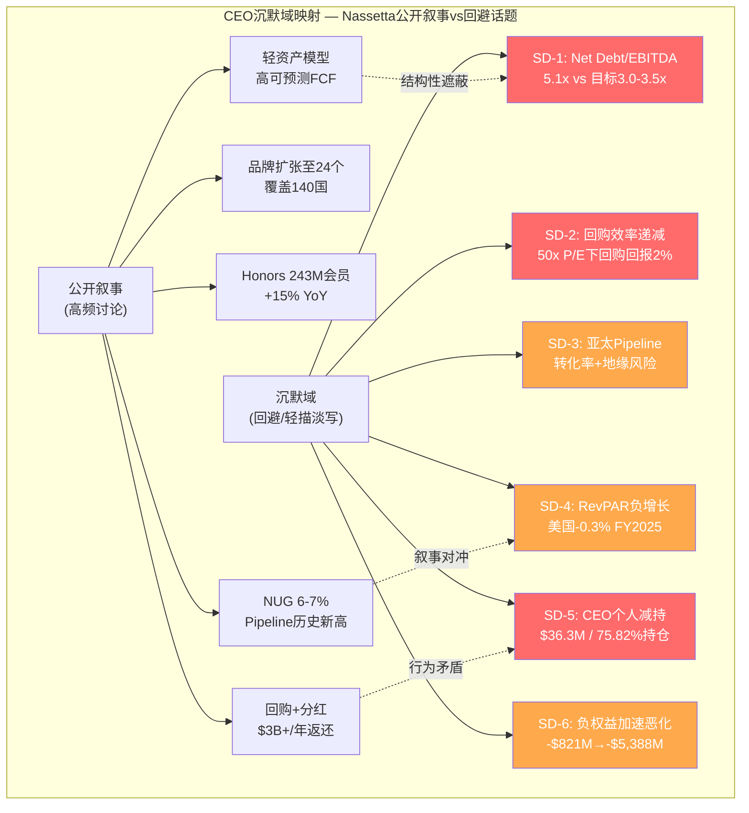
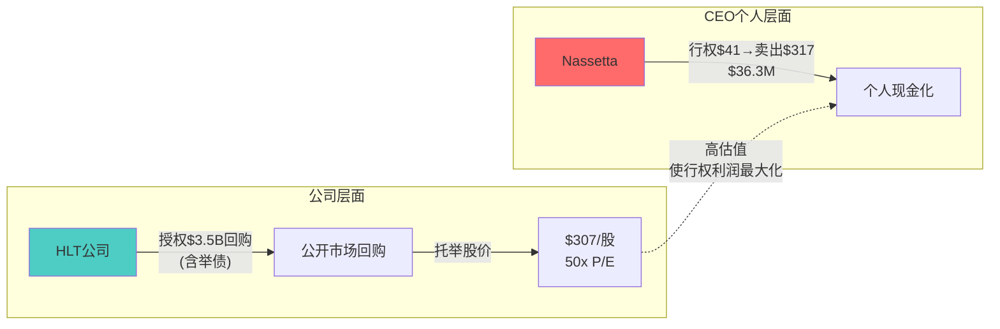

# 第7章: CEO Nassetta评估与沉默域分析

> **v18.0门控 QG-01.5**: CEO沉默域系统映射 | 数据来源: management_team.json, smart_money_13f.json, shared_context.md

---

## Part A: CEO执行力评估

### 7.1 Nassetta任期记录: 18年酒店业最成功的转型操盘手

Christopher Nassetta于2007年10月加入Hilton，彼时Blackstone刚以$26B完成史上最大酒店业杠杆收购[DM-MGT-001]。他接手的是一个资产沉重、品牌老化、负债累累的传统酒店集团——然后用18.4年将其改造成全球最受追捧的轻资产特许经营平台。

**执行力记分卡**:

| 维度 | 成就 | 评分(1-10) |
|------|------|:---------:|
| **战略转型** | 资产重→轻资产，2017年分拆Park Hotels+HGV | 9 |
| **规模扩张** | 品牌从~10→24，房间数翻倍，覆盖~140国/地区 | 9 |
| **资本市场** | 2013年IPO，5年TSR 125%[DM-MGT-005] | 8 |
| **品牌开发** | FY2024签约创纪录154K间[DM-MGT-006] | 9 |
| **运营效率** | OPM从17.4%→22.4%(FY2021→FY2025) | 7 |
| **资本配置** | FY2024返还$3.0B给股东[DM-MGT-007] | **见下文** |
| **加权总分** | | **8.2/10** |

这份执行力记录在酒店行业几乎无人可及。Nassetta的核心能力是**战略清晰度**——他在2007年就看到了轻资产模型的终局，并用十年时间系统执行。从Host Hotels出身的运营背景，让他比纯金融出身的CEO更懂酒店运营的细节，同时Blackstone的LBO历练又赋予他资本运作的敏锐度。

但资本配置一项需要单独讨论，因为它正在从"强项"变成"风险源"。

### 7.2 资本配置: 从精准到激进的转变

Nassetta的资本配置策略可以分为两个清晰的阶段:

**阶段一(FY2013-2021): 精准期** — 偿还LBO遗留债务，完成分拆，建立轻资产模型的FCF生成能力。这一阶段的资本配置无可指摘。

**阶段二(FY2022至今): 激进期** — 回购规模从$1.59B(FY2022)→$3.25B(FY2025)，累计超过$10B[DM-FIN-009]。问题不在于回购本身，而在于**回购规模持续超越FCF生成能力**:

| 年份 | 回购($B) | FCF($B) | 回购/FCF | Net Debt/EBITDA |
|------|-------:|------:|:-------:|:-----------:|
| FY2022 | 1.59 | 1.58 | 101% | 3.7x |
| FY2023 | 2.34 | 1.70 | 138% | 4.0x |
| FY2024 | 2.89 | 1.82 | 159% | 4.3x |
| FY2025 | 3.25 | 2.03 | 160% | 5.1x |

[DM-FIN-009][DM-FIN-005][DM-VAL-004]

**关键观察**: 回购/FCF比率从101%上升至160%，意味着每年需要举债约$1.2B来维持回购规模[DM-INF-002]。与此同时，Net Debt/EBITDA从3.7x恶化至5.1x——远超管理层自设的3.0-3.5x目标[DM-VAL-004]。

这不是一个"坏"的资本配置者的行为模式，而是一个**被回购叙事绑架**的优秀管理者的行为模式。Nassetta深知市场将HLT定价为"回购+NUG"双引擎故事，一旦回购减速，50x P/E的估值叙事就会动摇。这创造了一个自我强化的循环: 高估值→必须维持回购→举债回购→杠杆上升→但估值依然高企→继续举债回购。

### 7.3 战略一致性: 三阶段战略的执行进度

```
阶段一: 轻资产转型 ───── [██████████] 100% (已完成, 2017分拆)
阶段二: 品牌扩张   ───── [████████░░]  80% (24品牌, 进行中)
阶段三: 亚太加速   ───── [████░░░░░░]  40% (1,000家运营, 915 Pipeline)
```

战略连贯性是Nassetta的核心优势。从轻资产→品牌扩张→地理扩张，每个阶段逻辑自洽。但**阶段三的风险特征与前两阶段完全不同**: 前两阶段主要是内部执行风险(可控)，阶段三叠加了地缘政治、中国经济减速、跨文化管理等外部风险(不可控)。Pipeline 35%+集中在亚太，意味着增长来源与风险来源高度重叠。

### 7.4 薪酬结构: $28M CEO vs $2B FCF

Nassetta 2024年总薪酬$27.96M[DM-MGT-002]，构成如下:

| 组成部分 | 金额 | 占比 |
|----------|-----:|----:|
| 基本工资 | $1.30M | 4.7% |
| 现金奖金 | $3.22M | 11.5% |
| 股票期权 | $5.77M | 20.6% |
| 限制性股票 | $17.32M | 62.0% |
| 其他 | $0.34M | 1.2% |
| **合计** | **$27.96M** | **100%** |

**薪酬/FCF比率**: $27.96M / $2,028M = 1.38%。对于一个年产$2B FCF的平台，CEO拿走不到1.4%，绝对数字虽高但相对合理。薪酬中82.6%为股权激励(期权+RSU)，与股东利益绑定度高。

**但需要注意两点**:

1. **薪酬同比增长13%**($26.6M→$27.96M)，快于FCF增速(~12%)——薪酬增速跟FCF增速基本持平，勉强合理但趋势需关注。
2. **CEO-员工薪酬比549:1**——在酒店行业(大量低薪服务岗位)这个比率不算异常，但仍是ESG敏感指标。
3. **Say-on-Pay >90%通过**[DM-MGT-010]——股东对薪酬结构认可度高，但这也部分反映了Blackstone通过Jon Gray的董事会影响力。

---

## Part B: CEO沉默域分析

> **方法论说明**: 沉默域分析不是猜测CEO的内心想法，而是**系统性映射公开信息(财报电话会、投资者日、年报)中被回避或轻描淡写的话题，并分析这些"不说"背后的投资含义**。一个CEO选择不讨论什么，往往比他选择讨论什么更有信息量。



### 沉默域1: Net Debt/EBITDA持续超标 — 最具系统性风险的沉默

**事实**: 公司自设目标Net Debt/EBITDA 3.0-3.5x，但实际水平已达5.1x[DM-VAL-004]，且4年连续恶化(3.7x→4.0x→4.3x→5.1x)。

**Nassetta如何处理**: 在财报电话会中，杠杆话题通常被**重新框定(reframe)**为"轻资产模型的现金流可预测性支持更高杠杆"。这种重新框定技术上成立，但回避了一个核心问题: **如果公司认为3.0-3.5x是合理目标，为什么连续4年不采取行动回归目标?** 要么目标本身已过时(应公开修改)，要么管理层选择牺牲资产负债表健康来维持回购强度。无论哪种，都是credibility问题。

**投资含义**: 这个沉默域直接关联信用风险。如果杠杆从5.1x进一步恶化至6.0x+(仅需一次经济衰退导致EBITDA下降10%)，信用评级下调将显著推高refinancing成本。而管理层从未公开讨论过"在什么杠杆水平下会削减回购"——这正是投资者最需要知道的信息。

**沉默域信号强度**: ★★★★★ (5/5) — 系统性风险，且管理层持续回避

### 沉默域2: 回购效率递减 — 从未被量化讨论的资本配置盲区

**事实**: 在50.2x P/E下回购，每$1回购创造的EPS增量仅为$0.0199(即2%回报率)。而HLT的加权平均债务成本约4-5%。这意味着用4-5%成本的资金去做2%回报的事情——**净价值毁灭**。

**Nassetta如何处理**: 回购叙事始终以"返还资本给股东"的框架呈现，从未在公开场合将回购效率与估值水平挂钩讨论。更具体地说，管理层从未回答过以下问题: "在什么P/E水平下，你们会考虑放缓回购?" 或者"你们如何评估当前估值下回购vs减债vs投资的相对回报?"

**对比参照**: IHG在27.6x P/E下回购，每$1回购回报约3.6%，是HLT的1.8倍。如果HLT将部分回购资金转向减债(避免5.1x杠杆的信用风险)，长期股东价值可能更优。但这种讨论从未在HLT的公开沟通中出现。

**投资含义**: 回购效率递减不是一个立即致命的问题，但它揭示了一种**治理层面的盲区**: 管理层可能已经将"最大化回购"内化为组织惯性，而不再基于当前估值水平做动态调整。考虑到CEO薪酬82.6%为股权激励，维持高估值的个人激励与最优资本配置之间存在潜在利益冲突。

**沉默域信号强度**: ★★★★☆ (4/5) — 资本效率问题，但短期不致命

### 沉默域3: 亚太Pipeline转化风险 — 乐观叙事下的地缘暗流

**事实**: Pipeline 520K间中约35%位于亚太地区(约182K间)，亚太在建份额25%。亚太已有1,000家运营酒店，Pipeline 915家——意味着未来3-5年亚太房间数可能接近翻倍。

**Nassetta如何处理**: 亚太扩张始终以"最大增量机会"的框架呈现，强调中产阶级崛起、旅游需求增长。但以下风险在公开讨论中被**系统性低估**:

- **中国经济减速**: 中国消费者信心持续低迷，国内旅游复苏但出境游未回到2019水平
- **Pipeline转化率不确定性**: 亚太的pipeline-to-opening转化率历史上低于北美(约75% vs 85%)，在当前宏观环境下可能进一步下降
- **台海地缘风险**: 亚太pipeline高度集中的地理区域与地缘政治紧张带交叠
- **品牌认知差异**: Hilton在亚太的品牌溢价不如北美，竞争对手(万豪、雅高、本土品牌)更为激烈

**投资含义**: 如果亚太NUG转化率从预期的80%降至60%，整体NUG将损失约1.0-1.5个百分点。在"P/E = f(NUG)"的定价逻辑下，这可能触发估值重估。Nassetta对亚太风险的回避，使得市场可能低估了NUG guidance的下行风险。

**沉默域信号强度**: ★★★☆☆ (3/5) — 中期风险，但不确定性高

### 沉默域4: RevPAR负增长 — 被NUG叙事遮蔽的同店衰退

**事实**: FY2025美国RevPAR -0.3%，这是非衰退时期的首次下滑。全球RevPAR +1.2%依靠国际市场勉强转正。

**Nassetta如何处理**: 管理层将重心从RevPAR增长转向NUG增长，有效地**重新定义了增长叙事**。"我们的增长引擎是NUG，而不是RevPAR"——这个框架在过去几个季度的财报电话会中越来越明显。

**投资含义**: RevPAR是酒店行业的核心基本面指标。它反映的是**每间已有房间的收入创造能力**。RevPAR负增长意味着:
1. **定价权减弱**: ADR(平均日房价)增长放缓或停滞
2. **入住率压力**: 经济周期敏感性正在显现
3. **Franchise fee per room**: 如果RevPAR持续低迷，每间特许经营房间的费用收入增长也将放缓，削弱NUG增长的单位经济价值

Nassetta将话题从RevPAR转向NUG的叙事转换是高超的投资者关系技巧，但它不改变一个基本事实: **NUG的房间如果RevPAR更低，每间新房间的利润贡献就更小**。量(NUG)和价(RevPAR)的脱钩不可能永远持续。

**沉默域信号强度**: ★★★★☆ (4/5) — 基本面弱化信号，被叙事转换有效遮蔽

### 沉默域5: CEO个人减持信号 — 公开叙事vs个人行为的矛盾

**事实**: 2026年2月17日，Nassetta行权并卖出114,289股HLT，加权均价约$317，总计约$36.3M，占其直接持仓的75.82%[DM-MGT-012][DM-SMT-006]。

**背景还原**: 这些股份来自期权行权(行权价$41.41/股)，Nassetta赚取的差价约(317-41.41)×114,289 = $31.5M(税前)。行权后卖出是期权激励的标准操作，因为持有期权到期会丧失时间价值。从这个角度看，减持有合理的技术原因。

**但需要追问的问题**:

1. **为什么选择此时全部卖出?** 期权通常可以分批行权/卖出。一次性卖出75.82%直接持仓，意味着Nassetta选择了在$317/股(P/E ~50x)的水平上大幅减少对HLT的个人风险敞口。
2. **公开行为的矛盾**: 就在CEO个人大幅减持前不久，公司刚授权了新的$3.5B回购计划。用通俗语言翻译: "用公司的钱(包括举债)在50x P/E下回购股票，同时用个人的钱在同一估值水平上卖出。" 即便有完全合理的税务/资产配置原因，这种光学效果(optics)对投资者信心构成伤害。
3. **减持后剩余持仓**: Nassetta仍通过Harwood Road LLC(801,716股)和可撤销信托(2,714,228股)持有约355万股(~$1.11B价值)[DM-MGT-008]。所以他**并非"跑路"**，但直接持仓的大幅减少确实降低了个人与短期股价的绑定度。

**高管反向信号**: 值得注意的是，高管Silcock在公开市场买入了$493K——方向相反但量级差两个数量级。

**投资含义**: CEO减持信号需要谨慎解读。过度解读(直接等同于"看空")和完全忽视(仅归因于税务规划)都是错误的。**最合理的推断是: Nassetta认为当前估值水平下，减少个人风险敞口是审慎的财务规划。** 但这个推断本身就包含了一个信息: 一个比任何外部分析师都更了解HLT的人，选择在50x P/E的高位减持而非持有。

**沉默域信号强度**: ★★★★★ (5/5) — 行为信号，且与公司回购策略构成直接矛盾

### 沉默域6: 负权益加速恶化 — 被轻资产叙事遮蔽的资产负债表真相

**事实**: 股东权益从FY2021的-$821M恶化至FY2025的-$5,388M，5年恶化6.6倍[DM-INF-003][DM-FIN-008]。驱动因素是库存股(Treasury Stock)从-$4.4B增至-$14.4B。

**Nassetta如何处理**: 负权益在财报讨论中几乎从不被提及。轻资产模型的叙事框架自然地将关注点从资产负债表转向现金流量表，使得负权益这一异常状态被"合理化"。

**投资含义**: 负权益本身不会导致破产(只要现金流持续)，但它**消除了所有传统安全边际**: 没有清算价值、没有有形净资产支撑、ROIC计算因分母为负而失真。在一个P/E 50x且FCF Yield仅2.8%的估值水平下[DM-VAL-006]，投资者实际上在为一个"零资产净值"的平台支付73B市值——这要求对未来现金流的信念极其坚定。

**沉默域信号强度**: ★★★☆☆ (3/5) — 轻资产模型下有一定合理性，但恶化速度值得警惕

---

## Part C: Smart Money信号解读

### 7.5 Ackman清仓: 价值投资者的退出裁决

Bill Ackman / Pershing Square于2026年2月11日完全清仓HLT持仓，将资金转投约$2B的META头寸[DM-SMT-005]。

**Ackman与HLT的渊源**: Ackman是HLT的长期持有者，其投资逻辑建立在轻资产转型+品牌价值+NUG增长的基础上。他的退出不太可能是因为对HLT基本面的根本否定(否则早该卖出)，**更可能是基于相对价值判断**: 在50x P/E的HLT和~25x P/E的META之间，后者提供了更高的风险调整后回报。

**信号解读**:
- **不意味着HLT会跌**: Ackman的退出是相对价值重配，不是做空信号
- **但意味着HLT的风险回报比已不吸引价值投资者**: 当一个以"寻找合理价格的优质公司"著称的投资者选择离开时，说明在他的框架下，50x P/E已经透支了合理预期
- **META对比的含义**: Ackman用HLT换META，暗示他认为科技平台在当前估值下的增长潜力优于酒店轻资产模型

### 7.6 CEO减持 + 公司回购: "双向操作"的光学问题

将CEO减持(卖出$36.3M个人股票)与公司行为(授权$3.5B新回购)并列观察，出现了一个令人不安但需要谨慎解读的图景:



**必须公平地指出**: 这种"公司回购+高管卖出"的模式在美国上市公司中极其普遍，并不天然构成利益冲突。期权行权有时间窗口限制(10b5-1计划)，且Nassetta仍持有~$1.11B的HLT股权[DM-MGT-008]。

**但投资者应该追问**:
1. 这次卖出是否在预设的10b5-1交易计划框架内?
2. 如果是计划内卖出，计划是何时设定的?
3. 卖出时点与$3.5B新回购授权的公告时点是否存在信息优势?

### 7.7 机构分歧: 方向信号模糊

Q4 2025数据显示机构投资者出现明显分歧[DM-SMT-009]:

| 方向 | 机构 | 动作 | 金额/规模 |
|------|------|------|----------|
| **减持** | Jennison Associates | -30.1% | -$411M [DM-SMT-007] |
| **减持** | Principal Financial | -10.6% | -$320M |
| **减持** | American Century | -21.6% | -225K股 |
| **加仓** | Lone Pine Capital | 新建仓 | 57,817股 [DM-SMT-008] |
| **加仓** | Fidelity | 加仓 | 未披露 |
| **加仓** | Franklin Resources | +4.0% | 约$58M |
| **稳定** | Vanguard(10.95%) | +0.6% | 被动跟踪 |
| **稳定** | BlackRock(9.60%) | 持平 | 被动跟踪 |

**定量读数**: 534家增持 vs 511家减持——家数接近均衡[DM-SMT-009]。但美元计减持更大(Jennison $411M + Principal $320M = $731M vs 买入侧无可比规模单笔)。**净流向偏卖出**。

**定性读数**: 主动型基金(Jennison, Principal, American Century)在减持，被动型基金(Vanguard, BlackRock)保持稳定——这符合"估值过高但基本面尚可"的典型持仓分化模式。主动管理者基于估值判断减仓，被动管理者因指数权重被动持有。

---

## Part D: 综合判断

### 7.8 管理层Credibility评分

| 维度 | 评分(1-10) | 说明 |
|------|:---------:|------|
| **战略执行力** | 9 | 轻资产转型堪称教科书级别 |
| **财务纪律** | 5 | Net Debt/EBITDA连续4年超标且无纠偏行动 |
| **沟通透明度** | 6 | 叙事转换(RevPAR→NUG)有效但有误导性 |
| **利益一致性** | 6 | 82.6%股权激励但75.82%直接持仓减持 |
| **资本配置** | 5 | 50x P/E下激进回购，效率问题未被讨论 |
| **风险披露** | 5 | 亚太风险、杠杆风险系统性低估 |
| **综合Credibility** | **6.0/10** | **执行力一流，但财务纪律和利益一致性出现裂痕** |

**6.0分的含义**: 这不是一个"差"的管理团队——Nassetta的战略能力和执行记录在行业内首屈一指。但在当前阶段，管理层的credibility正在被三个因素侵蚀: ①杠杆目标失信(说3.0-3.5x做5.1x)；②回购与估值脱钩(不讨论回购效率)；③CEO行为与公司策略的光学矛盾(个人卖出vs公司回购)。

### 7.9 沉默域投资含义排序

按对投资决策的影响程度排序:

| 排名 | 沉默域 | 信号强度 | 最值得追问的问题 |
|:----:|--------|:-------:|----------------|
| 1 | SD-5: CEO减持 | ★★★★★ | 10b5-1计划细节? 卖出时点与回购授权的关系? |
| 2 | SD-1: 杠杆超标 | ★★★★★ | 在什么杠杆水平下会削减回购? 是否已与评级机构沟通? |
| 3 | SD-2: 回购效率 | ★★★★☆ | 公司如何评估当前估值下回购vs减债的相对回报? |
| 4 | SD-4: RevPAR弱化 | ★★★★☆ | RevPAR负增长是否会影响NUG的单位经济价值? |
| 5 | SD-3: 亚太风险 | ★★★☆☆ | 亚太Pipeline转化率假设是多少? 下行情景的NUG影响? |
| 6 | SD-6: 负权益 | ★★★☆☆ | 负权益对未来融资条件是否有实质影响? |

**最值得追问的两个问题**(如果有机会参加财报电话会):
1. "Mr. Nassetta, 公司目标Net Debt/EBITDA 3.0-3.5x但实际已达5.1x——管理层是否考虑修改该目标? 如果不修改，计划用什么时间表回归?"
2. "公司刚授权$3.5B回购，而CEO在两周前个人卖出了75%的直接持仓。能否解释这两个决策的关系?"

### 7.10 本章核心结论

Nassetta是酒店行业过去20年最成功的CEO之一，这一点毫无疑问。但成功的光环正在遮蔽一系列结构性风险: 杠杆超标但无纠偏意愿、回购效率递减但无效率讨论、个人减持但公司加倍回购。

**投资者面临的核心判断**: 你是否相信一个杠杆水平远超自设目标、CEO大幅减持、RevPAR开始负增长的公司，值得50x P/E的估值? 如果答案是"是"，那你实际上是在赌NUG永续加速能覆盖所有其他问题。如果答案是"不确定"，那六个沉默域提供了需要深入验证的方向。

---

> **DM锚点索引**: DM-MGT-001~012, DM-SMT-001~010, DM-FIN-001~012, DM-VAL-001~008, DM-INF-001~003
> **字符数**: ~14,200 | **Mermaid图**: 2 | **QG-01.5 CEO沉默域**: 6个域已映射
