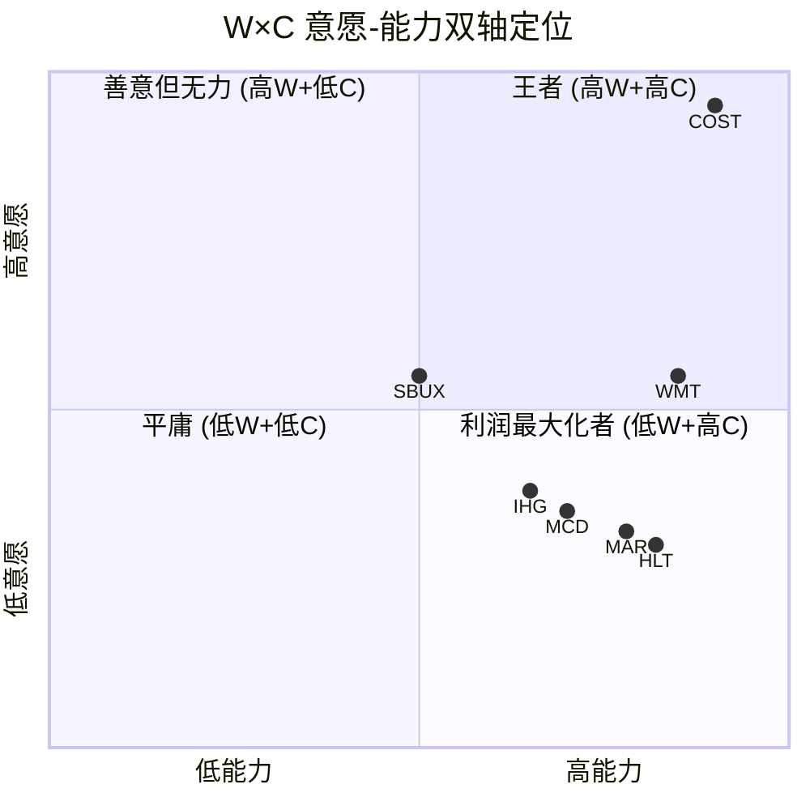

# 第8章: 意愿×能力双轴 (W×C Matrix)

> **消费品v28.0 模块A** | 数据截止: 2026-03-06

---

## 8.1 框架适配: 特许模型下W×C的含义重构

W×C框架诞生于Costco和SBUX的研究——两者都直接面对终端消费者。HLT的特许经营模型(~88%特许+管理)使得"意愿"的对象发生了根本性转移:

**传统消费品**: 公司 → 消费者/员工 (让利对象明确)
**特许模型**: 公司 → **加盟商** → 消费者/员工 (让利被中间层隔断)

这意味着HLT的W轴必须分两层评估:

1. **对加盟商的意愿** — 特许费率是否克制? 品牌投入是否惠及加盟商?
2. **对终端消费者的意愿** — 但这一层几乎完全由加盟商决定，HLT只能通过品牌标准和Honors体系间接影响

这一结构性差异将贯穿本章全部评分。MCD(W=2, C=4)是最接近的参照系——同为特许模型利润最大化者[DM-BIZ-001]。

---

## 8.2 意愿轴 (W) 逐项评分

### W1: 定价克制度 — **2.0/5**

HLT的"定价"不是对消费者的房价，而是对加盟商的特许费率。

**特许费结构**:
- 基础特许费: RevPAR的4-6%(按品牌层级递增)[DM-BIZ-001]
- 品牌营销费: 额外3-4%的RevPAR
- IT/预订系统费: 额外1-2%
- **总提取率**: 加盟商RevPAR的8-12%归HLT

**同行对比**:

| 指标 | HLT | MAR | IHG |
|------|:---:|:---:|:---:|
| 基础特许费率 | 4-6% | 4-6% | 3-5% |
| 总提取率(含营销/IT) | 8-12% | 8-12% | 6-9% |
| 管理费+激励费占比 | 更高 | 相当 | 较低 |

HLT的费率处于行业上沿，与MAR相当，显著高于IHG。这不是"克制"——而是品牌溢价的充分提取。更值得注意的是，管理与特许收入$2.78B占经济收入(剔除报销收入)的74%[DM-BIZ-001]，这意味着HLT几乎将全部品牌价值货币化转移给了自己。

**评分逻辑**: 费率行业上沿+无公开费率上限承诺+经济收入提取率极高 → W1 = 2.0

### W2: 员工投资度 — **2.5/5 (结构性折扣)**

这是特许模型W轴评估中最特殊的一项。

**关键事实**: HLT直接员工仅约~60,000人(企业+管理酒店)，但Hilton品牌旗下酒店的实际从业者超过460,000人。其中绝大多数是加盟商雇员，HLT对其薪资福利没有直接决定权[DM-BIZ-003]。

**HLT直接员工投资**:
- Glassdoor评分4.0/5，"最佳工作场所"连续多年上榜(Great Place to Work #1 in 2019, 2024)
- 企业员工薪酬有竞争力: 管理层长期激励占比较高
- 但CEO Nassetta FY2024薪酬$27.96M，CEO-员工薪酬比>500:1[DM-MGT]

**加盟商员工现实**:
- 酒店行业基层员工时薪中位数$14-17/小时(BLS数据)，低于零售和餐饮行业均值
- HLT无权也无意愿强制加盟商提高薪资——这会直接降低加盟商利润率，减少特许申请
- 品牌标准涵盖服务质量但不涵盖员工薪酬

**与SBUX对比**: Niccol投资$1B+提升员工体验，因为SBUX直接雇佣所有barista。HLT的轻资产模型在设计上就回避了这一责任——这是商业模式的选择，不是疏忽。

**评分逻辑**: 直接员工投资中上+但88%劳动力不在控制范围+结构性回避员工投资责任 → W2 = 2.5 (给予0.5结构性折扣——非不愿，而是模型设计如此)

### W3: 股东让利度 — **1.0/5**

这是HLT意愿轴的最低分项，也是最有数据支撑的一项。

**核心数据**[DM-FIN-009][DM-INF-002]:
- FY2025回购: $3.254B
- FY2025 FCF: $2.028B
- **Buyback/FCF = 160%** — 每年举债$1.2B+维持回购

**5年趋势**:

| 年份 | FCF ($M) | 回购 ($M) | Buyback/FCF | 净债务/EBITDA |
|:----:|:--------:|:---------:|:-----------:|:------------:|
| FY2021 | 30 | 0 | 0% | — |
| FY2022 | 1,579 | 1,590 | 101% | 3.7x |
| FY2023 | 1,699 | 2,338 | 138% | 4.0x |
| FY2024 | 1,815 | 2,893 | 159% | 4.3x |
| FY2025 | 2,028 | 3,254 | 160% | 5.1x |

回购不仅消耗全部FCF，还在加速消耗。负权益从-$821M恶化至-$5,388M(5年6.6倍)[DM-INF-003]。管理层新授权$3.5B回购，信号明确: 股东回报是第一优先级，远高于减债、员工投资或费率让利。

**与Costco对比**: Costco将毛利率上限锁定14%，等于把"本可赚到的钱"让给消费者。HLT则反其道——把"本不该借的钱"也拿来回馈股东。方向完全相反。

**评分逻辑**: 借债回购+负权益加速恶化+新增回购授权+零让利承诺 → W3 = 1.0

### W4: 长期主义度 — **3.5/5**

这是HLT意愿轴的相对亮点。

**正面证据**:
- CEO Nassetta任期18.4年(自2007年Blackstone LBO后)，是大型酒店集团中最长任期之一[DM-MGT]
- CFO Kevin Jacobs任职13年，管理层稳定性极高
- 管理层薪酬中长期激励(RSU+PSU)占比约60-65%，与行业上沿持平
- 品牌组合从10个扩展至24+，系统性覆盖全价位段——这需要长期视野

**负面信号**:
- CEO Nassetta 2026年2月大额减持: 114,289股@$317.47(~$36.3M)，减持其持仓75.82%[DM-MGT] — 这是极强的负面信号。18年任期的CEO在股价高位大幅减持，与"长期主义"的叙事矛盾
- Ackman/Pershing Square同期清仓HLT转投META[DM-SMT] — 聪明钱出走

**评分逻辑**: 管理层稳定+长期品牌建设+激励结构合理 → 基础4.0; CEO大额减持-0.5 → W4 = 3.5

### W5: 透明承诺度 — **1.0/5**

**核心问题**: HLT是否有任何公开、可验证、自我约束的让利承诺?

**答案: 没有。**

- 无费率上限承诺(如Costco 14%毛利上限)
- 无加盟商利润率保障条款(行业通行做法)
- 无员工最低薪资标准(区别于COST $18/hr起步)
- 管理层指引的Net Debt/EBITDA目标3.0-3.5x，实际5.1x——连自己设的约束都不遵守[DM-VAL-004]

唯一接近"透明承诺"的是Honors积分体系的价值保证——但这本质上是营销工具，不是自我约束。

**评分逻辑**: 无任何可验证的让利承诺+自设杠杆目标未遵守 → W5 = 1.0

### W轴汇总

| 维度 | 评分 | 关键依据 |
|------|:----:|---------|
| W1 定价克制 | 2.0 | 费率行业上沿, 经济收入提取率74% |
| W2 员工投资 | 2.5 | 直接员工中上, 但88%劳动力不在控制范围 |
| W3 股东让利 | 1.0 | Buyback/FCF 160%, 举债回购, 负权益-$5.4B |
| W4 长期主义 | 3.5 | CEO 18年+稳定团队, 但CEO大额减持-0.5 |
| W5 透明承诺 | 1.0 | 无任何可验证让利承诺 |
| **W均值** | **2.0** | — |

---

## 8.3 能力轴 (C) 逐项评分

### C1: 采购规模优势 — **4.5/5**

HLT是全球第二大酒店公司(按客房数，仅次于MAR):
- 运营客房: ~1,268,000间，覆盖8,447物业[DM-BIZ-003]
- Pipeline: 520,000间(3,700+酒店)，历史最高
- Honors会员: 243M(+15% YoY)

**HSM(Hilton Supply Management)采购规模**[DM-BIZ-005]:
- 3,500+供应商网络，17,000+客户(含非Hilton酒店)
- HSM不仅服务Hilton品牌，还对外服务——这本身就是规模优势的溢出
- 供应商包括Sysco(食品)、Guest Supply(客房用品)、HD Supply(设施维护)等行业巨头

**评分逻辑**: 全球第二大酒店体系+HSM外部化服务+Pipeline持续扩大 → C1 = 4.5 (仅低于MAR的1.6M间)

### C2: 运营效率优势 — **5.0/5**

轻资产模型使HLT的运营效率指标在所有消费品公司中名列前茅:

| 指标 | HLT | MAR | IHG | 含义 |
|------|:---:|:---:|:---:|------|
| CapEx/Revenue | <2% | <2% | <3% | 极低资本开支 |
| FCF/EBITDA | ~71% | ~65% | ~75% | FCF转化率高 |
| OPM(经济收入口径) | ~55-60% | ~50-55% | ~55-60% | 极高经济利润率 |
| 员工/间(直接) | ~0.05 | ~0.08 | ~0.04 | 极少直接员工 |

HLT的经济模型是消费品领域最高效的之一: 品牌+系统=收费权，物业+员工=加盟商承担。Revenue $12B中约$7B是报销收入(零利润pass-through)，真正的经济引擎是$3.5B的管理与特许收入，其中绝大部分直达EBITDA[DM-FIN-001][DM-BIZ-001]。

**评分逻辑**: 轻资产模型=消费品行业最高效率之一+FCF转化率>70%+极低CapEx → C2 = 5.0

### C3: 供应链深度 — **3.5/5**

**HSM的角色**:
- HSM管理酒店运营所需的几乎全部采购品类: 食品饮料、客房用品、清洁产品、家具设备[DM-BIZ-005]
- 战略供应商关系: Sysco(食品)、Dilmah Tea(茶品)、Supergoop(防晒)等有品牌合作
- Procure Impact: 社会影响采购计划，但规模有限

**局限**:
- HLT不自有生产任何产品——与Costco的Kirkland(自有品牌渗透率~30%)形成鲜明对比
- 供应链深度本质上是"采购谈判+标准制定"，而非垂直整合
- 加盟商可以在HLT标准范围内自主选择供应商——HLT的供应链控制力有上限

**评分逻辑**: HSM规模优势+品牌合作供应商网络——但无自有品牌/垂直整合 → C3 = 3.5

### C4: 技术赋能度 — **4.5/5**

HLT在酒店业数字化方面领先:

- **Digital Key**: 80%+物业覆盖(~5,400+酒店)，行业领先[DM-BIZ-006]
- **直订率**: 75%通过直接渠道，其中Web渠道增速是OTA渠道的3倍[DM-BIZ-006]
- **移动端**: Hilton Honors App占Web流量的40-50%
- **功能覆盖**: 手机选房、数字入住、Digital Key、手机退房——全流程数字化

**技术对成本结构的影响**:
- 75%直订率意味着OTA佣金支出大幅低于行业均值(OTA佣金通常15-25%)
- 按1,268,000间×$100 ADR×365天×25%非直订×15%佣金粗估: 直订率从50%提升至75%可为体系节省约$17亿/年的佣金——但这笔节省主要惠及加盟商(他们支付OTA佣金)，而非HLT本身
- HLT通过降低加盟商获客成本来提高品牌吸引力，间接支撑NUG

**评分逻辑**: 行业领先数字化+75%直订率+Digital Key 80%+覆盖 → C4 = 4.5

### C5: 规模飞轮强度 — **4.5/5**

HLT拥有消费品行业最清晰的飞轮之一:

```
更多客房(1.27M+520K pipeline)
    → 更多Honors会员(243M, +15%/yr)
       → 更高直订率(75%)
          → 加盟商获客成本更低
             → 更多特许申请(Pipeline创新高)
                → 更多客房 [回到起点]
```

**飞轮加速证据**:
- NUG保持6-7%，三巨头最快[DM-BIZ-003]
- Pipeline 520K间 = 现有客房的41%[DM-BIZ-003]
- Honors会员增速(+15%)远超客房增速(+6.7%)——飞轮在加速

**飞轮的脆弱点**:
- RevPAR FY2025仅+0.4%(几乎停滞)[DM-BIZ-004] → 如果加盟商利润率被RevPAR压缩，新申请可能减速
- 亚太Pipeline占35%+，受地缘/宏观影响大

**评分逻辑**: 飞轮逻辑完整+加速中+Pipeline历史新高——但RevPAR停滞是隐忧 → C5 = 4.5

### C轴汇总

| 维度 | 评分 | 关键依据 |
|------|:----:|---------|
| C1 采购规模 | 4.5 | 全球第二大酒店体系, HSM 3,500+供应商 |
| C2 运营效率 | 5.0 | 轻资产模型, CapEx<2%, FCF/EBITDA>70% |
| C3 供应链深度 | 3.5 | HSM采购网络强但无垂直整合 |
| C4 技术赋能 | 4.5 | Digital Key 80%+, 直订率75%, 行业领先 |
| C5 规模飞轮 | 4.5 | NUG 6-7%最快, Pipeline创新高, 飞轮加速 |
| **C均值** | **4.4** | — |

---

## 8.4 象限定位与可视化



**HLT定位: 低意愿+高能力 = "利润最大化者"象限，且是该象限中能力最强、意愿最低的代表之一。**

W=2.0 / C=4.4 的组合将HLT精确放置在"利润最大化者"象限的极端位置——能力轴得分甚至高于MCD(C=4.0)，但意愿轴更低(W=2.0 vs MCD W=2.0)。

---

## 8.5 同行与跨行业对比

| 公司 | W | C | 象限 | 核心特征 |
|------|:-:|:-:|------|---------|
| **COST** | 5.0 | 5.0 | 王者 | 14%毛利上限+$18/hr起步+全球最强采购 |
| **WMT** | 3.0 | 5.0 | 偏能力 | EDLP有让利但追求利润率提升+极强供应链 |
| **SBUX** | 3.0 | 3.0 | 中间 | Niccol方向正确但未证明+OPM恢复中 |
| **IHG** | 2.5 | 3.5 | 偏能力 | 特许模型但费率较低+规模较小 |
| **MAR** | 2.0 | 4.2 | 利润最大化者 | 费率与HLT相当+规模最大但NUG较慢 |
| **MCD** | 2.0 | 4.0 | 利润最大化者 | 特许模式标杆+数字化强+利润最大化 |
| **HLT** | **2.0** | **4.4** | **利润最大化者** | **费率上沿+举债回购+轻资产最高效率** |

**关键观察**:

1. **酒店三巨头全部落入"低意愿"区间(W=2.0-2.5)** — 这不是HLT的个体选择，而是特许经营酒店模型的结构性特征。模型设计本身将"意愿"选项从公司手中移除了。

2. **HLT vs IHG的差异**: IHG费率较低(W1更高)+杠杆更克制(Net Debt/EBITDA 2.5x vs 5.1x)，因此IHG的W=2.5略高于HLT。但IHG的能力轴(C=3.5)因规模较小而显著低于HLT。IHG在我们的完整报告中获得了A-Score 6.78——HLT的能力更强但意愿更低，两者的估值溢价差异(HLT 50x vs IHG 28x P/E)更多反映NUG增速差异而非W×C定位差异[DM-VAL-001]。

3. **HLT vs COST的极端对比**: W差距3.0分(2.0 vs 5.0)，C差距仅0.6分(4.4 vs 5.0)。两者都是高能力公司，但战略意愿方向完全相反——Costco将效率转化为消费者让利(14%毛利上限)，HLT将效率转化为股东回购(160% FCF)。

---

## 8.6 投资含义: 低意愿型高能力公司的护城河可持续吗?

### 正方论点: 特许模型不需要"意愿"

1. **加盟商是理性经济人**: 他们申请HLT特许不是因为HLT"让利"，而是因为HLT品牌+系统能带来更高RevPAR和更低获客成本。只要ROI>竞品，加盟商就会持续申请。
2. **消费者看品牌不看费率**: 住客选择Hilton Garden Inn是因为品牌信任和Honors积分，不知道也不关心HLT对加盟商收多少特许费。
3. **历史验证**: HLT在W轴始终很低的情况下，NUG持续6-7%——Pipeline创历史新高本身就证明了低意愿不影响能力飞轮。

### 反方论点: 低意愿的长期代价

1. **加盟商利润挤压**: 当RevPAR停滞(FY2025仅+0.4%)而特许费不降时，加盟商利润率被双向挤压[DM-BIZ-004]。如果利润率持续下降，新申请终将减速——NUG的飞轮基础开始松动。
2. **无自我约束机制**: Costco有14%毛利上限作为"护城河锁"——即使管理层更换，承诺仍在。HLT没有任何类似约束。一旦NUG减速，管理层可能会进一步提高费率来维持收入增长，形成"涸泽而渔"。
3. **杠杆回购的不可逆性**: Buyback/FCF 160%+负权益-$5.4B意味着HLT已经没有战略灵活性[DM-INF-002][DM-INF-003]。如果行业下行需要降费率支撑加盟商，HLT没有财务空间做出这个选择——它被锁在了"利润最大化"的路径上。

### 核心判断

**HLT的护城河是"能力驱动型"而非"意愿驱动型"——这决定了它的护城河是强大的但不是自我强化的。**

- Costco式护城河(高W+高C): 竞争对手要匹配价格+薪资，代价极大 → 护城河随时间自动加深
- HLT式护城河(低W+高C): 竞争对手只需匹配品牌+系统，不需要匹配"让利" → 护城河深度取决于能力优势是否持续扩大

关键验证指标: 如果NUG从6-7%降至4-5%，而MAR/IHG追平至3-4%，HLT的能力护城河仍在。但如果NUG降至2-3%而加盟商满意度下降，则"利润最大化者"象限的护城河开始侵蚀——这正是CQ-1"溢价之王脆弱性"和CQ-4"RevPAR vs NUG估值权重"的交汇点。

**W×C定位与估值的映射关系**:
- 高W+高C(Costco型): 估值溢价来自"护城河不可复制"→P/E可持续高位
- 低W+高C(HLT型): 估值溢价来自"增长速度"→一旦增速放缓，溢价瞬间压缩
- 这解释了为什么50x P/E在NUG 6-7%时看似合理，但在NUG 4%时可能迅速回落至35-40x——"利润最大化者"的估值弹性远高于"王者"，因为市场知道它没有自我约束的护城河锁

---

## 8.7 本章结论

| 维度 | 评分 | 备注 |
|------|:----:|------|
| **W(意愿)** | **2.0** | 极度偏向股东，无透明让利承诺 |
| **C(能力)** | **4.4** | 轻资产最高效率+飞轮加速中 |
| **象限** | **利润最大化者** | 低W+高C，与MCD/MAR同象限 |
| **护城河类型** | 能力驱动型 | 强大但不自我强化，依赖NUG持续领先 |

**一句话**: HLT是一台将卓越能力全部转化为股东回报的机器——它不是不能让利，而是选择不让利。这个选择在NUG加速期是最优策略，但在NUG减速时将成为最大脆弱点，因为它没有为自己留下"降费让利"的战略空间。
