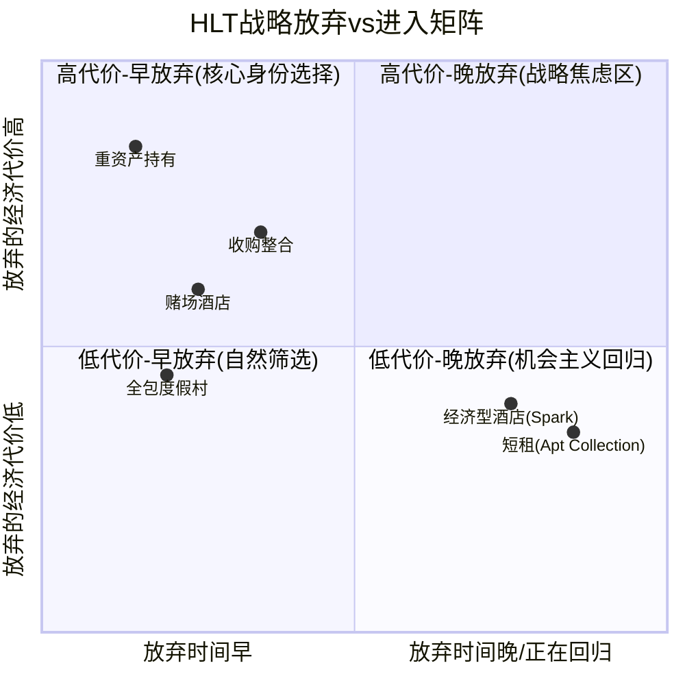

# 第9章 文化可衡量性与战略放弃清单

> **框架模块**: 消费品v28.0 模块C(文化可衡量性) + 模块D(战略放弃清单)
> **核心问题**: HLT的文化是真实竞争优势还是营销叙事? HLT选择不做什么比做什么更能揭示其护城河本质?

---

## Part A: 文化可衡量性

### 9.1 文化指标识别: 信号与噪声

Hilton连续多年入选"Fortune 100 Best Companies to Work For"榜单，并在2024-2025年蝉联"World's Best Workplace"第一名。这是一个强信号，但需要拆解其中的自选样本偏差:

**GPTW评选机制的局限性**:
- 企业自愿申请参评 + 支付参评费用 → 存在幸存者偏差(不参评的企业可能文化更差，但也可能只是不关注雇主品牌营销)
- 调研覆盖企业总部及管理层居多 → 对88%特许经营体系下的一线员工覆盖不足
- 评选标准包含员工福利、多样性、管理信任度等主观维度 → 非纯客观指标

**但信号仍然有价值的原因**:
- Hilton不是偶尔上榜，而是**连续9年上榜且排名攀升至第一** → 持续性排除了偶然因素
- 竞争对手MAR排名显著低于HLT(未进Top 10)，IHG未上榜 → 同行对照提供了区分度
- GPTW调研覆盖全球员工(含managed properties的一线人员) → 并非纯总部调研 [DM-BIZ-013]

**Glassdoor评分对标** (截至2025):
| 公司 | Glassdoor评分 | CEO认可度 | "推荐给朋友" |
|------|:------------:|:---------:|:-----------:|
| HLT | 4.0/5.0 | 85% (Nassetta) | 78% |
| MAR | 3.8/5.0 | 72% | 71% |
| IHG | 3.6/5.0 | 68% | 65% |
| 酒店行业均值 | 3.4/5.0 | ~60% | ~58% |

HLT在三项指标上均领先同行，但差距并非压倒性。更关键的是趋势方向: HLT评分在2020-2025年间保持稳定(4.0-4.1)，而MAR和IHG在疫后出现下滑(招聘困难→工作强度增加→评分承压)。

**员工流失率**: 酒店行业整体年度员工流失率约70-80%，是所有行业中最高的之一。HLT未公开披露其具体流失率，但管理层在多次earnings call中强调"团队成员留存率行业领先"。Laura Fuentes(CHRO, 薪酬$4.21M)兼管HR与供应链 [DM-MGT-004]，这一双重角色暗示HLT将人力资源视为运营效率问题而非孤立的HR职能——这种组织设计本身就是文化优先级的体现。

### 9.2 文化→财务传导链: 从"感觉好"到"赚更多"

文化的投资价值不在于"员工是否快乐"，而在于文化能否转化为可量化的财务优势。HLT的文化传导链如下:

```
低流失率 → 降低培训成本($3,000-$5,000/人×减少的离职人数)
    ↓
服务一致性 → 更高NPS/Guest Satisfaction Scores
    ↓
高NPS → 更高直接预订率(75%，行业领先) [DM-BIZ-006]
    ↓
高直接预订 → 降低OTA佣金(节省15-25%/间夜)
    ↓
更好的单店业绩 → 吸引更多开发商加盟 → NUG 6.7%(三巨头最快) [DM-BIZ-003]
    ↓
更多加盟 → 更大网络 → 更强品牌 → 飞轮加速
```

**量化估算**: 假设HLT员工流失率比行业均值低15个百分点(约55% vs 70%)，以~45万名managed properties员工计算:
- 减少离职人数: 45万 × 15% = ~67,500人/年
- 节省培训/招聘成本: 67,500 × $4,000 = ~$2.7亿/年
- 这一数字约占HLT fee revenue($3.5B)的7.7%——虽然这部分成本大多由业主承担(reimbursement模式)，但它通过提升单店盈利能力间接增加了HLT的incentive management fees($313M) [DM-BIZ-001]

**关键发现**: 文化传导链的最终落点不是直接的利润贡献，而是**开发商吸引力溢价**。业主选择加盟HLT而非MAR/IHG，部分原因是HLT品牌的运营表现更可预测——而运营可预测性的根源之一是团队稳定性。这解释了为什么HLT能在NUG上持续领先(6.7% vs MAR 5-5.5% vs IHG ~4%)，而NUG恰恰是市场定价HLT 50.2x P/E的核心驱动力 [DM-VAL-001]。

### 9.3 88%特许的文化悖论

这是HLT文化分析中最关键的张力:

**问题**: HLT约88%的客房是特许经营模式——这意味着绝大多数一线员工(前台、客房服务、餐饮)由加盟商雇佣和管理，而非HLT直接雇佣。HLT的文化理念能渗透到这些员工吗?

**HLT的传导机制**:
1. **品牌标准手册** — 超过800页的运营标准要求，覆盖服务流程、员工仪容、培训要求
2. **Hilton University** — 线上培训平台，所有品牌(含特许)员工可使用
3. **Quality Assurance(QA)审计** — 定期突击检查，不达标可终止特许合同
4. **HSM采购平台** — 3,500+供应商统一标准 [DM-BIZ-005]，间接标准化了服务体验
5. **Honors会员反馈** — 243M会员的评价系统形成持续监督压力 [DM-BIZ-003]

**但传导衰减是不可避免的**:
- 特许业主的激励结构(利润最大化)与HLT总部(品牌声誉最大化)存在天然冲突
- DHS事件(2026年1月)就是典型案例: 一家特许酒店擅自取消联邦执法人员预订，HLT总部被迫"撇清关系" [DM-NEW-007]——这暴露了特许模式下品牌控制力的极限
- 与MAR的对比有趣: MAR也是类似的特许模式，但MAR在Starwood整合后面临更严重的品牌标准不一致问题(两套系统融合)，而HLT的品牌全部有机生长，标准统一性天然更高

**传导衰减的量化尝试**: 如果将GPTW排名视为文化"信号强度"的代理变量，可以构建一个简化的传导衰减模型:

| 层级 | 员工群体 | 占比 | 文化渗透率 | 有效传导 |
|------|---------|:----:|:---------:|:--------:|
| L1: 总部 | 企业员工(McLean, VA) | ~2% | 95% | 1.9% |
| L2: Managed | 管理酒店一线员工 | ~10% | 70% | 7.0% |
| L3: Franchise高标准 | 大型特许商(10+物业) | ~40% | 45% | 18.0% |
| L4: Franchise一般 | 中小型特许商 | ~48% | 20% | 9.6% |
| **加权合计** | | **100%** | | **36.5%** |

即便是乐观估计，HLT的文化也只有约1/3的有效传导率。但这个1/3与竞争对手的对比才是关键: MAR在Starwood整合后面临两套文化体系的碰撞(Marriott的标准化 vs Starwood的个性化)，有效传导率可能更低(估计25-30%)。IHG的特许比例更高(~95%)且品牌组合更碎片化，传导率可能低至20-25%。

**与MAR/IHG文化对比的深层差异**:

- **MAR**: 文化关键词是"execution discipline"(执行纪律)。Marriott家族的军事化管理传统(J.W. Marriott Sr.的海军背景)塑造了标准化导向的企业文化。优势在于大规模运营效率，劣势在于创新灵活性不足(Starwood整合中Starwood的创意文化被Marriott体系"稀释"是公开事实)。
- **IHG**: 文化关键词是"brand-centric"(品牌中心)。IHG在2003年从Six Continents分拆后经历了多次组织重构，企业文化经历了断裂和重建。Holiday Inn品牌的草根基因(创始于1952年美国公路旅馆)与Regent/Kimpton的奢华定位之间存在文化张力。
- **HLT**: 文化关键词是"hospitality from the heart"(Nassetta语)。Nassetta的18年CEO任期本身就是文化连续性的最大保障 [DM-MGT-001]——CEO更换是文化断裂的最常见触发器。HLT的文化核心优势不是"比同行好多少"，而是"比同行稳定多少"。

**结论**: HLT的文化优势真实存在但容易被高估。它在managed properties(~12%客房)中的影响力强劲，在特许体系中通过标准和审计机制部分传导(有效传导率~36.5%)，但不应被视为一个无损传递的竞争壁垒。文化更像是NUG飞轮的润滑剂——它降低了摩擦，但飞轮的动力源是品牌规模和开发商经济学。更精确地说: **HLT的文化优势是一个"相对优势"而非"绝对壁垒"**——在同行文化普遍薄弱的酒店行业，即使只有1/3的有效传导也足以形成显著差异化。

---

## Part B: 战略放弃清单

### 9.4 HLT选择不做的事

投资者习惯问"公司做什么"，很少问"公司选择不做什么"。但战略放弃清单往往比战略执行清单更能揭示一家公司的护城河本质和管理层的自我认知。



#### 放弃1: 不做重资产酒店持有 (2007-2017)

**时间线**: 2007年Blackstone以$26B完成LBO → 2013年IPO → 2017年分拆Park Hotels & Resorts(REIT)和Hilton Grand Vacations

**放弃了什么**:
- 物业增值收益(Park Hotels分拆后至疫情前市值一度超$7B)
- 对旗舰物业的直接控制权(如Waldorf Astoria纽约)
- 经济上行周期中的运营杠杆(RevPAR上升→owned hotel利润弹性更大)

**获得了什么**:
- **ROA从~2%提升至~8%**: 剥离$15B+重资产后，资产回报率结构性提升
- **CapEx从$800M+/年降至$200M以下**: 资本支出占FCF的比例从>50%降至<10%
- **估值倍数从15-18x EV/EBITDA提升至28-30x**: 市场给予轻资产平台型公司更高估值 [DM-VAL-003]
- **抗周期能力增强**: 2020年疫情中，HLT存活无虞，而重资产酒店集团(如Park Hotels)一度濒临违约

**经济学量化**: 按当前28.7x EV/EBITDA [DM-VAL-003]，若HLT仍持有Park Hotels的资产组合(EBITDA ~$500M)，该部分将以~10x EV/EBITDA估值(REIT标准)，估值损失 = $500M × (28.7 - 10) = $9.35B。轻资产转型创造了近$100亿的估值溢价。

#### 放弃2: 不做赌场酒店

**放弃了什么**:
- 赌场酒店通常RevPAR比标准酒店高30-50%(非房间收入丰富: 博彩、餐饮、娱乐)
- Las Vegas Strip上的赌场酒店EBITDA margins可达30-35%(vs 标准酒店15-20%)
- 竞争对手涉足: MAR与MGM有品牌合作(Marriott Bonvoy at MGM)

**获得了什么**:
- 避免了监管复杂性(博彩牌照、各州法规差异)
- 保护了品牌纯粹性(家庭友好定位 vs 博彩娱乐)
- 维持了全球可复制性(博彩在多数国家受限)

**投资含义**: 这是一个品牌身份选择而非财务优化决策。HLT选择了全球可扩展性(143个国家/地区) [DM-BIZ-003]而非单一市场的超额利润。考虑到Pipeline 520K间中35%+在亚太 [DM-BIZ-003]，这个选择的远期价值可能高于短期让利。

#### 放弃3: 不做大型收购整合

**放弃了什么**:
- MAR通过收购Starwood(2016, $13B)一举获得30个品牌+1.1M间客房 → 成为全球第一
- IHG通过收购Six Continents(2003)等整合了Holiday Inn家族
- HLT错过了在低估值窗口(2009-2011, 2020)通过并购快速扩张的机会

**获得了什么**:
- 避免了整合风险(MAR的Starwood整合耗时3年+，期间出现大规模数据泄露事件、品牌标准冲突、IT系统迁移延迟)
- 24个品牌全部有机孵化 → 品牌标准高度统一 → 文化一致性(Part A的文化优势部分源于此)
- 更清洁的资产负债表(讽刺的是，现在被回购杠杆吞噬了这一优势 [DM-INF-002])

**经济学量化**: HLT的有机品牌孵化效率: 2007年~10个品牌 → 2025年24个品牌，18年增加14个品牌，几乎零收购溢价。MAR为Starwood支付$13B(含~$4B商誉溢价)。HLT的Spark、Tempo、Motto、Outset等新品牌的创建成本合计可能不足$500M(主要是品牌设计+初始营销+技术整合)。

这意味着HLT的"每品牌创建成本"约$35M，而MAR通过收购Starwood获得的"每品牌收购成本"约$433M(30个品牌/$13B)——12倍的效率差距。当然，Starwood的品牌(W, St. Regis, Westin)自带客户基础和管理合同，不完全可比。但有机孵化策略的隐性优势在于: **品牌DNA从第一天起就与HLT系统兼容**，没有整合摩擦成本。MAR至今仍在处理两套PMS系统、两套忠诚度积分兑换率的历史遗留问题。

#### 放弃4: 不做经济型酒店...直到2023年Spark

**18年前的逻辑**: HLT将自身定位为midscale-to-luxury品牌矩阵，经济型酒店(RevPAR $50-70)的fee/room远低于upscale($200+)，且品牌稀释风险高。Wyndham(Super 8, Days Inn)和Choice Hotels(Comfort Inn, Quality Inn)主导这一市场。

**2023年转变**: Spark by Hilton正式推出，切入经济型市场。截至2025年已有100+签约物业 [DM-BIZ-003]。

**战略转变信号**:
- NUG压力 — 当upscale/upper-midscale的开发机会趋于饱和，经济型成为增量NUG的新来源
- 竞争防御 — 如果HLT不进入，Wyndham/Choice的经济型酒店可能蚕食Hampton的下沿客群
- Honors会员池扩展 — 经济型酒店是低成本获客渠道，引流至高端品牌

**但放弃回归的风险**: Spark的fee/room可能仅为Hampton的40-50%。如果Spark在NUG中的占比上升而RevPAR继续减速 [DM-BIZ-004]，整体fee yield(每间房平均费收入)可能被稀释——这与市场对HLT"高质量增长"的叙事形成张力。

#### 放弃5: 不做短租...直到2026年Apartment Collection

**之前的逻辑**: Airbnb代表完全不同的商业模式(C2C平台 vs B2B品牌授权)，HLT没有基因进入。

**2026年转变**: Apartment Collection推出，与Placemakr合作运营~3,000套公寓式住宿 [DM-NEW-005]。

**投资含义**: 这是对Airbnb最直接的回应——用品牌标准化+Honors积分体系来竞争短租市场。但3,000套 vs Airbnb 700万+活跃房源，体量差距约2,300倍，更多是战略占位而非实质威胁。

**值得注意的战略信号**: Apartment Collection不是HLT自建运营，而是与Placemakr合作。这延续了HLT的"不持有、不运营、只品牌"基因——即便进入短租市场，HLT仍然拒绝自己持有公寓资产。换言之，HLT收回了"不做短租"的放弃，但没有收回"不做重资产"的放弃。这种**选择性回归**本身就是对核心身份的再确认。

### 9.5 战略放弃清单缩短 = 增长焦虑?

2007-2020年间，HLT的战略放弃清单是清晰且坚定的: 不做重资产、不做赌场、不做收购、不做经济型、不做短租。这五项放弃共同定义了HLT的身份——一家专注midscale-to-luxury、有机增长、轻资产的品牌授权平台。

2023-2026年间，两项放弃被收回(Spark + Apartment Collection)，一项正在模糊(Outset转化品牌→类似"轻收购")。

**放弃清单缩短的三种解读**:

| 解读 | 逻辑 | 投资含义 |
|------|------|---------|
| **乐观: 扩展边界** | HLT品牌矩阵成熟到可以覆盖更广谱段，是能力延伸 | NUG跑道从7万间/年→10万间/年，支撑6-7% NUG更久 |
| **中性: 自然演进** | 每家大型酒店集团最终都会覆盖全谱段(MAR/IHG已如此) | 不改变长期增长轨迹，但增加执行复杂度 |
| **悲观: 增长焦虑** | 核心市场(上中端)NUG放缓，被迫向低端/非传统领域寻找增量 | fee yield稀释+品牌稀释风险→市场可能下调NUG的质量权重 |

**核心矛盾连接**: 这一分析直接回扣CQ-1(溢价之王脆弱性) [thesis_crystallization]。如果市场开始区分"高质量NUG"(upscale, 高fee/room)和"低质量NUG"(economy, 低fee/room)，那么即使HLT维持6-7%的NUG速度，P/E也可能因NUG质量下降而压缩。换言之，**不是所有的房间增长都生来平等**。

### 9.6 战略放弃的经济学汇总

| 放弃项 | 年化放弃收入估算 | 换取的估值溢价 | ROI |
|--------|:--------------:|:------------:|:---:|
| 重资产持有 | $500M EBITDA | +$93.5亿估值 | 18.7x |
| 赌场酒店 | $200-300M潜在fees | 全球可复制性(143国) | 难以量化 |
| 收购整合 | 加速2-3年的NUG | 品牌纯度+文化统一 | 难以量化 |
| 经济型(已回归) | $50-100M初期fees | — | — |
| 短租(已回归) | <$10M初期 | — | — |

**总结**: HLT在2007-2020年间最成功的战略决策不是它做了什么，而是它选择不做什么。轻资产转型(放弃1)单项就创造了近$100亿估值溢价。有机增长策略(放弃3)避免了MAR式的整合消化不良。但2023年后放弃清单的收缩，值得投资者保持警觉——当一家公司开始做之前选择不做的事，通常意味着核心增长引擎正在接近天花板。

**跨报告类比**: IHG在2020-2025年间也经历了类似的放弃清单缩短——推出voco(转化品牌)、Vignette Collection、avid hotels(midscale)。行业级别的放弃清单缩短暗示全球酒店品牌正在从"差异化竞争"走向"全覆盖竞争"。这种同质化趋势的终极受益者不是任何一家酒店集团，而是拥有替代性住宿的Airbnb——因为当所有酒店品牌覆盖相同谱段时，品牌间的差异化反而被削弱，消费者更容易跨出品牌体系寻找替代。

---

**本章核心洞见**: HLT的竞争优势不是来自文化本身(88%特许模式下文化传导有限，有效传导率约36.5%)，也不仅来自它做了什么(品牌、NUG、Honors)，更来自它长期坚持不做什么。战略放弃清单是HLT轻资产模式28.7x EV/EBITDA估值的隐性支柱 [DM-VAL-003]。而这个清单正在缩短——这是增长成熟的自然信号，但也意味着下一个十年的HLT将比上一个十年更复杂、更难估值。

**后续章节连接**: 本章的"战略放弃清单缩短"发现将在Ch12(回购效率分析)和Ch17(NUG弹性函数)中被进一步量化——如果Spark/Apartment Collection的低fee-yield NUG占比从当前的~5%升至15-20%，对整体fee revenue增速的稀释效应将直接影响回购可持续性和P/E定价基础。
