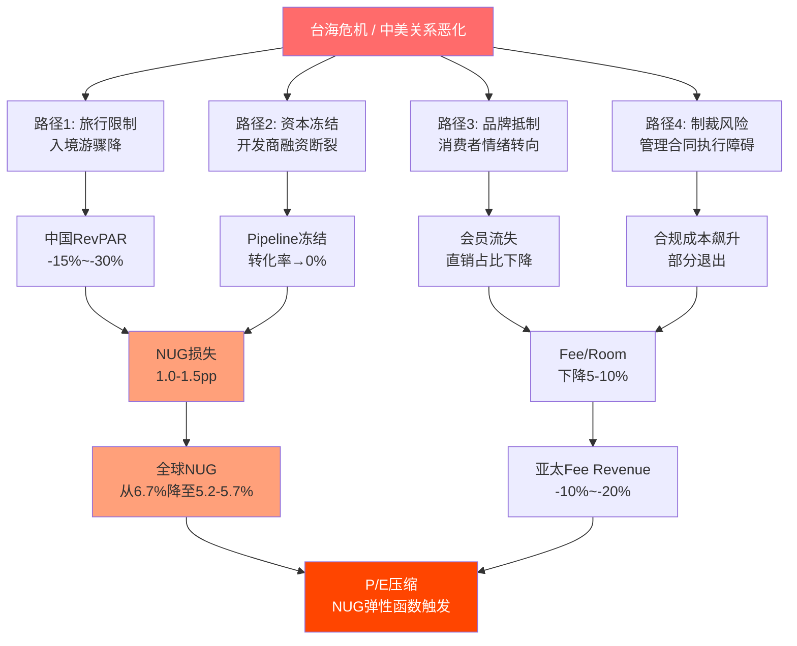

# 第10章: 亚太扩张 — 增长引擎还是风险集中?

> **CQ-5核心矛盾**: Pipeline 35%在亚太，增长来源=风险来源。投资者如何给这种不对称定价?

---

## 10.1 亚太规模: 从边缘到引擎的五年跃迁

Hilton在亚太的存在已经从"国际布局的点缀"演变为"增长引擎的核心"。截至FY2025年底，亚太区运营酒店约1,000家，五年复合增速(CAGR)约25% [DM-BIZ-003]。这一增速远超全球组合的整体NUG 6.7%，意味着亚太在Hilton系统中的权重正在快速上升。

更关键的数字在Pipeline端: 亚太Pipeline约915家酒店，占全球Pipeline 3,700+家的约35% [DM-BIZ-003]。换言之，Hilton未来3-5年每新增3家酒店，就有1家以上来自亚太。在建份额方面，亚太每4间在建酒店客房中，就有1间挂着Hilton旗帜——这一渗透率在国际酒店集团中仅次于Marriott。

但一个被忽视的不对称在于: **亚太贡献了~35%的Pipeline增长，却仅贡献~21%的国际收入(约~5-6%的总收入)**。这意味着增长贡献度远超收入贡献度——典型的"远期押注"结构。

| 维度 | 亚太占比 | 全球总量 | 含义 |
|------|:--------:|:--------:|------|
| 运营酒店 | ~12% | 8,300+ | 现有基数仍然有限 |
| Pipeline酒店 | ~35% | 3,700+ | 未来增长的最大来源 |
| 在建份额 | ~25% | — | 区域竞争力的硬指标 |
| 收入占比(估算) | ~5-6% | $12.04B | 远低于增长贡献度 |

**增长依赖度 = Pipeline占比(35%) / 收入占比(~5%) = 7.0x** — 这个倍数揭示了一个核心事实: Hilton对亚太的增长依赖程度是收入依赖程度的7倍。任何亚太层面的系统性冲击，对NUG的影响将远大于对当期收入的影响，但NUG恰恰是市场给予HLT 50.2x P/E溢价的核心叙事基础 [DM-VAL-001]。

---

## 10.2 中国市场深度分析: 最大引擎的最大不确定性

### 10.2.1 Hilton在中国的布局

中国是Hilton亚太Pipeline中占比最大的单一市场，估计占亚太Pipeline的50-60%。Hilton在中国的品牌分布呈金字塔结构:

- **中高端主力**: Hampton by Hilton(希尔顿欢朋)是中国扩张的核心品牌，客房数占中国总量的~40-50%，主打二三线城市商务/休闲市场
- **中端突破**: Hilton Garden Inn(希尔顿花园)在一二线城市布局，定位高于本土品牌但低于国际全服务品牌
- **高端旗舰**: Hilton Hotels & Resorts、DoubleTree等全服务品牌集中在一线和核心旅游城市
- **奢华稀缺**: Waldorf Astoria、Conrad在上海、北京、杭州等核心城市有少量布局，定位超高端

这一品牌矩阵的核心矛盾在于: **中国扩张的主力是Hampton(中高端特许经营)，但中国酒店市场的中高端恰恰是竞争最惨烈的价格带。**

### 10.2.2 本土竞争格局: 主场优势不可忽视

中国酒店市场的竞争结构与欧美截然不同。三大本土巨头——锦江国际(Jin Jiang)、华住集团(H World)、首旅如家(BTG Homeinns)——合计控制着中国品牌酒店市场的绝大部分份额:

| 集团 | 中国客房数(估) | 核心品牌 | 竞争优势 |
|------|:-------------:|---------|---------|
| **锦江国际** | ~120万间 | 锦江之星/维也纳/丽枫 | 全球最大(含海外), 政府资源 |
| **华住集团** | ~60万间 | 汉庭/全季/桔子/美居 | 技术驱动, FY2025增长+20.3% |
| **首旅如家** | ~50万间 | 如家/和颐/建国 | 国企背景, 北方优势 |
| **Hilton** | ~10万间 | Hampton/HGI/DoubleTree | 国际品牌光环, 会员网络 |

华住的案例尤其值得关注。IHG报告中指出，华住FY2025增速+20.3%，已跃升至全球第四大酒店集团 [DM-IHG-REF]。在中国本土市场，华住的优势几乎不可逾越:

1. **成本结构**: 华住单间客房管理成本约为国际品牌的60-70%，这直接决定了加盟商回报率
2. **品牌认知**: 汉庭、全季在中国消费者中的品牌渗透率远超Hampton
3. **数字化**: 华住的"华住会"APP日活跃用户和直销占比均高于Hilton在中国的水平
4. **下沉效率**: 三四线城市是增量空间所在，本土品牌在下沉市场的运营效率和物业获取能力远超外资品牌

**Hilton的中国策略本质是一个"品牌溢价换规模"的博弈**: 用国际品牌的光环吸引中国中产消费者支付15-25%的价格溢价，再用Honors全球会员网络为中国酒店导入入境客流。但当中国经济增速放缓、消费降级趋势显现时，这一价格溢价的可持续性就成了核心问题。

Hilton在中国面临的不仅是周期性困难，还有一个结构性劣势: **特许经营模式在中国的适配性问题**。在美国，Hampton酒店以特许经营为主，业主自主运营，Hilton收取品牌费。但在中国，本土加盟商(特别是三四线城市的个体业主)对国际品牌标准的理解和执行能力参差不齐。品牌一致性下降→客户体验波动→品牌声誉风险。华住解决这一问题的方式是"强管控+高密度区域管理"模式(每个城市经理覆盖15-20家酒店)，而Hilton在中国的管理密度远低于此。这意味着Hilton在中国规模越大，品牌一致性维护的难度就越高——一个反规模效应(diseconomy of scale)的隐患。

### 10.2.3 中国经济减速对RevPAR的冲击

IHG的经验提供了直接参照: IHG大中华区FY2025 RevPAR全年-1.6%，其中ADR(平均房价)下降更为显著——Q3 ADR -2.7%。更值得注意的是结构性分化: 一线城市RevPAR仅下降-1.2%，而二至四线城市下降-3.9%。

Hilton的中国扩张以Hampton为主力、主攻二三线城市——这恰恰暴露在RevPAR下行最脆弱的市场层级。我们估算Hilton中国RevPAR趋势:

- **FY2024**: 中国RevPAR估计同比-1%~-2%(占用率微升但ADR下行)
- **FY2025**: RevPAR延续弱势，估计-1%~-3%，与IHG大中华区趋势一致
- **FY2026E**: 管理层整体RevPAR指引+1.0%~+2.0% [DM-NEW-001]，但中国区域可能继续拖后腿

**量化影响**: 中国占Hilton亚太Fee Revenue估计约30-40%。如果中国RevPAR持续负增长(-2%~-3%)，对Hilton全球Fee Revenue增速的直接拖累约0.1-0.3个百分点。收入影响看似有限，但更大的风险在于: **RevPAR持续为负会打击开发商信心 → 新签约减速 → Pipeline转化率下降 → NUG减速**。这是一条从RevPAR到NUG的传导链，而NUG减速才是50.2x P/E真正害怕的事。

---

## 10.3 地缘风险量化: 从情景到数字

### 10.3.1 风险传导路径

台海冲突或中美关系急剧恶化对Hilton亚太业务的影响并非单一路径，而是多路径叠加:

### 10.3.2 三级情景分析

**情景A: 温和恶化(概率45-50%)**
- 中美关系维持"竞争性共存"，偶尔摩擦但无实质冲突
- 中国经济L型复苏，RevPAR低个位数增长
- 亚太Pipeline转化率维持75-80%
- **NUG影响**: 全球NUG维持6.0-6.5%，基本符合预期
- **估值影响**: 有限，P/E维持48-52x区间

**情景B: 显著恶化(概率30-35%)**
- 中美关系紧张加剧(科技制裁扩大/贸易战升级)
- 中国消费信心受挫，RevPAR -3%~-5%
- 亚太Pipeline转化率从80%降至60%
- **NUG影响**: 亚太NUG贡献从~2.3pp降至~1.4pp → 全球NUG从6.7%降至5.8%
- **估值影响**: NUG减速0.9pp → 根据NUG弹性函数(CQ-1)，P/E可能压缩至42-45x → 股价下行约10-15%

**情景C: 极端情景——亚太Pipeline全面冻结(概率5-10%)**
- 台海危机或重大地缘事件导致亚太开发活动全面暂停
- Pipeline 915家酒店转化率→0%(短期冻结)
- 已开业酒店RevPAR -15%~-30%
- **NUG影响**: 亚太NUG贡献清零 → 全球NUG从6.7%降至约4.4%
- **估值影响**: NUG从6.7%降至4.4%(-2.3pp) → P/E可能压缩至35-38x → 股价下行约25-30%

| 情景 | 概率 | 亚太转化率 | 全球NUG | P/E影响 | 股价影响 |
|------|:----:|:---------:|:------:|:------:|:-------:|
| A: 温和恶化 | 45-50% | 75-80% | 6.0-6.5% | 维持48-52x | -3%~+3% |
| B: 显著恶化 | 30-35% | 60% | 5.8% | 42-45x | -10%~-15% |
| C: 全面冻结 | 5-10% | 0% | 4.4% | 35-38x | -25%~-30% |

**概率加权NUG影响**: 0.475×6.25% + 0.325×5.8% + 0.075×4.4% = **5.89%**，较基准6.7%低0.81pp。这意味着仅地缘风险一项，就可能将Hilton的NUG预期从管理层指引的6-7%拉低至接近6%——而市场当前估值隐含的NUG假设很可能在6.5%以上。

值得注意的是，上述概率分配本身也包含不确定性。如果我们将情景C(全面冻结)的概率从7.5%上调至15%(反映近年地缘风险升温趋势)，概率加权NUG将进一步降至约5.72%——较基准低近1pp。这个敏感性分析说明，即使概率赋值的微小变化也会显著影响风险调整后的NUG预期。

### 10.3.3 被低估的二阶效应: 从亚太到全球的传染

亚太风险不仅仅局限于区域本身。如果亚太NUG大幅减速，至少存在四条跨区域传染路径:

1. **开发商信心传染**: 新兴市场的酒店开发商通常同时在多个地区投资。亚太项目冻结可能导致这些开发商在中东、非洲等其他新兴市场也收缩投资——虽然这些区域本身没有地缘问题。历史参照: 2008年金融危机时，亚太酒店开发停滞不仅影响本区域，还导致中东(特别是迪拜)的酒店Pipeline大幅缩水
2. **管理层叙事断裂**: Hilton 50.2x P/E的一个重要支柱是"NUG永续加速"的叙事 [DM-VAL-001]。一旦亚太出问题导致NUG减速，即使是暂时性的，也可能动摇市场对永续加速的信心。叙事一旦断裂，恢复需要2-3个季度的数据验证——而这段"信心真空期"正是P/E压缩最猛烈的时候
3. **回购效率进一步恶化**: NUG减速→P/E压缩→股价下跌→在低价回购的效率虽然提升，但如果同时伴随FCF下降(管理费收入减少)，回购能力也受限。考虑到HLT当前回购/FCF已达160% [DM-INF-002]，任何FCF的边际下降都可能触发"需要更多举债来维持回购"的负反馈循环
4. **竞争对手替代效应**: 如果HLT在亚太的Pipeline因地缘因素受阻，MAR和IHG可能加速填补空白——特别是在日本和东南亚等非中国市场。一旦开发商与MAR签约(通常15-20年合约)，HLT就永久失去了这些增量。换言之，亚太NUG的损失可能不是暂时的，而是永久性的市场份额流失

---

## 10.4 日本与东南亚: 被低估的增量

### 10.4.1 日本: 入境旅游红利的直接受益者

日本酒店市场在2024-2026年经历了显著的结构性变化:

- **入境旅游爆发**: 日元贬值(2024年触及160JPY/USD)叠加疫后需求释放，日本2025年入境游客突破4,000万人次(超2019年水平约25%)
- **酒店供给不足**: 东京、大阪、京都等核心旅游城市的酒店供给增速远低于需求增速，RevPAR连续上行
- **品牌化空间**: 日本酒店市场连锁化率仅约30%，远低于美国的70%+，品牌酒店渗透率提升空间巨大

Hilton在日本的布局正在加速: 包括新品牌LXR Hotels & Resorts在京都的旗舰项目、以及Hampton和DoubleTree在二三线城市的扩张。日本作为成熟经济体、法治健全、地缘风险相对较低(相比中国大陆)，是Hilton亚太组合中的"优质压舱石"。

**量化受益**: 如果日本Pipeline(估计占亚太Pipeline的10-15%)的转化率保持90%+(日本建设效率高)，可以为全球NUG贡献约0.2-0.3pp。虽然绝对量不大，但重要的是其确定性高——几乎不受中国相关地缘风险的影响。

**日本的隐性风险**: 日元贬值虽然利好入境旅游，但也意味着以美元计价的Fee Revenue被汇率稀释。如果日元从当前水平(~150JPY/USD)进一步贬值至170+，日本酒店的美元Fee Revenue可能缩水10-15%。不过，由于Hilton在日本以管理费(固定百分比)为主而非利润分成，汇率影响相对可控。更值得关注的是日本酒店投资市场的周期性: 2024-2025年海外资本(特别是黑石、KKR等)大量涌入日本酒店资产，推高了资产价格。如果这些资本因全球风险偏好转变而撤退，可能短期打压日本酒店开发节奏。

### 10.4.3 印度: 下一个中国?

印度是Hilton亚太叙事中常被忽略的增量。印度酒店市场当前连锁化率仅约5-8%，远低于中国的~35%，意味着品牌酒店的结构性渗透空间是全球最大的。Hilton在印度的Pipeline估计占亚太的10-12%，以Hampton和Hilton Garden Inn为主力品牌。

印度相对中国的独特优势:
- **地缘中立**: 印度不在中美博弈的核心战场，地缘风险低
- **人口红利**: 14亿人口中中产阶级(年收入$5,000+)约4-5亿且快速增长
- **本土品牌弱**: 与中国不同，印度缺乏华住/锦江级别的本土连锁巨头，Taj Hotels(塔塔集团)和OYO是主要竞争者，但OYO的品牌定位远低于Hilton
- **政策支持**: 印度政府的"Incredible India"旅游推广计划和签证便利化政策持续释放旅游需求

但印度也有独特挑战: 土地审批流程复杂(平均2-3年)、基础设施建设滞后、以及部分邦的监管不确定性。这些因素可能导致Pipeline转化率低于亚太平均(估计65-70% vs 亚太平均80%)。

**印度的估值意义**: 如果中国风险导致投资者对亚太Pipeline打折，那么印度Pipeline的"安全溢价"就变得重要。在极端情景下(中国全面冻结)，印度+日本+东南亚合计仍能为全球NUG贡献约1.0-1.5pp——不足以替代中国的~1.5-2.0pp，但足以防止NUG跌入MAR以下。

### 10.4.4 东南亚: 中产崛起的长期赌注

东南亚六国(越南、泰国、印尼、马来西亚、菲律宾、新加坡)的酒店市场呈现出与中国类似但更早期的增长特征:

- **中产阶级扩张**: 东南亚中产阶级人口预计从2025年的~3.5亿增至2030年的~4.5亿，品牌酒店需求随之增长
- **连锁化率极低**: 东南亚品牌酒店渗透率仅约15-20%，远低于中国的约35%和美国的70%+
- **旅游基础设施升级**: 越南、印尼等国大力投资机场和交通基础设施，释放二三线城市的旅游潜力

Hilton在东南亚的策略以Hampton和Hilton Garden Inn为主力，辅以Conrad和DoubleTree在核心旅游目的地(巴厘岛、曼谷、胡志明市)的高端布局。

**东南亚vs中国的风险收益对比**:

| 维度 | 中国 | 东南亚 |
|------|------|--------|
| Pipeline规模 | 大(占亚太50-60%) | 中(占亚太20-25%) |
| RevPAR趋势 | 承压(-1%~-3%) | 上行(+3%~+5%) |
| 本土竞争 | 极激烈(华住/锦江) | 中等(本土品牌弱) |
| 地缘风险 | 高(台海/中美) | 低-中 |
| 连锁化率 | ~35% | ~15-20% |
| 增长确定性 | 中低 | 中高(但基数小) |

理想状态下，东南亚+日本+印度的持续增长可以部分对冲中国的不确定性。但从Pipeline规模来看，中国的体量(占亚太50-60%)意味着非中国亚太(合计占亚太40-50%)无法完全替代中国——如果中国全面受阻，亚太NUG仍将大幅减速。

**一个值得追踪的趋势**: Hilton管理层是否在悄然将亚太Pipeline的重心从中国转向印度和东南亚? 如果FY2026-2027的新签约中印度+东南亚占比上升、中国占比下降，这将是管理层在用行动(而非言语)对冲中国风险的信号。CEO Nassetta在Q4 2025 earnings call中对中国的讨论措辞——是否回避了中国增速放缓的话题——也是CEO沉默分析(QG-01.5)的观察对象。

---

## 10.5 亚太vs其他区域: 增长依赖度的全景透视

为了理解亚太风险的全局影响，需要将其放入Hilton全球增长版图中:

| 区域 | 收入占比(估) | Pipeline占比 | NUG贡献(估) | 增长依赖度 | 风险等级 |
|------|:----------:|:----------:|:----------:|:---------:|:-------:|
| **美国** | ~79% | ~40-45% | ~2.5-3.0pp | 0.5-0.6x | 低(但基数效应递减) |
| **亚太** | ~5-6% | ~35% | ~2.0-2.5pp | 6-7x | 高(地缘+经济) |
| **欧洲** | ~8-9% | ~10-12% | ~0.7-0.9pp | 1.0-1.2x | 中低 |
| **中东/非洲** | ~3-4% | ~8-10% | ~0.5-0.7pp | 1.5-2.0x | 中(地缘局部) |
| **拉美** | ~2-3% | ~3-5% | ~0.2-0.3pp | 1.0-1.5x | 中 |

**关键洞察**: 亚太是唯一一个增长依赖度>5x的区域。这意味着:
- 亚太不出问题 → NUG 6.5-7.0%，维持"增长之王"叙事，P/E有支撑
- 亚太出中度问题 → NUG 5.5-6.0%，叙事削弱但不崩塌
- 亚太出重大问题 → NUG <5%，跌入MAR的增速区间(5-5.5%)，溢价逻辑消失

对比MAR: Marriott的Pipeline分布更加均衡(亚太占比约25-28%)，且其1,600,000+间客房的更大基数意味着任何单一区域的波动被更充分稀释 [DM-BIZ-011]。HLT在亚太的高集中度是其NUG领先MAR的原因之一——但也是其脆弱性高于MAR的原因。

这构成了一个估值悖论: **HLT获得P/E溢价的原因(NUG更快)和HLT应该被折价的原因(NUG更脆弱)来自同一个来源——亚太集中度。** 市场目前只定价了前者(溢价)而忽视了后者(脆弱性)。这并不是说市场一定错了——如果亚太持续按计划交付，HLT的溢价就是合理的。但如果亚太出现任何系统性问题，溢价的基础就会动摇，而动摇的幅度与集中度成正比。

---

## 10.6 地理风险热力图: 按国家/区域的Pipeline风险评估

| 国家/区域 | Pipeline占亚太比(估) | 风险类型 | 风险等级 | 关键风险因子 |
|-----------|:------------------:|---------|:-------:|------------|
| **中国大陆** | 50-60% | 经济+地缘+竞争 | **极高** | RevPAR承压/华住竞争/台海危机/消费降级 |
| **日本** | 10-15% | 汇率+供给 | **低** | 日元波动/核心城市用地紧张 |
| **印度** | 10-12% | 政策+基建 | **中低** | 基建缓慢/土地审批复杂/但增速高 |
| **东南亚-越南** | 5-7% | 政策+建设 | **中** | 监管不确定/但增速强劲 |
| **东南亚-泰国** | 3-5% | 政治+过度供给 | **中** | 政治不稳/部分市场供过于求 |
| **东南亚-印尼** | 3-5% | 经济+汇率 | **中低** | 巨大人口红利但城市化率偏低 |
| **韩国** | 3-4% | 成熟+竞争 | **低-中** | 成熟市场增速有限 |
| **澳新** | 3-5% | 成熟+成本 | **低** | 建设成本高但确定性强 |

**热力图核心结论**: 亚太Pipeline的风险高度集中在中国大陆——占亚太Pipeline的过半份额，同时面临经济、地缘、竞争三重叠加风险。非中国亚太(日本+东南亚+印度+澳新)的风险分散度较好，但体量不足以完全对冲中国风险。

**风险加权Pipeline**: 如果我们为每个区域的Pipeline赋予一个"风险折价系数"(1.0=无折价，0.5=打五折):

| 区域 | Pipeline占比 | 风险折价系数 | 风险调整后占比 |
|------|:----------:|:----------:|:-----------:|
| 中国大陆 | 55% | 0.70 | 38.5% |
| 日本 | 12% | 0.95 | 11.4% |
| 印度 | 11% | 0.80 | 8.8% |
| 东南亚 | 15% | 0.85 | 12.8% |
| 韩国/澳新 | 7% | 0.90 | 6.3% |
| **合计** | **100%** | — | **77.8%** |

风险调整后，亚太Pipeline的"有效规模"约为名义规模的78%——这意味着915家Pipeline酒店的风险调整后等效约为712家。对全球NUG的影响: 名义亚太NUG贡献2.3pp × 0.78 = 风险调整后1.79pp，隐含NUG损失约0.5pp。

---

## 10.7 约束碰撞定价: 增长来源=风险来源如何定价?

回到CQ-5的核心矛盾: **亚太是NUG最大贡献来源，但也是最大不确定性来源。投资者应该如何给这种不对称定价?**

### 10.7.1 当前市场定价隐含的假设

HLT 50.2x P/E隐含的NUG假设约为6.5-7.0%(维持当前增速) [DM-VAL-001]。如果拆解到区域层面，这意味着市场隐含假设:
- 亚太NUG贡献 ~2.0-2.5pp(Pipeline 35% × 80%转化率)
- 非亚太NUG贡献 ~4.5-5.0pp

换言之，市场定价中**约30-35%的NUG预期来自亚太**——与Pipeline占比一致。但市场是否为这30-35%的增长预期附加了足够的风险折价?

### 10.7.2 风险折价估算

如果市场对亚太增长的"风险调整NUG"应该是:
- 基准亚太NUG贡献: 2.3pp
- 概率加权调整后: 2.3pp × (1 - 地缘/经济风险折价) ≈ 2.3pp × 0.82 ≈ **1.89pp**
- 隐含NUG损失: 0.41pp

0.41pp的NUG损失在NUG弹性函数(CQ-1)中意味着什么? 如果NUG每减速1pp对应P/E压缩3-5x，则0.41pp对应P/E压缩约1.2-2.1x → 股价下行约3-5%。

**结论**: 在概率加权框架下，亚太地缘/经济风险对HLT合理估值的拖累约为**3-5%**。这个数字不算巨大，但需要注意:

1. **尾部风险**: 概率加权是对预期值的估计，但极端情景(Pipeline全面冻结)的影响是25-30%的股价下行——这是一个被均值掩盖的肥尾
2. **时间维度**: 亚太Pipeline的转化周期通常为3-5年，风险暴露窗口很长
3. **不可对冲性**: 与利率风险或RevPAR周期性不同，地缘风险几乎无法通过财务工具对冲

### 10.7.3 与IHG的对比教训

IHG大中华区占Fee Revenue约10-12%，且RevPAR已经呈现负增长(-1.6%)。IHG的估值(P/E 27.6x)部分反映了这一中国风险的折价 [DM-VAL-001]。相比之下，HLT的亚太敞口在收入端更小(~5-6%)，但在Pipeline端更大(~35%)——这意味着HLT面临的是**延迟释放的风险**: 当前收入影响有限，但未来3-5年的增长轨迹高度依赖亚太表现。

市场似乎在对IHG的中国风险给予了折价(P/E 27.6x)，但对HLT的亚太Pipeline风险给予的折价不足(P/E 50.2x中几乎看不到地缘折价)。**这可能是因为Pipeline风险是"未来的事"而非"现在的事"——但50.2x P/E定价的恰恰是未来。**

另一个视角: IHG大中华区占Fee Revenue 10-12%，是"已实现的中国收入敞口"；HLT亚太占Pipeline 35%，是"未实现的中国增长敞口"。前者影响当期利润，后者影响增长叙事。市场通常对当期利润的敏感度低于对增长叙事的敏感度——一旦HLT的亚太叙事出现裂痕，P/E压缩的速度可能快于IHG，尽管HLT当期的实际收入影响更小。

---

## 10.8 本章结论: 增长引擎的结构性脆弱

亚太对Hilton的战略意义毋庸置疑: 它是NUG领先同行的最大贡献者，是品牌全球化的核心战场，是长期增长空间的最大来源。但CQ-5揭示的核心矛盾同样真实:

1. **增长依赖度7x**: 亚太贡献35%的Pipeline增长但仅5-6%的收入，对NUG的边际贡献远超对当期利润的贡献
2. **中国集中度风险**: 亚太Pipeline的50-60%集中在中国，面临经济减速+本土竞争+地缘风险三重叠加
3. **概率加权NUG损失0.41pp**: 对应P/E压缩1.2-2.1x(约3-5%的估值拖累)
4. **肥尾风险**: 极端情景下(亚太冻结)NUG可能从6.7%降至4.4%，P/E压缩至35-38x，股价下行25-30%
5. **日本/东南亚可部分对冲但不足以替代**: 非中国亚太(占亚太Pipeline 40-50%)风险较低但体量不足以完全替代中国

**对估值框架的影响**: 在Ch16逆向DCF和Ch17 NUG弹性分析中，亚太风险应作为NUG假设的核心不确定性来源，而非简单地采用管理层指引的6-7%。建议使用5.8-6.2%作为风险调整后的NUG基准，而非6.5-7.0%。

**对CQ-5的回答**: 增长来源=风险来源是真实的约束碰撞。市场对HLT 50.2x P/E的定价隐含了亚太增长将按计划兑现的假设，但对这一假设附加的风险折价似乎不足。这不构成看空理由(亚太增长的结构性逻辑依然成立)，但构成了P/E溢价中约3-5%的"未被定价的风险"。在极端情景下，这一未被定价的风险可能放大至25-30%。

**与CQ-1/CQ-4的交叉**: 亚太风险并非孤立存在。CQ-1(NUG弹性函数)的结论将直接决定NUG减速对P/E的影响系数，而CQ-4(RevPAR vs NUG估值权重)的结论将影响亚太RevPAR弱势的定价权重。三个CQ共同构成了一个风险三角: 亚太NUG减速(CQ-5) → 全球NUG减速(CQ-4) → P/E压缩(CQ-1)。这条传导链中的每一环都包含不确定性，但三环叠加的概率不容忽视。

[DM-CH10-001] 亚太运营1,000家/Pipeline 915家/在建份额25% — 来源: Hilton FY2025 earnings + shared_context
[DM-CH10-002] 亚太Pipeline占全球~35% — 来源: shared_context + 管理层披露推算
[DM-CH10-003] 增长依赖度7.0x = Pipeline占比35% / 收入占比5% — 来源: 分析推导
[DM-CH10-004] 概率加权NUG影响: 基准6.7%→调整后5.89%(-0.81pp) — 来源: 三级情景分析推导
[DM-CH10-005] 中国本土竞争: 华住FY2025增长+20.3% — 来源: IHG报告交叉引用
[DM-CH10-006] IHG大中华区RevPAR FY2025 -1.6%, Q3 ADR -2.7% — 来源: IHG Ch23 bearcase分析
[DM-CH10-007] 全球连锁化率: 北美~72%, 欧洲~40%, 亚太~30%, 东南亚~15-20% — 来源: IHG CQ分析+行业报告
