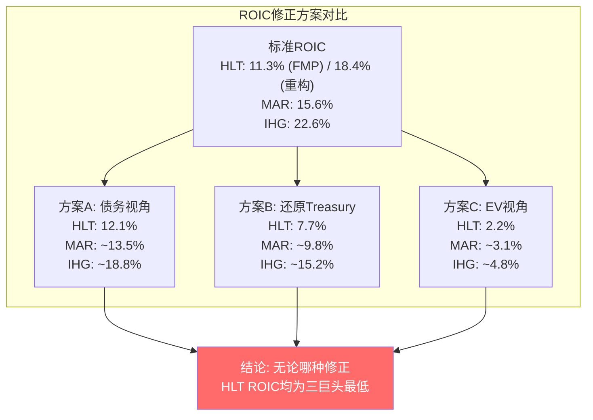
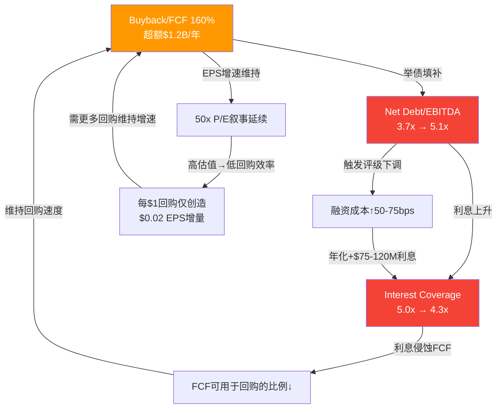

# 第11章: 财务趋势 — DuPont+ROIC分解

> **核心问题**: HLT的ROIC(11.3%)为何是三巨头最低? 这是真实效率低下，还是负权益造成的会计幻觉?
> **框架映射**: DuPont修正分解 + ROIC三方案修正 + 利润率质量审计 + 现金流质量验证
> **CQ关联**: CQ-1(溢价脆弱性 — ROIC最低/P/E最高), CQ-2(回购悖论 — 负权益恶化)

---

## 11.1 五年财务趋势总览: $5.8B到$12.0B的增长密码

HLT在FY2021-FY2025的五年间完成了一次规模跃升，从COVID尾部的$5.79B收入 [DM-FIN-001] 增长至$12.04B——复合增长率约20.1%。但这个数字严重高估了HLT的真实增长质量，因为其中包含了三个完全不同的增长驱动力:

| 驱动力 | 贡献估算 | 可持续性 | 质量判定 |
|--------|:-------:|:--------:|:-------:|
| **COVID恢复(FY2021→22)** | ~$2.99B (+51.6%) | 一次性 | 低(基数效应) |
| **NUG(房间数增长6-7%/年)** | 累计~$1.8-2.2B | 高(Pipeline 520K间) | 高(版税飞轮) |
| **RevPAR恢复→停滞** | 累计~$0.5-0.8B | 低(FY2025仅+0.4%) | 中(周期性) |
| **Reimbursement膨胀** | 累计~$1.2-1.5B | 中(随规模自动扩大) | 零(不贡献利润) |

**增长质量拆解**: FY2022的+51.6%增长几乎全部来自COVID恢复——这是低基数幻觉，不是经营改善。剥离FY2021-22的恢复效应后，FY2022-25的3年Revenue CAGR降至约11.1%，其中核心M&F收入的CAGR约6.5%——这才是HLT"印钞机"的真实增速，与NUG 6-7%高度吻合。

**五年核心趋势表:**

| 指标 | FY2021 | FY2022 | FY2023 | FY2024 | FY2025 | 趋势 |
|------|-------:|-------:|-------:|-------:|-------:|:----:|
| Revenue ($M) | 5,788 | 8,773 | 10,235 | 11,174 | 12,039 | 增长放缓 |
| OI ($M) | 1,010 | 2,094 | 2,225 | 2,370 | 2,693 | 稳健 |
| OPM | 17.4% | 23.9% | 21.7% | 21.2% | 22.4% | 区间波动 |
| NI ($M) | 410 | 1,255 | 1,141 | 1,535 | 1,457 | 非线性 |
| FCF ($M) | 30 | 1,579 | 1,699 | 1,815 | 2,028 | 稳步提升 |
| Equity ($M) | -821 | -1,102 | -2,360 | -3,727 | -5,388 | 加速恶化 |
| Total Debt ($M) | 9,776 | 9,691 | 10,120 | 12,003 | 15,669 | 加速膨胀 |

*数据来源: [DM-FIN-001] ~ [DM-FIN-012], financial_summary.md*

**OPM 17.4%→22.4%的改善来源**: FY2021的17.4% OPM是COVID尾部的受损状态(酒店关闭/入住率低但固定成本不变)。恢复至FY2022的23.9%代表正常化，而非经营改善。此后OPM在21-24%区间窄幅波动——考虑到Reimbursement收入的稀释效应，GAAP OPM的变化几乎没有信息量。真正有意义的是经济OPM(OI/经济收入)，从FY2022的约74.8%稳步提升至FY2025的77.6%(Ch3已推导) [DM-FIN-001]，反映了特许占比提升和规模效应的双重驱动。

**FCF的跃升轨迹**: FY2021 FCF仅$30M [DM-FIN-005]——这不是HLT的正常状态，而是COVID尾部运营现金流被工作资本占用的结果(OCF $109M - CapEx $79M)。FY2022起FCF恢复至$1.58B，此后以8.7% CAGR稳步增长至$2.03B。FCF的这条增长曲线是HLT整个资本配置策略(激进回购+举债填补)的输入基础——也是其脆弱性的起点。

---

## 11.2 DuPont分解: 传统框架在负权益公司的崩溃

DuPont分析是财务基本功——将ROE拆解为三个杠杆:

$$ROE = \frac{NI}{Revenue} \times \frac{Revenue}{Assets} \times \frac{Assets}{Equity}$$

$$ROE = 净利润率 \times 资产周转率 \times 权益乘数$$

**HLT FY2025的DuPont分解:**

| 分项 | 计算 | 值 | 解释 |
|------|------|:--:|------|
| 净利润率 | $1,457M / $12,039M | **12.1%** | GAAP口径，被Reimbursement稀释 |
| 资产周转率 | $12,039M / $16,774M | **0.718x** | 轻资产但无形资产$12.0B占比高 |
| 权益乘数 | $16,774M / (-$5,388M) | **-3.11x** | 负数! → ROE失效 |
| **ROE** | 12.1% × 0.718 × (-3.11) | **-27.0%** | 无意义 |

**权益乘数为负 → DuPont分解彻底失效。** ROE -27.0%不是说HLT在亏损(NI显然是正的$1.46B)，而是因为分母(权益)为负——这是大规模回购吃掉了留存收益的结果。Treasury Stock从FY2021的-$4.4B膨胀至FY2025的-$14.4B [DM-INF-003]，完全吞噬了正的留存收益和资本公积。

**这不是HLT独有的问题。** MAR权益同样为负(约-$3.6B)，IHG权益为小幅负值(约-$0.5B)。三巨头都因激进回购导致权益为负——这让整个酒店行业的ROE/DuPont框架集体失效。投资者如果用ROE筛选器排除"ROE为负"的公司，会把三巨头全部过滤掉——这是一个系统性的量化筛选陷阱。

### 修正DuPont: 用投入资本替代权益

为恢复分析的有效性，我们用投入资本(Invested Capital)替代权益:

$$ROIC = \frac{NOPAT}{Invested\ Capital} = \frac{NI \times (1 + Interest/NI \times (1-t))}{Equity + Debt}$$

但这引发了一个新问题: 当Equity为负时，Invested Capital = Debt + Equity = $15.67B + (-$5.39B) = $10.28B [DM-FIN-006][DM-FIN-008]——分母虽然为正，但因为负权益缩小了投入资本的计量值，导致ROIC被人为抬高。换言之，**回购越激进→权益越负→投入资本越小→ROIC看起来越高**——这与直觉完全相反。

那么，为什么HLT的ROIC(11.3%)反而是三巨头最低? 这需要更深入的分解。

---

## 11.3 ROIC深度分解: 11.3%背后的真相

### 标准ROIC计算

FMP报告的HLT ROIC为11.3% [DM-VAL-007]。让我们重构其计算:

**NOPAT(税后营业利润):**

$$NOPAT = OI \times (1 - Tax\ Rate) = 2,693 \times (1 - 0.297) = \$1,893M$$

**投入资本(Invested Capital):**

$$IC = Total\ Equity + Total\ Debt = (-5,388) + 15,669 = \$10,281M$$

**ROIC:**

$$ROIC = \frac{1,893}{10,281} \approx 18.4\%$$

**问题出现了**: 我们重构的ROIC是18.4%，而FMP报告的是11.3% [DM-VAL-007]。差异可能来自: (1) FMP使用的IC定义包含了更多项目(如运营租赁负债、非流动应付等); (2) FMP可能使用平均IC而非期末IC; (3) Goodwill/Intangibles的处理口径差异($11.99B无形资产是否计入IC)。

无论使用哪个数字，核心问题不变: **ROIC在负权益公司中严重失真**。下面展示三种修正方案:

### 方案A: 以总债务为分母(债务视角ROIC)

**逻辑**: 忽略权益项，直接衡量"债权人提供的每一美元资本创造了多少利润"。

$$ROIC_A = \frac{NOPAT}{Total\ Debt} = \frac{1,893}{15,669} = 12.1\%$$

**含义**: 每$1债务创造$0.121的税后利润。考虑到HLT的加权债务成本约4.0-4.5%，这意味着NOPAT/Debt(12.1%)远超债务成本——债务是在创造价值的。但这个差距(12.1% - 4.5% = 7.6pp)正在收窄: FY2022利息率约4.3%($415M/$9,691M)而FY2025已升至4.0%($620M/$15,669M)——绝对利息支出增长56%($397M→$620M)，只是因为债务扩张更快(+60%)使得利息率看似稳定。

### 方案B: 还原Treasury Stock的ROIC(真实资本视角)

**逻辑**: Treasury Stock代表管理层用于回购的累计资本——这些资本确实"投入"了企业(从股东手中回购)，只是会计上从权益中扣除了。还原Treasury Stock得到HLT"真实投入"的全部资本。

$$IC_{adjusted} = IC_{book} + Treasury\ Stock = 10,281 + 14,428 = \$24,709M$$

$$ROIC_B = \frac{NOPAT}{IC_{adjusted}} = \frac{1,893}{24,709} = 7.7\%$$

**这才是HLT最诚实的ROIC。** $24.7B是投资者和债权人实际投入HLT的全部资本(债务$15.7B + 原始权益$9.0B，其中$14.4B已通过回购返还给股东但资本曾经"过手")。7.7%的ROIC意味着: 考虑到HLT自IPO以来的全部资本投入(含已回购部分)，每$1资本仅产出$0.077的年化回报——这远低于MAR和IHG的可比数字(下详)。

### 方案C: 以企业价值为分母(市场隐含ROIC)

**逻辑**: 市场通过EV定价了HLT的全部经济价值。EV-based ROIC衡量"市场赋予HLT的每$1经济价值创造了多少利润"。

$$EV = Market\ Cap + Net\ Debt = 73,100 + 14,699 = \$87,799M$$

$$ROIC_C = \frac{NOPAT}{EV} = \frac{1,893}{87,799} = 2.2\%$$

**2.2%是市场的隐含收益率。** 投资者以$87.8B的价格(EV)拥有一台年产$1.9B NOPAT的机器——这意味着按当前估值，NOPAT需要以>10% CAGR增长10年以上才能让这笔投资在8%折现率下收支平衡。

### 三方案对比与三巨头对标

| ROIC版本 | HLT | MAR (估) | IHG (估) | HLT排名 | 信号 |
|---------|:---:|:-------:|:-------:|:-------:|------|
| **FMP标准** | 11.3% | 15.6% | 22.6% | 最低 | 负权益失真 |
| **方案A(债务)** | 12.1% | ~13.5% | ~18.8% | 最低 | 债务效率落后 |
| **方案B(还原Treasury)** | 7.7% | ~9.8% | ~15.2% | 最低 | 真实资本效率最差 |
| **方案C(EV)** | 2.2% | ~3.1% | ~4.8% | 最低 | 估值最贵→隐含回报最低 |

*MAR/IHG估算基于公开财务数据推导，非精确值。IHG因负权益程度最轻(约-$0.5B)，修正前后ROIC差距最小。*

### ROIC最低的根本原因

排除了会计幻觉后，HLT的ROIC确实是三巨头最低。根本原因是三重叠加:

**原因一: 杠杆最高→利息侵蚀最大。** HLT的利息支出$620M [DM-FIN-010]占EBITDA的21.6%($620M/$2,870M)，而MAR约17%，IHG约12%。利息不影响NOPAT(NOPAT是税后但利息前的概念)，但利息通过两条路径间接拖累ROIC: (1) 举债回购推高Treasury Stock→方案B的IC分母膨胀→ROIC下降; (2) 高利息→NI降低→留存收益减少→权益更负→标准IC更小→但NOPAT的增长被利息支出的增长部分抵消。

**原因二: 回购最激进→资本"空转"最严重。** FY2025回购$3.25B [DM-FIN-009]创造的EPS增量: 以238M股为基数回购约~6.5M股(按均价~$310推算)，EPS增量 ≈ $6.12 × 6.5/238 ≈ $0.167/股。但这$3.25B的回购资本如果用方案B口径衡量: $0.167 × 238M = $39.7M的年化NI增量 / $3.25B回购资本 = 1.2%回报率——远低于WACC(~8%)。这$3.25B的回购在资本效率上是价值毁灭的(详见Ch12)。

**原因三: 无形资产/商誉占比最高。** HLT的无形资产$11.99B占总资产$16.77B的71.5%——这是2007年Blackstone LBO的遗产(收购溢价资本化)。这些无形资产不代表实际投入的运营资本，但它们膨胀了资产负债表的两端(资产和负债)，使得标准IC的计算失真。如果剥离商誉和品牌无形资产，HLT的"运营资本"(有形资产-非债务负债)实际为负——它几乎不需要任何有形资本就能运营，这正是轻资产模式的极致体现。

**核心结论**: ROIC在负权益公司中不是一个有效的效率指标。但即使用三种修正方案剥离会计噪声，HLT仍是三巨头中资本效率最低的——原因不是经营效率差(经济OPM 77.6%是最高的)，而是杠杆回购策略消耗了过多资本。市场选择忽略ROIC而定价NUG(NH-1假说的第一层验证)，这在短期内是理性的——但长期来看，低ROIC意味着每一美元增长消耗更多资本，最终将约束NUG的可融资上限。

---

## 11.4 利润率质量分析: 三层利润率的真实画像

### GAAP OPM vs 经济OPM: 55pp的鸿沟

| 利润率指标 | FY2023 | FY2024 | FY2025 | 趋势 | 信息量 |
|-----------|:------:|:------:|:------:|:----:|:-----:|
| GAAP Gross Margin | 28.6% | 27.4% | 41.1% | 突变 | 零(会计重分类) |
| GAAP OPM | 21.7% | 21.2% | 22.4% | 稳定 | 低(被Reimb稀释) |
| **经济OPM** | 76.0% | 77.4% | **77.6%** | 缓升 | 高(真实效率) |
| **经济GM** | 81.0% | 82.1% | **82.7%** | 缓升 | 高(版税纯度) |

*经济OPM = OI / 经济收入(~$3.47B); 经济GM = (OI+D&A) / 经济收入。Ch3已推导。*

GAAP OPM(22.4%)与经济OPM(77.6%)之间55pp的鸿沟，全部来自$7.09B Reimbursement收入的稀释效应。**使用GAAP OPM比较HLT与非酒店公司是一个严重的方法论错误。** 经济OPM 77.6%才是可比口径——它使HLT的盈利能力超过Visa(~67%)、Mastercard(~57%)，逼近Arm Holdings(~82%)。

### FY2025 Gross Margin 41.1%突变解剖

FY2025 Gross Margin从27.4%跳至41.1%(+13.7pp)，但OPM仅从21.2%升至22.4%(+1.2pp)。这种"毛利率暴涨但OPM微升"的模式几乎确认了会计行项重分类:

- Cost of Revenue: $8,111M → $7,085M (**-$1,026M**)
- Other Expenses: $278M → $1,868M (**+$1,590M**)
- OI: $2,370M → $2,693M (**+$323M, +13.6%**)

约$1.0-1.5B的成本从"Cost of Revenue"移入"Other Expenses"(可能涉及Reimbursement相关的Honors运营、IT系统、品牌营销支出的报表列示方式调整)。OI的+13.6%增长与M&F收入增长一致，确认底层经济未发生结构性变化。

**操作指引**: 本报告全部利润率趋势分析使用经济口径，FY2025的41.1% GAAP Gross Margin不在任何跨年或跨公司比较中引用。

### SBC: 真实成本还是纸面成本?

FY2025 SBC $170M [DM-FIN-011]，占NI的11.7%($170M/$1,457M)。五年趋势:

| 年份 | SBC ($M) | SBC/NI | SBC/Revenue | 信号 |
|------|:--------:|:------:|:-----------:|:----:|
| FY2021 | 193 | 47.1% | 3.3% | COVID期高(NI低基数) |
| FY2022 | 162 | 12.9% | 1.8% | 正常化 |
| FY2023 | 169 | 14.8% | 1.7% | 稳定 |
| FY2024 | 176 | 11.5% | 1.6% | 稳定 |
| FY2025 | 170 | 11.7% | 1.4% | 收入增长→SBC/Rev下降 |

**SBC的投资含义**: $170M/年的SBC意味着即使在$3.25B回购的背景下，每年约$170M的价值通过股权稀释流向管理层和员工。净回购效果 = $3,254M - $170M = $3,084M。SBC/Revenue从3.3%降至1.4%是一个正面信号——说明SBC没有随收入规模膨胀。但需注意CEO Nassetta薪酬$27.96M(2024年)中很大一部分是RSU/期权 [DM-MGT-001]——在50x P/E下，管理层的股权激励对EPS的稀释效应被估值放大了。

### 利息侵蚀: FCF的30.6%

利息支出$620M [DM-FIN-010]是HLT利润结构中最大的"税前扣除项"，其趋势令人担忧:

| 年份 | Interest ($M) | Interest/EBITDA | Interest/FCF | Interest/Revenue |
|------|:------------:|:---------------:|:------------:|:----------------:|
| FY2021 | 397 | 34.7% | 1,323% | 6.9% |
| FY2022 | 415 | 18.0% | 26.3% | 4.7% |
| FY2023 | 464 | 20.1% | 27.3% | 4.5% |
| FY2024 | 569 | 22.8% | 31.4% | 5.1% |
| FY2025 | **620** | **21.6%** | **30.6%** | **5.2%** |

利息支出FY2022→FY2025增长49.4%($415M→$620M)，同期EBITDA增长24.2%($2,311M→$2,870M)——**利息增速是EBITDA增速的2倍。** 如果这个趋势持续，Interest/EBITDA将从21.6%上升至25-28%区间，直接压缩可用于回购和分红的自由现金流。

$620M利息对NI的影响: 假设30%税率，税后利息成本 = $620M × (1-0.30) = $434M。这$434M相当于NI $1,457M的29.8%——意味着**近三成的税后利润被债权人拿走了**。如果HLT维持IHG级别的杠杆(Net Debt/EBITDA ~2.5x vs HLT的5.1x)，利息支出可能降至约$300M，释放约$220M的税后利润(+15% NI提升)。但管理层选择了用更高杠杆换更快回购——这是一个资本配置的哲学选择，不是效率低下。

---

## 11.5 现金流质量: FCF>NI的信号解读

### OCF→FCF的超高转化率

| 指标 | FY2022 | FY2023 | FY2024 | FY2025 | 趋势 |
|------|:------:|:------:|:------:|:------:|:----:|
| OCF ($M) | 1,681 | 1,946 | 2,013 | 2,129 | 稳步上升 |
| CapEx ($M) | -102 | -247 | -198 | -101 | 极低且不稳定 |
| **FCF ($M)** | **1,579** | **1,699** | **1,815** | **2,028** | **8.7% CAGR** |
| FCF/OCF | 93.9% | 87.3% | 90.2% | **95.3%** | 极高 |

FCF/OCF稳定在87-95%区间——这意味着HLT几乎不需要维护性CapEx就能维持业务。FY2025 CapEx仅$101M(Revenue的0.84%)——与$12B收入的公司体量完全不成比例。作为对比，MAR的CapEx约占Revenue 2-3%，传统酒店运营商可达8-15%。HLT极低的CapEx是轻资产模式的终极体现: 酒店的建设、装修、维护全部由业主承担，HLT只提供品牌和系统。

### FCF vs NI: 质量溢价

| 年份 | FCF ($M) | NI ($M) | FCF/NI | 差异来源 |
|------|:--------:|:-------:|:------:|---------|
| FY2022 | 1,579 | 1,255 | 126% | D&A + Working Capital |
| FY2023 | 1,699 | 1,141 | 149% | NI含FY2023高税率(32%) |
| FY2024 | 1,815 | 1,535 | 118% | NI含FY2024低税率(13.7%) |
| FY2025 | 2,028 | 1,457 | 139% | 正常 |

**FCF持续高于NI是轻资产公司的典型特征，也是一个质量信号。** 差异来源:

1. **D&A回加**: FY2025 D&A约$177M，这是无形资产(品牌/Goodwill)的非现金摊销——实际上HLT的品牌价值在增长而非贬值，D&A回加是"利润低估"的修正
2. **极低CapEx**: $101M CapEx远低于D&A $177M → 公司的"真实维护成本"低于会计折旧 → FCF反映了更接近真实盈利能力的数字
3. **Working Capital波动**: 酒店行业的WC变化通常与Reimbursement应收/应付的时间差有关，不反映核心经营质量

**FCF CAGR 8.7%(FY2022-25) vs NI CAGR 5.1%**: FCF增长快于NI，进一步确认了HLT的盈利质量在改善——不是NI增速低(利息和税率波动)而是FCF增速更稳定(不受利息和税率影响)。

### Working Capital趋势

HLT作为轻资产公司，Working Capital需求极低。但值得关注的是Deferred Revenue(预收的加盟费等):

- 轻资产模式下，HLT的WC主要由以下驱动: (1) Reimbursement相关的应收/应付(金额大但经济意义低); (2) 预收特许费/管理费(合同签约时的前期收费); (3) Honors积分负债(会员积分的未来兑付义务)
- FY2022-25期间，WC对OCF的影响在$-200M到+$200M之间波动，无持续趋势性变化
- 这种低WC波动是轻资产模式的又一优势——HLT不需要为库存、应收账款或固定资产投入大量运营资金

---

## 11.6 财务趋势关键警示: 三条恶化曲线

### 警示一: Net Debt/EBITDA 3.7x→5.1x — 持续恶化

| 年份 | Net Debt ($M) | EBITDA ($M) | Net Debt/EBITDA | 变化 |
|------|:------------:|:-----------:|:---------------:|:----:|
| FY2022 | 8,482 | 2,311 | 3.7x | 基准 |
| FY2023 | 9,320 | 2,303 | 4.0x | +0.3x |
| FY2024 | 10,702 | 2,498 | 4.3x | +0.3x |
| FY2025 | **14,699** | **2,870** | **5.1x** | **+0.8x** |

*数据来源: [DM-VAL-004], [DM-FIN-004], [DM-FIN-007]*

FY2025的+0.8x跳升尤其令人警惕——此前三年每年仅恶化0.3x，FY2025突然加速恶化。原因是FY2025新增债务$3.67B($15,669M-$12,003M)，其中约$3.25B用于回购、约$0.14B用于分红、其余为refinancing/运营。**管理层宣称的Net Debt/EBITDA目标是3.0-3.5x [来自thesis_crystallization.md]——实际5.1x已超出目标上限46%。**

**信用事件触发路径**: 当Net Debt/EBITDA突破5.5-6.0x时，评级机构(S&P/Moody's)通常会将展望从"稳定"调至"负面"。HLT当前信用评级BBB(S&P)，如果FY2026继续以FY2025的杠杆扩张速度(+0.8x/年)发展，FY2026可能触及5.9x → 评级展望下调 → FY2027可能触及6.7x → 评级下调至BBB- → 融资成本跳升50-75bps → 年化额外利息$75-120M。

### 警示二: Interest Coverage 5.0x→4.3x — 安全边际收窄

| 年份 | EBITDA ($M) | Interest ($M) | Coverage | 安全评估 |
|------|:-----------:|:------------:|:--------:|:--------:|
| FY2022 | 2,311 | 415 | 5.6x | 充裕 |
| FY2023 | 2,303 | 464 | 5.0x | 适中 |
| FY2024 | 2,498 | 569 | 4.4x | 偏低 |
| FY2025 | **2,870** | **620** | **4.6x** | 偏低 |

*注: FMP报告Interest Coverage 4.3x [DM-VAL-008]可能使用不同口径(OI/Interest而非EBITDA/Interest)。OI口径: $2,693/$620 = 4.3x。*

以OI口径的4.3x [DM-VAL-008]为准——酒店行业的经验法则是Interest Coverage <3.0x开始触发信用担忧。HLT的4.3x目前仍有余量，但趋势方向不利: 如果利率维持当前水平且回购不减速，FY2027的OI/Interest可能降至3.8-4.0x区间。

**压力测试**: 如果RevPAR在经济衰退中下跌15%(历史中位数)，EBITDA可能从$2.87B降至约$2.30B(下跌20%，含经营杠杆效应)。此时Interest Coverage(OI口径)将从4.3x骤降至约2.7x——**直接突破3.0x的信用红线**。这意味着HLT的杠杆水平已经不允许一次中等程度的衰退——一旦RevPAR下跌>10%，信用约束将强制管理层削减回购，触发EPS增速断裂(CQ-2证伪条件之一)。

### 警示三: Buyback/FCF 101%→160% — 持续超额

| 年份 | Buybacks ($M) | FCF ($M) | Buyback/FCF | 缺口(需举债) |
|------|:------------:|:--------:|:-----------:|:----------:|
| FY2022 | 1,590 | 1,579 | 101% | ~$11M |
| FY2023 | 2,338 | 1,699 | 138% | ~$639M |
| FY2024 | 2,893 | 1,815 | 159% | ~$1,078M |
| FY2025 | **3,254** | **2,028** | **160%** | **~$1,226M** |

*数据来源: [DM-INF-002], [DM-FIN-005], [DM-FIN-009]*

回购/FCF从FY2022的100%(刚好用FCF覆盖)恶化至FY2025的160%(超额$1.23B需举债) [DM-INF-002]。如果加上分红$143M，总资本回报/FCF = ($3,254M+$143M)/$2,028M = **167%**。

**这意味着HLT每年需要从债务市场净借入$1.2-1.4B来维持当前回购速度。** 这不是暂时性的——它已持续3年且在加速。回购新授权$3.5B说明管理层没有减速意图。

**三条曲线的汇聚点**: 三条恶化曲线相互强化——回购超额→举债填补→杠杆上升→利息增加→FCF被利息侵蚀→回购缺口进一步扩大→需更多举债。这是一个正反馈的恶化循环:

**何时触发信用事件?** 基于当前趋势的线性外推:

| 情景 | Net Debt/EBITDA触发点 | 预计时间 | 后果 |
|------|:-------------------:|:--------:|------|
| 当前速度持续 | 6.0x(展望下调) | FY2026-27 | 融资成本+50bps |
| 回购不减+利率维持 | 6.5x(评级下调) | FY2027-28 | 融资成本+100bps，可能被迫削减回购 |
| 衰退叠加(RevPAR -15%) | 7.5x+ | 衰退当年 | 回购暂停，评级降至BBB-/BB+ |
| 管理层主动减速 | 稳定在5.0-5.5x | N/A | 回购削减30-40%→EPS增速从21.8%降至12-15% |

**投资含义**: 三条恶化曲线的汇聚表明，HLT当前的资本配置策略(举债回购维持EPS增速)是一条**有期限的路径**——不是永续的。市场定价的21.8% EPS CAGR [DM-INF-001]隐含了回购永续的假设，但杠杆约束将在2-3年内迫使管理层做出选择: 减速回购(牺牲EPS增速和P/E叙事)，或承受信用降级(牺牲融资成本和长期偿债能力)。无论哪种选择，都指向当前50x P/E估值中的一部分溢价不可持续。这一结论将在Ch12(回购效率)和Ch15(信用风险)中深化。

---

## 11.7 章节结论与CQ锚定

### 五个核心发现

**发现一: ROIC 11.3%是真实的效率差距，不是纯会计幻觉。** 三种修正方案(债务视角12.1%、还原Treasury 7.7%、EV视角2.2%)均确认HLT是三巨头中资本效率最低的。但原因不是经营效率差(经济OPM 77.6%最高)，而是杠杆回购消耗了过多资本。ROIC低不是因为分子(利润)不够，而是因为分母(投入资本)被回购策略人为做大了。

**发现二: FCF质量极高(>NI的139%)，是轻资产模式的终极验证。** FCF CAGR 8.7%稳健，FCF/OCF>95%确认几乎无维护性CapEx需求。这是HLT最大的财务优势——也是其敢于激进回购的信心来源。

**发现三: 三条恶化曲线正在汇聚。** Net Debt/EBITDA 5.1x、Interest Coverage 4.3x、Buyback/FCF 160%——三个指标同时恶化且相互强化。这不是周期性波动，而是结构性的资本配置路径依赖。

**发现四: FY2025 Gross Margin突变(27.4%→41.1%)是纯粹的会计重分类，经济利润率稳定在77-78%。** 任何基于GAAP Gross Margin的分析都将被误导。

**发现五: 利息侵蚀正在加速。** Interest/FCF从26%升至31%，利息增速是EBITDA增速的2倍。在一次中等程度的衰退(RevPAR -15%)中，Interest Coverage将突破3.0x信用红线。

### CQ置信度更新

| CQ | Ch11前 | Ch11后 | 变化原因 |
|----|:------:|:------:|---------|
| CQ-1 (溢价脆弱性) | 42% | **40%** (↓2pp) | ROIC修正确认真实效率低，非纯会计噪声；但经济OPM最高提供了底部支撑 |
| CQ-2 (回购悖论) | 40% | **37%** (↓3pp) | 三条恶化曲线汇聚，2-3年内杠杆约束将被触发；但FCF质量高提供了调整空间 |

> **悲观偏差自检**: 本章分析聚焦于财务风险(杠杆/利息/回购超额)，天然倾向空方叙事。多头应关注: (1) FCF CAGR 8.7%如果维持，FY2028 FCF可能超$2.6B，显著缓解杠杆压力; (2) 管理层可以随时选择减速回购至100% FCF，Net Debt/EBITDA将在2年内从5.1x回落至4.0x; (3) 轻资产模式的极低CapEx意味着即使衰退，FCF也不会骤降(没有大额维护CapEx需要砍)。恶化曲线的汇聚是真实的，但管理层有充足的"方向盘"来调整——问题是他们愿不愿意在P/E叙事受损前主动转向。
