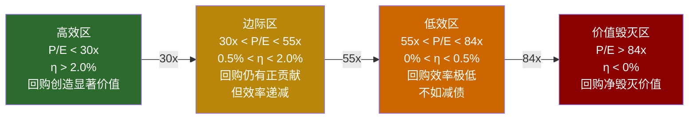
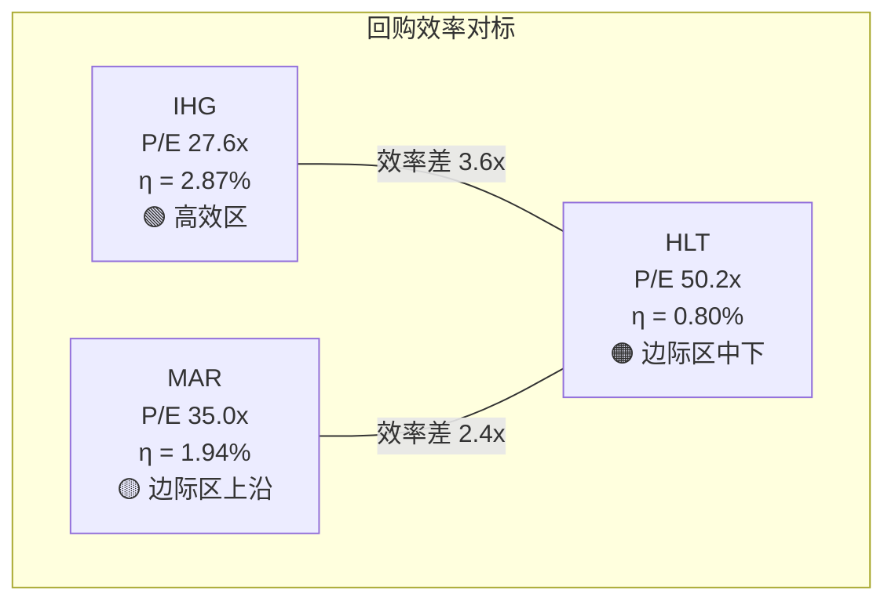
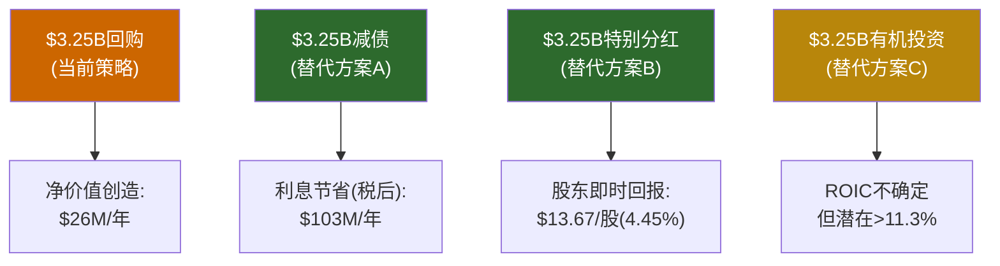
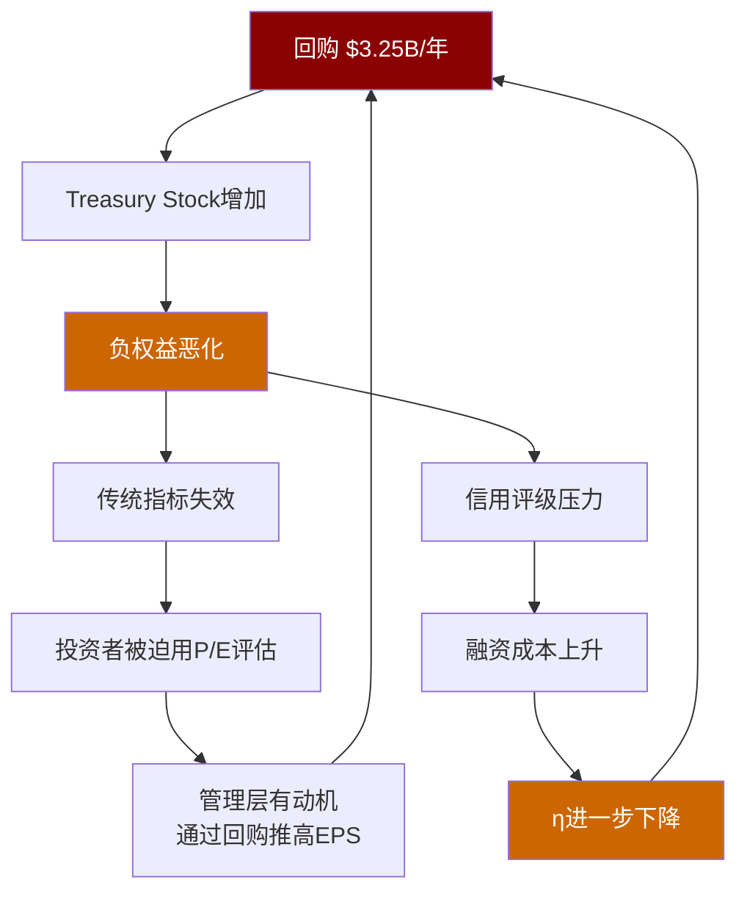

# 第12章: 资本配置审计 — 回购效率边际递减函数

> **核心问题(CQ-2)**: 在50x P/E下回购$3.25B/年 = 理性杠杆还是价值毁灭?
> **方法论C**: 回购效率边际递减函数 — 本报告三个原创方法论之一
> **迁移价值**: 适用于所有高P/E负权益回购公司(SBUX/DPZ/MAR)

---

## 12.1 资本配置审计总览: 一台只有一个出口的机器

Hilton的资本配置可以用一句话概括: **所有的钱都变成了回购**。

过去四年(FY2022-FY2025)，Hilton累计产生FCF $7.12B [DM-FIN-005]，同期累计回购$10.08B [DM-FIN-009]。差额$2.96B来自哪里？答案是举债。同期净债务从$8.48B增至$14.70B，增加$6.22B [DM-FIN-007]，其中约$3B用于填补回购超额(其余为利息资本化、运营资金变动等)。

**FY2022-FY2025资本配置全景**:

| 科目 | FY2022 | FY2023 | FY2024 | FY2025 | 4年累计 |
|------|-------:|-------:|-------:|-------:|-------:|
| **FCF ($M)** | 1,579 | 1,699 | 1,815 | 2,028 | **7,121** |
| 回购 ($M) | -1,590 | -2,338 | -2,893 | -3,254 | **-10,075** |
| 分红 ($M) | -123 | -158 | -150 | -143 | **-574** |
| **资本回报合计** | -1,713 | -2,496 | -3,043 | -3,397 | **-10,649** |
| **FCF缺口** | -134 | -797 | -1,228 | -1,369 | **-3,528** |
| 净债务增加 ($M) | +133 | +838 | +1,382 | +3,997 | **+6,350** |
| CapEx ($M) | -102 | -247 | -198 | -101 | **-648** |

[DM-FIN-005] [DM-FIN-009] [DM-FIN-007]

几个值得注意的结构性特征:

**第一，回购在加速，FCF增速远远跟不上**。回购从FY2022的$1.59B增长至FY2025的$3.25B，CAGR +27%。同期FCF从$1.58B增至$2.03B，CAGR仅+8.7%。回购增速是FCF增速的3倍——这意味着"举债回购"的比例在结构性上升。

**第二，分红微不足道**。FY2025分红$143M仅占FCF的7.1%，占资本回报总额的4.2%。分红的存在更像是一种"制度性安排"(维持分红型基金的持仓资格)，而非真正的股东回报渠道。Hilton本质上是一家"纯回购公司"。

**第三，CapEx极低但不为零**。FY2025 CapEx仅$101M，占收入的0.84% [DM-FIN-001]。这确认了轻资产模型的纯粹性——Hilton几乎不需要维护性资本支出。但这也意味着**除了回购之外，管理层几乎找不到任何有机投资机会**。$101M的CapEx更像是IT系统和总部维护，而非增长投资。

**第四，FY2025净债务跳升异常**。净债务单年增加$3.997B(从$10.7B到$14.7B)，这一跳升远超前三年平均的$784M/年 [DM-FIN-007]。驱动因素包括:回购$3.25B中超出FCF的$1.23B + 现金余额减少$331M(从$1.30B到$0.97B) + 新债务发行净额。

这四个特征共同画出一幅图景: Hilton是一台"资本配置单通道机器"——FCF全额回购，不够就举债补齐，有机投资几乎为零。这台机器的效率取决于一个变量: **在当前估值下，每$1回购创造多少价值?**

---

## 12.2 方法论C: 回购效率边际递减函数

### 12.2.1 为什么需要一个新方法论

传统回购分析通常关注两个指标: (1) 回购量占FCF的比例，(2) 回购后的EPS增速。这两个指标告诉你管理层"在做什么"和"做出了什么结果"，但不告诉你一个更根本的问题: **每$1回购到底创造了多少价值?**

这个问题在两种情况下尤其重要:

1. **估值极高时**(如HLT 50x P/E): 高估值意味着每$1回购消灭的股份更少，每股EPS增量更小
2. **举债回购时**(如HLT Buyback/FCF=160%): 借钱回购意味着存在资金成本，这个成本必须从回购收益中扣除

当两个条件同时成立时——高估值+举债回购——回购效率可能急剧下降甚至变为负值。方法论C的目的就是精确量化这个转折点。

### 12.2.2 核心公式推导

**Step 1: 纯FCF回购的EPS增量**

假设公司用$1回购股票，在P/E = x倍的估值下:

```
回购消灭的市值 = $1
回购消灭的盈利份额 = $1 × (E/P) = $1 × (1/x)
即: 每$1回购的EPS归因增量 = 1/P_E
```

**直觉**: 如果一家公司P/E为25x，每回购$1消灭的"盈利份额"是$0.04(即4%回报率)。如果P/E为50x，每$1消灭的盈利份额仅$0.02(2%回报率)。**估值越高，回购的"EPS购买力"越弱**。

**Step 2: 举债回购的成本扣除**

如果回购资金中有一部分来自举债(比例为D%)，每$1举债的税后利息成本为:

```
税后利息成本/$ = 票面利率 × (1 - 税率)
= r_d × (1 - t)
```

但只有D%的回购资金来自举债，因此:

```
每$1回购的平均债务成本 = D% × r_d × (1 - t)
```

**Step 3: 举债回购的净效率公式**

将Step 1的收益和Step 2的成本合并:

```
η(x, D, r_d, t) = (1/x) - D × r_d × (1 - t)

其中:
η = 举债回购净效率(每$1回购的净价值增量)
x = P/E倍数
D = 举债占回购资金的比例
r_d = 加权平均债务利率
t = 有效税率
```

**这是一个关于P/E的递减函数**: 当P/E上升时，第一项(1/x)下降，而第二项(债务成本)不变——净效率持续收窄，直至归零甚至为负。

### 12.2.3 价值毁灭阈值

令η = 0，求解P/E阈值:

```
1/x* = D × r_d × (1 - t)
x* = 1 / [D × r_d × (1 - t)]
```

代入HLT FY2025参数:
- D = 38% (回购超出FCF的比例: $1.23B/$3.25B ≈ 37.8%) [DM-INF-002]
- r_d = 4.5% (加权平均债务成本: $620M利息/$15.67B总债务 ≈ 3.96%，取FY2025新发行利率约4.5%) [DM-FIN-010] [DM-FIN-006]
- t = 29.7% [DM-FIN-TAX]

```
x* = 1 / [0.378 × 0.045 × (1 - 0.297)]
   = 1 / [0.378 × 0.045 × 0.703]
   = 1 / 0.01196
   ≈ 83.6x
```

**含义**: 当HLT的P/E超过~84x时，举债回购变为净价值毁灭。在此之上的每$1回购，其EPS增量不足以覆盖借款的利息成本。

### 12.2.4 回购效率曲线: 三区间映射

将不同P/E水平代入公式，绘制效率曲线:

| P/E | EPS增量(1/x) | 债务成本(D×r_d×(1-t)) | **净效率η** | 区间判定 |
|----:|:------:|:------:|:------:|:------:|
| 20x | 5.00% | 1.20% | **3.80%** | 高效区 |
| 25x | 4.00% | 1.20% | **2.80%** | 高效区 |
| 28x | 3.57% | 1.20% | **2.37%** | 高效区 |
| 30x | 3.33% | 1.20% | **2.13%** | 高效区 |
| 35x | 2.86% | 1.20% | **1.66%** | 边际区 |
| 40x | 2.50% | 1.20% | **1.30%** | 边际区 |
| 45x | 2.22% | 1.20% | **1.02%** | 边际区 |
| **50x** | **2.00%** | **1.20%** | **0.80%** | **边际区(HLT当前)** |
| 55x | 1.82% | 1.20% | **0.62%** | 低效区 |
| 60x | 1.67% | 1.20% | **0.47%** | 低效区 |
| 70x | 1.43% | 1.20% | **0.23%** | 低效区 |
| 80x | 1.25% | 1.20% | **0.05%** | 临界区 |
| **84x** | **1.19%** | **1.20%** | **-0.01%** | **价值毁灭起点** |

**三区间定义**:



**HLT当前位置**: P/E 50.2x → η = 0.80% → 位于边际区的中下段。尚未进入价值毁灭区，但距高效区已经很远。

### 12.2.5 三巨头回购效率对标

将同一公式应用于MAR和IHG(假设相似的债务融资比例和利率):

| 公司 | P/E (TTM) | D% | r_d | t | **η** | 区间 |
|------|----------:|---:|----:|--:|------:|------|
| **IHG** | 27.6x | ~25% | 4.0% | 25% | **2.87%** | 高效区 |
| **MAR** | 35.0x | ~30% | 4.2% | 27% | **1.94%** | 边际区(上沿) |
| **HLT** | 50.2x | ~38% | 4.5% | 30% | **0.80%** | 边际区(中下) |

[DM-VAL-001]

**关键发现**: IHG每$1回购创造的净价值是HLT的3.6倍(2.87% vs 0.80%)。MAR是HLT的2.4倍(1.94% vs 0.80%)。

这揭示了一个反直觉的事实: **HLT是三巨头中回购金额最大(绝对值)、回购占FCF比例最高(160%)、但回购效率最低的公司**。它用最多的钱、最高的杠杆，在最贵的估值下回购——每$1创造的价值仅为IHG的28%。



---

## 12.3 年度回购效率追踪: 恶化的轨迹

将方法论C应用于HLT过去4年的实际数据:

| 年份 | P/E (年均) | 回购额($M) | FCF($M) | D% | r_d | t | **η** | $价值创造($M) |
|------|----------:|----------:|--------:|---:|----:|--:|------:|-------------:|
| FY2022 | 27.7x | 1,590 | 1,579 | 0.7% | 4.0% | 27.5% | **3.59%** | +57.1 |
| FY2023 | 41.8x | 2,338 | 1,699 | 27.3% | 4.2% | 32.0% | **1.61%** | +37.6 |
| FY2024 | 39.9x | 2,893 | 1,815 | 37.3% | 4.3% | 13.7% | **1.12%** | +32.4 |
| FY2025 | 50.2x | 3,254 | 2,028 | 37.7% | 4.5% | 29.7% | **0.80%** | +26.0 |

[DM-FIN-005] [DM-FIN-009] [DM-VAL-001]

**注意FY2024**: 税率异常低(13.7%)使得债务成本项增大(税盾减弱)，但P/E(39.9x)低于FY2023实际估值水平的一些时段，综合效果是η=1.12%。

**价值创造的计算**: $价值创造 = η × 回购额。例如FY2025: 0.80% × $3,254M = $26.0M。

**一个令人警醒的数字**: FY2025，Hilton花了$3.254B回购股票，其中$1.23B是借来的，而全部$3.254B回购仅创造了约$26M的净价值增量。

换个角度理解: 管理层动用了$3.254B的资本(其中38%来自举债)，获得的净效果相当于**每$125回购创造$1的价值**。而FY2022时，每$28回购就能创造$1的价值。效率在三年内下降了4.5倍。

**趋势更令人担忧**: 尽管回购金额从$1.59B翻倍至$3.25B(+105%)，年度价值创造反而从$57.1M下降到$26.0M(-54%)。**回购金额增加一倍，价值创造减少一半**——这是边际递减的最生动写照。

**缩股速度与EPS增厚的脱钩**: 4年间Hilton通过回购将流通股从277M减至238M，净减少39M股(累计缩减14.1%) [DM-FIN-012]。但股价也从~$140(FY2022初)涨至$307.32 [DM-MKT-001]，意味着同样$1B回购消灭的股份数从FY2022的714万股下降到FY2025的325万股——回购的"缩股购买力"下降了54%。

更直观的表述: FY2022时每$1M回购可以消灭约7,140股；FY2025时同样$1M只能消灭约3,254股。要维持同样的缩股速度(~3%/年)，需要的回购金额每年增长约12-15%——恰好解释了为什么回购金额从$1.59B不断加速到$3.25B。**管理层并非在"增加"回购力度，而是在"维持"缩股速度——但维持的成本在指数级上升。**

---

## 12.4 机会成本分析: 同样的$3.25B可以做什么?

方法论C的价值不仅在于计算回购效率，还在于建立一个比较基准——如果$3.25B不用于回购，替代用途的效率如何?

### 方案A: 减债

```
减债节省的年化利息(税后) = $3,254M × 4.5% × (1 - 29.7%) = $102.9M
回购创造的净价值增量 = $26.0M
减债效率 / 回购效率 = $102.9M / $26.0M = 3.96x
```

**同样的$3.25B，减债的价值创造是回购的4倍**。而且减债还附带以下"非量化收益":
- Net Debt/EBITDA从5.12x降至3.99x(接近管理层3.0-3.5x目标) [DM-VAL-004]
- 信用评级压力缓解(参见Ch15)
- Interest Coverage从4.3x升至5.4x [DM-VAL-008]
- 下一次衰退时的财务灵活性显著提升

### 方案B: 特别分红

```
$3,254M / 238M股 = $13.67/股特别分红
股息率: $13.67 / $307.32 = 4.45%
```

对于一家股息率仅0.19%的公司，4.45%的特别分红将为股东创造即时的、确定性的价值回报——无需依赖"市场继续给予50x P/E"这一假设。

### 方案C: 有机增长投资

这是最具争议的方案。管理层的辩护词之一是"轻资产模型没有需要投资的地方"。但$3.25B可以做什么?

- **收购中端品牌**: 全球中端酒店市场仍高度分散，$3B可以收购一个10万+间房的品牌
- **技术平台投资**: Honors数字化生态(App/联名卡/数据变现)的深度投资
- **亚太自有物业+翻牌**: 在连锁化率仅30%的亚太市场进行战略性物业收购再翻牌

但公允地说: 这些方案的ROIC不确定性远高于回购的机械性EPS增厚。

### 机会成本汇总



---

## 12.5 回购的"隐藏税": 负权益螺旋

回购效率递减还有一个被忽视的维度: 累计回购造成的**负权益螺旋**对整个资本结构的长期影响。

**负权益恶化轨迹**:

| 年份 | 股东权益($M) | Treasury Stock($M) | 权益/总资产 |
|------|------------:|-----------------:|----------:|
| FY2021 | -821 | -4,443 | -5.3% |
| FY2022 | -1,102 | -6,040 | -7.1% |
| FY2023 | -2,360 | -8,393 | -15.3% |
| FY2024 | -3,727 | -11,256 | -22.6% |
| FY2025 | **-5,388** | **-14,428** | **-32.1%** |

[DM-FIN-008] [DM-INF-003]

5年内，负权益从-$821M恶化至-$5,388M(6.6倍)，完全由Treasury Stock驱动(从-$4.4B到-$14.4B，增加$10B)。

**负权益的实际后果**:

1. **传统估值指标失效**: P/B、ROE、D/E等基于权益的比率在负权益环境下毫无意义。这迫使投资者只能用P/E和EV/EBITDA——而这恰好是管理层最能通过回购操控的两个指标。

2. **信用分析复杂化**: 信用评级机构评估负权益公司时，更侧重于EBITDA覆盖率和FCF稳定性。但当净债务/EBITDA已达5.1x且持续恶化时 [DM-VAL-004]，负权益的存在放大了信用风险感知。

3. **财务灵活性丧失**: 负权益意味着公司的资产全部由债务和运营负债支撑。在衰退情景下(EBITDA下降20-30%)，公司没有"权益缓冲"来吸收冲击——债务持有人承担全部下行风险，而他们会通过提高利率来补偿这一风险。

4. **退出难度提升**: 如果管理层未来想降低杠杆(无论是主动还是被迫)，负权益意味着**仅仅停止回购是不够的**。要使权益转正，需要累计留存利润$5.4B+——按当前$1.46B净利润(扣除分红后$1.31B/年)计算，需要4年以上完全不回购。

**螺旋的核心机制**:



这个螺旋的危险之处在于: 它在表面上看起来是"良性循环"(回购→EPS增长→股价上涨→市场认可)，但在底层是一个**不断消耗资本结构缓冲的过程**。如同一座没有地基、靠钢丝悬挂的建筑——只要钢丝(现金流)不断，建筑不会倒塌；但它永远不能增加楼层(扛衰退的能力没有提升)。

**衰退情景下的螺旋加速**: 假设出现温和衰退(RevPAR -5%，EBITDA下降15%)，FCF可能从$2.03B降至$1.6B左右。如果管理层在衰退中仍试图维持$3B+的回购速度(历史上他们在FY2021疫情后确实暂停过回购，但那是极端情景)，D%将从38%跳升至50%以上。同时，衰退期P/E通常因盈利下滑而被动扩张(如FY2021的106x)。两个变量同时恶化——P/E上升+D%上升——会将η迅速压向零甚至为负。这就是负权益螺旋的"衰退放大器"效应: **正常环境下它是温和的效率损耗，衰退环境下它是加速的价值毁灭。**

---

## 12.6 反论: 管理层为什么认为回购合理

公平起见，我们必须认真审视管理层(以及支持回购的投资者)的逻辑。方法论C的结论是"效率低下"，但管理层并非不理性——他们的框架和本章的框架不同。

### 反论1: "应该用Forward P/E，不是Trailing P/E"

管理层视角: HLT Forward P/E 29.5x [DM-VAL-002]，远低于Trailing 50.2x。用29.5x计算:

```
η_forward = 1/29.5 - 0.378 × 0.045 × 0.703 = 3.39% - 1.20% = 2.19%
```

2.19%的净效率处于高效区的下沿——看起来完全合理。

**评估**: 这个论点的有效性取决于Forward EPS的可实现性。FY2026E共识EPS ~$10.36 [DM-CON-003]意味着需要从FY2025的$6.12增长69.3%。这个增速隐含了: (a)回购缩股约3%，(b)OPM扩张，(c)FY2024税率正常化的翘尾效应(FY2024税率13.7%→FY2025的29.7%已经正常化)。考虑到FY2026分析师估计EPS跳跃幅度巨大，这不是一个保守假设。

**但更根本的问题是**: 使用Forward P/E计算回购效率，本质上是用"预期中的高增长"来为"创造高增长的回购工具"辩护——这是循环论证。回购本身就是推高EPS的手段之一；如果用因为回购而被推高的预期EPS来证明回购的效率，就陷入了自我验证的逻辑陷阱。

### 反论2: "EPS增长21.8% CAGR → PEG < 1.5 → 增长股回购合理"

管理层视角: FY25→30E EPS CAGR 21.8% [DM-INF-001]，P/E 50.2x → PEG = 50.2/21.8 = 2.30。即使用PEG视角，在高增长阶段回购比在低增长阶段回购更合理，因为EPS增长会不断降低"有效回购P/E"。

**评估**: 这个论点有一定合理性。如果EPS确实能以21.8% CAGR增长5年，那么FY2025的50x P/E在FY2030回头看就变成了~18.6x(因为EPS从$6.12增长到$16.40)。在18.6x P/E下的回购效率无疑是高效的。

**但21.8% EPS CAGR的来源分解**:

```
Revenue CAGR (FY25→30E):              +8.3%
OPM扩张贡献 (估计):                    +2-3%
税率正常化 (FY2024异常低→稳态30%):     -1%
回购缩股贡献 (~3%/年):                 +3%
其余杠杆/运营效率:                     +8-10%
━━━━━━━━━━━━━━━━━━━━━━━━━━━━━━━━━━━
合计 EPS CAGR:                         ~21.8%
```

[DM-INF-001]

其中，回购缩股直接贡献约3pp——如果没有回购，EPS CAGR将降至~18.8%，PEG将从2.30升至2.67。换言之，**回购本身就是推高增速的手段之一**，用含回购的增速来证明回购合理性，再次存在循环论证的成分。

### 反论3: "轻资产无更好标的 → 回购是'最不差'的选择"

管理层视角: Hilton的商业模式不需要大量资本投入(CapEx仅$101M)。没有工厂要建、没有门店要开、没有库存要囤。在这种模式下，留存现金的机会成本接近于零——不如回购还股东。

**评估**: 这是最有力的反论。对于一家FCF Yield 2.8% [DM-VAL-006]、CapEx需求极低、有机增长投资空间有限的轻资产公司，不把钱还给股东确实是一种浪费。

但"回购是最不差的选择"不等于"回购是好选择"。本章12.4节已经证明: **在当前参数下，减债的效率是回购的4倍**。即使你接受"必须把钱还给股东"的前提，特别分红(4.45%回报)也远优于回购(0.80%净效率)。

### 反论4: "回购维持估值信号 → 吸引特许加盟"

管理层视角: 持续回购+EPS增长→股价上涨→品牌信号→更多业主愿意挂牌Hilton→NUG加速→P/E有支撑。

**评估**: 这是一个无法量化但有一定逻辑性的论点。酒店行业中，品牌估值确实影响业主信心——没有人想加盟一个股价持续下跌的品牌。但这个论点的逻辑极限是: 如果回购效率降至零甚至为负，仅仅因为"维持信号"就继续回购，本质上是用股东的钱做广告。而且，NUG更多取决于Pipeline执行力、品牌认知和区域扩张策略，而非母公司股价。

### 反论汇总评估

| 反论 | 说服力 | 核心弱点 |
|------|:------:|---------|
| Forward P/E更合理 | ★★★☆☆ | 循环论证——Forward EPS已包含回购贡献 |
| PEG合理化 | ★★☆☆☆ | 21.8% CAGR中3pp来自回购本身 |
| 轻资产无更好标的 | ★★★★☆ | 但减债效率4x > 回购效率 |
| 估值信号效应 | ★★☆☆☆ | 无法量化+NUG非股价驱动 |

**综合判断**: 管理层回购的理由不是"错误的"，而是"次优的"。在50x P/E和5.1x杠杆的双重约束下，回购已从"最优解"退化为"习惯性操作"。最有力的反论(轻资产无更好标的)虽然成立，但它只能证明"应该把钱还给股东"，无法证明"回购优于减债或分红"。

---

## 12.7 NH-3验证: HLT是否已进入价值毁灭区?

回到核心问题——非共识假说NH-3(thesis_crystallization.md登记): **HLT回购效率已进入价值毁灭区间?**

**定量结论**:

1. **价值毁灭阈值: P/E ≈ 84x**。当前50.2x距阈值还有67%的缓冲空间。从纯粹的"是否毁灭"角度，答案是**尚未进入毁灭区**。

2. **但"尚未毁灭"不等于"高效"**。当前净效率η = 0.80%意味着:
   - $3.25B回购仅创造$26M净价值——相当于Hilton 0.4个交易日的成交额
   - 同样的钱减债可创造$103M价值(4x效率)
   - FY2022时同样$1回购创造3.59%价值，FY2025仅0.80%——效率下降78%

3. **动态风险**: η = 0.80%已经很薄。如果以下任一变量恶化，可以迅速逼近零:
   - P/E从50x升至60x → η降至0.47%
   - 举债比例D从38%升至50%(回购继续加速但FCF增长放缓) → 阈值P/E从84x降至63x
   - 利率从4.5%升至5.5%(再融资环境恶化) → 阈值P/E从84x降至68x

**敏感性矩阵: 净效率η在不同P/E和D%下的变化**

| P/E \ D% | 20% | 30% | **38%** | 50% | 60% |
|----------:|:---:|:---:|:---:|:---:|:---:|
| 30x | 2.70% | 2.38% | 2.13% | 1.75% | 1.43% |
| 40x | 1.87% | 1.55% | 1.30% | 0.92% | 0.60% |
| **50x** | 1.37% | 1.05% | **0.80%** | 0.42% | 0.10% |
| 60x | 1.03% | 0.72% | 0.47% | 0.09% | -0.24% |
| 70x | 0.80% | 0.48% | 0.23% | -0.15% | -0.47% |

**关键读法**: HLT当前处于(50x, 38%)格——η = 0.80%。如果P/E保持50x但D%升至60%(FCF增长停滞)，η降至0.10%，几乎为零。如果P/E同时升至60x且D%升至50%，η = 0.09%——**一个季度的利率波动就可能推入负区间**。

**NH-3的精确修正**: 原始假说"回购效率已进入价值毁灭区间"过于激进。更精确的表述应为: **HLT回购效率尚未毁灭价值，但已深入边际递减区间(η = 0.80%)，距价值毁灭阈值仅一个标准差的利率冲击或估值扩张之遥。管理层如果不调整回购速度，在利率上行周期中可能在2-3年内被动滑入毁灭区。**

---

## 12.8 迁移价值: 方法论C的通用化应用

方法论C不是HLT专属的分析工具。它适用于**所有同时满足以下条件的公司**: (1)大规模回购，(2)举债融资回购，(3)高P/E估值。

### 通用公式卡片

```
┌──────────────────────────────────────────────┐
│ 方法论C: 举债回购净效率函数                    │
│                                              │
│ η(x, D, r_d, t) = (1/x) - D × r_d × (1-t)  │
│                                              │
│ 价值毁灭阈值: x* = 1/[D × r_d × (1-t)]      │
│                                              │
│ 输入变量:                                     │
│   x  = P/E倍数 (TTM)                         │
│   D  = 举债占回购资金比例                      │
│     = max(0, 1 - FCF/Buyback)               │
│   r_d = 加权平均债务利率                       │
│     = Interest Expense / Total Debt          │
│   t  = 有效税率                               │
│                                              │
│ 输出:                                         │
│   η > 2%  → 高效区(推荐回购)                  │
│   0.5% < η < 2% → 边际区(需审视)              │
│   0% < η < 0.5% → 低效区(减债更优)            │
│   η < 0% → 价值毁灭(应立即停止回购)            │
└──────────────────────────────────────────────┘
```

### 迁移示例: SBUX

星巴克是另一个典型的高P/E负权益回购公司。应用方法论C:

```
SBUX FY2025E参数(估计):
- P/E ≈ 33x (TTM)
- Buyback ≈ $2.0B
- FCF ≈ $3.5B → D ≈ 0% (FCF足以覆盖回购)
- r_d ≈ 4.0%
- t ≈ 24%

η = 1/33 - 0% × 4.0% × 0.76 = 3.03% - 0% = 3.03%
```

**SBUX的回购效率(3.03%)是HLT(0.80%)的3.8倍**，主要原因是: (a)P/E更低(33x vs 50x)，(b)不需要举债回购(D=0% vs 38%)。SBUX的回购在当前参数下属于高效区。

### 迁移示例: DPZ (Domino's)

```
DPZ估计参数:
- P/E ≈ 28x
- D ≈ ~40% (DPZ也是负权益+举债回购)
- r_d ≈ 4.5%
- t ≈ 22%

η = 1/28 - 0.40 × 0.045 × 0.78 = 3.57% - 1.40% = 2.17%
价值毁灭阈值 = 1/(0.40 × 0.045 × 0.78) ≈ 71x
```

DPZ的η(2.17%)处于高效区，但阈值(71x)低于HLT(84x)——因为DPZ的举债比例更高、税率更低(税盾更薄)。如果DPZ的P/E从28x扩张至40x+，也会快速进入边际区。

### 读者自检清单

如果你想用方法论C分析任何一家公司的回购效率，需要收集以下5个数据:

| # | 输入 | 来源 | 注意事项 |
|---|------|------|---------|
| 1 | P/E (TTM) | FMP/Bloomberg | 用TTM而非Forward，避免循环论证 |
| 2 | 年回购额 | 现金流量表 | 取"Purchase of Common Stock"，非授权额度 |
| 3 | 年FCF | 现金流量表 | Operating CF - CapEx |
| 4 | 加权平均利率 | 利息费用/总债务 | 注意是否含租赁负债 |
| 5 | 有效税率 | 利润表 | 取3年平均避免单年异常 |

然后代入公式，计算η和x*，即可判断该公司的回购处于哪个效率区间。

**方法论C的局限性**: 需要诚实指出三个限制。第一，公式假设"举债比例D"在分析期内相对稳定，但实际上D可能因FCF季节性波动而大幅变化。建议取4个季度滚动平均。第二，公式未考虑回购的时机选择(timing)——如果管理层在股价低谷集中回购、在高位暂停，实际效率会高于公式计算值。但HLT的数据显示回购是近似匀速的(每季度$750-850M)，时机选择能力有限。第三，公式使用的是会计P/E(trailing)，未调整非经常性项目。如果公司存在大额一次性减值或收益，需要先调整为正常化P/E再代入。

---

## 12.9 本章结论: CQ-2阶段性判定

**CQ-2: 在50x P/E下回购$3.25B/年 = 理性杠杆还是价值毁灭?**

**判定: 既非纯粹理性，也非价值毁灭——而是一种效率急剧递减的"惯性操作"。**

具体而言:

1. **η = 0.80%** — 每$1回购的净价值增量仅0.8美分，处于边际区中下段。尚未毁灭价值(阈值84x)，但效率已是FY2022的22%(3.59%→0.80%)。

2. **$3.25B回购 → $26M净价值创造** — 这不是一笔好交易。同样的钱减债可创造$103M(4x)，特别分红可以直接回报$13.67/股(4.45%收益率)。

3. **趋势不可持续** — 回购金额增长27% CAGR vs FCF增长8.7% CAGR。如果这个剪刀差延续2-3年，D%将从38%升至50%+，阈值P/E将降至~63x，而当前的50x P/E将非常接近临界值。

4. **管理层并非不理性** — 轻资产模型确实缺乏高ROIC的有机投资机会。回购的"信号效应"对维持NUG叙事有辅助作用。但"没有更好选择"不应成为持续低效配置的借口——特别是当减债如此明显地更优时。

5. **NH-3修正** — 将初始假说"已进入价值毁灭区间"修正为"深入边际递减区间，距毁灭阈值约1个标准差"。CQ-2置信度从初始40%(偏空)调整为**55%(偏空)**——回购效率确实在递减，但管理层的合理性反论也有一定份量。

---

## 本章DM锚点注册

| DM-ID | 值 | 类型 | 来源 |
|-------|------|:----:|------|
| DM-CH12-001 | FY2022-2025累计回购$10.08B vs FCF $7.12B，差额$2.96B举债 | R | FMP cashflow推导 |
| DM-CH12-002 | 方法论C公式: η = (1/x) - D×r_d×(1-t) | S | 原创方法论 |
| DM-CH12-003 | HLT FY2025 η = 0.80%，位于边际区中下段 | R | 方法论C计算 |
| DM-CH12-004 | 价值毁灭阈值P/E ≈ 84x (HLT当前参数) | R | 方法论C推导 |
| DM-CH12-005 | IHG η=2.87% / MAR η=1.94% / HLT η=0.80% — IHG效率是HLT的3.6倍 | R | 三巨头对标计算 |
| DM-CH12-006 | 减债效率(税后利息节省$103M)是回购净价值创造($26M)的4倍 | R | 机会成本分析 |
| DM-CH12-007 | FY2022→FY2025回购效率从3.59%降至0.80%，下降78% | R | 历史追踪计算 |
| DM-CH12-008 | 负权益从-$821M→-$5,388M(5年6.6x)，Treasury Stock驱动 | H | FMP balance sheet |
| DM-CH12-009 | NH-3修正: "深入边际递减区间，距毁灭阈值约1σ"，CQ-2置信度55%偏空 | S | 综合判定 |
