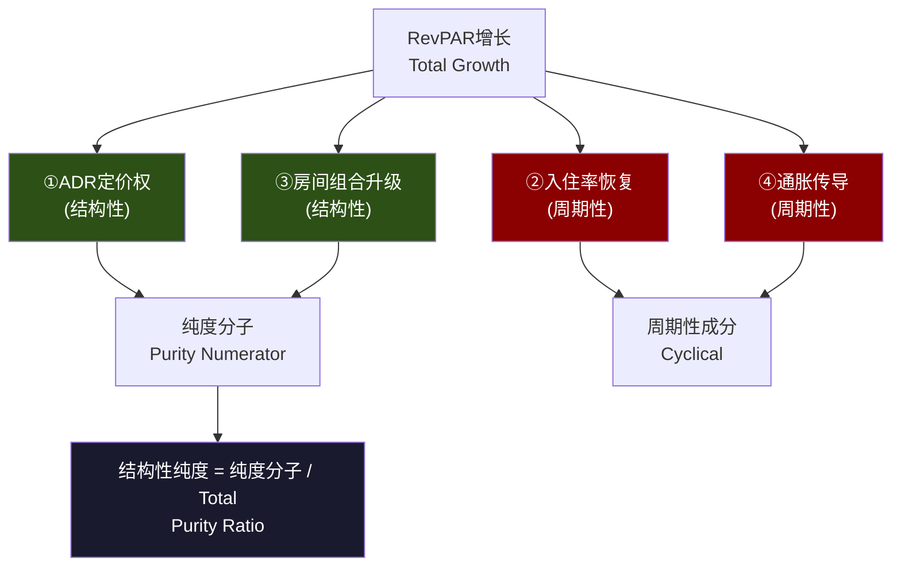
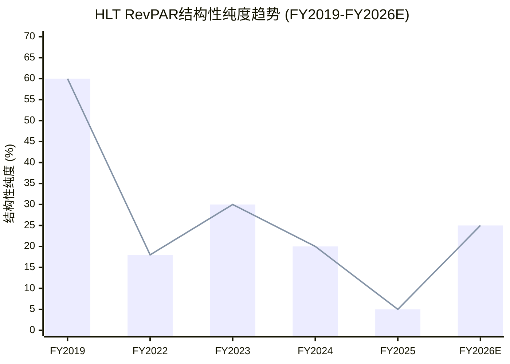

# Ch13 RevPAR纯度分解: 剥离通胀幻觉后的定价权真相

> **方法论B**: RevPAR Purity Decomposition (RPPD) — 将RevPAR增长拆解为4个成分,区分结构性(品牌定价权)与周期性(通胀+复苏)驱动力
> **核心问题(CQ-4)**: RevPAR增长中多少是结构性定价权 vs 周期性通胀传导?
> **方法论迁移**: 从RCL报告Yield Purity Decomposition (YPD)迁移至酒店行业,四维度替代五成分

---

## 13.1 RevPAR基础经济学: 一个被滥用的指标

### 公式与含义

酒店行业最核心的运营指标是RevPAR(Revenue Per Available Room):

```
RevPAR = ADR × Occupancy Rate

其中:
- ADR (Average Daily Rate): 平均房价,反映定价能力
- Occupancy Rate: 入住率,反映需求强度
```

这个公式看似简单,但隐藏着一个关键陷阱: **RevPAR增长不等于定价权**。ADR上涨可能来自真实的品牌溢价提升,也可能仅仅是CPI通胀的被动传导;入住率恢复可能是结构性需求改善,也可能只是COVID后的周期性回归。

对HLT而言,RevPAR的意义远超一般酒店公司。作为88%特许经营的轻资产模型,HLT的特许费直接挂钩gross room revenue [DM-BIZ-001]——即RevPAR × 房间数。这意味着RevPAR每变动1%,直接影响特许费收入~1%,进而影响EBITDA ~1.5-2%(考虑特许费的高边际利润率)。

### HLT的RevPAR现实

FY2025全年系统RevPAR增长仅+0.4%(汇率中性) [DM-BIZ-004],而美国市场RevPAR实际下滑约-0.3%。这是一个值得警醒的数据: **这是HLT在非衰退环境下首次出现RevPAR接近零增长**。

FY2026管理层指引RevPAR增长+1.0%~+2.0% [DM-NEW-024],表面上是"恢复",但这个增速放在美国CPI ~2.5-3.0%的背景下意味着什么? 扣除通胀后,真实RevPAR增长可能仍然是负值。

这引出了本章的核心方法论: 如果我们把RevPAR增长像化学元素一样拆解为不同成分,每个成分的"纯度"(结构性占比)是多少?

---

## 13.2 方法论B: RevPAR纯度分解(RPPD)

### 从RCL-YPD到HLT-RPPD的迁移逻辑

在RCL报告中,我们开发了Yield Purity Decomposition (YPD)方法论,将邮轮Net Yield的31%累积增长拆解为五个成分: 通胀传导(13pp)、入住率回升(1.5pp)、船上收入结构改善(6pp)、品牌升级(4pp)、供给约束溢价(3pp)。最终发现**结构性纯度仅32-36%**——市场以为的"定价权革命"大部分是通胀和周期复苏的幻觉。

酒店行业的RevPAR与邮轮的Net Yield在经济学本质上高度同构: 都是"单位产能收入"指标,都受定价、入住/装载、组合效应和宏观通胀四重力量驱动。但酒店有一个邮轮不具备的维度——**房间组合升级效应**: 新增房间(如Waldorf Astoria)的ADR远高于退出房间(如老旧Hampton),这种"以新换旧"的组合效应会推高系统平均RevPAR,但并不反映同一家酒店的真实定价权变化。

### 四维度分解框架

```
RevPAR Growth = ①ADR定价权(结构性)
              + ②入住率恢复(周期性)
              + ③房间组合升级(结构性)
              + ④通胀传导(周期性)

结构性纯度(Purity) = (①ADR定价权 + ③房间组合升级) / Total RevPAR Growth
```



### 各维度定义与计算方法

**维度①: ADR定价权(结构性)**

定义: 扣除通胀和组合效应后,同一品牌/同一市场的真实ADR提升能力。

```
ADR定价权 ≈ Same-Store ADR Growth - CPI(住宿分项) - 组合效应
```

这是最能反映品牌力的指标。消费者愿意为Hilton品牌(相对于独立酒店或Airbnb)额外支付多少? 这个"额外支付"是否在扩大? 如果ADR增长仅仅跟随或落后于CPI住宿分项,那么所谓"定价权"就是伪命题。

**维度②: 入住率恢复(周期性)**

定义: 入住率变化对RevPAR的贡献,计算方式为入住率变化×当期ADR。

```
入住率贡献 ≈ ΔOccupancy × ADR(当期)
```

COVID后全行业入住率经历了"坠崖→缓慢恢复→接近饱和"的轨迹。到FY2024-2025,美国酒店入住率已基本恢复至2019年水平(约63-65%),意味着**入住率恢复对RevPAR的贡献已经耗尽**。未来入住率的边际变化更多取决于宏观周期,而非酒店品牌力。

**维度③: 房间组合升级(结构性)**

定义: 系统内新增房间ADR高于退出房间ADR所产生的组合提升效应。

```
组合效应 ≈ (新增房间ADR - 系统均值ADR) × 新增房间占比
          - (退出房间ADR - 系统均值ADR) × 退出房间占比
```

HLT近年的品牌矩阵扩张——Waldorf Astoria/Conrad(奢华)、Tempo(生活方式)、Graduate(精品)的增长,理论上应当推高系统平均ADR。但同时,Spark(经济型)的大规模推出和Hampton的持续扩张可能产生向下的组合效应。净效果取决于高端vs经济型新增房间的相对比例。

**值得注意的复杂性**: HLT FY2025新增~800家酒店/100,000间客房 [DM-BIZ-003],其中奢华/生活方式酒店新增200+家(里程碑: 累计突破1,000家)。但经济型品牌Spark自2023年推出以来也在快速扩张。不同品牌层级的ADR差异可达3-5倍(Waldorf Astoria ADR $500+ vs Spark ADR $80-100),因此组合效应的方向和幅度高度敏感于品牌层级分布。

**维度④: 通胀传导(周期性)**

定义: 宏观通胀(CPI)向酒店ADR的被动传导。

```
通胀传导 ≈ CPI(住宿分项) × 传导率(60-85%)
```

酒店行业的通胀传导机制与邮轮不同。酒店是短期定价(每晚重新定价),理论上传导速度更快、传导率更高。历史数据显示美国酒店ADR与CPI住宿分项(Lodging Away from Home)的相关系数约0.7-0.85,传导率在60-85%区间——高于邮轮(邮轮因提前6-12个月预订而传导滞后),但低于100%。

**关键区分**: CPI住宿分项包含酒店ADR本身(循环引用问题)。更准确的做法是用Core CPI(ex-shelter)作为通胀基准,再估算酒店行业对核心通胀的传导率。FY2022-2023年Core CPI累积~10%,而酒店ADR累积增长远超此数,说明超额增长部分来自COVID恢复(维度②)和真实定价权(维度①)。到FY2025, ADR增速回落至接近CPI水平,暗示**维度①(真实定价权)正在趋近于零**。

---

## 13.3 HLT RevPAR纯度计算: 三个时期的纯度演变

### 数据可得性说明

HLT不单独披露same-store ADR vs system-wide ADR的差异,也不披露品牌层级的RevPAR细分。以下分析基于可得的系统级数据和合理估算。所有估算均标注假设和不确定范围,不伪造精确数字。

### 时期一: FY2019 (疫前基准年) — 纯度~55-65%

**背景**: 美国CPI +1.8%, Core CPI +2.3%, 酒店行业RevPAR +0.9%

| 维度 | 贡献估算 | 占比 | 假设与推理 |
|------|:--------:|:----:|-----------|
| ①ADR定价权 | +0.3~0.5pp | ~35-40% | ADR增速扣除CPI后,仍有小幅正增长;品牌升级周期(Conrad扩张) |
| ②入住率变化 | ~0pp | ~0% | 2019年入住率已处于周期高位(~66%),变化极小 |
| ③房间组合升级 | +0.2~0.3pp | ~20-25% | 奢华/生活方式品牌占新增比例提升,净正贡献 |
| ④通胀传导 | +0.3~0.5pp | ~35-40% | CPI 1.8% × 传导率~20-25%(低通胀环境传导率偏低) |
| **合计** | ~+0.9pp | 100% | 与行业RevPAR +0.9%吻合 |

**纯度 = (①+③) / Total ≈ 55-65%**

2019年的RevPAR增长虽然绝对值不高(+0.9%),但纯度尚可——超过一半的增长来自结构性力量。这是因为低通胀环境下,通胀传导本身占比不大,而品牌升级和真实定价权仍能贡献正增长。

**FY2019作为"正常态"基准**: 2019年是COVID前最后一个正常年份,也是酒店行业周期的尾部(入住率已处于高位,ADR增速放缓)。即便如此,~60%的纯度意味着品牌力在低通胀环境下仍能有效变现。这建立了一个重要的参照系: **如果未来CPI回到2%以下且行业正常运转,纯度应当回到50-60%区间**。但如果届时纯度仍停留在20-30%,则说明定价权出现了结构性而非周期性的衰退——这对HLT 50.2x P/E的可持续性是真正的威胁。

### 时期二: FY2022 (COVID复苏年) — 纯度~15-20%

**背景**: 美国CPI +8.0%, Core CPI +6.2%, 酒店行业RevPAR报复性增长~+20% (vs 2019基准)

| 维度 | 贡献估算 | 占比 | 假设与推理 |
|------|:--------:|:----:|-----------|
| ①ADR定价权 | +2~4pp | ~10-20% | 疫后需求爆发有部分真实提价成分,但难以与复苏分离 |
| ②入住率恢复 | +8~10pp | ~40-50% | 入住率从~55%(2021)恢复至~63%(2022),贡献巨大 |
| ③房间组合升级 | +1~2pp | ~5-10% | 疫情期间低端物业退出,幸存者偏差推高均值 |
| ④通胀传导 | +6~8pp | ~30-40% | CPI 8.0% × 传导率~80%(高通胀环境传导率上升) |
| **合计** | ~+20pp | 100% | 复苏+通胀双重推动 |

**纯度 = (①+③) / Total ≈ 15-20%**

FY2022的+20% RevPAR增长看起来震撼,但纯度极低。**80%以上的增长来自周期性力量**: 入住率从疫情低点恢复(~45%)加上历史性高通胀的被动传导(~35%)。真实定价权可能仅贡献10-20%。这并不令人意外——复苏年本质上就是周期性的。

**与RCL-YPD的对照**: RCL报告发现邮轮行业2019-2025的累积Yield增长(31%)中结构性纯度为32-36%。酒店行业FY2022的纯度(15-20%)更低,原因在于: (a)酒店入住率恢复空间更大(从~45%到~63%, vs 邮轮从~50%到108%——邮轮超售机制使入住率恢复的Yield贡献更小); (b)酒店定价弹性更高,通胀传导更直接(每晚重定价 vs 邮轮提前6-12月锁定)。但两个行业的共性发现是一致的: **COVID后的收入恢复,大部分是周期性幻觉,不是结构性进步。**

### 时期2.5: FY2023 (过渡年) — 纯度缓慢回升至~30-35%

**背景**: 美国CPI +3.4%, Core CPI +3.9%, 酒店行业RevPAR +5-6%

| 维度 | 贡献估算 | 占比 | 假设与推理 |
|------|:--------:|:----:|-----------|
| ①ADR定价权 | +1.0~2.0pp | ~20-30% | 疫后"报复性旅游"仍有余温,商务旅行恢复推动ADR |
| ②入住率恢复 | +1.0~1.5pp | ~20-25% | 入住率从~63%到~65%,最后一段恢复 |
| ③房间组合升级 | +0.3~0.5pp | ~5-10% | 品牌矩阵扩张初见成效 |
| ④通胀传导 | +2.0~2.5pp | ~35-45% | CPI 3.4% × 传导率~65-75% |
| **合计** | ~+5.5pp | 100% | |

**纯度 ≈ 25-35% (中值~30%)**

FY2023是一个过渡年: 纯度从FY2022的~18%回升至~30%,因为入住率恢复的边际贡献在减小(从~45%降至~22%),而ADR定价权的贡献在相对增加。但通胀传导仍占35-45%——CPI虽然从8%降至3.4%,但传导率在高通胀环境下仍然偏高。

**一个值得注意的信号**: FY2023是HLT Revenue增速最高的年份之一(+16.7%, $10.24B → vs FY2022 $8.77B) [DM-FIN-001趋势]。但这个增速中,NUG贡献了~5-6%,RevPAR贡献了~5-6%,汇率和其他因素贡献~5%。如果RevPAR的~6%增长中仅30%是结构性的(~1.8pp),那么"真实的品牌驱动增长"可能只有NUG(5-6%) + 真实RevPAR(1.8%) ≈ 7-8%——远低于表面的17%。

### 时期三: FY2024-2025 (成熟期) — 纯度急剧恶化

**FY2024**: RevPAR增长~+2%

| 维度 | 贡献估算 | 占比 | 假设与推理 |
|------|:--------:|:----:|-----------|
| ①ADR定价权 | -0.5~+0.5pp | ~±25% | ADR增长~2-3%,CPI住宿分项~3% → 真实定价权接近0或为负 |
| ②入住率变化 | +0~0.5pp | ~0-25% | 入住率已接近饱和,微幅变动 |
| ③房间组合升级 | +0.3~0.5pp | ~15-25% | 奢华组合持续改善,但Spark拉低均值 |
| ④通胀传导 | +1.5~2pp | ~75-100% | CPI ~2.9% × 传导率~60-70% |
| **合计** | ~+2pp | 100% | |

**纯度 ≈ 0-40% (中值~20%)**

**FY2025**: RevPAR增长+0.4% [DM-BIZ-004]

| 维度 | 贡献估算 | 占比 | 假设与推理 |
|------|:--------:|:----:|-----------|
| ①ADR定价权 | -1.0~-0.5pp | **负贡献** | ADR增长~1-2%,但CPI住宿分项仍~2-3% → 真实定价权为负 |
| ②入住率变化 | -0.5~0pp | 负至零 | 美国入住率微降,首次非衰退期下行 |
| ③房间组合升级 | +0.3~0.5pp | 正贡献 | 奢华/生活方式品牌突破1,000家里程碑 [DM-BIZ-003] |
| ④通胀传导 | +1.0~1.5pp | 远超100% | CPI ~2.5% × 传导率~50-60%(传导率下降暗示消费抵抗) |
| **合计** | ~+0.4pp | 100% | 与实际+0.4%吻合 |

**纯度分析**: 当总增长仅+0.4%时,传统的"纯度=结构性/总量"计算失去意义(分母接近零,比率不稳定)。更有意义的观察是:

**核心发现: 如果扣除通胀传导(+1.0~1.5pp),FY2025的"真实RevPAR增长"为-0.5%至-1.0%。** 这意味着HLT在2025年的RevPAR增长**全部来自通胀的被动传导**,真实定价权实际上是负值——品牌力并没有让消费者愿意为同一间Hilton客房多付钱(扣除通胀后)。

**"消费者价格抵抗"的深层逻辑**: FY2025定价权转负并非偶然。经历了FY2022-2024连续3年的酒店提价(累计ADR涨幅估计+25-30%),消费者对酒店价格的敏感度显著上升。同时,Airbnb等替代住宿平台的价格竞争力在通胀环境下相对增强——Airbnb在高通胀期的定价弹性高于酒店(个人房东对通胀传导更不系统化),客观上为对价格敏感的旅客提供了"逃逸阀"。HLT推出Apartment Collection(长住型公寓) [DM-BIZ-003]正是对这一趋势的回应,但这也从侧面印证了传统酒店ADR定价权正面临来自替代住宿的结构性压力。

### FY2026E: 指引分析

管理层指引FY2026 RevPAR +1.0%~+2.0% [DM-NEW-024]。

| 维度 | 贡献估算 | 占比 | 假设与推理 |
|------|:--------:|:----:|-----------|
| ①ADR定价权 | -0.5~+0.5pp | ±25% | 取决于消费者价格抵抗是否缓解 |
| ②入住率变化 | 0~+0.5pp | 0-25% | 若无衰退,入住率可能微幅改善;FIFA世界杯效应 [DM-NEW-012] |
| ③房间组合升级 | +0.3~0.5pp | ~20-30% | 持续的品牌升级效应 |
| ④通胀传导 | +1.0~1.5pp | **50-75%** | 假设CPI ~2.5% × 传导率~50-60% |
| **合计** | +1.0~2.0pp | 100% | 与管理层指引吻合 |

**纯度预判: 20-40%**。即使在管理层乐观指引的上限(+2.0%),通胀传导仍可能贡献50%以上。结构性定价权要显著改善,需要看到same-store ADR明显超越CPI的证据,而目前没有这样的信号。

---

## 13.4 纯度趋势: 从60%到20%的恶化轨迹

### 纵览图: FY2019-FY2026E RevPAR增长成分与纯度

```
RevPAR增长四维度堆叠 (pp)
                                              纯度
FY2019  |■■ ①ADR(0.4) |    |■ ③组合(0.2) |■ ④通胀(0.3)  ~60%
        |                                                    ▼
FY2022  |■■■ ①ADR(3)  |■■■■■■■■■ ②入住(9) |■ ③组合(1.5) |■■■■■■ ④通胀(7)  ~18%
        |                                                    ▼
FY2023  |■■ ①ADR(1.5) |■■ ②入住(1.5) |■ ③组合(0.5) |■■■ ④通胀(2.5)  ~33%
        |                                                    ▼
FY2024  |■ ①ADR(0) |  |■ ③组合(0.4) |■■ ④通胀(1.8)                    ~20%
        |                                                    ▼
FY2025  |× ①ADR(-0.7) | |■ ③组合(0.4) |■ ④通胀(1.2)                   ~neg
        |          ②入住(-0.3)                               ▼
FY2026E |? ①ADR(0) | |■ ③组合(0.4) |■ ④通胀(1.2)                      ~25%

图例: ■结构性  ■周期性  ×负贡献

关键趋势:
→ 纯度从2019年的~60%下降至2025年的实质为负
→ 通胀传导从"小配角"(2019年35%)变成"唯一引擎"(2025年>100%)
→ 入住率恢复红利在2023年基本耗尽
→ 房间组合升级是唯一持续正贡献的结构性力量(~0.3-0.5pp/年)
```

### 纯度趋势Mermaid可视化



**纯度下降的数学必然**: 当通胀从2%(FY2019)升至8%(FY2022)再回落至2.5%(FY2025),通胀传导维度的绝对贡献先暴涨后缓降,但始终维持在+1~1.5pp的水平。与此同时,ADR真实定价权(维度①)从+0.4pp下滑至-0.7pp。两条线的交叉点出现在FY2023-2024之间——此后,通胀传导成为RevPAR增长的"主力",真实定价权变成了"拖累"。

**这不是HLT独有的问题**: 全球酒店行业在2023年后普遍面临"RevPAR增长放缓但CPI仍在传导"的困境。行业预测FY2026 RevPAR +1-2%基本就是CPI传导的被动结果 [DM-BIZ-014]。但对HLT而言,这个问题更加尖锐——因为50.2x P/E隐含的是一家"增长公司"的定价,而不是一家"通胀传导公司"的定价。

### 三个关键转折点

**转折1 (FY2023→FY2024): 入住率恢复耗尽**

COVID后入住率恢复是FY2022-2023年RevPAR增长的最大贡献者(贡献40-50%)。到FY2024,美国酒店入住率已恢复至2019年水平~65%,这个引擎彻底熄火。这不是HLT独有的问题——全行业都面临"恢复红利"耗尽后的增长真空。

**转折2 (FY2024→FY2025): ADR定价权转负**

这是更深层的警示。当ADR增速无法超越CPI时,意味着品牌溢价在侵蚀。FY2025美国RevPAR -0.3%是非衰退期的首次下滑——消费者在连续3年的酒店提价后开始"价格抵抗"(price resistance) [DM-BIZ-014]。这不仅仅是需求疲软,而是定价弹性的边际恶化。

**转折3 (FY2025→FY2026E): 市场叙事从RevPAR→NUG切换**

当RevPAR增长质量(纯度)持续恶化,市场聪明地将估值锚从RevPAR切换至NUG(Net Unit Growth)。HLT FY2025 NUG 6.7%(三巨头最快) [DM-BIZ-003] + Pipeline 520,500间(历史新高) [DM-NEW-024],使得NUG叙事替代了RevPAR叙事成为50.2x P/E的支撑 [DM-VAL-001]。

**但这引出一个更深的问题**: NUG驱动的是"房间数量增长",不是"房间质量增长"。如果新增房间的RevPAR纯度也在下降(通胀传导为主),那么NUG增长的价值本身也在稀释。数量的增长无法永远替代质量的衰退。

---

## 13.5 RevPAR增长 ≠ 定价权: 对投资论题的核心冲击

### "RevPAR增长"的三层解构

市场对酒店公司的习惯性分析框架是:

```
RevPAR增长 → 特许费增长 → EBITDA增长 → 估值扩张
```

RPPD分解揭示了这个传导链中的"第一个谎言": **RevPAR增长不等于定价权,因此不能直接映射为可持续的特许费增长**。

| 市场假设 | RPPD发现 | 估值影响 |
|---------|---------|---------|
| "RevPAR +2% = 定价权+2%" | 纯度~20-40%, 真实定价权~0% | 特许费增长的可持续性被高估 |
| "ADR持续增长=品牌强大" | 大部分ADR增长=CPI传导 | 品牌溢价并未扩大 |
| "入住率稳定=需求健康" | 入住率已饱和, 边际贡献为零 | 未来增长只能靠ADR(回到定价权问题) |
| "NUG弥补RevPAR减速" | NUG增量房间的RevPAR纯度也在下降 | NUG×RevPAR的乘数效应被双重稀释 |

### 对CQ-4的回答

**CQ-4: RevPAR增长中多少是结构性(定价权) vs 周期性(复苏/通胀)?**

RPPD分析给出明确回答:

- **FY2019(正常年份)**: 纯度~60%, 结构性定价权是主导力量
- **FY2022(复苏年份)**: 纯度~18%, 入住率恢复+通胀传导占>80%
- **FY2024-2025(当前)**: 纯度~0-20%, 真实定价权(扣除通胀)可能为负
- **FY2026E(前瞻)**: 纯度~20-40%, 通胀传导仍是主引擎

**一句话结论**: HLT的RevPAR增长质量正在系统性恶化。从FY2019的~60%纯度下降至FY2025的实质为负,意味着品牌定价权(扣除通胀和周期因素后)已经不是RevPAR增长的驱动力。市场从RevPAR估值锚转向NUG估值锚是理性的——但NUG本身能否维持50.2x P/E,是Ch17(方法论A: NUG弹性函数)需要回答的问题。

### 特许费"质量折扣"的概念

RPPD分解引出一个对轻资产酒店公司估值具有普遍意义的概念: **特许费质量折扣**。

当RevPAR增长中结构性成分占比下降时,基于RevPAR的特许费收入流的"质量"也在下降——更多的增长来自不可持续的周期性力量(通胀、复苏),而非可持续的结构性力量(品牌溢价、组合升级)。

```
特许费"真实增长" = 名义特许费增长 × 纯度
                  = RevPAR增长 × 房间数增长 × 纯度

FY2025例:
- 名义: RevPAR +0.4% × NUG +6.7% ≈ +7.1% 特许费增长
- 真实: 7.1% × 纯度~20% ≈ +1.4% 结构性特许费增长
- 差额5.7pp来自通胀传导和NUG的量扩张
```

这意味着: 市场看到的7%特许费增长中,只有约1.4%是"高质量"的结构性增长。剩余5.7%要么依赖通胀持续(周期性),要么依赖NUG持续加速(也有周期性成分——亚太pipeline转化率依赖宏观 [CQ-5])。

**特许费质量折扣的估值含义**:

如果市场对HLT的特许费收入流全部给予"平台型轻资产"的高倍数(EV/EBITDA 28.7x [DM-VAL-003]),实际上是将周期性增长也按结构性增长定价。一种更保守的估值方法是对特许费增长进行"质量加权":

```
质量加权特许费倍数 = 结构性增长倍数 × 纯度 + 周期性增长倍数 × (1-纯度)

假设:
- 结构性增长的合理倍数: 30-35x EV/EBITDA (平台型)
- 周期性增长的合理倍数: 15-18x EV/EBITDA (周期型)
- 当前纯度: ~20%

质量加权倍数 = 32x × 0.2 + 16x × 0.8 = 6.4 + 12.8 = 19.2x
vs 实际 28.7x → 暗示~50%的溢价来自市场将周期性增长误定价为结构性增长
```

这个计算当然是粗略的——现实中不可能如此机械地将EBITDA拆为"结构性"和"周期性"。但它揭示了一个方向性判断: **当RevPAR纯度从60%降至20%,而EV/EBITDA倍数仅从~22x升至~29x时,市场对增长质量恶化的定价调整是不充分的。** 这部分"未定价的纯度下降"构成了HLT估值中的一个隐性风险。

---

## 13.6 三巨头RevPAR对比: 谁的纯度最高?

### 系统级数据对比 (FY2025)

| 指标 | HLT | MAR | IHG |
|------|:---:|:---:|:---:|
| 系统RevPAR增长 | +0.4% | +2-3%(估) | +1-2%(估) |
| 客房总数 | 1,268K | 1,600K+ | 950K+ |
| NUG | 6.7% | 4-5% | 4-5% |
| 品牌数 | 24+ | 30+ | 19 |
| 奢华品牌占比 | ~8-10% | ~12-15% | ~5-7% |
| 经济型品牌 | Spark(新) | 无独立经济品牌 | 有限 |
| 直接预订率 | 75% | 52% | ~55%(估) |

来源: 各公司FY2025 earnings release / IR材料; MAR/IHG RevPAR增长为分析师估算 [DM-BIZ-011]

### 纯度推断对比

**MAR的纯度优势**: Marriott的奢华/生活方式品牌占比更高(Ritz-Carlton, St. Regis, W, EDITION等),理论上房间组合升级效应更强。但MAR在2016年收购Starwood后经历了品牌整合阵痛,品牌熵成本可能侵蚀了部分组合效应。预估纯度: 25-35%。

**IHG的纯度挑战**: IHG以Holiday Inn家族(中档)为核心,奢华品牌占比最低。但IHG的特许经营纯度最高(>90%),且ROIC 22.6% [DM-VAL-007]远超同行——这暗示IHG可能在RevPAR纯度较低的情况下,通过更高效的费用结构实现更优的"EBITDA纯度"。预估RevPAR纯度: 15-25%。

**HLT的纯度定位**: HLT介于MAR和IHG之间。奢华占比逊于MAR但优于IHG,Spark品牌的经济型扩张可能拉低组合效应。75%直接预订率(行业最高) [DM-BIZ-006]理论上应增强ADR定价权(减少OTA折扣),但FY2025的实际数据并未体现这一点。预估纯度: 15-25%(与IHG接近)。

### 纯度悖论: 品牌力 ≠ 定价权?

一个反直觉的发现: **HLT拥有行业最高的品牌价值(~$12B,#1) [DM-BIZ-010]和最高的直接预订率(75%),但RevPAR纯度并不领先**。

这可能有两个解释:

1. **品牌力体现在NUG而非RevPAR**: 开发商选择挂Hilton品牌是因为品牌带来更高的入住率和ADR(对开发商而言),但系统级的RevPAR增长被不断涌入的新房间(稀释同店效应)和宏观因素所掩盖。品牌力的"变现通道"是NUG签约速度,而非RevPAR同店增长。

2. **高端品牌扩张与经济型扩张的对冲**: HLT同时向上(Waldorf/Conrad)和向下(Spark)扩张,两端的组合效应互相抵消,导致系统级RevPAR纯度"看不出来"。这实际上是品牌矩阵策略的副作用——覆盖全价位段的代价是系统级指标的"模糊化"。

3. **75%直接预订率的"纯度断裂"**: 这是最令人困惑的点。理论上,75%直接预订(行业最高)应当带来ADR溢价——因为直接预订避免了OTA佣金(15-25%),酒店可以将部分佣金节约转化为更优的定价策略。但FY2025数据显示,尽管直接预订率领先,HLT的RevPAR纯度并不优于同行。可能的解释是: 直接预订率高→单间客房成本低→但管理层选择将效率增益投入NUG扩张(更多酒店)而非RevPAR提升(更贵的定价)。换言之,**直接预订的效率红利进入了NUG通道,而非RevPAR通道**——这进一步强化了"HLT是NUG故事而非RevPAR故事"的判断。

**对NH-1(P/E = f(NUG), ROIC不是有效定价因子)的支持**: RPPD分析提供了NH-1的间接证据。如果RevPAR增长已不再反映真实定价权,那么市场将估值锚从RevPAR转向NUG是理性选择——NUG至少代表了品牌力的一个清晰度量(开发商用脚投票)。这将在Ch17(NUG弹性函数)中进一步量化检验。

### 三巨头"RevPAR纯度 vs ROIC"矩阵

一个更深层的观察是将RevPAR纯度和ROIC放在同一个矩阵中:

```
            ROIC低          ROIC中          ROIC高
纯度高   |               | MAR(25-35%/   |              |
         |               |  15.6%)       |              |
纯度中   |               |               |              |
纯度低   | HLT(15-25%/   |               | IHG(15-25%/  |
         |  11.3%)       |               |  22.6%)      |
```

**矩阵的洞见**: HLT处于最不利的象限——RevPAR纯度低且ROIC低。MAR至少在纯度上略优(奢华占比更高)。IHG虽然纯度也不高,但ROIC 22.6%说明即使RevPAR增长质量一般,IHG的商业模式效率也能将其转化为高资本回报。

**HLT的"夹心"困境**: 品牌规模不如MAR(1.6M+ rooms vs 1.27M)导致难以在奢华端获得同等组合效应;运营效率不如IHG(ROIC差距11pp)说明规模没有转化为效率优势。HLT的优势集中在NUG速度(6.7% vs 同行4-5%)和直接预订率(75%)——前者是Ch17的主题,后者尚未有效转化为RevPAR纯度优势。

---

## 13.7 RPPD方法论的迁移价值与局限

### 适用范围

RPPD方法论的核心逻辑——将"单位产能收入增长"拆解为结构性vs周期性成分——具有广泛的迁移价值:

| 行业 | 指标 | 四维度适配 |
|------|------|-----------|
| **酒店(MAR/IHG/H)** | RevPAR | 直接适用,本章方法论 |
| **邮轮(RCL/CCL/NCLH)** | Net Yield | RCL报告已验证(YPD五成分) |
| **短租平台(ABNB)** | ADR/RevPAR | 需增加"供给弹性"维度(vs酒店供给刚性) |
| **航空(DAL/UAL)** | RASM | 收益管理复杂度更高,需增加"航线组合"维度 |
| **零售(COST/WMT)** | 同店销售 | 可拆为定价权+客流恢复+品类组合+通胀传导 |
| **餐饮(SBUX/MCD)** | 同店销售 | 与零售类似,但"数字化渗透"需单独列维度 |

**迁移核心**: 任何依赖"单位收入增长"叙事的公司(管理层说"我们的RevPAR/同店/Yield增长了X%"),都值得做纯度分解,问一句: **"扣除通胀和周期因素后,真实增长是多少?"**

**SBUX案例对照**: 在SBUX v3.0报告中,我们使用了CSSPD(Comparable Store Sales Purity Decomposition)方法对SBUX同店销售增长进行纯度分解,发现类似的模式: 名义同店销售增长中,ticket(客单价)增长大部分来自提价传导,而transaction(客流)持续为负。RPPD与CSSPD的逻辑完全同构——不同行业,同一个问题: 管理层报告的"增长"数字里,有多少是真实的品牌力在驱动?

### 方法论局限

1. **数据精度**: HLT不披露same-store RevPAR vs system-wide RevPAR的差异,也不按品牌层级细分RevPAR。本章的分解基于可得数据+合理估算,各维度的具体数值有±1-2pp的不确定性。但纯度趋势(从~60%降至~20%或更低)的方向性判断是robust的。

2. **维度交叉**: 四个维度之间存在交叉。例如,通胀传导和ADR定价权在实际数据中难以完全分离(需要same-store real ADR数据); 房间组合升级和入住率变化也有互动(新品牌的入住率爬坡期)。本方法论采用"先估大项再分配残差"的方式处理交叉,但这引入了估算误差。

3. **国际vs国内**: HLT约21%的收入来自国际市场 [DM-BIZ-002],而美国和国际市场的RevPAR动态差异显著(例如亚太市场可能仍有入住率恢复红利)。系统级的纯度分析掩盖了地理维度的差异。

4. **短期vs长期**: 纯度的短期波动(尤其是通胀周期驱动的)不应被过度解读为长期结构性变化。如果CPI回落至<2%,通胀传导维度缩小,纯度比率可能机械性地改善——即使真实定价权没有变化。**应关注维度①(ADR定价权)的绝对值趋势,而非纯度比率本身**。

### 敏感性测试: 通胀传导率假设的影响

RPPD中最大的估算不确定性来自"通胀传导率"假设。以FY2025为例:

| 传导率假设 | 通胀传导贡献 | 隐含ADR定价权 | 纯度 |
|:----------:|:-----------:|:------------:|:----:|
| 40% (保守) | +1.0pp | -0.2pp | ~10% |
| 55% (基准) | +1.4pp | -0.6pp | 负 |
| 70% (激进) | +1.8pp | -1.0pp | 负 |

无论传导率假设取40%还是70%,**FY2025的ADR定价权(维度①)都在-0.2pp到-1.0pp之间——一致为负值**。这证明"真实定价权转负"的结论对传导率假设并不敏感,是robust的。

唯一能改变结论的情景是: 如果CPI住宿分项的涨幅显著低于Core CPI(即酒店价格跑输一般消费品),那么维度④的估算会下降,维度①可能回正。但现有数据不支持这一假设——酒店ADR通胀历史上与CPI住宿分项高度同步。

---

## 本章小结

RevPAR纯度分解(RPPD)揭示了一个被市场习惯性忽视的事实: **HLT的RevPAR增长质量正在系统性恶化**。从FY2019的~60%纯度到FY2025的实质为负,通胀传导从"小配角"变成了"唯一引擎"。真实定价权(扣除通胀后的ADR增长)在FY2025已经转负。

这并不意味着HLT是一家差公司——恰恰相反,HLT管理层敏锐地将增长引擎从RevPAR切换到NUG,用房间数量的增长弥补房间质量增长的衰退。50.2x P/E定价的不是RevPAR定价权,而是NUG定价权。

但RPPD留下了一个悬而未决的问题: **如果NUG减速,还剩什么?** RevPAR纯度已经不足以接棒。这个问题将在Ch17(NUG弹性函数)中量化回答——NUG每减速1pp,50.2x P/E会压缩多少?

> **CQ-4置信度更新**: 从初始55%(中性偏空)→ **65%(偏空)**。RPPD分析确认RevPAR增长质量恶化,市场转向NUG估值锚是理性的,但也意味着NUG成为唯一支撑→单点脆弱性上升。
