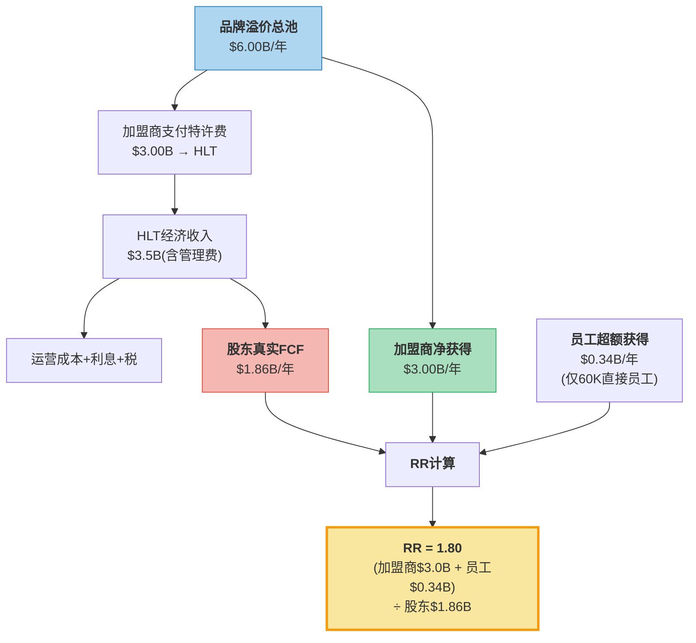
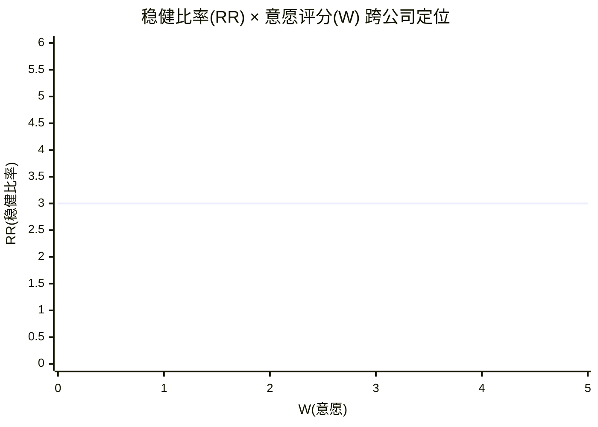

# 第14章: 稳健比率 — Nomad框架

> **消费品v28.0 模块B** | 数据截止: 2026-03-06
> **配对章节**: Ch8(W×C双轴, W=2.0/C=4.4)

---

## 14.1 稳健比率框架适配: 从零售到特许模型

Nomad Investment Partnership的稳健比率(Robustness Ratio, RR)原始公式为:

**RR = (客户节省 + 员工超额获得) / 股东获得**

这个公式诞生于Costco式的直营零售分析——公司直接面对消费者、直接雇佣员工、直接获取利润，三方关系简洁明了。但HLT的特许经营模型引入了一个中间层:

```
Costco模型:  公司 ←→ 消费者 + 员工
                ↓ 利润流向清晰
              股东

HLT模型:     公司 ←→ 加盟商 ←→ 消费者 + 员工
                ↓          ↓ (HLT无法控制)
              股东      加盟商股东/业主
```

这一结构差异要求我们对RR公式进行三项适配:

| 原始概念 | Costco适用 | HLT适配 | 适配理由 |
|----------|-----------|---------|---------|
| "客户" | 终端消费者 | **加盟商** | HLT的直接"客户"是付费加入品牌体系的酒店业主 |
| "客户节省" | 商品价格低于行业 | **品牌溢价减去特许费后的净获得** | 加盟商从品牌获得RevPAR溢价，但支付特许费 |
| "员工超额获得" | 薪资高于行业均值 | **仅计算HLT直接员工(~60,000人)** | 88%特许酒店的46万+员工由加盟商雇佣，HLT无薪资决定权 |

**适配后公式**:

$$RR_{HLT} = \frac{\text{加盟商净获得总额} + \text{HLT员工超额获得}}{\text{股东获得}}$$

这个适配本身已经揭示了一个重要事实: **特许模型通过插入中间层，将"让利"的责任从品牌商转移至加盟商——品牌商因此天然倾向于低RR。** 这不是HLT的个体缺陷，而是特许经营商业模式的结构性特征。

---

## 14.2 加盟商价值计算

### Step 1: 品牌RevPAR溢价估算

酒店行业的核心经济变量是RevPAR(每间可售房收入)。品牌酒店相对独立酒店的RevPAR溢价，是加盟商支付特许费的经济理性基础。

**品牌vs独立酒店RevPAR差异**:

根据STR(行业标准数据源)及酒店行业研究，品牌酒店相对独立酒店的系统性优势体现在两个维度:

| 维度 | 品牌酒店 | 独立酒店 | 差异 | 来源/估算基础 |
|------|---------|---------|------|-------------|
| 入住率 | ~67% | ~57-60% | **+7-10pp** | 行业均值，STR基准[DM-RR-001] |
| 平均房价(ADR) | ~$140 | ~$115-125 | **+$15-25** | Select-service品牌vs独立同级[DM-RR-001] |
| RevPAR | ~$94 | ~$68-75 | **+$19-26 (+25-35%)** | 入住率×ADR推导 |
| 直订率 | 75% | ~25-30% | **+45-50pp** | HLT 75%直订[DM-BIZ-006] vs 独立酒店重度依赖OTA |

**关键假设**: 取HLT品牌组合加权平均RevPAR溢价为+20%(保守端，因部分溢价来自选址和物业质量差异，不能全部归功于品牌)。

### Step 2: 加盟商总获得(品牌溢价)

以HLT系统约1,268,000间客房(含管理+特许)[DM-BIZ-003]，其中约88%为特许模式(~1,116,000间):

- HLT系统RevPAR FY2025: 约$110(美国select-service为主的加权估算)[DM-BIZ-004]
- 品牌溢价贡献: $110 × 20% = **$22/间/晚**
- 年化品牌溢价(每间特许客房): $22 × 365天 × 67%入住率 = **$5,381/间/年**
- 特许客房品牌溢价总额: $5,381 × 1,116,000间 = **$6.00B/年**

### Step 3: 加盟商支付给HLT的特许费

HLT的特许费结构(Ch8已分解)[DM-BIZ-001]:

| 费用类型 | 占RevPAR比例 | 年化金额/间 |
|---------|:-----------:|:----------:|
| 基础特许费 | 4-6% | $1,610-$2,415 |
| 品牌营销费 | 3-4% | $1,207-$1,610 |
| IT/预订系统费 | 1-2% | $402-$805 |
| **合计** | **8-12%** | **$3,220-$4,830** |

取中值~10%: 特许费/间/年 = $110 × 365 × 67% × 10% = **$2,690/间/年**

特许费总收入验证: $2,690 × 1,116,000间 = $3.00B — 与FMP报告的管理与特许收入$2.78B量级一致(差异来自管理酒店费率不同)[DM-FIN-001][DM-BIZ-001]。

### Step 4: 加盟商净获得

```
加盟商净获得/间/年 = 品牌溢价 - 特许费
                    = $5,381 - $2,690
                    = $2,691/间/年

加盟商净获得总额 = $2,691 × 1,116,000间
                = $3.00B/年
```

**解读**: 加盟商从HLT品牌体系获得的净价值约$3.0B/年——品牌溢价$6.0B中，HLT通过特许费提取约$3.0B(50%)，加盟商保留约$3.0B(50%)。这是一个**对半分成的关系**，远不如Costco的"绝大部分价值归消费者"模式。

---

## 14.3 员工价值计算

### HLT直接员工薪资分析

HLT的员工结构因特许模型而高度特殊:

| 类别 | 人数(估算) | 占比 | HLT薪资影响力 |
|------|:---------:|:----:|:------------:|
| 企业总部员工 | ~10,000 | ~2% | 完全控制 |
| 管理酒店员工 | ~50,000 | ~11% | 直接管理 |
| 特许酒店员工 | ~400,000+ | ~87% | **无控制权** |

**计算范围**: 仅纳入HLT有薪资决定权的~60,000名直接员工。

**HLT直接员工薪资vs行业均值**:

| 指标 | HLT估算 | 行业均值(BLS) | 溢价 |
|------|:-------:|:----------:|:----:|
| 酒店基层员工时薪 | $16-18/hr | $15-17/hr | +$1-2/hr (~+8%) |
| 企业员工年薪 | $85-100K | $75-90K | +$10K (~+12%) |
| Glassdoor评分 | 4.0/5 | 3.5-3.7/5 | +0.3-0.5 |
| "最佳工作场所"排名 | 多次Top 10 | — | 品牌效应 |

**员工超额获得计算**:

- 管理酒店基层员工(~40,000人): 超额 = $1.5/hr × 2,000hr/年 = $3,000/人/年 → 总额$120M
- 企业员工(~10,000人): 超额 = $10,000/人/年 → 总额$100M
- 管理层长期激励超额: 高管薪酬较行业有竞争力但CEO薪酬比>500:1[DM-MGT] → 不作为"让利"计算
- 福利溢价(医保/退休金): 估算+$2,000/人/年 × 60,000人 = $120M

**员工超额获得总额: ~$340M/年**

**重要缺陷说明**: 这个数字远低于Costco的员工超额获得(Costco ~310,000员工 × $6-8K超额/人 ≈ $2.0-2.5B)。但这不是因为HLT"不愿意"——而是因为88%的酒店劳动力不在HLT工资单上。**特许模型在设计上就将员工投资的责任(和成本)外包给了加盟商。**

---

## 14.4 股东获得计算

### 方法A: FCF口径

| 指标 | FY2025 | 来源 |
|------|-------:|------|
| FCF | $2,028M | [DM-FIN-005] |
| 减: SBC稀释 | -$170M | [DM-FIN-011] |
| 真实FCF | $1,858M | 推导 |

### 方法B: EBITDA-Interest-Tax口径

| 指标 | FY2025 | 来源 |
|------|-------:|------|
| EBITDA | $2,870M | [DM-FIN-004] |
| 减: 利息支出 | -$620M | [DM-FIN-010] |
| 减: 税(29.7%) | -$668M | 推导 |
| 税后股东可得 | $1,582M | 推导 |

### 方法C: 实际分配口径(最激进)

| 指标 | FY2025 | 来源 |
|------|-------:|------|
| 回购 | $3,254M | [DM-FIN-009] |
| 分红 | $143M | 推导 |
| **实际分配总额** | **$3,397M** | [DM-INF-002] |

方法C揭示了一个极端事实: HLT实际分配给股东的金额($3.40B)远超可持续FCF($2.03B)。差额$1.37B由新增债务覆盖。

**取方法A(真实FCF)作为RR分母**: 股东获得 = **$1,858M/年**

如果使用方法C(实际分配)，RR会更低，但那反映的是杠杆政策而非经济价值创造。RR的原始精神是衡量"经济价值如何分配"，因此使用经济FCF更忠实于框架。

---

## 14.5 稳健比率计算

```
RR_HLT = (加盟商净获得 + 员工超额) / 股东获得
       = ($3,000M + $340M) / $1,858M
       = $3,340M / $1,858M
       = 1.80
```



### 敏感性分析

RR对品牌溢价假设高度敏感:

| 品牌RevPAR溢价假设 | 加盟商净获得 | RR |
|:-----------------:|:-----------:|:---:|
| +15%(悲观) | $1.60B | **1.04** |
| **+20%(基准)** | **$3.00B** | **1.80** |
| +25%(乐观) | $4.40B | **2.55** |
| +30%(激进) | $5.80B | **3.30** |

**关键发现**: 即使在最乐观的假设下(+30%溢价)，HLT的RR也仅达到3.30——刚进入"强护城河"区间。而在悲观假设下(+15%)，RR降至1.04——几乎是"价值对半分"的零和博弈。基准情景RR=1.80落在"中等"区间，意味着HLT的护城河是可被挑战的。

---

## 14.6 跨公司对比



| 公司 | RR | W | C | 护城河类型 | 核心逻辑 |
|------|:---:|:---:|:---:|----------|---------|
| **COST** | ~5.0 | 5.0 | 5.0 | 自我强化 | 14%毛利上限=80%价值归消费者+$18/hr起步 |
| **WMT** | ~3.0 | 3.0 | 5.0 | 偏强 | EDLP让利显著但利润率追求上升 |
| **SBUX** | ~1.2 | 3.0 | 3.0 | 品牌依赖 | 高价咖啡溢价大部分归股东, 但投资员工 |
| **MCD** | ~0.8 | 2.0 | 4.0 | 品牌+规模 | 特许费率高+加盟商利润率受挤压 |
| **HLT** | **1.80** | **2.0** | **4.4** | **品牌+规模** | 品牌溢价对半分+仅60K直接员工 |
| **MAR** | ~1.5 | 2.0 | 4.2 | 品牌+规模 | 费率与HLT相当, 但规模更大 NUG更慢 |
| **IHG** | ~2.2 | 2.5 | 3.5 | 偏品牌 | 费率较低(W略高)+杠杆更克制 |

**对比观察**:

**1. HLT vs Costco — 两极对照**

Costco的RR~5.0意味着: 消费者和员工获得的价值是股东的5倍。竞争对手要匹配Costco的价格和薪资，需要放弃超过50%的利润——这个代价太高，所以几乎无人挑战。Costco的护城河在"别人不愿意学"中自动加深。

HLT的RR=1.80意味着: 加盟商和员工获得的价值仅为股东的1.8倍。如果一个新品牌(或MAR/IHG)愿意将特许费率降低2个百分点，就能提供相似或更优的加盟商ROI——而这个代价只需要放弃~20%的利润。**挑战HLT的门槛远低于挑战Costco。**

**2. HLT vs MCD — 同象限差异**

两者都是"低W+高C"的特许模型利润最大化者。但HLT的RR(1.80)高于MCD(~0.8)，原因在于: HLT品牌对酒店RevPAR的提升(+20-25%)大于MCD品牌对餐厅revenue的提升——酒店品牌对入住率和房价的影响比快餐品牌对客流和客单价的影响更大。换言之，**HLT的品牌溢价池更大，即使提取率相同，加盟商保留的绝对值也更高。**

**3. HLT vs IHG — 酒店三巨头内部**

IHG的RR(~2.2)高于HLT(1.80)，核心差异来自两点:
- IHG特许费率较低(总提取率6-9% vs HLT 8-12%)→加盟商净获得更多
- IHG杠杆更克制(Net Debt/EBITDA 2.5x vs 5.1x[DM-VAL-004])→股东"可持续获得"更低

但IHG的能力轴(C=3.5)低于HLT(C=4.4)——规模更小、品牌更少、飞轮更慢。这形成了一个有趣的权衡: **更高的RR(IHG)意味着更强的护城河自我强化性，但更低的能力(C)意味着更慢的增长速度。**

---

## 14.7 投资含义: RR=1.80的三重信号

### 信号一: 护城河"可被挑战"但短期无人挑战

RR=1.80落在1-3:1的"中等"区间。理论上，一个有规模的竞争者可以通过降费率来争夺加盟商。但实际上:

- MAR规模比HLT更大，但没有降费率的动机(MAR的W同样=2.0)
- IHG费率已经更低，但规模和品牌数量劣势使其无法实质性挑战HLT的Pipeline[DM-BIZ-003]
- 新进入者(如Wyndham向上爬)缺乏品牌组合和Honors生态的深度

**结论**: 短期(3-5年)内RR=1.80不构成护城河威胁。但如果RevPAR长期停滞(FY2025仅+0.4%[DM-BIZ-004])使加盟商利润率收窄，RR有向1.0方向压缩的风险——此时"品牌溢价"的感知价值下降，而特许费是刚性的。

### 信号二: 与Ch8(W×C)构成配对验证

Ch8得出HLT是"利润最大化者"(W=2.0, C=4.4)。RR=1.80从另一个角度验证了同一结论:

| 框架 | Ch8结论 | Ch14验证 |
|------|--------|---------|
| 意愿 | W=2.0(极低) | 50%品牌溢价被提取为特许费 |
| 能力 | C=4.4(极高) | 品牌溢价池$6.0B，行业领先 |
| 综合 | 利润最大化者 | RR=1.80——价值分配偏向股东但非极端 |

**但Ch14增加了一个Ch8没有的发现**: HLT的RR(1.80)并非酒店行业最低——MCD(0.8)和可能的MAR(~1.5)更低。HLT的品牌溢价池足够大，即使提取50%，加盟商仍有$3.0B净获得。**这解释了为什么W=2.0(极低意愿)并未阻碍NUG维持6-7%——加盟商的绝对获得仍然可观。**

### 信号三: 50x P/E隐含的RR假设

HLT当前50.2x P/E[DM-VAL-001]隐含的EPS CAGR约21.8%[DM-INF-001]。这一增长率的实现依赖:

1. **NUG 6-7%持续**(需要加盟商持续申请 → 需要RR维持≥当前水平)
2. **回购缩股3%/年**(需要借债$1.2B+/年[DM-INF-002] → 进一步加重杠杆)
3. **OPM微扩**(特许费率不降 → RR不升)

如果RR从1.80被压缩至~1.0(RevPAR停滞+费率刚性):
- 加盟商净获得从$3.0B降至~$1.6B → 新申请减速 → NUG从6-7%降至3-4%
- 50x P/E的增长支撑瓦解 → 估值可能压缩至35-40x → 约-20%至-30%下行空间

反之，如果RR从1.80上升至~2.5(RevPAR回暖+品牌溢价扩大):
- 加盟商获得增加 → NUG加速 → 估值扩张 → 约+10%至+15%上行空间

**不对称性**: RR恶化的估值下行(20-30%)大于RR改善的上行(10-15%)——因为市场已经在50x P/E中充分定价了"NUG持续加速"的乐观假设。

---

## 14.8 本章结论

| 指标 | HLT | 含义 |
|------|:---:|------|
| **RR** | **1.80** | 中等——护城河存在但可被挑战 |
| 加盟商获得/股东获得 | 1.61x | 品牌溢价对半分，加盟商略多 |
| 员工获得/股东获得 | 0.18x | 结构性低——88%劳动力不在HLT工资单 |
| 护城河类型 | 品牌+规模驱动 | 非自我强化型，依赖NUG维持 |
| W×C配对验证 | 一致 | 低W=高提取率，高C=大溢价池 |

**一句话**: HLT的稳健比率1.80不算差——品牌溢价池足够大，即使提取一半，加盟商仍有动力加入。但这与Costco的"让利越多、护城河越深"的自我强化飞轮截然不同。HLT的护城河深度不是由"让了多少"决定的，而是由"品牌溢价池有多大"决定的。如果RevPAR停滞使溢价池缩水，特许费的刚性将迅速挤压RR至危险区间——而50x P/E没有为这个情景留出安全边际。
