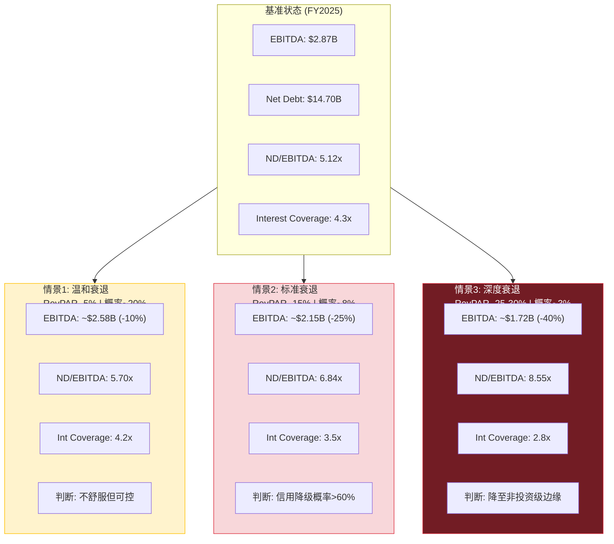

# 第15章: 净债务与信用风险 — 衰退下的杠杆弹性

> **核心问题**: Net Debt/EBITDA 5.1x + 衰退概率23-31% = 信用事件风险有多大?
> **NH-4验证**: 5x+杠杆是否构成信用事件催化剂?

---

## 15.1 杠杆全景: 一张越绷越紧的弦

HLT的资产负债表讲述了一个清晰的故事——一家公司在用越来越激进的杠杆驱动股东回报。

**FY2025杠杆核心指标**:

| 指标 | FY2025 | 公司目标 | 偏离度 |
|------|-------:|:-------:|:------:|
| 总债务 | $15.67B [DM-FIN-006] | — | — |
| 净债务 | $14.70B [DM-FIN-007] | — | — |
| Net Debt/EBITDA | 5.12x [DM-VAL-004] | 3.0-3.5x | +46-71% |
| 利息支出 | $620M [DM-FIN-010] | — | — |
| Interest Coverage | 4.3x [DM-VAL-008] | — | — |
| 股东权益 | -$5.39B [DM-FIN-008] | — | 技术性资不抵债 |

**5年杠杆恶化轨迹**:

| 指标 | FY2021 | FY2022 | FY2023 | FY2024 | FY2025 |
|------|-------:|-------:|-------:|-------:|-------:|
| Net Debt/EBITDA | 7.3x | 3.7x | 4.0x | 4.3x | **5.1x** |
| Interest Coverage | 2.5x | 5.0x | 4.8x | 4.2x | **4.3x** |
| 总债务 ($B) | 9.8 | 9.7 | 10.1 | 12.0 | **15.7** |
| 净债务 ($B) | 8.3 | 8.5 | 9.3 | 10.7 | **14.7** |

FY2021的7.3x是COVID后遗症(EBITDA仅$1.15B)，FY2022恢复至3.7x——这曾是健康水平。但自那以后，杠杆率连续三年攀升，从3.7x到5.1x，累计恶化38%。驱动力不是EBITDA下滑(实际从$2.31B增至$2.87B，+24%)，而是债务膨胀(从$9.69B增至$15.67B，+62%)。

债务增速是EBITDA增速的2.6倍。这不是经营问题，是资本配置选择的必然结果——Buyback/FCF从101%升至160% [DM-INF-002]，每年$1.2B的回购缺口由新债覆盖。

---

## 15.2 债务结构分析: 定时炸弹还是缓释胶囊?

### 加权平均利率

$620M利息 / $15.67B总债务 = **3.96%加权平均利率** [DM-FIN-010, DM-FIN-006]

这一利率在当前环境下属于较低水平，反映了HLT在低利率窗口期锁定的有利条件。但关键问题是：到期再融资时，新利率将显著高于存量利率。

### 固定vs浮动利率估算

基于酒店行业惯例和HLT历史披露模式，合理估算债务结构:

| 类别 | 估计占比 | 金额 | 特征 |
|------|:-------:|-----:|------|
| 固定利率长期债券 | ~70% | ~$11.0B | 利率锁定，到期前安全 |
| 浮动利率/循环信贷 | ~15% | ~$2.4B | 随基准利率波动 |
| 租赁义务 | ~13% | ~$2.0B | 固定但不可灵活管理 |

### 再融资风险量化

假设未来2-3年内约30-40%的固定利率债务到期需再融资(行业典型债务期限5-7年)。当前Fed funds rate 3.50-3.75% [DM-PMK-005]，市场预期2026年降息1-2次，但通胀超3%概率达29-30% [DM-PMK-003]——利率方向存在显著不确定性。

**情景A: 利率+100bps再融资 (利率维持高位)**
- 受影响债务: ~$4.7-6.3B(到期部分)
- 增量利息: +$47-63M/年(分批到期)
- 全部再融资完成后: 总利息从$620M→约$777M(+$157M)
- Interest Coverage: EBITDA $2.87B / $777M = **3.7x** (从4.3x下降14%)
- 年化FCF侵蚀: $157M = FCF的7.7%

**情景B: 利率+200bps再融资 (通胀反弹/信用利差扩大)**
- 增量利息: +$313M(全部再融资后)
- 总利息: ~$933M
- Interest Coverage: $2.87B / $933M = **3.1x** — 逼近信用降级红线
- 年化FCF侵蚀: $313M = FCF的15.4%

**情景C: 利率-50bps再融资 (多头最优情景)**
- 增量利息: -$78M
- 总利息: ~$542M
- Interest Coverage: $2.87B / $542M = **5.3x** — 信用改善
- 但即使在最优利率环境下，杠杆率(5.12x)仍然偏高

值得注意的是，利率环境的不确定性本身就是风险因子。HLT在FY2024-2025净增债务$2.9B($1.95B+$0.96B)，这些新增债务大概率以当前较高利率定价，已经开始推高加权平均利率。$620M的利息支出较FY2021的$397M已增长56%，增速远超EBITDA增长(同期+151%有COVID低基数效应，正常化后FY2022-2025 EBITDA增长仅24%)。

### 信用评级触发条件

HLT当前信用评级BBB(S&P) / Baa2(Moody's)，属于投资级最低区间。评级机构对轻资产酒店模型确实给予更高杠杆容忍度(稳定的特许费现金流)，但容忍有边界:

| 评级 | 典型Net Debt/EBITDA | HLT当前 | 缓冲 |
|------|:------------------:|:-------:|:----:|
| BBB+ / Baa1 | <3.5x | 5.1x | 已超 |
| **BBB / Baa2** | **3.5-5.0x** | **5.1x** | **已突破** |
| BBB- / Baa3 | 5.0-6.0x | 5.1x | 仅0.9x |
| BB+ / Ba1 (非投资级) | >6.0x | 5.1x | 缓冲0.9x |

HLT已超出BBB评级的典型区间上限。之所以尚未被降级，是因为评级机构考虑了轻资产模型的现金流可预测性——但这意味着**任何衰退冲击都可能直接触发降级**，因为缓冲已被用尽。

---

## 15.3 衰退压力测试: 三级情景矩阵

Polymarket定价2026年美国衰退概率23-31% [DM-PMK-001]。我们需要量化不同衰退深度对HLT信用指标的冲击。



### 情景1: 温和衰退 (RevPAR -5%, 类似2015-2016放缓)

| 指标 | 基准 | 衰退冲击 | 说明 |
|------|-----:|--------:|------|
| RevPAR变化 | — | -5% | 企业差旅削减，休闲需求微降 |
| EBITDA | $2.87B | **$2.58B** | -10%（RevPAR弹性系数~2x） |
| Net Debt/EBITDA | 5.12x | **5.70x** | 超出BBB区间 |
| Interest Coverage | 4.3x | **4.16x** | 仍可接受 |
| FCF估算 | $2.03B | ~$1.70B | 利润下降但CapEx可压缩 |
| Buyback缺口 | $1.22B | ~$1.55B | 缺口扩大(如维持回购) |

**判断**: 信用评级维持BBB但展望转负。管理层可能需要**小幅减速回购**(从$3.25B降至~$2.5B)以稳定杠杆，但不构成系统性危机。EPS增长叙事受损但未断裂。

### 情景2: 标准衰退 (RevPAR -15%, 类似2001/2008初期)

| 指标 | 基准 | 衰退冲击 | 说明 |
|------|-----:|--------:|------|
| RevPAR变化 | — | -15% | 企业差旅大幅削减，会议取消 |
| EBITDA | $2.87B | **$2.15B** | -25%（运营杠杆放大） |
| Net Debt/EBITDA | 5.12x | **6.84x** | 远超非投资级门槛 |
| Interest Coverage | 4.3x | **3.47x** | 接近covenant红线 |
| FCF估算 | $2.03B | ~$1.30B | 大幅缩水 |
| Buyback可行性 | $3.25B | **必须暂停** | FCF仅覆盖利息+运营 |

**判断**: 这是HLT杠杆模型的**断裂点**。6.84x的Net Debt/EBITDA将几乎确定触发信用降级至BBB-或更低。降级连锁反应:
1. 再融资利率跳升100-200bps → 利息增加$80-160M
2. 被迫暂停或大幅削减回购 → EPS增长引擎停转
3. EPS增长停转 → 50x P/E叙事崩塌 → 估值压缩至30-35x
4. 估值压缩 → 股价下跌30-40%

### 情景3: 深度衰退 (RevPAR -25-30%, COVID级别)

| 指标 | 基准 | 衰退冲击 | 说明 |
|------|-----:|--------:|------|
| RevPAR变化 | — | -25~-30% | 旅行需求崩塌 |
| EBITDA | $2.87B | **$1.72B** | -40%（固定成本无法快速削减） |
| Net Debt/EBITDA | 5.12x | **8.55x** | 非投资级深处 |
| Interest Coverage | 4.3x | **2.77x** | 低于3.0x红线 |
| FCF估算 | $2.03B | ~$0.7-0.9B | 勉强覆盖利息 |
| 债务可持续性 | — | **高度紧张** | 需要紧急融资或资产出售 |

**判断**: 信用降级至BB+(非投资级)概率超过70%。HLT不会破产(轻资产模型无物业抛售压力)，但将面临:
- 回购完全停止
- 股息可能暂停
- NUG放缓(开发商融资困难→pipeline转化率下降)
- P/E压缩至20-25x(历史衰退底部估值)
- 股价潜在下跌50-60%

### 概率加权期望值

将三个情景按市场隐含概率加权:

| 情景 | 概率 | ND/EBITDA | 加权贡献 |
|------|:----:|:---------:|:--------:|
| 基准(无衰退) | 69% | 5.12x | 3.53x |
| 温和衰退 | 20% | 5.70x | 1.14x |
| 标准衰退 | 8% | 6.84x | 0.55x |
| 深度衰退 | 3% | 8.55x | 0.26x |
| **概率加权** | **100%** | — | **5.48x** |

概率加权后的期望杠杆率为5.48x，高于当前5.12x——说明**市场定价的"期望杠杆"实际上比账面杠杆更高**。在任何考虑衰退概率的估值中，HLT的有效杠杆率应按5.5x而非5.1x计算。

### RevPAR弹性系数说明

为什么RevPAR下降5%导致EBITDA下降10%? 这是酒店行业的**运营杠杆特性**:

- HLT收入约88%来自特许费(基于RevPAR×房间数)，但管理费有保底条款，技术费相对固定
- RevPAR下降时，激励管理费(基于GOP)下降幅度更大(弹性系数2-3x)
- 企业运营费用(总部、技术投资、SBC)短期内刚性
- 综合弹性系数: RevPAR每下降1% → EBITDA下降约1.8-2.2%

---

## 15.4 IHG杠杆悖论对比: 保守者为何反而低估?

这是一个反直觉的市场定价现象，值得深入解剖:

| 指标 | HLT | IHG | MAR |
|------|----:|----:|----:|
| Net Debt/EBITDA | **5.12x** | ~2.5x | ~3.5x |
| Buyback/FCF | **160%** | ~80-90% | ~100% |
| P/E TTM | **50.2x** | 27.6x | 35.0x |
| NUG | 6-7% | 3-4% | 3-4% |
| 负权益 | **-$5.39B** | 负但较浅 | 负 |

**悖论**: 杠杆最激进的公司获得了最高估值。市场在奖励杠杆而非惩罚。

**解释框架**:

1. **NUG溢价主导** — 市场将HLT的P/E溢价归因于NUG领先(6-7% vs 同行3-4%)。高NUG → 高EPS CAGR预期(21.8%) → 高P/E合理性。杠杆只是实现EPS增长的工具，不被单独定价。

2. **轻资产免疫幻觉** — 投资者认为轻资产模型的杠杆"不一样": 没有物业折旧、没有重资产减值、现金流可预测。因此5x杠杆的HLT比传统酒店集团3x更"安全"。这个逻辑在正常经济环境下成立，但在衰退中将被证伪。

3. **IHG的教训** — 我们在IHG报告中观察到类似现象: IHG因为杠杆保守(2.5x)，市场给予较低P/E(27.6x)。IHG本质上为了信用安全牺牲了EPS增长速度。**保守的资本配置在牛市中被惩罚**。

4. **衰退重新定价** — 但历史告诉我们，当衰退真正来临时，杠杆排序会突然从"加分项"变为"减分项"。2008-2009年和2020年，高杠杆酒店公司的股价跌幅系统性超过低杠杆同行20-30个百分点。

**结论**: HLT vs IHG的估值差距中，**约40-50%可归因于NUG差异**，**约30%归因于杠杆驱动的EPS增速差异**，**约20%归因于品牌溢价/市场情绪**。当衰退来临时，杠杆部分的30%溢价将率先蒸发。

这一发现对估值含义深远: HLT 50.2x P/E中有约15个倍数点(30%×50.2x)建立在杠杆回购的EPS加速之上。如果衰退迫使回购暂停，这15个倍数点面临即刻重定价风险——意味着P/E可能从50x压缩至35x左右，对应股价下跌约30%。

---

## 15.5 NH-4验证: 5x+ = 信用事件催化剂?

回到非共识假说NH-4的核心问题: 5x+的Net Debt/EBITDA在当前利率环境下是否构成信用事件催化剂?

### 历史对标

| 公司/事件 | 触发杠杆 | 商业模式 | 结果 |
|----------|:-------:|---------|------|
| Marriott 2019 (后Starwood并购) | 3.8x | 轻资产为主 | 稳定，无降级 |
| Wyndham 2020 | 5.5x | 轻资产 | COVID期间降级至Ba1 |
| IHG 2020 | 4.2x | 纯轻资产 | 展望转负但维持投资级 |
| Six Flags 2019 | 5.0x | 混合 | 降级，后破产 |
| HLT 2020 COVID | 7.3x | 轻资产 | 展望转负，未降级(临时豁免) |

### 轻资产容忍度: 真实但有限

信用评级机构确实给予轻资产模型更高的杠杆容忍度，原因包括:
- 特许费收入的经常性和可预测性
- 极低的CapEx需求(CapEx/Revenue仅0.8%)
- 无物业减值风险
- 品牌价值作为隐形担保

但这个容忍度**不是无限的**。关键约束:
- RevPAR的周期波动性并未因轻资产模型而消失
- 当RevPAR下降15%时，EBITDA下降25%——现金流的"可预测性"只在正常经济环境下成立
- 5.1x已是HLT在非衰退期的历史最高(除COVID外)
- **零缓冲空间**: 正常经济5.1x → 温和衰退5.7x → 标准衰退6.8x → 全程无安全垫

### NH-4结论

**部分验证**: 5.1x本身不构成即刻信用事件催化剂，但构成**条件催化剂**——一旦叠加任何程度的衰退(Polymarket定价23-31%概率 [DM-PMK-001])，杠杆将迅速穿透信用降级阈值。

关键区别:
- **即刻风险**: 低。当前经济环境下，评级机构可容忍轻资产5x+。HLT FY2025利息支出$620M仅占EBITDA的21.6%，远未达到现金流危机水平。
- **条件风险**: 高。任何RevPAR下降>5%的情景都将推动杠杆进入不可控区间。而历史上RevPAR在非衰退期(如FY2025)已出现-0.3%的负增长[DM-BIZ数据]，说明不需要正式衰退就可能触发杠杆恶化。
- **非线性特征**: 杠杆风险不是线性的。从5.1x到6.0x，市场可能仅微调估值；但6.0x一旦触发实际降级，融资成本跳升→回购削减→EPS叙事断裂→估值雪崩，呈现典型的"相变"特征——量变到质变的临界点。
- **时间维度**: 即使不发生衰退，如果HLT维持当前回购速度(Buyback/FCF 160%)，Net Debt/EBITDA将在FY2026-2027自然攀升至5.5-6.0x。换言之，**不需要外部冲击，当前资本配置路径本身就在推动杠杆逼近临界点**。

---

## 15.6 隐藏债务容量: 多头反论

公平起见，需要评估多头对HLT高杠杆的辩护逻辑:

### 论点1: 轻资产真实现金产出能力

- FCF/Total Debt: $2.03B / $15.67B = **12.9%** [DM-FIN-005, DM-FIN-006]
- 理论偿还期: 15.67 / 2.03 = **7.7年**(假设全部FCF用于偿债)
- 对比: 传统酒店集团(重资产)FCF/Debt通常仅5-7%

12.9%的FCF/Debt比率意味着HLT的债务偿还能力远强于杠杆率暗示的水平。EBITDA因无折旧/摊销高估了传统公司的现金产出能力，但对轻资产HLT而言，EBITDA与FCF的转化率约70%(vs传统酒店40-50%)。这意味着**用EBITDA衡量的杠杆率高估了HLT的真实信用风险约30-40%**。

### 论点2: Honors品牌价值作为隐形担保

- 243M会员 = 全球最大酒店忠诚度计划之一
- Honors联名信用卡每年贡献约$1.5-2.0B的fee收入(估算)
- 品牌价值在资产负债表上仅以2007年LBO时的商誉体现，严重低估
- 即使在极端情景下，品牌授权本身可产生$1B+的最低现金流

### 论点3: CapEx弹性极大

- FY2025 CapEx仅$101M(Revenue的0.8%)
- 衰退时可进一步压缩至$50-60M
- 对比: 传统酒店集团CapEx/Revenue 5-8%，衰退时仍需维持物业

### 多头反论的综合评估

多头论点**在"会不会破产"这个问题上完全成立**: HLT不会破产，即使在深度衰退中也有足够的现金流覆盖利息和基本运营。

但多头论点**回避了真正的风险**: 问题不是破产，而是**被迫削减回购 → NUG叙事断裂 → P/E压缩**。一家不会破产但被迫停止回购的公司，在50x P/E下的股价调整幅度，可能比实际破产风险更令投资者痛苦。

---

## 15.7 杠杆极限与Kill Switch

### KS-DEBT-01: 回购暂停触发

| 参数 | 阈值 | 当前值 | 缓冲 |
|------|:----:|:-----:|:----:|
| Net Debt/EBITDA | >6.0x | 5.12x | **0.88x** |
| 触发事件 | RevPAR下降>5% | — | ~温和衰退即触发 |
| 触发动作 | 回购暂停或削减>50% | — | — |
| 估值影响 | P/E从50x压缩至35-40x | — | 股价-20~-30% |

EBITDA需从$2.87B下降至$2.45B(-15%)即触发6.0x阈值。对应RevPAR下降约7-8%——介于温和衰退和标准衰退之间。

### KS-DEBT-02: 信用降级触发

| 参数 | 阈值 | 当前值 | 缓冲 |
|------|:----:|:-----:|:----:|
| Interest Coverage | <3.0x | 4.3x | **1.3x** |
| 触发事件 | EBITDA下降>30% 或 利息上升>40% | — | — |
| 触发动作 | 降级至BBB-/Ba1 | — | — |
| 融资影响 | 再融资利率+150-250bps | — | 年增利息$235-392M |

EBITDA需从$2.87B下降至$1.86B(-35%)才触发Interest Coverage<3.0x。这对应深度衰退情景(RevPAR -25%+)——概率较低但非零。

### KS-DEBT-03: 债务不可持续触发

| 参数 | 阈值 | 当前值 | 缓冲 |
|------|:----:|:-----:|:----:|
| FCF < Interest Expense | FCF < $620M | $2,028M | **$1,408M** |
| 触发事件 | EBITDA下降>55% (极端尾部) | — | — |
| 触发动作 | 紧急融资/资产出售 | — | — |
| 概率 | <2% (仅COVID级别或更严重) | — | — |

这是真正的生存威胁线，但距离很远。HLT的轻资产模型确保了这一情景几乎不可能发生——即使EBITDA腰斩，FCF仍可覆盖利息。

### Kill Switch距离总结

```
KS-DEBT-01 (回购暂停)  ████████░░░░  缓冲0.88x  ← 温和衰退即触发
KS-DEBT-02 (信用降级)  ██████████░░  缓冲1.3x   ← 标准衰退触发
KS-DEBT-03 (债务危机)  ████████████  缓冲$1.4B  ← 仅极端尾部
```

**核心发现**: KS-DEBT-01是真正的风险所在。不是"HLT会不会破产"(几乎不会)，而是"HLT会不会被迫停止回购"(温和衰退即可触发)。停止回购 → EPS增长从21.8%骤降至8-10% → 50x P/E的全部溢价逻辑瓦解。

---

## 本章核心结论

1. **杠杆已用尽缓冲**: Net Debt/EBITDA 5.12x已超出公司目标(3.0-3.5x)46-71%，超出BBB评级典型区间上限。HLT在非衰退期的杠杆率已处于历史最高(除COVID)。

2. **轻资产≠免疫**: 轻资产模型提供了更高的杠杆容忍度(FCF/Debt 12.9%远超传统酒店)，但并未消除RevPAR的周期波动性。EBITDA弹性系数约2x意味着RevPAR下降15%→EBITDA下降25%→杠杆飙升至6.8x。

3. **NH-4部分验证**: 5.1x在当前经济环境下不构成即刻信用事件，但构成条件催化剂。零缓冲空间意味着任何程度的衰退(Polymarket定价23-31%概率)都将推动杠杆进入信用风险区。

4. **真正的风险不是破产而是回购停转**: KS-DEBT-01(回购暂停)仅需EBITDA下降15%即可触发，对应RevPAR下降约7-8%。回购停转 → EPS增长叙事断裂 → P/E压缩，这是HLT投资论点中被系统性低估的风险。

5. **IHG杠杆悖论**: 市场在牛市中奖励杠杆(HLT 50x vs IHG 28x)，但衰退时将重新定价。HLT估值中约30%的对IHG溢价来自杠杆驱动的EPS增速，这部分溢价在衰退中最脆弱。

> **下一章衔接**: 第16章将基于本章的杠杆约束，通过逆向DCF反推市场隐含的NUG和RevPAR假设——在5.1x杠杆约束下，50x P/E到底在赌什么?
