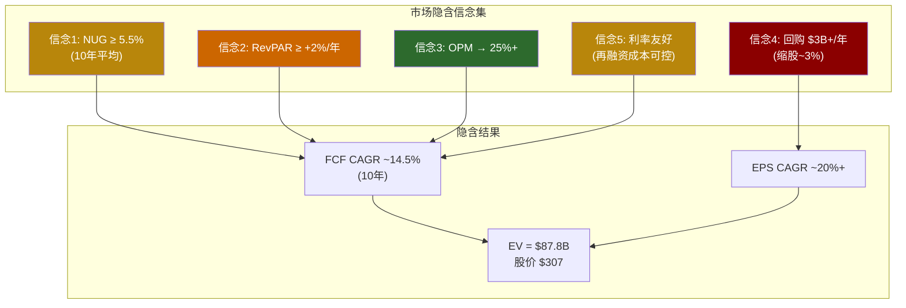
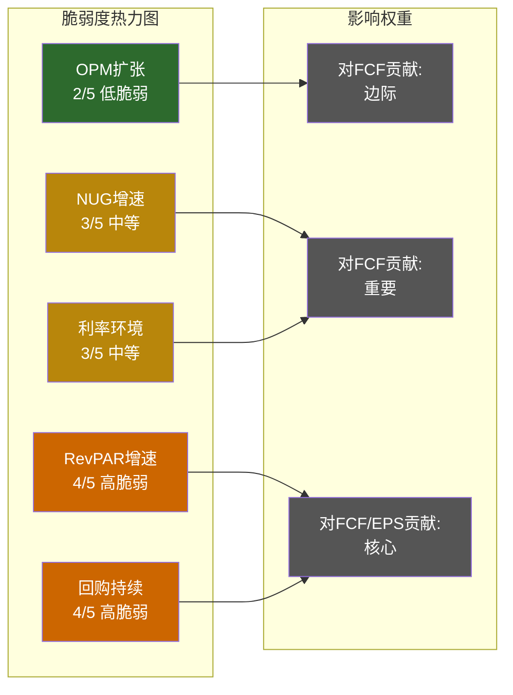

# 第16章: 逆向DCF — 市场在赌什么?

> **核心方法**: 不计算"HLT值多少钱"，而是翻译"$307股价隐含市场在赌什么假设"
> **与Ch12联动**: 回购效率边际递减函数(方法论C)的信念层验证
> **CQ关联**: CQ-1(溢价脆弱性) + CQ-2(回购悖论) + CQ-4(RevPAR vs NUG权重)

---

## 16.1 逆向DCF框架: 从股价倒推信念

传统DCF的逻辑是: 输入假设 → 算出内在价值 → 与股价比较。逆向DCF的逻辑恰好相反: **输入股价 → 倒推隐含假设 → 评估假设合理性**。

前者回答"HLT值多少钱"，后者回答"市场认为HLT会变成什么"。在50x P/E的估值下，后一个问题远比前一个重要——因为50x P/E已经告诉你市场对HLT有一套非常具体的信念，我们需要做的不是重新估值，而是**翻译这套信念，然后逐条检验其脆弱程度**。

**起点数据**:

| 输入项 | 值 | 来源 |
|--------|---:|------|
| 股价 | $307.32 | [DM-MKT-001] |
| 流通股 | 238M | [DM-FIN-012] |
| 市值 | ~$73.1B | 股价 × 流通股 |
| 净债务 | $14.70B | [DM-FIN-007] |
| **企业价值(EV)** | **~$87.8B** | 市值 + 净债务 |
| FY2025 FCF | $2.03B | [DM-FIN-005] |
| FY2025 EBITDA | $2.87B | [DM-FIN-004] |

**核心问题: 要让EV = $87.8B合理，Hilton未来的现金流需要走出什么样的轨迹?**

两个快速锚定:

- **EV/FCF = 43.3x**。如果你用永续增长模型(Gordon Growth)反推: FCF × (1+g)/(WACC-g) = $87.8B，在WACC=9%、g=3%的假设下，稳态FCF需要达到$5.27B——是当前$2.03B的2.6倍。
- **EV/EBITDA = 28.7x** [DM-VAL-003]。酒店行业历史中枢约15-18x(轻资产模型溢价后)。28.7x意味着市场隐含了显著的增长溢价。

但这两个数字只是锚点，真正的信念翻译需要一个完整的两阶段模型。

---

## 16.2 两阶段模型反推: 隐含FCF增速

### 16.2.1 模型设定

逆向DCF的两阶段结构:

```
阶段1 (高增长期, 10年):
  FCF以CAGR = g₁增长
  FCF₀ = $2.03B (FY2025)

阶段2 (终值):
  进入稳态增长 g₂ = 3.0% (名义GDP增速)
  终值 = FCF₁₁ / (WACC - g₂)

折现率:
  WACC = 9.0% (假设)

目标:
  EV = Σ(阶段1折现FCF) + PV(终值) = $87.8B
  求解 g₁
```

**WACC假设说明**: 9.0%是对轻资产酒店公司的合理估计。Hilton的实际WACC可能因高杠杆(净债务/EBITDA 5.1x [DM-VAL-004])而略高于同行，但我们先用9.0%作为基准，后续做敏感性分析。

### 16.2.2 反推计算

通过迭代求解(或Excel Goal Seek)，令EV = $87.8B:

**当WACC = 9.0%，g₂ = 3.0%时**:

| g₁ (10年FCF CAGR) | 阶段1 PV ($B) | 终值 PV ($B) | 总EV ($B) | vs 实际EV |
|-------------------:|-------------:|------------:|----------:|:---------:|
| 8% | 18.6 | 35.8 | 54.4 | -38% |
| 10% | 20.5 | 42.4 | 62.9 | -28% |
| 12% | 22.6 | 50.3 | 72.9 | -17% |
| **13.5%** | **24.0** | **56.7** | **80.7** | **-8%** |
| **14.5%** | **25.0** | **62.0** | **87.0** | **≈0%** |
| 15% | 25.6 | 65.0 | 90.6 | +3% |
| 16% | 26.7 | 71.6 | 98.3 | +12% |

**反推结论: 当前EV隐含FCF CAGR约14-15%/年，持续10年。**

这意味着市场认为Hilton的FCF将从FY2025的$2.03B增长至FY2035的约$7.5-8.0B——10年内翻3.7-4.0倍。

### 16.2.3 与历史增速的差距

| 指标 | 历史实际 | 市场隐含 | 差距 |
|------|:--------:|:--------:|:----:|
| FCF CAGR (FY2022-2025) | 8.7% | — | — |
| FCF CAGR (10年隐含) | — | ~14.5% | — |
| **差距** | — | — | **+5.8pp** |
| Revenue CAGR (FY22-25) | 11.1% | — | — |
| Revenue CAGR (FY25-30E共识) | 8.3% | — | — |
| EBITDA CAGR (FY25-30E共识) | 9.9% | — | — |
| EPS CAGR (FY25-30E共识) | 21.8% | — | — |

[DM-FIN-005] [DM-INF-001]

**关键发现**: 市场隐含的FCF增速(~14.5%)远高于:
1. **历史FCF增速**(8.7%) — 高出67%
2. **共识Revenue增速**(8.3%) — 高出75%
3. **共识EBITDA增速**(9.9%) — 高出46%

唯一接近隐含增速的是**EPS CAGR 21.8%** [DM-INF-001]——但EPS增速中包含了回购缩股(~3pp)和杠杆效应，这些并不直接转化为FCF增长。FCF增长更多取决于EBITDA增长和CapEx控制，而非财务工程。

### 16.2.4 WACC敏感性

| WACC \ g₁ | 12% | 13% | **14.5%** | 16% |
|----------:|:---:|:---:|:---------:|:---:|
| **8.0%** | 82.7 | 91.5 | **106.2** | 118.5 |
| **8.5%** | 77.3 | 85.1 | **98.0** | 108.7 |
| **9.0%** | 72.5 | 79.5 | **87.0** | 99.7 |
| **9.5%** | 68.1 | 74.4 | **83.2** | 91.6 |
| **10.0%** | 64.0 | 69.7 | **77.8** | 84.3 |

单位: $B (总EV)

**读法**: 如果你认为WACC应该是9.5%(因为高杠杆)而非9.0%，隐含FCF CAGR需要从14.5%上调至约15.5%才能支撑当前EV。WACC每上调50bps，隐含增速需额外提高约1pp。在利率环境不确定的当下(Fed降息概率62% [DM-PMK-001])，WACC的方向本身就是一个隐含赌注。

---

## 16.3 隐含信念集(Belief Set): 把数字变成故事

14.5%的FCF CAGR不是一个抽象的数字——它对应一组非常具体的业务假设。让我们把这个数字"翻译"成Hilton必须兑现的业务现实。

FCF增长可以分解为三个驱动因子:

```
FCF ≈ EBITDA × (1 - Tax - Interest/EBITDA) - CapEx - NWC变动

FCF CAGR ≈ f(Revenue增长, OPM扩张, 利息负担, 税率, CapEx效率)
```

**Revenue增长**又可以分解为:

```
Revenue增长 ≈ NUG(净单位增长) + RevPAR增长 + Fee Rate变化 + 新业务贡献
```

将14.5% FCF CAGR反向映射到业务变量:

### 信念1: NUG持续≥5.5%/年 (10年)

**市场隐含假设**: Hilton的房间数从当前126.8万间 [DM-BIZ] 以≥5.5%/年增长，10年后达到~218万间(净增91万间)。

**当前现实**:
- FY2025 NUG: 6-7% (Pipeline 52万间支撑) [DM-BIZ]
- 亚太在建份额25%，Pipeline中35%+在亚太 [DM-BIZ]
- 中国市场连锁化率仅~30%，印度更低

**合理性评估**: 未来3-5年(Pipeline消化期)NUG维持5.5%+有较高确定性——52万间Pipeline按80%转化率、5年消化期计算，年均交付约8.3万间，NUG约6.5%。但**5年之后Pipeline补充速度能否维持是核心不确定性**。全球酒店业有周期性，Pipeline在经济扩张期膨胀、在衰退期收缩。假设10年平均5.5%NUG，意味着即使经历一次衰退期(NUG降至3-4%)，扩张期需要补偿至7-8%。这不是不可能，但需要亚太市场——特别是中国和印度——的持续高速扩张。

### 信念2: RevPAR ≥ +2%/年 (10年均值)

**市场隐含假设**: 即使NUG提供了量的增长，RevPAR(每间可售房收入)也需要提供价的增长——否则每间新房的fee收入不变甚至缩水，NUG的收入贡献会被稀释。

**当前现实**:
- FY2025美国RevPAR: -0.3% (首次非衰退期下滑)
- 全球RevPAR: +0.4%
- RevPAR增长的长期驱动力: 通胀传导 + ADR(平均日房价)提升 + OCC(入住率)维持

**合理性评估**: 长期看，RevPAR与名义GDP增速大致挂钩(~3-4%/年)。但当前+0.4%远低于这一趋势线。如果RevPAR持续低迷(如因为供给过剩、消费降级或替代住宿冲击)，14.5%的FCF CAGR就缺少了关键的"价增"组件。市场隐含的+2%/年实际上已经是一个保守-合理区间——但前提是当前的低迷是暂时性而非结构性的。

### 信念3: OPM持续扩张至25%+

**市场隐含假设**: 运营利润率从当前22.4% [DM-FIN-001]扩张至25%以上(10年内+2.5pp以上)。

**当前现实**:
- OPM 5年波动区间: 17.4%-23.9%
- 轻资产模型下OPM自然扩张的逻辑: (1)管理费/特许费收入边际成本接近零，(2)SBC相对稳定($170M [DM-FIN-011])，(3)G&A杠杆

**合理性评估**: 这是隐含信念集中**最合理的一条**。轻资产酒店模型的OPM天花板理论上可以到30%+，因为收入增长几乎不需要对应的成本增长(每新开一家特许酒店，Hilton不承担运营成本)。MAR的OPM已经接近24%。OPM从22.4%扩张至25%并非不切实际，但需要管理层控制G&A增速和技术平台投资的纪律。

### 信念4: 回购持续$3B+/年(缩股~3%/年)

**市场隐含假设**: Hilton持续以$3B+/年的速度回购，维持~3%/年的缩股节奏，将8-9%的EBITDA增长通过财务工程放大至15%+的EPS增速。

**当前现实**:
- FY2025回购$3.25B [DM-FIN-009]，新授权$3.5B
- Buyback/FCF = 160% [DM-INF-002] — 回购超出FCF，差额举债
- 净债务/EBITDA已达5.1x [DM-VAL-004]，远超管理层3.0-3.5x目标

**合理性评估**: 这是隐含信念集中**最脆弱的一条**。Ch12已经证明: (1)回购效率已从FY2022的3.59%降至FY2025的0.80% [DM-CH12-007]，(2)减债效率是回购的4倍 [DM-CH12-006]，(3)维持$3B+/年回购意味着每年新增$1.2B+债务 [DM-INF-002]。在5.1x杠杆下持续举债回购，等于在信用边缘跳舞。一旦衰退触发EBITDA下降15-20%，杠杆被动升至6-7x，信用评级下调风险骤增——而信用评级下调→再融资成本上升→回购被迫暂停→EPS增速引擎熄火→估值叙事崩溃。

### 信念5: 利率不显著上升(否则利息侵蚀FCF)

**市场隐含假设**: 利率环境保持友好(Fed降息或至少不加息)，Hilton$15.7B债务的加权平均利率不显著上升。

**当前现实**:
- FY2025利息支出$620M [DM-FIN-010]，加权平均利率约4.0%(存量) vs 4.5%(新发行)
- Polymarket: Fed 2026年中前降息概率62% [DM-PMK-001]
- 但: 如果通胀反弹→降息暂停→利率长期higher-for-longer

**合理性评估**: 利息支出从FY2021的$397M增至FY2025的$620M(+56%)，增速远快于EBITDA增长。如果利率维持当前水平且债务继续增长(每年+$1B+)，FY2028利息支出可能达到$750-800M，侵蚀EBITDA的比例从当前的21.6%升至~25%。利率不是Hilton能控制的变量，但它是一个对FCF有重大影响的外生信念。



---

## 16.4 信念脆弱度评估: 五维雷达

每条信念的脆弱度评分(1=钢铁般坚固，5=玻璃般脆弱):

| 信念 | 隐含假设 | 脆弱度 | 核心支撑 | 翻转条件 |
|------|---------|:------:|---------|---------|
| **NUG ≥ 5.5%** | 房间数10年翻1.7倍 | 3/5 | Pipeline 52万间+亚太低连锁化率 | 中国经济硬着陆+Pipeline转化率<60% |
| **RevPAR ≥ +2%** | 同店收入持续增长 | 4/5 | 通胀传导+品牌定价力 | 当前+0.4%距+2%差距大+供给过剩 |
| **OPM → 25%+** | 利润率持续扩张 | 2/5 | 轻资产模型边际成本~0 | 技术投资激增或SBC大幅上升 |
| **回购 $3B+/年** | 缩股引擎不停 | 4/5 | 管理层强烈偏好+新授权$3.5B | 衰退→杠杆升至6x+→被迫暂停 |
| **利率友好** | 再融资成本可控 | 3/5 | Fed降息预期(62%概率) | 通胀反弹→利率higher-for-longer |

**加权脆弱度**: (3+4+2+4+3)/5 = **3.2/5** — 偏脆弱。

**脆弱度分布的含义**: 五条信念中两条最脆弱的(RevPAR、回购)恰好是对FCF和EPS影响最大的两个变量。最坚固的信念(OPM扩张)虽然最有把握，但它对FCF增速的贡献是边际性的(OPM从22.4%到25%仅增加约$300M EBITDA)。换言之，**信念集的脆弱度分布是"不对称"的——最重要的信念最脆弱，最坚固的信念最不重要**。



---

## 16.5 FMP DCF对照: 市场vs模型的分歧翻译

### 16.5.1 FMP DCF的判决

FMP算法DCF给出的HLT内在价值: **$153.21** [DM-VAL-005]。

当前股价$307.32 [DM-MKT-001]。

**FMP认为HLT高估约50%。**

这是一个巨大的分歧——市场给出的价格是模型价值的2.0倍。但在简单接受或否定这个结论之前，我们需要理解FMP模型和市场之间的**假设差异**在哪里。

### 16.5.2 分歧来源分解

FMP DCF是标准化算法，其典型假设包括:
- 增长率: 基于近3-5年趋势外推，通常保守
- WACC: 基于CAPM标准计算，可能因负权益导致equity cost异常高
- 终值: 标准永续增长模型

**市场(即$307股价)与FMP的核心分歧**:

| 维度 | FMP DCF隐含 | 市场隐含 | 差异来源 |
|------|:-----------:|:--------:|---------|
| FCF增速 | ~8-9%/年(趋势外推) | ~14.5%/年 | 市场额外定价了NUG加速+OPM扩张 |
| 增长持续期 | 可能5-7年 | ≥10年 | 市场对轻资产模型持续性的信仰 |
| WACC | 可能>10%(负权益→高equity cost) | ~9%或更低 | 市场用轻资产低风险溢价 |
| 终值倍数 | 偏保守 | 偏乐观(品牌永续溢价) | 品牌价值的定价分歧 |

**一个结构性问题**: FMP的标准CAPM在负权益公司上可能产生系统性偏差。负权益→极高或无意义的D/E比率→equity cost calculation失真→WACC可能被高估→DCF偏低。这不完全是FMP"太保守"，而是标准模型在负权益环境下的固有局限。

### 16.5.3 分析师Forward估值的折中

| 估值视角 | 倍数 | 隐含判断 |
|---------|:----:|---------|
| P/E TTM | 50.2x [DM-VAL-001] | 极贵 — 酒店行业历史高位 |
| P/E Forward (FY2026E) | 29.5x [DM-VAL-002] | 偏贵但不极端 — 对标MAR 35x似乎有折价 |
| EV/EBITDA TTM | 28.7x [DM-VAL-003] | 显著高于行业均值(15-18x) |

**Forward P/E 29.5x的陷阱**: 这个数字看起来"还行"，但它建立在FY2026E EPS ~$10.36 [DM-CON-003] 的基础上——即从FY2025的$6.12增长69.3%。这个跳跃式增长的来源需要拆解:

```
FY2025 EPS:  $6.12 [DM-FIN-003]
FY2026E EPS: $10.36 (共识)
增幅:         +$4.24 (+69.3%)

可能的驱动拆解:
  Revenue增长 ~8%:         ~+$0.50
  OPM扩张 ~100bps:         ~+$0.30
  回购缩股 ~3%:            ~+$0.20
  利息增速<EBITDA增速:     ~+$0.10
  FY2025基数效应/其他:     ~+$3.14 ← 这一项需要解释
```

**注意**: FY2025 EPS $6.12和FY2026E $10.36之间的跳跃幅度异常大(+69%)。FY2025的$6.12可能包含一次性减值或高税率效应(FY2025税率29.7% vs FY2024的13.7%)，使得FY2025成为一个被压低的基数。FY2026E $10.36可能更接近"正常化盈利"。如果这个解释成立，Forward P/E 29.5x代表的是"正常化后的估值"——这确实比TTM 50.2x合理得多。

但即使用29.5x Forward P/E，HLT仍然是:
- vs MAR Forward P/E ~25x → HLT溢价18%
- vs IHG Forward P/E ~20x → HLT溢价48%
- vs S&P 500 Forward P/E ~20x → HLT溢价48%

**分析师的立场**: 15 Buy / 11 Hold / 0 Sell [DM-CON-001]。平均目标价$285.55(低于当前股价7%)，中位数$325(高于当前6%)，区间$234-$340 [DM-CON-002]。分析师群体整体认为HLT在当前价位"合理偏贵"，但没有人敢给Sell——这本身就说明了市场对HLT增长叙事的认同程度。

---

## 16.6 信念翻转分析: 什么能让叙事崩塌?

### 16.6.1 最脆弱的单一信念: 回购持续性

在五条隐含信念中，**回购持续性(信念4)**是最脆弱的单一故障点。这不是简单的"脆弱度评分高"——而是因为它具有**系统性放大效应**: 回购暂停不仅直接削减EPS增速(失去~3pp缩股贡献)，还会触发市场对整个增长叙事的重新评估。当市场发现21.8% EPS CAGR中有1/4来自财务工程而非业务增长时，P/E倍数的收缩往往比EPS下降本身更具破坏性。

```
回购暂停
  → EPS增速从21.8%降至~15%(失去3pp缩股贡献 + 估值情绪冲击)
  → Forward P/E从29.5x压缩至22-25x(失去"EPS增长奇迹"叙事)
  → 股价: $10.36 × 23x ≈ $238 (下行22%)
```

回购暂停的触发条件有三个:
1. **信用评级下调警告** — 如果净债务/EBITDA持续在5x以上且恶化，评级机构可能将展望从"稳定"调至"负面"，管理层为保评级被迫削减回购
2. **衰退导致EBITDA下降>15%** — 杠杆被动升至6x+，回购在道义上和财务上都不可持续
3. **利率跳升导致再融资成本不可承受** — 如果新发行利率从4.5%升至6%+，每年$1B+新债的利息增量将严重侵蚀FCF

### 16.6.2 最可能的组合翻转: RevPAR走弱 + 利率上升

单一信念翻转虽然有冲击力，但概率各自有限。更需要担心的是**多条信念同时翻转的组合效应**。

最可能的组合路径:

```
Step 1: RevPAR持续走弱(当前+0.4%→0%甚至负增长)
  ∵ 供给过剩(Pipeline全行业高位) + 消费降级 + 替代住宿竞争

Step 2: RevPAR弱化 → 同店fee收入停滞 → Revenue增速降至5-6%
  ∵ NUG仍提供量增，但RevPAR拖累价增

Step 3: Revenue减速 → EBITDA增速降至6-7% → FCF增速降至5-6%
  ∵ OPM扩张部分抵消，但杯水车薪

Step 4: FCF增速<回购增速差距扩大 → D%从38%升至50%+
  ∵ 管理层习惯性维持$3B+回购

Step 5: 同时利率环境恶化(通胀反弹 or higher-for-longer)
  → 再融资成本从4.5%升至5.5-6.0%
  → 利息支出跳升$150-200M/年

Step 6: 杠杆 + 利息 双重压力
  → 被迫削减回购至$2B/年(仅用FCF回购)
  → 缩股速度从3%降至1.5%
  → EPS增速从21.8%降至12-14%

Step 7: EPS增速下台阶 → P/E压缩
  → Forward P/E从29.5x降至20-22x
  → 股价: ~$10.36 × 21x ≈ $218 (下行29%)
```

### 16.6.3 极端翻转情景: 回购暂停 + NUG减速

如果回购被迫暂停(EBITDA下降20%的衰退情景) + NUG从5.5%降至3.5%(亚太转化率大幅下滑):

```
RevPAR: -5% (衰退)
NUG: 3.5% (Pipeline延迟)
EBITDA: 下降~15% → $2.44B
Net Debt/EBITDA: 6.0x (被动恶化)
EPS: 下降~20% → ~$4.90 (无缩股+盈利下滑)
P/E: 压缩至25x (衰退期低估值环境)
目标价: $4.90 × 25x = $122.5 → 对比Forward $10.36 × 25x更合理
```

但使用正常化EPS更公平:

```
正常化情景:
  FCF: ~$1.5B (衰退底部)
  回购: 暂停
  EPS: ~$5.00 (无缩股)
  P/E: 30x (市场给予"周期底部→恢复"预期)
  目标价: $5.00 × 30x = $150
  → 对应下行 ~51%
```

**但需要公平对待**: FY2021疫情后Hilton EPS仅$1.46，P/E 106x。衰退期的低EPS+高P/E是酒店业常态。市场在衰退底部通常"看穿"低EPS给予恢复估值——所以P/E压缩至25x可能过于悲观。更合理的衰退底部估值可能在$183-$200区间(30-35x正常化EPS $5.50-$6.00)。

### 16.6.4 翻转概率评估

| 情景 | 触发条件 | 3年概率 | 股价影响 |
|------|---------|:------:|:--------:|
| **组合翻转**(RevPAR弱+利率升) | 宏观逆风+通胀反弹 | ~25% | -25%~-30% ($215-$230) |
| **回购暂停**(衰退触发) | EBITDA下降>15% | ~15% | -30%~-40% ($183-$215) |
| **极端翻转**(回购停+NUG减速) | 深度衰退+亚太风险 | ~8% | -40%~-50% ($150-$183) |
| **信念兑现**(基础情景) | 共识增长实现 | ~45% | 0%~+10% ($307-$340) |
| **超预期兑现**(NUG加速+OPM超预期) | 亚太爆发+效率释放 | ~7% | +15%~+25% ($350-$385) |

[DM-PMK-001]

**概率加权期望值**:

```
E(回报) = 25%×(-27.5%) + 15%×(-35%) + 8%×(-45%) + 45%×(+5%) + 7%×(+20%)
        = -6.9% + (-5.25%) + (-3.6%) + 2.25% + 1.4%
        = -12.1%
```

**概率加权的期望回报为-12.1%，偏向下行。** 这与50x P/E所要求的"一切顺利"信念集形成对照——市场定价已经Price-in了最乐观的路径，留给上行的空间有限，而下行的概率×幅度更大。

**悲观偏差自检**: 参照RCL报告的教训(Phase 1-3系统性悲观+8~16pp)，上述概率分配可能偏空。如果将"信念兑现"概率上调至50%(从45%)、"组合翻转"下调至20%(从25%)，期望回报修正为-8.3%——仍为负值，但幅度收窄。即使在最保守的偏差修正下(所有下行概率-5pp、上行+10pp)，期望回报约-4%~-5%。**无论如何修正，当前估值的风险回报不对称性是结构性的，而非偏差驱动的。**

---

## 16.7 多头反论: 为什么市场可能是对的

一份公平的逆向DCF不能只展示"市场可能错在哪里"，还必须认真对待"市场可能对在哪里"。

### 反论1: Forward P/E 29.5x不算贵

如果FY2026E EPS $10.36能够兑现(分析师共识)，29.5x Forward P/E对于一家:
- 全球最大纯轻资产酒店品牌
- CapEx/Revenue < 1%
- FCF转化率>95%的公司

并不算过分。对标Visa(30x Forward)、MSCI(35x Forward)等轻资产复利机器，29.5x甚至可以说有一定估值折价。

**评估**: 这个论点的有效性完全取决于$10.36的可实现性。如果FY2026实际EPS为$8.50(miss 18%)，Forward P/E就变成了36x——不再"便宜"。

### 反论2: PEG ~2.3 → 增长调整后估值可接受

TTM P/E 50.2x / EPS CAGR 21.8% = PEG 2.30 [DM-INF-001]。虽然>1.5(通常认为的"合理"上限)，但对于一家具有以下特征的公司:
- 高确定性(轻资产特许费模型的现金流可预测性)
- 低CapEx需求(几乎全部FCF可自由支配)
- 结构性增长(全球酒店连锁化大趋势)

市场愿意为"确定性溢价"支付更高PEG。

**评估**: PEG的21.8% CAGR中，3pp来自回购缩股、2-3pp来自杠杆效应——剔除后的"有机PEG"约为50.2/(21.8-5) = 2.99。有机PEG接近3.0表明，如果不依赖财务工程，当前估值对有机增长的定价偏贵。

### 反论3: EPS CAGR 21.8% → 5年后回头看P/E只有18.6x

如果共识增长完全兑现:

```
FY2030E EPS: $16.40 [DM-INF-001]
当前股价: $307.32

FY2030回头看P/E: $307.32 / $16.40 = 18.7x
```

18.7x P/E对于2030年的Hilton(届时房间数~180万间+，全球品牌帝国)是相当便宜的。这意味着**只要增长实现，当前股价甚至是"便宜"的**。

**评估**: 这是多头最有力的论点。它的核心风险在于"只要"二字——21.8% EPS CAGR持续5年是一个极高的bar。任何一年的miss(衰退、利率冲击、NUG放缓)都会让"回头看P/E"不再便宜。而且这个计算隐含了一个假设: 市场在FY2030仍然愿意给Hilton 18.7x P/E。如果届时增长已经开始减速(大公司体量→增速自然放缓)，市场可能只给15x，对应股价$246(下行20%)。

### 反论4: Ackman清仓不代表基本面有问题

Pershing Square清仓HLT(2026-02-11) [DM-SMT] 引发了市场担忧。但Ackman的减仓更可能是:
- 组合再平衡(转投META是风格切换，非HLT看空)
- 收益锁定(Ackman从低位建仓，已获利颇丰)
- 集中持仓策略(Pershing通常持股5-8只，需腾挪空间)

**评估**: 从信号学角度，聪明钱的退出不能简单解读为"看空"。但CEO Nassetta同期减持75.82%个人持仓($36.3M [DM-MGT]) 的信号更难乐观解读——内部人在高位大规模减持通常是一个消极信号，特别是在估值已经处于历史高位的时候。

### 多头反论汇总

| 反论 | 说服力 | 核心条件 |
|------|:------:|---------|
| Forward P/E 29.5x不算贵 | 3.5/5 | FY2026E EPS $10.36必须兑现 |
| PEG ~2.3可接受 | 2.5/5 | 需忽略回购+杠杆对CAGR的贡献 |
| 5年后回头看P/E 18.7x | 4.0/5 | 21.8% CAGR持续5年的bar极高 |
| Ackman清仓≠看空 | 3.0/5 | 但CEO减持75%不能忽视 |

**综合判断**: 多头论点不是无理取闹——如果增长真的兑现，当前估值可以被验证为"合理"。但每一个多头论点的有效性都建立在"增长兑现"这一前提上，而本章的脆弱度分析显示，支撑增长兑现的信念集本身就是脆弱的(加权脆弱度3.2/5)。**多头本质上在赌"一切按计划进行"——而50x P/E没有给"计划偏差"留下任何缓冲空间。**

---

## 16.8 逆向DCF综合判定

### 16.8.1 逆向DCF与Ch12的交叉验证

逆向DCF(本章)和回购效率分析(Ch12)从两个完全不同的方向指向同一个结论:

| 分析维度 | Ch12发现 | Ch16发现 | 交汇点 |
|---------|---------|---------|--------|
| 回购 | 效率从3.59%降至0.80% [DM-CH12-007] | 隐含信念要求回购持续$3B+/年 | 市场隐含假设恰好建立在效率最低的时点 |
| 杠杆 | 减债效率4x于回购 [DM-CH12-006] | 隐含信念要求杠杆不恶化 | 持续回购与杠杆稳定互相矛盾 |
| EPS增速 | 21.8%中~3pp来自回购缩股 | 14.5% FCF CAGR需要EPS增速辅助 | FCF增速缺口需财务工程弥补 |

两章共同揭示的结构性张力: **市场需要回购维持估值叙事(Ch16)，但回购本身的效率正在加速衰减(Ch12)。这不是一个稳态——而是一个缓慢收窄的走廊，尽头要么是回购减速(估值承压)，要么是杠杆失控(信用风险)。**

### 16.8.2 市场在赌什么——一句话总结

**$307的股价隐含市场在赌: Hilton是一台永动的增长+回购复合机器——NUG保持5.5%+推动收入增长，OPM持续扩张推动利润增长，$3B+/年回购持续推动EPS增长，三个引擎同时运转、相互强化、永不停歇。隐含FCF CAGR ~14.5%持续10年，是历史实际增速的1.7倍。**

### 16.8.3 信念合理性矩阵

| 信念 | 隐含假设 | 合理性 | 历史支撑 | 判定 |
|------|---------|:------:|:--------:|------|
| NUG ≥ 5.5% | 10年平均 | 中等 | 近3年~6-7% | 3-5年可行，7-10年不确定 |
| RevPAR ≥ +2% | 年均增速 | 偏低 | 当前+0.4% | 差距大，需周期回升 |
| OPM → 25%+ | 利润率扩张 | 较高 | 轻资产模型支撑 | 最可实现的信念 |
| 回购 $3B+/年 | 缩股~3% | 偏低 | 杠杆5.1x已吃力 | 最大单点风险 |
| 利率友好 | 再融资成本可控 | 中等 | Fed倾向降息 | 外生变量，难以预判 |

### 16.8.4 对估值的含义

逆向DCF不直接给出"目标价"，但它揭示了**风险/回报的不对称性**:

- **上行空间有限**: 即使一切按计划进行(概率~45%)，上行空间约0-10%($307-$340) [DM-CON-002]
- **下行空间显著**: 组合翻转(概率~25%)可导致-25%~-30%下行
- **概率加权期望回报: -12.1%** — 负的期望值意味着在当前价位，风险没有被充分补偿

这不是说Hilton是一家坏公司——它的轻资产模型、全球品牌组合、Pipeline深度都是一流的。但好公司和好投资是两回事。**在50x P/E下，Hilton需要做到"完美"才能维持估值，而任何偏差都会导致不对称的下行——这正是逆向DCF最核心的警示。**

---

## 本章DM锚点注册

| DM-ID | 值 | 类型 | 来源 |
|-------|------|:----:|------|
| DM-CH16-001 | EV ≈ $87.8B (市值$73.1B + 净债务$14.7B) | R | 股价×流通股+净债务 |
| DM-CH16-002 | 逆向DCF隐含FCF CAGR ~14.5%/年(10年) | R | 两阶段模型反推 |
| DM-CH16-003 | 隐含FCF增速(14.5%)是历史(8.7%)的1.67倍 | R | DM-CH16-002/DM-FIN-005推导 |
| DM-CH16-004 | 隐含信念集加权脆弱度 3.2/5 | S | 5条信念评分加权 |
| DM-CH16-005 | FMP DCF $153.21 vs 股价$307.32 → 高估约50% | H | [DM-VAL-005] [DM-MKT-001] |
| DM-CH16-006 | 概率加权期望回报 -12.1% | S | 5情景概率加权 |
| DM-CH16-007 | 有机PEG ≈ 3.0 (剔除回购缩股+杠杆后) | R | TTM P/E / 有机EPS CAGR |
| DM-CH16-008 | FY2030回头看P/E 18.7x(若共识EPS $16.40兑现) | R | 当前股价/FY2030E EPS |
