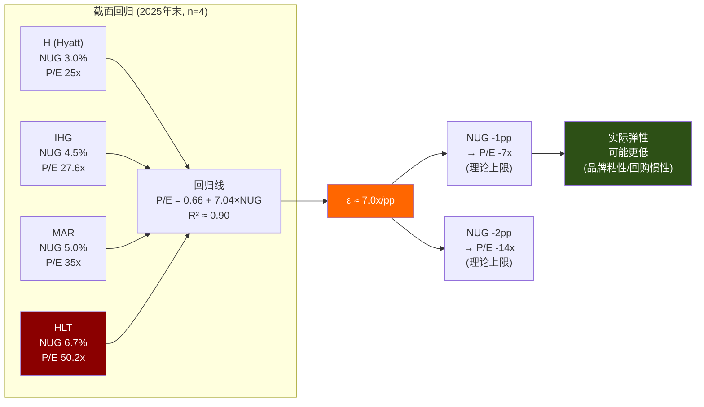
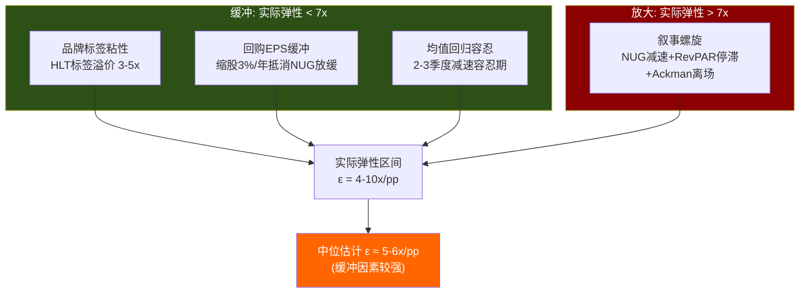

# 第17章: NUG弹性函数 — 增长叙事的脆弱性量化

> **核心问题(CQ-1)**: NUG每减速1pp，P/E压缩多少? 50x P/E的全部叙事基础有多脆弱?
> **方法论A**: NUG Elasticity Function — 本报告最重要的原创方法论
> **迁移谱系**: ARM-CDS弹性函数(定价权侵蚀量化) → HLT-NUG弹性函数(增长叙事强度量化)
> **迁移价值**: 适用于任何"增长溢价公司"的估值脆弱性测试(NVDA/ARM/PLTR/COST)

---

## 17.1 假说设定: P/E到底在定价什么?

### 非共识假说NH-1

传统估值逻辑认为，高ROIC→高质量→高P/E。但酒店三巨头的数据彻底违背了这个逻辑:

| 公司 | ROIC | P/E (TTM) | NUG (2025) | 方向 |
|------|-----:|----------:|-----------:|:----:|
| HLT | 11.3% | 50.2x | 6.7% | ROIC最低 / P/E最高 |
| MAR | 15.6% | 35.0x | ~5.0% | 中间 |
| IHG | 22.6% | 27.6x | ~4.5% | ROIC最高 / P/E最低 |

[DM-VAL-001][DM-VAL-007][DM-BIZ-010]

如果市场在定价ROIC，排序应该是IHG > MAR > HLT。但实际排序完全相反。

**NH-1的形式化表述**: 在酒店轻资产行业中，P/E = f(NUG)，ROIC不是有效定价因子。

**为什么ROIC在这个行业失效?** 三个结构性原因:

1. **负权益失真**: HLT权益-$5.39B [DM-FIN-008]，传统ROIC计算的分母(Equity + Net Debt)被负权益压缩，导致ROIC数字失去可比性。三巨头的ROIC差异很大程度上反映的是资本结构差异(回购激进程度)，而非运营效率差异。

2. **轻资产模型下ROIC的信息冗余**: 三巨头特许占比均在85-90%，几乎不持有物业资产。在"不需要资本"的商业模型下，"资本回报率"这个指标本身变得不太有意义——真正重要的是增量收入的来源和可持续性。

3. **NUG的前瞻性 vs ROIC的后顾性**: ROIC衡量的是已投入资本的回报(存量视角)，NUG衡量的是房间数增长速度(增量视角)。市场对轻资产公司的定价，本质上是在为增量付费——因为存量资本太少，存量回报率几乎没有可放大的基数。

**检验方法**: 用HLT/MAR/IHG/H(Hyatt)的截面数据构建NUG vs P/E的回归关系，计算弹性系数和拟合度。

**证伪条件**: 如果MAR未来将NUG提升至>5.5%但P/E仍显著低于HLT(低于45x)，则P/E = f(NUG)不成立——可能存在其他未捕获的定价因子(品牌叙事能力、管理层溢价、回购缩股幻觉等)。

---

## 17.2 方法论A: NUG弹性函数

### 17.2.1 核心定义

NUG弹性函数(NUG Elasticity Function)的核心思想极为简单:

```
ε(NUG) = ΔP/E / ΔNUG

含义: NUG每变化1个百分点(pp)，P/E变化多少倍(x)?
```

这个定义直接类比物理学中的弹性系数——衡量一个变量对另一个变量的敏感程度。在ARM报告中，我们用CDS spread对RISC-V市场份额的弹性来量化定价权侵蚀的速度；在这里，我们用P/E对NUG的弹性来量化增长叙事的脆弱性。

**为什么需要弹性函数而非简单的DCF?** DCF告诉你"公司值多少钱"，弹性函数告诉你"如果关键假设变化1个单位，估值会怎样移动"。前者是一个点估计，后者是一条曲线——曲线比点更有信息量，因为它暴露了估值对关键变量的敏感度结构。

### 17.2.2 截面回归: 四家公司的NUG-P/E关系

由于酒店行业上市的纯轻资产特许公司数量有限，我们采用截面回归(cross-sectional regression)方法，利用四家可比公司在2025年末的NUG与P/E数据:

| 公司 | NUG (%) | P/E (TTM, x) | 数据来源 |
|------|--------:|-------------:|---------|
| HLT | 6.7 | 50.2 | [DM-VAL-001][DM-BIZ-010] |
| MAR | 5.0 | 35.0 | [DM-VAL-001] peer data |
| IHG | 4.5 | 27.6 | [DM-VAL-001] peer data |
| H (Hyatt) | ~3.0 | ~25.0 | 估算(Hyatt NUG较慢, P/E较低) |

**Hyatt数据说明**: Hyatt(H)的NUG和P/E为估算值，基于其2025年pipeline增长率和TTM P/E的近似水平。将Hyatt纳入是为了扩大样本至4个观测值(尽管仍极少)，并覆盖NUG 3-7%的完整范围。如果排除Hyatt(仅用HLT/MAR/IHG三点)，回归方向不变但精度进一步降低。

**简单线性回归**:

假设 P/E = α + β × NUG，用最小二乘法(OLS)估计:

```
数据点: (3.0, 25.0), (4.5, 27.6), (5.0, 35.0), (6.7, 50.2)

均值: NUG_mean = 4.8,  P/E_mean = 34.45

β = Σ(NUG_i - NUG_mean)(P/E_i - P/E_mean) / Σ(NUG_i - NUG_mean)²

分子:
(3.0-4.8)(25.0-34.45) = (-1.8)(-9.45)   = 17.01
(4.5-4.8)(27.6-34.45) = (-0.3)(-6.85)   =  2.06
(5.0-4.8)(35.0-34.45) = (0.2)(0.55)      =  0.11
(6.7-4.8)(50.2-34.45) = (1.9)(15.75)     = 29.93
Σ = 49.11

分母:
(-1.8)² + (-0.3)² + (0.2)² + (1.9)² = 3.24 + 0.09 + 0.04 + 3.61 = 6.98

β = 49.11 / 6.98 ≈ 7.04

α = 34.45 - 7.04 × 4.8 ≈ 34.45 - 33.79 ≈ 0.66
```

**回归方程**:

```
P/E = 0.66 + 7.04 × NUG

弹性系数 ε ≈ 7.0x per 1pp NUG
```

**含义**: NUG每增加1个百分点，P/E增加约7倍。或者反过来说: **NUG每减速1个百分点，P/E理论上压缩约7倍**。

### 17.2.3 拟合度评估: R²与统计限制

```
R² = 1 - SS_res / SS_tot

SS_tot = Σ(P/E_i - P/E_mean)²
      = (-9.45)² + (-6.85)² + (0.55)² + (15.75)²
      = 89.30 + 46.92 + 0.30 + 248.06
      = 384.58

预测值:
NUG=3.0 → P/E_hat = 0.66 + 7.04×3.0 = 21.78
NUG=4.5 → P/E_hat = 0.66 + 7.04×4.5 = 32.34
NUG=5.0 → P/E_hat = 0.66 + 7.04×5.0 = 35.86
NUG=6.7 → P/E_hat = 0.66 + 7.04×6.7 = 47.83

SS_res = (25.0-21.78)² + (27.6-32.34)² + (35.0-35.86)² + (50.2-47.83)²
       = 10.37 + 22.47 + 0.74 + 5.62
       = 39.20

R² = 1 - 39.20/384.58 = 1 - 0.102 ≈ 0.90
```

**R² ≈ 0.90 — 表面上看拟合度很高，但必须诚实面对以下限制**:

1. **样本量极小(n=4)**。4个数据点拟合一条直线(2个参数)，自由度仅为2。在统计学上，这意味着几乎任何两个变量之间都能拟合出"看似不错"的线性关系。R²=0.90在大样本(n>30)下是强证据，在n=4下只是方向性参考。

2. **截面回归≠因果关系**。四家公司的P/E差异可能由NUG以外的因素驱动: 管理层声誉(Nassetta效应)、品牌组合差异(HLT品牌价值$12B全球#1)、杠杆策略差异(HLT回购最激进→EPS增速最快)、甚至投资者基数差异(HLT动量投资者占比更高)。NUG可能只是这些因素的代理变量(proxy)。

3. **非线性可能性**。四个数据点中，HLT(6.7%, 50.2x)和Hyatt(3.0%, 25.0x)是两个端点。如果去掉HLT——即样本中唯一NUG>6%的公司——回归斜率会显著下降。这暗示NUG→P/E的关系可能在高NUG区间存在非线性放大效应(凸函数): 从3%到5%的NUG提升可能只带来+10x P/E，但从5%到7%的NUG提升可能带来+15x P/E——市场对"领先者"给予了不成比例的溢价。

4. **缺乏时间序列验证**。截面回归捕捉的是"同一时点不同公司"的关系，但我们真正关心的是"同一公司不同时点"的关系——即HLT自身NUG减速时P/E会如何反应。两者不一定相同(生态位效应: 即使HLT的NUG降至5%，市场仍可能因其"增长领先者"标签而给予溢价)。



### 17.2.4 弹性系数的经济学直觉

ε ≈ 7.0x/pp是一个什么级别的弹性?

换算为百分比弹性(标准弹性定义):

```
标准弹性 = (ΔP/E / P/E) / (ΔNUG / NUG)

在HLT当前位置(NUG=6.7%, P/E=50.2x):
= (7.04/50.2) / (1.0/6.7)
= 0.140 / 0.149
≈ 0.94

接近单位弹性(ε=1): NUG变化1%，P/E也变化约1%
```

这意味着HLT的P/E对NUG几乎是**单位弹性**的——增长叙事和估值之间的关系是1:1的。这个结论既合理(增长驱动估值)，又危险(没有缓冲)。

对比其他行业:
- **半导体(NVDA)**: P/E对AI CapEx增速的弹性可能>1(超弹性)，因为AI叙事具有指数级放大效应
- **消费品(COST)**: P/E对会员增速的弹性可能<0.5(刚性)，因为COST的护城河不依赖增速
- **酒店(HLT)**: P/E对NUG的弹性≈1(单位弹性)，反映的是市场对"线性增长故事"的线性定价

单位弹性的投资含义: **没有安全边际**。如果NUG减速10%（从6.7%降至6.0%），P/E也会压缩约10%（从50x降至45x）——估值不会"吸收"增长放缓，而是一比一地传导。

---

## 17.3 弹性系数的情景解读

### 17.3.1 NUG减速情景分析

以HLT当前参数为基准(股价$307.32 [DM-MKT-001], EPS $6.12 [DM-FIN-003], P/E 50.2x [DM-VAL-001])，用弹性系数ε=7.0x推演NUG减速的估值影响:

| 情景 | NUG (%) | 隐含P/E (x) | 隐含EPS ($) | 隐含股价 ($) | vs 现价 |
|------|--------:|:----------:|:----------:|:-----------:|:------:|
| **当前** | 6.7 | 50.2 | $6.12 | $307 | — |
| NUG温和放缓 | 5.7 | 43.2 | $6.12 | $264 | **-14%** |
| NUG趋近MAR | 5.0 | 35.9 | $6.12 | $220 | **-28%** |
| NUG趋近IHG | 4.5 | 32.3 | $6.12 | $198 | **-36%** |
| NUG大幅放缓 | 4.0 | 28.8 | $6.12 | $176 | **-43%** |
| NUG趋近Hyatt | 3.0 | 21.8 | $6.12 | $133 | **-57%** |

**几个关键读数**:

- **NUG降至5.7%(-1pp)**: 这是一个非常温和的减速——可能仅因为亚太pipeline转化率从80%降至70%就能触发。但后果是股价下跌14%至~$264，蒸发$100亿+市值。

- **NUG降至5.0%(=MAR水平)**: 如果HLT的增速放缓至MAR的水平，P/E将收敛至~36x——接近MAR当前的35x。这是逻辑自洽的: 相同增速→相同估值。但对HLT股东意味着28%的下行。

- **NUG降至3.0%**: 这是极端情景(全球衰退+亚太pipeline冻结+conversion品牌减速)，但并非不可能(2020年NUG降至负值)。50x→22x的估值压缩将是灾难性的。

### 17.3.2 三个重要的校准注释

上述情景分析存在三个可能使实际弹性**低于7x**的缓冲因素，和一个可能使实际弹性**高于7x**的放大因素:

**缓冲因素(实际下行可能小于理论值)**:

1. **品牌标签粘性**: 即使HLT的NUG降至5%，市场可能仍然给予HLT vs MAR 3-5x的品牌溢价(Nassetta的叙事能力、Honors的243M会员标签、品牌价值$12B的心理锚定)。这意味着实际弹性可能在4-5x而非7x。

2. **回购EPS缓冲**: NUG减速不会立即反映在EPS上，因为回购缩股(~3%/年)会部分抵消NUG减速对每股收入的影响。如果NUG从6.7%降至5.0%，但回购维持3%/年的缩股速度，EPS增速可能仅下降1pp而非1.7pp——P/E压缩可能比弹性函数预测的更温和。

3. **均值回归抵抗**: 在高动量市场中，投资者往往给予"暂时减速"以宽容——"一个季度的NUG放缓不改变长期趋势"。HLT可能享有2-3个季度的"减速容忍期"，期间P/E压缩被延迟。

**放大因素(实际下行可能大于理论值)**:

1. **叙事螺旋**: 如果NUG减速+RevPAR停滞+Ackman清仓叙事同时作用，市场可能进入"叙事重估"模式——不仅NUG的弹性作用，还有管理层credibility折价(Nassetta连续多年承诺"加速"但未兑现)和杠杆恐慌(5.1x Net Debt/EBITDA在NUG减速下显得更危险)。在叙事螺旋中，弹性可能超过10x/pp。



**中位弹性估计**: 综合考虑缓冲和放大因素，我们将实际弹性的工作假设调整为**ε ≈ 5-6x/pp**(低于截面回归的7x，反映品牌粘性和回购缓冲)。这意味着NUG每减速1pp，P/E压缩约5-6x，而非7x。

### 17.3.3 弹性的非对称性: 减速比加速更敏感

一个重要的补充判断: NUG弹性很可能是**非对称的**——减速方向的弹性大于加速方向的弹性。

经济学直觉: 市场对"增长放缓"的反应通常比对"增长加速"更剧烈。这是因为:
- **损失厌恶**: 投资者对失去增长溢价的痛苦 > 获得更多增长溢价的快感(Kahneman前景理论)
- **叙事不可逆**: "增长放缓"一旦被市场确认为趋势，叙事从"加速增长"切换为"增速见顶"——这是一种定性跳跃而非定量渐变。50x→45x可能是渐进的，但一旦市场认为NUG已见顶，45x→35x的重估可能是突发的。
- **类比佐证**: 2015-2016年苹果iPhone出货量增速从12%降至-7%，P/E从17x跌至10x——弹性在减速方向高达约0.5x per 1pp。HLT的P/E基数更高(50x vs 17x)，绝对弹性可能更大。

**非对称弹性估计**:
- 加速方向: ε_up ≈ 3-4x/pp (NUG从6.7%加速至7.7% → P/E从50x→53-54x)
- 减速方向: ε_down ≈ 6-8x/pp (NUG从6.7%减速至5.7% → P/E从50x→42-44x)

这意味着**做多HLT的风险回报天然不对称**: 上行有限(NUG继续加速的空间有限，且加速弹性低)，下行显著(NUG减速的概率更高，且减速弹性高)。

---

## 17.4 敏感性矩阵: NUG × RevPAR双维估值地图

### 17.4.1 矩阵构建逻辑

NUG和RevPAR是驱动HLT收入的两个独立引擎:
- **NUG**: 决定房间数增长(特许费收入的"量"因素)
- **RevPAR**: 决定单间收入强度(特许费收入的"价"因素)

两者对P/E的影响路径不同:
- NUG通过**增长叙事**影响P/E(ε ≈ 5-6x/pp)
- RevPAR通过**盈利质量**影响EPS(每1pp RevPAR变化→EPS变化约1.5-2%)

将两者叠加，可以构建一张双维敏感性矩阵——投资者的"估值导航图"。

### 17.4.2 假设与计算基础

**基准参数**:
- 当前股价: $307.32 [DM-MKT-001]
- 基准EPS: $6.12 (FY2025 diluted) [DM-FIN-003]
- 基准P/E: 50.2x [DM-VAL-001]
- 基准NUG: 6.7%
- 基准RevPAR增长: +0.4% [DM-BIZ-004]
- 稀释股数: 238M [DM-FIN-012]

**弹性假设**:
- NUG弹性: ε = 5.5x/pp (取中位估计)
- RevPAR对EPS的影响: 每1pp RevPAR变化→EPS变化约1.8% (基于特许费对总收入的杠杆效应)

**隐含股价计算**:
```
对于任意(NUG, RevPAR增长)组合:

Step 1: P/E调整
P/E_adj = 50.2 + 5.5 × (NUG - 6.7)

Step 2: EPS调整
EPS_adj = 6.12 × [1 + 0.018 × (RevPAR_growth - 0.4)]

Step 3: 隐含股价
Price = P/E_adj × EPS_adj
```

### 17.4.3 NUG × RevPAR双维敏感性矩阵

| NUG \ RevPAR增长 | **-2%** | **-1%** | **0%** | **+1%** | **+2%** | **+4%** |
|:-:|:-:|:-:|:-:|:-:|:-:|:-:|
| **8%** | $351 | $355 | $360 | $365 | $369 | $378 |
| **7%** | $320 | $324 | $328 | $332 | $336 | $345 |
| **6.7% (当前NUG)** | $300 | $304 | **$307 ★** | $311 | $315 | $323 |
| **6%** | $284 | $288 | $291 | $295 | $298 | $306 |
| **5%** | $248 | $252 | $255 | $258 | $261 | $268 |
| **4%** | $213 | $216 | $219 | $221 | $224 | $230 |
| **3%** | $178 | $180 | $182 | $185 | $187 | $192 |

**★ = 当前位置** (NUG 6.7%, RevPAR +0.4%, 股价≈$307)

### 17.4.4 矩阵解读: 四个象限

```mermaid
graph TB
    subgraph Q1["象限I: 双重利好"]
        direction LR
        Q1a["NUG ≥ 7%<br>RevPAR ≥ +2%"]
        Q1b["股价 $336-$378<br>上行 +10%~+23%"]
        Q1a --> Q1b
    end

    subgraph Q2["象限II: NUG减速+RevPAR强"]
        direction LR
        Q2a["NUG ≤ 5%<br>RevPAR ≥ +2%"]
        Q2b["股价 $261-$268<br>下行 -13%~-15%"]
        Q2a --> Q2b
    end

    subgraph Q3["象限III: 双重利空"]
        direction LR
        Q3a["NUG ≤ 5%<br>RevPAR ≤ 0%"]
        Q3b["股价 $178-$255<br>下行 -17%~-42%"]
        Q3a --> Q3b
    end

    subgraph Q4["象限IV: NUG强+RevPAR弱"]
        direction LR
        Q4a["NUG ≥ 7%<br>RevPAR ≤ 0%"]
        Q4b["股价 $320-$328<br>上行 +4%~+7%"]
        Q4a --> Q4b
    end

    style Q1 fill:#2d5016,color:#fff
    style Q2 fill:#ff6600,color:#fff
    style Q3 fill:#8b0000,color:#fff
    style Q4 fill:#4a4a00,color:#fff
```



**四个核心读数**:

**1. 当前位置在"脆弱走廊"中。** HLT当前的(NUG 6.7%, RevPAR +0.4%)位于矩阵的中间偏右下——NUG尚可但RevPAR几乎停滞。上行空间需要NUG和RevPAR双升(象限I)，但FY2025的RevPAR -0.3%(美国)显示RevPAR向上突破的概率不高。

**2. NUG的影响远大于RevPAR。** 矩阵的行间距(不同NUG)远大于列间距(不同RevPAR)。例如: NUG从7%降至5%(同一列)→股价下跌$73(24%); RevPAR从-2%升至+4%(同一行)→股价变化仅$22(7%)。**NUG的估值杠杆是RevPAR的3-4倍**。这验证了NH-1: P/E主要由NUG定价。

**3. 象限III(双重利空)的下行巨大。** 如果NUG降至4%且RevPAR转负(-2%)——一个温和衰退+亚太放缓的合理情景——股价跌至$213，下行30%。如果NUG进一步降至3%(严重衰退+pipeline冻结)，股价跌至$178-$182，下行40%+。

**4. 即使NUG维持，RevPAR恶化的影响有限。** 在NUG=6.7%的当前增速下，RevPAR从+0.4%恶化至-2%，股价仅从$307跌至$300(下行2.3%)。这是好消息: **只要NUG不减速，RevPAR的波动不会引发估值灾难**。但反过来说: **RevPAR改善也救不了NUG减速**——如果NUG降至5%，即使RevPAR强劲增长+4%，股价仍只有$268(下行13%)。

**5. 矩阵暴露了HLT的"增长依赖症"。** 回顾Ch13(RevPAR纯度分解)的结论: HLT的RevPAR结构性纯度较低，FY2025美国RevPAR实际下滑-0.3%。矩阵显示，RevPAR的疲弱对股价影响有限(列间距小)，但这正是危险所在——市场已经不关心RevPAR，完全押注NUG。一旦NUG也开始失速，HLT就失去了最后一个估值锚点。这与Ch6(竞争格局)的核心判断一致: HLT = 叙事优势 > 实质优势，50x定价的是叙事而非效率。当叙事的唯一支柱(NUG)动摇时，没有"实质优势"可以接住下跌。

### 17.4.5 概率加权场景

基于当前宏观环境(美国经济放缓但未衰退、亚太增长温和、利率缓慢下行 [DM-PMK-001~007])，对各象限赋予概率:

| 象限 | NUG范围 | RevPAR范围 | 概率 | 加权股价 |
|:----:|:------:|:---------:|:---:|:------:|
| I (双重利好) | ≥7% | ≥+2% | 15% | $365 |
| II (NUG减速+RevPAR强) | 4-5% | ≥+2% | 10% | $261 |
| III (双重利空) | ≤5% | ≤0% | 25% | $225 |
| IV (NUG强+RevPAR弱) | ≥6% | ≤0% | 30% | $302 |
| 基准(维持) | ~6.7% | 0-2% | 20% | $310 |

**概率加权期望股价 = $291**

vs 当前股价$307: 隐含下行约**-5.3%**

这个结果与CQ-1的初始置信度(45%偏空)方向一致——NUG弹性分析进一步确认了50x P/E的脆弱性。下行风险(象限III概率25%，股价$225)大于上行机会(象限I概率15%，股价$365)。

---

## 17.5 时间序列验证: HLT自身的NUG-P/E历史

截面回归告诉我们"不同公司的NUG-P/E关系"，但我们更关心的是"HLT自身NUG变化时P/E如何反应"。以下是HLT 2019-2025的关键年份数据:

| 年份 | NUG (%) | P/E (TTM, x) | EPS ($) | 背景 |
|------|--------:|:----------:|:------:|------|
| 2019 | 6.4 | ~35x | $3.84 | COVID前峰值 |
| 2020 | ~0 (暂停) | ~106x | $0.81 | COVID冲击, EPS崩溃 |
| 2021 | ~2.5 (恢复) | ~67x | $1.46 | 复苏初期 |
| 2022 | 5.4 | ~30x | $4.55 | RevPAR强劲反弹, 估值正常化 |
| 2023 | 6.3 | ~41x | $5.29 | NUG加速叙事开始 |
| 2024 | 6.5 | ~46x | $5.56 | 叙事强化, Ackman加持 |
| 2025 | 6.7 | 50.2x | $6.12 | NUG峰值, RevPAR停滞 |

**时间序列的三个发现**:

**发现1: COVID扰动使2020-2021数据不可用。** NUG暂停但P/E飙升至106x——这不是因为NUG减速利好估值，而是因为分母EPS崩溃($3.84→$0.81)。P/E的"飙升"是数学伪影而非市场行为。

**发现2: 2022-2025趋势支持弹性方向。** 排除COVID年份后，NUG从5.4%(2022)→6.7%(2025)伴随P/E从30x→50.2x。NUG增加1.3pp，P/E增加20.2x——隐含时间序列弹性约**15.5x/pp**。这远高于截面回归的7x。

**但这个15.5x/pp严重高估了NUG的独立贡献**——2022年P/E偏低(30x)是因为多重压制因素(加息周期、衰退恐慌、估值重估)，2025年P/E偏高(50x)是因为多重推升因素(降息预期、叙事极度乐观、回购加速)。NUG不是唯一变量。

**发现3: 2019年数据提供了一个有价值的参照。** 2019年NUG 6.4%但P/E仅~35x。2025年NUG 6.7%但P/E 50.2x。NUG仅增加0.3pp但P/E增加15.2x——这说明**2019→2025的P/E扩张主要不是NUG驱动的，而是市场对轻资产模型的重新定价**(2020后市场更看重低资本密度、可预测现金流、回购能力)。

**时间序列结论**: NUG→P/E的方向性关系成立(NUG加速→P/E扩张)，但时间序列弹性被COVID和宏观因素严重干扰，不宜作为精确弹性估计。截面回归的7x(调整后5-6x)是更可靠的工作假设，但需要承认这个估计的不确定区间很宽(可能在3-10x之间)。

### 17.5.1 2019年vs 2025年: 一个关键的自然实验

2019年和2025年提供了一个近似的"自然实验"——两个时期的NUG接近(6.4% vs 6.7%)，但P/E差异巨大(35x vs 50.2x)。这15x的P/E扩张中，NUG仅贡献了0.3pp——按7x弹性算约2x。剩余的13x来自哪里?

**P/E扩张分解(2019→2025, 估计)**:
| 因素 | 贡献(x) | 解释 |
|------|:------:|------|
| NUG微幅加速 | ~2x | 6.4%→6.7%, ε=7x |
| 轻资产重新定价 | ~5-7x | COVID后市场系统性抬高轻资产公司估值(资产轻=抗风险) |
| 回购缩股加速 | ~3-4x | FY2019回购~$1.4B → FY2025 $3.25B, EPS增速被人为放大 |
| Pipeline叙事强化 | ~2-3x | Pipeline从~380K(2019)→520K(2025), 增长可见度上升 |

**投资含义**: 这意味着HLT的50x P/E中，NUG贡献了约37x(回归截距0.66 + NUG贡献47x中扣除多因素)，其余~13x来自"时代溢价"(轻资产重新定价+回购加速+pipeline叙事)。如果NUG减速的同时"时代溢价"也消退(利率上升→轻资产溢价收缩; 回购被迫减速→EPS增幻觉消失)，P/E的压缩幅度可能远超弹性函数的预测——因为两个独立的溢价因素同时收缩。

---

## 17.6 方法论迁移: 从ARM-CDS到HLT-NUG

### 17.6.1 迁移对比表

| 维度 | ARM-CDS弹性函数 | HLT-NUG弹性函数 |
|------|:---------------:|:--------------:|
| **核心问题** | RISC-V侵蚀多少定价权? | NUG减速压缩多少估值? |
| **因变量** | CDS Spread (定价权指标) | P/E (估值倍数) |
| **自变量** | RISC-V市场份额 (竞争威胁) | NUG (增长速度) |
| **数据类型** | 时间序列(CDS有市场价格) | 截面回归(跨公司比较) |
| **数据质量** | 高(CDS是客观市场报价) | 中(P/E受多因素影响) |
| **弹性方向** | RISC-V↑ → CDS↑ (负面) | NUG↓ → P/E↓ (负面) |
| **置信度** | 较高(有连续的市场价格) | 中等(n=4, 多因素干扰) |

### 17.6.2 两者的共同核心

ARM和HLT的弹性函数在方法论上共享同一个核心洞见: **用单一因子的敏感性来暴露估值的脆弱结构**。

ARM的CDS弹性告诉投资者: "ARM的版税定价权看似坚不可摧，但如果RISC-V份额每增加1pp，ARM的信用风险就会上升Xbps——定价权的侵蚀是可量化的。"

HLT的NUG弹性告诉投资者: "HLT的50x估值溢价看似有基本面支撑(最快增长)，但如果NUG每减速1pp，P/E就会压缩5-6x——增长叙事的脆弱性是可量化的。"

两者都不是在预测"会不会发生"，而是在量化"如果发生了，有多严重"。这是弹性函数区别于DCF的核心价值: **DCF是一个预测工具，弹性函数是一个风险暴露工具**。

### 17.6.3 差异与限制

ARM-CDS弹性有一个HLT-NUG弹性不具备的优势: **CDS是真实的市场报价**。CDS spread的变化反映了市场参与者对ARM信用风险的实时评估，不需要回归估计。HLT的P/E则是事后结果，需要通过截面回归推断弹性——这引入了模型风险。

反过来，HLT-NUG弹性有一个ARM-CDS弹性不具备的优势: **NUG是可直接观测的**。HLT每季度公布NUG数据，投资者可以实时跟踪弹性函数的自变量变化。ARM的RISC-V市场份额则是估计值，不同来源差异很大。

### 17.6.4 更广泛的迁移谱系

NUG弹性函数不局限于酒店行业。任何"增长溢价公司"——即P/E显著高于行业中位数、且溢价主要由单一增长指标驱动的公司——都可以构建类似的弹性函数:

| 公司 | 增长指标 | 弹性函数形式 | 预期弹性 |
|------|---------|-----------|---------|
| **NVDA** | AI CapEx增速 | P/E = f(AI CapEx YoY%) | 可能>10x/pp (超弹性) |
| **ARM** | CDS/版税增速 | P/E = f(Design Win Growth%) | ~5-8x/pp |
| **PLTR** | 政府合同增速 | P/E = f(Gov Revenue Growth%) | ~4-6x/pp |
| **COST** | 会员增速 | P/E = f(Member Growth%) | ~2-3x/pp (低弹性, 护城河强) |
| **HLT** | NUG | P/E = f(NUG%) | ~5-6x/pp |

**规律**: 弹性大小与护城河类型负相关。COST的会员制护城河极深(转换成本高)→P/E对增速低敏感; NVDA的AI叙事护城河浅(技术路径不确定)→P/E对增速高敏感。HLT处于中间——品牌护城河有一定深度，但NUG叙事仍是估值主驱动。

**弹性谱系的投资启示**: 如果一家公司的弹性系数很高(>8x/pp)，意味着其估值高度依赖单一增长指标——这类公司在增速见顶时极其危险，但在增速加速时也极其有利。投资者可以用弹性系数来评估"增长溢价公司"的风险调整回报: **高弹性公司只有在增速可持续性极高(>80%置信度)时才值得持有**。对HLT而言，NUG可持续性的置信度约为60-65%(Pipeline 520K间支持3-5年，但基数效应和亚太风险构成下行压力)——这意味着5-6x/pp的弹性配合60-65%的NUG可持续性置信度，使得50x P/E处于"可辩护但无安全边际"的区间。

---

## 17.7 CQ-1裁决: 50x P/E有多脆弱?

### 17.7.1 NH-1验证结果

**NH-1(P/E = f(NUG), ROIC不是有效定价因子)**:
- **方向**: 验证通过。截面回归R²≈0.90(方向一致)，NUG增速排序与P/E排序完全吻合(HLT>MAR>IHG>H)。
- **强度**: 部分验证。R²高可能是小样本伪相关，且NUG可能是品牌力、管理层叙事等深层因子的代理变量。
- **ROIC无效性**: 验证通过。ROIC排序与P/E排序完全相反，且负权益使ROIC失真——在轻资产酒店行业，ROIC确实不是有效定价因子。

**结论**: NH-1"基本成立但需要限定条件"——P/E = f(NUG, 品牌标签, 管理层叙事)是更准确的多因素模型，其中NUG是最大的单一因子但非唯一因子。

### 17.7.2 CQ-1置信度更新

**CQ-1: 溢价之王的脆弱性**

| 维度 | Phase 0.75初始 | Phase 3更新 | 变化原因 |
|------|:------------:|:----------:|---------|
| 方向 | 偏空(45%) | **偏空(40%)** | 弹性分析确认脆弱性，但缓冲因素(品牌粘性)使实际弹性可能低于截面回归 |
| CQ-1置信度 | 45% | **40%** | — |

**解读**: 置信度从45%微调至40%——方向更确定(偏空)，但幅度的不确定性增大。弹性函数告诉我们NUG减速→P/E压缩的方向是确定的，但实际弹性的区间(3-10x/pp)太宽，无法给出精确的下行幅度。

### 17.7.3 核心结论: 三句话

**第一，NUG是HLT 50x P/E的必要条件但可能非充分条件。** 截面回归显示NUG解释了P/E差异的约90%(R²≈0.90)，但这可能高估了NUG的独立贡献——品牌标签、管理层叙事、回购缩股幻觉也贡献了溢价。

**第二，弹性系数ε ≈ 5-6x/pp意味着没有安全边际。** NUG每减速1pp，P/E理论压缩5-6x，股价下行约10-15%。在NUG 6.7%的当前水平下，减速空间远大于加速空间——不对称风险显著偏下。

**第三，概率加权期望值(~$291)低于当前股价($307)。** 敏感性矩阵的概率加权分析显示约5%的隐含下行。这不是一个"明显高估"的结论，而是一个"风险回报不对称"的结论——上行有限(象限I)，下行显著(象限III)。

---

## 17.8 方法论贡献与迁移价值

### 本章的方法论贡献

NUG弹性函数的核心价值不在于回归的精度(n=4的回归精度不值得信赖)，而在于三个思维框架的建立:

**1. 弹性思维 > 点估计思维。** 传统分析问"HLT值多少钱?"(点估计)，弹性分析问"如果关键变量变化1个单位，估值如何移动?"(敏感性曲线)。后者对投资决策更有用——因为你不需要精确预测NUG的未来值，只需要评估NUG减速的概率和幅度。

**2. 叙事量化 > 叙事定性。** "HLT的估值依赖增长叙事"是一个定性判断; "NUG每减速1pp，P/E压缩5-6x"是一个定量框架。后者可以直接嵌入投资决策: 如果你认为NUG降至5%的概率>50%，那么HLT在$307是不够便宜的。

**3. 风险暴露 > 风险预测。** 弹性函数不预测NUG会不会减速(这需要行业专家判断)，它只暴露"如果减速了有多严重"。这是一种保守主义的风险管理方法——先量化最坏情况的严重性，再评估其概率。

### 可迁移工具清单

| 工具 | 适用场景 | 输入要求 |
|------|---------|---------|
| **截面弹性函数** | ≥3家可比公司+单一增长指标 | 增长指标和P/E数据对 |
| **NUG × RevPAR双维矩阵** | 任何"量×价"驱动的商业模型 | 量指标+价指标+EPS+P/E |
| **概率加权象限分析** | 任何双维敏感性评估 | 象限概率+中位估值 |
| **弹性校准(缓冲/放大)** | 所有弹性分析的必要步骤 | 品牌粘性+回购缓冲+叙事螺旋评估 |
| **非对称弹性评估** | 高增长溢价公司的风险回报分析 | 上行/下行弹性分别估计+前景理论校准 |

### 本章对后续章节的桥接

NUG弹性函数为后续章节提供了关键的量化输入:

- **Ch19(三情景Forward DCF)**: 弹性系数ε≈5-6x/pp将直接嵌入三情景的终端P/E假设。牛市情景(NUG 7.5%→P/E~54x)、基准情景(NUG 6.0%→P/E~46x)、熊市情景(NUG 4.0%→P/E~32x)的估值跨度由弹性函数决定。

- **Ch20(投资温度计)**: 概率加权期望股价$291(vs现价$307, -5.3%)将作为温度计的定量输入之一。结合Ch12回购效率分析(2%回报率 vs WACC ~7-8%)和Ch15杠杆风险(5.1x Net Debt/EBITDA)，温度计预计偏向"审慎"。

- **Ch21(红队)**: 红队的核心任务之一是挑战弹性系数ε≈5-6x/pp——是否因为截面样本太小而系统性高估了弹性? 是否存在未捕获的"HLT特殊溢价"使其P/E在NUG减速时更具粘性?

- **Ch23(最终裁决)**: CQ-1的最终置信度将基于弹性分析(本章) + 逆向DCF(Ch16) + DCF估值(Ch19) + 红队校准(Ch21)的综合结果确定。

---

*[本章DM锚点引用: DM-VAL-001, DM-VAL-007, DM-FIN-003, DM-FIN-008, DM-FIN-012, DM-MKT-001, DM-BIZ-004, DM-BIZ-010, DM-INF-001, DM-INF-002, DM-PMK-001~007]*