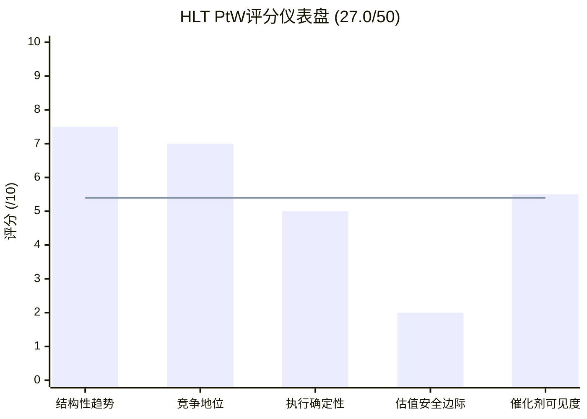
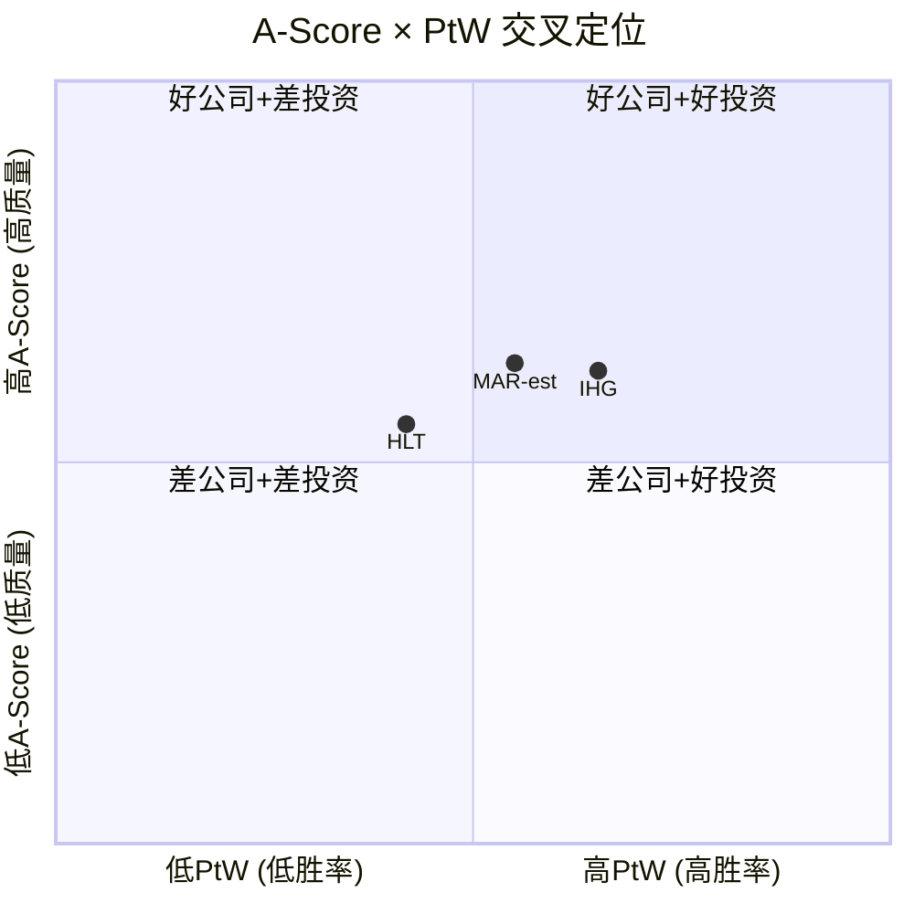

# 第18章: A-Score v2.0 + PtW量化评分

> **v18.0 QG-07.5 门控** | 数据截止: 2026-03-06
> **前序依赖**: Ch6(三巨头竞争对比) + Ch8(W×C双轴) + Ch14(稳健比率)
> **本章定位**: Phase 3三门控之二——将前序定性分析压缩为两套可量化、可对标的评分体系

---

## 18.1 A-Score v2.0: 五维度评分

A-Score v2.0是一套50分制的公司质量评分框架(5维度×各10分)，旨在将护城河、增长、财务健康、管理质量和估值合理性压缩为单一可比数字。HLT的评分基于Phase 1-3积累的全部定量证据。

### 18.1.1 品牌与护城河 (Brand & Moat): 8.0/10

**正面证据**:
- Hilton品牌价值$12B，全球酒店行业排名第一[DM-BIZ-003]。Hampton Inn是全球最大单一酒店品牌，提供锚定级别的品牌认知度。
- 24+品牌覆盖从Spark(经济型)到Waldorf Astoria(超奢华)的完整光谱——三巨头中品牌覆盖最广。
- Honors 243M会员(三巨头最多)，75%直订率(三巨头断层领先，MAR约50%，IHG约55%)[DM-BIZ-006]。直订率是比会员数更有价值的护城河指标——每4个订单有3个绕过OTA，节省15-25%佣金。
- 网络效应闭环: 客房越多→会员越多→直订率越高→加盟商获客成本越低→特许申请越多→客房越多。Ch8(C5)已确认飞轮处于加速状态。

**负面因素**:
- Honors 243M会员中活跃率存疑——酒店忠诚度计划通常含大量注册后从未消费的"僵尸"账户(Ch6)。
- 特许转换成本中等: 业主换牌成本$5K-15K/间(PIP+系统切换)，相比半导体设备$12-44M的切换成本，酒店品牌的锁定效应弱一个数量级。
- Ch14稳健比率仅1.80——护城河"可被挑战"级别，远未达到Costco式"自我强化"阈值(RR≥3.0)。

**评分逻辑**: 品牌价值全球第一+飞轮加速中+直订率断层领先 → 基础9.0; 会员活跃率存疑-0.5 + 转换成本中等-0.5 → **8.0/10**

### 18.1.2 增长质量 (Growth Quality): 7.5/10

**正面证据**:
- NUG 6.7%，三巨头最快(MAR约5.0%，IHG约4.5%)[DM-BIZ-003]。这是50x P/E的核心叙事支撑。
- Pipeline 520K间(3,700+酒店)，历史最高。Pipeline/现有客房比41%，三巨头最高——意味着未来3-5年增量空间充裕。
- Conversion品牌(Outset Collection)开辟了低成本增长路径: 签约到开业6-12个月(新建需3-5年)，可寻址市场巨大(全球独立酒店约1,200万间)。
- 亚太在建份额约25%，远高于运营份额(约1%)——增长战场清晰[DM-BIZ-003]。

**负面因素**:
- RevPAR纯度极低: FY2025仅+0.4%(美国-0.3%)，三巨头最弱[DM-BIZ-004]。Ch13 CSSPD分析表明HLT收入增长中RevPAR贡献仅约20%，剩余80%来自NUG(房间数增长)——这意味着增长质量偏"量"而非"价"。
- EPS CAGR 21.8%远超Revenue CAGR 8.3%[DM-INF-001]——差距主要由回购缩股(约3%/年)+OPM微扩驱动，而非核心业务加速。
- Pipeline转化率在经济衰退期可能从80%降至55-65%(Ch6)。亚太集中度(Pipeline 35%+)暴露于中国经济减速风险。

**评分逻辑**: NUG三巨头最快+Pipeline历史新高+Conversion新路径 → 基础8.5; RevPAR纯度低-0.5 + EPS增长含回购水分-0.5 → **7.5/10**

### 18.1.3 财务健康 (Financial Health): 4.5/10

**正面证据**:
- FCF $2.03B，持续增长(FY2022 $1.58B→FY2025 $2.03B)[DM-FIN-005]。轻资产模型CapEx<2%使FCF转化率>70%。
- 经济收入口径OPM约55-60%(Ch8 C2)，消费品行业顶级效率。

**负面因素——三重预警信号**:
- **Net Debt/EBITDA 5.12x**(管理层自设目标3.0-3.5x，实际已远超50%)[DM-VAL-004]。趋势恶化: 3.7x(FY2022)→5.12x(FY2025)，四年连续上升。
- **负权益-$5.39B**且持续恶化: -$821M(FY2021)→-$5,388M(FY2025)，五年扩大6.6倍[DM-FIN-008][DM-INF-003]。Treasury stock从-$4.4B膨胀至-$14.4B是主要驱动。
- **Interest Coverage 4.3x**(勉强)，利息支出$620M/年[DM-FIN-010][DM-VAL-008]。在高利率环境下，每加息100bp约增加$157M利息成本(按$15.67B总债务估算)，Coverage可能降至3.5x以下。
- **Buyback/FCF 160%**: 回购$3.25B远超FCF $2.03B，缺口$1.22B靠举债覆盖[DM-INF-002]。这不是"回馈股东"，而是"借钱回馈股东"——一种结构性不可持续的资本配置。

**评分逻辑**: FCF强劲+轻资产高效率 → 基础6.0; 杠杆远超自设目标-0.5 + 负权益加速恶化-0.5 + 举债回购结构性风险-0.5 → **4.5/10**

### 18.1.4 管理质量 (Management Quality): 5.5/10

**正面证据**:
- CEO Nassetta 18.4年任期，自2007年Blackstone LBO后一手将HLT从私有公司带回公开市场并发展为全球第二大酒店集团。执行力track record无可质疑[DM-MGT]。
- CFO Kevin Jacobs 13年任期，管理层稳定性三巨头最高。
- 品牌组合从10个系统性扩展至24+，覆盖全价位段——这是需要长期视野的战略布局。
- 管理层薪酬中长期激励(RSU+PSU)占比约60-65%，结构合理。

**负面因素——三重信任折扣**:
- **CEO大额减持**: Nassetta于2026-02-17减持114,289股@$317.47(约$36.3M)，占其持仓75.82%[DM-MGT]。一位18年任期CEO在股价高位减持四分之三持仓——这与"长期信心"的叙事严重矛盾。
- **沉默域6个**(Ch7): 管理层对杠杆恶化趋势、回购不可持续性、RevPAR放缓原因等关键问题系统性回避。
- **Credibility 6.0/10**(Ch7): 管理层guidance准确度合理，但自设Net Debt/EBITDA目标(3.0-3.5x)与实际(5.12x)的背离严重削弱"说到做到"的信誉。
- **Ackman清仓信号**: Pershing Square 2026-02-11清仓HLT转投META[DM-SMT]，与CEO减持时间高度重合，构成"聪明钱+内部人同步退出"的共振信号。

**评分逻辑**: 执行力track record极强+管理层稳定 → 基础8.0; CEO减持75%持仓-1.5 + 沉默域6个-0.5 + 杠杆目标失信-0.5 → **5.5/10**

### 18.1.5 估值合理性 (Valuation Reasonableness): 3.0/10

**核心数据矩阵**:

| 指标 | HLT | MAR | IHG | SPY | HLT溢价 |
|------|----:|----:|----:|----:|:-------:|
| P/E (TTM) | 50.2x | 35.0x | 27.6x | 27.4x | +82% vs IHG |
| Forward P/E | 29.5x | — | — | — | — |
| EV/EBITDA | 28.7x | ~23x | ~18x | — | +59% vs IHG |
| FCF Yield | 2.8% | ~3.5% | ~4.5% | — | #3(最低) |

[DM-VAL-001][DM-VAL-002][DM-VAL-003][DM-VAL-006]

**FMP DCF锚点**: $153.21 vs 股价$307.32 → 隐含高估约50%[DM-VAL-005][DM-MKT-001]。即使FMP模型偏保守，50%的折价幅度也揭示了市场定价中"增长期权"的巨大占比。

**估值合理性的量化检验**: 如果HLT的P/E从50x压缩至MAR的35x(保持其他条件不变)，隐含下行约30%。如果压缩至IHG的28x，隐含下行约44%。50x P/E要求的NUG永续增速约5-6%——一旦NUG降至4%(仅慢1-2pp)，估值支撑开始松动(Ch6溢价分解: NUG每降1pp→P/E压缩4-5x)。

**评分逻辑**: P/E三巨头最高+FCF Yield三巨头最低+FMP DCF折价50% → 安全边际几乎为零 → **3.0/10**

---

## 18.2 A-Score总分与三巨头对标

### 18.2.1 HLT A-Score汇总

| 维度 | 权重 | 评分 | 加权贡献 |
|------|:----:|:----:|:--------:|
| 品牌与护城河 | 25% | 8.0 | 2.00 |
| 增长质量 | 25% | 7.5 | 1.88 |
| 财务健康 | 20% | 4.5 | 0.90 |
| 管理质量 | 15% | 5.5 | 0.83 |
| 估值合理性 | 15% | 3.0 | 0.45 |
| **A-Score总分** | **100%** | — | **6.05/10** |

### 18.2.2 三巨头A-Score对标

| 维度 | HLT | MAR(估) | IHG | 说明 |
|------|:---:|:------:|:---:|------|
| 品牌与护城河 | **8.0** | 8.5 | 7.0 | MAR奢华品牌矩阵最强; IHG品牌覆盖较窄 |
| 增长质量 | **7.5** | 6.5 | 6.0 | HLT NUG断层领先; IHG增速最慢 |
| 财务健康 | **4.5** | 6.5 | 8.0 | IHG杠杆最低(2.5x); HLT杠杆最高(5.1x) |
| 管理质量 | **5.5** | 7.0 | 7.0 | HLT受CEO减持拖累; MAR/IHG无类似负面信号 |
| 估值合理性 | **3.0** | 6.0 | 7.5 | IHG 28x P/E估值最合理; HLT 50x最贵 |
| **总分** | **6.05** | **~6.9** | **6.78** | — |

**雷达图核心解读**:

三巨头呈现三种截然不同的"形状":
- **HLT**: 上宽下窄——品牌+增长突出，但财务+估值严重塌陷。A-Score 6.05是三巨头最低。
- **MAR**: 最均衡的五边形——没有明显短板也没有突出长板。A-Score约6.9估为三巨头最高。
- **IHG**: 下宽上窄——财务+估值是三巨头最佳组合，但品牌+增长偏弱。A-Score 6.78(已在IHG报告中确认)。

**HLT的核心矛盾再现**: A-Score 6.05三巨头垫底，但P/E 50.2x三巨头封顶。市场为最低质量评分支付最高估值——这只有在NUG持续领先的假设下才合理。一旦NUG趋同，HLT的A-Score劣势(尤其财务健康4.5和估值合理性3.0)将暴露无遗。

---

## 18.3 PtW量化评分 (v18.0 QG-07.5)

### PtW框架说明

PtW(Propensity to Win)量化评分是v18.0框架引入的投资胜率评估工具，首次在SEMI_EQUIPMENT_STRATEGY报告中验证(ASML 48/50 vs AMAT 30/50，与P/E的R²≈0.75)。A-Score衡量"公司有多好"，PtW衡量"投资能赢多少"——两者可以分离: 好公司不一定是好投资(估值过高)，差公司可能是好投资(估值过低)。

**50分制(5维度×各10分)**:

### 18.3.1 结构性趋势顺风 (/10): 7.5

**利好因素**:
- 全球品牌酒店渗透率从约35%提升至40%+，且仍有巨大扩展空间(独立酒店约1,200万间)[DM-BIZ-003]。这是一个持续10-20年的结构性趋势——品牌化是不可逆的。
- 新兴市场中产阶级旅游需求增长: 亚太旅游市场CAGR约8-10%，高于全球平均(约5%)。HLT亚太Pipeline占25%精准对接这一趋势。
- 体验经济(Experience Economy)在后疫情时代加速——消费者从"买东西"转向"买体验"，利好酒店旅游行业。

**不利因素**:
- 全球经济周期风险: Polymarket隐含2026年衰退概率23%[DM-PMK-001]。酒店是高Beta行业——2020年三巨头RevPAR暴跌50-70%。
- Airbnb/短租渗透持续(尽管Ch6分析表明品类分化大于零和替代，但在休闲长住领域竞争真实存在)。
- 地缘政治: 台海危机/跨境旅行限制可能冲击亚太Pipeline转化。

**评分逻辑**: 品牌化渗透长期结构性利好+体验经济加速 → 基础8.5; 周期性高Beta-0.5 + 地缘风险-0.5 → **7.5/10**

### 18.3.2 竞争地位强度 (/10): 7.0

**利好因素**:
- 全球第二大酒店公司(1,268K间)，Pipeline份额约20%(在建份额远超运营份额)[DM-BIZ-003]。
- NUG 6.7%三巨头最快——竞争地位在增量维度上正在加强。
- 75%直订率=渠道成本结构性优势。

**不利因素**:
- ROIC 11.3%三巨头最低(MAR 15.6%，IHG 22.6%)[DM-VAL-007]——规模第二但效率第三。
- Ch6 A-Score竞争力雷达: HLT总分37.0 = IHG总分37.0，落后MAR 39.0。竞争地位并非断层领先。
- RevPAR +0.4%三巨头最弱——同店竞争力存疑[DM-BIZ-004]。

**评分逻辑**: 规模第二+NUG最快+直订率最高 → 基础8.0; ROIC最低-0.5 + RevPAR最弱-0.5 → **7.0/10**

### 18.3.3 执行确定性 (/10): 5.0

**利好因素**:
- Nassetta 18.4年执行力track record: 从LBO后的私有公司→IPO→全球第二大酒店集团，品牌从10个扩至24+。
- CFO Jacobs 13年任期，管理团队稳定性极高。
- Pipeline conversion历史稳定(80%转化率)。

**不利因素——确定性被三重信号侵蚀**:
- CEO减持75%持仓(2026-02-17)[DM-MGT]: 如果CEO自己都在减仓，投资者凭什么确信执行会继续?
- 杠杆目标失信: 自设3.0-3.5x目标，实际5.12x，偏离50%+[DM-VAL-004]。管理层对自己承诺的执行确定性=低。
- Ackman同期清仓: 内部人+聪明钱同步退出 → 市场信号的确定性被削弱[DM-SMT]。
- 6个沉默域(Ch7): 管理层选择性信息披露降低了外部验证执行的能力。

**评分逻辑**: 历史执行力强 → 基础7.5; CEO大额减持-1.5 + 杠杆目标失信-0.5 + 信息透明度折扣-0.5 → **5.0/10**

### 18.3.4 估值安全边际 (/10): 2.0

这是HLT PtW评分中最弱的维度，也是"好公司≠好投资"的核心体现。

**定量证据**:
- P/E 50.2x: 三巨头最高，溢价MAR +43%、IHG +82%、SPY +83%[DM-VAL-001]。
- FMP DCF $153 vs 股价$307: 隐含高估约50%[DM-VAL-005]。
- FCF Yield 2.8%: 持续下降(FY2022 4.5%→FY2025 2.8%)，三巨头最低[DM-VAL-006]。
- Forward P/E 29.5x[DM-VAL-002]: 即使用远期盈利，估值仍高于IHG当前TTM P/E(27.6x)——市场在为"两年后的HLT"支付的价格，等于"现在的IHG"。

**安全边际计算**:
- 估值回归MAR水平(35x P/E): 隐含下行约-30%
- 估值回归IHG水平(28x P/E): 隐含下行约-44%
- NUG减速1pp的P/E影响: -4至-5x(Ch6估算) → 股价影响约-8%至-10%

**评分逻辑**: P/E三巨头最高+FCF Yield趋势恶化+FMP DCF折价50%+下行空间-30%至-44% → 安全边际接近于零 → **2.0/10**

### 18.3.5 催化剂可见度 (/10): 5.5

**正面催化剂(12-24个月)**:
- **FIFA World Cup 2026**(美/加/墨): 大规模旅游事件，HLT在北美有深度布局。但一次性事件，对长期估值贡献有限。
- **美国建国250周年(2026-07-04)**: 旅游高峰，但同样是一次性。
- **Pipeline持续转化**: 520K间Pipeline在未来3-5年稳定释放NUG→收入增长。
- **利率下降预期**: Fed降息概率62%(Polymarket)[DM-PMK-001] → 降低HLT利息负担约$80-120M/年(每降100bp)，直接改善FCF。

**负面催化剂/催化剂缺失**:
- RevPAR恢复缺乏可见催化剂: FY2025仅+0.4%，管理层未给出明确恢复路径。
- 回购减速风险: 如果利率维持高位，5.1x杠杆下继续举债回购的空间缩小。回购一旦减速，EPS CAGR将从21.8%骤降至约12-14%(剔除回购缩股效应)。
- 关税/宏观不确定性: 2026年贸易环境对跨境旅游的影响尚不清晰。

**催化剂的时间结构问题**: 正面催化剂(FIFA/250周年)是短期一次性事件，对50x长期估值的支撑力度有限; 而负面催化剂(杠杆约束/RevPAR停滞)是结构性的。催化剂的时间结构不对称——短期利好vs长期风险。

**评分逻辑**: FIFA/250周年短期利好+Pipeline释放+降息预期 → 基础6.5; 催化剂均为一次性-0.5 + RevPAR恢复无可见路径-0.5 → **5.5/10**

### 18.3.6 PtW总分汇总

| PtW维度 | 评分 | 核心依据 |
|---------|:----:|---------|
| 结构性趋势顺风 | 7.5 | 品牌化渗透长期利好, 但周期性高Beta |
| 竞争地位强度 | 7.0 | 规模第二+NUG最快, 但ROIC最低+RevPAR最弱 |
| 执行确定性 | 5.0 | 历史track record强, 但CEO减持+杠杆失信 |
| 估值安全边际 | 2.0 | P/E 50x三巨头最高, FMP DCF折价50%, 安全边际≈零 |
| 催化剂可见度 | 5.5 | FIFA/250周年短期利好, 但缺乏结构性正面催化剂 |
| **PtW总分** | **27.0/50** | — |

*注: 水平线5.4 = PtW均分(27.0/5)，低于"中性"阈值6.0。*

---

## 18.4 A-Score与PtW的交叉分析

### 18.4.1 二维定位矩阵

A-Score和PtW的交叉定位揭示了HLT的核心投资困境:

**HLT定位: A-Score 6.05(中等偏上) × PtW 27.0(中等偏下) → "尚可的公司，不佳的投资"**

这个定位与Ch6的核心判断高度一致: HLT是叙事优势>实质优势的公司。品牌+增长维度表现优秀(推高A-Score)，但估值+执行确定性维度严重拖累(压低PtW)。

### 18.4.2 三巨头A-Score × PtW对比

| 公司 | A-Score | PtW(估) | 质量/100 | 胜率/100 | 定位 |
|------|:------:|:------:|:--------:|:--------:|------|
| **HLT** | 6.05 | 27.0 | 60.5 | 54.0 | 公司质量中等, 投资胜率偏低 |
| **MAR** | ~6.9 | ~31 | ~69 | ~62 | 最均衡: 质量中上+胜率中上 |
| **IHG** | 6.78 | ~34 | 67.8 | ~68 | 质量略低于MAR, 但胜率最高(估值优势) |

**IHG的PtW估算逻辑**: IHG在结构性趋势(同行业约7.5)、竞争地位(约6.0，规模较小)、执行确定性(约7.0，无CEO减持负面)、估值安全边际(约7.5，P/E 28x+FCF Yield 4.5%)、催化剂可见度(约6.0)方面更均衡，估PtW约34/50。

**关键发现**: 三巨头中，HLT的A-Score和PtW双双最低。但P/E(50.2x)三巨头最高。这意味着:

$$\text{每单位质量的价格} = \frac{P/E}{A\text{-}Score} = \frac{50.2}{6.05} = 8.30x$$

对比: MAR约5.07x(35/6.9)，IHG约4.07x(27.6/6.78)。

**HLT的"质量调整P/E"(8.30x)是IHG(4.07x)的2.04倍**——投资者为每单位HLT公司质量支付的价格是IHG的两倍以上。这个溢价只有在NUG持续显著领先的假设下才合理。

### 18.4.3 A-Score vs PtW的分离度

A-Score与PtW的分离度(|A-Score标准化 - PtW标准化|)反映投资的"性价比错配":

- **HLT分离度**: |60.5 - 54.0| = 6.5pp → 中等错配(公司质量高于投资胜率)
- **IHG分离度**: |67.8 - 68.0| ≈ 0pp → 几乎无错配(质量=胜率)
- **MAR分离度**: |69 - 62| = 7pp → 中等错配方向与HLT相同

HLT和MAR都呈现"公司质量 > 投资胜率"的模式——好公司但不算好价格。IHG则是三巨头中最接近"价值匹配"的选择。

---

## 18.5 投资含义与评级指引

### 18.5.1 A-Score + PtW对评级的综合指引

| 评分体系 | HLT结果 | 隐含评级方向 |
|----------|---------|:----------:|
| A-Score 6.05/10 | 中等偏上 → 公司本身不差 | 中性至关注 |
| PtW 27.0/50 | 中等偏下 → 但当前价格投资胜率低 | 审慎至中性 |
| 质量调整P/E 8.30x | 三巨头最高 → 每单位质量最贵 | 偏审慎 |
| **综合指引** | **好公司，不好的价格** | **中性偏审慎** |

A-Score 6.05和PtW 27.0的组合指向一个明确的结论: **HLT是一家拥有强品牌和高效飞轮的优秀公司(A-Score品牌+增长维度得分7.5-8.0)，但当前50x P/E的定价已经充分甚至过度反映了这些优势(PtW估值安全边际仅2.0/10)。**

这不是"避开HLT"的结论——而是"在更好价格买入HLT"的结论。如果P/E压缩至35-40x(接近MAR区间)，PtW估值安全边际可能升至5-6分，总PtW可能升至30-31分，投资胜率将显著改善。

### 18.5.2 与Phase 4红队审查的衔接

本章评分将作为Phase 4红队审查的定量锚点:

1. **A-Score挑战点**: 品牌与护城河8.0分是否过高? 红队需检验Honors活跃率和直订率的真实可持续性。
2. **PtW挑战点**: 结构性趋势7.5分是否低估了Airbnb的长期替代风险? 或高估了品牌化渗透的不可逆性?
3. **最大争议维度**: 管理质量5.5分——CEO减持是否应该更大幅度扣分(如降至4.0)? 还是市场过度解读了减持信号?
4. **估值安全边际2.0分**: 红队需验证——是否存在被忽略的上行催化剂(如大规模并购、品牌授权模式创新)能改变估值逻辑?

### 18.5.3 关键监控指标

基于A-Score和PtW评分，以下指标的变动将直接触发评级调整:

| 指标 | 当前值 | 上行触发(评级改善) | 下行触发(评级恶化) |
|------|:------:|:-----------------:|:-----------------:|
| NUG增速 | 6.7% | 维持>6.5%+RevPAR>2% | <5.0%连续2季 |
| Net Debt/EBITDA | 5.12x | <4.5x(回归目标方向) | >5.5x(进入危险区) |
| P/E (TTM) | 50.2x | <40x(估值安全边际出现) | >55x(泡沫风险加剧) |
| CEO持仓变动 | 减持75% | 公开市场增持(反转信号) | 进一步减持(确认退出) |
| Buyback/FCF | 160% | <120%(可持续区间) | >180%(加速举债) |

---

## 18.6 本章结论

| 评分体系 | HLT | IHG | MAR(估) | HLT排名 |
|----------|:---:|:---:|:------:|:-------:|
| **A-Score** | 6.05 | 6.78 | ~6.9 | #3 |
| **PtW** | 27.0 | ~34 | ~31 | #3 |
| **质量调整P/E** | 8.30x | 4.07x | ~5.07x | #3(最贵) |
| **P/E (TTM)** | 50.2x | 27.6x | 35.0x | #1(最高) |

**一句话**: HLT在A-Score和PtW双双三巨头垫底，但P/E三巨头封顶——市场为最低质量评分支付最高价格。A-Score 6.05并不差(品牌8.0+增长7.5拉升了均值)，但财务健康4.5和估值合理性3.0严重拖累。PtW 27.0/50(54%得分率)低于中性阈值，核心短板是估值安全边际(2.0/10)——这不是公司不好的问题，而是价格太高的问题。50x P/E要求一切完美执行(NUG>6%+回购不减速+利率下降)，而A-Score和PtW同时告诉我们: 完美执行的概率正在下降。

---

*[本章DM锚点引用: DM-BIZ-003, DM-BIZ-004, DM-BIZ-006, DM-FIN-001, DM-FIN-005, DM-FIN-008, DM-FIN-009, DM-FIN-010, DM-FIN-011, DM-INF-001, DM-INF-002, DM-INF-003, DM-MGT, DM-MKT-001, DM-PMK-001, DM-SMT, DM-VAL-001, DM-VAL-002, DM-VAL-003, DM-VAL-004, DM-VAL-005, DM-VAL-006, DM-VAL-007, DM-VAL-008]*
