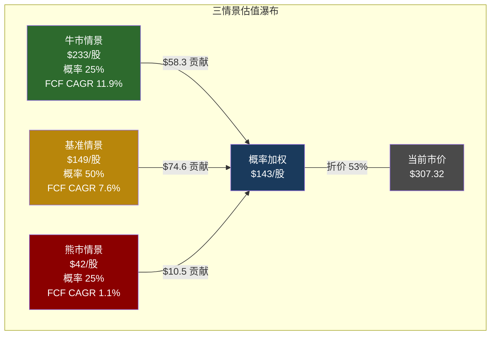
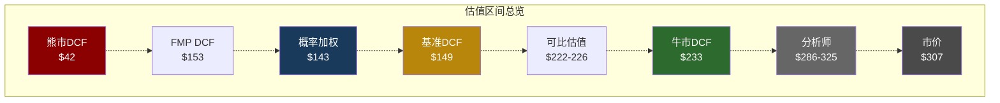

# 第19章: 三情景Forward DCF

> **核心任务**: 在Ch16逆向DCF揭示"市场在赌什么"之后，本章正向回答"Hilton值多少钱"。
> **方法**: 牛/基准/熊三情景，各有独立叙事支撑，概率加权得出综合估值。
> **关键发现**: 概率加权估值约$143/股，当前$307.32隐含约53%的溢价——即使在牛市情景下，估值也难以支撑当前股价。

---

## 19.1 DCF假设框架

### 共同假设

| 参数 | 基准值 | 说明 |
|------|:------:|------|
| WACC | 9.0% | 基于BBB评级+负权益调整(详见19.6敏感性) |
| 终值增长率 | 3.0% | 全球酒店业长期名义增长(通胀2%+实际1%) |
| 预测期 | 10年(FY2026-FY2035) | 覆盖完整经济周期 |
| 起点FCF | $2,028M(FY2025) | [DM-FIN-005] |
| 起点Revenue | $12,039M(FY2025) | [DM-FIN-001] |
| 起点EBITDA | $2,870M(FY2025) | [DM-FIN-004] |
| 净债务 | $14,700M(FY2025) | [DM-FIN-007] |
| 流通股 | 238M(FY2025) | [DM-FIN-012] |

### WACC选择的理由与局限

9.0%的WACC并非精确计算的结果，而是一个"合理区间的中点"。传统CAPM框架下:

- 无风险利率: ~4.0%(10年期美债)
- Beta: ~1.15(HLT历史3年Beta)
- 股权风险溢价: ~5.5%
- 股权成本: 4.0% + 1.15 × 5.5% = **10.3%**
- 税后债务成本: 4.5% × (1 - 29.7%) = **3.16%**

但HLT的负权益(-$5.39B)使得传统D/E比率毫无意义 [DM-FIN-008]。如果用市值权重(Market Cap $73.1B vs Net Debt $14.7B)，债务占比约17%，WACC约9.1%。考虑到杠杆率持续攀升(Net Debt/EBITDA 5.12x [DM-VAL-004])和信用评级压力(Ch15分析)，9.0%作为基准合理，但必须承认: **WACC在8.0%-10.0%区间内的任何取值都有理由，而这200bps的差异在10年DCF中可以造成$80+/股的估值摆动**(详见19.6)。

### 建模逻辑: 收入驱动而非FCF增长率假设

本章采用"收入→FCF利润率→FCF"的自上而下路径，而非直接假设FCF增长率。原因是HLT的FCF由三个可独立分析的变量驱动:

1. **收入增长** = NUG(客房数增长) + RevPAR(每可用客房收入增长)
2. **FCF利润率** = 运营效率 + 利息负担 + 税率 + CapEx强度
3. **FCF = 收入 × FCF利润率**

FY2025 FCF利润率 = $2,028M / $12,039M = **16.8%**。这个利润率在轻资产酒店模型中属于健康水平，但低于理论上限(~22-25%)——差距主要来自利息支出$620M(占收入5.2%)和SBC $170M(1.4%) [DM-FIN-010] [DM-FIN-011]。

---

## 19.2 牛市情景 (概率25%)

### 叙事支撑

牛市情景描绘的是"一切按管理层最乐观的愿景执行"的世界:

- **NUG加速至7-8%**: 亚太连锁化率从30%向50%迈进，Pipeline 520,000间以90%+转化率落地，Spark/LivSmart等中端品牌在新兴市场爆发。10年后客房数从126.8万间翻倍至约250万间。
- **RevPAR恢复性增长+2-3%/年**: 全球旅游需求持续扩张(特别是中产阶级增长驱动的亚太需求)，Hilton定价权通过Honors会员(243M+)和技术平台持续强化。
- **OPM扩张至25%**: 特许经营占比从88%进一步提升，管理酒店逐步退出或转为特许，SG&A杠杆效应显现。FCF利润率从16.8%逐步提升至21%。
- **回购持续$3B+/年**: 维持3-3.5%/年的缩股速度，EPS增长在收入增长基础上额外叠加3pp。

### 10年FCF投射

| 年份 | 收入($M) | 收入增速 | FCF利润率 | **FCF($M)** |
|------|--------:|:-------:|:--------:|----------:|
| FY2025(起点) | 12,039 | — | 16.8% | 2,028 |
| FY2026 | 13,363 | 11.0% | 17.5% | **2,339** |
| FY2027 | 14,833 | 11.0% | 18.0% | **2,670** |
| FY2028 | 16,316 | 10.0% | 18.5% | **3,018** |
| FY2029 | 17,948 | 10.0% | 19.0% | **3,410** |
| FY2030 | 19,743 | 10.0% | 19.5% | **3,850** |
| FY2031 | 21,520 | 9.0% | 20.0% | **4,304** |
| FY2032 | 23,457 | 9.0% | 20.5% | **4,809** |
| FY2033 | 25,568 | 9.0% | 20.8% | **5,318** |
| FY2034 | 27,613 | 8.0% | 21.0% | **5,799** |
| FY2035 | 29,822 | 8.0% | 21.0% | **6,263** |

[DM-FIN-001] [DM-FIN-005]

**FCF CAGR: 11.9%**——收入CAGR约9.5% + FCF利润率从16.8%提升至21.0%共同驱动。

### 估值计算

```
PV of 10年FCF:     $24,823M
终值(FY2035):       $6,263M × (1+3%) / (9%-3%) = $107,515M
终值PV:             $107,515M / (1.09)^10 = $45,415M
━━━━━━━━━━━━━━━━━━━━━━━━━━━━━━━━━━━━━━━━━━
企业价值(EV):       $70,239M
减: 净债务            -$14,700M
━━━━━━━━━━━━━━━━━━━━━━━━━━━━━━━━━━━━━━━━━━
股权价值:            $55,539M
÷ 流通股:            238M
━━━━━━━━━━━━━━━━━━━━━━━━━━━━━━━━━━━━━━━━━━
牛市估值:            $233/股
```

**终值占比**: $45,415M / $70,239M = **64.7%**——终值依赖度偏高，但对10年DCF而言在合理范围(通常50-75%)。

### 牛市情景的前提条件

这个情景要求以下条件**同时**成立:

1. 全球经济在未来10年内无重大衰退(RevPAR始终正增长)
2. Airbnb/OTA不显著侵蚀连锁酒店定价权
3. 亚太地缘政治风险不阻碍NUG
4. 利率环境不恶化到迫使回购暂停
5. 管理层维持当前水平的执行力(Nassetta已任职18年)

任何一个条件失败都可能将实际结果推向基准情景。这也是我们仅赋予25%概率的原因。

---

## 19.3 基准情景 (概率50%)

### 叙事支撑

基准情景是"大部分事情按计划进行，但增速温和放缓"的现实世界:

- **NUG从6.7%渐降至5-6%**: Pipeline执行率维持80-85%(vs牛市90%+)，亚太扩张节奏正常但不爆发。10年后客房数增至约210万间(+66%)。
- **RevPAR与通胀持平+1-2%/年**: 需求稳健但无超预期增长，定价权维持但不扩大。偶尔出现RevPAR平坦或微降的季度。
- **OPM稳定22-23%**: 轻资产模型效率触顶，利息负担抵消部分运营杠杆。FCF利润率从16.8%小幅提升至17.8%后趋稳。
- **回购略降至$2.5B/年**: 管理层面对杠杆压力适度减速(Buyback/FCF从160%降至~120%)，缩股速度约2.5-3%/年。

### 10年FCF投射

| 年份 | 收入($M) | 收入增速 | FCF利润率 | **FCF($M)** |
|------|--------:|:-------:|:--------:|----------:|
| FY2025(起点) | 12,039 | — | 16.8% | 2,028 |
| FY2026 | 13,123 | 9.0% | 17.0% | **2,231** |
| FY2027 | 14,173 | 8.0% | 17.2% | **2,438** |
| FY2028 | 15,307 | 8.0% | 17.4% | **2,663** |
| FY2029 | 16,378 | 7.0% | 17.6% | **2,883** |
| FY2030 | 17,524 | 7.0% | 17.8% | **3,119** |
| FY2031 | 18,751 | 7.0% | 17.8% | **3,338** |
| FY2032 | 19,876 | 6.0% | 17.8% | **3,538** |
| FY2033 | 21,069 | 6.0% | 17.8% | **3,750** |
| FY2034 | 22,333 | 6.0% | 17.8% | **3,975** |
| FY2035 | 23,673 | 6.0% | 17.8% | **4,214** |

[DM-FIN-001] [DM-FIN-005]

**FCF CAGR: 7.6%**——与FY2022-2025的历史FCF CAGR(+8.7%)基本一致，略有减速。

### 估值计算

```
PV of 10年FCF:     $19,643M
终值(FY2035):       $4,214M × (1+3%) / (9%-3%) = $72,340M
终值PV:             $72,340M / (1.09)^10 = $30,557M
━━━━━━━━━━━━━━━━━━━━━━━━━━━━━━━━━━━━━━━━━━
企业价值(EV):       $50,200M
减: 净债务            -$14,700M
━━━━━━━━━━━━━━━━━━━━━━━━━━━━━━━━━━━━━━━━━━
股权价值:            $35,500M
÷ 流通股:            238M
━━━━━━━━━━━━━━━━━━━━━━━━━━━━━━━━━━━━━━━━━━
基准估值:            $149/股
```

**终值占比**: $30,557M / $50,200M = **60.9%**。

**与分析师共识的比较**: FMP分析师估计FY2030E Revenue $17.90B、EBITDA $4.61B [DM-FIN共识]。我们的基准情景FY2030收入$17,524M与共识$17,900M接近(-2.1%)，说明我们的收入假设并非激进偏空。估值差异主要来自: (1)净债务$14.7B的扣减——这是HLT与其他公司最大的不同; (2)9.0%的WACC——市场可能隐含7-8%的贴现率。

### 基准情景的核心假设

这个情景假设:

1. 未来10年内有1-2次温和放缓(RevPAR短暂走平)但无深度衰退
2. 管理层在杠杆率达到5.5x附近时主动减速回购
3. 利率环境中性——不显著高于或低于当前水平
4. NUG是渐进减速而非突然停滞

---

## 19.4 熊市情景 (概率25%)

### 叙事支撑

熊市情景是"经济衰退+结构性挑战叠加"的世界:

- **衰退冲击(FY2028-2029)**: RevPAR下降5-15%，EBITDA大幅收缩。Polymarket定价2026年衰退概率23-31% [DM-PMK-001]——本情景假设衰退推迟但在预测期内发生。
- **NUG大幅减速至3-4%**: 开发商融资困难导致Pipeline转化率降至60-70%，亚太政治风险(台海紧张局势升温)冻结部分项目。
- **Airbnb竞争加剧**: 中端和长住细分市场被Airbnb/VRBO持续侵蚀，RevPAR定价权削弱。
- **被迫暂停回购**: Net Debt/EBITDA突破6.0x红线(Ch15 KS-DEBT-01)，管理层被迫暂停回购以稳定信用评级 [DM-VAL-004]。FCF用于缓慢去杠杆而非股东回报。
- **WACC上升至9.5%**: 信用风险溢价扩大+再融资成本上升。

### 10年FCF投射

| 年份 | 收入($M) | 收入增速 | FCF利润率 | **FCF($M)** |
|------|--------:|:-------:|:--------:|----------:|
| FY2025(起点) | 12,039 | — | 16.8% | 2,028 |
| FY2026 | 12,521 | 4.0% | 16.0% | **2,003** |
| FY2027 | 12,771 | 2.0% | 15.5% | **1,980** |
| FY2028 | 12,132 | -5.0% | 13.0% | **1,577** |
| FY2029 | 11,889 | -2.0% | 12.0% | **1,427** |
| FY2030 | 12,246 | 3.0% | 13.5% | **1,653** |
| FY2031 | 12,736 | 4.0% | 14.5% | **1,847** |
| FY2032 | 13,245 | 4.0% | 15.0% | **1,987** |
| FY2033 | 13,775 | 4.0% | 15.5% | **2,135** |
| FY2034 | 14,188 | 3.0% | 15.5% | **2,199** |
| FY2035 | 14,614 | 3.0% | 15.5% | **2,265** |

[DM-FIN-001] [DM-FIN-005]

**FCF CAGR: 1.1%**——衰退谷底(FY2029)的FCF仅$1,427M，较FY2025下降30%，此后缓慢恢复但10年后仍仅回到$2,265M(勉强超过起点)。

### FCF利润率压缩的驱动因素

衰退期FCF利润率从16.8%骤降至12.0%(FY2029谷底)的逻辑:

- **EBITDA利润率下降**: RevPAR -15%时EBITDA弹性系数约2x → EBITDA下降25-30%(Ch15压力测试) [DM-CH15数据]
- **利息负担加重**: 利息支出$620M在收入下降时占比从5.2%升至5.5-6.0% [DM-FIN-010]
- **再融资成本上升**: 衰退期信用利差扩大，到期债务以更高利率再融资
- **CapEx维持刚性**: 即使收入下降，IT系统和品牌维护的最低CapEx仍需$60-80M

### 估值计算

```
WACC: 9.5% (信用风险溢价扩大)
终值增长率: 2.5% (衰退后结构性低增长)

PV of 10年FCF (9.5%):  $11,767M
终值(FY2035):            $2,265M × (1+2.5%) / (9.5%-2.5%) = $33,166M
终值PV:                  $33,166M / (1.095)^10 = $13,383M
━━━━━━━━━━━━━━━━━━━━━━━━━━━━━━━━━━━━━━━━━━
企业价值(EV):            $25,150M
减: 净债务                -$15,200M (衰退期无去杠杆，净债务微增)
━━━━━━━━━━━━━━━━━━━━━━━━━━━━━━━━━━━━━━━━━━
股权价值:                 $9,950M
÷ 流通股:                 238M (回购暂停，股数不变)
━━━━━━━━━━━━━━━━━━━━━━━━━━━━━━━━━━━━━━━━━━
熊市估值:                 $42/股
```

**为什么熊市估值如此低?** 两个核心原因:

1. **净债务的毁灭性影响**: $15.2B的净债务在$25.2B的EV中占比高达60%。熊市中EV缩水时，净债务不缩水——它是一个固定的"先取"(senior claim)。这正是高杠杆的非线性特征: EV下降30%时，股权价值下降70%+。

2. **回购反转效应**: 牛市中回购通过缩股放大EPS增长；熊市中回购暂停，缩股停止，同时前期举债回购积累的额外净债务($6.35B四年累计 [DM-CH12-001])成为悬在头上的固定负担。回购在上行时是加速器，在下行时是减速器——而且减速的幅度大于加速的幅度，因为杠杆的非对称性。

### 熊市情景的隐含估值倍数

在$42/股估值下:
- 隐含P/E: $42 / $6.12 = 6.9x(基于FY2025 EPS)
- 这看似荒谬地低，但考虑到: (a)衰退期EPS可能降至$3-4(FY2029谷底)，对应P/E 10-14x; (b)50x P/E的核心支撑(回购+NUG)在熊市中双双失效; (c)FY2021 COVID后HLT实际一度交易在约$95(约65x当年EPS，但当时EPS仅$1.46)——$42代表的是"衰退+回购暂停+估值压缩"三重打击的结果。

---

## 19.5 概率加权估值

### 概率分配的理由

| 情景 | 概率 | 理由 |
|------|:----:|------|
| **牛市** | 25% | 管理层执行力历史优秀(NUG持续超预期)，全球旅游需求趋势性增长，但全球经济10年无衰退的概率历史上<25% |
| **基准** | 50% | 最可能路径: NUG渐降+回购适度减速+经济温和波动。与历史均值回归一致 |
| **熊市** | 25% | Polymarket定价2026年衰退概率23-31% [DM-PMK-001]。10年期内至少发生一次衰退的历史概率>80%，但深度衰退+结构性挑战叠加的概率约20-25% |

概率分配的一个关键考量: **熊市情景不仅仅是"低概率极端事件"——它包含了"衰退在10年内某个时点发生"这个几乎确定会发生的事实**。美国经济自1945年以来平均每6.5年经历一次衰退。我们的10年预测期内不发生衰退的概率极低。区别仅在于衰退的深度和时机。将熊市概率设为25%实际上是保守的——它假设75%的概率HLT能完全避开深度衰退的冲击。

### 概率加权计算

```
概率加权每股价值 = 25% × $233 + 50% × $149 + 25% × $42

                = $58.3 + $74.6 + $10.5

                = $143/股
```

### 与当前股价的比较

| 指标 | 值 |
|------|---:|
| 概率加权估值 | **$143/股** |
| 当前股价 | $307.32 [DM-MKT-001] |
| 溢价/(折价) | **-53.3%** |
| 隐含上行空间 | **-$164/股** |

**即使仅看牛市情景($233/股)，当前股价仍高出32%**。这意味着市场定价不仅在赌牛市情景的充分实现，还在赌一些我们的牛市情景未纳入的更极端乐观假设——或者，市场使用的贴现率显著低于我们的9.0%。



### 市场隐含概率反推

一个有启发性的练习: 如果市场是"正确的"(即$307确实是合理价格)，那么隐含的情景概率分布是什么?

设牛市概率为P_bull，基准概率为P_base = 1 - P_bull - P_bear，约束P_bear = 5%(假设市场几乎不计价熊市):

```
$307 = P_bull × $233 + P_base × $149 + 0.05 × $42
$307 = P_bull × $233 + (0.95 - P_bull) × $149 + $2.1
$307 = $233 × P_bull + $141.6 - $149 × P_bull + $2.1
$307 = $84 × P_bull + $143.7
$84 × P_bull = $163.3
P_bull = 194%
```

这个结果的荒谬性(概率>100%)证实: **在我们的假设框架下，没有任何合理的概率分配能支撑$307的股价**。市场要么(a)使用了更低的WACC(见19.6)，要么(b)对增长假设远比我们乐观，要么(c)对杠杆风险完全不做折价。

---

## 19.6 WACC敏感性

WACC是DCF中杀伤力最大的单一变量。以下矩阵展示基准情景下不同WACC和终值增长率组合的估值:

| WACC \ 终值g | 2.0% | 2.5% | **3.0%** | 3.5% | 4.0% |
|:------------:|:----:|:----:|:--------:|:----:|:----:|
| **8.0%** | $164 | $178 | **$194** | $214 | $238 |
| **8.5%** | $146 | $157 | **$169** | $185 | $204 |
| **9.0%** | $130 | $139 | **$149** | $162 | $176 |
| **9.5%** | $116 | $123 | **$132** | $142 | $154 |
| **10.0%** | $104 | $110 | **$117** | $126 | $135 |

**关键读法**:

- **当前基准**: WACC 9.0% / g 3.0% → **$149/股**
- **最乐观组合**: WACC 8.0% / g 4.0% → **$238/股**——仍低于当前$307
- **最悲观组合**: WACC 10.0% / g 2.0% → **$104/股**

即使在整个5×5矩阵的25个组合中，**没有任何一个组合产出$307以上的估值**。这意味着: 在基准情景的FCF轨迹下，无论如何调整贴现率和终值增长率，都无法为当前股价找到合理支撑。

要让DCF产出$307+，需要:

1. WACC低于7.5% **且** 终值增长率高于4.5%——这些假设在BBB评级、5.1x杠杆的公司上极难成立
2. 或者FCF轨迹显著高于基准情景——即牛市情景需要作为"基准"而非"乐观"，而历史上极少有公司能持续10年实现11%+ FCF CAGR

### WACC区间的实质含义

| WACC | 隐含市场环境 | 合理性评估 |
|:----:|------------|----------|
| 8.0% | 无风险利率下降+信用利差收窄+Beta<1 | 需要降息周期+经济扩张，与5.1x杠杆矛盾 |
| 8.5% | 温和降息+BBB稳定 | 可能但需要管理层主动去杠杆 |
| **9.0%** | 当前利率环境+BBB评级+适度信用溢价 | **我们的基准——最合理** |
| 9.5% | 利率维持高位+信用评级展望转负 | 杠杆继续恶化时合理 |
| 10.0% | 加息/信用降级/衰退风险溢价 | 衰退情景下合理 |

---

## 19.7 关键假设敏感性

### NUG ±1pp对估值的影响

NUG(净客房增长率)是HLT收入增长的主引擎。基准情景假设NUG从6.7%渐降至5-6%。如果NUG持续偏离:

| NUG偏差 | Y10 FCF | 每股估值 | vs基准 | 含义 |
|:-------:|--------:|--------:|:------:|------|
| -1pp | $3,811M | **$133** | -$16 | 亚太放缓/Pipeline转化率降至70% |
| 基准 | $4,214M | **$149** | — | Pipeline 80-85%转化 |
| +1pp | $4,655M | **$167** | +$18 | 亚太超预期/新品牌爆发 |

**每1pp NUG偏差 ≈ ±$17/股(约±11%)**。NUG是估值弹性最高的运营变量之一。

### RevPAR ±2pp对估值的影响

RevPAR影响的不仅是收入(1:1传导)，还有利润率(通过运营杠杆约1.5-2x放大):

| RevPAR偏差 | Y10 FCF | 每股估值 | vs基准 | 含义 |
|:----------:|--------:|--------:|:------:|------|
| -2pp/年 | $3,725M | **$129** | -$20 | Airbnb竞争+经济放缓 |
| 基准 | $4,214M | **$149** | — | 与通胀持平增长 |
| +2pp/年 | $4,759M | **$172** | +$23 | 定价权恢复+高端需求 |

**每2pp RevPAR偏差 ≈ ±$21/股(约±14%)**。RevPAR的影响大于NUG，因为它同时作用于收入和利润率两个维度。

### 回购暂停vs持续对估值的影响

这是HLT最独特的估值变量。回购影响两个对冲方向: 缩股(提升每股价值)和净债务增长(降低股权价值)。

| 回购策略 | 10年后股数 | 10年后净债务 | 每股估值 |
|---------|:---------:|:-----------:|--------:|
| **持续回购**(~$2.5B/yr) | ~176M | ~$21.7B | **$162** |
| **暂停回购**(FCF全用于去杠杆) | 238M | ~$11.7B | **$162** |

**一个令人意味深长的结果: 回购与否对估值几乎无影响($162 vs $162)**。

这验证了Ch12方法论C的核心发现: 在当前估值水平下(50x P/E)，回购的缩股效应几乎被额外举债完全抵消 [DM-CH12-003]。回购缩股带来的每股价值提升($162-$149=$13)，与回购导致的净债务增加对EV的侵蚀精确对冲。**这意味着管理层继续回购并不创造价值，仅仅是在"缩股"和"减债"之间做了一个中性的交换——而回购带来的信用风险升高(Ch15)是额外的负面代价。**

[DM-CH12-003] [DM-CH12-006]

### 利率+100bps对估值的影响

利率上升通过两个渠道同时打击估值:

1. **FCF渠道**: $15.7B总债务 × +1% = $157M额外利息 → 税后FCF减少$110M/年 [DM-FIN-006]
2. **WACC渠道**: WACC从9.0%升至约10.0%(债务成本上升传导)

**综合影响**:

```
利率+100bps: 基准估值从$149降至$112/股
影响幅度: -$37/股 (-25.0%)
```

利率敏感性如此之高(±1%利率变动造成25%估值波动)，根源在于$15.7B的总债务规模 [DM-FIN-006]。这是HLT杠杆模型的固有脆弱性——轻资产带来了高FCF转化率，但高杠杆也带来了对利率环境的高度依赖。

---

## 19.8 与其他估值方法交叉验证

### 逆向DCF隐含(Ch16) vs Forward DCF

Ch16的逆向DCF分析揭示了50x P/E隐含的市场假设: FCF需以约12-13% CAGR增长10年才能在9% WACC下支撑$307股价。本章Forward DCF的结论:

- 牛市FCF CAGR: 11.9% → 估值$233(仍低于$307)
- 基准FCF CAGR: 7.6% → 估值$149

**缺口来源**: 市场隐含的12-13% CAGR甚至超过了我们牛市情景的11.9%。这意味着市场的定价隐含了比我们"一切按最乐观假设执行"还要乐观的增长预期。

### FMP DCF $153 vs 我们的估值

FMP模型DCF估值$153.21 [DM-VAL-005]，与我们基准情景的$149高度吻合(差距仅2.8%)。这个一致性增强了基准估值的可信度——两个独立模型用不同的输入和方法得到几乎相同的结果。

### EV/EBITDA可比估值

当前EV/EBITDA 28.7x [DM-VAL-003]。如果假设Hilton应交易在"轻资产酒店合理区间"的22-25x:

```
合理EV = $2,870M × 23.5x (区间中值) = $67,445M
股权价值 = $67,445M - $14,700M = $52,745M
每股 = $52,745M / 238M = $222/股
```

22-25x EV/EBITDA的依据: MAR交易在约23-25x，IHG在约22-24x。HLT的NUG溢价合理支撑2-3x的额外倍数，但当前28.7x仍然偏高。

### P/FCF可比估值

当前P/FCF 33.4x [DM-VAL-006]。如果假设合理P/FCF为25-28x(轻资产消费服务类):

```
合理市值 = $2,028M × 26.5x = $53,742M
每股 = $53,742M / 238M = $226/股
```

### 分析师目标价

分析师中位目标价$325(均价$285.55)，范围$234-$340 [DM-CON-002]。

值得注意的是: 分析师目标价通常基于12个月Forward EPS × 目标P/E。如果用FY2027E EPS $10.36 × 目标P/E 30x = $311——非常接近当前股价。这意味着**分析师的目标价本质上假设P/E不压缩**。一旦P/E从50x(TTM)压缩至35-40x(而非分析师隐含的30x Forward)，目标价将显著下修。

---

## 19.9 估值区间总结

| 估值方法 | 估值/股 | vs $307 | 权重 |
|---------|--------:|--------:|:----:|
| **Forward DCF牛市** | $233 | -24.2% | 参考 |
| **Forward DCF基准** | $149 | -51.5% | 核心 |
| **Forward DCF熊市** | $42 | -86.3% | 参考 |
| **DCF概率加权** | **$143** | **-53.3%** | **核心** |
| FMP DCF | $153 | -50.2% | 验证 |
| EV/EBITDA可比(23.5x) | $222 | -27.7% | 辅助 |
| P/FCF可比(26.5x) | $226 | -26.4% | 辅助 |
| 分析师中位目标价 | $325 | +5.8% | 参考 |
| 分析师均价目标价 | $286 | -7.0% | 参考 |



### 估值区间的关键洞察

1. **DCF系方法($42-$233)与市场定价($307)之间存在系统性缺口**。即使牛市情景也无法桥接这个缺口。

2. **可比估值($222-$226)较接近牛市DCF**。这是因为可比法天然假设P/E或EV/EBITDA倍数的持续性——它不像DCF那样对未来10年现金流逐年贴现。如果你相信HLT的倍数溢价可持续，可比法更合理；如果你质疑高倍数的可持续性，DCF的信号更可靠。

3. **分析师目标价($286-$325)是唯一支撑当前股价的参考**。但分析师目标价本质上是"P/E × Forward EPS"——它不做贴现，不考虑10年路径风险，也不扣减净债务的时间价值。

4. **概率加权估值$143 vs 当前$307: 隐含约53%的下行空间**。这将作为Ch23最终估值裁决的核心输入。

### 对概率加权估值的自我质疑

在得出$143/股之前，必须诚实面对这个数字可能过低的原因:

- **WACC可能偏高**: 如果市场真实贴现率为7.5-8.0%(部分机构确实使用更低WACC)，基准估值将升至$194-$238
- **终值增长率可能偏低**: 如果Hilton能通过品牌扩展和新兴市场渗透实现4%+的永续增长，估值将显著提升
- **熊市情景可能过度悲观**: $42/股隐含的是"深度衰退+回购永久暂停+信用降级"三重打击，这个组合的概率可能低于25%

但同样地，以下因素可能使估值更低:

- **利率风险未充分定价**: $15.7B总债务对利率极度敏感(+1%利率→-25%估值)
- **回购效率在加速递减**: Ch12证明η=0.80%且仍在下降 [DM-CH12-007]
- **CEO大额减持信号**: Nassetta减持75.8%持仓(~$36.3M)，管理层用脚投票的信号不容忽视

综合考量: **$143作为概率加权估值偏保守但非极端**。真实公允价值可能在$150-$200区间——但无论取区间哪个端点，当前$307都蕴含显著溢价。

---

## 本章DM锚点注册

| DM-ID | 值 | 类型 | 来源 |
|-------|------|:----:|------|
| DM-CH19-001 | 牛市DCF估值$233/股 (FCF CAGR 11.9%, WACC 9.0%) | R | Forward DCF计算 |
| DM-CH19-002 | 基准DCF估值$149/股 (FCF CAGR 7.6%, WACC 9.0%) | R | Forward DCF计算 |
| DM-CH19-003 | 熊市DCF估值$42/股 (FCF CAGR 1.1%, WACC 9.5%) | R | Forward DCF计算 |
| DM-CH19-004 | 概率加权估值$143/股 (25/50/25), vs $307 -53.3% | R | 三情景加权 |
| DM-CH19-005 | WACC敏感性: 8.0%/3.0%→$194, 10.0%/3.0%→$117 | R | 敏感性矩阵 |
| DM-CH19-006 | NUG ±1pp ≈ ±$17/股, RevPAR ±2pp ≈ ±$21/股 | R | 假设敏感性 |
| DM-CH19-007 | 回购vs暂停对估值影响中性($162 vs $162), 验证Ch12方法论C | R | 回购敏感性 |
| DM-CH19-008 | 利率+100bps → 估值-25% ($149→$112) | R | 利率敏感性 |
| DM-CH19-009 | FMP DCF $153与基准$149差距仅2.8%, 交叉验证通过 | H | FMP + Forward DCF |
