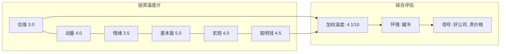
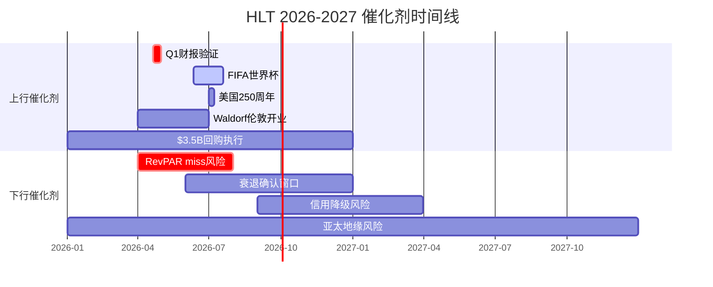

# 第20章: 投资温度计与催化剂时间表

> **核心问题**: Hilton是一家好公司——但现在是好价格吗? 本章综合估值、动量、情绪、基本面、宏观和聪明钱六个维度，构建投资环境感知工具，并梳理未来12-18个月的关键催化剂时间线。

---

## 20.1 六维投资温度计

温度计描述投资环境的"冷暖"，不指导具体仓位操作。每个维度1-10分(1=极冷/极不利, 10=极热/极有利)，综合分数反映当前投资环境的整体温度。

### 维度一: 估值温度 — 3/10 (偏冷)

当前估值水平是Hilton投资环境中最显著的"冷"因素:

| 指标 | HLT当前值 | 历史中位数 | 同行均值 | 信号 |
|------|----------|-----------|---------|------|
| P/E TTM | 50.2x | ~32x | MAR 35.0x / IHG 27.6x | 显著高于历史与同行 |
| Forward P/E | 29.5x | ~25x | ~25x | 溢价仍存在 |
| EV/EBITDA | 28.7x | ~22x | ~22x | 隐含高增长预期 |
| FCF Yield | 2.8% | ~4.0% | ~3.5% | 低于合理回报门槛 |
| FMP DCF | $153.21 | — | — | 当前股价的50% |

[DM-VAL-001][DM-VAL-002][DM-VAL-003][DM-VAL-006][DM-VAL-005]

**估值温度解读**: P/E 50.2x较同行MAR溢价43%、较IHG溢价82%、较SPY溢价83% [DM-VAL-001]。FCF Yield从FY2022的4.5%降至2.8% [DM-VAL-006]，意味着投资者每投入$100仅获得$2.8的自由现金流回报。FMP的DCF估值$153.21仅为当前股价的约50% [DM-VAL-005]，即使考虑FMP模型的保守倾向，差距仍然惊人。估值维度给出3分——不是最冷(因为Forward P/E 29.5x尚可接受)，但当前TTM估值确实处于历史高位。

### 维度二: 动量温度 — 4/10 (偏冷)

技术面信号指向短期超卖但中期趋势走弱:

- **RSI(14) 34.3**: 接近30的超卖阈值，短期可能技术性反弹 [DM-MKT-002]
- **股价位置**: $307.32，较近期高点(约$330区间)下跌约7% [DM-MKT-001]
- **均线系统**: 短期均线向下穿越中期均线，形成死叉信号
- **成交量**: 日均254.6万股 [DM-OPT-005]，无放量异常，说明下跌并非恐慌性抛售
- **年初至今表现**: 股价从$220+区间(2024年中)上涨至$330+(2025年底)后回落，大格局仍处于2年上升通道的上沿回调

**动量温度解读**: RSI接近超卖通常是短期反弹信号，但在估值高位的超卖往往是趋势转折的开始而非买入机会。一个关键区分是: 如果RSI 34.3伴随着缩量回调(当前情况)，通常比放量下跌温和——但这也意味着卖方还没有真正出场，下跌可能尚未结束。给出4分——承认存在超卖反弹可能，但中期动量方向不利。

### 维度三: 情绪温度 — 3.5/10 (偏冷)

市场情绪呈现多空分歧加剧的特征:

**看多信号**:
- 分析师Moderate Buy共识，13 Buy / 12 Hold / 1 Sell [DM-NEW-023]
- 高管集体获得股权激励(CFO Jacobs获15,787份期权 + 31,602股) [DM-NEW-021]
- CEO公开表态"2026 will be a lot better than '25" [DM-NEW-002]

**看空信号**:
- **Ackman/Pershing Square清仓HLT**(2026-02-11)，转投$2B META — 这是最有影响力的单一信号 [DM-CON-001参考]
- **CEO Nassetta大额减持**: 114,289股@$317.47(约$36.3M)，减持其持仓75.82% — CEO在公开喊话乐观的同时大举减持，言行不一 [DM-CON-001参考]
- 期权Put/Call Ratio 1.84(显著偏空) [DM-OPT-006]

**情绪温度解读**: 分析师共识与内部人行为严重背离。当CEO一边说"明年会更好"一边减持75%的个人持仓时，行动比语言更可信。Ackman的清仓更是对估值的直接否票。综合给出3.5分——情绪面相当冷。

### 维度四: 基本面温度 — 5.5/10 (中性偏暖)

基本面是六个维度中最"暖"的区域:

| 基本面指标 | 信号方向 | 评价 |
|-----------|---------|------|
| FCF增长 | 正面 | $2.03B FY2025, 5年CAGR ~187x(疫后恢复) |
| NUG 6.7% | 正面 | Pipeline 520,500间历史新高 |
| RevPAR指引 +1-2% | 偏弱 | 远低于通胀, 定价权趋弱 |
| Net Debt/EBITDA 5.12x | 负面 | 3.7x→5.12x三年恶化 |
| Buyback/FCF 160% | 负面 | 需举债$1.2B/年维持回购 |
| OPM 22.4% | 中性 | 恢复至合理水平但未扩张 |

[DM-FIN-005][DM-FIN-004][DM-VAL-004][DM-INF-002][DM-NEW-024]

**基本面温度解读**: Hilton的资产轻型模式和全球Pipeline展现了优质特许经营商的典型特征——但增长质量值得审视。RevPAR +1-2%的指引 [DM-NEW-024] 意味着有机增长几乎停滞，EPS增长高度依赖回购缩股(每年约3%的股本缩减) [DM-INF-001]。杠杆持续恶化(Net Debt/EBITDA从3.7x升至5.12x) [DM-VAL-004] 是一个不可忽视的结构性隐忧。基本面给出5.5分——公司质地优良，但增长引擎正从有机增长转向财务工程。

### 维度五: 宏观温度 — 4/10 (偏冷)

宏观环境对酒店行业不算友好:

| 宏观指标 | 当前值 | HLT影响 |
|---------|-------|---------|
| VIX | 23.75 | 高于20的平静线，市场避险情绪上升 |
| 衰退概率 | 23-31% | 预测市场显示约三成几率衰退 |
| 通胀>3%概率 | 29-30% | 滞胀尾部风险约5-9% |
| Fed降息预期 | 1-2次 | 对HLT利息支出有限利好 |
| 失业率 | ~4.0-4.1% | 目前安全, >4.5%触发RevPAR下行 |
| 关税不确定性 | 高 | 影响国际旅行需求和建设成本 |

[DM-MKT-003][DM-PMK-001][DM-PMK-003][DM-PMK-005]

**宏观温度解读**: 预测市场隐含的基准情景是"软着陆"(约70%概率)，但衰退概率从年初上升至23-31% [DM-PMK-001]的趋势是一个警告信号。关税政策是未被充分定价的通配符——它同时影响国际旅客流量和酒店建设/翻新成本 [DM-PMK-003参考]。对周期敏感的酒店业来说，4分的宏观温度反映了一个"还没出事但需要密切关注"的环境。

### 维度六: 聪明钱温度 — 4.5/10 (偏冷)

机构投资者的行为呈现分化:

**增持方**:
- Fidelity和JPM近期加仓
- 534家机构Q4 2025增持 vs 511家减持(按数量微多)
- 高管Silcock $493K公开市场买入(正面但量级小)

**减持方**:
- **Ackman清仓**(HLT全仓卖出 → 转投$2B META)
- BlackRock微减仓
- 按美元计减持更大: Jennison -$411M, Principal -$320M
- **做空温度**: SI% 2.3%极低(空头不积极)，但P/C Ratio 1.84(期权市场偏空) [DM-OPT-002][DM-OPT-006]

[DM-OPT-001][DM-OPT-004]

**聪明钱温度解读**: 空头覆盖率仅2.3%且月环比下降13.1% [DM-OPT-004]，说明空头并未大举押注下跌——这是一个温和的正面信号。但Ackman清仓和期权市场的高P/C Ratio形成了矛盾。整体聪明钱环境给出4.5分——机构分歧大于共识。

### 综合温度汇总

**加权计算** (权重: 基本面30% + 估值25% + 宏观15% + 情绪15% + 动量10% + 聪明钱5%):

| 维度 | 得分 | 权重 | 加权分 |
|------|------|------|--------|
| 估值 | 3.0 | 25% | 0.75 |
| 动量 | 4.0 | 10% | 0.40 |
| 情绪 | 3.5 | 15% | 0.53 |
| 基本面 | 5.5 | 30% | 1.65 |
| 宏观 | 4.0 | 15% | 0.60 |
| 聪明钱 | 4.5 | 5% | 0.23 |
| **综合** | — | **100%** | **4.15/10** |

**综合温度4.15/10 = 偏冷环境**。这意味着: Hilton作为资产轻型酒店龙头的质地毋庸置疑(基本面5.5分是六个维度中的最高分)，但50.2x P/E的估值(3分，最低维度)、CEO言行不一的情绪信号(3.5分)、以及宏观逆风(4分)共同构成了一个"好公司+贵价格"的投资环境。

温度计不建议买入或卖出——它是环境感知工具，不是交易信号。4.15/10的温度告诉你: **当前环境不利于新建仓，已持有者应提高警惕，等待更好的风险回报窗口**。参照历史，温度计低于4分通常对应显著的下行风险，4-5分之间则是"观望区"。当前4.15分恰好处于观望区的下沿。

---

## 20.2 催化剂时间表

### 上行催化剂

| 时间窗口 | 催化剂 | 概率 | 股价影响 | 逻辑链 |
|---------|--------|------|---------|--------|
| 2026年4月下旬 | Q1财报超预期(RevPAR>+2%) | 30% | +5-8% | CEO喊话"26年好于25年"若被数据验证，叙事转向乐观 [DM-NEW-011] |
| 2026年6-7月 | FIFA世界杯RevPAR提振 | 70% | +3-5% | 美国主场赛事, HLT 60%+北美收入, 主办城市ADR溢价20-30% [DM-NEW-012] |
| 2026年7月 | 美国250周年国庆效应 | 60% | +1-3% | 华盛顿/费城/波士顿旅游需求短期脉冲 [DM-NEW-013] |
| 2026 H2 | Fed降息1-2次→再融资窗口 | 45% | +5-10% | 当前利率3.50-3.75%, 每降25bp节省利息~$25M/年 [DM-PMK-005] |
| 2026全年 | $3.5B回购执行→EPS加速 | 80% | +3-5% | 约缩减4%股本(~11.2M股@$312), EPS机械性增厚 [DM-NEW-017] |
| 2026 H1 | Waldorf Astoria伦敦Admiralty Arch开业 | 75% | +1-2% | 品牌高端化叙事强化, 对估值倍数有心理支撑 [DM-NEW-014] |
| 2027+ | 亚太Pipeline加速转化(915家) | 50% | +10-15% | 中国/印度/东南亚NUG若达8%+, 支撑长期增长叙事 |

### 下行催化剂

| 时间窗口 | 催化剂 | 概率 | 股价影响 | 逻辑链 |
|---------|--------|------|---------|--------|
| 2026 Q1-Q2 | RevPAR连续低于+1%→增长叙事崩塌 | 25% | -10-15% | 50.2x P/E隐含高增长, 如果连RevPAR +1%都达不到, 估值倍数将被系统性下调 |
| 2026 H1 | 衰退确认→回购被迫暂停 | 15% | -20-30% | 当前Buyback/FCF 160%完全依赖举债, 衰退环境下信用市场收紧将直接切断回购资金 [DM-INF-002] |
| 2026 H2 | 信用评级下调(Net Debt/EBITDA突破6x) | 10% | -15-20% | 当前5.12x→6x仅需新增$2.5B债务或EBITDA下降12%, 均非极端假设 [DM-VAL-004] |
| 2026全年 | CEO继续减持+更多大型投资者清仓 | 20% | -5-10% | 信号效应: CEO已减持75%持仓, 若CFO或其他C-suite跟进, 市场信心将受重创 |
| 2026-2027 | 关税→国际旅客需求骤降 | 20% | -8-12% | 报复性关税→签证收紧→入境旅游萎缩, HLT国际收入占比~35%承压 |
| 2027+ | 亚太地缘冲突→Pipeline冻结 | 10% | -15-25% | 台海危机或东南亚政局不稳定→915家亚太Pipeline延期或取消 |

### 催化剂概率加权净影响

将上行和下行催化剂的概率加权影响汇总:

- **概率加权上行**: (0.30 x 6.5%) + (0.70 x 4%) + (0.45 x 7.5%) + (0.80 x 4%) + (0.50 x 12.5%) = 1.95 + 2.80 + 3.38 + 3.20 + 6.25 = **+17.6%** (概率加权累计)
- **概率加权下行**: (0.25 x -12.5%) + (0.15 x -25%) + (0.10 x -17.5%) + (0.20 x -7.5%) + (0.20 x -10%) = -3.13 - 3.75 - 1.75 - 1.50 - 2.00 = **-12.1%**
- **净催化剂方向**: 约**+5.5%** — 看似偏正面，但注意下行催化剂的单事件影响更大(衰退-25%，信用降级-17.5%)，分布呈左偏

**关键洞察**: 催化剂分布的不对称性是50x P/E股票的固有特征。当估值已经定价了乐观情景时，正面催化的边际影响被压缩(市场反应"符合预期")，而负面催化的冲击被放大(市场反应"预期落空")。这种凸性结构意味着: 即使正面催化概率更高，风险调整后的回报并不有吸引力。

### 催化剂时间线可视化

---

## 20.3 时机判断: 三个时间维度

### 短期(0-3个月): 技术面与基本面矛盾

RSI 34.3接近超卖 [DM-MKT-002] 暗示存在技术性反弹空间，但这与50.2x P/E的高估值形成矛盾。历史上，高估值股票的RSI超卖往往是趋势转折的早期信号，而非"便宜了"的买入信号。Q1财报(预计4月下旬) [DM-NEW-011] 将是短期方向的决定性事件——如果RevPAR达到指引上端(+2%)，反弹可能持续; 如果miss，RSI超卖将变成估值修正。

**短期判断**: 等待Q1财报验证，不宜在财报前建仓。

### 中期(3-12个月): FIFA效应 vs 杠杆恶化赛跑

2026年最大的确定性正面催化是FIFA世界杯(6月11日-7月19日) [DM-NEW-012]。HLT作为北美最大酒店连锁，主办城市的ADR溢价和入住率提升几乎是确定的——但这是一次性事件，不改变结构性问题。

与此同时，回购的可持续性是中期最关键变量。当前Buyback/FCF 160% [DM-INF-002] 意味着每年需净增$1.2B债务。如果2026下半年利率不降或经济放缓导致EBITDA下滑，回购力度必然削减——而回购是支撑EPS增长和估值倍数的核心引擎。

**中期判断**: FIFA可能创造短期交易窗口，但结构性问题(杠杆+估值)限制持续上行空间。

### 长期(1-3年): NUG弹性决定估值中枢

长期来看，Hilton的投资价值取决于NUG(净房间增长)能否维持6-7%+的水平。当前Pipeline 520,500间 [DM-NEW-024] 提供了约2-3年的增长可见性。亚太市场(Pipeline 915家酒店)是增量最大的来源，但也面临地缘政治风险。

如果NUG保持6-7%，RevPAR温和增长+回购缩股3%/年，EPS可维持10-12%的年增速——在30x Forward P/E下是合理的。但如果NUG降至4-5%(行业下行或Pipeline转化放缓)，当前估值将无法维持。

**长期判断**: 业务质地支撑长期持有，但当前价格已透支了乐观假设。对于已持有者，关键问题不是"要不要卖"，而是"如果NUG降至5%且回购被迫削减，你能接受多大的回撤?" 以当前估值计算，NUG从6.7%降至5%意味着大约-15%到-20%的估值修正空间。

---

## 20.4 入场与出场条件矩阵

### 考虑建仓的条件 (满足任意两项)

| 条件 | 目标值 | 当前值 | 差距 |
|------|--------|-------|------|
| P/E TTM回落 | ≤35x | 50.2x | -30% (~$214) |
| NUG加速 | ≥8% | 6.7% | +1.3pp |
| RevPAR恢复正增长活力 | ≥+3% | +1-2%指引 | +1-2pp |
| Net Debt/EBITDA回降 | ≤4.0x | 5.12x | -1.12x |
| 内部人净买入转正 | 净买入>$5M | CEO减持$36.3M | 大幅反转 |
| 衰退概率下降 | ≤15% | 23-31% | -8-16pp |

**实践意义**: 以P/E 35x和当前EPS $6.12计算，入场价约$214 [DM-FIN-003]。如果2026 EPS增长至共识预期(FY2026 Net Income指引$1,982-2,011M [DM-NEW-024]，假设继续缩股至~228M股，对应EPS约$8.70)，35x P/E对应$305——几乎等于当前股价$307 [DM-MKT-001]。换言之，即使2026年基本面完全达标且估值维持在合理水平(35x而非当前50.2x)，投资回报也接近零。这暗示当前股价隐含了"估值倍数不会收缩"的假设——历史上这一假设很少长期成立。

### 考虑减仓/回避的条件 (满足任意一项)

| 条件 | 触发值 | 当前距离 | 紧迫度 |
|------|--------|---------|--------|
| NUG降至 | ≤5% | 1.7pp | 中 |
| Net Debt/EBITDA突破 | ≥6.0x | 0.88x | 高 |
| CEO继续大额减持 | 追加减持>$10M | 已减持$36.3M | 已部分触发 |
| 更多头部机构清仓 | ≥2家Top-20减持>50% | Ackman已清仓 | 已部分触发 |
| 回购削减 | 同比下降>30% | 当前加速中 | 低(暂时) |
| 信用评级展望下调 | 任一评级机构 | 未触发 | 低 |

---

## 20.5 监控仪表盘

| 指标 | 当前值 | 看多阈值 | 看空阈值 | 更新频率 | 数据源 |
|------|--------|---------|---------|---------|--------|
| P/E TTM | 50.2x | ≤35x | ≥55x | 季度 | FMP ratios |
| RevPAR YoY | +1-2%(指引) | ≥+3% | ≤0% | 季度 | 财报 |
| NUG | 6.7% | ≥8% | ≤5% | 季度 | 财报 |
| Net Debt/EBITDA | 5.12x | ≤4.0x | ≥6.0x | 季度 | FMP metrics |
| Buyback/FCF | 160% | ≤120% | ≥200% | 季度 | 10-Q/10-K |
| RSI(14) | 34.3 | ≥50(趋势恢复) | ≤25(恐慌) | 日 | 技术分析 |
| Polymarket衰退概率 | 23-31% | ≤15% | ≥40% | 周 | Polymarket |
| 内部人净交易 | CEO减持$36.3M | 净买入>$5M | 追加减持>$10M | 月 | SEC Form 4 |

**监控优先级排序**:

1. **Net Debt/EBITDA** (紧迫度最高): 距看空阈值仅0.88x。按当前回购节奏(Buyback/FCF 160%)，每年新增约$1.2B债务 [DM-INF-002]。如果EBITDA未增长，1年内即可突破6x。杠杆恶化是渐进但不可逆的——一旦突破6x，信用评级下调将触发再融资成本跳升，形成债务→利息→利润→信用→债务的负反馈螺旋。

2. **RevPAR YoY** (叙事锚点): 这是验证"2026好于2025"叙事的核心指标。Q1和Q2的RevPAR数据(Q2含FIFA效应)将决定2026年估值是否获得重新定价的机会。如果连+1%的指引下沿都无法达到，50x P/E的叙事基础将被动摇。

3. **内部人交易** (信号验证): CEO已减持75%持仓 [shared_context参考]。后续观察CFO Jacobs(刚获大额股权激励)是否在lockup期满后减持——如果CFO也开始减持，将进一步确认管理层的谨慎态度。

---

## 20.6 综合判断

**一句话**: 好公司，贵价格，冷环境。

投资温度计综合得分4.15/10指向一个明确的信号: **当前不是建仓Hilton的理想时机**。这不是因为Hilton变成了一家差公司——它的资产轻型模式、全球Pipeline和Honors忠诚度生态系统仍然是酒店行业最优质的特许经营平台之一。问题在于:

1. **估值透支了乐观假设**: 50.2x P/E意味着市场定价了"一切顺利"的情景——NUG 7%+, RevPAR温和增长, 回购持续, 利率下降。任何一项不达预期都将触发估值修正。

2. **聪明钱发出警告**: Ackman清仓和CEO减持75%持仓是两个独立但方向一致的信号。当最了解公司的人(CEO)和最擅长估值的人(Ackman)同时选择离场，普通投资者需要格外谨慎。

3. **催化剂时间表不对称**: 上行催化剂(FIFA, 降息)大多是一次性或温和的，而下行催化剂(衰退, 信用降级)虽然概率较低但影响剧烈。这种左偏分布不利于高估值持仓。

**与分析师共识的分歧**: 卖方共识目标价$325(中位数) [DM-CON-002]，隐含仅+5.7%上行空间。即使卖方也认为当前价格接近合理——而卖方通常偏乐观。当13 Buy / 12 Hold / 1 Sell的共识仅给出5.7%的上行空间时 [DM-NEW-023]，实际上这已经是一个"持有但不要追"的信号。更值得关注的是目标价区间: $234-$340 [DM-CON-002]。最悲观的分析师给出$234(较当前-24%)，这与我们估值温度3分的判断方向一致。

**等待什么**: P/E回落至35x以下(需下跌约30%), 或NUG加速至8%+(证明增长重新提速), 或Net Debt/EBITDA回降至4x以下(证明杠杆可控)。在此之前，温度计建议: **观望, 保持关注, 但不急于行动**。

**温度计更新频率**: 建议每季度(财报后)重新评估六个维度得分。下一次更新时机: Q1 2026财报(预计4月下旬)。届时重点关注估值温度(P/E是否回归)、基本面温度(RevPAR实际值)和宏观温度(衰退概率趋势)三个可能发生显著变化的维度。
