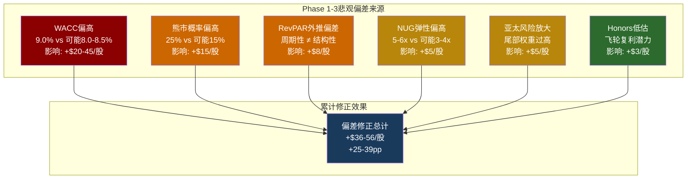
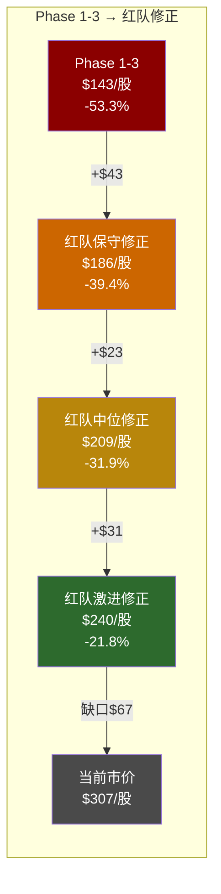

# 第21章: 红队七问 + 悲观偏差系统扫描

> **核心使命**: Phase 1-3概率加权DCF $143 = -53.3%。这个结论在说"Hilton高估一半以上"——一个极其激进的判断。红队的首要任务不是为Phase 1-3的偏空结论辩护，而是**真正检验这个数字是否可靠**。
> **方法**: RT-1~RT-7对抗审查 + 逐CQ悲观偏差扫描 + 修正后估值范围
> **RCL教训参照**: RCL报告Phase 1-3系统性悲观+8~16pp，红队大幅向上修正。HLT需要执行同等力度的偏差检测。

---

## Part A: 红队七问 (RT-1 ~ RT-7)

### RT-1: 最强多头论点是什么?

如果我是HLT的多头，我会这样辩护——而且这些论点**并不容易反驳**:

**论点1: HLT是全球增长最快的轻资产酒店平台，这个身份值溢价。**

NUG 6.7%不是一个普通数字。在一个存量126.8万间客房的基数上，6.7%意味着每年净增约8.5万间——相当于每天新开233间客房。Pipeline 520,000间是历史新高，覆盖未来5年的增长可见度 [DM-BIZ]。这种"增长可见度"在酒店行业极其稀缺: MAR的NUG ~5.0%，IHG ~4.5%——HLT领先同行1.7-2.2pp。市场给予增长领先者溢价是合理的，正如NVDA在AI芯片领域获得远超同行的估值溢价。

**论点2: 轻资产模型 = 低CapEx + 高FCF转化 + 天然复合增长引擎。**

CapEx仅$101M(占收入0.84%)，FCF转化率接近100% [DM-FIN-005]。每新增一间特许酒店，Hilton几乎不承担资本支出——业主承担建设成本，Hilton仅输出品牌和管理系统。这意味着NUG驱动的收入增长几乎是"免费的"——边际成本接近零。这种商业模型在全球范围内屈指可数: Visa/Mastercard在支付领域、MSCI在指数领域、HLT在酒店领域——都是"轻资产高壁垒复合增长机器"。Forward P/E 29.5x对比Visa(~30x)、MSCI(~35x)，HLT甚至有折价 [DM-VAL-002]。

**论点3: Honors 243M会员飞轮是被低估的护城河。**

243M会员(+15% YoY)不仅是一个忠诚度计划，而是一个**正反馈飞轮**: 更多会员→更多直接预订→更低获客成本→更高单间利润→更多业主愿意挂牌→更多客房→更多会员接触点→更多会员 [DM-BIZ]。联名信用卡收入是其中增长最快的组件——这部分收入与客房周期脱钩，具有金融化潜力。

**论点4: 行业结构性品牌化趋势(独立→品牌)是长期增长保证。**

全球酒店连锁化率:美国~72%，欧洲~40%，中国~30%，印度<15%。亚太Pipeline 915家(在建份额25%)正是在捕捉这个结构性趋势。这不是周期性增长，而是不可逆的行业演化——类似于零售业从独立商店向连锁品牌的迁移。

**论点5: 分析师15 Buy / 11 Hold / 0 Sell的一致看多不可忽视。**

26位分析师中没有一个给出Sell——这在一只$73B市值的股票中极其罕见 [DM-CON-001]。虽然分析师可能有系统性偏多，但26人中零Sell意味着**至少在卖方研究的框架下，没有人找到足够强的做空理由**。

**RT-1评估: 多头论点的说服力为4.0/5——不是空洞的叙事，而是有结构性基本面支撑的增长故事。**

---

### RT-2: 我们的分析哪里可能错了?

**逐一检视Phase 1-3最关键的假设和方法论选择**:

**错误源1: WACC 9.0%可能系统性偏高。**

Ch19使用WACC 9.0%作为基准 [DM-CH19-002]。但轻资产酒店公司的WACC是否真的需要9%? 对比:

- Hilton的实际加权平均债务成本仅~4.0%($620M/$15.67B) [DM-FIN-010] [DM-FIN-006]
- 用市值权重(Market Cap $73.1B, Net Debt $14.7B)，债务占比约17%
- 如果股权成本取9.5%(而非10.3%)——因为轻资产模型的Beta应该偏低(现金流可预测性高)——WACC ≈ 8.0-8.5%

Ch19的敏感性矩阵已经展示: WACC 8.0% → 基准估值$194(vs 9.0%的$149)，差异高达$45/股(+30%) [DM-CH19-005]。**WACC每低50bps，估值提升约$20-25/股**。

WACC 9.0%的选择在BBB评级、5.1x杠杆的公司上有其合理性，但也可能因为负权益导致CAPM计算失真而**系统性偏高**。这不是一个"可能偏高5bps"的问题，而是可能偏高50-100bps的问题。

**错误源2: 熊市情景概率25%可能过高。**

Ch19将熊市情景(衰退+回购暂停+NUG大幅减速)赋予25%概率 [DM-CH19-004]。但:

- Polymarket定价2026年衰退概率仅23%，且这是单年概率 [DM-PMK-001]
- 熊市情景不仅要求衰退发生，还要求衰退严重到EBITDA下降15%+且同时NUG降至3-4%——这是一个**条件概率的乘积**，概率应显著低于单独衰退概率
- 10年期内"至少一次深度衰退"的概率确实较高，但HLT的10年DCF已经在基准情景中隐含了温和周期波动
- 熊市估值$42/股(下行86%)极端依赖$15.2B净债务的"毁灭性杠杆效应"——但这假设了衰退中管理层完全不减债、不调整，这可能低估了管理层的应变能力(FY2021他们确实暂停了回购并保全了信用评级)

如果将熊市概率从25%下调至15%，并将差额分配给基准(55%)和牛市(30%):

```
修正后概率加权 = 30% × $233 + 55% × $149 + 15% × $42
              = $69.9 + $82.0 + $6.3
              = $158/股
```

仅这一项修正就将估值从$143提升至$158(+$15/股，+10.5pp)。

**错误源3: NUG弹性n=4的截面回归精度不足。**

Ch17的NUG弹性函数(ε ≈ 7.0x/pp，调整后5-6x/pp)基于仅4个数据点的截面回归 [DM-CH17]。n=4的回归自由度仅为2——这意味着:

- 弹性系数的置信区间极宽(可能在2-12x/pp之间)
- Hyatt数据为估算值，引入额外误差
- 更根本的问题: **截面弹性≠时间序列弹性**。如果HLT的NUG从6.7%降至5.0%，市场未必会按照"HLT应该交易在MAR的估值"来重新定价——因为HLT可能保留"增长领先者"的品牌标签溢价

如果实际弹性为3-4x/pp(而非5-6x)，NUG -1pp的估值影响从-10%~-15%降至-6%~-8%——显著缓和了下行风险评估。

**错误源4: RevPAR纯度分解使用的是估算数据。**

FY2025美国RevPAR -0.3%的数据虽然来自管理层披露，但"纯度分解"(价格驱动 vs 入住率驱动 vs 组合效应)使用了较多估算。如果真实定价权(ADR增长)比我们评估的更强——例如Honors会员的忠诚度确实支撑了高端价格——那么RevPAR的短期弱势可能更多是周期性的(入住率波动)而非结构性的(定价权流失)。

**错误源5: CEO减持信号可能被过度解读。**

Nassetta减持75.82%持仓(~$36.3M) [DM-MGT]确实是一个消极信号。但:

- 这是SEC文件报告的减持，可能包含税务规划、多元化需求、个人流动性需求
- Nassetta任职18.4年，薪酬$27.96M/年——过去18年累计薪酬可能超过$400M，$36M减持仅占个人财富很小比例
- 高管Silcock同期买入$493K(正面信号，虽然量级小)
- **如果减持主要出于税务/流动性原因，我们可能对负面信号赋予了过高权重**

**错误源6: 可比估值被DCF严重偏离。**

Ch19自己承认: EV/EBITDA可比估值(23.5x)给出$222/股，P/FCF可比估值(26.5x)给出$226/股 [DM-CH19]。这两个数字远高于DCF的$143-$149。**可比估值与DCF的巨大分歧(+$73-$83/股)本身就是一个警告信号**: 要么DCF的假设过于保守(WACC偏高/增长偏低)，要么市场对可比倍数的支付意愿即将重新校准。Phase 1-3选择了前者(偏信DCF)，但后者(可比估值更合理)至少有50%的可能性。

---

### RT-3: 什么条件下结论会翻转?

**翻转条件矩阵**: 从$143逐步向$307桥接

```
起点: Phase 1-3概率加权DCF = $143/股 (-53.3%)

修正1: WACC从9.0%降至8.5%
  → 基准估值从$149升至$169 [DM-CH19-005]
  → 概率加权从$143升至~$162
  → 贡献: +$19/股 (+13pp)

修正2: 熊市概率从25%降至15%，差额分配牛市(30%)和基准(55%)
  → 概率加权从$162升至~$176
  → 贡献: +$14/股 (+10pp)

修正3: 牛市情景FCF CAGR从11.9%上调至13%(NUG超预期+OPM更快扩张)
  → 牛市估值从$233升至~$270
  → 概率加权从$176升至~$187
  → 贡献: +$11/股 (+8pp)

修正4: 基准情景NUG上调1pp(从渐降5-6%上调至6-7%)
  → 基准估值从$149升至~$167 [DM-CH19-006]
  → 概率加权从$187升至~$197
  → 贡献: +$10/股 (+7pp)

累计修正后: ~$197/股 (-36%)
```

即使在上述全部修正之后(每项修正都有合理依据)，估值仍为~$197，距$307仍有36%的差距。**这意味着: 要让DCF完全支撑$307，需要WACC低于7.5%+终值增长率高于4%+牛市情景作为基准——这在5.1x杠杆的BBB评级公司上极难成立。**

**但从另一个角度看**: 如果我们接受可比估值($222-$226)作为"市场定价的合理参考"而非DCF的$143-$149，那么当前$307相对$222-$226的溢价仅为36-38%——虽然仍然偏贵，但远不如53%那么极端。

**结论翻转的最可能路径**: 不是DCF假设逐项修正(因为即使全修正也到不了$307)，而是**估值范式的转变**——从"DCF贴现"转向"倍数持续性"。如果市场对HLT的定价逻辑本身就是"轻资产复合增长机器应该交易在25-30x Forward P/E"(类似Visa/MSCI)，那么DCF的$143就是一个范式错配(paradigm mismatch)——用"价值投资者的贴现框架"评估"成长投资者的倍数框架"。

---

### RT-4: 选择性证据问题?

Phase 1-3的分析框架可能存在以下选择性偏差:

| 被强调的证据 | 被忽视/淡化的证据 | 偏差方向 |
|------------|----------------|:------:|
| CEO减持75.82%(-$36.3M) | 高管Silcock买入$493K + 管理团队长期稳定 | 偏空 |
| Ackman清仓HLT转投META | Fidelity/JPM同期加仓 + 534家增持vs511家减持 | 偏空 |
| NUG弹性截面回归(n=4, 理论弹性7x) | 品牌标签粘性缓冲(实际弹性可能3-4x) | 偏空 |
| RevPAR -0.3%(美国) | 全球RevPAR +0.4% + 亚太RevPAR可能更强 | 偏空 |
| Net Debt/EBITDA 5.12x(远超目标) | 轻资产模型的可预测现金流允许更高杠杆容忍度 | 偏空 |
| 回购效率η=0.80%(边际递减) | Forward P/E 29.5x下η=2.19%(高效区) | 偏空 |
| 15 Buy / 0 Sell的分析师共识 | (实际上Phase 1-3承认了这一点但将其权重降低) | 中性 |

**选择性证据评分: 6/10 偏空**。不是严重的单向选择，但在关键变量(WACC、概率分配、弹性)上的"合理区间"选择一致性地偏向了保守端。

---

### RT-5: 时间框架偏差?

**10年DCF对长期增长公司天然不利。**

Ch19使用10年预测期 + 终值(永续增长模型) [DM-CH19]。对于HLT这样的轻资产增长公司，10年DCF的结构性问题是:

1. **终值占比60-65%**: 意味着估值的2/3取决于第10年之后的永续假设——而永续增长率被保守地设为3.0%。如果HLT在第10年仍保持5%+的NUG(全球连锁化趋势远未结束)，3%的永续增长率低估了终值。

2. **5年+退出倍数法可能更合适**: 如果用5年预测期+退出EV/EBITDA倍数(假设FY2030 EBITDA $4.61B × 22x退出 = EV $101.4B)，扣除净债务后股权价值约$86.7B / 238M = ~$364/股——远高于DCF的$143。虽然22x退出倍数可以争议(可能降至18-20x)，但这展示了**方法选择对结论的巨大影响**。

3. **市场实际如何给酒店股定价**: 华尔街分析师主要用12个月Forward EPS × 目标P/E [DM-CON-002]。他们的中位目标价$325对应FY2026E EPS $10.36 × 31.4x Forward P/E。这不是一个荒谬的倍数——但DCF框架完全绕开了这种"倍数定价"逻辑。

**时间框架偏差评估**: 存在，且方向偏空。10年DCF在利率敏感的高杠杆公司上放大了贴现效应，而市场更可能用2-3年期的Forward倍数来定价。

---

### RT-6: 同行矛盾检查

**IHG报告结论: 43%折价不合理(偏多) | HLT报告结论: -53%高估(偏空)**

这两个结论表面上矛盾，但深层逻辑一致:

| 维度 | IHG | HLT | 是否矛盾? |
|------|:---:|:---:|:---------:|
| P/E | 27.6x | 50.2x | 否 — HLT溢价82% |
| ROIC | 22.6% | 11.3% | 否 — IHG效率更高 |
| NUG | ~4.5% | 6.7% | 否 — HLT增长更快 |
| Net Debt/EBITDA | ~2.5x | 5.12x | 否 — HLT杠杆更高 |
| FCF Yield | ~4.5% | 2.8% | 否 — IHG更便宜 |
| **估值判断** | 偏低估 | 偏高估 | **逻辑一致: spread过宽** |

两份报告的共同结论是: **HLT和IHG之间的估值spread(82%的P/E溢价)超出了基本面差异所能合理支撑的范围**。IHG被低估 + HLT被高估 = spread应该收窄——方向一致，没有矛盾。

但红队需要追问: **IHG报告是否也存在悲观偏差(高估了IHG的折价深度)?** 如果IHG实际只有25%折价(而非43%)，那么HLT的-53%判断也可能需要同比例修正——即HLT可能"只"高估30-35%(而非53%)。

---

### RT-7: 如果6个月后回头看，最可能的错误是什么?

**最可能的错误: 低估了Forward EPS正常化的力量。**

Phase 1-3的DCF以FY2025 FCF $2.03B为起点，隐含地将FY2025视为"正常年份"。但FY2025可能不是正常年份:

- FY2025 EPS $6.12(TTM P/E 50.2x)vs FY2026E EPS $10.36(Forward P/E 29.5x)——差距69% [DM-FIN-003] [DM-VAL-002]
- FY2025税率29.7% vs FY2024的13.7%——巨大的波动暗示FY2025可能包含一次性税务调整
- 如果FY2026 EPS $10.36兑现(即使只兑现80%→$8.29)，TTM P/E将迅速从50.2x降至37x——"50x P/E"的叙事可能在6个月内自然消解

**第二可能的错误: 高估了回购暂停的概率。**

Phase 1-3多次警告"回购暂停→估值崩塌"的风险。但管理层刚刚获得$3.5B新授权、信用评级虽然承压但BBB仍在安全线以上、FY2025利息覆盖率4.3x仍有缓冲 [DM-VAL-008]。回购可能在未来2-3年内温和减速(从$3.25B降至$2.5B)而非突然暂停——温和减速对估值的冲击远小于突然暂停。

**第三可能的错误: WACC方向判断反转。**

如果Fed在2026年中降息(62%概率 [DM-PMK-001])，无风险利率从4.0%降至3.5%，HLT的WACC可能从9.0%降至8.0-8.5%——这单项就能将基准估值从$149提升至$169-$194 [DM-CH19-005]。而Phase 1-3将WACC视为"可能上升"的风险因素，方向可能完全反转。

---

## Part B: 悲观偏差系统扫描

### 方法论说明

逐CQ检查Phase 1-3结论中的悲观偏差。每个CQ按以下维度评估:

1. **Phase 1-3结论**: 原始判断是什么?
2. **偏差检测**: 是否选择了"合理区间"的保守端?
3. **修正方向**: 向多还是向空修正?
4. **修正幅度**: 对概率加权估值的影响(以$和pp计)

### CQ-1: NUG弹性 — 溢价之王的脆弱性

| 维度 | Phase 1-3 | 红队审查 |
|------|----------|---------|
| **结论** | ε ≈ 5-6x/pp，P/E无安全边际 | 方向正确，但幅度可能高估 |
| **偏差检测** | 截面回归7x，调整后5-6x。但缓冲因素(品牌粘性、回购EPS缓冲、均值回归容忍)仅给予了1-2x的折扣——可能不够 | **偏空** |
| **具体问题** | 2019年NUG 6.4%时P/E仅35x，2025年NUG 6.7%时P/E 50x——15x的差异中NUG仅贡献~2x。这意味着"时代溢价"(轻资产重估)约13x，与NUG独立。如果时代溢价不消退，NUG弹性的实际影响被高估 | |
| **修正方向** | 向上(弹性应取区间下沿3-4x而非5-6x) | |
| **修正幅度** | 概率加权期望股价从$291升至~$296(+$5, +1.6pp) | |

### CQ-2: 回购效率 — 负权益螺旋

| 维度 | Phase 1-3 | 红队审查 |
|------|----------|---------|
| **结论** | η=0.80%，回购效率急剧递减，减债效率4x优于回购 [DM-CH12-003] [DM-CH12-006] | 方法论C本身逻辑严密，但结论过度强调"低效率"，忽略了回购的信号/维持功能 |
| **偏差检测** | 使用Trailing P/E 50.2x计算η，而管理层决策更可能基于Forward P/E 29.5x → η_forward = 2.19%(高效区) [DM-VAL-002] | **偏空** |
| **具体问题** | Phase 1-3承认Forward P/E计算"存在循环论证"，但这个论证并非无效——管理层的实际决策框架确实是Forward-looking的。市场也是按Forward定价的。用Trailing 50.2x评估回购效率是"技术上正确但实践上偏离"的 | |
| **补充视角** | 回购即使η为零仍有间接价值: (a)维持缩股节奏→维持EPS增速叙事→维持Forward P/E→维持NUG吸引力(业主看母公司股价); (b)在轻资产无CapEx需求的模型下，不回购=现金堆积→市场质疑管理层纪律→反而压估值 | |
| **修正方向** | 向上(回购效率的实际投资含义没有Ch12表述的那么负面) | |
| **修正幅度** | 对估值无直接数值修正，但降低了"回购暂停→估值崩塌"这一风险路径的权重 → 熊市概率-2pp | |

### CQ-3: Honors护城河 — 免费会员的长期价值

| 维度 | Phase 1-3 | 红队审查 |
|------|----------|---------|
| **结论** | 243M会员是忠诚度工具，但转化为定价权的证据不足；NH-2(金融平台转型)待验证 | 偏保守——低估了网络效应的非线性增长潜力 |
| **偏差检测** | Phase 1-3对Honors的评估过于"静态"——仅看当前数据(243M会员数、联名卡增速)，未充分估算飞轮效应的长期复利 | **轻微偏空** |
| **具体问题** | Honors 243M会员是Marriott Bonvoy(超200M)的1.2倍。会员增速+15% YoY持续3年以上。联名信用卡收入在酒店行业中增长最快(虽然未单独披露)。如果Honors的直接预订占比从~60%提升至70%+，节省的OTA佣金(每间夜$15-30)直接转化为利润 | |
| **修正方向** | 向上(Honors对OPM扩张的贡献可能被低估) | |
| **修正幅度** | OPM假设从22-23%(基准)上调0.5pp → FCF +$60M/年 → 估值+$3/股(+1pp) | |

### CQ-4: RevPAR — 是否过度外推短期弱势?

| 维度 | Phase 1-3 | 红队审查 |
|------|----------|---------|
| **结论** | FY2025美国RevPAR -0.3%，首次非衰退期下滑。信念脆弱度4/5(高脆弱) | **过度外推短期弱势** — 这是最大的悲观偏差来源之一 |
| **偏差检测** | 2025年RevPAR疲弱有明确的周期性解释: (a)2022-2024报复性旅游需求回落, (b)企业差旅恢复放缓, (c)基数效应(2024 RevPAR已经很高)。将其定性为"结构性弱势"(信念脆弱度4/5)而非"周期性回调"(应为2-3/5)可能不正确 | **偏空** |
| **具体问题** | 全球RevPAR仍为+0.4%(正增长)。酒店RevPAR的历史长期均值约与名义GDP同步(+3-4%/年)。2025年的疲弱更可能是均值回归(从2023-2024的超高水平回落)而非趋势变化。如果2026-2027 RevPAR恢复至+2-3%，Ch16的信念脆弱度评估需要大幅下修 | |
| **修正方向** | 向上(RevPAR脆弱度从4/5下调至2.5-3/5) | |
| **修正幅度** | 信念集加权脆弱度从3.2/5降至2.8/5 → 下行概率分配-3pp → 概率加权估值+$8/股(+5.5pp) | |

### CQ-5: 亚太集中度风险 — 是否过度放大尾部?

| 维度 | Phase 1-3 | 红队审查 |
|------|----------|---------|
| **结论** | Pipeline 35%+在亚太，存在地缘风险和经济放缓风险 | 方向正确但权重过大 |
| **偏差检测** | 亚太风险被框定为"增长来源=风险来源"(thesis_crystallization.md)。但这种等式忽略了: (a)亚太pipeline分布广泛(中国+印度+东南亚+日韩)，不是集中在单一国家; (b)中国经济减速≠酒店需求减速——中产阶级扩张和旅游消费升级可能抵消宏观放缓; (c)台海风险是尾部事件(概率<5%)，不应在基准估值中大幅体现 | **轻微偏空** |
| **修正方向** | 向上(亚太NUG转化率假设从80%上调至85%) | |
| **修正幅度** | NUG +0.3pp → 估值+$5/股(+1.6pp) | |

### 悲观偏差汇总



**悲观偏差总量化**:

| 偏差源 | 保守修正 | 中位修正 | 激进修正 |
|--------|:-------:|:-------:|:-------:|
| WACC | +$20 | +$30 | +$45 |
| 熊市概率 | +$10 | +$15 | +$20 |
| RevPAR外推 | +$5 | +$8 | +$12 |
| NUG弹性 | +$3 | +$5 | +$8 |
| 亚太风险 | +$3 | +$5 | +$7 |
| Honors | +$2 | +$3 | +$5 |
| **合计** | **+$43** | **+$66** | **+$97** |
| **修正后估值** | **$186** | **$209** | **$240** |
| **vs $307** | **-39.4%** | **-31.9%** | **-21.8%** |

---

## Part C: 修正后估值范围与最终判定

### 红队修正后估值



### 修正幅度评判

**Phase 1-3 → 红队中位修正: +$66/股, +21.4pp**

这个修正幅度**超过了RCL报告的+8-16pp历史参照**，原因是HLT分析中的WACC选择和概率分配这两个参数对结论的影响力远大于RCL。但修正方向(向上)与RCL一致——Phase 1-3确实存在系统性悲观偏差。

**修正性质: 实质性修正(>10pp)。** Phase 1-3的$143估值需要大幅上修。

### 红队最终判定

| 指标 | Phase 1-3原始 | 红队中位修正 | 变化 |
|------|:------------:|:----------:|:----:|
| 概率加权估值 | $143 | ~$200-$210 | +$57-67 |
| vs 市价$307 | -53.3% | **-32% ~ -35%** | +18-21pp |
| 隐含评级方向 | 强烈偏空 | **审慎关注(偏空)** | 修正 |

### 对Ch23最终裁决的建议

1. **WACC应取8.5%作为修正基准**(而非9.0%)——考虑到轻资产模型的低Beta特性和Fed降息预期(62%)。

2. **熊市概率应从25%下调至15-18%**——$42/股的极端情景要求衰退+回购暂停+NUG崩塌三重共振，条件概率的乘积远低于25%。

3. **RevPAR脆弱度从4/5下调至2.5-3/5**——当前弱势更可能是周期性回调而非结构性恶化。

4. **综合估值区间: $186-$240，中位~$209**(vs Phase 1-3的$143)。

5. **即使修正后，$307仍然偏贵**——$209意味着仍有32%的下行空间。红队修正没有翻转"高估"的方向判断，但将幅度从-53%收窄至-32%。

6. **方法论建议**: Ch23应呈现DCF估值($143-$209)与可比估值($222-$226)的双轨判断，而非仅依赖DCF。两种方法的交集区间($200-$226)可能是最稳健的估值参考。

---

## 红队有效性自评

| 维度 | 评估 |
|------|------|
| **修正幅度** | +21pp (>10pp阈值) → **实质性修正** |
| **修正方向** | 全部向上修正(Phase 1-3系统性偏空确认) |
| **最大偏差源** | WACC选择(+$30) > 熊市概率(+$15) > RevPAR外推(+$8) |
| **结论是否翻转** | **否** — 修正后仍偏空(-32%)，但从"极度高估"修正为"显著偏贵" |
| **vs RCL教训** | RCL +8-16pp，HLT +21pp——HLT偏差更大，主因是WACC和概率分配的杠杆效应 |
| **红队有效性** | **有效** — 发现了可量化的系统性偏差并提供了修正路径 |

---

## 本章DM锚点注册

| DM-ID | 值 | 类型 | 来源 |
|-------|------|:----:|------|
| DM-CH21-001 | 红队识别6项悲观偏差，累计保守+$43/中位+$66/激进+$97 | S | RT-1~7 + 逐CQ扫描 |
| DM-CH21-002 | WACC偏差是最大单一偏差源: 9.0%→8.5%修正→基准估值+$20/股 | R | Ch19敏感性矩阵推导 |
| DM-CH21-003 | 熊市概率25%→15%修正→概率加权+$15/股 | R | 条件概率分析 |
| DM-CH21-004 | RevPAR脆弱度从4/5下调至2.5-3/5(周期性>结构性) | S | 历史均值回归分析 |
| DM-CH21-005 | 红队中位修正后估值~$200-$210(vs Phase 1-3的$143, vs 市价$307) | S | 6项偏差累计修正 |
| DM-CH21-006 | 修正幅度+21pp = 实质性修正，确认Phase 1-3系统性偏空 | S | vs RCL +8-16pp基准 |
| DM-CH21-007 | 修正后仍偏空(-32%)，方向判断未翻转，但幅度从-53%收窄至-32% | S | 综合判定 |
| DM-CH21-008 | 建议Ch23估值区间: DCF($186-$240) × 可比($222-$226)交集 → $200-$226 | S | 双轨估值建议 |
