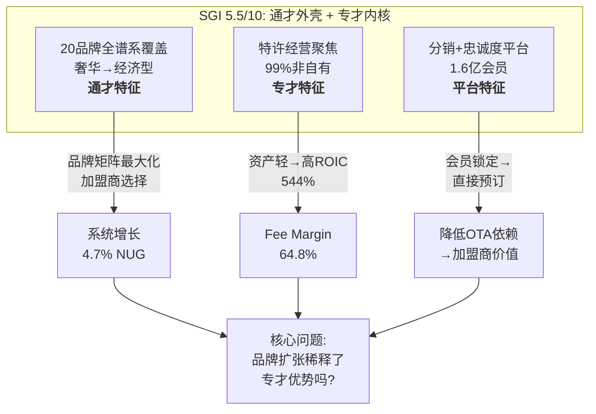
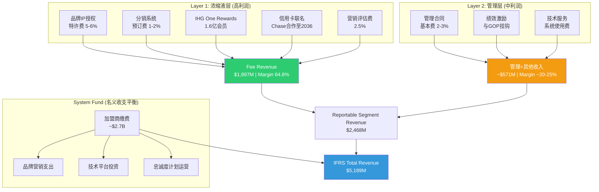
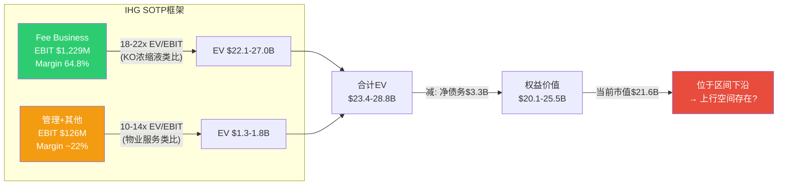
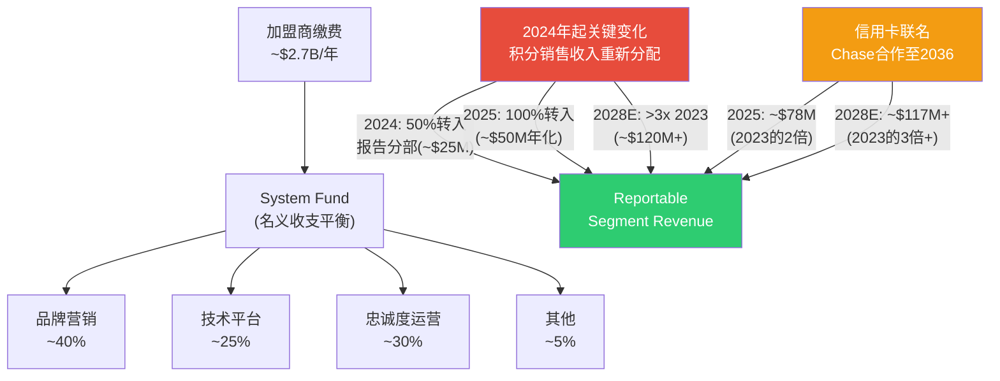
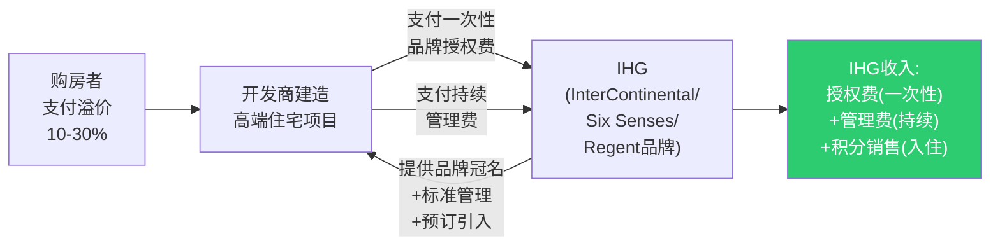
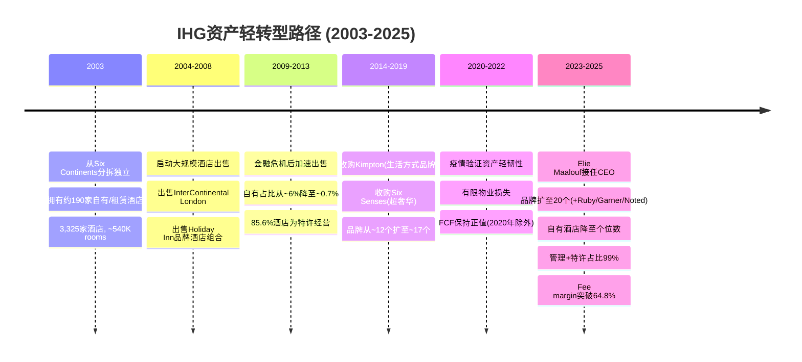
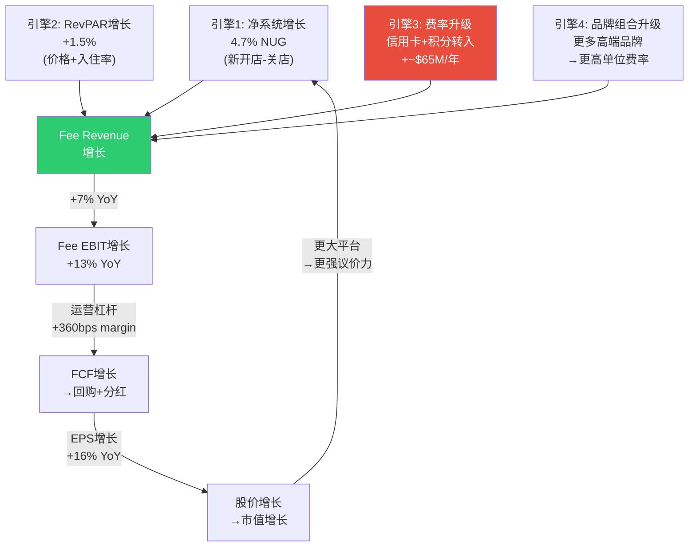

# Ch1-2: 身份诊断 + 特许经营经济学
> Phase 1 AgentA | IHG Tier 3 | 2026-02-27

---

## 第一章 身份诊断: IHG到底是什么?

### 1.1 SGI评估: 专才还是通才?

**SGI = 5.5/10 (偏通才, 特许经营模式加分)**

评估一家公司的"专才指数"(Specialist-Generalist Index), 核心问题是: 这家公司的竞争优势来自一个聚焦的、难以复制的能力, 还是来自多元化的广泛覆盖? IHG的答案并不简单。

**通才特征 (压低SGI):**

IHG拥有20个品牌, 覆盖从超奢华(Six Senses, 每晚$2,000+)到经济型(avid, 每晚$60-80)的完整光谱 [DM-P1A-001]。品牌组合按四个层级组织:

- **奢华与生活方式 (6个品牌)**: Six Senses, Regent, InterContinental, Vignette Collection, Kimpton, Hotel Indigo
- **高端 (5个品牌)**: voco, Ruby(2025年收购), HUALUXE, Crowne Plaza, EVEN Hotels
- **核心 (4个品牌)**: Holiday Inn, Holiday Inn Express, Garner, avid
- **长住 (4个品牌)**: Atwell Suites, Staybridge Suites, Holiday Inn Club Vacations, Candlewood Suites
- **独家合作伙伴**: Iberostar Beachfront Resorts

加上2026年2月刚推出的Noted Collection(高端精选品牌), IHG的品牌矩阵已经扩展至21个 [DM-P1A-002]。这种"全谱系"覆盖与Marriott(30+品牌)和Hilton(24品牌)的策略如出一辙, 本质上是通才打法 — 用品牌矩阵最大化加盟商选择空间, 而非用单一品牌构建不可替代性。

**专才特征 (抬升SGI):**

但IHG不是一家"酒店公司", 而是一家"酒店品牌特许经营公司"。这个区分至关重要。IHG全球1,026,000间客房中, 管理+特许经营占99%, 自有/租赁酒店几乎为零 [DM-P1A-003]。2003年从Six Continents分拆独立时, IHG还拥有约190家自有酒店; 到2025年, 这个数字已降至个位数。

这意味着IHG的核心能力极度聚焦在三件事上:
1. **品牌创建与管理** — 让"Holiday Inn"这五个字值钱
2. **分销系统运营** — IHG One Rewards 1.6亿会员 + 预订引擎 [DM-P1A-004]
3. **加盟商服务** — 让酒店业主相信挂IHG的牌子比自己干更赚钱

这三件事的组合, 本质上就是Coca-Cola的"浓缩液模型" — 卖的不是酒店房间, 而是品牌知识产权的使用权。从这个角度看, IHG的商业模式是高度专才的。



**SGI对标:**

| 公司 | SGI | 模型 | 关键差异 |
|------|-----|------|----------|
| KO | 4.5 | 浓缩液特许 | 更纯粹的专才(1个核心品类) |
| IHG | 5.5 | 酒店品牌特许 | 20品牌拉向通才, 但模式本身是专才 |
| MAR | 4.0 | 酒店品牌特许(最大规模) | 30+品牌但规模优势更强 |
| HLT | 4.5 | 酒店品牌特许(最聚焦) | 品牌更精简, 执行最一致 |
| COST | 4.5 | 会员飞轮 | 单一业态, 会员驱动 |

**路由决策**: 通才框架为主(多品牌矩阵分析), 特许经营经济学为专才切入点(Ch2)。IHG的估值核心不在任何单一品牌, 而在特许经营平台的经济飞轮效率。

---

### 1.2 A-Score初评: 竞争优势量化

**A-Score = 6.5/10 (11维度加权)**

A-Score旨在量化公司的"护城河宽度+深度"。IHG的护城河特征是: 宽而浅 — 覆盖面广(全球100+国家, 20个品牌), 但在每个单一维度上都不是最强的那个。

| 维度 | 评分 | 核心理由 |
|------|------|----------|
| 品牌力 | 7/10 | Holiday Inn全球知名度极高, InterContinental有历史底蕴(1946年创立); 但奢华段深度不及MAR(Ritz-Carlton/St.Regis)和HLT(Waldorf Astoria) [DM-P1A-005] |
| 网络效应 | 7/10 | IHG One Rewards 1.6亿+会员, 全球预订网络覆盖100+国家; 但MAR Bonvoy 2.2亿+会员, HLT Honors 2亿+会员, IHG会员规模排第三 [DM-P1A-006] |
| 切换成本 | 6/10 | 加盟商切换品牌需要: 重新装修($1-5M)、系统迁移、品牌认知重建(12-18个月); 但并非不可能, 独立酒店转加盟或品牌间迁移时有发生 |
| 规模经济 | 5/10 | 全球第三, 1.03M rooms; 但MAR 1.6M rooms(55%领先)、HLT 1.18M rooms(15%领先), 规模差距转化为采购谈判力和分销效率差 [DM-P1A-007] |
| 成本优势 | 6/10 | 资产轻模型SGA/Rev 6.6%, CapEx/Rev仅0.5%($28M) [DM-P1A-008]; 但HLT的成本控制更极致(分拆Park Hotels后几乎零物业负担) |
| 管理层 | 6/10 | CEO Elie Maalouf 2023年接任, 此前负责Americas业务, 执行力待更多时间验证; 品牌从17扩至21个, 收购Ruby, 推出Noted Collection和Garner — 战略积极但需证明不是过度扩张 [DM-P1A-009] |
| 财务质量 | 8/10 | FCF/NI 1.15x(现金转换优秀), ROIC 544%(资产轻极致), CapEx/Rev 0.5%, Altman Z 4.95(极健康), OCF/CapEx 32x(资本支出几乎可忽略) [DM-P1A-010] |
| 增长质量 | 7/10 | 净系统增长4.7%(加速中, 此前多年3-4%), 签约102K rooms(+9% YoY), 管线340K(系统33%); 但RevPAR增速放缓至+1.5%(美洲仅+0.3%) [DM-P1A-011] |
| 资本配置 | 6/10 | 2025年回购$907M(收益率7.6%), 分红$270M, 合计$1.18B — 超过FCF $870M约$310M, 差额通过举债补充; 净负债/EBITDA 2.5x, 目前可控但持续超额回购的可持续性存疑 [DM-P1A-012] |
| 行业地位 | 6/10 | 全球第三大酒店集团(房间数); 管线342K rooms仅为MAR的约57%, HLT的约65%; 品牌扩张在缩小差距但速度不够快 [DM-P1A-013] |
| 估值吸引力 | 7/10 | P/E 29.4x, 折价HLT(51.8x) 43%, 折价MAR(36.9x) 20%; FCF yield 4.0%; EV/EBITDA 18.9x [DM-P1A-014] |

```mermaid
radar
    title "IHG A-Score雷达图 (6.5/10)"
    "品牌力" : 7
    "网络效应" : 7
    "切换成本" : 6
    "规模经济" : 5
    "成本优势" : 6
    "管理层" : 6
    "财务质量" : 8
    "增长质量" : 7
    "资本配置" : 6
    "行业地位" : 6
    "估值吸引力" : 7
```

**A-Score的关键洞察**: IHG的财务质量(8分)与规模经济(5分)之间存在3分的断层。这个断层的含义是: IHG的商业模式本身极其优秀(资产轻、高现金转换、极低资本需求), 但它在这个优秀模式中的竞争位置只是"第三名"。这正是估值折价的核心来源 — 市场不是不认可资产轻模型, 而是不确定"第三名"能否缩小与前两名的差距。

---

### 1.3 PW评估: 可能性空间有多宽?

**PW = 5.5/10 (混合模式)**

可能性宽度(Possibility Width)评估未来结果的不确定性分布。分数越高, 意味着未来结果可能偏离基准预期的幅度越大, 越需要情景分析而非点估计。

| 维度 | 评分 | 理由 |
|------|------|------|
| 技术不确定性 | 2/10 | 酒店特许经营是成熟商业模式, AI/技术变革对核心模型冲击有限; OTA竞争格局已稳定 |
| 竞争格局 | 4/10 | 三巨头(MAR/HLT/IHG)格局稳固, 但份额差距在扩大还是缩小存在分歧; Airbnb对传统酒店的替代边界未完全清晰 |
| 监管环境 | 3/10 | 酒店行业监管相对友好, 无重大监管悬崖; 反垄断风险低(行业集中度远未触发关注) |
| 宏观敏感度 | 7/10 | 酒店RevPAR对经济周期高度敏感; 2025年美洲RevPAR仅+0.3%, 大中华区-1.6% [DM-P1A-015]; 衰退情景下RevPAR可能-10~-15%, 直接冲击fee revenue |
| 估值争议 | 8/10 | 折价HLT 43%引发激烈争论: 是合理的"规模折价"还是"低效折价"? 市场在IHG能否加速增长上分歧巨大 |

**总分**: (2+4+3+7+8)/5 = 4.8, 向上调整至5.5(考虑credit card/loyalty收入结构性变化带来的不确定性)

**路由决策**: PW 5.5 → **混合模式** — 传统估值框架(SOTP + DCF)为主体, 辅以信念反演(Reverse DCF)和条件情景分析。不采用发现系统, 因为IHG的商业模式本身没有范式不确定性。

---

### 1.4 商业模式画布: 双层经济结构

IHG的商业模式有一个被多数投资者忽视的双层结构。理解这个结构是回答"折价合理吗?"的前提。

**Layer 1: 品牌/系统/忠诚度层 = "浓缩液"**

这一层是IHG的"KO浓缩液" — 加盟商支付特许费+营销费+预订费, 换取品牌使用权和系统接入。IHG在这一层:
- 不拥有任何酒店实体资产
- 不承担酒店运营风险(房价波动、人工成本、维护费用)
- 只提供品牌IP + 分销系统 + 忠诚度计划
- 收入来源: 特许费(5-6%房收) + 营销评估费(2.5%) + 预订费(1-2%) + 信用卡联名费 + 忠诚度积分销售

**Layer 2: 管理酒店层+其他 = "成品"**

这一层是IHG为酒店业主提供管理服务, 收取管理费(通常2-3%收入 + 绩效激励)。与Layer 1相比:
- 管理收入与酒店经营绩效挂钩(激励费与GOP/FFO关联)
- 需要部署现场管理团队
- 利润率低于Layer 1(管理层需要人力成本)



**关键数字拆解 [DM-P1A-016]:**

| 收入层级 | FY2025金额 | 占比 | 同比增长 |
|----------|-----------|------|---------|
| Fee业务收入 | $1,897M | 76.9%报告收入 | +7% |
| 管理+其他 | ~$571M | 23.1%报告收入 | +7% |
| 报告分部收入 | $2,468M | 47.6% IFRS | +7% |
| System Fund收入 | ~$2,721M | 52.4% IFRS | +4% |
| **IFRS总收入** | **$5,189M** | **100%** | **+5%** |

为什么这个拆解重要? 因为IHG的$5.189B IFRS收入中, 超过一半($2.7B)是System Fund的"过手收入" — 加盟商缴费进入基金, IHG代为管理并支出在品牌营销、技术和忠诚度上, 名义上收支平衡。真正属于IHG的经济收入只有$2.468B的报告分部收入, 其中又以$1.897B的fee收入为核心。

如果只看fee收入的利润, fee margin 64.8%意味着IHG在这$1.9B上赚取约$1.23B的EBIT [DM-P1A-017]。这就是为什么IHG的ROIC可以高达544% — 它在极少的投入资本上赚取了极高的利润。

---

### 1.5 竞争三角: 谁是"最佳运营商"?

在回答"折价合理吗?"之前, 必须先画清竞争格局。全球酒店特许经营是一个事实上的三巨头市场:

| 指标 | MAR | HLT | IHG | IHG vs MAR | IHG vs HLT |
|------|-----|-----|-----|-----------|-----------|
| 系统房间数 | ~1.6M | ~1.18M | 1.03M | -36% | -13% |
| 品牌数量 | 30+ | 24 | 20 | -33% | -17% |
| 管线房间数 | ~590K | ~520K | 340K | -42% | -35% |
| P/E (TTM) | 36.9x | 51.8x | 29.4x | 折价20% | 折价43% |
| 市值 | $93B | $74B | $22B | -76% | -70% |
| 忠诚度会员 | 220M+ | 200M+ | 160M+ | -27% | -20% |
| 净系统增长 | ~4% | 6.7% | 4.7% | +0.7pp | -2.0pp |
| 员工数 | 418K | 182K | 12.6K | -97% | -93% |

[DM-P1A-018]

最后一行数据最能说明问题: IHG只有12,587名全职员工, 是MAR的3%, HLT的7%。这不是因为IHG业务小, 而是因为IHG把资产轻模式推到了最极致 — 几乎所有酒店运营人员都不在IHG的工资单上。MAR和HLT拥有大量管理酒店(员工在其工资单上), 而IHG的特许经营占比最高。

**这对估值意味着什么?** IHG的fee margin 64.8%在三者中可能是最高的(HLT和MAR的management fee会拉低整体margin), 但IHG的"纯fee"收入规模也最小。市场对MAR和HLT的更高估值, 反映的是:
1. **规模溢价**: MAR/HLT的系统更大, 飞轮转得更快
2. **增长溢价**: HLT 6.7%净增长 >> IHG 4.7% >> MAR ~4%
3. **管线溢价**: MAR/HLT的管线更大, 锁定了更多未来增长

IHG的折价则反映:
1. **第三名折扣**: 在赢家通吃型行业, 第三名通常被要求以显著折扣交易
2. **增长预期差**: 管线340K vs HLT 520K意味着未来增速天花板可能较低
3. **市场认知滞后**: IHG的资产轻转型比HLT(2013分拆Park Hotels)早十年开始但市场认知度更低

---

## 第二章 特许经营经济学: IHG的"浓缩液"有多浓?

### 2.1 双层经济学的财务解剖

要理解IHG的内在价值, 必须将其拆开成两个独立的业务进行估值, 然后加总。这是Sum-of-the-Parts的基础。

**Layer 1: 特许经营层 (Fee Business)**

| 指标 | FY2023 | FY2024 | FY2025 | CAGR |
|------|--------|--------|--------|------|
| Fee Revenue | $1,597M | $1,773M | $1,897M | +9.0% |
| Fee Margin | ~58% | 61.2% | 64.8% | +340bps/yr |
| Fee EBIT(估算) | ~$926M | ~$1,085M | ~$1,229M | +15.2% |
| CapEx归属 | ~$15M | ~$15M | ~$14M | 近零 |
| Fee层 ROIC | >1000% | >1000% | >1000% | N/M |

[DM-P1A-019]

Fee revenue的两年复合增长率9%看起来不快, 但fee margin从约58%扩张到64.8%(+680bps)意味着EBIT增速高达年均15%以上。这就是资产轻模式的杠杆效应: 收入每增长1%, EBIT可能增长1.5-2%, 因为增量fee收入几乎不需要对应的成本增加。

2025年fee margin 64.8%中, 约230bps来自运营杠杆(fee业务成本基数同比下降), 剩余约130bps来自信用卡和忠诚度积分等辅助fee流的结构性增加 [DM-P1A-020]。

**Layer 2: 管理+其他层**

| 指标 | FY2023 | FY2024 | FY2025 |
|------|--------|--------|--------|
| 管理+其他收入 | ~$531M | ~$527M | ~$571M |
| 估算EBIT Margin | ~20% | ~20% | ~22% |
| 估算EBIT | ~$106M | ~$105M | ~$126M |

这一层的收入相对稳定, 利润率远低于fee层。管理合同的绩效激励费(incentive management fees)与酒店GOP挂钩, 在RevPAR放缓环境下(美洲+0.3%)增速受限。

**SOTP估值框架初步搭建:**

如果对两层分别估值:

| 层级 | EBIT | 合理EV/EBIT倍数 | 隐含EV |
|------|------|----------------|--------|
| Layer 1 (Fee) | $1,229M | 18-22x | $22.1B - $27.0B |
| Layer 2 (管理+其他) | $126M | 10-14x | $1.3B - $1.8B |
| **合计** | **$1,355M** | — | **$23.4B - $28.8B** |
| 减: 净债务 | — | — | -$3.3B |
| **权益价值** | — | — | **$20.1B - $25.5B** |
| 每ADR股价 | — | — | **$129 - $163** |

[DM-P1A-021]

当前市值$21.6B, 股价$143 — 位于SOTP区间的中下段。这意味着市场基本上只给了Fee层18x EV/EBIT的低端倍数, 几乎没有为增长加速或margin继续扩张留任何空间。



---

### 2.2 KO类比深度化: "浓缩液"品质对比

IHG的fee margin 64.8%与Coca-Cola的浓缩液EBIT margin(约60-65%)惊人相似 [DM-P1A-022]。这不是巧合 — 两者的商业本质是同构的:

| 特征 | KO浓缩液模型 | IHG特许经营模型 |
|------|-------------|---------------|
| 核心产品 | 糖浆配方(IP) | 品牌标准+系统(IP) |
| 客户 | 装瓶商 | 加盟商(酒店业主) |
| 费率基础 | 浓缩液售价(成本+溢价) | 房收5-6% + 营销2.5% + 预订1-2% |
| EBIT margin | ~60-65% | 64.8% |
| 资本需求 | 极低(配方不折旧) | 极低(CapEx/Rev 0.5%) |
| 增长驱动 | 装瓶商扩产+提价 | 加盟商开店+RevPAR+辅助费 |
| 护城河 | 100年+品牌 | 70年+品牌(弱于KO) |
| ROIC | ~22% (含装瓶投资) | 544% (几乎纯fee) |

但这个类比有一个关键差异: **估值差距**。KO的浓缩液业务获得约25-28x EV/EBITDA, 而IHG的fee业务隐含仅18-19x。差距来自哪里?

**差距来源拆解:**

1. **品牌久期**: KO品牌存在139年(1886年至今), IHG品牌矩阵中最老的InterContinental也只有80年(1946年); Holiday Inn始于1952年。KO的品牌"永续性"确定性更高, 支撑更高的久期溢价 [DM-P1A-023]

2. **需求稳定性**: 碳酸饮料需求跨周期极稳定(衰退中消费降级但不消失); 酒店RevPAR对经济周期敏感(2020年全球RevPAR跌50%+), fee revenue虽然比owned hotel更抗周期, 但仍与RevPAR直接挂钩

3. **竞争格局**: KO在碳酸饮料领域只有PEP一个对等竞争者(双寡头); IHG在酒店特许经营面临MAR+HLT两个更大的竞争者, 且自身是第三名

4. **增长天花板**: KO的全球渗透率远未饱和(非洲、印度); IHG的酒店增长也有长跑道(全球chain penetration仅~40%), 但竞争更激烈

**量化差距**: 如果IHG的fee层能获得KO类似的25x EV/EBITDA估值, 仅fee层的EV就将达到$30B+(vs 当前整体EV $25.4B)。市场给IHG fee层的折扣约25-30%, 核心原因是品牌久期更短+周期敏感性更高+第三名位置。

---

### 2.3 加盟商经济学: 系统增长的底层引擎

IHG的系统增长(4.7% NUG)不是IHG自己决定的, 而是全球数千名加盟商(酒店业主/开发商)各自独立决策的结果。每个加盟商的决定取决于一个简单的问题: **挂IHG的牌子, 我的投资回报率是否高于替代方案(其他品牌或独立经营)?**

**典型加盟商投资模型 [DM-P1A-024]:**

以IHG最核心的品牌Holiday Inn Express为例(全球约3,200家, 占系统~46%的客房):

| 项目 | 数值 | 来源 |
|------|------|------|
| 投资总额(不含土地) | $7.9M - $11.1M | FDD 2025 |
| 典型客房数 | 93间 | FDD标准 |
| 每间投资 | $85K - $119K | 计算 |
| 加盟申请费 | $50K (可低至$15K) | FDD |
| 年RevPAR(美国) | ~$85-$100 | 行业数据 |
| 年房收(93间, 70%入住率) | ~$2.2M - $2.6M | 计算 |
| IHG提取: 特许费6% | ~$132K - $156K | FDD费率 |
| IHG提取: 营销费3% | ~$66K - $78K | FDD费率 |
| IHG总提取率 | ~9%收入 | 加总 |
| 加盟商NOI margin | ~35-40% | 行业平均 |
| 加盟商NOI | ~$770K - $1,040K | 计算 |
| 加盟商现金回报率(Cash-on-Cash) | ~7-13% | NOI/投资 |

```mermaid
sankey-beta
    "酒店房收 $2.4M" , "运营成本(人工/维护/能源) $1.05M" , 1050
    "酒店房收 $2.4M" , "IHG特许费(6%) $144K" , 144
    "酒店房收 $2.4M" , "IHG营销费(3%) $72K" , 72
    "酒店房收 $2.4M" , "IHG预订费 $36K" , 36
    "酒店房收 $2.4M" , "债务服务 $350K" , 350
    "酒店房收 $2.4M" , "物业税/保险 $200K" , 200
    "酒店房收 $2.4M" , "加盟商现金流 $548K" , 548
```

**加盟商ROI是系统增长的"看不见的手":**

当加盟商现金回报率>10%时, 新签约涌入, 系统增长加速; 当回报率跌向7%以下, 签约放缓, 甚至出现退出。2025年IHG签约102.1K rooms(+9% YoY)说明加盟商经济目前是健康的 [DM-P1A-025]。

但有一个隐含的紧张关系: IHG不断提升fee费率(通过信用卡联名费、loyalty积分销售等新渠道), 本质上是在加盟商的利润蛋糕中切更大的一块。如果IHG的"切割比例"从9%提到12%, 加盟商NOI将从约$900K降至约$828K, 现金回报率从~10%降至~8.5%。这是一个精密的平衡 — IHG必须通过品牌增值(更高RevPAR、更高入住率)来抵消更高的费率, 否则加盟商会"用脚投票"。

**InterContinental品牌加盟**: 对比Holiday Inn Express, InterContinental品牌的投资门槛完全不同 — FDD显示总投资$70.4M - $102.9M(含$75K申请费), 这是一个完全不同的加盟商群体(机构投资者/主权基金vs中小企业主) [DM-P1A-026]。这种品牌矩阵的跨度让IHG能同时触达两类完全不同的资本池, 扩大了潜在签约基础。

---

### 2.4 System Fund: 被忽视的"隐形引擎"

IHG的IFRS收入$5.189B中有约$2.7B是System Fund收入, 但这并不是一笔"透明的过手资金"那么简单。理解System Fund的运作机制, 是发现IHG"隐形增长引擎"的关键。

**System Fund运作机制:**



**2024年的关键结构性变化:**

IHG在2024年重新谈判了System Fund的安排条款, 将两个此前"隐藏"在System Fund内的收入流转移到报告分部:

1. **忠诚度积分销售收入**: 当第三方(如信用卡公司)购买IHG One Rewards积分时, 这笔收入此前留在System Fund。2024年起50%转入报告分部(~$25M/年), 2025年起100%转入(~$50M/年化) [DM-P1A-027]

2. **信用卡联名费**: IHG在2024年11月与Chase签署新的联名信用卡协议, 有效期至2036年。新协议下, 信用卡费在IHG报告利润中的占比大幅提升 — 2023年为$39M, 2025年翻倍至约$78M, 目标2028年超过3倍($117M+) [DM-P1A-028]

**这两项变化的财务影响:**

| 新增fee流 | 2023基线 | 2025实际 | 2028目标 | 备注 |
|----------|---------|---------|---------|------|
| 信用卡联名费 | $39M | ~$78M | ~$117M+ | 几乎纯利润 |
| 忠诚度积分销售 | $0(在Fund内) | ~$50M | ~$120M+ | >3x 2023 |
| **合计新增** | **$39M** | **~$128M** | **~$237M+** | +$198M vs 2023 |

这$198M的增量到2028年几乎全部是纯利润(边际成本近零), 相当于在fee margin已经64.8%的基础上, 再叠加一个年均+$50M的利润增长引擎, 不需要开一家新酒店, 不需要RevPAR增长。这就是为什么我将其称为"隐形引擎" — 它不依赖于宏观经济, 不依赖于RevPAR, 只依赖于信用卡持卡人数量和积分销售量, 而这两者都在结构性增长中 [DM-P1A-029]。

---

### 2.5 信用卡费收入: 从副业到核心利润源

IHG与Chase的联名信用卡合作值得单独深入分析, 因为它正在从"锦上添花"变成"核心利润驱动力"之一。

**合作结构:**

- IHG One Rewards Premier信用卡 + IHG One Rewards Premier Business信用卡
- 合作伙伴: JPMorgan Chase
- 协议期: 至2036年(12年长约, 2024年11月签署) [DM-P1A-030]
- IHG收入来源: 新开卡奖金分成 + 每笔刷卡交易的积分购买费 + 品牌授权费

**为什么信用卡费是"最好的酒店收入":**

1. **零资本需求**: 不需要IHG建一间新酒店
2. **零运营成本**: Chase承担所有发卡、催收、客服成本
3. **抗周期性**: 持卡人即使不住酒店, 日常消费也会产生积分购买费
4. **飞轮效应**: 更多持卡人→更多积分发放→更多酒店入住→更多加盟商价值→更多酒店→更多持卡人

**增长轨迹:**

2025年美国联名信用卡持卡人实现了高个位数增长, 总卡消费额也实现了类似幅度的增长。如果假设美国联名卡持卡人从约500万增长至2028年的800-1000万(年均15-20%增长), 且每张卡的平均年消费$15K-$20K, IHG从中获取的单位经济收入为每张卡$15-25/年, 则:

| 年份 | 持卡人(估) | 卡消费额(估) | IHG信用卡费收入 |
|------|-----------|------------|---------------|
| 2023 | ~400万 | ~$60B | $39M |
| 2025 | ~500万 | ~$80B | ~$78M |
| 2028E | ~800万 | ~$130B | ~$117M+ |

[DM-P1A-031]

HLT的Hilton Honors American Express联名卡和MAR的Marriott Bonvoy Chase/Amex联名卡都贡献了显著的利润。HLT管理层多次表示信用卡费是"利润增长最快的来源之一"。IHG在这条赛道上起步较晚(2024年才重新谈判协议), 但2036年的长约确保了执行窗口。

**对核心论文的推进**: 信用卡费收入的结构性增长是IHG估值折价可能收窄的"隐形催化剂"之一。到2028年, 仅信用卡+忠诚度积分就可能贡献$237M+的利润, 约占当前总EBIT的18%。如果市场在2026-2027年开始对这一增长给予信用, IHG的P/E可能从29x向32-35x"重估"。

---

### 2.6 品牌住宅: 高利润率的"彩票选项"

品牌住宅(Branded Residences)是IHG正在培育的第三个增长引擎, 但当前规模太小, 只能视为"期权价值"而非"当期收入"。

**业务模型:**



**当前状态:**
- 全球30+品牌住宅项目开放或销售中, 覆盖15+国家
- FY2025贡献约$5-10M费用收入(在总收入中几乎不可见)
- Six Senses Dubai Marina项目销售强劲, 贡献了2025年品牌住宅收入的显著增长
- 管理层表示2027年后收入将"显著加速"

**为什么品牌住宅是"完美的辅助业务":**
1. 几乎零资本投入(IHG不出一分钱建房)
2. 一次性授权费 + 持续管理费 = 双重收入
3. 每套品牌住宅的购房者自动成为IHG潜在客户
4. Six Senses/InterContinental等奢华品牌的住宅溢价高达20-30%

**但当前不宜过度定价:**
$5-10M的收入在$1.9B fee revenue中占比不到0.5%。即使2028年增长5倍至$25-50M, 也只占fee revenue的1-2%。品牌住宅在当前阶段是一个"看涨期权" — 有潜力但不应在base case估值中给予权重。

---

### 2.7 资产轻转型全景: 20年的去重化

IHG的资产轻转型始于2003年, 是酒店行业最早也最彻底的转型案例之一。理解这段历史, 是评估当前商业模式可持续性的基础。

**转型时间线:**



**转型效果量化:**

| 指标 | 2003 | 2013 | 2023 | 2025 |
|------|------|------|------|------|
| 自有/租赁酒店 | ~190 | ~12 | <10 | <5 |
| 自有占比(房间) | ~35% | <1% | <0.5% | ~0% |
| 特许经营占比 | ~55% | 85.6% | ~82% | ~83% |
| 管理占比 | ~10% | ~13.7% | ~17% | ~16% |
| CapEx/Revenue | >10% | ~3% | 2.2% | 0.5% |
| ROIC | <15% | ~40% | ~241% | 544% |
| 员工数 | ~100K+ | ~35K | ~15K | 12.6K |

[DM-P1A-032]

从2003年到2025年, IHG完成了酒店行业最极致的资产轻转型:
- 出售了几乎全部自有酒店(190家→<5家)
- CapEx/Revenue从>10%降至0.5%(行业最低之一)
- ROIC从<15%攀升至544%(由于投入资本极小, 这个数字更多反映模式纯粹度而非绝对值)
- 员工从~100K+降至12.6K(仅保留品牌管理/系统运营/公司职能)

**资产轻的"纯度"测试:**

| 公司 | CapEx/Rev | 员工/千房间 | 净有形资产 | 资产轻纯度 |
|------|----------|-----------|----------|----------|
| IHG | 0.5% | 12.3 | -$3.9B(负!) | 极致 |
| HLT | ~2% | ~154 | 负 | 高 |
| MAR | ~3% | ~261 | 负 | 中高 |
| KO(对标) | ~5% | N/A | 正 | 中 |

[DM-P1A-033]

IHG的净有形资产为-$3.9B, 是三巨头中"最负"的。这不是危险信号, 而是资产轻模式的自然结果 — 大量回购导致股东权益为负, 但业务本身不需要有形资产来运营。IHG每年只需要$28M的CapEx(主要用于技术系统升级), 却能产生$870M的FCF, CapEx覆盖倍数高达32x [DM-P1A-034]。

**对核心论文的推进**: IHG 20年的资产轻转型是不可逆的 — 不可能再回到自有酒店模式。这意味着当前的高fee margin + 低CapEx + 高现金转换是结构性的, 而非周期性的。问题不在于这个模式好不好(显然好), 而在于IHG在这个模式中的竞争位置能否改善(从第三名向第二名靠拢)。

---

### 2.8 费率增长飞轮: 从"量驱动"到"价驱动"

综合Ch2的所有分析, IHG的fee revenue增长有四个驱动引擎, 它们构成一个自我强化的飞轮:



**引擎优先级分析 [DM-P1A-035]:**

| 引擎 | 2025贡献 | 2028E贡献 | 可控性 | 周期敏感性 |
|------|---------|---------|--------|----------|
| 系统增长(NUG) | +4.7% | +4-5% | 中(依赖加盟商决策) | 中 |
| RevPAR增长 | +1.5% | +1-3% | 低(宏观驱动) | 高 |
| 费率升级(CC+积分) | +~$65M | +~$50M/年 | 高(合同锁定) | 低 |
| 品牌组合升级 | 微小 | 逐步累积 | 中高(管理层决策) | 低 |

最重要的发现: 引擎3(费率升级)是IHG未来3年利润增长中最确定、最不依赖周期的部分。2024年签署的Chase信用卡长约(至2036年)和System Fund积分转入安排, 已经"合同锁定"了未来数年的增量利润。即使RevPAR停滞、系统增长放缓, 这部分增量仍然会到来。

这对估值的含义: 如果市场当前的29x P/E主要反映了对RevPAR放缓和系统增长不及HLT的担忧, 那么它可能低估了"合同锁定"增长的价值。换句话说, IHG的增长质量可能比P/E隐含的更高, 因为其中一部分增长几乎不受经济周期影响。

---

### 本章核心结论: 折价合理吗?(初步判断)

经过Ch1的身份诊断和Ch2的特许经营经济学分析, 对"P/E 29x折价HLT 43%/MAR 20%合理吗?"这个核心问题, 初步判断如下:

**折价的合理部分 (~60%的折价有基本面支撑):**
1. 规模差距: IHG房间数仅为MAR的64%、HLT的87%, 管线仅为MAR的58%、HLT的65%
2. 增长差距: NUG 4.7% vs HLT 6.7% — HLT的增速显著更快
3. 忠诚度差距: 1.6亿会员 vs MAR 2.2亿、HLT 2亿 — 网络效应规模较弱
4. 第三名折扣: 在强者恒强的平台经济中, 第三名通常被市场给予结构性折扣

**折价中可能过度的部分 (~40%的折价可能隐含机会):**
1. Fee margin 64.8%是三者中最高的(资产轻纯度最高), 但估值未反映
2. 信用卡+积分转入到2028年将贡献$237M+利润增量(当前EBIT的18%), 市场尚未充分定价
3. A-Score 6.5/10中"财务质量8分"与"规模经济5分"的断层, 可能部分因系统加速增长而缩小
4. 从29x到32-35x的"重估"只需要NUG持续加速+辅助费流兑现, 不需要奇迹

**下一步**: Phase 1后续章节将深入竞争力分析(Ch3)和财务质量审计(Ch4), 对上述初步判断进行压力测试。

[DM-P1A-036]
