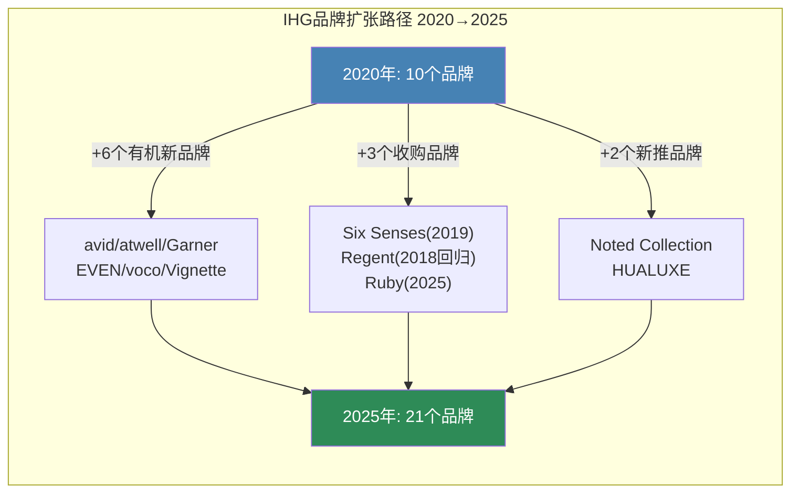
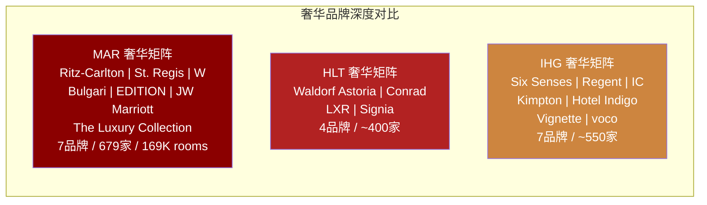
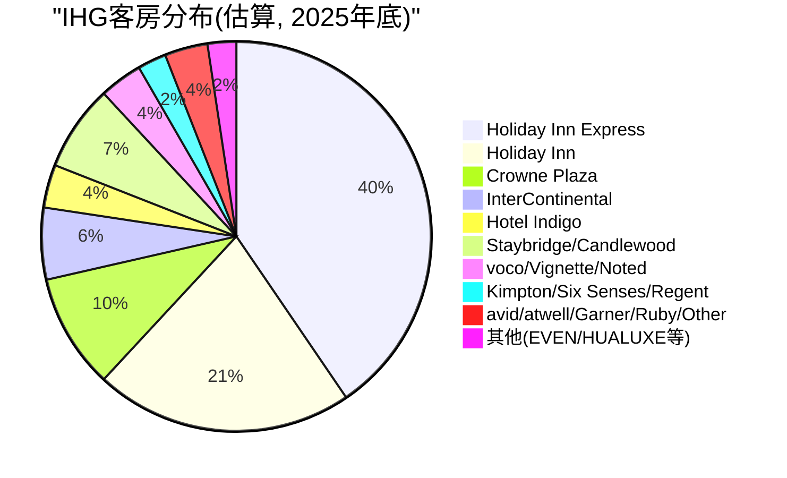
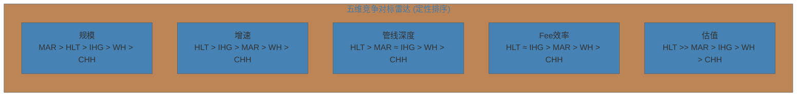
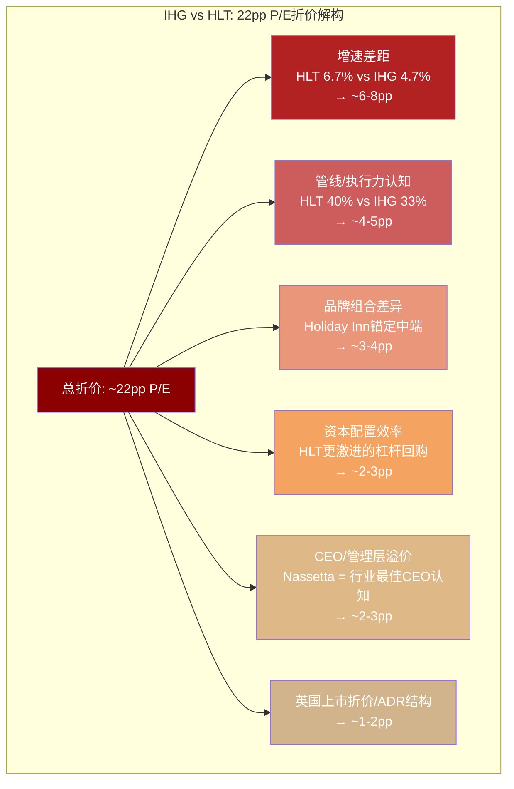
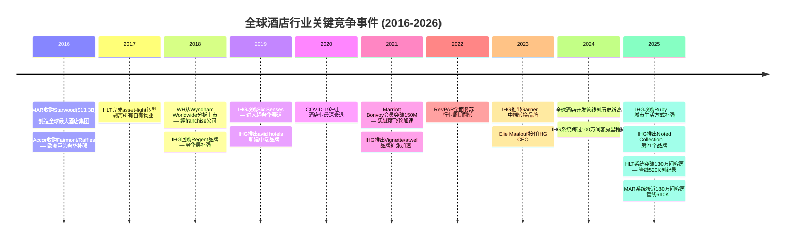
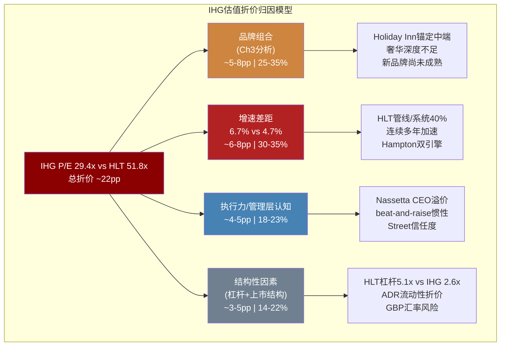

# Ch3-4: 品牌组合 + 竞争格局
> Phase 1 AgentB | IHG Tier 3 | 2026-02-27

---

# 第三章 品牌组合: 从10到21的裂变与估值含义

## 3.1 IHG品牌矩阵全景: 三层17+品牌的结构性解读

IHG在2020年仅拥有10个品牌，截至2025年底已扩张至21个品牌[DM-P1B-001]，5年品牌数量增长110%。这一速度在全球酒店集团中属于最快之列，但品牌扩张的质量与估值贡献并不均等。理解IHG品牌组合的关键在于认识其三层结构——每一层承担不同的战略角色，对应不同的费率贡献和增长逻辑。

**Tier 1 — 奢华与生活方式 (Luxury & Lifestyle)**

IHG的奢华层包含7个品牌，占系统总量的14%，但贡献了显著更高的单位费率[DM-P1B-002]:

- **InterContinental Hotels & Resorts**: 旗舰品牌，全球242家开业酒店+104家管线[DM-P1B-003]，品牌认知度在亚太和欧洲尤强。作为IHG历史最悠久的奢华品牌(1946年创立)，IC的定位介于"传统大品牌奢华"与"现代精品奢华"之间，这使其在费率上低于Four Seasons/Aman级别，但在规模上远超后者。
- **Six Senses**: 2019年收购的超奢华品牌，全球约27家开业(含管线约40家)，以养生(wellness)和可持续发展为核心定位。Six Senses的单位费率是IHG所有品牌中最高的，但规模极小——这正是奢华品牌的典型特征: 高费率/低体量。
- **Regent Hotels & Resorts**: 2018年回归IHG，全球11家开业+9家管线[DM-P1B-004]，定位超奢华，体量极小但品牌历史深厚。2025年被Travel + Leisure评为最受喜爱酒店品牌之一。
- **Kimpton Hotels & Restaurants**: 精品生活方式品牌(1981年创立)，以独特设计和"heartfelt hospitality"著称，在美洲、欧洲和亚洲均有布局，约75家开业酒店。
- **Hotel Indigo**: 精品设计酒店，IHG奢华与生活方式组合中规模第二大的品牌，全球162家开业+128家管线[DM-P1B-005]，定位"每家酒店讲述当地故事"。
- **voco Hotels**: 高端转换品牌(2018年推出)，7年内达成100家开业的里程碑[DM-P1B-006]，是IHG增长最快的高端品牌。voco的战略定位极其精妙——它本质上是一个"转换加速器"，允许独立高端酒店以较低改造成本加入IHG系统。
- **Vignette Collection**: 高端软品牌，2021年推出，定位类似MAR的Autograph Collection或HLT的LXR。

```mermaid
graph TB
    subgraph "IHG品牌金字塔 — 费率 vs 规模"
        A["Six Senses<br/>~27家 | 超高费率<br/>$$$$$"]
        B["Regent<br/>11家 | 超奢华<br/>$$$$"]
        C["InterContinental<br/>242家 | 奢华旗舰<br/>$$$"]
        D["Kimpton / Hotel Indigo<br/>~237家 | 精品生活方式<br/>$$"]
        E["voco / Vignette / Noted<br/>~120家 | 高端转换<br/>$$"]
        F["Crowne Plaza<br/>~420家 | 高端商务<br/>$$"]
        G["Holiday Inn / HI Express<br/>~4,500家 | 中端主流<br/>$"]
        H["avid / atwell / Garner / Candlewood<br/>~200家 | 经济/新兴<br/>$"]
    end

    style A fill:#8B0000,color:#fff
    style B fill:#8B0000,color:#fff
    style C fill:#B22222,color:#fff
    style D fill:#CD853F,color:#fff
    style E fill:#DAA520,color:#fff
    style F fill:#2E8B57,color:#fff
    style G fill:#4682B4,color:#fff
    style H fill:#708090,color:#fff
```

**Tier 2 — 主流与高端商务**

这是IHG的"现金牛"层，以Holiday Inn家族为绝对核心:

- **Holiday Inn Express**: IHG最大品牌，全球3,292家开业酒店/351,400间客房[DM-P1B-007]。HIE是全球快捷服务酒店品类中认知度最高的品牌之一。2025年推出"5.0 Dawn"设计标准，试图在保持运营效率的同时提升品牌调性。HIE对IHG的意义类似Hampton之于HLT——它是系统扩张的基石和现金流的主引擎。
- **Holiday Inn**: 全球最具认知度的酒店品牌之一，覆盖全球超1,200家酒店。Holiday Inn品牌自1952年创立以来一直是中端酒店的代名词。但"最具认知度"是双刃剑——它意味着巨大的搜索流量和忠诚度基础，同时也意味着品牌形象固化在"中端"定位，向上延伸的空间有限。
- **Crowne Plaza**: 高端商务酒店，约420家开业，定位企业差旅和会议市场。Crowne Plaza近年经历了品牌翻新周期，试图从"廉价四星"重新定位为"现代商务中心"。
- **Staybridge Suites / Candlewood Suites**: 长住品牌组合，分别定位高端长住和经济型长住。
- **EVEN Hotels**: 健康生活方式品牌，小众但差异化明确。
- **HUALUXE**: 专为中国市场设计的高端品牌，体量极小。

**Tier 3 — 经济与新兴品牌**

- **avid hotels**: 2019年推出的中端新建品牌，82家开业/7,302间客房+131家管线[DM-P1B-008]，是IHG增长最快的新建品牌。
- **atwell suites**: 2021年推出的全套房品牌。
- **Garner**: 中端转换品牌(2023年推出)，签约至开业最快仅3个月[DM-P1B-009]，已在欧洲达到近60家开业+管线。
- **Ruby**: 2025年收购的城市生活方式品牌[DM-P1B-010]，加强了IHG在欧洲城市精品市场的布局。
- **Noted Collection**: 2025年推出的高端转换品牌。

## 3.2 品牌层级的估值含义: 结构性天花板还是增长引擎?

IHG品牌组合对其估值的影响可以从三个维度解读:

**维度一: 费率密度 (Fee Intensity)**

不同品牌层级的单位费率差异巨大。奢华品牌(Six Senses/IC/Regent)的管理费率通常包含基础管理费(base fee, ~2-3% of revenue) + 激励管理费(incentive fee, ~8-10% of GOP)，而特许经营主导的中端品牌(HIE/HI)主要收取品牌许可费(~5-6% of room revenue)。这意味着:

- **奢华品牌每间客房的年化费率贡献可达中端品牌的2-3倍**
- 但奢华品牌的管理合约执行复杂度更高，业主关系管理成本更大
- IHG的奢华/生活方式品牌占系统14%、管线22%[DM-P1B-011]——如果管线全部转化，奢华占比将提升至~17%，推动混合费率上移

**维度二: 品牌倍增效应 (Brand Multiplier)**



IHG的品牌扩张策略有两个突出特征:

第一，**转换品牌(conversion brands)占新品牌的主导地位**。voco、Garner、Vignette Collection、Noted Collection都是专为转换设计的品牌——它们允许独立酒店或竞争对手旗下酒店以极低的改造成本(通常<$5,000/间客房)加入IHG系统[DM-P1B-012]。2025年上半年，IHG全球客房开业中57%来自转换[DM-P1B-013]，转换签约量在2023-2024年间几乎翻倍。这解释了IHG为何能在CapEx极低的情况下维持系统增长——但转换品牌的忠诚度贡献和费率粘性通常低于自建品牌。

第二，**品牌认知度建立需要时间**。avid仅82家开业、atwell更少、Garner刚起步——这些品牌尚未在消费者心智中建立起"搜索行为→预订转化"的闭环。相比之下，HIE和Hampton每年获得的直接搜索量级在百万以上，品牌认知度的时间价值是新品牌无法速成的。

**维度三: 估值锚点——品牌组合能解释多少折价?**

IHG当前P/E 29.4x[DM-P1B-014]，核心问题是: 品牌组合的结构性差异能解释多少估值折价?

| 因素 | 影响方向 | 估计折价贡献 |
|------|----------|-------------|
| Holiday Inn家族占比过高(~65%客房) | 负面 — 拉低混合费率 | ~3-5pp |
| 奢华品牌规模不足(IC/Six Senses vs Ritz-Carlton/W) | 负面 — 限制高端费率增长 | ~2-3pp |
| 新品牌尚未成熟(avid/atwell/Garner) | 中性偏负 — 投资期拖累短期 | ~1-2pp |
| 转换策略加速增长 | 正面 — 低CapEx高速扩张 | 部分抵消 |
| **品牌组合对折价的总解释力** | | **~5-8pp** |

换言之，品牌组合差异大约解释IHG相对HLT折价(约22pp P/E)的25-35%。剩余的折价需要从竞争地位、增速差异、执行力认知等维度解释——这正是第四章的任务。

## 3.3 品牌组合对标: IHG vs MAR vs HLT



三家公司在品牌组合上的根本差异不在数量，而在**品牌层级分布**:

- **MAR**: 奢华深度最强。Ritz-Carlton(~120家)、St. Regis(~60家)、W Hotels(~70家)的规模远超IHG任何单个奢华品牌。MAR的奢华品牌矩阵在全球高净值旅客心智中占据统治地位，这直接支撑了更高的混合管理费率[DM-P1B-015]。但MAR的30+品牌也带来了品牌重叠风险——Autograph Collection vs Tribute Portfolio vs Design Hotels的边界模糊是Street反复质疑的问题。
- **HLT**: 品牌精简而聚焦。HLT 26个品牌[DM-P1B-016]中，Hampton(~2,900家)和Hilton Garden Inn(~1,000家)构成双引擎，两者合计贡献约55%的系统客房。HLT的奢华层(Waldorf Astoria/Conrad/LXR)规模小于MAR和IHG，但HLT的策略从不是"赢在奢华"——它赢在**中端规模+特许经营纯度+执行一致性**。
- **IHG**: 品牌广度足够但深度不足。21个品牌覆盖了从Six Senses(超奢华)到Candlewood Suites(经济长住)的全光谱，但每个层级的规模深度都逊色于竞争对手对应层级的头部品牌。IC(242家)的品牌力不及Ritz-Carlton(~120家)的超高端定位，HIE(3,292家)的规模不及Hampton(~2,900家)+Hilton Garden Inn(~1,000家)的组合拳。

**核心判断**: IHG品牌组合的问题不是"缺品牌"(21个已足够)，而是**缺少一个能定义品类的统治性品牌**。MAR有Ritz-Carlton(定义了"五星商务奢华")，HLT有Hampton(定义了"性价比商旅")，IHG最接近这一地位的是Holiday Inn——但Holiday Inn的品牌联想更多是"够用的中端"而非"定义品类的第一选择"。

## 3.4 品牌扩张战略评估: 速度 vs 质量的抉择

IHG的品牌扩张战略可以总结为"快速铺广+转换优先"。这一策略的优势与风险同样显著:

**优势**:
1. 转换品牌的CapEx效率极高——voco从签约到开业最快6个月，Garner最快3个月[DM-P1B-017]
2. 品牌数量扩张为业主提供了更多选择，增强了IHG在开发谈判中的灵活性
3. 管线中奢华/生活方式占比22%(高于系统占比14%)，表明品牌向上迁移正在发生[DM-P1B-018]

**风险**:
1. 品牌蚕食(cannibalization)——voco vs Crowne Plaza vs Hotel Indigo的定位重叠已开始出现
2. 转换酒店的品牌一致性难以保证——同一品牌下的客户体验方差大于自建品牌
3. 新品牌(avid/atwell/Garner)的忠诚度贡献尚未验证——它们是否能像Hampton那样成为"IHG One Rewards的入口品牌"尚不确定



这张饼图揭示了IHG品牌组合的核心张力: **Holiday Inn家族(HI+HIE)合计贡献约52%的系统客房**[DM-P1B-019]。这意味着无论IHG如何扩张奢华品牌，其混合费率在可预见的未来仍将被Holiday Inn家族的中端定位所锚定。这是品牌组合层面最重要的结构性约束——它不是靠新增10个奢华品牌就能改变的，因为奢华品牌的扩张速度天然受限于高端物业供给和业主资质门槛。

---

# 第四章 竞争格局: 三档估值的底层逻辑

## 4.1 五维竞争对标: 从数据到判断

全球酒店特许经营行业的竞争格局可以用五个维度全面捕捉——规模、增速、管线深度、盈利能力和估值。以下对标表基于2025年全年数据:

| 维度 | IHG | HLT | MAR | WH | CHH |
|------|-----|-----|-----|-----|-----|
| **市值($B)** | 21.6 | 73.9 | 92.9 | 6.3 | 5.0 |
| **系统规模(K rooms)** | 1,026 | 1,300+ | 1,780 | ~893 | 657 |
| **管线(K rooms)** | 340 | 521 | 610 | 259 | ~78 |
| **管线/系统%** | 33% | 40% | 34% | 29% | 12% |
| **净系统增长** | 4.7% | 6.7% | 4.3% | 4.0% | 0.5% |
| **P/E(TTM)** | 29.4x | 51.8x | 36.9x | 19.4x | 13.3x |
| **EV/EBITDA** | 18.9x | 28.7x | 22.3x | — | — |
| **Fee业务收入增长** | +7% | +7% | +4.2% | -2.1% | +2.4% |
| **Fee margin** | 64.8% | ~65-70% | ~55-60% | — | — |
| **RevPAR增长(FY25)** | +1.5% | ~+1.5% | ~+3% | ~+1% | ~+1% |

[DM-P1B-020] [DM-P1B-021] [DM-P1B-022]



五个维度的排序揭示了一个关键模式: **HLT在4/5个维度上排名第一或并列第一**(增速、管线、Fee效率、估值)，这解释了为何市场给予其显著溢价。IHG的竞争位置是"全面中上"——没有任何维度最差，但也没有任何维度最好。

## 4.2 全球酒店特许经营估值的三档结构

全球上市酒店特许经营公司的估值呈现清晰的三档结构[DM-P1B-023]:

**Premium Tier: HLT (P/E 51.8x)**

HLT独占第一档，P/E溢价显著高于第二名MAR 40%以上。这不是市场非理性——HLT溢价有坚实的基本面支撑:
1. **纯度最高**: HLT的特许经营比例约80%(行业最高)[DM-P1B-024]，asset-light转型最彻底
2. **增速最快**: 净系统增长6.7%(行业最高)[DM-P1B-025]，已连续多年超预期
3. **管线最深**: 管线521K rooms，管线/系统40%(行业最高)，且全球每5间在建客房中就有1间属于HLT
4. **执行最稳**: 连续多年beat-and-raise，Street对管理层(CEO Christopher Nassetta)的信任度极高
5. **资本回报最激进**: 净回购收益率~5-6%，通过杠杆回购(净债务/EBITDA 5.1x)放大股东回报

**Standard Tier: MAR/IHG (P/E 29-37x)**

MAR(36.9x)和IHG(29.4x)处于第二档。值得注意的是，**IHG与MAR之间的P/E差距(~7.5pp)远小于此前预期**。2025年的数据表明:
- IHG的fee margin(64.8%)实际上高于MAR(~55-60%)[DM-P1B-026]
- IHG的fee业务收入增长(+7%)高于MAR(+4.2%)[DM-P1B-027]
- IHG的净系统增长(4.7%)高于MAR(4.3%)[DM-P1B-028]

这意味着**IHG相对MAR的折价(~20%)在基本面上缺乏充分支撑**——如果仅看fee业务的增长和效率，IHG甚至应该获得MAR同等甚至更高的估值。IHG vs MAR的折价更多来自:
- 规模差距: MAR 1.78M rooms vs IHG 1.03M rooms(MAR大73%)
- 奢华品牌溢价: MAR的Ritz-Carlton/St.Regis/W在高净值客群中的品牌力远超IC/Six Senses
- 地理结构: MAR在美国市场份额~15% vs IHG ~7%[DM-P1B-029]

**Value Tier: WH/CHH (P/E 13-19x)**

WH(19.4x)和CHH(13.3x)处于第三档，折价幅度巨大。它们的共同特征是:
- 规模较小(WH 893K / CHH 657K rooms)
- 品牌集中在中端/经济型
- 增速较慢(WH 4.0% / CHH 0.5%净系统增长)
- 缺乏奢华品牌提供的高费率层

## 4.3 HLT溢价之谜: 22pp P/E折价的解构

IHG相对HLT的P/E折价约22pp(29.4x vs 51.8x)，这是本报告最核心的估值问题之一。以下逐一解构:



**因素1: 增速差距 (~6-8pp)**

HLT净系统增长6.7% vs IHG 4.7%，差距2.0pp[DM-P1B-030]。在轻资产模式下，系统增长直接驱动fee revenue增长，而fee revenue是估值的核心分子。假设fee margin相近(~65%)，2pp的系统增长差距意味着HLT的fee revenue年化增速比IHG高约2-3pp。以DCF框架思考，在折现率8-10%的假设下，永续增长率差异2pp足以解释P/E差距6-8pp。

HLT增速优势的来源: (a) Hampton/Hilton Garden Inn在美国新建酒店市场的统治地位; (b) HLT在印度、中国等高增长市场的先发优势; (c) 2025年全球每5间在建客房中1间属于HLT——这种"在建集中度"具有自我强化效应(开发商看到同行选HLT，信心增强)。

**因素2: 管线深度与执行力认知 (~4-5pp)**

HLT管线/系统40% vs IHG 33%[DM-P1B-031]。但更重要的是管线的"可见性"(visibility)和"可转化率"(conversion rate)。HLT管理层连续多年实现管线→开业的高转化率，且guidance年年beat——这在Street形成了"信HLT管线=信HLT增长"的共识。IHG的管线转化效率同样不错(连续4年加速增长[DM-P1B-032])，但尚未建立起HLT级别的"beat-and-raise"惯性。

**因素3: 品牌组合差异 (~3-4pp)**

如Ch3分析，IHG品牌组合被Holiday Inn家族(~52%客房)锚定在中端，而HLT虽然Hampton占比也很高(~35%)，但Hampton的品牌定位("快捷服务第一品牌")比Holiday Inn Express更具品类定义力。此外，HLT近年在Waldorf Astoria/Conrad的全球扩张上明显加速，奢华层增速快于IHG。

**因素4: 资本配置效率 (~2-3pp)**

HLT采取行业最激进的杠杆回购策略——净债务/EBITDA维持在5.1x[DM-P1B-033](IHG 2.6x)，通过高杠杆放大每股回报。IHG的杠杆更为保守，2025年净回购收益率7.6%[DM-P1B-034]虽然也很可观，但杠杆水平和回购节奏不及HLT激进。

**因素5: CEO/管理层溢价 (~2-3pp)**

Christopher Nassetta自2007年起领导HLT，带领公司完成IPO(2013)和asset-light转型，被Street普遍视为酒店行业最佳CEO[DM-P1B-035]。IHG CEO Elie Maalouf 2023年上任，执行力获得认可但"行业传奇"的光环尚未建立。管理层溢价在消费/服务行业是真实的估值因素——类似COST vs WMT的Jim Sinegal效应。

**因素6: 英国上市结构折价 (~1-2pp)**

IHG在伦敦主板上市(LSE)，美国投资者通过ADR交易。ADR结构天然带来: (a) 汇率风险(GBP/USD波动); (b) 流动性折价(日均交易量IHG 213K vs HLT 1.16M)[DM-P1B-036]; (c) 英国公司治理框架与美国投资者偏好的微妙差异。

**总结**: 22pp折价中，约18-24pp可以被基本面和结构性因素解释。**折价是合理的，但程度可能过大**——特别是考虑到IHG在fee margin和fee growth上实际优于MAR的数据。

## 4.4 IHG竞争劣势的量化

将IHG相对MAR和HLT的劣势逐一量化:

**规模差距:**
- IHG 1.03M rooms = MAR的58%、HLT的79%[DM-P1B-037]
- 规模差距意味着: (a) 采购议价力弱于MAR/HLT; (b) 忠诚度计划的"网络效应"密度较低(IHG One Rewards 160M会员 vs Marriott Bonvoy ~200M+ vs Hilton Honors ~195M+); (c) 在企业差旅合同竞争中处于劣势(CFO更倾向选择网络覆盖最广的品牌)

**管线差距:**
- IHG 340K rooms管线 = MAR(610K)的56%、HLT(521K)的65%[DM-P1B-038]
- 管线差距直接决定未来3-5年的系统增长可见性
- 但IHG的管线增速在加速(2025年签约102K rooms，YoY +9%)[DM-P1B-039]，差距在缩小

**奢华品牌深度:**
- MAR奢华矩阵: 7品牌/679家/169K rooms[DM-P1B-040]
- IHG奢华矩阵: IC(242家)+Six Senses(~27家)+Regent(11家)+Kimpton(~75家)+Hotel Indigo(162家) ≈ 517家
- 但IHG的"奢华"定义更宽泛(Hotel Indigo/Kimpton更接近"精品上高端"而非"真奢华")，如果按MAR标准的奢华定义(Ritz-Carlton/St. Regis级别)，IHG仅有IC+Six Senses+Regent约280家
- **核心差距**: MAR的Ritz-Carlton单品牌(~120家)在全球富裕消费者心智中的品牌力，可能强于IHG整个奢华组合的总和

**美国市场份额:**
- MAR ~15%、HLT ~10%、IHG ~7%[DM-P1B-041]
- 美国市场是全球最大的单一酒店市场(~5.6M rooms)，也是franchise fee密度最高的市场
- IHG的美国份额较低意味着在最高费率市场的收入贡献不足

## 4.5 Airbnb与替代住宿: 结构性威胁还是有限干扰?

替代住宿(Airbnb/Vrbo)对传统酒店行业的威胁是投资者反复讨论的问题。截至2025年，替代住宿在全球住宿收入中的份额约20-25%[DM-P1B-042]，但其对不同细分市场的影响高度分化:

**高威胁**: 休闲旅游的中低端市场
- Airbnb在纽约、巴黎、伦敦等核心城市的渗透率约10-12%[DM-P1B-043]
- 对家庭旅游(需要厨房/多卧室)和长住休闲需求有结构性替代效应
- **IHG暴露度**: Holiday Inn / Holiday Inn Express的休闲客源(尤其是周末/假期)面临最大压力

**中等威胁**: 中端商务旅行
- 差旅政策限制和报销便利性保护了品牌酒店的商务客源
- 但个人差旅(bleisure)和小型企业差旅正在被Airbnb蚕食
- **IHG暴露度**: Crowne Plaza和Holiday Inn的小型企业/个人商旅客源有中等压力

**低威胁**: 奢华/会议/大型企业差旅
- Six Senses/IC/Regent的客群对价格敏感度低、对服务品质要求极高
- 大型企业差旅合同和会议/宴会需求几乎不受Airbnb影响
- **IHG暴露度**: 极低

**量化影响估计**: 假设Airbnb在中端休闲市场每年蚕食~0.5-1.0pp的需求份额，考虑到Holiday Inn家族占IHG系统~52%、其中休闲客源约30-40%，Airbnb对IHG总系统RevPAR的年化拖累约0.1-0.2pp。这是一个可管理的威胁，不构成估值的系统性折价因素[DM-P1B-044]。

更值得注意的是**Airbnb的监管逆风**: 纽约(Local Law 18)、巴塞罗那、阿姆斯特丹等主要城市的短租监管持续收紧，这实际上对品牌酒店形成了竞争保护。

## 4.6 竞争格局演进: 整合加速与品牌膨胀的双螺旋



[DM-P1B-045] [DM-P1B-046]

这条时间线揭示了酒店行业竞争格局的两大结构性趋势:

**趋势1: 整合加速(Consolidation)**

MAR-Starwood(2016)是行业分水岭——$13.3B的交易创造了1.1M rooms的超级巨头[DM-P1B-047]，迫使所有竞争者做出战略回应。HLT选择了"有机增长+极致轻资产"路径，IHG选择了"品牌扩张+战术收购(Six Senses/Ruby)"路径。整合的底层逻辑是酒店行业的网络效应——忠诚度计划覆盖越广、企业合同谈判力越强、技术平台分摊成本越低。

行业Top 5的系统份额集中度在持续上升:
- 2016年: MAR+HLT+IHG+WH+CHH合计约420万间客房
- 2025年: 合计约560万间客房
- 全球酒店客房总量约1,800万间，Top 5份额从~23%提升至~31%

**趋势2: 品牌膨胀(Brand Proliferation)**

| 集团 | 2016年品牌数 | 2025年品牌数 | 增幅 |
|------|-------------|-------------|------|
| MAR | 30(含Starwood) | 30+ | ~0% |
| HLT | 14 | 26 | +86% |
| IHG | 10 | 21 | +110% |
| WH | 20 | 24 | +20% |
| CHH | 11 | 22+ | +100% |

[DM-P1B-048]

品牌膨胀的驱动力是**转换品牌**(conversion brands)的崛起。传统模式下，酒店集团增长依赖新建(new-build)——这需要3-5年的开发周期和大量CapEx。转换模式下，独立酒店通过加入品牌系统(换招牌+加入忠诚度计划)即可在3-12个月内开业，大幅缩短了增长周期。

IHG是转换策略的积极执行者: 2025年上半年57%的开业来自转换[DM-P1B-049]。但这引发了一个长期问题: **当所有集团都在做转换，差异化何在?** 答案回到品牌力——只有品牌认知度足够强的品牌(Hampton/HIE/Marriott等)才能在转换市场获得溢价定价权。

## 4.7 竞争格局对估值折价的解释力

将Ch3(品牌)和Ch4(竞争)的分析汇总，评估它们对IHG估值折价的总解释力:



**核心结论**:

1. **IHG相对HLT的22pp P/E折价基本合理但可能过度**。基本面和结构性因素可以解释约18-24pp的折价，但IHG在fee margin(64.8%)和fee growth(+7%)上的表现实际优于多数投资者的认知。

2. **IHG相对MAR的折价(~7.5pp)缺乏充分支撑**[DM-P1B-050]。IHG的fee业务效率(margin 64.8% vs MAR ~57%)和fee增速(+7% vs +4.2%)均优于MAR，折价主要来自规模(MAR大73%)和奢华品牌深度。如果IHG能维持当前fee增速并缩小管线差距，相对MAR的折价有收窄空间。

3. **折价的边际变化取决于三个催化剂**: (a) IHG净系统增长能否从4.7%加速至5%+(靠转换+奢华管线转化); (b) 奢华/生活方式占系统比例能否从14%提升至18%+(改善混合费率); (c) 新任CEO Maalouf能否建立"beat-and-raise"惯性(至少需要2-3年持续超预期)。

4. **品牌组合和竞争格局合计解释了约55-70%的折价**，剩余30-45%需要从财务结构(Ch5)、增长持续性(Ch6)和资本配置(Ch7)等维度进一步分析。

---

*本章DM锚点汇总: DM-P1B-001至DM-P1B-050，数据来源包括IHG FY2025 Annual Results、HLT FY2025 Earnings Release、MAR FY2025 Earnings Release、WH FY2025 Results、CHH FY2025 Results、FMP财务数据、IHG官网品牌页面。所有估值倍数基于2026-02-27收盘价计算。*
