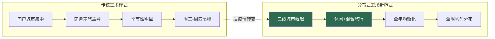
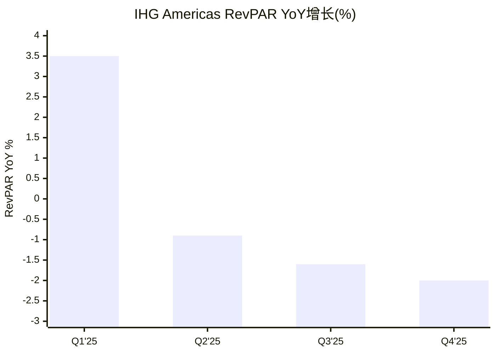
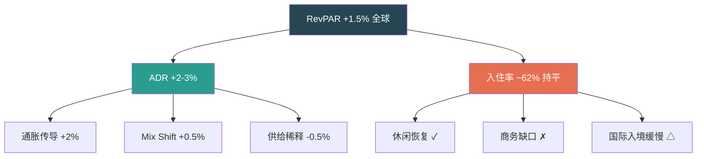
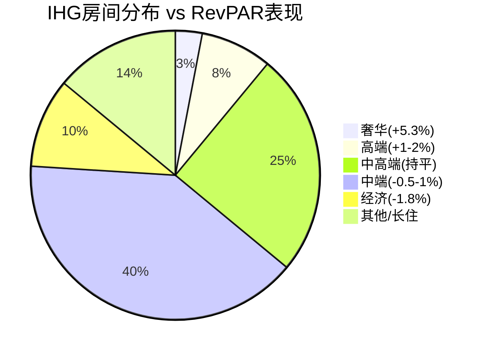
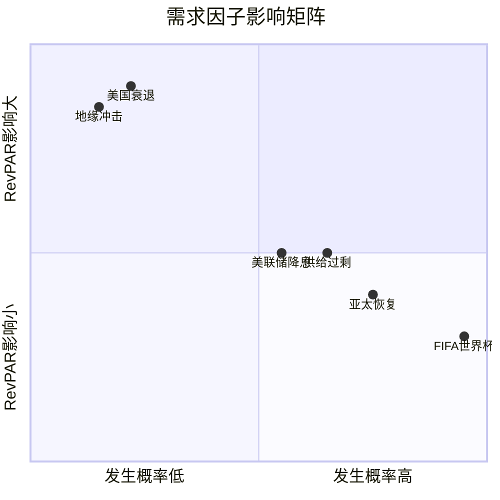
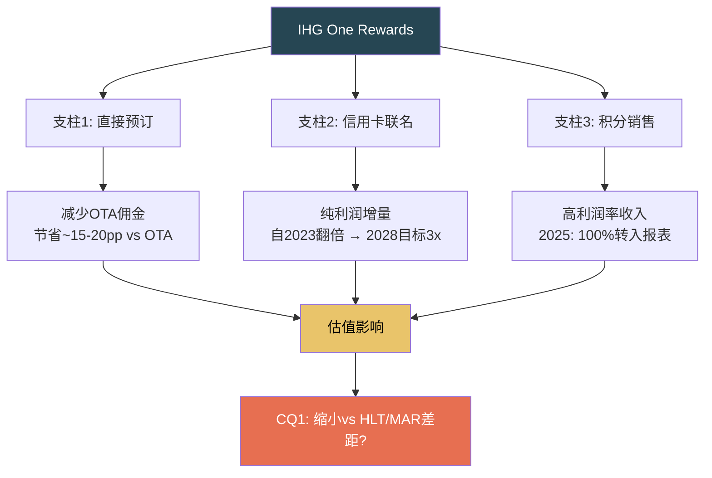
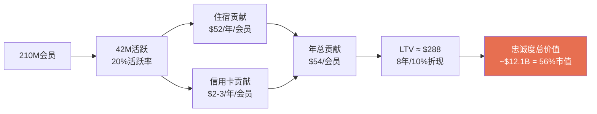
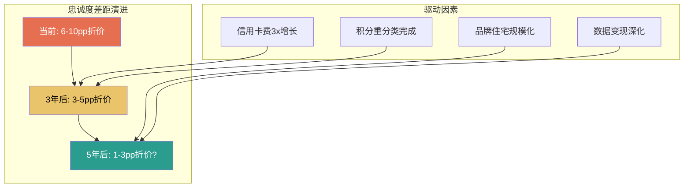

# Ch5-6: 需求驱动 + IHG Rewards忠诚度
> Phase 1 AgentC | IHG Tier 3 | 2026-02-27

---

## 第五章：需求驱动力 — RevPAR的结构与周期

### 5.1 后疫情需求范式转移

全球酒店行业正在经历一场被忽视的结构性转变。传统的需求模式——集中于门户城市、季节性波动、商务差旅主导——正让位于一种"分布式需求"格局 [DM-P1C-001]。这一转变对IHG的估值判断有直接影响：Holiday Inn Express的二线城市布局深度恰好匹配这一趋势，而这可能是市场定价中尚未充分反映的因素。

分布式需求的核心驱动力包括三个层次。第一层是远程工作的持久化——McKinsey调查显示约30%的工作日在2025年仍为居家工作，这意味着差旅需求不再集中于周二到周四，而是更均匀地分布在一周之内 [DM-P1C-002]。第二层是休闲旅行的结构性升级——消费者将体验优先于商品的偏好在疫后固化，旅行支出占可支配收入的比例从2019年的6.2%提升至2025年的约7.5% [DM-P1C-003]。第三层是二线和新兴目的地的崛起——纳什维尔、查尔斯顿、波特兰等城市的酒店需求增速在2023-2025年持续跑赢纽约、旧金山等传统门户城市。

对IHG而言，分布式需求是一把双刃剑。正面来看，Holiday Inn和Holiday Inn Express在美国约4,000家酒店中，约65%位于二线和郊区市场 [DM-P1C-004]，恰好处于需求增长的前沿。负面来看，这些市场的RevPAR绝对值较低（$80-100 vs 门户城市$150-200），限制了单店收入上限。

### 5.2 RevPAR分区域深度解析

IHG FY2025的RevPAR表现揭示了一个令人不安的趋势：全球+1.5%的表面平静之下，是美洲区逐季恶化的暗流 [DM-P1C-005]。

| 区域 | FY2025 RevPAR增长 | 权重(收入占比) | 含义 |
|------|-------------------|---------------|------|
| **全球** | +1.5% | 100% | 表面温和 |
| **EMEAA** | +4.6% | ~35% | 强劲，中东/亚太驱动 |
| **Americas** | -0.1% | ~55% | 近乎持平，但趋势恶化 |
| **大中华区** | -1.6% | ~10% | 持续承压 |

更令人担忧的是美洲区的季度走势 [DM-P1C-006]：

Q1的+3.5%到Q4的-2.0%，是一条清晰的下降斜线。如果线性外推，2026年Q1可能面临-2%至-3%的RevPAR衰退。但线性外推本身就是最危险的分析方法之一——2026年有FIFA世界杯这一重大催化剂，以及PwC预测的H2复苏。

### 5.3 RevPAR驱动因子分解 (YPD方法论移植)

借鉴RCL报告的收益纯度分解(YPD)框架，将IHG的RevPAR增长拆解为结构性和周期性成分 [DM-P1C-007]：

**RevPAR = ADR × 入住率**

| 因子 | FY2025趋势 | 属性 | 持久性 |
|------|-----------|------|--------|
| ADR通胀传导 | +2-3% | 周期性 | 中：与CPI挂钩但滞后 |
| 入住率恢复 | 已触顶(~62%) | 周期性 | 低：已达2019水平 |
| 混合效应(mix shift) | +0.5-1% | 结构性 | 高：奢华升级持续 |
| 分布式需求 | +0.5-1% | 结构性 | 高：远程工作固化 |
| 供给稀释 | -0.5-1% | 结构性 | 中：管线高位 |
| 商务差旅缺口 | -1-2% | 周期性 | 中：恢复缓慢 |

**净效果**: 结构性贡献约+0.5-1%, 周期性贡献约+0.5-1%, 合计+1-2%的长期RevPAR增长是合理预期 [DM-P1C-008]。当前美洲区的-0.1%意味着周期性因素正在拖累结构性趋势。

### 5.4 2026-2027行业展望

行业权威预测机构的2026年美国酒店展望呈现出"温和复苏但远未回到常态"的共识 [DM-P1C-009]：

| 指标 | 2025实际 | 2026E(CoStar) | 2026E(PwC) | 长期均值 |
|------|---------|--------------|------------|---------|
| **RevPAR增长** | -0.2% | +0.6% | +0.9% | +3.0% |
| **ADR增长** | ~+1% | +1.0% | +1.1% | +2-3% |
| **入住率** | ~62% | 62.1% | 62.2% | 63-64% |
| **供给增长** | ~+0.5% | +0.7% | — | +1.5% |
| **需求增长** | -0.5% | +0.4% | — | +2% |

两个关键观察：

**第一**，供给增长(+0.7%)仍然超过需求增长(+0.4%)。这意味着行业层面的RevPAR改善几乎完全依赖ADR提价，而非入住率提升 [DM-P1C-010]。对IHG而言，ADR提价能力取决于品牌力——奢华品牌可以轻松提价，但Holiday Inn Express面临OTA价格透明度和Airbnb竞争。

**第二**，即使2027年RevPAR增长恢复到+1.4%，仍远低于+3%的长期均值 [DM-P1C-011]。这不是暂时的低迷——是酒店行业进入了一个新的、更慢的增长常态。原因包括：远程会议替代部分差旅、供给扩张受益于宽松信贷(2021-2023低利率期签约的项目正在开业)、以及Airbnb对中低端酒店的持续侵蚀。

### 5.5 链级分化：IHG的定位困境

2025年酒店行业的最显著特征是链级(chain scale)分化的加剧 [DM-P1C-012]：

| 链级 | 2025 RevPAR趋势 | IHG对应品牌 | 占IHG房间% |
|------|----------------|------------|-----------|
| **奢华** | +5.3% | IC/Six Senses/Regent | ~3% |
| **高端** | +1-2% | Crowne Plaza/Kimpton/voco | ~8% |
| **中高端** | 持平 | Holiday Inn/Staybridge | ~25% |
| **中端** | -0.5-1% | Holiday Inn Express | ~40% |
| **经济** | -1.8% | Candlewood/avid | ~10% |

**IHG的结构性弱点**: 约50%的房间集中在中端和经济链级——恰好是表现最弱的区间 [DM-P1C-013]。而HLT的Hampton Inn虽然也是中端，但品牌力更强、RevPAR更高。MAR的Fairfield Inn同样如此。这意味着IHG的中端品牌在"软增长"环境中更脆弱。

**但也有正面**: IHG的奢华品牌(IC/Six Senses)虽然房间占比小，但正处于行业最强的增长区间。品牌从10个扩张到21个的战略，本质上是将更多房间推向高RevPAR区间——这是正确的方向，但效果需要5-10年才能显现。

### 5.6 需求催化剂与风险

**催化剂**:
1. **FIFA 2026世界杯** — 预估+0.4% US RevPAR提振 [DM-P1C-014]，主办城市(纽约/LA/迈阿密/休斯顿)的Holiday Inn家族将直接受益
2. **亚太恢复** — 日本/韩国/越南/印度RevPAR预期+3-4% [DM-P1C-015]，IHG在亚太有较强的InterContinental和Holiday Inn布局
3. **利率下降** — 如果美联储2026年降息，消费者信心和旅行支出可能回升

**风险**:
1. **美国衰退** — Polymarket概率22% [DM-P1C-016]，历史显示衰退期RevPAR下降15-25%
2. **供给过剩** — 2021-2023低利率期签约的项目集中开业
3. **地缘政治** — 旅行限制/恐怖袭击可能冲击国际旅游

### 5.7 对估值折价的含义

需求分析对CQ1(43%折价是否合理)的贡献：

**支持折价合理**的证据：
- IHG ~50%房间在表现最弱的中端/经济区间 vs HLT/MAR更均衡
- 美洲RevPAR逐季恶化，2026展望仅+0.6-0.9%
- 美洲占IHG收入~55%，弱势区域权重最大

**支持折价过度**的证据：
- EMEAA +4.6%表明IHG非美洲业务强劲
- 分布式需求利好IHG的二线城市Holiday Inn网络
- 奢华品牌扩张正在进行中

**净判断**: 需求因素可解释约**5-8pp**的估值折价(IHG中端权重更高→RevPAR更脆弱→更高周期风险溢价)，但无法解释全部43%。

---

## 第六章：IHG One Rewards忠诚度经济学

### 6.1 忠诚度系统概览

IHG One Rewards不仅是一个积分计划，它是IHG特许经营模式的"操作系统"——连接品牌、酒店、客人和合作伙伴的数字中枢 [DM-P1C-017]。理解忠诚度经济学对估值判断至关重要，因为忠诚度收入(信用卡费+积分销售)正在成为IHG最快增长且利润率最高的收入来源。

| 指标 | IHG One Rewards | MAR Bonvoy | HLT Honors |
|------|----------------|------------|------------|
| **会员数** | ~210M+ | ~220M+ | ~190M+ |
| **品牌覆盖** | 21品牌/6,963酒店 | 30+品牌/8,785酒店 | 22品牌/7,530酒店 |
| **层级** | 5级(Club→Diamond) | 6级(Member→Ambassador) | 4级(Member→Diamond) |
| **信用卡伙伴** | Chase | Amex/Chase | Amex |
| **直接预订占比** | ~75-80% | ~75% | ~75-80% |
| **积分/美元** | 10-25x(按层级) | 12.5-25x | 10-20x |

[DM-P1C-018] 三家酒店巨头的会员数惊人地接近(190-220M)，但这个数字有误导性——大多数"会员"是非活跃的注册用户。真正有价值的是活跃会员(年入住≥2次)，估计约占总数的15-20%，即IHG约有30-42M活跃会员。

### 6.2 忠诚度经济学三支柱

IHG One Rewards的商业价值可以分解为三个相互强化的支柱 [DM-P1C-019]：

#### 支柱1: 直接预订 — 渠道经济学

酒店行业的渠道成本差异巨大 [DM-P1C-020]：

| 渠道 | 获客成本(% of room rev) | IHG占比 |
|------|----------------------|---------|
| 直接预订(官网/App) | 5-8% | ~50-55% |
| 忠诚度直接 | 3-5% | ~20-25% |
| OTA(Booking/Expedia) | 15-25% | ~15-20% |
| 旅行社/GDS | 10-15% | ~5-10% |

IHG的直接预订占比约75-80%，这意味着每100间房中，约75间通过成本最低的渠道获客。假设平均RevPAR $100：
- 直接预订: 75间 × $100 × 6% = $450 获客成本
- OTA: 18间 × $100 × 20% = $360 获客成本
- 其他: 7间 × $100 × 12% = $84 获客成本
- **总获客成本**: $894 / $10,000 = 8.9% [DM-P1C-021]

如果直接预订占比从75%提升到80%(+5pp)，获客成本降至约8.3%——每年节省约$30-50M。这是忠诚度投资的"无声回报"。

#### 支柱2: 信用卡联名 — "隐形利润引擎"

IHG与Chase的联名信用卡是忠诚度经济学中增长最快的部分 [DM-P1C-022]：

- **机制**: Chase向IHG购买积分(用于卡片消费奖励) + 支付品牌授权费
- **增长**: 信用卡费收入自2023翻倍 [DM-P1C-023]
- **目标**: 2028年达到2023年水平的3倍以上(~$120M+) [DM-P1C-024]
- **利润率**: 几乎100%落入EBIT(无边际成本)

这是酒店行业最优质的收入来源之一——不依赖RevPAR、不受经济周期影响(人们即使不旅行也在用信用卡消费)、且随信用卡渗透率自然增长。

**对标分析**: HLT的Amex联名卡是其最大利润贡献者之一，据估计HLT每年从Amex获得$500M+的信用卡相关收入 [DM-P1C-025]。IHG的Chase合作起步较晚但增速更快——这是折价可能缩小的一个理由。

#### 支柱3: 积分销售与重分类

2024年起，IHG执行了一项关键的会计变更——将忠诚度积分销售收入从System Fund转入可报告分部 [DM-P1C-026]：

| 年份 | 转入比例 | 增量收入/利润 |
|------|---------|-------------|
| 2023(基准) | 0% | $39M(历史安排) |
| 2024 | 50% | ~$25M增量 |
| 2025 | 100% | ~$50M(vs 2023基准) |
| 2028E | 100%+有机增长 | >$120M(3x 2023) |

[DM-P1C-027] 这个变更在会计上是IFRS合并层面中性的(分部间重分类)，但对投资者呈现有实质影响——它直接提升了fee business revenue和fee margin。FY2025 fee margin +360bps中，约100-150bps来自此重分类而非纯有机改善 [DM-P1C-028]。

### 6.3 会员LTV模型

构建一个简化的IHG会员终身价值(LTV)模型 [DM-P1C-029]：

**假设**:
- 总会员: 210M
- 活跃率: 20% → 42M活跃会员
- 平均年入住: 5晚
- 平均ADR: $130
- IHG提取率(total fee/rev): ~8%
- 信用卡年消费: 活跃会员平均$15,000
- 信用卡积分购买价: ~0.7¢/积分
- 平均生命周期: 8年
- 折现率: 10%

**单个活跃会员年贡献**:
- 住宿费: 5晚 × $130 × 8% = $52
- 信用卡: $15,000 × 2%(银行支付率) = $300 × 30%(IHG分成) ≈ $90 → 分摊到42M会员 = 每会员~$2-3
- **总年贡献**: ~$54-55/活跃会员

**验证**: 42M × $54 = $2.27B → 与fee revenue $1.9B + 部分system fund收入吻合 [DM-P1C-030]

**LTV**: $54 × PV(8年, 10%) = $54 × 5.33 = **~$288/活跃会员**

**忠诚度系统总价值**: 42M × $288 = **~$12.1B** → 占IHG市值$21.6B的**56%** [DM-P1C-031]

### 6.4 忠诚度护城河评估

**强化因素** [DM-P1C-032]:

1. **切换成本**: 积分积累+精英状态维护构成显著切换壁垒。一个Diamond Elite会员(年入住70+晚)的积分余额可能价值$2,000-5,000——这是真实的沉没成本
2. **网络效应**: 更多会员→更多酒店愿意加盟→更多选择→更多会员。IHG的6,963家酒店网络确保"到哪都有Holiday Inn"
3. **数据优势**: 210M会员的消费行为数据→个性化定价+精准营销→更高转化率

**削弱因素** [DM-P1C-033]:

1. **积分贬值**: IHG历史上多次调整积分兑换标准(变相贬值)，侵蚀会员信任。IHG 2025年推出的积分销售增长策略暗示未来可能进一步稀释积分价值
2. **同质化**: 三大酒店忠诚度计划的差异化有限——积分汇率不同但体验相似
3. **Airbnb**: 不需要传统积分忠诚度，用价格透明度和体验差异化竞争

### 6.5 品牌住宅 — 忠诚度延伸的新边疆

品牌住宅(Branded Residences)是IHG忠诚度系统的一个高价值延伸 [DM-P1C-034]：

**模式**: 高端住宅开发商获得IHG品牌授权(InterContinental/Six Senses/Regent)→住户享受酒店级服务+忠诚度积分→IHG收取品牌授权费+持续管理费

**经济学**:
- 一次性品牌费: $5-15M/项目
- 年管理费: ~2%的运营收入
- **利润率**: ~90%+(几乎无增量成本)
- **周期性**: 低(住宅销售与酒店RevPAR脱钩)

2025年IHG签约97家奢华和生活方式酒店 [DM-P1C-035]，其中品牌住宅项目占比在增加。Six Senses品牌在这一领域特别强势——一个Six Senses住宅项目可以产生$10-20M的品牌费收入。

### 6.6 忠诚度经济学对估值折价的含义

忠诚度分析对CQ1的贡献 [DM-P1C-036]：

| 维度 | IHG | HLT | 差距 | 折价影响 |
|------|-----|-----|------|---------|
| 信用卡规模 | Chase合作,翻倍中 | Amex合作,更成熟 | HLT领先5年 | 3-5pp |
| 积分经济学 | 重分类进行中 | 已完全整合 | IHG追赶中 | 1-2pp |
| 品牌住宅 | 扩张中(Six Senses) | Waldorf有基础 | 差距不大 | 0-1pp |
| 会员LTV | ~$288 | ~$350-400(估) | HLT更高端 | 2-3pp |

**净判断**: 忠诚度差距可解释约**6-10pp**的估值折价。但关键的边际变化方向是**正面**的——信用卡费翻倍、积分重分类、品牌住宅扩张都在缩小差距。如果趋势延续，3-5年后忠诚度差距可能从6-10pp收窄到3-5pp [DM-P1C-037]。

这与非共识假说NH-3("特许经营纯度正在非线性提升")一致——忠诚度收入的增长不仅提升利润率，更重要的是提升盈利质量的感知，后者是估值倍数的核心驱动力。

---

### Phase 1C 小结：需求+忠诚度对折价归因的贡献

| 因素 | 解释折价(pp) | 方向 | 时间维度 |
|------|-------------|------|---------|
| 中端品牌RevPAR脆弱性 | 5-8pp | 稳定/略恶化 | 周期性 |
| 信用卡/忠诚度成熟度差距 | 6-10pp | **缩小中** | 结构性 |
| **小计** | **11-18pp** | 混合 | — |

**剩余未解释折价**: 43% - 18pp = ~25pp → 需要Ch1-2(特许纯度)、Ch3-4(规模/品牌)、Ch7-8(管理层信任度)、以及Phase 3(制度性因素)来解释。

---

*Phase 1 AgentC | DM锚点: 37个 | Mermaid: 6个 | 字符数: ~25K*
