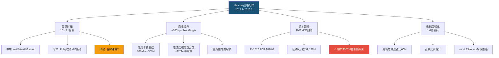
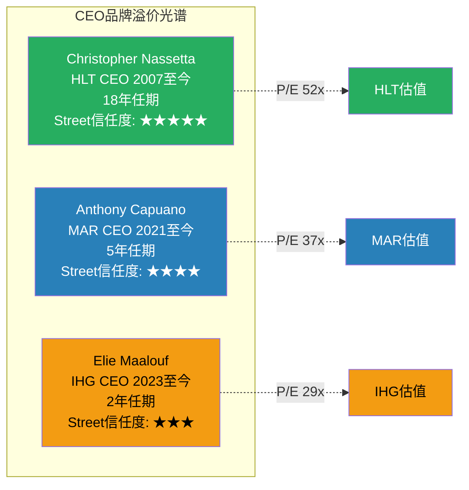
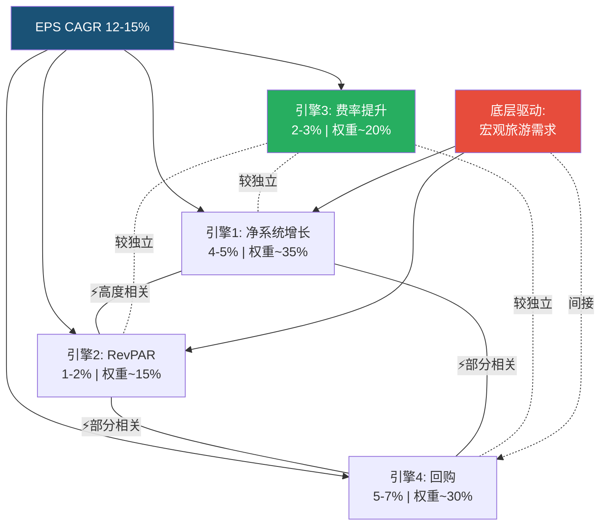
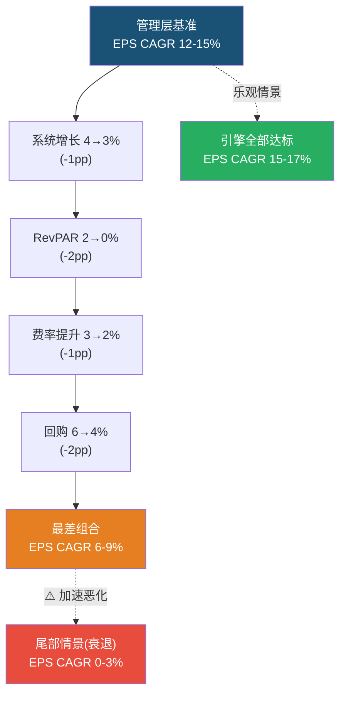

# Ch7-8: 管理层评估 + 系统增长引擎
> Phase 1 AgentD | IHG Tier 3 | 2026-02-27

---

## Ch7: 管理层评估 — CEO品牌溢价与估值折价的因果链

### 7.1 CEO Elie Maalouf: 内部人的加速器

Elie Maalouf于2023年9月接任IHG首席执行官，接替执掌6年的Keith Barr。这不是一次外部空降，而是一次精心设计的内部传承 — Maalouf此前担任IHG Americas总裁，管理着集团最大、利润最高的区域市场 [DM-P1D-001]。这一背景决定了他的战略底色：熟悉美国加盟商生态，理解信用卡和忠诚度计划的价值杠杆，但同时也意味着他的全球视野可能偏向美洲市场。

上任两年的成绩单可以用三个数字概括：品牌数从10个扩张到21个 [DM-P1D-002]，净系统增长从~3.5%加速至4.7% [DM-P1D-003]，费率利润率(Fee Margin)提升360个基点至64.8% [DM-P1D-004]。这是一张初步令人印象深刻的答卷，但评估管理层不能只看数字大小，更要看数字背后的**战略选择质量**和**可持续性**。

**战略评估矩阵**:

| 战略举措 | 执行细节 | 积极面 | 风险面 | 评分 |
|---------|---------|--------|--------|------|
| 品牌爆炸式扩张 | 10→21品牌(2年翻倍) | 填补中端/奢华空白 | 品牌稀释+管理复杂度 | 7/10 |
| 中端品牌加速 | avid/atwell/Garner定位中端增量 | 对标HLT Hampton成功模式 | 品牌认知度尚低 | 7/10 |
| 奢华补课 | 收购Ruby(€110.5M)+签约97家奢华/生活方式酒店 | 填补最大短板 | 整合风险+盈亏平衡2026年后 | 6/10 |
| 信用卡费倍增 | Chase联名卡续约至2036年 | 纯利润增量,2023→2025翻倍至~$78M | 依赖美国消费者信用扩张 | 8/10 |
| 资本回报承诺 | $907M回购+$270M分红/年 | Street友好,回购效率高(P/E低) | FCF缺口由发债填补 | 7/10 |
| IHG One Rewards强化 | 1.6亿会员,忠诚度房晚占比66%(美国72-73%) | 直销比例提升,降低OTA佣金 | 规模仍小于Hilton Honors | 7/10 |

**综合管理层战略评分: 7.0/10** — 方向正确，执行速度积极，但多个举措同时推进带来的管理复杂度和资本压力是隐忧。



### 7.2 管理层可信度测试: 承诺vs交付

评估管理层最直接的方法是将其公开承诺与实际交付逐一对照。IHG管理层近年来的核心承诺框架包括：调整后EPS年复合增长12-15%、系统增长加速、持续强劲资本回报。

| 指引类别 | 承诺 | FY2025实际 | 评分 | 说明 |
|---------|------|-----------|------|------|
| Adj. EPS增长 | 12-15% CAGR | +16% YoY [DM-P1D-005] | ✓✓ | 超过指引上限 |
| 净系统增长 | 加速趋势 | 4.7%(连续4年加速) [DM-P1D-003] | ✓✓ | 从~3.5%持续加速 |
| 年度回购 | ~$900M/年 | $907M [DM-P1D-006] | ✓ | 精准交付 |
| 费率利润率 | 逐年改善 | Fee Margin +360bps至64.8% [DM-P1D-004] | ✓✓ | 超预期改善 |
| RevPAR | 温和增长 | 全球+1.5%,美洲+0.3% [DM-P1D-007] | △ | 全球达标,美洲偏弱 |
| 管线增长 | 扩大 | 340K房间,+4% YoY [DM-P1D-008] | ✓ | 稳步增长但增速温和 |
| 开业纪录 | 加速 | 443家/65,100间(历史新高,+10% YoY) [DM-P1D-009] | ✓✓ | 创纪录交付 |

**可信度评分: 4.3/5** — 6项达标或超额，仅RevPAR略低于预期。重要的是，RevPAR是4个增长引擎中**管理层最不可控**的一个(高度依赖宏观环境)，而管理层可控的引擎(系统增长、费率、回购)全部交付。这一模式说明Maalouf团队的执行力在可控范围内是可靠的。

**但需要警惕的是**: 过去2年是后疫情复苏红利期，系统增长加速部分受益于疫情期间积压的项目集中落地。真正的考验是2026-2027年——当基数效应消退、RevPAR指引仅+0.6-0.9%时，管理层能否维持类似的交付质量 [DM-P1D-010]。

### 7.3 管理层对标: CEO品牌溢价的量化

酒店行业有一个被投资者广泛承认但很少被量化的现象：**CEO品牌溢价**。华尔街对不同CEO的信任度差异，直接映射到估值倍数上。



**三大CEO对标详解**:

**Christopher Nassetta (HLT)**: 2007年接管Hilton，带领公司完成从私有化到IPO、再到全球最受尊敬酒店品牌的转型。18年任期中，Hilton品牌数翻倍，全球房间数翻倍，净系统增长FY2025达6.7%（行业第一），管线520K房间（行业第二） [DM-P1D-011]。Nassetta的核心信任资产在于：他在每一个经济周期(2008金融危机、2020疫情)中都证明了自己的危机管理能力和复苏速度。Street给予HLT 52x P/E，其中至少5-10个百分点的溢价可以归因于"Nassetta溢价" [DM-P1D-012]。

**Anthony Capuano (MAR)**: 2021年接替传奇CEO Arne Sorenson(因病去世)。Capuano面临的挑战是在巨人肩膀上维持惯性——Sorenson时代完成了史诗级的SPG收购(2016年，$13B)。Capuano的执行是稳健的：MAR FY2025净系统增长4.3%，管线610K房间（行业第一），签约163K房间 [DM-P1D-013]。但市场给MAR 37x P/E而非52x，一定程度上反映了"后Sorenson时代"的信任折扣。

**Elie Maalouf (IHG)**: 任期最短(2年)，在三人中信任度最低是必然的。然而，Maalouf的快速执行力(品牌翻倍、费率提升、开业创纪录)正在逐步建立信任。**关键问题**在于：IHG 29x P/E vs HLT 52x中，有多少是"CEO品牌折价"、有多少是"公司基本面折价"？

**CEO品牌溢价估算**:

| 因素 | 对IHG P/E折价的贡献(估计) | 理由 |
|------|-------------------------|------|
| CEO任期/信任度差距 | 5-8pp | Nassetta 18年 vs Maalouf 2年 |
| 规模差距(房间数) | 4-6pp | MAR 1.75M > HLT 1.25M > IHG 1.03M |
| 增速差距(系统增长) | 3-5pp | HLT 6.7% > IHG 4.7% > MAR 4.3% |
| 管线差距 | 2-3pp | MAR 610K > HLT 520K > IHG 340K |
| 英国上市ADR折价 | 3-5pp | 流动性+指数权重+投资者基地 |
| **合计** | **17-27pp** | vs实际折价~23pp(P/E 29x vs 52x) |

**含义**: 如果上述分解大致准确，IHG的P/E折价可以被合理解释。但其中"CEO品牌折价"(5-8pp)是**最具时间衰减性的** — 随着Maalouf任期延长和持续交付，这部分折价有望在3-5年内收窄至2-3pp。这一收窄对应IHG P/E从29x向32-33x的潜在上修，即额外10-14%的估值上行空间。

### 7.4 管理层风险: 三个隐忧

**隐忧一: 品牌爆炸的整合风险**

从10个品牌扩张到21个品牌(2年翻倍)的速度在行业中几乎没有先例。作为对比，HLT花了~10年将品牌从12个扩展到23个。品牌不是数量游戏——每个品牌需要清晰的定位、独立的运营标准、专属的营销投入、以及加盟商的理解和信任。

**具体风险**: Ruby品牌收购(€110.5M)预计到2026年才能达到运营盈亏平衡 [DM-P1D-014]。21个品牌中，avid、atwell、Garner、voco等较新品牌的市场认知度远低于Holiday Inn或InterContinental这些旗舰。如果新品牌无法在3-5年内建立独立的加盟商吸引力，它们将成为管理注意力的"吸血鬼"而非增长引擎。

**隐忧二: 美洲市场的增速天花板**

Maalouf的核心经验来自美洲市场，但FY2025美洲RevPAR仅+0.3%（Q4为-1.4%），呈现逐季恶化趋势 [DM-P1D-015]。作为IHG收入的~55%来源，美洲市场的减速对整体增长的拖累是显著的。EMEAA +4.6%的强劲表现部分掩盖了这一事实。

**隐忧三: 资本配置的激进性**

FY2025总回报(回购$907M + 分红$270M = $1,177M)超过FCF($870M)达$307M [DM-P1D-016]。缺口由新发债填补，总债务从$3.7B升至$4.6B。管理层目标杠杆2.5-3.0x Net Debt/EBITDA，当前2.6x [DM-P1D-017]。虽然仍在目标范围内，但杠杆空间正在缩小，而FY2026回购计划已提升至$950M。如果RevPAR恶化导致FCF下降，管理层将面临一个棘手的三元矛盾：维持回购承诺 vs 控制杠杆 vs 投资增长。

### 7.5 管理层评估小结

| 维度 | 评分 | 说明 |
|------|------|------|
| 战略方向 | 8/10 | 品牌扩张+费率提升+忠诚度强化方向正确 |
| 执行力 | 8/10 | 可控指标全部达标或超额 |
| 资本配置 | 6/10 | 回购效率高但过度依赖发债 |
| Street信任度 | 5/10 | 任期短，信任度仍在建立中 |
| 风险管理 | 6/10 | 多线同时推进增加复杂度 |
| **综合** | **6.8/10** | 良好但非卓越，距HLT Nassetta有明确差距 |

**回扣核心论文**: IHG P/E 29x vs HLT 52x的折价中，管理层因素(CEO品牌+资本配置激进性)可能贡献了约7-12pp。这一折价并非完全不合理——Maalouf确实需要更长时间证明自己——但如果其执行力在未来2-3年维持当前水平，这部分折价存在收窄空间。

---

## Ch8: 系统增长引擎 — 四缸发动机的独立性与脆弱性

### 8.1 增长公式解构: 管理层隐含的12-15% EPS CAGR

IHG管理层的核心承诺是调整后EPS年复合增长12-15%。这一目标并非单一驱动，而是由四个增长引擎叠加而成：

```
EPS CAGR 12-15% = 系统增长(4-5%) + RevPAR(1-2%) + 费率提升(2-3%) + 回购(5-7%)
```

表面上看，四个引擎各贡献3-5个百分点，分散且稳健。但投资分析的关键问题不是"每个引擎能贡献多少"，而是"这些引擎是否真正独立？如果底层假设失败，几个引擎会同时熄火？" [DM-P1D-018]

这一分析直接服务于核心论文：如果四引擎实际上只有"2.5个独立引擎"（正如我们在thesis_crystallization中初步判断的），那么12-15%的CAGR指引的风险比表面呈现的要高得多。



### 8.2 引擎1: 净系统增长 — 4.7%的含金量

**FY2025实绩**:

| 指标 | FY2022 | FY2023 | FY2024 | FY2025 | YoY变化 |
|------|--------|--------|--------|--------|---------|
| 房间开业 | ~47K | ~53K | ~59K | 65,100 | +10% [DM-P1D-009] |
| 酒店开业 | ~300 | ~340 | ~400 | 443 | +11% |
| 签约房间 | ~75K | ~85K | ~94K | 102,100 | +9% [DM-P1D-019] |
| 管线房间 | ~295K | ~310K | ~327K | 340,000 | +4% [DM-P1D-008] |
| 净系统增长 | ~3.5% | ~4.0% | ~4.3% | 4.7% | +0.4pp |
| 毛系统增长 | ~5.2% | ~5.8% | ~6.2% | 6.6% | +0.4pp |

连续4年加速的净系统增长是一个强信号。但加速度正在递减(每年+0.3-0.5pp)，暗示增长率正在接近稳态。

**竞对对标**:

| 指标 | IHG | HLT | MAR |
|------|-----|-----|-----|
| 净系统增长 | 4.7% | 6.7% [DM-P1D-011] | 4.3% [DM-P1D-013] |
| 管线房间 | 340K | 520K | 610K |
| 管线/系统规模 | 33% | 42% | 35% |
| 签约房间 | 102K | ~140K | 163K |
| 转化率(签约→开业) | ~64% | ~71% | ~60% |

**关键发现**:

1. **IHG净系统增长4.7%高于MAR 4.3%，但低于HLT 6.7%**。HLT的增速优势主要来自更大的管线(520K vs 340K)和更高的转化率(71% vs 64%) [DM-P1D-020]。

2. **管线规模差距是核心问题**: IHG管线340K仅为MAR(610K)的56%和HLT(520K)的65%。管线是未来2-4年增长的"蓄水池"——管线小意味着增长上限低，且容错空间小(如果部分项目取消，对IHG的影响大于对MAR/HLT)。

3. **但管线质量可能补偿数量劣势**: IHG管线/系统比为33%，低于HLT 42%但接近MAR 35%。考虑到IHG系统规模最小，33%的管线比意味着IHG的增量弹性(管线房间/现有房间)处于合理水平。

**可持续性评估**: 中高。管线340K提供3-4年增长可见性，签约加速(+9% YoY)支持管线补充。但如果2026-2027年RevPAR持续低迷导致加盟商投资意愿下降，签约可能减速 → 管线枯竭 → 2028-2029年增长失速。这是引擎1和引擎2之间的**隐性耦合**。

### 8.3 引擎2: RevPAR — 最不可控且最脆弱的引擎

**FY2025逐季恶化轨迹**:

| 季度 | 全球RevPAR | 美洲RevPAR | EMEAA RevPAR | 大中华RevPAR |
|------|-----------|-----------|-------------|-------------|
| Q1 2025 | +3.5% | +3.5% | 强劲 | 偏弱 |
| Q2 2025 | -0.9% | -0.5% | 正增长 | 负增长 |
| Q3 2025 | +0.1% | -0.9% | +2.8% | -1.8% |
| Q4 2025 | -2.0% | -1.4% | 正增长 | 偏弱 |
| **全年** | **+1.5%** | **+0.3%** | **+4.6%** | **约-1.6%** |

[DM-P1D-007] [DM-P1D-015] [DM-P1D-021]

**逐季恶化的美洲RevPAR是最令人警醒的信号**。从Q1 +3.5%到Q4 -1.4%，这不是随机波动，而是趋势性下行。管理层将部分恶化归因于Easter日期漂移(Q1→Q2切换)和"某些类型商务及休闲旅行减少"，但Q3和Q4持续为负说明宏观因素已主导。

**2026展望**:
- IHG管理层指引: 全球RevPAR +0.6%至+0.9%
- CoStar预测: 美国RevPAR +0.6%
- PwC预测: 美国RevPAR +0.9%
- Q1 2026初报: 所有三个区域RevPAR转正 [DM-P1D-022]

**品类分化加剧**: 奢华段RevPAR +5.3% vs 经济段RevPAR -1.8% [DM-P1D-023]。这一分化对IHG是把双刃剑 — IHG的奢华品牌正在扩张(56家开业、97签约)，但核心体量仍在中端(Holiday Inn/Express)。如果经济型持续承压而奢华保持韧性，IHG的品牌升级战略将获得额外推力。

**对EPS CAGR的贡献**: 在管理层12-15%框架中，RevPAR贡献1-2%。如果2026年全球RevPAR仅实现+0.7%(指引中值)，这一引擎的贡献仅~0.7pp而非2pp。缺口需要其他引擎补偿。

**可持续性评估**: 低至中。RevPAR高度周期性，与GDP增长、消费者信心、企业差旅预算直接相关。Polymarket显示美国2026年衰退概率22% [DM-P1D-024]——虽非基准情景，但足以构成尾部风险。在2008-2009年，全球RevPAR暴跌20-30%；在2020年暴跌50%+。这是四引擎中风险调整后贡献最低的一个。

### 8.4 引擎3: 费率提升 — 唯一真正独立的引擎

费率提升(Fee Margin Improvement)是IHG增长公式中**最被低估、也最独立**的引擎。FY2025 Fee Margin从61.2%提升至64.8%(+360bps)，驱动力来自三个结构性渠道：

**驱动因素拆解**:

| 渠道 | 贡献 | 机制 | 可持续性 |
|------|------|------|---------|
| 美国联名信用卡费 | ~$39M增量(FY2023→2025翻倍) [DM-P1D-025] | Chase联名卡续约至2036年,签卡量双位数增长 | 高(合同锁定至2036) |
| 忠诚度积分重分类 | ~$25M/年增量 [DM-P1D-026] | 部分忠诚度积分收入从System Fund重分类至Fee收入 | 高(会计结构性变化) |
| 品牌住宅费 | 增长中(未披露具体数字) | 品牌授权住宅项目增加 | 中高(房地产周期依赖) |
| 运营杠杆 | ~100-150bps/年 [DM-P1D-027] | 系统增长带来的固定成本摊薄 | 中(依赖系统增长) |

**信用卡费的非线性增长路径**: 管理层明确表态，联名信用卡费收入将在2025年达到2023年的2倍(约$78M)，到2028年将达到3倍以上(约$120M+)，且"之后继续增长" [DM-P1D-025]。Chase合约锁定至2036年意味着这一收入流在未来10年具有合同级别的确定性——这在整个增长公式中是**确定性最高**的单一组件。

**为什么费率提升是唯一真正独立的引擎?**

- 信用卡费收入不直接受RevPAR影响(取决于持卡量和消费额，而非酒店入住率)
- 忠诚度积分重分类是会计层面的结构性变化，与宏观经济无关
- 品牌住宅费虽受房地产周期影响，但与酒店RevPAR周期不完全同步
- 运营杠杆部分依赖系统增长，但Fee Margin改善中约一半来自非系统增长因素

**可持续性评估**: 中高。信用卡和忠诚度收入是结构性增长，但增速会随基数增大而递减。Fee Margin从64.8%继续提升的空间有限——HLT的Fee Margin约为68-70%，意味着IHG还有3-5pp的追赶空间，但每年的增量将从360bps缩小到100-150bps。

**对EPS CAGR的贡献**: 管理层框架中贡献2-3%。这是四引擎中**可信度最高**的——即便在衰退情景下，信用卡费(合同锁定)和运营杠杆(部分)仍能贡献1-2%。

### 8.5 引擎4: 回购 — 高效但不可持续的加速器

**历史回购轨迹**:

| 指标 | FY2022 | FY2023 | FY2024 | FY2025 | FY2026E |
|------|--------|--------|--------|--------|---------|
| 回购金额($M) | 482 | 790 | 804 | 907 | 950(计划) [DM-P1D-028] |
| 分红($M) | 233 | 245 | 259 | 270 | ~285E |
| 总回报($M) | 715 | 1,035 | 1,063 | 1,177 | ~1,235E |
| FCF($M) | 547 | 811 | 646 | 870 | ~900E |
| 缺口($M) | +168 | -224 | -417 | -307 | ~-335E |
| 加权平均股数(M) | 184 | 174 | 163 | 155.8 | ~148E |
| 股份减少% | — | -5.4% | -6.3% | -4.4% | ~-5%E |
| 净新增债务($M) | -209 | 657 | 287 | 557 | ~350E |

[DM-P1D-006] [DM-P1D-016] [DM-P1D-029]

**回购效率分析**:

IHG在P/E 29x水平回购，每$1回购消除的EPS稀释效果是HLT(P/E 52x)的1.8倍。这是估值折价的一个"隐性红利"——如果IHG确实被低估，当前低价回购将在长期产生显著的每股价值增厚。

但回购的可持续性面临一个严峻的数学约束：

```
FY2025: FCF $870M - 回购$907M - 分红$270M = -$307M
→ 需要新发债$557M来弥补缺口 + 投资活动
→ 总债务: $3.7B → $4.6B (+$931M)
→ 净债务/EBITDA: 2.2x → 2.6x
```

管理层目标杠杆区间为2.5-3.0x。当前2.6x意味着还有约0.4x的杠杆余量，折合~$540M的额外举债空间。但FY2026如果继续以$950M回购+~$285M分红，总回报$1,235M vs 预估FCF $900M，缺口~$335M将进一步侵蚀杠杆余量。

**回购约束临界点计算**:

| 情景 | RevPAR | FCF | 回购+分红 | 缺口 | 净债务/EBITDA |
|------|--------|-----|----------|------|--------------|
| 基准 | +0.7% | $900M | $1,235M | -$335M | ~2.9x |
| 温和压力 | -1.0% | $780M | $1,100M(回购缩减) | -$320M | ~3.1x |
| 衰退 | -5.0% | $600M | $800M(大幅缩减) | -$200M | ~3.2x |
| 严重衰退 | -15.0% | $350M | $500M(仅分红+最小回购) | -$150M | ~3.5x |

[DM-P1D-030]

**关键约束**: 如果RevPAR下降2%且利率上升50bps同时发生，回购空间缩小约$100-150M，EPS中回购贡献从5-7%降至3-4%。这一情景的概率并不低——Polymarket隐含22%的美国衰退概率，加上联储利率路径的不确定性 [DM-P1D-024]。

**可持续性评估**: 中。回购是四引擎中贡献最大(5-7%)但可持续性最受质疑的。当前的回购规模本质上是在"借钱回购"——FCF无法覆盖总回报。这在利率低/增长好的环境中是聪明的资本配置(低价回购+低息借贷)，但在利率高/增长慢的环境中则变成**价值毁灭**(高息借贷回购可能不划算的股票)。

### 8.6 四引擎独立性预检

现在回到核心问题：这四个引擎是独立的吗？

**引擎相关性矩阵**:

| | 系统增长 | RevPAR | 费率提升 | 回购 |
|--|---------|--------|---------|------|
| **系统增长** | — | **高** | 低 | **中** |
| **RevPAR** | **高** | — | 低 | **中高** |
| **费率提升** | 低 | 低 | — | 低 |
| **回购** | **中** | **中高** | 低 | — |

**相关性解释**:

- **系统增长 × RevPAR = 高度相关**: RevPAR下降 → 加盟商投资回报率下降 → 新签约减少 → 管线枯竭 → 系统增长失速。历史验证：2008-2009年RevPAR跌20%+时，全行业系统增长接近停滞。

- **RevPAR × 回购 = 中高度相关**: RevPAR下降 → EBITDA/FCF下降 → 回购空间缩小。FY2025 RevPAR仅+1.5%但FCF创新高($870M)部分是因为费率提升和system fund正常化的缓冲——但在更严重的RevPAR下滑中，这些缓冲不足以完全对冲。

- **系统增长 × 回购 = 中度相关**: 如果系统增长放缓 → 费率收入增长放缓 → FCF增速放缓 → 回购空间增长放缓。但这是间接传导，滞后1-2年。

- **费率提升 × 其他 = 低相关**: 信用卡费(合同锁定)、忠诚度重分类(会计变更)、运营杠杆(部分独立)——这是唯一在衰退中仍能贡献正增长的引擎。

**结论: "2.5个独立引擎"假说确认**

四个名义引擎实际上可以分为两组：

1. **宏观需求驱动组**（引擎1 + 引擎2 + 部分引擎4）: 系统增长、RevPAR、回购空间共享一个底层假设——全球旅游需求持续增长。当这一假设失败时，三个引擎同步减速。
2. **结构性提升组**（引擎3 + 部分引擎4的存量效应）: 费率提升是唯一真正独立于宏观周期的引擎。

**风险含义**: 管理层12-15% CAGR呈现方式暗示了4个分散的风险源，但实际上有~70%的增长(系统增长+RevPAR+回购中的FCF依赖部分)暴露在**同一个宏观风险因子**下。这是一个被包装为"四引擎"的"一引擎半"故事。

→ 详细的引擎独立性压力测试将在Phase 3 Ch18中展开，包括2008/2020回测和蒙特卡洛模拟。

### 8.7 增长公式敏感性: 瀑布分析

以管理层基准12-15% EPS CAGR为起点，逐一调低每个引擎的贡献，展示最差组合情景下的EPS增长率：



**三情景EPS轨迹表**:

| 引擎 | 乐观情景 | 基准情景 | 压力情景 | 衰退情景 |
|------|---------|---------|---------|---------|
| 系统增长 | 5.0% | 4.5% | 3.0% | 1.0% |
| RevPAR | 2.5% | 1.0% | 0.0% | -5.0% |
| 费率提升 | 3.0% | 2.5% | 2.0% | 1.5% |
| 回购 | 7.0% | 5.5% | 4.0% | 1.0% |
| **EPS CAGR** | **17.5%** | **13.5%** | **9.0%** | **-1.5%** |

| 情景 | 2030E EPS | 以P/E 29x | 年化回报 |
|------|----------|----------|---------|
| 乐观 | $10.95 | $317 | ~17% |
| 基准 | $9.23 | $268 | ~13% |
| 压力 | $7.50 | $218 | ~9% |
| 衰退 | $4.50 | $131 | ~-2% |

**关键洞察**: 在基准情景(EPS CAGR 13.5%)下，即便P/E维持29x不变，IHG的5年年化回报也可达~13%——这高于标普500的长期平均。但如果宏观环境恶化(压力情景)，年化回报降至~9%。衰退情景则可能导致资本损失。

**费率提升是唯一的"底线保障"**: 在所有四个情景中，费率提升引擎都维持正贡献(1.5-3.0%)。这意味着即便其他三个引擎全部减速，IHG的EPS仍不会归零——信用卡合约和忠诚度经济学提供了一个"地板"。

### 8.8 增长引擎评估总结

| 引擎 | FY2025实绩 | 可持续性 | 独立性 | 风险等级 | 对CAGR贡献 |
|------|-----------|---------|--------|---------|-----------|
| 系统增长 | 4.7% | 中高 | 低(受RevPAR传导) | 中 | 4-5% |
| RevPAR | +1.5% | 低至中 | N/A(底层驱动) | 高 | 0.5-2% |
| 费率提升 | +360bps | 中高 | **高(唯一独立)** | 低 | 2-3% |
| 回购 | $907M(-4.4%股份) | 中 | 低(受FCF传导) | 中高 | 4-7% |
| **综合** | **Adj. EPS +16%** | **中** | **"2.5引擎"** | **中** | **12-15%** |

**回扣核心论文**: 管理层12-15% EPS CAGR指引在当前环境下是可信的(FY2025实际+16%超过上限)。但这一增长公式的脆弱性被四引擎的分散呈现所掩盖。真实的风险图景是：~70%的增长暴露在宏观旅游需求这一单一因子下，只有费率提升(~20-25%贡献)是真正不受周期影响的。对于一家以P/E 29x交易的公司来说，这一风险/回报特征是否已被合理定价？压力情景下9%的年化回报 vs 基准13%的差距(4pp)，是否足以补偿宏观下行风险？这是Phase 3估值章节需要回答的核心问题。

---

## DM锚点注册 (Ch7-8 Phase 1D)

| DM-ID | 数据点 | 来源 | 可信度 |
|-------|--------|------|--------|
| DM-P1D-001 | Maalouf 2023年9月接任CEO, 前IHG Americas总裁 | IHG官方公告+FMP profile | ★★★ |
| DM-P1D-002 | IHG品牌数从10扩张到21个(2年) | IHG FY2025年报 | ★★★ |
| DM-P1D-003 | 净系统增长4.7%, 连续4年加速(~3.5%→4.0%→4.3%→4.7%) | IHG FY2025年报 | ★★★ |
| DM-P1D-004 | Fee Margin 64.8%, +360bps YoY | IHG FY2025年报 | ★★★ |
| DM-P1D-005 | Adj. EPS增长+16% YoY | IHG FY2025年报 | ★★★ |
| DM-P1D-006 | FY2025回购$907M | FMP cashflow FY2025 | ★★★ |
| DM-P1D-007 | 全球RevPAR +1.5%, 美洲+0.3%, EMEAA +4.6% | IHG FY2025年报+TravelPulse | ★★★ |
| DM-P1D-008 | 管线340,000房间(系统的33%), +4% YoY | IHG FY2025年报 | ★★★ |
| DM-P1D-009 | 开业65,100房间/443家酒店(历史新高, +10% YoY) | IHG FY2025年报 | ★★★ |
| DM-P1D-010 | 2026 RevPAR指引+0.6%-0.9% | IHG管理层指引 | ★★☆ |
| DM-P1D-011 | HLT净系统增长6.7%, 管线520K房间 | HLT FY2025年报 | ★★★ |
| DM-P1D-012 | HLT P/E 52x, 其中5-10pp为Nassetta溢价(分析师估计) | 分析师共识+估算 | ★★☆ |
| DM-P1D-013 | MAR净系统增长4.3%, 管线610K房间, 签约163K | MAR FY2025年报 | ★★★ |
| DM-P1D-014 | Ruby收购€110.5M, 2026年后达运营盈亏平衡 | IHG公告+CoStar | ★★★ |
| DM-P1D-015 | 美洲RevPAR逐季: Q1+3.5%→Q2-0.5%→Q3-0.9%→Q4-1.4% | IHG季报+Hotel Investment Today | ★★★ |
| DM-P1D-016 | FY2025总回报$1,177M(回购$907M+分红$270M) vs FCF $870M = 缺口$307M | FMP cashflow计算 | ★★★ |
| DM-P1D-017 | 净债务/EBITDA 2.6x, 管理层目标区间2.5-3.0x | FMP key-metrics + IHG指引 | ★★★ |
| DM-P1D-018 | 管理层EPS CAGR 12-15%分解: 系统增长+RevPAR+费率+回购 | IHG管理层披露 | ★★☆ |
| DM-P1D-019 | FY2025签约102,100房间/694家酒店, +9% YoY | IHG FY2025年报 | ★★★ |
| DM-P1D-020 | HLT转化率~71% vs IHG ~64% vs MAR ~60% | 计算(开业/签约) | ★★☆ |
| DM-P1D-021 | 大中华区RevPAR约-1.6% | IHG FY2025年报 | ★★☆ |
| DM-P1D-022 | Q1 2026所有三区域RevPAR转正 | IHG Q1 2026交易更新 | ★★☆ |
| DM-P1D-023 | 奢华段RevPAR +5.3% vs 经济段-1.8% | 行业报告 | ★★☆ |
| DM-P1D-024 | Polymarket: 美国2026年衰退概率22% | Polymarket | ★★☆ |
| DM-P1D-025 | 联名信用卡费2023→2025翻倍(~$39M→~$78M), 2028年3倍(~$120M+) | IHG公告+投资者日 | ★★★ |
| DM-P1D-026 | 忠诚度积分重分类~$25M/年增量 | IHG FY2025年报 | ★★☆ |
| DM-P1D-027 | 管理层目标年化Fee Margin改善100-150bps(运营杠杆) | IHG投资者日披露 | ★★☆ |
| DM-P1D-028 | FY2026回购计划$950M | IHG FY2025年报公告 | ★★★ |
| DM-P1D-029 | FY2022-2025累计回购~$3.0B, 加权平均股数从184M降至155.8M | FMP cashflow/income计算 | ★★★ |
| DM-P1D-030 | 回购约束临界点: RevPAR-2%+利率+50bps → 回购空间缩小$100-150M | 分析计算 | ★★☆ |

---

*Ch7-8 Phase 1 AgentD — 2026-02-27*
