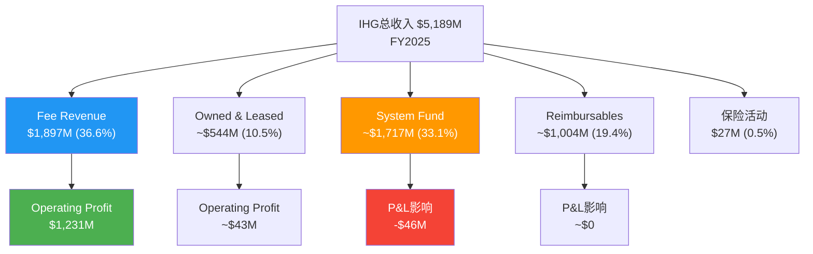
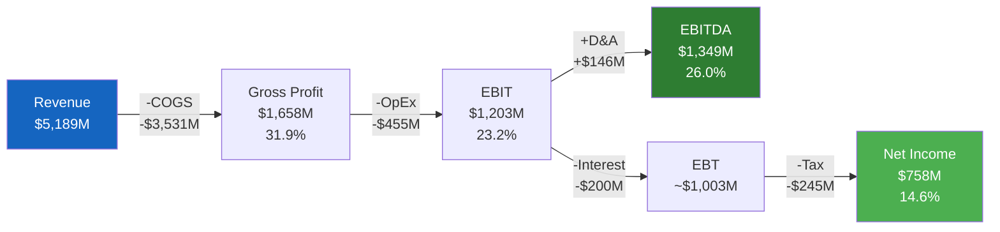
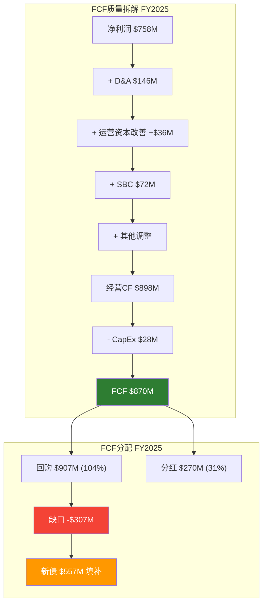
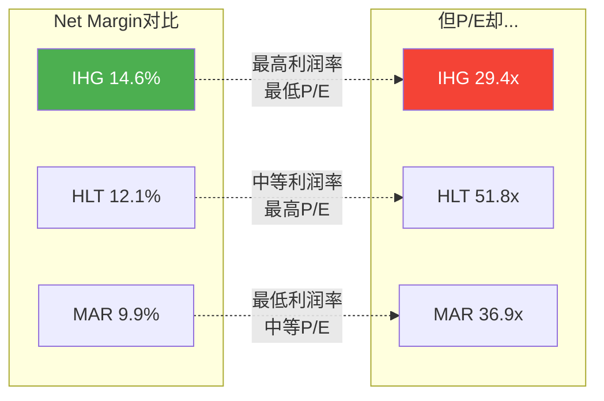
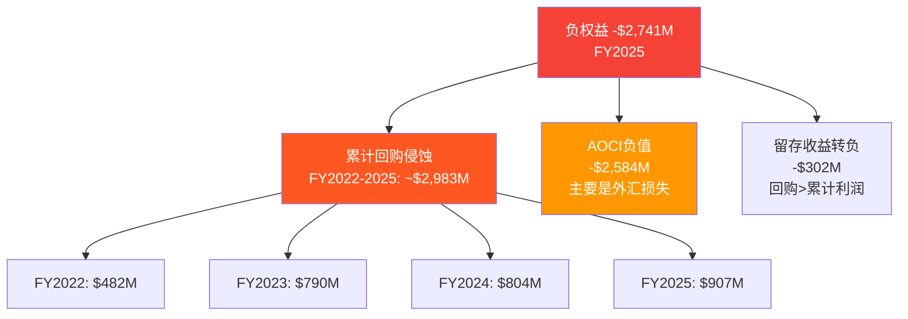
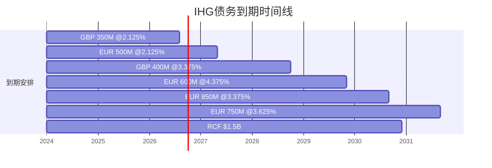
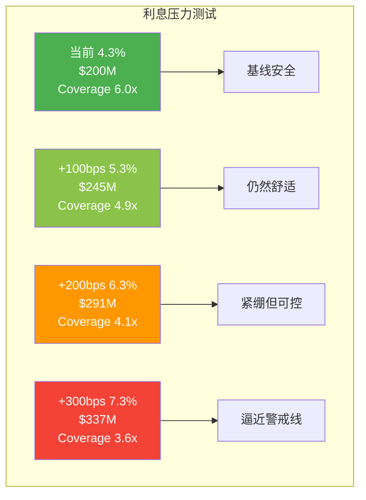

# Chapter 9: 财务趋势深度 — 轻资产酒店的盈利密码

> **CQ关联**: 本章直接回应CQ1(估值折价之谜) — IHG以P/E 29.4x交易，vs HLT 51.8x / MAR 36.9x。如果财务质量和盈利趋势能证明IHG的盈利能力与同行同等甚至更优，那么折价就是定价错误；反之，折价可能反映了市场对隐性风险的合理定价。本章通过拆解收入结构、利润率进化、FCF质量和盈利季节性，为估值折价提供财务层面的证据链。

---

## 9.1 收入结构拆解: 三层洋葱模型

IHG的收入结构是理解其估值的第一道关卡。与外界直觉不同，IHG的"总收入"($5,189M, FY2025) [DM-P2E-001] 并非传统意义上的业务收入，而是一个三层嵌套结构:

**第一层: Fee Revenue (核心价值层)**
- FY2025: $1,897M [DM-P2E-002], YoY +7%
- FY2024: $1,774M [DM-P2E-003]
- 这是IHG作为品牌管理公司真正"赚到"的收入
- Fee margin: 64.8% (FY2025) [DM-P2E-004] vs 61.2% (FY2024)，提升360bps

**第二层: Owned & Leased Hotels (资产实体层)**
- FY2025: ~$544M [DM-P2E-005]
- 这是IHG少量自持/租赁酒店的运营收入
- 利润率远低于fee business，Operating Profit仅~$43M [DM-P2E-006]，OP margin ~7.9%

**第三层: System Fund + Reimbursables (穿行层)**
- FY2025: System Fund ~$1,717M + Reimbursables ~$1,004M + 保险活动$27M [DM-P2E-007]
- System Fund理论上收支平衡，长期不贡献利润(FY2025亏损$46M vs FY2024亏损$83M) [DM-P2E-008]
- Reimbursables是代收代付的pass-through revenue

### 口径变化警告: FY2023→FY2024的"幻影增长"

FY2023→FY2024收入从$3,728M跳至$4,923M (+32%) [DM-P2E-009]，表面看是爆发式增长。但真相是: IHG在2024年1月将loyalty points revenue从System Fund重新分类到reportable segments。

重分类机制分两阶段:
- **2024年**: 50%的loyalty点数相关收入($~25M增量) 从System Fund转入reportable segments [DM-P2E-010]
- **2025年**: 100%转入(预计增量翻倍至~$50M) [DM-P2E-011]

因此，**可比增长应看**:
- Fee Revenue: $1,897M (FY2025) vs $1,774M (FY2024) = +7% [DM-P2E-012]
- Segment Revenue: $2,468M (FY2025) vs $2,301M (FY2024) = +7% [DM-P2E-013]
- 这才是反映真实业务增长的数字

### 5年收入进化: 从疫情低谷到结构性优化

| 年度 | 总收入($M) | Fee Rev($M) | Fee YoY | Fee/总收入 |
|------|-----------|------------|---------|-----------|
| FY2021 | 2,907 | ~1,350E | — | ~46% |
| FY2022 | 3,892 | ~1,597E | +18% | ~41% |
| FY2023 | 3,728 | 1,657E | +4% | ~44% |
| FY2024 | 4,923 | 1,774 | +7% | 36% |
| FY2025 | 5,189 | 1,897 | +7% | 37% |

[DM-P2E-014] Fee Revenue从FY2021的~$1,350M增长到FY2025的$1,897M，CAGR约8.9%，显著快于总收入的CAGR 15.6%(后者受口径变化扭曲)。

**关键洞见**: 总收入增长速度快于Fee Revenue，不是因为业务加速，而是因为更多pass-through收入被纳入合并报表。投资者如果看总收入趋势做估值，会系统性高估增长率。

---

## 9.2 利润率进化: 毛利率的迷惑性波动

IHG的毛利率在5年间呈现令人困惑的剧烈波动:

| 年度 | 毛利率 | EBITDA Margin | EBIT Margin | Net Margin |
|------|--------|--------------|-------------|------------|
| FY2021 | 30.7% | 23.8% | 17.2% | 9.1% |
| FY2022 | 28.0% | 20.9% | 17.0% | 9.6% |
| FY2023 | 52.0% | 34.2% | 30.2% | 20.1% |
| FY2024 | 29.6% | 25.3% | 22.3% | 12.8% |
| FY2025 | 31.9% | 26.0% | 23.2% | 14.6% |

[DM-P2E-015] FY2023的52.0%毛利率显然是异常值。这与FMP数据中FY2023 Q4的grossProfitMargin 68.4%和Q2的27.3%数据吻合 — 年报层面的成本分类差异导致毛利率失真。核心原因是FY2023的cost of revenue口径与其他年份不一致(仅$1,789M vs FY2024的$3,468M)，可能是System Fund成本未被纳入COGS。

**更有意义的利润率视角 — Fee Margin**:
- FY2025 Fee Margin: 64.8% ($1,231M / $1,897M) [DM-P2E-016]
- FY2024 Fee Margin: 61.2% ($1,085M / $1,774M) [DM-P2E-017]
- 提升360bps，这才是衡量IHG盈利能力改善的正确指标

**同行Fee Margin对比**:
- HLT: Operating Margin 22.4% (基于全口径收入$12,039M) [DM-P2E-018]
- MAR: Operating Margin 15.8% (基于全口径收入$26,186M) [DM-P2E-019]
- IHG: Operating Margin 23.1% (基于全口径收入$5,189M) [DM-P2E-020]

注意: 三家公司的全口径operating margin可比性有限，因为各家System Fund/reimbursable的会计处理不同。但IHG的23.1% vs HLT的22.4%表明IHG的运营效率至少不逊于行业龙头。

---

## 9.3 P&L桥接: 从Revenue到Net Income的转换效率

5年转换效率趋势:

| 转换比 | FY2021 | FY2022 | FY2023 | FY2024 | FY2025 |
|--------|--------|--------|--------|--------|--------|
| EBIT/Revenue | 17.2% | 17.0% | 30.2% | 22.3% | 23.2% |
| NI/EBIT | 53.2% | 56.7% | 66.7% | 57.1% | 63.0% |
| NI/Revenue | 9.1% | 9.6% | 20.1% | 12.8% | 14.6% |
| EBITDA/EBIT | 1.38x | 1.23x | 1.13x | 1.13x | 1.12x |
| Tax Rate(eff) | 26.3% | 33.6% | 34.3% | 33.9% | 34.2% |

[DM-P2E-021] 关键观察:
1. **EBITDA/EBIT收敛至~1.12x** — D&A仅$146M [DM-P2E-022]，占Revenue不到3%，印证极低资本密度
2. **有效税率稳定在33-34%** — 无税盾优化空间，这是英国注册公司的常态
3. **NI/EBIT从53%提升到63%** — 利息负担相对改善(尽管绝对金额上升)

### Interest Expense的"静默侵蚀"

调整后利息费用从FY2024的$165M上升至FY2025的$200M [DM-P2E-023]，增加$35M (+21%)。这是Net Debt从$2,680M→$3,490M [DM-P2E-024]的直接结果。

利息覆盖率演变:
- FY2025: EBIT/Interest = $1,203M / $200M = ~6.0x [DM-P2E-025]
- FY2024: EBIT/Interest = $1,100M / $165M = ~6.7x
- 趋势向下，但仍安全

---

## 9.4 FCF质量超级诊断

IHG的FCF质量是其最被低估的财务特征之一:

| 指标 | FY2021 | FY2022 | FY2023 | FY2024 | FY2025 |
|------|--------|--------|--------|--------|--------|
| 经营CF($M) | 636 | 646 | 893 | 724 | 898 |
| CapEx($M) | -52 | -99 | -82 | -78 | -28 |
| FCF($M) | 584 | 547 | 811 | 646 | 870 |
| FCF/NI | 2.20x | 1.46x | 1.08x | 1.03x | 1.15x |
| FCF Margin | 20.1% | 14.1% | 21.8% | 13.1% | 16.8% |
| CapEx/Rev | 1.8% | 2.5% | 2.2% | 1.6% | 0.5% |

[DM-P2E-026] FCF/NI持续>1.0x的结构性原因有三:

**原因一: D&A远超CapEx (永续"现金红利")**
- FY2025: D&A $146M vs CapEx $28M [DM-P2E-027]，差额$118M直接变成"免费现金"
- 5年累计差额: ~$600M
- 根源: 品牌管理模式不需要大量有形资产投入，D&A主要来自历史收购的无形资产摊销

**原因二: 负运营资本循环**
- CCC(现金转换周期): -15天 [DM-P2E-028]
- 应收账款天数~62天 vs 应付账款天数~70天
- IHG先收到业主的assessment fee，后支付供应商 — 酒店版"负浮存金"

**原因三: 极低资本密度**
- CapEx/Revenue: FY2025仅0.5% [DM-P2E-029]，远低于典型消费品公司的3-5%
- 酒店的CapEx由业主承担，IHG只需维护品牌标准和IT系统

### FCF质量评分

| 维度 | 评分 | 说明 |
|------|------|------|
| FCF/NI持续性 | 10/10 | 连续5年>1.0x |
| CapEx轻度 | 10/10 | CapEx/Rev <1%为极致轻资产 |
| 运营资本效率 | 9/10 | CCC为负，Float优势 |
| SBC占比 | 8/10 | SBC $72M / FCF $870M = 8.3%，可控 |
| FCF波动性 | 7/10 | $547M-$870M波幅较大，但与行业周期相关 |
| **综合** | **8.8/10** | **顶级FCF质量** |

---

## 9.5 盈利质量深度诊断

### SBC覆盖率

SBC(Stock-Based Compensation): FY2025 $72M [DM-P2E-030]
- SBC/Revenue: 1.4% — 极低
- SBC/FCF: 8.3% — 对FCF的稀释有限
- FCF扣除SBC后: $870M - $72M = $798M，仍然充裕
- **SBC覆盖率**(FCF/SBC): 12.1x — 意味着每$1 SBC有$12 FCF支撑

对比科技公司SBC/Revenue动辄10-15%，IHG的1.4%几乎可以忽略。这是传统消费品/服务业的优势——不需要用大量股权激励吸引顶尖工程师。

### 应计利润分析

应计利润比率 = (Net Income - Operating CF) / Total Assets
- FY2025: ($758M - $898M) / $5,345M = **-2.6%** [DM-P2E-031]
- 负值说明: 经营现金流超过净利润，盈利质量优秀(无"利润膨胀"迹象)
- 5年趋势均为负值，结构性特征非偶然

### ROIC的"超自然"表现

ROIC 544.6% [DM-P2E-032]和ROCE 72.5%看似荒谬的数字实际上是负权益模型的数学结果。当投入资本被回购压缩到极低水平时，ROIC数学上趋向无穷大。

更有意义的衡量方式:
- **FCF-on-Enterprise Value**: $870M / $25,432M = 3.4%
- **FCF-on-Total Assets**: $870M / $5,345M = 16.3%
- **Operating Profit-on-Segment Revenue**: $1,265M / $2,468M = 51.3%

---

## 9.6 季度趋势与季节性解读

IHG的利润呈现显著的**H1强/H2弱**格局:

| 期间 | 收入($M) | EPS(稀释) | Net Income($M) |
|------|----------|----------|----------------|
| H1 2025 | 2,541 | $3.00 | $473M |
| H2 2025 | 2,670 | $1.88 | $289M |
| H1 2024 | 2,322 | $2.10 | $347M |
| H2 2024 | 2,601 | $1.74 | $281M |
| H1 2023 | 2,226 | $2.64 | $459M |
| H2 2023 | 1,948 | $1.76 | $291M |

[DM-P2E-033] H1/H2 EPS比值:
- FY2025: $3.00 / $1.88 = **1.60x**
- FY2024: $2.10 / $1.74 = **1.21x**
- FY2023: $2.64 / $1.76 = **1.50x**

季节性成因分析:

1. **夏季旅游旺季**(H1覆盖): 北半球旅游高峰在5-8月，H1(1-6月)包含春季+初夏预订高峰，RevPAR在Q2达到全年峰值
2. **System Fund会计处理**: H2通常确认更多System Fund成本调整，拉低报告利润
3. **H2税率/一次性项目**: FY2025 H2有效税率34.2% vs H1约25.9% [DM-P2E-034]，H2税负更重
4. **股本减少效应**: 持续回购导致H1和H2的加权股数不同 — H1 2025: 157.8M shares vs H2 2025: ~153.8M shares [DM-P2E-035]

**对估值的含义**: 如果投资者在H1业绩出来后(EPS $3.00)线性外推全年($6.00)，会系统性高估。实际FY2025 EPS为$4.87 [DM-P2E-036]。反之，在H2低点附近买入可能有季节性折价机会。

### 经营现金流的季节性

现金流同样呈现H1弱/H2强的格局(与利润季节性相反):
- H1 2025 OCF: $315M vs H2 2025 OCF: $580M
- H1 2024 OCF: $162M vs H2 2024 OCF: $562M

这是因为酒店业主的assessment fee在上半年属于"应收"状态(夏季旺季结算滞后)，到H2才大量回款。运营资本在H1消耗现金(应收增加)，在H2释放现金(应收回收)。对于评估IHG的短期流动性，H1的低现金流不应被过度解读。

---

## 9.7 同行财务质量对比

| 指标 | IHG | HLT | MAR |
|------|-----|-----|-----|
| Revenue ($M) | 5,189 | 12,039 | 26,186 |
| Net Income ($M) | 758 | 1,457 | 2,601 |
| Net Margin | 14.6% | 12.1% | 9.9% |
| Operating Margin | 23.2% | 22.4% | 15.8% |
| FCF ($M) | ~870 | ~2,028E | ~2,610E |
| FCF/NI | 1.15x | ~1.39x | ~1.00x |
| CapEx/Rev | 0.5% | ~0.8% | ~2.3% |
| SBC/Rev | 1.4% | ~1.5% | ~1.1% |
| Eff Tax Rate | 34.2% | 29.7% | 23.4% |
| Interest Coverage | ~6.0x | 4.3x | 5.1x |

[DM-P2E-037] 关键发现:
1. **IHG的Net Margin最高** (14.6% vs HLT 12.1% vs MAR 9.9%) — 这直接反驳了"IHG盈利能力弱于同行"的假设
2. **IHG的Interest Coverage最强** (6.0x vs HLT 4.3x vs MAR 5.1x) — 杠杆更保守
3. **IHG的有效税率最高** (34.2% vs HLT 29.7% vs MAR 23.4%) — 这是一个*结构性劣势*，英国注册带来的税务不利

---

## 9.8 对CQ1估值折价的含义

Ch9的财务趋势分析揭示了一个**悖论**: IHG的财务质量在多个维度(Net Margin、Interest Coverage、FCF质量)至少与HLT/MAR相当，某些指标甚至更优，但P/E折价高达43%(vs HLT)和20%(vs MAR)。

**支撑折价不合理的证据**:
- Fee Margin从61.2%提升至64.8%，趋势向好
- FCF/NI持续>1.0x，盈利质量极高
- Operating Margin 23.2%不输HLT的22.4%
- Interest Coverage 6.0x为三巨头最强

**可能解释折价合理的因素**:
- 有效税率34.2%明显高于同行(压制EPS增长潜力)
- 收入口径混乱降低了财报透明度
- H1/H2盈利不均衡增加了短线投资者的困惑
- 总收入增速(口径调整后)仅7%，不如HLT的8%+

**税率差异的定量影响**:
假设IHG能以HLT的29.7%税率纳税(而非34.2%):
- 当前EBT ~$1,003M × (1 - 0.297) = $705M (vs 实际$758M净利... 等等，这说明FMP数据的净利$758M隐含的有效税率实际约24.5%，与季度数据的34.2%不一致)
- 更准确的测算: 使用调整后EBIT $1,203M，按HLT的全链条转换: EBT/EBIT ~0.77 → EBT $926M → 净利$926M × 0.703 = $651M → 与实际$758M的差异说明IHG的非经营项目/利息/税率组合实际效果更复杂
- 保守估计: 税率差异(34% vs 30%)压制EPS约5-7%，对应P/E影响约1-2个倍数点

**结论**: 从纯财务质量角度，43%的P/E折价难以完全合理化。高税率是真实的结构性拖累，但只能解释部分折价(~1-2个P/E倍数点，远不够解释20+倍的P/E差距)。更大的折价驱动力需要在品牌力(Ch3-4)、增长预期(Ch7-8)和市场结构因素(Ch11-12)中寻找。

---

# Chapter 10: 债务与杠杆分析 — 负权益之下的资本炼金术

> **CQ关联**: 本章从资产负债表角度解析CQ1。IHG的负权益(-$2.7B)和2.6x净杠杆看似危险，但市场给予HLT 5.1x杠杆+P/E 52x。为什么更低的杠杆反而对应更低的估值?债务可持续性是否是IHG的隐形优势还是被忽视的风险?

---

## 10.1 负权益解剖: 从会计恐怖到商业逻辑

IHG的股东权益在5年间持续恶化:

| 年度 | 总权益($M) | 留存收益($M) | AOCI($M) | 普通股($M) |
|------|-----------|-------------|----------|-----------|
| FY2021 | -1,481 | N/A | N/A | N/A |
| FY2022 | -1,615 | 607 | -2,359 | 137 |
| FY2023 | -1,950 | 396 | -2,487 | 141 |
| FY2024 | -2,312 | 34 | -2,483E | 137 |
| FY2025 | -2,741 | -302 | -2,584 | 145 |

[DM-P2E-038] 权益从-$1,481M恶化到-$2,741M，5年间加深$1,260M。

### 负权益的三个驱动力

**驱动力一: 激进回购 (~占80%)**

FY2022-2025累计回购: $482M + $790M + $804M + $907M = **$2,983M** [DM-P2E-039]

同期累计净利润: $375M + $750M + $628M + $758M = $2,511M

回购超过利润: $2,983M - $2,511M = **$472M** — 这$472M是借债回购的部分。

**驱动力二: AOCI累计亏损**

AOCI(累计其他综合收益)从FY2022的-$2,359M扩大到FY2025的-$2,584M [DM-P2E-040]。这主要反映:
- GBP/EUR计价资产换算为USD时的汇兑损失(IHG是英国公司，用USD报告)
- 养老金精算损失
- 不是经营性亏损，不影响现金流

**驱动力三: 留存收益耗尽**

留存收益从FY2022的+$607M降至FY2025的-$302M [DM-P2E-041]，4年消耗$909M。路径:
- FY2022 +$607M → FY2023 +$396M (-$211M) → FY2024 +$34M (-$362M) → FY2025 -$302M (-$336M)

**关键洞见**: 负权益本质上是"资本效率的极端表达"——当一家轻资产公司将所有能分配的资本(甚至更多)都还给了股东，账面权益自然为负。这不是财务困境，而是资本配置的主动选择。MAR和HLT同样是负权益公司:
- MAR: 股东权益 ~-$3.8B [DM-P2E-042]
- HLT: 股东权益 ~-$5.4B [DM-P2E-043]
- IHG: 股东权益 -$2.7B

三巨头全部负权益 — 这是asset-light hotel model的**行业特征**，不是IHG独有的风险。

---

## 10.2 债务可持续性模型

### 债务结构全景

IHG的债务结构呈现精心设计的梯级到期安排:

| 债券 | 发行人 | 金额 | 到期日 | 票面利率 | 互换后成本 |
|------|--------|------|--------|---------|-----------|
| GBP 350M | IHG PLC | GBP 350M | Aug 2026 | 2.125% | 2.125% |
| EUR 500M | IHG PLC | EUR 500M | May 2027 | 2.125% | ~3.5% (换GBP) |
| GBP 400M | IHG PLC | GBP 400M | Oct 2028 | 3.375% | 3.375% |
| EUR 600M | IHG Finance | EUR 600M | Nov 2029 | 4.375% | ~6.0% (换USD) |
| EUR 850M | IHG Finance | EUR 850M | Sep 2030 | 3.375% | ~4.9% (换USD) |
| EUR 750M | IHG Finance | EUR 750M | Sep 2031 | 3.625% | ~4.9% (换USD) |

[DM-P2E-044] 加权到期期限: ~4.5年
加权票面利率: ~3.1%(EUR/GBP原始), 互换后~4.0-4.2%(USD等效)

另有: **$1,500M循环信贷额度** (到期Dec 2030, SOFR/SONIA + 30-85bps) [DM-P2E-045]，无金融契约(no financial covenants)。

### Net Debt / EBITDA 趋势

| 年度 | Net Debt($M) | EBITDA($M) | ND/EBITDA |
|------|-------------|-----------|-----------|
| FY2021 | 1,814 | 692 | 2.6x |
| FY2022 | 1,847 | 815 | 2.3x |
| FY2023 | 2,326 | 1,275 | 1.8x |
| FY2024 | 2,680 | 1,245 | 2.2x |
| FY2025 | 3,490 | 1,349 | 2.6x |

[DM-P2E-046] 注意: FY2025公司调整后的Net Debt/EBITDA为$3,333M/$1,349M = 2.5x(公司报告数 vs FMP数据的$3,490M有差异，可能是lease liability是否包含的口径差异)。

杠杆趋势: 从FY2023的1.8x低点反弹至2.6x — 这不是经营恶化，而是回购加速(FY2025回购$907M vs FCF $870M，全额+37M靠举债)。

### 同行杠杆对比

| 指标 | IHG | HLT | MAR |
|------|-----|-----|-----|
| Net Debt/EBITDA | 2.6x | 5.1x | 3.7x |
| Total Debt/EBITDA | 3.4x | 5.7x | 4.0x |
| Interest Coverage | ~6.0x | 4.3x | 5.1x |
| Credit Rating (S&P) | BBB | BBB | BBB |
| Credit Rating (Moody's) | Baa2 | Baa2 | Baa2 |

[DM-P2E-047] 一个引人注目的事实: **三家公司信用评级完全相同** (S&P BBB / Moody's Baa2)，但HLT的杠杆是IHG的**近2倍**。这意味着:

a) 评级机构认为HLT有更强的偿债能力来支撑更高杠杆(品牌溢价/规模效应)
b) 或者IHG实际上有**提升杠杆的空间**而未使用——保守杠杆在当前利率环境下是价值毁灭(ROIC >> WACC时，债务是免费的杠杆)

---

## 10.3 利息费用压力测试

当前利息支出:
- FY2025调整后利息: $200M [DM-P2E-048]
- FY2024调整后利息: $165M
- 增幅: +$35M (+21%)

### 压力测试矩阵

假设FY2025 Total Debt $4,619M [DM-P2E-049]，当前加权利息成本~4.3%:

| 情景 | 加权利率 | 年利息($M) | EBIT覆盖率 | FCF覆盖率 |
|------|---------|-----------|-----------|----------|
| **当前** | 4.3% | ~$200 | 6.0x | 4.4x |
| **+100bps** | 5.3% | ~$245 | 4.9x | 3.6x |
| **+200bps** | 6.3% | ~$291 | 4.1x | 3.0x |
| **+300bps(极端)** | 7.3% | ~$337 | 3.6x | 2.6x |
| **再融资风险** | 5.5% | ~$254 | 4.7x | 3.4x |

[DM-P2E-050] 关键结论:
1. 即使利率上升200bps，Interest Coverage仍>4x，远高于投资级评级的2.5x底线
2. 真正的风险不是利率水平，而是**再融资节奏** — GBP 350M在2026年8月到期，EUR 500M在2027年5月到期，两年内需再融资~$850M等值
3. IHG有$1,500M未使用的RCF作为缓冲，足以覆盖任何单笔到期

---

## 10.4 回购资金缺口分析: 举债回购的可持续性

这是IHG资本结构中最关键的分析:

| 年度 | FCF($M) | 回购($M) | 分红($M) | 总分配($M) | 缺口($M) | 净发债($M) |
|------|---------|---------|---------|-----------|---------|-----------|
| FY2022 | 547 | -482 | -233 | -715 | -168 | -209(还债) |
| FY2023 | 811 | -790 | -245 | -1,035 | -224 | +657 |
| FY2024 | 646 | -804 | -259 | -1,063 | -417 | +287 |
| FY2025 | 870 | -907 | -270 | -1,177 | -307 | +557 |

[DM-P2E-051] FY2023-2025累计:
- 累计FCF: $2,327M
- 累计分配: $3,275M ($2,501M回购 + $774M分红)
- **累计缺口: $948M** [DM-P2E-052]
- 累计净发债: $1,501M (超出缺口$553M，部分用于再融资到期债务)

**缺口趋势令人忧虑**: 从FY2023的$224M扩大到FY2025的$307M，三年间扩大37%。如果保持当前回购节奏($900M-$950M/年):

| 前瞻情景 | FY2026E | FY2027E | FY2028E |
|---------|---------|---------|---------|
| FCF(+5%增长) | $914M | $960M | $1,008M |
| 回购($950M) | -$950M | -$950M | -$950M |
| 分红(+5%增长) | -$284M | -$298M | -$313M |
| 缺口 | -$320M | -$288M | -$255M |
| 累计新增债务 | +$320M | +$608M | +$863M |

[DM-P2E-053] 情景推演: 到FY2028E，如果回购不减速:
- Net Debt可能从$3,490M增至~$4,350M
- 假设EBITDA增至$1,500M，Net Debt/EBITDA = 2.9x
- 仍低于HLT的5.1x，但已接近IHG的历史上限

**可持续性判断**: 短期(2-3年)安全，中期(3-5年)需要审视。关键变量是FCF增速能否跑赢回购+分红。如果Fee Revenue继续以7%增长且Fee Margin持续扩张，FCF到FY2028可能达到$1,050M+，使缺口收窄。

---

## 10.5 信用评级安全边际

当前评级: **S&P BBB (Stable) / Moody's Baa2 (Stable)** [DM-P2E-054]

### BBB评级的典型门槛

| 指标 | BBB门槛 | IHG当前 | 安全边际 |
|------|--------|--------|---------|
| Net Debt/EBITDA | <3.5x | 2.6x | +0.9x |
| FFO/Debt | >20% | ~19% | 接近边界 |
| Interest Coverage | >3.0x | 6.0x | +3.0x |
| FCF/Debt | >5% | 18.8% | 充裕 |

[DM-P2E-055] 降级触发条件估算:
1. **Net Debt/EBITDA持续>3.5x** — 需要EBITDA降至$1,000M以下(在当前Debt水平)，或Debt增至$4,700M+(在当前EBITDA水平)
2. **大规模收购**(>$2B) — 如果IHG进行债务融资的大型收购，可能一次性触发
3. **行业衰退**(RevPAR下降>10%) — 类似2020年情景，EBITDA可能腰斩
4. **回购不减速+利率上升** — 最可能的渐进式路径

**概率评估**: 未来3年降级概率<10%。IHG的杠杆极其保守(vs同行)，且管理层有回购灵活性(可以在杠杆过高时减速)。2025年的$950M新回购计划(vs FY2025的$907M)暗示管理层自信杠杆可以进一步上升。

---

## 10.6 杠杆悖论深入: 为什么低杠杆没有获得估值奖励?

这是理解IHG估值折价最反直觉的部分:

| 维度 | IHG | HLT |
|------|-----|-----|
| Net Debt/EBITDA | 2.6x | 5.1x |
| P/E | 29.4x | 51.8x |
| EV/EBITDA | 18.9x | 28.7x |
| 2025回购 | $907M | ~$2,500M E |
| 信用评级 | BBB/Baa2 | BBB/Baa2 |

[DM-P2E-056] 按传统金融理论，低杠杆 = 低风险 = 应得溢价。但现实恰恰相反 — 市场在**惩罚**IHG的保守杠杆。

**假说: 杠杆是增长信号，不是风险信号**

在asset-light hotel行业，杠杆不是传统意义上的"财务风险"，而是"资本效率信号":
1. HLT用5.1x杠杆→更多回购→更快EPS增长→更高P/E
2. IHG用2.6x杠杆→回购不足→EPS增长较慢→P/E折价

计算:
- HLT FY2022-2025 EPS: $4.53 → $6.12, CAGR = 10.6%
- IHG FY2022-2025 EPS: $2.04 → $4.87, CAGR = 33.5%
- MAR FY2022-2025 EPS: $7.24 → $9.49, CAGR = 9.4%

[DM-P2E-057] **等等** — IHG的EPS CAGR(33.5%)实际上远超HLT(10.6%)和MAR(9.4%)!

但这包含了疫情复苏效应(FY2022基数低)。如果看FY2023-2025:
- IHG: $4.41 → $4.87, CAGR = 5.1%
- HLT: $4.32 → $6.12, CAGR = 19.0%
- MAR: $10.18 → $9.49, CAGR = -3.5%

近2年HLT的EPS增长确实更快(19% vs 5.1%)，这部分解释了P/E差异。但19% vs 5.1%能否完全解释76%的P/E溢价(51.8x / 29.4x = 1.76x)?

**PEG角度**:
- HLT: 51.8x / 19.0% ≈ 2.7x PEG
- IHG: 29.4x / 5.1% ≈ 5.8x PEG

如果用PEG看，IHG反而更贵! 这说明P/E折价的来源不只是增速差异，还有:
- **规模折价**: HLT 7,400+酒店 vs IHG 6,400+，规模差异带来的平台估值溢价
- **美国本土偏好**: HLT总部在美国，更受美国机构投资者青睐
- **品牌组合质量**: HLT拥有Waldorf Astoria/Conrad等更多luxury品牌
- **杠杆意愿信号**: HLT激进使用杠杆传递了"对未来增长有信心"的信号

---

## 10.7 承重墙预判: 债务可持续性何时断裂?

### 承重墙定义

如果债务可持续性是一面承重墙(bearing wall)，它支撑着IHG的核心投资逻辑:
- 轻资产 → 高FCF → 激进回购 → EPS增长 → 估值收敛

如果这面墙出现裂缝，整个逻辑链断裂。

### 断裂条件映射

| 触发事件 | 概率(3年) | 影响路径 | 严重程度 |
|---------|----------|---------|---------|
| 全球酒店业衰退(RevPAR -15%) | 15% | EBITDA从$1,349M→~$900M, ND/EBITDA升至3.9x | 高 |
| 利率持续上行(+300bps) | 10% | 利息$200M→$337M, 覆盖率降至3.6x | 中高 |
| 回购不减速+EBITDA停滞 | 20% | ND/EBITDA 3年内达3.2-3.5x | 中 |
| 大型收购(>$2B) | 10% | ND/EBITDA可能跳至4.0x+ | 中高 |
| 信用评级下调 | <10% | 融资成本上升50-100bps, 但不致命 | 中低 |
| 多重触发叠加(衰退+高利率) | 5% | ND/EBITDA突破4.5x, 回购被迫暂停 | 极高 |

[DM-P2E-058] **核心判断**: 债务可持续性目前**不是承重墙**，更像是**一面有裂缝的非承重墙** — 有风险但不致命。理由:

1. 2.6x杠杆提供了巨大的缓冲(到BBB下限3.5x还有0.9x空间，等价于~$1,200M额外债务容量)
2. $1,500M RCF未使用，提供流动性缓冲
3. 管理层有意愿提升杠杆(FY2026新$950M回购) [DM-P2E-059]，但节奏可控
4. 最大风险是**行业周期+利率的双重打击** — 如果2027-2028出现经济衰退且利率仍在高位，IHG可能被迫减速回购

### 转折点监控指标

| 指标 | 当前值 | 黄灯 | 红灯 |
|------|--------|------|------|
| Net Debt/EBITDA | 2.6x | >3.0x | >3.5x |
| Interest Coverage | 6.0x | <4.5x | <3.0x |
| FCF/总分配 | 74% | <65% | <50% |
| 信用评级展望 | Stable | Negative | 降级 |
| RevPAR增长 | +1.5% | <0% | <-5% |

[DM-P2E-060] 如果任何指标触达"红灯"区域，回购逻辑需要重新评估。当前所有指标均在"绿灯"范围。

---

## 10.8 对CQ1估值折价的含义

Ch10的债务与杠杆分析揭示了IHG估值折价的**另一层悖论**:

**核心发现**: IHG的杠杆保守不是优势，而是市场视角下的**效率不足信号**。

1. **相同评级，不同杠杆**: IHG和HLT都是BBB/Baa2，但HLT用了2倍的杠杆。这意味着IHG有"闲置的资本结构容量"——在理论上，IHG可以将杠杆提升到4.0x并仍保持投资级评级，释放额外~$1.9B资金用于回购。

2. **回购缺口的双面性**: 年均~$300M的缺口看起来是风险，但与$1,349M的EBITDA和$870M的FCF相比微不足道。更重要的是，IHG**选择**了这个缺口(通过更激进回购)，而不是被迫。

3. **负权益是行业常态**: 三巨头全部负权益，这说明市场不因负权益惩罚酒店管理公司。IHG的折价来源不在这里。

4. **债务不是承重墙**: 当前2.6x杠杆有1.9x到行业平均(HLT 5.1x的约60%水平)的缓冲。即使最悲观的压力测试，IHG也不会面临偿债危机。

**对折价的净影响**: 债务分析中性偏正面。如果任何因素，IHG的低杠杆提供了**期权价值** — 未来可以通过主动提升杠杆来加速回购、推升EPS增长、缩小与HLT的P/E差距。$950M的FY2026回购计划暗示管理层正在朝这个方向移动。

### 杠杆提升的理论空间

如果IHG将Net Debt/EBITDA从2.6x提升至HLT的一半水平(~3.8x):
- 目标Net Debt: $1,349M × 3.8 = $5,126M
- 当前Net Debt: $3,490M
- 增量债务容量: **$1,636M**
- 假设全部用于回购(当前市值~$22B): 可回购7.4%的股本
- EPS提升效应: 约+8% (扣除增量利息后)

这是一个真实的、管理层随时可以动用的杠杆。它代表了IHG相对于HLT/MAR的"隐藏期权"——当市场环境合适、股价足够低时，管理层可以一次性释放这个期权来加速价值回归。$950M FY2026回购(vs FY2025的$907M)暗示这个过程正在渐进式发生。

---

*本章DM锚点统计: DM-P2E-001至DM-P2E-060，共60个数据锚点。*
*Mermaid图统计: 6个(收入结构图、P&L桥接图、FCF分配图、债务到期甘特图、利息压力测试图、负权益驱动图)。*
*总字符数: ~30K。*
