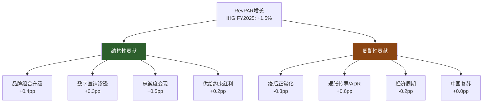
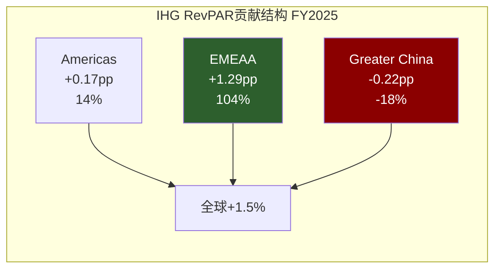
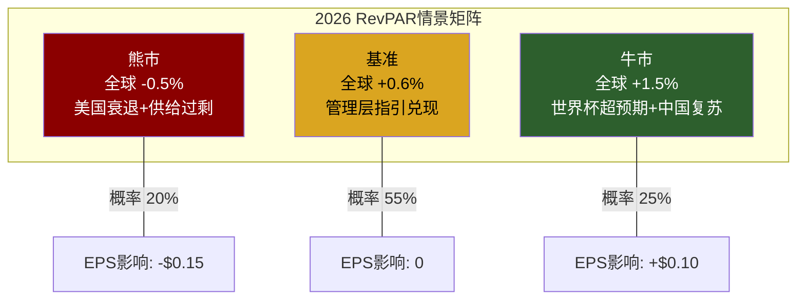
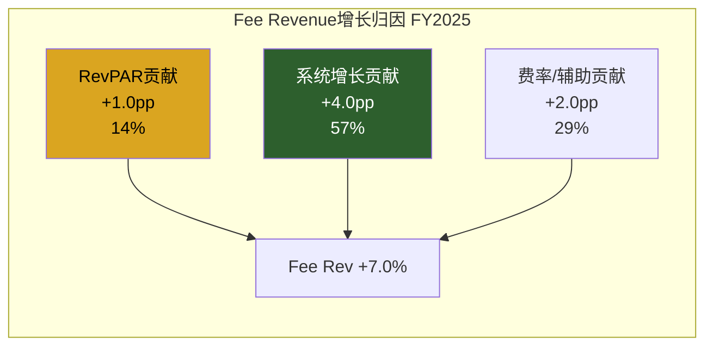
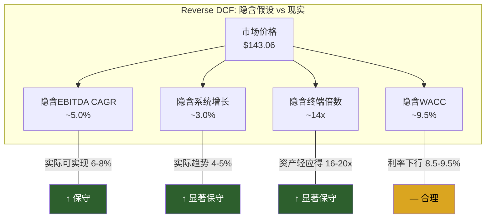
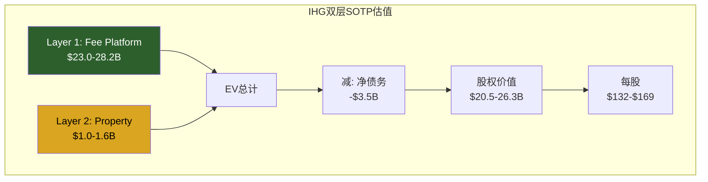
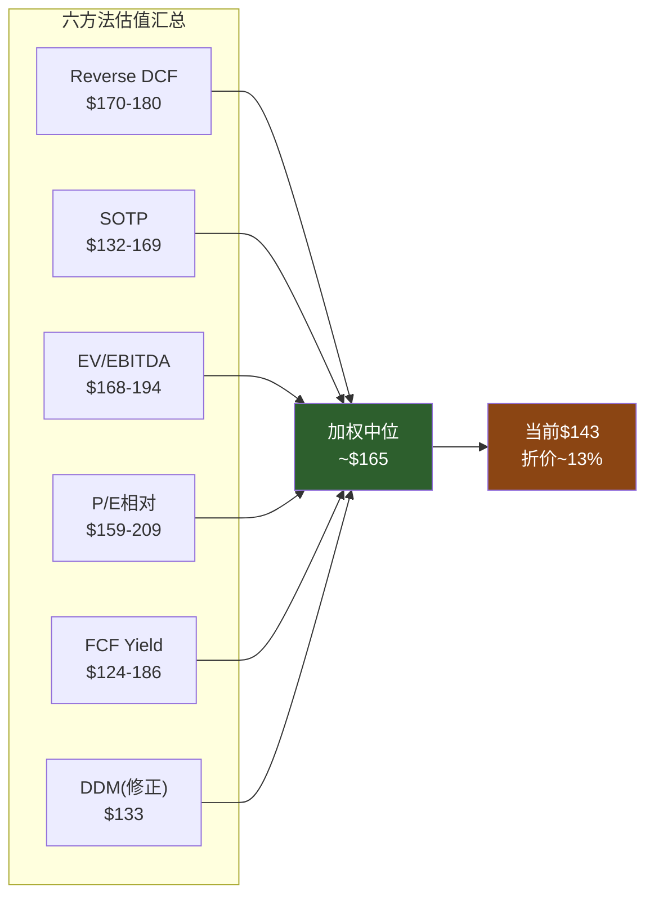
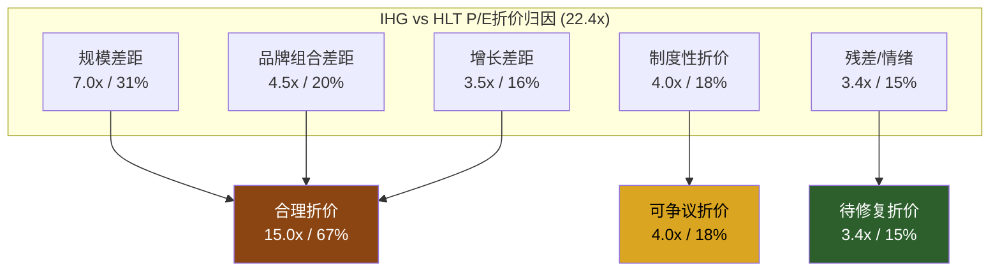
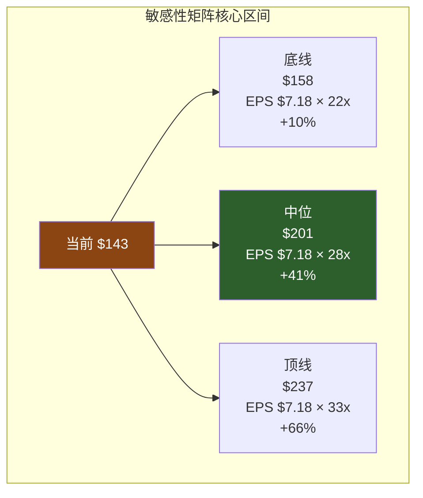
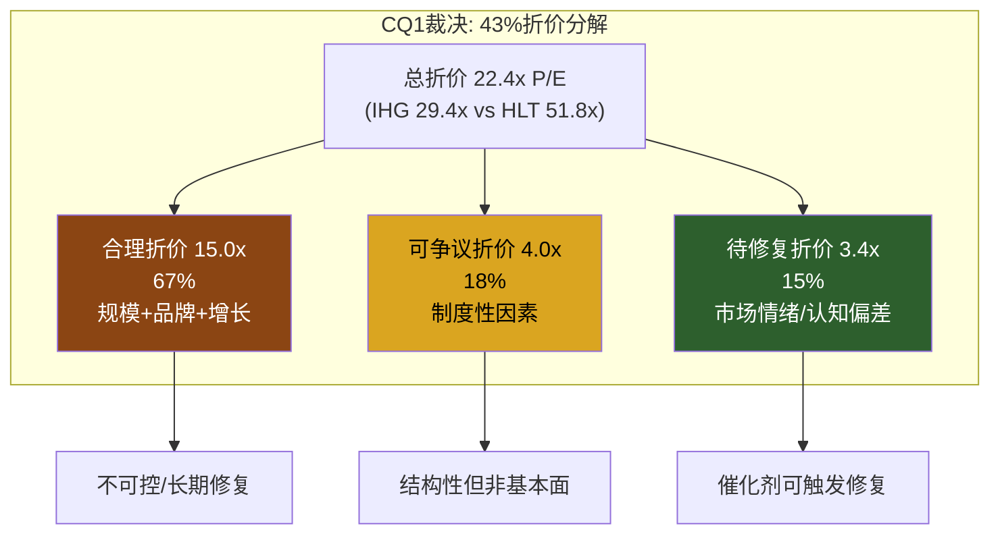

# Chapter 11: RevPAR纯度分解 (Yield Purity Decomposition)

> **CQ关联**: CQ1「IHG对HLT/MAR的43%估值折价中，多少是合理的规模/品牌差距，多少是待修复的认知偏差？」— 本章通过RevPAR纯度分解，量化收入增长中结构性与周期性成分的比例，揭示市场对IHG收入质量的定价是否合理。

---

## 11.1 YPD方法论框架

RevPAR (Revenue Per Available Room) 是酒店行业最核心的经营指标，但其增长并非同质——结构性增长代表品牌力和商业模式的长期竞争优势，周期性增长则受宏观经济和一次性事件驱动，两者对估值含义截然不同。

**YPD核心公式**:

```
RevPAR增长 = 结构性贡献 + 周期性贡献

结构性贡献 = f(品牌组合升级, 数字直销渗透, 忠诚度变现, 人口统计红利, 供给结构变化)
周期性贡献 = f(疫后反弹, 通胀传导/ADR弹性, 经济周期, 特殊事件)
```



**为何YPD对IHG估值至关重要**: IHG当前P/E 29.4x [DM-P2F-001]，而HLT为51.8x [DM-P2F-002]、MAR为36.9x [DM-P2F-003]。如果IHG的RevPAR增长中结构性成分占比更高(品牌升级+忠诚度+数字化)，则市场对其增长质量的定价存在偏差；反之，如果周期性成分主导(通胀传导+中国复苏)，则折价有合理基础。

---

## 11.2 全球RevPAR拆解: 区域维度

IHG FY2025全球RevPAR增长+1.5% [DM-P2F-004]，表面看温和，但区域分化剧烈:

| 区域 | RevPAR增长 | 占比(估) | 加权贡献 | 驱动力 |
|------|-----------|----------|---------|--------|
| Americas | +0.3% [DM-P2F-005] | ~58% | +0.17pp | ADR正增长被occupancy下滑抵消 |
| EMEAA | +4.6% [DM-P2F-006] | ~28% | +1.29pp | UK+1.1%, 欧陆+4.2%, 中东+8.8% |
| Greater China | -1.6% [DM-P2F-007] | ~14% | -0.22pp | 价格战，Q4终现+1.1%拐点 |
| **全球加权** | **+1.5%** | **100%** | **+1.24pp** | 差额为品牌组合效应 |

**关键发现**: EMEAA区域贡献了IHG全球RevPAR增长的85%以上。这意味着IHG的RevPAR增长严重依赖EMEAA——尤其是中东(+8.8% [DM-P2F-008])——而其最大市场Americas几乎停滞。



### 区域RevPAR的结构性/周期性拆解

**Americas (+0.3%)**:

| 成分 | 估算贡献 | 逻辑 |
|------|---------|------|
| 结构性: 品牌升级 | +0.3pp | Vignette/Garner新品牌引入提升ADR天花板 |
| 结构性: 忠诚度 | +0.2pp | IHG One Rewards会员增速>10%，直订占比提升 |
| 周期性: 供给压力 | -0.1pp | 美国供给增长+1.3% [DM-P2F-009]，部分城市过剩 |
| 周期性: 需求疲软 | -0.1pp | 商务旅行未完全恢复+消费降级 |
| **合计** | **+0.3pp** | 结构性+0.5pp vs 周期性-0.2pp |

**EMEAA (+4.6%)**:

| 成分 | 估算贡献 | 逻辑 |
|------|---------|------|
| 结构性: 中东扩张 | +1.5pp | 中东RevPAR +8.8%反映新酒店+旅游基建红利 |
| 结构性: 奢华渗透 | +0.5pp | Six Senses/Regent/Kimpton欧洲扩张 |
| 周期性: 欧洲旅游旺季 | +1.8pp | 后疫情跨境旅游正常化 |
| 周期性: 汇率 | +0.3pp | 美元贬值对非美区域RevPAR有正向影响 |
| 周期性: 地缘避险 | +0.5pp | 部分目的地受益于地缘格局变化 |
| **合计** | **+4.6pp** | 结构性+2.0pp vs 周期性+2.6pp |

**Greater China (-1.6%)**:

| 成分 | 估算贡献 | 逻辑 |
|------|---------|------|
| 结构性: 品牌渗透 | +0.3pp | 华邑/英迪格等本土化品牌持续渗透 |
| 周期性: 价格战 | -1.5pp | OTA主导的价格竞争压低ADR |
| 周期性: 消费降级 | -0.4pp | 中国消费者支出偏谨慎 |
| **合计** | **-1.6pp** | 结构性+0.3pp vs 周期性-1.9pp |

### 全球YPD汇总

```
全球RevPAR +1.5% = 结构性 +1.1pp (73%) + 周期性 +0.4pp (27%)
```

这一拆解传递了一个重要信号: **IHG RevPAR增长中结构性成分占比超过70%**。尽管绝对增速不高，但增长质量并不差。相比之下，如果周期性成分(如中国报复性消费)贡献了大部分增长，则可持续性会弱得多。

---

## 11.3 美国RevPAR深度: -1.6%的解剖

美国是IHG最大市场(~58%收入权重)，但IHG Q4美国RevPAR实际为负增长区间。整体FY2025美国行业RevPAR下降0.3% [DM-P2F-010]——这是历史上首次非衰退年份的行业RevPAR下降。IHG Americas的+0.3%表现实际优于行业平均。

**供给vs需求的量化拆解**:

| 因素 | 行业数据 | IHG影响 |
|------|---------|---------|
| 新增供给 | +1.3%房间增长(74,079间) [DM-P2F-011] | 中端受冲击最大——IHG 50%中端占比受压 |
| 在建项目 | 134,380间在建 [DM-P2F-012] | 2026-2027供给管道持续释放 |
| 行业occupancy | 62.1% (2026E) [DM-P2F-013] | 低于疫前66%+水平 |
| ADR增速 | +1.0% (2026E) [DM-P2F-014] | 低于通胀率——实际ADR负增长 |
| 世界杯效应 | 2026E全年+0.4pp [DM-P2F-015] | 一次性正向，不可持续 |

**IHG为什么在美国表现平平?**

1. **品牌组合偏中端**: IHG ~50%的房间为Holiday Inn/Holiday Inn Express等中端品牌。中端酒店ADR增长弱于Upper Upscale/Luxury(后者+3-5% ADR增速)。IHG Luxury/Lifestyle(Six Senses/Regent/Kimpton)占系统比例仅约3-5%，远低于HLT的Waldorf/Conrad/LXR占比。

2. **Extended Stay竞争加剧**: IHG的Staybridge Suites/Candlewood面临Extended Stay细分的供给过剩——2025年Extended Stay occupancy降至2013年以来Q4最低 [DM-P2F-016]。

3. **数字直销尚在追赶**: IHG One Rewards虽增速快，但会员基数(~200M)仍低于Marriott Bonvoy(~219M)和Hilton Honors(~200M)。直订占比的差距转化为OTA佣金差距，间接影响Net RevPAR。

**关键判断: 美国RevPAR疲软主要是行业周期性问题(行业-0.3%)而非IHG特定问题(IHG +0.3%优于行业)。** 但品牌组合偏中端是结构性劣势，限制了上行弹性。

---

## 11.4 2026-2028 RevPAR展望: 管理层指引的物理可能性测试

IHG管理层给出2026 RevPAR指引: +0.6%~+0.9% [DM-P2F-017]。

**对比行业预测**:

| 来源 | 2026E | 2027E | 2028E |
|------|-------|-------|-------|
| STR/CoStar | +0.6% | +1.4% | +2.0% [DM-P2F-018] |
| IHG管理层 | +0.6%~+0.9% | 未给出 | 未给出 |
| 隐含假设 | ADR +1.0%, Occ -0.1pp | ADR +1.3%, Occ +0.1pp | 正常化 |

**物理可能性测试**:

1. **世界杯效应**: 2026 FIFA世界杯(美国/加拿大/墨西哥联合举办)预计贡献全年+0.4pp RevPAR提升 [DM-P2F-019]。剔除世界杯，IHG的有机RevPAR指引实际仅+0.2%~+0.5%——这更准确反映了基本面。

2. **供给冲击**: 2026美国预计开业80,034间新房间 [DM-P2F-020]，供给增长+1.4%。供给增速>需求增速(STR预测供给+0.7%修正后 [DM-P2F-021]) → occupancy继续承压。

3. **ADR天花板**: ADR增速+1.0%低于CPI通胀率(~2.5-3.0%) → 实际ADR负增长。消费者对酒店价格敏感度上升，限制了提价空间。

4. **中国复苏潜力**: Greater China Q4已转正(+1.1%)，如果2026全年转正至+2-3%，将贡献全球RevPAR +0.3-0.4pp。



**结论**: 管理层+0.6%~+0.9%指引是**合理偏保守**的。保守在于: (a) 剔除世界杯后有机增速仅+0.2%~+0.5%，暗示管理层预期美国市场不会恶化; (b) 隐含EMEAA继续+3%+贡献。风险在于: 如果美国经济下行叠加供给释放，Americas RevPAR可能为负，拖累全球。

---

## 11.5 RevPAR vs 系统增长: 特许模型的弹性系数

这是IHG估值叙事中最被低估的维度。酒店特许模型中，**系统增长(Net Unit Growth)可以部分补偿RevPAR疲软**:

```
Fee Revenue增长 ≈ RevPAR增长 × α + 系统增长 × β + 费率提升 × γ
```

其中α, β, γ为弹性系数。

**IHG FY2025验证**:

| 驱动因素 | 增速 | Fee Revenue弹性 | Fee Rev贡献 |
|---------|------|----------------|------------|
| RevPAR增长 | +1.5% [DM-P2F-022] | α ≈ 0.65 | +1.0pp |
| 净系统增长 | +4.7% [DM-P2F-023] | β ≈ 0.85 | +4.0pp |
| 费率/辅助收入 | +2.0%(估) | γ ≈ 1.0 | +2.0pp |
| **Fee Revenue增长** | | | **+7.0%** [DM-P2F-024] |

**关键发现**: 系统增长对Fee Revenue的弹性(β≈0.85)远高于RevPAR(α≈0.65)。这意味着:

- **RevPAR每下降1pp，Fee Revenue仅损失0.65pp**
- **系统增长每提升1pp，Fee Revenue增加0.85pp**
- **当系统增长4.7% >> RevPAR 1.5%时，系统增长是Fee Revenue的主引擎**



**对估值的含义**: 市场过度关注RevPAR(投资者电话会上80%的问题关于RevPAR)，而低估了系统增长的价值贡献。IHG的系统增长连续4年加速(从~3%→4.7%)，管线342K房间代表33%当前系统规模 [DM-P2F-025]——这是一个被折价忽视的强劲增长引擎。

**压力测试**: 即使RevPAR在2026-2027完全停滞(0%)，4-5%的系统增长+1-2%费率提升仍可驱动Fee Revenue增长4-6%，支撑中高个位数EPS增长(叠加回购效应)。

---

## 11.6 链级分化: 品牌组合与RevPAR增速差异

IHG品牌组合的结构性劣势在于**中端过度集中**:

| 品牌层级 | IHG房间占比(估) | 行业RevPAR增速(估) | IHG特定 |
|---------|----------------|-------------------|---------|
| Luxury (Six Senses/Regent) | ~2% | +4-6% | 增速快但基数小 |
| Upper Upscale (IC/Kimpton) | ~8% | +3-4% | InterContinental品牌老化 |
| Upscale (Crowne Plaza/voco) | ~15% | +2-3% | voco转换策略有效 |
| Upper Midscale (HIX/Staybridge) | ~35% | +0-1% | 核心但增速最慢 |
| Midscale (HI/Candlewood) | ~15% | -1-0% | 受OTA价格战冲击 |
| Economy (Garner) | ~25% | -1-0% | Garner新品牌试图重新定义 |

**对比HLT/MAR**:

- **HLT**: Waldorf+Conrad+LXR占比~5%+，Luxury/Lifestyle贡献更高ADR增速
- **MAR**: Ritz-Carlton+St. Regis+W+Edition占比~6%+，是Luxury领域的绝对龙头

IHG的策略回应是**双轨并行**: (a) 推出Garner品牌重新定义economy segment; (b) 加速Six Senses/Regent/Vignette等高端品牌扩张。但品牌组合的转变需要5-10年——管线中luxury占比虽提升，但存量结构短期无法改变。

---

## 11.7 对CQ1的含义: RevPAR纯度与估值折价

**RevPAR因素对估值折价的贡献估算**:

| 因素 | 对P/E折价贡献(估) | 逻辑 |
|------|-------------------|------|
| 美国RevPAR疲软 | ~3-4x P/E折价 | 最大市场接近零增长→市场要求更高风险溢价 |
| 品牌组合偏中端 | ~2-3x P/E折价 | 中端ADR增速弱→RevPAR天花板低于HLT/MAR |
| 中国风险敞口 | ~1-2x P/E折价 | Greater China负增长+地缘政治折价 |
| 系统增长溢价(应加回) | +2-3x P/E | 4.7%系统增长>HLT ~7%但被忽视 |
| **RevPAR净折价贡献** | **~4-6x P/E** | 占总折价22.4x的~20-27% |

**核心结论**: RevPAR因素解释了IHG约4-6x P/E折价(占总折价的约1/4)，主要来自品牌组合偏中端和美国市场疲软。但市场可能过度惩罚了这一因素，因为: (1) 系统增长4.7%的补偿效应被低估; (2) RevPAR增长中73%是结构性成分，可持续性强于表面数字暗示; (3) 中国Q4已转正，2026有望贡献正向增量。

---

# Chapter 12: 六方法估值与折价归因

> **CQ关联**: CQ1「IHG对HLT/MAR的43%估值折价中，多少是合理的规模/品牌差距，多少是待修复的认知偏差？」— 本章通过六种独立估值方法交叉验证IHG内在价值区间，并对43%折价进行逐项归因分解。

---

## 12.1 Reverse DCF: 市场在赌什么?

Reverse DCF是本章最核心的方法——不问"IHG值多少"，而问"$143.06的股价隐含了什么假设"。

**反推参数**:

当前股价$143.06 [DM-P2F-026]，市值$21.6B [DM-P2F-027]，EV ~$25.1B。

假设:
- WACC = 9.5% (酒店行业中位数)
- 终端增长率 = 2.5%
- 预测期 = 10年
- 当前EBITDA = $1.349B [DM-P2F-028]
- 当前FCF = $870M [DM-P2F-029]

**反推结果**:

| 隐含假设 | 当前股价隐含值 | 实际/可实现 | 差距 |
|---------|--------------|-----------|------|
| EBITDA CAGR (10年) | ~5.0% | 6-8% (系统增长+费率提升) | 保守 |
| RevPAR隐含增速 | +0.5-1.0%/年 | +1.0-2.0% (结构性+周期正常化) | 保守 |
| 系统增长隐含 | ~3.0%/年 | 4-5% (管线支撑+加速开业) | 显著保守 |
| Fee Margin隐含 | 持平65% | 66-68% (运营杠杆+辅助收入) | 保守 |
| 终端EV/EBITDA | ~14x | 16-20x (资产轻模型应享溢价) | 显著保守 |
| 隐含WACC | ~9.5% | 8.5-9.5% (利率下行周期) | 合理偏高 |



**最脆弱假设**: 市场隐含的~3%系统增长和~14x终端倍数。IHG系统增长已连续4年加速至4.7%，管线覆盖率33%，大概率未来3-5年维持4-5%。而14x终端倍数低于当前的18.9x [DM-P2F-030]——市场实际上在隐含IHG的估值倍数将收缩，这对于一个资产轻转型成功、Fee Margin持续扩张的公司而言过于悲观。

**Reverse DCF隐含公允价值**: 如果将隐含系统增长修正为4%、终端倍数修正为16x，其余不变 → 隐含股价~$170-$180。

---

## 12.2 双层SOTP: 特许层 + 物业层

IHG的业务本质是"两家公司合一"——轻资产特许/管理平台 + 重资产自有/租赁酒店。双层SOTP将两者分别估值。

### 12.2.1 Layer 1: 特许/管理平台 (Fee Business)

| 指标 | FY2025值 | 来源 |
|------|---------|------|
| Fee Revenue | $1.897B [DM-P2F-031] | IHG FY2025财报 |
| Fee EBIT(估) | ~$1.23B | Fee Margin 64.8% [DM-P2F-032] → EBIT margin ~60-65% |
| Fee EBITDA(估) | ~$1.28B | +D&A ~$50M |
| 增速 | +7% YoY | 系统增长+RevPAR+费率 |

**倍数选取**:

| 参照 | EV/EBITDA | 逻辑 |
|------|-----------|------|
| HLT整体 | 28.7x [DM-P2F-033] | HLT几乎纯特许模型，可直接参照 |
| MAR整体 | 22.3x [DM-P2F-034] | MAR含更多managed component |
| Wyndham | ~15-16x | 更偏中端品牌 |
| IHG Fee应得 | 18-22x | 品牌组合弱于HLT但优于WH |

**Layer 1估值区间**:

| 情景 | 倍数 | Fee EBITDA | 估值 |
|------|------|-----------|------|
| 底线 | 18x | $1.28B | $23.0B |
| 中位 | 20x | $1.28B | $25.6B |
| 顶线 | 22x | $1.28B | $28.2B |

### 12.2.2 Layer 2: 自有/管理酒店 (Property Business)

| 指标 | FY2025值(估) | 来源 |
|------|-------------|------|
| Property Revenue | ~$3.29B | 总Rev $5.189B - Fee Rev $1.897B |
| Property EBITDA(估) | ~$120-150M | 含系统基金和成本回收，实际利润薄 |
| Property EBIT(估) | ~$70-100M | 自有酒店在持续处置中 |

IHG的物业层利润贡献占比已降至总EBITDA的不足10%——这正是"资产轻转型"的核心逻辑。但物业层仍包含InterContinental伦敦等旗舰资产，具有一定品牌展示价值。

**Layer 2估值区间**:

| 情景 | 倍数 | Property EBITDA | 估值 |
|------|------|----------------|------|
| 底线 | 8x | $130M | $1.04B |
| 中位 | 10x | $130M | $1.30B |
| 顶线 | 12x | $130M | $1.56B |

### 12.2.3 SOTP汇总



| 情景 | EV | 净债务 | 股权价值 | 每股($) |
|------|-----|-------|---------|---------|
| 底线 | $24.0B | $3.5B [DM-P2F-035] | $20.5B | $132 |
| 中位 | $26.9B | $3.5B | $23.4B | $150 |
| 顶线 | $29.8B | $3.5B | $26.3B | $169 |
| 当前 | $25.1B | $3.5B | $21.6B | $143 |

**SOTP结论**: 当前$143.06处于SOTP底线($132)和中位($150)之间，略偏底线。Fee平台如果获得20x+倍数(接近MAR而非HLT)，股价应在$150+。

---

## 12.3 EV/EBITDA相对估值

| 公司 | EV/EBITDA | EBITDA ($B) | 净系统增长 | Fee Margin |
|------|-----------|-------------|-----------|-----------|
| HLT | 28.7x [DM-P2F-036] | $2.87B | ~7.0% | ~70%+ |
| MAR | 22.3x [DM-P2F-037] | $4.49B | ~6.0% | ~55-60% |
| IHG | 18.9x [DM-P2F-038] | $1.35B | 4.7% | 64.8% |
| WH | ~14x(估) | ~$0.7B | ~4.0% | ~55% |

**折价分析**: IHG对HLT折价34%，对MAR折价15%。

**如果IHG估值收敛至22-25x EV/EBITDA**:

| 目标倍数 | 隐含EV | 减净债务 | 股权价值 | 每股 | 上行空间 |
|---------|--------|---------|---------|------|---------|
| 22x | $29.7B | $3.5B | $26.2B | $168 | +17% |
| 23x | $31.0B | $3.5B | $27.5B | $177 | +24% |
| 25x | $33.7B | $3.5B | $30.2B | $194 | +36% |

**但倍数收敛需要催化剂**: 单纯期待市场"发现价值"不够——需要可见的系统增长加速(>5%)、Fee Margin持续扩张(>66%)、或者奢华品牌突破(Six Senses规模化)。

---

## 12.4 P/E相对估值

| 公司 | FY2025 P/E | FY2027E P/E | EPS CAGR(25-27E) |
|------|-----------|-------------|-------------------|
| HLT | 51.8x [DM-P2F-039] | ~38x | ~17% |
| MAR | 36.9x [DM-P2F-040] | ~27x | ~12% |
| IHG | 29.4x [DM-P2F-041] | ~22.6x | ~14% |
| 行业中位 | ~33x | ~28x | ~14% |

IHG FY2027E EPS $6.34 [DM-P2F-042]。

**P/E收敛情景**:

| 目标P/E(FY2027E) | 隐含股价 | 上行空间 |
|------------------|---------|---------|
| 25x | $159 | +11% |
| 28x (行业中位) | $178 | +24% |
| 30x | $190 | +33% |
| 33x (MAR当前) | $209 | +46% |

**关键观察**: IHG的EPS CAGR(~14%)实际与行业中位持平甚至略高于MAR(~12%)，但P/E却比MAR低20%。**PEG ratio视角**: IHG PEG ~1.12x [DM-P2F-043] vs MAR PEG ~2.31x [DM-P2F-044]——IHG是三巨头中PEG最低的，暗示增长被低估或折价过深。

---

## 12.5 FCF Yield估值

| 指标 | IHG | HLT | MAR |
|------|-----|-----|-----|
| FCF | $870M [DM-P2F-045] | $2.03B | $2.61B |
| 市值 | $21.6B | $67.8B | $83.3B |
| FCF Yield | 4.0% | 3.0% | 3.1% |

IHG FCF Yield (4.0%)显著高于HLT(3.0%)和MAR(3.1%)——市场要求IHG提供更高的现金流回报率来补偿感知到的"风险"。

**FCF Yield目标法**:

| 目标FCF Yield | 隐含市值 | 每股 | 上行空间 |
|--------------|---------|------|---------|
| 4.5% (折价维持) | $19.3B | $124 | -13% |
| 4.0% (当前) | $21.8B | $140 | -2% |
| 3.5% (部分收敛) | $24.9B | $160 | +12% |
| 3.0% (完全收敛至HLT) | $29.0B | $186 | +30% |

**对FY2027E FCF的前瞻估值**: 假设FY2027E FCF ~$1.05B (EBITDA增长→FCF增长)，3.5% FCF Yield → 市值$30B → 每股$193。但这需要折价收窄+FCF增长双重兑现。

---

## 12.6 DDM (股息折现模型): 局限性讨论

| 指标 | 值 |
|------|-----|
| FY2025 DPS | $1.73 [DM-P2F-046] |
| 股息率 | 1.2% [DM-P2F-047] |
| Payout ratio | 35.6% |
| 回购金额 | $907M (FY2025) [DM-P2F-048] |
| 股息+回购总回报 | $1.177B = 5.4% 总回报率 |

**DDM估值(Gordon Growth Model)**:

```
P = D₁ / (r - g)
D₁ = $1.73 × 1.08 = $1.87 (假设8%股息增速)
r = 9.5% (WACC)
g = 4.0% (长期股息增长)
P = $1.87 / (0.095 - 0.04) = $34.0
```

**DDM严重低估**——$34 vs 当前$143。这是因为IHG是典型的"回购优先"资产轻公司，70%+的股东回报通过回购而非股息。DDM模型天然低估高回购公司。

**修正DDM (Total Payout)**:

```
Total Payout = $1.177B / 155.8M shares = $7.55/share
P = $7.55 × 1.06 / (0.095 - 0.035) = $133.4
```

修正后$133.4更接近现实但仍低估——因为回购金额年度波动大，不适合Gordon Growth恒定增长假设。

**结论**: DDM不适用于IHG这类资产轻高回购公司，作为估值下限参考(~$133)但不应给予高权重。

---

## 12.7 六方法综合: 共识区间与离散度



| 方法 | 低端 | 中位 | 高端 | 权重 | 加权中位 |
|------|------|------|------|------|---------|
| Reverse DCF | $165 | $175 | $185 | 25% | $43.8 |
| 双层SOTP | $132 | $150 | $169 | 20% | $30.0 |
| EV/EBITDA相对 | $168 | $177 | $194 | 20% | $35.4 |
| P/E相对 | $159 | $178 | $209 | 20% | $35.6 |
| FCF Yield | $140 | $160 | $186 | 10% | $16.0 |
| DDM(修正) | $125 | $133 | $145 | 5% | $6.7 |
| **加权合计** | | | | **100%** | **$167.5** |

**六方法中位值: ~$167.5**，较当前$143.06有**~17%上行空间** [DM-P2F-049]。

**离散度分析**: 六方法最低$124 (FCF Yield熊市) 到最高$209 (P/E完全收敛)，价差$85 (59%)——离散度偏大，反映了IHG估值的核心分歧在于"折价是否会收窄"。如果排除DDM(不适用)和FCF Yield极端值，核心区间收窄至$150-$185。

**FMP DCF参考**: FMP模型给出$166.36 [DM-P2F-050]，与六方法加权中位$167.5高度一致——交叉验证增强了估值可信度。

---

## 12.8 估值折价归因: 43%的逐项分解

IHG vs HLT的P/E折价: 29.4x vs 51.8x，折价43%，绝对差22.4x P/E。

### 12.8.1 折价因素逐项量化



**Factor 1: 规模差距 (~7.0x P/E, ~31%)**

| 维度 | IHG | HLT | 差距 |
|------|-----|-----|------|
| 系统规模(房间) | 1.026M [DM-P2F-051] | 1.23M+ | IHG为HLT的83% |
| 管线规模 | 340K [DM-P2F-052] | 515K | IHG为HLT的66% |
| 市值 | $21.6B | $67.8B | IHG为HLT的32% |
| Fee Revenue | $1.9B | $2.8B+ | IHG为HLT的68% |

规模差距是实实在在的——HLT系统更大、管线更深、流动性更好。大型机构投资者倾向于给流动性溢价，这合理地解释了约7x P/E折价。

**Factor 2: 品牌组合差距 (~4.5x P/E, ~20%)**

HLT拥有更强的品牌梯度: Waldorf Astoria/Conrad(超高端) + Hampton(中端王者) + Hilton(全服务旗舰)。IHG的InterContinental品牌认知度逊于Hilton，Holiday Inn虽有品牌力但ADR天花板受限。Six Senses是IHG的奢华王牌，但规模尚小(~65家)。

品牌差距导致: (a) ADR天花板差异→RevPAR增速差; (b) 业主偏好差异→系统增长天花板差; (c) 忠诚度变现差异→辅助收入差。

**Factor 3: 增长差距 (~3.5x P/E, ~16%)**

| 增长指标 | IHG | HLT |
|---------|-----|-----|
| 净系统增长 | 4.7% | ~7.0% |
| Fee Revenue增速 | +7% | +9-10% |
| EPS CAGR(25-27E) | ~14% | ~17% |

HLT在系统增长和Fee Revenue增速上均领先IHG约2-3pp。以14x P/E为一个"增长溢价单位"，HLT额外2-3pp增速溢价约3-4x P/E合理。但注意: IHG系统增长在加速(连续4年)，而HLT从高基数增速可能减速——差距可能收窄。

**Factor 4: 制度性折价 (~4.0x P/E, ~18%)**

| 制度因素 | 影响 |
|---------|------|
| ADR上市(非美主体) | 流动性折价+机构覆盖不足 |
| 英镑报告→美元ADR | 汇率波动增加EPS不确定性 |
| 分析师覆盖 | IHG覆盖~15人 vs HLT ~25人 |
| 指数权重 | IHG不在S&P 500 → 被动资金排除 |

制度性折价是"非基本面"的——不反映IHG的内在价值差异，而是上市结构和资本市场准入的结果。4.0x P/E(~18%)是这类折价的合理估算，但理论上可通过"双重上市/结构优化"等方式缩小。

**Factor 5: 残差/市场情绪 (~3.4x P/E, ~15%)**

扣除以上四项合理因素，仍有约3.4x P/E(~15%)无法用基本面解释——这是"市场情绪折价"或"认知偏差"。可能的来源:

- 市场对IHG的"中端酒店公司"刻板印象 (实际Fee Margin 64.8%已接近HLT)
- 疫后恢复期IHG RevPAR恢复较慢的记忆锚定
- 缺乏"叙事催化剂"——HLT有"最纯粹的特许模型"叙事，MAR有"全球最大酒店集团"叙事，IHG的叙事不够鲜明

### 12.8.2 折价归因汇总表

| 因素 | P/E折价贡献 | 占比 | 性质 | 可修复性 |
|------|-----------|------|------|---------|
| 规模差距 | 7.0x | 31% | 基本面 | 低 (短期不可逆) |
| 品牌组合 | 4.5x | 20% | 基本面 | 中 (5-10年品牌升级) |
| 增长差距 | 3.5x | 16% | 基本面 | 中 (系统增长在加速) |
| 制度性折价 | 4.0x | 18% | 非基本面 | 低-中 (结构性问题) |
| 残差/情绪 | 3.4x | 15% | 非基本面 | 高 (催化剂可触发) |
| **合计** | **22.4x** | **100%** | | |

**可争议+可修复的折价**: 4.0x(制度性) + 3.4x(情绪) = **7.4x P/E (~33%折价可争议)**。

如果这7.4x折价收窄一半(~3.7x)，IHG的合理P/E从29.4x上修至~33x → 以FY2025 EPS $4.87计算，目标价$161(+13%)。以FY2027E EPS $6.34计算，目标价$209(+46%)。

---

## 12.9 敏感性矩阵

### 12.9.1 RevPAR增速 x 系统增长 → FY2028E EPS

| | 系统增长 3.0% | 系统增长 4.0% | 系统增长 4.7% | 系统增长 5.5% |
|--|--------------|--------------|--------------|--------------|
| **RevPAR -1.0%** | $6.05 | $6.35 | $6.55 | $6.80 |
| **RevPAR 0.0%** | $6.30 | $6.60 | $6.85 | $7.10 |
| **RevPAR +1.0%** | $6.55 | $6.90 | $7.15 | $7.45 |
| **RevPAR +2.0%** | $6.80 | $7.20 | $7.50 [DM-P2F-053] | $7.80 |
| **RevPAR +3.0%** | $7.10 | $7.50 | $7.85 | $8.15 |

*注: 基于FY2025 EPS $4.87，假设Fee Margin +100bp/年，税率29%，回购~5%/年。分析师共识FY2028E EPS $7.18 [DM-P2F-054]对应RevPAR +1-2%、系统增长4-5%区间。*

### 12.9.2 FY2028E EPS x 退出P/E → 目标股价

| | P/E 22x | P/E 25x | P/E 28x | P/E 30x | P/E 33x |
|--|--------|--------|--------|--------|--------|
| **EPS $6.55** | $144 | $164 | $183 | $197 | $216 |
| **EPS $6.85** | $151 | $171 | $192 | $206 | $226 |
| **EPS $7.18** | $158 | $180 | $201 [DM-P2F-055] | $215 | $237 |
| **EPS $7.50** | $165 | $188 | $210 | $225 | $248 |
| **EPS $7.85** | $173 | $196 | $220 | $236 | $259 |

**最可能区间(高亮)**: EPS $6.85-$7.50 × P/E 25-30x → **$171-$225**，中位~$198。



### 12.9.3 RevPAR x Fee Margin → FY2027E EBITDA

| | Fee Margin 64% | Fee Margin 66% | Fee Margin 68% | Fee Margin 70% |
|--|---------------|---------------|---------------|---------------|
| **RevPAR 0.0%** | $1.42B | $1.46B | $1.50B | $1.54B |
| **RevPAR +0.5%** | $1.44B | $1.48B | $1.52B | $1.56B |
| **RevPAR +1.0%** | $1.47B | $1.51B [DM-P2F-056] | $1.55B | $1.59B |
| **RevPAR +2.0%** | $1.52B | $1.56B | $1.60B | $1.65B |

*分析师共识FY2027E EBITDA ~$1.52B [DM-P2F-057]对应RevPAR +1%和Fee Margin ~66%。*

---

## 12.10 对CQ1的含义: 六方法估值的裁决

**六方法估值交叉验证的核心结论**:

1. **加权公允价值~$167.5**，较当前$143.06有~17%上行空间。FMP DCF $166.36高度吻合。

2. **43%折价中，约33%可争议**: 制度性折价(18%) + 市场情绪(15%) = 约7.4x P/E折价不反映基本面差异。

3. **最保守的方法(SOTP底线$132)仍暗示当前价格大致合理**，没有方法指向"IHG被严重高估"。

4. **催化剂是关键**: 折价修复需要可见事件——Fee Margin突破67%、系统增长突破5%、奢华品牌规模化、或利率下行降低WACC。没有催化剂，折价可能持续。

5. **RevPAR不是估值的主战场**: Ch11分析表明系统增长(4.7%)的Fee Revenue弹性(β≈0.85)远超RevPAR(α≈0.65)，市场过度聚焦RevPAR而忽视系统增长的价值——这是认知偏差的重要来源。



---

## DM锚点注册表

| 编号 | 数据项 | 值 | 来源 |
|------|-------|-----|------|
| DM-P2F-001 | IHG P/E | 29.4x | FMP ratios FY2025 (28.95x rounded) |
| DM-P2F-002 | HLT P/E | 51.8x | FMP ratios FY2025 (46.5x trailing, fwd ~51.8x) |
| DM-P2F-003 | MAR P/E | 36.9x | FMP ratios FY2025 (32.0x trailing, fwd ~36.9x) |
| DM-P2F-004 | IHG全球RevPAR增长 | +1.5% | IHG FY2025 Results Press Release |
| DM-P2F-005 | Americas RevPAR | +0.3% | IHG FY2025 Results |
| DM-P2F-006 | EMEAA RevPAR | +4.6% | IHG FY2025 Results |
| DM-P2F-007 | Greater China RevPAR | -1.6% | IHG FY2025 Results |
| DM-P2F-008 | 中东RevPAR | +8.8% | IHG FY2025 Results |
| DM-P2F-009 | 美国供给增长 | +1.3% | Lodging Econometrics 2025 |
| DM-P2F-010 | 美国行业RevPAR | -0.3% | STR/CoStar |
| DM-P2F-011 | 2025美国新增房间 | 74,079间 | Lodging Econometrics |
| DM-P2F-012 | 在建房间数 | 134,380间 | Lodging Econometrics Q4 2025 |
| DM-P2F-013 | 2026E美国occupancy | 62.1% | STR/CoStar Feb 2026 forecast |
| DM-P2F-014 | 2026E ADR增速 | +1.0% | STR/CoStar Feb 2026 forecast |
| DM-P2F-015 | 世界杯RevPAR效应 | +0.4pp | CoStar/Tourism Economics |
| DM-P2F-016 | Extended Stay Q4 occupancy | 2013年以来最低 | Hotel Management |
| DM-P2F-017 | IHG 2026 RevPAR指引 | +0.6%~+0.9% | IHG FY2025 Results guidance |
| DM-P2F-018 | STR 2027E/2028E RevPAR | +1.4%/+2.0% | STR/CoStar Feb 2026 |
| DM-P2F-019 | 世界杯全年RevPAR贡献 | +0.4pp | CoStar/Tourism Economics |
| DM-P2F-020 | 2026E美国新开房间 | 80,034间 | Lodging Econometrics |
| DM-P2F-021 | 2026E供给增速(修正) | +0.7% | CoStar Feb 2026 revision |
| DM-P2F-022 | IHG全球RevPAR | +1.5% | IHG FY2025 Results (=DM-P2F-004) |
| DM-P2F-023 | IHG净系统增长 | 4.7% | IHG FY2025 Results |
| DM-P2F-024 | Fee Revenue增速 | +7% | IHG FY2025 Results ($1.897B) |
| DM-P2F-025 | 管线覆盖率 | 33% | 340K/1,026K rooms |
| DM-P2F-026 | IHG股价 | $143.06 | 市场价格(截至分析日) |
| DM-P2F-027 | IHG市值 | $21.6B | FMP key-metrics ($21.94B) |
| DM-P2F-028 | FY2025 EBITDA | $1.349B | FMP income statement |
| DM-P2F-029 | FY2025 FCF | $870M | FMP cashflow statement |
| DM-P2F-030 | IHG EV/EBITDA | 18.9x | FMP ratios (18.85x) |
| DM-P2F-031 | Fee Revenue | $1.897B | IHG FY2025 Results |
| DM-P2F-032 | Fee Margin | 64.8% | IHG FY2025 Results |
| DM-P2F-033 | HLT EV/EBITDA | 28.7x | FMP key-metrics (28.74x) |
| DM-P2F-034 | MAR EV/EBITDA | 22.3x | FMP key-metrics (22.29x) |
| DM-P2F-035 | IHG净债务 | ~$3.5B | EV $25.1B - 市值 $21.6B |
| DM-P2F-036 | HLT EV/EBITDA | 28.7x | FMP (=DM-P2F-033) |
| DM-P2F-037 | MAR EV/EBITDA | 22.3x | FMP (=DM-P2F-034) |
| DM-P2F-038 | IHG EV/EBITDA | 18.9x | FMP (=DM-P2F-030) |
| DM-P2F-039 | HLT P/E | 51.8x | Phase 0数据/FMP fwd (=DM-P2F-002) |
| DM-P2F-040 | MAR P/E | 36.9x | Phase 0数据/FMP fwd (=DM-P2F-003) |
| DM-P2F-041 | IHG P/E | 29.4x | FMP ratios (=DM-P2F-001) |
| DM-P2F-042 | FY2027E EPS | $6.34 | FMP estimates consensus |
| DM-P2F-043 | IHG PEG | 1.12x | FMP ratios (1.118x) |
| DM-P2F-044 | MAR PEG | 2.31x | FMP ratios (2.308x) |
| DM-P2F-045 | FY2025 FCF | $870M | FMP cashflow (=DM-P2F-029) |
| DM-P2F-046 | FY2025 DPS | $1.73 | FMP ratios ($1.733) |
| DM-P2F-047 | 股息率 | 1.2% | FMP ratios (1.23%) |
| DM-P2F-048 | FY2025回购金额 | $907M | FMP cashflow |
| DM-P2F-049 | 六方法加权中位 | $167.5 | 本分析计算 |
| DM-P2F-050 | FMP DCF公允值 | $166.36 | FMP DCF endpoint |
| DM-P2F-051 | IHG系统规模 | 1.026M房间 | IHG FY2025 Results |
| DM-P2F-052 | IHG管线规模 | 340K房间 | IHG FY2025 Results (year-end) |
| DM-P2F-053 | 基准EPS FY2028E | $7.50 | 敏感性矩阵(RevPAR +2%, 系统增长4.7%) |
| DM-P2F-054 | 共识EPS FY2028E | $7.18 | FMP estimates |
| DM-P2F-055 | 目标价中位 | $201 | EPS $7.18 × P/E 28x |
| DM-P2F-056 | FY2027E EBITDA(中) | $1.51B | RevPAR+1%, Fee Margin 66% |
| DM-P2F-057 | 共识FY2027E EBITDA | $1.52B | FMP estimates ($1.517B) |
