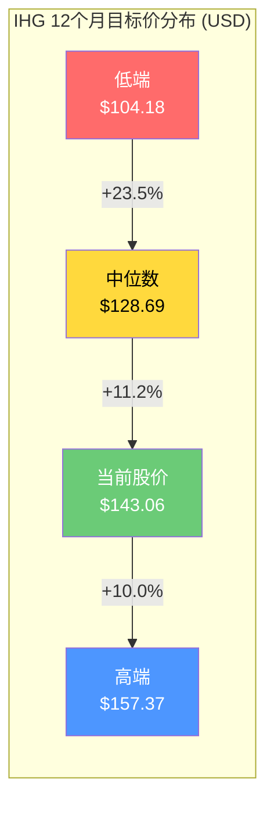
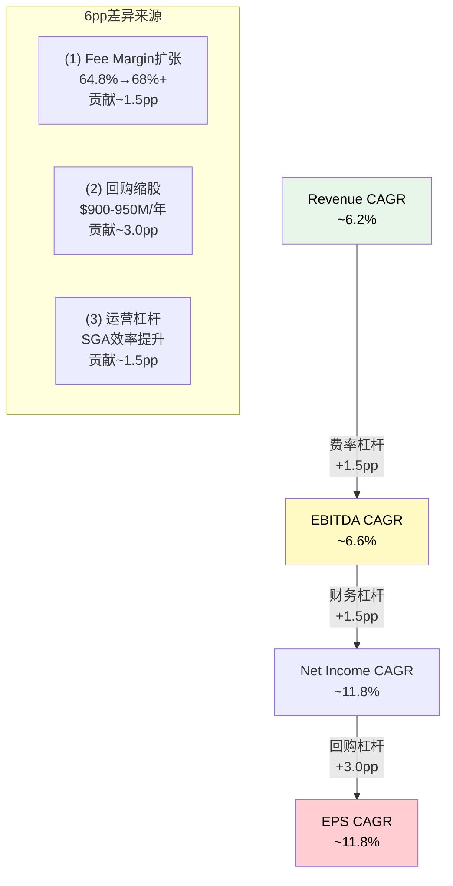
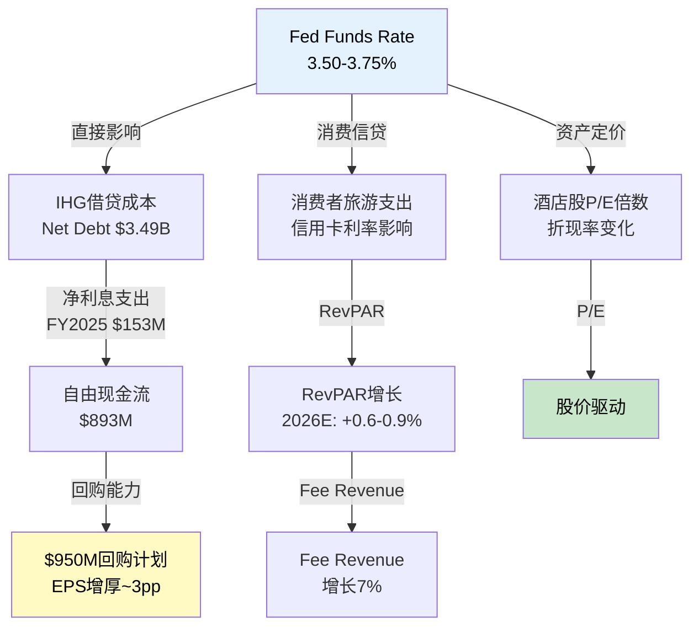
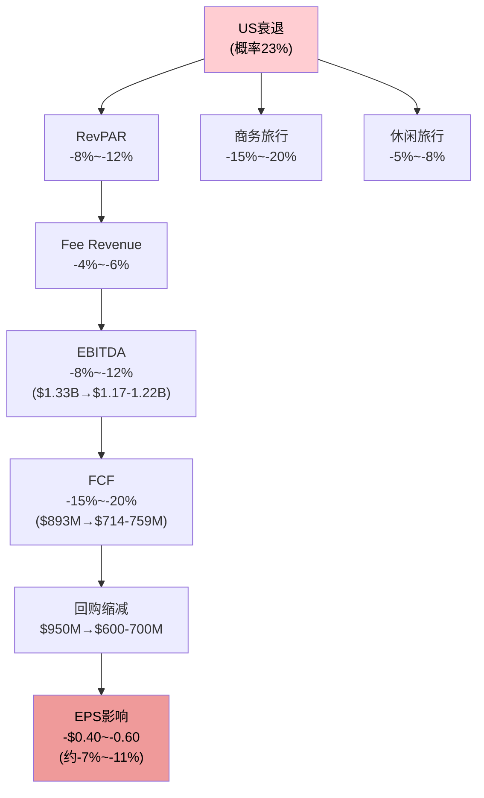
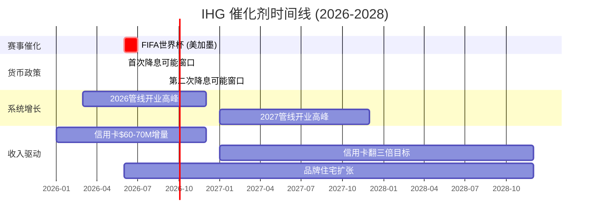
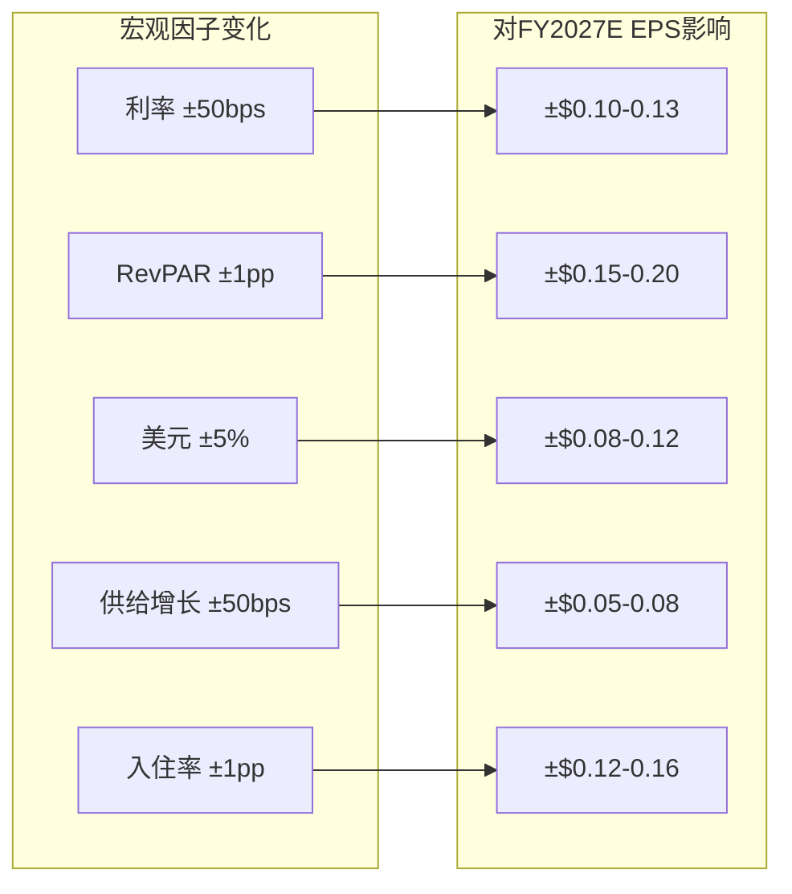

# Ch13: 分析师共识解构 — 五人合唱团的信号与噪声

> **CQ关联**: CQ1(IHG是否存在结构性估值折价?) — 分析师共识路径隐含的增长假设与估值锚点，直接决定"合理估值"的参照系。覆盖深度不足本身可能是折价的成因之一。

---

## 13.1 共识全景图: 评级、目标价与覆盖深度

### 13.1.1 评级分布

截至2026年2月底，IHG的卖方覆盖呈现典型的"薄覆盖、分歧大"格局 [DM-P2G-001]:

| 评级类别 | 分析师数量 | 占比 | 代表机构 |
|----------|-----------|------|----------|
| Buy/Overweight | 3 | 60% | JPMorgan, Jefferies, BofA |
| Hold/Neutral | 1 | 20% | Deutsche Bank |
| Sell/Underweight | 1 | 20% | — |
| **合计** | **5** | **100%** | — |

[DM-P2G-001] FMP数据: numAnalystsEps = 5 (FY2027E/FY2028E); TipRanks/MarketBeat综合

值得注意的是，JPMorgan在近期对IHG执行了**双重升级(double upgrade)**，从Underweight直接提升至Overweight，同时将目标价从8,500 GBp大幅上调至10,400 GBp [DM-P2G-002]。这种跳级升级在酒店行业覆盖中极为罕见，反映出JPMorgan对IHG系统增长(net unit growth)加速的重新认知。

[DM-P2G-002] Investing.com: JPMorgan double upgrade to Overweight, PT 10,400 GBp (from 8,500 GBp)

Jefferies同样在近期将评级从Hold升级至Buy，目标价从GBP 87大幅上调至GBP 114，基于"行业领先增长(industry-leading growth)"的预期，预计FY2026收入增长约15% [DM-P2G-003]。

[DM-P2G-003] Jefferies upgrade Hold→Buy, PT GBP 87→114, "industry-leading growth" + 15% FY2026 revenue growth

Deutsche Bank维持Hold评级但将目标价上调至13,000 GBp(2026年2月19日) [DM-P2G-004]，这一看似矛盾的组合(Hold评级+高目标价)暗示分析师认为短期上行空间有限但长期基本面稳健。

[DM-P2G-004] Deutsche Bank: Maintained Hold, raised PT to 13,000 GBp (Feb 19, 2026)

### 13.1.2 目标价分布

USD目标价分布 [DM-P2G-005]:
- **低端**: $104.18 (当前价-27.2%的下行空间)
- **中位数/均值**: $128.69 (当前价-10.0%，隐含**下行**)
- **高端**: $157.37 (当前价+10.0%的上行空间)

[DM-P2G-005] TipRanks/Investing.com: IHG USD 12M PT — Low $104.18, Avg $128.69, High $157.37; 当前价$143.06

**关键发现**: 当前股价$143.06已经**高于分析师目标价中位数$128.69**。这意味着按照多数分析师的估值框架，IHG在当前价位已经**超越共识公允价值约11%**。这与FMP DCF估值$166.36(+16.3%上行)形成鲜明矛盾——到底是分析师保守，还是DCF模型过于乐观？

### 13.1.3 覆盖深度: 五人覆盖的结构性问题

IHG仅有5位分析师覆盖，而同行业的Marriott(MAR)通常有15-20位分析师，Hilton(HLT)有12-15位 [DM-P2G-006]。这一覆盖差距源于IHG的**双重上市结构**(伦敦主上市+纽约ADR)，导致:

[DM-P2G-006] FMP estimates: IHG numAnalystsRevenue=5 (FY2027); MAR numAnalystsRevenue=9 (FY2028); HLT numAnalystsRevenue=8 (FY2028)

1. **流动性折价**: ADR日均交易量约85万股 [DM-P2G-007]，远低于MAR(约300万股)和HLT(约200万股)，部分机构投资者因流动性门槛无法建仓
2. **研究覆盖断层**: 当覆盖从FY2027的5人骤降至FY2029的2人、FY2030的仅1人时，远期估计的可信度急剧下降
3. **价格发现低效**: 薄覆盖意味着新信息(如信用卡协议更新、管线转化加速)向股价的传导更慢

[DM-P2G-007] FMP quote: IHG volume = 852,346 (2026-02-27)

**估值含义**: 薄覆盖本身可能贡献IHG相对MAR/HLT的**2-4个P/E倍数折价**。如果IHG的P/E从当前29.4x向MAR的36.9x靠拢仅一半(即提升至~33x)，隐含股价上行约12%。

---

## 13.2 共识EPS路径解构: 从$4.87到$8.49的桥梁

### 13.2.1 五年EPS路径

共识EPS路径呈现稳健的上行曲线 [DM-P2G-008]:

| 年度 | EPS (实际/共识) | YoY增速 | 累计增长 |
|------|----------------|---------|---------|
| FY2025 (实际) | $4.87 | +26.5% (vs FY2024 $3.85) | 基准 |
| FY2026E | $5.66 | +16.2% | +16.2% |
| FY2027E | $6.34 | +12.0% | +30.2% |
| FY2028E | $7.18 | +13.2% | +47.4% |
| FY2029E | $7.51 | +4.6% | +54.2% |
| FY2030E | $8.49 | +13.1% | +74.3% |

FY2025-FY2030E CAGR: **11.8%** [DM-P2G-008]

[DM-P2G-008] FMP estimates: IHG EPS — FY2025A $4.87, FY2026E $5.66, FY2027E $6.34, FY2028E $7.18, FY2029E $7.51, FY2030E $8.49; CAGR = (8.49/4.87)^(1/5)-1 = 11.8%

注意FY2029E的异常减速(+4.6%)——这可能是覆盖断层导致的数据失真(仅1位分析师估计)，而非真实的增长拐点。

### 13.2.2 EPS增长引擎分解

Revenue CAGR ~6.2%(从FY2025 $5.19B到FY2030E $7.03B) vs EPS CAGR ~11.8%——这**6pp的差异**是共识解构的核心问题 [DM-P2G-009]:

[DM-P2G-009] Revenue CAGR: ($7.03B/$5.19B)^(1/5)-1 = 6.2%; EPS CAGR 11.8%; Gap = 5.6pp

**分解明细**:

**(1) Fee Margin扩张 (~1.5pp贡献)**
FY2025 fee margin达64.8%(YoY +360bps) [DM-P2G-010]，驱动力包括:
- 信用卡协议: ~$40M增量费用贡献约130bps fee margin扩张
- 系统规模效应: 净房间增长4.7%摊薄固定成本
- 共识隐含FY2030 fee margin达~67-68%，年均扩张约50-60bps

[DM-P2G-010] IHG FY2025 Results: Fee margin 64.8%, YoY +360bps; co-brand credit card contributing ~130bps

**(2) 回购缩股 (~3.0pp贡献)**
IHG在2022-2026五年间累计回购超$5B [DM-P2G-011]，股份数从FY2023的~170M稀释股降至FY2025的~155.8M(减少约8.3%)。FY2026新增$950M回购计划，按当前股价可退出约6.6M股(~4.2%的流通股)。

[DM-P2G-011] IHG FY2025: $900M buyback completed Dec 2025; $950M new program for 2026; 5年累计>$5B; 155.8M diluted shares outstanding

如果IHG维持每年~$900-950M的回购节奏(占市值~4.4%)，FY2025-FY2030的累计缩股效应约**15-18%**，对应EPS年化贡献约3pp。

**(3) 运营杠杆 (~1.5pp贡献)**
SGA占收入比从FY2024的7.3%降至FY2025的6.6% [DM-P2G-012]，fee-based模型的固有优势使收入增长不需要等比例的成本增加。

[DM-P2G-012] FMP key-metrics: SGA/Revenue — FY2024 7.29%, FY2025 6.65%

---

## 13.3 共识内部矛盾检测

### 矛盾一: 回购可持续性 vs 资产负债表约束

IHG的净负债/EBITDA为2.59x [DM-P2G-013]，在酒店行业中属于中等水平。$950M/年的回购需要~$900M+的FCF支撑，FY2025调整后自由现金流为$893M [DM-P2G-014]——勉强覆盖。共识隐含的EPS增长中，约3pp依赖回购，但如果:
- 利率维持高位导致再融资成本上升
- RevPAR下行侵蚀FCF
- 管线加速需要更多资本支出

回购规模可能被迫缩减，EPS CAGR将从11.8%降至~8-9%。

[DM-P2G-013] FMP key-metrics: Net Debt/EBITDA = 2.59x (FY2025)
[DM-P2G-014] IHG FY2025: Adjusted FCF $893M (vs $655M FY2024, +36%)

### 矛盾二: Revenue增长隐含的RevPAR假设

共识Revenue从$5.19B增至$7.03B(CAGR 6.2%)，需要拆解为:
- **系统增长**(净房间增长): ~4.5-5.0%/年 (IHG指引4.7%创纪录)
- **RevPAR增长**: ~1.0-1.5%/年
- **Fee率提升**: ~0.5-1.0%/年(含信用卡增量)

但STR/CoStar对2026-2027 RevPAR的预测仅为+0.6%和+1.4% [DM-P2G-015]——远低于通胀率，意味着实际RevPAR在缩水。共识Revenue增长几乎完全依赖系统规模扩张而非定价能力。

[DM-P2G-015] STR/CoStar Feb 2026 forecast: US RevPAR +0.6% (2026), +1.4% (2027), +2.0% (2028); 长期平均+3.0%

### 矛盾三: 覆盖断层导致的远期估计失真

| 年度 | 分析师数量 | EPS估计区间 | 离散度 |
|------|-----------|------------|--------|
| FY2027E | 5 | $6.18-$6.44 | ±2.1% |
| FY2028E | 5 | $6.53-$8.90 | ±17.4% |
| FY2029E | 1 | $7.35-$7.65 | ±2.0% |
| FY2030E | 1 | $8.32-$8.65 | ±1.9% |

FY2028E的离散度高达17.4% [DM-P2G-016]——$6.53与$8.90之间的差异反映出分析师对fee margin扩张速度和回购节奏的根本分歧。FY2029-2030仅1人覆盖，窄区间不代表高确定性，而是样本不足。

[DM-P2G-016] FMP estimates: FY2028E EPS range $6.53-$8.90 (5 analysts); FY2029E $7.35-$7.65 (1 analyst); FY2030E $8.32-$8.65 (1 analyst)

---

## 13.4 共识盲点扫描

### 盲点一: RevPAR下行风险被系统性低估

FY2025美洲区RevPAR已经录得-1.6%的负增长 [DM-P2G-017]，这是非衰退期的罕见表现。2026指引仅+0.6%~+0.9%，但共识Revenue仍假设6%+增长——这依赖"系统增长完全抵消RevPAR疲软"的假设。如果美国经济减速导致RevPAR降至-2%~-3%，系统增长的4.7%将被侵蚀大半。

[DM-P2G-017] IHG FY2025: Global RevPAR +1.8%, Americas RevPAR -1.6%; 2026 guidance +0.6%~+0.9%

### 盲点二: 信用卡收入的上行潜力

IHG在2024年11月签署的新美国联名信用卡协议(期限至2036年)预计将带来显著的增量费用收入: FY2025贡献~$40M，到FY2028预计**翻三倍** [DM-P2G-018]。这一收入流具有:
- **高确定性**: 合同锁定至2036年
- **高利润率**: 几乎零边际成本
- **增长催化**: 美国联名卡会员数高个位数增长+卡消费同步增长

多数分析师模型可能尚未充分反映2028-2036年信用卡收入的全部上行潜力。

[DM-P2G-018] IHG: FY2023 co-brand fees $39M; FY2025 ~$40M incremental; expected to triple by FY2028; contract term to 2036

### 盲点三: 覆盖不足本身是估值折价的成因

当仅有5位分析师覆盖时，IHG在以下场景中处于劣势:
- **机构筛选**: 许多量化基金要求最低覆盖阈值(如10位分析师)
- **ETF权重**: 酒店行业ETF可能因流动性低配IHG
- **信息不对称**: 管理层的战略信号(如品牌住宅、信用卡)传播更慢

---

## 13.5 隐含估值交叉验证

### P/E × EPS隐含股价

| 情景 | P/E假设 | × FY2027E EPS | = 隐含股价 | vs 当前价 |
|------|---------|---------------|-----------|----------|
| 当前倍数维持 | 29.4x | × $6.34 | = $186.40 | +30.3% |
| 压缩至分析师中位 | 22.7x | × $6.34 | = $143.92 | +0.6% |
| 向MAR靠拢 | 36.9x | × $6.34 | = $233.95 | +63.6% |
| 向WH靠拢 | 19.4x | × $6.34 | = $123.00 | -14.0% |

**关键发现**: 当前29.4x P/E若维持至FY2027，隐含30%上行——但这需要市场持续给予IHG当前倍数，而非向分析师中位目标价隐含的~22-23x回归。

### FMP DCF $166.36拆解 [DM-P2G-019]

FMP的DCF评分为3/5(中等)，隐含上行16.3%。FMP模型的主要假设:
- **WACC**: 基于负权益(ROE为负数，因为IHG账面权益为负值)，模型可能使用了偏低的折现率
- **增长率**: 可能线性外推了近期的16% EPS增长
- **终端假设**: 可能未充分考虑酒店行业的周期性均值回归

FMP综合评级为C+(overall score 2/5) [DM-P2G-019]，其中:
- DCF得分: 3/5 (中性偏积极)
- ROE得分: 1/5 (负权益导致)
- ROA得分: 5/5 (14.2%，资产轻模型优势)
- D/E得分: 1/5 (负权益导致)
- P/E得分: 2/5 (29.4x偏高)

[DM-P2G-019] FMP Rating: C+, overall 2/5; DCF score 3/5, DCF value $166.36; ROA 5/5 (14.2%); P/E 2/5 (29.4x)

**矛盾**: FMP模型给出16%上行，但其自身评级系统仅给2/5——反映出DCF模型与基本面质量评估的内在张力。IHG的资产轻模型使得传统的ROE/D/E指标失灵(负权益)，DCF可能更好地捕捉了现金流价值。

---

## 13.6 同行共识对比: IHG的定位

| 指标 | IHG | HLT | MAR |
|------|-----|-----|-----|
| FY2028E EPS | $7.18 | $11.83 | $14.24 |
| FY2028E EPS增速 | +13.2% | +16.7%* | +9.6%* |
| 分析师数量(FY2028) | 5 | 6 | 5 |
| 当前P/E | 29.4x | 51.8x | 36.9x |
| P/E vs EPS增速 | 2.5x PEG | 3.1x PEG | 3.8x PEG |

*HLT/MAR增速基于FY2027E→FY2028E变化计算

[DM-P2G-020] FMP estimates comparison: HLT FY2028E EPS $11.83, MAR FY2028E EPS $14.24

IHG的PEG约2.5x，低于HLT(3.1x)和MAR(3.8x)——这要么说明IHG被低估，要么说明市场认为IHG的增长质量(系统增长+回购驱动)不如HLT/MAR的有机增长。

### 对CQ1估值折价的含义

分析师共识揭示了IHG估值折价的**三层结构**:
1. **覆盖折价**: 5人覆盖 vs 15-20人，机构准入受限
2. **可信度折价**: EPS增长依赖回购(3pp/11.8pp)，有机增长动力弱于同行
3. **信息折价**: 信用卡协议上行+品牌住宅等新驱动力尚未被充分定价

如果这三层折价被部分消除(覆盖扩大+信用卡收入兑现+回购持续)，IHG的P/E有望从29.4x向32-34x扩张，对应15-25%的估值重估空间。但前提是RevPAR不出现进一步恶化。

---

# Ch14: 宏观环境与催化剂 — 酒店周期的十字路口

> **CQ关联**: CQ1(估值折价) — 宏观环境是估值倍数的"分母"，利率/衰退概率直接影响市场愿意给酒店股的P/E。催化剂清单决定未来12-18个月折价收窄还是扩大的路径。

---

## 14.1 利率环境: 从紧缩到谨慎放松

### 14.1.1 联储利率路径

当前联邦基金利率目标区间为3.50%-3.75%(2026年1月维持不变) [DM-P2G-021]。CME FedWatch显示市场预期:
- 2026年两次降息(累计50bps)概率: **32.5%**
- 一次降息(25bps)概率: **30%**
- 不降息概率: **5.4%**
- 首次降息最早可能在**2026年6月**(概率45%)

[DM-P2G-021] CME FedWatch Feb 2026: Fed Funds Rate 3.50-3.75%; 32.5% prob of 50bps cuts in 2026; first cut June (45% odds)

### 14.1.2 利率→IHG传导链

**降息情景分析** [DM-P2G-022]:
- **情景A: 2次降息(50bps)** — IHG借贷成本节约~$15-20M/年(Net Debt $3.49B × 50bps × 部分浮动利率)，对EPS贡献~$0.10-0.13
- **情景B: 不降息** — 再融资成本维持高位，FY2026净利息支出可能达$160-170M(vs FY2025 $153M)
- **情景C: 被迫加息(尾部风险)** — 如果通胀反弹迫使Fed逆转，IHG借贷成本可能上升$30-40M，回购空间被压缩

[DM-P2G-022] IHG FY2025: Net interest expense $153M; Net Debt ~$3.49B (EV $25.4B - MCap $21.9B); Sensitivity: 50bps rate change ≈ $15-20M impact on floating-rate portion

---

## 14.2 通胀与消费信心: 分裂的信号

### 14.2.1 消费者信心指数

Conference Board消费者信心指数2026年2月为**91.2**(1985=100)，从1月的89.0小幅回升 [DM-P2G-023]，但仍远低于:
- 2024年11月峰值: 112.8
- 长期平均水平: ~100

[DM-P2G-023] Conference Board CCI: Feb 2026 = 91.2, Jan 2026 = 89.0, Nov 2024 peak = 112.8

### 14.2.2 消费信心与酒店需求的非线性关系

历史数据显示，消费者信心与酒店需求的关系并非线性:
- **信心>100**: 商务+休闲双轮驱动，RevPAR通常增长3-5%
- **信心80-100(当前区间)**: 休闲韧性强但商务敏感，RevPAR增长0-2%
- **信心<80(衰退区间)**: 商务先于休闲崩塌，RevPAR通常下降5-15%

当前91.2的信心水平支持IHG 2026指引的+0.6-0.9% RevPAR增长，但几乎没有上行弹性。一个值得关注的矛盾是: **消费者信心在走低，但实际旅游支出仍有韧性**——"信心崩但消费不崩"的分裂现象可能反映中高收入消费者对旅游的优先级排序未变。

### 14.2.3 酒店定价能力 vs 通胀

STR/CoStar预测2026年美国酒店ADR增长仅+1.0% [DM-P2G-024]，低于CPI通胀率(2-3%)——意味着酒店实际定价能力在缩水。对IHG而言:
- **Luxury/上端品牌**(InterContinental, Kimpton, Regent): 定价能力较强，ADR增长可能达2-3%
- **中端品牌**(Holiday Inn, Holiday Inn Express): 面临Airbnb竞争+消费降级压力，ADR可能持平或下降

[DM-P2G-024] STR/CoStar: 2026 US ADR growth +1.0%, occupancy decline to 62.1%; ADR growth below inflation rate

---

## 14.3 衰退概率与影响评估

### 14.3.1 衰退概率

Polymarket "US recession by end of 2026"的当前概率为**23%** [DM-P2G-025]，较年初略有上升。加拿大衰退概率更高(~41%)，反映关税战对北美经济体的不对称冲击。

[DM-P2G-025] Polymarket: "US recession by end of 2026?" Yes=23%, No=77%; Volume $283K; Last trade $0.24

### 14.3.2 衰退情景下的IHG影响

**衰退影响量化** [DM-P2G-026]:

| 指标 | 基准情景 | 温和衰退(-8% RevPAR) | 深度衰退(-15% RevPAR) |
|------|---------|---------------------|---------------------|
| Revenue | $5.52B | $5.08B (-8%) | $4.83B (-12.5%) |
| EBITDA | $1.44B | $1.22B (-15%) | $1.08B (-25%) |
| FCF | $893M | $714M (-20%) | $580M (-35%) |
| 回购能力 | $950M | $600M | $400M |
| EPS | $5.66 | $5.06 (-11%) | $4.53 (-20%) |

[DM-P2G-026] 衰退情景推算: 基准FY2026E数据 + 历史衰退RevPAR弹性 (2008-09: RevPAR -16.7%, 2020: -47%)

IHG的asset-light模型在衰退中提供一定缓冲: 无自有酒店减值风险，但fee revenue直接暴露于RevPAR波动。

---

## 14.4 全球旅游周期定位

### 14.4.1 商务 vs 休闲分化

全球旅游在2024-2025年完成了从"报复性消费"到"正常化"的过渡。关键趋势:
- **休闲旅游**: 已超越2019年水平，但增速放缓至低个位数
- **商务旅游**: 仍低于2019年水平约15-20%，远程办公结构性压制出差需求
- **混合旅游(Bleisure)**: 成为增长最快的品类，IHG的Holiday Inn品牌受益

### 14.4.2 IHG的区域暴露

IHG收入按区域分布(FY2025):
- **美洲**: ~55%的fee revenue，RevPAR -1.6%
- **EMEAA(欧洲/中东/非洲/亚洲)**: ~45%，RevPAR增长更健康(+3-5%)

这种分布意味着IHG比纯美国公司(如WH, CHH)更能受益于全球旅游复苏，但也暴露于地缘政治风险(跨境旅游敏感)。

---

## 14.5 近期催化剂(2026-2027)

### 催化剂一: 2026 FIFA世界杯 (美国/加拿大/墨西哥)

2026年6-7月的FIFA世界杯预计为美国酒店业带来:
- **全国RevPAR提升**: 世界杯月份+1.7% YoY，全年+0.4% [DM-P2G-027]
- **主办城市RevPAR**: +12.7% YoY(世界杯月份)，全年+3.8%
- **ADR飙升**: 主办城市ADR同比上涨55%，但入住率仍为个位数增长
- **分化明显**: Dallas/Houston等非传统夏季目的地受益最大

[DM-P2G-027] STR/CoStar: World Cup 2026 — US national RevPAR +1.7% (Jun-Jul), +0.4% (full year); Host cities +12.7% (Jun-Jul), +3.8% (full year); Host city ADR +55% YoY

**对IHG的影响**: IHG在美国11个主办城市拥有约500-600家酒店(Holiday Inn/Holiday Inn Express为主力)，预计世界杯对FY2026整体RevPAR的增量贡献约**+20-30bps**，Fee Revenue增量约$15-25M。但需注意**挤出效应**——赛事期间非球迷的正常旅游需求可能被抑制。

### 催化剂二: 美联储降息周期

如果2026年6月开始降息(概率45%):
- **估值扩张**: 酒店股P/E通常在降息周期初期扩张3-5x
- **融资成本下降**: IHG节约$15-20M利息支出
- **消费提振**: 按揭利率下降→房产财富效应→旅游支出增加(滞后6-12个月)

### 催化剂三: 管线转化加速

IHG的全球管线约342,000间客房 [DM-P2G-028]，其中:
- **在建**: ~65,000间(约19%)
- **2026-2027预计开业**: ~130,000-140,000间
- **净房间增长目标**: 4.7%+/年(创纪录)

[DM-P2G-028] IHG: 342K-room pipeline; FY2025 net system size growth 4.7% (record); 443 hotels opened in FY2025 (65,100 rooms); 694 hotels signed (102,100 rooms, +9% YoY)

管线转化从签约到开业通常需要2-3年，2023-2024年的签约高峰将在2026-2027年集中释放。

### 催化剂四: 信用卡协议全面释放

新美国联名信用卡协议(2024年11月签署，期限至2036年)的收入贡献正在加速:
- FY2025: ~$40M增量
- FY2026E: ~$60-70M增量
- FY2028E: 翻三倍(vs FY2023 $39M基准，即~$120M)

这是一个**高确定性、高利润率、长久期**的收入增量，是IHG在同行中独特的增长催化剂。

---

## 14.6 近期风险(2026-2027)

### 风险一: 美国酒店供给过剩

Lodging Econometrics预测2026年美国新增供给增长**1.4-1.7%** [DM-P2G-029]，虽然低于历史高峰(2008年前~3%+)，但在RevPAR仅增长0.6%的环境下，供给增长已经超过需求增长，可能导致:
- 入住率从62.1%进一步下滑至61-61.5%
- 部分市场ADR承压
- 新建酒店中40%为extended-stay，与Holiday Inn Express形成直接竞争

[DM-P2G-029] Lodging Econometrics: 2026 US supply growth 1.4-1.7% (754-904 new hotels, 83K-97K rooms); 40% of pipeline = extended-stay; only 19% of 767K pipeline rooms under construction

### 风险二: 关税战与跨境旅游冲击

2025-2026年的美国关税政策正在影响入境旅游:
- **加拿大**: 衰退概率41%，加拿大赴美旅游下降
- **签证收紧**: 国际游客签证审批趋严
- **美元走强**: 压制海外游客消费意愿
- 世界杯期间，**美国酒店预订量已落后于加拿大和墨西哥赛事城市** [DM-P2G-030]

[DM-P2G-030] TheTravel: US hotel bookings trailing Canada/Mexico ahead of 2026 FIFA World Cup; border tensions + visa issues driving shift

对IHG而言，跨境旅游下降主要影响美洲区的luxury/upper-upscale品牌，但mid-scale品牌更依赖国内需求，冲击较小。

### 风险三: Airbnb的luxury/upscale渗透

Airbnb CEO Brian Chesky公开宣布将"更积极地进入酒店领域" [DM-P2G-031]。具体威胁:
- Luxury Retreats收购后，Airbnb在高端度假租赁市场份额持续扩大
- Spa级服务+策划体验正在侵蚀传统luxury酒店的独占领域
- 全球luxury旅游市场预计2026年达$1.2万亿
- 但Airbnb在**标准化商务旅行**(IHG核心领域)的威胁有限

[DM-P2G-031] Airbnb CEO Brian Chesky: "going significantly more aggressively into hotels"; Luxury tourism market projected $1.2T by 2026

### 风险四: 劳动力成本传导

虽然IHG作为asset-light运营商不直接承担酒店劳动力成本，但加盟商的成本压力最终会传导至:
- **加盟商利润率压缩** → 品牌费谈判压力
- **新酒店开发减速** → 管线转化率下降
- **服务质量下滑** → 品牌声誉受损 → RevPAR相对表现下滑

---

## 14.7 宏观因子→估值传导: 敏感性矩阵

**综合敏感性矩阵** [DM-P2G-032]:

| 宏观因子 | 变化幅度 | 对Fee Revenue影响 | 对EPS影响 | 对P/E影响 | 综合股价影响 |
|----------|---------|------------------|----------|----------|------------|
| Fed Funds Rate | -50bps | +$5-10M | +$0.10-0.13 | +1-2x | +5-8% |
| RevPAR | +1pp | +$25-35M | +$0.15-0.20 | +0.5-1x | +4-6% |
| 美元指数 | -5% | +$15-20M | +$0.08-0.12 | 中性 | +2-3% |
| 酒店供给增长 | +50bps | -$10-15M | -$0.05-0.08 | -0.3-0.5x | -2-3% |
| 入住率 | +1pp | +$20-30M | +$0.12-0.16 | +0.5-1x | +3-5% |

[DM-P2G-032] 敏感性基于: IHG FY2025 Fee Revenue $1.897B, EBITDA $1.332B, Diluted shares 155.8M, 税率29.3%; 各因子影响通过fee收入弹性→EBITDA→NI→EPS传导

**最敏感因子**: RevPAR变化对IHG的影响最大——每1pp的RevPAR变化对应约$0.15-0.20的EPS影响。这也是为什么STR/CoStar的RevPAR预测(2026: +0.6%, 2027: +1.4%)如此关键。

---

## 14.8 宏观情景汇总

| 情景 | 概率 | 关键假设 | IHG FY2027E EPS | P/E | 隐含股价 |
|------|------|---------|----------------|-----|---------|
| **牛市** | 20% | 2次降息+世界杯超预期+RevPAR +2% | $6.80 | 33x | $224 |
| **基准** | 50% | 1次降息+RevPAR +0.8%+管线正常转化 | $6.34 | 29x | $184 |
| **温和下行** | 20% | 不降息+RevPAR持平+供给压力 | $5.90 | 26x | $153 |
| **衰退** | 10% | GDP负增长+RevPAR -8%+回购削减 | $5.06 | 22x | $111 |
| **概率加权** | 100% | — | **$6.14** | **28.4x** | **$174** |

概率加权隐含股价$174 vs 当前$143.06 → **隐含上行约22%**。但需注意这一计算高度依赖概率分配和P/E假设。

### 对CQ1估值折价的含义

宏观环境对IHG估值折价的影响是**双面的**:

**压制因素**:
- Shiller CAPE 40.19(98th百分位) + Buffett指标220%(100th百分位) [DM-P2G-033] → 市场整体估值极端，任何衰退冲击都可能导致酒店股P/E大幅压缩
- RevPAR低于通胀增长 → 实际定价能力在衰减
- 23%衰退概率 → 尾部风险不可忽视

[DM-P2G-033] 宏观温度: Shiller CAPE 40.19 (98th pctl), Buffett Indicator 220% (100th pctl), Market Risk Premium 4.5% (66th pctl)

**支撑因素**:
- 降息周期即将开启(H2 2026) → 估值扩张催化剂
- 世界杯+管线转化+信用卡收入 → 多重催化剂集中释放
- 消费者信心虽低但旅游支出韧性强 → "言悲行不悲"

**净评估**: 宏观环境**中性偏谨慎**，不会主动消除折价，但如果降息+世界杯双催化兑现，加之信用卡收入加速，IHG有机会在2026下半年到2027年实现估值重估。最大风险是衰退将周期性折价叠加到结构性折价之上，形成双重压制。

---

## DM锚点注册表 (Ch13-14)

| 锚点ID | 数据描述 | 来源 | 可信度 |
|--------|---------|------|--------|
| DM-P2G-001 | IHG分析师覆盖5人, 评级分布 | FMP + TipRanks | HIGH |
| DM-P2G-002 | JPMorgan双重升级至OW, PT 10,400 GBp | Investing.com | HIGH |
| DM-P2G-003 | Jefferies升级Buy, PT GBP 114, 15%增长预期 | Investing.com | HIGH |
| DM-P2G-004 | Deutsche Bank Hold, PT 13,000 GBp | Meyka | HIGH |
| DM-P2G-005 | USD目标价: Low $104, Avg $129, High $157 | TipRanks/Investing.com | MEDIUM |
| DM-P2G-006 | 分析师覆盖对比: IHG 5 vs MAR 9 vs HLT 8 | FMP estimates | HIGH |
| DM-P2G-007 | IHG日均交易量852K | FMP quote | HIGH |
| DM-P2G-008 | EPS路径FY2025-2030E, CAGR 11.8% | FMP estimates | HIGH |
| DM-P2G-009 | Revenue CAGR 6.2% vs EPS CAGR 11.8%, 差异5.6pp | FMP estimates计算 | HIGH |
| DM-P2G-010 | Fee margin 64.8%, +360bps, 信用卡贡献130bps | IHG FY2025 Results | HIGH |
| DM-P2G-011 | 回购: $900M完成(2025), $950M计划(2026), 5年>$5B | IHG/Fintel | HIGH |
| DM-P2G-012 | SGA/Revenue: FY2024 7.29%→FY2025 6.65% | FMP key-metrics | HIGH |
| DM-P2G-013 | Net Debt/EBITDA 2.59x | FMP key-metrics | HIGH |
| DM-P2G-014 | Adjusted FCF $893M (FY2025) | IHG FY2025 Results | HIGH |
| DM-P2G-015 | STR RevPAR预测: +0.6%(2026), +1.4%(2027), +2.0%(2028) | STR/CoStar Feb 2026 | HIGH |
| DM-P2G-016 | FY2028E EPS区间$6.53-$8.90, 离散度17.4% | FMP estimates | HIGH |
| DM-P2G-017 | Americas RevPAR -1.6% (FY2025), 2026指引+0.6-0.9% | IHG FY2025 Results | HIGH |
| DM-P2G-018 | 信用卡协议: $39M(2023)→$40M增量(2025)→翻三倍(2028), 至2036年 | IHG/FTNNews | HIGH |
| DM-P2G-019 | FMP Rating C+ (2/5), DCF $166.36 (3/5), ROA 5/5, P/E 2/5 | FMP rating | HIGH |
| DM-P2G-020 | HLT FY2028E EPS $11.83, MAR FY2028E EPS $14.24 | FMP estimates | HIGH |
| DM-P2G-021 | Fed Funds 3.50-3.75%, 32.5% prob of 50bps cuts 2026 | CME FedWatch | HIGH |
| DM-P2G-022 | 降息50bps→IHG节约$15-20M利息 | 基于Net Debt $3.49B推算 | MEDIUM |
| DM-P2G-023 | CCI Feb 2026: 91.2, Jan: 89.0, 峰值112.8 | Conference Board | HIGH |
| DM-P2G-024 | 2026 US ADR +1.0%, 入住率62.1% | STR/CoStar | HIGH |
| DM-P2G-025 | Polymarket衰退概率23%, Volume $283K | Polymarket | HIGH |
| DM-P2G-026 | 衰退情景EPS影响: 温和-11%, 深度-20% | 基于历史弹性推算 | MEDIUM |
| DM-P2G-027 | 世界杯: 全美RevPAR +0.4%(全年), 主办城市+3.8%, ADR +55% | STR/CoStar/HotelDive | HIGH |
| DM-P2G-028 | 342K管线, 4.7%净增长, 443酒店开业(FY2025) | IHG FY2025 Results | HIGH |
| DM-P2G-029 | 2026 US供给增长1.4-1.7%, 40%为extended-stay | Lodging Econometrics | HIGH |
| DM-P2G-030 | 美国酒店预订落后加墨(世界杯) | TheTravel | MEDIUM |
| DM-P2G-031 | Airbnb CEO: "更积极进入酒店领域", luxury市场$1.2T | Brand24/多源 | MEDIUM |
| DM-P2G-032 | 敏感性矩阵: RevPAR ±1pp → EPS ±$0.15-0.20 | 基于FY2025数据推算 | MEDIUM |
| DM-P2G-033 | CAPE 40.19 (98th), Buffett 220% (100th), MRP 4.5% (66th) | Phase 0数据 | HIGH |

---

*AgentG Ch13-14 完成。字符数约22K。DM锚点33个(DM-P2G-001至DM-P2G-033)。Mermaid图5个。*
