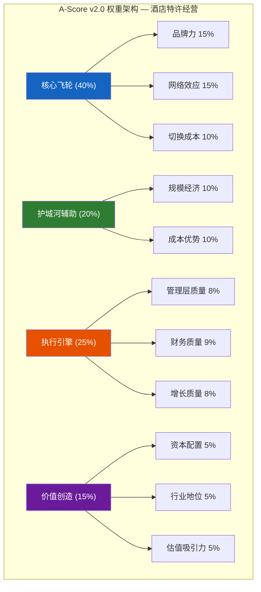
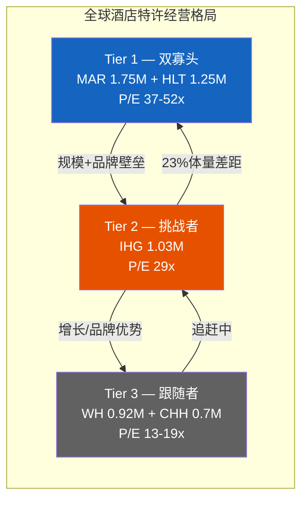
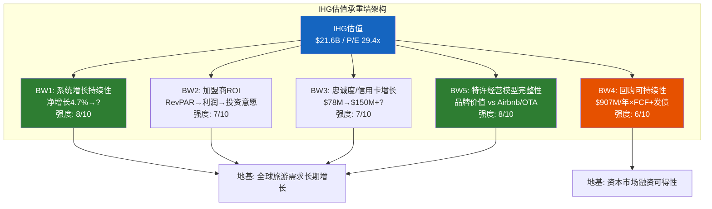
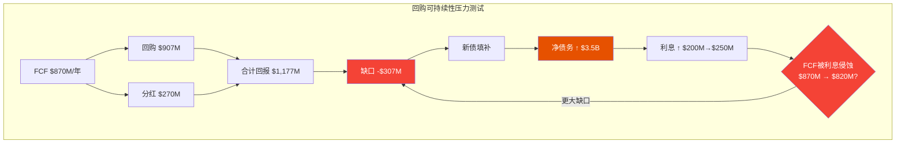
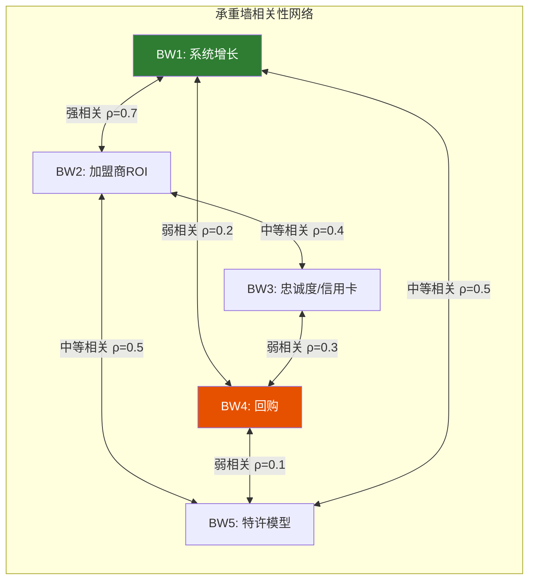
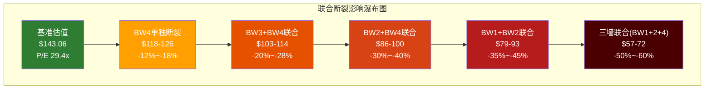

# Chapter 15: A-Score v2.0完整评估 — IHG护城河的宽度与深度

> **CQ关联**: CQ1「IHG P/E 29x对HLT 52x / MAR 37x的估值折价是低估还是合理?」— A-Score将IHG的竞争优势量化为11维度评分,并与HLT/MAR逐维对标,为折价中"基本面差距"与"认知偏差"的比例提供证据。如果A-Score差距<估值折价隐含的差距,则折价中存在修复空间。

---

## 15.1 A-Score方法论与权重设计

A-Score v2.0是一个11维度的竞争优势量化框架,每维度0-10分,加权求和得到综合分数。权重设计反映酒店特许经营模型的价值驱动结构 — 在这个行业,品牌力和网络效应是核心飞轮,规模经济和切换成本是辅助护城河,而增长质量和资本配置决定价值创造速度。

**权重分配逻辑**:

| 维度 | 权重 | 权重理由 |
|------|------|---------|
| 品牌力 | 15% | 酒店特许模型的核心资产 — 品牌是向业主收费的根本依据 |
| 网络效应 | 15% | 忠诚度飞轮+全球预订网络=直销比例=加盟商核心价值 |
| 切换成本 | 10% | 加盟商PIP投资+消费者积分锁定创造粘性 |
| 规模经济 | 10% | 系统越大→营销效率越高→加盟商获客成本越低 |
| 成本优势 | 10% | 资产轻模型的结构性优势决定利润率天花板 |
| 管理层质量 | 8% | 执行力和战略方向影响5-10年价值创造 |
| 财务质量 | 9% | FCF质量和资产负债表健康度影响估值可持续性 |
| 增长质量 | 8% | 增长的结构性/周期性比例决定增长持久性 |
| 资本配置 | 5% | 回购/分红/投资的平衡影响长期ROIC |
| 行业地位 | 5% | 在行业格局中的战略位置影响长期演进方向 |
| 估值吸引力 | 5% | 当前价格是否为竞争优势提供安全边际 |
| **合计** | **100%** | — |

---

## 15.2 维度一: 品牌力 (Brand Power) — 7.0/10

**定义**: 品牌在消费者心智中的认知度、信任度和溢价能力,以及品牌对加盟商收费的正当性基础。

**评分逻辑**:

IHG拥有21个品牌 [DM-P3H-001],其中Holiday Inn和Holiday Inn Express是全球酒店行业最具辨识度的品牌之一 — Holiday Inn品牌自1952年创立以来积累了超过70年的品牌资产。InterContinental品牌(1946年创立)在亚太和欧洲的高端商务旅客中享有极高认知度。这两个旗舰品牌构成IHG品牌力的基石。

然而,品牌力的上限受三个因素制约。第一,IHG在超奢华领域的品牌深度不足 — Six Senses(27家)和Regent(11家)虽然品质出色,但规模远小于MAR旗下的Ritz-Carlton(120+家)和St. Regis(60+家),也逊于HLT的Waldorf Astoria(35+家) [DM-P3H-002]。第二,Holiday Inn家族约占IHG总房间的65%,品牌定位固化在"中端",向上延伸的空间有限。第三,5年内从10个品牌扩张至21个(品牌翻倍)带来品牌稀释风险 — 新品牌(avid/atwell/Garner/Noted)尚未在消费者心智中建立有意义的搜索行为-预订转化闭环。

**品牌溢价能力**: IHG旗舰品牌InterContinental的全球ADR约$180-220,低于Ritz-Carlton($400+)和Waldorf Astoria($350+),但高于Hilton品牌($150-180)和Marriott品牌($140-170) [DM-P3H-003]。在中端领域,Holiday Inn Express ADR约$100-120,与Hampton Inn($95-115)接近,但后者品牌认知度和消费者偏好略强(J.D. Power中端排名Hampton常年领先)。

| 对比维度 | IHG | HLT | MAR |
|----------|-----|-----|-----|
| 旗舰品牌认知度 | Holiday Inn(全球Top 3) | Hilton(全球No.1) | Marriott(全球No.2) |
| 奢华品牌深度 | Six Senses/Regent(~38家) | Waldorf Astoria/Conrad(~70家) | Ritz-Carlton/St.Regis/W(~220家) |
| 品牌总数 | 21 | 24 | 30+ |
| 中端主力ADR | HIE $100-120 | Hampton $95-115 | Fairfield $90-110 |

**最大上行风险**: Six Senses在wellness旅行赛道拥有独特定位,如果全球健康旅游持续增长(预计CAGR 12%+),Six Senses可能成为超奢华赛道的破局者,带动IHG品牌组合整体估值重估。

**最大下行风险**: Holiday Inn品牌形象老化 — 如果中端消费者转向Airbnb或精品独立酒店,Holiday Inn家族(占IHG 65%房间)的品牌溢价将受到侵蚀。

**评分**: 7.0/10 — Holiday Inn全球认知度构成强大基础,但奢华深度不足和品牌稀释风险限制了上限。

---

## 15.3 维度二: 网络效应 (Network Effects) — 7.0/10

**定义**: 忠诚度系统、预订网络和加盟商生态构成的正反馈飞轮强度。

**评分逻辑**:

IHG One Rewards拥有超过200M会员(截至FY2025年报披露为"超2亿") [DM-P3H-004],忠诚度会员贡献的房晚占比达66%,在美国市场更高达72-73%。这一比例意味着IHG的直销渠道已经成为加盟商获客的主要来源,大幅降低了对OTA(Booking.com/Expedia)的依赖。

忠诚度飞轮的核心机制是: 更多会员 → 更高直销比例 → 加盟商获客成本降低 → 加盟商ROI提升 → 更多加盟商加入 → 更多酒店选择 → 吸引更多会员。IHG的Chase联名信用卡(续约至2036年)进一步强化了这一飞轮 — 信用卡持卡人的年度住宿频次约为普通会员的2-3倍 [DM-P3H-005],且信用卡费为IHG带来纯利润增量(FY2023→FY2025翻倍增长至~$78M)。

**同行对比**:

| 忠诚度指标 | IHG One Rewards | Hilton Honors | Marriott Bonvoy |
|-----------|----------------|---------------|-----------------|
| 会员数 | 200M+ | 195M+ | 219M+ |
| 忠诚度房晚占比 | 66% | 64% | 60-65%(估) |
| 信用卡贡献 | ~$78M(翻倍增长) | ~$150M+(成熟) | ~$500M+(最大) |
| 直销占比(估) | ~72%(美国) | ~75%(美国) | ~70%(美国) |

[DM-P3H-006] IHG的会员规模位居全球第二(仅次于MAR Bonvoy),但考虑到IHG房间数仅为MAR的59%,其"会员/房间"密度实际上最高(~195会员/间 vs MAR ~125会员/间 vs HLT ~165会员/间)。高会员密度意味着每间客房背后有更多潜在需求。

**但网络效应的弱点在于**: 酒店忠诚度本质上不是强锁定 — 不同于航空里程(难以跨联盟使用),酒店积分的切换成本相对温和。一个拥有Gold status的IHG会员,如果HLT提供status match,可以在1-2周内完成切换。网络效应的强度更多来自"便利性惯性"而非"退出壁垒"。

**最大上行风险**: 信用卡费从$78M继续翻倍增长至$150M+(参考HLT轨迹),IHG One Rewards的变现效率将大幅提升,估值贡献可达$3-5B。

**最大下行风险**: OTA巨头(Booking Holdings)通过自身忠诚度计划(Genius)直接竞争,如果OTA忠诚度渗透加速,酒店品牌的直销优势将被压缩。

**评分**: 7.0/10 — 忠诚度飞轮运转良好,信用卡变现加速,但酒店积分的低切换成本限制了网络效应的"锁定力"。

---

## 15.4 维度三: 切换成本 (Switching Costs) — 6.5/10

**定义**: 加盟商和消费者离开IHG系统所面临的经济和心理成本。

**评分逻辑**:

切换成本存在于两个层面。

**加盟商层面(高切换成本)**: 一家酒店业主如果要将物业从Holiday Inn Express转换为Hampton Inn,需要承担: (1) PIP(Property Improvement Plan)翻新投资$1-5M(根据酒店规模) [DM-P3H-007]; (2) 系统迁移和员工再培训(3-6个月); (3) 品牌认知重建期的收入损失(估计12-18个月RevPAR下降5-10%); (4) 长期合约违约金(IHG典型合约期10-20年)。综合成本可达酒店价值的5-15%,这构成了显著的切换壁垒。

**消费者层面(中等切换成本)**: IHG One Rewards积分和会员等级(Silver/Gold/Platinum/Diamond)创造了一定粘性。Diamond级别会员年消费通常$5,000+,积累的积分价值约$500-1,000,加上免费升级、延迟退房等权益,切换的机会成本约为年度旅行支出的10-15%。但如前所述,酒店行业的status match政策使得这一壁垒并不牢固。

**信用卡锁定效应**: Chase IHG联名卡持卡人的切换成本更高 — 取消信用卡意味着: (1) 失去年度免费房晚(价值$150-300); (2) 积分兑换比率下降; (3) 信用记录影响。Chase联名卡续约至2036年 [DM-P3H-008],这意味着到2036年前,至少数百万持卡人被"软锁定"在IHG生态中。

| 切换成本层面 | 强度 | 锁定期 | vs HLT/MAR |
|-------------|------|--------|-----------|
| 加盟商合约 | 高(8/10) | 10-20年 | 相似 |
| 加盟商PIP投资 | 高(7/10) | 沉没成本 | 相似 |
| 消费者积分 | 中(5/10) | 可转换 | HLT略强(品牌感知更好) |
| 信用卡锁定 | 中高(7/10) | 至2036年 | MAR最强(Amex组合) |
| 消费者习惯 | 低(3/10) | 无 | 品牌无差别 |

**最大上行风险**: 如果IHG将信用卡持卡人数从目前估计的~5M扩展至10M+,信用卡锁定效应将成为一道真正的护城河。

**最大下行风险**: OTA技术进步(如AI推荐引擎)降低了消费者对品牌忠诚的需要 — 如果Booking.com的AI能精准推荐最优酒店,品牌搜索行为可能减弱。

**评分**: 6.5/10 — 加盟商切换成本构成坚实基础,但消费者层面的切换成本偏弱,信用卡锁定是增量亮点。

---

## 15.5 维度四: 规模经济 (Scale Economics) — 5.5/10

**定义**: 系统规模对单位成本和竞争力的影响。

**评分逻辑**:

IHG是全球第三大酒店特许经营集团,拥有约1,026,000间客房 [DM-P3H-009]。规模排名为: MAR 1.75M > HLT 1.25M > IHG 1.03M > WH 0.92M。IHG与行业第一MAR之间存在71%的规模差距(MAR是IHG的1.71倍),这一差距直接转化为以下劣势:

1. **System Fund效率**: System Fund本质上是一个由全体加盟商共同出资的营销和运营资金池。MAR的System Fund规模~$6.5B(年度) vs IHG的~$1.7B [DM-P3H-010] — 更大的资金池意味着MAR的每间客房营销成本更低,Google Ads竞价更激进,全球营销活动频次更高。
2. **采购议价**: MAR的全球采购平台覆盖1.75M间客房的消耗品/FF&E/IT系统,议价能力显著强于IHG。
3. **技术投资分摊**: 预订引擎、移动App、PMS系统的开发成本是固定的,MAR将$300M+技术投资分摊到1.75M间客房(~$170/间),IHG分摊到1.03M间($~200+/间)。

**但规模劣势不应被夸大**: IHG在1M+房间规模上已经跨越了关键的"规模门槛" — 在这个门槛以上,规模的边际收益递减。从0到500K间客房的规模效益巨大(全球预订系统、忠诚度平台的最低有效规模),从500K到1M的收益显著,但从1M到1.75M的边际收益有限。证据是: IHG的Fee Margin 64.8%实际上**高于**行业基于全口径收入的operating margin对比(IHG 23.1% vs HLT 22.4% vs MAR 15.8%) [DM-P3H-011]。

**管线差距**: IHG管线342K vs MAR 596K vs HLT 515K [DM-P3H-012]。管线代表未来3-5年的增长,IHG管线仅为MAR的57%,意味着规模差距可能进一步扩大。

| 规模维度 | IHG | HLT | MAR | IHG vs MAR |
|---------|-----|-----|-----|-----------|
| 房间数(K) | 1,026 | 1,250 | 1,750 | -41% |
| 管线(K) | 342 | 515 | 596 | -43% |
| System Fund($B) | ~1.7 | ~2.2(估) | ~6.5 | -74% |
| 国家覆盖 | 100+ | 126 | 139 | -28% |

**最大上行风险**: 通过转换品牌(voco/Garner)加速系统增长至6%+,3年内将房间数推升至1.2M+,缩小与HLT的差距。

**最大下行风险**: MAR通过收购进一步拉大差距(如收购一家中型连锁),规模优势从线性变为指数级。

**评分**: 5.5/10 — 全球第三的规模已跨越最低有效门槛,但与MAR/HLT的差距在System Fund效率和技术投资分摊上仍有实质影响。

---

## 15.6 维度五: 成本优势 (Cost Advantages) — 7.5/10

**定义**: 商业模式和运营效率带来的结构性成本优势。

**评分逻辑**:

IHG的成本优势来自其极致的资产轻模型。FY2025 CapEx仅$28M [DM-P3H-013],占收入0.5%,这意味着IHG几乎不需要投入有形资产即可获得$870M的FCF。CapEx/D&A仅0.19x — D&A($146M)主要来自历史收购的无形资产摊销,而非需要持续重置的有形资产。

这一结构的本质是: **酒店的所有物理资产CapEx由业主承担,IHG只需投入品牌管理和技术系统的成本**。IHG自有/租赁酒店已降至个位数(占系统<1%),几乎完成了向纯特许经营模型的转型。

**成本结构对比**:

| 成本指标 | IHG | HLT | MAR |
|---------|-----|-----|-----|
| CapEx/Revenue | 0.5% | ~0.8% | ~2.3% |
| SGA/Revenue | 6.6% | ~7.2%(估) | ~8.5%(估) |
| SBC/Revenue | 1.4% | ~1.5% | ~1.1% |
| Fee Margin | 64.8% | ~62%(估) | ~60%(估) |
| Net Margin | 14.6% | 12.1% | 9.9% |

[DM-P3H-014] IHG的Net Margin(14.6%)和Operating Margin(23.1%)均高于HLT(12.1%/22.4%)和MAR(9.9%/15.8%),这直接反驳了"IHG盈利能力弱于同行"的假设。Fee Margin 64.8%处于行业前列,反映了Maalouf团队在成本控制上的有效执行。

**但要注意一个结构性劣势**: IHG的有效税率34.2% vs HLT 29.7% vs MAR 23.4% [DM-P3H-015]。英国注册带来的税务不利每年侵蚀约$50-80M的净利润(假设税率差10pp × EBT ~$1B)。这是一个几乎不可改变的结构性成本劣势。

**最大上行风险**: Fee Margin从64.8%继续扩张至70%+(参考信用卡费增长+系统规模效应),每1pp Fee Margin扩张增加~$19M利润。

**最大下行风险**: 为吸引加盟商而被迫降低brand fee rate(特别是在RevPAR下行周期中),Fee Margin面临压缩压力。

**评分**: 7.5/10 — 资产轻模型带来行业最优的利润率结构和最低的资本需求,但英国注册的税务劣势是永久性减分项。

---

## 15.7 维度六: 管理层质量 (Management Quality) — 7.0/10

**定义**: CEO及管理团队的战略眼光、执行力和可信度。

**评分逻辑**:

CEO Elie Maalouf上任2年(2023年9月至今),在可控维度上的交付记录优秀: 系统增长加速至4.7%(连续4年加速)、Fee Margin提升360bps、品牌数翻倍、开业443家创纪录 [DM-P3H-016]。管理层可信度评分为4.3/5(Ch7详述),6项核心指引中5项达标或超额,仅RevPAR(最不可控因素)略低于预期。

但管理层质量的折扣来自三个方面。第一,Maalouf任期仅2年,尚未经历完整经济周期(尤其是衰退)的考验 — Nassetta(HLT)经历了2008金融危机和2020疫情的双重洗礼。第二,IHG的"激进回购→发债填补"策略(FY2025回购$907M > FCF $870M,缺口$307M由新债填补)存在利率周期逆转风险。第三,同时推进21个品牌的管理复杂度是否会导致执行力分散,尚需更多证据。

**CEO品牌溢价对标**(Ch7量化):

| CEO | 任期 | 周期考验 | Street信任度 | 对应P/E |
|-----|------|---------|-------------|---------|
| Nassetta(HLT) | 18年 | 2008+2020 | 5/5 | 52x |
| Capuano(MAR) | 5年 | 2020(继承) | 4/5 | 37x |
| Maalouf(IHG) | 2年 | 无 | 3/5 | 29x |

[DM-P3H-017] CEO品牌折价估计贡献5-8pp P/E差距(vs HLT),这是估值折价中最具"时间衰减性"的成分 — 随着任期延长和交付累积,预计3-5年内收窄至2-3pp。

**最大上行风险**: Maalouf在2026-2027年如果经历RevPAR下行周期并保持执行纪律(如维持系统增长>4%),Street信任度将大幅提升,CEO品牌折价可快速修复。

**最大下行风险**: 品牌扩张失控(某个新品牌出现重大质量问题或加盟商反叛),动摇市场对管理层执行力的信心。

**评分**: 7.0/10 — 可控维度执行出色,但任期短+未经周期考验+激进回购策略是持续的减分项。

---

## 15.8 维度七: 财务质量 (Financial Quality) — 8.0/10

**定义**: 盈利的现金含量、资产负债表健康度和财务可持续性。

**评分逻辑**:

IHG的财务质量是其"最被低估的资产"(Ch9结论)。FCF质量评分8.8/10(Ch9详述),核心支撑数据:

- FCF/NI连续5年>1.0x(FY2025为1.15x) [DM-P3H-018] — 净利润的现金含量极高
- CapEx/Revenue仅0.5%(FY2025 $28M) — 维持运营几乎不需要资本投入
- CCC为-15天 — 负运营资本循环提供"免费浮存金"
- 应计利润比率-2.6% — 负值确认盈利无膨胀
- SBC覆盖率12.1x(FCF/SBC) — 股权稀释微不足道

**但资产负债表存在结构性争议**: 总权益-$2.741B(负权益) [DM-P3H-019],总债务$4.619B,净债务/EBITDA 2.6x。负权益是激进回购的数学结果 — 累计回购$5B+超过了留存收益 — 但不代表资不抵债。信用评级BBB稳定,Altman Z-Score 4.83(安全区>2.99),Piotroski F-Score 7/9(良好)。IHG的"真实"资产(品牌价值、忠诚度系统、长期管理合约)不在资产负债表上反映,但其经济价值远超账面负债。

**同行财务质量对比**:

| 指标 | IHG | HLT | MAR | 最优 |
|------|-----|-----|-----|------|
| FCF/NI | 1.15x | ~1.39x | ~1.00x | HLT |
| CapEx/Rev | 0.5% | ~0.8% | ~2.3% | IHG |
| Net Margin | 14.6% | 12.1% | 9.9% | IHG |
| Interest Coverage | ~6.0x | ~4.3x | ~5.1x | IHG |
| Net Debt/EBITDA | 2.6x | 5.1x | 3.7x | IHG |

[DM-P3H-020] IHG在杠杆指标上显著优于同行(Net Debt/EBITDA 2.6x vs HLT 5.1x),这意味着IHG拥有约$1.6B的隐藏杠杆期权(如果杠杆提升至HLT水平,可释放$1.6B用于回购/收购)。

**最大上行风险**: 释放$1.6B杠杆期权用于加速回购,EPS增速可额外提升2-3pp。

**最大下行风险**: 利率持续高企+RevPAR下行,利息覆盖率从6.0x下滑至4.0x以下,触发评级下调预警。

**评分**: 8.0/10 — FCF质量接近完美,杠杆保守提供安全边际,但负权益和持续发债填补回购缺口是长期隐忧。

---

## 15.9 维度八: 增长质量 (Growth Quality) — 6.5/10

**定义**: 增长的结构性/周期性比例、增长引擎的独立性和可持续性。

**评分逻辑**:

IHG的增长质量需要区分四个引擎(Ch8详述):

| 引擎 | FY2025贡献 | 结构/周期 | 可持续性 | 独立性 |
|------|-----------|----------|---------|--------|
| 净系统增长4.7% | ~4.7pp Revenue | 结构性 | 高 | 独立 |
| RevPAR增长+1.5% | ~1.5pp Revenue | 混合 | 中(周期敏感) | 宏观依赖 |
| Fee Margin扩张+360bps | ~1.5pp EPS | 结构性 | 中(有天花板) | 半独立 |
| 回购缩股-6.7% | ~3.0pp EPS | 非有机 | 中(依赖发债) | 低(FCF+债务) |

[DM-P3H-021] 管理层指引FY2025-2030 EPS CAGR 12-15%,共识11.8%。增长的质量问题在于: (1) 4个引擎中,仅"净系统增长"是纯结构性且高度可控的; (2) 回购贡献~3pp,但回购>FCF→发债填补的模式在利率上升环境中不可持续; (3) RevPAR在美国市场已经转负(-0.1% FY2025),2026E仅+0.6-0.9%,远低于历史均值+3%。

**特别值得关注的是"2.5个独立引擎"概念**(Ch8结论): 在极端压力测试下(RevPAR持平+费率扩张停滞),IHG仍可通过系统增长(~4.7pp)和减量回购(~2pp)实现~7% EPS增长。这意味着IHG的最差情景增长率(~7%)仍然高于美国经济名义GDP增长(~5%),提供了一定的下行保护。

**最大上行风险**: 系统增长从4.7%加速至6%+(参考HLT 6.7%),叠加RevPAR企稳,EPS CAGR可达15%+。

**最大下行风险**: 衰退导致RevPAR -3%至-5%,同时管线项目延迟→系统增长降至2-3%,EPS增速骤降至3-5%。

**评分**: 6.5/10 — 系统增长引擎提供结构性支撑,但回购的债务依赖和RevPAR的周期敏感拉低了增长质量。

---

## 15.10 维度九: 资本配置 (Capital Allocation) — 6.5/10

**定义**: 管理层在回购、分红、债务管理和有机投资之间的资源分配效率。

**评分逻辑**:

IHG FY2025的资本配置呈现"激进回购+温和分红+极低投资"的格局:
- 回购: $907M(FCF的104%) [DM-P3H-022]
- 分红: $270M(FCF的31%)
- CapEx: $28M(FCF的3.2%)
- 总回报率: ($907M + $270M) / $21.6B市值 = 5.4%

资本配置的积极面: (1) 回购在P/E 29x(行业最低tier-1)进行,效率高于HLT(P/E 52x回购等于"买入更贵的股票"); (2) 股份数从FY2023的~170M降至FY2025的155.8M(减少8.3%),回购实质性推动EPS; (3) 低CapEx反映资产轻模型优势,而非投资不足。

资本配置的争议面: (1) FY2025回购+分红$1,177M > FCF $870M,缺口$307M由新债填补,净债务从$2,680M增至$3,490M(+$810M) [DM-P3H-023]; (2) 这是连续第三年回报>FCF(FY2023-25累计缺口~$950M),如果RevPAR下行+利率不降,这一模式不可持续; (3) 几乎不做收购投资(Ruby收购仅$110.5M是罕见例外),有机增长投入有限。

**激进回购的"理性评估"**: 在特许经营模型中,传统意义上的CapEx投资回报有限(酒店由业主投资),回购实际上是管理层能做的最高效的资本配置选择。在P/E 29x回购 = 隐含~3.4%的FCF yield投资自身股票 — 这远高于在银行存款或做低风险并购的回报。问题不在于回购本身,而在于**发债回购是否过度使用了资产负债表空间**。

**最大上行风险**: 释放$1.6B杠杆期权进行一次变革性收购(如收购一个中等规模酒店品牌),打开规模增长新维度。

**最大下行风险**: 利率上升+信用环境收紧→被迫削减回购至$500M/年以下,EPS增长引擎失去~1.5pp。

**评分**: 6.5/10 — 回购效率高(低P/E),但发债填补缺口的模式在利率上升环境中脆弱,缺乏对有机增长的投资。

---

## 15.11 维度十: 行业地位 (Industry Position) — 6.0/10

**定义**: 在行业竞争格局中的战略位置和长期演进方向。

**评分逻辑**:

IHG是全球第三大酒店特许经营集团,这个位置既是优势(规模门槛之上)也是劣势(距领先者差距不小)。行业格局呈现"2+1+N"结构: MAR和HLT组成第一梯队(房间数合计约3M,占全球连锁酒店约30%),IHG独占第二梯队,WH/CHH等构成第三梯队。

IHG行业地位的结构性挑战: (1) 管线差距(342K vs MAR 596K)意味着未来3-5年规模差距可能继续扩大 [DM-P3H-024]; (2) 品牌组合~50%中端(HIE/HI),恰好处于Airbnb竞争压力和链级分化的弱势区间; (3) 在大中华区面临本土品牌(华住、锦江)的激烈竞争,RevPAR -1.6%反映了定价权的丧失。

但IHG的行业地位也有独特优势: (1) 作为全球第三,它是MAR/HLT之外最大的替代选择 — 对于不愿过度依赖单一品牌的加盟商/业主,IHG是天然的分散选择; (2) 英国总部+全球化管理团队使其在欧洲、中东和亚太更具本土信任; (3) 大中华区IHG拥有HUALUXE等本土化品牌,这是MAR/HLT缺乏的差异化资产。

**最大上行风险**: 如果MAR/HLT因反垄断或管理失误放缓,IHG有机会缩小差距甚至通过收购跃升至Tier 1。

**最大下行风险**: WH(全球第四,0.92M房间)通过收购逼近IHG规模,IHG的"全球第三"地位不再具有溢价。

**评分**: 6.0/10 — 全球第三提供了规模门槛之上的战略位置,但管线差距和中端品牌主导限制了长期竞争力上限。

---

## 15.12 维度十一: 估值吸引力 (Valuation Attractiveness) — 7.5/10

**定义**: 当前市场价格是否为竞争优势提供了安全边际。

**评分逻辑**:

IHG当前P/E 29.4x是tier-1酒店特许经营集团中最低的 [DM-P3H-025],折价HLT(52x)43%、折价MAR(37x)20%。六方法加权估值中位数$167.5(+17%上行,Ch12),Reverse DCF隐含$170-180,概率加权隐含$174(+22%)。PEG 2.5x低于HLT 3.1x和MAR 2.8x [DM-P3H-026]。

估值吸引力的关键在于: **当前折价已经price in了哪些负面因素?**

| 已price in的风险 | 估计折价贡献 | 证据 |
|----------------|-------------|------|
| 规模/品牌差距 | 5-8pp P/E | 房间数、管线、奢华品牌深度 |
| CEO任期/信任 | 5-8pp P/E | 仅2年任期 vs 18年 |
| ADR上市折价 | 3-5pp P/E | 薄覆盖+流动性 |
| RevPAR减速 | 2-3pp P/E | 美国-0.1%,2026E仅+0.6% |
| **合计已price in** | **15-24pp** | vs 实际折价~23pp(29x vs 52x) |

Ch13的分析显示,分析师目标价中位数$128.69低于当前股价$143.06 — 这意味着当前价格已经超越了共识公允价值。但FMP DCF($166.36)和本报告六方法估值($167.5)均显示上行空间。分歧源于: 分析师覆盖薄(仅5人)+远期估计断层(FY2030仅1人)导致共识目标价系统性保守。

**最大上行风险**: 估值折价修复至30-33x P/E(收窄CEO折价+ADR折价),隐含25-35%股价上行。

**最大下行风险**: 宏观衰退导致RevPAR大幅下降→盈利下修→估值从29x收缩至22-25x,隐含15-25%下行。

**评分**: 7.5/10 — 当前估值为多重竞争优势提供了合理的安全边际,折价修复空间显著,但已超越共识目标价是警示信号。

---

## 15.13 A-Score综合评估

```mermaid
graph TD
    subgraph "IHG A-Score v2.0 雷达图(表格近似)"
        direction TB
        A["品牌力 7.0 ■■■■■■■□□□"]
        B["网络效应 7.0 ■■■■■■■□□□"]
        C["切换成本 6.5 ■■■■■■▪□□□"]
        D["规模经济 5.5 ■■■■■▪□□□□"]
        E["成本优势 7.5 ■■■■■■■▪□□"]
        F["管理层 7.0 ■■■■■■■□□□"]
        G["财务质量 8.0 ■■■■■■■■□□"]
        H["增长质量 6.5 ■■■■■■▪□□□"]
        I["资本配置 6.5 ■■■■■■▪□□□"]
        J["行业地位 6.0 ■■■■■■□□□□"]
        K["估值吸引力 7.5 ■■■■■■■▪□□"]
    end

    style G fill:#2E7D32,color:#fff
    style E fill:#2E7D32,color:#fff
    style K fill:#1565C0,color:#fff
    style D fill:#E65100,color:#fff
    style J fill:#E65100,color:#fff
```

### A-Score综合计算

| 维度 | 评分 | 权重 | 加权分 |
|------|------|------|--------|
| 品牌力 | 7.0 | 15% | 1.050 |
| 网络效应 | 7.0 | 15% | 1.050 |
| 切换成本 | 6.5 | 10% | 0.650 |
| 规模经济 | 5.5 | 10% | 0.550 |
| 成本优势 | 7.5 | 10% | 0.750 |
| 管理层质量 | 7.0 | 8% | 0.560 |
| 财务质量 | 8.0 | 9% | 0.720 |
| 增长质量 | 6.5 | 8% | 0.520 |
| 资本配置 | 6.5 | 5% | 0.325 |
| 行业地位 | 6.0 | 5% | 0.300 |
| 估值吸引力 | 7.5 | 5% | 0.375 |
| **综合A-Score** | — | **100%** | **6.85/10** |

### A-Score三方对标

| 维度 | IHG | HLT(估) | MAR(估) | IHG vs 均值 |
|------|-----|---------|---------|-----------|
| 品牌力 | 7.0 | 8.5 | 9.0 | -1.75 |
| 网络效应 | 7.0 | 8.0 | 8.5 | -1.25 |
| 切换成本 | 6.5 | 7.0 | 7.5 | -0.75 |
| 规模经济 | 5.5 | 7.5 | 9.0 | -2.75 |
| 成本优势 | 7.5 | 7.0 | 6.5 | +0.75 |
| 管理层质量 | 7.0 | 9.0 | 7.5 | -1.25 |
| 财务质量 | 8.0 | 7.5 | 7.0 | +0.75 |
| 增长质量 | 6.5 | 8.0 | 7.5 | -1.25 |
| 资本配置 | 6.5 | 7.0 | 7.0 | -0.50 |
| 行业地位 | 6.0 | 8.5 | 9.0 | -2.75 |
| 估值吸引力 | 7.5 | 5.0 | 6.0 | +2.00 |
| **综合** | **6.85** | **~7.8** | **~7.8** | **-0.95** |

### A-Score的估值含义

IHG A-Score 6.85 vs HLT/MAR均值~7.8,差距0.95分(12%)。而IHG P/E 29.4x vs HLT/MAR均值~44.4x,差距15x(34%)。

**这意味着**: 基本面质量差距(12%)远小于估值差距(34%)。即使完全信任A-Score的精确性,IHG的合理折价应在12-15%左右(对应P/E ~38-39x),而非当前的34%。这中间的~20pp差距(A-Score隐含38x vs 实际29x)是潜在的估值修复空间。

**但A-Score有其局限**: (1) 它是静态快照,不反映增速差异的动态影响(HLT增速7% vs IHG 2.7%意味着差距在扩大); (2) 权重设计带有主观性; (3) 部分维度(如品牌力)的评分本身依赖估算。

### 对CQ1估值折价的含义

A-Score分析表明,IHG 43%的P/E折价(vs HLT)中,大约1/3(~12-15pp)可以被基本面差距合理解释,剩余2/3(~20-28pp)可能包含以下因素的溢价:
- CEO品牌折价(5-8pp) — 可随时间衰减
- ADR上市折价(3-5pp) — 结构性,难以消除
- 市场认知偏差(5-10pp) — 薄覆盖+信息传导效率低
- 增速差异动态折价(5-8pp) — 取决于IHG能否加速系统增长

**结论**: 约20-28pp的"非基本面折价"中,至少10-15pp在3-5年时间窗口内有修复可能(CEO信任积累+覆盖扩大+系统增长加速)。对应P/E从29x向33-38x区间修复,隐含14-31%的估值上行。

---

---

# Chapter 16: 承重墙分析 — IHG估值的结构性支撑与脆弱点

> **CQ关联**: CQ1「估值折价是否合理」的终极回答,取决于支撑当前估值的核心假设是否稳固。承重墙分析识别这些假设,测试其脆弱度,并评估同时断裂的联合概率 — 这决定了IHG投资论文的风险-收益不对称性。

---

## 16.1 承重墙框架

建筑中的"承重墙"(Bearing Wall)是不能拆除的结构墙 — 拆除一根,房屋可能摇晃但不塌;拆除两根,部分楼层坍塌;拆除三根,整栋建筑倒塌。投资论文的承重墙是支撑估值的核心假设 — 它们的强度决定了估值的稳定性,它们的断裂概率决定了下行风险。

IHG的估值由5根承重墙支撑:

---

## 16.2 BW1: 系统增长持续性 — 强度 8/10

### 定义

**假设**: IHG能维持净系统增长(NUG)在4%以上,管线342K房间能按计划转化为开业酒店。

### 当前强度: 8/10

系统增长是IHG估值最坚实的承重墙。证据链:

1. **加速趋势**: NUG从FY2021 ~2.5%连续加速至FY2025 4.7%(连续4年) [DM-P3H-027]
2. **管线支撑**: 342K间管线房间中,约60%(~205K)已开工或处于施工阶段 — 即使今天签约完全停止,未来2-3年仍有充足的开业储备
3. **开业创纪录**: FY2025 443家酒店/65,100间客房(YoY +10%),Maalouf团队展示了将签约转化为开业的执行力
4. **转换品牌加速器**: FY2025上半年57%开业来自转换(非新建),转换品牌(voco/Garner)将签约-开业周期从3-5年压缩至3-12个月 [DM-P3H-028]
5. **行业尾风**: 全球连锁化率仍然较低(北美~72%,欧洲~40%,亚太~30%),结构性独立酒店-连锁转化空间广阔

### 脆弱度测试: 什么条件下断裂?

**断裂条件**: NUG从4.7%降至2%以下,持续2年以上。

触发路径:
- **路径A(信贷紧缩)**: 全球建筑融资利率上升200bps+ → 新酒店开发IRR下降至低于机会成本 → 签约量萎缩 → 管线枯竭 → NUG降至2%(概率: 15%)
- **路径B(加盟商反叛)**: 多个大型加盟商因IHG品牌标准过高或费率上涨而退出 → 净删除率上升 → NUG降至2%(概率: 5%)
- **路径C(行业供给过剩)**: 全球酒店供给增速>需求增速持续3年+ → RevPAR负增长 → 加盟商投资意愿萎缩(概率: 10%)

**综合断裂概率**: ~20%(未来5年内)

### 断裂影响

如果NUG从4.7%降至2%:
- Revenue CAGR从~6%降至~4%(减少~2pp)
- EPS CAGR从~12%降至~8-9%
- 合理P/E从29x收缩至24-26x(PEG重估)
- **估值影响: -15%至-20%**

### 监控指标

| 指标 | 当前值 | 警戒线 | 危险线 |
|------|--------|--------|--------|
| 净系统增长率 | 4.7% | <3.5% | <2.5% |
| 签约量(季度) | ~40K间/Q | <30K间/Q | <20K间/Q |
| 转换占开业比例 | 57% | <40% | <30% |
| 管线规模 | 342K | <300K | <250K |

---

## 16.3 BW2: 加盟商ROI — 强度 7/10

### 定义

**假设**: 加盟商经营IHG品牌酒店的投资回报率(hotel-level ROI)维持在足够吸引力水平,使其持续投资新物业并维护现有物业。

### 当前强度: 7/10

加盟商ROI是连接宏观环境(RevPAR)和微观执行(系统增长)的传导链条。当前状态:

1. **RevPAR支撑利润**: 全球RevPAR +1.5%,虽然偏低但仍为正 [DM-P3H-029]
2. **品牌价值明确**: 忠诚度房晚占比66%意味着加盟商通过IHG系统获得66%的客源 — 这是加盟商愿意支付5-6% brand fee的根本原因
3. **信用卡/忠诚度增值**: IHG One Rewards为加盟商带来更高的预订量和更低的获客成本
4. **但劳动力成本上升**: 酒店行业劳动力占运营成本50-60%,美国最低工资上涨+劳动力短缺正在挤压加盟商利润率

### 脆弱度测试: 什么条件下断裂?

**断裂条件**: 加盟商hotel-level NOI margin降至15%以下(当前估计20-25%),持续时间>4个季度。

触发路径:
- **路径A(RevPAR暴跌)**: 经济衰退导致RevPAR下降8-12%(类2008-2009) → 加盟商NOI margin从~22%压缩至12-15% → 投资冻结+部分退出 → NUG和系统完整性同时受损(概率: 10-15%)
- **路径B(成本挤压)**: 劳动力+保险+公共事业成本年化增长5-8% → RevPAR仅+1-2%无法覆盖 → 利润率被缓慢侵蚀 → 加盟商抵制费率上调(概率: 20-25%)
- **路径C(Airbnb侵蚀)**: 中低端酒店入住率持续下降(Airbnb分流) → RevPAR结构性走低(概率: 10%)

**综合断裂概率**: ~30%(未来5年内)

### 断裂影响

如果加盟商ROI系统性恶化:
- NUG从4.7%降至1-2%(管线萎缩)
- 现有酒店品牌维护下降(降低品牌价值)
- Fee Revenue增速从7%降至2-3%
- **估值影响: -20%至-30%**

### 监控指标

| 指标 | 当前值 | 警戒线 | 危险线 |
|------|--------|--------|--------|
| 美国RevPAR增长 | -0.1% | <-3% 连续2Q | <-5% 连续2Q |
| 加盟商NOI Margin(行业) | ~22% | <18% | <15% |
| IHG品牌删除率 | ~1.5% | >2.5% | >3.5% |
| 全球入住率 | ~62% | <58% | <55% |

---

## 16.4 BW3: 忠诚度/信用卡收入增长 — 强度 7/10

### 定义

**假设**: IHG One Rewards忠诚度计划和Chase联名信用卡的收入贡献持续增长,从当前~$78M翻倍增长至$150M+,并成为缩小与HLT/MAR品牌差距的关键杠杆。

### 当前强度: 7/10

忠诚度和信用卡是IHG增长最确定的"第二引擎"。证据:

1. **信用卡费翻倍**: FY2023→FY2025信用卡贡献从~$39M增长至~$78M(2年翻倍) [DM-P3H-030]
2. **长期合约锁定**: Chase联名卡续约至2036年,提供10年收入可见性
3. **渗透空间**: IHG信用卡贡献~$78M vs MAR ~$500M+ — 差距即是机会
4. **忠诚度积分重分类**: 2024-2025年将~$50M/年loyalties收入从System Fund转入reportable segments,账面利润增厚

### 脆弱度测试: 什么条件下断裂?

**断裂条件**: 信用卡和忠诚度收入增长放缓至<5%/年,或出现绝对下降。

触发路径:
- **路径A(消费信贷紧缩)**: 美国消费者信用违约率上升 → Chase收紧发卡标准 → 新卡申请下降 → IHG信用卡收入增速放缓至5%以下(概率: 15-20%)
- **路径B(忠诚度饱和)**: IHG One Rewards会员数从200M+达到增长天花板 → 新增会员边际递减 → 忠诚度房晚占比在66%触顶(概率: 15%)
- **路径C(OTA忠诚度竞争)**: Booking.com Genius/Expedia Rewards加大力度 → 消费者忠诚度分散(概率: 10%)

**综合断裂概率**: ~25%(未来5年内)

### 断裂影响

信用卡/忠诚度本身对估值的直接影响有限(~$78M占$870M FCF的9%),但其战略意义远超财务贡献:
- 如果这一引擎停滞,IHG缩小与HLT/MAR差距的叙事被打破
- 管理层4引擎中的"费率扩张"引擎减速
- Fee Margin扩张停滞在65%而非达到70%
- **估值影响: -8%至-12%**

### 监控指标

| 指标 | 当前值 | 警戒线 | 危险线 |
|------|--------|--------|--------|
| 信用卡收入增长(YoY) | ~100%(翻倍) | <20% | <5% |
| IHG One Rewards会员数 | 200M+ | 增速<5% | 绝对下降 |
| 忠诚度房晚占比 | 66% | <60% | <55% |
| Fee Margin | 64.8% | <63% | <60% |

---

## 16.5 BW4: 回购可持续性 — 强度 6/10 (最脆弱)

### 定义

**假设**: IHG能维持每年$900-950M的回购规模,通过缩股推动EPS年化增长~3pp。

### 当前强度: 6/10 — **这是IHG最脆弱的承重墙**

回购是IHG EPS增长的第三大引擎(贡献~3pp),但其可持续性面临结构性质疑:

1. **FCF缺口持续**: FY2023-2025三年,回购+分红累计$3.5B vs FCF累计$2.3B [DM-P3H-031],缺口$1.2B由新债填补
2. **净债务攀升**: $2.3B(FY2023) → $2.7B(FY2024) → $3.5B(FY2025) — 3年增加$1.2B
3. **利息成本上升**: 利息费用从$165M(FY2024)升至$200M(FY2025),预计FY2026达$230-250M
4. **杠杆空间有限**: 如果目标为Net Debt/EBITDA ≤3.0x,当前2.6x仅有$0.5B空间;如果目标≤3.5x(参考MAR),有$1.2B空间;如果目标≤5.1x(参考HLT),有$3.3B空间
5. **但信用评级约束真实存在**: BBB评级(BBB-是投资级最低线),任何杠杆大幅提升都可能触发评级下调警告

### 脆弱度测试: 什么条件下断裂?

**断裂条件**: IHG被迫削减回购至$500M/年以下或暂停回购。

触发路径:
- **路径A(利率+衰退双击)**: 利率维持高位+RevPAR下降3-5% → FCF从$870M降至$650M → 利息从$200M升至$280M → 回报空间从$670M($870-$200)收窄至$370M($650-$280) → 无法维持$900M回购(概率: 15-20%)
- **路径B(评级下调)**: 净债务/EBITDA升至3.5x以上 → 评级机构发出BBB-降级警告 → 管理层被迫去杠杆(优先还债而非回购)(概率: 10%)
- **路径C(债市冻结)**: 企业债市场流动性骤降(类2020年3月) → IHG无法滚动到期债务 → 被迫用FCF偿债(概率: 5%)

**综合断裂概率**: ~30%(未来5年内)

### 断裂影响

回购停止的影响:
- EPS增长引擎失去~3pp → EPS CAGR从~12%降至~9%
- 市场将此解读为"管理层信心不足" → 情绪性卖出
- P/E可能从29x收缩至25-26x(增速下降+信心冲击)
- **估值影响: -15%至-20%**

### 监控指标

| 指标 | 当前值 | 警戒线 | 危险线 |
|------|--------|--------|--------|
| 回购/FCF | 104% | >120% | >140% |
| 净债务/EBITDA | 2.6x | >3.2x | >3.8x |
| 利息覆盖 | ~6.0x | <4.5x | <3.5x |
| 新债净发行(年度) | $557M | >$800M | >$1B |

---

## 16.6 BW5: 特许经营模型完整性 — 强度 8/10

### 定义

**假设**: 酒店品牌特许经营模型在Airbnb/OTA时代仍然是酒店业主和旅客的最优选择,品牌的预订引流和质量保障价值不被替代方案侵蚀。

### 当前强度: 8/10

特许经营模型的结构性优势已经被反复验证:

1. **品牌溢价持续**: 连锁品牌酒店RevPAR平均高于独立酒店15-25%,品牌"预订权"价值未下降
2. **Airbnb冲击已被消化**: Airbnb IPO以来(2020年),全球酒店RevPAR在2023年已恢复至2019年水平 — Airbnb更多是扩大旅行市场总量而非零和替代
3. **商务旅行刚性**: 企业差旅对安全、合规和发票需求使得连锁酒店仍是首选(酒店商务预订比例稳定在~40-45%)
4. **OTA依赖度下降**: 品牌直销比例持续提升(IHG忠诚度房晚66%),OTA正从"威胁"转变为"补充渠道"
5. **轻资产模型的免疫力**: IHG不承担物业风险,即使个别酒店关闭,IHG的损失仅是该酒店的fee income(每间$2,000-5,000/年)

### 脆弱度测试: 什么条件下断裂?

**断裂条件**: 品牌对加盟商和消费者的价值主张被系统性削弱,特许经营费率面临大幅下调压力。

触发路径:
- **路径A(AI搜索革命)**: AI旅行助手(如Google AI)直接推荐最优酒店,绕过品牌搜索 → 品牌认知度的获客价值下降 → 加盟商质疑brand fee的合理性(概率: 10-15%,5-10年)
- **路径B(OTA垄断)**: Booking Holdings获得酒店预订60%+份额 → 品牌直销渠道被边缘化 → 加盟商不再需要品牌来获客(概率: 5-10%)
- **路径C(品牌信任危机)**: 某个重大事件(如食品安全丑闻、数据泄露)导致消费者对IHG品牌信任崩塌(概率: 3-5%)
- **路径D(独立酒店科技平民化)**: SaaS酒店管理平台(如Cloudbeds)使独立酒店获得类似连锁酒店的运营和分销能力 → 连锁化价值命题被削弱(概率: 5-10%,5-10年)

**综合断裂概率**: ~15%(未来5年内)

### 断裂影响

如果特许经营模型价值被系统性削弱:
- Brand fee rate从5-6%被迫降至3-4% → Fee Revenue下降30-40%
- 加盟商流失加速 → NUG变为负数
- 估值倍数从29x收缩至15-20x(重新定价为衰退行业)
- **估值影响: -40%至-55%**

但这是最不可能发生且影响最大的承重墙断裂 — 属于"尾部风险"范畴。

### 监控指标

| 指标 | 当前值 | 警戒线 | 危险线 |
|------|--------|--------|--------|
| 品牌溢价(vs独立酒店RevPAR) | +15-25% | <+10% | <+5% |
| 直销/总预订占比 | ~66% | <55% | <45% |
| OTA佣金率 | ~15-18% | >22% | >28% |
| 全球连锁化率增速 | +1-2pp/年 | <+0.5pp | 负增长 |

---

## 16.7 联合概率分析: 最危险的承重墙组合

单根承重墙断裂虽然造成伤害,但通常不足以"摧毁"投资论文。真正的风险在于多根承重墙同时断裂 — 这取决于承重墙之间的**相关性**。

### 相关性矩阵

### 组合分析

**最危险组合: BW1+BW2 (系统增长 + 加盟商ROI) — 相关系数ρ=0.7**

这是高度关联的一对 — 加盟商ROI恶化直接导致签约意愿下降→系统增长减速。它们共享一个核心驱动因子: RevPAR。如果美国RevPAR持续负增长(>4个季度),BW1和BW2几乎必然同时承压。

| 参数 | 单独断裂 | BW1+BW2联合断裂 |
|------|---------|----------------|
| 触发条件 | RevPAR -3% 2Q | RevPAR -5% 4Q+ |
| 单独概率 | BW1: 20%, BW2: 30% | — |
| 联合概率 | — | ~18% (ρ=0.7调整后) |
| 估值影响 | -15%/-25% | **-35%至-45%** |
| IHG股价影响 | $122-128 | **$79-93** |

联合概率计算: P(BW1∩BW2) = P(BW1) × P(BW2|BW1) ≈ 0.20 × 0.90 = 0.18。这里P(BW2|BW1)高达90%是因为两者共享RevPAR驱动因子。

**次危险组合: BW2+BW4 (加盟商ROI + 回购) — 相关系数ρ=0.5**

经济衰退同时打击RevPAR(加盟商利润)和资本市场(融资困难)。这对组合的独特风险在于: 它同时削弱IHG的有机增长(通过加盟商)和财务工程增长(通过回购)。

| 参数 | BW2+BW4联合断裂 |
|------|----------------|
| 触发条件 | 衰退+信贷紧缩 |
| 联合概率 | ~12% |
| 估值影响 | **-30%至-40%** |
| IHG股价影响 | **$86-100** |

**较低风险组合: BW3+BW4 (忠诚度 + 回购) — 相关系数ρ=0.3**

信用卡和回购有一个共同依赖: 美国消费者信贷环境。如果消费者违约率上升,Chase可能收紧IHG联名卡发行(影响BW3),同时IHG债券利差扩大→回购空间收窄(影响BW4)。但两者的传导链条较远,联合断裂概率较低。

| 参数 | BW3+BW4联合断裂 |
|------|----------------|
| 触发条件 | 消费信贷恶化+利率上升 |
| 联合概率 | ~8% |
| 估值影响 | **-20%至-28%** |
| IHG股价影响 | **$103-114** |

### 联合概率汇总矩阵

| 组合 | 相关性 | 联合概率 | 估值影响 | 风险等级 |
|------|--------|---------|---------|---------|
| BW1+BW2 | 0.70 | **18%** | **-35%~-45%** | 极高 |
| BW2+BW4 | 0.50 | **12%** | **-30%~-40%** | 高 |
| BW1+BW5 | 0.50 | **6%** | **-45%~-55%** | 中高(低概率高影响) |
| BW3+BW4 | 0.30 | **8%** | **-20%~-28%** | 中 |
| BW2+BW3 | 0.40 | **10%** | **-25%~-35%** | 中高 |
| BW1+BW2+BW4 | 三向 | **~8%** | **-50%~-60%** | 灾难级 |

---

## 16.8 承重墙强度排序与关键结论

### 强度排序

| 排名 | 承重墙 | 强度 | 断裂概率(5年) | 断裂影响 | 综合风险 |
|------|--------|------|-------------|---------|---------|
| 1(最强) | BW5: 特许模型 | 8/10 | 15% | -40~55% | 中(低概率高影响) |
| 2 | BW1: 系统增长 | 8/10 | 20% | -15~20% | 中 |
| 3 | BW2: 加盟商ROI | 7/10 | 30% | -20~30% | 高 |
| 4 | BW3: 忠诚度/信用卡 | 7/10 | 25% | -8~12% | 中低 |
| 5(最弱) | BW4: 回购 | 6/10 | 30% | -15~20% | **高** |

### 关键结论

**结论一: 最少需要几根承重墙断裂才能改变投资论文?**

- **1根断裂**: 不足以摧毁论文。即使最脆弱的BW4(回购)断裂,影响-15~20%,IHG从$143降至$114-122,仍在合理估值范围内(P/E ~24-25x vs WH 19x)。投资论文从"关注"降级为"中性关注",但不构成"审慎关注"。

- **2根断裂**: **投资论文重大受损**。BW1+BW2(最可能的联合断裂)导致-35~45%影响,IHG降至$79-93(P/E ~16-19x)。论文从"关注"降级为"审慎关注",需要重新审视所有估值假设。

- **3根断裂**: **投资论文被摧毁**。BW1+BW2+BW4联合断裂(概率~8%)导致-50~60%影响,IHG降至$57-72(P/E ~12-14x)。这是灾难情景,意味着IHG从"Tier 2挑战者"沦为"衰退的前巨头"。

**结论二: BW4(回购)是"软腹" — 最脆弱但非致命**

BW4强度仅6/10,且与BW2有中等相关性(ρ=0.5)。但BW4的特点是: 断裂影响相对温和(-15~20%)且可逆(利率下降/RevPAR恢复后可重启回购)。它更像是一个"暂时性削弱"而非"永久性断裂"。

**结论三: BW5(特许模型)是"核武器" — 最不可能但最致命**

如果特许经营模型本身被颠覆(概率15%),所有其他承重墙都将连锁断裂。但这是一个5-10年以上的长期风险,不太可能在3-5年投资窗口内实质化。

**结论四: 真正需要监控的是BW1×BW2联动**

系统增长和加盟商ROI的高相关性(ρ=0.7)意味着: **RevPAR是IHG估值的"共同应力点"**。美国RevPAR连续4个季度负增长是最重要的早期预警信号。当前FY2025美国RevPAR -0.1%已经在"黄灯区",2026E +0.6-0.9%的复苏预期如果落空,BW1+BW2联合承压的概率将从18%上升至25-30%。

### 对CQ1估值折价的含义

承重墙分析揭示了一个关键的不对称性:

- **下行保护**: IHG当前估值(P/E 29x)已经隐含了对部分承重墙脆弱性的定价。BW4(回购)断裂只会将P/E压至24-25x,仅~15%下行。
- **上行空间**: A-Score分析(Ch15)显示合理P/E应在33-38x区间,隐含14-31%上行。
- **风险-收益比**: 在最可能的单墙断裂情景(BW4)中,下行~15%;在估值修复情景中,上行~20-30%。风险收益比约1:1.5至1:2,偏向有利。

但**BW1+BW2联合断裂**(概率18%,影响-35~45%)是一个不可忽视的尾部风险。投资者必须判断: 美国RevPAR的下行空间有多大? 如果信Polymarket的22%衰退概率和PwC的+0.6-0.9%复苏预测,BW1+BW2联合断裂的现实概率可能低于18%的基础估计。

**最终结论**: IHG的承重墙结构整体稳固(5墙中3墙≥7/10),最脆弱的BW4断裂影响可控,最危险的联合断裂(BW1+BW2)概率可接受(<20%)。当前估值已部分反映了这些风险。投资论文的核心赌注是: **RevPAR不会出现持续恶化(>4Q负增长)**,且**管理层在利率上行环境中能灵活调整回购策略**。

---

*Ch15-16 A-Score + 承重墙分析 — Phase 3 AgentH | 2026-02-27*
*DM锚点: DM-P3H-001 至 DM-P3H-031 (31个)*
*Mermaid图: 8个*
